# MAXIMIZE ACCESS - Main Document - July 2026

[Source PDF](PDFs/MAXIMIZE ACCESS - Main Document - July 2026.pdf)

## Investigations of complex materials and their mechanisms using quantum mechanical modeling and data science approaches on ACCESS

PI: Elif Ertekin, Department of Mechanical Science & Engineering, University of Illinois Background [Elif to write] Research Objectives and Questions

### 2.1 Modeling diffusion in Li-Zn-Zr-Cl halospinels as earth-abundant solid electrolytes.

All solid-state batteries (ASSBs) offer a safer, more energy-dense alternative to the conventional lithium-ion battery. To address this need, chloride-based solid-state electrolytes (SSEs) have gained interest for their high ionic conductivity (>10-3 S/cm), but have been limited to Li chemistries containing scarce elements such as Sc and Y1,2 Our collaborators have synthesized Li-Mg/Zn-Zr-Cl based halospinels as more earth-abundant alternatives, and experimentally tuned their conductivities across as many as 5 orders of magnitude (see Figure 1).3,4 This tunability is attributed to the introduction of Li+ vacancies through substitution of Mg/Zn2+ to Zr4+; however, the role of this local cation ordering in ion transport is unclear, limiting understanding of the enhanced conductivity and ASSB potential. a) Spinel + Li2ZrCl6 Ionic Conductivity Figure

1:
Preliminary studies reveal ionic conductivity is uniquely tunable via stoichiometry control. The specific pathways by which this conductivity is heightened can be elucidated by our approach. Prior ACCESS allocations supported our development of defect workflows and characterization of SSEs using first-principles simulations and machine learning interatomic potentials (MLIPs).5,6 This uniquely positions us to bridge the gap between local cation ordering and ion transport by applying our expertise in disordered materials and atomistic simulations to develop ASSB design rules. Specifically, we propose the use of ab initio molecular dynamics (AIMD) and MLIPs to explore the materials between Li2ZnCl4 and Li2ZrCl6 according to the formula Li2-2x

## 3 Zn1-xZr 2x

## 3 Cl4 as done in experiment.4 To capture the effects of cation disorder, we will generate supercells representing this space in

100 unique local Cl environments determined from experimental refinements. The requested allocation will be used to fine-tune the universal MLIP MatterSim on high-fidelity DFT and AIMD data across temperatures, leveraging its strong performance for Li-based SSEs and unique training at non-zero temperatures.7 Benchmark calculations indicate a need of 6,144 SUs (64 cores × 96 hours) per 10ps AIMD training run. Drawing from prior MatterSim studies, we target 150 epochs for fine-tuning for which GPU benchmarks projects 300 GPU hours. While DFT and AIMD accurately describe atomic interactions, their computational cost is prohibitive for long-timescale diffusion simulations. We will use the trained MLIP to efficiently perform MD simulations from 300-1000K, covering practical battery conditions and elevated temperatures that accelerate ion hopping for diffusion coefficient extraction.8,9 Tests suggest 80 GPU hours needed per 2,000,000 step MD run. This proposed work will establish design principles linking local structure, ion transport, and conductivity to accelerate the development of Li/Cl spinels for ASSBs.

Resource Request:
Bridges-2 - Regular Memory
Data Generation Material Configurations: 100

Temperatures/material: 4
SUs/calculation: 6144 Calculations: 400

Sub-Total: 2,457,600 SUs
NCSA DELTA
MLIP Training

Fine-tuning: 150 epochs
GPU hrs/5 epochs: 10
Sub-Total: 300 GPU hours
Long-Timescale MD

Materials: 6 unique chemistries
Temperatures/material: 10
GPU hrs/run: 80
Runs: 60
Sub-Total: 4,800 GPU hours
### 2.2 Defect cluster nucleation and transport in rutile TiO2

[Grace 1/2-3/4 page, one small figure (i)very briefly describe problem and previous work, (ii) describe plans, (iii) add table for time estimate]

<!-- Images extracted from PDF page 1. -->
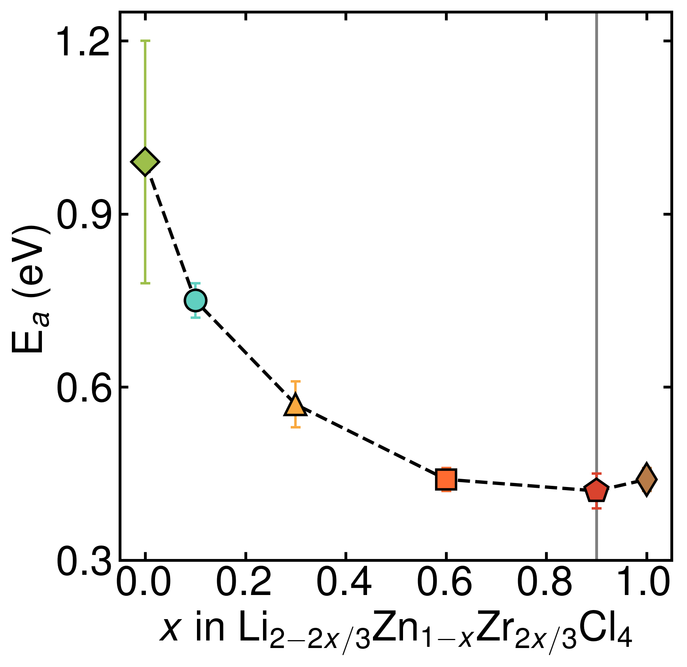
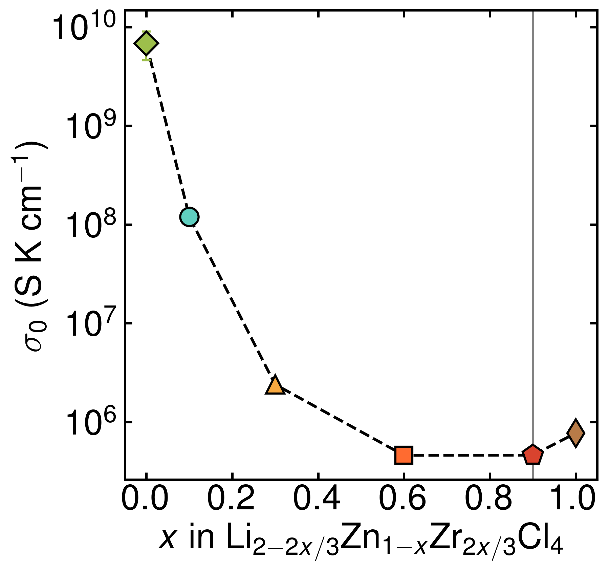
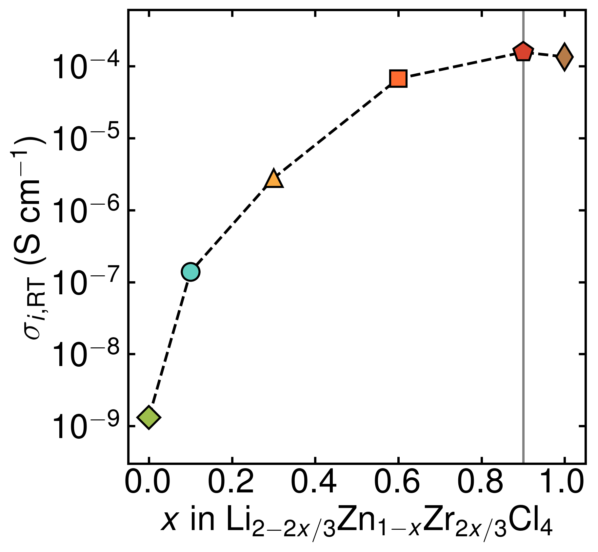

The electronic and optical properties of metal oxide semiconductors are strongly governed by oxygen-related defects. Current and prior work by our group and experimental collaborators demonstrate that, when sufficiently cleaned, material surfaces in binary oxides (e.g., TiO2 and ZnO) can inject both anion and cation species, offering a pathway to room-temperature doping and defect engineering.10-13 From experiments and computations performed under our previous ACCESS allocation, we learned that injected oxygen interstitial (Oi) defects tend to form small clusters with hydrogen that are stable only near room temperature and dissociate as temperature increases.14 To effectively engineer defect profiles using this method, we must develop an understanding of how these clusters nucleate, dissociate, and grow.

Figure 2:
Reaction energy vs. Fermi level for four O-Hn defect clusters, where negative values indicate favorable cluster formation. With our previous ACCESS allocation, we identified a family of small defect clusters expected to exist at room-temperature. We compared the defect formation energies of these clusters with their constituent species, demonstrating many cases of reaction exothermicity under multiple charge states. Proposed future work will (1) calculate cluster formation reaction barriers between constituent species and hydrogen and (2) calculate cluster dissociation reaction barriers. Leveraging our group’s expertise in the density functional theory (DFT) climbing-image nudged elastic band (ci-NEB) method, we will evaluate the reaction energy between Oi and hydrogen species in TiO2 that form the previously identified clusters. We will then compare computed dissociation barriers to experimental progressive annealing measurements. Upon completion, this proposed work will provide a complete understanding of small defect cluster formation and dissociation in rutile TiO2 and lay critical groundwork for realizing post-synthesis, room-temperature defect engineering.

Resource Request:
I. Bridges-2 Regular Memory Geometry relaxations System: TiO2 supercells with Til-OmHn interstitial clusters

Anticipated configurations: 50
Charge states: 12
SUs Per Calculation: 384 SUs
Sub-Total: 170,400 SUs
Barriers System: TiO2 supercells with Om-Hn or Til-OmHn interstitial clusters

Anticipated pathways: 20
Charge states: 12
SUs Per Calculation: 6,144 SUs
Sub-Total: 1,474,560 SUs
### 2.3 Generative discovery of topological 2D materials via constrained symmetry indicators

Figure 3: Proposed workflow for the generation, evaluation, and creation of a library containing both topological and trivial signals from DFT outputs, which will subsequently be used to bias the structure generator, resulting in more Topological materials carry protected, dissipationless edge states robust to disorder, making them promising for low-power and quantum electronics. Topological materials have conducting states confined to their edges or surfaces. These states arise from the topology of the band structure and are resistant to many defects, making these materials attractive for low-power and quantum devices. Two-dimensional (2D) monolayer materials are a great place to look for topological behavior because the relevant electronic effect can be large and can often be changed by external control knobs like chemistry, electric field, stacking, or strain. Despite this, there are few 2D materials that have been empirically confirmed to be both topological and practical/stable enough to use. Identifying new topological 2D monolayers therefore remains a central challenge. Symmetry both determines topological class and provides a controllable generation input; each topological class requires a specific set of symmetries. Using SLayerGen, an in-house, symmetry-aware generative model developed using ACCESS GPU resources, we propose candidate generation via constraining the allowed layer groups and symmetries. Topological materials are revealed through breaking

<!-- Images extracted from PDF page 2. -->
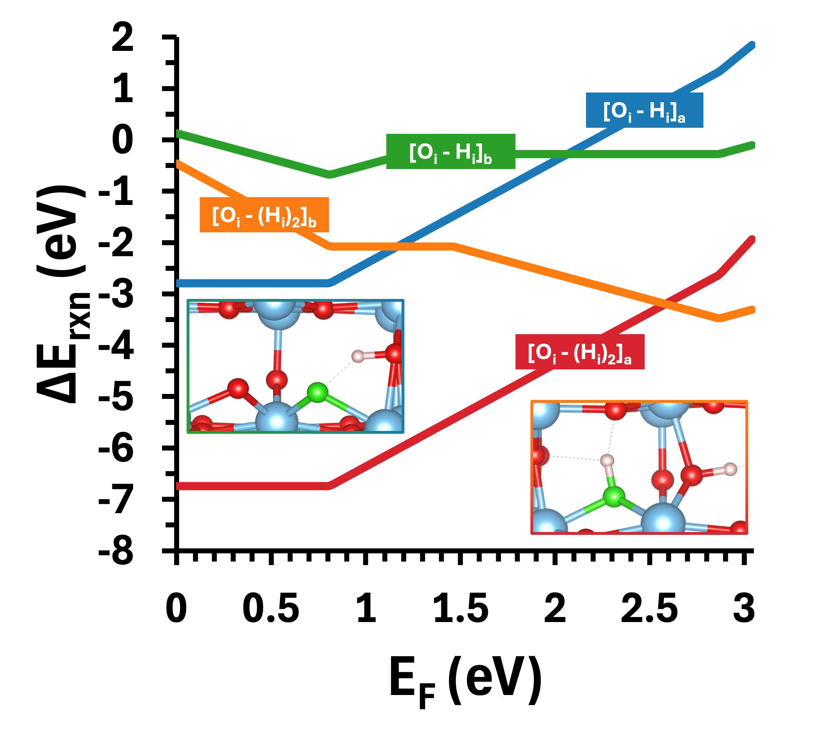
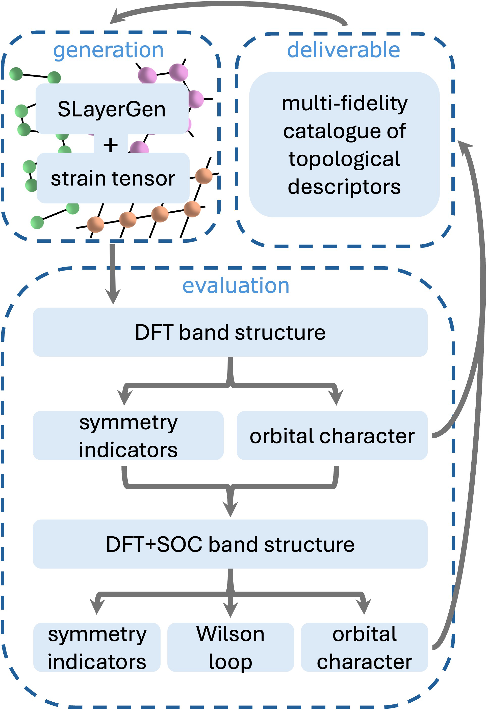

symmetry, which we will induce with strain as the control knob. Requested ACCESS resources will be used in the following proposed workflow: First we will generate materials in all 80 layer groups with Slayergen, applying appropriate constraints for target symmetries. The layer group is identified and a range of possible strain tensors, narrowed to avoid strains related by symmetry operation, are applied. Band structures are created for all configurations using density functional theory (DFT) and the outputs are used as inputs for multiple post-processing steps to identify signals of topology cheaply. These include assessing orbital character mixing and calculating symmetry indicators from the eigenvalues. Candidates signaling topological behavior will be refined by re-calculating their band structures with spin-orbit coupling and noncollinear magnetism enabled. This lends to another screening in addition to orbital character and symmetry indicators: computing the Wilson loop. This tool is capable of eliminating false positive candidates, which are expected at the PBE level of theory. It is at this point that candidate configurations can be assessed as topological or trivial. Regardless of the outcome, the information collected from post-processing the DFT band structure calculations will contribute to biasing the generative model towards generation of 2D topological materials, closing the discovery loop. Ultimately, this work will lead to a scalable, data-driven framework for the discovery of novel 2D topological materials, providing new insights into the structural and electronic motifs that give rise to nontrivial topology while reducing the computational cost of conventional high-throughput searches.

Bridges-2 - Regular Memory
(VASP; SUs/calculation, test cases) NbSe2 (metallic) (1) Relax geometry: 2.59 (2) Single-SCF →CHG/WAVE: 22.86 (3) Non-SCF bands+DOS: 2.23 (4) Single-SCF+SOC →CHG/WAVE: 541.82 (5) Non-SCF bands+DOS, SOC: 41.51 Atom scaling: ×(N/3)2.4

Sub-Total: 611 SU (3-atom)
3,225 SU (6-atom bilayer) 4,031 SU (×1.25 retry) WSe2 (insulator) (1) Relax geometry: 2.59 (2) Single-SCF →CHG/WAVE: 19.94 (3) Non-SCF bands+DOS: 4.20 (4) Single-SCF+SOC →CHG/WAVE: 557.99 (5) Non-SCF bands+DOS, SOC: 33.79 Atom scaling: ×(N/3)2.4

Sub-Total: 618 SU (3-atom)
3,264 SU (6-atom bilayer) 4,081 SU (×1.25 retry)

### 2.4 Lithium Ion Diffusion Through Solid/Liquid Composite Anodes

[Isiah and Tawfiq 1/2-3/4 page, one small figure (i)very briefly describe problem and previous work, (ii) describe plans, (iii) add table for time estimate] Lithium metal anodes are the primary candidates for maximizing the energy density of next-generation solidstate batteries due to their exceptionally high theoretical specific capacity and low electrochemical potential. Yet their practical deployment is limited by poor interfacial stability and nonuniform lithium transport during cycling. Lithium stripping at solid-solid or solid-liquid interfaces often leads to vacancy accumulation, void formation, and contact loss.15,16 This tends to result in increased interfacial resistance and eventual cell failure. Our recent collaborative efforts have demonstrated that introducing a secondary, electrochemically inactive alkali metal phase into lithium can fundamentally alter interfacial behavior. Specifically, dispersed sodium domains dynamically deform and redistribute during cycling, mitigating void formation and maintaining lithium utilization even at low stack pressures.17 Figure 4: a) Formation Energy Ternary Diagram of Li-Na-K composite system. b) Log-Log plot of MSD vs. time for pure Sodium demonstrating the progression toward diffusion. However, achieving a truly robust interface requires a deeper understanding of the phase stability and atomic diffusion pathways within these multi-alkali environments. To bridge the gap between proof-of-concept and high-performance design, it is essential to engineer composites that optimize both mechanical softness and thermodynamic stability. In this regard, potassium (K) emerges as a compelling candidate. Its extreme ductility can enhance the ”self-healing” nature of the interface, while its ability to form unique eutectic phases, such as the Na-K liquid alloy, presents a compelling opportunity to maintain continuous electrochemical contact and facilitate rapid ion transport. This project aims to develop a robust computational framework to elucidate lithium-ion diffusion mechanisms within Li-Na-K multi-alkali composite anodes. Building upon our recent collaborative work, we aim to understand how secondary alkali phases mitigate interfacial failure in solid-state batteries. While preliminary first-principles calculations on the University of Illinois Campus Cluster have provided an initial look at the Li-Na-K ternary formation energy diagram, the current data resolution is insufficient to pinpoint the exact boundaries of the liquid-solid coexistence regions. Utilizing ACCESS resources, we will conduct high-throughput Density Functional Theory (DFT) calculations to refine the Li-Na-K ternary formation energy diagram (Figure 4),

<!-- Images extracted from PDF page 3. -->
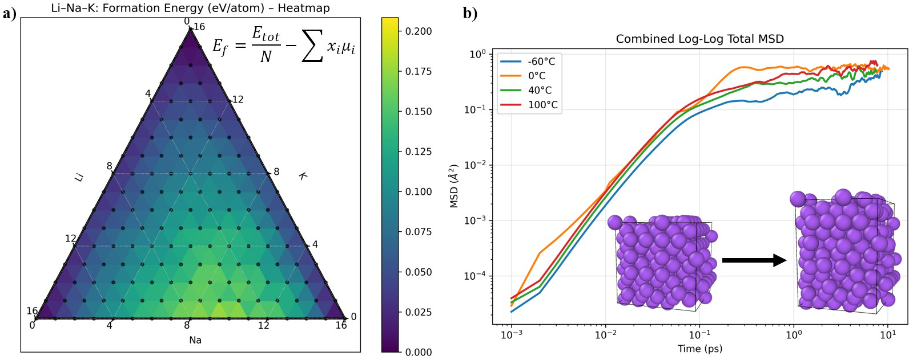

then create a phase diagram to precisely identify liquid-solid coexistence regions and thermodynamic stability trends with. To capture the evolution of these composites, we will perform ab Initio Molecular Dynamics (AIMD) at finite temperatures to quantify how potassium’s ductility and local chemical environments influence lithium mobility and void-mitigating behavior, observed in experiments.17 To overcome the spatio-temporal limitations of DFT, we aim to train machine-learned interatomic potentials (MLIPs) for binary Li-Na and Li-K systems and ternary Li-Na-K system. Training MLIPs on our DFT datasets will enable classical Molecular Dynamics (MD) simulations that reach the microsecond and nanometer scales required to calculate accurate ion transport properties and capture the collective deformation of the alloy. Ultimately, this work will provide a mechanistic understanding of how the multi-alkali phase prevents vacancy accumulation and contact loss, establishing a roadmap for high-performance, low-pressure solid-state batteries.

Resource Request:
Bridges-2 - Regular Memory
Phase diagram Compositions: 50

SUs Per Calculation: 1536 SUs
Sub-Total: 76,800 SUs
AIMD calculations

Materials: Li-Na, Li-K, Li-Na-K systems
Temperature Per Material: 5

SUs Per Calculation: 11424 SUs
Sub-Total: 171,360 SUs
Bridges-2 - GPU
Training MLIPs

Materials: Li-Na, Li-K, Li-Na-K systems
Epochs to fully train a model: 500

GPU hours per 5 epochs: 10
Sub-Total: 3000 GPU hours
Classical MD simulation

Materials: Li-Na, Li-K, Li-Na-K systems
Temperature Per Material: 8

GPU hours Per Calculation: 96 GPU hours
Sub-Total: 2304 GPU hours
Phase diagram: For high resolution phase digram of ternary Li-Na-K composite, we plan to conduct DFT relaxation calculations on 50 relevant compositions to calculate their formation energies. Our initial calculations suggest 24 hours on 64 cores are needed on average for each relaxation calculations. For 50 compositions, the total required SUs amount to 50 × 24 × 64 = 76,800 SUs AIMD Calculations: The ab initio molecular dynamics (AIMD) simulations at five distinct temperatures ranging from 200 K - 600 K requires 15 total calculations (5 temperatures and 3 materials). Our initial calculations on Bridges-2 suggest that 168 hours on 64 cores are needed to complete 10 ps of AIMD simulations. Thus, for 15 AIMD simulations, the total requirement of SUs is 15 × 168 × 64 = 171,360 SUs. Training MLIPs Using the Allegro model,18 we will train the MLIPs using all of our data, employing a 60-20-20 split. Preliminary calculations show that five epochs of training require 10 GPU hours. Training a model with our whole dataset requires 500 epochs on average to reach required accuracy, the total GPU hours needed will be 3 × 10 × 500/5 = 3000 GPU hours. Classical MD simulations After developing MLIPs, we will conduct classical molecular dynamics (MD) simulations of Li-Na-K composite materials over extended spatio-temporal scales. Our preliminary calculations indicate that 96 GPU-hours are required to complete 500 ps of MD simulations. For all classical MD simulations (3 materials × 8 temperatures), the total required SUs will be 2,304 GPU hours. The total resources requested for this project are 76,800 + 171,360 = 248,160 SUs and 3,000 + 2,304 = 5,304

GPU hours.
### 2.5 Fusing symmetry-aware generative modeling and universal machine learned force

fields for crystal structure prediction [fixme] [Rees if we think we’ll want additional Delta time: 1/2-3/4 page, one small figure (i)very briefly describe problem and previous work, (ii) describe plans, (iii) add table for time estimate] Figure 5: Our generative model’s generation rate of crystals which correctly match input compositions from a validation set before (left) and after (right) fine-tuning. Crystal structure prediction (CSP), wherein the atomic structure of a crystal is predicted from its composition, is a longstanding challenge in materials science with broad practical significance for identifying potential stable materials and/or those that match experimental observations like Xray diffraction patterns. Prior works have approached CSP with ab initio random structure search wherein unit cells are randomly sampled and relaxed with density functional theory (DFT).19 More recent works have improved the efficiency of AIRSS by conducting relaxations via universal machine learned interatomic potentials20 (MLIPs) or replacing uniform random sampling with composition-conditional generative modeling.21 Recently, we achieved state of the art performance in de novo generation and CSP for crystalline materials by developing a generative diffusion model that incorporates space group symmetry constraints into the generation process.22 Unfortunately, it has recently been highlighted that common CSP benchmarks ignore polymorphism, leading to catastrophically flawed evaluation metrics being reported in the literature.23 We propose to improve upon prior CSP methods by combining the strengths of both generative modeling and universal MLIPs24 via conditional generation and Feynman-Kac steering which has achieved state-of-the-art results for drug discovery.25 To evaluate our method, we have developed a challenging and realistic CSP benchmark that directly considers polymorphism. We will use the benchmark to conduct an extensive comparison of existing CSP methods to measure current progress in the field. The proposed work will advance the frontier of CSP and inform the field of how to make further progress. We have already extended our space group-constrained model, SGEquiDiff, with the capability of composition-conditioned generation (Figure 5). For the proposed work, we request ACCESS compute credits to (1) train an unconditional generative model, (2) fine-tune it for composition-conditioned generation, and (3) benchmark model performance on the ability to recover known polymorphs of crystal structures using MLIPs and DFT. From previous scaling runs, we determined that each DFT relaxation takes an average of 2408 seconds on one A100 GPU. We will conduct DFT relaxations on 100 compositions for 50 structures per composition for 5 different CSP methods, resulting in 50 × 100 × (2408/602) × 5 = 16, 722 required GPU hours. These DFT calculations will be conducted on a small set of composition spaces for fine-grained analysis of CSP performance. For a more coarsegrained and large-scale evaluation, we will also conduct MLIP relaxations on a set of 20,000 crystals which our model has not seen during training. In agreement with scaling tests from Rhodes et al.26 and Cohen et al.,27 we will conduct 500 relaxation steps per crystal for 5 CSP methods, which will take ∼1/118 seconds per 100 atoms. These relaxations will thus take 20, 000 × 500 × 1/118 × 5 = 120 GPU hours. Finally, we will need to train and fine-tune our generative model, which we have found requires 15 hours per A100 GPU per training or fine-tuning run.

Resource Request:
Bridges-2 - GPU
CSP Training and Evaluation DFT relaxations: 16,720 GPU hours MLIP relaxations: 120 GPU hours Generative model training: 30 GPU hours Total: 16,870 GPU hours

### 2.6 Building Defect Diagrams of Non-dilute SrTi1-xFexO3-x/2+δ perovskite alloys

Non-dilute SrTi1-xFexO3-x/2+δ (STFO) perovskite alloys span a compositional triangle defined by three reference end members: SrTiO3, SrFeO3, and SrFeO2.5. Because of their mixed ionic-electronic conductivity, STFO materials have been widely investigated as oxygen

<!-- Images extracted from PDF page 5. -->
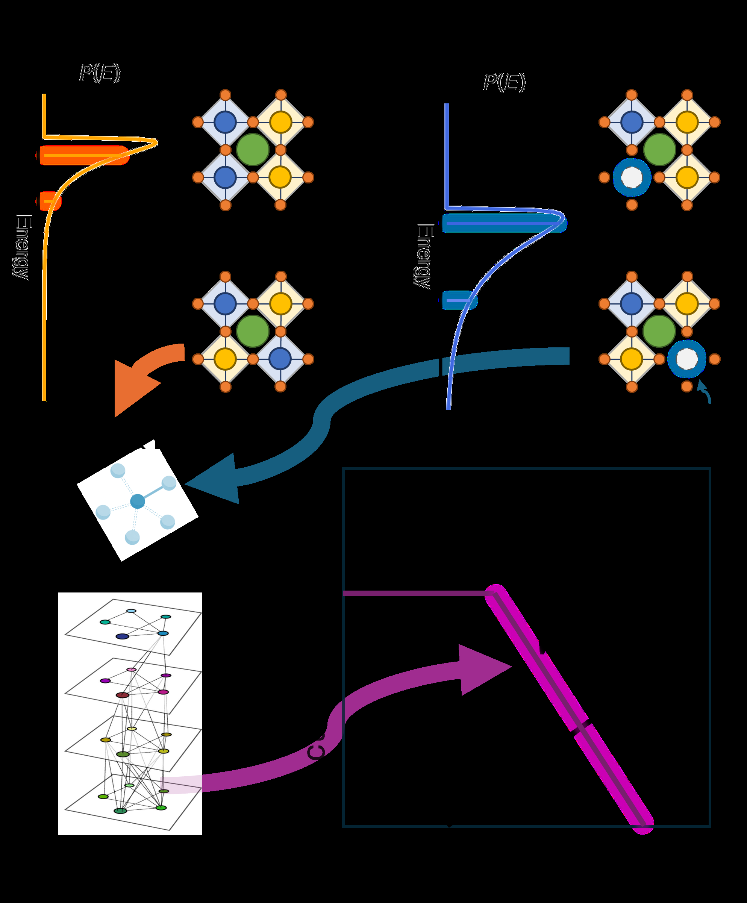
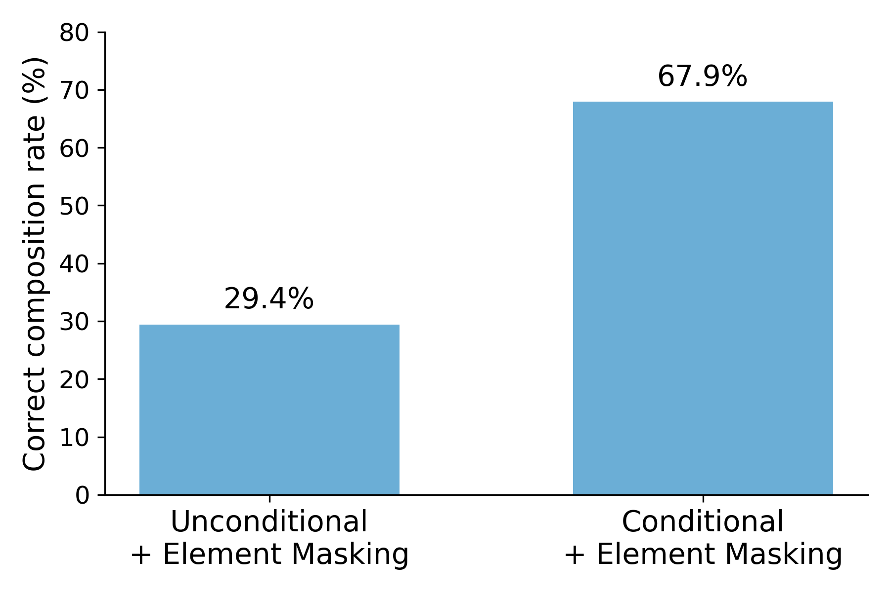

electrodes in solid oxide electrochemical cells.28 Their oxygen stoichiometry can be varied in situ by controlling the temperature and oxygen partial pressure. In addition, the photo-ionic effect provides another means of tuning oxygen stoichiometry with greater spatial localization. Under above-bandgap UV illumination, photogenerated carriers split the electron and hole quasi-Fermi levels, thereby altering defect formation energies and the corresponding defect concentrations.29 Constructing defect diagrams provides a foundation for studying photo-ionic effects. For an end-member compound, the defect formation energy is typically calculated from the energies of a reference state and a defective state. The former is a perfect crystal, whereas the latter is the same crystal containing a designated defect in a specified charge state.30 In a non-dilute alloy, however, the defect formation energy must be determined by comparing the ensemble-averaged free energies of two compositions that differ by the designated defect (Fig. 6).31 This approach requires a free-energy landscape spanning the Sr, Ti, Fe, and O stoichiometries, as well as the relevant charge states. To efficiently explore the vast compositional space, a surrogate model is needed to replace direct DFT calculations. Our previously developed Spin-GNN, a graph neural network that explicitly incorporates Fe spin configurations, shows good predictive accuracy but is limited to variations in Ti, Fe, and O stoichiometry without cation vacancies. We will further train this model using approximately 1000 neutral PBE+U-relaxed configurations containing VSr or VT i/VF e (equivalent B-site vacancies), together with their corresponding charged states. The resulting model, combined with Markov chain Monte Carlo sampling, will construct the required free-energy landscape and identify representative low-energy configurations. HSE band structure analysis will be performed for 16 configurations that span four Ti: Fe ratios (x = 0.25, 0.50, 0.75, and 1.00), two oxygen regimes (δ = 0 and δ > 0), and two vacancy classes (VSr and VTi/VFe); each structure will be relaxed by HSE and evaluated at 18 k-points along the high-symmetry k-path.

Resource Request:
I. Bridges-2 Regular Memory NeutralState Relaxation

System: STFO supercells with VSr or VT i/VF e
Training Structures: 1000

SUs Per Calculation: 512 SUs
Sub-Total: 512,000 SUs
ChargedState Relaxation System: Charged states of STFO with cation vacancies Training Structures: 1000 (initialized from neutral relaxed configurations)

SUs Per Calculation: 256 SUs
Sub-Total: 256,000 SUs
HSE Band Structures System: low-energy STFO configurations with cation vacancies Structures: 16 SUs per Relaxation: 3072 SUs k-points per Structure: 18

SUs Per k-points: 640 SUs
Sub-Total: 233,472 SUs
### 2.7 [Ballal]]

### 2.8 Unraveling the Coupling Between Network Rigidity, Vibrational Dynamics, and

Ion Transport in (AgI)x(AgPO3)1-x Glasses Silver iodide-silver metaphosphate glasses, (AgI)x(AgPO3)1-x, constitute one of the fast-ion-conducting glasses because their ionic transport properties are strongly coupled to the rigidity of the underlying glass network.32 Previous experimental studies have demonstrated three distinct elastic phases: a stressed-rigid regime (x < 9.5%), an intermediate phase (9.5% < x < 37.8%), and a flexible phase (x > 37.8%), where increased network flexibility leads to a

dramatic enhancement of Ag+ conductivity.32,33 Raman and neutron scattering measurements further reveal that the boson peak grows almost linearly with AgI concentration in the flexible regime, suggesting that excess low-frequency vibrational states originate from the emergence of floppy modes associated with elastic softening. Although these experimental observations establish a strong correlation between network mechanics, vibrational dynamics, and ionic transport, the atomistic mechanisms responsible for these coupled phenomena remain poorly understood. Figure 7: Overview of the computational framework linking structure formation to material properties in (AgI)x(AgPO3)1-x glasses. Preliminary results demonstrating the capability of this

framework are shown in (a-d):
a) Representative melt-quenched atomistic configuration of (AgI)50(AgPO3)50; b) Radial distribution function of (AgI)50(AgPO3)50 from simulation (blue) compared with experimental XRD data (red), validating the structural model; c) Compositionand temperature-dependent ionic conductivity, log10(σsystem), for x = 5, 25, and 50%; (d) Boson peak for Ag and I partial contributions. We established reliable classical molecular dynamics models for representative compositions spanning the stressed-rigid, intermediate, and flexible regimes and demonstrated that the calculated diffusion coefficients, activation energies, and ionic conductivities reproduce the experimentally observed composition dependence at AgI concentrations of x = 5, 25, and 50%. The proposed work extends this study into a systematic composition-dependent investigation using AgI concentrations of x = 0, 10, 20, 30, 40, and 60%, providing substantially finer resolution across the rigidity transition. Glass structures will be generated using a consistent melt-quench protocol with a quench rate of 1 K/ps followed by extensive equilibration using LAMMPS. Structural evolution will be characterized through radial, angular distribution functions, static structure factors, together with ring statistics to quantify changes in network topology as the glass evolves from stressed-rigid to flexible regime. Subsequently, 5 ns microcanonical (NVE) molecular dynamics simulations (LAMMPS) will subsequently be performed to generate sufficiently long trajectories for converged velocity autocorrelation functions (VACFs) and vibrational densities of states (VDOS). These calculations will enable accurate characterization of the boson peak and its evolution with composition, allowing direct comparison with experimentally observed boson-peak evolution measured by Raman measurements from our collaborators and establishing the relationship between vibrational-mode softening and structural reorganization. In parallel, mean-squaredisplacement calculations over a wide temperature range will be used to determine diffusion coefficients, activation energies, ionic conductivities. Mechanical properties, including the elastic constants and Young’s modulus, will be computed from molecular dynamics to quantify the progressive elastic softening of the glass network. For selected concentrations we are planning to investigate the coupling between electric-field-induced ion migration and network softening. Finally, density functional theory calculations using VASP on representative small-cell models will be performed to determine dielectric constants and electronic polarization, providing complementary first-principles validation of the experimentally observed evolution of network flexibility and dielectric response. Together, these simulations will provide the first comprehensive atomistic description linking composition, elastic softening, low-frequency vibrational excitations, dielectric response, and fast-ion transport in (AgI)x(AgPO3)1-x glasses. The proposed calculations directly support ongoing experimental efforts within our collaboration and require substantially larger computational resources because of the increased number of compositions, significantly longer production trajectories required for converged vibrational spectra, and complementary first-principles calculations.

Resource Request:
<!-- Images extracted from PDF page 7. -->
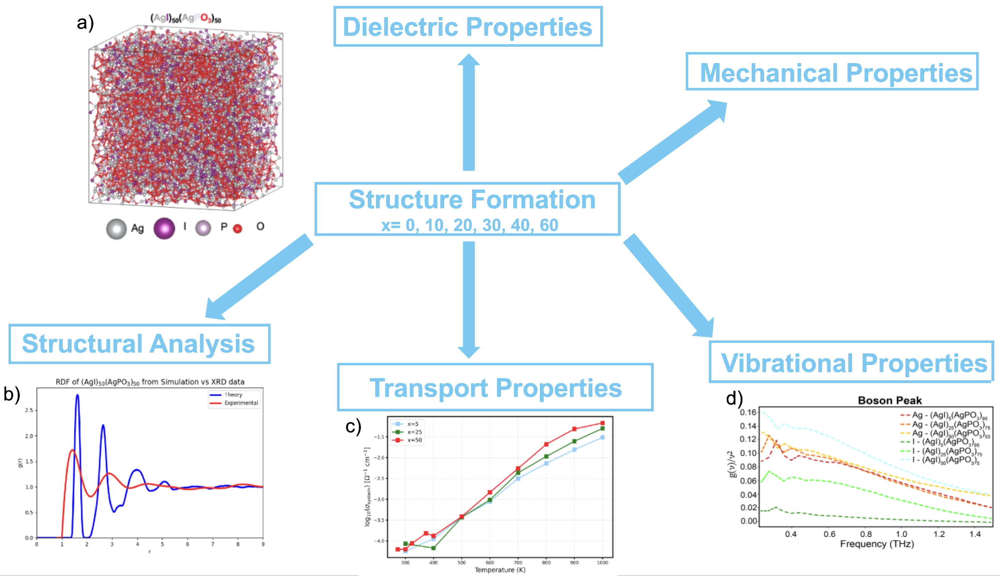

I. Bridges-2 Regular Memory Glass Structure Generation Systems: 7 compositions, two cell sizes (896 and 7168 atoms) Configurations: 14 independent glass models SUs per Calculation: 6,144 SUs

Sub-Total: 86,016 SUs
Transport Simulations Systems: 14 glass structures over 12 temperatures Production Time: 20 ns per temperature SUs per Calculation: 6,144 SUs

Sub-Total: 1,032,192 SUs
Vibrational Simulations Systems: 14 equilibrated structures Production Time: 5 ns NVE simulations SUs per Calculation: 12,288 SUs

Sub-Total: 172,032 SUs
Mechanical Properties Systems: Elastic tensor calculations for all compositions Configurations: 7 SUs per Calculation: 8,192 SUs

Sub-Total: 57,344 SUs
Dielectric Calculations Systems: Representative small-cell glass models Structures: 7 SUs per Relaxation: 61,440 SUs Dielectric Tensor Calculations

Sub-Total: 430,080 SUs
Total Regular Memory Request: 1,777,664 SUs II. Bridges-2 Extreme Memory Vibrational Analysis System: 7 compositions, each system contains 7168-atoms Analysis: VACF, VDOS, Participation Ratio, and Boson peak

SUs Per Calculation: 147,456 SUs
Sub-Total: 7 systems × 147,456 = 1,032,192 SUs Total Extreme Memory Request: 1,032,192 SUs

### 2.9 [Jaejun]]

### 2.10 [Grady]]

## 3 Usage Plan and Justification

[Elif to Write]

## 4 Resource Appropriateness

[Elif to write]

## 5 Access to Other Resources and Why Other Resources are Not Appropriate

[Elif to write]

## Old Content After This Page

## 6 Project Abstract

We propose to use ACCESS resources to conduct cross-cutting research at the intersection of computational materials sciences and data science. Activities that we will undertake include: (i) high throughput computational discovery and design of thermoelectric materials (both stoichiometric and alloyed compositions), (ii) identification of enhanced ion transport mechanisms to establish design rules for solid electrolytes, using first-principle calculations and machine learning (ML) approaches, (iii) uncertainty quantification and development of data selection approaches for machine learned interatomic potentials (MLIPs), (iv) high-throughput calculations for designing defect structures to enhance material properties, (v) development of neural network models for materials discovery and synthesis approaches to achieve desired functionality, and (vi) large scale molecular dynamics simulations to identify the effect of disorder in amorphous materials. The work we propose would not be possible without ACCESS CPU and GPU resources, which will allow us to carry out simulations of historically prohibitively large scale systems e.g. generation of a dataset containing tight-binding (TB) parameters for 1,022 electronic structures, stability calculations for ∼5,000 generated crystal structures and ∼3,000 generated alloys, dynamics of 1,944 metallic glasses as well as demonstrate new machine learning and/or deep learning approaches that are naturally centered in the materials domain e.g. intelligent data selection approaches for training MLIPs, neural network approaches for material design and discovery.

## 7 Project Overview

Continued progress in materials design and discovery hinges on demonstrating robust and rapid approaches to predicting key material properties on a computer. In the last ∼10 years, there has been an enormous evolution and advancement in the capabilities of predictive first-principles modeling of materials.34-39 The growing desire for tight integration between computation and experiment and computation-guided design and discovery of

Figure 8:
Two-dimensional projection of the 200,000 currently known inorganic crystalline materials. After Ref.40 materials is shared by computational and experimental researchers alike. For example, the chart in Figure 8 is a map of the approximately 200,000 inorganic crystalline materials contained in the ICSD, the Inorganic Crystal Structure Database.41 Most of the materials on the chart cannot be seen at all because they are shown in white, while a small selection are visible in black. This map shows the currently known 200,000 inorganic crystalline materials projected onto a two-dimensional space. It is made in such a way that materials that are more similar to each other (based on the elements present, their atomic masses, their electronegativities, the atomic density, and other features), appear physically closer to each other on the map, while the more different they are, the further apart they appear. The reason that we can look for structure and patterns using charts like ultimately is quantum mechanics. From quantum mechanics, we know that the functional properties of a material are governed by the material’s atomic scale structure, i.e. quantum mechanics tells us that form is linked to function. For example, the reason for the coexistence of transparency and conductivity in transparent conductors, or for the coexistence of electrical conductivity and thermal insulation in thermoelectrics, are all understood in theory. Predicting form from function. The quantum mechanical governing equations are most typically formulated as a forward problem: it is possible to go from structure to function, especially when the materials under consideration are known. The challenge that we have in computational materials science is that usually we are interested in the reverse problem: the functionality that we’re looking for is often known, but the specific materials that host that functionality are generally unknown and difficult to identify. Not surprisingly, most materials of relevance to technology were discovered by intuition-guided trial and error or luck (light bulb filaments, teflon, oxide superconductors, and transparent conductors). Adding to the challenge, while there are currently 200000 known, categorized inorganic crystalline materials, if we consider all known crystal structures and imagine distributing elements from the periodic table into those structures, it is estimated that there are around 1012 possible (hypothetical) materials.42 There is a large, unexplored configuration space to search. The discovery of materials with targetted functionality using computation-guided experiments is a long-standing challenge and the desire for methods that efficiently navigate the search space and identify new materials with high fidelity is shared by both computational and experimental researchers alike. As shown in Figure 9, we are starting to see in the last 5-10 years the emergence of new approaches to navigate the materials search space. These approaches include highthroughput simulations, in which we start with a large set of candidate materials that we think suit a certain need, and then we combine thermodynamic and electronic-structure simulations to

<!-- Images extracted from PDF page 11. -->
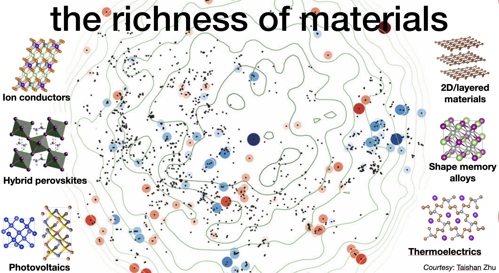
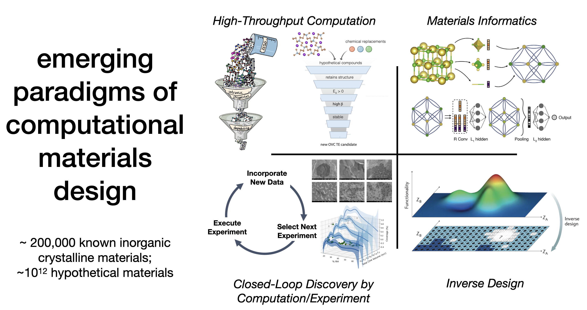

filter the candidates and select the best one.44,45 Materials informatics refers to the application of machine learning, deep learning, or artificial intelligence to explore how the properties of materials relate to their structure, and has been growing in sophistication in the last five years.46,47 Closed-loop discovery via computation/experiment refers to a set of approaches where we try to find an optimal solution - a material or a process -in as few search steps as possible and we do this using statistical methods to help efficiently navigate the search space. Lastly there is the nascent idea of direct inverse design, in which target functions are used as input to predict the material structure that best exhibits them. Introduction to Ertekin Research Group at U. Illinois. Our group focuses on computation and theory to understand materials - including the reasons underlying their functional properties, how to synthesize them, and then how to use this understanding to design and discover materials that show targetted properties and behavior. Our background lies mainly in computational materials science, principally focused on quantum mechanical modeling using first-principles methods. In recent years we have also been growing into the emerging area of data-driven materials science that seeks to use apply methods from machine learning/deep learning to the materials space. Target Problems Our proposal aims towards several examples of the emerging approaches described above. In the following, we describe the specific target problems for which we are requesting resources via ACCESS for the current allocation period. While Section 3 describes the problems and the goals of our modeling approach, specific resource requests for each topic are correspondingly delineated in Section 4.

### 8.1 Understanding Band Structures and Optimal Dopant Suggestions for Thermoelectric Materials

A thermoelectric (TE) is a semiconductor that responds to a temperature gradient by creating electrical current; therefore these materials have the potential for large scale conversion of waste heat to electricity. Half-Heuslers have proven to be a promising chemical space for such materials,48,49 but the experimental realization of new chemistries has been inhibited by the unique set of interdependent properties required for high TE performance as well as the ΔHD,q donor Eg acceptor ΔHD,q native defects εF eq dopant εF eq (b) εF 1018 1019 1020 1021 zT carrier concentration (cm-3) (a) (c)

Figure 10:
Controlling carrier concentration through doping is critical to realizing a material’s functionality. (a) A successful TE material must be doped to the optimal carrier concentrations for best performance. (b,c) The tunability of carrier concentrations in a semiconductor can be assessed by defect formation energies (∆HD,q). vastness of possible Half-Heusler structures. Employing a quality factor50 and semi-empirical models for electron50 and thermal51 transport, we utilized our previous ACCESS allocations to run a modified computational framework52 to efficiently identify promising TE materials. This workflow resulted in the identification of 93 stable Half-Heusler chemistries - 38 of which had not been previously reported. The analysis completed in this workflow also yields design rules across chemical space for accelerated materials discovery. To continue to identify such design rules, we propose the use of a tight-binding (TB) model to characterize the 1,022 electronic structures calculated in the previous workflow. Such characterization could identify features in band structure that consistently correspond to high-performing TE materials, and could further suggest optimal dopants for Half-Heusler systems.53 Here, a “dopant” or doping refers to the intentional introduction of point defects to achieve high carrier concentrations and electrical conductivity. A successful TE material can be doped to optimal carrier concentrations for best TE performance, as shown in (Fig 10a). An efficient dopant will have lower formation energies than native defects and pin the Fermi energy closer to the corresponding band edge position (Fig 10b, c). For a material to be dopable, the intrinsic defects must allow the Fermi energy (εF ) to shift close to the desired band edge. As shown in Fig. 10, these concepts naturally emerge from the formation energetics of point defects:54,55 ∆HD,q = ED,q -EH + P i ni µi + q εF where ∆HD,q represents the energy to form defect D in charge state q, ED,q and EH are the total energies of the system with and without the defect, respectively, the set {µi} are the chemical potentials of the elements, i, and

εF describes the reservoir of charge. As shown in our previous works, evaluating each of these quantities comes with extremely high computationally costly. Therefore it would be of great value to be able to understand, from computationally inexpensive band structures, both the site and atom with which doping a system leads to the greatest gain in thermoelectric performance. The orbital specific nature of TB models, in combination with the large dataset across an expansive variety of chemistries that has been generated throughout our previous high-throughput workflows, puts us in a unique position to be able to successfully design and evaluate such predictions.

### 8.2 Photo-ionic Effects in SrTiO3 Alloys:

Efficient Prediction of Defect Formation Energies Using DFTB Perovskite oxides, with the general formula ABO3, are highly attractive for mixed ionic-electronic conductors (MIECs) due to their compositional versatility and ability to accommodate various atomic species on both A and B sublattices, resulting in a wide range of intriguing properties.56 SrTiO3 (STO) and its Fe-substituted variant, Sr(Ti1-xFex)O3-x/2+δ (STF), demonstrates high ionic conductivity and catalytic activity, making it suitable for applications in solid oxide fuel/electrolysis cells and permeation membranes.57 Our recent research has uncovered notable photo-ionic responses in STF where above-bandgap illumination can increase the oxygen content in non-dilute compositions of STF (x=0.07 and 0.35) via oxygen influx from the gas phase. This finding suggests that UV illumination can be used to effectively control ionic transport in these materials, a phenomenon we call photo-ionic effects. Control over ion populations and ionic defects in MIECs are usually achieved through electric fields and/or ambient gas compositions and pressures, however, the use of light to direct ions represents a new paradigm in characterization of MIECs, offering wireless, precise temporal and spatial control of ions.58 To understand and harness these unique capabilities, it is essential to understand defect equilibria and defect dynamics under light excitation. This involves two key processes: (1) identifying stable host structure and defective structures of STF, and (2) obtaining their defect formation energies, across the various alloy ratios. These processes are challenging due to the significant configurational disorder caused by alloying and change in compositions (e.g., Fe substitution reduces oxygen stoichiometry), nessecitating extensive structural sampling and computations.57,59 To address these challenges, we propose developing a cluster expansion framework based on the efficient densityfunctional tight-binding (DFTB) method60,61 to explore photo-ionic effects in a broad configurational space of STObased alloys, extending beyond STF to include substitutions on both the Sr (e.g., Ba, Ca) and Ti (e.g., Fe, Co) sites. Predicting defect formation energies and defect equilibria using density functional theory (DFT) for all possible configurations is computationally prohibitive. While machine learning (ML) models for predicting defect formation energies are being developed, their performance is limited by the complexity of the calculations.62 DFTB offers a balance between computational efficiency and accuracy, making it well-suited for large-scale defect calculations in complex materials. Unlike traditional DFT, DFTB approximates the electronic Hamiltonian, significantly reducing computational cost while maintaining sufficient accuracy for predicting formation energies of charged and extended defects.63 Namhoon et al. have demonstrated the cluster expansion framework on disordered STF, identifying stable STF structures across the entire alloying range.59 This approach will enable high-throughput searches across a wide configurational space, providing deeper insights into photo-ionic effects in various STO alloys and facilitating the design of advanced photo-ionic materials.

### 8.3 Ion transport in lithium thiophosphates

Lithium thiophosphates (LPSs) with the composition (Li2S)x(P2S5)1-x and lithium germanium thiophossphate (LGPS) exhibit superior ion conductivity (>10-3 S cm-1), rendering them ideal candidates for solid electrolytes in nextgeneration solid-state batteries (SSBs).64-66 Despite this, their practical application is limited by their suboptimal electrochemical stability and significant grain boundary resistance.64 To address these issues, one approach involves developing glass-ceramic (GC) phases within these materials using the melt-quenching method, which alters ion transport properties compared to their crystalline counterparts.65,67,68 Although similar structural motifs are present in both phases, their arrangement lacks preferential ordering in the GC phase, indicating that the structural motif arrangement is crucial for ion transport mechanisms. Our study aims to investigate ion transport mechanisms of lithium thiophosphates in three compositions (Li7P3S11, Li3PS4, and Li2P2S6) and lithium germanium thiophosphates in two crystal structures (tetragonal and triclinic). We will study both materials in their crystalline and GC phases to understand their distinct ion transport mechanisms and the impact of structural motifs. Using our past ACCESS allocation, we have studied ion transport mechanisms in crystalline LPS materials via ab initio molecular dynamics simulations (AIMD). However, the computational demands of AIMD simulations limit the exploration of extensive length and time scales, introducing statistical uncertainties. These uncertainties arise from the limited ion hoppings

<!-- Images extracted from PDF page 13. -->
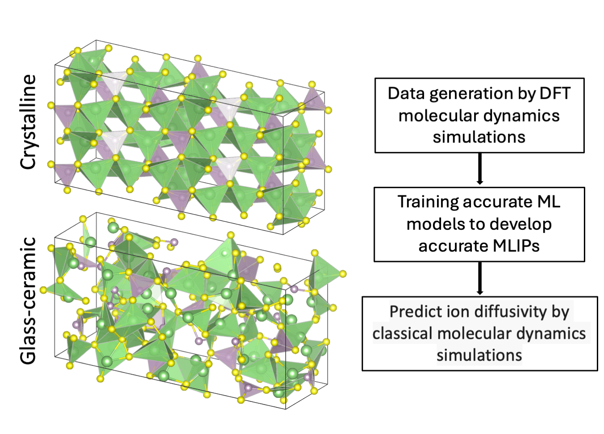

captured within the short simulation timescales.69,70 To overcome this limitation, we plan to develop a multiscale approach to study ion transport utilizing machine-learned interatomic potentials (MLIPs) trained by the Allegro model.18 Our preliminary calculations affirm the ability of the Allegro model to train MLIPs using ab initio molecular dynamics (AIMD) simulations to perform classical molecular dynamics simulations with first principles accuracy. This approach will enable us to perform classical MD simulations over extended spatio-temporal scales, yielding a comprehensive analysis of ion transport properties within the glass-ceramic and crystalline phase of lithium thiophosphates. Using our past ACCESS allocaion, we have generated glass-ceramic structures of LPS and LGPS materials by melt-quenching method using first principle simulations. Now, we aim to use ACCESS allocations to perform AIMD simulations of these GC structures at five different temperatures to generate data for MLIP training. We will also train accurate MLIPs for LPS and LGPS materials in their crystalline and GC phases using Allegro model. Subsequently, we will use the developed MLIPs to perform classical molecular dynamics (MD) simulations for longer timescales, enabling accurate ion transport analysis. The methods developed will establish a workflow for studying ion transport in solid ion conductors with higher accuracy and fewer computational resources. These methodologies will establish design rules for applying GC solid electrolytes in SSBs and explore the impact of atomic-scale features on ion-transport properties.

### 8.4 Clustering and Similarity Based Uncertainty Quantification for Machine Learned

Interatomic Potentials Molecular dynamics (MD) simulation method describes the evolution of complex systems over a long timescale using interatomic potentials (IPs) or force fields to compute potential energy and atomic forces. Traditionally, these IPs are based on analytical functions of atomic coordinates which limits their fidelity and transferability. Description of potential energy surface using machine learning provides a promising alternative to move past this limitation. Machine learned interatomic potentials (MLIPs) offer significant advantages in terms of accuracy comparable to first principle calculations and computational efficiency that scales linearly with number of atoms.71 This capability has made ML a compelling tool for accelerating materials discovery72 and material simulations73 for diverse scientific and engineering applications. A variety of approaches have been developed to train MLIPs such as GAP,74 SNAP,75 MACE,76 DeepMD,77 Nequip,78 and Allegro.18 Among these approaches, MACE, Nequip and Allegro are the most data efficient as these methods employ E(3)-equivariant convolutions. The workflow for training an MLIP involves three key steps - generating dataset, training ML model with the dataset, and deploying the model. While developing an MLIP, these three steps are the unavoidable. Between generating a dataset and training an ML model, one crucial step is the selection of our training data which ensures the accuracy of generalizability of the MLIP.79 In the contemporary MLIP development,80,81 random sampling approach is utilized to select the training set which may lead to narrow coverage of the descriptor space. A model trained on a dataset with limited coverage is more prone to uncertainty which may result in unfaithful dynamics when MD simulations encounter data outside the support of the training set. So it is critical to select a diverse dataset with adequate coverage of the descriptor space. To address this issue, our study focuses on developing guidelines for intelligent data selection for MLIP development and quantifying model uncertainties. We have already developed 11 data selection methods integrating atomic descriptors and similarity kernels. To evaluate these methods, we propose applying these data selection methods on two datasets which we have already generated: one consisting of 16,290 hydrogen configurations and their energy and forces are calculated by Quantum Monte Carlo (QMC) method and the other containing 39,951 γ - Li3PS4 configurations obtained from ab initio molecular dynamics simulations. Specifically, we will apply similarity and clustering analysis on these configurations to create clusters that group similar configurations together. Subsequently, we will select training data from the clusters, using several approaches that range from favoring configuration diversity to thermodynamic sampling. To evaluate the uncertainty, we propose to train an ensemble of ML models using strategically selected subsets of the full dataset, with each subset consisting of 1,000 configurations. The assessment of uncertainty will enable us to establish guide-

<!-- Images extracted from PDF page 14. -->
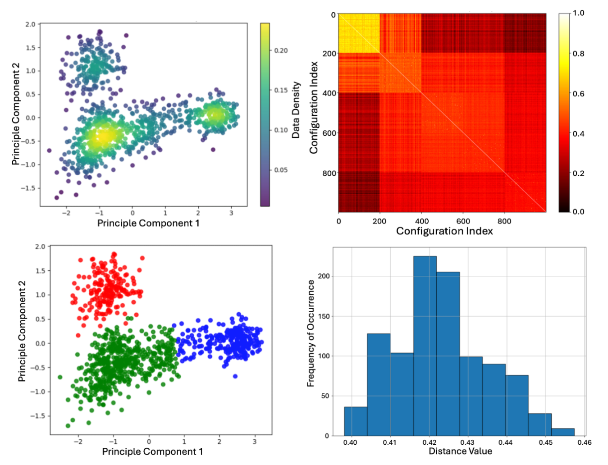

lines for intelligent data selection (IDS) based on the target problems. For each subset of data selected, we will train several models using cross-validation with different train/validate/test splits: 20/15/65, 40/15/45, 60/15/25, and 80/15/5. This will help us to evaluate data efficiency of each of our IDS methods. To ensure generalizability of the developed guidelines for intelligent data selection, we will train models using two MLIP packages, MACE and Allegro. Overall, the methods developed through this project will establish guidelines for selecting dataset to train and develop accurate and transferable MLIPs. This will also establish necessary conditions to generate dataset for MLIP development. Ultimately, this research will pave the way to efficient MLIP development by covering broader descriptor space in the input features when limited data is available to train. This allocation will support our research by providing the necessary computational time to train the ML models and data storage facility to manage our data, ensuring the robustness and reliability of our research findings.

### 8.5 Investigation of Trapping Mechanisms in Rutile TiO2

Control of oxygen-related defects in metal oxide semiconductors is essential to maintaining precise control of electronic and optical properties. Synthesis of semiconducting oxides can leave the surface of the material poisoned, leading to the injection of unwanted defects.82 While various approaches exist to control defect populations, such as ion implantation and high-temperature annealing, these methods present limitations that can degrade the surface of the material further.83 Surfaces of semiconductors can facilitate formation and annihilation of point defects more readily than in the bulk, as atoms on the surface are less coordinated and fewer bonds need to break or form to inject unwanted interstitals or vacancies.10-12 Particularly, concentration and local distribution of VO can cause significant damage due to their sluggish diffusion in some metal oxides. While increasing concentration of compensating defect Oi is the most straightforward solution, due to limitations imposed high-temperature annealing, improvements in the doping procedure are warranted.83,84 Recent work form the Ertekin group reported the primary mechanism of Oi surface injection from liquid water in rutile using the NEB (Nudged Elastic Band) method and Density Functional Theory (DFT).13 The same work developed surface preparation procedures that eliminated poisons and established Oi injection at near-room temperature with lower activation energies. With the surface injection mechanism identified and the surface poison-free, trapping events pose the next greatest threat to diffusivity of Oi in rutile. Trapping events can significantly influence electronic properties by introducing new localized states within the band gap of the material, which alter recombination rates and carrier mobility. Without annealing, hydrogen donor defects are known to proliferate in rutile and are suspected to complex with injected Oi.85,86 While experimental studies have long speculated the electronic activity of hydrogen in rutile, few computational studies have presented both formation energies and migration barriers of hydrogen defects. With a renewed ACCESS allocation, we will use DFT to elucidate all low-energy hydrogen-containing defects and the NEB method to elucidate probably mechanisms of Oi diffusion and entrapment in rutile. Once this goal is achieved, we will consider Mn-containing defects in addition to H. This approach will uncover key trapping mechanisms and synergisically inform the next generation of near room-temperature diffusion experiments.

### 8.6 Understanding high entropy ionic conductivity boosting mechanism: Role of configurational entropy, lattice softness and percolating diffusion pathways in Li3Y0.2Zr0.6Cl6

(LYZC) The low ionic conductivity of solid electrolytes at room temperature is a significant bottleneck for all-solid-state battery applications. High configurational entropy has recently emerged as a promising approach to enhance ionic conductivity in various solid electrolyte families, such as Li-NASICON, Na-NASICON, Li-garnet structures, and Li-halides, even at constant carrier concentrations.87-92 It is suggested that doping with large cations induces local distortions in the structure, creating an overlapping distribution of site energies that favors the formation of percolating pathways for ionic migration, thereby reducing the energy barrier.87 However, the impact of the formation of percolating ion migration pathways on the vibrational dynamics of materials remains largely unexplored. Elucidating how the vibrational dynamics of a percolated structure differ from a non percolated ion conductor in the context of aiding ionic hopping can significantly advance our fundamental understanding of transport processes in the emerging field of high entropy battery materials. Therefore, this study proposes to investigate the vibrational origins of high ionic conductivity in the recently discovered percolated network version of Li3YCl6 (LYC), known as Li3Y0.2Zr0.6Cl6 (LZYC), which shows a sixfold increase in room-temperature ionic conductivity compared to Li3YCl6 (LYC).88 This enhancement is attributed

to the formation of in-plane lithium percolation paths, influenced by the arrangement of Y ions. Our research aims to explore whether these percolation pathways facilitate the emergence of soft vibrational modes along diffusion paths, thereby boosting ionic diffusion. We propose to use ACCESS resources to investigate the vibrational dynamics of

Figure 13:
Ionic conductivity boosting by percolating network88 percolated network materials and their correlation with ionic hopping employing various computational methods, including lattice dynamics, ab-initio molecular dynamics (AIMD), Nudged Elastic Band (NEB) calculations, and large-scale molecular simulations using a neural network potential. We will begin with phonon calculations on Li3Y0.2Zr0.6Cl6 (LYZC) to identify soft vibrational modes, with a particular focus on the vibrational density of states (VDOS) and its frequency scaling compared to its non-percolating counterpart. Next, we plan to establish the connection between diffusion and these soft modes using trajectories obtained from performing ab-initio molecular dynamics (AIMD) simulations at various temperatures, along with displacement fields from Nudged Elastic Band (NEB) calculations. Additionally, a neural network interatomic potential will be trained using the AIMD data to perform large-scale molecular dynamics simulations, allowing us to overcome the length and timescale limitations of AIMD. These MD simulations will help us to better predict ionic conductivity and explore the true nature of ionic diffusion. Specifically, we aim to examine the influence of percolated networks on ion-ion correlations, particle displacement distributions, and dynamic heterogeneity, in contrast to the non-percolating case.

### 8.7 Generative modeling for crystal structures

Crystalline materials make up critical components in technologies ranging from semiconductors to batteries to metals. Yet, while databases of experimentally known and computationally hypothesized crystalline materials contain on the order of 105 materials,93,94 it is estimated that even the number of plausible four-element materials is on the order of 1010-1012.42 To rapidly explore the space of plausible crystals, several works have turned to generative machine learning.95-97 Once trained, these models can propose thousands to millions of candidate atomic structures per hour. While early models have shown promising abilities, they are usually trained to match biased dataset distributions or are limited to learning distributions conditioned on data-rich materials properties. Additionally, the models do not explicitly handle crystallographic space group symmetries and do not help materials scientists determine how to synthesize a target crystal. Figure 14: Crystal structures generated from our generative model after training with maximum likelihood on a subset of crystals from the Materials Project. To help overcome these limitations, we have built a Generative Flow Network for crystals, combining elements of autoregressive models, energy-based models, and normalizing flows. To avoid biasing the model towards fixed datasets, we train our model online, wherein the model is partially responsible for generating its own training data. We also train the model to match reward distributions, enabling generation conditioned on desirable materials properties. At inference time, our model is able to enforce hard constraints from user-defined composition spaces or space groups to, e.g., find competing compounds of target phases or to find materials with symmetry-protected properties. Examples of crystals generated by a preliminary version of our model are shown in Figure 14. We propose to use ACCESS resources to run density functional theory (DFT) calculations to evaluate and interface with our model in a computational materials discovery campaign. Specifically, we intend to (1) validate the thermodynamic stability of materials generated from our model and compare to a baseline generative model. Then, we plan to (2) use our model to search for materials with desired bulk properties using a feedback loop between our model and a DFT calculation workflow.

### 8.8 The influence of H and short-range order on dislocation in Fe-Ni-Cr austenitic

stainless steels:
Understanding the mechanism of hydrogen embrittlement (HE) is crucial for designing H-resilient alloys and advancing the application of hydrogen energy. Several possible mechanisms, such as hydrogen-enhanced localized plasticity (HELP)98 and hydrogen-enhanced decohesion (HEDE),99 have been proposed to explain the HE phenomenon. However, the exact process by which H degrades the mechanical properties of metals and alloys remains unclear. According

<!-- Images extracted from PDF page 16. -->
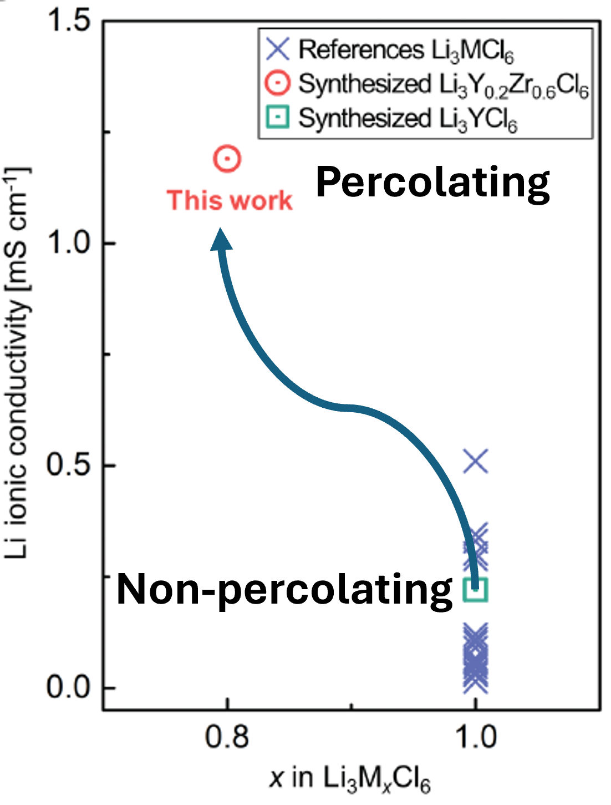
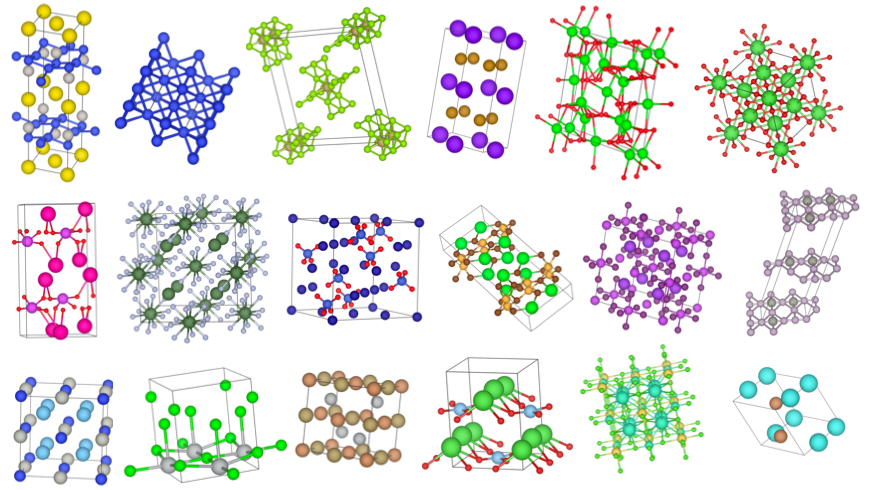

to the HELP mechanism, H can shield the elastic interactions of dislocations, thereby increasing dislocation mobility. Density functional theory (DFT) has been widely used to study the interaction between H and dislocation in various metals and alloys.100-104 It was found that H can prohibit the cross-slip of screw dislocations in Ni and promote slip planarity.104 Additionally, H can accumulate near dislocation cores and alter dislocation behavior.100 Recently, the role of short-range order(SRO) in HE has gained increasing attention. SRO refers to the regular arrangement of atoms over short distances. SRO can affect the dislocation motion and nucleation rate.105,106 It is believed that SRO will enhance the dislocation planarity, which is the primary cause of the hydrogen-induced degradation of ductility .107 Figure 15: The interaction between SRO, H, and dislocation. Fe, Ni, Cr, and H atoms are labeled as orange, white, blue, and green. The black ⊥symbol highlights the dislocation. The SRO domain is in the red circle. H will cluster in dislocation cores and SRO domains, which might change the SRO-dislocation interaction. Based on our previous ACCESS allocation, we developed an effective cluster expansion model for the FCC Fe-Ni-Cr-H system. We found that H atoms tend to segregate to certain SRO domains under thermal equilibration in Monte Carlo simulations. Here we propose that SRO and H will change the dislocation behaviors of Fe-Ni-Cr alloys, as depicted in Fig. 15. We will start with SRO and random Fe-Ni-Cr alloys without H to study the effect of SRO on dislocation core structures, stacking fault energies, and dislocation motion barriers. Then we will incorporate H to different SRO domains to study how H will change the stacking fault energy and dislocation behavior in the presence of SRO. The core structures and energies of different dislocation configurations will be calculated using the Vienna Ab initio Simulation Package (VASP).108 This study will provide an atomistic insight into the effect of SRO and H on the mechanical properties of alloys, which will help the design of H-resilient alloys.

### 8.9 Alloy Design for Target Functionality

Alloying is a widely used technique aimed at improving the functional properties of materials for applications such as thermoelectrics, photovoltaics, and energy storage.109-111 Throughout history, alloying has been a crucial method for creating materials with exceptional structural and functional properties. Traditionally alloying has been utilized to design and optimize performance by targeting multi-property optimization. For example, alloying increases phonon scattering to lower lattice thermal conductivity, creates additional peaks in the electron band structure to encourage band convergence and enhance band degeneracy, adjusts the band gap to minimize bipolar transport, softens the lattice to introduce extra scattering and further reduce lattice thermal conductivity, and optimizes the material’s dopability. However, all these approaches are based on a forward problem where we study alloyed composition to determine the target property. In this project, we plan to apply an inverse design approach to generate configurations with a target property. Using our previous ACCESS allocation, we have studied the dopability of PbSxSe1-x alloys through the implementation of cluster expansion.,112 site symmetry analysis, and defect chemistry analysis. We have also studied band structures and electronic properties of BiSb alloys to determine the root cause of their high performance. Both are based on a forward approach. To implement an inverse design approach, this project aims to generate alloy structure for target functionality utilizing molecular dynamics simulation and generative marginalization models (MAMs).113 A generative model is a statistical model of the joint probability distribution p(x, y) on a given observable variable x and target variable y. In this case, x can be the alloy configuration, and y can be the thermal conductivity. As mentioned before, computational alloy modeling invokes a forward approach based on generating realistic structures from a cluster expansion model and predicting the target properties of the configurations using atomistic simulations or an analytical model. However, the process should be inverted so that we might be able to predict configurations with a target property. Therefore, we plan to demonstrate an inverse design approach with a generative model for alloy configurations that learns to generate configurations that exemplify a target property or feature. To take steps towards this goal, our methodology is illustrated in Figure 16. The target property that we have selected is the lattice thermal conductivity. The mass disorder introduced by alloying Figure 16: Schematic representation of forward and reverse approach for alloy configuration and target property is known to reduce lattice thermal conductivity in alloys, yet there remain questions about whether superlattice structures, random alloys, or alloys with short/long range order are most conductive to low thermal conductivity via enhanced phonon scattering. To calculate the target property, we would create configurations for 50-50 alloy composition for the selected alloy. In this project, our goal is to apply generative marginalization models for the generation of alloy configurations with targeted

<!-- Images extracted from PDF page 17. -->
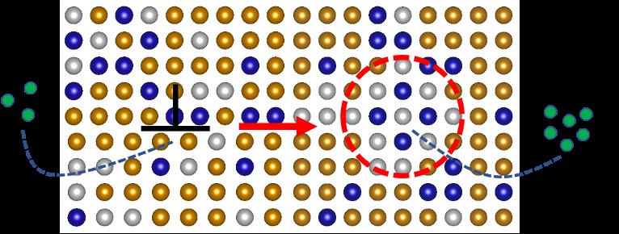
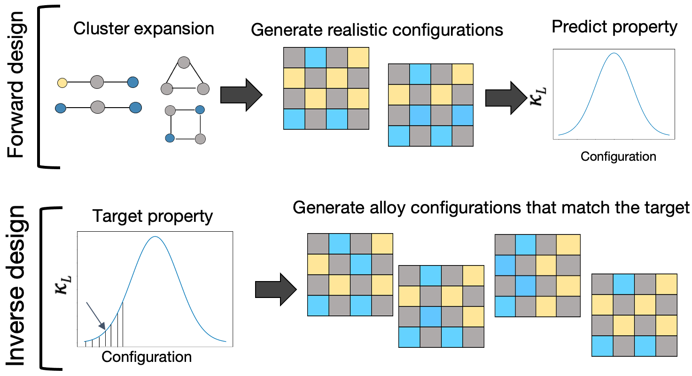

properties. We have selected identifying configurations in alloy compositions that minimize the lattice thermal conductivity as a target. Rather than employing a generative model to decorate a discrete lattice with pixel values, as is the case in image production, we will instead use elements to do so. Our demonstration will focus on the (Si, Ge) alloy system. In order to complete the task, we shall compute thermal conductivity for the various configurations using equilibrium molecular dynamics simulations to create a training data set. Finally, we will train the adjusted MAMs model,113 and evaluate its effectiveness by direct evaluation of thermal conductivity. This project aims to generate alloy structure for target functionality utilizing molecular dynamics simulation and generative marginalization models (MAMs).113

### 8.10 Structural Features of Metallic Glasses

Figure 17: a) Structure of Co40Zr60. b) Radial distribution function (g(r)) of CoxZrCo100-x (x = 40 -90), insets show a short range ordering (SRO) (surface view of an isolated icosahedron), and a medium range ordering (MRO) that was created by two SRO. c) Concentration dependent Voronoi polyhedra analysis shows the distribution of different motif variations in the systems. Metallic glasses (MG) have wide applicability in industry due to their hardness, strength, corrosion resistance, and low thermal conductivity while being easy to process.114-118 MG’s have unique structural characteristics compared to the other glass family members due to their five-fold symmetric local short orderings (icasohedra) that have an effect on their properties compared to their crystalline counterparts. MGs have been studied for a long time to unveil the relationship between their disordered natures and properties. However, the direct relationship has not been established yet. Chang et al.119 have shown the liquid-like regions have an important role in the transport properties of glasses. These liquid-like regions are related to existing unique types of icosahedron motifs. A well-established mechanism of structure and transport can lead to new and highquality, durable designs for the glassy phases. By using ACCESS, we aim to find the relation between structure and the ion transport mechanism of Zr-based MGs and control parameter determining the local structures. Previously, we generated a large data set for Fex, Cox, and Cux, Zr100-x MGs by varying the composition between x = 40 -90. We used the melt-quench technique for the MG production at three cooling rates from fast to relatively slow (1013, 1011, and 109 K/s) together with six different initial velocities, using classical molecular dynamics simulations (Lammps120). We further carried out structural characterization of each MG, as shown in Figure 17. In future work, we plan to study the thermal conductivity and diffusion coefficients, and establish systematic trends across the MG samples that we have already generated. We aim to identify the liquid-like regions for all systems. The fast-moving atoms in these systems require calculations at different temperatures below and above the glass transition temperatures (300, 600, 800, 1000, 1200, and 1400 K). Additionally, we will calculate the diffusion pathways of the atoms that exhibit “outlier” diffusional characteristic. We have previously found fast-moving atoms even for high Zr concentrations (at 60%) at 300 K. Finally, we propose a comprehensive investigation of the mechanical and vibrational properties of the glassy systems, with related analysis of structural parameters that correlate to properties. Such calculations will show the direct contribution of local structural features to the presence of liquid-like regions. We expect that these results will open up the way of designing MG-based high-ionic conductors.

### 8.11 Intelligent Synthesis - CVD and Laser Powder Bed Fusion

In our previous work we focused on synthesis of two-dimensional materials using chemical vapor deposition. Twodimensional materials such as graphene have great potential for applications in emerging nanoelectronics and other nanomanufactured systems. This potential rests on the need to develop optimized, reproducible, and scalable synthesis techniques that yield high-quality samples with high coverage. Currently, the coverage achieved in a growth experiment is measured in a labor-intensive manner by analysis of scanning electron microscopy (SEM) images of the experimentally synthesized graphene. However, to be applicable for statistical analysis, coverage needs to be estimated across several thousands of samples in an automated, high-throughput manner. We used our prior allocation to replace our previous labor intensive approach with an adaptation of the U-Net neural network image segmentation algorithm to our existing dataset to produce high quality, automated graphene coverage metrics. This work represents one of the first demonstrations of the use of U-Net for analysis of SEM images of 2D materials.121,122 As this approach is expected to significantly speed-up the labor intensive process of image analysis, we

<!-- Images extracted from PDF page 18. -->
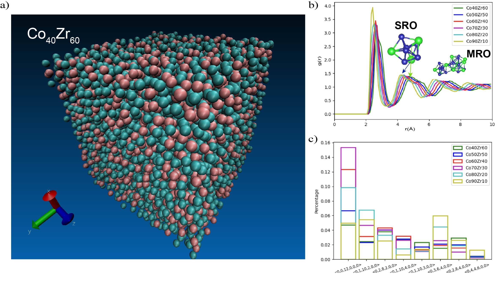

Figure 18: (a) Microscopy image of the cross section of a single melt track. (b) the convex polygon shows the edge of the melt track, the red line shows the metal surface; these two elements can be used to extract the relevant geometric parameters. are now extending the U-Net based image segmentation approach to analysis of 3D additive manufacturing of metals via Laser Powder Bed Fusion (LPBF). LPBF is increasingly being used to produce metal parts. To gain insight into the physical processes that influence the additive manufacturing process, we propose the use of data driven predictive modeling. The first step is to analyse microscopy images of the cross-section of melt tracks (Fig. 18). These images can be used to extract geometric parameters such as the width and depth of the melt track, and the wetting angle. Successively, we can identify and analyse pores visible in the image. This data, combined with the material properties, helps us predict the quality of the part and the processing regime.123,124 To develop a reliable model, we need to extract data from several hundreds, if not thousands, of images, which has been a manual and laborious process so far. Figure 19: Example of segmentation results by our U-Net model on microscopy images of cross sections of LPBF melt pools. Supported by our previous ACCESS allocation, we successfully trained a neural network to accurately segment images of LPBF melt pool cross sections (see Fig. 19). This is one of the most robust neural networks available for analysis of melt pools which works across different materials despite being trained on a dataset of less than 70 images. We are currently finalizing a manuscript that we will submit for publication based on these results. So far, the model works primarily on single track images of LPBF. We plan to improve the model’s performance and extend its capabilities by training new versions capable of segmenting multi-track images and images of other similar metal additive manufacturing techniques such as Directed Energy Deposition (DED). We also plan to train a new model capable of identifying porosities. We plan to use a U-Net based architecture and train the model to extract the data automatically and dramatically speed-up the development of the predictive model for the additive manufacturing process. Allocation Request and Justification Based on the activities described above, the following summarizes our request for Bridges-2 RM and Bridges-2 GPU resources. On Bridges-2 RM, we will mostly being using the commercial software VASP.108,125 On Bridges-2 GPU we request resources for neural network hyperparameter tuning and training. All of these utilization estimates are also based on our performance tests/scaling analysis that we carried out with our prior allocations.

### 9.1 PSC Bridges-2 - Regular Memory

I. Understanding Band Structures and Optimal Dopant Suggestions for Thermoelectric Materials Defect Calculations Compounds: 50 Half-Heuslers Defects Per Compound: approximately 50

SUs Per Calculation: 1 node × 12 hours
Sub-Total: 2,160,000 SUs
From previous tests, we’ve seen that these 50 defect calculations can be run on 72 cores for 12 hours each. This means that we expect to require 3,600 cores for 600 hours for a total of 2,160,000 SUs. II. Photo-ionic Effects in SrTiO3 Alloys: Efficient Prediction of Defect Formation Energies Using DFTB DFTB Fitting (1) Band Energy Optimization: 6 ABO2,3

SUs Per Calculation: 20,000 SUs
Sub-Total: 120,000 SUs
DFTB Fitting (2) Repulsive Potential Optimization: 6 × 6 = 36 bonds

SUs Per Calculation: 10,000 SUs
Sub-Total: 360,000 SUs
DFTB Fitting (1) The accuracy of DFTB calculations relies heavily on the quality of the Slater-Koster (SK) parameter set, which involves (1) band energy and (2) repulsive potential. To develop DFTB parameters for STO alloys, we first define pseudoatomic orbitals (PAOs) for Sr, Ti, and O, as well as potential substitutions, such as Ba for the A site and Fe and Co for the B site. We optimize confinement lengths for PAOs and calculate SK functions

<!-- Images extracted from PDF page 19. -->
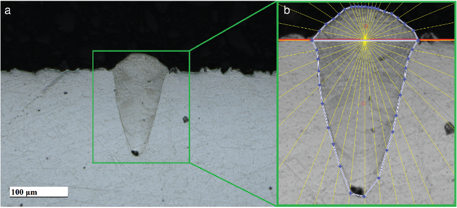
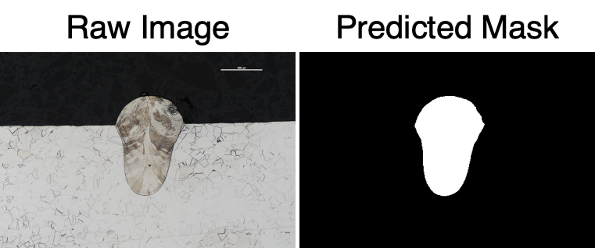

based on separation distances using band energy calculations of six elemental compounds: SrTiO3, SrFeO2, SrCoO2, BaTiO3, BaFeO2, and BaCoO2. This is estimated to require 20,000 SUs per compound, totaling 120,000 SUs. DFTB Fitting (2) We optimize the repulsive potential to match experimental bond lengths, starting with dimer DFT calculations and refining through iterative adjustments. This process is estimated to require 10,000 SUs for each of the 36 unique bonds, resulting in a total of 360,000 SUs. III. Ion transport in lithium thiophosphates Data generation

Materials: 3 LPS + 2 LGPS
Temperature Per Material: 5

SUs Per Calculation: 6144 SUs
Sub-Total: 153,600 SUs
Classical MD simulation

Materials: 3 LPS + 2 LGPS
Phases Per Material: 2 Temperature Per Material: 8

SUs Per Calculation: 10,752 SUs
Sub-Total: 860,160 SUs
Data generation To develop machine-learned interatomic potentials (MLIPs) for LPS and LGPS materials in their glass-ceramic phase, we will perform ab initio molecular dynamics (AIMD) simulations at five distinct temperatures ranging from 200 K - 1000 K. Our initial calculations on Bridges-2 suggest that 96 hours on 64 cores are needed to complete 10 ps of AIMD simulations. Thus, for 25 AIMD simulations (5 materials × 5 temperatures), the total requires SUs amount to 25 × 6144 = 153,600 SUs. Classical MD simulations After developing MLIPs, we will conduct classical molecular dynamics (MD) simulations of LPS and LGPS materials over extended spatio-temporal scales. Our preliminary calculations indicate that 168 hours on 64 cores are required to complete 300 ps of MD simulations. For all classical MD simulations (5 materials × 2 phases × 8 temperatures), the total required SUs will be 860,160 SUs (80 × 10,752). VI. Understanding high entropy ionic conductivity boosting mechanism Phonon calculation Materials: 2 LYZC (varying the Y and Zr content) Calculation Per Material: 5

SUs Per Calculation: 9600 SUs
Sub-Total: 96,000 SUs
Data

generation:
AIMD

Materials: 2 LYZC
Temperature Per Material: 6

SUs Per Calculation: 16000 SUs
Sub-Total: 192,000 SUs
Machine learned MD simulation

Materials: 2 LYZC
Temperature Per Material: 8

SUs Per Calculation: 27822 SUs
Sub-Total: 445,152 SUs
Phonon calculation For understanding the vibrational dynamics of the percolating network, we plan to perform phonon calculations for the two complex LYZC crystal structures. Based on our initial calculations on Bridges-2, each phonon calculation would require 150 hours on 64 cores. Consequently, for 10 calculations (2 materials × 5 calculation per materials), the total required service units (SUs) amount to 96,000 SUs (10 × 9,600 SUs). Data generation To develop machine-learned interatomic potentials (MLIPs) for two versions of LYZC materials, we will perform ab initio molecular dynamics (AIMD) simulations at six distinct temperatures ranging from 200 K to 1200 K. Based on our initial calculations on Bridges-2, each AIMD simulation requires 250 hours on 64 cores to complete 20 ps. Consequently, for 12 AIMD simulations (2 materials × 6 temperatures), the total required service units (SUs) amount to 192,000 SUs (12 × 16,000 SUs). Machine learned MD simulations After developing the machine learned interatomic potentials (MLIPs), we plan to conduct machine learned molecular dynamics (MD) simulations (via LAMMPS) of LYZC materials over a nanosecond timescale, using supercell containing approximately 50,000 atoms. Our preliminary calculations indicate that 38 hours on 256 cores are needed to complete 350 ps of MD simulations. For all machine learned MD simulations (2 materials

× 8 temperatures), the total required service units (SUs) will amount to 445,152 SUs (16 simulations × 27,822 SUs for one nanosecond). V. The influence of H and SRO on dislocation in Fe-Ni-Cr austenitic stainless steels: Elastic Property Number of Structures: 10 SUs per Calculation: 360

Sub-Total: 3,600 SUs
Stacking Fault Energy Number of Structures 90 SUs per Calculation: 1,500

Sub-Total: 135,000 SUs
Dislocation Calculation Number of Structures: 72 SUs per Calculation: 3,000

Sub-Total: 216,000 SUs
Total Request 354,600 SUs Elastic property We will calculate the elastic properties of Fe, Ni, Cr, and several SRO alloys. Each calculation requires around 360 SUs (32 cores for 12 hrs). Stacking Fault Energy We consider 3 compositions (Fe80Ni10Cr10, Fe70Ni10Cr20, and Fe60Ni20Cr20). For each composition, we sample 10 different SRO structures with H concentrations of 0%, 3%, or 10%. The alloy structures will be generated from Monte Carlo simulations and the supercell contains 500 atoms. Each calculation requires around 1,500 SUs (64 cores for 24 hrs). Dislocation calculation We consider 3 compositions (Fe80Ni10Cr10, Fe70Ni10Cr20, and Fe60Ni20Cr20). For each composition, we sample 3 different SRO structures with H concentrations of 0% or 10%. For each structure, we will generate 4 different dislocation dipole configurations by changing the relative position of dislocation cores and SRO domains. Each calculation requires around 3,000 SUs (1 node for 24 hrs). VI. Investigation of Trapping Mechanisms in Rutile TiO2 Defect Calculations Configurations: estimated 10 H defective configurations and 15 Mn defective configurations

Charge states: 8
SUs Per Calculation: 1 node × 12 hours
Sub-Total: 76,800 CUs
Nudged Elastic Band Calculations Estimated Hops: approximately 80 Images per calculation: 8

SUs Per Calculation: 1 node × 48 hours
Sub-Total: 245,760 SUs
Defect Calculations Defect calculations use relatively cheap, geometry relaxations to calculation defect formation energies across a variety of charge states and Fermi levels. These calculations typically run for 12 hours on 32 cores. Twenty-five configurations relaxed under 8 charge states requires 6,400 cores for 2,400 hours, or 76,800 CUs total. NEB Calculations Nuddged Elastic Band calculations are computationally expensive compared to a defect calculation. The migration paths are screened at a low convergence criterion and then refined with a higher convergence criterion. The average NEB calculation takes 48 hours to complete both steps running on 64 cores. For approximately

## 80 NEB calculations we will need 245,760 SUs, or 3,072 core hours per NEB.

VII. Generative modeling for crystal structures Ground state total energies Compounds: 5,000 generated crystal structures Competing Phases Per Compound: approximately 10

SUs Per Calculation: 1 node × 0.25 hours
Sub-Total: 1,600,000 SUs
Thermodynamic stability is evaluated from ground state total energy calculations for a given material and its competing phases. From previous tests, we’ve seen that these 5,000 materials can be run on 128 cores for 0.25 hours each. Considering the resulting 160,000 cores needed for 10 competing phases per compound, we will require 1,600,000 SUs. VIII. Alloy design for target functionality Thermal conductivity Compositions: 1 (50-50 alloy) Generated alloy structures per composition: approximately 3000

SUs Per Calculation: 1 node × 1.5 hours
Sub-Total: 576,000 SUs
Thermal conductivity calculations We will use Bridges2-RM to calculate the thermal conductivity of approximately 3000 configurations of Si-Ge alloys of 50-50 composition, each containing 512 atoms. To compute thermal conductivity, we have to relax the system in the NVT ensemble for about 100 ps. After the system is equilibrated at the desired temperature, we will switch to the NVE ensemble and equilibrate for another 100 ps. Finally, we would run the calculation for the thermal conductivity for a well-converged system for around 1 ns. The relaxation and thermal conductivity calculation of the stable structures would take 1.5 hours in a 128-core RM node. Therefore, each job will require about 192 core-hours and for 3000 configurations we will require 576,000 SUs. IX. Structural Features of Metallic Glasses Vibrational Properties Compositions: 1944 MG structures

SUs Per Calculation: 1 node × 6 hours
Sub-Total: 1,492,992 SUs
Mechanical Properties Compositions: 1944 MG structures

SUs Per Calculation: 1 node × 3 hours
Sub-Total: 746,496 SUs
MG Properties Analysis We have generated three systems, including Fe, Co, and Cu -Zr, using classical molecular dynamics. Each system was produced with three different cooling rates, at six different concentrations, and with six different initial velocities. In total, we have 324 structures. We are working at six temperatures, which requires 972 independent calculations for the next phase of property analysis of MG. We aim to calculate vibrational and mechanical properties. We estimate that the vibrational analysis requires 1,492,992 SUs in total, and the mechanical analysis requires 746,496 SUs in total. The calculations will be used as input parameters to train our machine-learning model for an extensive characterization of the MG-structure relationship based on its properties. Potential candidate alloy compositions should be evaluated for the ground state total energy to evaluate the alloy mixing enthalpy and stability. Previous calculation on these alloy system shows that our 50 target alloys each having 10 compositions i.e total 500 compositions require 2 hours each on a 128 core system.Therefore, we will need 128,000 SUs for the ground state energy calculation. in one node of a 64 core machine. This means that we can expect to require appproximately 10 hours per job in a 128 core machine. In total we will need 256,000 SUs for the effective bandstructure calculation. Total Bridges-2 Regular Memory Request ∼9,479,560 SUs

### 9.2 PSC Bridges-2 - GPU

I. Ion transport in lithium thiophosphates Training MLIPs

Materials: 3 LPS + 2 LGPS
Phases Per Material: 2 Data selection methods: 2 Epochs to fully train a model: 500

GPU hours per 5 epochs: 10
Sub-Total: 20000 GPU hours
Training MLIPs Using the Allegro model, we will train the MLIPs using all of our data, employing a 60-20-20 split. Here, we will select the training data based on random sampling and intelligen data selection approach from

section 3.4. Preliminary calculations show that five epochs of training require 10 GPU hours. Training a model with our whole dataset requires 500 epochs, the total GPU hours needed will be 5 × 2 × 2 × 10 × 500/5 = 20000 GPU hours. II. CS-UQ:Clustering and Similarity Based Uncertainty Quantification for Machine Learned Interatomic Potentials Intelligent data selection

Materials: Li3PS4 + H
Intelligent Data Selection Methods: 11 Dataset splits training/validation/testing: 4 MLIP Packages: 2 Number of Ensembles: 3 Epochs to fully train a model: 100

GPU hours per 5 epochs: 1
Sub-Total: 10,560 GPU hours
Full training

Materials: Li3PS4 + H
MLIP Packages: 2 Epochs to fully train a model: 500

GPU hours per 5 epochs: 10
Sub-Total: 4,000 GPU hours
Intelligent data selection To develop an optimal data selection strategy for training MLIPs, we have devised 11 strategies, including random data selection. We will implement these strategies on our H (16,290 configurations)and Li3PS4 (39,951 configurations) datasets to create subsets that covers the maximum descriptor space of the input features. Each of these subsets consist of 1,000 configurations. We are also considering two packages for MLIP development, MACE and Allegro. Our preliminary calculations suggest that each model training requires 100 epochs for convergence, with five epochs taking 1 GPU hour. Thus, the total GPU hours needed is 2 materials × 11 IDS methods × 4 dataset splits × 2 MLIP packages × 3 ensembles × 100 epochs × 1GPU hour 5epochs = 10,560 GPU hours. Full training Using the best strategy for data selection, we will train the MLIPs using all of our data, employing a 60-20-20 split. Our initial calculations indicate a requirement of 10 GPU hours to complete 5 epochs and training a model with the entire dataset requires 500 epochs. Therefore, the total GPU hours needed will be 2 materials × 2 MLIP packages × 10 × 500/5 = 4000 GPU hours. III. Understanding high entropy ionic conductivity boosting mechanism Training MLIPs

Materials: 2 LYZC
Epochs to fully train a model: 500

GPU hours per 5 epochs: 5
Sub-Total: 1000 GPU hours
Training MLIPs We will train the MLIPs using the Allegro model with a 60-20-20 split of our data. Preliminary calculations indicate that training for five epochs requires 5 GPU hours. Given that training a model with our entire dataset requires 500 epochs, the total GPU hours needed will be 1,000 (2 materials × 5 GPU hours/5 epochs × 500 epochs).

IV. Intelligent Synthesis - CVD and Laser Powder Bed Fusion Hyperparameter Tuning Iterations to fully-train a model: 10K Fraction of all iterations to be conducted for hyperparameter tuning: 0.5 Number of hyperparameter settings to try: 60 Number of data splits: 2 Number of systems: 2

GPU hours per iteration: 1/1000
Sub-Total: 1,200 GPU hours
Full Training Iterations to fully-train a model: 10K Number of splits: 2

GPU hours per iteration: 1/1000
Sub-Total: 20 GPU hours
Total Request 1,220 GPU hours Hyperparameter tuning We will tune the model for the hyperparameters such as learning rate, batch size, amount of augmented data etc. For each application (melt pool and pore detection), the data will be split into two sets based on its quality to maximize the extraction of data. We expect to test around 60 different hyperparameter settings for each data set. We will only need the first 5k iterations to compare different hyperparameter settings. Since we require

## 1 GPU hour per 1000 iterations, we estimate to use 1200K GPU hours for hyperparameter tuning.

Full training Once we have tuned the hyperparameters, we can fully-train the model. Between both systems, we expect to use 20 GPU hours to train the models for publishing. Total Bridges-2 GPU Request 36,780 GPU hours equivalent to ∼1,935,790 ACCESS credits

### 9.3 Total Storage Requirement

Total Storage Requirement Across All Projects Storage Bridges2 Ocean: 40 TB Exchange rate: 1000 ACCESS credits per 100 GB of storage Total: 400,000 ACCESS credits Total Bridges-2 Storage Request 400,000 ACCESS credits

### 9.4 Total Requests

Total Bridges-2 Regular Memory Request ∼9,479,560 SUs Total Bridges-2 GPU Request 36,780 GPU hours equivalent to ∼1,935,790 ACCESS credits Total Storage Requirement

## 40 TB equivalent to ∼400,000 ACCESS credits

Total Request ∼11,815,350 ACCESS credits Experience, Readiness, Usage Plans and Funding Source(s) I have been using HPC systems including ACCESS, Blue Waters, xsede, NERSC, and other resources for over fifteen years. The activities and projects described above are all associated with currently active grants that are supported by federal funding agencies including NSF (including through “Harnessing the Data Revolution” and a “Materials Science Research and Engineering Center (MRSEC)” large-scale center awards), DOE, and AFOSR. Most of the proposed work is ready for production, and represents ongoing research activities in my group as a result of our prior ACCELERATE allocation. In this prior allocation we were awarded 3 million access credits, and we were able to use these credits within (approximately) a six month period.

Therefore we anticipate steady usage of our allocation over the course of the year as: Q1: 35%, Q2: 30%, Q3: 25%, Q4: 10%. Past Usage and Results Our prior ACCELERATE allocation has to-date resulted in ten journal publications, with four more either currently under review or in final preparation. We anticipate another approximately five publications that will result from our prior work. Please see the more detailed description in the “Progress Report” document, and list of publications associated with our award web page. Storage Need, and Data Management at Project End Based on our prior allocation, we anticipate total storage requirements on Ocean for this work of 40 TB, as described in Section 4. ACCESS credits are requested for this purpose. The majority of storage needs will be used for (i) storing trajectories from molecular dynamics simulations, which are often needed for post-processing of simulation results, and (ii) storing wave functions from electronic structure calculations, which are needed to facilitate easy “restarts” when needed. Regarding long-term storage, here we do not anticipate substantial needs: Bridges-2 RM : At the end of the allocation period, data and results sufficient to regenerate all wave functions (for first principles simulations), or to restart molecular dynamics simulations, relatively quickly will be migrated to our own in-house storage (> 40 TB). Key aspects of the results, provenance, etc. will be archived and made available through the Materials Data Facility. Bridges-2 GPU : At the end of the allocation period, hyperparameters and final trained models will be migrated to our own in-house storage. Key aspects including optimized models will may be made publicly accessible through our own github pages or through the Materials Data Facility. Requested Start Date and Duration As outlined for the current submission window, we request resources for the allocation period beginning October 1, 2024 and ending September 30, 2025.

Code Performance and Scaling On Bridges-2 RM, we will mostly being using the commercial software VASP108,125 and the molecular dynamics code LAMMPS.126 On NCSA Delta GPU we request resources for neural network hyperparameter tuning and training. All of our utilization estimates are also based on our performance tests/scaling analysis that we carried out with prior allocations using Bridges-2 and Delta, which are shown below.

### 14.1 VASP

Through our prior allocations, we have tested application VASP on Bridges-2 RM and we have determined the optimal parallelization parameters (VASP offers parallelization in two forms, over bands (NPAR) and over kpoints (KPAR)) for several of our standard simulation sizes for our production runs. (2x2x2) Hg2GeTe4 supercell 56 atoms (496 electrons) HSE06 Resource Usage (Node-seconds) 100

## 120 NPAR

(2x2x2) Hg2GeTe4 supercell 56 atoms (496 electrons) HSE06 Actual speed up Ideal speed up Speed up KPAR PBE PBE Figure 20: Scaling test on optimal parallelization parameters in VASP. We have tested the kpoints optimization using KPAR (top) band parallelization using NPAR (bottom). The parallelization performance for both PBE functional and hybrid (HSE06) functional are tested. The optimal parallelization setting for each case is marked by red circles. First, we conducted scaling tests for system sizes containing different numbers of electrons using relatively computationally efficient PBE functionals. Typically DFT codes exhibit approximately cubic scaling in performance with number of electrons, and for simulations of varying number of electrons it is necessary to determine optimal parallelization parameters. The system sizes considered were those typical of our production runs, ranging from smaller bulk material calculations to larger supercells as needed for defect analysis or phonon calculations. For these varying system sizes we optimized parallelization parameters NPAR (parallelization over bands for a single k-point) and KPAR (parallelization over kpoints). While increasing the size of the Si supercells from 3x3x3 to 8x8x8, the parameter NPAR, which determines the number of bands that are treated in parallel, has been optimized by comparing the total time required to finish one self-consistent loop. For the optimization of the KPAR, determining the number of k-points to be treated in parallel, several KPARs were tested by increasing the size of the kpoints mesh of a HfNiPb primitive cell from 10x10x10 to 14x14x14. The results on the left hand side of Figure 11 show the optimal parameters for each total system size. Second, we conducted similar scaling tests for the more computationally expensive hybrid functional HSE06. These functionals are more expensive, and exhibit closer to a fourth order scaling in computational expensive with

the number of electrons in the system. In this case, we tested only one typical production supercell size. As the right hand side of Figure 11 shows, for systems of of approximately 500 electrons, we observe very good performance using one node, for optimal choice of NPAR, KPAR. Here we may carry out a few more tests with larger size systems going up to around 250 atoms, which is the current state of the art, limit for hybrid functionals.

### 14.2 GPUs - Training Models and Hyperparameter Optimizations

All ML models are coded with PyTorch, a GPU-accelerated deep learning library developed by Meta with a backend written in C++.127 Through our previous allocation, we have already configured our codes to utilize GPU resources. Figure 21: Hours required for a V100 GPU to fully train (for 1000 epochs) a single Crystal Graph Convolutional Neural Network within each phase of training for our meta-learning approach. Further, we will train machine-learned interatomic potentials (MLIPs) using software packages like Allegro. We have already tested Allegro on GPU systems and find that it scales well with the number of nodes, as shown in Figure 22. Please note that we also aim to conduct similar scaling tests for LAMMPS on GPU machines using the MLIPs trained by Allegro models, which will help us to determine the computational efficiency of MLIPs to perform large scale molecular dynamics simulations.

<!-- Images extracted from PDF page 27. -->
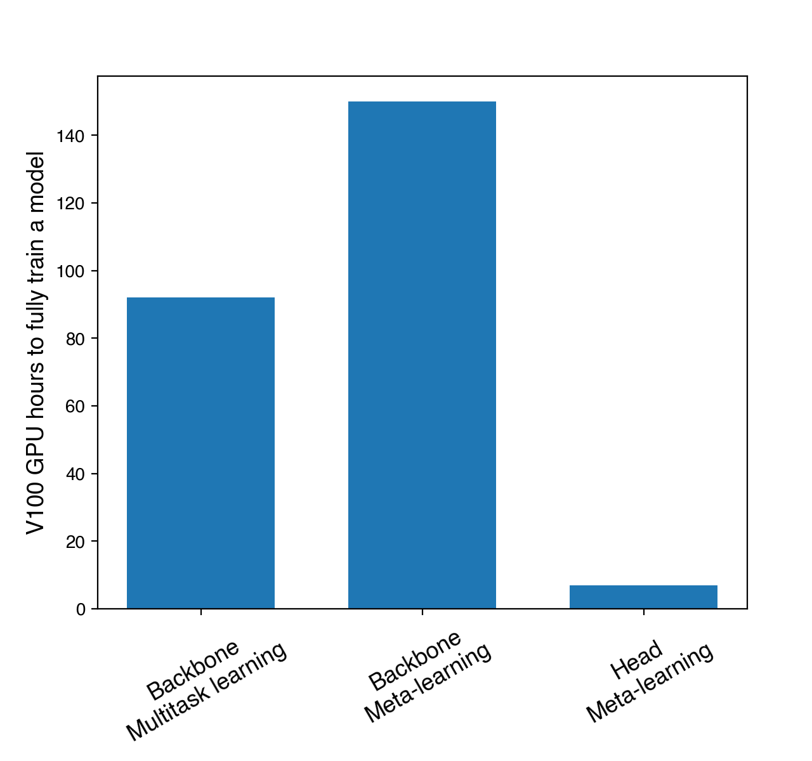

Figure 22: Scaling of training calculations using the Allegro model with respect to the number of nodes, using 4 A100 GPUs per node. Each training calculation is performed with the same dataset containing 40,000 configurations, and we record the time required to complete five epochs of training as the number of nodes increases.

<!-- Images extracted from PDF page 28. -->
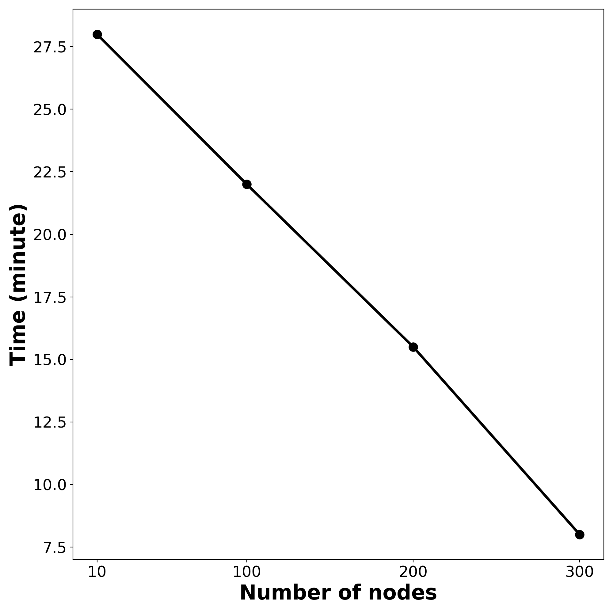

References References [1] T. Asano, A. Sakai, S. Ouchi, M. Sakaida, A. Miyazaki, and S. Hasegawa, “Solid halide electrolytes with high lithium-ion conductivity for application in 4 v class bulk-type all-solid-state batteries,” Advanced Materials, vol. 30, no. 44, p. 1803075, 2018. [2] J. Liang, X. Li, S. Wang, K. R. Adair, W. Li, Y. Zhao, C. Wang, Y. Hu, L. Zhang, S. Zhao, et al., “Siteoccupation-tuned superionic li x sccl3+ x halide solid electrolytes for all-solid-state batteries,” Journal of the American Chemical Society, vol. 142, no. 15, pp. 7012-7022, 2020. [3] C. L. Rom, P. Yox, A. M. Cardoza, R. W. Smaha, M. Q. Phan, T. R. Martin, and A. E. Maughan, “Expanding the phase space for halide-based solid electrolytes: Li-mg-zr-cl spinels,” Chemistry of Materials, vol. 36, no. 15, pp. 7283-7291, 2024. [4] A. M. Cardoza, T. B. Case, C. L. Rom, K. Davis, D. M. Halat, and A. E. Maughan, “From cation order to disorder: Unlocking ion transport pathways in li-zn-zr-cl halospinels,” Chemistry of Materials, 2026. [5] V. Meschke, A. Pak, J. M. Adamczyk, L. C. Gomes, S. Baumann, G. Rome, C. Porter, K. Ciesielski, E. Ertekin, and E. Toberer, “Amphoteric doping and thermoelectric transport in the cuinte2-znte solid solution,” Journal of Materials Chemistry C, vol. 13, no. 17, pp. 8792-8801, 2025. [6] A. P. Hughes, A. Pak, N. A. Strange, E. Ertekin, and A. E. Maughan, “From solid-state electrolytes to cathodes: tuning mixed ionic-electronic conductivity in sodium metal halides,” 2026. [7] H. Yang, C. Hu, Y. Zhou, X. Liu, Y. Shi, J. Li, G. Li, Z. Chen, S. Chen, C. Zeni, et al., “Mattersim: A deep learning atomistic model across elements, temperatures and pressures,” arXiv preprint arXiv:2405.04967, 2024. [8] H.-X. Li, X.-Y. Zhou, Y.-C. Wang, and H. Jiang, “Theoretical study of na+ transport in the solid-state electrolyte na 3 obr based on deep potential molecular dynamics,” Inorganic Chemistry Frontiers, vol. 8, no. 2, pp. 425-432, 2021. [9] H. Du, J. Hui, L. Zhang, and H. Wang, “Universal machine learning interatomic potentials are ready for solid ion conductors,” arXiv preprint arXiv:2502.09970, 2025. [10] A. G. Hollister, P. Gorai, and E. G. Seebauer, “Surface-based manipulation of point defects in rutile TiO2,” vol. 102, no. 23, p. 231601. [11] P. Gorai, A. G. Hollister, K. Pangan-Okimoto, and E. G. Seebauer, “Kinetics of oxygen interstitial injection and lattice exchange in rutile TiO2,” vol. 104, no. 19, p. 191602. [12] K. L. Gilliard and E. G. Seebauer, “Manipulation of native point defect behavior in rutile TiO 2 via surfaces and extended defects,” vol. 29, no. 44, p. 445002. [13] H. Jeong, E. Ertekin, and E. G. Seebauer, “Surface-Based Post-synthesis Manipulation of Point Defects in Metal Oxides Using Liquid Water,” vol. 14, no. 29, pp. 34059-34068. [14] H. Jeong and E. G. Seebauer, “Influence of interstitial cluster families on post-synthesis defect manipulation and purification of oxides using submerged surfaces,” vol. 161, no. 12, p. 121103. [15] J. Janek and W. G. Zeier, “Challenges in speeding up solid-state battery development,” Nature Energy, vol. 8, no. 3, pp. 230-240, 2023. [16] F. Strauss, T. Bartsch, L. de Biasi, A.-Y. Kim, J. Janek, P. Hartmann, and T. Brezesinski, “Impact of cathode material particle size on the capacity of bulk-type all-solid-state batteries,” ACS Energy Letters, vol. 3, no. 4, pp. 992-996, 2018. [17] S. G. Yoon, B. S. Vishnugopi, D. L. Nelson, A. X. B. Yong, Y. Wang, S. E. Sandoval, T. A. Thomas, K. A. Cavallaro, P. Shevchenko, E. P. Alsa¸c, et al., “Interface morphogenesis with a deformable secondary phase in solid-state lithium batteries,” Science, vol. 388, no. 6751, pp. 1062-1068, 2025. [18] A. Musaelian, S. Batzner, A. Johansson, L. Sun, C. J. Owen, M. Kornbluth, and B. Kozinsky, “Learning local equivariant representations for large-scale atomistic dynamics,” Nature Communications, vol. 14, no. 1, p. 579, 2023.

[19] C. J. Pickard and R. J. Needs, “Ab initio random structure searching,” Journal of Physics: Condensed Matter, vol. 23, p. 053201, jan 2011. [20] M. Aykol, A. Merchant, S. Batzner, J. N. Wei, and E. D. Cubuk, “Predicting emergence of crystals from amorphous precursors with deep learning potentials,” Nature Computational Science, vol. 5, pp. 105-111, 2025. [21] R. Jiao, W. Huang, P. Lin, J. Han, P. Chen, Y. Lu, and Y. Liu, “Crystal structure prediction by joint equivariant diffusion,” in Thirty-seventh Conference on Neural Information Processing Systems, 2023. [22] R. Chang, A. Pak, A. Guerra, N. Zhan, N. Richardson, E. Ertekin, and R. P. Adams, “Space group equivariant crystal diffusion,” in The Thirty-ninth Annual Conference on Neural Information Processing Systems, 2025. [23] M. Martirossyan, T. Egg, P. H¨ollmer, G. Karypis, M. Transtrum, A. Roitberg, M. Liu, R. Hennig, E. B. Tadmor, and S. Martiniani, “All that structure matches does not glitter,” in The Thirty-ninth Annual Conference on Neural Information Processing Systems Datasets and Benchmarks Track, 2025. [24] B. M. Wood, M. Dzamba, X. Fu, M. Gao, M. Shuaibi, L. Barroso-Luque, K. Abdelmaqsoud, V. Gharakhanyan, J. R. Kitchin, D. S. Levine, K. Michel, A. Sriram, T. Cohen, A. Das, S. J. Sahoo, A. Rizvi, Z. W. Ulissi, and C. L. Zitnick, “UMA: A family of universal models for atoms,” in The Thirty-ninth Annual Conference on Neural Information Processing Systems, 2025. [25] J. Wohlwend, G. Corso, S. Passaro, N. Getz, M. Reveiz, K. Leidal, W. Swiderski, L. Atkinson, T. Portnoi, I. Chinn, J. Silterra, T. Jaakkola, and R. Barzilay, “Boltz-1 democratizing biomolecular interaction modeling,” bioRxiv, 2025. [26] B. Rhodes, S. Vandenhaute, V. ˇSimkus, J. Gin, J. Godwin, T. Duignan, and M. Neumann, “Orb-v3: atomistic simulation at scale,” 2025. [27] O. Cohen, J. Riebesell, R. Goodall, A. Kolluru, S. Falletta, J. Krause, J. Colindres, G. Ceder, and A. S. Gangan, “Torchsim: an efficient atomistic simulation engine in pytorch,” AI for Science, vol. 1, p. 025003, nov 2025. [28] W. Jung and H. L. Tuller, “A new model describing solid oxide fuel cell cathode kinetics: Model thin film SrTi1-xFexO3-δ mixed conducting oxides-a case study,” Advanced Energy Materials, vol. 1, no. 6, pp. 1184- 1191, 2011. [29] E. J. Skiba, H. B. Buckner, C. Lee, G. McKnight, R. F. Wallick, R. van der Veen, E. Ertekin, and N. H. Perry, “Uv-driven oxygen surface exchange and stoichiometry changes in a thin-film, nondilute mixed ionic electronic conductor, Sr(Ti,Fe)O3-d,” Journal of the American Chemical Society, vol. 146, no. 33, pp. 23265-23277, 2024. PMID: 39165247. [30] P. Gorai, “Beginner’s guide to interpreting defect and defect level diagrams,” PRX Energy, vol. 4, p. 032001, Aug 2025. [31] V. Woo, C. Lee, E. Ertekin, and N. H. Perry, “Frontiers of defect, transport, and reaction theories in complex and driven solid-state ionic materials,” MRS Bulletin, vol. 51, pp. 543-557, May 2026. [32] D. I. Novita, P. Boolchand, M. Malki, and M. Micoulaut, “Fast-ion conduction and flexibility of glassy networks,” PRL, vol. 98, p. 195501, 2007. [33] D. I. Novita, P. Boolchand, M. Malki, and M. Micoulaut, “Elastic flexibility, fast-ion conduction, boson and floppy modes in agpo3-agi glasses,” J. Phys.: Condens. Matter, vol. 21, p. 205106, 2009. [34] S. Curtarolo, G. L. W. Hart, M. B. Nardelli, N. Mingo, S. Sanvito, and O. Levy, “The high-throughput highway to computational materials design,” Nature Materials, vol. 12, pp. 191-201, 2013. [35] A. Jain, Y. Shin, and K. A. Persson, “Computational predictions of energy materials using density functional theory,” Nature Reviews Materials, vol. 1, p. 15004, 2016. [36] K. Alberi, M. B. Nardelli, A. Zakutayev, L. Mitas, S. Curtarolo, A. Jain, M. Fornari, N. Marzari, I. Takeuchi, M. L. Green, M. Kanatzidis, M. F. Toney, S. Butenko, B. Meredig, S. Lany, U. Kattner, A. Davydov, E. S. Toberer, V. Stevanovic, A. Walsh, N.-G. Park, A. Aspuru-Guzik, D. P. Tabor, J. Nelson, J. Murphy, A. Setlur, J. Gregoire, H. Li, R. Xiao, A. Ludwig, L. W. Martin, A. M. Rappe, S.-H. Wei, and J. Perkins, “The 2019 materials by design roadmap,” Journal of Physics D: Applied Physics, vol. 52, p. 013001, oct 2018.

[37] C. J. Bartel, A. Trewartha, Q. Wang, A. Dunn, A. Jain, and G. Ceder, “A critical examination of compound stability predictions from machine-learned formation energies,” npg Computational Materials, vol. 97, 2020. [38] A. R. Oganov and M. Valle, “How to quantify energy landscapes of solids,” The Journal of chemical physics, vol. 130, no. 10, p. 104504, 2009. [39] A. Zunger, “Inverse design in search of materials with target functionalities,” Nat Rev Chem, vol. 2, p. 0121, 2018. [40] T. Zhu, R. He, S. Gong, T. Xie, P. Gorai, K. Nielsch, and J. C. Grossman, “Charting lattice thermal conductivity for inorganic crystals and discovering rare earth chalcogenides for thermoelectrics,” Energy Environ. Sci., vol. 14, pp. 3559-3566, 2021. [41] A. Belsky, M. Hellenbrandt, V. L. Karen, and P. Luksch, “New developments in the Inorganic Crystal Structure Database (ICSD): accessibility in support of materials research and design,” Acta Crystallographica Section B, vol. 58, pp. 364-369, Jun 2002. [42] D. W. Davies, K. T. Butler, A. J. Jackson, A. Morris, J. M. Frost, J. M. Skelton, and A. Walsh, “Computational screening of all stoichiometric inorganic materials,” Chem, vol. 1, pp. 617-627, 2016. [43] T. Xie and J. C. Grossman, “Crystal graph convolutional neural networks for an accurate and interpretable prediction of material properties,” Physical review letters, vol. 120, no. 14, p. 145301, 2018. [44] S. Curtarolo, W. Setyawan, S. Wang, J. Xue, K. Yang, R. H. Taylor, L. J. Nelson, G. L. W. Hart, S. Sanvito, M. Buongiorno-Nardelli, N. Mingo, and O. Levy, “AFLOWLIB.ORG: A Distributed Materials Properties Repository From High-throughput Ab Initio Calculations,” Comp. Mat. Sci., vol. 58, p. 227, 2012. [45] A. Jain, G. Hautier, C. J. Moore, S. P. Ong, C. C. Fischer, T. Mueller, K. A. Persson, and G. Ceder, “A highthroughput infrastructure for density functional theory calculations,” Computational Materials Science, vol. 50, no. 8, pp. 2295-2310, 2011. [46] R. Ramprasad, R. Batra, G. Pilania, A. Mannodi-Kanakkithodi, and C. Kim, “Machine learning in materials informatics: recent applications and prospects,” npj Computational Materials, vol. 3, no. 1, p. 54, 2017. [47] L. Ward, A. Agrawal, A. Choudhary, and C. Wolverton, “A general-purpose machine learning framework for predicting properties of inorganic materials,” npj Computational Materials, vol. 2, no. 1, pp. 1-7, 2016. [48] R. Gautier, X. Zhang, L. Hu, L. Yu, Y. Lin, S. O. L, D. Chon, K. R. Poeppelmeier, and A. Zunger, “Prediction and Accelerated Laboratory Discovery of Previously Unknown 18-Electron ABX Compounds,” Nature Chem., vol. 7, p. 308, 2015. [49] J. Carrete, W. Li, N. Mingo, S. Wang, and S. Curtarolo, “Finding Unprecedentedly Low-Thermal-Conductivity Half-Heusler Semiconductors via High-Throughput Materials Modeling,” Phys. Rev. X, vol. 4, p. 011019, 2014. [50] J. Yan, P. Gorai, B. Ortiz, S. Miller, S. A. Barnett, T. Mason, V. Stevanovi´c, and E. S. Toberer, “Material Descriptors for Predicting Thermoelectric Performance,” Energy Environ. Sci., vol. 8, p. 983, 2015. [51] S. Miller, P. Gorai, B. R. Ortiz, A. Goyal, D. Gao, S. A. Barnett, T. O. Mason, G. J. Snyder, Q. Lv, Stevanovi´c, and E. S. Toberer, “Capturing Anharmonicity in a Lattice Thermal Conductivity Model for High-throughput Predictions,” Chem. Mater., vol. accepted, 2017. DOI: 10.1021/acs.chemmater.6b04179. [52] J. Qu, V. Stevanovi´c, E. Ertekin, and P. Gorai, “Doping by design: finding new n-type dopable abx 4 zintl phases for thermoelectrics,” Journal of Materials Chemistry A, vol. 8, no. 47, pp. 25306-25315, 2020. [53] M. K. Brod, M. Y. Toriyama, and G. J. Snyder, “Orbital chemistry that leads to high valley degeneracy in pbte,” Chemistry of Materials, vol. 32, no. 22, pp. 9771-9779, 2020. [54] S. Lany and A. Zunger, “Assessment of Correction Methods for the Band-gap Problem and for Finite-size Effects in Supercell Defect Calculations: Case Studies for ZnO and GaAs,” Phys. Rev. B, vol. 78, p. 235104, 2008. [55] C. Freysoldt, B. Grabowski, T. Hickel, J. Neugebauer, G. Kresse, A. Janotti, and C. G. van de Walle, “Firstprinciples Calculations for Point Defects in Solids,” Rev. Mod. Phys., vol. 86, p. 253, 2014. [56] J. Richter, P. Holtappels, T. Graule, T. Nakamura, and L. J. Gauckler, “Materials design for perovskite sofc cathodes,” Monatshefte f¨ur Chemie - Chemical Monthly, vol. 140, pp. 985-999, Sep 2009.

[57] N. Kim, N. H. Perry, and E. Ertekin, “Atomic modeling and electronic structure of mixed ionic-electronic conductor srti1-xfexo3-x/2+ considered as a mixture of srtio3 and sr2fe2o5,” Chemistry of Materials, vol. 31, no. 1, pp. 233-243, 2019. [58] H. L. Tuller and S. R. Bishop, “Point defects in oxides: Tailoring materials through defect engineering,” Annual Review of Materials Research, vol. 41, no. Volume 41, 2011, pp. 369-398, 2011. [59] N. Kim, B. J. Blankenau, T. Su, N. H. Perry, and E. Ertekin, “Multisublattice cluster expansion study of shortrange ordering in iron-substituted strontium titanate,” Computational Materials Science, vol. 202, p. 110969, 2022. [60] A. S. Christensen, T. Kubaˇr, Q. Cui, and M. Elstner, “Semiempirical quantum mechanical methods for noncovalent interactions for chemical and biochemical applications,” Chemical Reviews, vol. 116, no. 9, pp. 5301-5337, 2016. PMID: 27074247. [61] J. C. Slater and G. F. Koster, “Simplified lcao method for the periodic potential problem,” Phys. Rev., vol. 94, pp. 1498-1524, Jun 1954. [62] M. D. Witman, A. Goyal, T. Ogitsu, A. H. McDaniel, and S. Lany, “Defect graph neural networks for materials discovery in high-temperature clean-energy applications,” Nature Computational Science, vol. 3, pp. 675-686, Aug 2023. [63] J. Lee, S. Ganguli, A. K. Roy, and S. C. Badescu, “Density functional tight binding study of β-Ga2O3: Electronic structure, surface energy, and native point defects,” The Journal of Chemical Physics, vol. 150, p. 174706, 05 2019. [64] M. Sadowski and K. Albe, “Computational study of crystalline and glassy lithium thiophosphates: Structure, thermodynamic stability and transport properties,” Journal of Power Sources, vol. 478, p. 229041, 2020. [65] H. Guo, Q. Wang, A. Urban, and N. Artrith, “Artificial intelligence-aided mapping of the structure-compositionconductivity relationships of glass-ceramic lithium thiophosphate electrolytes,” Chemistry of Materials, vol. 34, no. 15, pp. 6702-6712, 2022. [66] S. Wenzel, D. A. Weber, T. Leichtweiss, M. R. Busche, J. Sann, and J. Janek, “Interphase formation and degradation of charge transfer kinetics between a lithium metal anode and highly crystalline li7p3s11 solid electrolyte,” Solid State Ionics, vol. 286, pp. 24-33, 2016. [67] J.-S. Kim, W. D. Jung, J.-W. Son, J.-H. Lee, B.-K. Kim, K.-Y. Chung, H.-G. Jung, and H. Kim, “Atomistic assessments of lithium-ion conduction behavior in glass-ceramic lithium thiophosphates,” ACS applied materials & interfaces, vol. 11, no. 1, pp. 13-18, 2018. [68] M. B. Preefer, J. H. Grebenkemper, F. Schroeder, J. D. Bocarsly, K. Pilar, J. A. Cooley, W. Zhang, J. Hu, S. Misra, F. Seeler, et al., “Rapid and tunable assisted-microwave preparation of glass and glass-ceramic thiophosphate “li7p3s11” li-ion conductors,” ACS applied materials & interfaces, vol. 11, no. 45, pp. 42280-42287, 2019. [69] X. He, Y. Zhu, A. Epstein, and Y. Mo, “Statistical variances of diffusional properties from ab initio molecular dynamics simulations,” npj Computational Materials, vol. 4, no. 1, pp. 1-9, 2018. [70] Y. Mo, S. P. Ong, and G. Ceder, “First principles study of the li10gep2s12 lithium super ionic conductor material,” Chemistry of Materials, vol. 24, no. 1, pp. 15-17, 2012. [71] B. Mortazavi, E. V. Podryabinkin, S. Roche, T. Rabczuk, X. Zhuang, and A. V. Shapeev, “Machinelearning interatomic potentials enable first-principles multiscale modeling of lattice thermal conductivity in graphene/borophene heterostructures,” Mater. Horiz., vol. 7, pp. 2359-2367, 2020. [72] R. S. R. T. Z. X. S. A. V. Bohayra M., Podryabinkin E. V., “Machine-learning interatomic potentials enable first-principles multiscale modeling of lattice thermal conductivity in graphene/borophene heterostructures,” npg Computational Materials, 2020. [73] J. Behler, “Machine learning interatomic potentials: Keys to first-principles multiscale modeling,” Journal of Physics: Condensed Matter, vol. 29, no. 45, p. 453002, 2017.

[74] A. P. Bart´ok, M. C. Payne, R. Kondor, and G. Cs´anyi, “Gaussian approximation potentials: The accuracy of quantum mechanics, without the electrons,” Physical review letters, vol. 104, no. 13, p. 136403, 2010. [75] A. P. Thompson, L. P. Swiler, C. R. Trott, S. M. Foiles, and G. J. Tucker, “Spectral neighbor analysis method for automated generation of quantum-accurate interatomic potentials,” Journal of Computational Physics, vol. 285, pp. 316-330, 2015. [76] I. Batatia, D. P. Kovacs, G. Simm, C. Ortner, and G. Cs´anyi, “Mace: Higher order equivariant message passing neural networks for fast and accurate force fields,” Advances in Neural Information Processing Systems, vol. 35, pp. 11423-11436, 2022. [77] L. Zhang, J. Han, H. Wang, R. Car, and E. Weinan, “Deep potential molecular dynamics: a scalable model with the accuracy of quantum mechanics,” Physical review letters, vol. 120, no. 14, p. 143001, 2018. [78] S. Batzner, A. Musaelian, L. Sun, M. Geiger, J. P. Mailoa, M. Kornbluth, N. Molinari, T. E. Smidt, and B. Kozinsky, “E(3)-equivariant graph neural networks for data-efficient and accurate interatomic potentials,” 2021. [79] D. Montes de Oca Zapiain, M. A. Wood, N. Lubbers, C. Z. Pereyra, A. P. Thompson, and D. Perez, “Training data selection for accuracy and transferability of interatomic potentials,” npj Computational Materials, vol. 8, no. 1, p. 189, 2022. [80] I. Batatia, S. Batzner, D. P. Kov´acs, A. Musaelian, G. N. Simm, R. Drautz, C. Ortner, B. Kozinsky, and G. Cs´anyi, “The design space of e (3)-equivariant atom-centered interatomic potentials,” arXiv preprint arXiv:2205.06643, 2022. [81] G. Dhaliwal, P. B. Nair, and C. V. Singh, “Machine learned interatomic potentials using random features,” npj Computational Materials, vol. 8, no. 1, p. 7, 2022. [82] H. Jeong and E. G. Seebauer, “Strong isotopic fractionation of oxygen in TiO2Obtained by surface-enhanced solid-state diffusion,” vol. 13, no. 42, pp. 9841-9847. [83] C. Zimmermann, J. Bonkerud, F. Herklotz, T. N. Sky, A. Hupfer, E. Monakhov, B. G. Svensson, and L. Vines, “Influence of annealing atmosphere on formation of electrically-active defects in rutile TiO2,” vol. 123, no. 16, p. 161572. [84] M. Hu, Q. Zhu, Y. Zhao, G. Zhang, C. Zou, O. Prezhdo, and J. Jiang, “Facile Removal of Bulk Oxygen Vacancy Defects in Metal Oxides Driven by Hydrogen-Dopant Evaporation,” vol. 12, no. 39, pp. 9579-9583. [85] F. Herklotz, E. V. Lavrov, and J. Weber, “Infrared absorption of the hydrogen donor in rutile TiO 2,” vol. 83, no. 23, p. 235202. [86] A. G. Marinopoulos, R. C. Vil˜ao, H. V. Alberto, and J. M. Gil, “Electronic structure and migration of interstitial hydrogen in the rutile phase of TiO 2,” vol. 30, no. 42, p. 425503. [87] Y. Zeng, B. Ouyang, J. Liu, Y.-W. Byeon, Z. Cai, L. J. Miara, Y. Wang, and G. Ceder, “High-entropy mechanism to boost ionic conductivity,” Science, vol. 378, no. 6626, pp. 1320-1324, 2022. [88] S. Yu, J. Noh, B. Kim, J.-H. Song, K. Oh, J. Yoo, S. Lee, S.-O. Park, W. Kim, B. Kang, et al., “Design of a trigonal halide superionic conductor by regulating cation order-disorder,” Science, vol. 382, no. 6670, pp. 573-579, 2023. [89] S. Li, J. Lin, M. Schaller, S. Indris, X. Zhang, T. Brezesinski, C.-W. Nan, S. Wang, and F. Strauss, “High-entropy lithium argyrodite solid electrolytes enabling stable all-solid-state batteries,” Angewandte Chemie International Edition, vol. 62, no. 50, p. e202314155, 2023. [90] B. Ouyang and Y. Zeng, “The rise of high-entropy battery materials,” nature communications, vol. 15, no. 1, p. 973, 2024. [91] Y. Ma, Y. Ma, Q. Wang, S. Schweidler, M. Botros, T. Fu, H. Hahn, T. Brezesinski, and B. Breitung, “Highentropy energy materials: challenges and new opportunities,” Energy & Environmental Science, vol. 14, no. 5, pp. 2883-2905, 2021. [92] J. W. Sturman, E. A. Baranova, and Y. Abu-Lebdeh, “High-entropy materials for lithium-ion battery electrodes,” Frontiers in Energy Research, vol. 10, p. 862551, 2022.

[93] A. Jain, P. Ong, G. Hautier, W. Chen, W. D. Richards, S. Dacek, S. Cholia, D. Gunter, D. Skinner, G. Ceder, and K. A. Persson, “Commentary: The Materials Project: A materials genome approach to accelerating materials innovation,” APL Mater, vol. 1, p. 11002, 2013. [94] S. Curtarolo, W. Setyawan, S. Wang, J. Xue, K. Yang, R. H. Taylor, L. J. Nelson, G. L. W. Hart, S. Sanvito, M. Buongiorno-Nardelli, N. Mingo, and O. Levy, “AFLOWLIB.ORG: A distributed materials properties repository from high-throughput ab initio calculations,” Computational Materials Science, vol. 58, pp. 227-235, 2012. [95] T. Xie, X. Fu, O.-E. Ganea, R. Barzilay, and T. S. Jaakkola, “Crystal diffusion variational autoencoder for periodic material generation,” in International Conference on Learning Representations, 2022. [96] C. Zeni, R. Pinsler, D. Z¨ugner, A. Fowler, M. Horton, X. Fu, S. Shysheya, J. Crabb´e, L. Sun, J. Smith, B. Nguyen, H. Schulz, S. Lewis, C.-W. Huang, Z. Lu, Y. Zhou, H. Yang, H. Hao, J. Li, R. Tomioka, and T. Xie, “Mattergen: a generative model for inorganic materials design,” 2024. [97] S. Yang, K. Cho, A. Merchant, P. Abbeel, D. Schuurmans, I. Mordatch, and E. Cubuk, “Scalable diffusion for materials generation,” in NeurIPS 2023 AI for Science Workshop, 2023. [98] H. K. Birnbaum and P. Sofronis, “Hydrogen-enhanced localized plasticity-a mechanism for hydrogen-related fracture,” Materials Science and Engineering: A, vol. 176, no. 1-2, pp. 191-202, 1994. [99] C. McMahon Jr, “Hydrogen-induced intergranular fracture of steels,” Engineering Fracture Mechanics, vol. 68, no. 6, pp. 773-788, 2001. [100] M. Itakura, H. Kaburaki, M. Yamaguchi, and T. Okita, “The effect of hydrogen atoms on the screw dislocation mobility in bcc iron: A first-principles study,” Acta Materialia, vol. 61, no. 18, pp. 6857-6867, 2013. [101] P. P. Borges, E. Clouet, and L. Ventelon, “Ab initio investigation of the screw dislocation-hydrogen interaction in bcc tungsten and iron,” Acta Materialia, vol. 234, p. 118048, 2022. [102] S. Wang, K. Takahashi, N. Hashimoto, S. Isobe, and S. Ohnuki, “Strain field of interstitial hydrogen atom in body-centered cubic iron and its effect on hydrogen-dislocation interaction,” Scripta Materialia, vol. 68, no. 5, pp. 249-252, 2013. [103] S. Wang, M. L. Martin, I. M. Robertson, and P. Sofronis, “Effect of hydrogen environment on the separation of fe grain boundaries,” Acta Materialia, vol. 107, pp. 279-288, 2016. [104] M. Wen, S. Fukuyama, and K. Yokogawa, “Hydrogen-affected cross-slip process in fcc nickel,” Physical Review B, vol. 69, no. 17, p. 174108, 2004. [105] S. Yin, Y. Zuo, A. Abu-Odeh, H. Zheng, X.-G. Li, J. Ding, S. P. Ong, M. Asta, and R. O. Ritchie, “Atomistic simulations of dislocation mobility in refractory high-entropy alloys and the effect of chemical short-range order,” Nature communications, vol. 12, no. 1, p. 4873, 2021. [106] S. Chen, Z. H. Aitken, S. Pattamatta, Z. Wu, Z. G. Yu, D. J. Srolovitz, P. K. Liaw, and Y.-W. Zhang, “Shortrange ordering alters the dislocation nucleation and propagation in refractory high-entropy alloys,” Materials Today, vol. 65, pp. 14-25, 2023. [107] M. Koyama, B. Bal, D. Canadinc, K. Habib, T. Tsuchiyama, K. Tsuzaki, and E. Akiyama, “Potential effects of short-range order on hydrogen embrittlement of stable austenitic steels-a review,” Advances in Hydrogen Embrittlement Study, pp. 1-18, 2021. [108] G. Kresse and J. Furthm¨uller, “Efficient iterative schemes for ab initio total-energy calculations using a planewave basis set,” Phys. Rev. B, vol. 54, pp. 11169-11186, Oct 1996. [109] W. K. Metzger, S. Grover, D. Lu, E. Colegrove, J. Moseley, C. L. Perkins, X. Li, R. Mallick, W. Zhang, R. Malik, J. Kephart, C.-S. Jiang, D. Kuciauskas, D. S. Albin, M. M. Al-Jassim, G. Xiong, and M. Gloeckler, “Exceeding [110] T. Bernges, S. P. Culver, N. Minafra, R. Koerver, and W. G. Zeier, “Competing structural influences in the li superionic conducting argyrodites li6ps5-xsexbr (0 x 1) upon se substitution,” Inorganic Chemistry, vol. 57, p. 13920-13928, Oct. 2018.

[111] Z. Tian, J. Garg, K. Esfarjani, T. Shiga, J. Shiomi, and G. Chen, “Phonon conduction in pbse, pbte, and pbte¡mml:math xmlns:mml=”http://www.w3.org/1998/math/mathml” display=”inline”¿¡mml:msub¿¡mml:mrow /¿¡mml:mrow¿¡mml:mn¿1¡/mml:mn¿¡mml:mo¿¡/mml:mo¿¡mml:mi¿x¡/mml:mi¿¡/mml:m xmlns:mml=”http://www.w3.org/1998/math/mathml” display=”inline”¿¡mml:msub¿¡mml:mrow /¿¡mml:mi¿x¡/mml:mi¿¡/mml:msub¿¡/mml:math¿from first-principles calculations,” Physical Review B, vol. 85, May 2012. [112] J. M. Sanchez, F. Ducastelle, and D. Gratias, “Generalized cluster description of multicomponent systems,” Physica A: Statistical Mechanics and its Applications, vol. 128, no. 1-2, pp. 334-350, 1984. [113] S. Liu, P. J. Ramadge, and R. P. Adams, “Generative marginalization models,” 2023. [114] W. J. Klement, R. H. Willens, and P. Duwez, “Non-crystalline structure in solidified gold-silicon alloys,” Nature, vol. 187, p. 869, 1960. [115] Y. Liu, J. Liu, S. Sohn, Y. Li, J. J. Cha, and J. Schroers, “Metallic glass nanostructures of tunable shape and composition,” Nat. Commun., vol. 6, p. 7043, 2015. [116] G. Kumar, A. Desai, and J. Schroers, “Bulk metallic glass: The smaller the better,” Adv. Mater., vol. 23, p. 461, 2011. [117] M. Chen, “A brief overview of bulk metallic glasses,” NPG Asia Mater, vol. 3, p. 82, 2011. [118] H. J. Fecht, G. Han, Z. Fu, and W. L. Johnson, “Metastable phase formation in the zr-al binary system induced by mechanical alloying,” J. Appl. Phys., vol. 67, p. 1744, 1990. [119] C. Chang, H. P. Zhang, R. Zhao, F. C. Li, P. Luo, M. Z. Li, and H. Y. Bai, “Liquid-like atoms in dense-packed solid glasses,” Nat. Mater., vol. 21, p. 1240, 2022. [120] S. Plimpton, “Fast parallel algorithms for short-range molecular-dynamics,” J. Comput. Phys., vol. 117, p. 1, 1995. [121] A. Shah, J. A. Schiller, I. Ramos, J. Serrano, D. K. Adams, S. Tawfick, and E. Ertekin, “Automated image segmentation of scanning electron microscopy images of graphene using U-Net Neural Network,” Materials Today Communications, vol. 35, p. 106127, 2023. [122] J. A. Schiller, R. Toro, A. Shah, M. Surana, K. Zhang, M. Robertson, K. Miller, K. Cruse, K. Liu, B. Seong, C. Seol, I. T. Foster, B. J. Blaiszik, B. Galewsky, D. Adams, D. S. Katz, P. Ferreira, E. Ertekin, and S. Tawfick, “Crowd-sourced data and analysis tools for advancing the chemical vapor deposition of graphene: Implications for manufacturing,” ACS Applied Nano Materials, vol. 3, no. 10, pp. 10144-10155, 2020. [123] N. Kouraytem, X. Li, R. Cunningham, C. Zhao, N. Parab, T. Sun, A. D. Rollett, A. D. Spear, and W. Tan, “Effect of laser-matter interaction on molten pool flow and keyhole dynamics,” Phys. Rev. Applied, vol. 11, p. 064054, Jun 2019. [124] A. Gaikwad, B. Giera, G. M. Guss, J.-B. Forien, M. J. Matthews, and P. Rao, “Heterogeneous sensing and scientific machine learning for quality assurance in laser powder bed fusion - a single-track study,” Additive Manufacturing, vol. 36, p. 101659, 2020. [125] A. Maniopoulou, E. R. Davidson, R. Grau-Crespo, A. Walsh, I. J. Bush, C. R. A. Catlow, and S. M. Woodley, “Introducing k-point parallelism into vasp,” Computer Physics Communications, vol. 183, no. 8, pp. 1696 - 1701, 2012. [126] A. P. Thompson, H. M. Aktulga, R. Berger, D. S. Bolintineanu, W. M. Brown, P. S. Crozier, P. J. In’t Veld, A. Kohlmeyer, S. G. Moore, T. D. Nguyen, et al., “Lammps-a flexible simulation tool for particle-based materials modeling at the atomic, meso, and continuum scales,” Computer Physics Communications, vol. 271, p. 108171, 2022. [127] A. Paszke, S. Gross, F. Massa, A. Lerer, J. Bradbury Google, G. Chanan, T. Killeen, Z. Lin, N. Gimelshein, L. Antiga, A. Desmaison, A. K. Xamla, E. Yang, Z. Devito, M. Raison Nabla, A. Tejani, S. Chilamkurthy, Q. Ai, B. Steiner, L. F. Facebook, J. B. Facebook, and S. Chintala, “PyTorch: An Imperative Style, High-Performance Deep Learning Library,” in NeurIPS, 2019.
