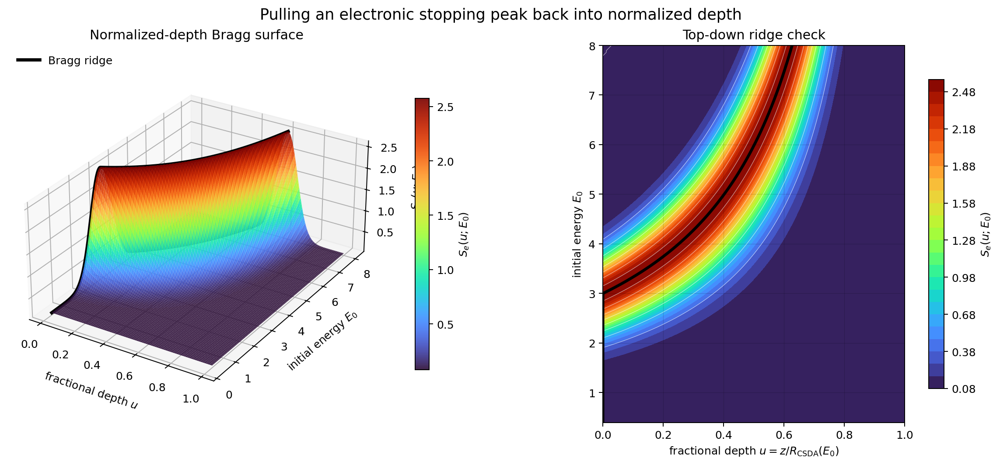

# Nuclear Irradiation Source-Term Theory: Ordered Problem Statements

## The calculation chain

Every theoretical problem below is a certificate for one arrow in this chain:

$$
\text{ion} + \text{target}
\;\longrightarrow\;
S_e(E),\, S_n(E)
\;\longrightarrow\;
S_e(z),\, S_n(z)
\;\longrightarrow\;
Q_e(r,z,t)
\;\longrightarrow\;
T_e(r,t),\, T_l(r,t)
\;\longrightarrow\;
\text{LAMMPS / TTM-MD source}
\;\longrightarrow\;
\text{track / redox observables}.
$$

Each arrow is a place where physics or numerics can quietly fail in a way that contaminates everything downstream. The problems are ordered to follow the chain: foundational bookkeeping first, then range integration, then source-term construction, then the thermal spike, then numerics, then handoff to LAMMPS, then observables, then uncertainty, then calibration.

For each problem I state the question, describe the mathematical approach in enough detail that the derivation can be hand-worked (or done in Mathematica) and a corresponding numerical test can be written, give a short **Status** paragraph indicating what is pure-math-derivable now, what is gated on literature values, and what is gated on software outputs, and close with a **Visualization** paragraph specifying whether (and which) Mathematica demo or Python plot should be built.

Two visualization categories apply throughout the document. *Project demos* live in the repository, support certificates, and get maintained — these are typically reproducible Python plots that drive validation and regression tests. *Learning sketches* are scratch Mathematica notebooks built when a concept feels slippery, time-boxed to an afternoon, and not maintained. The default is to build neither: visualization is added only where the picture changes intuition (learning sketch) or where the plot itself becomes a validation artifact (project demo).

---

## Scope and approximation hierarchy

Before any of the certificates below, fix what model layer each one applies to. The pipeline is a sequence of approximations, and each layer has a domain of validity that does *not* extend automatically into the next:

1. **CSDA stopping.** One-dimensional integration of $S_e(E) + S_n(E)$. Captures mean energy loss along an idealized straight trajectory. Does *not* capture angular scattering, range straggling, recoil cascades, or any spatially-resolved damage.

2. **BCA / Monte Carlo transport.** Resolves angular scattering, projected range $R_p$, longitudinal/lateral straggling, and vacancy/ionization profiles via binary-collision histories. Still treats electronic stopping as a continuous frictional drag — does *not* resolve track-core electron dynamics.

3. **Radial-dose modeling.** Distributes the deposited electronic energy from a single ion track into a radial kernel $f(r)$ around the ion path. The shape of $f(r)$ is a physical input from delta-electron transport models (Katz–Kobetich, Waligórski, etc.), not free-floating. Does *not* solve electron transport from first principles.

4. **TTM / thermal-spike modeling.** Couples the radial dose to a two-temperature diffusion problem. Captures peak lattice temperature, cooling time, and a melt-radius proxy. Treats $C_e, C_l, \kappa_e, \kappa_l, G$ as continuum thermophysical parameters — does *not* resolve atomistic structure.

5. **TTM-MD (LAMMPS handoff).** Couples the TTM electronic subsystem to an MD trajectory through energy exchange. Resolves atomic-scale rearrangement, defect formation, amorphization. With a fixed-charge interatomic potential, it does *not* resolve oxidation-state changes.

6. **Redox-aware MLIP-MD.** A charge-aware or environment-classifier potential capable of distinguishing Ce³⁺ from Ce⁴⁺ environments. Required for any direct claim about ceria redox response under irradiation.

7. **Post-processing proxies.** Structural surrogates — coordination, local strain, Steinhardt parameters — extracted from any of (4)–(6) and compared against experiment. These are *proxies*, not direct measurements.

The single most damaging mistake the project can make is comparing an observable from one layer to an experimental measurement that lives in another layer — for example, treating a CSDA range as a measured projected range, or treating a fixed-charge MD coordination profile as a redox measurement. Each problem below operates at one layer and should not be reached for outside it.

The certificate problems are organized roughly by layer:

- Problems 1, 2, 3, 3b cover layer 1 and the bookkeeping beneath all layers.
- Problems 4, 4b, 5 cover layer 3.
- Problems 6, 7, 7b, 8 cover layer 4.
- Problem 8b covers the layer-4-to-5 handoff.
- Problems 9, 10, 11 cover layers 5–7 and the experimental comparison.

---

## Problem 1. Unit and stopping-power consistency

> [!question]
> Given that stopping powers in the literature are reported in $\mathrm{keV/nm}$, $\mathrm{MeV/\mu m}$, $\mathrm{eV/\mathring A}$, and $\mathrm{J/m}$, how do we convert between them exactly (within floating-point tolerance) and certify the conversions before using them anywhere downstream?

**Approach.** Hand-work the canonical identities. The three energy-per-length conventions reduce to a single conversion through the eV–Å base:

$$
1\,\mathrm{keV/nm} \;=\; \frac{10^3\,\mathrm{eV}}{10\,\mathrm{\mathring A}} \;=\; 100\,\mathrm{eV/\mathring A},
\qquad
1\,\mathrm{MeV/\mu m} \;=\; \frac{10^6\,\mathrm{eV}}{10^4\,\mathrm{\mathring A}} \;=\; 100\,\mathrm{eV/\mathring A},
$$

so

$$
1\,\mathrm{keV/nm} \;=\; 1\,\mathrm{MeV/\mu m} \;=\; 100\,\mathrm{eV/\mathring A}.
$$

Conversion to SI uses the elementary charge $e = 1.602176634 \times 10^{-19}\,\mathrm{C}$:

$$
1\,\mathrm{eV/\mathring A}
\;=\; \frac{1.602176634 \times 10^{-19}\,\mathrm{J}}{10^{-10}\,\mathrm{m}}
\;=\; 1.602176634 \times 10^{-9}\,\mathrm{J/m},
$$

$$
1\,\mathrm{keV/nm} \;\approx\; 1.602176634 \times 10^{-7}\,\mathrm{J/m}.
$$

Pick a single internal unit (eV/Å is a sensible choice; J/m is the SI-clean alternative) and convert all imported curves to it on ingest. The certificate is a test suite that:

- Round-trips a representative value through every conversion pair and checks equality to within $10^{-12}$ relative error.
- Verifies that a literature-reported value (e.g. $S_e = 20\,\mathrm{keV/nm}$ for a specific Xe-on-SiO₂ benchmark) reproduces the published deposited energy per unit length when fed through the source-term builder downstream.

This problem is first because every downstream certificate inherits its numerical accuracy from this one.


---

## Problem 2. Compound target and ceria stoichiometry bookkeeping

> [!question]
> For a compound target with formula $A_p B_q$, and in particular for non-stoichiometric ceria $\mathrm{CeO}_{2-x}$, how do we deterministically derive atomic fractions, mass fractions, number densities, and average cation valence from the formula and mass density alone?


Let the compound be

$$
A_p B_q,
$$

where $p>0, q>0, M_A$ and $M_B$ are molar masses in $\mathrm{g} / \mathrm{mol}$, and $\rho$ is the mass density in $\mathrm{g} / \mathrm{cm}^3$.
Atomic fractions

$$
\begin{gathered}
N_A^{(\text {atoms per formula })}=p, \\
N_B^{(\text {atoms per formula })}=q, \\
N_{\text {atoms }}^{(\text {per formula })}=N_A^{(\text {atoms per formula })}+N_B^{(\text {atoms per formula })}=p+q, \\
x_A=\frac{N_A^{(\text {atoms per formula })}}{N_{\text {atoms }}^{(\text {per formula })}}=\frac{p}{p+q}, \\
x_B=\frac{N_B^{(\text {atoms per formula })}}{N_{\text {atoms }}^{(\text {per formula })}}=\frac{q}{p+q} .
\end{gathered}
$$


Hence

$$
x_A+x_B=\frac{p}{p+q}+\frac{q}{p+q}=\frac{p+q}{p+q}=1 .
$$


## Mass Fractions


The mass of one mole of formula units is

$$
M_f=p M_A+q M_B
$$


The contribution from species $A$ to one mole of formula units is

$$
M_A^{(\text {contribution })}=p M_A
$$


The contribution from species $B$ to one mole of formula units is

$$
M_B^{(\text {contribution })}=q M_B .
$$


Therefore

$$
\begin{aligned}
& w_A=\frac{M_A^{(\text {contribution })}}{M_f}=\frac{p M_A}{p M_A+q M_B}, \\
& w_B=\frac{M_B^{(\text {contribution })}}{M_f}=\frac{q M_B}{p M_A+q M_B} .
\end{aligned}
$$


Thus

$$
w_A+w_B=\frac{p M_A}{p M_A+q M_B}+\frac{q M_B}{p M_A+q M_B}=\frac{p M_A+q M_B}{p M_A+q M_B}=1
$$


## Formula-Unit Number Density


Take a sample volume $V$ in $\mathrm{cm}^3$. Its mass is

$$
m=\rho V
$$


The number of moles of formula units is

$$
n_{\mathrm{mol}, f}=\frac{m}{M_f}=\frac{\rho V}{p M_A+q M_B}
$$


The number of formula units is

$$
N_f=n_{\mathrm{mol}, f} N_{\mathrm{Av}}=\left(\frac{\rho V}{p M_A+q M_B}\right) N_{\mathrm{Av}}=\frac{\rho V N_{\mathrm{Av}}}{p M_A+q M_B} .
$$


The formula-unit number density is

$$
n_f=\frac{N_f}{V}=\frac{1}{V} \frac{\rho V N_{\mathrm{Av}}}{p M_A+q M_B}=\frac{\rho N_{\mathrm{Av}}}{p M_A+q M_B} .
$$


With $\rho$ in $\mathrm{g} / \mathrm{cm}^3$ and $M_A, M_B$ in $\mathrm{g} / \mathrm{mol}$,

$$
n_f=\frac{\rho N_{\mathrm{Av}}}{p M_A+q M_B} \quad\left[\frac{\text { formula units }}{\mathrm{cm}^3}\right] .
$$


To convert to $\mathrm{m}^{-3}$,

$$
\begin{gathered}
1 \mathrm{~cm}=10^{-2} \mathrm{~m}, \\
1 \mathrm{~cm}^3=\left(10^{-2} \mathrm{~m}\right)^3=10^{-6} \mathrm{~m}^3, \\
1 \mathrm{~cm}^{-3}=\frac{1}{1 \mathrm{~cm}^3}=\frac{1}{10^{-6} \mathrm{~m}^3}=10^6 \mathrm{~m}^{-3}
\end{gathered}
$$

so

$$
n_f\left[\mathrm{~m}^{-3}\right]=10^6 n_f\left[\mathrm{~cm}^{-3}\right]=10^6 \frac{\rho N_{\mathrm{Av}}}{p M_A+q M_B}
$$


## Species Number Densities


Since each formula unit contains $p$ atoms of $A$,

$$
n_A=p n_f=p \frac{\rho N_{\mathrm{Av}}}{p M_A+q M_B}
$$


Since each formula unit contains $q$ atoms of $B$,

$$
n_B=q n_f=q \frac{\rho N_{\mathrm{Av}}}{p M_A+q M_B}
$$


The total atom number density is

$$
n_{\text {atoms }}=n_A+n_B=p n_f+q n_f=(p+q) n_f=(p+q) \frac{\rho N_{\text {Av }}}{p M_A+q M_B}
$$


The atomic fractions can also be recovered from number densities:

$$
\begin{aligned}
& \frac{n_A}{n_{\text {atoms }}}=\frac{p n_f}{(p+q) n_f}=\frac{p}{p+q}=x_A, \\
& \frac{n_B}{n_{\text {atoms }}}=\frac{q n_f}{(p+q) n_f}=\frac{q}{p+q}=x_B .
\end{aligned}
$$


## Ceria written as $\mathrm{CeO}_{2-x}$
For normalized ceria,

$$
\mathrm{CeO}_{2-x},
$$

the stoichiometric coefficients are

$$
\begin{gathered}
p_{\mathrm{Ce}}=1 \\
q_{\mathrm{O}}=2-x
\end{gathered}
$$


The total number of atoms per normalized formula unit is

$$
p_{\mathrm{Ce}}+q_{\mathrm{O}}=1+(2-x)=3-x .
$$


Therefore

$$
\begin{aligned}
& x_{\mathrm{Ce}}=\frac{p_{\mathrm{Ce}}}{p_{\mathrm{Ce}}+q_{\mathrm{O}}}=\frac{1}{1+(2-x)}=\frac{1}{3-x}, \\
& x_{\mathrm{O}}=\frac{q_{\mathrm{O}}}{p_{\mathrm{Ce}}+q_{\mathrm{O}}}=\frac{2-x}{1+(2-x)}=\frac{2-x}{3-x} .
\end{aligned}
$$


Then

$$
x_{\mathrm{Ce}}+x_{\mathrm{O}}=\frac{1}{3-x}+\frac{2-x}{3-x}=\frac{1+2-x}{3-x}=\frac{3-x}{3-x}=1 .
$$


The normalized formula molar mass is

$$
M_{\mathrm{CeO}_2-x}=1 \cdot M_{\mathrm{Ce}}+(2-x) M_{\mathrm{O}}=M_{\mathrm{Ce}}+(2-x) M_{\mathrm{O}} .
$$


The normalized formula-unit number density is

$$
n_{\mathrm{CeO}_{2-x}}=\frac{\rho N_{\mathrm{Av}}}{M_{\mathrm{Ce}}+(2-x) M_{\mathrm{O}}}
$$


The species number densities are

$$
\begin{gathered}
n_{\mathrm{Ce}}=1 \cdot n_{\mathrm{CeO}_{2-x}}=\frac{\rho N_{\mathrm{Av}}}{M_{\mathrm{Ce}}+(2-x) M_{\mathrm{O}}}, \\
n_{\mathrm{O}}=(2-x) n_{\mathrm{CeO}_{2-x}}=(2-x) \frac{\rho N_{\mathrm{Av}}}{M_{\mathrm{Ce}}+(2-x) M_{\mathrm{O}}} .
\end{gathered}
$$


The total atom number density is

$$
n_{\mathrm{atoms}}=n_{\mathrm{Ce}}+n_{\mathrm{O}}=n_{\mathrm{CeO}_{2-2}}+(2-x) n_{\mathrm{CeO}_{2-x}}=(3-x) n_{\mathrm{CeO}_{2-x}}=(3-x) \frac{\rho N_{\mathrm{Av}}}{M_{\mathrm{Ce}}+(2-x) M_{\mathrm{O}}} .
$$


## Average cerium valence in $\mathrm{CeO}_{2-x}$
Let the average cerium valence be $\bar{v}_{\mathrm{Ce}}$. Charge neutrality requires

$$
\bar{v}_{\mathrm{Ce}}(1)+(-2)(2-x)=0
$$


Therefore

$$
\begin{gathered}
\bar{v}_{\mathrm{Ce}}-2(2-x)=0, \\
\bar{v}_{\mathrm{Ce}}=2(2-x), \\
\bar{v}_{\mathrm{Ce}}=4-2 x .
\end{gathered}
$$


So

$$
\bar{v}_{\mathrm{Ce}}=4-2 x .
$$


## Ceria written as $\mathrm{Ce}_m \mathrm{O}_n$
If a ceria phase is written as

$$
\mathrm{Ce}_m \mathrm{O}_n,
$$

then dividing the whole formula by $m$ gives

$$
\mathrm{Ce}_m \mathrm{O}_n=m\left(\mathrm{Ce} \mathrm{O}_{n / m}\right)
$$


Thus the normalized oxygen content per cerium atom is

$$
2-x=\frac{n}{m}
$$


Therefore

$$
x=2-\frac{n}{m}
$$


The average cerium valence is

$$
\bar{v}_{\mathrm{Ce}}=4-2 x=4-2\left(2-\frac{n}{m}\right)=4-\left(4-\frac{2 n}{m}\right)=4-4+\frac{2 n}{m}=\frac{2 n}{m} .
$$


So for a parser that reads $\mathrm{Ce}_m \mathrm{O}_n$,

$$
\begin{array}{|l|}
\hline x=2-\frac{n}{m}, \\
\bar{v}_{\mathrm{Ce}}=\frac{2 n}{m}, \\
\hline
\end{array}
$$


## Four ceria phases
For $\mathrm{CeO}_2$,

$$
\begin{gathered}
m=1, \quad n=2, \\
x=2-\frac{n}{m}=2-\frac{2}{1}=2-2=0, \\
\bar{v}_{\mathrm{Ce}}=\frac{2 n}{m}=\frac{2(2)}{1}=\frac{4}{1}=4 .
\end{gathered}
$$


For $\mathrm{Ce}_{11} \mathrm{O}_{20}$,

$$
\begin{gathered}
m=11, \quad n=20 \\
x=2-\frac{n}{m}=2-\frac{20}{11}=\frac{22}{11}-\frac{20}{11}=\frac{2}{11} \\
\bar{v}_{\mathrm{Ce}}=\frac{2 n}{m}=\frac{2(20)}{11}=\frac{40}{11} \approx 3.63636 .
\end{gathered}
$$


For $\mathrm{Ce}_7 \mathrm{O}_{12}$,

$$
\begin{gathered}
m=7, \quad n=12 \\
x=2-\frac{n}{m}=2-\frac{12}{7}=\frac{14}{7}-\frac{12}{7}=\frac{2}{7} \\
\bar{v}_{\mathrm{Ce}}=\frac{2 n}{m}=\frac{2(12)}{7}=\frac{24}{7} \approx 3.42857
\end{gathered}
$$


For $\mathrm{Ce}_2 \mathrm{O}_3$,

$$
\begin{gathered}
m=2, \quad n=3 \\
x=2-\frac{n}{m}=2-\frac{3}{2}=\frac{4}{2}-\frac{3}{2}=\frac{1}{2} \\
\bar{v}_{\mathrm{Ce}}=\frac{2 n}{m}=\frac{2(3)}{2}=\frac{6}{2}=3
\end{gathered}
$$


Thus the exact symbolic benchmark values are

$$
\begin{array}{rll}
\mathrm{CeO}_2: & x=0, & \bar{v}_{\mathrm{Ce}}=4, \\
\mathrm{Ce}_{11} \mathrm{O}_{20}: & x=\frac{2}{11}, & \bar{v}_{\mathrm{Ce}}=\frac{40}{11}, \\
\mathrm{Ce}_7 \mathrm{O}_{12}: & x=\frac{2}{7}, & \bar{v}_{\mathrm{Ce}}=\frac{24}{7}, \\
\mathrm{Ce}_2 \mathrm{O}_3: & x=\frac{1}{2}, & \bar{v}_{\mathrm{Ce}}=3 .
\end{array}
$$


## Normalization check: $\mathrm{Ce}_m \mathrm{O}_n$ versus $\mathrm{CeO}_{n / m}$
The crystallographic formula is

$$
\mathrm{Ce}_m \mathrm{O}_n
$$


The normalized formula is

$$
\mathrm{CeO}_{n / m} .
$$


The crystallographic formula molar mass is

$$
M_{\mathrm{cryst}}=m M_{\mathrm{Ce}}+n M_{\mathrm{O}}
$$


The normalized formula molar mass is

$$
M_{\mathrm{norm}}=M_{\mathrm{Ce}}+\frac{n}{m} M_{\mathrm{O}}
$$


Then

$$
M_{\mathrm{norm}}=M_{\mathrm{Ce}}+\frac{n}{m} M_{\mathrm{O}}=\frac{m}{m} M_{\mathrm{Ce}}+\frac{n}{m} M_{\mathrm{O}}=\frac{m M_{\mathrm{Ce}}}{m}+\frac{n M_{\mathrm{O}}}{m}=\frac{m M_{\mathrm{Ce}}+n M_{\mathrm{O}}}{m}=\frac{M_{\mathrm{cryst}}}{m} .
$$


Thus

$$
M_{\mathrm{cryst}}=m M_{\mathrm{norm}}
$$


The crystallographic formula-unit number density is

$$
n_{f, \mathrm{cryst}}=\frac{\rho N_{\mathrm{Av}}}{M_{\mathrm{cryst}}}
$$


The normalized formula-unit number density is

$$
n_{f, \text { norm }}=\frac{\rho N_{\mathrm{Av}}}{M_{\text {norm }}}=\frac{\rho N_{\mathrm{Av}}}{M_{\text {cryst }} / m}=\rho N_{\mathrm{Av}} \frac{m}{M_{\text {cryst }}}=m \frac{\rho N_{\mathrm{Av}}}{M_{\text {cryst }}}=m n_{f, \text { cryst }}
$$


So

$$
n_{f, \text { norm }}=m n_{f, \text { cryst }} .
$$


For cerium atoms,

$$
n_{\mathrm{Ce}, \text { cryst }}=m n_{f, \text { cryst }},
$$

and

$$
n_{\mathrm{Ce}, \mathrm{norm}}=1 \cdot n_{f, \mathrm{norm}}=n_{f, \mathrm{norm}}=m n_{f, \mathrm{cryst}} .
$$


Therefore

$$
n_{\mathrm{Ce}, \text { cryst }}=n_{\mathrm{Ce}, \text { norm }} .
$$


For oxygen atoms,

$$
n_{\mathrm{O}, \text { cryst }}=n n_{f, \text { cryst }},
$$

and

$$
n_{\mathrm{O}, \mathrm{norm}}=\frac{n}{m} n_{f, \mathrm{norm}}=\frac{n}{m}\left(m n_{f, \mathrm{cryst}}\right)=\frac{n m}{m} n_{f, \mathrm{cryst}}=n n_{f, \mathrm{cryst}} .
$$


Therefore

$$
n_{\mathrm{O}, \text { cryst }}=n_{\mathrm{O}, \text { norm }} .
$$


Hence the formula-unit number density depends on the chosen formula normalization, but the physical species number densities do not:

$$
\begin{aligned}
& n_{f, \text { norm }}=m n_{f, \text { cryst }} \\
& n_{\mathrm{Ce}, \text { cryst }}=n_{\mathrm{Ce}, \text { norm }} \\
& n_{\mathrm{O}, \text { cryst }}=n_{\mathrm{O}, \text { norm }} .
\end{aligned}
$$


## Final certificate conditions
A stoichiometry module is certified for this problem if, for every parsed binary formula $A_p B_q$,

$$
\begin{gathered}
x_A=\frac{p}{p+q}, \quad x_B=\frac{q}{p+q}, \\
w_A=\frac{p M_A}{p M_A+q M_B}, \quad w_B=\frac{q M_B}{p M_A+q M_B}, \\
n_f=\frac{\rho N_{\mathrm{Av}}}{p M_A+q M_B}, \quad n_A=p n_f, \quad n_B=q n_f,
\end{gathered}
$$

and, for every parsed ceria formula $\mathrm{Ce}_m \mathrm{O}_n$,

$$
\begin{aligned}
& x=2-\frac{n}{m} \\
& \bar{v}_{\mathrm{Ce}}=\frac{2 n}{m}
\end{aligned}
$$

with the benchmark identities

$$
\begin{aligned}
\mathrm{CeO}_2 & \mapsto(0,4), \\
\mathrm{Ce}_{11} \mathrm{O}_{20} & \mapsto\left(\frac{2}{11}, \frac{40}{11}\right), \\
\mathrm{Ce}_7 \mathrm{O}_{12} & \mapsto\left(\frac{2}{7}, \frac{24}{7}\right), \\
\mathrm{Ce}_2 \mathrm{O}_3 & \mapsto\left(\frac{1}{2}, 3\right) .
\end{aligned}
$$


> [!NOTE]
> The remaining work is implementation: the code must parse formulas deterministically, preserve exact rational stoichiometric coefficients where possible, and compute density-dependent number densities only after a trusted value of $\rho$ has been supplied.


---

## Problem 3. Continuous-slowing-down range and depth profile

> [!question]
> a.) Given electronic and nuclear stopping curves $S_e(E)$ and $S_n(E)$, how do we compute the CSDA range and the depth-resolved stopping $S_e(z), S_n(z)$ in a way that is numerically certified before the integrator touches real (interpolated) tables?
> b.) Using Mathematica`Manipulate`, create a 3D demonstration showing $S_e(z;\, E_0)$ as a surface over the $(z, E_0)$ plane. The ridge that traces the locus of maximum $S_e(z)$ across initial energies — the Bragg peak — is the single best visual for the distinction between $S(E)$ and $S(z)$. Watching that ridge migrate as $E_0$ varies makes the $E \leftrightarrow z$ inversion stop feeling abstract.
> c.) Using mathematica, plot the parametric 3D curve $(z,\, E(z),\, S(E(z)))$ for fixed $E_0$, with a slider on $E_0$ to sweep the curve through "depth–energy–stopping" space. This is the closest analog to the trajectory-following geometry from particle-mechanics intuition: a single ion's journey traced as one path through three coupled coordinates.


##### solution

##### problem 3(a)

Let the total stopping curve be

$$
\begin{aligned}
S(E)
&=S_e(E)+S_n(E).
\end{aligned}
$$

The continuous-slowing-down approximation treats the ion as losing energy continuously along a one-dimensional path coordinate $z$. With $z=0$ at the entrance surface and $E(0)=E_0$, the defining energy-loss equation is

$$
\begin{aligned}
\frac{dE}{dz}
&=-S(E(z)) \\
&=-\bigl(S_e(E(z))+S_n(E(z))\bigr).
\end{aligned}
$$

Separate variables:

$$
\begin{aligned}
\frac{dE}{dz}
&=-S(E(z)) \\
dE
&=-S(E(z))\,dz \\
\frac{dE}{S(E(z))}
&=-dz \\
dz
&=-\frac{dE}{S(E)}.
\end{aligned}
$$

At the end of the CSDA path, the energy has fallen from $E_0$ to $0$. Therefore

$$
\begin{aligned}
R_{\mathrm{CSDA}}(E_0)
&=\int_{0}^{R_{\mathrm{CSDA}}(E_0)} dz \\
&=\int_{E=E_0}^{E=0} \left(-\frac{dE}{S(E)}\right) \\
&=-\int_{E_0}^{0}\frac{dE}{S(E)} \\
&=\int_{0}^{E_0}\frac{dE}{S(E)} \\
&=\int_{0}^{E_0}\frac{dE}{S_e(E)+S_n(E)}.
\end{aligned}
$$

For a point inside the track, the same separation gives the depth-energy relation. If the ion has energy $E(z)$ at depth $z$, then

$$
\begin{aligned}
z
&=\int_{0}^{z} d\zeta \\
&=\int_{\xi=E_0}^{\xi=E(z)}\left(-\frac{d\xi}{S(\xi)}\right) \\
&=-\int_{E_0}^{E(z)}\frac{d\xi}{S(\xi)} \\
&=\int_{E(z)}^{E_0}\frac{d\xi}{S(\xi)} \\
&=\int_{E(z)}^{E_0}\frac{d\xi}{S_e(\xi)+S_n(\xi)}.
\end{aligned}
$$

Thus the computational task is: first compute the monotone map

$$
\begin{aligned}
z(E)
&=\int_{E}^{E_0}\frac{d\xi}{S(\xi)} \\
&=\int_{E}^{E_0}\frac{d\xi}{S_e(\xi)+S_n(\xi)},
\end{aligned}
$$

then invert it to obtain $E(z)$, and finally compose the original stopping curves with that inverse:

$$
\begin{aligned}
S_e(z)
&=S_e(E(z)), \\
S_n(z)
&=S_n(E(z)), \\
S(z)
&=S_e(z)+S_n(z) \\
&=S_e(E(z))+S_n(E(z)) \\
&=S(E(z)).
\end{aligned}
$$

The integrator should not first be tested on real stopping tables, because real tables mix three issues at once: quadrature, interpolation, and table quality. The clean certificate is to choose artificial $S_e(E)$ and $S_n(E)$ for which the exact $R_{\mathrm{CSDA}}(E_0)$, $z(E)$, $E(z)$, $S_e(z)$, and $S_n(z)$ are all known.

For the constant-stopping certificate, take

$$
\begin{aligned}
S_e(E)&=a_e, \\
S_n(E)&=a_n, \\
a&=a_e+a_n,
\end{aligned}
$$

with $a>0$. Then

$$
\begin{aligned}
S(E)
&=S_e(E)+S_n(E) \\
&=a_e+a_n \\
&=a.
\end{aligned}
$$

The CSDA range is

$$
\begin{aligned}
R_{\mathrm{CSDA}}(E_0)
&=\int_{0}^{E_0}\frac{dE}{S(E)} \\
&=\int_{0}^{E_0}\frac{dE}{a} \\
&=\frac{1}{a}\int_{0}^{E_0}dE \\
&=\frac{1}{a}\left[E\right]_{0}^{E_0} \\
&=\frac{1}{a}\left(E_0-0\right) \\
&=\frac{E_0}{a}.
\end{aligned}
$$

The depth-energy map is

$$
\begin{aligned}
z(E)
&=\int_{E}^{E_0}\frac{d\xi}{S(\xi)} \\
&=\int_{E}^{E_0}\frac{d\xi}{a} \\
&=\frac{1}{a}\int_{E}^{E_0}d\xi \\
&=\frac{1}{a}\left[\xi\right]_{E}^{E_0} \\
&=\frac{1}{a}(E_0-E) \\
&=\frac{E_0-E}{a}.
\end{aligned}
$$

Invert this relation explicitly:

$$
\begin{aligned}
z
&=\frac{E_0-E}{a} \\
az
&=E_0-E \\
E+az
&=E_0 \\
E
&=E_0-az.
\end{aligned}
$$

Therefore, for $0\le z\le E_0/a$,

$$
\begin{aligned}
E(z)
&=E_0-az, \\
S_e(z)
&=S_e(E(z)) \\
&=a_e, \\
S_n(z)
&=S_n(E(z)) \\
&=a_n, \\
S(z)
&=S_e(z)+S_n(z) \\
&=a_e+a_n \\
&=a.
\end{aligned}
$$

The inverse check is exact:

$$
\begin{aligned}
z(E(z))
&=\frac{E_0-E(z)}{a} \\
&=\frac{E_0-(E_0-az)}{a} \\
&=\frac{E_0-E_0+az}{a} \\
&=\frac{az}{a} \\
&=z,
\end{aligned}
$$

and

$$
\begin{aligned}
E(z(E))
&=E_0-a\,z(E) \\
&=E_0-a\left(\frac{E_0-E}{a}\right) \\
&=E_0-(E_0-E) \\
&=E_0-E_0+E \\
&=E.
\end{aligned}
$$

For the linear-stopping certificate, take

$$
\begin{aligned}
S_e(E)&=a_e+b_eE, \\
S_n(E)&=a_n+b_nE, \\
a&=a_e+a_n, \\
b&=b_e+b_n,
\end{aligned}
$$

with $a>0$ and $b>0$. Then

$$
\begin{aligned}
S(E)
&=S_e(E)+S_n(E) \\
&=(a_e+b_eE)+(a_n+b_nE) \\
&=a_e+a_n+b_eE+b_nE \\
&=(a_e+a_n)+(b_e+b_n)E \\
&=a+bE.
\end{aligned}
$$

The CSDA range is

$$
\begin{aligned}
R_{\mathrm{CSDA}}(E_0)
&=\int_{0}^{E_0}\frac{dE}{S(E)} \\
&=\int_{0}^{E_0}\frac{dE}{a+bE}.
\end{aligned}
$$

Use the substitution

$$
\begin{aligned}
u&=a+bE, \\
du&=b\,dE, \\
dE&=\frac{du}{b}.
\end{aligned}
$$

The limits transform as

$$
\begin{aligned}
E&=0
&&\Longrightarrow&
u&=a+b(0)=a, \\
E&=E_0
&&\Longrightarrow&
u&=a+bE_0.
\end{aligned}
$$

Therefore

$$
\begin{aligned}
R_{\mathrm{CSDA}}(E_0)
&=\int_{0}^{E_0}\frac{dE}{a+bE} \\
&=\int_{u=a}^{u=a+bE_0}\frac{1}{u}\frac{du}{b} \\
&=\frac{1}{b}\int_{a}^{a+bE_0}\frac{du}{u} \\
&=\frac{1}{b}\left[\ln u\right]_{a}^{a+bE_0} \\
&=\frac{1}{b}\left(\ln(a+bE_0)-\ln a\right) \\
&=\frac{1}{b}\ln\!\left(\frac{a+bE_0}{a}\right).
\end{aligned}
$$

The depth-energy map is

$$
\begin{aligned}
z(E)
&=\int_{E}^{E_0}\frac{d\xi}{S(\xi)} \\
&=\int_{E}^{E_0}\frac{d\xi}{a+b\xi}.
\end{aligned}
$$

Use

$$
\begin{aligned}
u&=a+b\xi, \\
du&=b\,d\xi, \\
d\xi&=\frac{du}{b}.
\end{aligned}
$$

The limits transform as

$$
\begin{aligned}
\xi&=E
&&\Longrightarrow&
u&=a+bE, \\
\xi&=E_0
&&\Longrightarrow&
u&=a+bE_0.
\end{aligned}
$$

Thus

$$
\begin{aligned}
z(E)
&=\int_{E}^{E_0}\frac{d\xi}{a+b\xi} \\
&=\int_{u=a+bE}^{u=a+bE_0}\frac{1}{u}\frac{du}{b} \\
&=\frac{1}{b}\int_{a+bE}^{a+bE_0}\frac{du}{u} \\
&=\frac{1}{b}\left[\ln u\right]_{a+bE}^{a+bE_0} \\
&=\frac{1}{b}\left(\ln(a+bE_0)-\ln(a+bE)\right) \\
&=\frac{1}{b}\ln\!\left(\frac{a+bE_0}{a+bE}\right).
\end{aligned}
$$

Invert this relation:

$$
\begin{aligned}
z
&=\frac{1}{b}\ln\!\left(\frac{a+bE_0}{a+bE}\right) \\
bz
&=\ln\!\left(\frac{a+bE_0}{a+bE}\right) \\
e^{bz}
&=\frac{a+bE_0}{a+bE} \\
(a+bE)e^{bz}
&=a+bE_0 \\
a+bE
&=(a+bE_0)e^{-bz} \\
bE
&=(a+bE_0)e^{-bz}-a \\
E
&=\frac{(a+bE_0)e^{-bz}-a}{b}.
\end{aligned}
$$

Therefore, for

$$
\begin{aligned}
0
&\le z \le R_{\mathrm{CSDA}}(E_0) \\
&=\frac{1}{b}\ln\!\left(\frac{a+bE_0}{a}\right),
\end{aligned}
$$

the exact energy-depth curve is

$$
\begin{aligned}
E(z)
&=\frac{(a+bE_0)e^{-bz}-a}{b}.
\end{aligned}
$$

Composing the electronic stopping curve with $E(z)$ gives

$$
\begin{aligned}
S_e(z)
&=S_e(E(z)) \\
&=a_e+b_eE(z) \\
&=a_e+b_e\left(\frac{(a+bE_0)e^{-bz}-a}{b}\right) \\
&=a_e+\frac{b_e}{b}\left((a+bE_0)e^{-bz}-a\right) \\
&=a_e+\frac{b_e}{b}(a+bE_0)e^{-bz}-\frac{b_e}{b}a.
\end{aligned}
$$

Similarly,

$$
\begin{aligned}
S_n(z)
&=S_n(E(z)) \\
&=a_n+b_nE(z) \\
&=a_n+b_n\left(\frac{(a+bE_0)e^{-bz}-a}{b}\right) \\
&=a_n+\frac{b_n}{b}\left((a+bE_0)e^{-bz}-a\right) \\
&=a_n+\frac{b_n}{b}(a+bE_0)e^{-bz}-\frac{b_n}{b}a.
\end{aligned}
$$

Adding these two depth-resolved components recovers the total stopping exactly:

$$
\begin{aligned}
S_e(z)+S_n(z)
&=\left(a_e+b_eE(z)\right)+\left(a_n+b_nE(z)\right) \\
&=a_e+a_n+b_eE(z)+b_nE(z) \\
&=(a_e+a_n)+(b_e+b_n)E(z) \\
&=a+bE(z) \\
&=a+b\left(\frac{(a+bE_0)e^{-bz}-a}{b}\right) \\
&=a+(a+bE_0)e^{-bz}-a \\
&=(a+bE_0)e^{-bz}.
\end{aligned}
$$

The endpoint check at $z=0$ is

$$
\begin{aligned}
E(0)
&=\frac{(a+bE_0)e^{-b(0)}-a}{b} \\
&=\frac{(a+bE_0)e^{0}-a}{b} \\
&=\frac{(a+bE_0)(1)-a}{b} \\
&=\frac{a+bE_0-a}{b} \\
&=\frac{bE_0}{b} \\
&=E_0.
\end{aligned}
$$

The stopping endpoint check at the entrance is

$$
\begin{aligned}
S(0)
&=S(E(0)) \\
&=S(E_0) \\
&=a+bE_0.
\end{aligned}
$$

At the CSDA range,

$$
\begin{aligned}
z
&=R_{\mathrm{CSDA}}(E_0) \\
&=\frac{1}{b}\ln\!\left(\frac{a+bE_0}{a}\right),
\end{aligned}
$$

so

$$
\begin{aligned}
E(R_{\mathrm{CSDA}}(E_0))
&=\frac{(a+bE_0)e^{-bR_{\mathrm{CSDA}}(E_0)}-a}{b} \\
&=\frac{(a+bE_0)e^{-b\left(\frac{1}{b}\ln\left(\frac{a+bE_0}{a}\right)\right)}-a}{b} \\
&=\frac{(a+bE_0)e^{-\ln\left(\frac{a+bE_0}{a}\right)}-a}{b} \\
&=\frac{(a+bE_0)\left(\frac{a+bE_0}{a}\right)^{-1}-a}{b} \\
&=\frac{(a+bE_0)\left(\frac{a}{a+bE_0}\right)-a}{b} \\
&=\frac{a-a}{b} \\
&=\frac{0}{b} \\
&=0.
\end{aligned}
$$

The full inverse check is also exact:

$$
\begin{aligned}
z(E(z))
&=\frac{1}{b}\ln\!\left(\frac{a+bE_0}{a+bE(z)}\right) \\
&=\frac{1}{b}\ln\!\left(\frac{a+bE_0}{a+b\left(\frac{(a+bE_0)e^{-bz}-a}{b}\right)}\right) \\
&=\frac{1}{b}\ln\!\left(\frac{a+bE_0}{a+(a+bE_0)e^{-bz}-a}\right) \\
&=\frac{1}{b}\ln\!\left(\frac{a+bE_0}{(a+bE_0)e^{-bz}}\right) \\
&=\frac{1}{b}\ln\!\left(e^{bz}\right) \\
&=\frac{1}{b}(bz) \\
&=z,
\end{aligned}
$$

and

$$
\begin{aligned}
E(z(E))
&=\frac{(a+bE_0)e^{-bz(E)}-a}{b} \\
&=\frac{(a+bE_0)e^{-b\left(\frac{1}{b}\ln\left(\frac{a+bE_0}{a+bE}\right)\right)}-a}{b} \\
&=\frac{(a+bE_0)e^{-\ln\left(\frac{a+bE_0}{a+bE}\right)}-a}{b} \\
&=\frac{(a+bE_0)\left(\frac{a+bE_0}{a+bE}\right)^{-1}-a}{b} \\
&=\frac{(a+bE_0)\left(\frac{a+bE}{a+bE_0}\right)-a}{b} \\
&=\frac{a+bE-a}{b} \\
&=\frac{bE}{b} \\
&=E.
\end{aligned}
$$

These identities define the numerical certificate. For each artificial stopping law, compute the quadrature output $R_{\mathrm{num}}(E_0)$ and compare it to the exact range:

$$
\begin{aligned}
\varepsilon_R(E_0)
&=\frac{\left|R_{\mathrm{num}}(E_0)-R_{\mathrm{exact}}(E_0)\right|}
{\max\left(1,\left|R_{\mathrm{exact}}(E_0)\right|\right)}.
\end{aligned}
$$

Then compute the numerical inverse $E_{\mathrm{num}}(z)$ and compare it against the exact inverse:

$$
\begin{aligned}
\varepsilon_E(z;E_0)
&=\frac{\left|E_{\mathrm{num}}(z;E_0)-E_{\mathrm{exact}}(z;E_0)\right|}
{\max\left(1,\left|E_{\mathrm{exact}}(z;E_0)\right|\right)}.
\end{aligned}
$$

Finally, compare the depth-resolved stopping curves by direct composition:

$$
\begin{aligned}
\varepsilon_{S_e}(z;E_0)
&=\frac{\left|S_{e,\mathrm{num}}(z;E_0)-S_{e,\mathrm{exact}}(z;E_0)\right|}
{\max\left(1,\left|S_{e,\mathrm{exact}}(z;E_0)\right|\right)}, \\
\varepsilon_{S_n}(z;E_0)
&=\frac{\left|S_{n,\mathrm{num}}(z;E_0)-S_{n,\mathrm{exact}}(z;E_0)\right|}
{\max\left(1,\left|S_{n,\mathrm{exact}}(z;E_0)\right|\right)}.
\end{aligned}
$$

The integrator is certified for this part only when these errors remain at the expected quadrature, interpolation, and floating-point tolerance across a sweep of $E_0$ and a sweep of depths $0\le z\le R_{\mathrm{CSDA}}(E_0)$. After that, the same pipeline can be applied to real interpolated $S_e(E)$ and $S_n(E)$ tables, with the separate interpolation certificate handled by Problem 3b.


##### problem 3(b)

Use the depth-energy map already derived in part 3(a):

$$
\begin{aligned}
z(E;E_0)
&=\int_E^{E_0}\frac{d\xi}{S_e(\xi)+S_n(\xi)}, \\
S_e(z;E_0)
&=S_e(E(z;E_0)).
\end{aligned}
$$

Thus part 3(b) is a visualization problem: build a surface by composing the energy-depth relation with $S_e(E)$. For the interactive learning sketch below, use normalized depth $u=z/R_{\mathrm{CSDA}}(E_0)$ so every trajectory occupies the same horizontal interval $0\le u\le 1$. The Bragg-peak ridge is the constrained maximum along each fixed-$E_0$ trajectory:

$$
\begin{aligned}
E_\ast(E_0)
&=\operatorname*{arg\,max}_{0<E\le E_0} S_e(E), \\
z_\ast(E_0)
&=z(E_\ast(E_0);E_0), \\
\Gamma(E_0)
&=\bigl(z_\ast(E_0),\,E_0,\,S_e(E_\ast(E_0))\bigr).
\end{aligned}
$$

The following Mathematica demonstration uses dimensionless synthetic stopping curves. The purpose is geometric: make the difference between $S_e(E)$ and $S_e(z;E_0)$ visible before replacing the toy curves with imported SRIM/Iradina stopping tables.

```mathematica
ClearAll["Global`*"];

eMin = 0.02;

se[E_, amp_, ePeak_, width_, base_] :=
  base + amp Exp[-((E - ePeak)/width)^2];

energyAtFraction[u_, e0_] :=
  e0 - u (e0 - eMin);

seFraction[u_, e0_, amp_, ePeak_, width_, base_] :=
  se[energyAtFraction[u, e0], amp, ePeak, width, base];

braggEnergy[e0_, ePeak_] :=
  Min[e0, ePeak];

braggFraction[e0_, ePeak_] :=
  If[e0 <= ePeak, 0, (e0 - ePeak)/(e0 - eMin)];

Manipulate[
 Module[{surface, ridge, energySlice},
  surface =
   Plot3D[
    seFraction[u, e0, amp, ePeak, width, base],
    {u, 0, 1},
    {e0, e0Min, e0Max},
    PlotRange -> {0, amp + base + 0.2},
    PlotPoints -> 55,
    MaxRecursion -> 2,
    Mesh -> {12, 14},
    ColorFunction -> "ThermometerColors",
    ColorFunctionScaling -> True,
    AxesLabel -> {"fractional depth u = z/R(E0)", "initial energy E0", "Se(u; E0)"},
    PlotLabel -> "Bragg-peak ridge in normalized depth",
    BoxRatios -> {1.1, 1.8, 0.7},
    ViewPoint -> {1.7, -2.4, 1.35},
    ImageSize -> 620,
    PerformanceGoal -> "Quality"
   ];

  ridge =
   ParametricPlot3D[
    {
     braggFraction[e0, ePeak],
     e0,
     se[braggEnergy[e0, ePeak], amp, ePeak, width, base]
    },
    {e0, e0Min, e0Max},
    PlotRange -> {0, amp + base + 0.2},
    PlotStyle -> {Black, Thick},
    PlotPoints -> 50
   ];

  Show[surface, ridge, ImageSize -> Large]
 ],
 {{amp, 2.5, "electronic peak amplitude"}, 0.5, 3.5, 0.1},
 {{ePeak, 3.0, "Bragg-peak energy"}, 0.5, 6.0, 0.1},
 {{width, 0.75, "peak width"}, 0.2, 2.0, 0.05},
 {{base, 0.08, "electronic baseline"}, 0.01, 0.25, 0.01},
 Delimiter,
 {{e0Min, 0.4, "minimum initial energy"}, 0.1, 2.0, 0.1},
 {{e0Max, 8.0, "maximum initial energy"}, 3.0, 12.0, 0.25},
 TrackedSymbols :> {amp, ePeak, width, base, e0Min, e0Max}
]
```

This version uses normalized depth $u=z/R_{\mathrm{CSDA}}(E_0)$ instead of physical depth $z$. That is a deliberate choice for the demonstration: the physical-depth surface has a changing domain width because each $E_0$ has a different range, which makes the geometry visually misleading. In normalized depth, every trajectory runs from $u=0$ at the entrance face to $u=1$ at the stopping point. The electronic stopping curve is a synthetic Gaussian peak in energy, so the constrained ridge energy is $\min(E_0,E_{\mathrm{peak}})$. When $E_0<E_{\mathrm{peak}}$, the ridge sits at $u=0$; when $E_0>E_{\mathrm{peak}}$, the ridge moves into the interior at the fractional depth where the ion slows to $E_{\mathrm{peak}}$.


The same normalized-depth construction is cleaner as a static Python figure because Python gives direct control over the mesh, camera, and a second top-down diagnostic panel. The left panel below is the 3D surface; the right panel is the same surface viewed as a contour plot. The black curve is the ridge in both panels.



The figure is generated by `Scripts/problem3b_normalized_bragg_surface.py`. Regenerate it with

```bash
python3 Scripts/problem3b_normalized_bragg_surface.py
```

```python
from pathlib import Path

import matplotlib.pyplot as plt
import numpy as np


OUT = Path("/Users/gradyclopton/ObsidianVaults/research_2025/images")
OUT.mkdir(parents=True, exist_ok=True)


e_min = 0.02
amp = 2.5
e_peak = 3.0
width = 0.75
base = 0.08
e0_min = 0.4
e0_max = 8.0


def s_e(energy):
    return base + amp * np.exp(-((energy - e_peak) / width) ** 2)


def energy_at_fraction(u, e0):
    return e0 - u * (e0 - e_min)


def bragg_energy(e0):
    return np.minimum(e0, e_peak)


def bragg_fraction(e0):
    denom = np.maximum(e0 - e_min, np.finfo(float).eps)
    return np.where(e0 <= e_peak, 0.0, (e0 - e_peak) / denom)


u = np.linspace(0.0, 1.0, 180)
e0 = np.linspace(e0_min, e0_max, 220)
U, E0 = np.meshgrid(u, e0)
E = energy_at_fraction(U, E0)
SE = s_e(E)

ridge_e0 = np.linspace(e0_min, e0_max, 500)
ridge_u = bragg_fraction(ridge_e0)
ridge_se = s_e(bragg_energy(ridge_e0))

plt.rcParams.update(
    {
        "figure.dpi": 180,
        "font.size": 10,
        "axes.labelsize": 10,
        "axes.titlesize": 12,
        "axes.linewidth": 0.8,
    }
)

fig = plt.figure(figsize=(12.6, 5.8), constrained_layout=True)
gs = fig.add_gridspec(1, 2, width_ratios=[1.25, 1.0], wspace=0.20)

ax = fig.add_subplot(gs[0, 0], projection="3d")
surface = ax.plot_surface(
    U,
    E0,
    SE,
    cmap="turbo",
    linewidth=0.0,
    antialiased=True,
    alpha=0.92,
    rstride=2,
    cstride=2,
)
ax.plot(
    ridge_u,
    ridge_e0,
    ridge_se,
    color="black",
    linewidth=3.0,
    label="Bragg ridge",
)
ax.set_xlabel(r"fractional depth $u$", labelpad=8)
ax.set_ylabel(r"initial energy $E_0$", labelpad=8)
ax.set_zlabel(r"$S_e(u;E_0)$", labelpad=8)
ax.set_title("Normalized-depth Bragg surface")
ax.view_init(elev=28, azim=-58)
ax.set_box_aspect((1.25, 1.75, 0.75))
ax.legend(loc="upper left", frameon=False)

cbar = fig.colorbar(surface, ax=ax, shrink=0.72, pad=0.08)
cbar.set_label(r"$S_e(u;E_0)$")

ax2 = fig.add_subplot(gs[0, 1])
levels = np.linspace(SE.min(), SE.max(), 26)
contour = ax2.contourf(U, E0, SE, levels=levels, cmap="turbo")
ax2.contour(U, E0, SE, levels=levels[::3], colors="white", linewidths=0.45, alpha=0.65)
ax2.plot(ridge_u, ridge_e0, color="black", linewidth=2.6)
ax2.set_xlabel(r"fractional depth $u=z/R_{\rm CSDA}(E_0)$")
ax2.set_ylabel(r"initial energy $E_0$")
ax2.set_title("Top-down ridge check")
ax2.set_xlim(0.0, 1.0)
ax2.set_ylim(e0_min, e0_max)
ax2.grid(color="black", alpha=0.15, linewidth=0.5)
fig.colorbar(contour, ax=ax2, shrink=0.82, label=r"$S_e(u;E_0)$")

fig.suptitle(
    "Pulling an electronic stopping peak back into normalized depth",
    fontsize=14,
)
fig.savefig(OUT / "problem3b-normalized-bragg-surface-python.png", bbox_inches="tight")
plt.close(fig)

print(OUT / "problem3b-normalized-bragg-surface-python.png")
```


---


**Approach.** The continuous-slowing-down approximation (CSDA) range is

$$
R_{\text{CSDA}}(E_0) \;=\; \int_0^{E_0} \frac{dE}{S_e(E) + S_n(E)}.
$$

This is the path length integrated along an idealized straight trajectory; it is *not* the projected range $R_p$, which is the mean depth at which ions come to rest measured along the original beam direction. $R_p$ requires angular scattering and recoil geometry and is therefore a Monte Carlo / BCA transport output, not a one-dimensional integral. Lateral and longitudinal straggling are similarly transport outputs. The CSDA integral is the right object for this certificate; $R_p$ and straggling validation belong with the BCA-kernel decision in the roadmap, not with this document.

Pick artificial stopping laws for which the CSDA integral is closed-form, and use them as exact tests for the numerical integrator.

Constant stopping $S(E) = a$:

$$
R_{\text{CSDA}}(E_0) = \int_0^{E_0} \frac{dE}{a} = \frac{E_0}{a}.
$$

Linear stopping $S(E) = a + bE$:

$$
R_{\text{CSDA}}(E_0) = \int_0^{E_0} \frac{dE}{a + bE}
= \frac{1}{b} \ln\!\left(\frac{a + b E_0}{a}\right).
$$

Both should be reproduced by the integrator to high precision; plot numerical vs. analytic $R_{\text{CSDA}}(E_0)$ over a swept $E_0$ and confirm the relative error is at floating-point noise. Only then apply the integrator to interpolated SRIM/Iradina tables for Si and SiO₂.

The depth profile follows from inverting the energy-vs-depth relation. Define $E(z)$ implicitly by

$$
z(E) = \int_E^{E_0} \frac{dE'}{S(E')},
\qquad
\frac{dE}{dz} = -S(E(z)),
$$

so that

$$
S_e(z) = S_e(E(z)),
\qquad
S_n(z) = S_n(E(z)).
$$

Verify on the constant- and linear-stopping cases that the numerical $E(z)$ inverts the analytic $z(E)$ to floating-point tolerance. This is what produces the $S_e(z)$ that feeds the source-term builder in Problem 4. Note that for SHI-track work the relevant regime is the one where the ion barely slows over the simulated track length — i.e. $S_e(z) \approx S_e(E_0)$ is nearly constant — which is itself a useful sanity check on the depth-profile output.

If a native BCA / Monte Carlo transport layer is built later (the BCA-kernel decision in the roadmap), statistical-convergence diagnostics — number of ion histories required for $R_p$, straggling, vacancy profile, and ionization profile to converge to a target uncertainty — become a separate certificate. They are not in scope here because the present certificate is the deterministic 1D integral.

**Status.** Symbolic content solvable now: the artificial-stopping cases $S = a$ and $S = a + bE$ have closed-form $R_{\text{CSDA}}$, and the depth-profile inversion is symbolic. These are sufficient to certify the integrator. Real-material range curves require imported $S_e(E), S_n(E)$ tables (SRIM/TRIM, Iradina, IAEA, NIST where applicable) — Si and SiO₂ first per the roadmap. The numerical integrator implementation is needed for the artificial-case certificate; full validation against real materials waits on imported tables and on the interpolation work of Problem 3b.

**Visualization.** Worth building as a Mathematica learning sketch — Problem 3 has genuine 3D geometric content, even if its production version lives in Python. Two demos:

*(a) Bragg-peak surface.* 

*(b) Trajectory curve.* 

The geometry here is *trajectory geometry and variable transformation*, not the ring/shell Jacobian geometry that shows up in Problems 4 and 5 — keep the two kinds of visualization distinct in your head. SHI-track caveat: in the regime where the simulated track length $L_z$ is much shorter than $R_{\text{CSDA}}$, $S_e(z) \approx S_e(E_0)$ over the cell and the Bragg-peak detail does not drive the source-term physics. The demo is still worth the time as a framework-understanding tool, but it remains a learning sketch — not a project artifact. The production $S_e(z)$ comes from imported tables in Python (Problem 3b).

---

## Problem 3b. Stopping-table interpolation and extrapolation

**Question.** Given tabulated $S_e(E)$ and $S_n(E)$ on a finite energy grid, how do we interpolate them to arbitrary $E$ — and refuse extrapolation past the table edges — without producing negative stopping, nonphysical oscillations, or discontinuous derivatives that contaminate $S_e(z)$?

**Approach.** Real stopping curves come from imported tables. The interpolation choice is a hidden physics decision: $S_e(z) = S_e(E(z))$ is the source-term input, so any oscillation or non-monotonicity in the interpolated $S_e(E)$ propagates directly into a noisy $Q_e(r, z, t)$. Worse, a cubic-spline overshoot can produce $S(E) < 0$ at low-curvature points, which is unphysical and will silently break downstream integrals.

Compare four interpolation strategies on a synthetic test where the true smooth $S_{\text{true}}(E)$ is known (e.g., a Bethe-like form $S \propto \ln(E)/E$ at high $E$, plus a Lindhard-like $S \propto \sqrt{E}$ at low $E$):

1. **Linear in $(E, S)$.** Robust; preserves monotonicity and positivity if data are monotone-positive. First derivative is discontinuous at every node — fine for the integrator, problematic for any analysis that uses $dS/dE$.

2. **Linear in $(\log E, \log S)$.** Standard for stopping curves over wide energy ranges; preserves the power-law character that $S_e(E)$ often has across regimes. Requires positive data and breaks at $E \to 0$ or $S \to 0$.

3. **Cubic spline (natural).** Smooth and $C^2$, but can overshoot — non-monotone splines through monotone data can produce negative stopping in low-curvature regions. Worth a regression test that triggers exactly this failure.

4. **Monotone cubic (PCHIP).** Smooth $C^1$, preserves monotonicity by construction. Default choice for production unless a specific reason to prefer log-log linear.

Tests against $S_{\text{true}}$:

- Pointwise error vs. node spacing converges at the expected order.
- $S(E) \ge 0$ everywhere on the interpolated curve.
- $dS/dE$ continuous where the scheme claims it.
- Behavior at table edges: the code refuses extrapolation past $[E_{\min}, E_{\max}]$ unless an explicit `allow_extrapolation` flag is set, with a documented extrapolation policy (flat at boundary, power-law extension, or hard error).

The certificate is a side-by-side plot of all four schemes against $S_{\text{true}}$ with error vs. grid density, plus an explicit failure case for unauthorized extrapolation requests.

**Status.** Symbolic content fully derivable now using synthetic test functions: choose a known $S_{\text{true}}(E)$, sample on a sparse grid, compare the four interpolants. Real-table validation requires imported $S_e(E), S_n(E)$ from SRIM/Iradina/IAEA/NIST. No solver needed.

**Visualization.** Project Python plots, required as part of the certificate. Build (a) true synthetic $S_{\text{true}}(E)$ overlaid with linear, log-log, natural cubic spline, and PCHIP interpolants; (b) pointwise error vs. node spacing for each scheme on log-log axes; (c) an explicit failure-mode plot showing cubic-spline overshoot into $S < 0$ on a low-curvature test case; (d) extrapolation behavior at table edges, including the hard-error case when `allow_extrapolation` is not set. These plots are the certificate.

---

## Problem 4. Source-term normalization (continuous)

> [!question]
> a.) SRIM-like tools give $S_e(z)$, but LAMMPS / TTM-MD needs a volumetric power density $Q_e(r,z,t)$. What conditions must $Q_e$ satisfy so that it deposits exactly the energy implied by $S_e(z)$ and the electron-coupling fraction $\chi$?
> b.) **Ring overlay on the kernel.** Using Mathematica manipulate, create a 2D heat map of $f(r;\sigma)$ for a Gaussian, with an annular ring of width $dr$ at variable $r$ overlaid. As the slider moves $r$ outward, the ring's circumference $2\pi r$ grows while $f(r)$ decays. The product $f(r) \cdot 2\pi r$ — the radial *integrand* — is *not* maximal at $r = 0$ even though $f(r)$ is. For a Gaussian, the integrand peaks at $r = \sigma$. Plot $f(r)$, $2\pi r$, and the product on a shared axis underneath the heat map; watching the product peak migrate as $\sigma$ varies makes the Jacobian visible as a physical effect.
> c.) **Running integral.** The cumulative $F(R) = \int_0^R f(r)\, 2\pi r\, dr$ approaching unity as $R$ grows, plotted alongside the heat map. The accumulated area under $f \cdot 2\pi r$ vs. $R$ is the certificate that the kernel is normalized.


##### solution

##### problem 4(a)

The stopping curve $S_e(z)$ is an energy-per-length profile. After applying the electron-coupling fraction $\chi$, the electronic energy assigned to a thin track slice from $z$ to $z+dz$ is

$$
\begin{aligned}
dE_e(z)
&=\chi S_e(z)\,dz.
\end{aligned}
$$

The source term $Q_e(r,z,t)$ is a volumetric power density. In cylindrical symmetry around the ion trajectory, the volume element is

$$
\begin{aligned}
dV
&=r\,d\theta\,dr\,dz.
\end{aligned}
$$

Integrating over the azimuthal angle gives

$$
\begin{aligned}
\int_0^{2\pi} dV
&=\int_0^{2\pi} r\,d\theta\,dr\,dz \\
&=r\,dr\,dz\int_0^{2\pi}d\theta \\
&=r\,dr\,dz\,(2\pi) \\
&=2\pi r\,dr\,dz.
\end{aligned}
$$

Therefore the energy deposited into the electron subsystem in the same slice is

$$
\begin{aligned}
dE_e(z)
&=\left(\int_{-\infty}^{\infty}\int_0^\infty Q_e(r,z,t)\,2\pi r\,dr\,dt\right)dz.
\end{aligned}
$$

For this to agree with the stopping data at every depth, the coefficient of $dz$ must match:

$$
\begin{aligned}
\left(\int_{-\infty}^{\infty}\int_0^\infty Q_e(r,z,t)\,2\pi r\,dr\,dt\right)dz
&=\chi S_e(z)\,dz \\
\int_{-\infty}^{\infty}\int_0^\infty Q_e(r,z,t)\,2\pi r\,dr\,dt
&=\chi S_e(z).
\end{aligned}
$$

This is the pointwise normalization condition. It is the most important condition because it says that each depth slice receives exactly the electronic energy implied by the stopping curve.

Integrating the pointwise condition over a finite track length $0\le z\le L_z$ gives the corresponding total-energy condition:

$$
\begin{aligned}
\int_0^{L_z}\int_{-\infty}^{\infty}\int_0^\infty
Q_e(r,z,t)\,2\pi r\,dr\,dt\,dz
&=\int_0^{L_z}\chi S_e(z)\,dz \\
&=\chi\int_0^{L_z}S_e(z)\,dz.
\end{aligned}
$$

If the source term is factored into a depth profile, radial kernel, and temporal kernel,

$$
\begin{aligned}
Q_e(r,z,t)
&=\chi S_e(z) f(r)g(t),
\end{aligned}
$$

then the pointwise condition becomes

$$
\begin{aligned}
\int_{-\infty}^{\infty}\int_0^\infty
Q_e(r,z,t)\,2\pi r\,dr\,dt
&=\int_{-\infty}^{\infty}\int_0^\infty
\chi S_e(z) f(r)g(t)\,2\pi r\,dr\,dt \\
&=\chi S_e(z)
\int_{-\infty}^{\infty}\int_0^\infty f(r)g(t)\,2\pi r\,dr\,dt \\
&=\chi S_e(z)
\left(\int_0^\infty f(r)\,2\pi r\,dr\right)
\left(\int_{-\infty}^{\infty}g(t)\,dt\right).
\end{aligned}
$$

For this to equal $\chi S_e(z)$ for arbitrary $S_e(z)$, the two kernels must be independently normalized:

$$
\begin{aligned}
\int_0^\infty f(r)\,2\pi r\,dr
&=1, \\
\int_{-\infty}^{\infty}g(t)\,dt
&=1.
\end{aligned}
$$

With these two conditions,

$$
\begin{aligned}
\int_{-\infty}^{\infty}\int_0^\infty
Q_e(r,z,t)\,2\pi r\,dr\,dt
&=\chi S_e(z)
\left(\int_0^\infty f(r)\,2\pi r\,dr\right)
\left(\int_{-\infty}^{\infty}g(t)\,dt\right) \\
&=\chi S_e(z)(1)(1) \\
&=\chi S_e(z).
\end{aligned}
$$

For a Gaussian radial kernel,

$$
\begin{aligned}
f(r;\sigma)
&=\frac{1}{2\pi\sigma^2}\exp\!\left(-\frac{r^2}{2\sigma^2}\right),
\end{aligned}
$$

the radial normalization is

$$
\begin{aligned}
\int_0^\infty f(r;\sigma)\,2\pi r\,dr
&=\int_0^\infty
\frac{1}{2\pi\sigma^2}
\exp\!\left(-\frac{r^2}{2\sigma^2}\right)
2\pi r\,dr \\
&=\int_0^\infty
\frac{r}{\sigma^2}
\exp\!\left(-\frac{r^2}{2\sigma^2}\right)
dr.
\end{aligned}
$$

Use

$$
\begin{aligned}
u&=\frac{r^2}{2\sigma^2}, \\
du&=\frac{r}{\sigma^2}\,dr.
\end{aligned}
$$

The limits transform as

$$
\begin{aligned}
r&=0
&&\Longrightarrow&
u&=0, \\
r&\to\infty
&&\Longrightarrow&
u&\to\infty.
\end{aligned}
$$

Therefore

$$
\begin{aligned}
\int_0^\infty f(r;\sigma)\,2\pi r\,dr
&=\int_0^\infty e^{-u}\,du \\
&=\left[-e^{-u}\right]_0^\infty \\
&=\lim_{U\to\infty}\left[-e^{-u}\right]_0^U \\
&=\lim_{U\to\infty}\left(-e^{-U}-(-e^0)\right) \\
&=\lim_{U\to\infty}\left(-e^{-U}+1\right) \\
&=0+1 \\
&=1.
\end{aligned}
$$

For a top-hat radial kernel,

$$
\begin{aligned}
f(r;R_0)
&=
\begin{cases}
\dfrac{1}{\pi R_0^2}, & 0\le r\le R_0,\\
0, & r>R_0,
\end{cases}
\end{aligned}
$$

the radial normalization is

$$
\begin{aligned}
\int_0^\infty f(r;R_0)\,2\pi r\,dr
&=\int_0^{R_0}\frac{1}{\pi R_0^2}\,2\pi r\,dr
+\int_{R_0}^{\infty}0\cdot 2\pi r\,dr \\
&=\frac{2\pi}{\pi R_0^2}\int_0^{R_0}r\,dr+0 \\
&=\frac{2}{R_0^2}\left[\frac{r^2}{2}\right]_0^{R_0} \\
&=\frac{2}{R_0^2}\left(\frac{R_0^2}{2}-0\right) \\
&=\frac{R_0^2}{R_0^2} \\
&=1.
\end{aligned}
$$

For a core-plus-tail radial kernel,

$$
\begin{aligned}
f(r)
&=\alpha f_{\mathrm{core}}(r)+(1-\alpha)f_{\mathrm{tail}}(r),
\end{aligned}
$$

with

$$
\begin{aligned}
\int_0^\infty f_{\mathrm{core}}(r)\,2\pi r\,dr
&=1, \\
\int_0^\infty f_{\mathrm{tail}}(r)\,2\pi r\,dr
&=1,
\end{aligned}
$$

the normalization follows by linearity:

$$
\begin{aligned}
\int_0^\infty f(r)\,2\pi r\,dr
&=\int_0^\infty
\left[\alpha f_{\mathrm{core}}(r)+(1-\alpha)f_{\mathrm{tail}}(r)\right]2\pi r\,dr \\
&=\alpha\int_0^\infty f_{\mathrm{core}}(r)\,2\pi r\,dr
+(1-\alpha)\int_0^\infty f_{\mathrm{tail}}(r)\,2\pi r\,dr \\
&=\alpha(1)+(1-\alpha)(1) \\
&=\alpha+1-\alpha \\
&=1.
\end{aligned}
$$

The same logic applies to the temporal kernel. For an instantaneous pulse,

$$
\begin{aligned}
g(t)
&=\delta(t-t_0),
\end{aligned}
$$

so

$$
\begin{aligned}
\int_{-\infty}^{\infty}g(t)\,dt
&=\int_{-\infty}^{\infty}\delta(t-t_0)\,dt \\
&=1.
\end{aligned}
$$

For a Gaussian temporal pulse,

$$
\begin{aligned}
g(t;\tau,t_0)
&=\frac{1}{\sqrt{2\pi}\tau}
\exp\!\left(-\frac{(t-t_0)^2}{2\tau^2}\right),
\end{aligned}
$$

the normalization is

$$
\begin{aligned}
\int_{-\infty}^{\infty}g(t;\tau,t_0)\,dt
&=\int_{-\infty}^{\infty}
\frac{1}{\sqrt{2\pi}\tau}
\exp\!\left(-\frac{(t-t_0)^2}{2\tau^2}\right)dt.
\end{aligned}
$$

Use

$$
\begin{aligned}
u&=\frac{t-t_0}{\tau}, \\
du&=\frac{dt}{\tau}, \\
dt&=\tau\,du.
\end{aligned}
$$

Then

$$
\begin{aligned}
\int_{-\infty}^{\infty}g(t;\tau,t_0)\,dt
&=\int_{-\infty}^{\infty}
\frac{1}{\sqrt{2\pi}\tau}
\exp\!\left(-\frac{u^2}{2}\right)\tau\,du \\
&=\frac{1}{\sqrt{2\pi}}
\int_{-\infty}^{\infty}\exp\!\left(-\frac{u^2}{2}\right)du \\
&=\frac{1}{\sqrt{2\pi}}\sqrt{2\pi} \\
&=1.
\end{aligned}
$$

Thus the continuous source term is correctly normalized when it satisfies the pointwise slice condition

$$
\begin{aligned}
\int_{-\infty}^{\infty}\int_0^\infty
Q_e(r,z,t)\,2\pi r\,dr\,dt
&=\chi S_e(z),
\end{aligned}
$$

or, in the factored form $Q_e=\chi S_e f g$, when $f$ and $g$ are separately normalized. In a finite simulation domain, the same condition must be applied to the truncated kernels actually used by the code; otherwise the missing radial or temporal tail must be counted as a known energy deficit rather than silently ignored.


##### problem 4(b)

For the Gaussian radial kernel from part 4(a),

$$
\begin{aligned}
f(r;\sigma)
&=\frac{1}{2\pi\sigma^2}\exp\!\left(-\frac{r^2}{2\sigma^2}\right),
\end{aligned}
$$

the quantity that contributes to the radial normalization integral is not $f(r;\sigma)$ alone. It is

$$
\begin{aligned}
I(r;\sigma)
&=f(r;\sigma)\,2\pi r \\
&=\frac{1}{2\pi\sigma^2}\exp\!\left(-\frac{r^2}{2\sigma^2}\right)2\pi r \\
&=\frac{r}{\sigma^2}\exp\!\left(-\frac{r^2}{2\sigma^2}\right).
\end{aligned}
$$

This is the mathematical reason the ring picture matters. The value of the kernel is largest at the center, but the amount of area in a thin annulus grows like $2\pi r$.

To find where the radial integrand peaks, differentiate $I(r;\sigma)$ with respect to $r$:

$$
\begin{aligned}
\frac{dI}{dr}
&=\frac{d}{dr}\left[
\frac{r}{\sigma^2}\exp\!\left(-\frac{r^2}{2\sigma^2}\right)
\right] \\
&=\frac{1}{\sigma^2}\exp\!\left(-\frac{r^2}{2\sigma^2}\right)
+\frac{r}{\sigma^2}
\frac{d}{dr}\left[
\exp\!\left(-\frac{r^2}{2\sigma^2}\right)
\right] \\
&=\frac{1}{\sigma^2}\exp\!\left(-\frac{r^2}{2\sigma^2}\right)
+\frac{r}{\sigma^2}
\exp\!\left(-\frac{r^2}{2\sigma^2}\right)
\frac{d}{dr}\left(-\frac{r^2}{2\sigma^2}\right) \\
&=\frac{1}{\sigma^2}\exp\!\left(-\frac{r^2}{2\sigma^2}\right)
+\frac{r}{\sigma^2}
\exp\!\left(-\frac{r^2}{2\sigma^2}\right)
\left(-\frac{2r}{2\sigma^2}\right) \\
&=\frac{1}{\sigma^2}\exp\!\left(-\frac{r^2}{2\sigma^2}\right)
-\frac{r^2}{\sigma^4}
\exp\!\left(-\frac{r^2}{2\sigma^2}\right) \\
&=\exp\!\left(-\frac{r^2}{2\sigma^2}\right)
\left(\frac{1}{\sigma^2}-\frac{r^2}{\sigma^4}\right) \\
&=\frac{1}{\sigma^2}
\exp\!\left(-\frac{r^2}{2\sigma^2}\right)
\left(1-\frac{r^2}{\sigma^2}\right).
\end{aligned}
$$

Set the derivative equal to zero:

$$
\begin{aligned}
\frac{dI}{dr}
&=0 \\
\frac{1}{\sigma^2}
\exp\!\left(-\frac{r^2}{2\sigma^2}\right)
\left(1-\frac{r^2}{\sigma^2}\right)
&=0.
\end{aligned}
$$

For $\sigma>0$ and finite $r$,

$$
\begin{aligned}
\frac{1}{\sigma^2}
\exp\!\left(-\frac{r^2}{2\sigma^2}\right)
&>0,
\end{aligned}
$$

so the zero comes from

$$
\begin{aligned}
1-\frac{r^2}{\sigma^2}
&=0 \\
\frac{r^2}{\sigma^2}
&=1 \\
r^2
&=\sigma^2 \\
r
&=\sigma,
\end{aligned}
$$

where the positive root is selected because $r\ge 0$. Thus

$$
\begin{aligned}
I(r;\sigma)
&=f(r;\sigma)\,2\pi r
\end{aligned}
$$

peaks at $r=\sigma$, even though

$$
\begin{aligned}
f(r;\sigma)
\end{aligned}
$$

peaks at $r=0$.

The Mathematica demonstration below makes that distinction visible. The upper panel shows the 2D Gaussian kernel as a heat map with an annular ring overlaid. The lower panel plots the centerline kernel value $f(r;\sigma)$, the circumference factor $2\pi r$ on a rescaled axis, and the true radial integrand $f(r;\sigma)2\pi r$. The vertical marker is the selected ring radius, and the dashed line marks $r=\sigma$.

```mathematica
ClearAll["Global`*"];

f[r_, sigma_] :=
  1/(2 Pi sigma^2) Exp[-r^2/(2 sigma^2)];

ringIntegrand[r_, sigma_] :=
  f[r, sigma] 2 Pi r;

Manipulate[
 Module[
  {
   rMax = 4 sigma,
   drUse,
   heat,
   profiles,
   ringOuter,
   ringInner,
   circumferenceScale,
   fMax,
   iMax
  },

  drUse = Min[dr, 0.35 sigma];
  ringOuter = rRing + drUse/2;
  ringInner = Max[0, rRing - drUse/2];
  fMax = f[0, sigma];
  iMax = ringIntegrand[sigma, sigma];
  circumferenceScale = fMax/(2 Pi rMax);

  heat =
   DensityPlot[
    f[Sqrt[x^2 + y^2], sigma],
    {x, -rMax, rMax},
    {y, -rMax, rMax},
    PlotPoints -> 80,
    MaxRecursion -> 1,
    ColorFunction -> "ThermometerColors",
    PlotLegends -> BarLegend[Automatic, LabelStyle -> 10],
    FrameLabel -> {"x", "y"},
    PlotLabel -> "Gaussian radial kernel f(r; sigma)",
    Epilog -> {
      Directive[Black, Thick],
      Circle[{0, 0}, ringOuter],
      Circle[{0, 0}, ringInner],
      Directive[White, Thick],
      Circle[{0, 0}, sigma],
      Black,
      Text[Style["selected annulus", 12, Bold], {0.55 rMax, 0.82 rMax}],
      White,
      Text[Style["r = sigma", 12, Bold], {-0.55 rMax, -0.82 rMax}]
    },
    ImageSize -> 430
   ];

  profiles =
   Plot[
    {
     f[r, sigma],
     circumferenceScale 2 Pi r,
     ringIntegrand[r, sigma]
    },
    {r, 0, rMax},
    PlotRange -> {0, 1.12 Max[fMax, iMax]},
    PlotStyle -> {
      {Blue, Thick},
      {Darker[Green], Thick, Dashed},
      {Red, Thick}
    },
    PlotLegends -> Placed[
      {
       "f(r; sigma)",
       "rescaled 2 pi r",
       "f(r; sigma) 2 pi r"
      },
      Above
    ],
    AxesLabel -> {"r", "value"},
    PlotLabel -> "Kernel value, ring circumference, and radial integrand",
    Epilog -> {
      Directive[Black, Thick],
      Line[{{rRing, 0}, {rRing, 1.12 Max[fMax, iMax]}}],
      Directive[Gray, Dashed, Thick],
      Line[{{sigma, 0}, {sigma, 1.12 Max[fMax, iMax]}}],
      Black,
      Text[Style["selected r", 11], {rRing, 1.05 Max[fMax, iMax]}, {-1, 0}],
      Gray,
      Text[Style["r = sigma", 11], {sigma, 0.92 Max[fMax, iMax]}, {-1, 0}]
    },
    ImageSize -> 520
   ];

  Column[
   {
    Row[{heat, Spacer[20], profiles}],
    Style[
     Row[
      {
       "At the selected ring:  f(r) = ",
       NumberForm[f[rRing, sigma], {5, 4}],
       ",  2 pi r = ",
       NumberForm[2 Pi rRing, {5, 3}],
       ",  f(r) 2 pi r = ",
       NumberForm[ringIntegrand[rRing, sigma], {5, 4}]
      }
     ],
     12
    ]
   }
  ]
 ],
 {{sigma, 1.0, "sigma"}, 0.35, 2.5, 0.05},
 {{rRing, 1.0, "ring radius r"}, 0.0, Dynamic[4 sigma], 0.02},
 {{dr, 0.18, "annulus width dr"}, 0.04, 0.6, 0.02},
 TrackedSymbols :> {sigma, rRing, dr}
]
```

The point of the demo is that the white circle at $r=\sigma$ does not mark where the heat map is brightest. It marks where the annular contribution to the integral is largest. Near $r=0$, the kernel value is high but the annulus has almost no circumference. Far from the center, the annulus is large but the Gaussian has decayed. The maximum contribution occurs where those two effects balance, at $r=\sigma$.


##### problem 4(c)

Part 4(b) identified the radial integrand

$$
\begin{aligned}
I(r;\sigma)
&=f(r;\sigma)\,2\pi r.
\end{aligned}
$$

For the Gaussian kernel,

$$
\begin{aligned}
f(r;\sigma)
&=\frac{1}{2\pi\sigma^2}\exp\!\left(-\frac{r^2}{2\sigma^2}\right),
\end{aligned}
$$

so

$$
\begin{aligned}
I(r;\sigma)
&=f(r;\sigma)\,2\pi r \\
&=\frac{1}{2\pi\sigma^2}\exp\!\left(-\frac{r^2}{2\sigma^2}\right)2\pi r \\
&=\frac{r}{\sigma^2}\exp\!\left(-\frac{r^2}{2\sigma^2}\right).
\end{aligned}
$$

The cumulative radial energy fraction inside radius $R$ is

$$
\begin{aligned}
F(R)
&=\int_0^R f(r;\sigma)\,2\pi r\,dr \\
&=\int_0^R \frac{r}{\sigma^2}
\exp\!\left(-\frac{r^2}{2\sigma^2}\right)dr.
\end{aligned}
$$

Use

$$
\begin{aligned}
u&=\frac{r^2}{2\sigma^2}, \\
du&=\frac{r}{\sigma^2}\,dr.
\end{aligned}
$$

The limits transform as

$$
\begin{aligned}
r&=0
&&\Longrightarrow&
u&=0, \\
r&=R
&&\Longrightarrow&
u&=\frac{R^2}{2\sigma^2}.
\end{aligned}
$$

Therefore

$$
\begin{aligned}
F(R)
&=\int_0^R \frac{r}{\sigma^2}
\exp\!\left(-\frac{r^2}{2\sigma^2}\right)dr \\
&=\int_0^{R^2/(2\sigma^2)} e^{-u}\,du \\
&=\left[-e^{-u}\right]_0^{R^2/(2\sigma^2)} \\
&=-\exp\!\left(-\frac{R^2}{2\sigma^2}\right)-(-e^0) \\
&=-\exp\!\left(-\frac{R^2}{2\sigma^2}\right)+1 \\
&=1-\exp\!\left(-\frac{R^2}{2\sigma^2}\right).
\end{aligned}
$$

This approaches unity as $R$ grows:

$$
\begin{aligned}
\lim_{R\to\infty}F(R)
&=\lim_{R\to\infty}
\left[
1-\exp\!\left(-\frac{R^2}{2\sigma^2}\right)
\right] \\
&=1-\lim_{R\to\infty}
\exp\!\left(-\frac{R^2}{2\sigma^2}\right) \\
&=1-0 \\
&=1.
\end{aligned}
$$

The missing tail outside radius $R$ is

$$
\begin{aligned}
1-F(R)
&=1-\left[
1-\exp\!\left(-\frac{R^2}{2\sigma^2}\right)
\right] \\
&=1-1+\exp\!\left(-\frac{R^2}{2\sigma^2}\right) \\
&=\exp\!\left(-\frac{R^2}{2\sigma^2}\right).
\end{aligned}
$$

This is the continuous version of the radial truncation certificate that later becomes a grid test: if the source is cut off at $R_{\max}$, the known missing radial fraction for a Gaussian is $\exp[-R_{\max}^2/(2\sigma^2)]$.

The Mathematica demonstration below plots the heat map beside the radial integrand and its running integral. The selected radius $R$ appears both as a circle in the heat map and as a vertical marker on the curves.

```mathematica
ClearAll["Global`*"];

f[r_, sigma_] :=
  1/(2 Pi sigma^2) Exp[-r^2/(2 sigma^2)];

radialIntegrand[r_, sigma_] :=
  f[r, sigma] 2 Pi r;

cumulative[R_, sigma_] :=
  1 - Exp[-R^2/(2 sigma^2)];

Manipulate[
 Module[
  {
   rMax = 5 sigma,
   heat,
   running,
   integrandMax,
   tail
  },

  integrandMax = radialIntegrand[sigma, sigma];
  tail = 1 - cumulative[R, sigma];

  heat =
   DensityPlot[
    f[Sqrt[x^2 + y^2], sigma],
    {x, -rMax, rMax},
    {y, -rMax, rMax},
    PlotPoints -> 80,
    MaxRecursion -> 1,
    ColorFunction -> "ThermometerColors",
    PlotLegends -> BarLegend[Automatic, LabelStyle -> 10],
    FrameLabel -> {"x", "y"},
    PlotLabel -> "Gaussian kernel with cumulative radius R",
    Epilog -> {
      Directive[Black, Thick],
      Circle[{0, 0}, R],
      Directive[White, Thick, Dashed],
      Circle[{0, 0}, sigma],
      Black,
      Text[Style["R", 13, Bold], {0.78 R, 0.18 R}],
      White,
      Text[Style["sigma", 12, Bold], {-0.65 sigma, -0.65 sigma}]
    },
    ImageSize -> 420
   ];

  running =
   Show[
    Plot[
     radialIntegrand[r, sigma],
     {r, 0, rMax},
     PlotStyle -> {Red, Thick},
     PlotRange -> {0, 1.08 Max[1, integrandMax]},
     AxesLabel -> {"radius", "value"},
     PlotLegends -> Placed[{"f(r; sigma) 2 pi r"}, Above]
    ],
    Plot[
     cumulative[r, sigma],
     {r, 0, rMax},
     PlotStyle -> {Blue, Thick},
     PlotRange -> {0, 1.08 Max[1, integrandMax]},
     PlotLegends -> Placed[{"F(r)"}, Above]
    ],
    Graphics[
     {
      Directive[Gray, Dashed, Thick],
      Line[{{R, 0}, {R, 1.08 Max[1, integrandMax]}}],
      Directive[Black, Dashed],
      Line[{{0, 1}, {rMax, 1}}],
      Black,
      Text[Style["selected R", 11], {R, 0.95}, {-1, 0}],
      Text[Style["F = 1", 11], {0.72 rMax, 1.03}]
     }
    ],
    PlotLabel -> "Radial integrand and cumulative normalization",
    ImageSize -> 520
   ];

  Column[
   {
    Row[{heat, Spacer[20], running}],
    Style[
     Row[
      {
       "F(R) = ",
       NumberForm[cumulative[R, sigma], {5, 4}],
       ",   missing tail = 1 - F(R) = ",
       NumberForm[tail, {5, 4}]
      }
     ],
     12
    ]
   }
  ]
 ],
 {{sigma, 1.0, "sigma"}, 0.35, 2.5, 0.05},
 {{R, 2.0, "cumulative radius R"}, 0.0, Dynamic[5 sigma], 0.02},
 TrackedSymbols :> {sigma, R}
]
```

The visual certificate is the blue curve approaching $1$. The red curve shows what is being accumulated: it is the area-weighted contribution from each annulus, not the centerline value of the Gaussian alone. Moving $R$ outward increases the accumulated fraction $F(R)$, and the displayed tail fraction shows exactly how much radial energy remains outside the selected radius.


---


**Approach.** For every radial kernel $f(r)$ and temporal kernel $g(t)$ the workflow supports, derive the normalization condition explicitly and prove it by hand. The pointwise condition at depth $z$ is

$$
\int_{-\infty}^{\infty} \int_0^{\infty}
Q_e(r,z,t)\, 2\pi r \, dr \, dt
\;=\; \chi\, S_e(z),
$$

and integrated over a track length $L_z$,

$$
\int_0^{L_z}\!\!
\int_{-\infty}^{\infty}\!\!
\int_0^{\infty}
Q_e(r,z,t)\, 2\pi r \, dr \, dt \, dz
\;=\; \chi \int_0^{L_z} S_e(z)\, dz.
$$

Factored kernels $Q_e(r,z,t) = \chi\, S_e(z)\, f(r)\, g(t)$ make the condition reduce to two independent normalizations:

$$
\int_0^{\infty} f(r)\, 2\pi r\, dr = 1,
\qquad
\int_{-\infty}^{\infty} g(t)\, dt = 1.
$$

For a Gaussian radial kernel

$$
f(r;\sigma) = \frac{1}{2\pi \sigma^2}\, \exp\!\left(-\frac{r^2}{2\sigma^2}\right),
$$

the substitution $u = r^2/(2\sigma^2)$, $du = r\, dr/\sigma^2$ gives

$$
\int_0^{\infty} f(r;\sigma)\, 2\pi r\, dr
\;=\; \int_0^{\infty} e^{-u}\, du
\;=\; 1.
$$

For a top-hat kernel $f(r) = \mathbf{1}_{r \le R_0} / (\pi R_0^2)$:

$$
\int_0^{\infty} f(r)\, 2\pi r\, dr
\;=\; \frac{1}{\pi R_0^2} \int_0^{R_0} 2\pi r\, dr
\;=\; \frac{1}{\pi R_0^2} \cdot \pi R_0^2
\;=\; 1.
$$

For a core-plus-tail kernel $f = \alpha f_{\text{core}} + (1-\alpha) f_{\text{tail}}$ with each component independently normalized, normalization follows by linearity. Any delta-electron-inspired radial dose model added later must be put through the same derivation before it ships.

For temporal kernels the proofs are equally short: the instantaneous form $g(t) = \delta(t - t_0)$, the Gaussian $g(t) = (2\pi \tau^2)^{-1/2} \exp(-(t-t_0)^2/(2\tau^2))$, and any finite-pulse form must each be shown to integrate to one over the full real line. For LAMMPS handoff the discrete temporal kernel must satisfy $\sum_n g_n \Delta t = 1$ (this becomes part of Problem 5).

**Status.** Pure math, fully solvable now end-to-end. All kernel-normalization proofs are analytical. Real radial-kernel parameters ($\sigma_r, \tau, \chi$) come from literature later when picking material-specific source-term shapes (see Problem 4b), but the normalization proofs themselves are unconditional. No software outputs needed for the certificate.

**Visualization.** Worth a Mathematica learning sketch that exploits the ring-Jacobian geometry directly — the same geometry from electrodynamics integrals over disks and rings, where $dA = 2\pi r\, dr$. Two panels in a `Manipulate`:


This does not duplicate Problem 4b. Problem 4b is about *kernel comparison at fixed total energy*; this demo is about *the radial Jacobian itself*, and connects directly to the electrodynamics ring-and-disk intuition you already have. It earns its keep by making the "$f$ peaks at $r = 0$ but $f \cdot 2\pi r$ peaks at $r = \sigma$" fact obvious in one figure — a geometric fact that downstream kernel reasoning quietly depends on.

---

## Problem 4b. Radial-dose physics and kernel selection

**Question.** What physical model determines the radial kernel $f(r)$, and how does kernel choice change peak energy density and predicted track-formation behavior at fixed total deposited energy?

**Approach.** Two normalized kernels deposit the same total energy but can produce vastly different peak densities. For a Gaussian,

$$
f(0; \sigma) = \frac{1}{2\pi \sigma^2},
\qquad
Q_e(0, z, t) \propto \frac{S_e(z)}{\sigma^2}.
$$

For a top-hat of radius $R_0$,

$$
f(0; R_0) = \frac{1}{\pi R_0^2}.
$$

So $\sigma$ and $R_0$ are *not* numerical parameters; they are physical inputs that control whether the thermal spike crosses the track-formation threshold. A factor-of-two error in $\sigma$ is a factor-of-four error in peak $Q_e$, which propagates nonlinearly through the thermal-spike solver into a substantial shift in predicted track radius. Problem 4 is necessary (the kernel must be normalized); Problem 4b is sufficient (the *right* kernel must be chosen for the physics).

The kernel shape itself comes from delta-electron transport physics — the radial energy deposition profile around a swift heavy ion is a calculable quantity from the Katz–Kobetich and Waligórski-style radial-dose-distribution models. The free parameters in those models (e.g., the maximum delta-electron range, the velocity-dependent core radius) are determined by ion species and energy. Treat $\sigma_r$ or the equivalent core/tail parameters as *fitted from delta-electron theory or experiment*, not as free knobs.

The certificate has two parts.

**Symbolic comparison at fixed $S_e$.** Compute analytic $f(0)$ for Gaussian, top-hat, and core-plus-tail kernels. Plot peak $Q_e(0, z, t) / S_e(z)$ as a function of kernel parameters at fixed $S_e$. Show explicitly that fixed-energy comparisons across kernel shapes are *not* equivalent at the level of peak density.

**Propagation through TTM.** With the standalone thermal-spike solver from Problem 7, fix $S_e$ and vary the kernel. Plot peak $T_l$ and the melt-radius proxy $R_m^{\max}$ as a function of $\sigma_r$. The slope $\partial R_m / \partial \sigma_r$ is a key sensitivity that feeds the uncertainty and calibration analyses (Problems 10 and 11).

**Status.** Symbolic kernel-comparison math fully derivable now: peak densities, ratios, and analytic dependence on kernel parameters. Real-material parameter selection requires the radial-dose-distribution literature for the chosen ion/target combination (delta-electron range as a function of ion velocity, core radius, etc.). The TTM-propagation half of the certificate requires the standalone thermal-spike solver from Problem 7.

**Visualization.** **High-value Mathematica project demo — build this one.** A `Manipulate` showing Gaussian, top-hat, and core-plus-tail kernels side by side at fixed total deposited energy, with sliders for $\sigma_r$ (Gaussian) and $R_0$ (top-hat). Display: $f(r)$ profiles, the cumulative radial energy fraction $F(R) = \int_0^R f(r)\, 2\pi r\, dr$ approaching unity, and the peak value $f(0)$. The crucial visual lesson is that $f(0) = 1/(2\pi\sigma^2)$ for the Gaussian — a factor-of-two error in $\sigma_r$ is a factor-of-four error in peak deposition density at fixed total energy. Without this demo, symbolic intuition will reliably mislead: "both kernels are normalized to the same energy, so they're roughly equivalent" is exactly the misreading this `Manipulate` exists to prevent.

A complementary project Python plot, built once the standalone TTM solver from Problem 7 exists, traces predicted track radius $R_m^{\max}$ vs. $\sigma_r$ at fixed $S_e$ to quantify the kernel-shape sensitivity that feeds Problem 10's uncertainty propagation.

---

## Problem 5. Source-term grid discretization and domain truncation

**Question.** Continuous normalization is necessary but not sufficient: $Q_e$ will be evaluated on a finite cylindrical $(r, z, t)$ grid with finite outer radius $R_{\max}$. What discrete sum exactly reproduces the deposited energy in the continuum limit, and how does the conservation error decompose between grid-spacing error and domain-truncation error?

**Approach.** On a cylindrical shell grid, the volume of shell $i$ between radii $r_i$ and $r_{i+1}$, with axial spacing $\Delta z$, is

$$
\Delta V_i = \pi \left(r_{i+1}^2 - r_i^2\right) \Delta z.
$$

This is the dangerous step. A common bug is to weight radial bins as Cartesian bins (using $\Delta r$ instead of $\pi(r_{i+1}^2 - r_i^2)$); the resulting energy total differs from the continuous integral by a factor that depends on which radii are in the grid. The test suite must fail loudly if this happens.

Define the discrete deposited energy

$$
E_{\text{discrete}}
\;=\; \sum_{i, j, k, n} Q_{i,j,k,n}\, \Delta V_{i,j,k}\, \Delta t.
$$

The total error against the analytic integral has two physically distinct sources, and the certificate must check both:

$$
\varepsilon_{\text{energy}}
\;=\;
\varepsilon_{\text{quadrature}}
\;+\;
\varepsilon_{\text{tail}}.
$$

The **quadrature error** scales with grid spacing and goes to zero with grid refinement. For midpoint or trapezoidal evaluation the expected scaling is second-order in each of $\Delta r, \Delta z, \Delta t$.

The **tail error** comes from truncating an infinite-support kernel at finite $R_{\max}$ and is *independent of grid spacing*. For a Gaussian radial kernel,

$$
\varepsilon_{\text{tail}}
\;\sim\;
\int_{R_{\max}}^{\infty} f(r;\sigma)\, 2\pi r\, dr
\;=\;
\exp\!\left(-\frac{R_{\max}^2}{2 \sigma^2}\right),
$$

which decays exponentially in $(R_{\max}/\sigma)^2$ but does *not* shrink as $\Delta r \to 0$. The certificate must therefore check convergence in two directions:

1. Refine $\Delta r, \Delta z, \Delta t$ at fixed $R_{\max}$, and verify second-order scaling of the quadrature component.
2. Increase $R_{\max}$ at fixed grid spacing, and verify exponential (or appropriately tail-dependent) reduction of the truncation component.

The trap to write a regression test against: refining the grid alone, watching the error plateau at the tail-truncation floor, and concluding that the scheme isn't second-order. The plateau is real — it is just a different bug than it looks like.

**Status.** Symbolic content (shell-volume formula, two-component error decomposition, Gaussian tail estimate) solvable now. Numerical certificate of $\varepsilon_{\text{energy}}$ vs grid spacing and $R_{\max}$ requires the source-term grid generator implementation. No literature data needed at this stage.

**Visualization.** A proper 3D Mathematica figure of the shell geometry is worth small effort for high payoff — and it extends the ring-Jacobian intuition from Problem 4 by extruding the annulus into a shell. Show the cylindrical shell as an annular wedge of volume $\Delta V_i = \pi(r_{i+1}^2 - r_i^2)\Delta z$, with $r_i$, $r_{i+1}$, and $\Delta z$ labeled. Side-by-side, render the *wrong* binning — a Cartesian rectangular box that the bug-prone $\Delta r \cdot (\text{stuff})$ implementation would use. The shell-volume formula stops looking arbitrary the moment the two are placed next to each other: the shell follows the cylindrical Jacobian extruded along $z$, the rectangular bin doesn't. This is the same shell-and-disk geometry from electrodynamics, applied here to a discrete energy-deposition bin instead of a charge distribution.

The serious certificate plots remain project Python: (a) $\varepsilon_{\text{energy}}$ vs. $\Delta r$ at fixed $R_{\max}$, demonstrating the second-order quadrature scaling; (b) $\varepsilon_{\text{energy}}$ vs. $R_{\max}$ at fixed grid, demonstrating the exponential tail decay; (c) on the same axes, a curve where only the grid is refined, showing the plateau at the tail-truncation floor. The third plot is what makes the "two separate knobs" lesson stick.

---

## Problem 6. Two-temperature thermal-spike energy balance (continuous)

**Question.** Given the cylindrical two-temperature model

$$
C_e\, \frac{\partial T_e}{\partial t}
\;=\; \frac{1}{r} \frac{\partial}{\partial r}\!\left( r\, \kappa_e\, \frac{\partial T_e}{\partial r} \right)
\;-\; G(T_e - T_l)
\;+\; Q_e(r, t),
$$

$$
C_l\, \frac{\partial T_l}{\partial t}
\;=\; \frac{1}{r} \frac{\partial}{\partial r}\!\left( r\, \kappa_l\, \frac{\partial T_l}{\partial r} \right)
\;+\; G(T_e - T_l),
$$

how do we prove that the total electron + lattice energy is conserved when the source and boundary loss are absent?

**Approach.** Fix units up front. In the equations above, $C_e, C_l$ are **volumetric heat capacities** with units $\mathrm{J/(m^3 \cdot K)}$, $\kappa_e, \kappa_l$ are thermal conductivities with units $\mathrm{W/(m \cdot K)}$, $G$ is the electron–lattice coupling with units $\mathrm{W/(m^3 \cdot K)}$, and $Q_e$ has units $\mathrm{W/m^3}$. Heat capacities reported per atom or per mole in the literature must be converted to volumetric form by multiplying by the relevant atom or molar number density before entering these equations — this is one of the more common silent unit bugs in TTM implementations.

Define the total energy per unit track length

$$
\mathcal{E}(t) \;=\; \int_0^{\infty} \left[ C_e\, T_e(r,t) + C_l\, T_l(r,t) \right] 2\pi r\, dr.
$$

With volumetric heat capacities, $[C_e T_e]$ has units $\mathrm{J/m^3}$, and the integral over $2\pi r\, dr$ contributes units of $\mathrm{m^2}$, giving $\mathcal{E}$ units of $\mathrm{J/m}$ — energy per unit track length, as the name advertises.

Differentiate, substitute the two PDEs, and integrate by parts. The diffusion term contribution is

$$
\int_0^{\infty} \frac{1}{r} \frac{\partial}{\partial r}\!\left( r \kappa \frac{\partial T}{\partial r} \right) 2\pi r\, dr
\;=\; 2\pi \left[ r \kappa \frac{\partial T}{\partial r} \right]_0^{\infty},
$$

which vanishes for no-flux boundary conditions at $r = 0$ and sufficiently fast decay (or no-flux) at $r = \infty$. The coupling terms cancel pointwise:

$$
-G(T_e - T_l) + G(T_e - T_l) = 0,
$$

so the total energy balance reduces to

$$
\frac{d \mathcal{E}}{dt} \;=\; \int_0^{\infty} Q_e(r, t)\, 2\pi r\, dr.
$$

When $Q_e = 0$, $\mathcal{E}$ is constant. The numerical solver must reproduce this to floating-point tolerance for a no-source, no-boundary-loss test problem. That equality is the certificate that signs, fluxes, and units in the implementation are correct — it is the most sensitive sign-error detector available before any real ceria run.

For production runs the thermophysical parameters $C_e, C_l, \kappa_e, \kappa_l, G$ may be temperature- and composition-dependent: $C_e(T_e, x), \kappa_e(T_e, x), G(T_e, T_l, x)$. The conservation proof above goes through unchanged for state-dependent parameters as long as they remain finite and well-defined; what does change is that the diffusive stability bound in Problem 8 must be evaluated locally (with $\alpha = \kappa(T)/C(T)$ at the worst-case shell), and the no-source numerical conservation test should be run in both constant-parameter and state-dependent modes to catch sign or unit errors that only appear when parameters vary. State-dependence is also where the largest ceria-specific uncertainty lives, since $G(T_e, x)$ for ceria is poorly constrained.

**Status.** Symbolic proof of total-energy conservation, with units fixed, fully solvable now. The numerical certificate — running the no-source, no-loss test and watching $\mathcal{E}(t)$ stay flat to floating-point — requires the thermal-spike solver. Material-specific runs need literature values for $C_e, C_l, \kappa_e, \kappa_l, G$ (and their state-dependence for production), but the conservation proof itself is parameter-free.

**Visualization.** Optional Mathematica learning sketch only. An `NDSolve` simulation of $T_e(r,t)$ and $T_l(r,t)$ with a Gaussian source — plotted as evolving radial profiles or as a heat map — lets you feel the coupling physics. Time-box to an afternoon, don't polish, and skip if the coupling intuition is already there. The real production plots come from Problem 7's Python solver later, generated from the actual implementation rather than a parallel Mathematica toy.

---

## Problem 7. Finite-volume discretization of the radial Laplacian

**Question.** What is the finite-volume update for the radial diffusion operator

$$
\frac{1}{r} \frac{\partial}{\partial r}\!\left( r\, \kappa\, \frac{\partial T}{\partial r} \right)
$$

on a cylindrical shell grid, such that energy conservation is exact at the discrete level (and the sum of shell balances reproduces Problem 6)?

**Approach.** Integrate the diffusion equation over a shell $i$ centered on $r_i$, with bounding radii $r_{i-1/2}, r_{i+1/2}$ and shell volume

$$
V_i = \pi \left( r_{i+1/2}^2 - r_{i-1/2}^2 \right) L_z.
$$

By the divergence theorem in cylindrical geometry, only the inner and outer cylindrical surfaces contribute. The radial flux through the surface at $r_{i+1/2}$ is

$$
F_{i+1/2}
\;=\; -\, 2\pi\, r_{i+1/2}\, L_z\, \kappa_{i+1/2}\, \frac{T_{i+1} - T_i}{\Delta r},
$$

with $\kappa_{i+1/2}$ chosen as a face-average of the cell-centered conductivities (harmonic mean is the safe default for variable $\kappa$). The shell balance is

$$
C_i\, V_i\, \frac{dT_i}{dt}
\;=\; F_{i-1/2} - F_{i+1/2} + V_i\, Q_i.
$$

This scheme is conservative by construction: when summed over $i$, the interior fluxes telescope and only boundary fluxes survive, exactly mirroring the continuous derivation in Problem 6.

Boundary conditions to derive separately:

- At $r = 0$ (the axis), the flux $F_{1/2}$ must vanish by symmetry. This is automatic if the innermost face is placed at $r_{1/2} = 0$.
- At the outer boundary $r = R$: derive Dirichlet ($T = T_\infty$), Neumann (no flux, $F_{N+1/2} = 0$), and Robin / radiative ($F_{N+1/2} \propto T_N - T_\infty$) discretizations. Each should be tested against an analytic or near-analytic case.

The link to Problem 6 is the conceptual certificate: summing the discrete shell balances reproduces the continuous total-energy equation, with the same coupling cancellation. If the implementation breaks this equivalence, energy will drift in the no-source test case.

**Status.** Symbolic finite-volume derivation fully solvable now: shell balance, flux discretization, harmonic-mean face conductivity, and the conservative-by-construction proof. The discrete energy-conservation certificate requires the solver implementation. Accuracy beyond conservation — that the spatial profile of $T(r,t)$ is also right — is the subject of Problem 7b.

**Visualization.** None beyond a hand-drawn or static schematic of the shell fluxes $F_{i \pm 1/2}$ if the picture helps you keep signs straight. The serious validation plots all live in Problem 7b.

---

## Problem 7b. Solver verification via manufactured solutions

**Question.** Does the radial diffusion solver reproduce known smooth solutions to the underlying PDE? Conservation (Problem 7) ensures the right total energy; this problem asks whether the spatial profile is also right.

**Approach.** Conservation and accuracy are independent properties. A scheme can conserve energy exactly and still produce a wrong $T(r,t)$ profile — for example, by smearing a sharp feature too aggressively, or by having the wrong effective diffusivity at coarse grids. The standard verification tool for PDE solvers is the Method of Manufactured Solutions (MMS).

Pick a smooth target function. A useful choice for radial diffusion is

$$
T_{\text{ref}}(r, t) \;=\; T_0 \;+\; A\, e^{-\lambda t}\, e^{-\beta r^2},
$$

which decays radially and in time and admits closed-form derivatives. Compute the residual when $T_{\text{ref}}$ is plugged into the PDE,

$$
Q_{\text{MMS}}(r, t)
\;=\;
C\, \frac{\partial T_{\text{ref}}}{\partial t}
\;-\;
\frac{1}{r} \frac{\partial}{\partial r}\!\left( r\, \kappa\, \frac{\partial T_{\text{ref}}}{\partial r} \right),
$$

and treat $Q_{\text{MMS}}$ as a fabricated source term. The PDE driven by $Q_{\text{MMS}}$ has $T_{\text{ref}}$ as its exact solution.

Run the solver with $Q_{\text{MMS}}$ and matching boundary/initial conditions, then measure the discrete error

$$
e_h(t) \;=\; \max_i \big|\, T_i(t) - T_{\text{ref}}(r_i, t) \,\big|.
$$

Plot $e_h$ vs. grid spacing $\Delta r$ on log axes. The slope should match the design order of the scheme — second-order for the finite-volume scheme of Problem 7 with central differences and proper face conductivity.

A useful second MMS choice is a steady-state Bessel-mode solution for the homogeneous radial diffusion problem, which exercises the boundary treatment without time-stepping. Doing both tests (transient Gaussian-decay MMS and steady Bessel-mode MMS) catches different bugs.

This certificate must be passed *before* the standalone TTM solver is trusted on real material parameters or coupled to a source term derived from $S_e(z)$. The two-temperature system can be verified by a similar MMS construction with a coupled $T_e^{\text{ref}}, T_l^{\text{ref}}$ pair.

**Status.** Pure-math derivation now: choose $T_{\text{ref}}$, work out $Q_{\text{MMS}}$ symbolically. The convergence-rate certificate requires the solver implementation. No literature data needed.

**Visualization.** Project Python certificate plot — build early once the solver exists. Log-log plot of discretization error $e_h = \max_i |T_i - T_{\text{ref}}(r_i)|$ vs. grid spacing $\Delta r$, with a reference slope line at the design order (second-order for the Problem 7 scheme). Run the same plot for both the transient Gaussian-decay MMS and a steady Bessel-mode MMS — the two together catch different bugs. This is the certificate that gates trust in the entire downstream TTM pipeline; build it before Problem 8's stability sweep and well before any material-specific run.

---

## Problem 8. Stability and timestep restriction

**Question.** For explicit time integration of the cylindrical TTM equations, what is the maximum stable timestep — accounting separately for the diffusive bound on each subsystem and for the electron–lattice relaxation timescale — and how should we visualize stability in the $(\Delta r, \Delta t)$ plane?

**Approach.** There are two independent restrictions to derive: a diffusive one (from each subsystem's Laplacian) and a relaxation one (from the coupling term).

**Diffusive bound.** For Cartesian explicit diffusion the von Neumann condition is

$$
\Delta t \;\le\; \frac{\Delta x^2}{2\, \alpha},
\qquad
\alpha = \frac{\kappa}{C}.
$$

For radial finite-volume diffusion the exact bound depends on the worst-case shell geometry, but $\Delta t \lesssim \Delta r_{\min}^2 / (2\alpha)$ is correct in scaling. For the two-temperature system, each subsystem contributes its own diffusivity $\alpha_e = \kappa_e / C_e$ and $\alpha_l = \kappa_l / C_l$.

**Relaxation bound.** Drop the diffusion terms and keep only the coupling, which gives the spatially uniform relaxation system

$$
C_e\, \frac{dT_e}{dt} = -G(T_e - T_l),
\qquad
C_l\, \frac{dT_l}{dt} = +G(T_e - T_l).
$$

Define $\Delta T = T_e - T_l$ and subtract:

$$
\frac{d \Delta T}{dt}
\;=\; \frac{dT_e}{dt} - \frac{dT_l}{dt}
\;=\; -\frac{G\, \Delta T}{C_e} - \frac{G\, \Delta T}{C_l}
\;=\; -G \left( \frac{1}{C_e} + \frac{1}{C_l} \right) \Delta T,
$$

i.e. $\Delta T$ relaxes exponentially with timescale

$$
\tau_G
\;=\;
\frac{1}{G\!\left(\dfrac{1}{C_e} + \dfrac{1}{C_l}\right)}
\;=\;
\frac{C_e\, C_l}{G\,(C_e + C_l)}.
$$

For forward Euler applied to this relaxation mode, the stability condition is $\Delta t \le 2\, \tau_G$; in production a more conservative factor (typically $\Delta t \lesssim 0.1\, \tau_G$ to $0.5\, \tau_G$) is appropriate to preserve accuracy, not just stability.

**Combined bound.** The binding constraint is the minimum of the three:

$$
\Delta t \;\lesssim\; \min\!\left(
\frac{\Delta r_{\min}^2}{2\, \alpha_e},
\;\;
\frac{\Delta r_{\min}^2}{2\, \alpha_l},
\;\;
2\, \tau_G
\right).
$$

For ceria with strong electron–phonon coupling, $\tau_G$ may be the binding constraint and may be tight enough to motivate switching to an implicit or semi-implicit treatment of the coupling term. Derive both bounds analytically, then run a numerical sweep — instantaneous Gaussian source in a uniform medium, marking each $(\Delta r, \Delta t)$ pair as stable or unstable — and overlay the three analytic bounds on the empirical map. The plot is a diagnostic that travels with the solver: future changes to $\kappa, C, G$ can be re-run on the same template to confirm the bound still holds.

This problem is also the entry point for switching to implicit integration (Crank–Nicolson, or SciPy `solve_ivp` with a stiff method), at which point the explicit test cases here become regression tests for the implicit solver.

**Status.** Symbolic content fully solvable now: the $\Delta T$ derivation, $\tau_G = C_e C_l / (G(C_e + C_l))$, the diffusive bound on each subsystem, and the combined three-term $\min(\cdot)$. Numerical stability maps in $(\Delta r, \Delta t)$ require both literature parameters ($C_e, C_l, \kappa_e, \kappa_l, G$ for each material) and solver sweeps. The symbolic bounds are the derivation; the maps are the certificate.

**Visualization.** Both tools, with distinct jobs.

*Mathematica project demo (high-value, build it).* A `Manipulate` showing the three bounds $\Delta r^2/(2\alpha_e)$, $\Delta r^2/(2\alpha_l)$, and $2\tau_G$, with sliders for $G$ and $\Delta r$ — keep $C_e, C_l, \kappa_e, \kappa_l$ fixed at one or two preset profiles ("ceria-like," "metal-like") rather than exposing all six. The active (binding) bound highlights as parameters move; the visual lesson is *which physical regime drives the timestep*. Six sliders is too many for intuition; two with presets is the right size.

*Python project plot.* Empirical stability map in the $(\Delta r, \Delta t)$ plane from solver sweeps, with the three analytic bounds overlaid. The Mathematica demo teaches you which bound to expect; the Python plot is the actual certificate.

---

## Problem 8b. LAMMPS handoff and energy accounting

**Question.** When $Q_e(r, z, t)$ is exported to LAMMPS or a TTM-MD grid, how do we prove the same energy is injected into the LAMMPS electronic subsystem, and that the four-component energy budget (source, electronic grid, atomic kinetic, boundary loss) closes to within tolerance?

**Approach.** This is the certificate for the $T_e, T_l \to \text{LAMMPS / TTM-MD source}$ arrow in the calculation chain. It has two phases: pre-run export bookkeeping, and post-run energy accounting.

**Export bookkeeping (pre-LAMMPS).** Whatever grid format LAMMPS consumes — gridded $Q_e$, atomwise initial velocities, or an electronic temperature field — the exported total energy must match the intended source energy:

$$
E_{\text{export}}
\;=\;
\sum_{g, n} Q_{g, n}\, \Delta V_g\, \Delta t
\;\stackrel{!}{=}\;
\chi \int_0^{L_z} S_e(z)\, dz
\;=\;
E_{\text{intended}}.
$$

This is the same statement as Problem 5's discrete energy conservation, applied at the export boundary. The check is reproduced here because the export step typically involves an additional re-gridding (the LAMMPS grid spacing is usually different from the source-term builder spacing), and rounding at the re-grid is a known leakage source.

**Energy accounting (post-LAMMPS).** During and after the LAMMPS run, track four cumulative quantities up to time $t$:

$$
E_{\text{source}}(t),
\quad
E_{\text{elec-grid}}(t),
\quad
E_{\text{atomic}}(t),
\quad
E_{\text{sink}}(t),
$$

where $E_{\text{source}}$ is cumulative source injection; $E_{\text{elec-grid}}$ is the kinetic+thermal energy of the electronic subsystem on its grid (relative to the equilibrium baseline); $E_{\text{atomic}}$ is atomic kinetic energy minus equilibrium baseline; $E_{\text{sink}}$ is cumulative energy removed by Langevin damping, fixed-temperature boundary regions, or other thermostats.

The accounting equation is

$$
E_{\text{source}}(t)
\;=\;
\Delta E_{\text{elec-grid}}(t)
\;+\;
\Delta E_{\text{atomic}}(t)
\;+\;
E_{\text{sink}}(t)
\;+\;
\varepsilon(t),
$$

with $\varepsilon(t)$ the bookkeeping residual. The certificate is that $|\varepsilon(t)| / E_{\text{source}}(t)$ stays below tolerance throughout the run. Drift is a bug — most often a missing thermostat term, a sign error in the coupling, or a unit mismatch in the gridded export.

The instrumentation needed for this accounting (reporting all four energy components every $N$ steps) is a non-trivial requirement on the LAMMPS run script, and it should be specified now so that the run scripts include it from the start of the project rather than being retrofitted.

**Status.** Symbolic bookkeeping equations fully derivable now. The pre-run export check is testable as soon as the source-term grid generator and re-gridding step exist. The post-run accounting requires LAMMPS output with the four energy components instrumented. No literature data needed for the bookkeeping itself.

**Visualization.** Project Python plot, required for any LAMMPS run. Cumulative time series of $E_{\text{source}}(t)$, $\Delta E_{\text{elec-grid}}(t)$, $\Delta E_{\text{atomic}}(t)$, and $E_{\text{sink}}(t)$ on the same axes, with the residual $\varepsilon(t)$ on a secondary axis or in a stacked subplot. The certificate is that $|\varepsilon|/E_{\text{source}}$ stays below tolerance throughout the run; the plot is the visual diagnostic for any bookkeeping leak or thermostat-coupling bug.

---

## Problem 9. Track observable definitions

**Question.** What, precisely, is a "track radius"? How do we define each of the observables we plan to extract from $T_l(r,t)$ and from the LAMMPS / TTM-MD trajectory in a way that is unambiguous, reproducible, and honestly characterized as a proxy for what experiments measure?

**Approach.** Define each observable as an explicit functional of the simulation output before any analysis code is written. The contract is that each definition pins down both *what is computed* and *what experimental quantity it is a proxy for* — together with the limits of that correspondence.

**Thermal track radius (lattice melt criterion).**

$$
R_m^{\max} \;=\; \max_t\, \sup\{\, r : T_l(r, t) \ge T_m \,\},
$$

where $T_m$ is the material melting temperature. This is a *first thermal criterion* to compare against experimental track-radius envelopes — not a direct experimental observable. Experimental track radii from TEM, SAXS, or etched-track measurements reflect densification, amorphization, defect concentration, strain contrast, or differential etch rate — none of which is simply "the locus where $T_l > T_m$." Treat $R_m^{\max}$ as a proxy with documented assumptions, and report any structural-disorder radius (below) alongside it rather than instead of it. The two together bracket the experimental quantity; either one alone tends to overstate agreement.

**Structural disorder radius.** Choose a per-atom local-disorder measure $d_i$ — Steinhardt $Q_4 / Q_6$ deviation, local strain invariant, or a coordination-defect indicator — and bin radially:

$$
D(r) \;=\; \langle d_i \rangle_{\, r_i \in [r,\, r + \Delta r]},
$$

$$
R_D \;=\; \sup\{\, r : D(r) \ge D_{\text{crit}} \,\}.
$$

The threshold $D_{\text{crit}}$ must be calibrated against an undisturbed reference configuration of the same material; the value of $R_D$ depends on this choice and the dependence should be reported, not hidden.

**Oxygen stoichiometry profile (ceria-specific).**

$$
\delta(r) \;=\; 2 - \frac{N_O(r)}{N_{\mathrm{Ce}}(r)},
$$

with $N_O(r), N_{\mathrm{Ce}}(r)$ the radially-binned atom counts. Radially-binned ratios are noisy when bins contain few atoms, and pathological at small $r$ where the bin volume $\sim r\, \Delta r$ shrinks toward zero. The analysis spec must therefore include:

- A minimum atom count rule: define $\delta(r)$ only when $N_{\mathrm{Ce}}(r) \ge N_{\min}$ (a typical choice is $N_{\min} = 20$ to $50$, calibrated against the equilibrium fluctuation level).
- A reported bin width $\Delta r$ and any smoothing kernel applied.
- Counting-statistics error bars: $\sigma_\delta(r) \sim \delta(r) / \sqrt{N_{\mathrm{Ce}}(r)}$ as a first-pass estimate.

Without these rules the code will produce visually clean radial profiles that mean nothing quantitatively — particularly at the inner radii where the physical interpretation matters most.

**Ce³⁺/Ce⁴⁺ proxy.** State the proxy explicitly and document its limitations. A coordination-based or local-environment-classifier proxy can be reported from a fixed-charge MLIP trajectory, but it is a *structural surrogate*, not a redox observable. Any redox claim from such a trajectory must be flagged as such; only a charge-aware or DFT-labeled simulation can directly report oxidation state. Keep the language careful in the document so that downstream readers (and downstream Sam) cannot accidentally treat a structural proxy as a redox measurement.

**Observable–experiment mapping table.** To make the simulation/experiment correspondence explicit, the document should keep a table of which simulated observable maps to which experimental measurement and under what assumptions:

| Simulated observable | Experimental method | Mapping assumptions |
|---|---|---|
| $R_m^{\max}$ | TEM track contrast, SAXS scattering | Melt-zone $\to$ amorphization correspondence; experimental contrast not purely thermal |
| $R_D$ | High-resolution TEM, Raman defect band | $D_{\text{crit}}$ calibrated to match experimental sensitivity threshold |
| $\delta(r)$ | EELS, XANES O-K edge | Ce-counted bins $\to$ spectroscopic signal; spectral-to-structural inversion not unique |
| Ce³⁺/Ce⁴⁺ proxy (coordination-based) | EELS Ce-M edge, XANES Ce-L₃, magnetic susceptibility | Structural surrogate $\ne$ direct redox measurement; only MLIP-redox runs can populate this row |

Treat this table as a contract: any track-formation or redox claim must cite a row of this table and acknowledge the mapping assumption. It is also the natural place to record when the simulation cannot speak to an experimental observable at all — e.g., a fixed-charge MD run cannot directly populate the Ce-M-edge column, full stop.

**Status.** Definitions, proxy/limit language, and the mapping table can be drafted now. Material-specific instantiation requires literature: $T_m$ for each target, experimental track-radius envelopes (TEM/SAXS) for amorphous SiO₂ and other validation targets, XANES/EELS profiles for ceria. Computing the observables themselves requires LAMMPS / TTM-MD trajectory output: per-atom positions for $d_i$, per-atom species labels for the oxygen-binning profile, and a calibration run against an unirradiated reference for $D_{\text{crit}}$.

**Visualization.** Project Python plots, required for any analysis run. (a) Radial profiles of $D(r)$ and $\delta(r)$ with $R_m^{\max}$ and $R_D$ marked; (b) counting-statistics error bars on $\delta(r)$, with the $N_{\min}$ exclusion threshold visible as a shaded inner-radius band; (c) threshold-sensitivity plot $R_D$ vs. $D_{\text{crit}}$ to make the threshold dependence honest rather than hidden; (d) bin-width sensitivity to confirm the radial profile is robust to reasonable choices. These plots are how the contract table earlier in the problem becomes a defensible quantitative claim.

---

## Problem 10. Uncertainty propagation and parameter sensitivity

**Question.** Given that several model parameters are uncertain — especially for ceria, where $G$, $\kappa_e$, $C_e$, and the radial source width $\sigma_r$ are not well-pinned — how do we quantify the sensitivity of each track observable to each parameter, and how do we propagate parameter uncertainty into observable uncertainty?

**Approach.** Collect the uncertain parameter vector

$$
\boldsymbol{\theta}
\;=\;
\bigl(\, S_e,\, \sigma_r,\, G,\, \kappa_e,\, C_e,\, \chi,\, \rho,\, E_d \,\bigr).
$$

Let the model output be $\mathcal{O} = \mathcal{M}(\boldsymbol{\theta})$, where $\mathcal{O}$ ranges over all observables defined in Problem 9 ($R_m^{\max}, R_D$, peak $T_l$, $\delta(r)$, etc.).

Compute central finite-difference sensitivities

$$
\frac{\partial \mathcal{O}}{\partial \theta_j}
\;\approx\;
\frac{
\mathcal{M}(\theta_j + \Delta \theta_j)
\;-\;
\mathcal{M}(\theta_j - \Delta \theta_j)
}{2\, \Delta \theta_j}.
$$

Aggregate into a normalized (dimensionless) sensitivity so that parameters with different units are comparable:

$$
\widetilde{S}_j
\;=\;
\frac{\theta_j}{\mathcal{O}}\, \frac{\partial \mathcal{O}}{\partial \theta_j}.
$$

For first-pass uncertainty propagation, assuming local linearity and uncorrelated $\theta_j$:

$$
\sigma_{\mathcal{O}}^{\,2}
\;\approx\;
\sum_j \left( \frac{\partial \mathcal{O}}{\partial \theta_j} \right)^{\!2} \sigma_{\theta_j}^{\,2}.
$$

For ceria, where $\kappa_e$ and $C_e$ are plausibly correlated and the response of $R_m$ to $G$ is plausibly nonlinear, follow up with a sampled ensemble over the joint $\boldsymbol{\theta}$ envelope and report both the linear estimate and the empirical distribution.

This problem cuts across all earlier problems: every certificate above produces a candidate $\mathcal{O}$ — total deposited energy in Problem 5, peak $T_l$ in Problem 6, $R_m^{\max}$ and $R_D$ in Problem 9 — and each enters the sensitivity table. The certificate here is that no ceria conclusion is reported without an accompanying $\widetilde{S}_j$ row showing which parameters drove the result.

**Status.** Framework can be drafted now: parameter-vector definition, finite-difference sensitivity formula, normalized $\widetilde{S}_j$, and the linear propagation expression. Numerical sensitivity tables require literature uncertainty ranges $\sigma_{\theta_j}$ for each parameter and repeated software evaluations of $\mathcal{M}(\boldsymbol{\theta})$ across the envelope. This is the most "blocked" of all the forward-direction problems, because it sits on top of every other one and inherits all their dependencies.

**Visualization.** Project Python plots, required. (a) Normalized sensitivity bars $\widetilde{S}_j$ for each observable across the parameter vector $\boldsymbol{\theta}$ — a single bar chart per observable is usually clearest. (b) Pairwise response surfaces for the two most sensitive parameters at each observable, to reveal nonlinear interactions the linear $\widetilde{S}_j$ misses. (c) Uncertainty envelopes from sampled-ensemble runs, plotted as bands around the central prediction. Mathematica adds nothing here; this is statistical post-processing of repeated solver runs, and Python's data-analysis stack is the right tool.

---

## Problem 11. Calibration / inverse problem

**Question.** Given experimental track-radius or stopping/range data, how do we calibrate uncertain parameters such as $\sigma_r, \chi, G$ from observation, and how do we identify which parameters can be uniquely determined from which data?

**Approach.** Problem 10 propagates uncertainty *forward* — from $\boldsymbol{\theta}$ to the distribution of observables. Problem 11 inverts that flow: given experimental data, find the $\boldsymbol{\theta}^*$ that best reproduces it. The two together form the calibration/validation cycle.

**Least-squares calibration.** The standard frequentist approach minimizes

$$
J(\boldsymbol{\theta})
\;=\;
\sum_i
\frac{
\bigl[\, \mathcal{O}_{\text{model}}(\xi_i;\, \boldsymbol{\theta}) \;-\; \mathcal{O}_{\exp,\, i} \,\bigr]^2
}
{\sigma_{\mathcal{O},\, i}^{\,2}},
$$

where $\xi_i$ indexes the experimental conditions (e.g., ion species and $S_e$ for SiO₂ track-radius data) and $\sigma_{\mathcal{O},\, i}$ is the experimental uncertainty for measurement $i$. The calibrated parameter vector is

$$
\boldsymbol{\theta}^*
\;=\;
\arg\min_{\boldsymbol{\theta}}\, J(\boldsymbol{\theta}).
$$

**Identifiability.** Not every parameter is recoverable from every dataset. Track-radius data alone may pin down a combination like $\sigma_r^2 / G$ tightly while leaving $\sigma_r$ and $G$ separately ill-determined — different parameter pairs along that ridge predict the same track radii. Diagnose this with the local Jacobian

$$
J_{ij} \;=\; \frac{\partial \mathcal{O}_i}{\partial \theta_j}\bigg|_{\boldsymbol{\theta}^*}
$$

and its singular-value decomposition. Small singular values correspond to "sloppy" parameter directions that the data does not constrain. Report which directions are stiff and which are sloppy alongside any calibrated $\boldsymbol{\theta}^*$ — a point estimate without an identifiability analysis hides which numbers are real and which are artifacts of the fit.

**Bayesian alternative.** When priors are available — e.g., DFT estimates of $G$ for ceria, or independent measurements of $\kappa_e$ — the posterior

$$
p(\boldsymbol{\theta} \,|\, \mathcal{D})
\;\propto\;
p(\mathcal{D} \,|\, \boldsymbol{\theta})\, p(\boldsymbol{\theta})
$$

is more honest than a point estimate. Sloppy directions show up as posteriors that match the prior; stiff directions show up as tightened posteriors. MCMC sampling is the standard tool, with the caveat that each likelihood evaluation requires a forward-model run.

**Train/validate split.** The data used for calibration must not overlap the data used for validation. For SiO₂ track work, a natural split is to fit on one dataset (one ion species across $S_e$) and validate on a withheld dataset (a different ion species, or a different observable like cooling-time data). Reusing fit data for validation is a common path to overstating model performance.

**Status.** Framework — loss function, identifiability via SVD, Bayesian posterior, train/validate split — derivable now. Real calibration requires (a) experimental track-radius / stopping-range datasets with reported uncertainties, and (b) repeated forward-model evaluations through the full pipeline. This problem is the most software-dependent of all, because each evaluation of $J(\boldsymbol{\theta})$ may require a TTM-MD run, and a meaningful identifiability analysis or MCMC chain may require thousands of such evaluations.

**Visualization.** Both tools, with the Mathematica role strictly limited to learning.

*Mathematica toy demo (optional, time-boxed).* A 2-parameter contour or 3D surface of $J(\sigma_r, G)$ for a simplified test case, showing ridges and sloppy directions. The purpose is to *see what an identifiability problem looks like* before facing real high-D calibration. Don't try to do real calibration in Mathematica.

*Project Python plots.* The actual calibration workflow: full-dimensional objective contours where projection allows, Jacobian SVD diagnostics (singular-value spectrum showing stiff vs. sloppy directions), MCMC posterior corner plots if Bayesian, and train/validate residual comparisons. Once calibration is real rather than illustrative, Python carries the entire workload.

---

## Cross-references between problems

A few connections worth keeping in view as the document grows. These are *intellectual* dependencies (proof structure); resource dependencies are in the next section.

- **Problem 1 underwrites everything else.** Any unit error in Problem 1 surfaces as an apparent energy-conservation violation in Problem 5 or as a wrong peak temperature in Problem 6.
- **Problem 4 and Problem 5 are the same statement at different levels.** Problem 4 is the continuous normalization; Problem 5 is its discrete shadow. The order of operations is: prove continuous normalization analytically, then check discrete normalization numerically — and remember that grid refinement and domain extension are *separate* knobs.
- **Problem 4b is the physics constraint on Problem 4.** Problem 4 proves normalization is preserved (necessary). Problem 4b says *which* kernel to choose (sufficient — the wrong kernel at the right total energy still gives the wrong physics).
- **Problem 6 and Problem 7 are paired.** Problem 6 is the continuous total-energy balance; Problem 7 is the finite-volume scheme that preserves it. The discrete energy-conservation test in Problem 7 is the operational form of the proof in Problem 6.
- **Problem 7b complements Problem 7.** Conservation (Problem 7) ensures the right total energy; accuracy (Problem 7b, manufactured solutions) ensures the right spatial profile. Both are required; either alone is insufficient.
- **Problem 8 inherits from Problem 7.** The diffusive stability bound depends on the discretization derived in Problem 7; the relaxation bound stands on its own and applies regardless of spatial discretization.
- **Problem 8b closes the source-term arrow.** It re-applies Problem 5's bookkeeping at the export boundary and adds post-run accounting against LAMMPS energy components. Without it, the source-term builder and the LAMMPS run can both be individually correct while the handoff between them silently leaks energy.
- **Problem 9 is the bridge to experiment.** The contract table determines which experimental measurements each observable claims to predict.
- **Problem 10 sits on top of all the others as forward propagation.** Each $\mathcal{O}$ in the sensitivity table is an output of one of Problems 3–9.
- **Problem 11 is the inverse of Problem 10.** Forward: $\boldsymbol{\theta} \to$ observable distribution. Inverse: observed data $\to$ best-fit $\boldsymbol{\theta}^*$. The two together form the calibration/validation cycle: Problem 10 says which parameters drive a given observable; Problem 11 says which observables can constrain a given parameter.

---

## Solving order, dependencies, and theory packets

The cross-references above describe how problems depend on each other intellectually. This section describes how they depend on *external resources* — literature values and software outputs — so the work can be sequenced realistically.

### Dependency summary

| Problem | Pure-math content (now) | Needs literature | Needs software output |
|---|---|---|---|
| 1. Units | Full | — | — |
| 2. Compound bookkeeping | Full symbolic, four-row ceria table | Real mass densities for each phase | Stoichiometry parser to test against the table |
| 3. CSDA range | Closed-form for $S = a$ and $S = a + bE$, depth-profile inversion | Real $S_e(E), S_n(E)$ tables (SRIM, Iradina, IAEA, NIST) | Numerical integrator for the artificial-case certificate |
| 3b. Stopping-table interpolation | Synthetic-test interpolation comparisons (linear, log-log, spline, PCHIP) | Real tables for material validation | Interpolation module for the certificate |
| 4. Continuous source-term normalization | Full (all kernel proofs) | — | — |
| 4b. Radial-dose physics and kernel selection | Symbolic peak-density comparisons across kernels | Delta-electron radial-dose literature for $\sigma_r$ values | Standalone TTM solver for kernel-→-track-radius propagation |
| 5. Grid discretization and tail truncation | Shell-volume formula, $\varepsilon = \varepsilon_{\text{quad}} + \varepsilon_{\text{tail}}$, Gaussian tail estimate | — | $Q_e$ grid generator for the convergence sweep |
| 6. Continuous TTM energy balance | Full symbolic proof, units fixed, state-dependence note | $C_e, C_l, \kappa_e, \kappa_l, G$ for material runs | Solver for the no-source numerical certificate |
| 7. Finite-volume radial Laplacian | Full symbolic derivation, conservative by construction | — | Solver implementation for discrete-conservation test |
| 7b. Solver verification (MMS) | Manufactured-solution choice and residual derivation | — | Solver implementation for convergence-rate certificate |
| 8. Stability and timestep | $\tau_G$ derivation, diffusive bound, combined $\min(\cdot)$ | $C_e, C_l, \kappa_e, \kappa_l, G$ for numerical maps | Solver sweeps over $(\Delta r, \Delta t)$ |
| 8b. LAMMPS handoff and energy accounting | Pre/post bookkeeping equations | — | Source-term grid module for export check; LAMMPS run with instrumented energies for post-run |
| 9. Track observables | Definitions, mapping table, minimum-count rules, proxy/limit language | $T_m$, experimental track radii, XANES/EELS profiles | LAMMPS / TTM-MD trajectories |
| 10. Uncertainty and sensitivity | Framework: $\boldsymbol{\theta}, \widetilde{S}_j$, linear propagation | Uncertainty ranges $\sigma_{\theta_j}$ | Repeated $\mathcal{M}(\boldsymbol{\theta})$ evaluations |
| 11. Calibration / inverse problem | Loss function, SVD identifiability, Bayesian posterior, train/validate split | Experimental datasets with uncertainties | Many forward-model evaluations (potentially MCMC chains) |

The two problems that are completely self-contained — no literature, no software output, just pencil and paper — are still **Problems 1 and 4**. All the others have either a literature dependency, a software dependency, or both for the *full* certificate, but every one of them has substantial symbolic content that can be derived now.

### Recommended theory packets

A natural grouping into four packets, sized so that each can be completed in a single focused work session:

**Packet 001 — Foundations: units, stoichiometry, normalization, kernel choice.**
Problems 1, 2, 4, 4b, and the shell-volume derivation from Problem 5. Pure math, no external dependencies, forms the spine of every downstream calculation. This is the first work session.

**Packet 002 — Stopping integrals and table interpolation.**
Problem 3 in symbolic form (closed-form CSDA cases), plus Problem 3b's synthetic-test interpolation comparisons. Sufficient to certify the integrator and the interpolant before any imported stopping table arrives.

**Packet 003 — Thermal-spike conservation, accuracy, and stability.**
Problems 6, 7, 7b, and 8 together. Continuous total-energy balance, finite-volume discrete equivalent, manufactured-solution accuracy verification, and the $\tau_G$ + diffusive timestep bounds. Symbolic; numerical certificates wait on the data and code in the dependency table.

**Packet 004 — Handoff, observables, uncertainty, calibration.**
Problems 8b, 9, 10, and 11. Bookkeeping equations, contract definitions, and forward/inverse uncertainty frameworks now; certificates wait on LAMMPS instrumentation, experimental data, and forward-model evaluations.

### Recommended starting order

The first work session is

$$
\text{Problem 1} \;\to\; \text{Problem 2 (symbolic)} \;\to\; \text{Problem 4} \;\to\; \text{Problem 4b} \;\to\; \text{Problem 5 (symbolic)}.
$$

If these are right, the source-term builder has its mathematical and physical spine: bookkeeping correct, normalization proven, kernel choice grounded in delta-electron physics, and discrete energy conservation set up to inherit from the continuous proof. If they are wrong, every downstream calculation is contaminated regardless of how careful the implementation is.

Problems 6, 7, and 7b are the natural second session — the TTM continuous and discrete energy balances, plus the manufactured-solution accuracy check. Problems 3, 3b, 8, 8b, 9, 10, and 11 are partly derivable now and partly waiting on data and code; they should be drafted as soon as the first two sessions clear, with material-specific instantiation deferred to whenever the corresponding literature values or solver outputs become available.

The slogan: **software is not needed to work out the theory, but software is needed to certify the implementation.** The packet ordering above respects that distinction.
