# Applicability of $\mathrm{CeO}_{2}$ as a surrogate for $\mathrm{PuO}_{2}$ in a MOX fuel development 

Han Soo Kim ${ }^{\mathrm{a}, *}$, Chang Yong Joung ${ }^{\mathrm{a}}$, Byung Ho Lee ${ }^{\mathrm{a}}$, Jae Yong Oh ${ }^{\mathrm{a}}$, Yang Hyun Koo ${ }^{\mathrm{a}}$, Peter Heimgartner ${ }^{\mathrm{b}}$ ${ }^{\mathrm{a}}$ Korea Atomic Energy Research Institute, 1045 Daedeokdaero, Yuseong, Daejeon 305-353, Republic of Korea ${ }^{\mathrm{b}}$ Paul Scherrer Institut, Department of Energy and Safety, CH-5232 Villigen, Switzerland

## ARTICLE INFO

## Article history:

Received 7 March 2008
Accepted 12 May 2008

#### Abstract

The applicability of cerium oxide, as a surrogate for plutonium oxide, was evaluated for the fabrication process of a MOX (mixed oxide) fuel pellet. Sintering behavior, pore former effect and thermal properties of the $\mathrm{Ce}-\mathrm{MOX}$ were compared with those of $\mathrm{Pu}-\mathrm{MOX}$. Compacting parameters of the $\mathrm{Pu}-\mathrm{MOX}$ powder were optimized by a simulation using $\mathrm{Ce}-\mathrm{MOX}$ powder. Sintering behavior of $\mathrm{Ce}-\mathrm{MOX}$ was very similar to that of Pu-MOX, in particular for the oxidative sintering process. The sintered density of both pellets was decreased with the same slope with an increasing DA (dicarbon amide) content. Both the Ce-MOX and $\mathrm{Pu}-\mathrm{MOX}$ pellets which were fabricated by an admixing of $0.05 \mathrm{wt} \% \mathrm{DA}$ and sintering in a $\mathrm{CO}_{2}$ atmosphere had the same average grain size of $11 \mu \mathrm{~m}$ and a density of $95 \%$ T.D. The thermal conductivity of the Pu-MOX was a little higher than that of the $\mathrm{Ce}-\mathrm{MOX}$ at a lower temperature but both conductivities became closer to each other above 900 K . Cerium oxide was found to be a useful surrogate to simulate the Pu behavior in the MOX fuel fabrication.

© 2008 Elsevier B.V. All rights reserved.

## 1. Introduction

$(\mathrm{U}, \mathrm{Pu}) \mathrm{O}_{2}$, mixed oxide fuels have been developed and used in commercial reactors or research reactors for the last several decades. Most MOX fuels have been fabricated using reactor-grade plutonium which is derived from the reprocessing of spent fuels. Recently, MOX fuels have gained considerable attention because of the soaring uranium price and the advent of weapon-derived plutonium from the reduction in strategic nuclear weapons. It is probable that this plutonium will be disposed of by burning it as a MOX fuel in thermal reactors [1,2] or commercial fast reactors in the future.

Powder treatment, namely, the mixing and milling processes determines the sinterability and the Pu homogeneity of a MOX fuel. The earliest powder treatment for producing MOX fuel was a direct co-milling of $\mathrm{PuO}_{2}$ and $\mathrm{UO}_{2}$ powders to obtain a specified fissile plutonium concentration, but the resultant Pu distribution in a pellet was found to be heterogeneous. Several powder treatment methods [3] have been developed to improve the homogeneity of a MOX fuel including Micronized Master (MIMAS) blending, Optimized Co-milling (OCOM), Short Binderless Route (SBR), etc. Sintering process is also important to control the density and microstructure of a fuel pellet. Several experiments are needed to develop and qualify the fabrication process of a MOX fuel.

During the MOX fabrication process, cerium oxide has been used as a surrogate for plutonium oxide in order to avoid the miscellaneous issues caused by a direct use of $\mathrm{PuO}_{2}$. $\mathrm{UO}_{2}+\mathrm{CeO}_{2}$ mixed

[^0]oxide forms a cubic fluorite-type ( $\mathrm{U}, \mathrm{Ce}) \mathrm{O}_{2}$ solid solution during a sintering at a high temperature. Both the thermal processes and material properties of this solid solution are similar to those of $(\mathrm{U}, \mathrm{Pu}) \mathrm{O}_{2}[4-9]$. For the research studies on the removal of gallium from weapons-grade plutonium, cerium oxide also has been used as a surrogate for plutonium oxide because of the similarities in their thermodynamic properties [10-13]. But it is questionable whether a simulation using $\mathrm{Ce}-\mathrm{MOX}$ of $(\mathrm{U}, \mathrm{Ce}) \mathrm{O}_{2}$ is valid for a real $\mathrm{Pu}-\mathrm{MOX}$ of $(\mathrm{U}, \mathrm{Pu}) \mathrm{O}_{2}$ to some extent. Simulation results are needed for the Ce-MOX to compare them with those of the real Pu-MOX processes.

Each $\mathrm{Ce}-\mathrm{MOX}$ and $\mathrm{Pu}-\mathrm{MOX}$ pellet was fabricated by using the same process conditions in this study. Sintering behavior, the doping effects of a pore former and the thermal properties were compared for both pellets.

## 2. Experimental

### 2.1. Pellet fabrication

Raw materials used in this study were $\mathrm{UO}_{2}, \mathrm{PuO}_{2}$ and $\mathrm{CeO}_{2}$ powders. $\mathrm{UO}_{2}$ powder was a depleted uranium oxide which was produced by integrated dry route. MOX fabrication process was developed using $\mathrm{CeO}_{2}$ as a surrogate for $\mathrm{PuO}_{2}$ in KAERI (Korea Atomic Energy Research Institute) and ( $\mathrm{U}, \mathrm{Pu}) \mathrm{O}_{2}$ pellets were fabricated in PSI (Paul Scherrer Institut, Switzerland) as part of a cooperation program with KAERI. $\mathrm{PuO}_{2}$ of $8.2 \mathrm{wt} \mathrm{\%}$ or $\mathrm{CeO}_{2}$ of $5.0 \mathrm{wt} \mathrm{\%}$ was mixed with $\mathrm{UO}_{2}$ using a turbula mixer. Both mixing ratios provide the same concentration of Pu or Ce in each pellet for the basis of their atomic concentration. Each powder mixture was milled
with a continuous type attrition mill [7] with 10 or 15 passes through the mill, then $0.3 \mathrm{wt} \% \mathrm{ZS}$ (zinc-stearate, $\mathrm{Zn}\left(\mathrm{C}_{17} \mathrm{H}_{35} \mathrm{O}_{2}\right)_{2}$ ) and 0.1 to $0.7 \mathrm{wt} \% \mathrm{DA}$ (dicarbon amide, $\mathrm{C}_{2} \mathrm{H}_{4} \mathrm{~N}_{2} \mathrm{O}_{2}$ ) were added to each of the milled powders. Granulated powder was obtained by a series of pre-compacting, crushing and sieving steps. The granulated powder was admixed with an additional $0.2 \mathrm{wt} \% \mathrm{ZS}$ and then pressed into green pellets. These green pellets were sintered by two different sintering processes: S1; in $8 \mathrm{H}_{2}+92 \mathrm{~N}_{2}$ at 1873 K for 10 h , or S 2 ; in a slightly oxidizing atmosphere using $\mathrm{CO}_{2}$ gas at 1723 K for 4 h and subsequently in $8 \mathrm{H}_{2}+92 \mathrm{~N}_{2}$ at 1473 K for 2 h .

### 2.2. Characterization of the material properties

The density of the sintered pellet was measured by using an immersion method. Diametral shrinkage and microstructure of the $\mathrm{U}_{0.92} \mathrm{Pu}_{0.08} \mathrm{O}_{2}$ pellets were compared with those of $\mathrm{U}_{0.92} \mathrm{Ce}_{0.08} \mathrm{O}_{2}$.

The Pu-MOX pellet was cut into three pieces and two of them were mounted with a resin. The mounted sample was ground in five steps with SiC paper from 180 to 600 grids and then polished with diamond sprays of 15,6 and $3 \mu \mathrm{~m}$ each. Microstructures were observed on the polished and etched sections. The sample was repolished down to $0.25 \mu \mathrm{~m}$, cleaned and decontaminated with adhesive tape. A thin layer of carbon was coated onto the sample's surface and a silver track was attached to the sample's edge. SEM (scanning electron microscope) imaging and a rapid X-ray mapping for Pu and U were undertaken at different positions on a sample. EPMA (electron probe microanalysis) examination of the PuMOX was performed on a shielded instrument (CAMECA CAMEBAX SXR/SX 50) with wavelength dispersive spectrometers. The variation of Pu concentration was obtained by quantitative measurements.

### 2.3. Thermal property measurements

Thermal diffusivity and heat capacity of $\mathrm{U}_{0.92} \mathrm{Pu}_{0.08} \mathrm{O}_{2}$ were measured by a laser-flash device installed in a lead-shielded glove box with remote manipulators in ITU (Institute for Transuranium Elements). A small disk sample of 2 mm in diameter was heated in a high frequency furnace under a vacuum or a helium atmosphere of 0.1 bar. A laser pulse was applied to the front surface of a sample; the emerging temperature perturbation on the opposite surface was recorded by a photodiode pyrometer ( 0.05 K sensitivity) with a rise-time in the order of $10 \mu \mathrm{~s}$. Thermal diffusivity, heat capacity and various heat losses were calculated by a numerical fitting procedure [14].

Thermal diffusivity of $\mathrm{U}_{0.92} \mathrm{Ce}_{0.08} \mathrm{O}_{2}$ was also measured by a la-ser-flash device under a vacuum at KAERI. A sample was prepared as a disk shape of 8 mm in diameter and 1 mm in thickness. The thermal diffusivity was measured three times at every test temperature step under a vacuum of less than $10^{-5} \mathrm{~Pa}$. A pulse of a laser was projected onto the front surface of a disk and the pyrometer signal on the rear side was monitored as a transient temperature. Heat capacity of $\mathrm{U}_{0.92} \mathrm{Ce}_{0.08} \mathrm{O}_{2}$ was calculated by using Kopp's law which has been validated for a low Pu (or Ce ) content MOX fuel, only up to 1573 K [15].

## 3. Results and discussion

### 3.1. Fabrication characteristics of $\mathrm{Ce}-\mathrm{MOX}$ and $\mathrm{Pu}-\mathrm{MOX}$

Both Ce-MOX and Pu-MOX powders were prepared by using the same types of equipments and the same parameters. A weighed amount of $\mathrm{UO}_{2}+5 \mathrm{wt} \% \mathrm{CeO}_{2}$ and $\mathrm{UO}_{2}+8.2 \mathrm{wt} \% \mathrm{PuO}_{2}$ were mixed in a turbula mixer for 4 h , and then milled by using a contin-
uous attrition mill with 10 or 15 passes. Table 1 presents the powder density and specific surface area (SSA) for the mixed, milled and granulated MOX powders. The SSA of the Ce-MOX powder was increased from 2.14 to $3.23 \mathrm{~m}^{2} / \mathrm{g}$ after a milling with 10 passes. There was no real difference in the pour and tap densities between the two powders. For the milled or the granulated powder, $\mathrm{Pu}-\mathrm{MOX}$ had a little higher powder density than that of $\mathrm{Ce}-$ MOX. This is mainly due to the differences in their mixing composition and the density itself. The behavior of both powders for the mixing and milling processes was the same in terms of their flowability, sticking and resistance against a stirrer rotation.

During the simulation of a compacting process using Ce-MOX powder, some defects, such as an end capping, cup-and-cone failure and stratified crack were observed at certain parameters as shown in Fig. 1. After the optimum parameters were determined, it was relatively easy to prepare a green pellet for the Ce-MOX. The compressibility of the Pu-MOX powder was similar to that of $\mathrm{Ce}-\mathrm{MOX}$, so a green pellet of $\mathrm{Pu}-\mathrm{MOX}$ was prepared at the same optimal parameters without any defects.

Fig. 2 shows the green densities of the pure $\mathrm{UO}_{2}, \mathrm{UO}_{2}+5 \mathrm{wt} \%$ $\mathrm{CeO}_{2}$ and $\mathrm{UO}_{2}+8.2 \mathrm{wt} \% \mathrm{PuO}_{2}$ with the compacting pressure. Each powder contains $0.3 \mathrm{wt} \% \mathrm{ZS}$ as a lubricant. Pure $\mathrm{UO}_{2}$ powder has the best compressibility, then it was the $\mathrm{Ce}-\mathrm{MOX}$ powder and the Pu-MOX powder by considering the specific gravity of the powder mixtures. When the green pellets were sintered by the S1 process, the Pu-MOX shrank in its diametral direction from 35 up to $38 \%$, next $\mathrm{Ce}-\mathrm{MOX}$ from 28 to $32 \%$ and pure $\mathrm{UO}_{2}$ from 23 to $30 \%$, which is in a reverse order when compared to the green density, as shown in Fig. 2. The variational trend of the diametral shrinkage with the compacting pressure was very similar between Ce-MOX and Pu-MOX, even though their numerical values were different from each other. The compacting process of Pu-MOX was simulated properly using Ce-MOX powder when both powders were prepared by the same powder treatments.

Fig. 3 shows the sintered densities of the $\mathrm{UO}_{2}, \mathrm{Ce}-\mathrm{MOX}$ and $\mathrm{Pu}-$ MOX pellets. The density of the Pu-MOX pellet is higher than that of the pure $\mathrm{UO}_{2}$ pellet, because the former pellet was prepared by using milled powder but the later was with the as-received powder. From the routine sintering process of the S 1 process, sinterability of $\mathrm{Ce}-\mathrm{MOX}$ was worse than that of $\mathrm{Pu}-\mathrm{MOX}$, even when both powder mixtures were prepared by using the same powder treatment and lubrication processes. Sintered density increases linearly with the compacting pressure for the $\mathrm{Ce}-\mathrm{MOX}$ pellet but it is already saturated at more than $98 \%$ of the theoretical density for the Pu-MOX.

When the Ce-MOX and Pu-MOX pellets were sintered by the S2 process, an oxidative sintering process, sintered density of the $\mathrm{Ce}-$ MOX was lower than that of the Pu-MOX as shown in Fig. 4. The sintered density decreased with an increasing compacting pressure, in contrast to Fig. 3. The sintering of a green pellet with a higher density seems to be accelerated more in an oxidizing atmosphere. Pore channels of the pellet become closed at an earlier stage of the sintering process and the gases contained in the closed pores are pressurized during a sintering. The reduction of the

Table 1
Properties of the MOX powder after a mixing, milling and granulation
| Powder treatment | $\mathrm{UO}_{2}+5 \mathrm{wt} \% \mathrm{CeO}_{2}$ powder |  |  |  | $\mathrm{UO}_{2}+8.2 \mathrm{wt} \% \mathrm{PuO}_{2}$ |  |
| :--- | :--- | :--- | :--- | :--- | :--- | :--- |
|  | Pour   $\left(\mathrm{g} / \mathrm{cm}^{3}\right)$ | Tap   $\left(\mathrm{g} / \mathrm{cm}^{3}\right)$ | SSA   $\left(\mathrm{m}^{2} / \mathrm{g}\right)$ |  | Pour   $\left(\mathrm{g} / \mathrm{cm}^{3}\right)$ | Tap   $\left(\mathrm{g} / \mathrm{cm}^{3}\right)$ |
| Mixed | 0.82 | 1.38 | 2.14 |  | 0.80 | 1.10 |
| Milled $^{\text {a }}$ | 2.10 | 3.07 | 3.23 |  | 2.01 | 3.25 |
| Granulated | 2.67 | 3.27 | - |  | 2.86 | 3.45 |

[^1]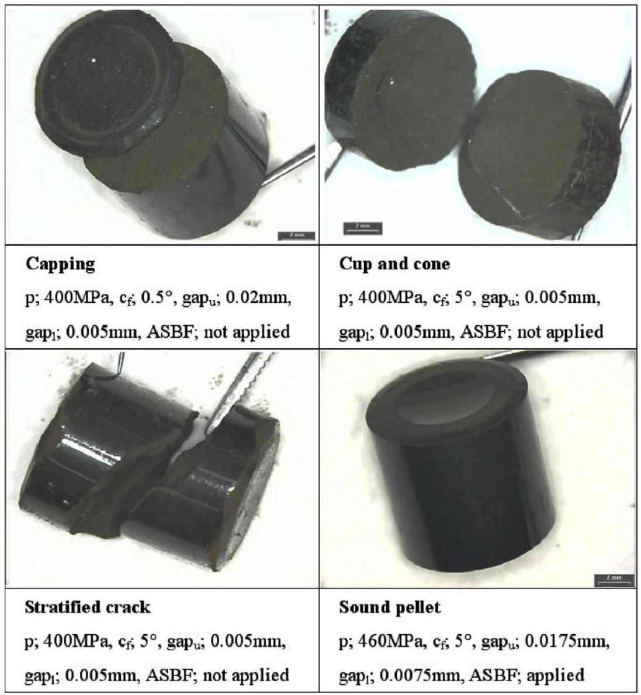
Fig. 1. Visuals of the green pellets for the Ce-MOX with the compacting parameters: $p$ (compacting pressure), $c_{\mathrm{f}}$ (chamfer angle in the outlet of a die), gapu (radial gap between the upper punch and die), gap1 (radial gap between the lower punch and die), and ASBF (anti-spring back force on the upper punch).

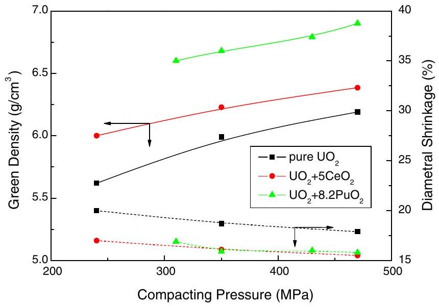
Fig. 2. Green density and diametral shrinkage of the pellets with compacting pressure.

density with the compacting pressure is caused by the early closure of the pore channels for the oxidative sintering process [16]. The diametral shrinkage for both the Ce-MOX and Pu-MOX pellets in Fig. 4 reveals the same variational trend with the compacting pressure as that for Fig. 2. The compacting and the sintering processes of the Pu-MOX can be simulated by that of $\mathrm{Ce}-\mathrm{MOX}$ in terms of its compressibility and densification behaviors.

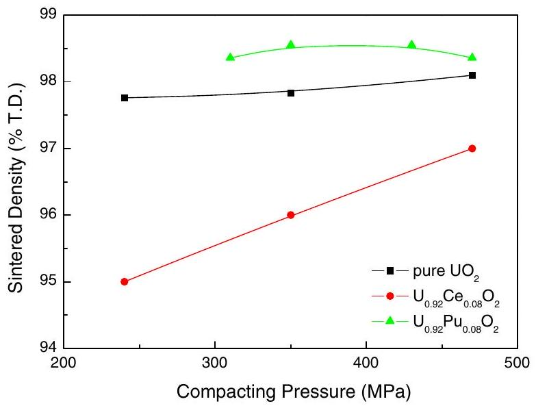
Fig. 3. Densities of the $\mathrm{UO}_{2}$ and MOX pellets sintered by the S 1 process.

The sintering result for the S1 and S2 processes presented that the density of Pu-MOX was generally higher than that of $\mathrm{Ce}-$ MOX, but the density difference between the two was markedly decreased for the S2 process. This result can be explained by the diffusivity of Pu and Ce in $\mathrm{UO}_{2}$ structure. The data reported in the literature [17-20] shows a big discrepancy among them by the influence of experimental factors. But it is generally accepted that both $(\mathrm{U}, \mathrm{Pu}) \mathrm{O}_{2}$ and $(\mathrm{U}, \mathrm{Ce}) \mathrm{O}_{2}$ have a similar behaviour in dif-fusion-controlled thermal processes [6,19]. The oxygen/metal ratio

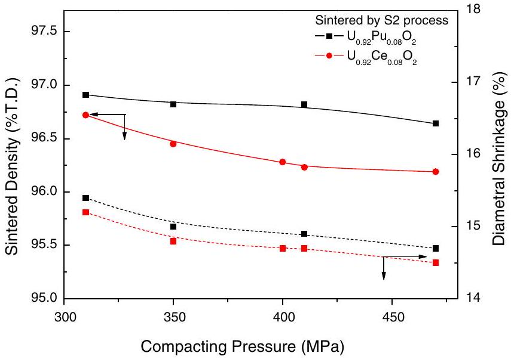
Fig. 4. Density and diametral shrinkage of the MOX pellets sintered by the S2 process.

for Ce-MOX has more hypostoichiometric composition than that for $\mathrm{Pu}-\mathrm{MOX}$ under reducing atmosphere because there is a much larger change of oxygen potential near stoichiometric region for the $(\mathrm{U}, \mathrm{Pu}) \mathrm{O}_{2-x}$ than that for the $(\mathrm{U}, \mathrm{Ce}) \mathrm{O}_{2-x}[4,8]$. The diffusivity strongly depends on oxygen composition of MOX during sintering. Cation diffusivity in reduced $(\mathrm{U}, \mathrm{Pu}) \mathrm{O}_{2-x}$ is decreased by a decrease

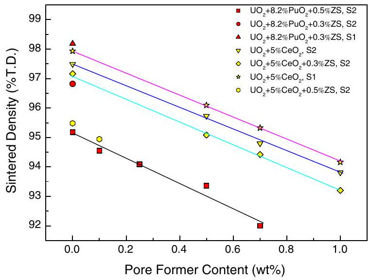
Fig. 5. Reduction of the sintered density with the pore former content and the sintering process.

in metal vacancy concentration [17]. During sintering by the S 1 or S2 process, both Pu-MOX and Ce-MOX pellets were finally heated under $8 \mathrm{H}_{2}+92 \mathrm{~N}_{2}$ without moisture and their oxygen/metal ratios were within $1.998 \pm 0.001$. The density difference between PuMOX and $\mathrm{Ce}-\mathrm{MOX}$ is probably due to the difference in the inherent properties of raw $\mathrm{PuO}_{2}$ and $\mathrm{CeO}_{2}$ powders.

Fig. 5 shows a density decrease with the content of pore former for various pellets fabricated by different sintering processes. When the Ce-MOX was pressed by a die-wall lubrication method and sintered by the S1 process, the sintered density was $97.9 \%$ T.D. The density of the Pu-MOX pellet was $98.2 \%$ T.D. which was a little higher than that of $\mathrm{Ce}-\mathrm{MOX}$, even when its green pellet contained $0.3 \mathrm{wt} \% \mathrm{ZS}$ as a lubricant. When the MOX pellets were sintered by the S2 process, the density was around $97 \%$ T.D. which is too high for a fuel pellet. In order to reduce the density by $95 \%$ T.D., ZS and DA were added to the powder mixture as a lubricant and/or a pore former [21]. Fig. 5 shows that the density of $\mathrm{Ce}-$ MOX was a little higher than that of Pu-MOX when $0.5 \mathrm{wt} \mathrm{\%} \mathrm{ZS}$ was added to both powders and sintered them by the S2 process. The densities of the Ce-MOX and Pu-MOX pellets were decreased linearly with an increasing DA content, and all the slopes of the lines were nearly the same. The pore structure of the pellet was inhomogeneous when DA was added to the powder mixture more than $0.5 \mathrm{wt} \%$. The target density of a $\mathrm{Pu}-\mathrm{MOX}$ pellet could be presupposed by a process simulation using Ce-MOX. From the result of Fig. $50.3 \mathrm{wt} \%$ ZS was added to the Pu-MOX powder before a pre-compaction, then $0.2 \mathrm{wt} \% \mathrm{ZS}$ and $0.1 \mathrm{wt} \% \mathrm{DA}$ were additionally added to the granulated powder for the main compaction and a pore control. The Pu-MOX powder was compacted and sintered by the S2 process, consequently a target density of $94.5 \%$ T.D. was obtained.

### 3.2. Microstructure and Pu distribution

The sintered pellets were visually sound and free from any surface defects for both the Pu-MOX and Ce-MOX. Internal crack and free $\mathrm{PuO}_{2}$ (or $\mathrm{CeO}_{2}$ ) were not observed on the polished section of both pellets. Fig. 6 shows the microstructures of the Ce-MOX and Pu-MOX pellets fabricated by an oxidative sintering process. From the restraints of the Pu-MOX ceramography, some artifacts were included during a grinding and etching of the samples, as shown in Fig. 6(b). Both pellets had homogeneous microstructures with an average grain size of $11 \mu \mathrm{~m}$, and a density of $95 \%$ T.D. These pore and grain structures are important for the in-service performance of a MOX fuel. They are mainly determined by the adopted powder treatment and sintering process. The microstructure of the Pu-MOX fuel can be optimized by a process simulation using Ce-MOX, both economically and safely.

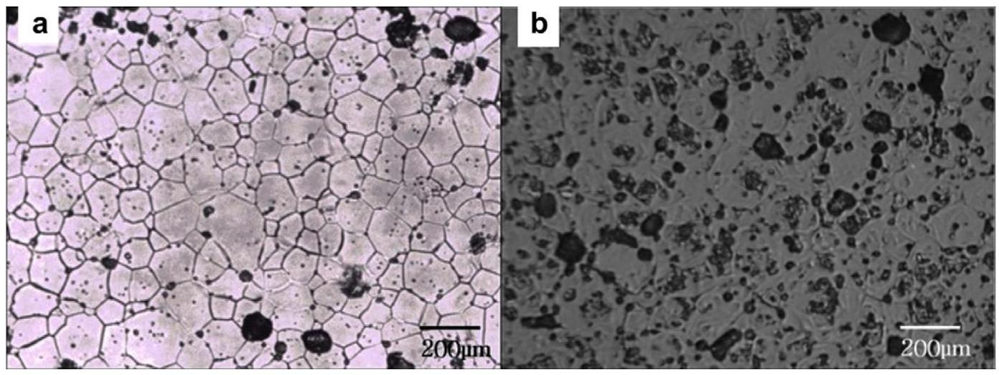
Fig. 6. Microstructures of (a) Ce-MOX and (b) Pu-MOX pellets sintered by the S2 process.

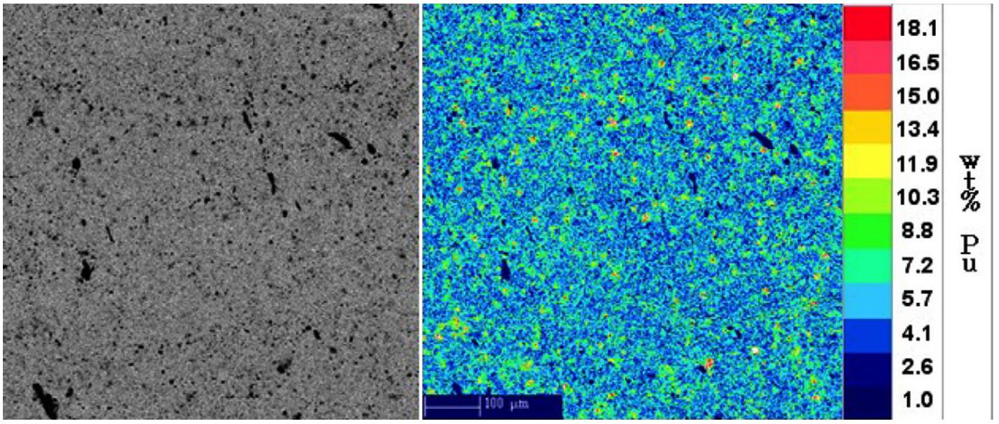
Fig. 7. Pore structure and quantitative Pu distribution of the Pu-MOX pellet.

Fig. 7 shows the pore structure and the distribution of the Pu rich particles on the polished section of the Pu-MOX pellet. Pores were homogeneously distributed and their size was mostly below $6 \mu \mathrm{~m}$. Some pores with a size as large as a grain could be formed by a grain plucking around a cluster during a ceramography. The dot mappings revealed that the Pu particles were randomly distributed over a zone of $0.75 \times 0.75 \mathrm{~mm}^{2}$. The sizes of the Pu rich particles with a concentration between 10 and $30 \mathrm{wt} \%$ were less than $15 \mu \mathrm{~m}$.

SEM pictures and elemental distribution mappings of U and Pu are shown in Fig. 8. Pu concentration around a pore cluster was higher than that of a matrix. The concentrations of U and Pu are contrary to each other for the same zone. Fig. 8 shows a typical Pu rich particle which has a maximum size of $13 \mu \mathrm{~m}$ and a maximum Pu concentration of $18 \mathrm{wt} \%$. It is a very small particle when compared to the particle of the MOX fuel produced by the OCOM or MIMAS process which has a size up to several tens of micrometers [22]. The average Pu concentration in the surrounding matrix was $6.8 \mathrm{wt} \%$ but its concentration in some micro-zones was between 5 and $6 \mathrm{wt} \%$.

The concentrations of $U$ and Pu measured by EPMA were normalized because of the porosity of a sample. The variation of the Pu concentration was within $\pm 0.6 \mathrm{wt} \%( \pm 10 \%$ rel.) for the measurement area ( $75 \times 60 \mu \mathrm{~m}^{2}$ ) and within $\pm 1.7 \mathrm{wt} \%( \pm 25 \%$ rel.) for the point measurements ( $3 \times 2.5 \mu \mathrm{~m}^{2}$ ). The Pu was homogeneously distributed throughout the $\mathrm{UO}_{2}$ matrix. This homogeneity arises from the milling using a continuous attrition mill and the sintering in a slightly oxidizing atmosphere.

### 3.3. Thermal properties

The thermal data for a MOX fuel is rare and some of the measured data is only available for a specific composition and a given temperature range. Thermal diffusivity and heat capacity for PuMOX are determined from the measured data by a numerical fitting procedure [14]. The precision of the individual measurements is always better than $1 \%$ for the diffusivity and $5 \%$ for the heat capacity. In the case of the Ce-MOX, the heat capacity was calculated by using Neumann-Kopp's equation and the thermal diffusivity was determined from the measured data. The heat capacity of $\mathrm{Ce}-\mathrm{MOX}$ is compared with that of $\mathrm{Pu}-\mathrm{MOX}$ in Fig. 9. The heat capacity curve of $\mathrm{Ce}-\mathrm{MOX}$ is slightly shifted from that of $\mathrm{UO}_{2}$ by the used Ce composition. The capacity of $\mathrm{Pu}-\mathrm{MOX}$ is nearly overlapped with that of pure $\mathrm{UO}_{2}$. The enthalpy of the MOX is dependent on the Pu content and the O/M ratio [15]. A slight variation in the $\mathrm{O} / \mathrm{M}$ ratio and Pu content has a negligible effect on the enthalpy data for MOX. The heat capacity of $\mathrm{U}_{0.92} \mathrm{Pu}_{0.08} \mathrm{O}_{2}$ does not really shift from that of $\mathrm{UO}_{2}$ at a temperature range from 600 K to 1300 K because it differs by less than the experimental errors.

Thermal diffusivity of the $\mathrm{Ce}-\mathrm{MOX}$ and $\mathrm{Pu}-\mathrm{MOX}$ is shown in Fig. 10. There is a little difference in the diffusivity between the two samples. The diffusivity for the Pu-MOX was higher than that for the $\mathrm{Ce}-\mathrm{MOX}$ at a lower temperature but it was reversed above 950 K .

The thermal conductivity was calculated by the following equation $\mathrm{k}=\alpha_{\mathrm{th}} c_{\mathrm{p}} \rho_{\mathrm{t}}$, where $\alpha_{\mathrm{th}}$ is the thermal diffusivity, $c_{\mathrm{p}}$ is the heat capacity and $\rho_{\mathrm{t}}$ is the sample density at a certain temperature. Both

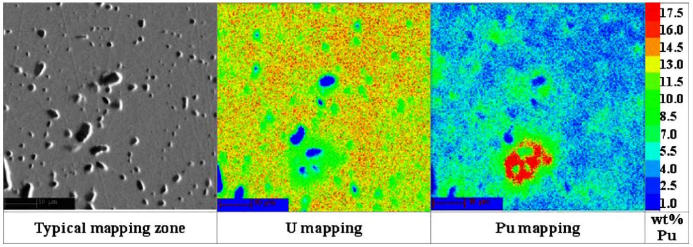
Fig. 8. SEM image and elemental distribution of $U$ and $P u$ at a local position.

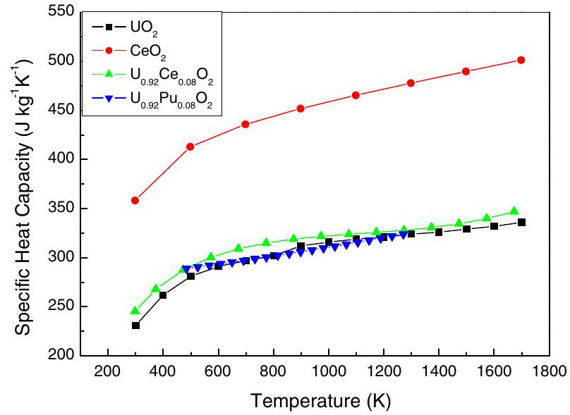
Fig. 9. Heat capacity of $\mathrm{U}_{0.92} \mathrm{Ce}_{0.08} \mathrm{O}_{2}$ and $\mathrm{U}_{0.92} \mathrm{Pu}_{0.08} \mathrm{O}_{2}$.

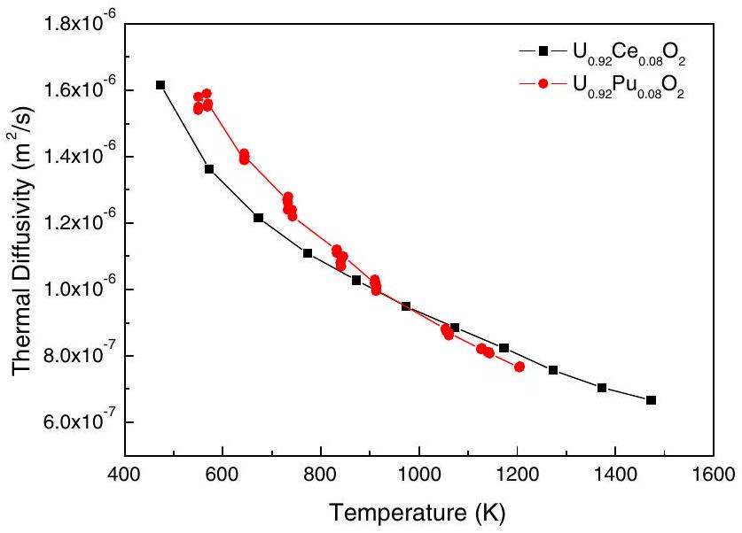
Fig. 10. Thermal diffusivity of $\mathrm{U}_{0.92} \mathrm{Ce}_{0.08} \mathrm{O}_{2}$ and $\mathrm{U}_{0.92} \mathrm{Pu}_{0.08} \mathrm{O}_{2}$.

the $\mathrm{U}_{0.92} \mathrm{Pu}_{0.08} \mathrm{O}_{2}$ and $\mathrm{U}_{0.92} \mathrm{Ce}_{0.08} \mathrm{O}_{2}$ samples had the same theoretical density of $95 \%$ each. Thermal expansions of both the $\mathrm{UO}_{2}$ and Pu-MOX pellets were less than $1.5 \%$ at a temperature up to 1700 K according to Martin's recommendations [23]. For the $\mathrm{U}_{0.92} \mathrm{Pu}_{0.08} \mathrm{O}_{2}$ and $\mathrm{U}_{0.92} \mathrm{Ce}_{0.08} \mathrm{O}_{2}$ samples, the value of $\rho_{\mathrm{t}}$ was obtained by the above recommendations.

Thermal conductivity of the pure oxide and MOX samples is shown in Fig. 11. The thermal conductivity data for Pu-MOX generally exists between those for pure $\mathrm{UO}_{2}$ and $\mathrm{PuO}_{2}$. The conductivity for $\mathrm{U}_{0.92} \mathrm{Pu}_{0.08} \mathrm{O}_{2}$ almost corresponds with that for $\mathrm{U}_{0.90} \mathrm{Pu}_{0.10} \mathrm{O}_{2}$ [15] even when their Pu composition is a little different. The conductivity for $\mathrm{U}_{0.92} \mathrm{Ce}_{0.08} \mathrm{O}_{2}$ also exists between those for pure $\mathrm{UO}_{2}$ and $\mathrm{CeO}_{2}$ above 600 K . The conductivity for $\mathrm{U}_{0.92} \mathrm{Pu}_{0.08} \mathrm{O}_{2}$ is a little higher than that for $\mathrm{U}_{0.92} \mathrm{Ce}_{0.08} \mathrm{O}_{2}$ at a low temperature but the former is overlapped with the latter above 900 K . There is a small difference in the conductivity between $\mathrm{UO}_{2}$ and $\mathrm{PuO}_{2}$ when compared with the difference between $\mathrm{UO}_{2}$ and $\mathrm{CeO}_{2}$, so the conductivity seems to depend less on the Pu composition for the $\mathrm{Pu}-\mathrm{MOX}$. The conductivity of Ce-MOX was decreased with an increasing Ce composition at a lower temperature than at a higher temperature [24]. The variation in the thermal conductivity with the composition and temperature for the $\mathrm{Pu}-\mathrm{MOX}$ is different from that for the Ce-MOX, especially at a lower temperature than 900 K . The conductivity of the Pu-MOX cannot be estimated exactly by an analogy with that of the Ce-MOX.

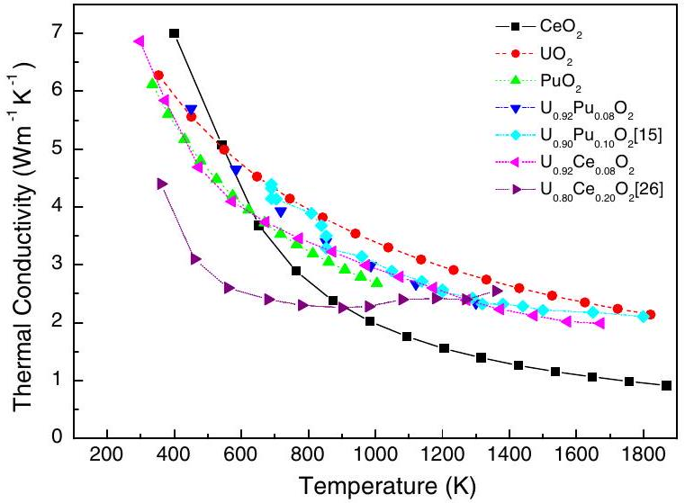
Fig. 11. Comparison of the thermal conductivity for pure oxide, $\mathrm{Pu}-\mathrm{MOX}$ and Ce-MOX.

## 4. Conclusions

The fabrication process of a Pu-MOX pellet was simulated by using Ce-MOX powder. Compacting behavior of the Ce-MOX powder with the pressure was nearly the same as that of the Pu-MOX when both powders were prepared by the same treatments.

Sintering behavior of the Ce-MOX was very similar to that of the Pu-MOX, especially for the oxidative sintering process. The sintered density of both pellets was decreased with the same slope with an increasing pore former content. Both the $\mathrm{Ce}-\mathrm{MOX}$ and Pu-MOX pellets fabricated by an oxidative sintering process had the same average grain size of $11 \mu \mathrm{~m}$, and a density of $95 \%$ T.D.

Pu distribution in the Pu-MOX pellet was homogeneous which arose from the adopted milling treatment using a continuous attrition mill and the sintering under a slightly oxidizing atmosphere.

The fabrication process for a Pu-MOX fuel can be developed and optimized both economically and safely by a process simulation using Ce-MOX without any troublesome issues accompanying a direct use of $\mathrm{PuO}_{2}$.

The thermal conductivity for the Pu-MOX was a little higher than that for the $\mathrm{Ce}-\mathrm{MOX}$ at a low temperature while they were overlapped above 900 K . The thermal properties of the Pu-MOX and the $\mathrm{Ce}-\mathrm{MOX}$ were varied with the composition and temperature which resulted in a different trend, from each other.

## Acknowledgments

The authors would like to thank many staffs participating in the KAERI-PSI cooperation program. We would like to thank ITU for the thermal property measurements of the Pu-MOX pellets. This work was supported by the Ministry of Science and Technology (MOST) of the Republic of Korea under the nuclear R\&D Project.

## References

[1] L.J. Ott, R.N. Morris, J. Nucl. Mater. 371 (2007) 314.
[2] J.J. Carabajo, G.L. Yoder, S.G. Popov, V.K. Ivanov, J. Nucl. Mater. 299 (2001) 181.
[3] R.J. White, S.B. Fisher, P.M.A. Cook, R. Stratton, C.T. Walker, I.D. Palmer, J. Nucl. Mater. 288 (2001) 43.
[4] T.L. Markin, R.S. Street, E.C. Crouch, J. Inorg. Nucl. Chem. 32 (1970) 59.
[5] R. Lorenzelli, B. Touzelin, J. Nucl. Mater. 95 (1980) 290.
[6] W. Dörr, S. Hellmann, G. Mages, J. Nucl. Mater. 140 (1986) 7.
[7] Y.W. Lee, H.S. Kim, S.H. Kim, C.Y. Joung, S.H. Na, G. Ledergerber, P. Heimgartner, M. Pouchon, M. Burghartz, J. Nucl. Mater. 274 (1999) 7.
[8] D.I.R. Norris, P. Kay, J. Nucl. Mater. 116 (1983) 184.
[9] E. Zimmer, C. Ganguly, J. Borchardt, H. Langen, J. Mucl. Mater. 152 (1988) 169.
[10] Y.S. Park, H.Y. Sohn, D.P. Butt, J. Mucl. Mater. 280 (2000) 285.
[11] D.G. Kolman, Y.S. Park, M. Stan, R.J. Hanrahan Jr., D.P. Butt, Los Alamos National Laboratory Report LA-UR-99-0491.
[12] M. Stan, Y.T. Zhu, H. Jiang, J. Appl. Phys. 97 (2004) 3358.
[13] M. Stan, T.J. Armstrong, D.P. Butt, T.C. Wallace Sr., Y.S. Park, C.L. Haertling, T. Hartmann, R.J. Hanrahan Jr., J. Am. Ceram. Soc. 85 (2002) 2811.
[14] C. Ronchi, M. Sheindlin, Measurement of the thermal conductivity of zirconiabased IMF and MOX fuels, JRC-ITU-TPW-2001/008, 19 March 2001.
[15] C. Duriez, J.P. Alessandri, T. Gervais, Y. Philipponneau, J. Nucl. Mater. 277 (2000) 143.
[16] D. Vollath, H. Wedemeyer, J. Nucl. Mater. 106 (1982) 191.
[17] Hj. Matzke, J. Nucl. Mater. 114 (1983) 121.
[18] H. Beisswenger, M. Bober, G. Schumacher, J. Nucl. Mater. 21 (1967) 38.
[19] P.J. Baptiste, G. Gallet, J. Nucl. Mater. 135 (1985) 105.
[20] D.G. Leme, Hj. Matzke, J. Nucl. Mater. 106 (1982) 211.
[21] H.S. Kim, C.Y. Joung, S.H. Kim, S.H. Na, Y.W. Lee, D.S. Sohn, J. Korean Nucl. Soc. 33 (2002) 323.
[22] C.T. Walker, W. Goll, T. Matsumura, J. Nucl. Mater. 228 (1996) 8.
[23] D.G. Martin, J. Nucl. Mater. 152 (1988) 94.
[24] K. Kurosaki, R. Ohshima, M. Uno, S. Yamanaka, K. Yamanoto, T. Namekawa, J. Nucl. Mater. 294 (2001) 193.

[^0]:    * Corresponding author. Tel.: +82 428682262.

    E-mail address: hskim4@kaeri.re.kr (H.S. Kim).

[^1]:    ${ }^{\mathrm{a}}$ MOX powder passed through the attrition mill 10 cycles.

