## Journal of Applied Physics

REVIEW ARTICLE | JUNE 012004
Nuclear waste disposal-pyrochlore ( $\mathrm{A}_{2} \mathrm{~B}_{2} \mathrm{O}_{7}$ ): Nuclear waste form for the immobilization of plutonium and "minor" actinides

Rodney C. Ewing; William J. Weber; Jie Lian
Check for updates
J. Appl. Phys. 95, 5949-5971 (2004)
https://doi.org/10.1063/1.1707213

View Online

Export Citation

## Articles You May Be Interested In

Microstructure and Composition of a Ce-pyrochlore: A Chemical Analog for Pu-pyrochlore
AIP Conf. Proc. (July 2003)
Radiation effects in uranium-niobium titanates
AIP Conf. Proc. (July 2000)
Phase transformations induced by high electronic excitation in ion-irradiated $\mathrm{Gd} 2(\mathrm{Zr} \times \mathrm{Ti} 1-\mathrm{x}) 2 \mathrm{O} 7$ pyrochlores
J. Appl. Phys. (November 2010)

## AIP Advances

Why Publish With Us?

# Nuclear waste disposal-pyrochlore ( $\mathrm{A}_{2} \mathrm{~B}_{2} \mathrm{O}_{7}$ ) : Nuclear waste form for the immobilization of plutonium and "minor" actinides 

Rodney C. Ewing ${ }^{\text {a) }}$ Department of Nuclear Engineering and Radiological Sciences, Department of Materials Science and Engineering, Department of Geological Sciences, University of Michigan, Ann Arbor, Michigan 48109-2104 William J. Weber Pacific Northwest National Laboratory, Richland, Washington 99352 Jie Lian Department of Nuclear Engineering and Radiological Sciences, University of Michigan, Ann Arbor, Michigan 48109-2104

(Received 2 September 2003; accepted 17 February 2004)

#### Abstract

During the past half-century, the nuclear fuel cycle has generated approximately 1400 metric tons of plutonium and substantial quantities of the "minor" actinides, such as Np, Am, and Cm. The successful disposition of these actinides has an important impact on the strategy for developing advanced nuclear fuel cycles, weapons proliferation, and the geologic disposal of high-level radioactive waste. During the last decade, there has been substantial interest in the use of the isometric pyrochlore structure-type, $\mathrm{A}_{2} \mathrm{~B}_{2} \mathrm{O}_{7}$, for the immobilization of actinides. Most of the interest has focused on titanate-pyrochlore because of its chemical durability; however, these compositions experience a radiation-induced transition from the crystalline-to-aperiodic state due to radiation damage from the alpha-decay of actinides. Depending on the actinide concentration, the titanate pyrochlore will become amorphous in less than 1000 years of storage. Recently, systematic ion beam irradiations of a variety of pyrochlore compositions has revealed that many zirconate pyrochlores do not become amorphous, but remain crystalline as a defect fluorite structure-type due to disordering of the A- and B-site cations. The zirconate pyrochlores will remain crystalline even to very high doses, greater than 100 displacements per atom. Systematic experimental studies of actinide-doped and ion beam-irradiated pyrochlore, analyses of natural U- and Th-bearing pyrochlore, and simulations of the energetics of the disordering process now provide a rather detailed understanding of the structural and chemical controls on the response of pyrochlore to radiation. These results provide a solid basis for predicting the behavior and durability of pyrochlore used to immobilize plutonium. © 2004 American Institute of Physics. [DOI: 10.1063/1.1707213]

## TABLE OF CONTENTS

I. INTRODUCTION. . . . . . . . . . . . . . . . . . . . . . . . . . 5949
II. HISTORY. . . . . . . . . . . . . . . . . . . . . . . . . . . . . . 5951
III. STRUCTURE AND COMPOSITION. . . . . . . . . 5951
IV. STABILITY AND SYNTHESIS. . . . . . . . . . . . . . 5952
V. CHEMICAL DURABILITY. . . . . . . . . . . . . . . . . 5954
VI. THERMOCHEMICAL PROPERTIES. . . . . . . . . 5956
VII. RADIATION EFFECTS. . . . . . . . . . . . . . . . . . . 5956
A. Radiation damage processes. . . . . . . . . . . . . . . 5957
B. Irradiation methods. . . . . . . . . . . . . . . . . . . . . . . 5958
C. Defects and amorphization. . . . . . . . . . . . . . . . . 5958
D. Kinetics of amorphization. . . . . . . . . . . . . . . . . 5960
E. Model predictions. . . . . . . . . . . . . . . . . . . . . . . . 5964
F. Macroscopic property changes. . . . . . . . . . . . . . 5965

[^0]G. Swelling. . . . . . . . . . . . . . . . . . . . . . . . . . . . . . . 5966
H. Stored energy. . . . . . . . . . . . . . . . . . . . . . . . . . . 5966
I. Mechanical properties. . . . . . . . . . . . . . . . . . . . . 5967
J. Structural changes. . . . . . . . . . . . . . . . . . . . . . . 5967
K. Dissolution rates. . . . . . . . . . . . . . . . . . . . . . . . . 5967
L. Thermal recovery. . . . . . . . . . . . . . . . . . . . . . . . 5968
M. Other applications. . . . . . . . . . . . . . . . . . . . . . . . 5968
VIII. SUMMARY. . . . . . . . . . . . . . . . . . . . . . . . . . . 5969

ACKNOWLEDGMENTS. . . . . . . . . . . . . . . . . . . . 5969

## I. INTRODUCTION

The actinides, particularly fissile plutonium, have been both a bane and benefit to the nuclear fuel cycle. Since plutonium was isolated in microgram quantities in February of 1941 by Seaborg, Kennedy, and Wahl, more than 1400 metric tons (MT) of plutonium have been created in nuclear reactors around the world. Approximately 300 MT are held in weapons programs, 200 MT have been separated from
commercially generated spent nuclear fuel, mostly in the United Kingdom and France and destined for fabrication in a mixed-oxide fuel of Pu and U, and the balance, over 900 MT, remains in spent nuclear fuel stored on-site at 236 nuclear power plants in 36 different countries. ${ }^{1,2}$ Approximately 70 to 80 MT of new plutonium, generally left in the spent nuclear fuel (SNF), is added to the global inventory each year. Reactor-grade plutonium ( $>60 \%{ }^{239} \mathrm{Pu}$ ) with any degree of irradiation is a potential weapons material, and a nuclear device can be made with less than 10 kg of ${ }^{239} \mathrm{Pu}$. ${ }^{3}$ The good news is that as part of the first and second Strategic Arms Reduction Treaties, as well as unilateral pledges by both Russia and the United States, thousands of nuclear weapons have been dismantled since 1994. This disarmament process will produce between 30 and 40 MT , pure and impure, of weapons-grade plutonium in each country, as well as hundreds of tons of highly enriched uranium (HEU). Depending on one's perspective, plutonium is either a valuable resource to be generated and used in a closed fuel cycle or a serious threat, contributing to the global proliferation of nuclear weapons. In a study by the National Research Council (1994), the "excess" plutonium from dismantled nuclear weapons was described as "... a clear and present danger to national and international security."

In addition to the plutonium and uranium, "minor" actinides such as ${ }^{237} \mathrm{~Np},{ }^{241} \mathrm{Am}+{ }^{243} \mathrm{Am}$, and ${ }^{244} \mathrm{Cm}$ are generated in reactors, and global production rates are 3.4, 2.7, and 0.35 MT per year, respectively. The long-lived actinides (e.g., ${ }^{239} \mathrm{Pu}$ with a half-life of 24100 years, ${ }^{237} \mathrm{~Np}$ with a half-life of 2.1 million years, and ${ }^{233} \mathrm{U}$ with a half-life of 160 thousand years) are among the most important potential contributors to the calculated exposures to humans over the long periods envisioned for geological disposal, and after several hundred years, the radiotoxicity of disposed nuclear fuel is dominated by actinides, such as ${ }^{239} \mathrm{Pu}$ and ${ }^{237} \mathrm{~Np} .{ }^{4}$ The release of actinides from the spent nuclear fuel (SNF) or other actinide-bearing solids is a critical aspect of the evaluation of the long-term performance of a geologic repository.

Thus, the renewed interest in expanding nuclear power production immediately raises the associated concerns of nuclear weapons proliferation and the geologic disposal of spent nuclear fuel or other actinide-bearing materials. As an example, a one gigawatt (Gw) light water reactor generates approximately 200 kg of Pu per year, enough for more than 20 nuclear weapons. ${ }^{5}$ A ten-fold increase in global nuclear power production could place as much as five million kilograms of separated Pu into play in the global nuclear fuel cycle. ${ }^{5}$ Both issues, nuclear weapons proliferation and nuclear waste disposal, are inextricably tied to a consideration of the production and use of actinides in the nuclear fuel cycle and their fate after disposal in a geologic repository.

In the broadest sense, there are two strategies for the disposition of $\mathrm{Pu}:^{6-8}$ (1) The use of nuclear reactors to "burn" or reduce the inventories of plutonium and the minor actinides. This will involve reprocessing of nuclear fuels to reclaim fissile nuclides or the use of Pu from dismantled nuclear weapons for the fabrication of a mixed oxide (MOX) fuel, consisting of U and Pu, or the incorporation of fissile
and nonfissile actinides into an inert matrix fuel (IMF). Inert matrix fuels do not contain fertile nuclides, such as ${ }^{238} \mathrm{U}$, that lead to the production of more Pu ( ${ }^{238} \mathrm{U}$ becomes ${ }^{239} \mathrm{Pu}$ by neutron capture and subsequent $\beta$-decay reactions). Zirconate pyrochlore has been investigated as a potential inert matrix fuel. ${ }^{9}$ Thirty-five nuclear power reactors in Europe are currently using significant quantities of MOX fuel to produce electricity. After a once-through burn-up, the MOX or IMF used fuels would be sent to a geologic repository. (2) Direct disposal of spent nuclear fuel in a geologic repository. The full range of nuclear fuels [low-enriched uranium fuel, HEU, MOX, and IMF] or Pu-containing nuclear waste forms (e.g., Pu-containing ceramics embedded in a high-level nuclear waste glass or unirradiated MOX mixed with SNF) are candidates for disposal in a geologic repository. ${ }^{10}$ In the 1990s, the United States pursued a dual-track strategy in which the higher quality Pu from the pits of dismantled nuclear weapons would be used to fabricate a MOX fuel for once-through burn-up and direct disposal of the used MOX fuel. The "scrap" or less-pure Pu would be immobilized in a titanate ceramic, the dominant phase being a Hf -pyrochlore, $(\mathrm{U}, \mathrm{Pu}, \mathrm{Hf}, \mathrm{Gd})_{2} \mathrm{Ti}_{2} \mathrm{O}_{7}$. In 1997, the United States also initiated, through Lawrence Livermore National Laboratory, an extensive and continuing collaboration with Russian organizations and institutes for the immobilization of Pu from dismantled nuclear weapons. ${ }^{11}$ A considerable amount of research was completed on phases suitable for Puimmobilization, including pyrochlore and related structure types. In April of 2002, the United States stopped almost all work on the Pu-immobilization strategy in favor of accelerated conversion of Pu into MOX fuel. This still leaves unresolved the fate of the "scrap" plutonium, approximately $5-7$ MT that is not suitable for use in MOX fuel. In a recent report (December 1, 2003) to Congress, the Defense Nuclear Facilities Safety Board has been critical of the present U.S. Department of Energy plan that does not yet have a strategy for the disposition of the "scrap" plutonium. Although research on the immobilization of Pu in crystalline ceramics has mostly ended in the United States, work continues in a number of other countries, mainly Russia, Great Britain, and France.

Regardless of the strategy pursued, either for the use or disposal of actinides, particularly fissile Pu, the development of new materials either for storage (for tens to hundreds of years) or for disposal (for tens to hundreds of thousand years) is still required. ${ }^{12}$ The materials used for immobilization generally have relatively complex compositions, so that they can incorporate actinides (as well as neutron absorbers, such as Gd and Hf, and highly radioactive fission products, such as Cs and Sr ), their synthesis must be accomplished remotely, the phases must be chemically durable, and their physical and chemical properties should not be degraded by $\alpha$-decay event irradiation from the incorporated actinides.

In this article, we review recent developments in the use of pyrochlore structure-types for the immobilization of actinides, particularly plutonium. Pyrochlores have long been a component phase of a variety of ceramic waste forms (e.g., Synroc ${ }^{13}$ ). Although many pyrochlore compositions, such as $\mathrm{Gd}_{2} \mathrm{Ti}_{2} \mathrm{O}_{7}$, undergo a radiation-induced transformation from
the crystalline-to-amorphous state upon irradiation, radiation-resistant compositions, e.g., $\mathrm{Gd}_{2} \mathrm{Zr}_{2} \mathrm{O}_{7}$ and $\mathrm{Er}_{2} \mathrm{Zr}_{2} \mathrm{O}_{7}$, of pyrochlore have recently been discovered. ${ }^{14-17}$ The potential for developing chemically durable, radiationresistant pyrochlore has led to increased interest in the use of pyrochlore for the immobilization of actinides. ${ }^{15,18}$

Finally, the diverse chemistry of the pyrochlore structure is coupled to a remarkable variation of properties that have many important technological applications, such as catalysis, piezoelectricity, ferro- and ferri-magnetism, luminescence, and giant magnetoresistance. Electronic properties vary from being metallic or semiconducting to having a high ionic conductivity. The manipulation of the pyrochlore structure-type by radiation sources such as ion-beam irradiations opens the door to a wide range of possible applications outside of the nuclear waste management field. As an example, investigators have used ion-beam-induced order-disorder transformations to fabricate nanoscale, mixed ionic-electronic conductors in pyrochlore oxides. ${ }^{19}$

## II. HISTORY

There are over 500 synthetic compositions, ${ }^{20}$ including actinides, ${ }^{21}$ with the pyrochlore structure, and natural pyrochlores are also abundant in highly evolved rock types, such as pegmatites and carbonatites. ${ }^{22-24}$ A number of compositions with thorium and uranium, ${ }^{25,26}$ as well as transuranium elements (e.g., Cm and Pu ), have been synthesized ${ }^{27-31}$ and natural compositions may contain up to $30 \mathrm{wt} . \% \mathrm{UO}_{2}$ and 9 $\mathrm{wt} . \% \mathrm{ThO}_{2} .{ }^{32}$ Thus, it is not surprising that pyrochlore structure-types were present as an actinide-bearing phase in the earliest nuclear waste form formulations.

The first evidence of pyrochlore in a nuclear waste form was the discovery of rare earth titanates as an actinide host in nuclear waste glasses. ${ }^{33}$ Titanate pyrochlores were also identified in titanate ceramic waste forms ${ }^{34-36}$ and in glass ceramic waste forms. ${ }^{37,38}$ Ringwood et al. ${ }^{39}$ and Ringwood and Kelly ${ }^{40}$ proposed a polyphase titanate ceramic for high-level nuclear waste, Synroc, and the principal actinide host in this Ti-assemblage was zirconolite $\mathrm{CaZrTi}_{2} \mathrm{O}_{7}$. Monoclinic zirconolite is a structural derivative of the isometric pyrochlore structure. Because of their high chemical durability, titanate waste forms have been the focus of considerable research since the 1980s. ${ }^{32,41}$ There were a number of studies ${ }^{42-46}$ in which zirconolite was doped with ${ }^{238} \mathrm{Pu}$ (half-life $=87.7$ year) to study $\alpha$-decay event damage. The monoclinic zirconolite with 4 mole $\%{ }^{238} \mathrm{PuO}_{2}$ swelled to a saturation value of nearly $6 \mathrm{vol} \%$ under ambient conditions and became amorphous at a dose of $2.1 \times 10^{25} \alpha$-decay events $/ \mathrm{m}^{3}$. Significantly, these early studies reported the formation of a "cubic" zirconolite, ${ }^{47}$ actually a disordered pyrochlore structure, which was stabilized by higher actinide concentrations of nearly 8 mole \% Pu. Research on titanate and other waste forms was severely curtailed as a result of the decision in the United States to solidify high level nuclear waste in a borosilicate glass and the subsequent construction of the Defense Waste Processing Facility at the Savannah River Site in South Carolina. ${ }^{48}$ Research on nuclear waste forms during this period has been summarized by Lutze and Ewing. ${ }^{49}$

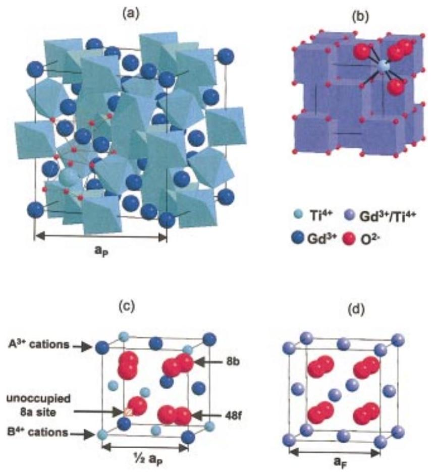
FIG. 1. (Color) Pyrochlore structures described based on the polyhedral network (a) and the derivative of fluorite structure (c). Corresponding fluorite unit cell (b, d) are included for comparison.

In the 1990s, there was a renewed effort to develop nuclear waste forms for the immobilization of plutonium from dismantled nuclear weapons. More than 70 potential phases for immobilization were considered, but the final preference for immobilization was a titanate phase assemblage, very similar to the original Synroc formulation, because of its chemical durability, ${ }^{50}$ and the principal actinidebearing phase was zirconolite. ${ }^{51}$ However, in experiments in which zirconolite was doped with Np and Pu at levels of tens of percent, a pyrochlore structure formed that preferentially incorporated the actinides. ${ }^{51,52}$ The final base-line composition for Pu-immobilization in the United States was a crystalline ceramic with a target loading of approximately 10 $\mathrm{wt} . \% \mathrm{Pu}$ consisting mainly of a Hf -pyrochlore, ( $\mathrm{Ca}, \mathrm{Gd}, \mathrm{Pu}, \mathrm{U}, \mathrm{Hf})_{2} \mathrm{Ti}_{2} \mathrm{O}_{7}$, with lesser amounts of a Hf zirconolite, ( $\mathrm{Ca}, \mathrm{Gd})(\mathrm{Gd}, \mathrm{Pu}, \mathrm{U}, \mathrm{Hf}) \mathrm{TO}_{2} \mathrm{O}_{7}$, and minor amounts of brannerite, (U, $\mathrm{Pu}, \mathrm{Gd}) \mathrm{Ti}_{2} \mathrm{O}_{6}$, and rutile, $(\mathrm{Ti}, \mathrm{Hf}) \mathrm{O}_{2}$.

## III. STRUCTURE AND COMPOSITION

Pyrochlore is isometric ( $F d 3 m, Z=8, \mathbf{a}=0.9$ to 1.2 nm ), and the structural formula is ideally ${ }^{\text {VIII }} \mathrm{A}_{2}{ }^{\text {VI }} \mathrm{B}_{2}{ }^{\text {IV }} \mathrm{X}_{6}{ }^{\text {IV }} \mathrm{Y}$ (Roman numerals indicate the coordination number), where the A - and B -sites contain metal cations; $\mathrm{X}\left(=\mathrm{O}^{2-}\right)$ and $\mathrm{Y}\left(=\mathrm{O}^{2-}, \mathrm{OH}^{-}, \mathrm{F}^{-}\right)$are anions. ${ }^{20}$ The structure can be described in a variety of ways, most commonly by describing the shapes and topology of the coordination polyhedra [Fig. 1(a)]. Pyrochlore is closely related to the fluorite-structure ( $\mathrm{AX}_{2}$ ), e.g., cubic $\mathrm{ZrO}_{2}$, except that there are two cation sites and one-eighth of the anions are absent [Figs. 1(c) and 1(d)]. The cations and oxygen vacan-
cies are ordered. The loss of one-eighth of the anions reduces the coordination of the B-site cation from eight to six. The X -anion occupies the 48 f position; and the Y -anion, the 8 b (when the origin of the unit cell is placed at the B-site). All of the atoms in an ideal pyrochlore are on special positions, except the 48 f oxygen ( $\mathrm{O}_{48 \mathrm{f}}$ ). Thus, the structure is completely described by the cell edge a and the fractional coordinate ( $x$ ) of $\mathrm{O}_{48 \mathrm{f}}$. For the ideal structure, the coordinations of the cations and anions are: $\mathbf{A X}_{6} Y_{2}, \mathbf{B X}_{6}, \mathbf{X A}_{2} \mathbf{B}_{2}$, and $\mathrm{YA}_{4}$. Note that the unoccupied 8a position, the site of the oxygen vacancy, is coordinated with four B-site cations, [] $\mathrm{B}_{4}$. The structure can also be visualized as a network of corner-linked $\mathrm{BX}_{6}$ octahedra (a $\mathrm{B}_{2} \mathrm{X}_{6}$-framework) with A-site cations filling the interstices [Fig. 1(a)]. The A- and B-site coordination polyhedra are joined along edges, and the shapes of these polyhedra change as the positional parameter $x$ of the $\mathrm{O}_{48 \mathrm{f}}$ shifts to accommodate cations of different sizes. For $x=0.3750$, the A -site coordination polyhedron is a regular cube, and the B-site polyhedron is distorted to a trigonally flattened octahedron (the topology of the fluorite structure). In this case, materials have a defect fluorite structure, and the occupancy of each anion site is 0.875 . For $x=0.3125$, the B -site is a regular octahedron and the A -site is a distorted trigonal scalenohedron, and materials have the ideal pyrochlore structure. ${ }^{53}$ Thus, the 48 f oxygen positional parameter $x$ defines the polyhedral distortion and structural deviation from the ideal fluorite structure. Simulations of a wide range of pyrochlore compositions ( $\mathrm{A}=\mathrm{Lu}^{3+}$ to $\mathrm{La}^{3+} ; \mathrm{B}=\mathrm{Ti}^{4+}$ to $\mathrm{Pb}^{4+}$ ) using energy minimization techniques suggest that the $x$ parameter also reflects some degree of disordering of the oxygen lattice for specific cation compositions. ${ }^{54}$

A number of defect structures can be created by coupled removal of cations and anions (e.g., ${ }^{\mathrm{VI}} \mathrm{A}_{2}{ }^{\mathrm{VI}} \mathrm{B}_{2}{ }^{\mathrm{IV}} \mathrm{X}_{6}$, ${ }^{\mathrm{VI}} \mathrm{A}{ }^{\mathrm{VI}} \mathrm{B}_{2}{ }^{\mathrm{III}} \mathrm{X}_{6}$ ) so that the general formula is $\mathrm{A}_{1-2} \mathrm{~B}_{2} \mathrm{X}_{6} \mathrm{Y}_{0-1}$. ${ }^{20}$ In natural pyrochlore, molecular water and hydroxyl may be part of the structure so that the general formula becomes: $\mathrm{A}_{1-2} \mathrm{~B}_{2} \mathrm{O}_{6}(\mathrm{O}, \mathrm{OH}, \mathrm{F})_{0-1} \mathrm{pH}_{2} \mathrm{O}$. A number of structural derivatives are possible, such as "inverse" pyrochlores, in which the A-site is vacant and monovalent cations occupy the Y-site, []${ }^{\mathrm{VI}} \mathrm{B}_{2}{ }^{\mathrm{III}} \mathrm{X}_{6}{ }^{\mathrm{VI}} \mathrm{M}$. ${ }^{55}$ The M-atom may be displaced from the 8a site to the 32e position, hence the rather unusual flexibility of this structure. Stanek et al. ${ }^{56}$ have simulated the energetics of vacancy formation using an energy minimization method and a Born-like description of the forces between the ions. In their study, for $\mathrm{A}^{3+}=\mathrm{Lu}$ to $\mathrm{La} ; \mathrm{B}^{4+}=\mathrm{Ti}$ to Pb , they showed that a stable pyrochlore structure formed by the formation of $\mathrm{A}^{3+}$ cation vacancies to compensate for excess $\mathrm{B}^{4+}$ and, near the boundary to the disordered fluorite structure, interstitial oxygen also stabilized the pyrochlore structure.

Closely related to the pyrochlore structure is the murataite structure, $(\mathrm{Y}, \mathrm{Na})_{6}(\mathrm{Zn}, \mathrm{Fe})_{5} \mathrm{Ti}_{12} \mathrm{O}_{29}(\mathrm{O}, \mathrm{F})_{10} \mathrm{~F}_{4}(F 43 m$, $Z=4, \mathbf{a}=1.489 \mathrm{~nm})$. ${ }^{57}$ Despite, the complexity of its composition, murataite is also a derivative of the fluorite structure. Just as the unit cell edge of pyrochlore is doubled ( $\mathbf{a}=0.9$ to 1.2 nm ) by ordering of the A - and B-site cations on the fluorite lattice (a $2 \times 2 \times 2$ structure), the murataite structure is based on a tripling of the cell edge ( $3 \times 3 \times 3$ ) (Fig. 2). Recent interest in murataite as a waste form ${ }^{58-61}$ is based on

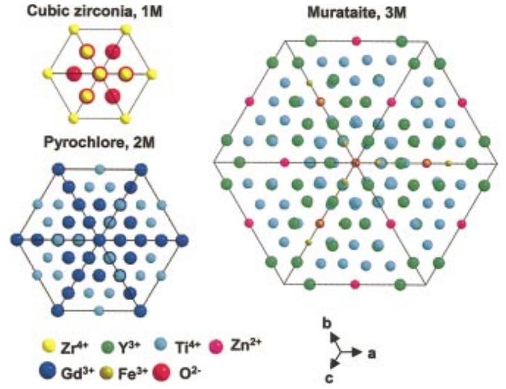
FIG. 2. (Color) Projection along [111] direction for zirconia (a), pyrochlore (b), and murataite (c) structures. Cubic zirconia has the ideal fluorite structure. Note, $1 M=1 \times 1 \times 1$ multiples of the fluorite unit cell; $2 M=2 \times 2 \times 2 ; 3 M=3 \times 3 \times 3$.

the fact that it has four distinct cation sites, as well cation vacancies and the possibility of a variety of coupled substitutions that can accommodate a wide range of complex nuclear waste stream compositions, particularly those with high iron concentrations. Depending on the composition, 5 $\times 5 \times 5$ and $8 \times 8 \times 8$ murataite structures are also possible, ${ }^{62}$ and these have been identified and studied in titanate waste forms. ${ }^{63-65}$

In ternary metal oxide systems, the pyrochlore structuretype, $\mathrm{A}_{2} \mathrm{~B}_{2} \mathrm{O}_{7}$, is common because this isometric structure can accommodate a wide variety of combinations of A- and B-site cations ( $3+$ and $4+$ or $2+$ and $5+$ combinations of valence), as well as oxygen vacancies. ${ }^{20,66}$ The $(3+, 4+)$ pyrochlores are of greatest interest in nuclear waste management because of their ability to incorporate trivalent lanthanides and tri- and tetra-valent actinides. ${ }^{21,30,31}$ Of the most typical B-site compositions (e.g., Ti, V, Cr, Sn, and Mo), the titanates have received the most attention because of their chemical durability. There is extensive literature on the properties of lanthanide titanates. ${ }^{66}$ Data for actinide pyrochlores are limited; however, Chakoumakos and Ewing ${ }^{21}$ have used the pyrochlore cell geometry to analyze the potential of the pyrochlore structure to incorporate actinides. Actinides ( $3+, 4+$, and $5+$ ) are predicted to form the pyrochlore structure by substitutions on both the A - and B -sites. Higher valence states (e.g., $\mathrm{Np}^{6+}$ and $\mathrm{Pu}^{6+}$ ) can be incorporated into ideal or defect pyrochlores at the B-site. Because the actinides are multivalent, the stability of the actinide pyrochlores is a function of oxygen fugacity. Oxidation ( $3+$ to 4+) can lead to the formation of a disordered pyrochlore $\left[(\mathrm{AB}) \mathrm{O}_{2-y}\right]$ or a fluorite solid solution $\left[(\mathrm{AB}) \mathrm{O}_{2}\right] .{ }^{30}$

## IV. STABILITY AND SYNTHESIS

The specific chemistries of the A- and B-site cations, as well as anion ordering on the 48 f and 8 b sites, constrain the stability of the ordered pyrochlore structure. The ionic radii of the A- and B-site cations are typically in the ranges of
$r_{\mathrm{A}}=0.087-0.151 \mathrm{~nm} ; r_{\mathrm{B}}=0.040-0.078 \mathrm{~nm}$, respectively. ${ }^{53}$ Many pyrochlore oxides, $\mathrm{A}_{2}^{3+} \mathrm{B}_{2}^{4+} \mathrm{O}_{7}$, have been synthesized, e.g., titanate, stannate, zirconate, and hafnium pyrochlores, because a number of the $\mathrm{A}^{3+}$ and $\mathrm{B}^{4+}$ cations have suitably sized ionic radii (Note, $A^{4+} B^{3+}$ pyrochlore does not form because cations with the appropriate size and charge do not exist). The $\mathrm{A}^{3+}$-site cations are typically lanthanides, Sc, Y , or Bi ; whereas, the $\mathrm{B}^{4+}$-site cations can be $3 d$-, $4 d$ - or $5 d$-transition metals (e.g., $\mathrm{Ti}, \mathrm{Zr}, \mathrm{Hf}$ ) or any of the group IVA elements (e.g., $\mathrm{Sn}, \mathrm{Pb}$ ). The relative ionic radii or the ionic radius ratio, $r_{\mathrm{A}} / r_{\mathrm{B}}$, and the 48f oxygen positional parameter $x$ determine the phase stability of pyrochlore ${ }^{20,26}$ As the A-site and B-site cations become more similar in size, the structure can transform to an anion-deficient fluorite structure, $(\mathrm{A}, \mathrm{B})_{4} \mathrm{O}_{7}$, by disordering of A- and B-site cations [Figs. 1(c) and 1(d)]. An upper limit to the radius ratio also exists, above which the cubic pyrochlore cannot form. This cation ionic radius ratio for the stable phase of the ordered pyrochlore lies between $1.46\left(\mathrm{Gd}_{2} \mathrm{Zr}_{2} \mathrm{O}_{7}\right)$ and 1.78 $\left(\mathrm{Sm}_{2} \mathrm{Ti}_{2} \mathrm{O}_{7}\right)$ under ambient conditions. The cation radius ratio for the pyrochlore formation may be extended to the range of 1.29-2.30 by high pressure-high temperature synthesis (e.g., germanate or silicate pyrochlores). ${ }^{67,68}$

Recently, atomistic simulations based on energyminimization techniques have been used to evaluate the energetics of the disordering process. ${ }^{16,69}$ All combinations of A-site cations ( $\mathrm{Lu}^{3+}$ to $\mathrm{La}^{3+}$ ) and B-site cations ( $\mathrm{Ti}^{4+}$ to $\mathrm{Ce}^{4+}$ ) were simulated, and the results were plotted on contour maps of the cation antisite and anion Frenkel defect energies. The calculations are generally consistent with the radius ratio criteria for the observed compositions that form the pyrochlore structure at atmospheric pressure. Cation antisite defect energies for pyrochlore are generally in the range of 3 to 6 eV , but these may be lowered by approximately 1 eV by defect clustering.

Roth ${ }^{70}$ reported the synthesis of $\mathrm{Ln}_{2} \mathrm{Ti}_{2} \mathrm{O}_{7}$ (Ln $=\mathrm{Sm}-\mathrm{Yb}$, and Y ) pyrochlores. Pyrochlores with $\mathrm{Ln}=\mathrm{La}$, Pr, and Nd do not crystallize in the pyrochlore structure because the cation ionic radius ratio requirement is not satisfied. ${ }^{71}$ The pyrochlore structure can form for the stannate series, $\mathrm{Ln}_{2} \mathrm{Sn}_{2} \mathrm{O}_{7}(\mathrm{Ln}=\mathrm{La}-\mathrm{Lu}$, and Y$) .^{72-74} \quad \mathrm{Bi}_{2} \mathrm{Sn}_{2} \mathrm{O}_{7}$ forms, but adopts a distorted pyrochlore structure at room temperature and transforms to ideal pyrochlore above 953 K. ${ }^{75}$ Phases with $\mathrm{A}=\mathrm{Sc}$, In, and Tl do not exist. Zirconate pyrochlore compositions can be easily synthesized for $\mathrm{Ln}_{2} \mathrm{Zr}_{2} \mathrm{O}_{7}(\mathrm{Ln}=\mathrm{La}-\mathrm{Gd}) .{ }^{70,76}$ For $\mathrm{Ln}=\mathrm{Dy}-\mathrm{Lu}$ and Y, cubic zirconate pyrochlores are not stable because the cation ionic radius ratio limit precludes their formation; thus, these compositions form a disordered fluorite structure. Hafnate pyrochlores ${ }^{76,77}$ with compositions of $\mathrm{Ln}_{2} \mathrm{Hf}_{2} \mathrm{O}_{7}$ (Ln $=\mathrm{La}-\mathrm{Tb}$ ) are easily formed and have an ordered pyrochlore structure. Similarly, for $\mathrm{Ln}=\mathrm{Dy}-\mathrm{Lu}$ and Y , these compositions have a disordered fluorite structure. This is consistent with the results of Stanek and Grimes ${ }^{78}$ who used atomistic simulation calculations to determine the energetics of disordering in the series $\mathrm{A}_{2} \mathrm{Hf}_{2} \mathrm{O}_{7}$. For compositions, $\mathrm{A}=\mathrm{La}$ to Gd, the pyrochlore structure was stable, but for $\mathrm{A}=\mathrm{Tb}$ to Lu a disordered, defect fluorite structure was stable. Based on the calculations, the results demonstrate a linear relationship
in an Arrhenius plot between the formation energy of the disordered structure and the temperature of the orderdisorder transformation. These results suggest that the local energy for disorder is related to the order-disorder enthalpy.

Pyrochlore can be synthesized by high temperature solid-state reaction. ${ }^{70,71,79}$ However, it is difficult to achieve an equilibrium distribution of cations even at temperatures as high as $1500^{\circ} \mathrm{C} .^{60}$ The general approach is to prepare an atomic-scale mixture of the component oxides to enhance the solid-state diffusion required to produce homogeneity. Coprecipitation of oxides from solution, e.g., the sol-gel process, is an alternate approach in which the homogeneity of the precursor liquid is presumably maintained. Pechini ${ }^{80}$ developed a liquid-mix procedure, by which the metal-organic compounds of the cations were mixed in citric acid and ethylene glycol solutions. The mixture was evaporated to dryness to form a porous resin mass. This precursor was heated at $700^{\circ} \mathrm{C}$ to oxidize the organic material and then calcined at a higher temperature to provide a powder with the pyrochlore structure. More recently, rare-earth pyrochlore prepared by a sol-gel route have been sintered to near theoretical densities by hot-isostatic pressing at 1773 K at $200 \mathrm{MPa} .^{81}$ Single crystals of titanate pyrochlores can be grown at high temperature using flux techniques ${ }^{82,83}$ in a molten mixture consisting of the specific rare-earth oxide ( $\mathrm{RE}_{2} \mathrm{O}_{3}$ ), titanium oxide ( $\mathrm{TiO}_{2}$ ), and lead fluoride ( $\mathrm{PbF}_{2}$ ). The technique requires the slow evaporation of the flux $\left(\mathrm{PbF}_{2}\right)$ during the high temperature synthesis period. The industrial scale synthesis of actinide-containing pyrochlore will require handling relatively large volumes of material remotely; thus, a variety of techniques are under investigation, including inductive melting in a cold crucible or self-sustaining high temperature synthesis. ${ }^{63,64}$ In studies of the Gd-Zr-Ti-O system, pyrochlore formation was fastest for Ti-rich compositions and slowest for Zr -rich compositions. For $\mathrm{Gd}_{2}\left(\mathrm{Ti}_{x} \mathrm{Zr}_{1-x}\right)_{2} \mathrm{O}_{7}$, where $x=0.4$, even at temperatures as high as $1600^{\circ} \mathrm{C}$, tens of hours were required to form a single-phase pyrochlore matrix by solid-state sintering. ${ }^{84}$

Some pyrochlore compositions, e.g., zirconate and hafnate compositions, are not stable and disorder at elevated temperatures to a nonstoichiometric fluorite structure $(\mathrm{A}, \mathrm{B})_{4} \mathrm{O}_{7}$. This thermally induced order-disorder transition often occurs for compositions close to the pyrochlore/fluorite phase boundary (e.g., $\mathrm{Gd}_{2} \mathrm{Zr}_{2} \mathrm{O}_{7}$ ), and the transition temperature decreases with the decreasing ionic size difference between A - and B -site cations. ${ }^{85}$ For example, the transition temperatures for $\mathrm{Nd}_{2} \mathrm{Zr}_{2} \mathrm{O}_{7}, \mathrm{Sm}_{2} \mathrm{Zr}_{2} \mathrm{O}_{7}$, and $\mathrm{Gd}_{2} \mathrm{Zr}_{2} \mathrm{O}_{7}$ are 2300,2200 , and $1550^{\circ} \mathrm{C}$, respectively. ${ }^{86}$ The increasing tendency to an order-disorder transition can also be correlated to an increasing value for the $x$ parameter for the $\mathrm{O}_{48 \mathrm{f}}$ as compositions change from Nd- to Sm- to Gd-zirconate pyrochlores. This also suggests that the deviation from the idealfluorite structure determines the energetics of the orderdisorder structural transition in different pyrochlore compositions. No thermally induced, order-disorder structural transition has been observed in any of the titanate pyrochlore series due to the strong tendency for structural ordering on the A - and B -sites.

Chemical substitutions can also induce the structural transition from an ideal ordered-pyrochlore structure to a completely disordered, defect fluorite structure. The binary systems of $\mathrm{Gd}_{2}\left(\mathrm{Zr}_{x} \mathrm{Ti}_{1-x}\right)_{2} \mathrm{O}_{7}{ }^{87,88}$ and $\mathrm{Y}_{2}\left(\mathrm{Zr}_{x} \mathrm{Ti}_{1-x}\right)_{2} \mathrm{O}_{7}{ }^{89-91}$ have been extensively studied. Raman spectroscopy studies ${ }^{87,88}$ indicated that the level of short-range fluoritetype disorder in the $\mathrm{Gd}_{2}\left(\mathrm{Zr}_{x} \mathrm{Ti}_{1-x}\right)_{2} \mathrm{O}_{7}$ system increases significantly with Zr substitution for Ti , despite the retention of long-range pyrochlore structure when $x \leqslant 0.75$. The end member $\mathrm{Gd}_{2} \mathrm{Zr}_{2} \mathrm{O}_{7}(x=1)$ displays an anion deficientfluorite structure. This chemically induced, order-disorder structural transition is closely associated with the decrease in the average cation ionic radius ratio of the A - and B -site cations. The ordered pyrochlore structure forms only above a critical value of the radius ratio, $r_{\mathrm{A}} / r_{\mathrm{B}}$, and $\mathrm{Gd}_{2} \mathrm{Zr}_{2} \mathrm{O}_{7}$ is near the boundary of the ordered pyrochlore structure transition to the disordered fluorite structure. As the size of the A-site cation approaches that of the B-site cation, the driving force for structural ordering decreases, and the structure is stable as the disordered fluorite structure, $(\mathrm{A}, \mathrm{B})_{4} \mathrm{O}_{7}$. In this case, the cation sites disorder, as well as the anion vacancies. The same is true in the case of more complex compositions, for example $\left(\mathrm{Ca}_{0.5} \mathrm{GdAn}_{0.5}\right) \mathrm{Zr}_{2} \mathrm{O}_{7}$, where $\mathrm{An}=\mathrm{Th}$ for a pyrochlore structure-type, or U for a fluorite structure-type. ${ }^{26}$

Pyrochlore is an unusual oxide in that the order-disorder transformation occurs simultaneously on both the cation, as well as the anion lattice among three anion sites: 48f, 8a, and 8b. However, the cation and anion disordering may occur to different degrees and at different temperatures. Using neutron diffraction and Rietveld analysis, Heremans et al. ${ }^{89}$ studied the chemically induced order-disorder transition in the $\mathrm{Y}_{2}\left(\mathrm{Zr}_{x} \mathrm{Ti}_{1-x}\right)_{2} \mathrm{O}_{7}$ system by analyzing the fractional occupancy of the interstitial 8a site and the effective scattering length for the A- and B-site cations, a measure of the extent of cation antisite disorder. With the increasing concentrations of Zr at the B-site, the structure of the $\mathrm{Y}_{2}\left(\mathrm{Zr}_{x} \mathrm{Ti}_{1-x}\right)_{2} \mathrm{O}_{7}$ solid solution progressively changes to a defect-fluorite structure at $x=0.9$. The anion disorder precedes the disordering of the cation lattice. The interstitial 8a site was filled immediately with the oxygen ions displaced from the nearest-neighbor anion site, the 48f oxygen, upon the addition of the larger Zr -cation. The occupancy of the interstitial 8a site increases linearly with Zr -content over the entire range of the solid solution. The onset of cation disorder occurred at $x>0.45$ and was coupled with disordering of anions at the 8b site. Complete mixing of all three cation species occurs abruptly in the compositional range of $0.6<x \leqslant 0.9$. The positional parameter for 48 f oxygen has been found to increase sharply to 0.375 for the ideal fluorite structure due to the occupancy of oxygen at the interstitial 8a site and the decreasing average ionic radius difference at the Aand B -sites as the extent of cation mixing increases.

Although the size difference between A- and B-sites is believed to be the driving force for cation-ordering in the pyrochlore structure, no significant order-disorder structural transition occurs in the solid solution for which there is strong covalent bonding, e.g., in the systems of $\mathrm{Y}_{2}\left(\mathrm{Sn}_{x} \mathrm{Ti}_{1-x}\right)_{2} \mathrm{O}_{7}{ }^{90}$ and $\mathrm{Gd}_{2}\left(\mathrm{Sn}_{x} \mathrm{Ti}_{1-x}\right)_{2} \mathrm{O}_{7}$. ${ }^{91}$ Despite the fact that the cation ionic radius ratios for ( Sn , Ti) solid solu-
tions overlap to a large extent the range in the (Zr, Ti)-solid solution, no disorder in the anion sites has been observed, and the cations remain completely ordered. These results suggest that other factors (e.g., chemical bonding) have an important effect on the order-disorder transformation and the degree of disorder in the pyrochlore structure.

Pyrochlores with a structure closer to the disordered fluorite structure are energetically more susceptible to undergoing an order-disorder structure transition to form a defect fluorite structure upon ion irradiations, and may be more "resistant" to ion-beam-induced amorphization. ${ }^{92,93}$ Furthermore, the disordering processes in pyrochlore structure are of technological importance in the application of solid-oxide fuel cell because some pyrochlores are important ionic conductors. The variations in the ionic and electronic conductivity of pyrochlore compounds are strongly related to disordering of the A - and B -site cations and the oxygen anion vacancies. ${ }^{90,94,95} \mathrm{Gd}_{2}\left(\mathrm{Zr}_{x} \mathrm{Ti}_{1-x}\right)_{2} \mathrm{O}_{7}$ pyrochlore is an extrinsic ionic conductor ${ }^{96}$ at low values of $x$, but it becomes an intrinsic fast-ion conductor at large $x$, and oxygen vacancies are the dominant migrating species. ${ }^{97,98}$ The substitution of Zr for Ti in the $\mathrm{Gd}_{2}\left(\mathrm{Ti}_{1-\chi} \mathrm{Zr}_{x}\right)_{2} \mathrm{O}_{7}$ system results in a two-orders-of-magnitude increase in ionic conductivity in going from $\mathrm{Gd}_{2}\left(\mathrm{Zr}_{0.3} \mathrm{Ti}_{0.7}\right)_{2} \mathrm{O}_{7}$ to $\mathrm{Gd}_{2} \mathrm{Zr}_{2} \mathrm{O}_{7}$. ${ }^{94,95}$ This increase is related to an increasing occupancy at the vacancy 8a site filled by displaced 48 f oxygen with increasing Zr -content, which provides a preferential pathway for oxygen ion migration through an oxygen-ion 48f vacancy-hopping mechanism. ${ }^{99,100}$

## V. CHEMICAL DURABILITY

The most important property of a nuclear waste form is its chemical durability in contact with an aqueous solution, as the release of radionuclides to the biosphere will certainly occur mainly by contact and reaction with water followed by transport of dissolved and colloidal radionuclide complexes. However, "chemical durability" is a broad term that is actually a measure of a variety of properties, e.g., thermodynamic stability and corrosion resistance, each of which are dependent on the geochemical environment, i.e., temperature, pH , redox conditions, composition of the solution, and flow rate. For most safety analyses, the amount and type of radioactivity released into solution by the solid waste form are the critical parameters, and a number of standard tests have been developed to provide this information. One of the most commonly used methods is a high-flow-rate Soxhlet test in which the material is exposed to high volumes of distilled water at $100^{\circ} \mathrm{C}$, and the release rate is measured for individual elements in units of $\mathrm{g} / \mathrm{m}^{2} / \mathrm{d}$. There are now hundreds of studies of waste form corrosion and alteration over a wide range of temperatures under a variety of well-controlled conditions. ${ }^{101,102}$ A detailed discussion of how these data may be used to compare waste form performance in a geologic repository can be found in Lutze and Ewing. ${ }^{49}$ For actinide-bearing waste forms, a principal concern has been to understand the effect of alpha-decay event damage on the structure and long-term durability of the material.

During the past 20 years, the interest in titanate waste forms has been motivated by the fact that they are more durable, particularly at elevated temperatures, than borosilicate glass, the most typical nuclear waste form. Forward rates of release (e.g., for high-flow conditions where the concentrations in solution are not reduced by solubility limits) for the borosilicate glass (glass matrix, $90^{\circ} \mathrm{C}$ ) are typically $>1 \mathrm{~g} / \mathrm{m}^{2} / \mathrm{d}^{102}$ and for the titanate-based SYNROC (matrix, $90^{\circ} \mathrm{C}$ ), forward rates are $10^{-2} \mathrm{~g} / \mathrm{m}^{2} / \mathrm{d}$. ${ }^{103}$ Dissolution rates for both the borosilicate glass and titanate waste forms decrease with time by several orders of magnitude. The lowest leach rates are generally attained at intermediate $\mathrm{pH}, 6-8$. Among the actinide-bearing titanates, zirconolite ( $\mathrm{CaZrTi} \mathrm{O}_{7}$ ) and pyrochlore ( $\mathrm{Gd}_{2} \mathrm{Ti}_{2} \mathrm{O}_{7}$ ) are the most important. In a systematic study ( $\mathrm{pH}=2-12$; temperature $=25-75^{\circ} \mathrm{C}$ ) of the dissolution kinetics of pyrochlore, zirconolite, and brannerite ( $\mathrm{UTi}_{2} \mathrm{O}_{6}$ ), Roberts et al. ${ }^{104}$ found that pyrochlore has a slightly higher dissolution rate than the zirconolite. At $75^{\circ} \mathrm{C}$, the leach rate for pyrochlore was one order of magnitude greater than that of zirconolite, but at a pH of 8 , leach rates were nearly identical, $<10^{-5} \mathrm{~g} / \mathrm{m}^{2} / \mathrm{d}$ (based on release of U to solution). The very low release rates for $U$ are consistent with other experimental results for actinides released from Synroc-C (in which the actinides are mainly incorporated in zirconolite), and typical values are on the order of $10^{-5} \mathrm{~g} / \mathrm{m}^{2} / \mathrm{d} .^{103,105}$ Although the dissolution mechanism may change as a function of pH and temperature, the low release rates that further decrease with time are attributed to the formation of a layer of $\mathrm{TiO}_{2}$ that becomes a diffusion barrier. Icenhower et al. ${ }^{106}$ used single-pass flowthrough (SPFT) apparatus, $90^{\circ} \mathrm{C}$ at $\mathrm{pH}=2-12$ for flow rates of 2,5 , and $10 \mathrm{~mL} / \mathrm{d}$, to measure leach rates for $\mathrm{LuTi}_{2} \mathrm{O}_{7}$ and $\mathrm{Gd}_{2} \mathrm{Ti}_{2} \mathrm{O}_{7}$, as well as some compositionally complex pyrochlores. Leach rates for pyrochlore were between $10^{-4}$ and $10^{-5} \mathrm{~g} / \mathrm{m}^{2} / \mathrm{d}$ (based on $\mathrm{Lu}, \mathrm{Gd}$, and Ti release), the highest leach rates being for the higher flow rates. There are relatively few leach data available for actinide-doped pyrochlores. Yang et al. ${ }^{107}$ used the product consistency test (static conditions, $90^{\circ} \mathrm{C}, 7$ days in deionized water with a surface area to volume ratio of $1000 / \mathrm{m}$ ) to determine the leach rate of a pyrochlore-rich titanate ( $85 \% \mathrm{CaUTi}_{2} \mathrm{O}_{7}$ ). The normalized mass loss rates were $10^{-3}$ (based on Ca ), $10^{-6}(\mathrm{Ti})$, and $10^{-7}(\mathrm{Nd}, \mathrm{U}) \mathrm{g} / \mathrm{m}^{2} / \mathrm{d}$. Zhang et al. ${ }^{108}$ used the SPFT test $\left(70^{\circ} \mathrm{C}, \mathrm{pH}=5.6\right.$, flow rate $14 \mathrm{~mL} / \mathrm{d}$ low $\mathrm{O}_{2}$, >150 days) to study the leach rates of powdered samples of two Pu-doped pyrochlores. The normalized leach rates obtained were $0.1-1(\mathrm{Ca}), 10^{-4}(\mathrm{U}, \mathrm{Gd}, \mathrm{Ti}), 10^{-6}-10^{-5}(\mathrm{Hf}$, $\mathrm{Pu}) \mathrm{g} / \mathrm{m}^{2} / \mathrm{d}$. For specific repository environments, solution compositions are changed accordingly. Shoup et al. ${ }^{109}$ investigated the leach rates of titanates, doped with Ce , Er, and Pu , in a WIPP-A brine, ( 0.1 M NaCl ), taken to be representative of fluids at the Waste Isolation Pilot Plant in New Mexico, a repository for transuranic waste. Results were comparable to previous work with calculated releases of $10^{-6} \mathrm{~g} / \mathrm{m}^{2} / \mathrm{d}(\mathrm{Pu})$. Again, zirconolite was found to be slightly more durable than the pyrochlore.

Another approach in evaluating the long-term durability of nuclear waste forms has been to look for naturally occurring structural analogues. ${ }^{32,110-117}$ Pyrochlore is a relatively
common rare-earth mineral containing up to $30 \mathrm{wt} . \% \mathrm{UO}_{2}$, $9 \mathrm{wt} . \% \mathrm{ThO}_{2}$, and $16 \mathrm{wt} . \% \mathrm{REE}_{2} \mathrm{O}_{3} .{ }^{32}$ Betafite is the titanate-end member of the pyrochlore group. Alteration effects, particularly the loss of U and Th, have been studied in detail. ${ }^{115-117}$ Although betafite is a relatively durable mineral, generally surviving the complete breakdown of the surrounding host rock, it can be altered by hydrothermal solutions and lower temperature weathering over periods of hundreds of millions of years. In some samples, substantial amounts of uranium (20-30 at\%) may be lost during low temperature alteration, but generally there is limited evidence for loss of Th or U. Alteration appears to be due to an ion exchange process controlled by the valence of the A -site cation. To a first approximation, leachability decreases according to the type of A-site cation in the order $\mathrm{Na}>\mathrm{Ca}>\mathrm{REE}$ >actinides. In contrast, zirconolite, a much less abundant mineral, rarely shows evidence of alteration. Although the two structures are derivatives of the basic fluorite structure, monoclinic zirconolite is a condensed, more tightly packed structure of layers of corner-sharing $\mathrm{BO}_{6}$ octahedra (the hexagonal tungsten bronze structure). The three-dimensional pyrochlore structure has large voids through which ion exchange may occur; zirconolite does not, and hence has always been found to be slightly more durable in laboratory experiments and in natural occurrences.

Recently, there has been great interest in the zirconate pyrochlore $\mathrm{Gd}_{2} \mathrm{Zr}_{2} \mathrm{O}_{7}$ because of its high resistance to radiation damage; ${ }^{14,15}$ however, there are only limited data on the chemical durability of zirconate pyrochlores. Kamizono et al. ${ }^{118}$ investigated the chemical durability of three Zr bearing waste forms: $\mathrm{ZrO}_{2}, \mathrm{La}_{2} \mathrm{Zr}_{2} \mathrm{O}_{7}$, and $\mathrm{CaZrO}_{3}$. The experiments were conducted at 90 and $150^{\circ} \mathrm{C}$, under static conditions, using deionized water for 32 days. The $\mathrm{La}_{2} \mathrm{Zr}_{2} \mathrm{O}_{7}$ pyrochlore showed excellent chemical durability with leach rates $<10^{-4} \mathrm{~g} / \mathrm{m}^{2} / \mathrm{d}$ (based on release rates of impurity elements $\mathrm{Ce}(1.30 \mathrm{wt} . \%)$, Nd (2.08 wt. \%), and $\mathrm{Sr}(0.53$. wt. \%)) and $<10^{-6} \mathrm{~g} / \mathrm{m}^{2} / \mathrm{d}(\mathrm{Zr})$. The very low leach rates for Zr are thought to reflect the larger bond energies of $\langle\mathrm{Zr}-\mathrm{O}\rangle$ over those of $\langle\mathrm{La}-\mathrm{O}\rangle$ and $\langle\mathrm{Ce}-\mathrm{O}\rangle$ in the pyrochlore structure. ${ }^{119}$ Hayakawa and Kamizono ${ }^{120}$ further investigated $\mathrm{La}_{2} \mathrm{Zr}_{2} \mathrm{O}_{7}$ and showed that the leach rate decreased to $10^{-5} \mathrm{~g} / \mathrm{m}^{2} / \mathrm{d}$ under alkaline conditions ( $\mathrm{pH}=10,90^{\circ} \mathrm{C}$ ). Icenhower et al. ${ }^{121}$ have studied the binary, $\mathrm{Gd}_{2}\left(\mathrm{Ti}_{1-x} \mathrm{Zr}_{x}\right)_{2} \mathrm{O}_{7}$ where $x=0.0,0.25,0.50,0.75$ and 1.0 using the SPFT apparatus at $90^{\circ} \mathrm{C}$ at $\mathrm{pH}=2$. The pure endmember composition, $\mathrm{Gd}_{2} \mathrm{Zr}_{2} \mathrm{O}_{7}$ had the disordered, defect fluorite structure. The bulk samples were exposed to ion bombardment (to simulate radiation damage), and were tested in the unannealed and annealed states. For the $\mathrm{Gd}_{2} \mathrm{Ti}_{2} \mathrm{O}_{7}$ sample the lowest leach rate was for the annealed sample, followed by the unannealed and ion-bombarded samples $\left(2.39 \times 10^{-3} ; 1.57 \times 10^{-2}, 1.12 \times 10^{-1} \mathrm{~g} / \mathrm{m}^{2} / \mathrm{d}\right.$, respectively). The two-orders of magnitude increase in leach rate parallels the increase in damage accumulation of the ion-bombarded sample. With increasing Zr-content, there was a decreasing difference between the damaged and undamaged sample, because the structure of the Gd-zirconate is the same for the irradiated and annealed sample. The lowest leach rate $1.33 \times 10^{-4} \mathrm{~g} / \mathrm{m}^{2} / \mathrm{d}$ was for $\mathrm{Gd}_{2}\left(\mathrm{Ti}_{0.25} \mathrm{Zr}_{0.75}\right)_{2} \mathrm{O}_{7}$.

The pure end-member $\mathrm{Gd}_{2} \mathrm{Zr}_{2} \mathrm{O}_{7}$ yielded rates nearly equal to that of crystalline $\mathrm{Gd}_{2} \mathrm{Ti}_{2} \mathrm{O}_{7}$. Although there is a great need for more systematic studies of the leach rate of Gdzirconate pyrochlore, present data suggest that $\mathrm{Gd}_{2} \mathrm{Zr}_{2} \mathrm{O}_{7}$ and $\mathrm{Gd}_{2} \mathrm{Ti}_{2} \mathrm{O}_{7}$ are of comparable chemical durability. This is consistent with the generally low solubilities of zirconia and titania compounds (the solubilities of $\mathrm{TiO}_{2}$ polymorphs are between $10^{-7}$ to $10^{-8}$; for $\mathrm{ZrO}_{2}$ polymorphs, $10^{-10}$ to $10^{-12}$ ).

## VI. THERMOCHEMICAL PROPERTIES

Until recently there were very few thermochemical data on pyrochlore structure-types. Formation enthalpies of lanthanide hafnates and zirconates were measured by Paputskii et al., ${ }^{122}$ and these experimental values were used by Reznitskii ${ }^{123}$ to estimate the formation enthalpies of other lanthanide zirconate and titanate pyrochlores. Reznitskii's model ${ }^{123}$ was based on assigning an enthalpy change to the change in coordination of $\mathrm{Zr}^{4+}$ [from 7 to 6 for the pyrochlore structure ( $40 \mathrm{~kJ} / \mathrm{mol}$ ); from 7 to 8 in the fluorite structure ( $20 \mathrm{~kJ} / \mathrm{mol}$ ); note, the coordination of $\mathrm{Zr}^{4+}$ in the stable, monoclinic structure of $\mathrm{ZrO}_{2}$, baddeleyite, is 7 ]. Helean et al. ${ }^{124}$ completed a systematic study of the enthalpies of formation for the binary $\mathrm{Gd}_{2}\left(\mathrm{Ti}_{2-x} \mathrm{Zr}_{x}\right) \mathrm{O}_{7}$. X-ray diffraction data suggested structural changes with increasing Zr-content, which is either the gradual disordering of A- and B-site cations to a defect fluorite structure or the formation of distinct domains with the defect fluorite structure. In either case, all compositions were stable with respect to their constituent oxides, and the enthalpy of formation became more endothermic with increasing Zr -content. Based on the selected area electron diffraction patterns for the $\mathrm{Gd}_{2} \mathrm{Zr}_{2} \mathrm{O}_{7}$ composition, the cations are ordered, but there was nearly complete disordering of the oxygen vacancies. A $\mathrm{Gd}_{2} \mathrm{Zr}_{2} \mathrm{O}_{7}$ composition with the disordered fluorite structure was also studied, and the $\Delta \mathrm{H}$ for the pyrochlore-to-fluorite transformation was small, approximately of the same order as the configurational entropy ( $\sim 10 \mathrm{~kJ} / \mathrm{mol}$ at $1530^{\circ} \mathrm{C}$ ). Helean et al. ${ }^{125}$ have also quantified the formation enthalpies of Ce-rich, U-rich, and $\mathrm{Gd}_{2} \mathrm{Ti}_{2} \mathrm{O}_{7}$ pyrochlores. Again, all three phases were stable relative to their oxides. The Ce-pyrochlore, considered an analog for Pu-pyrochlore, was metastable with respect to a perovskite plus oxides assemblage. Importantly, proposed pyrochlore compositions for Pu-disposition were in the stable regions of the phase diagram.

The most systematic study of thermochemical properties has been performed by Helean et al. ${ }^{126}$ using high temperature oxide melt solution calorimetry on a suite of well characterized single crystals of $\mathrm{REE}_{2} \mathrm{Ti}_{2} \mathrm{O}_{7}(\mathrm{REE}=\mathrm{Sm}$ to Lu$)$. All REE-titanates were stable in enthalpy with respect to their oxides: $\mathrm{Lu}_{2} \mathrm{Ti}_{2} \mathrm{O}_{7}$ was the least stable ( -56.0 $\pm 4.0 \mathrm{~kJ} / \mathrm{mol}$ ) and the most stable were Gd-, Eu-, and $\mathrm{Sm}_{2} \mathrm{Ti}_{2} \mathrm{O}_{7}(-113.4 \pm 2.7,-107.0 \pm 4.1,-115.4 \pm 4.2 \mathrm{~kJ} /$ mol, respectively). In general, as the radius ratio of the Aand B-site cations decreases, the pyrochlore structure becomes less stable because the structure can be more easily disordered to the defect fluorite structure. The energetics of the disordering processes has important implications for the

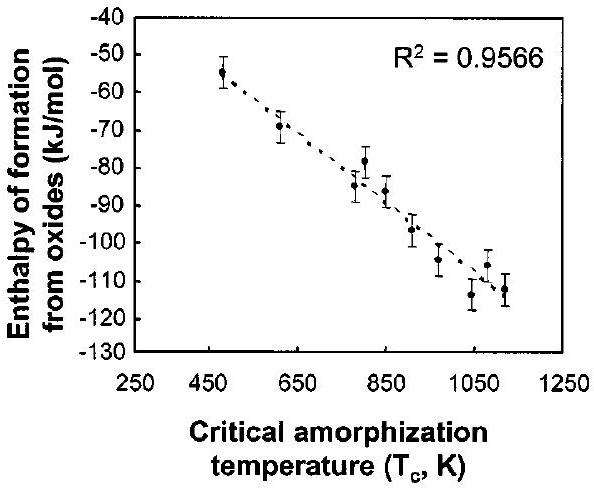
FIG. 3. The correlation between the formation enthalpies from the oxides $\Delta H_{f \text { - } \text { ox }}^{0}$, and the critical amorphization temperature $T_{c}$ of titanate pyrochlores under $1 \mathrm{MeV} \mathrm{Kr}^{+}$irradiation (see Ref. 126).

relative "resistance" of pyrochlore structure-type to radiation-induced amorphization. A comparison of the critical temperatures for amorphization measured for the same samples ${ }^{92}$ and the enthalpies of formation from the oxides ${ }^{126}$ show a remarkably consistent trend (Fig. 3). The more exothermic the enthalpy of formation, the wider the temperature range (higher $T_{c}$ ) over which the pyrochlore composition is susceptible to radiation-induced amorphization. ${ }^{126}$

Recently, the high-temperature heat capacity and thermal conductivity of $\mathrm{Nd}_{2} \mathrm{Zr}_{2} \mathrm{O}_{7}$ pyrochlore have been measured by differential scanning calorimetry and the laser flash technique, respectively. ${ }^{127}$ The thermal conductivity, which was determined over the temperature range from 500 to 1500 K , is too low for the safe use of $\mathrm{Nd}_{2} \mathrm{Zr}_{2} \mathrm{O}_{7}$ as an inert matrix fuel for the transmutation of minor actinides. The lowtemperature heat capacity of $\mathrm{Nd}_{2} \mathrm{Zr}_{2} \mathrm{O}_{7}$ has also been recently determined by adiabatic calorimetry and an adiabatic relaxation method over the temperature range from 0.45 to $400 \mathrm{~K},{ }^{128}$ and the results were used to determine the thermodynamic functions (e.g., heat capacity and enthalpy as a function of temperature) for $\mathrm{Nd}_{2} \mathrm{Zr}_{2} \mathrm{O}_{7}$.

## VII. RADIATION EFFECTS

Radiation effects from alpha-decay events in many crystalline oxides proposed for the immobilization of actinides are well known to result in amorphization, macroscopic swelling and order-of-magnitude increases in dissolution rates. ${ }^{129-131}$ Actinide-containing pyrochlores will likewise be the subject of self-radiation damage from alpha-decay events. In the study of a Cm-doped celsian glass ceramic, the pyrochlore phase, $\left(\mathrm{Nd}_{0.85} \mathrm{Cm}_{0.15}\right)_{2}\left(\mathrm{Ti}_{1.65} \mathrm{Zr}_{0.35}\right)_{2} \mathrm{O}_{7}$, was reported to transform to an amorphous state due to selfradiation damage. ${ }^{38}$ Similarly, in a Cm -doped devitrified glass, the pyrochlore phase $(\mathrm{Gd}, \mathrm{Cm})_{2} \mathrm{Ti}_{2} \mathrm{O}_{7}$ was observed to undergo a radiation-induced crystalline-to-amorphous transformation. ${ }^{132}$ Following these two studies, a detailed study on the effects of alpha decay in single-phase $(\mathrm{Gd}, \mathrm{Cm})_{2} \mathrm{Ti}_{2} \mathrm{O}_{7}$ pyrochlore showed that amorphization occurred at a dose of about $3.1 \times 10^{18}$ alpha-decay events per gram and was accompanied by macroscopic swelling of about $5 \%$ and an increase, by a factor of 20 to 50 , in the aqueous dissolution rate of the non-network Cm . ${ }^{27,29,133}$

Similar amorphization behavior has been observed for minerals of the pyrochlore group. ${ }^{32,134}$ The amount of radiationinduced phase transformation and magnitude of the changes in swelling and dissolution rate are greatly dependent on the pyrochlore composition and irradiation conditions. Because self-radiation damage from alpha-decay can significantly affect the atomic-scale structure and the physical and chemical properties of actinide-bearing pyrochlore-based waste forms, long-term assessments of performance must take into account the effects of alpha-decay at relevant temperatures, dose rates, and times. In this regard, it is fortunate that systematic experimental studies using short-lived actinides and ion-beam irradiations, studies of radiation effects in U- and Th-bearing minerals, and the development of models of radiation damage processes over the past 20 years have led to significant improvements in understanding the processes of damage accumulation in pyrochlore and related defectfluorite structures. This fundamental scientific understanding now provides a basis for predicting the effects of selfradiation damage on the performance of pyrochlore-based waste forms over the range of relevant temperatures, dose rates, and times. One of the recent successes of some of these studies has been the discovery of a class of radiationresistant pyrochlore/fluorite structures that can readily accommodate actinides; ${ }^{14-16,87}$ such phases can serve as highly durable, radiation-resistant host phases for the immobilization of plutonium and "minor" actinides.

In this section, the results from studies of self-radiation effects in several pyrochlore and related ceramics due to alpha-decay of incorporated short-lived ${ }^{238} \mathrm{Pu}$ or ${ }^{244} \mathrm{Cm}$ isotopes, natural pyrochlore minerals that contain long-lived actinides ( ${ }^{238} \mathrm{U}$ and ${ }^{232} \mathrm{Th}$ ), and heavy-ion irradiation studies are reviewed. In addition, it will be shown how these accelerated test methods and confirmatory results from mineral studies contribute synergistically to the understanding and predictive modeling of radiation effects in pyrochlores used for the immobilization of actinides.

## A. Radiation damage processes

Alpha-decay releases energetic alpha particles with energies typically in the range of 4.5 to 5.8 MeV , and energetic recoil nuclei (alpha-recoils) with energies of 70 to 100 keV . The effects of the interactions of the alpha-particles and alpha-recoils with the atomic structure lead to radiation damage. These interactions fall into two broad categories for both alpha-particles and alpha-recoils: the transfer of energy to electrons (ionization and electronic excitations) and the transfer of energy to atomic nuclei, primarily by ballistic processes involving elastic collisions. An alpha-particle will predominantly deposit its energy by ionization processes, while the alpha-recoil will lose most of its energy in elastic collisions with the nuclei of atoms in the solid. In addition to the transfer of energy, the particles emitted through radioactive decay can themselves, in some cases, have a significant chemical effect on the host material as a result of their deposition and incorporation into the structure.

The high-rate of energy absorption through ionization and electronic excitation from alpha-decay in ceramics can
result in self-heating. In addition to self-heating, ionization and electronic excitations produce a large number of electron-hole pairs that can result in covalent and ionic bond rupture, charged defects, enhanced self-ion and defect diffusion, localized electronic excitations, and in some ceramics, permanent defects from radiolysis.

Ballistic processes cause direct atomic displacements through elastic scattering collisions and are responsible for the atomic-scale rearrangement of the structure. The alpha particles dissipate most of their energy by ionization processes over a range of 16 to $22 \mu \mathrm{~m}$, but undergo enough elastic collisions along their path to produce several hundred isolated atomic displacements that form Frenkel pairs. The largest number of displaced atoms occurs near the end of the alpha particle range. The more massive but lower energy alpha-recoil particle accounts for most of the total number of displacements produced by ballistic processes. The alpharecoil loses $80 \%$ or more of its energy in elastic collisions over a very short range (20 to 30 nm ) that produce energetic recoils, which in turn lose $60 \%$ or more of their energy in elastic collisions. As a result, about $50 \%$ of the energy of the recoil is deposited as "damage energy" in a highly localized displacement cascade, where 500 to 2000 atoms are energetically displaced by elastic collisions. The displacement of atoms within a cascade produces Frenkel pairs but may also result in the direct formation of a topologically disordered or amorphous state in the core of the cascade. The total density of energy deposited over distances of approximately 25 nm into the crystal structure by an alpha-recoil cascade can be very high (up to $1 \mathrm{eV} /$ atom ) and occurs over a very short time ( $<10^{-12} \mathrm{~s}$ ), which may lead to local melting in the cascade or additional atomic relaxations and rearrangements that contribute to the topological disorder. Both the partitioning of the energy loss between ionization and elastic collisions and the distribution of displaced atoms will depend on the composition and structure of the pyrochlore phase.

In an alpha-decay event, the alpha particle and alpharecoil particle are released in opposite directions and produce distinct damage regions separated by several microns. Based on full cascade Monte Carlo calculations using the SRIM-2000 code ${ }^{135}$ and assuming a threshold displacement energy of 50 eV for all atoms, the average number of atomic displacements generated in $\mathrm{Gd}_{2} \mathrm{Ti}_{2} \mathrm{O}_{7}$ by the 5.2 MeV alpha-particle and the $86 \mathrm{keV}{ }^{235} \mathrm{U}$ recoil released in the decay of ${ }^{239} \mathrm{Pu}$ are 100 and 570, respectively. Many of these displaced atoms will recombine instantaneously (within one or two picoseconds), and the number of defects surviving the cascade will be less than the calculated number. Recent molecular dynamics calculations ${ }^{136}$ of threshold displacement energies in $\mathrm{La}_{2} \mathrm{Zr}_{2} \mathrm{O}_{7}$ ( 6 keV U cascades) indicate minimum threshold displacement energies of 53, 68, and 7 eV for $\mathrm{La}, \mathrm{Zr}$, and O, respectively. These values suggest that similar numbers of La and Zr displacements are produced, with the number of O displacements being a factor of 40 to 50 higher. Large fractions ( $80 \%$ to $90 \%$ ) of the O displacements are replacement events on equivalent O lattice sites. The molecular dynamics simulations ${ }^{136}$ of 6 keV U cascades in $\mathrm{La}_{2} \mathrm{Zr}_{2} \mathrm{O}_{7}$ also indicate that the lifetime of the displacement cascades is about 0.9 ps ; however, continued relaxation of the O defects occurs for about 3 ps . While the minimum displacement energy for

O is rather low along one direction (the direction with the minimum displacement energy for $\mathrm{O}(\sim 7 \mathrm{eV})$ is [012] for $\mathrm{O}_{48 \mathrm{f}}$ and [114] for $\mathrm{O}_{8 \mathrm{~b}}$, respectively), the results suggest that many of these displacements either are replacement events or recombine within several picoseconds. Along other directions, the displacement energies are higher, and more highly separated, stable O Frenkel pairs may be produced. This result is consistent with the displacement energy of $47 \pm 5 \mathrm{eV}$ for O that has been recently measured for $\mathrm{La}_{2} \mathrm{Zr}_{2} \mathrm{O}_{7}$. ${ }^{137}$

## B. Irradiation methods

The effects of alpha-decay events have been studied by incorporating short-lived actinides, such as ${ }^{238} \mathrm{Pu}$ (half-life of 87.7 years) and ${ }^{244} \mathrm{Cm}$ (half-life of 18.1 years), into pyrochlore and related structures. Such experimental studies accelerate the damage rates by one to several orders of magnitude compared to the actinides of interest for immobilization. In the study of the pyrochlore, $\mathrm{Gd}_{2} \mathrm{Ti}_{2} \mathrm{O}_{7}, 3 \mathrm{wt} \%{ }^{244} \mathrm{Cm}$ was substituted for Gd. ${ }^{27-29}$ In another study, ${ }^{238} \mathrm{Pu}$ was substituted for Zr in zirconolite, which yielded $\mathrm{CaPuTi}_{2} \mathrm{O}_{7}$ with a fluorite-derivative structure that is related to pyrochlore. ${ }^{44,45,47}$ In addition, there are ongoing studies on ${ }^{238} \mathrm{Pu}$-containing ceramics that investigated the behavior of pyrochlore phases and pyrochlore-based waste ceramics at several temperatures. ${ }^{138-141}$ While studies involving shortlived actinides provide realistic irradiation conditions and bulk damage, they can be time-consuming, involving one or more years to complete, and generally provide only limited data under just a few sets of experimental conditions. Furthermore, detailed characterization and study of such highly radioactive samples was problematic twenty years ago and remains so today. Of all the studies to date on alpha-decay effects in oxide phases containing short-lived actinides, only two have attempted to evaluate the effects of temperature, which are critical to modeling both the effects of dose rates and temperature. One study was on $\mathrm{CaPuTi}_{2} \mathrm{O}_{7}$ with the fluorite-derivative structure, ${ }^{44,45}$ and the other is a current study on several ${ }^{238} \mathrm{Pu}$-containing pyrochlore-based ceramics. ${ }^{138,139}$

Natural minerals also can contain large concentrations of U and Th impurities (up to $30 \mathrm{wt} . \%$ ); thus, natural pyrochlores can serve as analogues for self-radiation effects. ${ }^{142}$ Studies of natural pyrochlores ${ }^{32,134}$ complement the studies involving short-lived actinides. In mineral samples, the dose rates are extremely low, with damage having accumulated over hundreds of millions of years, and the compositions and dose rates can vary, particularly with regard to U- and Thcontent. Likewise, the thermal and environmental histories of minerals are not as well constrained as in laboratory studies. The variations in U- and Th-contents, however, provide a broad range of damage levels over geologic timescales, and the minerals provide bulk material that can be characterized by a wide variety of advanced techniques. ${ }^{143}$ The models developed for radiation damage may be tested by comparing model predictions to observations of minerals of great age that have experienced a range of alpha-decay doses. ${ }^{32}$

Ion-beam irradiation studies have been used to more rapidly evaluate the effects of temperature, survey radiation re-
sponses over a wide range of compositions and structures, and develop the fundamental understanding and predictive models necessary to assess the impact of alpha-decay events on long-term performance. ${ }^{144,145}$ As a result, ion-beam irradiation studies have been completed on a wide range of pyrochlore compositions, as well as on many related compositions and structures; however, ion-beam experiments are performed at greatly accelerated rates, which is a concern that continues to be investigated. Fortunately, recent models of radiation-induced amorphization ${ }^{146}$ and a broad range of data have identified temperature regimes and conditions where dose-rate effects are minimal, as well as where they dominate behavior. For consistency in the comparison of data on alpha-decay damage and data from ion-beam irradiations with ions of different mass and energy, the doses reported in this review are primarily in units of displacements per atom (dpa), which have been calculated based on full cascade Monte Carlo calculations using the SRIM-2000 code ${ }^{135}$ and assuming a threshold displacement energy of 50 eV for all atoms. For actinide-containing pyrochlores, the radiation-damage should be uniformly produced, and the bulk average dose is reported. Because the dose in ion-beam irradiations varies with depth, a local dose is used. For ionchanneling experiments, the results have been derived from behavior at the damage peak, for which a unique dose can be defined. In the case of in situ TEM experiments, the dose for amorphization at a given ion fluence is defined in this review as the local dose at a depth of 30 nm , which is the region that becomes amorphous last and is unaffected by near-surface effects that can extend to depths of 10 to $20 \mathrm{~nm} .^{147}$ Note, some research groups use the local dose at a depth of 100 nm as an average value to calculate the critical amorphization dose, considering the fact that the typical thickness of the TEM specimen under ion irradiations is $\sim 200 \mathrm{~nm}$.

Ion-beam irradiation can be used to produce a highly damaged or amorphous state that may not differ greatly from that produced by alpha-decay over long times. While such highly damaged states are confined to near-surface regions (up to several microns), the damage layers of pyrochlore are generally stable and not affected by electron beam irradiations. This allows the application of advanced methods, such as TEM and Rutherford-backscattering spectroscopy, in the determination of the structure of each damaged stage. Likewise, by controlling or varying the ion-irradiation conditions, it is possible to produce a nearly uniform damage state over a micron or more. The chemical durability of such irradiated samples can be readily tested, and as recently demonstrated for some pyrochlore samples, ${ }^{81,121}$ the results are consistent with tests on the highly damaged states of $\mathrm{Pu} / \mathrm{Cm}$-containing materials. Such measurements and testing of ion-beam irradiated materials provide a reasonable representation of the worst-case effect of radiation effects on chemical durability over the long periods of interest for actual actinidecontaining waste forms.

## C. Defects and amorphization

As indicated above, many pyrochlore compounds are susceptible to a radiation-induced crystalline-to-amorphous
transformation as a result of alpha-decay events. The amorphous state is generally characterized by the loss of longrange order; however, short-range order is often retained to varying degrees. ${ }^{145}$ In general, the cumulative amount of amorphous material increases nonlinearly with dose, and the rate of amorphization decreases nonlinearly with temperature due to the kinetics of damage recovery processes. ${ }^{146}$ The atomic-scale processes contributing to the production of the amorphous state control the functional dependence of the amorphous volume fraction $f_{a}$ with dose. The amorphous fraction is difficult to define uniquely, with the definition often being dependent on the resolution of the measurement technique being employed, as well as on how contributions to the measurements from simple and complex crystalline defects, generated in the crystal structure by irradiation, are considered. Even with a given method, the dose dependence of $f_{a}$ is difficult to measure for radioactive materials (limited methods available) and ion-irradiated samples (nonuniform damage profiles). Consequently, there are limited data of this type for the materials of interest. Ion-channeling methods, ${ }^{148}$ which require high-quality single crystals, are sublattice selective techniques that have been used to obtain quantitative data on the accumulation of relative disorder in irradiated materials, and by using a disorder accumulation model, ${ }^{149}$ the crystalline and amorphous contributions to the disorder in ion-irradiated pyrochlores can be obtained. ${ }^{150,151}$ Raman spectroscopy, nuclear magnetic resonance, and x-ray absorption spectroscopy are among other techniques that have been used to quantify damage accumulation and estimate $f_{a}$ in other irradiated materials ${ }^{152}$ and that could be applied to estimate amorphous fraction in some pyrochlore compositions.

There are several models that describe different mechanisms of amorphization that are consistent with many of the observations of amorphization in pyrochlore. For consistency in the analyses of data and the predictions of behavior, the direct-impact, defect-stimulated model (DI/DS) for amorphization, ${ }^{146}$ which has been validated in molecular dynamics simulations and experimental measurements in SiC, ${ }^{153,154}$ is utilized in this review. In this model, amorphous domains are directly produced in the core of a cascade, and the irradiation-induced point defects accumulate and further stimulate amorphization at the crystalline-amorphous interface. In this model, the amorphous fraction $f_{a}$ is given by the expression: ${ }^{146}$

$$
f_{a}=1-\left(\sigma_{\mathrm{a}}+\sigma_{\mathrm{s}}\right) /\left\{\sigma_{\mathrm{s}}+\sigma_{\mathrm{a}} \exp \left[\left(\sigma_{\mathrm{a}}+\sigma_{\mathrm{s}}\right) D\right]\right\},
$$

where $\sigma_{\mathrm{a}}$ is the amorphization cross section, $\sigma_{\mathrm{s}}$ is the effective cross section for defect-stimulated amorphization, and $D$ is the local dose (dpa).

By iterative fitting a disorder accumulation model to ionchanneling data, ${ }^{149}$ in which the amorphous fraction is described by Eq. (1), the dependence of $f_{a}$ on dose has been derived for $\mathrm{Cd}_{2} \mathrm{Nb}_{2} \mathrm{O}_{7}$ and $\mathrm{Sm}_{2} \mathrm{Ti}_{2} \mathrm{O}_{7}$ irradiated with 1.0 $\mathrm{MeV} \mathrm{Au}^{2+}$ ions at $300 \mathrm{~K} .^{150,151}$ These results, which are shown in Fig. 4, indicate that $\mathrm{Cd}_{2} \mathrm{Nb}_{2} \mathrm{O}_{7}$ is much more susceptible to radiation-induced amorphization than $\mathrm{Sm}_{2} \mathrm{Ti}_{2} \mathrm{O}_{7}$ under similar irradiation conditions, which suggests that the threshold displacement energies for $\mathrm{Cd}_{2} \mathrm{Nb}_{2} \mathrm{O}_{7}$ may be less (or damage cross sections larger) than those in $\mathrm{Sm}_{2} \mathrm{Ti}_{2} \mathrm{O}_{7}$, or

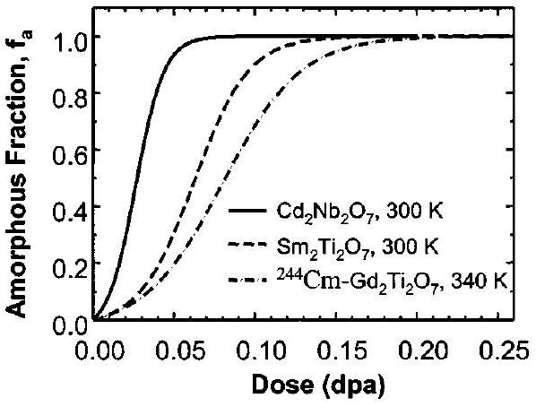
FIG. 4. Amorphous fraction as a function of dose in $\mathrm{Cd}_{2} \mathrm{Nb}_{2} \mathrm{O}_{7}$ and $\mathrm{Sm}_{2} \mathrm{Ti}_{2} \mathrm{O}_{7}$ irradiated with $1.0 \mathrm{MeV} \mathrm{Au}^{2+}$ ions (see Refs. 150, 151) and in $\mathrm{Gd}_{2} \mathrm{Ti}_{2} \mathrm{O}_{7}$ containing $1.24 \mathrm{wt} \%{ }^{244} \mathrm{Cm}$ (see Ref. 145).

dynamic recovery processes may be more active at 300 K in $\mathrm{Sm}_{2} \mathrm{Ti}_{2} \mathrm{O}_{7}$. The results in Fig. 4 were derived from the damage peak region in the irradiated pyrochlores, where the density of damage energy deposition from the Au ions in $\mathrm{Sm}_{2} \mathrm{Ti}_{2} \mathrm{O}_{7}$ is only about $15 \%$ higher than that from alpha recoils in $\mathrm{Gd}_{2} \mathrm{Ti}_{2} \mathrm{O}_{7}$. Thus, it is not surprising that the amorphization behavior for $\mathrm{Sm}_{2} \mathrm{Ti}_{2} \mathrm{O}_{7}$, which has identical behavior to $\mathrm{Gd}_{2} \mathrm{Ti}_{2} \mathrm{O}_{7}$ under heavy-ion irradiation, ${ }^{81}$ is in reasonable agreement with the amorphization behavior shown in Fig. 4 for ${ }^{244} \mathrm{Cm}$-containing $\mathrm{Gd}_{2} \mathrm{Ti}_{2} \mathrm{O}_{7}$ at 340 K . ${ }^{145}$

While the results in Fig. 4 describe the amorphization process in several pyrochlores, it is important to note that the damage accumulation processes involve both amorphization and defect accumulation processes in the residual crystalline structure. Radiation damage leads to the formation and accumulation of Frenkel pairs in the residual crystalline material. The relaxation of cation interstitials onto vacant lattice sites of the "other" cation-site leads to cation disordering. Likewise, the relaxation of oxygen interstitials onto the vacant 8a sites leads to anion disorder. The disordering of cations and anions can result in a transformation from the ordered pyrochlore structure to a disordered defect-fluorite structure [Figs. 1(c) and 1(d)]. The order-disorder structure transformation is a complex process that occurs in the pyrochlore structure during irradiation due to the independent disordering kinetics for the cation and anion sublattices. Ion irradiation-induced cation and anion disorder both contribute to the transition from the ordered-pyrochlore to a defectfluorite structure. An intermediate stage of anion-disordered pyrochlore has been observed prior to the formation of an anion-deficient fluorite structure. ${ }^{155}$ These results suggest that cation disorder and anion disorder occur independently and that the disordering of the anion sublattice occurs prior to the disordering of the cation sublattice. ${ }^{155}$ A significant amount of relative disorder was observed during an early stage of radiation damage in the titanate pyrochlore single crystals, which may be due to the lower displacement threshold energy for the anion sublattice, as compared with that of cations, as suggested by the molecular dynamic simulation on $\mathrm{La}_{2} \mathrm{Zr}_{2} \mathrm{O}_{7}$ pyrochlore structure. ${ }^{136}$ For titanate pyrochlores, this anion-disordered pyrochlore structure is metastable and transforms to a defect fluorite structure upon ion irradiation. This is further evidenced by a recent ion chan-

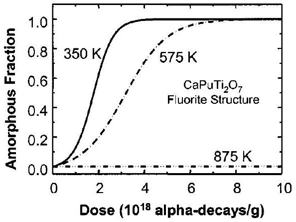
FIG. 5. Amorphous fraction in $\mathrm{CaPuTi}_{2} \mathrm{O}_{7}$ derived from swelling and x-ray diffraction data (see Ref. 44).

neling study on Au-irradiated $\mathrm{Sm}_{2} \mathrm{Ti}_{2} \mathrm{O}_{7}$ where a much higher degree of relative disorder (interstitials) is measured on the anion sublattice than on the Sm sublattice, suggesting that the damage occurring on the cation sublattice may drive the amorphization process. Cation disorder has also been reported to dominate irradiation-driven order-disorder transitions in $\mathrm{Gd}_{2}\left(\mathrm{Zr}_{x} \mathrm{Ti}_{1-x}\right)_{2} \mathrm{O}_{7} .{ }^{88}$ However, whether directimpact or defect accumulation mechanisms control the irradiation-induced structural transformation and amorphization process remains unclear. Other ion-irradiation studies have indicated that this pyrochlore-to-fluorite order-disorder transformation occurs concurrently with the amorphization process in $\mathrm{Gd}_{2} \mathrm{Ti}_{2} \mathrm{O}_{7}$, ${ }^{156,157}$ and high-resolution TEM images of $\mathrm{Xe}^{+}$irradiated $\mathrm{Gd}_{2} \mathrm{Ti}_{2} \mathrm{O}_{7}$ show evidence of amorphous domain formation that could be the result of direct-impact amorphization and cascade quenching effects. However, recent studies suggest that the ordered pyrochlore to the defect fluorite structure transformation locally precedes significant amorphization in $\mathrm{Cd}_{2} \mathrm{Nb}_{2} \mathrm{O}_{7}$ irradiated with $\mathrm{Ne}^{+}$and $\mathrm{Xe}^{+}$ ions, ${ }^{158}$ as well as in $\mathrm{Gd}_{2} \mathrm{Ti}_{2} \mathrm{O}_{7}$ irradiated with $\mathrm{Xe}^{+}$ions. ${ }^{19}$ Such observations are consistent with a very small cross section for direct-impact amorphization relative to defect production cross sections that are illustrated by the data in Fig. 4.

## D. Kinetics of amorphization

The competing processes of damage production and recovery control the temperature dependence of amorphization. While the kinetics of amorphization in pyrochlores can be determined from the dependence of amorphous fraction on dose at different temperatures, such data are not easily obtained for all compositions. However, using an iterative fitting procedure, the dependence of $f_{a}$ on dose and temperature has been previously derived ${ }^{145}$ from the macroscopic swelling and x-ray diffraction data for $\mathrm{CaPuTi}_{2} \mathrm{O}_{7},{ }^{44}$ as is shown in Fig. 5. The decrease in the rate of amorphization with increasing temperature is clearly evident. These results for $\mathrm{CaPuTi}_{2} \mathrm{O}_{7}$ are similar to the behavior recently observed at 300 and 700 K in $\mathrm{Sm}_{2} \mathrm{Ti}_{2} \mathrm{O}_{7}$. ${ }^{151}$

In general, the dose for amorphization for specific compositions and irradiation conditions has been most often determined from electron-diffraction analysis of TEM specimens for actinide-containing pyrochlores and related

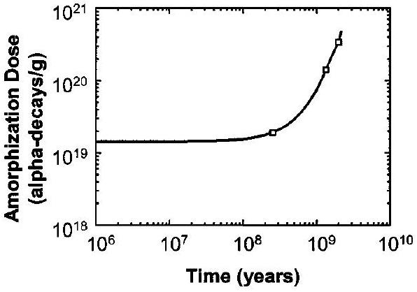
FIG. 6. Amorphization dose in natural pyrochlore minerals as a function of geologic age (derived from Lumpkin) (see Ref. 32).

materials, ${ }^{28,29,44,47}$ minerals in the pyrochlore group, ${ }^{32,134}$ or for ion-irradiated pyrochlores. ${ }^{14,16}$ Unfortunately, there are limited data on actinide-containing pyrochlores and related materials. The amorphization dose in actinide-containing $\mathrm{Gd}_{2} \mathrm{Ti}_{2} \mathrm{O}_{7}$ has been determined for only a single irradiation temperature. ${ }^{28,29,133}$ For $\mathrm{CaPuTi}_{2} \mathrm{O}_{7}$, amorphization doses have been determined at two temperatures, ${ }^{44,47}$ with results consistent with those shown in Fig. 5. In the case of pyrochlore minerals, the amorphization dose has been determined as a function of geologic time, as shown in Fig. 6. The increase in amorphization dose with geologic time (at an average temperature of $100-200^{\circ} \mathrm{C}$ ) clearly illustrates the time dependence of the damage accumulation kinetics.

While there are limited data on amorphization in actinide-bearing pyrochlore materials, the amorphization dose in ion-beam irradiated pyrochlores has been determined for a wide range of compositions as a function of ion mass and temperature, as illustrated in Fig. 7 for $\mathrm{Cd}_{2} \mathrm{Nb}_{2} \mathrm{O}_{7}$ irradiated with different ions and measured using either in situ TEM techniques ${ }^{158}$ or ion-channeling methods. ${ }^{150}$ The results in Fig. 7 show a significant increase in the amorphization dose under irradiation with $\mathrm{Ne}^{+}$ions as compared with irradiation by $\mathrm{Xe}^{+}$or $\mathrm{Au}^{2+}$ ions at low temperatures. At room temperature, there is a systematic increase in the amorphization dose with decreasing ion mass. Likewise, there is an apparent increase in the critical temperature $T_{c}{ }^{146}$ above which amorphization will not occur, for $\mathrm{Xe}^{+}$irradiation relative to $\mathrm{Ne}^{+}$irradiation. The change in both the baseline

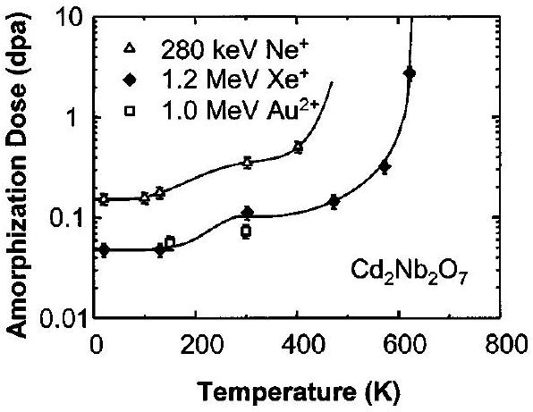
FIG. 7. Dependence of dose for complete amorphization on temperature and ion mass in $\mathrm{Cd}_{2} \mathrm{Nb}_{2} \mathrm{O}_{7}$, based on in situ TEM studies of $\mathrm{Ne}^{+}$and $\mathrm{Xe}^{+}$ion irradiations (see Ref. 158) and in situ ion-channeling studies of $\mathrm{Au}^{2+}$ irradiations (see Ref. 150).

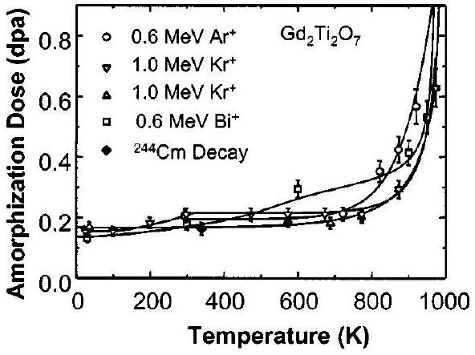
FIG. 8. Amorphization dose in $\mathrm{Gd}_{2} \mathrm{Ti}_{2} \mathrm{O}_{7}$ for different ions (see Refs. 14, $15,81,146$ ) and for a sample containing $1.24 \mathrm{wt} \%{ }^{244} \mathrm{Cm}$ (see Ref. 145).

amorphization dose and the temperature dependence for $\mathrm{Cd}_{2} \mathrm{Nb}_{2} \mathrm{O}_{7}$ is related to enhanced damage recovery kinetics for the lighter ions, as well as possible change in dominant amorphization mechanism. This enhanced recovery process may be associated with the much higher rate of energy loss by ionization processes for lighter ions, which is consistent with the observation that enhanced Cd and O mobilities lead to Cd nanoclusters and bubble-induced cleavage in $\mathrm{Cd}_{2} \mathrm{Nb}_{2} \mathrm{O}_{7}$ irradiated with $3 \mathrm{MeV} \mathrm{He}^{+}$ions and $10 \mathrm{MeV} \mathrm{C}^{+}$ ions. ${ }^{159}$ In contrast to the results in Fig. 7, the amorphization dose and critical temperature in $\mathrm{Gd}_{2} \mathrm{Ti}_{2} \mathrm{O}_{7}$ are largely independent of ion mass, ${ }^{17,145}$ as shown in Fig. 8. The results also show that there is good agreement between the dose for amorphization in $\mathrm{Gd}_{2} \mathrm{Ti}_{2} \mathrm{O}_{7}$ under ion irradiation and that from ${ }^{244} \mathrm{Cm}$ alpha-decay near room temperature (significantly below $T_{c}$ ).

Complete amorphization will not occur if the amorphization rate is less than or equal to the damage recovery rate. Thus, the temperature at which the rate of damage recovery equals the rate of amorphization defines the critical temperature for amorphization for a given set of irradiation conditions. ${ }^{146}$ The damage recovery processes affecting amorphization may be associated with both irradiationassisted and thermal recovery processes. If irradiationassisted or irradiation-induced recovery processes dominate, the critical temperature $T_{c}$ (irr) is given by the expression ${ }^{146}$

$$
T_{c}(\mathrm{irr})=E_{\mathrm{irr}} /\left[k \ln \left(\sigma_{r} / \sigma_{a}\right)\right]
$$

where $E_{\text {irr }}$ is the activation energy for the irradiation-assisted process, $k$ is Boltzmann's constant, $\sigma_{r}$ is the cross-section for the dominant irradiation-assisted process, and $\sigma_{a}$ is the local cross-section for amorphization. As discussed and illustrated in detail elsewhere, ${ }^{146} T_{c}$ is independent of damage rate under these conditions, and the ratio $\sigma_{r} / \sigma_{a}$ can be highly dependent on ion mass, which leads to shifts in $T_{C}$ with ion mass when irradiation-assisted recovery processes are dominant, as shown in Fig. 7. If irradiation-assisted recovery processes are dominant, the critical temperature, as defined by $T_{c}$ (irr), is independent of damage rate and, consequently, cannot be used to predict the critical temperature under lower dose-rate conditions, where irradiation-assisted processes are negligible, as in the case of actinide-host phases in a repository.

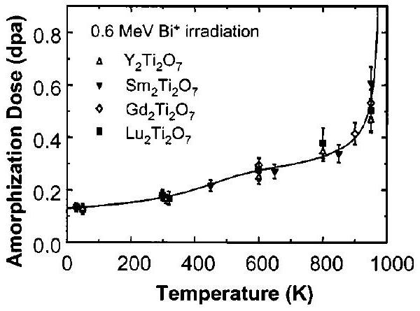
FIG. 9. Amorphization dose in rare-earth titanate pyrochlores (see Ref. 81).

If thermal recovery processes are dominant, then the critical temperature $T_{c}$ (th) is given by the expression ${ }^{146}$

$$
T_{c}(\mathrm{th})=E_{\mathrm{th}} /\left[k \ln \left(\nu_{\mathrm{th}} / \sigma_{a} \phi\right)\right],
$$

where $E_{\mathrm{th}}$ is the activation energy for the dominant thermal process, $k$ is Boltzmann's constant, $\nu_{\text {th }}$ is the thermal jump frequency, $\sigma_{a}$ is the local cross-section for amorphization ( $\mathrm{dpa}^{-1}$ ), and $\phi$ is the local damage rate ( $\mathrm{dpa} / \mathrm{s}$ ). Thus, when thermal recovery processes dominate, $T_{c}$ is strongly dependent on damage rate. For convenience, ion-beam experiments are often performed under nearly constant amorphization or damage rates $\sigma_{a} \phi$. Since $E_{\text {th }}$ and $\nu_{\text {th }}$ in Eq. (3) are material-dependent constants, $T_{c}$ (th) is largely independent of ion mass (i.e., damage-energy density) when thermal recovery processes dominate, as illustrated in Fig. 8 for $\mathrm{Gd}_{2} \mathrm{Ti}_{2} \mathrm{O}_{7}$. In addition, when thermal recovery processes are dominant, the dose for amorphization should be relatively independent of dose rate at temperatures below $T_{C}$, where there is very little thermal mobility of defects. Despite the six orders of magnitude difference in damage rates, the good agreement between the amorphization doses in $\mathrm{Gd}_{2} \mathrm{Ti}_{2} \mathrm{O}_{7}$ under ion irradiation and from ${ }^{244} \mathrm{Cm}$ decay near room temperature confirm some degree of dose-rate independence below $T_{c}$.

The temperature dependence of amorphization is shown in Fig. 9 for several rare-earth titanates irradiated with 0.6 $\mathrm{MeV} \mathrm{Bi}{ }^{+}$ions. ${ }^{81}$ In general, the results show that amorphization under these heavy-ion irradiation conditions is relatively independent of the rare-earth species. The results in Figs. 8 and 9, along with those shown in Fig. 4, confirm that $\sigma_{a}$ is similar for heavy ions and alpha-decay damage in these rareearth titanate pyrochlores. Thus, the shift in $T_{c}$ for the lower dose rates associated with alpha decay in actinide-containing rare-earth titanates can be easily calculated using Eq. (3), based on the dose rate and $T_{c}$ (th) from heavy-ion irradiation experiments.

While $T_{c}$ appears to be independent of ion mass for $\mathrm{Gd}_{2} \mathrm{Ti}_{2} \mathrm{O}_{7}$ (Fig. 8), this is not true for all titanate pyrochlores. The values of $T_{c}$ as a function of A -site ionic radius are shown in Fig. 10 for $\mathrm{A}_{2} \mathrm{Ti}_{2} \mathrm{O}_{7}$ irradiated with Bi ions ${ }^{81}$ and with Kr ions. ${ }^{156,157}$ Bearing in mind that different groups conducted the Bi and Kr irradiation experiments and that the critical temperature can be significantly affected by damage rate, the results in Fig. 10 suggest that the critical temperature for amorphization is somewhat independent of ion mass

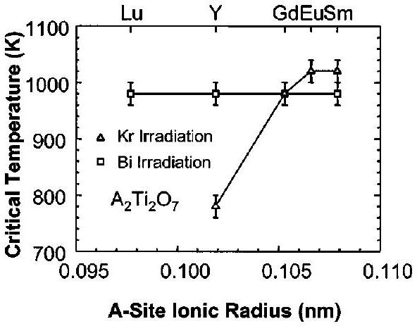
FIG. 10. Critical temperature as a function of A-site ionic radius in $\mathrm{A}_{2} \mathrm{Ti}_{2} \mathrm{O}_{7}$ irradiated with 0.6 MeV Bi ions (see Ref. 81) and 1.0 MeV Kr ions (see Refs. 156, 157).

for Gd and Sm titanates. The slight difference between the $T_{C}$ results for Gd, Eu, and Sm from the two different groups may be due to a higher dose rate being employed in the case of the $\mathrm{Kr}^{+}$irradiations. For A-site cations smaller than Gd, there appears to be a significant effect of ion mass, similar to behavior observed in other systems. ${ }^{146}$ The results in Figs. 9 and 10 show that $T_{c}$ is relatively constant, independent of the A-site ion, under irradiation with heavy Bi ions. Based on the above discussions, this would suggest that $T_{c}$ (th) for the $\mathrm{A}_{2} \mathrm{Ti}_{2} \mathrm{O}_{7}$ pyrochlores is independent of composition and has a value of about $1000 \pm 40 \mathrm{~K}$ under irradiation with heavy Bi ions. At this temperature, the oxygen vacancies, which have similar migration energies in all the $\mathrm{A}_{2} \mathrm{Ti}_{2} \mathrm{O}_{7}$ pyrochlores considered here, ${ }^{160}$ begin to become highly mobile, which suggest they may play a contributing role in the thermal recovery processes that defines $T_{c}$ (th) for this system under irradiation with heavy ions, such as Bi . For compositions in this system with ionic radii smaller that Gd , the values of $T_{c}$ determined under irradiation with Kr ions (Fig. 10) suggest more dependence on irradiation conditions (i.e., ion mass), which may indicate the dominance of irradiation-assisted recovery processes or changes in the amorphization process. Whether this might be related to ionization processes, as has been suggested for the $\mathrm{Cd}_{2} \mathrm{Nb}_{2} \mathrm{O}_{7}$ results in Fig. 7, needs to be determined by additional studies. Since Y is rather light compared to the rare-earth cations, there may be additional impacts from the partitioning of greater energy losses to ionization processes that may not be observed in other rare-earth titanates with ionic radii smaller than Gd.

A different perspective on the effect of A-site cations has been presented in a recent systematic ion beam irradiation study of a series of titanate pyrochlore single crystals $\mathrm{A}_{2} \mathrm{Ti}_{2} \mathrm{O}_{7}(\mathrm{~A}=\mathrm{Sm}-\mathrm{Lu}$, and Y$)$ using $1 \mathrm{MeV} \mathrm{Kr}^{+}$and in situ TEM observation. ${ }^{92}$ In addition to the effect of irradiation conditions, such as ion mass differences (e.g., $\mathrm{Kr}^{+}$versus $\mathrm{Bi}^{+}$), the response of the pyrochlore structure-types is highly compositional dependent. The temperature dependence of the critical amorphization fluence for titanate pyrochlore single crystals under $1 \mathrm{MeV} \mathrm{Kr}^{+}$ion irradiation is shown in Fig. 11. A significant difference in the radiation response of titanate pyrochlores with different lanthanide elements was observed, which confirms that A-site cations have an important effect on the susceptibility of the titanate pyrochlores to

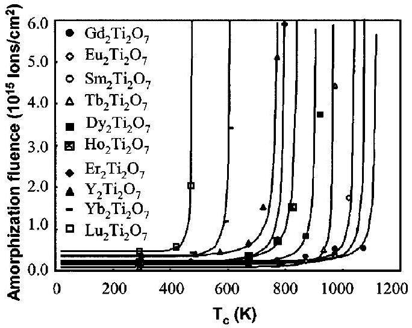
FIG. 11. Temperature dependence of the critical amorphization fluence of rare-earth titanate pyrochlores under $1 \mathrm{MeV} \mathrm{Kr}^{+}$ion irradiation (see Ref. 92). The legend is ordered according to $T_{c}$.

amorphization. With increasing ionic radius ratio from $\mathrm{Lu}_{2} \mathrm{Ti}_{2} \mathrm{O}_{7}(\sim 1.61)$ to $\mathrm{Gd}_{2} \mathrm{Ti}_{2} \mathrm{O}_{7}(\sim 1.74)$, the critical amorphization temperature increased from 480 to 1120 K (Fig. 12). When the ionic radius of the A -site cation was increased from $\mathrm{Gd}^{3+}$ to $\mathrm{Sm}^{3+}$, the critical temperature decreased from 1120 to 1045 K (Fig. 12). The fact that $\mathrm{Gd}_{2} \mathrm{Ti}_{2} \mathrm{O}_{7}$ has the highest critical temperature indicates that this composition is susceptible to ion irradiation-induced amorphization to higher temperatures than other rare-earth titanate pyrochlores. This observation is consistent with the results of 1 $\mathrm{MeV} \mathrm{Kr}^{+}$irradiations on polycrystalline Eu-, Sm- and Gdtitanate pyrochlores. ${ }^{156}$ The cation radius ratio has been used to predict the stability of pyrochlores under irradiation in recent energy minimization simulations. ${ }^{16}$ As the A-site cation radius approaches that of the B-site cation radius, the material has a higher capacity for accommodating the antisite cation defect due to a lower cation antisite defect formation energy. Under irradiation, the lattice energy increases rapidly-especially in materials with a high defect formation energy. When the free energy of the crystalline structure during irradiation is greater than the free energy of the aperiodic state, then the material is more easily amorphized. ${ }^{16}$ Gener-

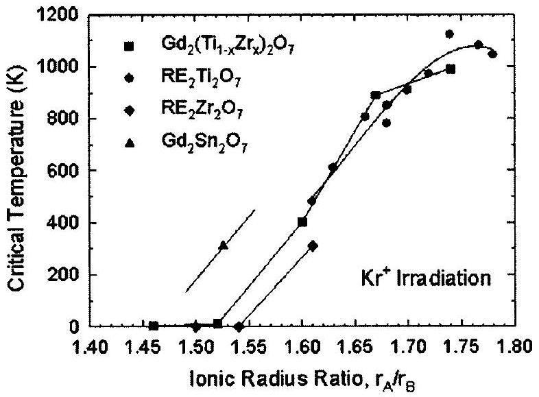
FIG. 12. Critical temperature, $T_{c}$, as a function of cation ionic radius ratio for pyrochlore compositions irradiated by $1.0 \mathrm{MeV} \mathrm{Kr}{ }^{+}$ions. $\mathrm{La}_{2} \mathrm{Zr}_{2} \mathrm{O}_{7}$ was irradiated by $1.5 \mathrm{MeV} \mathrm{Xe}^{+}$ions (see Ref. 168).

ally, the energy minimization simulation results, based on the defect formation energy, agree well with the increasing critical amorphization temperatures for the titanate pyrochlores $\mathrm{A}_{2} \mathrm{Ti}_{2} \mathrm{O}_{7}$ as the ionic radius of the A -site cation increases from $\mathrm{Lu}^{3+}(0.0977 \mathrm{~nm})$ to $\mathrm{Gd}^{3+}(0.105 \mathrm{~nm})$, even though there is a small difference in the calculated antisite defect formation energy. ${ }^{16}$

However, the fact that $\mathrm{Gd}_{2} \mathrm{Ti}_{2} \mathrm{O}_{7}$ has the highest critical amorphization temperature suggests that the cation ionic radius ratio criterion, as well as the associated defect formation energies, cannot be used exclusively to predict the response of the pyrochlore structure-types to ion beam irradiations. The electronic configurations (e.g., bond type) of the cation and associated polyhedron distortions also have a significant effect on the energetics of defect formation and the radiation stability of pyrochlore compounds. ${ }^{92,93,161}$ For example, $\mathrm{Gd}_{2} \mathrm{Ti}_{2} \mathrm{O}_{7}$ is more sensitive to ion-beam-induced amorphization at high temperature, as compared with other titanate pyrochlore compositions, and this may be attributed to its greater structural similarity to the ordered pyrochlore superstructure which has less distortion of the $\mathrm{TiO}_{6}$ octahedra. This is evident because it has the smallest $\mathrm{O}_{48 \mathrm{f}} X$ parameter as a result of the strong ionic character of $\mathrm{Gd}^{3+}$ due to the specific electronic configuration of the $4 f$ subshell of $\mathrm{Gd}^{3+}$ (half-filled). ${ }^{92}$ The effect of cation electronic configuration is further evidenced by the comparison between the radiation responses of $\mathrm{Gd}_{2} \mathrm{Sn}_{2} \mathrm{O}_{7}$ and $\mathrm{Gd}_{2}\left(\mathrm{Zr}_{0.75} \mathrm{Ti}_{0.25}\right)_{2} \mathrm{O}_{7}$. Although the cation ionic radius ratio of $\mathrm{Gd}_{2} \mathrm{Sn}_{2} \mathrm{O}_{7}(\sim 1.526)$ is similar to that of $\mathrm{Gd}_{2}\left(\mathrm{Zr}_{0.75} \mathrm{Ti}_{0.25}\right)_{2} \mathrm{O}_{7}(\sim 1.523)$, there is a dramatic difference in the radiation "resistance" (Fig. 12). No amorphization occurs in $\mathrm{Gd}_{2}\left(\mathrm{Zr}_{0.75} \mathrm{Ti}_{0.25}\right)_{2} \mathrm{O}_{7}$ with an ion irradiation at 25 K ; whereas, $\mathrm{Gd}_{2} \mathrm{Sn}_{2} \mathrm{O}_{7}$ can be amorphized at room temperature at a dose of $\sim 3.4 \mathrm{dpa} .^{93,161}$ The covalent character of $\langle\mathrm{Sn}-\mathrm{O}\rangle$ bond and the associated decrease in the $\langle\mathrm{Sn}-\mathrm{O}\rangle$ bond distance ${ }^{73}$ imply a lesser degree of distortion of the $\mathrm{SnO}_{6}$ coordination octahedron, resulting in a structure more compatible with the ordered pyrochlore superstructure. This leads to a greater susceptibility of $\mathrm{Gd}_{2} \mathrm{Sn}_{2} \mathrm{O}_{7}$ to ionbeam irradiation-induced amorphization, as compared with $\mathrm{Gd}_{2}\left(\mathrm{Zr}_{0.75} \mathrm{Ti}_{0.25}\right)_{2} \mathrm{O}_{7}$. First-principle calculations ${ }^{162}$ using density functional theory reported a significant covalency for the $\langle\mathrm{Sn}-\mathrm{O}\rangle$ bond and mainly ionic character for the $\langle\mathrm{Ti}-\mathrm{O}\rangle$ and $\langle\mathrm{Zr}-\mathrm{O}\rangle$ bonds. Additionally, the charge density around the $\mathrm{O}_{48 \mathrm{f}}$ in the stannate pyrochlore showed significantly greater distortion from spherical, in comparison with the more ionicly bonded titanates. The greater degree of covalent bonding between $\left\langle\mathrm{Sn}^{4+}-\mathrm{O}\right\rangle$ as compared with $\left\langle\mathrm{Ti}^{4+}-\mathrm{O}\right\rangle$ or $\left\langle\mathrm{Zr}^{4+}-\mathrm{O}\right\rangle$ results in defect formation energies otherwise unexpected solely due to the radius ratios of the cation species. For example, $\mathrm{Y}_{2} \mathrm{Sn}_{2} \mathrm{O}_{7}$ shows a $2-4 \mathrm{eV}$ greater defect formation energy than otherwise predicted by the use of the average B-site cation size. This again underscores the importance of the electronic configuration of cations on the crystal chemistry and the radiation "tolerance" of the pyrochlore structure.

One of the more exciting outcomes from fundamental studies of irradiation effects using ion beams is the discovery of radiation-resistant $\mathrm{Gd}_{2} \mathrm{Zr}_{2} \mathrm{O}_{7}$ and $\mathrm{Er}_{2} \mathrm{Zr}_{2} \mathrm{O}_{7}$ pyrochlores. ${ }^{14-16,87}$ These materials can readily accommodate Pu

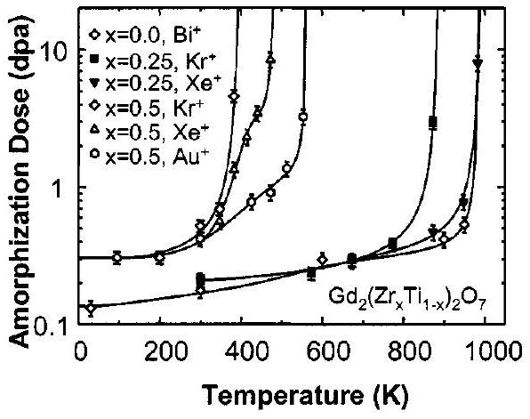
FIG. 13. Temperature dependence of amorphization in $\mathrm{Gd}_{2}\left(\mathrm{Zr}_{x} \mathrm{Ti}_{1-x}\right)_{2} \mathrm{O}_{7}$ under irradiation with $0.6 \mathrm{MeV} \mathrm{Bi}^{+}$ions (see Ref. 81), $1.0 \mathrm{MeV} \mathrm{Kr}^{+}$ions (see Ref. 15), $1.5 \mathrm{MeV} \mathrm{Xe}{ }^{+}$ions (see Ref. 165), and $0.4 \mathrm{MeV} \mathrm{Au}{ }^{+}$ions (see Ref. 165).

on the Gd (or Er) or Zr-sites ${ }^{163}$ and as previously discussed the zirconate pyrochlores are chemically durable. In the case of the $\mathrm{Gd}_{2}\left(\mathrm{Zr}_{x} \mathrm{Ti}_{1-x}\right)_{2} \mathrm{O}_{7}$ binary, it has been shown that there is a systematic increase in the radiation "resistance" (decrease in $T_{c}$ and increase in $D_{o}$ ) with increasing Zr -content under $1.0 \mathrm{MeV} \mathrm{Kr}{ }^{+}$irradiation, ${ }^{15}$ which is an important benefit if Zr-rich rather than Ti-rich pyrochlore compositions are used to immobilize the actinides. These results are consistent with recent molecular dynamics results that indicate some amorphization directly within displacement cascades in $\mathrm{Gd}_{2} \mathrm{Ti}_{2} \mathrm{O}_{7}$, while in $\mathrm{Gd}_{2} \mathrm{Zr}_{2} \mathrm{O}_{7}$, displacement cascades tend to produce only point defects. ${ }^{164}$ While the amorphization behavior and critical temperature in $\mathrm{Gd}_{2} \mathrm{Ti}_{2} \mathrm{O}_{7}$, as shown in Fig. 8, are relatively independent of ion mass, recent results ${ }^{165}$ shown in Fig. 13 demonstrate a shift in the critical temperature with increasing ion mass (damage energy density) in the $\mathrm{Gd}_{2}\left(\mathrm{Zr}_{x} \mathrm{Ti}_{1-x}\right)_{2} \mathrm{O}_{7}$ system. With increasing ion mass, the critical temperature for the $x=0.25$ composition becomes identical to the end member $x=0.0$, composition, and the critical temperature for the $x=0.5$ composition increases by about 160 K as the ion mass increases from $\mathrm{Kr}^{+}$ to $\mathrm{Au}^{+}$. For compositions in this system with $x \geqslant 0.75$, irradiation with $1.0 \mathrm{MeV} \mathrm{Kr}^{+}$ions has demonstrated that $T_{c}$ is less than $25 \mathrm{~K},{ }^{15}$ and irradiation with $2.0 \mathrm{MeV} \mathrm{Au}^{2+}$ ions has confirmed that amorphization does not occur at 300 K for these high Zr-compositions at higher damage energy densities. ${ }^{87}$ These results provide the necessary data to define $T_{c}$ (th) at these damage rates in the $\mathrm{Gd}_{2}\left(\mathrm{Zr}_{x} \mathrm{Ti}_{1-x}\right)_{2} \mathrm{O}_{7}$ system, which in turn can be used to define $T_{c}$ (th) at the lower dose rates expected for materials used for the immobilization of actinides. Based on Eq. (3), the critical temperatures for compositions in the $\mathrm{Gd}_{2}\left(\mathrm{Zr}_{x} \mathrm{Ti}_{1-x}\right)_{2} \mathrm{O}_{7}$ containing $10 \mathrm{wt} \% { }^{239} \mathrm{Pu}$ are given in Fig. 14 as a function of Zr-content. The largest uncertainty is for the $x=0.75$ composition because of insufficient data to accurately determine $T_{c}$ (th) under ionbeam irradiation. While the most radiation-resistant phase in this system is $\mathrm{Gd}_{2} \mathrm{Zr}_{2} \mathrm{O}_{7}$, amorphization will not occur under the temperature conditions ( 300 to 550 K ) expected in a geologic repository for any compositions containing more than $50 \% \mathrm{Zr}$ substitution for Ti . The behavior illustrated in Fig. 14 is similar to the decrease in activation energy for oxygen vacancy migration reported for this system, ${ }^{166,167}$

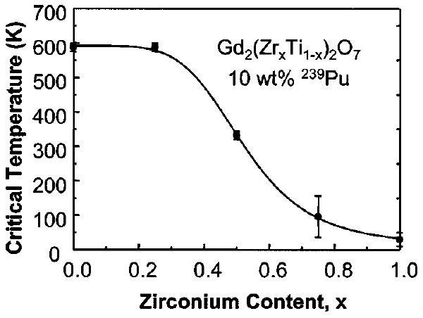
FIG. 14. Predicted critical temperature, based on Eq. (3), as a function of zirconium content for the $\mathrm{Gd}_{2}\left(\mathrm{Zr}_{x} \mathrm{Ti}_{1-x}\right)_{2} \mathrm{O}_{7}$ system containing $10 \mathrm{wt} \% { }^{239} \mathrm{Pu}$.

which may again suggest some dependence of $T_{c}$ on oxygen vacancy mobility as discussed in connection with Fig. 10.

In addition to $\mathrm{Gd}_{2} \mathrm{Zr}_{2} \mathrm{O}_{7}$ and $\mathrm{Er}_{2} \mathrm{Zr}_{2} \mathrm{O}_{7}$, it has been demonstrated that $\mathrm{Sm}_{2} \mathrm{Zr}_{2} \mathrm{O}_{7}$ and $\mathrm{Nd}_{2} \mathrm{Zr}_{2} \mathrm{O}_{7}$ exhibit an irradiation-induced pyrochlore to defect-fluorite structural transformation under irradiation with $1.5 \mathrm{MeV} \mathrm{Xe}^{+}$ions, and the resulting defect-fluorite structure is resistant to amorphization at 25 K for doses up to 7 dpa . ${ }^{168}$ In contrast, the irradiation-induced pyrochlore to defect-fluorite transformation was reported to occur simultaneously with irradiationinduced amorphization in $\mathrm{La}_{2} \mathrm{Zr}_{2} \mathrm{O}_{7}$, and the critical temperature for amorphization was estimated to be about 310 K. ${ }^{168}$ Recent molecular dynamics simulations of 6 keV U displacement cascades in $\mathrm{La}_{2} \mathrm{Zr}_{2} \mathrm{O}_{7}$ at 350 K indicates the formation of a small number of point defects and a transition toward the defect-fluorite structure, ${ }^{136}$ consistent with the experimental observations. There was no evidence for direct amorphization in the cascade simulations in $\mathrm{La}_{2} \mathrm{Zr}_{2} \mathrm{O}_{7}$, which is similar to the behavior observed in $\mathrm{Gd}_{2} \mathrm{Zr}_{2} \mathrm{O}_{7}$ simulations. ${ }^{164}$ This might suggest that amorphization in $\mathrm{La}_{2} \mathrm{Zr}_{2} \mathrm{O}_{7}$ may be driven by defect accumulation processes.

## E. Model predictions

The two quantities most useful for predicting amorphization behavior in pyrochlores for the immobilization of actinides are the baseline amorphization dose $D_{o}$ under ambient temperature conditions, preferably determined in studies employing short-lived actinides, and the critical temperature $T_{c}(\text { th })^{146}$ due to thermal recovery processes. The data for $D_{o}$ based on studies using short-lived actinides are summarized in Table I for several materials of interest, ${ }^{29,44,45,47,133,145}$ along with the results for heavy-ion irradiation of $\mathrm{Gd}_{2} \mathrm{Ti}_{2} \mathrm{O}_{7}$ and $\mathrm{Gd}_{2} \mathrm{ZrTiO}_{7}$ from Fig. 13. Also included in Table I are the results for a $(\mathrm{Ca}, \mathrm{U})_{1.5}(\mathrm{Ti}, \mathrm{Zr})_{2} \mathrm{O}_{6.7}$ pyrochlore ${ }^{169}$ irradiated with $\mathrm{Kr}^{+}$ions and $\mathrm{CaZrTi}_{2} \mathrm{O}_{7}$ irradiated with $\mathrm{Xe}^{+}$ions, ${ }^{156}$ since these are the only available ion irradiation data on materials similar to $\mathrm{CaPuTi}_{2} \mathrm{O}_{7}$. The results demonstrate rather good agreement in the values of $D_{o}$ from alpha-decay and heavy-ion irradiation at these ambient conditions. While it would be preferable to determine $T_{c}$ (th) from the temperature dependence of amorphization in samples containing short-lived actinides, the necessary data do not currently exist. Consequently, $T_{c}$ (th) must be determined from ion-beam

TABLE I. Amorphization dose at $340-350 \mathrm{~K}$ from alpha decay events ${ }^{29,44,45,47,133}$ and at 300 K from heavy-ion irradiation data in Fig. 13 or reported by others. ${ }^{157,169}$ Values of dose (dpa) are based on a displacement energy of 50 eV for all elements.
| Material | (alpha-decays/g) | Amorphization dose (dpa, alpha decay) | (dpa, ions) |
| :--- | :--- | :--- | :--- |
| $\mathrm{Gd}_{2} \mathrm{Ti}_{2} \mathrm{O}_{7}$ | $3.1 \times 10^{18}$ | 0.16 | 0.18 |
| $\mathrm{Gd}_{2} \mathrm{ZrTiO}_{7}$ | - | - | 0.42 |
| $\mathrm{CaPuTi}_{2} \mathrm{O}_{7}$ | $4.0 \times 10^{18}$ | 0.18 | - |
| $(\mathrm{Ca}, \mathrm{U})_{1.5}(\mathrm{Ti}, \mathrm{Zr})_{2} \mathrm{O}_{6.7}$ | - | - | 0.21 |
| $\mathrm{CaZrTi}_{2} \mathrm{O}_{7}$ | - | - | 0.20 |

results, such as that shown in Figs. 7 to 9 and 13, and corrected for dose rate, as was done in Fig. 14. The critical temperatures from several ion-beam experiments on materials most relevant to actinide immobilization are summarized in Table II, along with the predicted critical temperatures at lower dose rates associated with samples containing $10 \mathrm{wt} \% { }^{238} \mathrm{Pu}$, as in current ongoing studies, ${ }^{138,139}$ or actual actinide host phases containing $10 \mathrm{wt} \%{ }^{239} \mathrm{Pu}$ (or a similar activity from other actinides). Results from the ongoing study on ${ }^{238} \mathrm{Pu}$-containing samples ${ }^{138,139}$ may provide some validation for these predictions. A significant decrease in $T_{c}$ (th) is observed, particularly for the ${ }^{239} \mathrm{Pu}$ dose rates that are representative of conditions for actinide-host phases. Since ionirradiation results ${ }^{156}$ have been used to predict the critical temperature for $\mathrm{Ca}^{238} \mathrm{PuTi}_{2} \mathrm{O}_{7}$ in Table II, the existing data (Fig. 5) and the predicted $T_{C}$ can be used to define the temperature dependence in this material. The results are shown in Fig. 15, along with the ion-beam data for $\mathrm{CaZrTi}_{2} \mathrm{O}_{7}$. The results demonstrate the dose-rate shift of about 100 K . In the DI/DS model for amorphization [Eq. (1)], the defectstimulated cross section $\sigma_{s}$ goes to zero at $T_{c}$ and the temperature dependence of $\sigma_{s}$ is given by the expression ${ }^{146}$

$$
\sigma_{\mathrm{s}}=\sigma_{\mathrm{so}}-\nu / \phi \exp (-E / \mathrm{kT}),
$$

where $\sigma_{\mathrm{so}}$ is the cross section at 0 K , and the other parameters are the same as defined for Eq. (3). The fit values for $\sigma_{s}$, from the data in Fig. 5, and the value of zero at $T_{c}$ are shown in Fig. 16, as a function of temperature, along with a fit of Eq. (4) to the data. The value of $\nu$ is assumed to be $10^{10} \mathrm{~s}^{-1}$, which is a reasonable value for diffusion

TABLE II. Critical temperatures, $T_{c}$ (th), associated with thermal recovery processes that are predicted for Pu-containing materials based on Eq. (3) and experimental results for $\mathrm{Gd}_{2} \mathrm{Ti}_{2} \mathrm{O}_{7}$ irradiated with $\mathrm{Bi}^{+}$ions, ${ }^{81} \mathrm{Gd}_{2} \mathrm{ZrTiO}_{7}$ irradiated with $\mathrm{Au}^{+}$ions (Fig. 13), and $\mathrm{CaZrTi}_{2} \mathrm{O}_{7}$ irradiated with $\mathrm{Xe}^{+}$ ions. ${ }^{157}$
| Material (irradiation conditions) | Dose rate (dpa/s) | $T_{c}$ (th) (K) |
| :--- | :--- | :--- |
| $\mathrm{Gd}_{2} \mathrm{Ti}_{2} \mathrm{O}_{7}\left(0.6 \mathrm{MeV} \mathrm{Bi}^{+}\right)$ | $3.3 \times 10^{-3}$ | 981 |
| $\mathrm{Gd}_{2} \mathrm{Ti}_{2} \mathrm{O}_{7}\left(10 \mathrm{wt} \%{ }^{238} \mathrm{Pu}\right)$ | $2.3 \times 10^{-9}$ | 662 |
| $\mathrm{Gd}_{2} \mathrm{Ti}_{2} \mathrm{O}_{7}\left(10 \mathrm{wt} \%{ }^{239} \mathrm{Pu}\right)$ | $8.5 \times 10^{-12}$ | 587 |
| $\mathrm{Gd}_{2} \mathrm{ZrTiO}_{7}\left(0.4 \mathrm{MeV} \mathrm{Au}{ }^{+}\right)$ | $3.3 \times 10^{-3}$ | 561 |
| $\mathrm{Gd}_{2} \mathrm{ZrTiO}_{7}\left(10 \mathrm{wt} \%{ }^{239} \mathrm{Pu}\right)$ | $8.5 \times 10^{-12}$ | 332 |
| $\mathrm{CaZrTi}_{2} \mathrm{O}_{7}\left(1.5 \mathrm{MeV} \mathrm{Xe}^{+}\right)$ | $3.3 \times 10^{-3}$ | 710 |
| $\mathrm{Ca}^{238} \mathrm{PuTi}_{2} \mathrm{O}_{7}$ | $1.3 \times 10^{-8}$ | 593 |
| $\mathrm{Ca}^{239} \mathrm{PuTi}_{2} \mathrm{O}_{7}$ | $4.8 \times 10^{-11}$ | 522 |

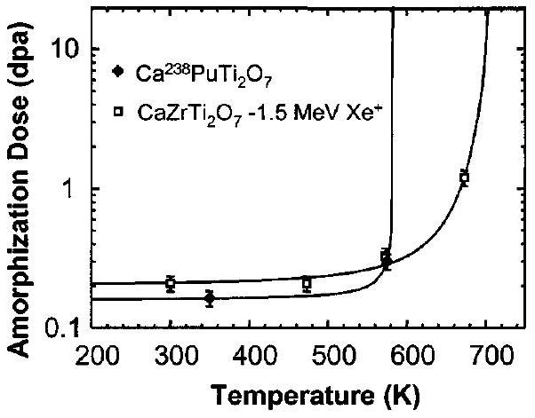
FIG. 15. Temperature dependence of amorphization in $\mathrm{Ca}^{238} \mathrm{PuTi}_{2} \mathrm{O}_{7}$ based on data in Fig. 5 and predicted $T_{c}$ (Table II) based on data for $\mathrm{CaZrTi}_{2} \mathrm{O}_{7}$ irradiated with $1.5 \mathrm{MeV} \mathrm{Xe}^{+}$ions (see Ref. 157).

processes, ${ }^{146}$ and $\phi$ is based on the actual damage rate of $2.86 \times 10^{11}$ alpha-decays/g/s. Using these values, the fit yields a value of $2.3 \times 10^{-18} \mathrm{~g}^{-1}$ for $\sigma_{\mathrm{so}}$ and an activation energy of 1.8 eV for the thermal recovery process, which is reasonable for defect diffusion processes at about 600 K . This analysis demonstrates that the dose rate dependence defined by Eq. (3) does provide reasonable predictions that are consistent with experimental results.

One of the predictions that can be provided for performance assessment is the temperature dependence of the amorphization dose for specific actinide host phases. This can be predicted from the type of data provided in Tables I and II for specific phases and compositions using an appropriate model for the temperature dependence of amorphization. The predicted temperature dependence of amorphization using an expression ${ }^{146}$ derived from Eq. (1) is shown in Fig. 17 for amorphization in $\mathrm{Gd}_{2} \mathrm{Ti}_{2} \mathrm{O}_{7}$ and $\mathrm{Gd}_{2} \mathrm{ZrTiO}_{7}$ containing $10 \mathrm{wt} \%{ }^{239} \mathrm{Pu}$ and for $\mathrm{Ca}^{239} \mathrm{PuTi}_{2} \mathrm{O}_{7}$. The results in Fig. 17 do not include the effects of any irradiation-assisted recovery process, which could slightly increase the slope below $T_{c}$ (th). Thus, these results are a somewhat conservative prediction, but one that may be sufficient for engineering assessments. The predictions clearly show that the critical temperature for ${ }^{239} \mathrm{Pu}$-containing $\mathrm{Gd}_{2} \mathrm{Ti}_{2} \mathrm{O}_{7}$ is above the expected repository temperatures; thus, amorphization in this phase will occur at the doses indicated in Table I without a significant influence of simultaneous recovery processes. In

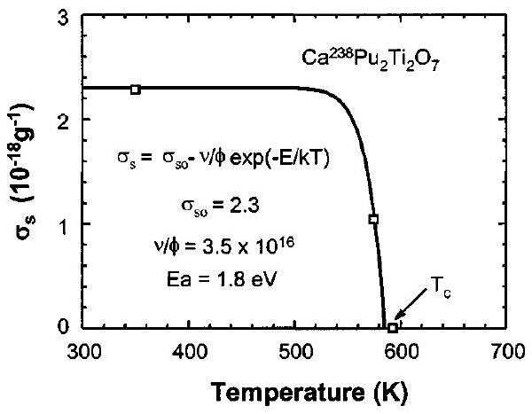
FIG. 16. Temperature dependence of the defect-stimulated cross section in $\mathrm{Ca}^{238} \mathrm{PuTi}_{2} \mathrm{O}_{7}$. The solid line is a fit of Eq. (4) to the data, and the fit parameters are shown.

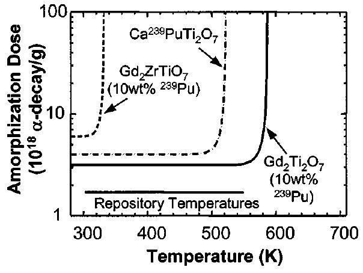
FIG. 17. Predicted temperature dependence of amorphization in pyrochlorerelated phases containing ${ }^{239} \mathrm{Pu}$. Also shown is the range of expected repository temperatures.-

the case of $\mathrm{Ca}^{239} \mathrm{PuTi}_{2} \mathrm{O}_{7}$, amorphization will not occur for several decades until the temperature falls below 520 K . Amorphization of ${ }^{239} \mathrm{Pu}$-containing $\mathrm{Gd}_{2} \mathrm{ZrTiO}_{7}$ will be delayed for 1000 years or more, until the temperature falls below about 330 K ; at which time, amorphization will occur at a much slower rate because of the higher dose for amorphization.

Because of the fundamental understanding and models on radiation effects that are emerging from complementary studies on alpha-decay damage and ion-beam damage in these and related materials, it is possible to predict the dose and, thus, time dependence of amorphization in several actinide-host phases under repository conditions. This is illustrated in Fig. 18 for $\mathrm{Gd}_{2} \mathrm{Ti}_{2} \mathrm{O}_{7}, \mathrm{Gd}_{2} \mathrm{ZrTiO}_{7}$, and $\mathrm{Gd}_{2} \mathrm{Zr}_{2} \mathrm{O}_{7}$ containing $10 \mathrm{wt} \%{ }^{239} \mathrm{Pu}$. ${ }^{170}$ While $\mathrm{Gd}_{2} \mathrm{Ti}_{2} \mathrm{O}_{7}$ will require about 1000 years to amorphize under these conditions, amorphization in $\mathrm{Gd}_{2} \mathrm{ZrTiO}_{7}$ will be delayed about 1000 years while the temperature cools to below the critical temperature, at which time amorphization will proceed, and full amorphization will occur after about 3000 years. In the case of $\mathrm{Gd}_{2} \mathrm{Zr}_{2} \mathrm{O}_{7}$, amorphization simply will not occur.

## F. Macroscopic property changes

For radiation-stable structures such as $\mathrm{Gd}_{2} \mathrm{Zr}_{2} \mathrm{O}_{7}$, radiation damage leads to formation of point defects and a transformation to the disordered defect-fluorite structure. The

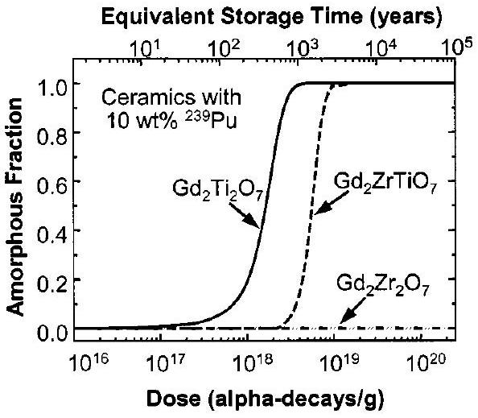
FIG. 18. Predicted amorphization dependence on time and dose in pyrochlore ceramics containing $10 \mathrm{wt} \%{ }^{239} \mathrm{Pu}$.

macroscopic swelling is due primarily to the accumulation of point defects in the structure, which generally leads to swelling of no more than a few percent in typical actinide dioxides with the fluorite structure. ${ }^{171,172}$ Unfortunately, we are not aware of any specific data on swelling related to point defect in pyrochlores and the pyrochlore to fluorite transformation. When amorphization occurs, self-radiation damage in pyrochlore materials can result in substantial macroscopic swelling. Due to the composite nature of the radiation-induced microstructural changes, the macroscopic swelling during the amorphization process is composed of contributions due to defect-induced volume changes in the residual crystalline phase and structural expansions associated with the crystalline-to-amorphous transformation.

While it is important to know whether or not an actinidehost phase will amorphize under repository conditions and the time frame for that process, the impact of amorphization on performance will depend on the macroscopic swelling, changes in system energy (or stored energy), changes in mechanical properties, and changes in chemical durability of individual phases. The macroscopic swelling may lead to microcracking between phases, thereby increasing the surface area for actinide release. Likewise, increases in system energy can affect the driving force for dissolution. For a few phases of interest, the macroscopic swelling, stored energy, mechanical properties, and increases in dissolution rates due to amorphization have been measured in alpha-decay studies employing bulk samples containing ${ }^{238} \mathrm{Pu}$ or ${ }^{244} \mathrm{Cm}$. ${ }^{29,133}$ While using short-lived actinides in bulk samples may be a preferred method for determining alpha-decay-induced property changes, it is not always practical, expedient, or costeffective to do so. Fortunately, ion-irradiation methods can be used to determine, with some degree of confidence, the magnitude of some irradiation-induced property changes, such as swelling, mechanical properties, and dissolution rates.

## G. Swelling

The total macroscopic swelling, $\Delta V_{m} / V_{o}$, in these materials can generally be expressed as ${ }^{131}$

$$
\Delta V_{m} / V_{o}=f_{c} \Delta V_{\mathrm{uc}} / V_{o}+f_{a} \Delta V_{a} / V_{o}+f_{\mathrm{ex}},
$$

where $f_{c}$ is the mass fraction of crystalline phase, $f_{a}$ is the mass fraction of amorphous phase, $\Delta V_{\mathrm{uc}} / V_{o}$ is the fractional unit-cell volume change of the residual crystalline phase, $\Delta V_{a} / V_{o}$ is the fractional volume change associated with the amorphous state, and $f_{\mathrm{ex}}$ is the volume fraction of extended void-like microstructures (e.g., bubbles, voids, pores, and microcracks). For most pyrochlores of interest and under most conditions involving immobilization of actinides, $f_{\text {ex }}$ is negligible, and Eq. (5) reduces to that proposed for other complex oxides containing actinides. ${ }^{173}$ In the case of $\mathrm{Cd}_{2} \mathrm{Nb}_{2} \mathrm{O}_{7}, f_{\text {ex }}$ may not be negligible, since irradiation at room temperature can lead to bubble formation. ${ }^{17}$

The dependence of macroscopic swelling on alpha-decay dose is shown in Fig. 19 for ${ }^{244} \mathrm{Cm}$-containing $\mathrm{Gd}_{2} \mathrm{Ti}_{2} \mathrm{O}_{7},{ }^{29,133}$ along with the crystalline and amorphous contributions to the swelling. Surprisingly, despite the mag-

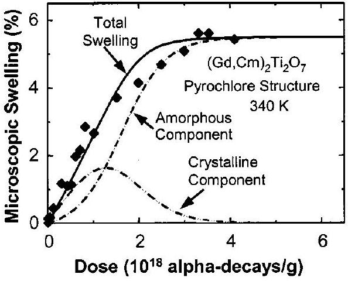
FIG. 19. Swelling in $\mathrm{Gd}_{2} \mathrm{Ti}_{2} \mathrm{O}_{7}$ containing $3 \mathrm{wt} \%{ }^{244} \mathrm{Cm}$ (see Refs. 29, 123).

nitude of the swelling in this material, there has been no evidence for any significant degree of microcracking due to amorphization, which may be due to the phase-pure nature of these samples and the tendency of amorphization to render materials more isotropic. Based on the data in Figs. 18 and 19, the swelling of $\mathrm{Gd}_{2} \mathrm{Ti}_{2} \mathrm{O}_{7}$ containing $3 \mathrm{wt} \%{ }^{244} \mathrm{Cm}$ can be determined as a function of time in the repository.

The temperature dependence of the macroscopic swelling has been determined for $\mathrm{CaPuTi}_{2} \mathrm{O}_{7}$, which has the disordered defect-fluorite structure. ${ }^{44,45,47}$ The macroscopic swelling in this material, which has been corrected for the $10 \%$ porosity, is summarized in Fig. 20 as a function of temperature. At 350 K , the macroscopic swelling increases to an initial saturation value of about $6.0 \%$ at a dose of 4.1 $\times 10^{18} \alpha$-decays/g; above a dose of $5 \times 10^{18} \alpha$-decays/g, the swelling undergoes some minor relaxation to a final swelling value of $5.85 \%$ at dose of $9.9 \times 10^{18} \alpha$-decays/g. Selfirradiation of this material at 575 K results in less swelling and requires a higher dose to reach saturation due to the increased rate of simultaneous damage recovery during the long damage accumulation times. When $\mathrm{CaPuTi}_{2} \mathrm{O}_{7}$ is held at 875 K , amorphization is suppressed, and saturation swelling is only $0.38 \%$.

## H. Stored energy

The defects and structural changes introduced by radiation damage increase the free energy above the minimum energy configuration. The stored energy in irradiated materi-

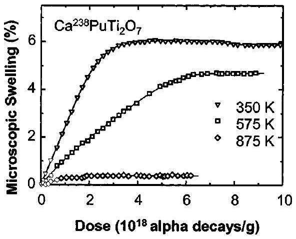
FIG. 20. Temperature dependence of swelling in $\mathrm{Ca}^{238} \mathrm{PuTi}_{2} \mathrm{O}_{7}$ (adapted from Clinard et al. ${ }^{44,45}$ )

als is associated with point defects in the crystal structure, the chemical and topological disorder of the amorphous state, and the high strains from formation of amorphous domains within the residual crystalline material. The maximum contribution from strain to the total stored energy has been estimated in the case of $\mathrm{CaPuTi}_{2} \mathrm{O}_{7}$ to be $18 \% .^{174}$ Only limited data exist on the accumulation of stored energy as a function of dose in $\mathrm{CaPuTi}_{2} \mathrm{O}_{7},{ }^{45,175}$ but it is generally observed that the stored energy increases with dose until the fully amorphous state is reached. The total stored energy released during recrystallization of the amorphous state in $\mathrm{CaPuTi}_{2} \mathrm{O}_{7}$ is $100 \mathrm{~J} / \mathrm{g}$, ${ }^{175}$ and in the case of natural metamict pyrochlores, the stored energy release ranges from 125 to $210 \mathrm{~J} / \mathrm{g} .{ }^{111}$

## I. Mechanical properties

The fracture toughness in Cm -doped $\mathrm{Gd}_{2} \mathrm{Ti}_{2} \mathrm{O}_{7}$ increased with cumulative dose to a broad maximum and then decreased slightly. ${ }^{129,133}$ The increase in fracture toughness is attributed to the composite nature of the microstructure. At low to intermediate doses, the microstructure consists of amorphous domains in a crystalline matrix that can inhibit crack propagation and increase the fracture toughness. As the amorphous phase becomes the dominant matrix at high doses with remnant crystallites, the fracture toughness decreases slightly as some of the internal stresses are relieved. This is supported by the observations in zirconolite, ${ }^{175}$ which suggest a relaxation of disorder at high doses, and the analysis of strain accumulation in natural pyrochlores. ${ }^{45,134}$

Self-radiation damage in Cm -doped $\mathrm{Gd}_{2} \mathrm{Ti}_{2} \mathrm{O}_{7}$ ( $9.5 \%$ porosity) resulted in systematic decreases in hardness and elastic modulus with dose. ${ }^{133}$ While the porosity of the samples affects the absolute values, complete amorphization in Cmdoped $\mathrm{Gd}_{2} \mathrm{Ti}_{2} \mathrm{O}_{7}$ resulted in a $24 \%$ decrease in hardness and a $48 \%$ decrease in elastic modulus. In fully dense $\mathrm{Gd}_{2} \mathrm{Ti}_{2} \mathrm{O}_{7}$ irradiated with $4 \mathrm{MeV} \mathrm{Au}^{2+}$ ions to produce a thick amorphous layer, nanoindentation results indicate a $42 \%$ decrease in hardness and $15 \%$ decrease in Young's modulus of the amorphous state relative to the initial crystalline state. ${ }^{176}$ Similar decreases in hardness have been reported for the defect-fluorite $\mathrm{CaPuTi}_{2} \mathrm{O}_{7}$. ${ }^{45}$

## J. Structural changes

Detailed x-ray absorption spectroscopy studies ${ }^{177}$ of the radiation-induced amorphous state in $\mathrm{CaPuTi}_{2} \mathrm{O}_{7}$ reveal that the $\mathrm{Pu}^{4+}$ retains eight-fold coordination in the amorphous state, and there is a slight decrease in the $\mathrm{Pu}-\mathrm{O}$ bond lengths. In $\mathrm{CaPuTi}_{2} \mathrm{O}_{7}$, the amorphous state can be characterized as one in which long-range order is lost and the polyhedra are rotated and tilted relative to each other. X-ray absorption spectroscopy of $\mathrm{Gd}_{2} \mathrm{Ti}_{2} \mathrm{O}_{7}$ and $\mathrm{Gd}_{2}\left(\mathrm{Zr}_{0.25} \mathrm{Ti}_{0.75}\right)_{2} \mathrm{O}_{7}$ irradiated with $2 \mathrm{MeV} \mathrm{Au}{ }^{2+}$ ions indicates that the irradiationinduced amorphous state can be characterized by rotations along shared $\mathrm{TiO}_{6}$ and $\mathrm{GdO}_{8}$ polyhedral edges and between shared $\mathrm{TiO}_{6}$ polyhedral corners that lead to disruptions of the long-range order. ${ }^{88}$

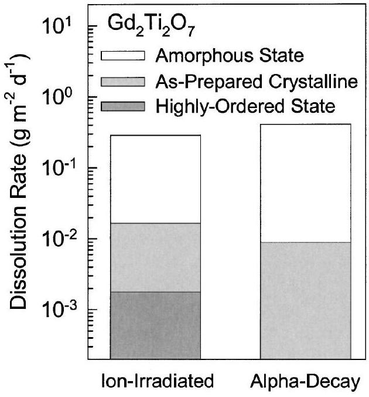
FIG. 21. Effect of structural state on dissolution rates in ion-irradiated (see Refs. 81, 121) and Cm-containing (see Refs. 29, 133) $\mathrm{Gd}_{2} \mathrm{Ti}_{2} \mathrm{O}_{7}$ pyrochlore.

## K. Dissolution rates

The increase in dissolution rates due to alpha-decayinduced amorphization in Cm -doped $\mathrm{Gd}_{2} \mathrm{Ti}_{2} \mathrm{O}_{7}$ is illustrated in Fig. 21. ${ }^{29,133}$ The dissolution rate of the amorphous state is a factor of 50 higher than the undamaged crystalline state. Also shown in Fig. 21 is the increase in dissolution rate due to ion-beam-induced amorphization of the as-prepared crystalline $\mathrm{Gd}_{2} \mathrm{Ti}_{2} \mathrm{O}_{7}{ }^{81}$ along with the dissolution rate of the highly ordered state of $\mathrm{Gd}_{2} \mathrm{Ti}_{2} \mathrm{O}_{7}$ produced by long-term annealing. ${ }^{121}$ The ion-beam results are in good agreement with the results due to alpha-decay in bulk $\mathrm{Gd}_{2} \mathrm{Ti}_{2} \mathrm{O}_{7}$, which validates the use of ion-beam methods to determine the increase in dissolution rate of the radiation-induced amorphous state relative to the initial (i.e., undamaged) crystalline state. Similar studies were carried out on unirradiated (crystalline) and irradiated (amorphous) $\mathrm{Lu}_{2} \mathrm{Ti}_{2} \mathrm{O}_{7}$ and $\mathrm{Y}_{2} \mathrm{Ti}_{2} \mathrm{O}_{7} .{ }^{81}$ The results indicate that the dissolution rate of crystalline $\mathrm{Lu}_{2} \mathrm{Ti}_{2} \mathrm{O}_{7}$ is approximately equivalent to crystalline $\mathrm{Gd}_{2} \mathrm{Ti}_{2} \mathrm{O}_{7}$; however, the dissolution of the amorphous state in $\mathrm{Lu}_{2} \mathrm{Ti}_{2} \mathrm{O}_{7}$ was only a factor of 3 higher than the crystalline state. In the case of $\mathrm{Y}_{2} \mathrm{Ti}_{2} \mathrm{O}_{7}$, no effect of amorphization was evident in the dissolution rate, which was a factor of 10 higher than the dissolution rate of crystalline $\mathrm{Gd}_{2} \mathrm{Ti}_{2} \mathrm{O}_{7}$.

The results for $\mathrm{Lu}_{2} \mathrm{Ti}_{2} \mathrm{O}_{7}$ and $\mathrm{Y}_{2} \mathrm{Ti}_{2} \mathrm{O}_{7}$ suggest that free energy might be an important consideration in amorphization. Consequently, a series of dissolution experiments with the same well-characterized, but unirradiated, $\mathrm{A}_{2} \mathrm{Ti}_{2} \mathrm{O}_{7}$ pyrochlores has been carried out in $\mathrm{H}_{2} \mathrm{O}$ - and $\mathrm{D}_{2} \mathrm{O}$-based solutions $[\mathrm{pH}(\mathrm{D})=2]$ at $90^{\circ} \mathrm{C}$ using the single pass flowthrough (SPFT) method to evaluate the dependence of dissolution rates on free energy. ${ }^{178}$ The release rates of Ti were relatively slow and showed no correlation with the chemical composition of the pyrochlores. In contrast, the normalized release rates of rare-earth elements increased from $\mathrm{Lu}_{2} \mathrm{Ti}_{2} \mathrm{O}_{7}$ to $\mathrm{Gd}_{2} \mathrm{Ti}_{2} \mathrm{O}_{7}$ to $\mathrm{Y}_{2} \mathrm{Ti}_{2} \mathrm{O}_{7}$. Dissolution rates in $\mathrm{D}_{2} \mathrm{O}$-based solutions were indistinguishable from rates in $\mathrm{H}_{2} \mathrm{O}$, which indicate that the release of elements is not diffusion controlled. ${ }^{178}$ Based on ligand-exchange theory, the
rate of reaction should increase in inverse order of the cation field strength, $\mathrm{Lu}_{2} \mathrm{Ti}_{2} \mathrm{O}_{7}<\mathrm{Y}_{2} \mathrm{Ti}_{2} \mathrm{O}_{7}<\mathrm{Gd}_{2} \mathrm{Ti}_{2} \mathrm{O}_{7}$, which is not observed. Evaluation of the thermodynamic stability of the three solids was performed using a linear free-energy model and the free energies of formation. The calculations indicate that reactivity should follow in the progression $\mathrm{Lu}_{2} \mathrm{Ti}_{2} \mathrm{O}_{7} <\mathrm{Gd}_{2} \mathrm{Ti}_{2} \mathrm{O}_{7}<\mathrm{Y}_{2} \mathrm{Ti}_{2} \mathrm{O}_{7}$, as is observed in the results of the dissolution experiments. These results imply that the relative reactivity of pyrochlore-group ceramics can be ascertained through thermodynamic calculations; furthermore, the increase in dissolution rate in irradiated pyrochlores may simply scale with increase in free energy, as was suggested by the results for the irradiated samples. ${ }^{81}$

As illustrated in Fig. 21, the dissolution rate of $\mathrm{Gd}_{2} \mathrm{Ti}_{2} \mathrm{O}_{7}$ is very sensitive to differences structural state. In contrast, the dissolution rate of $\mathrm{Gd}_{2} \mathrm{Zr}_{2} \mathrm{O}_{7}$ is rather insensitive to structural state, whether it is highly ordered, disordered, or irradiated, ${ }^{121}$ and dissolution rate is comparable to that of the as-prepared state of $\mathrm{Gd}_{2} \mathrm{Ti}_{2} \mathrm{O}_{7}$. In the $\mathrm{Gd}_{2}\left(\mathrm{Zr}_{x} \mathrm{Ti}_{1-x}\right)_{2} \mathrm{O}_{7}$ system, the dissolution rate decreases with increasing Zr content to a minimum at the $x=0.75$ composition. ${ }^{121}$ Further increases in Zr content lead to increases in dissolution rate. Thus, the most dissolution resistance phase in this system is the $x=0.75$ composition, which has a factor of 20 lower dissolution rate than $\mathrm{Gd}_{2} \mathrm{Zr}_{2} \mathrm{O}_{7}$.

The forward dissolution rate in ${ }^{238} \mathrm{Pu}$-containing multiphase pyrochlore ceramics has been measured at about 360 K using high flow rates over a range of pH values (2 to 12). ${ }^{140}$ The results compared dissolution rates in amorphous samples with those measured in identical annealed samples. The results suggest that the forward dissolution rate is not significantly affected by amorphization. Unfortunately, no details are provided on the annealing conditions, sample condition after annealing, changes in stored energy, or the amount of time that lapsed between annealing and the dissolution measurements. Because of the dependence of the dissolution rate on free energy, the lack of a significant effect of amorphization on the dissolution rate may indicate that the difference in free energy between the crystalline and amorphous states may be small for these more complex pyrochlore compositions.

## L. Thermal recovery

Isochronal ( 12 h ) annealing of fully amorphous Cmdoped $\mathrm{Gd}_{2} \mathrm{Ti}_{2} \mathrm{O}_{7}$ shows a linear recovery of density with temperature up to the temperature ( 973 K ) where recrystallization is observed to begin under these annealing conditions, as shown in Fig. 22. ${ }^{133}$ The $35 \%$ change in density of the amorphous state prior to recrystallization suggests a range of amorphous states as a function of irradiation temperature, similar to the behavior observed in Fig. 20 for $\mathrm{CaPuTi}_{2} \mathrm{O}_{7}$. Recrystallization results in a sharp peak in the density recovery rate under 12 h annealing at 1023 K . Full recovery of the density and recrystallization of the original pyrochlore structure are essentially complete at 1123 K . Thermal recovery studies of natural minerals of the pyrochlore group indicate that recrystallization is an exothermic reaction that peaks in the temperature range from 923 to 973

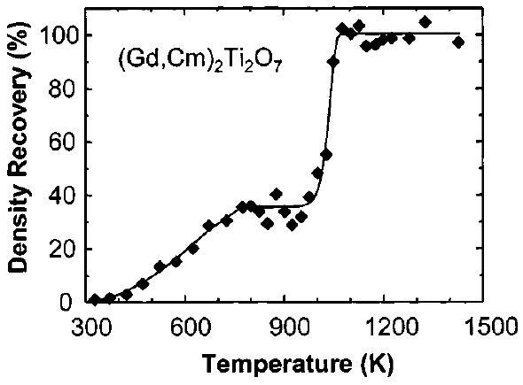
FIG. 22. Recovery of density in $3 \mathrm{wt} \% \mathrm{Cm}$-containing $\mathrm{Gd}_{2} \mathrm{Ti}_{2} \mathrm{O}_{7}$ (adapted from Weber et al. ${ }^{133}$ ).

K and releases 120 to $200 \mathrm{~J} / \mathrm{g}$ of stored energy. ${ }^{111}$ The temperature range for natural pyrochlores is in reasonable agreement with the isochronal recovery behavior of Cm-doped $\mathrm{Gd}_{2} \mathrm{Ti}_{2} \mathrm{O}_{7}$.

While the onset temperature for thermal recrystallization in $\mathrm{Gd}_{2} \mathrm{Ti}_{2} \mathrm{O}_{7}$ annealed 12 h is 973 K , which is on the order of the critical temperature ( 981 K ) for amorphization under ion irradiation (Fig. 8 and Table II), consideration of the recrystallization kinetics suggests that thermal recrystallization may not be a significant process in defining the critical temperature under these ion-irradiation conditions. Some of the $\mathrm{Gd}_{2} \mathrm{Ti}_{2} \mathrm{O}_{7}$ specimens irradiated to amorphous states below room temperature in Fig. 8 were subsequently thermally annealed. No evidence for recrystallization was observed in these amorphous specimens for annealing temperatures up to 1065 K or for times up to one hour; however, simultaneous irradiation with $1 \mathrm{MeV} \mathrm{Kr}^{+}$ions during annealing at 1065 K resulted in full recrystallization in about one hour. ${ }^{179}$ These results confirm that thermal recrystallization does not play a significant role in determining the critical temperature for amorphization in Fig. 8, but irradiation-assisted recrystallization may contribute to some recovery processes.

## M. Other applications

The compositional versatility in the pyrochlore structure leads to remarkable variety of properties and other applications. Compounds with the pyrochlore structure exhibit wide variations in ionic and electronic conductivity, catalytic activity, electro-optic and piezoelectric behavior, ferro and ferrimagnetism, and giant magnetoresistance. ${ }^{90}$ Many of these properties are often related to disordering of the cations and oxygen anion vacancies. As noted above, irradiation of $\mathrm{Cd}_{2} \mathrm{Nb}_{2} \mathrm{O}_{7}$ with light ions can result in the formation of nanoscale clusters of metallic Cd that lead to a high intensity of luminescence with wavelengths in the visible spectrum stimulated by the exposure of the metallic nanocluster surface to ion beams. ${ }^{159}$ The order-disorder structural transformation and the effects of cation and anion disordering on the conductivity of pyrochlore allow the use of ion-beam techniques to fabricate nanoscale microstructures by controlling the degree of disorder so as to alter the electronic/ionic conduction properties of pyrochlore materials. Ion-beam irradiation has been used to produce strain-free, nanoscale buried layers of the defect-fluorite structure in a $\mathrm{Gd}_{2} \mathrm{Ti}_{2} \mathrm{O}_{7}$ pyro-
chlore substrate. ${ }^{19}$ Ion-beam techniques provide a method for precisely controlling the depth and width of the buried layer by varying the energy and mass of implanted ions. One may also anticipate separately controlling the degree of order on the cation and anion sublattices, as ion-beam irradiation has been used to create an anion-disordered pyrochlore that still retains the cation-ordering. ${ }^{155}$ In addition, the flexibility in the composition and degree of disorder in the nano-domains can be obtained by combining radiation-induced disorder from ion-beam implantation ( Zr implanted into the $\mathrm{Gd}_{2} \mathrm{Ti}_{2} \mathrm{O}_{7}$ or Ti implanted in $\mathrm{ZrO}_{2}$ to form pyrochlore ${ }^{180}$ ) with subsequent thermal treatments. Thus, ion-beam techniques combined with subsequent thermal treatments offer materials scientists a great deal of freedom in the manipulation of the chemical and electronic properties of pyrochlore. ${ }^{155}$

## VIII. SUMMARY

The length of this review confirms the considerable knowledge base that is already available for the use of pyrochlore structure-types in the immobilization and safe storage and disposal of plutonium and other actinides. Pyrochlore is particularly suitable because this very simple, but elegant, structure has the ability to accommodate a wide variety of chemistries-some compositions, such as the titanates and zirconates, being extremely durable under expected repository conditions. Predicted behavior can be confirmed because there are many studies of actinide-bearing pyrochlores in nature that are hundreds to thousands of millions of years in age.

We have focused this review on radiation effects because alpha-decay can cause considerable structural damage in crystalline materials with deleterious effects on important properties such as chemical durability. We hope that we have convincingly demonstrated that experimental studies based on using both short-lived actinides for doping-experiments and ion-beam irradiations along with studies of U- and Thbearing minerals, have now led to a fundamental understanding of radiation damage and dose-rate effects in pyrochlores that are proposed for the immobilization of actinides. As a result, predictive models of alpha-decay effects in these materials over a broad range of time scales and temperatures are emerging. In many cases, ion-irradiation studies can provide the necessary data for performance assessments.

The results of these studies demonstrate that alpha-decay damage in titanate-based pyrochlore compounds will lead to amorphization under all repository conditions. The increase in radiation resistance of $\mathrm{Gd}_{2}\left(\mathrm{Zr}_{x} \mathrm{Ti}_{1-x}\right)_{2} \mathrm{O}_{7}$ with increasing Zr -content confirms an important benefit that may be provided by the immobilization of actinides in Zr-rich rather than Ti-rich pyrochlore.

## ACKNOWLEDGMENTS

Much of the work summarized in this review is based on research among collaborators at the University of Michigan and Pacific Northwest National Laboratory. This research and collaboration have been sustained by support from the Office of Basic Energy Sciences of the U.S. Department of Energy. Colleagues, post-doctoral fellows, and graduate stu-
dents are responsible for much of the work summarized in this article. We acknowledge the important contributions of Lumin Wang, Wendy Panero, and Jian Chen (University of Michigan); Lynn Boatner and Matt Farmer (Oak Ridge National Laboratory) Al Meldrum (University of Alberta); Greg Lumpkin (Cambridge University); Alex Navrotsky, Kate Helean, and Sergey Ushakov (UC-Davis); Nicolai Laverov and Sergey Yudintsev (Institute of Geology of Ore Deposits, Russian Academy of Sciences); Ram Devanathan, Jonathan Icenhower, Nancy Hess, and Yanwen Zhang (Pacific Northwest National Laboratory); Bruce Begg (Australian Nuclear Science and Technology Organization). R. Ewing is particularly grateful for the support of the John Simon Guggenheim Memorial Foundation for a Fellowship during the preparation of this paper.
${ }^{1}$ D. Albright, F. Berkhout, and W. Walker, Plutonium and Highly Enriched Uranium 1996 World Inventories, Capabilities and Policies, (Oxford University Press, New York, 1997).
${ }^{2}$ L. J. Carter and T. H. Pigford, Arms Control Today, January/February, 8 (Arms Control Association, Washington DC, 1999).
${ }^{3}$ J. C. Mark, Science Global Security 4, 111 (1993).
${ }^{4}$ A. Heden, SKB Technical Report No. 97-13, 1997.
${ }^{5}$ R. H. Williams and H. A. Feiveson, Bull. Atomic Scientists 46, 40 (1990).
${ }^{6}$ National Research Council, Management and Disposition of Excess Weapons Plutonium (National Academy Press, Washington, D.C., 1994).
${ }^{7}$ M. Bunn and J. P. Holdren, Annu. Rev. Energy Environ. 22, 403 (1997).
${ }^{8}$ W. Stoll, Mater. Res. Bull. 23, 6 (1998).
${ }^{9}$ S. Lutique, D. Staicu, R. J. M. Konings, V. V. Rondinella, J. Somers, and T. Wiss, J. Nucl. Mater. 319, 59 (2003).
${ }^{10}$ A. Macfarlane, F. von Hippel, J. Kang, and R. Nelson, Bull. Atomic Scientists 57, 53 (2001).
${ }^{11}$ L. J. Jardine and G. B. Borisov, LLNL Report UCRL-ID-149341, July, 2002.
${ }^{12}$ National Research Council, Improving the Scientific Basis for Managing DOE's Excess Nuclear Materials and Spent Nuclear Fuel. (The National Academies Press, Washington, D.C., 2003).
${ }^{13}$ A. E. Ringwood, Fortschr. Mineral. 58, 149 (1980).
${ }^{14}$ S. X. Wang, L. M. Wang, R. C. Ewing, and K. V. G. Kutty, Mater. Res. Soc. Symp. Proc. 540, 355 (1999).
${ }^{15}$ S. X. Wang, B. D. Begg, L. M. Wang, R. C. Ewing, W. J. Weber, and K. V. G. Kutty, J. Mater. Res. 14, 4470 (1999).
${ }^{16}$ K. E. Sickafus, L. Minervini, R. W. Grimes, J. A. Valdez, M. Ishimaru, F. Li, K. J. McClellan, and T. Hartman, Science 289, 748 (2000).
${ }^{17}$ W. J. Weber and R. C. Ewing, Science 289, 2051 (2000).
${ }^{18}$ A. A. Digeos, J. A. Valdez, K. E. Sickafus, S. Atiq, R. W. Grimes, and A. R. Boccaccini, J. Mater. Sci. 38, 1597 (2003).
${ }^{19}$ J. Lian, L. M. Wang, S. X. Wang, J. Chen, L. A. Boatner, and R. C. Ewing, Phys. Rev. Lett. 87, 145901 (2001).
${ }^{20}$ B. C. Chakoumakos, J. Solid State Chem. 53, 120 (1984).
${ }^{21}$ B. C. Chakoumakos and R. C. Ewing, Mater. Res. Soc. Symp. Proc. 44, 641 (1985).
${ }^{22}$ D. D. Hogarth, Am. Mineral. 62, 403 (1977).
${ }^{23}$ G. R. Lumpkin, B. C. Chakoumakos, and R. C. Ewing, Am. Mineral. 71, 569 (1986).
${ }^{24}$ D. D. Hogarth, C. T. Williams, and P. Jones, Miner. Mag. 64, 683 (2000).
${ }^{25}$ N. P. Laverov, S. V. Yudintsev, S. V. Stefanovsky, and Y. N. Jang, Dokl. Earth Sciences 381, 1053 (2001).
${ }^{26}$ N. P. Laverov, S. V. Yudintsev, T. S. Yudintseva, S. V. Stefanovsky, R. C. Ewing, J. Lian, S. Utsunomiya, and L. M. Wang, Geology of Ore Deposits 45, 423 (2003).
${ }^{27}$ J. W. Wald and P. Offermann, in Scientific Basis for Nuclear Waste Management V, edited by W. Lutze (Elsevier Science, New York, 1982), p. 369.
${ }^{28}$ W. J. Weber, J. W. Wald, and Hj. Matzke, Mater. Res. Soc. Symp. Proc. 8, 679 (1985).
${ }^{29}$ W. J. Weber, J. W. Wald, and Hj. Matzke, Mater. Lett. 3, 173 (1985).
${ }^{30}$ P. E. Raison, R. G. Haire, T. Sato, and T. Ogawa, Mater. Res. Soc. Symp. Proc. 556, 3 (1999).
${ }^{31}$ N. K. Kulkarni, S. Sampath, and V. Venugopal, J. Nucl. Mater. 281, 248 (2000).
${ }^{32}$ G. R. Lumpkin, J. Nucl. Mater. 289, 136 (2001).
${ }^{33}$ W. J. Weber, R. P. Turcotte, L. R. Bunnell, F. P Roberts, and J. H. Westsik, in Ceramics in Nuclear Waste Management, edited by T. D. Chikalla and J. E. Mendel, CONF-790420 (National Technical Information Service, Springfield, VA, 1979) p. 294.
${ }^{34}$ J. K. Johnstone, T. J. headley, P. F. Hlava, and F. V. Stohl, in Scientific Basis for Nuclear Waste Management, Vol. 1, edited by G. J. McCarthy (Plenum Press, New York, 1979) p. 211.
${ }^{35}$ P. E. D. Morgan, T. M. Shaw, and E. A. Pugar, in Advance in Ceramics, Vol. 8, edited by G. G. Wicks and W. A. Ross (The American Ceramic Society, Columbus, OH, 1983), p. 209.
${ }^{36}$ R. G. Dosch, T. J. Headley, and P. Hlava, J. Am. Ceram. Soc. 67, 354 (1984).
${ }^{37}$ G. Malow, J. A. C. Marples, and C. Sombret, in Radioactive Waste Management and Disposal, edited by R. Simon and S. Orlowski (Harwood Academic, Chur, Switzerland, 1980) p. 341.
${ }^{38}$ R. P. Turcotte, J. Wald, F. P. Roberts, J. M. Rusin, and W. Lutze, J. Am. Ceram. Soc. 65, 589 (1982).
${ }^{39}$ A. E. Ringwood, S. E. Kesson, N. G. Ware, W. Hibberson, and A. Major, Nature (London) 278, 219 (1979).
${ }^{40}$ A. E. Ringwood and P. M. Kelly, Philos. Trans. R. Soc. London 319, 63 (1986).
${ }^{41}$ R. C. Ewing, W. J. Weber, and F. W. Clinard, Jr., Prog. Nucl. Energy 29, 63 (1995).
${ }^{42}$ F. W. Clinard, Jr., C. C. Land, D. E. Peterson, D. L. Rohr, and R. B. Roof, in Scienific Basis for Nuclear Waste Management, edited by S. V. Topp (North-Holland, New York, 1982) p. 405.
${ }^{43}$ F. W. Clinard, Jr., D. L. Rohr, and R. B. Roof, Nucl. Instrum. Methods Phys. Res. B 1, 581 (1984).
${ }^{44}$ F. W. Clinard, Jr., D. E. Peterson, D. L. Rohr, and L. W. Hobbs, J. Nucl. Mater. 126, 245 (1984).
${ }^{45}$ F. W. Clinard, Jr., Am. Ceram. Soc. Bull. 65, 1181 (1986).
${ }^{46}$ Hj. Matzke, I. L. F. R. Ray, B. W. Seatonberry, H. Thiele, C. Trisoglio, C. T. Walter, and T. J. White, J. Am. Ceram. Soc. 73, 370 (1990).
${ }^{47}$ F. W. Clinard, Jr., L. W. Hobbs, C. C. Land, D. E. Peterson, D. L. Rohr, and R. B. Roof, J. Nucl. Mater. 105, 248 (1982).
${ }^{48}$ R. C. Ewing, Can. Mineral. 39, 697 (2001).
${ }^{49}$ W. Lutze and R. C. Ewing (editors) Radioactive Waste Forms for the Future (North-Holland, Amsterdam, 1988).
${ }^{50}$ A. Jostsons, E. R. Vance, D. J. Mercer, and V. M. Oversby, Mater. Res. Soc. Symp. Proc. 53, 775 (1995).
${ }^{51}$ E. R. Vance, B. D. Begg, R. A. Day, and C. J. Ball, Mater. Res. Soc. Symp. Proc. 53, 767 (1995).
${ }^{52}$ Hj. Matzke, E. Toscano, C. T. Walker, and A. G. Solomah, Adv. Ceram. Mater. 3, 285 (1988).
${ }^{53}$ B. C. Chakoumakos, Pyrochlore, McGraw-Hill Yearbook of Science \& Technology 1987, edited by S. P. Parker (McGraw-Hill, Inc., New York, 1986), p. 393.
${ }^{54}$ L. Minervini, R. W. Grimes, Y. Tabira, R. L. Withers, and K. E. Sickafus, Philos. Mag. A 82, 123 (2002).
${ }^{55}$ W. W. Barker, P. S. White, and O. Knop, Can. J. Chem. 54, 2316 (1976).
${ }^{56}$ C. R. Stanek, L. Minervini, and R. W. Grimes, J. Am. Ceram. Soc. 85, 2792 (2002).
${ }^{57}$ T. S. Ercit and F. C. Hawthorne, Can. Mineral. 33, 1223 (1995).
${ }^{58}$ N. P. Laverov, I. A. Sobolev, S. V. Stefanovskii, S. V. Yudintsev, B. I. Omel'yanko, and B. S. Nikonov, Dokl. Akad. Nauk 362, 670 (1998).
${ }^{59}$ N. P. Laverov, S. V. Yudintsev, B. I. Omel'yanenko, B. S. Nikonov, and S. V. Stefanovskii, Geology of Ore Deposits 41, 85 (1999).
${ }^{60}$ N. P. Laverov, S. V. Yudintsev, S. V. Stefanovsky, Y. N. Jang, M. I. Lapina, A. V. Sivtsov, and R. C. Ewing, Dokl. Earth Sciences 385, 671 (2002).
${ }^{61}$ V. S. Urusov, V. S. Rusakov, and S. V. Yudintsev, Dokl. Earth Sciences 384, 461 (2002).
${ }^{62}$ O. V. Karimova, N. I. Organova, and V. G. Balakirev, Crystallogr. Rep. 47, 957 (2002).
${ }^{63}$ N. P. Laverov, S. V. Yudintsev, S. V. Stefanovsky, J. Lian, and R. C. Ewing, Dokl. Earth Sciences 377, 175 (2001).
${ }^{64}$ S. V. Yudintsev, S. V. Stefanovskii, O. I. Kir'yanova, J. Lian, and R. Ewing, At. Energy 90, 487 (2001).
${ }^{65}$ J. Lian, L. M. Wang, R. C. Ewing, S. V. Yudintsev, and S. V. Stefanovsky, in Scientific Basis for Nuclear Waste Management XXVII, edited by Lars Werme (Materials Research Society Pittsburgh, PA) 807, 225 (2004).
${ }^{66}$ M. A. Subramanian, G. Aravamudan, and G. V. Subba Rao, Prog. Solid State Chem. 15, 55 (1983).
${ }^{67}$ A. F. Reid and A. E. Ringwood, Nature (London) 252, 681 (1974).
${ }^{68}$ A. F. Reid, C. Li, and A. E. Ringwood, J. Solid State Chem. 20, 219 (1977).
${ }^{69}$ L. Minervini, R. W. Grimes, and K. E. Sickafus, J. Am. Ceram. Soc. 83, 1873 (2000).
${ }^{70}$ R. S. Roth, J. Res. Natl. Bur. Stand. 56, 17 (1956).
${ }^{71}$ O. Knop, F. Brisse, and L. Casterlliz, Can. J. Chem. 47, 971 (1969).
${ }^{72}$ F. Brisse and O. Knop, Can. J. Chem. 46, 859 (1968).
${ }^{73}$ B. J. Kennedy, B. A. Hunter, and C. J. Howard, J. Solid State Chem. 130, 58 (1997).
${ }^{74}$ C. G. Whinfrey, D. W. Eckart, and A. Tauber, J. Am. Chem. Soc. 82, 2695 (1960).
${ }^{75}$ R. D. Shannon, J. D. Bierlein, J. L. Gillson, G. A. Jones, and A. W. Sleight, J. Phys. Chem. Solids 41, 117 (1980).
${ }^{76}$ W. E. Klee and G. Weitz, J. Inorg. Nucl. Chem. 31, 2367 (1969).
${ }^{77}$ F. M. Spiridinov, V. A. Stepanov, L. N. Komissarova, and V. I. Spitsyn, J. Less-Common Met. 14, 435 (1968).
${ }^{78}$ C. R. Stanek and R. W. Grimes, J. Am. Ceram. Soc. 85, 2139 (2002).
${ }^{79}$ L. H. Brixner, Inorg. Chem. 3, 1065 (1964).
${ }^{80}$ M. P. Pechini, U.S. Patent 3,330,697 (1967).
${ }^{81}$ B. D. Begg, N. J. Hess, W. J. Weber, R. Devanathan, J. P. Icenhower, S. Thevuthasan, and B. P. McGrail, J. Nucl. Mater. 288, 208 (2001).
${ }^{82}$ B. J. Barrard, S. H. Smith, B. M. Wanklyn, and G. Garton, J. Cryst. Growth 29, 301 (1975).
${ }^{83}$ L. A. Boatner (unpublished).
${ }^{84}$ N. P. Laverov, S. V. Yudintsev, M. I. Lapina, S. V. Stefanovsky, S. C. Chae, and R. C. Ewing, in Scientific Basis for Nuclear Waste Management XXVI, edited by T. Bullen and R. J. Finch (Materials Research Society, Pittsburgh, PA, in press).
${ }^{85}$ M. P. Van Dijk, K. J. Devries, and A. J. Burggraaf, Solid State Ionics 9-10, 913 (1983).
${ }^{86}$ D. Michel, M. Perez y Jorba, and R. Collongues, Mater. Res. Bull. 9, 1457 (1974).
${ }^{87}$ B. D. Begg, N. J. Hess, D. E. McCready, S. Thevuthasan, and W. J. Weber, J. Nucl. Mater. 289, 188 (2001).
${ }^{88}$ N. J. Hess, B. D. Begg, S. D. Conradson, D. E. McCready, P. L. Gassman, and W. J. Weber, J. Phys. Chem. B 106, 4663 (2002).
${ }^{89}$ C. Heremans, B. J. Wuensch, J. K. Stalick, and E. Prince, J. Solid State Chem. 117, 108 (1995).
${ }^{90}$ B. J. Wuensch, K. W. Eberman, C. Heremans, E. M. Ku, P. Onnerud, E. M. E. Yeo, S. M. Haile, J. K. Stalick, and J. D. Jorgensen, Solid State Ionics 129, 111 (2000).
${ }^{91}$ B. J. Wuensch and K. W. Eberman, JOM 52, 19 (2000).
${ }^{92}$ J. Lian, J. Chen, L. M. Wang, R. C. Ewing, J. M. Farmer, L. A. Boatner, and K. B. Helean, Phys. Rev. B 68, 134107 (2003).
${ }^{93}$ R. C. Ewing, J. Lian, and L. M. Wang, Mater. Res. Soc. Symp. Proc. 792, 37 (2004).
${ }^{94}$ P. K. Moon and H. L. Tuller, Sens. Actuators B 1, 199 (1990).
${ }^{95}$ H. L. Tuller, Solid State Ionics 52, 135 (1992).
${ }^{96}$ S. A. Kramer and H. L. Tuller, Solid State Ionics 82, 15 (1995).
${ }^{97}$ S. Kramer, M. Spears, and H. L. Tuller, Solid State Ionics 72, 59 (1994).
${ }^{98}$ R. E. Williford, W. J. Weber, R. Devanathan, and J. D. Gale, J. Electroceram. 3, 409 (1999).
${ }^{99}$ P. J. Wilde and C. R. A. Catlow, Solid State Ionics 112, 173 (1998).
${ }^{100}$ P. J. Wilde and C. R. A. Catlow, Solid State Ionics 112, 185 (1998).
${ }^{101}$ W. Lutze and R. C. Ewing, in Radioactive Waste Forms for the Future, edited by W. Lutze and R. C. Ewing (Elsevier Science, Amersterdam, 1988), pp. 699-740.
${ }^{102}$ I. W. Donald, B. L. Metcalfe, and R. N. J. Taylor, J. Mater. Sci. 32, 5851 (1997).
${ }^{103}$ A. E. Ringwood, S. E. Kesson, K. D. Reeve, D. M. Levins, and E. J. Ramm, in Radioactive Waste Forms for the Future, edited by W. Lutze and R. C. Ewing (Elsevier Science, Amersterdam, 1988) 233-334.
${ }^{104}$ S. K. Roberts, W. L. Bourcier, and H. F. Shaw, Radiochim. Acta 88, 539 (2000).
${ }^{105}$ E. R. Vance, A. Jostens, S. Moricca, M. W. A. Steward, R. A. Day, B. D. Begg, M. J. Hambley, and K. P. Hart, in Environmental Issues and Waste Management Technologies in the Ceramic and Nuclear Industries, edited by J. C. Marra and G. T. Chandler (American Ceramic Society Transactions 93, 1999), pp. 323-329.
${ }^{106}$ J. P. Icenhower, B. P. McGrail, H. T. Schaef, and E. A. Rodriguez, Mater. Res. Soc. Symp. Proc. 608, 373 (2000).
${ }^{107}$ J. Yang, B. Tang, and S. Luo, Mater. Res. Soc. Symp. Proc. 663, 333 (2001).
${ }^{108}$ Y. Zhang, K. P. Hart, M. G. Blackford, B. S. Thomas, Z. Aly, G. R. Lumpkin, M. W. Stewart, P. J. McGlinn, and A. Brownsombe, Mater. Res. Soc. Symp. Proc. 663, 325 (2001).
${ }^{109}$ S. S. Shoup, C. E. Bamberger, T. J. Havrlock, and J. R. Peterson, J. Nucl. Mater. 240, 112 (1997).
${ }^{110}$ G. R. Lumpkin and R. C. Ewing, Mater. Res. Soc. Symp. Proc. 44, 647 (1985).
${ }^{111}$ G. R. Lumpkin, E. M. Foltyn, and R. C. Ewing, J. Nucl. Mater. 139, 113 (1986).
${ }^{112}$ H. Xu and Y. Wang, J. Nucl. Mater. 265, 117 (1999).
${ }^{113}$ G. R. Lumpkin, R. C. Ewing, C. T. Williams, and A. N. Mariano, Mater. Res. Soc. Symp. Proc. 663, 921 (2001).
${ }^{114}$ R. V. Bogdanov, Y. F. Batrakov, E. V. Puchkova, A. S. Sergeev, and B. E. Burakov, Mater. Res. Soc. Symp. Proc. 713, 295 (2002).
${ }^{115}$ G. R. Lumpkin and R. C. Ewing, Am. Mineral. 77, 179 (1992).
${ }^{116}$ G. R. Lumpkin and R. C. Ewing, Am. Mineral. 80, 732 (1995).
${ }^{117}$ G. R. Lumpkin and R. C. Ewing, Am. Mineral. 81, 1237 (1996).
${ }^{118}$ H. Kamizono, I. Hayakawa, and S. Muraoka, J. Am. Ceram. Soc. 74, 863 (1991).
${ }^{119}$ H. Yokoi, T. Matsui, H. Ohno, and K. Kobayashi, Mater. Res. Soc. Symp. Proc. 353, 783 (1995).
${ }^{120}$ I. Hayakawa and H. Kamizono, J. Mater. Sci. 28, 513 (1993).
${ }^{121}$ J. P. Icenhower, W. J. Weber, N. J. Hess, S. Thevuthasen, B. D. Begg, B. P. McGrail, E. A. Rodriguez, J. L. Steele, and K. N. Geiszler, in Scientific Basis for Nuclear Waste Management XXVI edited by R. J. Finch and T. Bullen (Material Research Society, Pittsburgh, PA, 2003).
${ }^{122}$ Yu. N. Paputskii, V. A. Krzhizhanovskaya, and V. B. Glushkova, Izv. Akad. Nauk SSSR, Neorganicheskie Materialy 10(8), 1551 (1974), in Russian.
${ }^{123}$ L. A. Reznitskii, Neorg. Mater. 29, 1310 (1993), in Russian.
${ }^{124}$ K. B. Helean, B. D. Begg, A. Navrotsky, B. Ebbinghaus, W. J. Weber, and R. C. Ewing, Mater. Res. Soc. Symp. Proc. 663, 691 (2001).
${ }^{125}$ K. B. Helean, A. Navrotsky, E. R. Vance, M. L. Carter, B. Ebbinghaus, O. Krikorian, J. Lian, L. M. Wang, and J. G. Catalano, J. Nucl. Mater. 303, 226 (2001).
${ }^{126}$ K. B. Helean, S. V. Ushakov, C. E. Brown, A. Navrotsky, J. Lian, R. C. Ewing, J. M. Farmer, and L. A. Boatner, J. Solid State Chem. (to be published).
${ }^{127}$ S. Lutique, R. J. M. Konings, W. Rondinella, J. Somers, and T. Wiss, J. Alloys Compd. 352, 1 (2003).
${ }^{128}$ S. Lutique, P. Javorsky, R. J. M. Konings, A. C. G. van Genderen, J. C. van Miltenburg, and F. Wastin, J. Chem. Thermodyn. 35, 955 (2003).
${ }^{129}$ R. C. Ewing, W. J. Weber, and F. W. Clinard, Jr., Prog. Nucl. Energy 29, 63 (1995).
${ }^{130}$ R. C. Ewing, W. J. Weber, and W. Lutze, in Disposal of Weapons Plutonium, edited by E. R. Merz and C. E. Walter (Kluwer Academic, The Netherlands, 1996), p. 65.
${ }^{131}$ W. J. Weber, R. C. Ewing, C. R. A. Catlow, T. Diaz de la Rubia, L. W. Hobbs, C. Kinoshita, Hj. Matzke, A. T. Motta, M. Nastasi, E. K. H. Salje, E. R. Vance, and S. J. Zinkle, J. Mater. Res. 13, 1434 (1998).
${ }^{132}$ W. J. Weber and F. P. Roberts, Nucl. Technol. 60, 178 (1983).
${ }^{133}$ W. J. Weber, J. W. Wald, and Hj. Matzke, J. Nucl. Mater. 138, 196 (1986).
${ }^{134}$ G. R. Lumpkin and R. C. Ewing, Phys. Chem. Miner. 16, 2 (1988).
${ }^{135}$ J. F. Ziegler, http://www.SRIM.org/
${ }^{136}$ A. Chartier, C. Meis, J.-P. Crocombette, L. R. Corrales, and W. J. Weber, Phys. Rev. B 67, 174102 (2003).
${ }^{137}$ K. L. Smith, M. Collela, R. Cooper, and E. R. Vance, J. Nucl. Mater. 321, 19 (2003).
${ }^{138}$ D. M. Strachan, R. D. Scheele, W. C. Buchmiller, J. D. Vienna, R. L. Sell, and R. J. Elovich, Preparation and Characterization of ${ }^{238} \mathrm{Pu}$-Ceramics for Radiation Damage Experiments, PNNL-13251 (Pacific Northwest National Laboratory, Richland, WA, 2000).
${ }^{139}$ D. M. Strachan, R. D. Scheele, J. P. Icenhower, A. E. Kozelisky, R. L. Sell, V. L. Logore, H. T. Schaef, M. J. O'Hara, C. F. Brown, and W. C. Buchmiller, The Status of Radiation Damage Experiments, PNNL-13721 (Pacific Northwest National Laboratory, Richland, WA, 2001).
${ }^{140}$ J. P. Icenhower, D. M. Strachan, M. M. Lindberg, E. A Rodriguez, and J. L. Steele, Dissolution Kinetics of Titanate-Based Ceramic Waste Forms: Results from Single-Pass Flow Tests on Radiation Damaged Specimens, PNNL-14252 (Pacific Northwest National Laboratory, Richland, WA, 2003).
${ }^{141}$ B. Burakov, E. Anderson, M. Yagovkina, M. Zamoryanskaya, and E. Nikolaeva, J. Nucl. Sci. Technol., Supplement 3, 733 (2002).
${ }^{142}$ R. C. Ewing, B. C. Chakoumakos, G. R. Lumpkin, T. Murakami, R. B. Greegor, and F. W. Lytle, Nucl. Instrum. Methods Phys. Res. B 32, 487 (1988).
${ }^{143}$ G. R. Lumpkin, R. C. Ewing, B. C. Chakoumakos, R. B. Greegor, F. W. Lytle, E. M. Foltyn, F. W. Clinard, Jr., L. A. Boatner, and M. M. Abraham, J. Mater. Res. 1, 564 (1986).
${ }^{144}$ L. M. Wang and R. C. Ewing, MRS Bull. 17, 38 (1992).
${ }^{145}$ W. J. Weber and R. C. Ewing, Mater. Res. Soc. Symp. Proc. 713, 443 (2002).
${ }^{146}$ W. J. Weber, Nucl. Instrum. Methods Phys. Res. B 166-167, 98 (2000).
${ }^{147}$ L. M. Wang and W. J. Weber, Philos. Mag. A 79, 237 (1999).
${ }^{148}$ L. C. Feldman, J. W. Mayer, and S. T. Picraux, Materials Analysis by Ion Channeling (Academic Press, New York, 1982).
${ }^{149}$ Y. Zhang, W. J. Weber, W. Jiang, A. Hallén, and G. Possnert, J. Appl. Phys. 91, 6388 (2002).
${ }^{150}$ W. Jiang, W. J. Weber, S. Thevuthasan, and L. A. Boatner, Nucl. Instrum. Methods Phys. Res. B 207, 85 (2003).
${ }^{151}$ Y. Zhang, W. J. Weber, V. Shutthanandan, R. Devanathan, S. Thevuthasan, G. Balakrishnan, and D. M. Paul, J. Appl. Phys. 95, 2866 (2004).
${ }^{152}$ R. C. Ewing, A. Meldrum, L. M. Wang, W. J. Weber, and L. R. Corrales, in Radiation Effects in Zircon, edited by J. M. Hanchar and P. W. O. Hoskin in "Zircon" Reviews in Mineralogy and Geochemistry, Vol. 53, (Mineralogical Society of America, Wasington DC, 2003), pp. 387-425.
${ }^{153}$ F. Gao, W. J. Weber, and W. Jiang, Phys. Rev. B 63, 214106 (2001).
${ }^{154}$ F. Gao and W. J. Weber, Phys. Rev. B 66, 024106 (2002).
${ }^{155}$ J. Lian, L. Wang, J. Chen, K. Sun, R. C. Ewing, J. M. Farmer, and L. A. Boatner, Acta Mater. 51, 1493 (2003).
${ }^{156}$ S. X. Wang, L. M. Wang, R. C. Ewing, and K. V. G. Kutty, Nucl. Instrum. Methods Phys. Res. B 169, 135 (2000).
${ }^{157}$ S. X. Wang, L. M. Wang, R. C. Ewing, G. S. Was, and G. R. Lumpkin, Nucl. Instrum. Methods Phys. Res. B 148, 704 (1999).
${ }^{158}$ A. Meldrum, C. W. White, V. Keppens, L. A. Boatner, and R. C. Ewing, Phys. Rev. B 63, 104109 (2001).
${ }^{159}$ W. Jiang, W. J. Weber, J. S. Young, and L. A. Boatner, Appl. Phys. Lett. 80, 670 (2002).
${ }^{160}$ M. Pirzada, R. W. Grimes, L. Minervini, J. F. Maguire, and K. E. Sickafus, Solid State Ionics 140, 201 (2001).
${ }^{161}$ J. Lian, R. C. Ewing, L. M. Wang, and K. B. Helean, J. Mater. Res. 19, 1570 (2004).
${ }^{162}$ W. R. Panero, L. P. Stixrude, and R. C. Ewing, (unpublished).
${ }^{163}$ R. E. Williford and W. J. Weber, J. Nucl. Mater. 299, 140 (2001).
${ }^{164}$ J. A. Purton and N. L. Allan, J. Mater. Chem. 12, 2933 (2002).
${ }^{165}$ J. Lian (unpublished).
${ }^{166}$ M. Spears, S. Kramer, H. L. Tuller, and P. K. Moon, in Ionic and Mixed Conducting Ceramics, edited by T. A. Ramanarayanan and H. L. Tuller Vol. 91-12, (The Electrochemical Society, Pennington, NJ, 1991) p. 32.
${ }^{167}$ R. E. Williford, W. J. Weber, R. Devanathan, and J. D. Gale, Mater. Res. Soc. Symp. Proc. 538, 235 (1999).
${ }^{168}$ J. Lian, X. T. Zu, K. V. G. Kutty, J. Chen, L. M. Wang, and R. C. Ewing, Phys. Rev. B 66, 054108 (2002).
${ }^{169}$ K. L. Smith, N. J. Zaluzec, and G. R. Lumpkin, J. Nucl. Mater. 250, 36 (1997).
${ }^{170}$ I. Muller and W. J. Weber, MRS Bull. 26, 698 (2001).
${ }^{171}$ W. J. Weber, J. Nucl. Mater. 98, 206 (1981).
${ }^{172}$ W. J. Nellis, Inorg. Nucl. Chem. Lett. 13, 393 (1977).
${ }^{173}$ W. J. Weber, J. Am. Ceram. Soc. 75, 1729 (1993).
${ }^{174}$ P. G. Klemens, F. W. Clinard, Jr., and R. J. Livak, J. Appl. Phys. 62, 2062 (1987).
${ }^{175}$ E. M. Foltyn, F. W. Clinard, Jr., J. Rankin, and D. E. Peterson, J. Nucl. Mater. 136, 97 (1985).
${ }^{176}$ R. E. Williford (unpublished).
${ }^{177}$ R. B. Greegor, F. W. Lytle, R. J. Livak, and F. W. Clinard, Jr., J. Nucl. Mater. 152, 270 (1988).
${ }^{178}$ J. P. Icenhower, B. P. McGrail, W. J. Weber, B. D. Begg, N. J. Hess, E. A. Rodriguez, J. L. Steele, C. F. Brown, and M. J. O’Hara, Mater. Res. Soc. Symp. Proc. 713, 397 (2002).
${ }^{179}$ R. Devanathan (unpublished).
${ }^{180}$ S. Zhu, X. T. Zu, L. M. Wang, and R. C. Ewing, Appl. Phys. Lett. 80, 4327 (2002).

[^0]:    ${ }^{\text {a) }}$ Author to whom correspondence should be addressed; electronic mail: rodewing@umich.edu

