# Radiation effects in crystalline ceramics for the immobilization of high-level nuclear waste and plutonium 

W. J. Weber Pacific Northwest National Laboratory, P.O. Box 999, M.S. K2-44, Richland, Washington, 99352 R. C. Ewing Nuclear Engineering and Radiological Sciences, The University of Michigan, Ann Arbor, Michigan 48109 C.R.A. Catlow The Royal Institution, 21 Albemarle Street, London W1X 4BS, United Kingdom T. Diaz de la Rubia Lawrence Livermore National Laboratory, P.O. Box 808, Livermore, California 94550

L. W. Hobbs

Department of Materials Science and Engineering, Massachusetts Institute of Technology, Cambridge, Massachusetts 02139
C. Kinoshita

Department of Nuclear Engineering, Kyushu University, Fukoka 812, Japan

Hj. Matzke
European Commission, Joint Research Center, Institute for Transuranium Elements, Postfach 2340, 76125 Karlsruhe, Germany
A. T. Motta

Department of Nuclear Engineering, Pennsylvania State University, University Park, Pennsylvania 16802
M. Nastasi

Los Alamos National Laboratory, P.O. Box 1663, Los Alamos, New Mexico 87545
E. K. H. Salje

Department of Earth Sciences, University of Cambridge, Cambridge CB2 3EQ, United Kingdom
E. R. Vance

Materials Division, ANSTO, Menai NSW 2234, Australia
S. J. Zinkle

Oak Ridge National Laboratory, P.O. Box 2008, Oak Ridge, Tennessee 37831
(Received 25 November 1997; accepted 17 February 1998)
This review provides a comprehensive evaluation of the state-of-knowledge of radiation effects in crystalline ceramics that may be used for the immobilization of high-level nuclear waste and plutonium. The current understanding of radiation damage processes, defect generation, microstructure development, theoretical methods, and experimental methods are reviewed. Fundamental scientific and technological issues that offer opportunities for research are identified. The most important issue is the need for an understanding of the radiation-induced structural changes at the atomic, microscopic, and macroscopic levels, and the effect of these changes on the release rates of radionuclides during corrosion.

## TABLE OF CONTENTS

I. INTRODUCTION ..... 1435
II. RADIONUCLIDE IMMOBILIZATION IN CRYSTALLINE PHASES ..... 1437
III. PRINCIPLES OF RADIATION EFFECTS ..... 1438
A. Radiation sources ..... 1438
B. Interaction of radiation with solids ..... 1438

1. Ionization and electronic excitation ..... 1439
2. Ballistic processes ..... 1439
3. Transmutations and gas production ..... 1440
C. Irradiation techniques ..... 1441
4. Actinide-incorporation ..... 1441
5. Actinides in natural minerals ..... 1441
6. Charged-particle irradiation ..... 1441
7. Gamma irradiation ..... 1441
8. Neutron irradiation ..... 1442
D. Damage production ..... 1442
E. Radiation damage kinetics ..... 1444
IV. RADIATION EFFECTS IN MULTIPHASE CERAMIC WASTE FORMS ..... 1444
A. Synroc ..... 1445
B. Synroc-related ceramics ..... 1445
C. Supercalcine ..... 1446
D. Glass-ceramics ..... 1446
E. Scientific issues for multiphase waste ..... 1446 forms
V. RADIATION EFFECTS IN CRYSTALLINE PHASES ..... 1447
A. Phases and structures ..... 1447
9. Actinide-bearing phases ..... 1447
10. Cs and Sr-bearing phases ..... 1449
B. Defects and defect interactions ..... 1450
11. Role in damage accumulation ..... 1451
12. Enhanced diffusion ..... 1451
13. Defect kinetics ..... 1452
C. Volume changes ..... 1452
14. Unit-cell volume ..... 1453
15. Macroscopic swelling ..... 1453
16. Temperature dependence ..... 1454
D. Stored energy ..... 1455
E. Amorphization ..... 1456
17. Structure of the amorphous state ..... 1456
18. Susceptibility to amorphization ..... 1457
19. Amorphization processes ..... 1458
20. Amorphization kinetics ..... 1460
21. Recrystallization ..... 1463
F. Helium accumulation, trapping, and ..... 1464
bubble formation
G. Mechanical properties ..... 1464
H. Thermal properties ..... 1465
I. Chemical durability ..... 1465
22. Summary of available data ..... 1465
23. Mechanisms and needs ..... 1466
VI. APPLICATIONS OF COMPUTER SIMULATION METHODS ..... 1466
A. Structure and defects ..... 1467
24. Modeling techniques ..... 1467
25. Modeling achievements ..... 1468
26. Challenges for ceramics modeling ..... 1468
27. Modeling opportunities and priorities ..... 1468
B. Primary damage production ..... 1469
28. Threshold displacement energy ..... 1469
29. Displacement cascade simulations ..... 1470
30. Damage evolution and amorphization ..... 1470
C. Modeling amorphous structures ..... 1471
VII. IRRADIATION FACILITIES ..... 1472
A. Actinide research facilities ..... 1472
B. Gamma irradiation facilities ..... 1472
C. Ion-beam irradiation facilities ..... 1473
D. Electron-beam irradiation facilities ..... 1473
VIII. CHARACTERIZATION TECHNIQUES AND FACILITIES ..... 1473
A. Electron microscopy ..... 1473
B. Diffraction ..... 1474
C. X-ray absorption spectroscopies ..... 1475
D. Phonon spectroscopies ..... 1475
E. Hyperfine techniques ..... 1475
F. Liquid-phase chromatography ..... 1475
IX. RESEARCH NEEDS AND OPPORTUNITIES ..... 1475
A. Research ..... 1476
B. Facilities ..... 1477
C. Attract talented scientists ..... 1478
ACKNOWLEDGMENTS ..... 1478
REFERENCES ..... 1478

## I. INTRODUCTION

During the next decades, one of the largest and most costly challenges facing the world is the stabilization and immobilization of nuclear high-level waste (HLW) in a solid form. For example, at the present time, over 100 million gallons of HLW with a total activity of $1.2 \times 10^{9}$ curies are stored in 243 underground tanks at U.S. Department of Energy (DOE) sites in Washington, South Carolina, Idaho, and New York. ${ }^{1-4}$ In addition, there are special waste streams, such as Pu residues/scraps (tens of tons) and excess weapons plutonium ( 50 metric tons), throughout the DOE complex. ${ }^{1,5-7}$ The immobilization and disposition of fissile materials requires special considerations. Other countries, such as Russia, face similar problems of equal magnitude, a legacy of their defense programs. ${ }^{8,9}$

In the United States of America (USA), the HLW generated by the defense program and large fractions of the associated low-level wastes are currently destined for vitrification (i.e., immobilization in glass). The characteristics of these defense wastes have been summarized by Croff. ${ }^{4}$ In the USA, commercially generated spent nuclear fuel is currently intended for direct disposal in a geologic repository without reprocessing. In contrast, France, England, Belgium, Japan, China, India, and Russia currently reprocess the commercial spent nuclear fuel and reclaim the fissile material. Reprocessing generates substantial volumes of high-level waste, most of
which is presently destined for vitrification in borosilicate glass, the generally accepted first-generation waste form. ${ }^{10,11}$ Consequently, two waste forms are presently envisioned for most nuclear waste: spent nuclear fuel and borosilicate glass. However, neither of these waste forms was designed nor selected on the basis of their high chemical and physical durability. Rather, these waste forms are single components of a multibarrier system that relies mainly on geologic isolation to prevent radionuclides from reaching the biosphere. As an example, the $\mathrm{UO}_{2}$ in spent nuclear fuel is not stable under oxidizing conditions. ${ }^{12,13}$ Likewise, borosilicate glasses are metastable and will inevitably corrode when in contact with water or humid air. ${ }^{14}$ Both spent nuclear fuel and current borosilicate HLW glasses may be adequate waste forms within the multibarrier context of geologic isolation, but second-generation highly durable waste forms may become necessary to immobilize the presently diverse and complex nuclear waste streams existing worldwide.

Due to the emergence of increasingly diverse sources of nuclear wastes (e.g., separated fission products, plutonium residues/scraps, weapons-usable plutonium and enriched uranium, other high-actinide wastes, and high burn-up commercial nuclear wastes), there is renewed interest in the development of alternatives to borosilicate glass waste forms in France, ${ }^{15,16}$ Russia, ${ }^{17}$ Japan, ${ }^{18}$ and the USA. ${ }^{19,20}$ In general, many of the alternative waste matrices under consideration are complex but highly stable crystalline ceramics or glass-ceramics, in which the radionuclides are incorporated into the structures of crystalline phases. For example, waste forms have not yet been selected for the majority (by volume) of the radioactive wastes within the DOE complex, and alternatives to borosilicate glasses are being considered for many of these nuclear wastes. The recent Record of Decision ${ }^{21}$ and Strategic Plan ${ }^{22}$ for the storage and disposition of weapons-usable fissile materials clearly identified ceramics as a candidate form for plutonium disposition, and a recent assessment ${ }^{23}$ recommended ceramics as the preferred immobilization technology. There are also other "special" waste streams within the DOE complex, such as the 15 metric tons of CsCl and $\mathrm{SrF}_{2}$ stored in capsules at the Hanford site, ${ }^{4}$ where stabilization in alternative matrices is under consideration. It has also become increasingly apparent that vitrification of the large volumes of chemically complex wastes at Hanford (over $200,000 \mathrm{~m}^{3}$ of HLW and sludge) may require pretreatment. Any pretreatment of these complex nuclear wastes may result in additional and chemically unique waste streams that may be difficult to vitrify (e.g., due to the high phosphorus or zirconium contents) or may be more suitably stabilized in crystalline ceramics (e.g., the stabilization of Cs in silicotitanates). For some waste streams, glass-ceramics may be used, where a
substantial proportion of the radionuclides, particularly the actinides, are incorporated in crystalline phases. ${ }^{24-26}$

This renewed interest ${ }^{11}$ in the design and use of alternative waste forms highlights several specific and highly desirable advantages to the use of more durable waste forms, such as crystalline ceramics, as a primary barrier to radionuclide release. These include:
(i) Initially, the radionuclides are isolated within the waste-form matrix, and the only part of the repository that is radioactive is the waste form. The successful performance of the waste form results in near-field containment. This is much preferred to geologic isolation, which essentially relies on long travel times, dilution and dispersion, and sorption on mineral surfaces. These geologic processes implicitly imply the release and movement of radionuclides.
(ii) The chemistry and physics of the corrosion and alteration of a durable waste form, with the subsequent limited release or retention of radionuclides over some range of conditions, are inherently more simply modeled and extrapolated over time than the use of coupled hydrologic, geochemical, and geophysical models of the movement of radionuclides through the far-field of a geologic repository. That is, the extrapolation of the corrosion behavior of material over long periods rests on a firmer scientific foundation than the extrapolated behavior of, as an example, hydrologic systems that are site specific and highly dependent on assumed boundary conditions (e.g., climate and recharge).
(iii) Naturally occurring phases, mineral "analogues," provide fundamental data for the "confirmation" of extrapolated or interpolated behavior of the waste forms over long periods of time. This approach holds great potential for the confirmation of performance assessments related to radiation effects ${ }^{27}$ and corrosion mechanisms ${ }^{28}$ in the near-field.

All of these features are characteristic of durable crystalline ceramics that are potential candidates as nuclear waste forms. Fortunately, there is already a long history of research and development on crystalline ceramics as nuclear waste forms. ${ }^{11,29}$ Further research and development has been initiated in both the USA ${ }^{20}$ and Russia ${ }^{30}$ in efforts to develop immobilization matrices for the disposition of excess weapons plutonium and in Europe ${ }^{31-35}$ to develop nonfertile fuels (to burn up excess actinides) that are also suitable waste-form phases. In all of these applications, one of the critical concerns has been to evaluate the effects of radiation on these crystalline phases, because the effects of radiation can impact the performance of waste forms containing HLW and Pu . The most prominent effect in crystalline waste phases is the radiation-induced transformation from a crystalline to an amorphous state, mainly as a result of the self-radiation damage associated with the $\alpha$-decay of incorporated actinides. ${ }^{36,37}$ This transformation results
in significant changes in the structure and properties of the waste form, as discussed in detail below (Sec. V. E). Although there is already a substantial body of research available on radiation effects in crystalline phases (simple oxides, semiconductors, intermetallics, and metals), waste-form phases are, in general, more complex in their structures and compositions, because these are phases that must be able to incorporate a rather wide variety of chemically diverse radionuclides into their structures at the atomic scale.

These "complex" ceramics include materials that are generally strongly bonded (mixed ionic and covalent), refractory, and frequently good insulators. They are distinguished from simple, compact ceramics (e.g., MgO and $\mathrm{UO}_{2}$ ) by atomic-scale features that include: (i) open network structures that are best characterized by a consideration of the shape, size, and connectivity of the coordination polyhedra; (ii) generally complex compositions that characteristically lead to multiple cation sites and lower symmetry; (iii) directional bonding; and (iv) bond-type variations, from bond-to-bond, within the structures. Additionally, some of these structures may contain structural $(\mathrm{OH})$ and molecular $\left(\mathrm{H}_{2} \mathrm{O}\right)$ water. The response of these materials to radiation is complex, as discussed in detail below (Sec. V), and is strongly dependent not only on the total dose but also on the rate of damage (radionuclide decay) and the temperature of the waste form, both of which decrease over long time periods.

In order to assess the current state of understanding, identify relevant scientific issues, and determine directions for future research in the area of radiation effects in ceramic phases relevant to the immobilization of high-level waste and plutonium, a panel was convened on January 13-17, 1997, under the auspices of the Department of Energy, Council on Materials Science. The primary objective of this twelve-member panel, which was chaired by W. J. Weber and R. C. Ewing, was to identify the fundamental scientific issues that must be addressed in order to (i) advance the understanding of radiation effects in relevant crystalline ceramic oxides, (ii) perform accelerated irradiation studies and computer simulations to doses corresponding to $10^{4}$ to $10^{6}$ years of storage, and (iii) provide the sound scientific base needed in order to develop predictive strategies and models for the performance of crystalline phases used for the immobilization and disposition of HLW, Pu residue/scraps, weapons-useable Pu , and other highactinide or high-fission-product waste streams. In its deliberations, this panel drew heavily on the recent report of a similar DOE panel on radiation effects in glass nuclear waste forms ${ }^{38}$ and on previous workshop reports ${ }^{39,40}$ and reviews ${ }^{11,37,41-44}$ related to this topic. This review summarizes the deliberations and conclusions of the panel.

## II. RADIONUCLIDE IMMOBILIZATION IN CRYSTALLINE PHASES

In contrast to glass waste forms in which the radionuclides are, in principle, homogeneously distributed throughout the waste solid, ceramic or vitreous-ceramic waste forms may incorporate radionuclides in two ways:
(i) Radionuclides may occupy specific atomic positions in the periodic structures of constituent crystalline phases, that is, as a dilute solid solution. The coordination polyhedra in each phase impose specific size, charge, and bonding constraints on the radionuclides that can be incorporated into the structure. This means that ideal waste-form phases usually have relatively complex structure types with a number of different coordination polyhedra of various sizes and shapes and with multiple substitutional schemes to allow for charge balance with radionuclide substitutions. Extensive nuclide substitution can result in cation and anion vacancies, interstitial defects, and changes in structure type. The formation of polytypes and twinning on a fine scale is common. The point defects can themselves become sites for the radionuclides. Generally, the complexity of the high-level waste composition usually results in the formation of a polyphase assemblage (e.g., vitreous ceramics contain multiple ceramic phases in a glass matrix, and Synroc consists of phases such as zirconolite, $\mathrm{CaZrTi}_{2} \mathrm{O}_{7}$; perovskite, $\mathrm{CaTiO}_{3}$; and "hollandite," $\mathrm{BaAl}_{2} \mathrm{Ti}_{6} \mathrm{O}_{16}$ ), with unequal partitioning of radionuclides between the phases. In vitreous ceramics, the actinides preferentially partition to rare-earth or zirconium-based phases; while in Synroc, the actinides partition preferentially into the zirconolite and perovskite. In general, the polyphase assemblages are sensitive to waste-stream compositions and waste loadings, which affect the variations and abundance of the constituent phases. However, if certain elements are present that are not incorporated into existing phases, minor phases will form, including glass segregated along grain boundaries. Ideally, all waste stream elements, both radioactive and nonradioactive, are important components, or at least in solid solution, in the phases formed. In some cases, a single phase (e.g., zirconolite, monazite, apatite, or sodium zirconium phosphate) can incorporate nearly all of the radionuclides into a single structure, especially if the radionuclides have been partitioned into chemically similar groups, such as actinides.
(ii) Radioactive phases, perhaps resulting from simply drying the waste sludges, can be encapsulated within nonradioactive phases. The most common approach has been to encapsulate individual grains of radioactive phases in a matrix of $\mathrm{TiO}_{2}$ or $\mathrm{Al}_{2} \mathrm{O}_{3}$, mainly because of their extremely low solubilities. ${ }^{45}$ This approach requires major modifications to the waste-stream composition and special processing considerations to
keep temperatures low enough to avoid volatilization of radionuclides and any reaction of the radioactive phases with the matrix phase. A similar approach may be taken with low-temperature assemblages (e.g., mixing with concrete), but again, there is the possibility of reaction between the encapsulating phase and the radioactive phases.

Both of the above types of waste forms are specifically formulated for the incorporation or encapsulation of radionuclides.

Spent fuel (a metal-clad, $\mathrm{UO}_{2}$ ceramic) results from the use of reactor fuel that has traditionally been designed without consideration of its waste form properties, but in order to avoid reprocessing, spent fuel has become an important waste form. The properties of spent fuel as a waste form are determined primarily by the irradiation and thermal history of the $\mathrm{UO}_{2}$ in the reactor and the disposal conditions (e.g., nearly insoluble under reducing conditions and easily corroded under oxidizing conditions). Radionuclides are distributed throughout the fuel matrix in solution, as exsolved/precipitated phases, along grain boundaries, or in voids, cracks, and the fuelcladding gap. There are considerable data on the effects of neutron irradiation, ${ }^{46-49} \alpha$-particle irradiation, ${ }^{50-52}$ and ion-beam irradiation ${ }^{53,54}$ on $\mathrm{UO}_{2}$, as well as radiation damage in naturally occurring $\mathrm{UO}_{2+x} \cdot{ }^{55}$ Radiation effects in $\mathrm{UO}_{2}$ as a nuclear waste form are not reviewed here; however, radiation damage from $\alpha$-decay events at repository temperatures, as opposed to reactor operating temperatures, could further affect the microstructure of the spent fuel.

## III. PRINCIPLES OF RADIATION EFFECTS

Many of the principles of radiation effects in waste forms for HLW and Pu disposition have been discussed in great detail previously. ${ }^{37-44}$ Key principles that are specific to crystalline ceramic phases are highlighted here, and some specific scientific issues are identified and discussed.

## A. Radiation sources

The principal sources of radiation in HLW are $\beta$-decay of the fission products (e.g., ${ }^{137} \mathrm{Cs}$ and ${ }^{90} \mathrm{Sr}$ ) and $\alpha$-decay of the actinide elements (e.g., U, Np, Pu, Am, and Cm ). Beta-decay produces energetic $\beta$-particles, very low energy recoil nuclei, and $\gamma$-rays, whereas, $\alpha$-decay produces energetic $\alpha$-particles ( 4.5 to 5.5 MeV ), energetic recoil nuclei ( 70 to 100 keV ), and some $\gamma$-rays. There are also minor contributions to the radiation field from spontaneous fission of some of the actinides and from ( $\alpha, n$ ) reactions. The rates of spontaneous fission and ( $\alpha, n$ ) reactions are very low and do not significantly contribute to the overall effects of radiation. In general, $\beta$-decay is the primary source
of radiation during the first 500 years of storage, as it originates from the shorter-lived fission products. Due to the long half-lives of the actinides and their daughter products, $\alpha$-decay is generally dominant at longer times. Figure 1 shows the cumulative $\beta$-decay and $\alpha$-decay dose (events per gram) as a function of storage time that might be expected for multiphase ceramics or glass-ceramics containing DOE high-level tank waste. Ceramics containing non-USA commercial HLW would experience doses of at least a factor of 10 higher than for the DOE tank wastes. ${ }^{38}$ Also shown in Fig. 1 is the cumulative $\alpha$-decay dose for a ceramic containing $10 \mathrm{wt} . \%{ }^{239} \mathrm{Pu}$, which reaches significantly larger values relative to DOE tank wastes or non-USA commercial HLW. The cumulative $\alpha$-decay dose in ceramics for ${ }^{239} \mathrm{Pu}$ immobilization reaches a temporary plateau after 100,000 years, but increases over much longer time periods due to the ${ }^{235} \mathrm{U}$ decay series, as shown in Fig. 2 for several ${ }^{239} \mathrm{Pu}$ concentrations in a ceramic host phase.

## B. Interaction of radiation with solids

Beta and alpha decay affect crystalline materials through the interactions of the $\beta$-particles, $\alpha$-particles, recoil nuclei, and $\gamma$-rays with the ceramic phases. These interactions fall into two broad categories: the transfer of energy to electrons (ionization and electronic excitations) and the transfer of energy to atomic nuclei, primarily by ballistic processes involving elastic (billiard-ball-like) collisions. The partitioning of the energy transferred into electronic excitations and into elastic nuclear collisions is an important process controlling the effects of radiation. For $\beta$-particles and $\gamma$-radiation, the energy transfer is dominated by ionization processes. For ions, such as

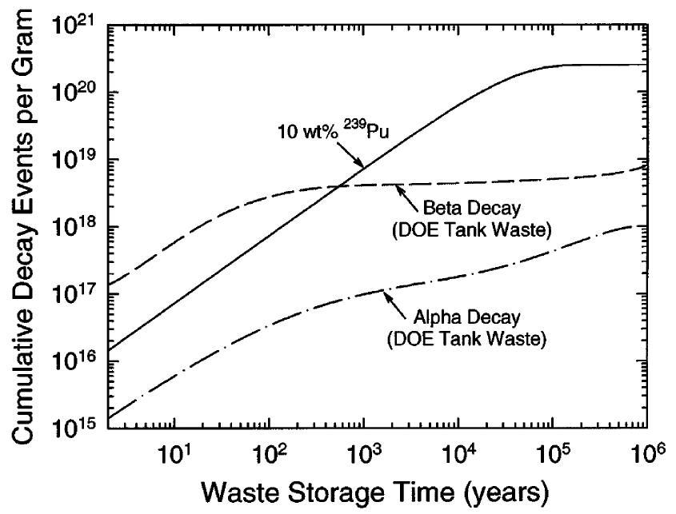
FIG. 1. Cumulative number of $\beta$-decay and $\alpha$-decay events per gram for a multiphase ceramics or glass-ceramics containing DOE high-level tank waste. Also shown is the cumulative number of $\alpha$-decay events per gram for a ceramic containing $10 \mathrm{wt} . \%{ }^{239} \mathrm{Pu}$.

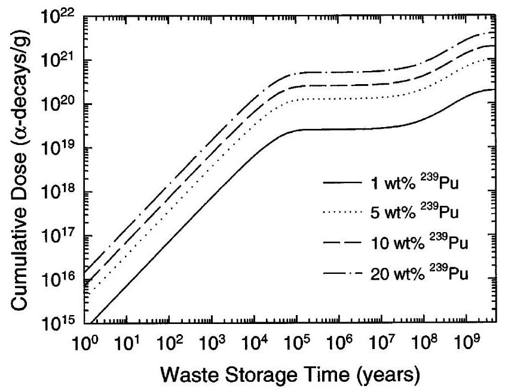
FIG. 2. Cumulative $\alpha$-decay dose in ceramics as a function of ${ }^{239} \mathrm{Pu}$ loading and waste storage time.

$\alpha$-particles and recoil nuclei, interactions involve ionization processes and elastic collisions. An $\alpha$-particle will predominantly deposit its energy by ionization processes, while an $\alpha$-recoil ion will lose most of its energy in elastic collisions with the nuclei of atoms in the solid. In addition to the transfer of energy, the particles emitted through radioactive decay can themselves, in some cases, have a significant chemical effect on the nuclear waste material as a result of their deposition and accommodation in the structure.

## 1. Ionization and electronic excitation

The bulk average energy absorbed by ionization and electronic excitations in ceramic waste forms for DOE tank wastes and for Pu disposition is similar to that for glass waste forms, ${ }^{37,38}$ and the relative absorbed doses for different types of nuclear wastes are illustrated in Fig. 3. For non-USA commercial HLW applications, the absorbed doses will be at least a factor of 20 higher than those indicated for DOE tank wastes (Fig. 3). In multiphase waste forms, partitioning of radionuclides into different phases will affect the local absorbed energy. Energy loss by $\beta$-particles and $\alpha$-particles is predominantly through Coulombic interactions. The interaction of $\gamma$-rays with matter is primarily through the photoelectric effect, Compton scattering, and electron-positron pair production. The high rate of energy absorption through ionization and electronic excitation from $\beta$-decay in HLW ceramics, and to a lesser extent from $\alpha$-decay in Pu ceramics, can result in self-heating. In addition to self-heating, ionization and electronic excitations produce a large number of electron-hole pairs that can result in covalent and ionic bond rupture, charged defects, enhanced self-ion and defect diffusion, localized

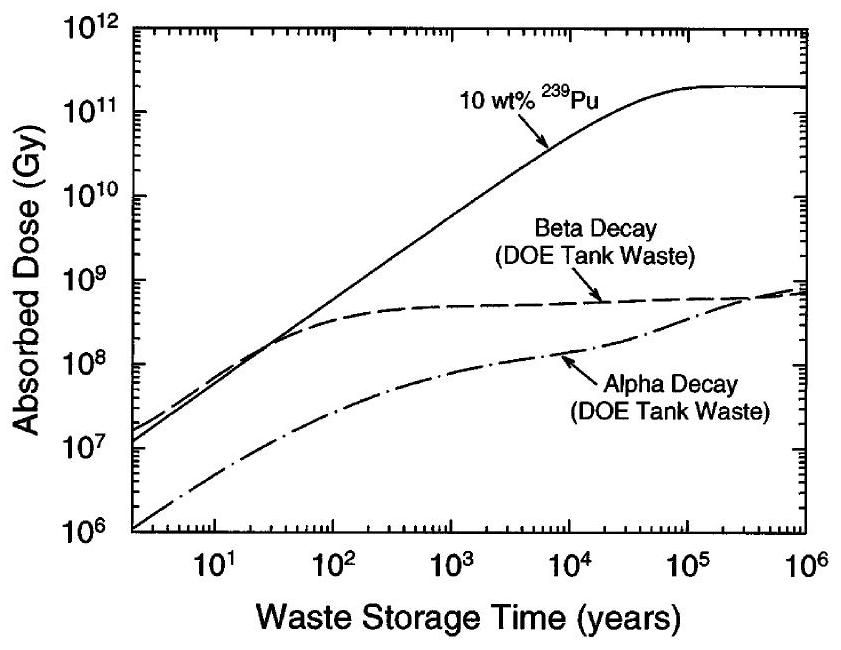
FIG. 3. Cumulative absorbed dose in ceramics containing DOE high-level tank waste or containing $10 \mathrm{wt} . \%{ }^{239} \mathrm{Pu}$.

electronic excitations, and, in some ceramics, permanent defects from radiolysis.

## 2. Ballistic processes

Ballistic processes cause direct atomic displacements through elastic scattering collisions and are responsible for the atomic-scale rearrangement of the structure. Beta particles, because of their low mass, do not efficiently transfer kinetic energy to atomic nuclei and only induce well-separated single displacement events at high energies ( $>$ several hundred keV ). The recoil nuclei ( $\beta$-recoils) produced in $\beta$-decay events are almost never energetic enough to be permanently displaced. Similarly, the emission of $\gamma$-rays results in the recoil of nuclei ( $\gamma$-recoils), which also are generally not sufficiently energetic to be permanently displaced. Likewise, the electrons emitted by the interaction of $\gamma$-rays with the structure are generally not sufficiently energetic to produce displaced atoms. In general, $\beta$-decay of the fission products in HLW produces on the order of 0.1 atomic displacements per $\beta$-decay event. ${ }^{41}$ The primary sources of atomic displacements by ballistic processes in ceramics for HLW and Pu disposition are the $\alpha$-particle and $\alpha$-recoil nucleus produced in an $\alpha$-decay event. The $\alpha$-particles emitted by actinide decay in HLW ceramics have energies of 4.5 to 5.8 MeV , and the recoil nuclei ( $\alpha$-recoils) have energies of 70 to 100 keV . In the case of Pu ceramics, a $5.2 \mathrm{MeV} \alpha$ particle and an $86 \mathrm{keV}{ }^{235} \mathrm{U}$ recoil are released by the decay of the ${ }^{239} \mathrm{Pu}$ ( $\alpha$-particles and $\alpha$-recoils of similar energies are released during the decay of the ${ }^{235} \mathrm{U}$ series).

The $\alpha$-particles dissipate most of their energy by ionization processes over a range of 16 to $22 \mu \mathrm{~m}$, but undergo enough elastic collisions along their path to
produce several hundred isolated atomic displacements. The largest number of displacements occurs near the end of the $\alpha$-particle range. Both the partitioning of the energy loss by $\alpha$-particles between ionization and elastic collisions and the distribution of displaced atoms, if the threshold displacement energies are known, can be determined by computational approaches based on the binary collision approximation (BCA). These computational approaches generally involve using the BCA computer codes, trim ${ }^{56}$ and marlowe, ${ }^{57,58}$ which are also used for charged-particle irradiations.

The more massive but lower energy $\alpha$-recoil particle accounts for most of the total number of displacements produced by ballistic processes in HLW and Pu ceramics. The $\alpha$-recoil loses nearly all of its energy in elastic collisions over a very short range ( 30 to 40 nm ), producing a highly localized displacement cascade of 1000 to 2000 displacements. The density of energy deposited into the crystal structure by an $\alpha$-recoil cascade is very high (up to $1 \mathrm{eV} /$ atom ) and occurs over a very short time ( $<10^{-12} \mathrm{~s}$ ). The distribution of displacements in an $\alpha$-recoil cascade can also be calculated by BCA codes, but the binary collision approximation is generally not as quantitative for such cascades, as discussed below (Sec. III. D), and does not account for any simultaneous recombination events that may occur. Molecular dynamic simulations (Sec. VI.B) may provide the only means of calculating the primary damage state in such cascades.

In an $\alpha$-decay event, the $\alpha$-particle and $\alpha$-recoil particle are released in opposite directions and produce distinct damage regions separated by several microns. Based on full cascade Monte Carlo calculations using trim-96 (assuming a threshold displacement energy of 25 eV ), the average number of atomic displacements generated in a ceramic, such as zircon, by the 5.2 MeV $\alpha$-particle and the $86 \mathrm{keV}{ }^{235} \mathrm{U}$ recoil released in the decay of ${ }^{239} \mathrm{Pu}$ are 220 and 1180, respectively. The average number of displacements generated per $\alpha$-decay event by the decay of the actinides in HLW ceramics is expected to be similar and is estimated to be 1400 displacements per $\alpha$-decay event. This is significantly more than the 0.1 displacements generated per $\beta$-decay event (see above). The relative numbers of displacements per atom (dpa) generated by $\beta$-decay and $\alpha$-decay in typical ceramics containing DOE tank waste or $10 \mathrm{wt} . \%{ }^{239} \mathrm{Pu}$ are shown in Fig. 4. The results in Fig. 4 clearly show the dominance of $\alpha$-decay events ( $\alpha$-particles and $\alpha$-recoils) in producing ballistic-type collision damage in ceramic waste forms.

## 3. Transmutations and gas production

In addition to the energy transferred to the ceramic, $\beta$-decay and $\alpha$-decay also lead to transmutation of

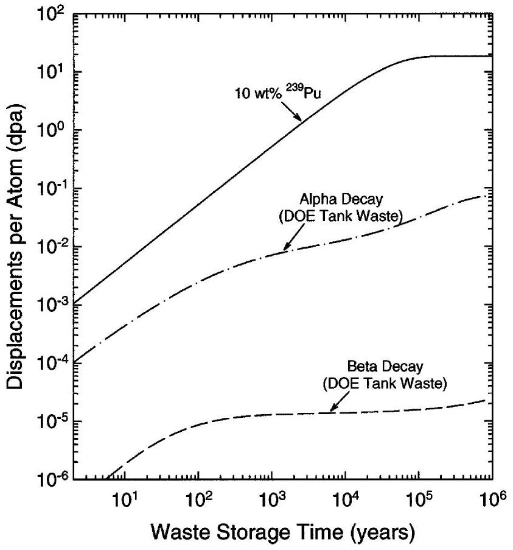
FIG. 4. Relative number of displacements generated by $\beta$-decay and $\alpha$-decay events in typical ceramics containing DOE tank waste and by $\alpha$-decay events in typical ceramics containing $10 \mathrm{wt} . \%{ }^{239} \mathrm{Pu}$.

radioactive parent nuclei into different chemical elements that must be accommodated into the structure and may significantly impact the chemical properties of the ceramic. The principal source of transmutations in HLW is $\beta$-decay of the relatively abundant fission products, ${ }^{137} \mathrm{Cs}$ and ${ }^{90} \mathrm{Sr}$. Transmutation of these two elements is accompanied by changes in both ionic radius and valence. $\mathrm{Cs}^{1+}$ decays to $\mathrm{Ba}^{2+}$ with a decrease in ionic radius of $20 \%$, and $\mathrm{Sr}^{2+}$ decays to $\mathrm{Y}^{3+}$, which in turn decays to $\mathrm{Zr}^{4+}$ with a final ionic radius decrease of $29 \% .{ }^{59}$ In ceramics for Pu immobilization, where the Pu concentration is high, the transmutation of ${ }^{239} \mathrm{Pu}$ to ${ }^{235} \mathrm{U}$ (both of which are fissile) may also result in changes in valence state and ionic radius, which could impact longterm performance and safety [e.g., $\mathrm{U}^{6+}$ as the uranyl ion $\left(\mathrm{UO}_{2}\right)^{2+}$ in solid phases is much more soluble than $\mathrm{U}^{4+}$ ].

Helium atoms, which result from the capture of two electrons by $\alpha$-particles, are also produced and must (i) be accommodated in the ceramic interstitially, (ii) be trapped at internal defects, (iii) aggregate to form bubbles, or (iv) be released at the ceramic surface. For HLW, most of the He will be generated over long time periods near ambient temperature, and the concentration should not exceed 100 atomic parts per million (appm), which should be easily accommodated. In the case of ceramic waste forms for Pu immobilization and disposal, He concentrations can become quite high and difficult to accommodate within the structure, exceeding 2 atom \% after 100,000 years for ceramics containing $20 \mathrm{wt} . \%{ }^{239} \mathrm{Pu}$.

## C. Irradiation techniques

The effects of radiation from the decay of radionuclides will accumulate over very long time periods; consequently, a broad range of accelerated irradiation techniques must be utilized to study radiation effects in ceramics for HLW and Pu disposition. The relative damage rates in natural minerals, HLW forms, ceramics for Pu disposition, and for accelerated irradiation methods are shown in Table I. These irradiation techniques and procedures have been described in detail previously, ${ }^{37,38,41}$ and are briefly reviewed here.

## 1. Actinide-incorporation

The long-term effects of $\alpha$-decay events can be simulated by incorporating short-lived actinides, such as ${ }^{238} \mathrm{Pu}$ (half-life of 87.7 years ${ }^{60}$ ) or ${ }^{244} \mathrm{Cm}$ (half life of 18.1 years ${ }^{60}$ ) in sufficient concentrations ( 0.2 to $3 \mathrm{wt} . \%$ ) to achieve $10^{18}$ to $3 \times 10^{19} \alpha$-decay events/g in laboratory time periods of up to several years. This technique has been utilized in studies of several HLW ceramics and single-phase ceramics, as discussed below, and effectively simulates, at accelerated dose rates, the simultaneous $\alpha$-particle and $\alpha$-recoil effects that are expected over long periods of time in ceramic phases for HLW or Pu immobilization.

## 2. Actinides in natural minerals

Unlike natural glasses, which do not contain enough uranium and thorium ( $<100 \mathrm{ppm}$ ) to serve as natural analogues for radiation effects in waste form glasses, natural minerals can contain large concentrations of U and Th impurities (up to $30 \mathrm{wt} . \%$ ) and, therefore, can serve as natural analogues ${ }^{27}$ for radiation effects in analogous waste form structures, as discussed in more detail below. For example, the enhanced chemical reactivity (differential etching) of $\alpha$-recoil tracks is well documented in naturally occurring minerals. ${ }^{61}$

## 3. Charged-particle irradiation

Charged-particle irradiation using electrons, protons, $\alpha$-particles, and heavy ions can be used to simulate and study radiation effects in ceramic phase relevant to HLW and Pu disposition, particularly over a wide range of temperatures. These irradiation techniques generally

TABLE I. Relative damage rates.
| Material | Damage rate (dpa/s) |
| :--- | :--- |
| HLW forms | $10^{-16}-10^{-11}$ |
| $10 \mathrm{wt} . \% \mathrm{Pu}$ waste form | $10^{-11}$ |
| Natural minerals | $<10^{-17}$ |
| Actinide doping | $10^{-10}-10^{-8}$ |
| Neutron irradiation | $10^{-7}-10^{-6}$ |
| Ion-beam irradiation | $10^{-5}-10^{-2}$ |

employ particle accelerators and high dose rates; consequently, very significant doses are reached in short periods of time (e.g., minutes). Interpretation of the results from such experiments can be difficult because the irradiated areas are thin surface layers of restricted lateral extent. The high surface area can act as a sink for migrating defects, and electric field gradients may be generated along the electron or ion paths. Implanted ions also can change the properties of the target material as a result of compositional changes. Still, $\alpha$-particle irradiation, using either sealed actinide $\alpha$-sources (e.g., ${ }^{238} \mathrm{Pu}$ ) or particle accelerators, is an effective tool for understanding $\alpha$-particle effects; similarly, heavy-ion (e.g., $\mathrm{Xe}, \mathrm{Pb}$ ) irradiation is an effective method to study $\alpha$-recoil effects. In fact, the two techniques can be used simultaneously to study the effects of both $\alpha$-particles and $\alpha$-recoils on ceramics. Similarly, electron irradiation can be used to study the effects of ionization and electronic excitations from $\beta$-particles and $\gamma$-rays on ceramics. One minor disadvantage of charged-particle irradiation, particularly for simulating the damage from $\alpha$-decay events over a large area in a multiphase specimen, is that it cannot selectively irradiate (i.e., damage) only the actinide host phases as would occur in an actual multiphase waste form; instead all phases are irradiated. This is not a disadvantage in studies of single phase materials, and homogeneously damaged surface layers can be produced using multiple energy beams. In order to compare the results of charged-particle irradiations with those from actinide-decay studies, the comparable dose in displacements per atom (dpa) can be calculated, based on the binary collision approximation, using computer codes, such as trim ${ }^{56}$ and marlowe, ${ }^{57,58}$ and known or assumed values for the displacement threshold energies.

## 4. Gamma irradiation

Gamma irradiation, utilizing ${ }^{60} \mathrm{Co}$ or ${ }^{137} \mathrm{Cs}$ sources, has been used to simulate the effects of $\beta$-particles and $\gamma$-rays on glass. ${ }^{37,41,42}$ Very little of this work has been done on ceramics because of the relative insensitivity of many oxides to permanent damage from ionization processes. However, some host phases for fission products could be susceptible to ionization damage. The advantage of this technique is that $\gamma$-rays are so penetrating that samples can be irradiated in bulk and while sealed in containers; furthermore, the $\gamma$-rays provide a realistic simulation since they interact with the ceramic primarily through ejected photoelectrons. Dose rates on the order of $2.5 \times 10^{4} \mathrm{~Gy} / \mathrm{h}$ are easily achieved. ${ }^{41}$

## 5. Neutron irradiation

Irradiation with neutrons can also be used to simulate and study radiation effects in multiphase and single
phase waste ceramics. The main advantage of irradiating with neutrons, which dissipate their energy by ballistic processes, is that significant numbers of atomic displacements can be produced in bulk specimens, making it easier to measure physical property changes associated with ballistic damage. Neutron irradiation, however, only moderately simulates the ballistic damage from $\alpha$-particles and $\alpha$-recoils. ${ }^{41}$ In addition, fast-neutron irradiation of ceramics provides only limited simulation of He buildup from $\alpha$-decay through the generation of $\alpha$-particles by ( $n, \alpha$ ) reactions, which is different than the case for borosilicate glasses where the $\mathrm{B}(n, \alpha)$ Li reaction can generate significant $\mathrm{He} .^{38,41}$ Another technique ${ }^{62}$ involves fission of fissile nuclides (e.g., ${ }^{235} \mathrm{U}$ ) in the ceramic by irradiation in a fast and/or thermal neutron flux; the fission event results in very high-energy fission fragments that produce extensive regions of damage (i.e., fission tracks) that may or may not simulate ballistic damage from the $\alpha$-recoil particles. Such fission events provide an excellent simulation of spontaneous fission events in HLW and Pu ceramics; however, as mentioned above, these events are so infrequent in actual HLW that they are unimportant as damage mechanisms. Similar to charged-particle irradiation, neutron irradiation generally damages all phases in a multiphase ceramic to some extent, although fission-track damage may be localized to phases containing fissile nuclides; consequently, neutron irradiation does not provide an accurate simulation of the heterogeneous damage that may occur due to actinide partitioning.

## D. Damage production

The production of radiation damage effects in a wide-range of ceramics has been studied for many years, and the current state of knowledge is summarized in several reviews. ${ }^{37,40,63-69}$ One of the most important fundamental parameters affecting radiation damage in a material is the threshold displacement energy, $E_{d}$, which is the minimum kinetic energy necessary to displace an atom from its normal site. As noted above and discussed below, this parameter is essential for quantifying the number of displaced atoms produced in irradiated materials using computational approaches, and provides primary damage information for modeling radiation effects. Since ceramics generally consist of multiple sublattices, $E_{d}$ must be separately measured (or calculated) for each sublattice. Table II summarizes the recommended values of the threshold displacement energies for several ceramics, as determined from a recent evaluation of the literature. ${ }^{69}$ Typical values range from 20 to 60 eV . There are no known measurements of the displacement energies in the ceramic phases that are under consideration as matrices for radionuclides. Unfortunately, there are vanishingly few electron irradiation
facilities still available in the USA where the threshold displacement energies of materials can be determined.

The recommended method for measuring $E_{d}$ is to irradiate the sample with electrons while monitoring the induced-defect concentration as a function of electron energy to determine the minimum electron energy at which defects are produced. Preferred techniques for monitoring the defect concentration are optical spectroscopy or electron paramagnetic resonance (EPR) spectroscopy, since they are capable of uniquely monitoring the behavior of specific defects, such as anion vacancies. However, in some cases, the EPR or optical signal may not be detectable unless displacement damage occurs on both sublattices. ${ }^{70,71}$ Other techniques (e.g., high voltage electron microscopy) have been successfully used to determine $E_{d} .{ }^{69}$ Measurements are typically performed at cryogenic temperatures to minimize defect recovery processes. The relationship between $E_{d}$ and the threshold (minimum) electron energy, $E_{e}$, is given by ${ }^{72,73}$

$$
E_{d}=2 E_{e}\left(E_{e}+2 m_{e} c^{2}\right) / M c^{2}
$$

where $m_{e}$ is the electron mass, $c$ is the velocity of light, and $M$ is the mass of the displaced ion. Some studies have estimated $E_{d}$ by performing electron irradiations at energies above the threshold value and comparing the measured point defect concentration with the concentration predicted by theory; this method typically overestimates $E_{d} .{ }^{69}$ Measurements on $\mathrm{Al}_{2} \mathrm{O}_{3}$ and MgO indicate that $E_{d}$ is approximately constant over the temperature range from 78 to $400 \mathrm{~K} .^{74,75}$ The temperature dependence of $E_{d}$ in ceramics relevant for HLW or Pu disposition is unknown and needs to be investigated.

Computer simulation techniques, as discussed in Sec. VI, can be used to confirm experimental values for $E_{d}$ or to calculate values of $E_{d}$ when experimental values are unavailable, as is the case for most of the ceramic phases of interest for nuclear waste applications. Recently, values of $E_{d}$ calculated by computer simulation techniques have been shown to be in good agreement with many of the oxide values ${ }^{76}$ and SiC values ${ }^{77}$ in Table II. In the case of zircon ( $\mathrm{ZrSiO}_{4}$ ), computer simulation results, ${ }^{76}$ which are given in Table III, provide the only available estimates for $E_{d}$ values.

Given the threshold displacement energies, the production of displacements in these polyatomic materials by ballistic processes can be determined by computational approaches based on the binary collision approximation (BCA). As already mentioned, these computational approaches generally involve using computer codes, such as trim ${ }^{56}$ and marlowe. ${ }^{57,58}$ trim assumes a structureless medium (i.e., it takes no account of crystallinity) and uses a Monte Carlo approach to determine the scattering angle and energy transfer that results from each binary elastic collision. marlowe is

TABLE II. Recommended threshold displacement energies for several simple ceramics. ${ }^{69}$ (* indicates less reliable data.)
| Material | Threshold displacement energy |  |
| :--- | :--- | :--- |
| $\mathrm{Al}_{2} \mathrm{O}_{3}$ | $E_{d}(\mathrm{Al})=20 \mathrm{eV}$, | $E_{d}(\mathrm{O})=50 \mathrm{eV}$ |
| MgO | $E_{d}(\mathrm{Mg})=55 \mathrm{eV}$, | $E_{d}(\mathrm{O})=55 \mathrm{eV}$ |
| CaO | $E_{d}(\mathrm{O})=50 \mathrm{eV}$ |  |
| $\mathrm{MgAl}_{2} \mathrm{O}_{4}$ | $E_{d}(\mathrm{O})=60 \mathrm{eV}$ |  |
| ZnO | $E_{d}(\mathrm{Zn})=50 \mathrm{eV}$, ${ }^{*}$ | $E_{d}(\mathrm{O})=55 \mathrm{eV}$ |
| BeO | $E_{d}(\mathrm{Be})=25 \mathrm{eV}$, ${ }^{*}$ | $E_{d}(\mathrm{O})=70 \mathrm{eV}^{*}$ |
| $\mathrm{UO}_{2}$ | $E_{d}(\mathrm{U})=40 \mathrm{eV}$, ${ }^{*}$ | $E_{d}(\mathrm{O})=20 \mathrm{eV}$ |
| SiC | $E_{d}(\mathrm{Si})=40 \mathrm{eV}$, ${ }^{*}$ | $E_{d}(\mathrm{C})=20 \mathrm{eV}$ |
| Graphite | $E_{d}(\mathrm{C})=30 \mathrm{eV}$ |  |
| Diamond | $E_{d}(\mathrm{C})=40 \mathrm{eV}$ |  |

TABLE III. Minimum threshold displacement energies, $E_{d}$, calculated for zircon. ${ }^{76}$
| Specific ion | $E_{d}(\mathrm{eV})$ |
| :---: | :---: |
| Zr | 79 |
| Si | 23 |
| O | 47 |

a BCA code that does take into account crystallinity by assigning all atoms to well-defined initial positions in a crystal lattice. The net number of displacements can also be determined directly by numerical solutions to the integro-differential equations of Parkin and Coulter, ${ }^{78}$ which also assume a structureless medium. If the same scattering cross sections and electronic stopping powers are used, the results of trim simulations are in agreement with numerical solutions to the integro-differential equations. ${ }^{79}$ The binary collision approximation, however, is a high-energy approximation that is appropriate for high-energy collisions and may be reasonable for light ions, such as $\alpha$-particles. At low energies, where the trajectories of recoils are not easily described by discrete collisions, such as in a $\alpha$ recoil cascade, the binary collision approximation is less useful; it also fails to take into account the simultaneous recombination events that can occur. Molecular dynamic simulations, as discussed in Sec. VI. B, may provide the only means of calculating the nature of the primary damage state in such cascades. Nonetheless, in order to semiquantitatively compare the results of irradiations with ion beams of different masses and energies with each other and with the results of self-radiation due to $\alpha$-decay, the BCA codes often must be used because molecular dynamic simulations cannot be performed on all the materials of interest due to the lack of adequate interatomic potentials.

Radiolysis can also result in defect production as a consequence of localized electronic excitations produced by ionization. ${ }^{63,65,66,68}$ This mechanism is important in some ceramic systems, such as alkali halides, alka-
line earth fluorides, and silica, ${ }^{63,65,68}$ but is generally concluded to be insignificant in many other ceramic materials. Under the irradiation environments anticipated for nuclear waste materials, the production of displaced atoms from radiolysis is expected to be minor in most crystalline ceramics of interest. Some silicate and phosphate systems, however, may be sensitive to this mechanism. Table IV summarizes the sensitivity of candidate nuclear waste ceramics to radiolysis at high dose rates. A wide range of chemical compositions is possible for most of these structure types, and this may affect their sensitivity to radiolysis. This can be important for some structure types, such as the apatite structure, where both silicate and phosphate systems are of interest. The sensitivity of potential fission-product host phases (e.g., apatite, monazite, NZP, and silicotitanate structures) to radiolysis under expected repository conditions is unknown.

Obviously, threshold displacement energies for elastic collisions cannot be measured by electron irradiation methods in materials that are sensitive to radiolysis because the ratio of electronic-to-nuclear stopping powers for electrons with energies $<1 \mathrm{MeV}$ is greater than $10^{4}$ and increases with decreasing electron energy. Therefore, the radiolytic production of defects in much higher than that due to elastic collisions, making any determination of $E_{d}$ impossible. Estimates of $E_{d}$ in radiolysis-sensitive materials may be best obtained by theoretical or semi-empirical comparisons with other ceramics. Additional $E_{d}$ data on a wide range of ceramic materials are needed in order to allow accurate estimates of displacement energies for radiolysis-sensitive materials.

Due to the low average knock-on energies associated with $\alpha$-particle and $\beta$-particle interactions with the host ceramic, most of the knock-on energies associated with these processes will be close to the threshold energies for atomic displacements. It is, therefore, likely

TABLE IV. Sensitivity of candidate nuclear waste ceramics to radiolysis.
| Ceramic phases | Radiolysis sensitive |
| :--- | :--- |
| Actinide hosts: |  |
| zircon | no |
| zirconolite | no |
| silicate apatite | no |
| fluoroapatite | yes |
| monazite | yes |
| NZP | unknown |
| $\mathrm{ZrO}_{2}$ | no |
| Fission product hosts: |  |
| $\mathrm{CsCl}, \mathrm{SrF}_{2}$ | yes |
| Hydroxylated ceramics: |  |
| clays, zeolites, etc. | yes |
| Silicotitanates | unknown |

that nonstoichiometric fractions of displacement damage will be produced on the different sublattices, due to differences in $E_{d}$ and atomic mass. Although the total number of displacements associated with $\alpha$-particle collisions is less than 20\% of the nearly stoichiometric displacements calculated for the $\alpha$-recoil cascade, these isolated displacements have higher survival rates (less in-cascade recombination), and it is possible that these displacements may play a major role in the evolution of microstructure in irradiated nuclear waste ceramics. Further work is needed to determine if there is any significant effect associated with nonstoichiometric displacements and the role of the $\alpha$-particle displacements on damage accumulation processes.

## E. Radiation damage kinetics

Because equilibrium thermodynamics are not strictly applicable under irradiation conditions, the accumulation of point defects, evolution of microstructures, and formation of metastable phases (e.g., amorphization) under irradiation are controlled by the nucleation and kinetic properties of the system. ${ }^{80-83}$ The kinetics of radiation damage accumulation are controlled by the competition between the rate of damage production and the rate of various simultaneous recovery processes (e.g., closepair recombination, defect migration, defect aggregation, epitaxial recrystallization). The kinetics of simultaneous recovery processes can be expected to vary depending on the irradiating ion mass and energy, the bulk temperature of the sample, and the melting temperature or cohesive energy of the irradiated material. Experiments in ceramic materials have shown that light ions are less efficient, with increasing temperature, at irradiation-induced amorphization than heavy ions. ${ }^{84-89}$ These observations are consistent with metal irradiation studies that show that light ions will have a larger fraction of the initially produced Frenkel defects remaining at the end of the cascade event as compared with the fraction remaining in cascades produced by heavier ions. ${ }^{90}$ In ceramics, ionization-induced diffusion can also affect recovery kinetics. ${ }^{67,69,91,92}$

Accelerated irradiation methods (Sec. III. C) must be used to achieve dose levels, in laboratory time frames, that are relevant to long-term repository performance. Consequently, a detailed understanding of the dependence of radiation-damage accumulation on time, temperature, and damage rate is important to predicting the long-term behavior of ceramic waste forms under expected geologic repository conditions. For example, because the high damage rates overwhelm the simultaneous thermal recovery processes, the effects of electron and ion irradiation generally occur at much higher temperatures than the effects from self-radiation damage (at significantly lower damage rates) in actual nuclear waste
ceramics, in ceramics doped with short-lived actinides, or in mineral analogues. This effect is mitigated to some extent by the irradiation-assisted recovery processes that are also observed under high-dose electron and ion irradiation. A systematic, integrated understanding of dose-rate effects is necessary to extrapolate data obtained using accelerated methods, under high dose rates, to the long-term low-dose-rate behavior of actual nuclear waste ceramics. This dose-rate difference ranges from $10^{6}$ to $10^{14}$ (Table I). Comparisons to natural mineral data can involve even larger dose-rate differences. Some data on dose-rate effects will be presented below (Sec. V.E).

## IV. RADIATION EFFECTS IN MULTIPHASE CERAMIC WASTE FORMS

Waste forms for the immobilization of HLW at DOE sites in the USA, HLW worldwide, plutonium, and other special nuclear waste streams represent complex multicomponent systems, and the clean-up campaign will proceed for several decades. Thus, there is time to identify and address fundamental scientific issues, in particular those related to the effect of radiation on waste form properties, which may have a bearing on the cost, optimization of processing technologies, the integrity of the waste forms during interim storage/operations, and long-term performance.

Multiphase ceramic waste forms are tailored to produce specific crystalline phases as hosts for the different radionuclides. Generally, fission products (such as Cs and Sr ) are confined to one or more glass or crystalline phases, while the actinides ( $\mathrm{U}, \mathrm{Np}, \mathrm{Pu}, \mathrm{Am}$, and Cm ) generally partition into other crystalline phases. Synroc and other related titanate-based ceramic waste forms have received the most attention. ${ }^{93-97}$ There have been more limited studies of supercalcine, ${ }^{98,99}$ a silicate-based tailored ceramic, and of glass-ceramics, ${ }^{11,100-102}$ which are prepared by controlled crystallization of suitable glasses. In general, the cumulative radiation effects in all the component phases will contribute to the actual effects of radiation on the performance of these and other potential multiphase waste forms. However, due to differential effects, such as radiation-induced volume changes that can lead to differential stresses and even microcracking, radiation effects in multiphase waste forms may be more than the sum of the effects in individual phases, which are described in more detail below (Sec. V). The studies of radiation effects in several multiphase ceramic waste forms are summarized below.

## A. Synroc

Synroc is a dense, multiphase titanate-based waste form designed for the immobilization of HLW, with phases based on mineral analogues. The attraction of this multiphase ceramic is that the phase assemblage is
insensitive to the HLW/precursor ratio; in most cases, the ratios of the phases vary as the waste loading changes from 0 to $35 \mathrm{wt} . \%$. The Synroc phases, in approximately equal abundance, are zirconolite $\left(\mathrm{CaZrTi}_{2} \mathrm{O}_{7}\right)$, which incorporates rare earths (RE) and actinides (An), perovskite ( $\mathrm{CaTiO}_{3}$ ), which incorporates RE , An , and Sr , hollandite $\left(\mathrm{BaAl}_{2} \mathrm{Ti}_{6} \mathrm{O}_{16}\right)$, which incorporates Cs , Rb , and Ba , and rutile ( $\mathrm{TiO}_{2}$ ). In some formulations, pyrochlore, $\mathrm{A}_{2} \mathrm{~B}_{2} \mathrm{O}_{7}$, which is structurally closely related to zirconolite, may become an important actinide host phase. Some fission and corrosion products ( $\mathrm{Fe}, \mathrm{Ni}$, $\mathrm{Cr}, \mathrm{Pd}, \mathrm{Rh}, \mathrm{Ru}, \mathrm{Tc}, \mathrm{Mo}$, etc.) will form metal alloys. In general, the composition of the precursor can be readily adjusted for different types of HLW. Possible near-term applications of Synroc are immobilization of Tc (technetium) and other elements separated during cleanup of U.S. DOE tank waste liquids, Synroc/glass composites aimed at HLW sludges from U.S. DOE tank wastes, and zirconolite/pyrochlore-rich ceramics for immobilization of Pu-rich materials. There has been interest in France and more particularly in Russia since 1994 in producing Synroc and Synroc/glass composites by induction melting.

Ringwood et al. ${ }^{103}$ have argued that Synroc is stable with respect to $\alpha$-decay damage, based on an assessment of natural minerals of uranium and/or thorium-bearing perovskite and zirconolite, which are the actinide host phases of Syntoc. Such data, however, can provide only qualitative results, as both zirconolite and perovskite are susceptible to irradiation-induced amorphization. ${ }^{37}$ In the early 1980s, a limited amount of accelerated radiation-damage testing was performed on sintered, coarse-grained Synroc and its constituent phases by irradiation with fast neutrons to fluences of up to $2.7 \times 10^{26} \mathrm{n} / \mathrm{m}^{2}(E>1 \mathrm{MeV})$, which is equivalent in damage to about $8 \times 10^{18} \alpha$-decays $/ \mathrm{g}$. ${ }^{104-106}$ Microcracking was observed in the neutron-irradiated samples and contributed to the large volume expansions (up to 8.5\%) that were observed. Accelerated testing of ${ }^{238}$ Pu-doped Synroc (and its constituent phases) has also been completed on hot-pressed materials. ${ }^{107,108}$ The macroscopic swelling in the Pu-doped Synroc increases with dose, as shown in Fig. 5, and exceeds $6 \%$, with only a slight indication of approaching a steady-state (saturation) value. Studies of ion-irradiated Synroc indicate significant increases in the leach rate at high damage levels. ${ }^{109,110}$

For the multiphase Synroc ceramic, the hollandite phase will be subject only to $\alpha$-particle and $\beta / \gamma$ irradiation, while the zirconolite and perovskite phases will be subject to $\alpha$-decay damage processes, involving both $\alpha$-particles and $\alpha$-recoils, as well as $\beta / \gamma$ irradiation. Since $\beta / \gamma$ irradiation damage is generally assumed to be negligible in these phases, studies of radiation effects in the major constituent phases of Synroc (i.e., hollandite, perovskite, and zirconolite) have been carried out

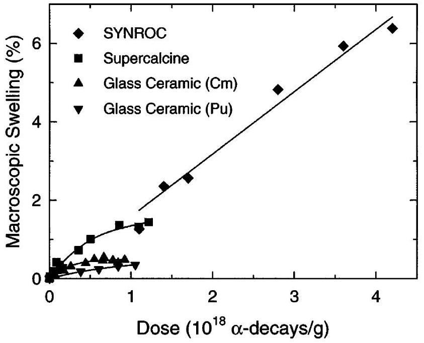
FIG. 5. Macroscopic swelling in the Pu-doped Synroc, ${ }^{107} \mathrm{Cm}$-doped supercalcine, ${ }^{123}$ and Cm -doped ${ }^{123}$ and Pu-doped ${ }^{126}$ glass-ceramics.

using actinide-doping, $\alpha$-particle irradiation, neutronirradiation, and ion-beam irradiation techniques. Details from the studies of these specific crystalline phases are reviewed elsewhere ${ }^{37}$ and are briefly described in the following section on relevant crystalline phases. The essential conclusions are that $\alpha$-particles induce a large unit-cell volume expansion (up to $2.5 \%$ ) and a displacive transformation from the tetragonal to a lowersymmetry monoclinic structure in hollandite. ${ }^{111}$ In addition, the zirconolite ${ }^{107,112-116}$ and perovskite ${ }^{107}$ phases will undergo $\alpha$-decay-induced amorphization with volume changes in the range of 6 to $8 \%$.

## B. Synroc-related ceramics

Japanese researchers have investigated self-radiation effects in a ${ }^{244} \mathrm{Cm}$-doped Synroc-related titanate ceramic consisting of perovskite, zirconolite, hollandite, freudenbergite, and loveringite that is intended for encapsulation of sodium-rich high-level waste. ${ }^{117,118}$ The density of this material decreased linearly with dose to a value corresponding to a volume expansion of $1.0 \%$ after a dose of $0.7 \times 10^{18} \alpha$-decays $/ \mathrm{g}$; above this dose, the rate of density change increased to a new constant value, and this phenomenon is attributed to microcracking. The maximum volume expansion approaches $4 \%$ at $1.8 \times 10^{18} \alpha$-decays $/ \mathrm{g}$, with no indication of saturation. The leach rates for Na and Cs increased by a factor of 10 , while the leach rates for Sr and Ca increased by a factor of $100 .^{118}$ These increases were attributed to increased surface area from microcracking and decreased durability due to radiation damage. A Synroc-related titanate ceramic containing sodium-free simulated waste has also been studied by doping with $0.91 \mathrm{wt} . \%{ }^{244} \mathrm{Cm}$. ${ }^{119}$ Both the perovskite and zirconolite phases exhibited unitcell expansions on the order of $2.6 \%$. The macroscopic
volume expansion increased linearly with dose to a value of $1.7 \%$ after a dose of $1.2 \times 10^{18} \alpha$-decays $/ \mathrm{g}$.

Researchers at Sandia National Laboratories ${ }^{120}$ have investigated a multiphase titanate ceramic to immobilize acidic high-level nuclear waste. This titanate waste ceramic consisted of rutile ( $\mathrm{TiO}_{2}$ ), an amorphous silicate phase, perovskite, zirconolite, hollandite, and a U-Zrrich phase that was believed to have the pyrochlore structure. Radiation effects from $\alpha$-decay in this titanate ceramic were simulated by irradiating TEM specimens with $\mathrm{Pb}^{+}$ions. ${ }^{121}$ Multiple energies ( 40 to 250 keV ) were used to produce a uniform damage profile. Irradiation at single energies of 240 to 250 keV were also performed. Examination by transmission electron microscopy of the irradiated specimens indicated considerable damage in all phases after a dose equivalent to $2 \times 10^{18} \alpha$-decay events/g. All phases remained crystalline, except the phase with a chemistry typical of a pyrochlore, and it became amorphous.

## C. Supercalcine

Radiation effects in this multiphase waste form were studied at the Pacific Northwest National Laboratory in the late 1970s by incorporating ${ }^{244} \mathrm{Cm}$ in a supercalcine formulation consisting of three major phases with the fluorite structure, the apatite structure, and an unresolved tetragonal structure type. ${ }^{122,123}$ Subsequent analysis suggested that the Cm predominantly partitioned into the apatite phase and the tetragonal phase. X-ray diffraction indicated a gradual transformation of the apatite from a crystalline to an amorphous state, in agreement with the results ${ }^{124}$ on the amorphization of similar apatite crystals in a devitrified nuclear waste glass. There also was a slight increase in the intensity of the diffraction maxima associated with the tetragonal phase. The stored energy reached a maximum value of $42 \mathrm{~J} / \mathrm{g}$ at a dose of $0.5 \times 10^{18} \alpha$-decay events $/ \mathrm{g}$ and decreased slightly with further increases in dose. The energy release was not complete at $600^{\circ} \mathrm{C}$ (the upper limit of the calorimeter used); therefore, additional energy release may occur at higher temperatures. The density decreased exponentially with dose, resulting in a volume expansion of $1.4 \%$ at a dose of $1.2 \times 10^{18} \alpha$-decay events/g (Fig. 5).

## D. Glass-ceramics

A glass-ceramic is a fine-grained mixture of glass and ceramic phase ideally derived from a homogeneous glass through a heat-treatment at the temperature of maximum nucleation rate for the ceramic phases, followed by a high-temperature treatment to yield a maximum growth rate. The celsian glass-ceramic, developed at the Hahn-Meitner Institut and named for the predominant crystalline phase, is easy to fabricate, is homogeneously
crystallized, and contains a variety of leach-resistant host phases for the radionuclides. In the late 1970s, radiation effects in a ${ }^{244} \mathrm{Cm}$-doped celsian glass-ceramic were investigated at the Pacific Northwest National Laboratory. ${ }^{123}$ At the same time, similar studies were being performed on both a ${ }^{244} \mathrm{Cm}$-doped celsian glassceramic ${ }^{125}$ and a ${ }^{238} \mathrm{Pu}$-doped celsian glass-ceramic ${ }^{126}$ within the European Community. In these studies, the density decreased exponentially with dose, and the associated volume change was projected to saturate at $0.5 \%$ (Fig. 5). The stored energy increased with dose to a saturation value of $80 \mathrm{~J} / \mathrm{g},{ }^{123}$ and the fracture toughness increased by $25 \% .^{125}$ Data from the x-ray diffraction analysis revealed that a Cm-rich, rare-earth titanate phase with the pyrochlore structure underwent a small volume expansion with dose and eventually became x-ray diffraction amorphous. The fractional helium release was determined to be $3 \%$ in samples stored at $170^{\circ} \mathrm{C}$ to a cumulative dose of $1.1 \times 10^{18} \alpha$-decay events $/ \mathrm{g}$.

In the study of a devitrified Cm -doped waste glass, ${ }^{124}$ the Cm partitioned into two crystalline phases: $\mathrm{Ca}_{3}(\mathrm{Gd}, \mathrm{Cm})_{7}\left(\mathrm{SiO}_{4}\right)_{5}\left(\mathrm{PO}_{4}\right) \mathrm{O}_{2}$ (apatite structure) and $(\mathrm{Gd}, \mathrm{Cm})_{2} \mathrm{Ti}_{2} \mathrm{O}_{7}$ (pyrochlore structure). The volume expansion of the glass saturated at $1 \%$, and the measured stored energy was $90 \mathrm{~J} / \mathrm{g}$. Both of these crystalline phases were observed to undergo a radiation-induced, crystalline-to-amorphous transformation. The differential expansion (estimated to be 5 to $8 \%^{37}$ ) associated with the crystalline-to-amorphous transformation of these phases resulted in significant microfracturing (Fig. 6), which can greatly increase the surface area for radionuclide release.

Vance et al. ${ }^{127}$ used $3 \mathrm{MeV} \mathrm{Ar}{ }^{+}$ions to study radiation effects in a sphene glass-ceramic. They reported that complete amorphization of the crystalline sphene phase occurred at an ion fluence equivalent to $7 \times 10^{18} \alpha$-decays $/ \mathrm{g}$. No significant enhancement in the leaching of the irradiated sphene glass-ceramic was observed. A sphene glass-ceramic containing $2 \mathrm{wt} . \%{ }^{238} \mathrm{Pu}$ was reportedly prepared to study $\alpha$-decay effects ${ }^{128}$; no results have been reported to date.

## E. Scientific issues for multiphase waste forms

Radiation effects in multiphase ceramic waste forms concern both behavior of the individual crystalline phases and behavior due to the multiphase nature the waste form. Key issues regarding radiation effects in individual crystalline phases are discussed in detail in the following section, such as the nature of the point defects produced by radiation, the displacement energies for ions on different sublattices, and radiationinduced amorphization and volume changes. For actual multiphase ceramic waste forms, the behavior at grain boundaries and interfaces will become important.

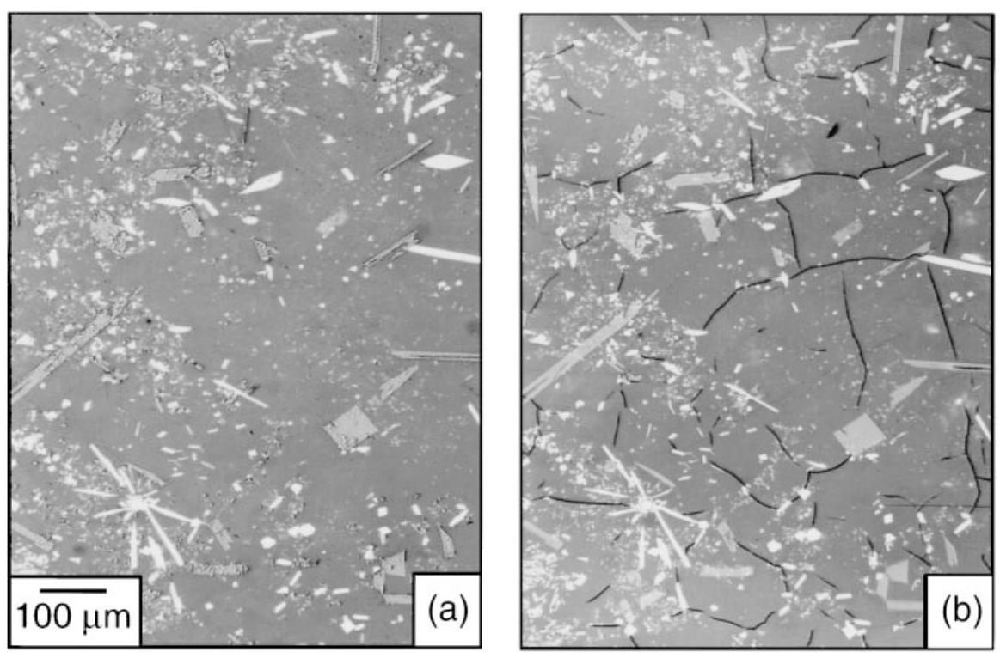
FIG. 6. Effect of $\alpha$-decay in crystalline phases on microstructure in a partially devitrified glass: (a) $6 \times 10^{15} \alpha$-decays/g and (b) $2.4 \times 10^{17} \alpha$-decays $/ \mathrm{g}$. ${ }^{124}$

Consequently, studies should (i) measure and model the microfracturing that occurs in polyphase and polycrystalline ceramics due to radiation-induced differential and anisotropic volume expansions, (ii) determine the influence of grain size on the tendency of such ceramics to microcrack, and (iii) determine the influence of intergranular or interfacial stresses on properties and behavior. Clearly, additional characterization techniques must be employed in investigations of $\alpha$-decay effects in these nuclear waste ceramics. Point defects in many of these ceramics can be investigated by EPR and optical spectroscopies. In principle, changes in the valence states of actinides, rare-earth, and transition elements can be addressed by Auger, x-ray photoelectron/absorption spectroscopy, electron energy loss spectroscopy, and (possibly) diffuse UV-near IR reflection spectroscopy. Nearly all the ceramics under consideration for nuclear waste immobilization are oxide-based, and neutron diffraction enjoys advantages over x-ray diffraction for the study of radiation-induced oxygen defects.

## V. RADIATION EFFECTS IN CRYSTALLINE PHASES

There have been a number of studies of individual synthetic phases and minerals that are structurally and/or chemically analogous to the phases found in multiphase ceramic waste forms or to proposed single phase waste forms. These studies contribute significantly to the understanding of radiation effects in the multiphase ceramic waste forms by providing a detailed understanding of the behavior of each component phase. The current state of understanding regarding radiation effects and radiation damage processes in crystalline
phases proposed as host matrices for radionuclides is briefly summarized below and critical scientific issues are identified and discussed. More detailed information and data are available in the original references and in a recent review. ${ }^{37}$

## A. Phases and structures

## 1. Actinide-bearing phases

The most prominent of the potential actinide-bearing phases are listed in Table V. In these structures, actinides are generally accommodated by substitution for Zr or the rare-earth (RE) elements. Phases with the fluorite structure $\left(\mathrm{PuO}_{2}\right.$ and $\left.\mathrm{UO}_{2}\right)$ or modified fluorite structure $\left(\mathrm{ZrO}_{2}\right)$ are also important. The low solubility of $\mathrm{PuO}_{2}$ in many materials can result in the formation of $\mathrm{PuO}_{2}$ in both glass and ceramic waste forms. Uranium dioxide $\left(\mathrm{UO}_{2}\right)$ is the main constituent of spent fuel and may also form in U-rich wastes. Zirconia ( $\mathrm{ZrO}_{2}$ ) is a very stable material under a wide range of oxidation/reduction environments and may be very radiation resistant. Since Pu and other actinides can be accommodated on the Zr site, $\mathrm{ZrO}_{2}$ is a candidate material for Pu disposition and for use as an inert matrix for Pu burn-up in a reactor or accelerator-based neutron source. ${ }^{31,32}$

Pyrochlore ( $\mathrm{A}_{2} \mathrm{~B}_{2} \mathrm{O}_{7}$ ) is a derivative of the fluorite structure type ${ }^{129,130}$ in which the A-site contains large cations ( $\mathrm{Na}, \mathrm{Ca}, \mathrm{U}, \mathrm{Th}, \mathrm{Y}$, and lanthanides) and the B-site consists of smaller, higher valence cations ( $\mathrm{Nb}, \mathrm{Ta}, \mathrm{Ti}$, $\mathrm{Zr}, \mathrm{Fe}^{3+}$ ). Actinides may be accommodated in the A-site, and charge balance is maintained by cation deficiencies in the A -site and substitutions on the A - or B -sites. ${ }^{131}$ Rare-earth titanates with the pyrochlore structure have

TABLE V. Potential actinide-bearing phases.
| Structure type | Composition |
| :--- | :--- |
| Oxides fluorite pyrochlore zirconolite perovskite zirconia, ceria | $\mathrm{PuO}_{2} ; \mathrm{UO}_{2} \mathrm{A}_{2} \mathrm{~B}_{2} \mathrm{X}_{6} \mathrm{Y} ; \mathrm{RE}_{2} \mathrm{Ti}_{2} \mathrm{O}_{7} ; \mathrm{CaPuTi}_{2} \mathrm{O}_{7} \mathrm{CaZrTi}_{2} \mathrm{O}_{7} \mathrm{CaTiO}_{3} \mathrm{ZrO}_{2} ; \mathrm{CeO}_{2}$ |
| Silicates zircon apatite sphene (titanite) | $\mathrm{ZrSiO}_{4} \mathrm{Ca}_{4-x} \mathrm{RE}_{6+x}\left(\mathrm{SiO}_{4}\right)_{6-y}\left(\mathrm{PO}_{4}\right)_{y} \mathrm{O}_{2} \mathrm{CaTi}\left(\mathrm{SiO}_{4}\right) \mathrm{O}$ |
| Phosphates monazite apatite NZP | $\mathrm{CePO}_{4} \mathrm{Ca}_{4-x} \mathrm{RE}_{6+x}\left(\mathrm{SiO}_{4}\right)_{6-y}\left(\mathrm{PO}_{4}\right)_{y} \mathrm{O}_{2} \mathrm{NaZr}_{2}\left(\mathrm{PO}_{4}\right)_{3}$ |

been observed as actinide-host phases in some nuclear waste glasses, ${ }^{124}$ in titanate ceramic waste forms, ${ }^{120}$ and in a glass-ceramic waste form. ${ }^{123,126}$ The synthesis of $\mathrm{Pu}_{2} \mathrm{Ti}_{2} \mathrm{O}_{7}$ and several other Pu -containing titanates with the pyrochlore structure has also been reported. ${ }^{132}$ As noted above, zirconolite (monoclinic $\mathrm{CaZrTi}_{2} \mathrm{O}_{7}$ ) is a fluorite-derivative structure closely related to pyrochlore and is the primary actinide-host phase in Synroc. Radiation effects in Pu- and Cm-containing pyrochlores and zirconolite have been studied. ${ }^{36,107,112-116,133}$ In addition, studies of metamictization (i.e., amorphization induced geologically by $\alpha$-decay of U and Th impurities) in mineral analogues for pyrochlore ${ }^{134-137}$ and zirconolite ${ }^{138-141}$ provide data on radiation effects over geologic time periods. There have also been ion-beam ${ }^{142,143}$ and neutron ${ }^{144}$ irradiation studies of pyrochlores and zirconolite. In addition to extensive studies of radiation effects in naturally occurring pyrochlores, systematic studies have been completed of the alteration patterns of the naturally occurring compositional end-members of this isometric phase: microlites, ${ }^{145}$ pyrochlores, ${ }^{146}$ and betafites. ${ }^{137}$ It has been shown that the increased degree of metamictization (i.e., higher $\alpha$-decay event doses) increases the susceptibility of these phases to alteration under natural conditions.

Perovskite, $\mathrm{CaTiO}_{3}$, is a mineral that may assume a wide range of compositions as stable solid solutions and is a major constituent phase in Synroc and other titanate ceramic waste forms. Perovskite is orthorhombic and consists of a 3-dimensional network of corner-sharing $\mathrm{TiO}_{6}$ octahedra with Ca occupying the large void space between the octahedra (the corner-sharing octahedra are located on the eight corners of a slightly distorted cube). The actinides, rare-earths, and other large cations readily replace Ca in the structure, while smaller-sized cations replace titanium. Natural perovskites containing U and Th impurities that have received doses of up to $2.6 \times 10^{18} \alpha$-decays $/ \mathrm{g}$ show a high degree of
atomic periodicity, no evidence of amorphization, and a unit-cell volume expansion of $1.8 \%$ due to defect accumulation. ${ }^{147}$ However, perovskites do amorphize under ion-beam irradiation. ${ }^{148-152}$

Zircon ( $\mathrm{ZrSiO}_{4}$ ) forms as one of several crystalline phases in glass-ceramic waste forms. ${ }^{24-26,153,154}$ Because Pu can readily substitute for Zr in this structure, ${ }^{155,156}$ zircon has been proposed as a durable ceramic phase for the immobilization and disposition of Pu in the USA ${ }^{19,20}$ and high-actinide wastes in Russia. ${ }^{157,158}$ Additionally, zircon is a prominent actinide-bearing phase formed by crystallization in the core-melt at the Chernobyl Nuclear Power Plant, ${ }^{157}$ has been observed as a corrosion product on HLW glass, ${ }^{159}$ and is a phase extensively used in $\mathrm{U} / \mathrm{Pb}$ radiometric age-dating, as it may contain uranium in concentrations up to $20,000 \mathrm{ppm}$. Holland and Gottfried ${ }^{160}$ investigated radiation effects and metamictization in natural zircons in an effort to use the degree of damage as a measure of the zircon's age. This was the first study to quantitatively correlate the decrease in density, decrease in refractive index, and expansion of the unit cell parameters with increasing $\alpha$-decay dose. The effects of $\alpha$-decay in both Pu-containing and natural zircons, ${ }^{84,155,156,161-163}$ as well as ion-beam irradiation effects in zircon, ${ }^{84}$ have been extensively studied and modeled. These studies have resulted in a model (specific to zircon) for describing the kinetics of radiation effects over geologic time periods in zircon containing weaponsgrade Pu or other actinides. ${ }^{164,165}$

Several rare-earth silicate-phosphates with the apatite structure have been observed or proposed as actinide-host phases in HLW glass. ${ }^{124}$ supercalcine, ${ }^{98,99}$ glass-ceramics, ${ }^{100,101,166}$ and cement. ${ }^{167}$ Apatite phases have also been observed as recrystallized alteration products on the leached surfaces of simulated HLW glasses, ${ }^{168,169}$ indicating their inherent stability relative to HLW glasses. These apatite phases are rare-earth silicate-phosphate isomorphs of natural apatite, $\mathrm{Ca}_{10}$ $\left(\mathrm{PO}_{4}\right)_{6}(\mathrm{~F}, \mathrm{OH})_{2}$, which is the most abundant of the phosphate minerals, and generally have the composition: $\mathrm{Ca}_{4-x} \mathrm{RE}_{6+x}\left(\mathrm{SiO}_{4}\right)_{6-y}\left(\mathrm{PO}_{4}\right)_{y} \mathrm{O}_{2}$ (where $\mathrm{RE}=\mathrm{La}$, $\mathrm{Ce}, \mathrm{Pr}, \mathrm{Nd}, \mathrm{Pm}, \mathrm{Sm}, \mathrm{Eu}$, and Gd). The actinides readily substitute for the rare-earth elements in this hexagonal crystal structure, and fission products are also readily incorporated. Some apatites from the Oklo natural reactor site in the Republic of Gabon have retained both a significant ${ }^{235} \mathrm{U}$ enrichment (due to the decay of ${ }^{239} \mathrm{Pu}$ incorporated during crystallization) and a high fissionproduct concentration in their structures, despite an age of nearly 2 billion years. ${ }^{170}$ Not surprisingly, the apatite structure has been proposed as a potential host phase for Pu and high-actinide wastes. ${ }^{20,170-172}$ Natural apatites can contain U and Th, but are generally found in highly crystalline states ${ }^{173}$; however, partial metamictization has been observed in natural apatites containing appreciable
rare earths, silica, and Th. ${ }^{174}$ Radiation effects in apatite phases have been extensively studied by Cm doping ${ }^{162,163,175-178}$ and ion irradiation. ${ }^{85-87,179,180}$ These studies have resulted in another model, specific to apatites, describing the kinetics of radiation effects over geologic time periods in apatite phases containing weapons-grade Pu or other actinides. ${ }^{164}$

Sphene, $\mathrm{CaTi}\left(\mathrm{SiO}_{4}\right) \mathrm{O}$ (the proper mineral name is titanite), is a prominent phase in the sphene-glass-ceramic. Sphene is an actinide-host (the structure will not accommodate Cs but will accommodate minor concentrations of Sr ); thus radiation damage due to $\alpha$-decay of actinides is an issue of primary concern. In irradiation studies employing $\gamma$-radiation and 200 keV electrons to simulate irradiation effects from fission product decay elsewhere in the waste form, ${ }^{181}$ sphene has been shown to be relatively resistant to ionization damage. In studies of natural sphenes containing U and $\mathrm{Th},{ }^{182,183}$ the metamict state is reached after a cumulative dose of $5 \times 10^{18} \alpha$-decays $/ \mathrm{g}$, which is similar to that observed in ion-irradiation studies. ${ }^{127}$

Monazite has been proposed as a single-phase ceramic to incorporate a wide variety of nuclear wastes, particularly those rich in actinides. ${ }^{184,185}$ Monazite is also a potential host phase for excess weapons $\mathrm{Pu},{ }^{20}$ but its relatively low thermal conductivity may preclude its use as a potential inert matrix to incinerate actinides. ${ }^{186}$ The mineral monazite is a mixed lanthanide orthophosphate, $\mathrm{LnPO}_{4}$ ( $\mathrm{Ln}=\mathrm{La}, \mathrm{Ce}, \mathrm{Nd}, \mathrm{Gd}$ etc.), that often contains significant amounts of Th and U (up to $27 \mathrm{wt} . \%$ combined). As a result, many natural monazites have been subjected to significant $\alpha$-decay doses over geologic time (up to two billion years of age). In spite of the large radiation doses received by monazite minerals, they are generally found in a highly crystalline state. ${ }^{88,165,187,188}$ The apparent resistance of natural monazites to radiationinduced amorphization is an important factor in the proposed use of monazite for the immobilization of nuclear wastes and the disposition of excess weapons Pu. Monatize is, however, readily amorphized under ionbeam irradiation, ${ }^{88,89,189}$ but it recrystallizes at relatively low temperatures. ${ }^{190}$ The irradiation-induced swelling in monazite may be on the order of $20 \% .^{186}$

Crystalline phosphates of the $\mathrm{NaZr}_{2}\left(\mathrm{PO}_{4}\right)_{3}$ (NZP) family continue to be of interest as alternative waste forms for HLW and Pu disposition because the unique NZP structure can incorporate a complex variety of cations, including fission products and actinides. ${ }^{191-194}$ The NZP structure is a three-dimensional network of corner-sharing $\mathrm{ZrO}_{6}$ octahedra and $\mathrm{PO}_{4}$ tetrahedra in which Cs and Sr can be accommodated in the interstitial cavities occupied by Na . The rare-earth elements and actinides can substitute for Zr , and other radionuclides can substitute for either $\mathrm{Na}, \mathrm{Zr}$, or P . Thus, the NZP structure can accommodate nearly all the ions present
in HLW, as well as Pu . In a study of $\mathrm{NaPu}_{2}\left(\mathrm{PO}_{4}\right)_{3}$ prepared with either ${ }^{239} \mathrm{Pu}$ or an isotopic Pu mixture that was predominantly ${ }^{238} \mathrm{Pu}$, the samples with ${ }^{238} \mathrm{Pu}$ became amorphous after a dose of $9.3 \times 10^{18} \alpha$-decays $/ \mathrm{g} .^{195}$ Irradiation of NZP compounds with $\gamma$-rays up to doses of 3 to $5 \times 10^{8}$ Gy to simulate $\beta / \gamma$ damage does not produce significant structural changes. ${ }^{195,196}$

## 2. Cs and Sr -bearing phases

Barium hollandite, $\mathrm{BaAl}_{2} \mathrm{Ti}_{6} \mathrm{O}_{16}$, is a major phase in Synroc that is intended to accommodate fission products, such as Cs and $\mathrm{Sr} .{ }^{93-97}$ The structure of barium hollandite consists of a framework of $\mathrm{TiO}_{6}$ octahedra that are linked (edge-sharing and corner-sharing) to form square channels parallel to the $c$-axis. These channels can accommodate a wide variety of large cations, including fission products. Although barium hollandite will not contain actinides, it will experience irradiation from $\alpha$-particles emitted in adjacent actinide-containing phases. In barium hollandite, the $\alpha$-particles cause a unit-cell expansion and a displacive transformation from the tetragonal structure to a lower symmetry monoclinic structure. ${ }^{111}$

Several phases have been proposed as hosts for the selective removal and solidification of fission products from defense waste streams presently held in large storage tanks. The removal of the fission products can greatly simplify the vitrification process for the remainder of the waste. These phases include the mineral analcime, $\mathrm{NaAlSi}_{2} \mathrm{O}_{6} \cdot 2 \mathrm{H}_{2} \mathrm{O}$, which forms a solid-solution series with pollucite, $(\mathrm{Cs}, \mathrm{Na})_{2}\left(\mathrm{Al}_{2} \mathrm{Si}_{4}\right) \mathrm{O}_{12} \cdot \mathrm{H}_{2} \mathrm{O}$, and a Csbearing sodium zirconium phosphate, NZP. ${ }^{192}$ Recently, much work has also focused on the crystalline silicotitanates (CST) that are a class of "zeolite-like" framework structures consisting of titanium in octahedral (6-fold) and silicon in tetrahedral (4-fold) coordination with oxygens or hydroxyls. The framework structures have large "zeolite-like" columns or voids ( $>0.5 \mathrm{~nm}$ ) that are generally occupied by alkali elements and molecular water; hydroxyl groups substitute for oxygen in order to maintain charge balance. The resulting stoichiometries can be quite complex, and in principle a wide variety of structure types with voids of a variety of sizes can be synthesized. ${ }^{197}$ Despite the apparent complexity of these structures, each framework with its characteristic voids is uniquely described by its molecular units and the characteristics of the chains that incorporate these units. One of the potentially useful aspects of the crystalline silicotitanates is the very selective ion exchange capacities of these structure types. Recently, several crystalline silicotitanates with high affinities for $\mathrm{Cs}^{+}$and $\mathrm{Sr}^{2+}$ in the presence of $\mathrm{Na}^{+}$have been developed ${ }^{198-200}$; these materials have important potential for separating $\mathrm{Cs}^{+}$from the Na-rich solutions in the Hanford Tank

Wastes. ${ }^{201}$ The cumulative ionization dose from Cs decay in such materials can be quite large, reaching $10^{9}$ Gy in 30 years.

Continuing radiation damage from solid-state $\beta / \gamma$ radiolysis may be occurring in the 15 metric tons of radioactive Cs and Sr that are currently stored as CsCl and $\mathrm{SrF}_{2}$ in capsules at the Hanford site. ${ }^{2}$ Solid-state radiolysis can lead to the formation of dislocation loops and metal colloids in alkali halides and alkaline-earth fluorides. ${ }^{68}$ Studies ${ }^{202-205}$ have shown that metal colloid formation in $\mathrm{NaCl}, \mathrm{CaF}_{2}, \mathrm{SrF}_{2}$, and $\mathrm{BaF}_{2}$ is sensitive to both temperature and dose rate.

In addition to the potential for metal colloid formation, radiolysis may induce other defects and microstructural changes in phases specific for Cs and Sr immobilization. For example, radiolysis in quartz $\left(\mathrm{SiO}_{2}\right)$ can lead to amorphization and large volume changes. ${ }^{206}$ In alkali silicate, alkali-borosilicate, and HLW glasses, radiolysis can result in the formation of point defects, free alkali, alkali peroxides, molecular oxygen, and bubbles. ${ }^{38}$ The accumulation of such defects may induce volume changes, produce stored energy, and affect other properties. In addition, transmutations of the Cs and Sr can affect phase stability due to changes in ionic radii and charge. Consequently, the radiation and transmutation stability of any phases proposed for Cs and Sr immobilization should be investigated.

## B. Defects and defect interactions

Almost nothing is known about the nature of the defects and their interactions in the ceramic phases of interest for nuclear waste immobilization. The migration enthalpies of interstitials and vacancies, the recombination volume for Frenkel pairs, and the displacement threshold energies for cations and anions are important to understanding radiation effects in these materials. The stable configurations of defects and defect clusters should also be known in order to describe microstructural evolution under irradiation. Although little is known about specific ceramic waste phases, there is a large body of literature on oxides, such as $\mathrm{MgO}, \mathrm{Al}_{2} \mathrm{O}_{3}$, and $\mathrm{MgAl}_{2} \mathrm{O}_{4}$ that suggests that both stoichiometric and nonstoichiometric interstitial clusters can form, depending on irradiation conditions. In addition, it is well known that structural vacancies can suppress the formation of defects and defect clusters in such materials as in $\mathrm{TiC}_{1-x}{ }^{207,208}$ and MgO . ${ }^{209}$ The incorporation of radionuclides could very well affect the concentration of structural vacancies on both the cation and anion sublattices and ultimately the accumulation of radiation damage. Experiments have shown that damage recovery kinetics are well correlated with certain materials properties. Research on the radiation resistance of magnesia spinel suggests that crystalline ceramics
will be more radiation resistant when the concentration of equilibrium structural vacancies is high, barriers to interstitial-structural vacancy recombination are low, the defect energies of compositional disorder are small, and the critical nucleus for the formation of stable interstitial loops is large. ${ }^{210-212}$

A number of scientific issues regarding defects and defect interactions need to be resolved. These include (i) the nature of the atomic defects produced by irradiation; (ii) fundamental properties of the atomic defects, such as the atomic configuration and the recombination volume of a Frenkel pair for both cations and anions, the displacement threshold energies, and the migration energies of point defects; (iii) nucleation and growth processes of defect clusters in different radiation fields, in terms of the fundamental properties of the materials; and (iv) the effects of deposition energy density, electronic excitation, and/or low energy knock-ons on the structure and the stability of microstructures. Many of these issues regarding defects can be investigated by EPR and optical spectroscopies of electron-irradiated single crystals.

## 1. Role in damage accumulation

Natural minerals provide clear evidence for defectrecovery processes affecting radiation damage accumulation over geologic time under ambient conditions. The recovery of point defects over 570 million years in natural zircons suppresses unit-cell expansions ${ }^{155-160,161}$ and has been shown to correlate with the decreased rate of amorphization (i.e., a phase transformation) in natural zircons relative to Pu-doped zircon. ${ }^{155}$ In natural pyrochlores, the critical dose for complete amorphization increases with the geologic age, ${ }^{213}$ clear evidence for the recovery of $\alpha$-recoil damage over geologic time. This recovery behavior has been modeled by assuming "fading" of the $\alpha$-recoil "tracks" similar to that used to describe fission track fading. From this model, the mean life of $\alpha$-recoil tracks at ambient temperature in pyrochlore has been estimated to be 100 million years. ${ }^{213}$ Similar modeling of data for zirconolite and zircon yields mean lives for the $\alpha$-recoil tracks of 700 million and 400 million years, respectively. ${ }^{213}$ Such studies to determine mean $\alpha$-recoil track lives, however, are of limited value in predicting behavior at elevated temperatures without details of the kinetics of the various recovery processes (i.e., characteristic activation energies and frequency factors).

The standard approach to modeling microstructural evolution under irradiation is to find the defect concentrations from a mathematical rate theory approach. ${ }^{214,215}$ Self-radiation from radionuclide decay creates vacancies, interstitials, and He atoms that can migrate through the structure and either recombine or be absorbed at defect sinks, thereby providing the driving force for
processes such as defect clustering, bubble formation, and amorphization. This theory, however, was developed for use with isotropic materials, notably metals, and includes several approximations that are of consequence when modeling microstructural evolution in general, and amorphization, in particular, in complex ceramics. Several issues of concern for application to complex ceramics are as follows:
(i) There are more types of point defects (vacancies, interstitials and possibly antisite defects in each sublattice) in complex ceramics, including variable charge states; hence, it is necessary to solve a much greater number of coupled equations, since these defects react with each other.
(ii) The assumption of a homogeneous medium is clearly not valid when dealing with both multiple cations, which may be ordered, and more than one sublattice, as the production, migration, annihilation, and defect reaction rates are all orientation and chemical species dependent.
(iii) Depending on their migration mode, different defects can have different annealing efficiencies.
(iv) Defect migration kinetics could also be affected by ionization, as in the Bourgoin-Corbett mechanism. ${ }^{91}$
(v) As damage accumulates and disorder progresses, the defect migration and formation energies (and possibly migration modes) may change. At the limit, the periodic structure itself may disappear.

It is, thus, a formidable task to solve the general rate equations for ceramic structures. Furthermore, the results obtained for one structure will not necessarily be valid for others because of the different topological properties of the structures.

## 2. Enhanced diffusion

The dynamics of chemical diffusion are sensitive to the structural state of a material. ${ }^{216}$ As is well known from the study of ionic diffusion in aluminosilicates of feldspar composition (e.g., $\mathrm{CaAl}_{2} \mathrm{Si}_{2} \mathrm{O}_{8}, \mathrm{NaAlSi}_{3} \mathrm{O}_{8}$ ), the diffusion coefficients of cations in the glass state are orders of magnitude faster than in the crystalline form. ${ }^{217}$ Thus, radiation-induced amorphization in crystalline phases can be expected to result in similar increases in ionic diffusion. Indeed, both theory and experiments have demonstrated that diffusion can be significantly influenced in ionic solids by both microstructure and particle irradiation. Cation diffusion in both $\mathrm{UO}_{2}$ and $(\mathrm{U}, \mathrm{Pu}) \mathrm{O}_{2}$ is enhanced during reactor irradiation. ${ }^{218}$ In $\mathrm{Al}_{2} \mathrm{O}_{3}$, the thermal diffusion of Fe has an activation energy of 3.09 eV for the crystalline state ${ }^{219}$ and an activation energy of only 1.77 eV for the amorphous state; furthermore, the diffusion of Fe in amorphous $\mathrm{Al}_{2} \mathrm{O}_{3}$ is greatly enhanced under ion irradiation, with the activation energy decreasing
to $0.69 \mathrm{eV} .^{220}$ Similar results have been reported for irradiation-enhanced diffusion of an $\mathrm{Fe}_{2} \mathrm{O}_{3}$ marker into crystalline $\mathrm{Al}_{2} \mathrm{O}_{3}$ relative to that of amorphous $\mathrm{Al}_{2} \mathrm{O}_{3}$. ${ }^{221-223}$

Several studies performed on irradiated ceramics have concluded that ionization-induced diffusion can significantly affect microstructural evolution. ${ }^{67,69,91}$ The sensitivity of different materials to ionization-induced diffusion can vary considerably; unfortunately, little quantitative information is available on fundamental properties, such as ionization-induced changes in point defect migration energies. Recent work ${ }^{67,69,92,224}$ has shown that dislocation loop formation is suppressed in high-ionization environments for several ion-irradiated oxide ceramics and that the electronic-to-nuclear stopping power ratio is an important parameter. Consequently, ceramics that exhibit good radiation resistance during light-ion or neutron irradiation (high electronic-to-nuclear stopping power ratio) may not be radiation resistant to the $\alpha$-recoil cascade (low electronic-tonuclear stopping power ratio). Such behavior has been observed in a silicate apatite that exhibited good resistance to amorphization under $\alpha$-particle irradiation, but readily amorphized due to ${ }^{244} \mathrm{Cm}$ decay. ${ }^{175,179}$ In a similar silicate apatite, as illustrated in Fig. 7, simultaneous irradiation with 300 keV electrons during $1.5 \mathrm{MeV} \mathrm{Xe} \mathrm{e}^{+}$irradiation is observed to decrease the rate of amorphization as compared to irradiation with $1.5 \mathrm{MeV} \mathrm{Xe} \mathrm{e}^{+}$alone ${ }^{225}$; this effect is due to enhanced recovery processes associated with ionization-induced diffusion or subthreshold collision events. Additional experimental studies are needed on relevant ceramics in order to determine their sensitivity to both the irradiation spectrum (ion mass and energy) and simultaneous ionization. Such studies will allow the assessment of the relative importance of ionizing radiation on

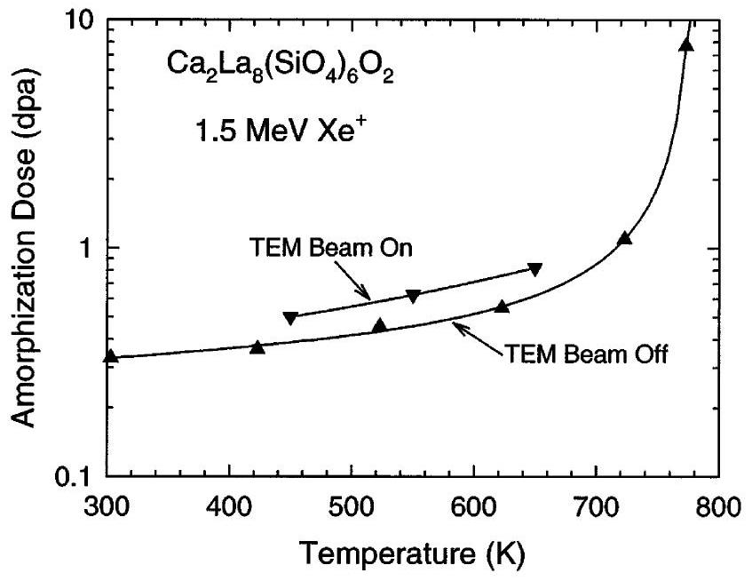
FIG. 7. Decreased rate of amorphization due to simultaneous irradiation with 300 keV electrons. ${ }^{225}$

both amorphization and microstructural evolution and will also provide valuable information on the relative efficiency of displacement damage produced by light and heavy ions. Finally, although ionization-induced diffusion generally improves radiation resistance by enhancing point defect recombination, it is also possible that the enhanced diffusion might lead to segregation of solute atoms and possible phase decomposition. With the exception of colloid formation, ${ }^{68,202-204}$ there has been relatively little attention given to radiation-induced solute segregation in ceramic materials.

## 3. Defect kinetics

The kinetics of defect accumulation and microstructural evolution under irradiation are controlled by the damage rate and rate of recovery processes associated with point defect migration. With the exception of some of the fluorite structures, such as $\mathrm{UO}_{2}{ }^{51-54}$ and $\mathrm{PuO}_{2},{ }^{52,226}$ studies of point defect annealing kinetics have not been carried out on relevant phases of interest. In $\mathrm{Ca}_{2} \mathrm{Nd}_{8}\left(\mathrm{SiO}_{4}\right)_{6} \mathrm{O}_{2}$ irradiated with $3 \mathrm{MeV} \mathrm{Ar}{ }^{+}$ions, ${ }^{179}$ the damaged crystalline state exhibited an exothermic defect recovery stage at $350^{\circ} \mathrm{C}$ with an activation energy of $1.3 \pm 0.1 \mathrm{eV}$; however, the nature of the defect or recovery process was not determined. Activation energies for defect migration in other relevant materials are unavailable. It is important to determine the migration paths in order to assess the effect of defect migration on recover processes. Simple defect kinetics (interstitial and vacancy recombination/migration kinetics) can be investigated by annealing studies of materials containing significant defect concentrations introduced by irradiation, as, for example, in previous studies of $\mathrm{UO}_{2},^{51,52} \mathrm{PuO}_{2},{ }^{52} \mathrm{CeO}_{2},{ }^{52} \mathrm{SrF}_{2},{ }^{227}$ and $\mathrm{BaF}_{2} .{ }^{227}$ The effects of defect kinetics on the amorphization process can be determined by annealing studies of partially amorphized materials.

## C. Volume changes

Radiation-induced volume changes in crystalline phases can result from the accumulation of point defects in the crystalline structure, solid-state phase transformations (e.g., amorphization), and the evolution of microstructural defects (e.g., gas bubbles, voids, dislocations, and microcracks). The macroscopic swelling is the overall sum of these effects. In general, the main concern with volume changes, particularly large differential changes, is that it may lead to high internal stresses that could cause microcracking, segregation, and increased dissolution rates. In addition, the large volume changes associated with amorphization significantly affect atomic bonding, local coordination, and the pathways for ion exchange, all of which can impact the release rates of radionuclides.

## 1. Unit-cell volume

In many crystalline ceramics, barriers to recombination and aggregation can lead to the accumulation of significant point defect concentrations. The accumulation of these point defects in the crystalline structure results in an increase in unit-cell volume with cumulative dose. The magnitude of the unit-cell volume expansion often is dependent on the irradiation species due to changes in the primary recoil-energy spectra, as illustrated in Fig. 8 for polycrystalline $\mathrm{Ca}_{2} \mathrm{Nd}_{8}\left(\mathrm{SiO}_{4}\right)_{6} \mathrm{O}_{2}$ under irradiation conditions ( $\alpha$-particles and $3 \mathrm{MeV} \mathrm{Ar}^{+}$) where amorphization does not occur ${ }^{179}$ and where it does ( ${ }^{244} \mathrm{Cm}$ decay). ${ }^{175}$ The higher displacement doses required for expansion under $3 \mathrm{MeV} \mathrm{Ar}^{+}$irradiation illustrates the decrease of the in-cascade survival of defects relative to $\alpha$-particle irradiation. For the case of Cm-decay, the in-cascade amorphization process results in excess interstitials (ejected from the cascade) in the crystalline matrix relative to $\alpha$-particle irradiation. Similar recoil spectra effects have also been observed for the stable structures $\mathrm{UO}_{2},{ }^{50,52} \mathrm{PuO}_{2},{ }^{52}$ and $\mathrm{BaAl}_{2} \mathrm{Ti}_{6} \mathrm{O}_{16} .{ }^{111}$ In general, the unit-cell volume expansion, $\Delta V_{u c} / V_{0}$, follows the characteristic exponential behavior predicted by models ${ }^{50,228}$ for the accumulation of isolated structural defects and is given by the expression:

$$
\Delta V_{u c} / V_{0}=A_{u c}\left[1-\exp \left(-B_{u c} D\right)\right],
$$

where $A_{u c}$ is the relative unit-cell volume expansion at saturation, $B_{u c}$ is the rate constant (per unit dose) for the simultaneous recombination of structural defects during irradiation, and $D$ is the dose. Unit-cell expansions due to $\alpha$-particle irradiation have been determined for a number of ceramics, including barium

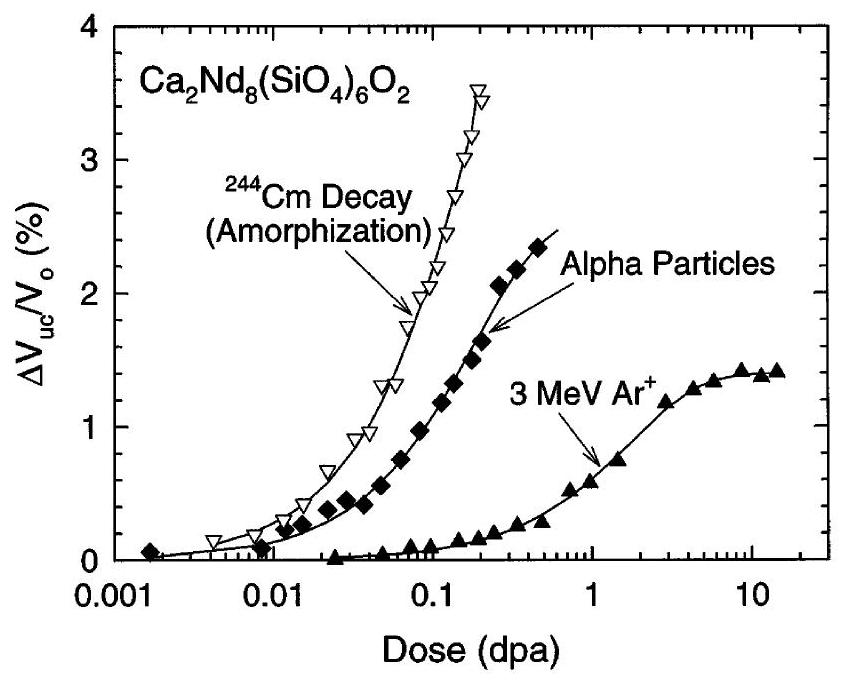
FIG. 8. Unit-cell volume expansion in polycrystalline $\mathrm{Ca}_{2} \mathrm{Nd}_{8}$ $\left(\mathrm{SiO}_{4}\right)_{6} \mathrm{O}_{2}$ due to ${ }^{244} \mathrm{Cm}$-decay, ${ }^{175}$ where amorphization occurs, and irradiated with $\alpha$-particles (emitted from a ${ }^{238} \mathrm{PuO}_{2}$ source) and $3 \mathrm{MeV} \mathrm{Ar}{ }^{+}$ions, ${ }^{179}$ where amorphization does not occur.

hollandite, ${ }^{111}$ a Synroc phase subject only to $\alpha$-particle (and $\beta / \gamma$ ) irradiation. As already noted above, $\alpha$-particle irradiation of barium hollandite results in a large unit-cell expansion (up to $2.5 \%$ ) and a displacive transformation from the tetragonal structure to a lower symmetry monoclinic structure. Unit-cell expansions due to $\alpha$-decay have also been determined for actinide dioxides, ${ }^{228,229}$ actinide-doped ceramics ${ }^{37}$ (e.g., zircon, ${ }^{155,156}$ apatite, ${ }^{162,163,175}$ pyrochlore, ${ }^{112,116}$ and zirconolite ${ }^{115,116}$ ), and natural minerals. ${ }^{27,37,160}$ Some of these unit-cell expansions due to $\alpha$-decay are summarized in Fig. 9. The unit-cell volume expansion per $\alpha$-decay event for Pu-doped zircon is much larger than for natural zircon (Fig. 9), which indicates that annealing of point defects in natural zircon occurs under geologic conditions, as previously suggested. ${ }^{155,156}$ Holland and Gottfried ${ }^{160}$ also noted evidence for defect annealing in natural zircons. In general, the unit-cell expansion is isotropic in cubic structures; while in noncubic structures, the unit-cell expansion is anisotropic and has been shown to be consistent with topological constraints on the changes in the polyhedral connectivity within the structure. ${ }^{179}$

## 2. Macroscopic swelling

The macroscopic swelling is usually determined experimentally by the relative change in macroscopic density, $\Delta \rho / \rho_{0}$. If the density changes are small, the swelling can be reasonably approximated as $-\Delta \rho / \rho_{0}$. However, in cases where the changes in density and corresponding swelling are large, as can occur in ceramics, the actual relationship between $\Delta V_{m} / V_{0}$ and $\Delta \rho / \rho_{0}$ that is given by the expression

$$
\Delta V_{m} / V_{0}=-\left(\Delta \rho / \rho_{0}\right) /\left(1+\Delta \rho / \rho_{0}\right)
$$

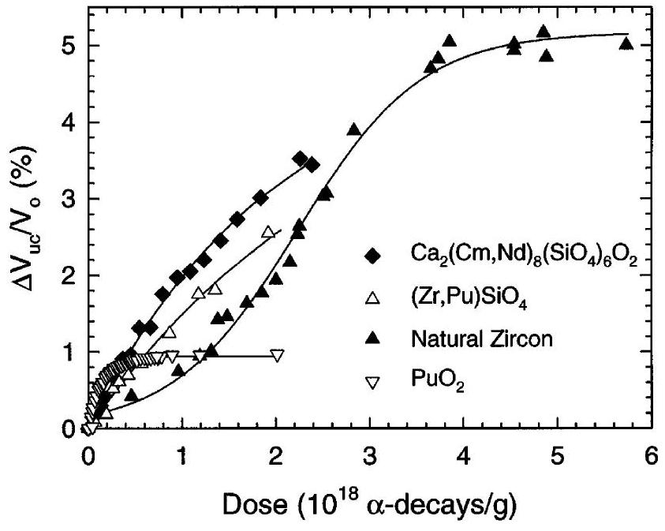
FIG. 9. Unit-cell volume expansions due to $\alpha$-decay in $\mathrm{Ca}_{2}$ $(\mathrm{Nd}, \mathrm{Cm})_{8}\left(\mathrm{SiO}_{4}\right)_{6} \mathrm{O}_{2},{ }^{162,163,175}(\mathrm{Zr}, \mathrm{Pu}) \mathrm{SiO}_{4},{ }^{155,156}$ natural zircon, ${ }^{160}$ and $\mathrm{PuO}_{2}{ }^{229}$

should be used. ${ }^{155,163}$
The available data on macroscopic swelling due to $\alpha$-decay in ceramics are extensive ${ }^{37}$ and include results from $\mathrm{Pu} / \mathrm{Cm}$-containing ceramics for doses up to $3 \times 10^{19} \alpha$-decays/g and from mineral analogues for much higher doses (up to $4 \times 10^{20} \alpha$-decays $/ \mathrm{g}$ ). The macroscopic swelling in these ceramics and minerals increases with dose and at saturation ranges from about $1 \%$ to nearly $20 \%$, as summarized in Fig. 10. In general, stable structures, such as the actinide dioxides, exhibit only about $1 \%$ swelling, while larger values of swelling are associated with radiation-induced amorphization. Saturation swelling values reported for some of the ceramic phases of interest are summarized in Table VI, which includes the value for neutron-irradiated quartz determined from reported density changes. ${ }^{230,231}$ These large volume expansions raise important questions: (i) what is the physical basis for the large volume change in ceramics (e.g., quartz and zircon) due to amorphization, and (ii) can the magnitude of the volume change be predicted or modeled, particularly as a function of temperature. Answers will require detailed structural analysis of the amorphous states of these ceramics and application of computer simulation methods, as discussed in Secs. V. E and VI. C, respectively.

If amorphization does not occur and there are no significant contributions to macroscopic swelling from extended defects, such as dislocation loops/networks, voids, bubbles, or microcracks, then the macroscopic swelling is dominated by the unit-cell expansion induced by the accumulation of point defects. In many of the relevant phases of interest, however, amorphization does occur, and the formation of helium bubbles at very high

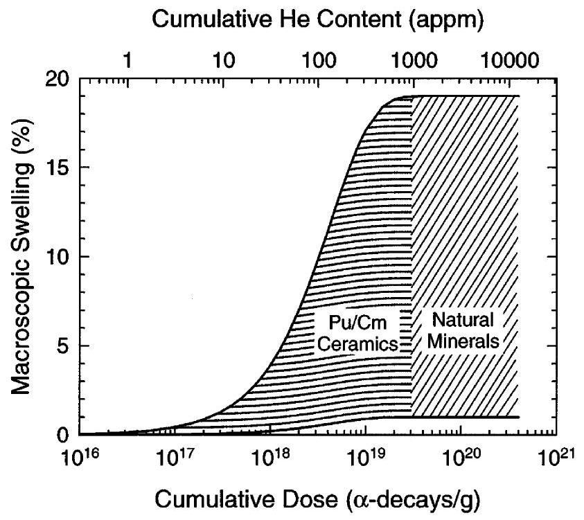
FIG. 10. Summary of extensive data ${ }^{37}$ on macroscopic swelling behavior in $\mathrm{Pu} / \mathrm{Cm}$-containing ceramics and natural minerals.

TABLE VI. Saturation macroscopic swelling observed in several ceramic phases.
| Phase | Swelling | References |
| :--- | :--- | :--- |
| $\mathrm{SiO}_{2}$ (quartz) | 17.5\% | 230, 231 |
| $\mathrm{ZrSiO}_{4}$ (natural) | 18.4 | 155, 160, 163 |
| $(\mathrm{Zr}, \mathrm{Pu}) \mathrm{SiO}_{4}$ | 16.6 | 155, 163 |
| $\mathrm{Ca}_{2} \mathrm{Nd}_{8}\left(\mathrm{SiO}_{4}\right) 6 \mathrm{O}_{2}$ | 9.4 | 163 |
| $\mathrm{CaPuTi}_{2} \mathrm{O}_{7}$ | 5.5 | 112,113 |
| $\mathrm{Ca}(\mathrm{Zr}, \mathrm{Pu}, \mathrm{Cm}) \mathrm{Ti}_{2} \mathrm{O}_{7}$ | 6.0-7.1 | 115, 116 |
| $(\mathrm{Gd}, \mathrm{Cm})_{2} \mathrm{Ti}_{2} \mathrm{O} 7$ | 5.1-6.5 | 116, 133 |
| $\mathrm{PuO}_{2}$ | 0.97 | 52, 228, 229 |

doses is possible. Under these conditions, the unit-cell expansions, amorphous regions, and extended defects all contribute to macroscopic swelling. Due to the composite nature of the radiation-induced microstructure, the total macroscopic swelling, $\Delta V_{m} / V_{0}$, in these materials can be expressed as:

$$
\Delta V_{m} / V_{0}=f_{c} \Delta V_{u c} / V_{0}+f_{a} \Delta V_{a} / V_{0}+F_{e x},
$$

where $f_{c}$ is the mass fraction of crystalline phase, $f_{a}$ is the mass fraction of amorphous phase, $\Delta V_{u c} / V_{0}$ is the unit-cell volume change of the crystalline phase, $\Delta V_{a} / V_{0}$ is the volume change associated with the amorphized state, and $F_{e x}$ is the volume fraction of extended microstructures (e.g., bubbles, voids, microcracks). In most studies of $\alpha$-decay effects, $F_{e x}$ is negligible, and Eq. (4) reduces to that proposed by Weber. ${ }^{163}$ As noted above, the unit-cell volume changes, $\Delta V_{u c} / V_{0}$, have been measured for a number of relevant materials. In most cases, it can be inferred ${ }^{163}$ that the volume change associated with amorphization, $\Delta V_{a} / V_{0}$, is constant for a given composition and structure (at any given temperature) and is equal to the saturation value of the macroscopic swelling for the amorphized structure (Table VI).

If $F_{e x}$ is negligible and the amorphous fraction $f_{a}$, is known, then $f_{c}=1-f_{a}$, and the total macroscopic swelling, $\Delta V_{m} / V_{0}$, can be calculated, as has been done for apatite, Pu-zircon, and natural zircon. ${ }^{163}$ The calculated total macroscopic swelling is shown in Fig. 11 for Pu-zircon, along with the experimental data for macroscopic swelling and the calculated crystalline, $f_{c} \Delta V_{u c} / V_{0}$, and amorphous, $f_{a} \Delta V_{a} / V_{0}$, components. The calculated macroscopic swelling, based on Eq. (4), provides an excellent fit to the experimental data, and the dominant contribution of the amorphization process to macroscopic swelling at high doses is clearly evident.

## 3. Temperature dependence

Of the candidate ceramic waste materials, the temperature dependence of volume changes accompanying $\alpha$-decay has been measured only in ${ }^{238} \mathrm{Pu}$-containing $\mathrm{CaPuTi}_{2} \mathrm{O}_{7}$ (pyrochlore structure). ${ }^{113,114}$ In this material, storage at ambient temperature (approximately 350 K ,

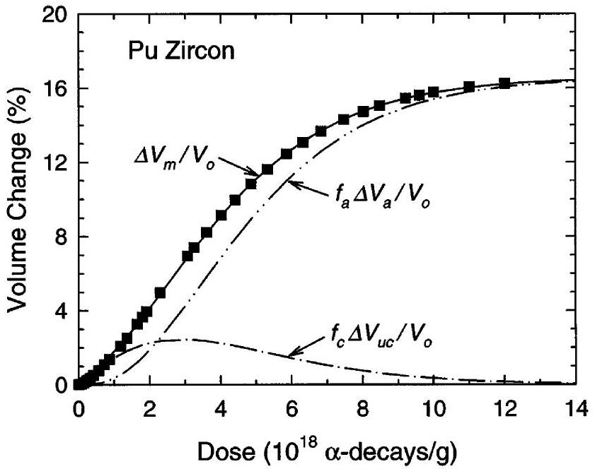
FIG. 11. Experimental data for macroscopic swelling in Pu-zircon, along with the calculated crystalline and amorphous components and the total swelling based on Eq. (4). ${ }^{84,163}$

due to self-heating) resulted in macroscopic swelling that saturated at a value of approximately $5.5 \mathrm{vol} \%$ after a cumulative dose of $\sim 5 \times 10^{18} \alpha$-decays $/ \mathrm{g}$ (for 200 days of storage time). Storage of this material at 575 K resulted in less swelling and required a longer time (300 days) to reach saturation due to the increased rate of simultaneous damage recovery. When this material was held at 875 K , swelling was minimal. The macroscopic saturation swelling as a function of temperature in this material is summarized in Fig. 12.

## D. Stored energy

The defects and structural changes introduced by radiation increase the energy of materials above the minimum energy configuration. Since these defects and

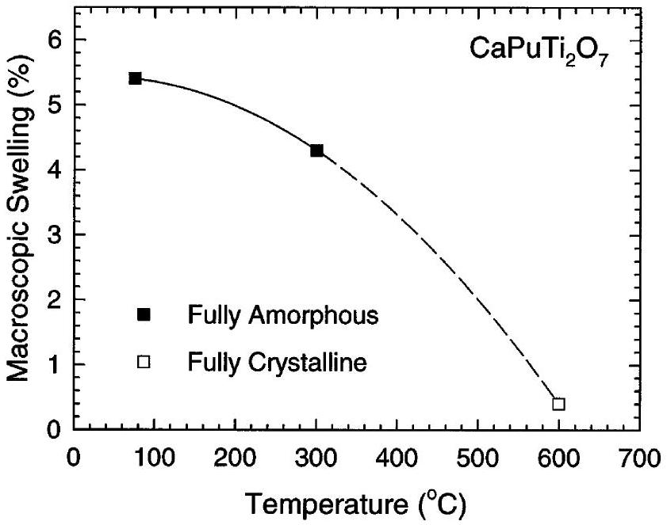
FIG. 12. Temperature dependence of macroscopic swelling at saturation in $\mathrm{CaPuTi}_{2} \mathrm{O}_{7}$. ${ }^{113,114}$

structural changes are metastable, radiation-damaged materials tend to react to reduce their energy content. If the amount of stored energy is large and rapidly released, significant temperature excursions may occur, as in the case of neutron-irradiated graphite ${ }^{232}$ where the stored energy can exceed $2400 \mathrm{~J} / \mathrm{g}$ and cause temperature increases of $1000^{\circ} \mathrm{C}$. Consequently, an important issue for waste forms is the amount of energy stored in the structure due to radiation damage. Temperature excursions due to the release of stored energy can affect the physical and chemical properties of ceramic waste phases. In addition, the stored energy provides an excellent measure of the relative damage accumulation and stability of the radiation-damaged state. In general, both the total stored energy due to accumulated radiation damage and the distribution of the stored energy release as a function of temperature are of interest. Measuring stored energy release is also useful in studying damage recovery, since prominent recovery processes produce peaks in the stored energy release spectrum.

Sources of stored energy in radiation-damaged ceramics are: (1) point defects in the crystal structure, (2) the significant atomic disorder associated with amorphization, and (3) the high strains from formation of amorphous domains. The maximum contribution from strain to the total stored energy has been estimated in the case of $\mathrm{CaPuTi}_{2} \mathrm{O}_{7}$ to be $18 \% .^{233}$ Although only limited data ${ }^{113,234,236}$ exist on the accumulation of stored energy as a function of dose in the ceramic phases of interest, it is generally observed that the stored energy increases with dose until the fully amorphous state is reached, as shown in Fig. 13 for natural zircons. ${ }^{236}$ The accumulated stored energy in zircon occurs much faster than the rate of amorphization, which suggests a significant contribution to the stored energy from defect accumulation in the crystalline structure. The
total stored energy released during recrystallization of the amorphous state has been measured for (i) actinidedoped apatite ${ }^{176}$ and zirconolite/pyrochlore ${ }^{116,234,235}$ phases; (ii) natural metamict zircon, ${ }^{236}$ zirconolite, ${ }^{237}$ and pyrochlores ${ }^{238}$; and (iii) ion-beam amorphized phases such as monazite. ${ }^{239}$ The total stored energy measured for each of these materials is summarized in Table VII. The stored energy released during recrystallization of the amorphous state occurs over a narrow temperature range in these materials, as shown in Fig. 14 for $\mathrm{Ca}_{2}(\mathrm{Nd}, \mathrm{Cm})_{8}\left(\mathrm{SiO}_{4}\right)_{6} \mathrm{O}_{2}$. ${ }^{176}$ The release of stored energy due to defect recovery in $\mathrm{Ca}_{2} \mathrm{Nd}_{8}\left(\mathrm{SiO}_{4}\right)_{6} \mathrm{O}_{2}$ occurs in a lower temperature peak. ${ }^{179}$ In most cases, the largest contribution to stored energy is associated with the atomic disorder of the amorphous state; however, comparable energy may be stored by the accumulated point defects in the crystalline structure.

In a study of $\mathrm{CaPuTi}_{2} \mathrm{O}_{7}$, differential scanning calorimetry measurements showed that the amount of stored energy released increased with increasing dose and peaked at $100 \mathrm{~J} / \mathrm{g}$ after a dose of $5.5 \times 10^{18} \alpha$-decays/g. ${ }^{234}$ Beyond this dose, the stored energy decreased exponentially to a value of $50 \mathrm{~J} / \mathrm{g}$ after a

TABLE VII. Total stored energy released in several ceramic phases during recrystallization of amorphous state.
| Material | Stored energy (J/g) | Reference |
| :--- | :--- | :--- |
| $\mathrm{Ca}_{2}(\mathrm{Nd}, \mathrm{Cm})_{8}\left(\mathrm{SiO}_{4}\right)_{6} \mathrm{O}_{2}$ | 130 | 176 |
| $\mathrm{Ca}(\mathrm{Zr}, \mathrm{Cm}) \mathrm{Ti}_{2} \mathrm{O}_{7}$ | 127 | 116 |
| $\mathrm{CaPuTi}_{2} \mathrm{O}_{7}$ | 100 | 234, 235 |
| $\mathrm{CePO}_{4}$ (ion-irradiated) | 31 | 239 |
| Natural $\mathrm{ZrSiO}_{4}$ | 318 | 236 |
| Natural $\mathrm{CaZrTi}_{2} \mathrm{O}_{7}$ | 48 | 237 |
| Natural pyrochlores | 125-210 | 238 |

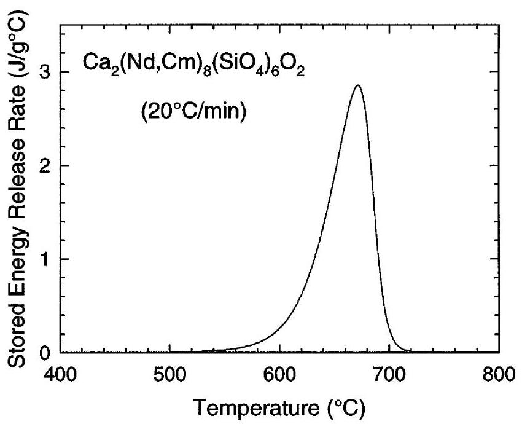
FIG. 14. Stored energy release in amorphized $\mathrm{Ca}_{2}(\mathrm{Nd}, \mathrm{Cm})_{8}$ $\left(\mathrm{SiO}_{4}\right)_{6} \mathrm{O}_{2}$ during heating at $20^{\circ} \mathrm{C} / \mathrm{min} .^{176}$

FIG. 13. Accumulation of stored energy in natural zircon. ${ }^{236}$
dose of $3.6 \times 10^{19} \alpha$-decays $/ \mathrm{g}$. These data suggest that continued self-radiation damage in this material beyond the dose for complete amorphization produces a damage state of lower energy. Based on these results, Coghlan and Clinard ${ }^{240}$ estimated that the local stored energy produced in a single (nonoverlapped) $\alpha$-recoil cascade is on the order of $200 \mathrm{~J} / \mathrm{g}$ in $\mathrm{CaPuTi}_{2} \mathrm{O}_{7}$. A peak in internal strain at intermediate doses is a common observation in irradiated ceramics. This effect may explain the lower stored energy ( $48 \mathrm{~J} / \mathrm{g}$ ) measured in natural zirconolites damaged to high doses ( $2 \times 10^{19} \alpha$-decays $/ \mathrm{g}$ ). ${ }^{237}$

## E. Amorphization

Self-radiation damage from $\alpha$-decay events and ion-irradiation damage results in a crystalline-toamorphous transformation in most of the crystalline ceramics of interest as actinide-host phases (Table V). Only the fluorite-related structures ( $\mathrm{ZrO}_{2}, \mathrm{PuO}_{2}$ and $\mathrm{UO}_{2}$ ) appear to be not susceptible to radiation-induced amorphization (at least for temperatures above 20 K for $\mathrm{ZrO}_{2}$ and 5 K for $\mathrm{UO}_{2}$ ); however, they may be susceptible to polygonization. ${ }^{241}$ Although susceptible to ion-irradiation-induced amorphization, ${ }^{86,88}$ natural monazite ${ }^{88,165,187,188}$ and apatite ${ }^{173,174}$ minerals are generally found in highly crystalline states despite experiencing high $\alpha$-decay event doses, which suggests that for these two minerals the rate of damage recovery may exceed the damage-production rate in the geologic environment. This is consistent with the low critical temperatures for ion-beam-induced amorphization ${ }^{86,88,89,189}$ and low temperatures for thermal recrystallization ${ }^{180,190,239}$ measured for these phases. Silicate apatites, zircon, zirconolite, pyrochlores, and perovskite have all been shown to be susceptible to $\alpha$-decay induced amorphization. Although the exact nature of the amorphization process is not well defined for most of these phases, amorphization appears to occur heterogeneously in these phases by several possible mechanisms: (i) directly in the $\alpha$-recoil displacement cascade, (ii) from the local accumulation of high defect concentrations due to the overlap of $\alpha$-recoil cascades, or (iii) by composite or collective phenomena involving more than one process. This radiation-induced amorphization leads to decreases in atomic density and changes in local and long-range structure, which can have a profound effect on the performance and properties of the materials. In general, amorphization in these ceramic phases is more difficult with increasing temperature and occurs only below a critical temperature; the amorphized state, once formed, is stable under further irradiation. In this section, the current state of knowledge regarding amorphization of ceramic phases, structure of the amorphous state, amorphization processes, and amorphization kinetics are
reviewed, and fundamental scientific issues regarding amorphization are identified.

## 1. Structure of the amorphous state

Radiation-induced amorphization of crystalline compounds leads to aperiodic structures with large changes in volume. In the geological literature, such aperiodic structures, which form in (U, Th)-containing minerals as a result of $\alpha$-decay, are referred to as metamict. ${ }^{242-244}$ These radiation-induced amorphous states lack both orientational and long-range translational correlations and are, therefore, more properly referred to as topologically disordered; however, in this paper, the simpler term amorphous is used synonymously with topologically disordered.

Although various techniques have been used to elicit structural information, a coherent overall description of such amorphous structures, integrating the individual pieces of information available, has yet to emerge. Consequently, the large volume changes associated with amorphization cannot be explained quantitatively. It is possible, however, to obtain information on structure from a variety of techniques, including (i) highresolution electron microscopy and the allied technique of spatially resolved energy-loss spectroscopy; (ii) x-ray absorption spectroscopies (XAS); (iii) x-ray, electron, and neutron diffraction; (iv) measurement of changes in macroscopic parameters such as density and elastic moduli; (v) vibrational spectroscopies, such as FTIR and Raman methods; and (vi) liquid-phase chromatography. It is important to stress, however, that for each phase there may be no unique amorphous structure; the final atomic structure will be dependent on initial structure and chemistry, temperature, and irradiation parameters (e.g., dose rate and ion mass/energy). Computer simulation techniques, as described in Sec. VI.C, can be powerful tools in modeling the amorphous structures and interpreting experimental structure data.

There have been few studies of the structure of the amorphous state in these ceramic phases. Based on XAS studies of partially and fully metamict minerals, ${ }^{27,245}$ fully metamict zirconolite, ${ }^{237,246,247}$ and fully amorphized $\mathrm{CaPuTi}_{2} \mathrm{O}_{7},{ }^{248}$ a reasonable model of the structure of the amorphous state is one that entails ${ }^{37}$ (i) a slight distortion of the nearest-neighbor coordination polyhedra; (ii) a decrease in the coordination number and bond length in the primary coordination polyhedra; (iii) a slight increase in the mean second nearest neighbor distances; and (iv) a loss of second-nearest-neighbor periodicity, probably due to the rotation of coordination polyhedra across shared corners and shared-edges. Recent results indicate that in metamict zirconolite $\mathrm{Ti}^{4+}$ is predominantly fivefold-coordinated, ${ }^{247}$ as compared to mainly 6-coordinated in highly crystalline zirconolite. It has also
been reported ${ }^{183}$ that amorphization in natural sphenes is accompanied by the reduction of $\mathrm{Fe}^{3+}$ to $\mathrm{Fe}^{2+}$. Valence changes of this type can have significant effects on the solubility of radionuclides in the aperiodic structure.

## 2. Susceptibility of amorphization

Several models ${ }^{64,252,249,250}$ describe amorphization susceptibility in ceramics and may be useful for comparing different ceramics. As already noted, however, all the ceramic nuclear waste phases of interest, with the exception of the fluorite structures, are susceptible to irradiation-induced amorphization. Most models of susceptibility to amorphization ignore kinetics and are, therefore, only applicable at very low temperatures where point defects are immobile; also some models are best suited for electron irradiation conditions (i.e., simple point defect generation without complications associated with cascade quenching). Some of the principles of material susceptibility to amorphization are discussed below. The more important aspects of amorphization processes and kinetics, which control the rate and temperature range of amorphization, are discussed in the following sections.

Different crystalline structures exhibit a range of susceptibility to amorphization. The variation in susceptibility can be explained, at least in broad outline, by structural connectivity, which is a measure of the topological freedom ${ }^{251,252}$ available to each structure, and the corresponding redundancy of structural constraints that must be destroyed upon amorphization. Structures such as MgO , comprising edge-sharing octahedra, are seriously overconstrained and difficult to amorphize, although they may polygonize. ${ }^{253}$ Cornerconnected tetrahedral structures, however, like $\mathrm{SiO}_{2}$, silicates, and phosphates are only marginally constrained and amorphize easily. One pertinent observation is that complex oxide structures that amorphize easily are also more difficult to recrystallize and hence exhibit a higher critical temperature for amorphization. ${ }^{254}$ Another observation is the apparent anomaly of SiC , which amorphizes almost as readily as $\mathrm{SiO}_{2}$ (two [ $\mathrm{SiO}_{4}$ ] tetrahedra per vertex) yet is considerably more highly connected (four [ $\mathrm{SiC}_{4}$ ] tetrahedra connected at each vertex) than even $\mathrm{Si}_{3} \mathrm{~N}_{4}$ (three $\left[\mathrm{SiN}_{4}\right]$ tetrahedra per vertex), which is almost unamorphizable. One explanation is that antisite disorder, which is more possible with SiC than with $\mathrm{Si}_{3} \mathrm{~N}_{4}$, is required for amorphization of SiC ; randomization of site populations renders $\beta-$ SiC topologically equivalent to Si , which has the same structural freedom as $\mathrm{SiO}_{2}$ and amorphizes with equivalent ease. There is evidence for the existence of antisite defects in $\mathrm{SiC}^{255}$ and for radiation-induced antisite disorder from molecular dynamics simulations, ${ }^{256,257}$ which suggest that antisite defects may be the most common defect
produced in the cascade; such antisite disorder has been implicated in electron irradiation-induced amorphization of SiC. ${ }^{258-261}$ Short-range chemical disorder may also play a role in amorphization of ionic crystalline phases with otherwise ordered multiple cations. ${ }^{143,262,263}$ In addition, compositional changes within a given structure type can affect the susceptibility to amorphization. ${ }^{189}$

Amorphization of ceramic phases induced by energetic heavy-ion irradiation can also be compared to the process of glass formation. ${ }^{264,265}$ The main mechanism of radiation-induced amorphization is proposed to be fast quenching of a "molten" cascade. The cascade is visualized as a thermal spike, in which atoms are highly mobile. The susceptibility of a phase to irradiationinduced amorphization is then inversely related to the crystallization tendency during the cooling of the molten cascade. In an irradiation study of the phases in the $\mathrm{MgO}-\mathrm{Al}_{2} \mathrm{O}_{3}-\mathrm{SiO}_{2}$ system, ${ }^{266}$ the activation energy of annealing during irradiation was correlated to the activation energy of viscous flow. Both activation energies showed the same trend in response to systematic changes in chemical composition. The viscosity of the melt at the liquidus temperature is inversely related to the susceptibility to amorphization. These correlations suggest a parallel between ion irradiation-induced amorphization and the glass formation process. ${ }^{266-268}$

In order to describe the tendency of a melt to crystallize, Wang et al. ${ }^{269}$ have proposed an empirical parameter, $S$, which allows an evaluation of the susceptibility of a melt to glass formation and a ceramic to irradiation-induced amorphization. The calculated $S$ parameter gives a good relative ranking of the susceptibility to radiation-induced amorphization of phases in the $\mathrm{MgO}-\mathrm{Al}_{2} \mathrm{O}_{3}-\mathrm{SiO}_{2}$ system. This parameter has also been successfully applied to the description of radiationinduced amorphization in other complex ceramics, such as monazite-structure types, zircon-structure types, perovskites, calcium aluminates, and micas.

## 3. Amorphization processes

Four different types of amorphous accumulation behavior have been observed in materials that are susceptible to amorphization: (i) progressive (homogeneous) amorphization due to point defect accumulation (e.g., quartz, ${ }^{206}$ coesite, ${ }^{270}$ silicon carbide, ${ }^{271,272}$ intermetallics ${ }^{273,274}$ ), (ii) interface-controlled amorphization (e.g., intermetallics ${ }^{275}$ and ceramics ${ }^{276}$ ), (iii) cascade-overlap (heterogeneous) amorphization (e.g., zircon ${ }^{84,155,162,163}$ ), and (iv) in-cascade (heterogeneous) amorphization (e.g., apatite ${ }^{162,163}$ ). These different amorphization processes are illustrated schematically in Fig. 15. Curve "A" represents amorphization that occurs nearly spontaneously after a critical concentration of defects has accumulated. The linear dependence

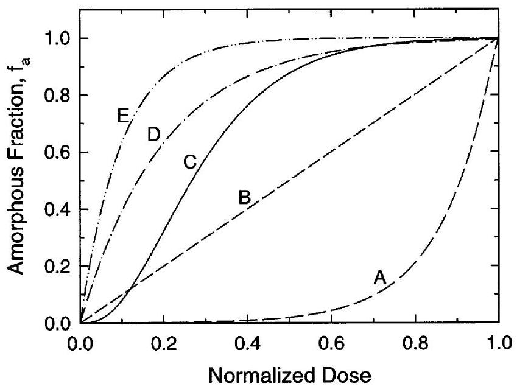
FIG. 15. Amorphous fraction as a function of dose for several processes: (A) defect accumulation, (B) interface control, (C) cascade overlap, (D) direct impact, and (E) direct impact, with cascade twice as large as in (D).

of the amorphous fraction on dose illustrated by curve "B" indicates an interface-controlled process, as in amorphization induced by ballistic mixing in intermetallics. ${ }^{275,277}$ When amorphization occurs by cascade overlap, then a curve of type " C " is obtained. ${ }^{278}$ The curvature near the end of the irradiation time is caused by the decreasing probability of cascade impact on the remanent crystalline regions, ${ }^{279}$ and the curvature at the beginning is caused by the necessity to create damaged zones so that cascade superposition becomes more probable. The curves "D" and "E" represent the cases of direct impact amorphization in a cascade for different cascade sizes. Therefore, if the crystalline or amorphous fraction can be determined experimentally as a function of cumulative dose for different types of irradiation (e.g., by careful measure of the intensity of diffracted electrons or x-rays), then it may be possible to discern the amorphization mechanism.

For amorphization directly in a displacement cascade, the rapid quenching of a melt-like region may lead to the amorphous state. For cascade overlap and defect accumulation processes, a critical damage level may be necessary to trigger amorphization, heterogeneously or homogeneously. If the difference in free energy between the crystal and the amorphous state is associated with a critical level of damage, then the change in free energy determines phase stability, ${ }^{273,280,281}$ and amorphization occurs when

$$
\Delta G_{\mathrm{irr}}>\Delta G_{\mathrm{ca}},
$$

where $\Delta G_{\mathrm{ca}}$ is the difference in free energy between the crystalline and amorphous phases and $\Delta G_{\text {irr }}$ is the difference in free energy (local or global) between the irradiated and unirradiated solid due to all the possible
mechanisms of energy storage in the solid (e.g., point defects, chemical disorder, defect clusters). Another criterion for the critical damage level is the modified Lindemann criterion, ${ }^{282}$ which states that amorphization occurs when

$$
\left\langle x^{2}\right\rangle>\left\langle x^{2}\right\rangle_{\mathrm{crit}},
$$

where $\left\langle x^{2}\right\rangle$ is the mean square static displacement of the atoms in the solid from their equilibrium lattice positions and $\left\langle x^{2}\right\rangle_{\text {crit }}$ is the critical mean square displacement at melting. According to this model, amorphization can be seen as solid-state melting, in which a high defect concentration softens the lattice and reduces the melting temperature. The advantage of this approach is that it reduces the different damage contributions (e.g., point defects, chemical disorder) to a single parameter. Molecular dynamics simulations of intermetallics show that amorphization always occurs at a fixed value of $\left\langle x^{2}\right\rangle$, whether the origin of the increase in meansquare displacements is point defects, antisite defects, or thermal motion. ${ }^{275}$ This type of behavior has been observed experimentally in coesite. ${ }^{270}$ For amorphization processes where a critical damage level must be reached, the accumulation of damage and defect concentrations can be modeled by rate theory, ${ }^{214,215}$ as discussed above (Sec. V. B. 1).

Homogeneous amorphization is an important process for intermetallics and some ceramics; however, in nearly all the ceramics of interest as actinide host phases, amorphization due to $\alpha$-decay and heavy-ion irradiation is known to occur heterogeneously. This has been confirmed in apatite, zircon, pyrochlore, and zirconolite structure types by electron microscopy and diffraction studies that characterized the amorphization process as a function of increasing dose in actinide-containing ceramics of interest, ${ }^{36,113-116,133,178}$ in their mineral analogues, ${ }^{84,140,161}$ and under heavyion irradiation. ${ }^{84-87,254}$ The heterogeneous nature of the amorphization process in these phases is illustrated in the high-resolution electron microscopy (HREM) images in Fig. 16 for ion-irradiated apatite. ${ }^{86}$ In general, the amorphization process due to $\alpha$-decay in these materials can be described as follows: (i) at low dose levels ( $<10^{18} \alpha$-decays $/ \mathrm{g}$ ), the materials generally exhibit a strongly crystalline electron diffraction pattern, clearly resolvable individual damaged regions (observable by their strain contrast), and nearly perfect lattice images under higher resolution; (ii) at increasing dose levels ( $>1 \times 10^{18} \alpha$-decays $/ \mathrm{g}$ ), the density of damaged regions increases to the point that individual regions are no longer readily distinguished, a radial ring of diffuse intensity associated with the presence of amorphous material is observed in the electron diffraction pattern, and amorphous domains that exhibit mottled contrast are clearly observable in high-resolution images; and

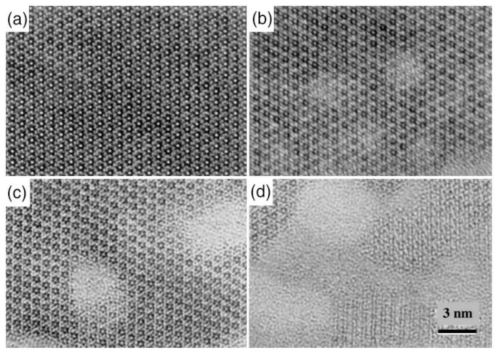
FIG. 16. HREM images of $\mathrm{Ca}_{2} \mathrm{La}_{8}\left(\mathrm{SiO}_{4}\right)_{6} \mathrm{O}_{2}$ irradiated with $1.5 \mathrm{MeV} \mathrm{Kr}^{+}$ions: (a) unirradiated, (b) 0.03 dpa , (c) 0.06 dpa , and (d) $0.24 \mathrm{dpa} .^{86}$

(iii) at higher doses (on the order of 5 to $10 \times 10^{18} \alpha$-decays $/ \mathrm{g}$, depending on the phase), the material becomes fully amorphous with no evidence of any residual crystallinity in the electron diffraction patterns.

Although amorphization occurs predominantly by heterogeneous processes in these ceramic phases, the dominant process (direct-in-cascade or overlap) has not been identified, except in two cases. In ${ }^{244} \mathrm{Cm}$-doped $\mathrm{Ca}_{2}(\mathrm{Nd})_{8}\left(\mathrm{SiO}_{4}\right)_{6} \mathrm{O}_{2},^{162,163}$ it has been shown that amorphization primarily occurs directly in the cascades of the recoil nuclei emitted during $\alpha$-decay of Cm . For this material, the increase in amorphous fraction, $f_{a}$, with dose, $D$, generally follows the direct impact model ${ }^{278}$ for amorphization that is given by the following expression:

$$
f_{a}=1-\exp \left(-B_{a} D\right),
$$

where $B_{a}$ is the amount of amorphous material produced per $\alpha$-recoil and $D$ is the dose. The change in amorphous fraction with dose for $\mathrm{Ca}_{2} \mathrm{Nd}_{8}\left(\mathrm{SiO}_{4}\right)_{6} \mathrm{O}_{2}$ is shown in Fig. 17. At the higher doses, $f_{a}$ for $\mathrm{Ca}_{2} \mathrm{Nd}_{8}\left(\mathrm{SiO}_{4}\right)_{6} \mathrm{O}_{2}$ deviates somewhat from the behavior predicted by the direct impact model, suggesting that additional mechanisms (e.g., defect accumulation processes, cascade overlap processes, strain-induced amorphization, and/or instability of crystalline "islands" below a critical size) may be contributing in a collective manner to the overall amorphization process. Amorphization in Pu-doped and natural zircons has been shown ${ }^{84,155,161-163}$ to be consistent with the double cascade-overlap model for amorphization, ${ }^{278}$ which is given by the expression:

$$
f_{a}=1-\left[\left(1+B_{d} D+B_{d}{ }^{2} D^{2} / 2\right) \exp \left(-B_{d} D\right)\right],
$$

where $B_{d}$ is the amount of material damaged per $\alpha$-recoil. The amorphous fractions for Pu-doped and natural zircons (Fig. 17) exhibit very similar behaviors as functions of cumulative displacement dose, except for an offset at low dose in natural zircons due to defect recovery processes over geologic time. ${ }^{155,163}$

The above results and models represent idealizations of the amorphization process as caused by single mechanisms, without any consideration for temperature and annealing effects. Under actual irradiation conditions, there may be a mixture of different processes causing amorphization, such as a combination of direct-impact, cascade-overlap, and defect accumulation processes.

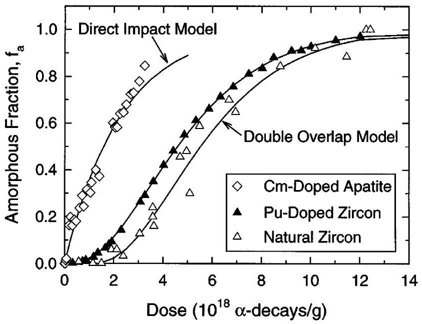
FIG. 17. Amorphous fraction as a function of dose $\mathrm{Ca}_{2}(\mathrm{Nd}, \mathrm{Cm})_{8}$ $\left(\mathrm{SiO}_{4}\right)_{6} \mathrm{O}_{2},(\mathrm{Zr}, \mathrm{Pu}) \mathrm{SiO}_{4}$, and natural zircon. ${ }^{163}$

There are also the influences of temperature and annealing, which can affect the amorphization processes and relative kinetics in a complex manner. Consequently, the dominant amorphization process may change with temperature. The effects of temperature and annealing on amorphization processes are discussed in the next section.

## 4. Amorphization kinetics

During irradiation, the production of radiation damage is mitigated by simultaneous damage recovery processes, and the rate of damage evolution (e.g., amorphization) will depend on the relative magnitude of these two processes under the irradiation conditions at any given time. For irradiation-induced amorphization, these recovery processes may be associated with point defect migration and annealing in the crystalline state, defect and ion migration in the amorphous state, or epitaxial recrystallization at the crystalline/amorphous boundaries. Obviously, if the rate of amorphization is less than the rate of the recovery processes, amorphization cannot proceed. Since most available data on amorphization kinetics in relevant ceramics have been obtained using greatly accelerated ion-irradiation techniques, an important goal of understanding amorphization kinetics for nuclear waste ceramics is to be able to predict whether or not amorphization will occur under the actual radiation conditions (damage rate and temperature) expected in a geologic repository, and if amorphization occurs, what the rate of amorphization will be under the repository conditions. Such understanding can be gained only through detailed studies of the dependence of amorphization on time, temperature, dose rate, and ion mass/energy.
a. Summary of available data. There have been only limited studies on the kinetics of amorphization in ceramic nuclear waste phases. As noted above, amorphization in natural zircons has been observed to occur at slightly higher doses than those measured for Pucontaining and ion-irradiated zircons. ${ }^{84}$ This behavior has been determined to be due to defect recovery processes over geologic time. ${ }^{155,163}$ Similar recovery behavior over geologic time periods is postulated for natural zirconolite, since the dose required for complete amorphization in natural zirconolite is six times higher than that measured for both actinide-doped and ion-irradiated zirconolites. ${ }^{283}$

The detailed temperature dependence of $\alpha$-decayinduced amorphization has not been studied in any materials; however, there is some limited information available from a study of the temperature dependence of $\alpha$-decay damage in $\mathrm{CaPuTi}_{2} \mathrm{O}_{7} .^{113,114}$ In this study, the critical dose for complete amorphization is apparently slightly higher at 575 K than at 350 K , and at a
temperature of 875 K , no loss of crystallinity is evident even at $1 \times 10^{19} \alpha$-decays $/ \mathrm{g}$. Consequently, at the dose rate in this material ( $10^{-9} \mathrm{dpa} / \mathrm{s}$ ), the critical temperature above which amorphization does not occur is between 575 and 875 K .

More recently, ion irradiation has been used to study the temperature dependence of amorphization in a number of relevant crystalline phases, ${ }^{84-89}$ as illustrated in Fig. 18 for several phases and in Fig. 19 for different compositions within the same zircon structure type. ${ }^{88,164,189}$ A detailed study ${ }^{84}$ of radiation-induced amorphization in zircon at room temperature showed that the amorphization dose for heavy-ion irradiation ( $10^{-4}$ to $10^{-3} \mathrm{dpa} / \mathrm{s}$ ) is nearly identical to that from $\alpha$-decay in ${ }^{238} \mathrm{Pu}$-doped zircon ( $3 \times 10^{-9} \mathrm{dpa} / \mathrm{s}$ ). Thus, at 300 K , the amorphization process in zircon is nearly

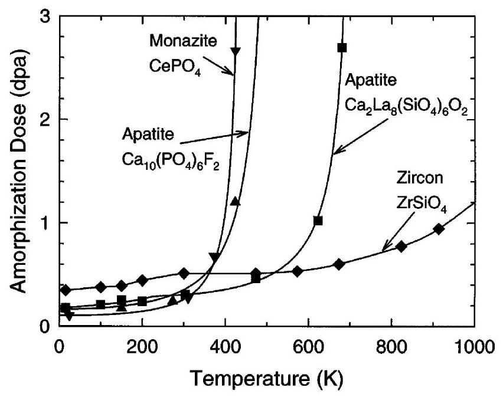
FIG. 18. The temperature dependence of amorphization in several potential actinide host phases under $1.5 \mathrm{MeV} \mathrm{Kr}^{+}$irradiation. ${ }^{84-86,89}$

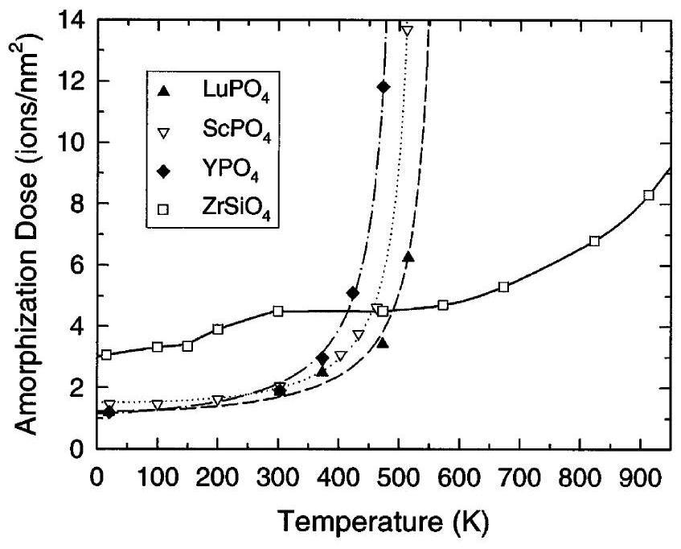
FIG. 19. The temperature dependence of amorphization in the zircon structure type. $88,164,189$

independent of the damage source and damage rate, and high-resolution electron microscopy results ${ }^{84}$ confirm that the damage ingrowth processes for ion-irradiated and natural zircons are similar. Since amorphization of zircon does not exhibit a significant dependence on temperature (i.e., mobile defects) at 300 K , ${ }^{84}$ these results are consistent with rate theory models that predict no dose-rate dependence at temperatures where defects are immobile. In apatite, ${ }^{85}$ the critical dose at 300 K for amorphization from heavy ions ( $5 \times 10^{-4} \mathrm{dpa} / \mathrm{s}$ ) is slightly higher (40\%) than that measured due to ${ }^{244} \mathrm{Cm}$ decay ( $3 \times 10^{-9} \mathrm{dpa} / \mathrm{s}$ ); this behavior, however, may be due to the effects of irradiation spectrum rather than dose-rate effects. At elevated temperatures, the effects of dose rate in both zircon and apatite are expected to be more pronounced.

There have been several studies of the influence of ion species on amorphization in ceramics. ${ }^{85,271,272,284-286}$ In general, heavy ions increase the temperature range over which amorphization is possible relative to electron (or very light ion) irradiation. In the case of $\mathrm{Ca}_{2} \mathrm{La}_{8}\left(\mathrm{SiO}_{4}\right)_{6} \mathrm{O}_{2}{ }^{85}$ (Fig. 20) and SiC, ${ }^{271,272,284}$ the difference in critical temperature due to particle mass/energy can amount to several hundred ${ }^{\circ} \mathrm{C}$. This may be due to differences in the distributions and types of defects formed and an ionization effect due to differences in the ratios of the electronic to nuclear stopping powers. As noted above (Fig. 6), simultaneous irradiation of $\mathrm{Ca}_{2} \mathrm{La}_{8}\left(\mathrm{SiO}_{4}\right)_{6} \mathrm{O}_{2}$ with 300 keV electrons during $1.5 \mathrm{MeV} \mathrm{Xe}^{+}$irradiation significantly suppresses the rate of amorphization as compared to irradiation with $\mathrm{Xe}^{+}$alone. ${ }^{225}$
b. Existing models. Several models have been used to describe the temperature dependence of ion-beaminduced amorphization in ceramics and semiconduc-

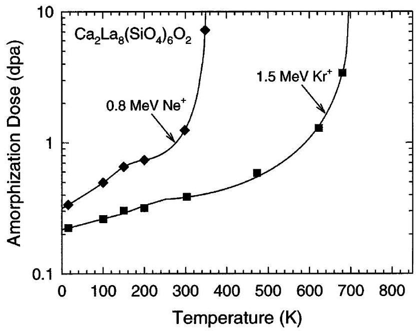
FIG. 20. Temperature dependence of amorphization in ion-irradiated $\mathrm{Ca}_{2} \mathrm{La}_{8}\left(\mathrm{SiO}_{4}\right)_{6} \mathrm{O}_{2} .{ }^{85}$

tors. ${ }^{84,85,287-289}$ In general, the effects of temperature on amorphization can be described by simultaneous recovery processes with activation energies, $E_{a}$, associated with defect migration/recombination in the crystal structure, defect and ion diffusion in the amorphous state, or epitaxial recrystallization at the crystalline/amorphous interface. In many of the existing models, rather simple relationships are derived between temperature and the dose required for complete amorphization. These relationships are generally given by an expression of the form:

$$
\ln \left[1-\left(D_{0} / D\right)^{1 / m}\right]=C-E_{a} / n k T
$$

where $D_{0}$ is the dose for complete amorphization at $0 \mathrm{~K}, C$ is a constant dependent on ion flux and cascade size, and both $m$ and $n$ are model dependent constants [Morehead and Crowder ${ }^{287}$ derived $m=2$ (or 3) and $n=2$, Dennis and Hale ${ }^{288}$ derived $m=2$ and $n=1$, and Weber ${ }^{84,85}$ derived $m=1$ and $n=1$ ]. Although these models have been adequate in describing the observed temperature dependence of amorphization in both semiconductors and ceramics, it is recognized that the kinetic processes controlling amorphization may be more complex than the single activated process that these models represent.

Recently, the approach of single defect kinetics has been used to modify the direct impact and double overlap models for amorphization [Eqs. (7) and (8)] of apatite and zircon, respectively. ${ }^{164}$ Using activation energies and other parameters from the literature, these modified kinetic expressions have been used to model the time, temperature, and dose rate of amorphization in both apatite and zircon under expected repository conditions. Although these are relatively simple models that certainly require further refinement (if data are ever available), they predict that zircon will amorphize under conditions typical of a near-surface repository, such as Yucca Mountain, while apatite will remain crystalline due to the kinetics of the recovery processes.

In the field of irradiation-induced amorphization in intermetallic compounds, where amorphization occurs homogeneously by the accumulation of defects, other models have been used to describe amorphization kinetics. ${ }^{273,281,290}$ Although such homogeneous amorphization is not generally observed in the ceramic phases of interest for nuclear waste immobilization, these intermetallic approaches may be applicable, with some modifications, to the heterogeneous amorphization processes that have been observed in most of these ceramics. For example, using rate theory, ${ }^{214,215}$ the concentration of accumulated defects can be calculated as a function of dose rate, time, and temperature, and the corresponding change in free energy (or static displacement) determined. Such an approach could be used
to model the amorphization kinetics. In order to apply such models, however, it will be necessary to determine experimentally the critical values $\Delta G_{\mathrm{ca}}$ or $\left\langle x^{2}\right\rangle_{\text {crit }}$ for the relevant ceramics. It will also be necessary to generate reliable experimental data on amorphization kinetics as functions of different ion species and dose rates.
c. Modeling considerations. Comprehensive models of amorphization kinetics are clearly needed and should take into account damage rate, PKA spectrum, incascade amorphization, and ionization-induced diffusion. The standard approach to modeling evolutionary changes in microstructure controlled by defect kinetics, such as some amorphization processes, is to use rate theory. The creation of vacancies and interstitials that can migrate through the lattice and either recombine or be absorbed at defect sinks, including amorphous domains, provides the driving force controlling the kinetics of amorphization. As noted, the application of rate theory to ceramics is in itself a formidable task, and the results obtained for one structure type will not necessarily be valid for others because of the different topological properties. It is nevertheless necessary to solve the equations to predict amorphization kinetics, as has been done for a few cases in intermetallics ${ }^{273,281,290}$ and anisotropic materials. ${ }^{291}$ The use of kinetic Monte Carlo techniques also has potential applications in this area; however, it will be necessary to obtain reliable values of the defect properties from theory, computer simulations, or experimental methods.

Other approaches may be required in the case of heterogeneous amorphization. In the case of amorphization directly in the $\alpha$-recoil displacement cascade, the recovery processes may be associated with epitaxial recrystallization at the crystalline-amorphous interface of the amorphous domains and less dependent on the migration enthalpies of interstitials and vacancies. For such epitaxial recovery processes, there will in general be no unique activation energy, as it will depend on the size of the amorphous domain. Since heterogeneous amorphization is apparently the dominant mechanism induced by $\alpha$-decay in nuclear waste ceramics, there is a great need for additional studies in this area.

Ionization-induced diffusion ${ }^{67,69,91,92}$ might inhibit amorphization for both the homogeneous (point defect accumulation) and heterogeneous (in-cascade) cases, since both defect and recrystallization kinetics would be enhanced. The effect of ionization-induced diffusion would be expected to be more pronounced for the homogeneous amorphization process, since large changes in the interstitial migration enthalpies may occur (including possibly athermal interstitial migration). Data for several oxides ${ }^{189,225}$ suggest that ionization-induced diffusion can retard or inhibit amorphization under high-doserate electron and ion irradiation conditions where the electronic to nuclear stopping power ratios are large.

However, ionization-induced diffusion may be less effective in retarding amorphization from $\alpha$-recoil nuclei under repository conditions, where both the electronic to nuclear stopping power ratios and the dose rates are significantly smaller. Consequently, the effects of dose rate on ionization-induced diffusion processes and kinetics must be investigated in order to interpret ionirradiation data and predict behavior under repository conditions.

Many crystalline ceramics exist in a narrow range of stoichiometry, since any departure from exact stoichiometry has to be accommodated by interstitials, vacancies, or antisite defects at great energy cost. Thus, it is important to understand the influence of departures from stoichiometry (caused, for example, by the recoilinduced transfer of atoms from the crystalline phase into the glassy phase in glass-ceramics or by transmutation) on the amorphization susceptibility. In addition, the presence of extended defects, such as dislocations, stacking faults and antiphase boundaries, have been shown to facilitate amorphization in some materials. Preferential grain-boundary amorphization under electron irradiation has been observed in quartz ${ }^{292}$ and recently observed in spinel and coesite. ${ }^{293}$ It is particularly important to understand the amorphization susceptibility in grain boundaries, as leaching often occurs preferentially at those sites.

## 5. Recrystallization

a. Epitaxial recrystallization. Solid-state epitaxial recrystallization at the crystalline/amorphous interface in many of these ceramic phases could control the kinetics of the amorphization process. Annealing of ion-beamamorphized layers, such as has been studied in the perovskite phases, $\mathrm{CaTiO}_{3}{ }^{148,149}$ and $\mathrm{SrTiO}_{3},^{150,151}$ can provide activation energies for solid-state epitaxial recrystallization at an effectively semi-infinite interface. Similar studies have not been performed for other relevant phases, but such studies would provide an upper limit to the activation energy for annealing discrete amorphous zones in each phase. Fission track annealing in natural minerals and reactor-irradiated phases or the annealing of tracks produced by high-energy ( GeV ) heavy ions also can provide information on solid-state epitaxial recrystallization at finite surfaces if the tracks are amorphous. Unfortunately, in many of the studies of relevant phases, the nature of the track damage (i.e., whether disordered-crystalline or amorphous) has not been determined. In zircon, such heavy-ion tracks have been shown to be amorphous, ${ }^{294}$ and annealing studies ${ }^{295-297}$ of such tracks in zircon yield activation energies for solid-state epitaxial recrystallization. It has been shown that fission track annealing in zircon exhibits anisotropy, and the activation energies for track
annealing in the (001), (011), and (100) planes are 2.15, 2.87, and 3.60 eV , respectively. ${ }^{297}$ Heavy-ion track annealing in fluoroapatite is reported to have an activation energy of $0.7 \pm 0.1 \mathrm{eV}^{296,297}$; however, the nature of the damage track (crystalline or amorphous) has not been reported.
b. Recrystallization of fully amorphous state. Recrystallization of the fully amorphous state in ceramics is an exothermic reaction that results in the release of stored energy. Isochronal annealing studies of fully amorphous specimens of $(\mathrm{Gd}, \mathrm{Cm})_{2} \mathrm{Ti}_{2} \mathrm{O}_{7}$, ${ }^{116} \mathrm{Ca}(\mathrm{Zr}, \mathrm{Cm}) \mathrm{Ti}_{2} \mathrm{O}_{7}$, ${ }^{116} \mathrm{Ca}_{2}(\mathrm{Nd}, \mathrm{Cm})_{8}\left(\mathrm{SiO}_{4}\right)_{6} \mathrm{O}_{2},{ }^{163,176}(\mathrm{Zr}, \mathrm{Pu}) \mathrm{SiO}_{4},{ }^{155,156,163}$ and natural zircon ${ }^{298}$ have been performed. The isochronal $(12 \mathrm{~h})$ recovery results for several materials are summarized in Fig. 21. For both (Gd, Cm$)_{2} \mathrm{Ti}_{2} \mathrm{O}_{7}$ (Fig. 21) and $\mathrm{Ca}(\mathrm{Zr}, \mathrm{Cm}) \mathrm{Ti}_{2} \mathrm{O}_{7}$ (not shown), there is a linear recovery of density with temperature prior to singlestage recrystallization, ${ }^{116}$ which suggests the amorphous state for these materials has a range of densities that vary with temperature, consistent with the observations of Clinard and co-workers. ${ }^{113}$ There is little recovery in density prior to the onset of recrystallization in $\mathrm{Ca}_{2}(\mathrm{Nd}, \mathrm{Cm})_{8}\left(\mathrm{SiO}_{4}\right)_{6} \mathrm{O}_{2},(\mathrm{Zr}, \mathrm{Pu}) \mathrm{SiO}_{4}$, and natural zircon (not shown), suggesting a narrower range of densities for the amorphous state in these two structures. Amorphized $\mathrm{Ca}_{2}(\mathrm{Nd}, \mathrm{Cm})_{8}\left(\mathrm{SiO}_{4}\right)_{6} \mathrm{O}_{2}$ recrystallizes to the original apatite structure in a single recovery stage, ${ }^{163,176}$ while recrystallization of amorphized ( $\mathrm{Zr}, \mathrm{Pu}) \mathrm{SiO}_{4}$ occurs in two stages involving the initial crystallization of some pseudo-cubic $\mathrm{ZrO}_{2}$ nuclei prior to full recrystallization back to the original zircon structure. ${ }^{155,156,163}$ Recrystallization of amorphized $\mathrm{Ca}_{2}(\mathrm{Nd}, \mathrm{Cm})_{8}\left(\mathrm{SiO}_{4}\right)_{6} \mathrm{O}_{2}$, which has been studied in some detail, ${ }^{176}$ releases $130 \mathrm{~J} / \mathrm{g}$ of stored energy and occurs with an activation energy of $3.1 \pm 0.2 \mathrm{eV}$. Although rigorous determinations of the

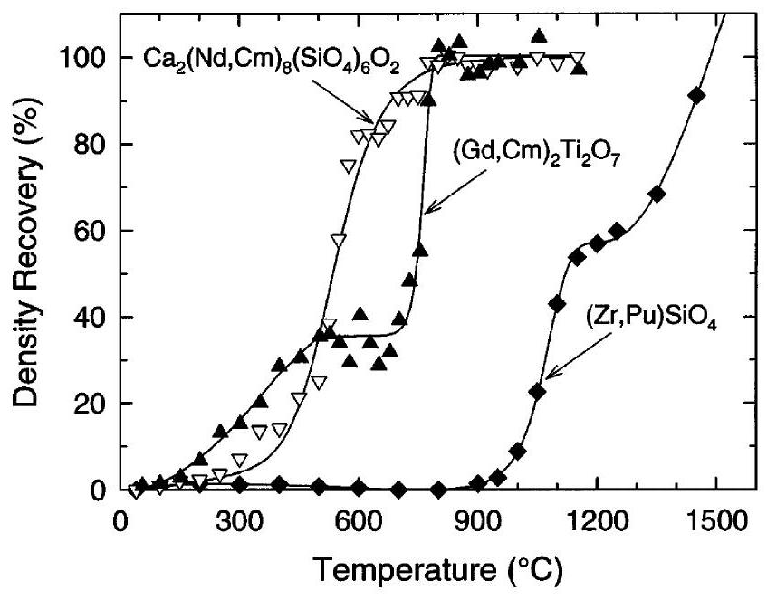
FIG. 21. Recovery of density during recrystallization of $\mathrm{Ca}_{2}$ (Nd, $\mathrm{Cm})_{8}\left(\mathrm{SiO}_{4}\right)_{6} \mathrm{O}_{2},{ }^{163,176}(\mathrm{Gd}, \mathrm{Cm})_{2} \mathrm{Ti}_{2} \mathrm{O}_{7},{ }^{116}$ and $(\mathrm{Zr}, \mathrm{Pu}) \mathrm{SiO}_{4}$. ${ }^{155,156,163}$

recrystallization kinetics are not available for other relevant ceramics, the activation energies for recrystallization in zirconolite/pyrochlore, ${ }^{116,235,238}$ zircon, ${ }^{155,156}$ and monazite ${ }^{239}$ structures have been estimated.

## F. Helium accumulation, trapping, and bubble formation

Helium has a limited solubility in most ceramics. At increased concentrations, it may form bubbles, which can cause swelling and affect many of the physical properties of the solid. The consequences of high gas concentrations are well known for nuclear fuels and the heavy fission gases Kr and Xe . Although the effects for the smaller He atoms may be less pronounced, the effects of He accumulation need to be studied and understood. Few data exist on the behavior of He in potential actinidehost phases. Consequently, studies of He solubility, diffusion, trapping, and release in these ceramic phases are needed. In addition, the evolution of He bubbles, including the temperature and dose dependence, should be investigated. Such studies of bubble formation will require careful characterization by transmission electron microscopy and small angle x-ray scattering, such as has been done recently for a nuclear waste glass. ${ }^{299}$

In order to understand the potential effects of He accumulation, it is instructive to consider the mechanisms of a damage effect of great importance for $\mathrm{UO}_{2}$ fuel, which is the grain subdivision or polygonization of high burnup $\mathrm{UO}_{2}$ fuel (the so-called rim-effect). Recent work ${ }^{310}$ on ion-implanted $\mathrm{UO}_{2}$ indicates that this effect may be gas-driven. The threshold conditions for polygonization in $\mathrm{UO}_{2}$ correspond to about $1 \mathrm{wt} . \%$ Xe, a displacement dose of 2000 dpa , and $\sim 9 \mathrm{~cm}^{3} \mathrm{Xe}(\mathrm{NTP}) / \mathrm{cm}^{3}$ fuel. Most experiments with actinidecontaining ceramics have not exceeded 1 dpa or $0.1 \mathrm{~cm}^{3} \mathrm{He} / \mathrm{cm}^{3}$ ceramic. In the case of Pu-containing ceramic waste forms, however, the He concentration after long storage times will be much larger (a factor of 100) than the threshold Xe concentration for polygonization.

In some natural minerals, most notably natural $\mathrm{UO}_{2}$ (uraninite) or ( $\mathrm{U}, \mathrm{Th}) \mathrm{O}_{2}$ (thorianite) with ages ranging from 200 to 500 million years, high damage levels (100 to 200 dpa ) and high He concentrations (on the order of $0.5 \mathrm{wt} . \% \mathrm{He}$ ), corresponding to some $300 \mathrm{~cm}^{3} \mathrm{He}(\mathrm{NTP}) / \mathrm{cm}^{3}$ mineral, are found. Similar He concentrations will only be reached in waste matrices with high actinide loading over long time periods that correspond to many half-lives. Transmission electron microscopy studies of such minerals with high damage levels and high He concentrations show evidence for polygonization, and these minerals "explode" when heated to about $800^{\circ} \mathrm{C} .^{300}$ This phenomenon is accompanied by a burst release of He and extensive bubble formation, which strongly supports the need to study the consequences
of He buildup in waste ceramics. Bubbles that are assumed to contain He have been observed in high-dose metamict minerals ${ }^{301}$; however, little is known on the effect of the He bubbles on materials properties. It is possible that the crystalline-to-amorphous phase change could sweep the He out of the matrix. Furthermore, He diffusion may be faster in the amorphous state, causing more He release during storage; this could reduce the overall He concentration and associated effects in the matrix but could possibly cause canister failure. Valuable exploratory investigations could be completed using natural analogue phases containing high U and Th concentrations (i.e., high damage levels).

Several studies ${ }^{140,237}$ have reported the presence of near-spherical microvoids or bubbles ranging in diameter from 100 to 400 nm in highly damaged natural zirconolites. These bubbles have been attributed to the accumulation of He from the $\alpha$-decay of U and Th impurities, and their daughter products. Bubbles have also been observed in metamict $\mathrm{Nb}-\mathrm{Ta}-\mathrm{Ti}$ oxides, ${ }^{301}$ as well as in annealed uraninite, $\mathrm{UO}_{2+x} \cdot{ }^{302}$ There are also extensive data and models ${ }^{303,304}$ of fission gas bubble formation in $\mathrm{UO}_{2}$ that may be relevant to bubble formation from He accumulation in nuclear waste ceramics.

## G. Mechanical properties

Ion implantation is widely used to change the mechanical behavior of ceramic surfaces. It is thus not surprising that similar radiation-induced changes in mechanical properties are observed in actinide-host phases due to $\alpha$-decay. The effects of $\alpha$-decay induced amorphization on hardness, elastic modulus, and fracture toughness have been investigated as a function of dose (up to $5 \times 10^{18} \alpha$-decays $/ \mathrm{g}$ ) in several ceramic phases containing ${ }^{238} \mathrm{Pu}$ or ${ }^{244} \mathrm{Cm}$ and in some natural mineral analogues. Additional data have been obtained from studies utilizing heavy-ion irradiation.

The hardness and elastic moduli of Cm -doped $\mathrm{Gd}_{2} \mathrm{Ti}_{2} \mathrm{O}_{7}$ and $\mathrm{CaZrTi}_{2} \mathrm{O}_{7}$ have been shown to decrease steadily with increasing $\alpha$-decay dose ${ }^{116}$; a similar decrease in hardness with increasing $\alpha$-decay dose has been reported in $\mathrm{CaPuTi}_{2} \mathrm{O}_{7}{ }^{305}$ Decreases in hardness and elastic moduli with increasing dose have also been observed in natural zircons ${ }^{306-308}$ and in synthetic zircon irradiated with 540 keV Pb ions. ${ }^{309}$ In general, the decreases in hardness range from 25 to $50 \%$, and the decreases in elastic moduli are in the range of 50 to $70 \%$. The softening of these materials with increasing dose is due to the radiation-induced amorphization that results in a lower density structure.

The fracture toughness in Cm -doped $\mathrm{Gd}_{2} \mathrm{Ti}_{2} \mathrm{O}_{7}$, ${ }^{116} \mathrm{CaZrTi}_{2} \mathrm{O}_{7},{ }^{116}$ and $\mathrm{Ca}_{2} \mathrm{Nd}_{8}\left(\mathrm{SiO}_{4}\right)_{6} \mathrm{O}_{2},{ }^{178}$ as well as in $\mathrm{CaPuTi}_{2} \mathrm{O}_{7},{ }^{305}$ has been shown to increase by up $100 \%$ with increasing $\alpha$-decay dose to a broad maximum and
then decrease slightly as the materials approach the fully amorphous state. The increase in fracture toughness is attributed to the composite (two-phase) nature of the microstructure, which consists of mixed crystalline and amorphous domains. At low to intermediate doses, the microstructure consists of amorphous tracks in a crystalline matrix, and this composite microstructure can inhibit crack propagation and increase the fracture toughness. At high doses where the amorphous phase becomes the dominant matrix with remnant crystallites, the fracture toughness decreases slightly as some of the internal stresses are relieved. This is supported by the observed decrease in stored energy in $\mathrm{CaPuTi}_{2} \mathrm{O}_{7}$ at high doses, ${ }^{234}$ which suggests a relaxation of disorder, and by the analysis of strain accumulation in natural pyrochlores. ${ }^{213}$

Additional helpful information has recently become available from indentation tests in the high burnup, socalled rim zone of LWR $\mathrm{UO}_{2}$ fuel. ${ }^{310}$ In this zone, the burnup is very high due to a high production of ${ }^{239} \mathrm{Pu}$ by resonance neutron capture in ${ }^{238} \mathrm{U}$, and a grainsubdivision process (polygonization) occurs. A Vickers indentation study along radial directions of the $\mathrm{UO}_{2}$ fuel showed a decrease in hardness $H$ (by $\sim 30 \%$ ) and an increase in fracture toughness $K_{I c}$ (by $\sim 100 \%$ ) that follow the radial burnup profile. It is worth noting that the concentration of actinides, and hence the $\alpha$-decay rate, increases with the increasing burnup as does the rare-gas ( Xe and He ) content. Since these measurements are made $2-3$ years after removal from the reactor, the contribution of the $\alpha$-decay damage may be important. Therefore, these results can be taken as a first indication of the behavior that might be expected in a Pu-containing phase that has been stored for a long time, has undergone polygonization, and contains helium bubbles.

The net result of the decreases in hardness and elastic modulus and increases in fracture toughness is a reduced brittleness and enhanced resistance against crack propagation in these ceramic phases as a result of $\alpha$-decay damage. The extensive experience with so many materials of different structures and the similar nature of the radiation-induced changes in mechanical properties strongly suggest that the expected behavior for other potential waste ceramic phases will not be significantly different.

## H. Thermal properties

The thermal conductivity of actinide compounds is known to decrease significantly due to $\alpha$-decay damage, mainly by phonon scattering at point defects. As an example, the thermal conductivity of ${ }^{239} \mathrm{PuO}_{2}$, which does not become amorphous, decreases by a factor of 3 at $60^{\circ} \mathrm{C}$ within one year due to point defect accumulation. ${ }^{311}$ Depending on actinide loading and
dimensions of the ceramic waste form, the originally existing temperature gradient will increase and may significantly affect microstructural evolution and durability. Thermal diffusivity (laser flash) and heat capacity measurements on both as-produced and self-damaged actinide waste forms are, therefore, needed.

## I. Chemical durability

The principal mechanism for the release of radionuclides from the emplaced waste forms is by corrosion of the waste forms in the presence of water. There have been surprisingly few systematic studies designed to evaluate the change in leach rate of a crystalline ceramic as a function of radiation damage, whether due to ionization or ballistic processes. Proper studies will require carefully controlled irradiations, over a range of doses and temperatures, combined with systematic studies of both the corrosion rates and mechanisms as functions of temperature, solution pH , oxidation potential (Eh), and flow rate. No satisfactory experiments have yet been completed; however, increases in leach rates have been noted for actinide-doped phases, naturally occurring phases containing U and Th, and in some ion-irradiated ceramics, as discussed below. In general, the increases in leach rates range from a factor of 10 to 100 . It must be noted that the leach rates of the amorphous (damaged) state in the ceramics studied to date are still lower than those of glass waste forms.

## 1. Summary of available data

The radiation-induced changes in the leach rates of Cm-doped $\mathrm{Gd}_{2} \mathrm{Ti}_{2} \mathrm{O}_{7}, \mathrm{CaZrTi}_{2} \mathrm{O}_{7}$, and $\mathrm{Ca}_{2} \mathrm{Nd}_{8}\left(\mathrm{SiO}_{4}\right)_{6} \mathrm{O}_{2}$ have been determined from leach tests of both fully damaged (amorphized) specimens and a second set of specimens that had been fully recrystallized to the original structure by appropriate annealing. ${ }^{177}$ The results of these studies indicate that radiation-induced amorphization increased the leach rate by a factor of $20-50$ for $\mathrm{Gd}_{2} \mathrm{Ti}_{2} \mathrm{O}_{7}$, and by a factor of 10 for both $\mathrm{CaZrTi}_{2} \mathrm{O}_{7}$ and $\mathrm{Ca}_{2} \mathrm{Nd}_{8}\left(\mathrm{SiO}_{4}\right)_{6} \mathrm{O}_{2}$. The leaching of $\mathrm{Gd}_{2} \mathrm{Ti}_{2} \mathrm{O}_{7}$ appeared to occur incongruently, with the non- $\mathrm{TiO}_{6}$ network ions being selectively leached.

Because of the important implications in determining the $\mathrm{U} / \mathrm{Pb}$ systematics of zircons for geologic age dating, there are data on the increased loss of nuclides as a function of increasing degree of damage. ${ }^{312-316}$ In a study of a suite of natural zircons with varying contents of uranium and thorium, Ewing et al. ${ }^{313}$ found that over a dose range of $10^{17}$ to $10^{19} \alpha$-decay events $/ \mathrm{g}$, there was a one order of magnitude increase in the leach rate. For completely metamict zircons (dose $\geqslant 10^{19} \alpha$-decay events/ g ), the increase in leach rate was nearly two orders of magnitude. These results are consistent with the observation that loss of nuclides and increased
solubility are, at least in part, related to the increasing level of radiation damage in zircon. ${ }^{312,314,316}$ As early as the 1970s, it was recognized that the discordance in U/ Pb age determinations of zircon crystals could be reduced by mechanically (i.e., abrasion) or chemically (i.e., etching with hydrofluoric acid) removing the altered (metamict) areas of the zircons. ${ }^{317,318}$ These altered areas often have higher U concentrations and occur in the outer zones of single crystals; thus, these altered zones have experienced more $\alpha$-decay event damage. ${ }^{319,320}$

Results by Sales et al. ${ }^{321}$ suggest that the leach rate of a synthetic monazite, $\mathrm{LaPO}_{4}$, containing simulated waste remains low even after the material has been transformed to an amorphous state by irradiation with $250 \mathrm{keV} \mathrm{Bi}{ }^{+}$ions. However, work by Eyal and Kaufmann ${ }^{322}$ on natural monazite indicates that there is a preferential dissolution of the radionuclide daughterproducts, ${ }^{234} \mathrm{U},{ }^{230} \mathrm{Th}$, and ${ }^{228} \mathrm{Th}$, by factors of between 1.1 and 10 relative to the structurally incorporated parent isotopes ${ }^{238} \mathrm{U}$ and ${ }^{232} \mathrm{Th}$, respectively. This isotopic fractionation is attributed to radiation damage in the tracks of the recoiling daughter nuclei emitted during $\alpha$-decay of the parent isotopes. While there have been some concerns regarding the interpretation of these results, ${ }^{185}$ the increases in dissolution rates are similar to those observed in other actinide-host phases, such as naturally occurring thorianite ( $\mathrm{ThO}_{2}$ ) and uraninite $\left(\mathrm{UO}_{2}\right) .^{323}$ Leaching experiments of these phases and measurements of the Th and U isotopes show that there is a strongly enhanced release of short-lived ${ }^{228} \mathrm{Th}$ relative to ${ }^{232} \mathrm{Th}$, but only slight enhancement of long-lived ${ }^{234} \mathrm{U}$ and ${ }^{230} \mathrm{Th}$ relative to ${ }^{238} \mathrm{U}$ and ${ }^{232} \mathrm{Th}$. These results can be interpreted as due to natural annealing of the damage cascade over periods of tens of thousands of years. This chemical etching technique is a powerful method for probing the thermal stability of $\alpha$-recoil damage tracks in a wide variety of crystalline materials, as well as glasses. ${ }^{324,325}$ These results are consistent with the over an order of magnitude increase in leach rate observed in heavy-ion irradiated $\mathrm{UO}_{2} .{ }^{326}$ Increased leaching of up to a factor of 10 also has been reported in sphene and sphene-ceramics irradiated with $280 \mathrm{keV} \mathrm{Bi}^{2+}$ ions. ${ }^{327}$

## 2. Mechanisms and needs

Depending on the type of solid, there are a number of different corrosion mechanisms, and in fact, the mechanism may change as a function of temperature, $\mathrm{Eh}, \mathrm{pH}$, solution composition, and flow rate. Each of these parameters, particularly temperature and pH , can affect the leach rate by many orders of magnitude. The microstructure of a solid can also affect the corrosion rate. Thus, radiation damage to a ceramic waste form, as the results above demonstrate, can affect the leach rate as a result of (i) an increase in surface area due
to microfractures created because of differential or anisotropic radiation-induced volume expansions, (ii) the reduced thermodynamic stability of the radiationinduced aperiodic domains, (iii) the higher chemical reactivity due to strain fields around amorphous domains (e.g., an $\alpha$-recoil track), (iv) the higher chemical reactivity due to decreased cation coordination in the amorphous state, (v) an increase in ionic diffusivities in the damage state that provides a convenient medium for ion exchange reactions that initiate corrosion, and (vi) solute segregation that leads to enhanced removal of radionuclides. In addition, actinides released during aqueous corrosion of glass and ceramic waste forms usually have a relatively low solubility and precipitate in the leached gel layer as actinide-bearing phases. ${ }^{159,168,169,328}$ However, radiation damage to these actinide-bearing precipitates may lead to the formation of amorphous colloids that are mobile, thus, enhancing actinide transport and increasing the concentrations of radionuclides in solution. All of these possibilities are expected to contribute to an increase in the release (and possible transport) of radionuclides depending on the nature and extent of the radiation damage. The microstructural changes in the radiation-damaged solid will depend most critically on the cumulative dose and the thermal history of the waste form over extended periods of time.

The radiation-induced changes in microstructure evolve over long time periods and are of critical importance to the long-term radionuclide release during corrosion. Thus, the evaluation of radiation effects on chemical durability requires a substantial database on the development of microstructure as a function of radiation dose in host phases for both fission products and actinides. These data must be understood in terms of damage-accumulation models that can then be combined with models that describe the alteration and corrosion of the waste form. The models of both phenomena must be extrapolated over long periods ( $10^{4}$ to $10^{6}$ years), but at least in the case of radiation effects, the models of damage accumulation can be confirmed by studies of naturally occurring phases of similar structure and composition that have accumulated damage for time periods up to $10^{9}$ years.

## VI. APPLICATIONS OF COMPUTER SIMULATION METHODS

Atomic-level simulation of radiation effects in metals, intermetallics, and semiconductors is an area of active research. ${ }^{329}$ Quantum mechanical and empirical models of atomic bonding, energy minimization, molecular dynamics (MD), and Monte Carlo (MD) methods can be used in atomic-level calculations of radiation damage processes in crystalline (and amorphous) materials. ${ }^{330}$ Energy minimization is widely used to
study structures, stable defect configurations, and energy minima for defect motion. Static defect properties as well as dynamic processes on the order of picoseconds can be modeled by MD simulations. Molecular dynamics can be used to study defect formation and migration energies, damage mechanisms, and defect production processes in cascades. Monte Carlo techniques, which predict behavior from a random sampling of initial states, are useful for calculating damage distributions, thermodynamic equilibrium structures and properties, and long-range diffusion.

The prospect of using computer simulations to calculate irradiation-induced defect production and amorphization in ceramic waste forms, and to follow the evolution of the defect structures, has been a beckoning, yet elusive goal. However, progress achieved in computational physics for developing reliable yet tractable interatomic potentials, coupled with vast improvements in computational power, have created the possibility of computing microstructure evolution during prolonged irradiation. The aim of such simulation work on radiation effects in ceramics should be to develop an effective modeling technology for predicting radiation-induced structural and chemical stability and the long-term performance of nuclear waste form ceramics. The ultimate result of this work should be a physically based model of the effect of radiation damage on defect accumulation, phase transformations, and the evolution of the microstructure over geological time scales. Development of a predictive simulation and modeling hierarchy for radiation effects in nuclear waste forms would enable (i) detailed understanding of defect energetics, (ii) atomic-scale understanding of the mechanisms and dose dependence of phase transformations (e.g., amorphization), (iii) accurate interpretation of experimental results in terms of underlying atomistic mechanisms, and (iv) evaluation of behavior of new waste forms under irradiation as needed.

## A. Structure and defects

Owing to the pivotal role played by defects in influencing the physical and chemical properties of solids, there is a long history of the characterization of impurity and defect states in ceramics using theoretical and computational techniques. The earlier achievements in this field have been described in detail by Stoneham, ${ }^{331}$ while the more recent developments have been summarized by others. ${ }^{332-334}$ Considerable success has been enjoyed in many applications, especially for closed-shell defects in strongly ionic materials; indeed, in many cases, quantitative agreement with experiment can now be achieved, and the computational methods have evolved into straightforward and generally applicable tools that may be used routinely together with experiments in char-
acterizing defect and impurity states. In other cases, most notably open-shell defects in covalent materials, there still remain substantial problems in achieving a high level of quantitative accuracy, although computational techniques with present methodologies can still make a substantial contribution to characterizing energies and the structures of defects and impurities.

With the constant growth in computer power, the range and accuracy of modeling techniques continues to expand. Computer simulation methods have a substantial and growing role in examining the structures and stability of complex inorganic materials, including solid solutions, in modeling defect formation and migration processes, in investigating radiolysis processes, and in modeling surface and interfacial phenomena, including surface segregation.

## 1. Modeling techniques

Defects may be modeled either by embedding the defect (or defect aggregate) in an infinite perfect lattice or by employing an infinite periodic array of defects embedded in a supercell. The latter approach has the advantage of being able to employ the wide range of computational solid state tools available for the periodic infinite solid; however, these methods must be adapted for charged defects. Moreover, the methods automatically include interactions between defects in the different supercells, which may require the use of larger cells, hence increasing the computational expense of the calculation. The use of isolated embedded defects avoids these problems, but these methods inevitably involve describing the regions close to the defect using methods that are different from those employed for more distant regions of the structure; interfacing the different regions invariably presents problems, and indeed, the embedding problems remain amongst the most enduring and challenging problems in computational solid-state physics.

Within the context of the strategies outlined above, the whole range of current computational solid-state tools-quantum mechanical (QM) methods employing ab initio Hartree-Fock, local density functional (LDF), and semi-empirical methodologies-may be implemented. Methods based on interatomic potentials may also be employed, such as those based on the widely and successfully used approach of Mott and Littleton ${ }^{335}$ that involves embedding an atomistically modeled region containing several hundred ions surrounded by a quasi-continuum description of the remaining lattice. With the growth of the applicability of explicit QM methods, the core of the region (including the defect and one or two shells of immediate neighbors) is described using such techniques; although as noted, there are difficulties in interfacing this core (QM) region with the region described more approximately by an
interatomic potential. Nonetheless, explicit QM methods are essential for accurate modeling of open shell defects.

One key aspect of all defect modeling approaches is the necessity of including full and explicit relaxation of the lattice around the defect. Omission of this crucial effect will inevitably lead to overestimation of defect formation energies and may result in qualitatively incorrect results. The majority of defect calculations have used static lattice, energy minimization techniques, which may be extended by lattice dynamical techniques to include entropy calculations. ${ }^{332}$ There also have been fruitful applications of molecular dynamics methods in modeling highly mobile defects and Monte Carlo methods in treating heavily disordered systems. Further discussion can be found elsewhere. ${ }^{332-334}$

Although it is possible to use computational techniques to model the structures of amorphous solids, ${ }^{332}$ such as those produced by radiation-induced amorphization, it must be emphasized that modeling of impurities and defects in these states represents a major challenge. The extension of modeling techniques to include surfaces and surface defects is, however, relatively straightforward, as reviewed elsewhere ${ }^{334}$ and the references cited therein.

## 2. Modeling achievements

Computer modeling is now a well-established tool in ceramic science. Crystal structures can be accurately and increasingly predictively modeled. Moreover, modeling of the properties of crystalline ceramics, including elastic, dielectric, and lattice dynamical properties, has been increasingly successful. Defect modeling has enjoyed notable success in the last 20 years. Accurate formation energies may be routinely calculated for closed shell defects in ionic and semi-ionic oxides. ${ }^{332-334}$ Similar success is enjoyed in the calculation of migration energies. A good illustration is provided by the recent work of Cherry et al. ${ }^{336}$ who successfully modeled vacancy migration mechanisms in perovskite structured oxides and predicted the $\mathrm{A} / \mathrm{B}$ cation radius ratio required to give optimal oxygen ion mobility.

Other notable achievements that are relevant and possibly applicable to studies of radiation effects in ceramic waste phases are:
(i) Defect interactions and clustering have long been a successful field for modeling studies; such studies have made a major contribution to the understanding of the complex structures of heavily defective doped or nonstoichiometric solids. ${ }^{337}$
(ii) Defect processes and reactions in solids may be investigated, as in the detailed studies on the radiolysis of $\mathrm{NaCl}^{338}$ and $\mathrm{CaF}_{2} .{ }^{339}$ The energetics of formation of solid state solutions may be calculated, as in relevant studies of fission product solution in $\mathrm{UO}_{2}{ }^{340}$ or following
the recent work of Grimes et al. ${ }^{341}$ who have calculated the solution energies of a variety of dopants in $\mathrm{Y}_{2} \mathrm{O}_{3}$.
(iii) Modeling of surfaces and surface defects is a long-standing field of growing importance. ${ }^{334,342}$ As noted, modeling has made a particularly useful contribution to understanding the key processes of impurity and defect segregation. Modeling of molecule-surface interactions, which is of major importance in catalysis and sensor studies, is developing rapidly.

## 3. Challenges for ceramics modeling

Despite these successes, there remain problematic and difficult areas for computer simulation efforts in ceramic science. Those of greatest relevance to radiation effects concern the following:
(i) Modeling of the energies (and free energies) of phase transitions in ceramics, where the widely used shell model potentials often give inaccurate and sometimes qualitatively incorrect results.
(ii) Modeling of open shell defects and of interstitial defects in dense structures. Models based on interatomic potential methods are intrinsically unsuitable for the former, while in the latter, it is difficult to obtain an interatomic potential of the necessary quality.
(iii) Modeling of reaction mechanisms involving bond-breaking processes in solids and on surfaces.
(iv) Predictive modeling of the structures of amorphous materials (for comparison to data from x-ray spectroscopies or neutron scattering).

All of these challenging problems are considered solvable given the appropriate methodological development and access to the appropriate computational resources.

## 4. Modeling opportunities and priorities

With the ongoing developments in computer hardware and software, there is now a real opportunity to develop detailed models of the structure and defect chemistry of both crystalline and amorphous ceramics. The following areas should be given high priority:
(i) Development of detailed models for the structure and energies of pure and doped forms of all relevant ceramic phases (including zircon, zirconolite, pyrochlore, zirconia, monazite, apatite, and perovskite). The computational predictions should be validated and refined by comparison with experimental structural data.
(ii) Calculation of formation, migration, and interaction energies (and free energies) of all relevant defects including metal and oxygen interstitials and vacancies and their aggregates as well as defect-dopant complexes. A principal objective of this work will be to provide the data necessary for implementation into kinetic Monte Carlo schemes of the damage evolution process. In particular, it is strongly recommended that a
pilot study be made on zirconia in view of the considerable existing knowledge of defect structures and of interatomic potentials in this system.
(iii) Development of improved models of the structure of amorphous (and amorphized) ceramics both by refinement of conventional melt/quench molecular dynamics (MD) techniques and by coupling of topological modeling with MD and energy minimization methods. Again, the modeling should be closely coupled with improved experimental data on amorphous systems.
(iv) Modeling of segregation processes. Segregation of impurities to surfaces or grain boundaries is a key aspect of the materials chemistry of ceramics, and the effects may be enhanced in irradiated materials. Modeling of both the energetics and the kinetics of these processes is needed.
(v) Modeling of solution processes at ceramic surfaces. Such studies, which are ambitious but feasible, would require the development of models of the ceramic/ water interface, of the reaction of water with the surface of the material, and of the solution mechanisms of surface ions. The work could build on, for example, earlier studies ${ }^{343}$ of the mechanisms of reactions of water with silicate solids and eventually expand to reactions with calculated structures of the radiation-damage state.

All these developments are feasible; however, there will be substantial requirements related to methodologies and hardware. Methodologies are needed for improved interatomic potentials (where there is a need to go beyond the traditional shell model approach) and to further develop the procedures for embedded quantummechanical cluster techniques. Further refinement and automation of procedures for vibrational entropy calculations are also needed. The use of the new generation of massively parallel processing (MPP) platforms will be essential, in particular for large scale MD calculations for generating improved models of amorphous systems and for certain electronic structure calculations on defects.

## B. Primary damage production

A complete description of the initial damage state (i.e., the source term for all subsequent microstructure and property changes) can best be ascertained through the use of computer simulation methods in conjunction with experimental methods. In addition, the evolution of the damage and its effect on structural properties and performance can be evaluated by the use of kinetic and force-bias Monte Carlo (MC) methods. The combination of these techniques enables a complete atomistic description of irradiation damage and microstructure evolution over all the relevant length and time scales. For example, radiation-induced amorphization can occur either heterogeneously in the cores of the displacement cascades or homogeneously as the result of the accumulation of point
defects and small defect clusters. The actual mechanisms for amorphization are complex, and experimental results are difficult to interpret because little is known about the defect kinetics that may control the processes. MD and MC simulations have the advantage that the important parameters controlling amorphization, such as damage zone stability and defect migration and recombination, can be studied in isolation; therefore, their relative importance can be evaluated.

Model potential molecular dynamics, by virtue of its simplicity and the appropriateness of the length scale (e.g., a cube of $2 \times 10^{5} \mathrm{~nm}^{3}$ contains $10^{7}$ atoms), is an extremely powerful tool to obtain atomic-scale information and physical insight into the mechanisms of irradiation-induced displacements. In a MD simulation, the phase-space trajectories of a collection of degrees of freedom (atoms) in a box are obtained from integration of the classical equations of motion. ${ }^{344}$ The forces are obtained from the interatomic potential between the atoms in the system.

To investigate radiation effects in oxide ceramics, the interactions between atoms can be described with interatomic potentials that have both long-range Coulomb interaction terms and short-range interactions between pairs of ions. These types of potentials have been used extensively ${ }^{345,346}$ to model the behavior of ionic solids and minerals in molecular dynamics simulations and have been shown to be successful in modeling the structure and thermodynamic properties of silicates. ${ }^{347}$ In fact, according to Wright and Catlow ${ }^{348}$ there is good evidence that these potentials, which perform well on the calculations of structure and thermodynamic properties, also work well in defect simulations. The parameters in such potentials for many binary and ternary oxides have been derived from first principles by Bush et al., ${ }^{345}$ and the parameters for $\mathrm{Zr}-\mathrm{O}, \mathrm{Zr}-\mathrm{Si}, \mathrm{Si}-\mathrm{O}$, and $\mathrm{O}-\mathrm{O}$ pairs in various valence states are available in the literature. ${ }^{349}$ These parameters can be used in initial calculations of the primary damage state in phases such as zirconia $\left(\mathrm{ZrO}_{2}\right)$ and zircon $\left(\mathrm{ZrSiO}_{4}\right)$. The results of first principle calculations can be used to optimize and validate the existing empirical interatomic potentials for zirconia and zircon. First principles calculations can also be used to develop parametrizations for the interatomic potentials required for pyrochlore and its monoclinic derivative, zirconolite. These new potentials can in turn be used to investigate the radiation stability of these ceramics.

## 1. Threshold displacement energy

As noted in Sec. III. D, there are only very limited data on the threshold displacement energies for ions on the different sublattices of ceramics. ${ }^{69}$ Such data are crucial for estimating the irradiation dose (number of displacements per atom, or dpa) to achieve a certain
damage state, such as amorphization, under a given set of irradiation conditions and also for correlating accelerated test data, based on ion-beam experiments, with results due to longer-term damage from actinide decay or other radiation sources (e.g., neutrons). Molecular dynamics simulations can be used to explore the value of the threshold energy for stable defect production, the length of replacement collision sequences along different crystallographic directions, and the spontaneous recombination volumes of various Frenkel pair configurations in complex crystalline ceramics. The threshold energy is defined as the minimum recoil energy required to form a stable (i.e., separated beyond its spontaneous recombination volume) Frenkel defect and is typically in the range of 30 to 50 eV . Such defects are formed as the result of replacement collision sequences (RCS's) along low index crystallographic directions that were first predicted by Vineyard and co-workers ${ }^{350}$ on the basis of MD simulations of low energy recoils in copper. RCS's are the critical mechanism whereby an interstitial can be efficiently separated from its own vacancy. Such MD simulations have not yet been applied to any of the ceramic phases of interest (Table V), but their usefulness and application to ceramics have been demonstrated for SiC. ${ }^{77}$ Static energy minimization techniques can also be used to calculate the minimum energy barrier to displacing an ion to a stable or metastable site and, thus, to estimate the threshold displacement energy, as has been recently done for several oxides. ${ }^{76}$ However, such static lattice calculations must be used with some caution, since the neglect of quantum chemical effects could lead to errors.

Knowledge of the threshold displacement energies, $E_{d}$, is necessary in order to accurately describe the production of nearly isolated point defects by $\alpha$-particles on the different sublattices. The rather large number of isolated defects produced by $\alpha$-particles can have a significant effect on the kinetics of microstructure evolution. Values for $E_{d}$ are also needed in order to estimate the damage rates for $\alpha$-recoils, charged particles, and neutrons through the modified Kinchin-Pease expression ${ }^{351}$ or through use of the binary collision codes ${ }^{56-58}$ that were discussed above (Sec. III). Therefore, knowledge of $E_{d}$ for both the cation and anion sublattices is critical for accurate predictions of damage production and defect accumulation during prolonged exposure to irradiation and for comparison of data obtained using different irradiation techniques. Significant differences in $E_{d}$ for cations and anions can result in nonstoichiometric damage production.

## 2. Displacement cascade simulations

Ultimately, the study of radiation effects in nuclear waste form ceramics requires that the displacement cas-
cades generated along the path of the energetic particles produced by $\alpha$-decay be well understood, particularly that of the $\alpha$-recoil. The nature of energetic cascades in materials has been the subject of intense study for many years. ${ }^{352}$ However, the small volume $\left(\sim 4 \times 10^{3} \mathrm{~nm}^{3}\right)$ and short lifetime $\left(\sim 10^{-11} \mathrm{~s}\right)$ of the cascades make their investigation by experimental means very difficult. The primary damage state that survives the cascade event (i.e., the source term for subsequent diffusion and microstructure evolution) can only be inferred indirectly.

Atomic-level computer simulation by MD is a valuable technique for investigating the mechanism of damage production in displacement cascades in ceramics because the lifetimes and volumes of the cascades, which are too small for direct experimental study, are within the realm of current computational power, such as is available on large parallel processing platforms. The result of a typical MD simulation is illustrated in Fig. 22, which shows the primary damage state resulting from a $10 \mathrm{keV} \mathrm{Si}{ }^{+}$cascade in $\beta-\mathrm{SiC} .^{256}$ In this figure, the distribution of interstitials and vacancies is shown 9.4 ps after the initiation of the Si primary knock-on atom (PKA), and the energy deposited in the crystal by the Si PKA has been dissipated by the damped periodic boundaries. The most striking features of this result are that the number of surviving C defects is three times larger than the number of surviving Si defects and no well-defined amorphous regions are produced directly in the cascade. The application of MD techniques to studies of displacement cascades in oxide ceramics has been primarily limited by the lack of funding; however, the availability of suitable potentials is also an issue that must be addressed. Recently, empirical potentials of the Born-Mayer-Huggins type have been used with some success in MD simulations of cascades in a $\mathrm{SiO}_{2}-\mathrm{B}_{2} \mathrm{O}_{3}-\mathrm{Na}_{2} \mathrm{O}-\mathrm{Al}_{2} \mathrm{O}_{3}-\mathrm{ZrO}_{2}$ simulated waste glass ${ }^{353,354}$ and in $\mathrm{ZrSiO}_{4}$. ${ }^{355}$

## 3. Damage evolution and amorphization

Although MD simulations can be used to study the structure and the initial evolution of the radiationdamaged state, the computational time becomes prohibitive beyond the first few nanoseconds of the simulation, even for state-of-the-art scaleable parallel machines. This is an important consideration when studying microstructural evolution and amorphization mechanisms during prolonged irradiation at elevated temperatures. One of the critical issues is the competition between the irradiation-induced damage production and amorphization and the tendency of the system to equilibrium driven by the lower free energy of the crystalline state. As noted in Sec. V. E, amorphization occurs either heterogeneously by the accumulation of discrete damage zones or

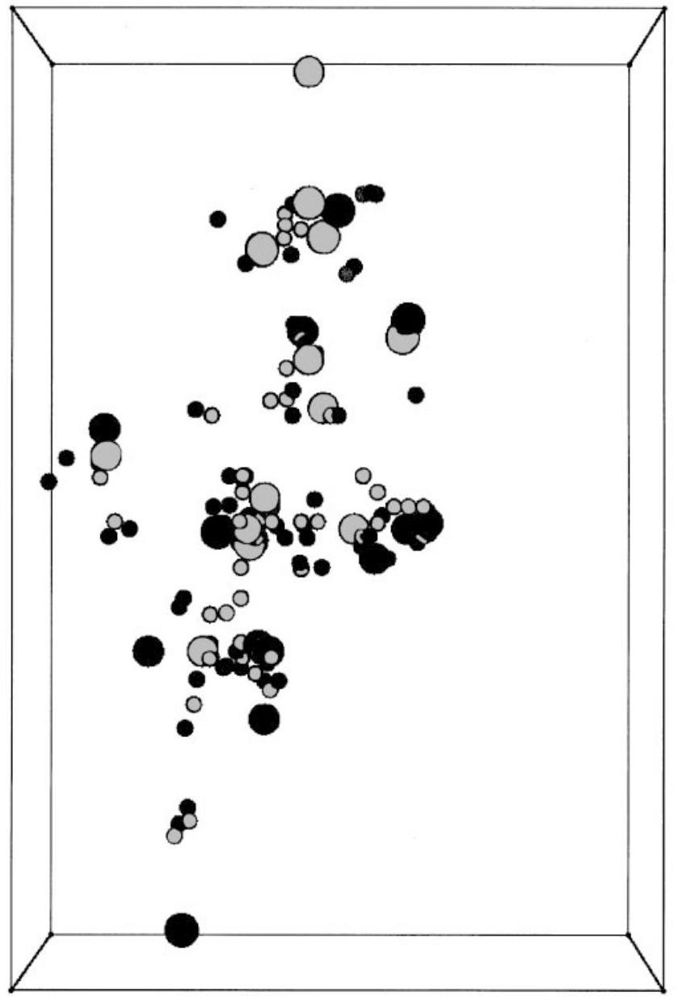
FIG. 22. Interstitials (black) and vacancies (gray) of Si (large circles) and C (small circles) at the end of a 10 keV Si displacement cascade in SiC. ${ }^{256}$ The cell size shown is $8.72 \mathrm{~nm} \times 8.72 \mathrm{~nm} \times 13.08 \mathrm{~nm}$, which is half the size of the simulation cell that was used.

homogeneously by the accumulation of a critical defect concentration. It is extremely difficult to predict the mechanism of amorphization for a given system without a detailed knowledge of the damage morphology, stability, and defect kinetics. From a simulation standpoint, the difficulty of simulating microstructural evolution and amorphization arises as a result of the extremely disparate time scales between damage production in the cascade ( $10^{-11} \mathrm{~s}$ ), the evolution of the damage zones ( $10^{-9}$ to $10^{-3} \mathrm{~s}$ ), defect diffusion between cascade overlaps at a given dose rate ( $10^{-3}$ to $10^{2} \mathrm{~s}$ ), and microstructure evolution over geological time scales ( $10^{7}$ to $10^{13} \mathrm{~s}$ ).

In order to bridge the time scales between the primary damage state creation and the subsequent defect and microstructure evolution, kinetic Monte Carlo (KMC) methods must be used. The input for the diffusion source term can be taken from the model-potential MD simulations of the displacement cascade. The physi-
cal input parameters needed for the KMC simulations must be obtained from a combination of experiments and calculations based on transferable interatomic potentials and/or more accurate electronic-structure-based methods.

A hybrid model-potential MD/KMC simulation can be performed by generating the displacement cascade by model-potential MD and passing the information on the resulting defect distribution to the KMC code. In this type of simulation, the vacancies and interstitials created in a displacement cascade are given random jumps (at a rate derived from their diffusivities at temperature) that allow for vacancy-interstitial recombination, clustering of like defects, re-emission from the clusters, and trapping and de-trapping of interstitials at native traps. Annihilation occurs at internal sinks with a specified sink efficiency, and periodic boundary conditions are applied in the lateral directions. Diffusion proceeds until the arrival of a new cascade from the model-potential MD, as determined by the irradiation dose rate. Successive cascades are generated and annealed until the irradiation dose or the geological time scale are reached. An important application of such an MD/KMC approach is to the study of dose rate effects during damage accumulation, as has been done in $\mathrm{Si} .{ }^{356}$

In addition to point defects and small clusters, the cascade damage simulated by the model-potential MD code may contain large regions of highly disordered amorphous-like material, which are not easily treatable by MC simulators currently in use. For this reason, extensive MD calculations of the stability and annealing kinetics of second-phase amorphous regions in crystalline ceramic matrices should be performed. These studies can provide a tabulation of a set of recrystallization-kinetics data for amorphous pockets and crystal-amorphous interface regions. These data can then be part of the input data set for the KMC simulator. Thus, the KMC simulator can treat the kinetics of recrystallization in a phenomenological way, albeit based on the atomistic results of the MD simulations.

The KMC codes require the following information (obtained from a combination of experiments, MD simulations, and first principles calculations) to simulate defect diffusion in crystalline ceramics during irradiation:
(1) Point defect (cation and anion vacancy and interstitial) formation energies and diffusivities.
(2) Point defect-impurity interaction energy.
(3) Point defect cluster binding energies.
(4) Extended defect nucleation kinetics and the role of impurities.
(5) Bias effect of point defect clusters on point defect diffusion.
(6) Bias effect of sink microstructure (dislocations, stacking faults, etc.) on point defect diffusion.
(7) Information on any possible vacancy-interstitial recombination barrier.

## C. Modeling amorphous structures

Two approaches to modeling amorphous structures have been reported: molecular dynamics simulations and topological modeling. Starting with suitable potentials, amorphous models of $\mathrm{SiO}_{2}$ and $\mathrm{Si}_{3} \mathrm{~N}_{4}$ have been generated by molecular dynamics simulations, ${ }^{357}$ with a full set of atom coordinates available. Similarly, collision cascades in SiC , ${ }^{256,257} \mathrm{Ge}$ and Si , ${ }^{358}$ in $\mathrm{ZrSiO}_{4},{ }^{355}$ and in a $\mathrm{SiO}_{2}-\mathrm{B}_{2} \mathrm{O}_{3}-\mathrm{Na}_{2} \mathrm{O}-\mathrm{Al}_{2} \mathrm{O}_{3}-\mathrm{ZrO}_{2}$ simulated waste glass ${ }^{353}$ have been modeled. Full atomic coordinates can, in principle, be determined at time intervals during the evolution or change of the amorphous state within a cascade.

A second technique has involved hand- or computerbuilding of models using algorithms based on reproducing experimentally observed bond-angle distributions, as in a recent model of vitreous silica. ${ }^{359}$ A somewhat different approach is to investigate with modeling the range of topological possibilities for amorphous structures. This approach was initially carried out using hand-built models of network silica, ${ }^{360,361}$ and characterization of the assemblages was carried out using the concept of the local cluster, which is the set of all tetrahedra belonging to the set of undecomposable rings passing through a given tetrahedron in the structure. The local cluster is an analogue in amorphous structures to the unit cell in crystals: an element of local structure that characterizes the topological properties of the whole amorphous assemblage. The local cluster assignments can be equally applied to crystalline structures as has been done for silica polymorphs, ${ }^{360-362}$ as well as for SiC and $\mathrm{Si}_{3} \mathrm{~N}_{4}$. ${ }^{362}$ An efficient computer-based building approach that uses local rules based construction ${ }^{362}$ can quickly construct crystalline structures with a compact set of local building rules or can generate amorphous structures with modified rules. In this way, it is possible to construct fully connected distinguishable models for amorphized silica with topological properties close to those of crystalline quartz or crystalline cristobalite or tridymite and with credible bond-angle distributions. Using this topological approach, it has been shown that it is possible to simulate cascade disorder/damage by destroying the connectivity within a designated region of a crystal (e.g., in quartz) and regrowing with a different set of rules (e.g., those for the higher-temperature polymorph cristobalite), which yields an amorphous structure. ${ }^{362}$

Approaches to developing models of the radiationinduced amorphous structure in ceramics used for immobilization of radionuclides should include: (i) refinement of conventional melt/quench MD techniques, (ii) coupling of topological modeling with MD and energy minimization methods, and (iii) determining the dependence of the amorphous structure (and its density) on temperature. Such modeling should be closely coupled with improved experimental data on amorphous structures.

## VII. IRRADIATION FACILITIES

Irradiation facilities are needed to investigate the effects of radiation on ceramics for HLW or Pu disposal, and these include actinide research laboratories, $\gamma$-irradiation facilities, and modern electron- and ionirradiation facilities. For actinide research, the radiation effects accumulate continuously over long times, and in situ measurements under controlled conditions (temperature, thermal gradient, stress, etc.) are possible but perhaps less necessary than for accelerated techniques. In situ measurements are possible in many $\gamma$-irradiation facilities, ion-beam irradiation facilities, and electronbeam or electron microscopy facilities.

Many modern research techniques and facilities are available to the materials science community and provide unique opportunities to systematically investigate irradiation effects in ceramics. The techniques range from probes of the local atomic structure to bulk characterization and make use of major user facilities, such as accelerator-based photon sources, neutron scattering facilities, and high-energy or high-resolution electron microscopes. These techniques and facilities need to be made available for the study of radiation effects in radioactive materials, including those containing actinides.

## A. Actinide research facilities

Modern laboratory facilities to perform research on actinide-containing materials are limited. Many facilities with the capability to handle radioactive materials, including actinides, have been shut down at DOE sites because of the change in the DOE mission from weapons production to environmental remediation. The capabilities to handle and study actinides are decreasing each year. There are very few laboratories equipped with modern analytical capabilities to handle radioactive materials. Many of the advanced characterization techniques (e.g., ESR, neutron scattering, Raman spectroscopy, and NMR) can handle encapsulated radioactive materials, but these instruments are, unfortunately, often located in laboratories where radioactive materials are no longer allowed. There is, regrettably, no central multi-user facility in the USA for handling radioactive materials, particularly actinides, with all the necessary characterization facilities. Consequently, detailed characterization of specimens often requires shipping from site to site and, in some cases, re-encapsulation for each technique.

## B. Gamma irradiation facilities

Several intense ${ }^{60} \mathrm{Co}$ gamma sources and irradiation facilities exist at DOE and other government sites; these include the Pacific Northwest National Laboratory, Sandia National Laboratories, Argonne National Laboratory, Savannah River Site, and the Naval Research Laboratory. Even using the most intense ${ }^{60} \mathrm{Co}$ sources,
irradiation experiments may take years. In situ optical and electrical measurements in these facilities are feasible. In many of these ${ }^{60} \mathrm{Co}$ facilities, the gamma field is nonisotropic. More isotropic gamma fields are possible using spent nuclear fuel, particularly the cylindrical spent fuel elements at HFIR (Oak Ridge National Laboratory) that are hollow along the cylindrical axis. Understanding ionization effects from $\beta$-particles and $\gamma$-rays in ceramic phases relevant to fission-product immobilization would benefit immensely from controlled temperature studies and in situ measurements utilizing these facilities.

## C. Ion-beam irradiation facilities

There are numerous ion-beam irradiation facilities at government laboratories, universities, and industry laboratories. Some include dual and triple beam capabilities that allow simultaneous irradiation with several species in order to simulate both the $\alpha$-particle and the $\alpha$-recoil nucleus that are produced during $\alpha$-decay. These multibeam facilities also allow in situ ion-beam characterization (Sandia National Laboratories, Los Alamos National Laboratory, ${ }^{363}$ and Oak Ridge National Laboratory) or electron-beam characterization (IVEM and HVEM facilities at Argonne National Laboratory ${ }^{364}$ ). The ionbeam analysis techniques, which are primarily used to measure changes in near-surface chemical compositions, include Rutherford backscattering (RBS), elastic recoil detection (ERD), nuclear reaction analysis (NRA), and particle-induced x-ray emission (PIXE). ${ }^{365}$ Light elements that are usually difficult to detect with RBS are easily measured with ERD methods. These ion-beam irradiation facilities also could be equipped with in situ optical characterization. Ion-beam irradiation facilities at universities include the University of Michigan, University of Illinois, and Alabama A\&M University.

## D. Electron-beam irradiation facilities

High-voltage electron microscopes, such as those at Argonne National Laboratory and Lawrence Berkeley National Laboratory, can be used to simulate high-energy $\beta$-particle damage. Conventional electron microscopes that operate in the range of 100 to 400 kV can also be used to simulate $\beta$-particle damage. Unfortunately, these facilities have extremely high dose rates as compared with the damage rates in ceramics containing HLW or actinides, producing in seconds the damage equivalent to 1000 years of storage. Other useful facilities may be the electron accelerator facilities at Oklahoma State University and Wright State University or the pulsed electron-beam facilities at Argonne National Laboratory and Brookhaven National Laboratory. In situ characterization capabilities include time-resolved EPR and fluorescence, but other capabilities could be added.

There is a continuing and urgent need for an elec-tron-accelerator facility with the capability to measure in situ the threshold displacement energies in ceramics. This is needed not only for ceramics for nuclear waste applications, but also for ceramics for fusion reactor applications, space applications, advanced electronics, and ion-beam processing/modification. High-voltage electron microscope (HVEM) facilities, such as the HVEM facility at Argonne National Laboratory, have been utilized to indirectly determine threshold displacement energies through the measurement of the threshold electron energy required to produce an observable change in microstructure (e.g., amorphization or dislocation loop formation). As noted above (Sec. III. D), such an approach often overestimates $E_{d}$, and for complex oxides, such as those for nuclear waste applications, can generally only determine $E_{d}$ for one sublattice. Such microscopes are also limited in energy, and cannot transfer sufficient energy to displace heavy ion species, such as Zr and the rare-earths. Although some electronaccelerator facilities exist at several universities, none is currently utilized or equipped to measure threshold displacement energies. In general, a facility is needed that has variable electron energies ( 0.1 to 2.0 MeV ) and an end station capable of in situ measurements during irradiation at liquid helium temperature. Ideally, a facility capable of providing pulsed electron beams is desirable, as it would allow direct measurements of the defects formed, during the pulse, by time-resolved spectroscopy techniques between pulses, as has been previously demonstrated for $\mathrm{CaO},{ }^{75} \mathrm{MgO},{ }^{75,366}$ and $\mathrm{Al}_{2} \mathrm{O}_{3}$. ${ }^{75,367}$

## VIII. CHARACTERIZATION TECHNIQUES AND FACILITIES

Detailed characterization of the defects, microstructural evolution, and structure of the amorphized states produced by irradiation is necessary to advance the understanding of radiation effects in ceramics for HLW and Pu immobilization. Two fundamental characterization objectives are (i) the need for state-of-the-art facilities to characterize defects and structures in radioactive, primarily actinide-containing, materials; and (ii) the need to characterize defects and microstructures produced by charged-particle irradiation in small volumes, often as a function of depth. The techniques that are highlighted below should not be deemed as inclusive; other techniques must and should be utilized.

## A. Electron microscopy

Transmission electron microscopes are currently available with lateral spatial resolution under 0.15 nm , which encompasses interatomic bond distances of oxides and phosphate compounds of interest as nuclear waste
forms. Such capabilities can be applied to specimens in situ during ion-beam irradiation using new facilities at Argonne National Laboratory, and to cross sections of ion-beam irradiated specimens. High-resolution electron microscopy (HREM) has and will continue to make significant contributions to the understanding of structure and structural defects in nominally crystalline materials. ${ }^{368}$ However, conventional HREM is of limited use for directly determining atomic structure in amorphous materials, even though a little information about atomic correlations does survive in such images. ${ }^{369,370}$ Nevertheless, HREM can be a useful technique for tracking the progress and heterogeneity of amorphization, ${ }^{84,206}$ provided it is recognized that in projections through mixed crystalline and amorphized material, periodic features will dominate the image. ${ }^{371,372}$

The projection problem for amorphous materials may be partially offset by limiting the local volume in which atomic correlations are probed by controlled reduction of the spatial coherence employed in imaging. ${ }^{373}$ Variable spatial coherence, which can be achieved with hollow-cone illumination in conventional TEM and with annular dark-field detector configurations in scanning TEM (STEM), has been shown to be sensitive to a higher order than pair-correlations in imaging of amorphous specimens. ${ }^{374}$ Information obtained this way about pair-pair correlations in amorphous Ge specimens has revealed evidence for greater intermediate-range order (IRO) that is consistent with continuous random network models of the amorphous state. Hence, the use of variable-coherence HREM imaging methods has the potential to provide at least some information about amorphized structures and with greater spatial specificity than diffraction methods, which is important for ion-irradiated specimens. The greatest utility at present appears to be comparisons of real and model structures or comparisons of ion-amorphized structures with $\alpha$ -decay-induced (or other irradiation-induced) amorphous structures.

An advantage of an electron beam is that it can readily be focused to small areas ( $<0.5 \mathrm{~nm}$ diameter in some cases) and becomes a highly spatially resolved spectroscopic probe. The electron energy loss spectra contain information about the bonding and local environment, ${ }^{375}$ which can be used to establish density and local density variations. ${ }^{376}$ The densities of the small volumes amorphized by ion beams or electron beams are otherwise difficult to establish. In addition, the behavior of the energy loss spectrum immediately before and after the higher-energy characteristic ionization edges contains information about the local environment of specific excited atom types, analogous to that supplied by EXAFS spectra but from substantially smaller volumes. The method has been used to distinguish between the trigonal and tetrahedral coordination of boron by oxygen
in borate minerals ${ }^{377}$ and to establish the oxygen coordination around aluminum at an $\mathrm{Al}_{2} \mathrm{O}_{3}$ grain boundary. ${ }^{378}$ Similar determinations should be possible in irradiated nuclear waste ceramics.

## B. Diffraction

X-ray, neutron, and electron diffraction techniques have all been used to explore the atomic structure of crystalline and amorphous materials. In crystalline ceramics, pair correlations are strong, leading to sharp Bragg diffraction peaks that depend on scattering from separate sublattices. As an example, studies of ioninduced amorphization of spinel ${ }^{262,263}$ have indicated that disorder on the cation sublattice may be a precursor to overall amorphization.

In amorphous materials, the diffracted intensities can yield radial density functions (RDF's) that are related to the radial distribution and pair correlation functions through the local average density. In most cases, at least some of the peaks in the RDF's can be correlated to specific short-range correlations (e.g., the oxygen coordination shell about Si or P in silicates or phosphates), and the integrated peak area can yield the coordination number. Unfortunately, because pair correlations do not efficiently probe higher-order correlations, the RDF's are not enormously sensitive to differences in intermediate range order. A prominent feature of many diffraction patterns, however, is a first sharp diffraction peak ${ }^{379}$ (FSDP), which represents the signature of some characteristic intermediate-range structural feature, such as the topologically dominant ring structure in silica networks. ${ }^{380}$ A significant experimental difficulty in applying diffraction techniques to irradiation-amorphized specimens is the small volumes rendered amorphous by charged-particle beams. Energy-filtered electron diffraction (EFED) provides a means to obtain structural data from amorphized volumes significantly smaller than required for x-ray or neutron diffraction, as in studies of amorphized silicas ${ }^{381}$ and phosphates. ${ }^{382,383}$

The characterization of radiation damage in ceramics requires the simultaneous observation of crystalline and amorphous material and the analysis of the interfacial behavior of these two structural states. The crystalline material will generally have a periodic atomic arrangement with a substantial amount of point defects and other extended defect aggregates present. These defect aggregations will also have an approximately periodic atomic arrangement. In order to observe the various structural features (periodic, quasiperiodic and aperiodic regions in the material) with statistical significance, advanced x-ray diffraction (XRD) techniques must be employed. Recently, a novel seven-circle x-ray diffractometer has been developed and optimized for the simultaneous observation of the diffraction signals from
crystalline regions (i.e., the Bragg diffraction maxima) and the diffuse scattering from less-ordered regions of a sample. ${ }^{384,385}$ This unique diffractometer has been used in ongoing characterization studies of radiation damage and annealing behavior in natural zircons. ${ }^{386}$ Such a capability in the USA would be useful in studies of $\alpha$-decay-induced amorphization in actinide-containing phases, and a diffractometer of this type could be incorporated in a target chamber for in situ analysis during ion irradiation.

## C. X-ray absorption spectroscopies

X-ray absorption spectroscopies (XAS), such as extended x-ray absorption fine structure (EXAFS) and x-ray absorption near-edge structure (XANES) spectroscopies, can be utilized to evaluate the first and second coordination geometries (nearest neighbor environments) around selected elements, including the actinides and rare earths, in nuclear waste ceramics. As noted above, these XAS techniques have been applied to structural studies of both Pu-containing ceramics ${ }^{248}$ and natural minerals. ${ }^{27,237,245-247}$ It is even possible to investigate the local structure of the energetically inserted $\alpha$-recoil nuclei, as has been done recently for the ${ }^{234} \mathrm{U}$ daughter product in ${ }^{238} \mathrm{Pu}$-containing zircon. ${ }^{387}$ At the present time, these techniques can be applied to actinidecontaining compounds at the Stanford Synchrotron Radiation Laboratory. With the much higher intensities of the new synchrotron light facilities, it may be possible to probe small volumes of materials, which is an advantage for radioactive materials and critical for ionirradiated materials. Understanding the local structural environments of the actinides and their daughter products ( $\alpha$-recoil particles) in ceramic phases can provide atomic-level information on changes in bonding from the $\alpha$-recoil cascade.

## D. Phonon spectroscopies

Measurements of phonon spectra by infrared and Raman spectroscopy have infrequently been applied to irradiation damage studies. These techniques are easily adapted for application to radioactive materials and, with new micro-beam techniques, can be used to probe the small damaged volumes produced under charged-particle irradiation. The characterization of vibrational modes would provide valuable information on local structural changes, and the results would complement and assist in the interpretation of other structural data, such as from XAS. For example, Raman spectra of neutronirradiated vitreous silica ${ }^{376}$ show additional vibrational modes characteristic of threefold rings in the silica network topology, in agreement with neutron diffraction results. ${ }^{388}$ In addition, Raman spectra of ion-irradiated $\mathrm{Gd}_{2} \mathrm{Ti}_{2} \mathrm{O}_{7}$ indicate the appearance of a normally for-
bidden Raman mode due to disorder on the cation sublattice. ${ }^{143}$

## E. Hyperfine techniques

Hyperfine techniques that use nuclear probes to study point defects in crystalline solids can be used in studies of some ceramic phase for nuclear waste immobilization. These techniques include: perturbed angular correlation spectroscopy (PACS), nuclear magnetic resonance (NMR), and Mössbauer spectroscopy (MS). Both NMR and MS are limited to phases containing one of several nuclei as major constituents (e.g., Fe or Sn for Mössbauer). The PACS technique, which has been used to study defects and phase transitions in ceramics, ${ }^{389}$ involves substituting trace concentrations of radioactive probe atoms, such as ${ }^{181} \mathrm{Hf}$ or ${ }^{111} \mathrm{In}$, into the crystal structure. One limitation is, therefore, the need to fabricate ceramics with radioactive probes or have the probes activated in a nuclear reactor. Since many waste ceramic phases contain Zr and rare-earths, ${ }^{181} \mathrm{Hf}$ is an ideal candidate to study these phases. In fact, PACS has been applied, in nonradiation damage studies, to several structures of interest, such as perovskite, ${ }^{390-392}$ pyrochlore, ${ }^{393}$ and zirconia. ${ }^{394}$ Using PACS, it is possible to obtain information on defect migration and binding energies. In addition, PACS exhibits no line-broadening with increasing temperature, which makes it a sensitive tool to obtain data on defect kinetics.

## F. Liquid-phase chromatography

The degree of polymerization of network structures can be monitored by dissolution followed by solution chromatography in which polymerized units (e.g., corner-sharing [ $\mathrm{SiO}_{4}$ ] tetrahedra in silicates, cornersharing $\left[\mathrm{PO}_{4}\right]$ tetrahedra in phosphates) retained in solution can be separated by mass. Phosphates are more amenable to this technique than silicates and have been shown to polymerize significantly upon amorphization. ${ }^{395,396}$

## IX. RESEARCH NEEDS AND OPPORTUNITIES

Both single-phase and multiphase crystalline ceramics can be used as durable hosts for the immobilization of radionuclides. Radiation damage (ionizing and ballistic) from incorporated radionuclides affects the physical and chemical properties of the ceramics and the release rates of the radionuclides during corrosion.

Because of the many applications for ceramics in radiation environments and the development of ionbeam processing technologies for ceramics, there already exists a substantial database and some understanding of radiation-solid interactions in ceramics. However, the present understanding of radiation effects in complex ceramics is insufficient in detail and scope to predict
the effects of radiation on the various radionuclide-host phases under expected repository conditions over long time periods. The cumulative macroscopic responses of differential radiation effects (e.g., swelling) in different phases within multiphase waste forms are even less well understood. In many cases, the scientific issues are not limited to only ceramics for the immobilization of HLW and Pu ; these issues are also critical for other applications, such as fusion technology, ion-beam modification of ceramics, and ion-beam processing of wide-band-gap semiconductor devices. Recommendations for research priorities are summarized below. The primary objective of these recommendations is to develop a fundamental knowledge and models of radiation effects at the atomic, microscopic, and macroscopic levels in order to provide for the evaluation and performance assessment of individual crystalline phases and multiphase ceramics used for the immobilization of HLW, Pu , and other special nuclear waste streams.

## A. Research

The development of predictive models of radiation effects in nuclear waste forms under repository conditions will require a fundamental understanding of the effects of dose, dose-rate, temperature, and time on the radiation-induced, atomic-scale microstructural evolution in relevant ceramic phases and waste forms. Consequently, relevant structure types and compositions should be systematically studied over the widest range of conditions (e.g., dose, dose rate, and temperature) using a variety of radiation sources and techniques. Such studies will require careful microstructural characterization during the damage accumulation process, and such characterization may best be performed utilizing a variety of techniques involving collaborations between different investigators and institutions. Scientific issues related to radiation effects in these solids have been discussed in this review. Recommendations and considerations for future research include the following:
(i) The most prominent of the actinide-host phases among the promising structure types include: pyrochlore, zirconolite, zircon, apatite, perovskite, titanite, monazite, zirconia, and NZP (sodium-zirconium-phosphate). Most of these structures are susceptible to radiation-induced amorphization, and for some of these structures, a considerable amount of preliminary work has already been completed on synthetic phases and mineral analogues. Although the identified structure types should be the focus of initial studies, other phases may yet assume importance depending on the waste stream compositions and the development of new waste forms.
(ii) Investigations of potential actinide-host phases must include studies of self-radiation damage in phases containing short-lived actinides (e.g., ${ }^{238} \mathrm{Pu}$ and ${ }^{244} \mathrm{Cm}$ ).

Since such studies may last for many years (up to ten years or more), carefully planned experiments need to be initiated immediately on the most promising structure types. The limitations often imposed on the handling of actinide-containing materials may severely restrict the number of analytical techniques that can be employed. Thus, studies of self-radiation damage in these phases must be complemented by investigations of mineral analogues and ion-irradiated ceramics, for which a wider range of irradiation conditions can be studied in shorter time periods using a greater variety of analytical techniques.
(iii) Because phases used as hosts for fission products (e.g., Cs and Sr ) will be subjected to high ionizingradiation fields for several hundred years, studies of potential fission-product phases must focus on the effects of ionizing radiation using electron-irradiation techniques or $\gamma$-irradiation facilities. Many of these phases are hydroxylated ceramics (clays, zeolites, and concrete phases), and principal radiation effects include radiolytic gas formation, bubble formation, and changes in cationexchange or sorption capacities. Other host phases, such as CsCl and $\mathrm{SrF}_{2}$, are susceptible to the evolution of radiolytic gas and the formation of metal colloids. In addition, some of these phases will not only be potential waste forms, but are also important in processing technologies because of their selective ion exchange capacities for $\mathrm{Cs}, \mathrm{Sr}$, and, in some cases, actinides.
(iv) The predictive capacity of contemporary computer simulation techniques and greatly expanded computational capabilities (e.g., massively parallel computers) should be exploited to provide (a) atomic level understanding, (b) calculations of fundamental materials parameters and the primary damage state, (c) models of crystalline and amorphous structures, and (d) defect chemistry of the crystalline ceramic phases of interest. The results should be confirmed or related to experimental data. Such modeling efforts will require the development of improved interatomic potentials. Attention should be paid to modeling the sites and the energetics associated with the substitution of radionuclides into the proposed structures. Detailed models should be developed of the migration mechanisms and energies for host lattice ions, radionuclides, point defects, and gas atoms. Calculations of defect energetics, migration pathways, and stable defect configurations using static lattice (energy minimization) methods will be essential for this effort, but quantum chemical effects must be considered in the application of these static methods. The processes of defect and cascade formation occur over such short time scales $\left(<10^{-11} \mathrm{~s}\right)$ that they can only be studied by computer simulation methods, such as molecular dynamics. Kinetic Monte Carlo techniques can be used to model diffusion processes and defect interactions. The extension of already existing models may be useful in
describing microstructure evolution (e.g., amorphization and bubbles) and the role of radiation-induced defects and structural changes on dissolution and radionuclide release. These methods and models should be used to explore and interpret experimental results, specifically to correlate results from different irradiation techniques (e.g., electron, neutron, ion, and $\alpha$-decay).
(v) The interpretation of experimental results and the development of predictive models require a fundamental understanding and data on structure, properties, defect energetics, and radiation-damage processes. These may be determined directly by experimental measurements, indirectly by modeling experimental data, or by theoretical methods and computer simulations. The data, properties, and mechanisms that require systematic study include:
(a) Structural studies of potential radionuclide-host phases and the specific site occupancies of impurities (e.g., incorporated radionuclides) in these complex structure types.
(b) The threshold displacement energies for various ions on different sublattices in these complex ceramics.
(c) The radiation-induced stable defect configurations and primary damage state, the different defect migration energies and pathways, and the kinetics of defect annealing, including the effects of ionization and subthreshold energy transfers.
(d) The mechanisms of radiation-induced amorphization (e.g., defect accumulation versus in-cascade amorphization).
(e) The mechanisms and kinetics of defect-defect interactions, defect annealing, and amorphous domain annealing.
(f) The structure and evolution of radiation-induced microstructures, including detailed structural studies of mixed periodic/aperiodic domains, their interfaces, the fully amorphous state, and the nature of the large density changes.
(g) The effects of dose, dose-rate and temperature on defect accumulation, amorphization, and microstructure evolution.
(h) Helium accumulation, trapping, and bubble formation.
(i) Self-ion diffusion, impurity diffusion, and thermal conductivity.
(j) Radiation-induced diffusion and segregation of impurities and major element components.
(k) The effects of radiation-induced differential changes (e.g., volume changes) on macroscopic responses (e.g., microfracturing) in multiphase ceramics as a function of dose and grain size.
(vi) In all these studies, the results from different irradiation techniques and conditions must be correlated
to some standard basis of dose, such as the ballistic damage dose (i.e., dpa) or, in the case of ionization damage, the absorbed ionization dose (Gy). In addition, these correlations and models of damage accumulation and annealing should be validated by comparison to computer simulations and data from mineral analogues that have experienced high radiation doses due to $U$ and Th decay over long times (>100 million years).
(vii) Most importantly, corrosion (dissolution) experiments or test methods must be developed that are specifically designed to relate the effects of radiation on structure to changes in the dissolution rate or release of radionuclides. In general, the standard tests used to investigate the chemical durability of waste forms are not appropriate or sensitive enough to elucidate the effects of radiation damage on the corrosion process.

## B. Facilities

The necessity for handling radioactive materials will require new facilities or access to existing nonactive facilities. In some cases, researchers are denied access to facilities even though samples are small, safely encapsulated, and of low activity. Facilities must be available for the preparation of actinide-doped samples and their subsequent study. The limitations on handling radioactive materials severely restrict the number of analytical techniques that can be used to study the damage accumulation and annealing processes. Minimum analytical requirements include determination of physical properties (e.g., density, hardness, and thermal conductivity), scanning electron microscopy, autoradiography, x-ray diffraction, transmission electron microscopy, and electron microprobe analysis. A facility for handling and characterizing radioactive materials should find wide use throughout the DOE complex.

Recent advances in x-ray diffraction techniques ${ }^{384,385}$ can be used in conjunction with ion-beam irradiations to perform radiation damage studies in situ over a range of temperatures. Although some electron accelerator facilities exist at several universities, there is a continuing and urgent need for an electron accelerator facility with the capability to measure in situ the displacement energies in ceramics. These measurements will require variable electron energies ( 0.1 to 2.0 MeV ) and an end station capable of in situ measurements during irradiation at liquid helium temperature. Finally, there are numerous solid-state characterization techniques that have not yet been applied to the investigation of radiation effects in crystalline ceramics of interest for immobilization of high-level nuclear waste and plutonium (e.g., double nuclear resonance techniques: ENDOR, ODMR). Investigators are urged to consider potential applications of their techniques to the scientific issues outlined in this review.

## C. Attract talented scientists

This field does not, in general, readily attract or support young scientists, and much of the relevant knowledge and experiences will disappear with the passage of time. With the long-time scales envisioned for immobilization of HLW, Pu , and other nuclear waste streams, there is a need for a relatively small but stable pool of expertise and continued training of new scientists in this area. It is important to attract and involve bright new minds with new ideas to this field. Increased opportunities need to be made available to support graduate students and provide postdoctoral experience at universities, the national laboratories, and other government sites. A long-term research program, with a continuity of purpose, is essential to attracting and retaining highcaliber scientists.

## ACKNOWLEDGMENTS

This panel was sponsored by the Council on Materials Science of the U.S. Department of Energy, Office of Basic Energy Sciences, Division of Materials Sciences (DMS/BES) under Contract DE-FG02-96ER45439 at the University of Illinois. The Panel thanks Dr. Iran Thomas, DMS/BES Director, and Dr. Robert Gottschall, DMS/BES Team Leader, for their support. They also gratefully acknowledge the support and encouragement of Professor C. Peter Flynn (University of IllinoisUrbana), Chairman of the Council on Materials Science, who provided liaison with DMS/BES. The Panel thanks Dr. Michael Knotek (Council on Materials Science) and Dr. Yok Chen (DOE, DMS/BES) for their active participation in the Panel Meeting. The Panel also gratefully acknowledges the assistance of Susan G. McGuire (Pacific Northwest National Laboratory) during the panel meeting and in the preparation of this manuscript.

## REFERENCES

1. Closing the Circle on the Splitting of the Atom (U.S. Department of Energy, Office of Environmental Management, Washington, DC, 1995).
2. D. L. Illman, Chem. Eng. News 71 (25), 9 (1993).
3. Office of Technology Assessment, Complex Cleanup: The Environmental Legacy of Nuclear Weapons Production, OTA-O-484 (Congress of the United States, Washington, DC, 1991).
4. A. G. Croff, in Glass as a Waste Form and Vitrification Technology: Summary of an International Workshop (National Academy Press, Washington, DC, 1996), p. D.1.
5. Management and Disposition of Excess Weapons Plutonium (National Academy Press, Washington, DC, 1994).
6. Management and Disposition of Excess Weapons Plutonium-Reactor-Related Options (National Academy Press, Washington, DC, 1995).
7. Storage and Disposition of Weapons-Usable Fissile Materials Draft Programmatic Environmental Impact Statement, DOE/EIS-0229-D (U.S. Department of Energy, Washington, DC, 1996).
8. F. von Hippel, Phys. Today 47 (6), 26 (1995).
9. D. J. Bradley, C. W. Frank, and Y. Mikerin, Phys. Today 49 (4), 40 (1996).
10. Glass as a Waste Form and Vitrification Technology: Summary of an International Workshop (National Academy Press, Washington, DC, 1996).
11. I. W. Donald, B. L. Metcalfe, and R. N. J. Taylor, J. Mater. Sci. 32, 5851 (1997).
12. W. M. Murphy and R.T. Pabalan, Review of empirical thermodynamic data for uranyl silicate minerals and experimental plan, Report 95-014 (Center for Nuclear Waste Regulatory Analysis, San Antonio, TX, 1995).
13. D. Langmuir, Geochim. Cosmochim. Acta 42, 547 (1978).
14. B. Grambow, Mater. Res. Soc. Bull. XIX (12), 20 (1994).
15. Rapport d'évaluation no. 1 de la Commission Nationale d'Evaluation relative aux recherches sur la gestion des déchets radioactifs instituée par la loi 91-1381 du 30 décembre 1991, juin 1995 (CNE, Paris, 1995).
16. Rapport d'évaluation no. 2 de la Commission Nationale d'Evaluation relative aux recherches sur la gestion des déchets radioactifs instituée par la loi 91-1381 du 30 décembre 1991, juin 1996 (CNE, Paris, 1996).
17. A. S. Aloy, B. Ya. Galkin, B. S. Kuznetsov, R. I. Lyubtsev, and V. M. Esimantovskii, in Waste Management '89, edited by R. G. Post (Arizona Board of Regents, Tucson, AZ, 1989), Vol. 1, p. 677.
18. H. Yokoi, Y. Arita, T. Matsui, H. Ohno, and K. Kobayashi, J. Nucl. Mater. 238, 163 (1996).
19. R. C. Ewing, W. Lutze, and W. J. Weber, J. Mater. Res. 10, 243 (1995).
20. R. C. Ewing, W. J. Weber, and W. Lutze, in Disposal of Weapons Plutonium, edited by E. R. Merz and C.E. Walter (Kluwer Academic Publishers, The Netherlands, 1996), p. 65.
21. Record of Decision for the Storage and Disposition of WeaponsUsable Fissile Materials Final Programmatic Environmental Impact Statement (U.S. Department of Energy, Washington, DC, January 14, 1997).
22. Strategic Plan, Storage and Disposition of Weapons-Usable Fissile Materials (U.S. Department of Energy, Washington, DC, August, 1997).
23. S. G. Cochran, W.H. Dunlop, T.A. Edmunds, L. M. MacLean, and T.H. Gould, Fissile Material Disposition Program Final Immobilization Form Assessment and Recommendation, UCRL-ID-128705 (Lawrence Livermore National Laboratory, Livermore, CA, October 3, 1997).
24. X. Feng, J. E. Surma, C. G. Whitworth, R. C. Eschenbach, and G. L. Leatherman, in Glass as a Waste Form and Vitrification Technology: Summary of an International Workshop (National Academy Press, Washington, DC, 1996), p. E.68.
25. D. A. Knecht, T. P. O'Holleran, K. Vinjamuri, S. V. Raman, and B.A. Staples, in Glass as a Waste Form and Vitrification Technology: Summary of an International Workshop (National Academy Press, Washington, DC, 1996), p. E.78.
26. S. V. Raman, R. Bopp, T. A. Batcheller, and Q. Yan, in Scientific Basis for Nuclear Waste Management XIX, edited by W.M. Murphy and D. A. Knecht (Mater. Res. Soc. Symp. Proc. 412, Pittsburgh, PA, 1996), p. 113.
27. R. C. Ewing, B. C. Chakoumakos, G. R. Lumpkin, T. Murakami, R. B. Greegor, and F. W. Lytle, Nucl. Instrum. Methods in Phys. Res. B 32, 487 (1988).
28. R. C. Ewing, in Scientific Basis for Nuclear Waste Management XVI, edited by C. G. Interrante and R. T. Pabalan (Mater. Res. Soc. Symp. Proc. 294, Pittsburgh, PA, 1993), p. 559.
29. W. Lutze and R. C. Ewing, in Radioactive Waste Forms for the Future, edited by W. Lutze and R. C. Ewing (North-Holland, Amsterdam, 1988), p. 699.
30. E. Anderson, B. Burakov, B. Galkin, V. Starchenko, and V. Vasilev, in Plutonium Stabilization and Immobilization Workshop, CONF-951259 (U.S. Department of Energy, Washington, DC, 1996), p. 269.
31. C. Degueldre, U. Kasemeyer, F. Botta, and G. Ledergerber, in Scientific Basis for Nuclear Waste Management XIX, edited by W. M. Murphy and D. A. Knecht (Mater. Res. Soc. Symp. Proc. 412, Pittsburgh, PA, 1996), p. 15.
32. C. Degueldre, P. Heimgartner, G. Ledergerber, N. Sasajima, K. Hojou, T. Muromura, L. Wang, W. Gong, and R. Ewing, in Microstructure Evolution During Irradiation, edited by I.M. Robertson, G. S. Was, L. W. Hobbs, and T. Diaz de la Rubia (Mater. Res. Soc. Symp. Proc. 439, Pittsburgh, PA, 1997), p. 625.
33. P. G. Boczar, M. J. N. Gagnon, P. S. W. Chan, R. J. Ellis, R. A. Verrall, A. R. Dastur, Canadian Nucl. Soc. Bull. 18 (1), 2 (1997).
34. V.M. Oversby, C. C. McPheeters, C. Degueldre, and J. M. Paratte, J. Nucl. Mater. 245, 17 (1997).
35. Hj. Matzke, J. Magill, and J. van Geel, in Proc. 21st Annual Symp. of the Uranium Institute, London, Sept. 4-6, 1996.
36. W. J. Weber and Hj. Matzke, Radiat. Eff. 98, 93 (1986).
37. R. C. Ewing, W. J. Weber, and F. W. Clinard, Jr., Prog. Nucl. Energy 29 (2), 63 (1995).
38. W. J. Weber, R. C. Ewing, C. A. Angell, G. W. Arnold, A. N. Cormack, J. M. Delaye, D. L. Griscom, L. W. Hobbs, A. Navrotsky, D. L. Price, A. M. Stoneham, and M. C. Weinberg, J. Mater. Res. 12, 1946 (1997).
39. Hj. Matzke, Nucl. Instrum. Methods in Phys. Res. B 32, 453 (1988).
40. W. J. Weber, L. K. Mansur, F. W. Clinard, Jr., and D. M. Parkin, J. Nucl. Mater. 184, 1 (1991).
41. W. J. Weber and F. P. Roberts, Nucl. Technol. 60, 178 (1983).
42. W. J. Weber, J. Minerals, Metals and Materials Society 43 (7), 35 (1991).
43. W. J. Weber and R. C. Ewing, in Scientific Basis for Nuclear Waste Management XVIII, edited by T. Murakami and R. C. Ewing (Mater. Res. Soc. Symp. Proc. 353, Pittsburgh, PA, 1995), p. 1389.
44. W. J. Weber, R. C. Ewing, and W. Lutze, in Scientific Basis for Nuclear Waste Management XIX, edited by W. M. Murphy and D. A. Knecht (Mater. Res. Soc. Symp. Proc. 412, Pittsburgh, PA, 1996), p. 25.
45. C. Adelhelm, C. Bauer, S. Gehlert, and G. Ondracek, in Radioactive Waste Forms for the Future, edited by W. Lutze and R. C. Ewing (North-Holland, Amsterdam, 1988), p. 393.
46. A. D. Whapham and B.E. Sheldon, Philos. Mag. 12, 1179 (1965).
47. N. Nakae, A. Harada, T. Kirihara, and S. Nasu, J. Nucl. Mater. 71, 314 (1978).
48. N. Nakae, T. Kirihara, and S. Nasu, J. Nucl. Mater. 74, 1 (1978).
49. N. Nakae, Y. Iwata, and T. Kirihara, J. Nucl. Mater. 80, 314 (1979).
50. W. J. Weber, J. Nucl. Mater. 98, 206 (1981).
51. W. J. Weber, J. Nucl. Mater. 114, 213 (1983).
52. W. J. Weber, Radiat. Eff. 83, 145 (1984).
53. Hj. Matzke, O. Meyer, and A. Turos, Radiat. Eff. 119-121, 885 (1991).
54. A. Turos, Hj. Matzke, M. Wielunski, and L. Nowicki, Nucl. Instrum. Methods in Phys. Res. B 80/81, 1259 (1993).
55. J. Janeczek and R. C. Ewing, J. Nucl. Mater. 185, 66 (1991).
56. J. F. Ziegler, J. P. Biersack, and U. Littmark, The Stopping and Range of Ions in Solids (Pergamon, New York, 1985).
57. M. T. Robinson and I. M. Torrens, Phys. Rev. B 9, 5008 (1974).
58. M. T. Robinson, Phys. Rev. B 27, 5347 (1983); J. Appl. Phys. 54, 2650 (1983).
59. W. J. Gray, Nature (London) 296, 547 (1982).
60. E. Browne, J. M. Dairiki, and R. E. Doebler, Table of Isotopes, edited by C.M. Lederer and V.S. Sherley, 7th ed. (John Wiley and Sons, New York, 1978).
61. R. L. Fleischer, Science 207, 979 (1980).
62. M. Antonini, F. Lanza, and A. Manara, in Ceramics in Nuclear Waste Management, edited by T. D. Chikalla and J. E. Mendel, CONF-790420 (National Technical Information Service, Springfield, VA, 1979), p. 289.
63. L. W. Hobbs, J. Am. Ceram. Soc. 62, 267 (1979).
64. H. Matzke, Radiat. Eff. 64, 3 (1982).
65. N. Itoh and K. Tanimura, Radiat. Eff. 98, 269 (1986).
66. L. W. Hobbs, F. W. Clinard, Jr., S. J. Zinkle, and R. C. Ewing, J. Nucl. Mater. 216, 291 (1994).
67. S. J. Zinkle, in Microstructure Evolution During Irradiation, edited by I. M. Robertson, G. S. Was, L. W. Hobbs, and T. Diaz de la Rubia (Mater. Res. Soc. Symp. Proc. 439, Pittsburgh, PA, 1997), p. 667.
68. F. W. Clinard, Jr. and L. W. Hobbs, in Physics of Radiation Effects in Crystals, edited by R. A. Johnson and A. N. Orlov (North-Holland, New York, 1986), p. 387.
69. S. J. Zinkle and C. Kinoshita, J. Nucl. Mater. 251, 200 (1997).
70. D. R. Locker and J. M. Meese, IEEE Trans. Nucl. Sci. 19, 237 (1972).
71. P. Agnew, Philos. Mag. A 65, 355 (1992).
72. F. Seitz and J. S. Koehler, Solid State Phys. 2, 305 (1956).
73. B. T. Kelly, Irradiation Damage to Solids (Pergamon Press, New York, 1966).
74. G. P. Pells, Radiat. Eff. 64, 71 (1982).
75. K. J. Caulfield, R. Cooper, and J. F. Boas, J. Am. Ceram. Soc. 78, 1054 (1995).
76. R. E. Williford, R. Devanathan, and W. J. Weber, Nucl. Instrum. Methods in Phys. Res. B 141 (1998, in press).
77. R. Devanathan, T. Diaz de la Rubia, and W. J. Weber, J. Nucl. Mater. 253 (1998, in press).
78. D. M. Parkin and C. A. Coulter, J. Nucl. Mater. 101, 261 (1981); J. Nucl. Mater. 103-104, 1315 (1981); J. Nucl. Mater. 117, 340 (1983).
79. W. J. Weber, R. E. Williford, and K. E. Sickafus, J. Nucl. Mater. 244, 205 (1997).
80. M. Nastasi and J. W. Mayer, Mater. Sci. Rep. 6, 1 (1991).
81. M. Nastasi, J. W. Mayer, and J. K. Hirvonen, Ion-Solid Interactions: Fundamentals and Applications (Cambridge University Press, Cambridge, 1996).
82. K. C. Russell, Prog. Mater. Sci. 28, 229 (1985).
83. G. Martin, Phys. Rev. B 30, 1424 (1984).
84. W. J. Weber, R. C. Ewing, and L. M. Wang, J. Mater. Res. 9, 688 (1994).
85. W. J. Weber and L. M. Wang, Nucl. Instrum. Methods in Phys. Res. B 91, 63 (1994).
86. L. M. Wang, M. Cameron, W. J. Weber, K. D. Crowley, and R. C. Ewing, in Hydroxyapatite and Related Materials, edited by P. W. Brown and B. Constants (CRC Press, Boca Raton, FL, 1994), p. 243.
87. L. M. Wang and W. J. Weber, in Microstructure of Irradiated Materials, edited by I. M. Robertson,, L. E. Rehn, S. J. Zinkle, and W. J. Phythian (Mater. Res. Soc. Symp. Proc. 373, Pittsburgh, PA, 1995), p. 389.
88. A. Meldrum, Ph.D. Thesis, The University of New Mexico (1997).
89. A. Meldrum, L. M. Wang, R. C. Ewing, Nucl. Instrum. Methods in Phys. Res. B 116, 220 (1996).
90. R. S. Averback, R. Benedek, and K. L. Merkle, Phys. Rev. B 18, 4156 (1978).
91. J. C. Bourgoin and J. W. Corbett, Radiat. Eff. 36, 157 (1978).
92. S. J. Zinkle, Nucl. Instrum. Methods in Phys. Res. B 91, 234 (1994).
93. A. E. Ringwood, S. E. Kesson, N. G. Ware, W. O. Hibberson, and A. Major, Geochemical J. 13, 141 (1979).
94. A.E. Ringwood, V.M. Oversby, S.E. Kesson, W. Sinclair, N. Ware, W. Hibberson, and A. Major, Nucl. Chem. Waste Management 2, 287 (1981).
95. A. E. Ringwood, Am. Scientist 70, 201 (1982).
96. S. E. Kesson, W. J. Sinclair, and A. E. Ringwood, Nucl. Chem. Waste Management 4, 259 (1983).
97. H. W. Newkirk, C. L. Hoenig, F. L. Ryerson, J. D. Tewhey, G. S. Smith, C. S. Rossington, A. J. Brackmann, and A. E. Ringwood, Ceram. Bull. 61, 559 (1982).
98. G. J. McCarthy, Nucl. Technol. 32, 92 (1977).
99. G. J. McCarthy, J. G. Pepin, D. E. Pfoertsch, and D. R. Clarke, in Ceramics in Nuclear Waste Management, edited by T.D. Chikalla and J. E. Mendel, CONF-790420 (National Technical Information Service, Springfield, VA, 1979), p. 315.
100. A. K. Dé, B. Luckscheiter, W. Lutze, G. Malow, and E. Schiewer, Ceram. Bull. 55, 500 (1976).
101. A. K. Dé, B. Luckscheiter, W. Lutze, G. Malow, E. Schiewer, and S. Tymochowicz, in Management of Radioactive Wastes from the Nuclear Fuel Cycle, Vol. II, IAEA-SM-207 (International Atomic Energy Agency, Vienna, 1976), p. 63.
102. P. J. Hayward, in Radioactive Waste Forms for the Future, edited by W. Lutze and R. C. Ewing (North-Holland, Amsterdam, 1988), p. 427.
103. A. E. Ringwood, V.M. Oversby, and W. Sinclair, in Scientific Basis for Nuclear Waste Management, Vol. 2, edited by C.J.M. Northrup, Jr. (Plenum Press, New York, 1980), p. 273.
104. K. D. Reeve and J. L. Woolfrey, J. Aust. Ceram. Soc. 16, 10 (1980).
105. K. D. Reeve, D. M. Levins, E. J. Ramm, J. L. Woolfrey, W. J. Buykx, R. K. Ryan, and J. F. Chapman, in Waste Management '81, edited by R. G. Post (Arizona Board of Rgents, Tucson, AZ, 1981), p. 249.
106. J. L. Woolfrey, K. D. Reeve, and D. J. Cassidy, J. Nucl. Mater. 108 \& 109, 739 (1982).
107. K. A. Boult, J. T. Dalton, J. P. Evans, A. R. Hall, A. J. Inns, J. A. C. Marples, and E. L. Paige, The Preparation of Fully Active Synroc and Its Radiation Stability-Final Report, October 1988, AERE-R-13318 (Harwell Laboratory, Harwell, UK, 1988).
108. E. Vernaz, A. Loida, G. Malow, J. A. C. Marples, and Hj. Matzke, in Proc. 3rd EC Conf. on Radioactive Waste Management and Disposal, edited by L. Cecille (Elsevier, London, 1991), p. 302.
109. Hj. Matzke, in Ion Beam Modification of Insulators, edited by P. Mazzoldi and G. Arnold (Elsevier Science, Amsterdam, 1997), p. 501.
110. A. G. Solomah and Hj. Matzke, in Scientific Basis for Nuclear Waste Management XII, edited by W. Lutze and R. C. Ewing (Mater. Res. Soc. Symp. Proc. 127, Pittsburgh, PA, 1989), p. 241.
111. W. J. Weber, in Scientific Basis for Nuclear Waste Management VII, edited by C. M. Jantzen, J. A. Stone, and R. C. Ewing (Mater. Res. Soc. Symp. Proc. 44, Pittsburgh, PA, 1985), p. 671.
112. F. W. Clinard, Jr., L. W. Hobbs, C. C. Land, D. E. Peterson, D. L. Rohr, and R. B. Roof, J. Nucl. Mater. 105, 248 (1982).
113. F. W. Clinard, Jr., Am. Ceram. Soc. Bull. 65 (8), 1181 (1986).
114. F. W. Clinard, Jr., D. E. Peterson, D. L. Rohr, and L. W. Hobbs, J. Nucl. Mater. 126, 245 (1984).
115. F. W. Clinard, Jr., D. L. Rohr, and R. B. Roof, Nucl. Instrum. Methods in Phys. Res. B 1, 581 (1984).
116. W. J. Weber, J. W. Wald, and Hj. Matzke, J. Nucl. Mater. 138, 196 (1986).
117. H. Mitzmura, S. Matsumoto, T. Miyazaki, T. J. White, K. Nukaga, Y. Togashi, T. Sagawa, S. Tashiro, D. M. Levins, and A. Kikuchi, J. Am. Ceram. Soc. 73, 3433 (1990).
118. H. Mitamura, S. Matsumoto, K. P. Hart, T. Miyazaki, E. R. Vance, Y. Tamura, Y. Togashi, and T. J. White, J. Am. Ceram. Soc. 75, 392 (1992).
119. H. Mitamura, S. Matsumoto, M. W. A. Stewart, T. Tsuboi, M. Hashimoto, E. R. Vance, K. P. Hart, Y. Togashi, H. Kanazawa, C. J. Ball, and T. J. White, J. Am. Ceram. Soc. 77, 2255 (1994).
120. R. G. Dosch, T. J. Headley, and P. Hlava, J. Am. Ceram. Soc. 67, 354 (1984).
121. R. G. Dosch, C. J. Northrup, and T. J. Headley, J. Am. Ceram. Soc. 68, 330 (1985).
122. J. M. Rusin, W. J. Gray, and J. W. Wald, Multibarrier Waste Forms, Part II; Characterization and Evaluation, PNL-2668-2 (Pacific Northwest Laboratory, Richland, WA, 1979).
123. R. P. Turcotte, J. W. Wald, F. P. Roberts, J. M. Rusin, and W. Lutze, J. Am. Ceram. Soc. 65, 589 (1982).
124. W. J. Weber, R. P. Turcotte, L. R. Bunnell, F. P. Roberts, and J. H. Westsik, in Ceramics in Nuclear Waste Management, edited by T.D. Chikalla and J.E. Mendel, CONF-790420 (National Technical Information Service, Springfield, VA, 1979), p. 294.
125. J. L. Routbort, P. Offermann, and Hj. Matzke, in Scientific Basis for Nuclear Waste Management VI, edited by D. G. Brookins (Mater. Res. Soc. Symp. Proc. 15, Pittsburgh, PA, 1983), p. 415.
126. G. Malow, J. A. C. Marples, and C. Sombret, in Radioactive Waste Management and Disposal, edited by R. Simon and S. Orlowski (Harwood Academic Publishers, Chur, Switzerland, 1980), p. 341.
127. E. R. Vance, F. G. Karioris, L. Cartz, and M. S. Wong, in Nuclear Waste Management, edited by G. G. Wicks, and W. A. Ross (Advances in Ceramics 8, American Ceramic Society, Westerville, OH, 1984), p. 62.
128. P. J. Hayward, in Radioactive Waste Forms for the Future, edited by W. Lutze and R.C. Ewing (North-Holland, Amsterdam, 1988), p. 457.
129. B. C. Chakoumakos, J. Solid State Chem. 53, 120 (1984).
130. B. C. Chakoumakos, in McGraw-Hill Yearbook of Science and Technology 1987, edited by S. P. Parker (McGraw-Hill, New York, 1986), p. 393.
131. B.C. Chakoumakos and R.C. Ewing, in Scientific Basis for Nuclear Waste Management VIII, edited by C. M. Jantzen, J. A. Stone, and R. C. Ewing (Mater. Res. Soc. Symp. Proc. 44, Pittsburgh, PA, 1985), p. 641.
132. S. S. Shoup, C.E. Bamberger, and R. G. Haire, J. Am. Ceram. Soc. 79, 1489 (1996).
133. W. J. Weber, J. W. Wald, and Hj. Matzke, Mater. Lett. 3, 173 (1985).
134. G. R. Lumpkin and R. C. Ewing, in Scientific Basis for Nuclear Waste Management VIII, edited by C. M. Jantzen, J. A. Stone, and R. C. Ewing (Mater. Res. Soc. Symp. Proc. 44, Pittsburgh, PA, 1985), p. 647.
135. G. R. Lumpkin and R. C. Ewing, in Microbeam Analysis-1986, edited by A. D. Romig, Jr., and W. F. Chambers (San Francisco Press, San Francisco, 1986), p. 145.
136. G. R. Lumpkin, E.M. Foltyn, and R. C. Ewing, J. Nucl. Mater. 139, 113 (1986).
137. G. R. Lumpkin and R. C. Ewing, Am. Mineral. 81, 1237 (1997).
138. R. C. Ewing and T. J. Headley, J. Nucl. Mater. 119, 102 (1983).
139. G. R. Lumpkin, K. L. Smith, and R. Gieré, Micron 28, 57 (1997).
140. R. C. Ewing and T. J. Headley, J. Nucl. Mater. 119, 102 (1983).
141. G. R. Lumpkin, K. L. Smith, M. G. Blackford, R. Giere, and C. T. Williams, in Scientific Basis for Nuclear Waste Management XXI, edited by I. G. McKinley and C. McCombie (Mater. Res. Soc. Symp. Proc. 506, Warrendale, PA 1998), p. 215.
142. W. J. Weber, N. J. Hess, and G. D. Maupin, Nucl. Instrum. Methods in Phys. Res. B 65, 102 (1992).
143. W. J. Weber and N. J. Hess, Nucl. Instrum. Methods in Phys. Res. B 80/81, 1245 (1993).
144. G. R. Lumpkin, K. L. Smith, and R. Blake, in Scientific Basis for Nuclear Waste Management XIX, edited by W. M. Murphy and D. A. Knecht (Mater. Res. Soc. Symp. Proc. 412, Pittsburgh, PA, 1996), p. 329.
145. G. R. Lumpkin and R. C. Ewing, Am. Mineral. 77, 179 (1992).
146. G. R. Lumpkin and R. C. Ewing, Am. Mineral. 80, 732 (1995).
147. W. Sinclair and A. E. Ringwood, Geochem. J. 15, 229 (1981).
148. J. Rankin, L. W. Hobbs, L. A. Boatner, and C. W. White, Nucl. Instrum. Methods in Phys. Res. B 32, 28 (1988).
149. J. Rankin, J. C. McCallum, and L. A. Boatner, J. Appl. Phys. 78, 1519 (1995).
150. J. Rankin, J. C. McCallum, and L. A. Boatner, J. Mater. Res. 7, 717 (1992).
151. J. Rankin, B. W. Sheldon, and L. A. Boatner, J. Mater. Res. 9, 3113 (1994).
152. A. Meldrum, L. A. Boatner, and R. C. Ewing, in Phase Transformations and Systems Driven Far From Equilibrium, edited by E. Ma, P. Bellon, M. Atzmon, and R. Trivedi (Mater. Res. Soc. Symp. Proc. 481, Warrendale, PA, 1998), in press.
153. A. B. Harker and J. F. Flintoff, J. Am. Ceram. Soc. 68, 159 (1985).
154. A.B. Harker and J. F. Flintoff, J. Am. Ceram. Soc. 73, 1901 (1990).
155. W. J. Weber, J. Mater. Res. 5, 2687 (1990).
156. W. J. Weber, Radiat. Eff. 115, 341 (1991).
157. E. B. Anderson, B. E. Burakov, and E. M. Pazukhin, Radiochim. Acta 60, 149 (1993).
158. B. E. Burokov, E. B. Anderson, B. Ya. Galkin, V. A. Starchenko, and V. G. Vasiliev, in Disposal of Weapons Plutonium, edited by E. R. Merz and C. E. Walter (Kluwer Academic Publishers, The Netherlands, 1996), p. 85.
159. A. Abdelouas, J. L. Crovisier, W. Lutze, B. Grambow, J. C. Dran, and R. Müller, J. Nucl. Mater. 240, 100 (1997).
160. H. D. Holland and D. Gottfried, Acta Crystallogr. 8, 291 (1955).
161. T. Murakami, B. C. Chakoumakos, R. C. Ewing, G. R. Lumpkin, and W. J. Weber, Am. Mineral. 76, 1510 (1991).
162. W. J. Weber, Nucl. Instrum. Metods in Phys. Res. B 65, 88 (1992).
163. W. J. Weber, J. Amer. Ceram. Soc. 76, 1729 (1993).
164. W. J. Weber, R. C. Ewing, and A. Meldrum, J. Nucl. Mater. 250, 147 (1997).
165. A. Meldrum, L. A. Boatner, W. J. Weber, and R. C. Ewing, Geochim. Cosmochim. Acta (unpublished).
166. D. J. Wronkiewicz, S.F. Wolf, and T. S. DiSanto, in Scientific Basis for Nuclear Waste Management XIX, edited by W.M. Murphy and D. A. Knecht (Mater. Res. Soc. Symp. Proc. 412, Pittsburgh, PA, 1996), p. 345.
167. C. M. Jantzen and F. P. Glasser, Ceram. Bull. 58, 459 (1979).
168. W. L. Ebert, J. K. Bates, and W. L. Bourcier, Waste Mgmt. 11, 205 (1991).
169. W. L. Gong, R. C. Ewing, L. M. Wang, E. Vernaz, J. K. Bates, and W. L. Ebert, in Scientific Basis for Nuclear Waste Management XIX, edited by W.M. Murphy and D. A. Knecht (Mater. Res. Soc. Symp. Proc. 412, Pittsburgh, PA, 1996), p. 197.
170. R. Bros, J. Carpena, V. Sere, and A. Beltritti, Radiochim. Acta 74, 277 (1996).
171. F. Audubert, J. Carpena, J. L. Lacout, and F. Tetard, Solid State Ionics 95, 113 (1997).
172. L. Boyer, J. Carpena, and J. L. Lacout, Solid State Ionics 95, 121 (1997).
173. D. McConnell, Apatite (Springer-Verlag, New York, 1973).
174. M. L. Lindberg and B. Ingram, U.S. Geol. Surv., Prof. Paper 501-B (1964), p. 64.
175. W. J. Weber, J. Am. Ceram. Soc. 65 (11), 544 (1982).
176. W. J. Weber, Radiat. Eff. 77, 295 (1983).
177. J. W. Wald and W. J. Weber, in Nuclear Waste Management, edited by G. G. Wicks and W. A. Ross (Advances in Ceramics 8, American Ceramic Society, Westerville, OH, 1984), p. 71.
178. W. J. Weber and Hj. Matzke, Mater. Lett. 5, 9 (1986).
179. W. J. Weber, R. K. Eby, and R. C. Ewing, J. Mater. Res. 6, 1334 (1991).
180. A. Meldrum, L. M. Wang, and R. C. Ewing, Am. Mineral. 82, 858 (1997).
181. E. R. Vance, C. D. Cann, and P. G. Richardson, Radiat. Eff. 98, 71 (1986).
182. E. R. Vance and J. B. Metson, Phys. Chem. Minerals 12, 255 (1985).
183. F. C. Hawthorne, L. A. Groat, M. Raudsepp, N. A. Ball, M. Kimata, F. D. Spike, R. Gaba, N. M. Halden, G. R. Lumpkin, R. C. Ewing, R. B. Greegor, F. W. Lytle, T. S. Ercit, G. R. Rossman, F. J. Wicks, R. A. Ramik, B. L. Sherriff, M.E. Fleet, and C. McCammon, Am. Mineral. 76, 370 (1991).
184. L. A. Boatner, G. W. Beall, M. M. Abraham. C. B. Finch, P. G. Huray, and M. Rappaz, in Scientific Basis for Nuclear Waste Management, edited by C. J. M. Northrup, Jr. (Plenum Press, New York, 1980), Vol. 2, p. 289.
185. L. A. Boatner and B. C. Sales, in Radioactive Waste Forms for the Future, edited by W. Lutze and R. C. Ewing (North-Holland, Amsterdam, 1988), p. 495.
186. K. Bakker, H. Hein, R. J. M. Konings, R. R. van der Laan, Hj. Matzke, and P. van Vlaanderen, J. Nucl. Mater. 252, 228 (1998).
187. R. C. Ewing, Am. Mineral. 60, 728 (1975).
188. R. C. Ewing and R. F. Haaker, Nucl. Chem. Waste Management 1, 51 (1980).
189. A. Meldrum, L. A. Boatner, and R. C. Ewing, Phys. Rev. B 56, 13805 (1997).
190. A. Meldrum, L. A. Boatner, and R. C. Ewing, J. Mater. Res. 12, 1816 (1997).
191. R. Roy, E. R. Vance, and J. Alamo, Mater. Res. Bull. 17, 585 (1982).
192. B.E. Scheetz and R. Roy, in Radioactive Waste Forms for the Future, edited by W. Lutze and R. C. Ewing (North-Holland, Amsterdam, 1988), p. 596.
193. H. T. Hawkins, B. E. Scheetz, and G. D. Guthrie, Jr., in Scientific Basis for Nuclear Waste Management XX, edited by W. J. Gray and I. R. Triay (Mater. Res. Soc. Symp. Proc. 465, Pittsburgh, PA, 1997), p. 387.
194. V. N. Zyryanov and E. R. Vance, in Scientific Basis for Nuclear Waste Management XX, edited by W. J. Gray and I. R. Triay (Mater. Res. Soc. Symp. Proc. 465, Pittsburgh, PA, 1997), p. 409.
195. A. I. Orlova, Y. F. Volkov, R. F. Melkaya, L. Y. Masterova, I. A. Kulikov, and V.A. Alferov, Radiochemistry 36, 322 (1994).
196. A. I. Kryukova, I. A. Kulikov, G. Y. Artem'eva, O. V. Pechenevskaya, and V. A. Alferov, Radiokhimiya 34 (6), 82 (1992).
197. D. M. Chapman and L. Lawrence Roe, Zeolites 10, 730 (1990).
198. R. G. Dosch, N.E. Brown, H. P. Stephens, and R. G. Anthony, in Waste Management '93, edited by R. G. Post and M. E. Wacks (Arizona Board of Regents, Tucson, AZ, 1993), p. 1751.
199. R. G. Anthony, C. V. Phillip, and R. G. Dosch, Waste Management 13, 503 (1993).
200. M. L. Balmer, Q. Huang, W. Wong-Ng, R. S. Roth, and A. Santoro, J. Solid State Chem. 130, 97 (1997).
201. E. A. Klavetter, N. E. Brown, D. Trudell, R. G. Anthony, D. Gu, and C. Thibaud-Erkey, in Waste Management '94, edited by R. G. Post and M. E. Wacks (Arizona Board of Regents, Tucson, AZ, 1994), p. 709.
202. W. J. Weber, G. J. Exarhos, and L. M. Wang, in Microstructure of Irradiated Materials, edited by I. M. Robertson, L. E. Rehn, S. J. Zinkle, and W. J. Phythian (Mater. Res. Soc. Symp. Proc. 373, Pittsburgh, PA, 1995), p. 311.
203. L. W. Hobbs, J. de Phys. 37, C7-3 (1976).
204. A. E. Hughes, Radiat. Eff. 74, 57 (1983).
205. A. E. Hughes, Radiat. Eff. 97, 161 (1986).
206. M. R. Pascucci, J. L. Hutchison, and L. W. Hobbs, Radiat. Eff. 74, 219 (1983).
207. H. Matsui, M. W. Guinan, T. Iida, and M. Iseki, J. Nucl. Mater. 133/134, 718 (1985).
208. C. Kinoshita and K. Nakai, Jpn. J. Appl. Phys. Series 2, 105 (1989).
209. C. Kinoshita, T. Sonoda, and A. Manabe, Philos. Mag. A (1998, in press).
210. C. Kinoshita, K. Fukumoto, K. Fukuda, F. A. Gardner, and G. W. Hollenberg, J. Nucl. Mater. 219, 143 (1995).
211. F. W. Clinard, Jr., G. F. Hurley, and L. W. Hobbs, J. Nucl. Mater. 108/109, 655 (1982).
212. K. E. Sickafus, A. C. Larson, N. Yu, M. Nastasi, G. W. Hollenberg, F. A. Garner, and R. C. Bradt, J. Nucl. Mater. 219, 128 (1995).
213. G. R. Lumpkin and R. C. Ewing, Phys. Chem. Minerals 16, 2 (1988).
214. A. D. Brailsford and R. Bullough, J. Nucl. Mater. 44, 121 (1972).
215. U. Jain and A. B. Lidiard, Philos. Mag. 35, 245 (1977).
216. P. G. Shewmon, Diffusion in Solids (McGraw-Hill, New York, 1963).
217. R. Freer, Contrib. Mineral. Petrol. 76, 440 (1981).
218. Hj. Matzke, Radiat. Eff. 75, 317 (1983).
219. B. Lesage, A. M. Huntz, and G. Petot-Ervas, Radiat. Eff. 75, 283 (1983).
220. E. A. Cooper and M. Nastasi, J. Amer. Ceram. Soc. 77, 268 (1994).
221. E. A. Cooper and M. Nastasi, Appl. Phys. Lett. 64 (22), 2958 (1994).
222. E. A. Cooper, M. Nastasi, and K. E. Sickafus, in Beam-Solid Interactions: Fundamentals and Applications, edited by M. A. Nastasi, L. R. Harriott, N. Herbots, and R. S. Averback (Mater. Res. Soc. Symp. Proc. 279, Pittsburgh, PA, 1993), p. 457.
223. E. A. Cooper and M. Nastasi, Nucl. Instrum. Methods in Phys. Res. B 91, 558 (1994).
224. S. J. Zinkle, J. Nucl. Mater. 219, 113 (1995).
225. R. Devanathan, K. E. Sickafus, W. J. Weber, and M. Nastasi, J. Nucl. Mater 253 (1998, in press).
226. R. P. Turcotte and T. D. Chikalla, Radiat. Eff. 19, 99 (1973).
227. W. J. Weber, Radiat. Eff. 70, 217 (1983).
228. W. J. Nellis, Inorg. Nucl. Chem. Letters 13, 393 (1977).
229. T. D. Chikalla and R. P. Turcotte, Radiat. Eff. 19, 93 (1973).
230. M. Wittels and F. A. Sherrill, Phys. Rev. 93, 1117 (1954).
231. W. Primak, Phys. Rev. 110, 1240 (1958).
232. W. K. Woods, L. F. Bupp, and J. F. Fletcher, in Proc. Int. Conf. on Peaceful Uses of Atomic Energy (United Nations, New York, 1956), Vol. 7, p. 455.
233. P. G. Klemens, F. W. Clinard, Jr., and R. J. Livak, J. Appl. Phys. 62, 2062 (1987).
234. E. M. Foltyn, F. W. Clinard, Jr., J. Rankin, and D. E. Peterson, J. Nucl. Mater. 136, 97 (1985).
235. D. E. Peterson and F. W. Clinard, Jr., in Scientific Basis for Nuclear Waste Management VI, edited by D. G. Brookins (Mater. Res. Soc. Symp. Proc. 15, Pittsburgh, PA, 1983), p. 465.
236. S. Ellsworth, A. Navrotsky, and R. C. Ewing, Phys. Chem. Minerals 21, 140 (1994).
237. G. R. Lumpkin, R. C. Ewing, B. C. Chakoumakos, R. B. Greegor, F. W. Lytle, E. M. Foltyn, F. W. Clinard, Jr., L. A. Boatner, and M. M. Abraham, J. Mater. Res. 1, 564 (1986).
238. G. R. Lumpkin, E. M. Foltyn, and R. C. Ewing, J. Nucl. Mater. 139, 113 (1986).
239. T. C. Ehlert, K. Appaji Gowda, F. G. Karioris, and L. Cartz, Radiat. Eff. 70, 173 (1983).
240. W. A. Coghlan and F. W. Clinard, Jr., J. Less-Common Metals 140, 255 (1988).
241. Hj. Matzke and M. Kinoshita, J. Nucl. Mater. 247, 108 (1997).
242. W. C. Brøgger, "Amorf," in Salmonsens store illustrede Konversationslexikon 1, 742 (1893).
243. M. V. Stackelberg and E. Rottenbach, Z. Kristallogr. 102, 173 (1939).
244. M. V. Stackelberg and E. Rottenbach, Z. Kristallogr. 102, 207 (1939).
245. R. B. Greegor, F. W. Lytle, B. C. Chakoumakos, G. R. Lumpkin, R. C. Ewing, C. L. Spiro, and J. Wong, in Scientific Basis for Nuclear Waste Management X, edited by J. K. Bates and W.B. Seefeldt (Mater. Res. Soc. Symp. Proc. 84, Pittsburgh, PA, 1987), p. 645.
246. F. Farges, R. C. Ewing, and G. E. Brown, Jr., J. Mater. Res. 8, 1983 (1993).
247. F. Farges, Am. Mineral. 82, 44 (1997).
248. R. B. Greegor, F. W. Lytle, R. J. Livak, and F. W. Clinard, Jr., J. Nucl. Mater. 152, 270 (1988).
249. H. M. Naguib and R. Kelly, Radiat. Eff. 25, 1 (1975).
250. L. W. Hobbs, J. Non-Cryst. Solids 182, 27 (1995).
251. L. W. Hobbs, Nucl. Instrum. Methods in Phys. Res. B 91, 30 (1994).
252. L. W. Hobbs, A. N. Sreeram, B. Berger and C. E. Jesurum, Nucl. Instrum. Methods in Phys. Res. B 116, 17 (1996).
253. Hj. Matzke and J. L. Whitton, Canadian J. Phys. 44, 995 (1966).
254. R. C. Ewing, L. M. Wang, and W. J. Weber, in Microstructure of Irradiated Materials, edited by I. M. Robertson, L.E. Rehn, S. J. Zinkle, and W. J. Phythian (Mater. Res. Soc. Symp. Proc. 373, Pittsburgh, PA, 1995), p. 347.
255. Hj. Matzke, Defects and Diffusion Forum 83, 111 (1992).
256. R. Devanathan, W. J. Weber, and T. Diaz de la Rubia, Nucl. Instrum. Methods in Phys. Res. B 141 (1998, in press).
257. T. Diaz de la Rubia, M.-J. Caturla, and M. Tobin, in Microstructure of Irradiated Materials, edited by I.M. Robertson, L.E. Rehn, S. J. Zinkle, and W. J. Phythian (Mater. Res. Soc. Symp. Proc. 373, Pittsburgh, PA, 1995), p. 555.
258. H. Inui, H. Mori, and H. Fujita, Philos. Mag. B 61, 107 (1990).
259. A. Matsunaga, C. Kinoshita, K. Nakai, and Y. Tomokiyo, J. Nucl. Mater. 179-181, 457 (1991).
260. H. Inui, H. Mori, A. Suzuki, and H. Fujita, Philos. Mag. B 65, 1 (1992).
261. H. Inui, H. Mori, and T. Sakata, Philos. Mag. B 66, 737 (1992).
262. N. Yu, R. Devanathan, K. E. Sickafus, and M. Nastasi, J. Mater. Res. 12, 1766 (1997).
263. N. Yu, K. E. Sickafus, and M. Nastasi, Philos. Mag. 70, 235 (1994).
264. S. X. Wang, Ph.D. Dissertation, The University of New Mexico (1997).
265. L. M. Wang, S.X. Wang, W.L. Gong, and R.C. Ewing, in Microstructure Evolution During Irradiation, edited by I.M. Robertson, G. S. Was, L. W. Hobbs, and T. Diaz de la Rubia (Mater. Res. Soc. Symp. Proc. 439, Pittsburgh, PA, 1997), p. 583.
266. S. X. Wang, L. M. Wang, and R. C. Ewing, in Microstructure Evolution During Irradiation, edited by I.M. Robertson, G.S. Was, L. W. Hobbs, and T. Diaz de la Rubia (Mater. Res. Soc. Symp. Proc. 439, Pittsburgh, PA, 1997), p. 619.
267. S. X. Wang, L.M. Wang, and R. C. Ewing, Nucl. Instrum. Methods in Phys. Res. B 127/128, 186 (1997).
268. S. X. Wang, L. M. Wang, R. C. Ewing, and R.H. Doremus, J. Appl. Phys. 81, 587 (1997).
269. S. X. Wang, L. M. Wang, R. C. Ewing, and R.H. Doremus, J. Non-Cryst. Solid (unpublished).
270. W. L. Gong, L. M. Wang, R. C. Ewing, and J. Zhang, Phys. Rev. B 54, 3800 (1996).
271. W. J. Weber and L. M. Wang, Nucl. Instrum. Methods in Phys. Res. B 106, 298 (1995).
272. W. J. Weber, L. M. Wang, and N. Yu, Nucl. Instrum. Methods in Phys. Res. B 116, 322 (1996).
273. A. T. Motta and D. R. Olander, Acta Met. 38 (11), 2175 (1990).
274. J. A. Faldowski, A. T. Motta, L. M. Howe, and P. R. Okamoto, J. Appl. Phys. 80, 729 (1996).
275. A. T. Motta, J. Nucl. Mater. 244, 227 (1997).
276. L.M. Wang, W.L. Gong, R.C. Ewing, and W.J. Weber, in Thermodynamics and Kinetics of Phase Transformations, edited by J. S. Im, B. Park, A. L. Greer, and G. B. Stephenson (Mater. Res. Soc. Symp. Proc. 398, Pittsburgh, PA, 1996), p. 233.
277. A. T. Motta and C. Lemaignan, J. Nucl. Mater. 195, 277 (1992).
278. J. F. Gibbons, Proc. IEEE 60, 1062 (1972).
279. J. L. Brimhall, H. E. Kissinger, and A. R. Pelton, Radiat. Eff. 70, 241 (1985).
280. A. T. Motta, D. R. Olander and A. J. Machiels, in Effects of Radiation on Materials, edited by N. H. Packan, R. E. Stoller, and A. S. Kumar, ASTM STP 1046 (American Society for Testing and Materials, Philadelphia, PA, 1989), p. 457.
281. E. P. Simonen, Nucl. Instrum. Methods in Phys. Res. B 16, 198 (1986).
282. N. Q. Lam and P. R. Okamoto, Mater. Res. Soc. Bull. XIX (7), 41 (1994).
283. R. C. Ewing and L. M. Wang, Nucl. Instrum. Methods in Phys. Res. B 65, 319 (1992).
284. S. J. Zinkle and L. L. Snead, Nucl. Instrum. Methods in Phys. Res. B 116, 92 (1996).
285. C. J. McHargue, P. S. Sklad, and C. W. White, Nucl. Instrum. Methods in Phys. Res. B 46, 79 (1990).
286. C. J. McHargue, G. C. Farlow, C. W. White, J. M. Williams, B. R. Appleton, and H. Naramoto, Mater. Sci. Eng. 69, 123 (1985).
287. F. F. Morehead and B. L. Crowder, Radiat. Eff. 6, 27 (1970).
288. J. R. Dennis and E. B. Hale, J. Appl. Phys. 49 (3), 1119 (1978).
289. K. A. Jackson, J. Mater. Res. 3, 1218 (1988).
290. D. F. Pedraza and L. K. Mansur, Nucl. Instrum. Methods in Phys. Res. B 16, 203 (1986).
291. C. H. Woo, J. Nucl. Mater. 159, 237 (1988).
292. M. R. Pascucci, Ph.D. Dissertation, Case Western Reserve University (1983).
293. L. M. Wang, W.L. Gong, R. C. Ewing, and W. J. Weber, in Thermodynamics and Kinetics of Phase Transformations, edited by J. S. Im, B. Park, A. L. Greer, and G. B. Stephenson (Mater. Res. Soc. Symp. Proc. 398, Pittsburgh, PA, 1996), p. 233.
294. L. A. Bursill and G. Braunshausen, Philos. Mag. A 62, 395 (1990).
295. R. L. Fleischer, P. B. Price, and R. M. Walker, J. Geophys. Res. 69, 4885 (1964).
296. A. S. Sandhu, L. Singh, R. C. Ramola, S. Singh, and H. S. Virk, Nucl. Instrum. Methods in Phys. Res. B 46, 122 (1990).
297. H. S. Virk, Radiat. Eff. 133, 87 (1995).
298. E. R. Vance and B. W. Anderson, Mineralogical Mag. 38, 605 (1972).
299. R. Evron, Y. Cohen, O. Regev, Y. Eyal, Hj. Matzke, and K. Tinschert, Proc. Nucl. Soc. Israel 18, VIII-2 (1994).
300. Hj. Matzke, Y. Eyal, and A. van Veene, private communication.
301. T. J. Headley, R. C. Ewing, and R. F. Haaker, Nature (London) 293, 449 (1981).
302. J. Janeczek and R. C. Ewing, J. Nucl. Mater. 185, 66 (1991).
303. V.F. Chkuaseli and Hj. Matzke, J. Nucl. Mater. 201, 92 (1993).
304. V.F. Chkuaseli and Hj. Matzke, J. Nucl. Mater. 223, 61 (1995).
305. F. W. Clinard, Jr., D. S. Tucker, G. F. Hurley, C. D. Kise, and J. Rankin, in Scientific Basis for Nuclear Waste Management VIII, edited by C.M. Jantzen, J. A. Stone, and R. C. Ewing (Mater. Res. Soc. Symp. Proc. 44, Pittsburgh, PA, 1985), p. 664.
306. H. Özkan, J. Appl. Phys. 47, 4772 (1976).
307. B. C. Chakoumakos, W. C. Oliver, G. R. Lumpkin, and R. C. Ewing, Radiat. Eff. 118, 393 (1991).
308. B. C. Chakoumakos, T. Murakami, G. R. Lumpkin, and R. C. Ewing, Science 236, 1556 (1987).
309. W. C. Oliver, J. C. McCallum, B. C. Chakoumakos, and L. A. Boatner, Radiat. Eff. 132, 131 (1994).
310. Hj. Matzke and J. Spino, J. Nucl. Mater. 248, 170 (1997).
311. H. E. Schmidt, J. Richter, Hj. Matzke, and J. van Geel, in Thermal Conductivity 22 (Technomic Publ. Co., Lancaster, PA, 1994), p. 920.
312. R. T. Pidgeon, J. R. O'Neil, and L. T. Silver, Science 154, 1538 (1986).
313. R. C. Ewing, R. F. Haaker, and W. Lutze, in Scientific Basis for Nuclear Waste Management V, edited by W. Lutze (Mater. Res. Soc. Symp. Proc. 11, Pittsburgh, PA, 1982), p. 389.
314. M. P. Tole, Geochim. Cosmochim. Acta 49, 453 (1985).
315. K. Suzuki, Geochem. J. 21, 173 (1987).
316. A. K. Sinha, D. M. Wayne, and D. A. Hewitt, Geochim. Cosmochim. Acta 56, 3551 (1992).
317. T. E. Krogh and G. L. Davis, Carnegie Institution of Washington Yearbook 73, 560 (1973).
318. T. E. Krogh, Geochim. Cosmochim. Acta 46, 637 (1982).
319. T. E. Krogh, EOS, Trans. Amer. Geophysical Union 56 (6), 472 (1975).
320. T. E. Krogh and G. L. Davis, Carnegie Institution of Washington Yearbook 74, 619 (1975).
321. B. C. Sales, C. W. White, and L. A. Boatner, Nucl. Chem. Waste Management 4, 281 (1983).
322. Y. Eyal and A. Kaufmann, Nucl. Technol. 58, 77 (1982).
323. Y. Eyal and R.L. Fleischer, Geochim. Cosmochim. Acta 49, 1155 (1985).
324. G. R. Lumpkin, Y. Eyal, and R. C. Ewing, J. Mater. Res. 3, 357 (1988).
325. Y. Eyal and R. C. Ewing, in Proc. Int. Conf. on Nuclear Waste Management and Environmental Remediation, Vol. 1, edited by D. Alexandre, R. Baker, R. Kohout, and J. Marek (ASME Press, New York, 1993), p. 191.
326. Hj. Matzke, J. Nucl. Mater. 190, 101 (1992).
327. D. V. Stevanovic, D. A. Thompson, and E. R. Vance, J. Nucl. Mater. 161, 169 (1989).
328. T. Murakami, T. Banba, M. J. Jercinovic, and R. C. Ewing, in Scientific Basis for Nuclear Waste Management XII, edited by W. Lutze and R. C. Ewing (Mater. Res. Soc. Symp. Proc. 127, Pittsburgh, PA, 1989), p. 65.
329. Computer Simulation of Radiation Effects in Solids, edited by T. Diaz de la Rubia, G. H. Gilmer, and M-J. Caturla (NorthHolland, Amsterdam, 1995).
330. J. B. Adams, A. Rockett, J. Kieffer, W. Xu, M. Nomura, K. A. Kiliam, D. F. Richards, and R. Ramprasad, J. Nucl. Mater. 216, 265 (1994).
331. A. M. Stoneham, Theory of Defects in Solids (Oxford University Press, 1975).
332. J. H. Harding, Rep. Prog. Phys. 53, 1403 (1990).
333. C. R. A. Catlow, Ann. Rev. Mater. Sci. 16, 517 (1986).
334. C. R. A. Catlow, R. G. Bell, and J. D. Gale, J. Mater. Chem. 4 (6), 781 (1994).
335. N. F. Mott and M. J. Littleton, Faraday Trans. 34, 389 (1938).
336. M. Cherry, M. S. Islam, and C. R. A. Catlow, J. Solid State Chem. 118, 125 (1995).
337. C. R. A. Catlow, in Nonstoichiometric Oxides, edited by O.T. Sörensen (Academic Press, New York, 1981), p. 61.
338. C. R. A. Catlow, K. M. Diller, and L. W. Hobbs, Philos. Mag. A 42 (2), 123 (1980).
339. C. R. A. Catlow, J. Phys. C. Condensed Matter 12 (6), 969 (1979).
340. R. W. Grimes and C. R. A. Catlow, Phil. Trans. Roy. Soc. Lond. A 341, 10,389 (1992).
341. R. W. Grimes et al., private communication.
342. D. H. Gay and A. L. Rohl, J. Chem. Soc., Faraday Trans. 5, 925 (1995).
343. K. V. Wright and C. R. A. Catlow, J. Phys. Chem. Minerals 23, 38 (1996).
344. M. P. Allen and D. J. Tildesley, Computer Simulation of Liquids (Oxford University Press, Oxford, 1987).
345. T. S. Bush, J. D. Gale, C. R. A. Catlow, and P. D. Battle, J. Mater. Chem. 4, 831 (1994).
346. K. V. Damodaran, V. S. Nagarayan, and K. J. Rao, J. Non-Cryst. Solids 124, 233 (1990).
347. G. D. Price, S. C. Parker, and M. Leslie, Min. Mag. 51, 157 (1987).
348. K. V. Wright and C. R. A. Catlow, J. Phys. Chem. Minerals 20, 515 (1994).
349. T. F. Soules, J. Non-Cryst. Solids 49, 29 (1982).
350. J. B. Gibson, A. N. Goland, M. Milgram, and G. H. Vineyard, Phys. Rev. 120, 1229 (1960).
351. M. J. Norgett, M. T. Robinson, and I. M. Torrens, Nucl. Eng. Design 33, 50 (1975).
352. D. N. Seidman, R. S. Averback, and R. Benedek, Phys. Status Solidi 144, 85 (1987).
353. J. M. Delaye and D. Ghaleb, J. Nucl. Mater. 244, 22 (1997).
354. J. M. Delaye and D. Ghaleb, in Scientific Basis for Nuclear Waste Management XX, edited by W. J. Gray and I. R. Triay (Mater. Res. Soc. Symp. Proc. 465, Pittsburgh, PA, 1997), p. 633.
355. J.-P. Crocombette and D. Ghaleb, in Scientific Basis for Nuclear Waste Management XXI, edited by I. G. McKinley and C. McCombie (Mater. Res. Soc. Symp. Proc. 506, Warrendale, PA, 1998), p. 101.
356. M.-J. Carturla and T. Diaz de la Rubia, in Microstructure Evolution during Irradition, edited by I.M. Robertson, G.S. Was, L. W. Hobbs, and T. Diaz de la Rubia (Mater. Res. Soc. Symp. Proc. 439, Pittsburgh, PA, 1997), p. 125.
357. P. Vashishta, A. Nakano, R. K. Kalia and I. Ebbsjö, J. Non-Cryst. Solids 182, 59 (1995).
358. T. Diaz de la Rubia, M.-J. Caturla, and M. Tobin, in Microstructure of Irradiated Materials, edited by I.M. Robertson, L.E. Rehn, S. J. Zinkle, and W. J. Phythian (Mater. Res. Soc. Symp. Proc. 373, Pittsburgh, PA, 1995), p. 555.
359. L. F. Gladden, J. Non-Cryst. Solids 119, 318 (1990).
360. C. A. Marians and L. W. Hobbs, J. Non-Cryst. Solids 119, 269 (1990); 124, 242 (1990).
361. L. W. Hobbs, J. Non-Cryst. Solids 192 \& 193, 79 (1995).
362. C. E. Jesurum, V. Pulim, B. Berger, and L. W. Hobbs, in Microstructure Evolution During Irradiation, edited by I.M. Robertson, G. S. Was, L. W. Hobbs, and T. Diaz de la Rubia (Mater. Res. Soc. Symp. Proc. 439, Pittsburgh, PA, 1997), p. 633.
363. N. Yu, M. Nastasi, T. E. Levine, J. R. Tesmer, M. G. Hollander, C. R. Evans, and C. J. Maggiore, Nucl. Instrum. Methods in Phys. Res. B 99, 566 (1995).
364. C. W. Allen, L. L. Funk, E. A. Ryan, and A. Taylor, Nucl. Instrum. Methods in Phys. Res. B 40/41, 553 (1989).
365. Hj. Matzke, Surf. Interface Anal. 22, 472 (1994).
366. K. J. Caulfield, R. Cooper, and J. F. Boas, J. Chem. Phys. 92 (11), 6441 (1990).
367. K. J. Caulfield, R. Cooper, and J. F. Boas, J. Nucl. Mater. 184, 150 (1991).
368. L. M. Wang, Nucl. Instrum. Methods in Phys. Res. B (1998) in press.
369. O. L. Krivanek, P. H. Gaskell, and A. Howie, Nature (London) 262, 454 (1976).
370. G. Y. Fan and J. M. Cowley, Ultramicroscopy 17, 345 (1985); 24, 49 (1988).
371. M. L. Miller and R. C. Ewing, Ultramicroscopy 48, 203 (1993).
372. L. C. Qin and L. W. Hobbs, in Microstructure of Irradiated Materials, edited by I. M. Robertson, L. E. Rehn, S. J. Zinkle, and W. J. Phythian (Mater. Res. Soc. Symp. Proc. 373, Pittsburgh, PA, 1995), p. 329.
373. D. E. Jesson and S. J. Pennycook, Proc. R. Soc. London. Ser. A 441, 261 (1993); M. M. J. Treacy and J. M. Gibson, Ultramicroscopy 52, 31 (1993).
374. M. M. J. Treacy and J. M. Gibson, Acta Crystallogr. A 52, 212 (1996).
375. T.-C. Lee and J. Silcox, in Microstructure of Irradiated Materials, edited by I.M. Robertson, L.E. Rehn, S.J. Zinkle, and W. J. Phythian (Mater. Res. Soc. Symp. Proc. 373, Pittsburgh, PA, 1995), p. 335.
376. R. A. B. Devine, Nucl. Instrum. Methods in Phys. Res. B 91, 378 (1994).
377. R. Brydson, H. Sauer, and W. Engel, in Transmission Electron Energy-Loss Spectroscopy in Materials Science (TMS, Warrendale, PA, 1982), p. 131.
378. J. Bruley, Microsc. Micro. Anal. \& Microstructure 4, 23 (1993).
379. S. R. Elliott, Nature (London) 354, 445 (1991).
380. L. C. Qin and L. W. Hobbs, in Microstructure of Irradiated Materials, edited by I. M. Robertson, L. E. Rehn, S. J. Zinkle, and W. J. Phythian (Mater. Res. Soc. Symp. Proc. 373, Pittsburgh, PA, 1995), p. 341.
381. L. C. Qin and L. W. Hobbs, J. Non-Cryst. Solids 192 \& 193, 456 (1995).
382. A. N. Sreeram and L. W. Hobbs, in Beam-Solid Interactions: Fundamentals and Applications, edited by M. Nastasi, L. R.

Harriott, N. Herbots, and R. S. Averback (Mater. Res. Soc. Symp. Proc. 279, Pittsburgh, PA, 1993), p. 559.
383. A. N. Sreeram, L. W. Hobbs, N. Bordes, and R. C. Ewing, Nucl. Instrum. Methods in Phys. Res. B 116, 126 (1996).
384. E. K. H. Salje, Phase Transitions 55, 37 (1995).
385. K. R. Locherer, S. A. Hayward, P. J. Hirst, J. Chrosch, M. Yeadon, J. S. Abell, and E. K. H. Salje, Phil. Trans. Royal Soc. London 354, 2815 (1996).
386. E. K. H. Salje, private communication.
387. N. J. Hess, W. J. Weber, and S. D. Conradson, J. Alloys \& Compounds (1998, in press).
388. A. C. Wright, B. Bachra, T. M. Brunier, R. N. Sinclair, L. F. Gladden, and R. L. Portsmouth, J. Non-Cryst. Solids 150, 69 (1992).
389. G. L. Catchen, Mater. Res. Soc. Bull. XX (7), 37 (1995).
390. G. L. Catchen, W. E. Evenson, and D. Allred, Phys. Rev. B 54, 3679 (1996).
391. G. L. Catchen, T. M. Rearick, and D. G. Schlom, Phys. Rev. B 49, 318 (1994).
392. T. M. Rearick, G. L. Catchen, and J. M. Adams, Phys. Rev. B 48, 224 (1993).
393. G. L. Catchen and T. M. Rearick, Phys. Rev. B 52, 9890 (1995).
394. J. A. Gardner, H. Jaeger, H. T. Su, W. H. Warnes, and J. C. Haygarth, Physica B 150, 223 (1988).
395. B. C. Sales, J. O. Ramey, J. C. McCallum, and L. A. Boatner, J. Non-Cryst. Solids 126, 179 (1990).
396. A. N. Sreeram and L. W. Hobbs, in Crystallization and Related Phenomena in Amorphous Materials, edited by M. Libera, T.E. Haynes, P. Cebe, and J. E. Dickinson, Jr. (Mater. Res. Soc. Symp. Proc. 321, Pittsburgh, PA, 1994), p. 25.

