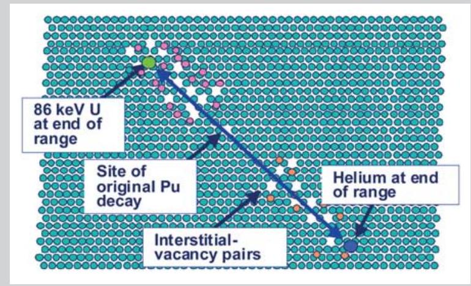
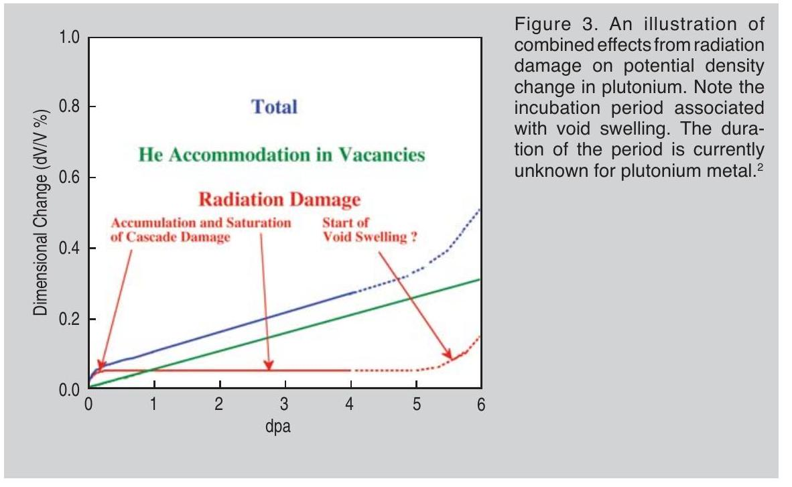
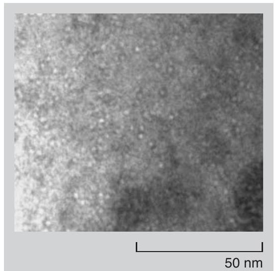
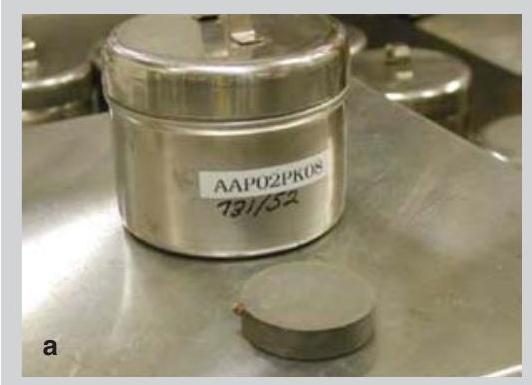
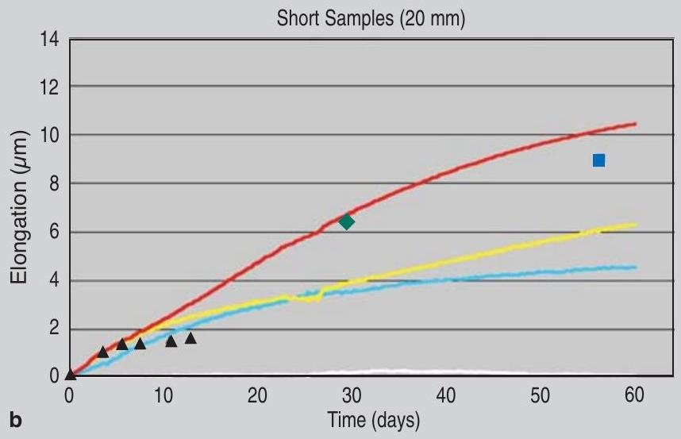
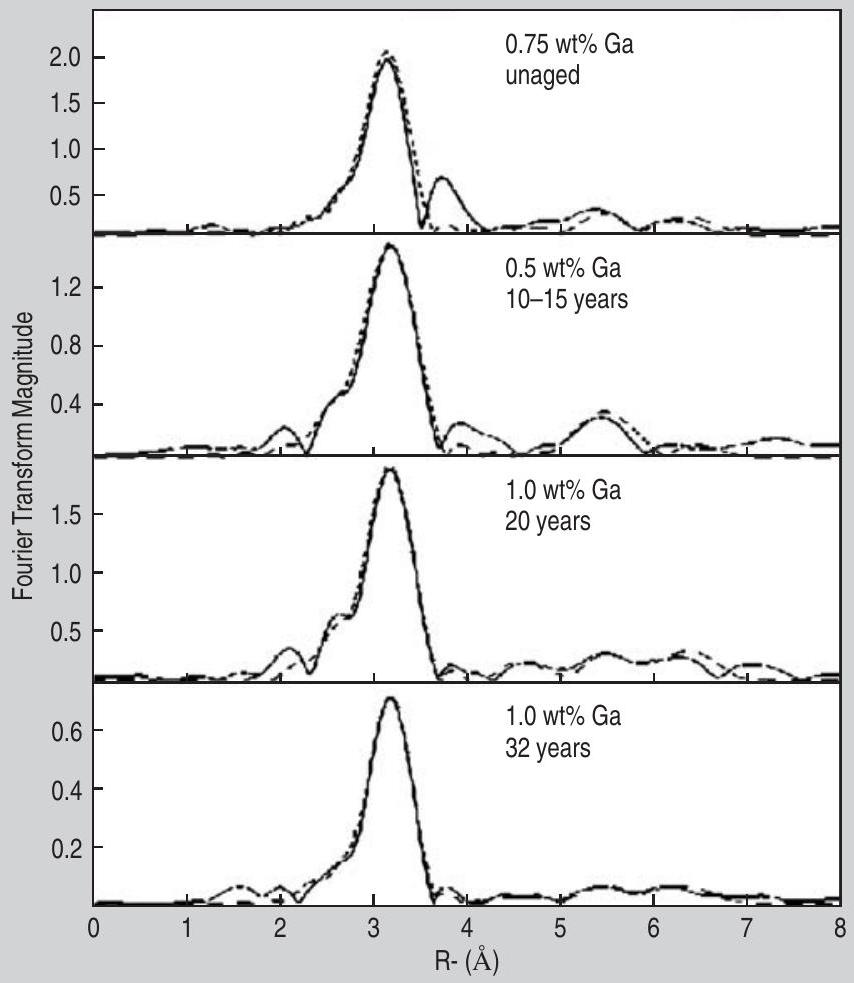

# Plutonium: Aging Mechanisms and Weapon Pit Lifetime Assessment 

Joseph C. Martz and Adam J. Schwartz

Editor's Note: A hypertext-enhanced version of this article is available on-line at www.tms.org/pubs/journals/JOM/0309/Martz0309.html

#### Abstract

Planning for future refurbishment and manufacturing needs of the U.S. nuclear weapons complex critically depends on credible estimates for component lifetimes. One of the most important of these components is the pit, that portion of the weapon that contains the fissile element plutonium. The U.S. government has proposed construction of a new Modern Pit Facility, and a key variable in planning both the size and schedule for this facility is the minimum estimated lifetime for stockpile pits. This article describes the current understanding of aging effects in plutonium, provides a lifetime estimate range, and outlines in some detail methodology that will improve this estimate over the next few years.

## INTRODUCTION

Systematic aging studies on pits for nuclear weapons were initiated a few years ago after the shutdown of the Rocky Flats manufacturing plant in Colorado. During the past 60 years, pit designs, materials, and processes have changed dramatically, resulting in pits that are more robust, safer, and suited for longer storage times. Modern pits consist of hollow, metallic shells containing fissile material at their core. The outer, non-nuclear materials used in pits are selected for properties such as mechanical robustness and integrity as well as corrosion resistance. These materials remain remarkably pristine over decades. Further, modern designs rely on the boost process-the introduction of deuterium/tritium mixtures into the interior-as an essential element of weapon function. Hence, the integrity of pits as gas-pressure vessels is
another important element of weapon function. In this respect as well, the surveillance program has proven that pits are demonstrably robust over decades. Given this positive history with the non-nuclear materials in pits, most concerns with pit aging focus on the behavior and possible degradation of the plutonium.

At the end of this year, the U.S. Nuclear National Security Administration (NNSA) Enhanced Surveillance Campaign has a key deliverable to provide a pit lifetime assessment based on old pit data. In 2006, this assessment will be updated based on further collection and review of old pit data as well as new information expected from the accelerated aging program (described later in this article). Between now and 2006, further experiments, modeling, and design sensitivity calculations on different systems are required to reduce uncertainties regarding lifetime estimates.

## EVALUATION OF THE AGING PROCESS

The approach used to address the aging of pits starts with an identification of the key plutonium properties required to ensure safe and reliable weapon function. These properties (such as density) are selected by knowledgeable design physicists and engineers who will ultimately use them in computer simulations as part of the certification process of a given weapon. This process is quite complicated because for years designers relied largely on testing the devices at the Nevada Test Site to assess performance. Although a substantial amount of work was done to relate performance to specific materials properties, a better understanding is needed as to how key properties
influence weapons performance using advanced tools such as improved codes. Once these properties have been identified, diagnostic tools can be developed to measure them with sufficient precision as determined by the weapon designer. An important aspect of the aging program is the execution of experiments to measure baseline properties of new (zero-aged) material. ${ }^{1}$

Next, materials scientists and chemists identify the aging mechanisms that could potentially alter these properties over time. The three most important potential aging effects in plutonium are the radioactive decay of the various plutonium isotopes (and the impact of this decay on the chemistry, structure, and properties of the material), the thermodynamic phase stability of the plutonium alloy itself, and the corrosion of the plutonium during both storage and function. In many cases, these aging effects accumulate slowly over decades and not necessarily in a linear fashion. Only when key properties have sufficiently changed would a measurable impact on weapon safety or performance be expected. Through the experiments, modeling of the agerelated changes, and design sensitivity studies, the designers attempt to specify the limits of acceptable change for each of these properties by evaluation of the margins associated with each system. By combining these limits with the measured or predicted rates of change due to aging effects, estimates for pit lifetimes are derived.

Each of the three principal aging mechanisms identified is under intensive examination within the Enhanced Surveillance Campaign. This program has four key elements/objectives: measurement of actual properties and trends from the newest to the oldest

Figure 1. An illustration of alpha decay and recoilparticle damage in $\delta$-Pu. ${ }^{2}$

materials available from the stockpile; acceleration of the aging where possible and subsequent measurement of material properties; modeling of aging effects for insertion into design sensitivity analyses; and the development of new diagnostics to identify the signatures of aging as early as possible in order to provide lead time for refurbishment. In parallel, the NNSA Primary Certification Campaign and the Accelerated-Strategic Computing program are developing the computational tools required to address design sensitivity, acquiring the test data (e.g., sub-critical experiments) to quantify key parameters, and developing the expertise to complete the designsensitivity assessment.

## DAMAGE MECHANISMS AND APPLICABILITY TO EVALUATION OF OLD PITS

The oldest plutonium made in the United States and available for analysis is approximately 40 years of age. This plutonium was manufactured by processes somewhat different from the materials in the enduring stockpile. As a result, a direct comparison of this
oldest plutonium to modern alloys may invoke uncertainty, but has provided substantial insight into the aging behavior. Extensive, but incomplete evaluations of this material over the past three years have shown only modest changes in key properties. Nonetheless, these small changes are invaluable in helping to calibrate and refine existing aging models. This oldest plutonium has been crucial in another respect: It exhibits no void-swelling, one of the potentially most troublesome manifestations of self-irradiation damage.

A fundamental aspect in the accumulation of radiation damage in materials is the existence of a threshold beyond which further damage results in rapid swelling and density change. Experience from all materials in reactor environments of similar crystal structure (facecentered cubic [fcc]) to the plutonium alloys in the stockpile shows that the damage results initially in little change in density, but after an incubation period, void swelling begins. The length of this incubation is unknown for weapon-grade plutonium and cannot be predicted.

Figure 2. A bright-field transmission electron micrograph of helium bubbles in 35 year old plutonium alloy. The image was taken using the Fresnel fringe technique at -1.2 mm defocus. The bubbles appear as a dark fringe surrounding a light dot.

The principal decay mechanism for most plutonium isotopes is alpha-particle decay. The parent atom spontaneously decays into a doubly charged helium nucleus (i.e., alpha particle) and a uranium atom (Figure 1). Both of these particles are highly energetic. This initial decay event is rapid and results in considerable local disruption of the crystalline lattice. Based on theoretical considerations, this single decay energizes roughly 20,000 other atoms and displaces approximately 2,400 atoms from their lattice sites. Within the first 200 nanoseconds, about $90 \%$ of these displaced atoms return to a normal lattice position. The remaining 10\% of these atoms are retained in the lattice, where an atom now sits between regular positions on the lattice (known as an interstitial) and the regular lattice positions are empty (known as a vacancy). ${ }^{2}$ The ultimate disposition of these more permanent defects is the principal concern in this evaluation. This accumulation of damage is significant within the time frames of interest: On average, each atom of plutonium has been displaced once every ten years. In addition to the generation of alpha particles that ultimately lead to the formation of helium atoms and helium bubbles, an atom of uranium is also created in each radioactive decay event. Hence, an aging plutonium material becomes enriched in uranium and also americum, which may have implications for long-term phase stability.

Positron annihilation data indicate that the newly formed helium atom immediately fills an unfilled vacancy.

These helium-filled vacancies migrate in the lattice, eventually coalescing as small helium bubbles as shown in the transmission electron microscopy (TEM) image in Figure 2. The heliuminduced changes that result in a slight increase in volume are very small, and if they continue to expand at the predicted rate, design sensitivity calculations indicate that they will not affect performance for pits in excess of 60 years of age. However, the vacancies also have the potential to migrate and accumulate into voids, causing the phenomenon of void swelling discussed previously (Figure 3). These mechanisms are not necessarily independent: Helium likely stabilizes the voids and assists in the accumulation of a critical number of these defects, which defines the incubation period for void swelling. Modeling of these processes requires detailed knowledge of the structure of the lattice and the energy required to nucleate and move these various defects within the crystal structure. These energies are derived from knowledge of the electronic structure of both individual plutonium atoms and the metallic bonds that form between them. The great complexity of interatomic bonding in plutonium has made this a particularly difficult problem to address. Although void swelling models do indeed exist for reactor materials, the best models for plutonium are still incomplete as they lack crucial materials parameters, which cannot easily be measured or computed from fundamental theories for plutonium. Although progress is being made, ultimately, experimental data will be necessary to establish confidence in these models and to reduce the uncertainty in their estimates.

A significant number of macroscopic measurements (such as density), microstructural measurements (optical microscopy, scanning electron microscopy, electron microprobe, TEM, positron annihilation spectroscopy (PAS), extended x-ray absorption fine structure, and resonant ultrasound spectroscopy) and dynamic property measurements have shown rather small or nonexistent changes over 30 to 40 years. However, additional measurements coupled to model development and design sensitivity calculations are
essential to extend this data to longer timeframes and to reduce the uncertainty in margin. This estimation requires considerable expertise in the modeling of aging effects in solid-state materials, particularly in the discipline of radiation damage modeling. It is largely the uncertainties in these models that drive uncertainties in the minimum estimates for pit lifetimes.

## ACCELERATED AGING METHODOLOGY

The need for fundamental aging data helps drive the second objective of the Enhanced Surveillance Campaign's technical element on pits: the accelerated aging of plutonium. The process of alpha decay within plutonium can be accelerated by the addition of isotopes with shorter half-lives. An alloy of normal weapon-grade plutonium mixed with 7.5\% of the Pu-238 isotope will accumulate radiation damage at a rate 16 times faster than weapon-grade material alone. This is a useful tool to evaluate extended-aged plutonium (up to 60 years equivalent and possibly beyond) within a few years. The 16 times multiplier factor is based on the known decay rates of the isotopes in the alloy. It should be kept in mind that this multiplier is based on the cumulative displacements per atom (dpa) in the enriched material, but the influence of
the rate at which dpa has been delivered is not known at this time. Critically, acceleration of the input of radiation damage must be matched by acceleration of the subsequent annealing and diffusion of that damage. This subsequent acceleration is achieved by raising the temperature at which the samples are stored. These processes are thermal in nature, and the activation energy (energy required to activate a process) is different for each specific mechanism. Unfortunately, there is no single temperature at which the thermal diffusion of this damage will be equivalently and perfectly matched to the initial acceleration of the damage input. As a result, the accelerated aging experiments are carried out at three different temperatures.

Thus, the accelerated aging method is only approximate and not a perfect match to the actual aging of materials in the stockpile. Hence, a large portion of the accelerated aging work focuses on comparing the accelerated-aged material with naturally aged plutonium in an effort to calibrate the technique and build confidence that estimates for things like storage temperature are accurate. Nonetheless, findings from the accelerated aging program are essential in order to gather experimental data for key mechanisms such as void swelling and its associated incubation period.

Figure 4. (a) A photograph of one of the accelerated aging alloys cast in 2002. This material was spiked with ${ }^{238} \mathrm{Pu}$ at a concentration of $7.5 \%$, resulting in an alloy that accumulated radiation damage at a rate 16 times faster than normal. (Photo courtesy of J. David Olivas, Los Alamos National Laboratory.) (b) In-situ dilatometry data taken from the spiked alloys. The initial transient is clearly visible. (Data courtesy of Bartley Ebbinghaus, Lawrence Livermore National Laboratory.)

Figure 5. XAFS data from new and old plutonium illustrating the initial appearance and subsequent disappearance with age of a non-fcc feature at 3.8 Angstroms. (Data courtesy of S.D. Conradson, Los Alamos National Laboratory.)

Even if the process is not perfectly replicated, the models are sufficiently sophisticated to use data from the accelerated aging program to refine estimates of the incubation period and rate for weapons-grade material. Both Los Alamos and Lawrence Livermore National Laboratories produced accelerated-aging alloys in 2002 and are currently under study (Figure 4a). The initial results taken from in-situ dilatometry data (Figure 4b) indicate these alloys exhibit the same initial transient as weapons-grade alloys.

## THERMODYNAMIC STABILITY OF PLUTONIUM ALLOYS

Another concern is the thermodynamic phase stability of the plutonium alloy itself. The $\delta$-phase in unalloyed plutonium is stable between about $310^{\circ} \mathrm{C}$ and $415^{\circ} \mathrm{C}$ but can be retained to room temperature by the addition of small quantities of alloying agents such as aluminum or gallium. The $\delta$-phase alloy is a ductile, copper-like material that is easily fabricated and is thus preferred for weapon use. Plutonium-
gallium alloys have been widely studied since the earliest days of the Manhattan Project. The phase diagram of the Pu-Ga system indicates that the $\delta$-phase is in fact metastable thermodynamically and should transform to a mixture of two equilibrium phases ( $\alpha+\mathrm{Pu}_{3} \mathrm{Ga}$ ) of different compositions at relatively low temperature (as shown in Figure 3 on page 15). ${ }^{3}$ The situation then would become more complicated if two compositionally different phases were present. Such decomposition is predicted to be very slow, in the time frame of thousands of years. ${ }^{4}$ However, this process could be made faster if the diffusion of atoms needed to form the equilibrium phases were to be increased by radiation damage or any local heating. This has not been observed or widely investigated, but constitutes a valid concern. In addition, another decomposition process is known to take place on cooling, which can bring about a transformation to the denser, metastable phase (known as alpha prime) without a change of composition and requiring very little diffusion to initiate nucleation. Such "isothermal
martensitic" transformations have been studied quite extensively, using cooling, heating, and holding experiments. They have not been observed in freshly made weapons-grade plutonium alloys at temperatures of manufacturing, but they could occur during aging. Formation of this two-phase $\alpha^{\prime}$ - and $\delta$ - microstructure would, of course, affect numerous physical and metallurgical properties.

As a tool to study the initial potential changes in these materials, x-ray absorption fine-structure spectroscopy (XAFS) has proven very useful in characterizing gallium-stabilized $\delta$-phase alloys, not only because of its ability to separately determine the environments of both major (plutonium) and minor (gallium) elements, but also because it is ideally suited to elucidate minor components of the local environment in the crystalline structure. In newly prepared $\delta$-Pu alloys for example, x-ray absorption measurements reveal evidence for a second arrangement of atoms or a minor amount of a second crystalline structure where there is a deficiency of gallium atoms (Figure 5). This second-phase material disappears rapidly with age, and this discovery prompted Jeanloz to observe that the crystallinity of $\delta$-plutonium actually increases with age. ${ }^{5}$ A more recent and detailed study using high-resolution x-ray absorption and x-ray diffraction reveals that the main $\delta$-phase retains good long-range order for ages exceeding 40 years, but that asymmetry in certain diffraction peaks is also growing in with age, presumably due to accumulated irradiation damage. The influence of the radiation-damage processes (discussed previously) on phase stability is still unknown and therefore continues to represent an uncertainty in the evaluation of plutonium aging.

## CORROSION OF PLUTONIUM ALLOYS

Finally, corrosion of plutonium is potentially the most catastrophic of all aging effects. ${ }^{6}$ Fortunately, corrosion is both limited by the availability of corrosive agents and relatively easily studied. Whereas plutonium will readily oxidize given sufficient exposure to air or other oxidizing environments, it is hydrogen-catalyzed corrosion that is of greatest concern. Most importantly
from a pit aging perspective is the maintenance of well-sealed pits and the exclusion of foreign contaminants during pit production. The employment and insurance of robust cleaning methods during the final stages of pit manufacture are essential. Experience from stockpile surveillance programs reflects this point: Pits have remained remarkably pristine and free of corrosion, especially since the adoption of modern cleaning and sealing methods.

## THE MINIMUM ESTIMATE OF PIT LIFETIME

On the basis of careful evaluation of the effects described in this article and through extensive characterization of old pits, modeling, and preliminary design sensitivity calculations, initial estimates of minimum pit lifetimes have been derived. Evaluation of the oldest samples of plutonium metal, both metal of oldest absolute age (40 years) as well as the oldest samples most directly comparable to the enduring stockpile (25 years) have shown predictably stable behavior. The many properties that have been measured to date, such as density and mechanical properties, have shown only small changes, and detailed microstructural studies have been correlated to these changes in properties. The response of each system to potential changes is specific to each design. Based on this assessment, current estimates of the minimum age for replacement of pits is between 45 and 60 years. Additional data and analysis coupled with further design sensitivity studies are needed to refine minimum lifetime estimates for each system. It is possible these studies may show that certain systems exhibit lifetimes shorter than the stated 45 years or longer than 60. In the most conservative case that lifetimes are found to be less than 45 years of age, mitigation methods currently exist to extend these lifetimes to a 45-year minimum.

The principal uncertainty in these estimates relates to the incubation periods inherent in radiation damage effects. Certain key variables in these models (such as the energy of defects and the nature of plutonium bonds) are still uncertain enough that future estimates will require benchmarking against more extensively aged samples
and data. Additional uncertainty arises from the intrinsic scatter in much of the experimental data (necessitating a statistically based analysis of much of this information) as well as uncertainties on the influence of certain changes on weapon performance. In design sensitivity studies, some of these uncertainties are mitigated by applying pessimistic assumptions to the models. Thus, the bounding calculations are a valid tool for assessments of this type. In some specific circumstances, pit performance may be found to be extremely sensitive to slight changes in certain properties, more sensitive than current diagnostics can reliably detect. In this case, careful review of data combined with modeling can provide an estimate of change, which is useful to designers in establishing acceptable limits. Continuing research is necessary and will strengthen the linkage between the plutonium microstructure and changes resulting from aging, key properties, and weapons performance as determined by prior nuclear tests.

## REDUCING THE UNCERTAINTIES

The current program is aimed at quantifying the margins and uncertainties and improving fundamental understanding in order to increase confidence in the lifetime estimate. The methodology for this is based on design sensitivity analyses. Extensive experiments are conducted on new and aged material. Age-dependent models are then developed based on the experimental data, science-based computational methods and models, and conservative assumptions. These models are then inserted into the design codes to calculate the change in performance based on the predicted change in properties. To provide crucial data for the design sensitivity analysis and aid in focusing research efforts, extensive measurements of stockpile-aged plutonium are continuing. A series of additional experiments and measurements will occur between now and 2006. These include various dynamic experiments (gas guns, laser shock experiments, intermediate strain rate Kolsky-Hopkinson bar measurements, U1a experiments, etc.) to supplement the existing database as well as the careful, in-situ examina-
tion of the accelerated aged alloys (via dilatometry, resonant ultrasound spectroscopy, electron microprobe analysis, TEM, PAS, and other techniques). All of this data serve the common goal of trending changes in key properties and understanding the evolution of microscale processes (ingrowth of decay product, buildup of radiation damage) that affect macro-properties of the material (density, strength, etc.).

## ACKNOWLEDGEMENT

This work was performed under the auspices of the U.S. Department of Energy by University of California, Lawrence Livermore National Laboratory under contract No. W-7405-Eng-48.

## Recommended Reading

-"Challenges in Plutonium Science," Los Alamos Science, ed. N. Cooper, 26 (2000).
-S.S. Hecker and J.C. Martz, "Plutonium Aging: from Mystery to Enigma," Proceedings of the Oxford Conference on Ageing Studies and Lifetime Extension of Materials (Dordrecht, The Netherlands: Kluwer Academic/Plenum Publishers, 1999).
-"Challenges in Plutonium and Actinide Materials Science," MRS Bulletin, ed. L.J. Terminello, 26 (9) (September 2001), pp. 667-707.

## References

1. An example of these important measurements includes the series of subcritical tests at the U1a facility at the Nevada Test Site. These measurements help to describe the equation-of-state and other dynamic properties of plutonium.
2. An interstitial/vacancy pair is known collectively as a "Frenkel pair." Calculations show that each plutonium decay results in the generation of roughly 2200 Frenkel pairs-2000 from the uranium recoil and 200 from the alpha particle itself. A more extensive account of radiation damage in plutonium is given by W.G. Wolfer, Los Alamos Science, 26 (1) (2000), p. 274.
3. J. Ellinger, J. Nucl. Mater., 12 (1964), p. 226.
4. S.S. Hecker and L.F. Timofeeva, Los Alamos Science, 26 (1) (2000), p. 244.
5. R. Jeanloz, "Science-Based Stockpile Stewardship," Physics Today, 53 (12) (2000), pp. 44-49.
6. J.M. Hashcke and J.C. Martz, "Plutonium Storage," in the Encyclopedia of Environmental Analysis and Remediation (New York: John Wiley and Sons, 1999), p. 3740 .

Joseph C. Martz is with Los Alamos National Laboratory. Adam J. Schwartz is a staff scientist in the Materials Science and Technology Division at Lawrence Livermore National Laboratory.

For more information, contact J.C. Martz, Los Alamos National Laboratory, Enhanced Surveillance, MST-DO, Los Alamos, New Mexico 87545; (505) 667-2323; e-mail jmartz@lanl.gov.

