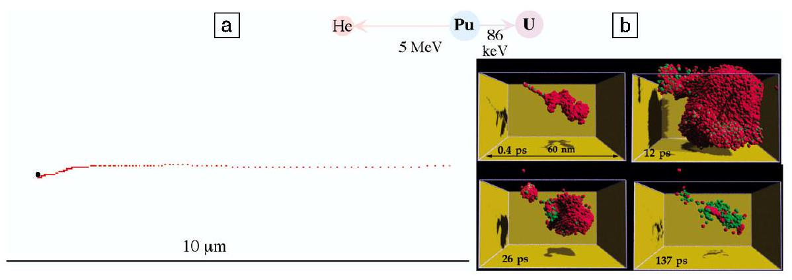
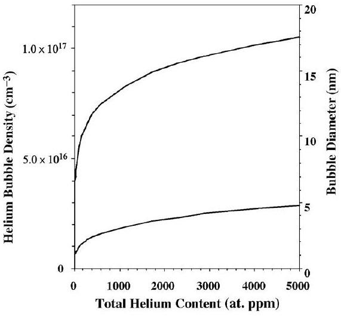
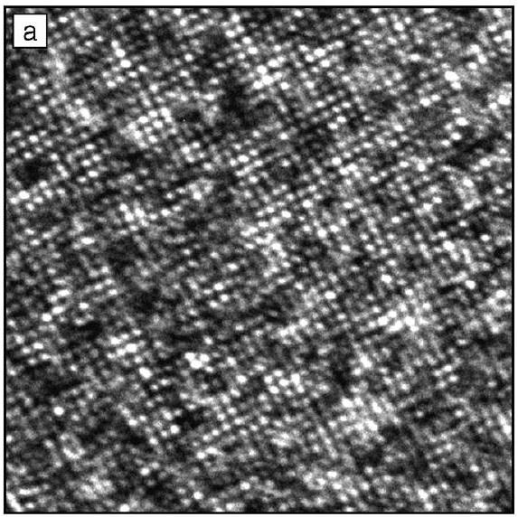
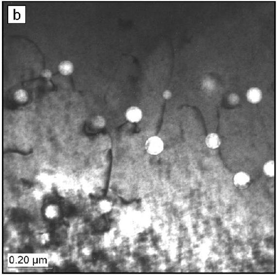
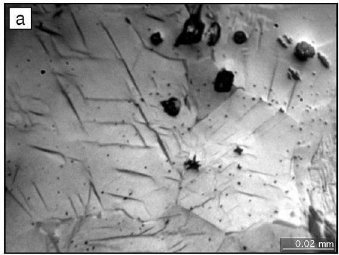
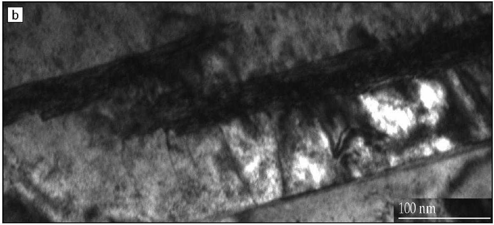

# Fundamental Studies of Plutonium Aging 

Brian D. Wirth, Adam J. Schwartz, Michael J. Fluss, Maria J. Caturla, Mark A. Wall, and Wilhelm G. Wolfer

## Introduction

Plutonium metallurgy lies at the heart of science-based stockpile stewardship. ${ }^{1-3}$ One aspect is concerned with developing predictive capabilities to describe the properties of stockpile materials, including an assessment of microstructural changes with age. Yet, the complex behavior of plutonium, which results from the competition of its $5 f$ electrons between a localized (atomic-like or bound) state and an itinerant (delocalized bonding) state, ${ }^{4,5}$ has been challenging materials scientists and physicists for the better part of five decades. ${ }^{6}$ Although far from quantitatively absolute, electronic-structure theory provides a description of plutonium that helps explain the unusual properties of plutonium, as recently reviewed by Hecker. ${ }^{5}$ (See also the article by Hecker in this issue.) The electronic structure of plutonium includes five $5 f$ electrons with a very narrow energy width of the $5 f$ conduction band, which results in a delicate balance between itinerant electrons (in the conduction band) or localized electrons and multiple lowenergy electronic configurations with nearly equivalent energies. ${ }^{4,5}$ These complex electronic characteristics give rise to unique macroscopic properties of plutonium that include six allotropes (at ambient pressure) with very close free energies but large ( $\sim 25 \%$ ) density differences, a lowsymmetry monoclinic ground state rather than a high-symmetry close-packed cubic phase, compression upon melting (like water), low melting temperature, anomalous temperature-dependence of electrical resistance, and radioactive decay. ${ }^{5}$ Additionally, plutonium readily oxidizes and is toxic; therefore, the handling and fundamental research of this element is very challenging due to environmental, safety, and health concerns.

Unalloyed Pu has a dense, monoclinic structure ( $\alpha$ phase) at room temperature that is extremely brittle and highly reactive.

The remarkably less dense but more ductile fcc $\delta$ phase is stable between temperatures of $360^{\circ} \mathrm{C}$ and $463^{\circ} \mathrm{C} .^{7}$ Not surprisingly, the $\delta$ phase is preferred by Pu metallurgists and can be stabilized down to room temperatures by the addition of Group IIIb elements like aluminum and gallium. ${ }^{8,9}$ The binary phase diagrams have been extensively studied during the period of 1950-2000. ${ }^{7-14}$ Thus, it is well established that additions of Al, Ga, and Am promote the stability of the $\delta$ phase, while additions of U and Np reduce the stability of the $\delta$ phase, although the underlying mechanisms responsible for this behavior are not well understood. ${ }^{5}$

While the binary phase diagrams have been studied extensively, the kinetics responsible for transitions to thermodynamic equilibrium are often sluggish at best, especially near room temperature, making equilibrium difficult to determine. Indeed, Timofeeva and co-workers ${ }^{8,14}$ have recently shown that the U.S. phase diagram for the Pu-Ga system may not be correct and that the Pu-Ga $\delta$ phase is not stable at room temperature, but instead is only metastable. Timofeeva demonstrated that at $\sim 100^{\circ} \mathrm{C}, \delta$-Pu-Ga undergoes a eutectoid transformation to the monoclinic $\alpha$ phase and the intermetallic $\mathrm{Pu}_{3} \mathrm{Ga}$, and thus thermodynamic equilibrium at temperatures below $100^{\circ} \mathrm{C}$ is a two-phase mixture. ${ }^{8,14}$ However, the $\delta$-to- $\alpha+\mathrm{Pu}_{3} \mathrm{Ga}$ transformation is diffusional in nature and in this case is exceedingly slow. Timofeeva's work experimentally confirms the true equilibrium phase diagram and Pu-Ga $\delta$-phase metastability as previously calculated by Adler from thermochemical data. ${ }^{13}$ Of perhaps greater importance is a displacive or martensitic phase transformation from $\delta$ to $\alpha^{\prime}$ (note that $\alpha^{\prime}$ is a slightly modified monoclinic $\alpha$ phase containing insoluble Ga ), known to occur at low temperatures. Yet, the kinetics of this transformation,
including effects of local stress, plastic accommodation, and radiation-induced transmutants and mass transport, are only partially understood.

The radioactive decay of Pu presents another challenge to understanding this unique material and its evolution toward thermodynamic equilibrium. Through a combination of $\alpha$ and $\beta$ decay, Pu transmutes to form both insoluble He and impurities that likely stabilize (Am) and possibly destabilize ( U and Np) the fcc $\delta$ phase. ${ }^{3,5}$ This ingrowth occurs at a rate of approximately 41 at . ppm He per yr, 75 at. ppm Am per yr, 35 at. ppm U per yr, and 6 at. ppm Np per yr. ${ }^{3}$ In addition to transmutation, the decay of Pu produces radiation damage and thus high populations of point defects (vacancies and selfinterstitial atoms) and defect clusters. Radiation damage from $\alpha$ decay in plutonium occurs at a rate of $\sim 0.1 \mathrm{dpa} / \mathrm{yr}$ (displacements per atom per year). ${ }^{15}$ While the majority of displaced atoms quickly return to lattice sites, the remaining vacancies and self-interstitials drive microstructural evolution. Experience from the nuclear-energy industry has demonstrated the microstructural consequences of radiation exposure, which include the nucleation and growth of extended defects such as voids (swelling) and gas bubbles, changes in dislocation structures, and acceleration and alteration of normal alloy phase-decomposition sequences. The corresponding consequences to mechanical properties typically include hardening, reductions in ductility and fracture toughness, higher creep rates, lower creep rupture times, and increased susceptibility to various environmentally assisted cracking processes. ${ }^{16-20}$

Our approach to studying Pu metal and alloys involves coupling experimental and modeling techniques to monitor the aging of old material, in addition to fundamental studies of key defect production and transport mechanisms. The ultimate objective is to predict property changes of Pu-Ga alloys during aging and thus develop quantitative predictions of their useful storage life. In this brief article, we will focus on the development of a fundamental understanding of radiation damage and defect accumulation obtained through this close coupling of experiments and modeling, as well as illustrate some examples of our recent work to characterize Pu microstructures and phase stability obtained through transmission electron microscopy (TEM).

## Alpha Decay

Radiation damage, including the selfinduced damage of $\alpha$ decay, can signifi-
cantly alter the underlying material microstructure and thus impact a wide range of materials properties. Microstructural evolution results from the generation of primary damage in spatially correlated high-energy displacement cascades and the subsequent diffusion, clustering, and longrange transport of the vacancy and selfinterstitial defects, which are inherently coupled to solute and impurity diffusion. A key to understanding and predicting radiation damage and its attendant consequences is developing fundamental knowledge of both the primary defect production and the defect diffusion and clustering kinetics. The primary source of damage in Pu metal and alloys arises from $\alpha$ decay, as illustrated in Figure 1.

The $\alpha$ decay of a plutonium atom produces an $\alpha$ particle of $\sim 5 \mathrm{MeV}$ and a uranium recoil atom of $\sim 86 \mathrm{keV}^{3,15}$ The spatial distribution and character of the damage produced by these two particles are very different in nature, and yet it is the eventual interaction and evolution of these spatially uncorrelated primary defects that may, over time, drive materials evolution and aging processes, thus producing microstructural changes over time scales as long as many decades. The fast moving $\alpha$ particle has a range of approximately $10 \mu \mathrm{~m}$, losing the majority of its kinetic energy through electronic excitations and undergoing a long track of lowenergy atomic collisions. Figure 1a shows a calculated He ion track; each red dot represents an atomic collision that transfers $\sim 50 \mathrm{eV}$, and the black dot represents the location of the He nucleus when it comes to rest. The calculation was performed within the binary collision approximation, using the simulation program TRIM (TRansport of Ions in Matter). ${ }^{21}$ The primary defects produced along the He track are largely isolated Frenkel (vacancy
and self-interstitial) pairs ( $\sim 350$ Frenkel pairs per decay, represented by the red dots in Figure 1a) and the He atoms themselves (represented by the black dot in Figure 1a), which come to rest in the Pu lattice $\sim 10 \mu \mathrm{~m}$ from their birth in the decay event.

On the other hand, the fast-moving $\sim 86-\mathrm{keV}$ U recoil has a negligible mass difference with Pu and rapidly undergoes a branching series of high-energy, nearly elastic collisions, which in turn produces secondary collisions and generates a cascade of vacancy and self-interstitial defects. High-energy displacement cascades evolve over very short times ( $\sim 100 \mathrm{ps}$ ) and small volumes, with characteristic length scales of 50 nm or less, and are directly amenable to molecular-dynamics (MD) simulations. The physics of primary damage production in high-energy displacement cascades has been extensively studied with MD simulations. ${ }^{22-24}$ The key conclusions of the high-energy ( $>20 \mathrm{keV}$ ) simulations are (1) intracascade recombination of vacancies and self-interstitials results in $\sim 25 \%$ of the defect production expected from displacement theory (e.g., $\sim 575$ compared to $\sim 2300)$; ${ }^{15,25}(2)$ many-body collision effects produce a spatial correlation (separation) of the vacancy and selfinterstitial defects; (3) substantial clustering of the self-interstitials and, to a lesser extent, the vacancies occurs within the cascade volume; and (4) high-energy displacement cascades tend to break up into lobes or subcascades, which may also enhance recombination. ${ }^{23-25}$

The lack of reliable semiempirical interatomic potentials and electronic-structure methods hinders our ability to directly simulate the high-energy U recoil in Pu; we have used low-melting-temperature, fcc metals as surrogates. Figure 1b shows a sequence of "snapshots" from an MD

Figure 1. Alpha decay in plutonium produces an $\alpha$ particle of $\sim 5 \mathrm{MeV}$ and a uranium recoil atom of $\sim 86 \mathrm{keV}$. (a) A representative He ion track, with each red dot representing a low-energy atomic collision and the black dot representing the resting position at the end of the approximately 10- $\mu \mathrm{m}$ range. (b) Heavy uranium recoil produces a dense collision cascade over a $\sim$ 50-nm region, shown in a series of molecular-dynamics "snapshots" (red spheres represent self-interstitial atoms; green spheres are vacancy sites).

simulation of an $80-\mathrm{keV}$ displacement cascade in lead, performed on highly parallel ASCI (Accelerated Strategic Computing Initiative) supercomputers with 10 million atoms for a total time of 200 ps . The first few collisions occur at very high energy, approximately several kiloelectronvolts, and the cascade splits into subcascades, two of which can be observed in Figure 1b. The number of displaced atoms and the energy density increase rapidly within the cascade volume, reaching a peak within about 10 ps , at which time the center of the cascade (or subcascades) has a liquidlike structure and then slowly cools, due to the high atomic mass and low melting temperature, over about 100 ps . The final damage produced is highly spatially correlated, unlike the $\alpha$-particle track, forming groups of self-interstitial and vacancy clusters.

It is unlikely that we can experimentally capture all of the dynamics of the recoil cascade. However, it may be possible in a self-irradiating material like Pu to validate the cooled cascade structure by performing in situ TEM observations at ultralow temperatures that essentially freeze the cascade structure in place. A key to such an experiment is the accurate TEM image simulation of the MD predictions. This is a capability that we are jointly developing with R. Schaublin and co-workers at École Polytechnique Fédérale de Lausanne (EPFL) and the Paul Scherrer Institute (PSI) in Switzerland. Experiments built on this capability may now be feasible and are likely to provide additional insight into the details of the important source-term structure. One can also imagine "following" the annealing of these features and thereby validating and refining the subsequent kinetics calculations that describe the mass-transport processes and damage accumulation.

## Isochronal Annealing

Defect diffusion and clustering kinetics represent the other main ingredients required for the reliable prediction of microstructural evolution resulting from Pu $\alpha$ decay. These properties can be determined experimentally by monitoring the change in electrical resistance during lowtemperature ( $\sim 10 \mathrm{~K}$ ) irradiation and subsequent isochronal annealing. However, the complex $5 f$ electronic structure and behavior of Pu make data analysis very challenging, and thus we use kinetic Monte Carlo (KMC) simulations of defect evolution during a simulated isochronal annealing history to complement data interpretation.

The annealing recovery and defect kinetics of fcc metals following low-
temperature electron irradiation have been extensively studied over the past 30 years and are defined by five recovery stages. ${ }^{26}$ Stage I occurs at low temperatures, typically a small fraction of the melting temperature, $0.02 T_{m}$, with the annihilation of mobile self-interstitial atoms, largely through recombination with immobile vacancies combined with a lesser degree of self-interstitial clustering and trapping at impurities. Electron irradiation of metals produces predominately isolated Frenkel pairs, and the smaller amount of recovery observed in Stage II is generally attributed to the migration of small self-interstitial clusters and the de-trapping of selfinterstitials from impurities. At higher temperatures, $\sim 0.2 T_{\mathrm{m}}$, the vacancies begin to migrate, and Stage III recovery results from vacancy annihilation and clustering. Stage IV is attributed to vacancy interactions and de-trapping from impurities. Annealing is complete after Stage V at temperatures of $\sim 0.45 T_{\mathrm{m}}$, with the dissolution of vacancy clusters. ${ }^{26}$

Figure 2 shows the isochronal annealing recovery (up to temperatures of $\sim 400 \mathrm{~K}$ ) for an irradiated Pu-Ga alloy measured experimentally (Figure 2a) and predicted by KMC simulation (Figure 2b) following low-temperature $(\sim 10 \mathrm{~K})$ irradiation by both $3.8-\mathrm{MeV}$ protons and self-induced $\alpha$ decay. The primary damage produced by high-energy proton irradiation is similar to that produced by electrons and consists of predominately isolated Frenkel pairs, while the self-induced $\alpha$ decay produces both isolated point defects from the He ion track and a dense, high-energy collision cascade. The difference in primary damage state is clearly visible in the lowtemperature (Stages I and II) annealing recovery and the completion of Stage V.

The proton-irradiated specimen exhibits a slow recovery from about 30 K to 150 K , while the self-irradiated specimen shows
a sharp, well-defined recovery stage at about 45 K , consistent with previous selfirradiation and annealing recovery studies of Pu-Al alloys. ${ }^{27}$ We believe the sharp recovery stage in the self-irradiated specimen is actually Stage II recovery and arises from the rapid one-dimensional diffusion and annihilation of the relatively large self-interstitial clusters directly formed in displacement cascades. The more sluggish and extended recovery in the protonirradiated specimen is a consequence of the evolution of isolated self-interstitials, likely including strong interactions (trapping and de-trapping) with impurities and clustering, albeit with smaller cluster sizes than those directly produced in cascades, which undergo one-dimensional diffusion. Similar (to the proton) Stage I/II behavior is commonly observed in electronirradiated alloys and metals with large impurity concentrations. ${ }^{26}$ KMC simulations predict qualitatively similar Stage I/II behavior for the proton and self-irradiated specimens, respectively, and provide key insight into the annealing kinetics. The simulations and experimental results currently are in good agreement regarding the annealing recovery temperatures, but are not as good for the magnitude of recovery. Some of this discrepancy may be due to specimen beam-heating during the low-temperature proton irradiation, and thus Stage I is difficult to precisely determine experimentally.

Stage III recovery associated with vacancy migration occurs at about 190 K in both the proton- and self-irradiated specimens and is also captured in the KMC simulations. Annealing recovery is essentially complete for the proton-irradiated specimen at about 320 K , while a slight shift to higher temperatures is observed for the self-damaged specimen. The shift of Stage V to higher recovery annealing temperatures is consistent with a popula-
tion of slightly larger vacancy clusters in the self-irradiated specimen. Again, the KMC simulations capture the qualitative behavior of the Stage V shift, although additional modeling is clearly required to further validate our understanding of both the primary damage production and the defect kinetics.

## Helium Accumulation

As described previously, the buildup of He occurs at a rate of $\sim 41$ at. ppm per yr. It is reasonable to expect that the insoluble He gas will quickly cluster to form bubbles. Indeed, atomistic studies of He vacancy interaction in nickel and other fcc metals show that helium vacancy cluster complexes are strongly bound. ${ }^{28}$ As a result, a critical helium bubble nucleus consists of just two helium atoms and one or two vacancies at these relatively high helium generation rates. Figure 3 shows the results of a model prediction for the He bubble density and diameter during aging, assuming that helium undergoes substitutional diffusion, with an activation energy of 0.68 eV at $35^{\circ} \mathrm{C}$ and only considering the average bubble size. Experimental positron-annihilation lifetime measurements by Colmenares and Howell of 21 - and 35 -yr-old Pu-Ga alloys indicate the existence of He -vacancy complexes with a ratio of $\sim 1 \mathrm{He} /$ vacant site. ${ }^{29,30}$ TEM characterization of aged $\mathrm{Pu}-\mathrm{Ga}$ alloys is currently under way to verify the modeling predictions of Wolfer. The ability to image $1-\mathrm{nm}$ microstructural features in the TEM is a challenging endeavor, made even more difficult by the highly oxidizing surface of a freshly prepared Pu specimen. A highly refined specimen-preparation procedure, coupled with an excellent glovebox atmosphere, essentially eliminates the introduction of stress, temperature, and reactive

Figure 3. Model predictions of He bubble number density and mean diameter as a function of age.

Figure 2. The isochronal annealing recovery of a Pu-Ga alloy following low-temperature ( $\sim 20 \mathrm{~K}$ ) irradiation with $3.8-\mathrm{MeV}$ protons (green and red, representing two distinct experimental measurements) and the self-damage from $\alpha$ decay (black). (a) Experimentally measured change in resistance; (b) kinetic Monte Carlo simulation results of the change in defect density, along with the annealing Stages I, II, III, and V (Stage IV not shown).
gases, as evident by the atomic-resolution image of $\delta$-Pu-Ga along a [001] zone axis shown in Figure 4a.

We have characterized large, $\sim 35-\mathrm{nm}$ He bubbles in a 35 -yr-old Pu-Ga alloy that was annealed at $400^{\circ} \mathrm{C}$ to coarsen the bubble microstructure, as shown in Figure 4b. A uniform dispersion of He bubbles is observed, many of which appear attached to one or more dislocations. Calculations are currently under way to determine the He pressure within the bubbles through evaluation of the dislocation curvature. Analysis of numerous micrographs provides a bubble number density of $6.5 \times 10^{13} / \mathrm{cm}^{3}$ with an average diameter of 35 nm and a volume fraction of $\sim 0.15 \%$. The influence of age, and thus He content, on bubbles is evident by the smaller bubble populations observed in annealed Pu-Ga alloys of 17 -yr-old material. ${ }^{31,32}$

Figure 4. (a) Atomic-resolution transmission electron microscope (TEM) image of a $\delta$-phase Pu alloy along the [001] zone axis. The shortest distance between white dots is 0.23 nm . (b) Bright-field TEM image revealing helium bubbles and the associated dislocation structure.

## Phase Stability

The stability of $\delta$-phase Pu-Ga alloys during aging is also a fundamental concern, especially considering the evolving microstructure resulting from radiation decay and transmutants. The nondiffusive, or displacive, martensitic phase transformation remains among the most challenging problems to understand in physical metallurgy, and Pu-Ga alloys present one of the more extreme examples. Here, the $\delta$-to- $\alpha^{\prime}$ phase transformation results in a density change of approximately $20 \%$, ensuring that stress and plastic accommodation play central roles in governing the details of the transformation. Microstructural characterization and determination of the phase-transformation hysteresis by electrical resistometry will provide key parameters required to model the influence of microstructural changes on the hysteresis width. Our approach is to balance the thermodynamic driving force (Gibbs free energies of the phases calculated from the phase diagram) with the mechanical properties of the $\delta$ matrix (the retarding force).

Both new and naturally aged alloys have been cooled to various temperatures to evaluate the influence of age on the transformation temperature and the martensite volume fraction. Figure 5a is an

optical-light micrograph of $\alpha^{\prime}$ martensite laths formed in the $\delta$-phase matrix after cooling to $-118^{\circ} \mathrm{C}$ and holding for 1000 s . After this low-temperature excursion, the average size of the martensite precipitates is $20 \mu \mathrm{~m}$ long by $2 \mu \mathrm{~m}$ wide. Notably, we observe both increasing martensite size and increasing number fraction with increasing time at temperature, thus confirming the isothermal nature of this transformation. A number of variants are observed within each grain and help to reveal the crystallographic nature of the displacive phase transformation. The TEM image in Figure 5b shows two such $\alpha^{\prime}$ particles imbedded in the $\delta$ matrix. An increased dislocation density is clearly visible at the $\alpha^{\prime}-\delta$ matrix interface, indicating that coherency strains and plastic deformation are important components of the accommodation of the large volume change.

## Summary and Outlook

A coupling of theory, modeling, and experiments is under way to elucidate the fundamental mechanisms of radiation damage and phase stability in plutonium. Radioactive decay of Pu results in significant local lattice damage, while at the same time producing the ingrowth of insoluble He and impurities that likely stabilize (Am) and destabilize (U, Np) the fcc $\delta$ phase. The combination of lattice damage and transmutation results in a microstructure that evolves with age. A combination of atomistic simulations, lowtemperature irradiation, and isochronal annealing recovery experiments is under way to develop a detailed understanding of primary damage production, defect clustering, and transport kinetics, which is key to understanding and predicting radiation damage and its attendant consequences to microstructures and properties. The spatial character of the high-energy

Figure 5. (a) Optical-light micrograph of a $\delta$-phase Pu alloy cooled to $-118^{\circ} \mathrm{C}$ to induce the $\delta$-to- $\alpha^{\prime}$ phase transformation. (b) Bright-field TEM image of two small $\alpha^{\prime}$ particles in the $\delta$ matrix.

U-recoil displacement cascades is evident in the low-temperature (Stages I and II) annealing recovery stages and a shift of Stage V recovery to higher temperatures than for proton irradiation. Finally, the characterization of aged Pu-Ga alloys is under way to identify small, $\sim 1-\mathrm{nm}$ He bubbles predicted by models and to quantify the effect of age on $\delta$-phase stability.

## Acknowledgments

This work was performed under the auspices of the U.S. Department of Energy by the University of California, Lawrence Livermore National Laboratory, under contract No. W-7405-Eng-48.

## References

1. S.D. Drell, Phys. Today 12 (2000) p. 25.
2. R. Jeanloz, Phys. Today 12 (2000) p. 44.
3. S.S. Hecker and J.C. Martz, in Los Alamos Science, No. 26, edited by N.G. Cooper (Los Alamos National Laboratory, Los Alamos, NM, 2000) p. 238.
4. A.M. Boring and J.L. Smith, in Los Alamos Science, No. 26, edited by N.G. Cooper (Los Alamos National Laboratory, Los Alamos, NM, 2000) p. 90.
5. S.S. Hecker, in Los Alamos Science, No. 26, edited by N.G. Cooper (Los Alamos National Laboratory, Los Alamos, NM, 2000) p. 290.
6. For example, see Los Alamos Science, No. 26, edited by N.G. Cooper (Los Alamos National Laboratory, Los Alamos, NM, 2000).
7. D.E. Peterson and M.E. Kassner, in Binary Alloy Phase Diagrams, 2nd ed., edited by T.B.

Massalski, H. Okamoto, P.R. Subramanian, and L. Kacprzak (ASM International, Materials Park, OH, 1990) p. 1843.
8. S.S. Hecker and L.F. Timofeeva, in Los Alamos Science, No. 26, edited by N.G. Cooper (Los Alamos National Laboratory, Los Alamos, NM, 2000) p. 244.
9. O.J. Wick, ed., Plutonium Handbook: A guide to the Technology (American Nuclear Society, La Grange Park, IL, 1980).
10. F.H. Ellinger, C.C. Land, and V.O. Struebing, J. Nucl. Mater. 12 (1964) p. 226.
11. B. Hocheid, A. Tanon, S. Bedere, J. Depres, S. Hay, and F. Miar, in Proc. 3rd Int. Conf. on Plutonium, edited by A.I. Kay and M.B. Waldron (Chapman \& Hall, London, 1965) p. 321.
12. N.T. Chebotarev, E.S. Smotriskaya, M.A. Andrianov, and O.E. Kostyuk, in Proc. 5th Int. Conf. on Plutonium and Other Actinides, edited by H. Blank and R. Lindner (North-Holland, New York, 1975) p. 37.
13. P.H. Adler, Metal. Trans. A 22A (1991) p. 2237.
14. L.F. Timofeeva, in Proc. Int. Conf. on Ageing Studies and Lifetime Extension of Materials, edited by L.G. Mallinson (Kluwer Academic Publishers, Dordrecht, 2000) p. 191.
15. W.G. Wolfer, in Los Alamos Science, No. 26, edited by N.G. Cooper (Los Alamos National Laboratory, Los Alamos, NM, 2000) p. 274.
16. G.R. Odette, J. Nucl. Mater. 85/86 (1979) p. 533.
17. L.K. Mansur and E.E. Bloom, J. Met. 34 (1982) p. 23.
18. B.N. Singh and A.J.E. Foreman, J. Nucl. Mater. 122/123 (1984) p. 537.
19. P.L. Andresen, F.P. Ford, S.M. Murphy, and J.M. Perks, in Proc. 4th Int. Symp. on Environmental Degradation of Materials in Nuclear Power Systems-Water Reactors (NACE International,

Houston, 1990) p. 1.
20. G.R. Odette, B.D. Wirth, D.J. Bacon, and N.M. Ghoniem, MRS Bull. 26 (3) (2001) p. 176.
21. J.F. Ziegler, J.P. Biersack, and U. Littmark, The Stopping and Range of Ions in Solids, Vol. 1, edited by J.F. Ziegler (Pergamon Press, New York, 1985).
22. R.S. Averback and T. Diaz de la Rubia, in Solid State Physics, Vol. 51, edited by F. Spaepen and H. Ehrenreich (Academic Press, New York, 1997) p. 281.
23. D.J. Bacon, J. Nucl. Mater. 251 (1997) p. 1.
24. R.E. Stoller, JOM 48 (1996) p. 43.
25. M.J. Norgett, M.T. Robinson, and I.M. Torrens, Nucl. Eng. Des. 33 (1975) p. 50.
26. P. Ehrart, in Atomic Defects in Metals, Landolt-Bornstein New Series Group III/25, edited by H. Ullmaier (Springer-Verlag, Berlin, 1991).
27. D.A. Wigley, Proc. R. Soc. London, Ser. A 284 (1965) p. 344.
28. J.B. Adams and W.G. Wolfer, J. Nucl. Mater. 166 (1989) p. 235.
29. C. Colmenares, R.H. Howell, D. Ancheta, T. Cowen, J. Hanafee, and P. Sterne, First Positron Annihilation Lifetime Measurement of Pu, Report No. UCRL-ID-126003 (Lawrence Livermore National Laboratory, Livermore, CA, 1996).
30. R.H. Howell (personal communication).
31. D.L. Rohr, K.P. Staudhammer, and K.A. Johnson, Development of Plutonium Transmission Electron Microscopy, Report No. LA-9965-MS (Los Alamos National Laboratory, Los Alamos, NM, 1984).
32. T.G. Zocco and D.L. Rohr, in Specimen Preparation for Transmission Electron Microscopy of Materials, edited by J.C. Bravman, R.M. Anderson, and M.L. McDonald (Mater. Res. Soc. Symp. Proc. 115, Pittsburgh, 1988) p. 259. $\square$

## Don't Miss These Symposium Proceedings from the Materials Research Society

## Scientific Basis for Nuclear Waste Management XXIII

Volume 608-B

\$ 83.00 MRS Member
\$ 95.00 U.S. List
\$110.00 Non-U.S.

## Scientific Basis for Nuclear Waste Management XXII

## Volume 556-B

\$ 78.00 MRS Member \$ 89.00 U.S. List \$ 98.00 Non-U.S.

## Microstructural Processes in Irradiated Materials

Volume 540-B

\$ 80.00 MRS Member
\$ 92.00 U.S. List
\$100.00 Non-U.S.

## Structure and Dynamics of Glasses and Glass Formers

Volume 455-B
\$ 65.00 MRS Member
\$ 75.00 U.S. List
\$ 86.00 Non-U.S.

For more information, or to order any of the proceedings volumes listed above, contact the MRS Customer Services Department.
M|R|S
TEL 724-779-3003
FAX 724-779-8313
E-Mail info@mrs.org • www.mrs.org/publications/books/

