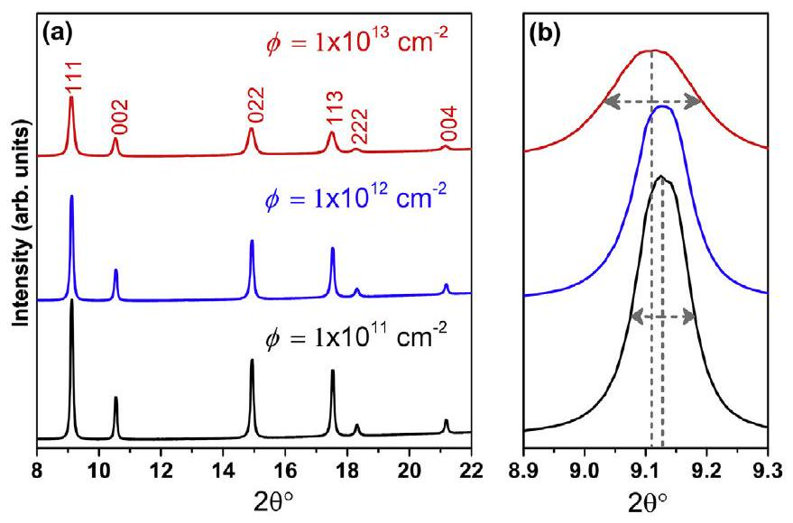
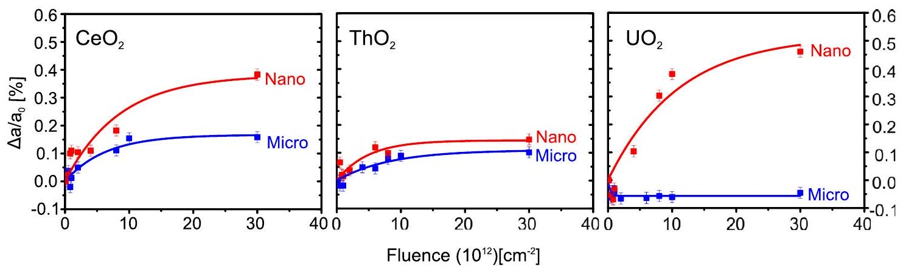
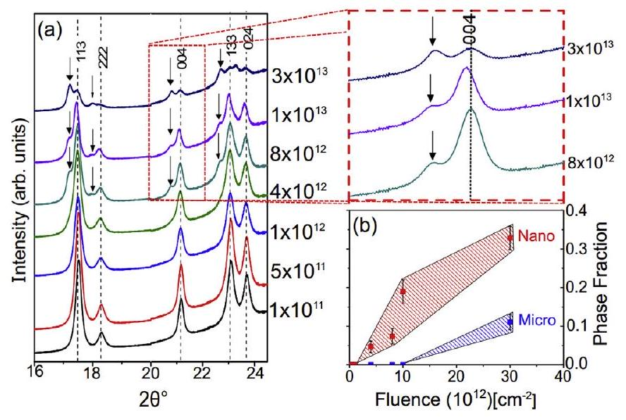
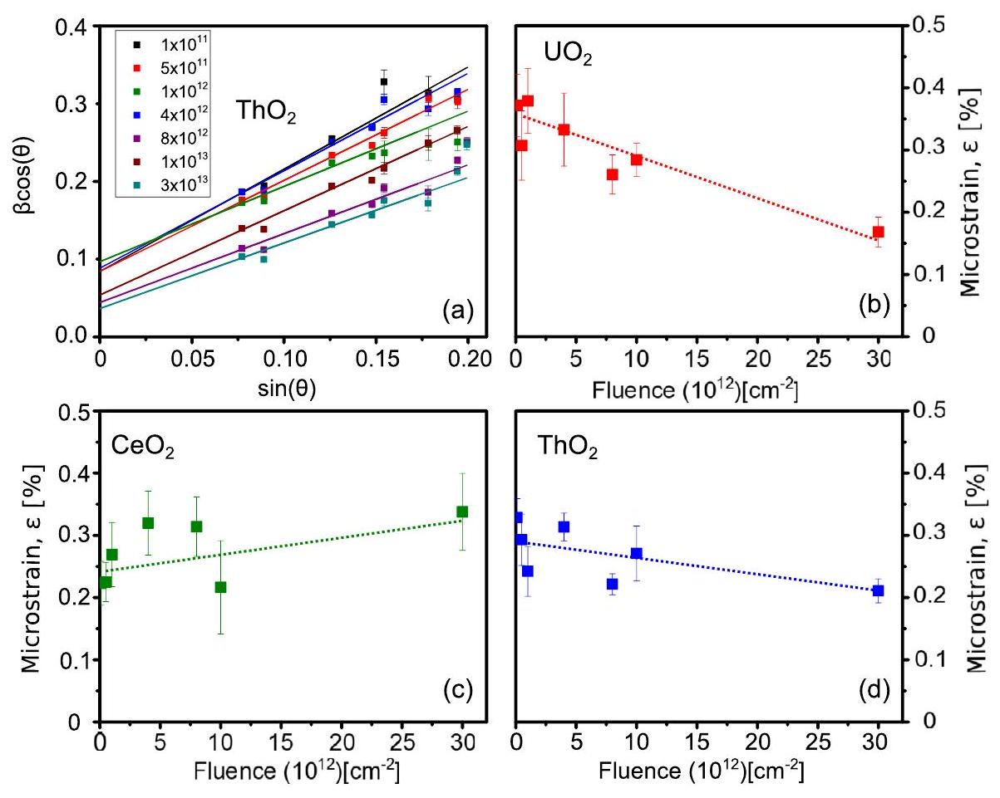
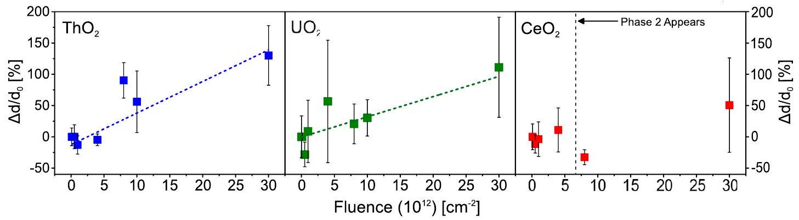
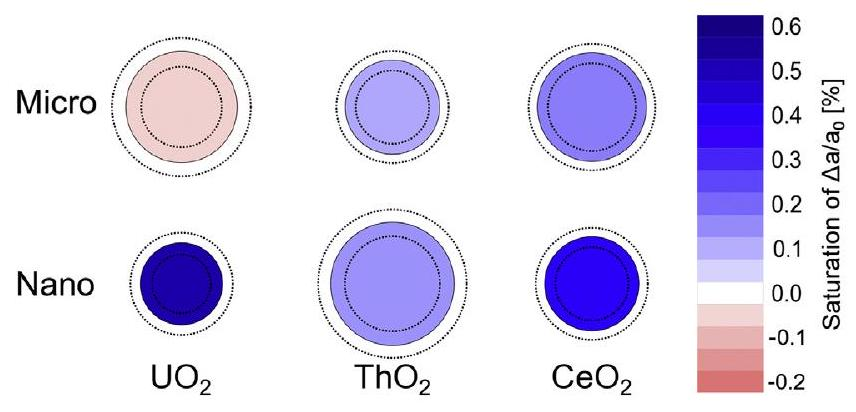
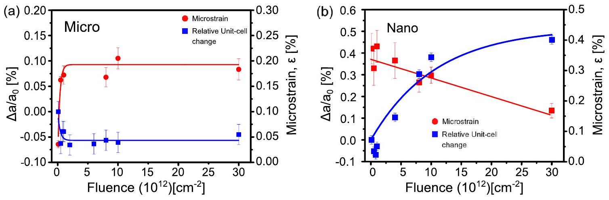
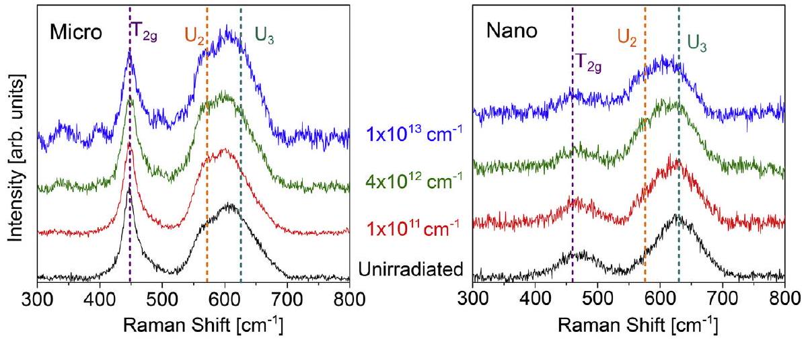

Full length article

# Grain size effects on irradiated $\mathrm{CeO}_{2}, \mathrm{ThO}_{2}$, and $\mathrm{UO}_{2}$ 

William F. Cureton ${ }^{\mathrm{a}}$, Raul I. Palomares ${ }^{\mathrm{a}}$, Jeffrey Walters ${ }^{\mathrm{a}}$, Cameron L. Tracy ${ }^{\mathrm{b}}$, Chien-Hung Chen ${ }^{\text {b }}$, Rodney C. Ewing ${ }^{\text {b }}$, Gianguido Baldinozzi ${ }^{\text {c }}$, Jie Lian ${ }^{\text {d }}$, Christina Trautmann ${ }^{\mathrm{e}, \mathrm{f}}$, Maik Lang ${ }^{\mathrm{a}, *}$ ${ }^{\mathrm{a}}$ Department of Nuclear Engineering, University of Tennessee, Knoxville, TN 37996, USA ${ }^{\mathrm{b}}$ Department of Geological Sciences, Stanford University, Stanford, CA 94305, USA ${ }^{\mathrm{c}}$ Laboratoire Structures, Propriétés et Modélisation des Solides, CNRS, CentraleSupélec, Université Paris-Saclay, 91190 Gif-sur-Yvette, France ${ }^{\mathrm{d}}$ Department of Mechanical, Aerospace and Nuclear Engineering, Rensselaer Polytechnic Institute, Troy, NY 12180, USA ${ }^{\mathrm{e}}$ GSI Helmholtzzentrum für Schwerionenforschung, 64291 Darmstadt, Germany ${ }^{\mathrm{f}}$ Technische Universität Darmstadt, 64287 Darmstadt, Germany

## ARTICLE INFO

## Article history:

Received 10 April 2018
Received in revised form 17 August 2018
Accepted 24 August 2018
Available online 27 August 2018

## Keywords:

$\mathrm{CeO}_{2}$
$\mathrm{ThO}_{2}$
$\mathrm{UO}_{2}$
Ion irradiation
X-ray diffraction
Grain size
Nanocrystalline

#### Abstract

Microcrystalline and nanocrystalline $\mathrm{UO}_{2}, \mathrm{ThO}_{2}$, and $\mathrm{CeO}_{2}(\sim 2 \mu \mathrm{~m}$ and $\sim 20 \mathrm{~nm}$ particle size, respectively) were irradiated with 946 MeV Au ions at room temperature and characterized by synchrotron X-ray diffraction, Raman spectroscopy, and transmission electron microscopy. All samples show a small increase in unit cell parameter as a function of ion fluence $\left(0.17 \pm 0.03 \%\right.$ for $\mathrm{CeO}_{2}$ and $0.11 \pm 0.03 \%$ for $\left.\mathrm{ThO}_{2}\right)$, except microcrystalline $\mathrm{UO}_{2}$, which displays a small contraction of the unit cell ( $-0.06 \pm 0.02 \%$ ). Raman spectroscopy measurements of microcrystalline $\mathrm{UO}_{2}$ indicate an increase in nonstoichiometry after irradiation. All bulk materials are subject to an increase in heterogeneous microstrain, most notably $\mathrm{UO}_{2}$, implying that the relatively small changes in unit cell parameter are accompanied by substantial local disorder induced by isolated defects. The magnitude of volumetric swelling for all materials is larger in the nanocrystalline form as compared with the microcrystalline form ( $0.38 \pm 0.60 \%$ for $\mathrm{CeO}_{2}, 0.14 \pm 0.03 \%$ for $\mathrm{ThO}_{2}$, and $0.52 \pm 0.13 \%$ for $\mathrm{UO}_{2}$ ). $\mathrm{ThO}_{2}$ shows the smallest difference in swelling between the microcrystalline and nanocrystalline samples ( $\sim 0.03 \%$ ). All nanocrystalline materials exhibit irradiationinduced grain coarsening along with a decrease in heterogeneous microstrain with increasing ion fluence, except nanocrystalline $\mathrm{CeO}_{2}$, which shows no observable change in grain size and a slight increase in heterogeneous microstrain attributed to the accelerated formation of a secondary $\mathrm{Ce}_{11} \mathrm{O}_{20}$ phase evidenced in the X-ray diffraction data, present in both nanocrystalline and microcrystalline materials. Surprisingly, nanocrystalline $\mathrm{UO}_{2}$ exhibits a significant degree of swelling indicative of a decrease in oxygen content along with an increase in disorder induced by oxygen loss at grain boundaries during irradiation, based on the analysis of X-ray diffraction and Raman spectroscopy.

© 2018 Acta Materialia Inc. Published by Elsevier Ltd. All rights reserved.

## 1. Introduction

The study of nanocrystalline materials has grown immensely in recent decades due to their often enhanced functionality relative to microcrystalline materials of the same composition [1]. Nanomaterials can exhibit superior chemical, mechanical, and electrical properties, which improves their performance for energy applications [2]. In the context of nuclear fission and fusion energy systems, nanostructured materials often exhibit unusual responses to

[^0]irradiation, depending on the irradiation conditions and the composition and structure of the material. For example, nanocrystallinity can improve radiation tolerance as a result of the large number of grain boundaries that act as highly efficient sinks for defect annihilation [3,4]. In other cases, materials that are typically resistant to energetic ion irradiation in bulk are readily amorphized as nanocrystallites [5]. Nanocrystalline ceramics can also be susceptible to irradiation-induced grain growth, which is undesirable for many engineering applications [6,7].

The radiation response of nanostructured materials is typically attributed to the competing effects of three distinct properties [8]: (i) high grain-boundary densities, (ii) high surface energies, and (iii) increased confinement of excited phonons and electrons. The first
effect tends to enhance the radiation tolerance of nanomaterials over coarse-grained materials because grain boundaries are efficient sinks into which mobile irradiation-induced defects can be absorbed and annihilated. High surface energies, on the other hand, can lead to instability under irradiation due to an enhanced driving force for structural modifications that minimize a system's free energy, such as phase transformations or changes in grain size. Lastly, radiation-induced phonons or excited electrons, such as those produced by swift heavy ion irradiation, are more confined in nanomaterials due to the large density of grain boundaries, where the periodicity of the lattice is obstructed, which acts as a scattering barrier to cell-to-cell phonon or electron transport. The resulting hampered energy transfer across the material will lead to more radiation damage due to the highly localized nature of energy deposition within grains of diameters on the order of nanometers [9]. Whichever process dominates, the radiation damage mechanism will determine whether a nanostructured material will show more or less radiation tolerance, relative to a microscale material. In order to better understand the response of nanostructured materials to ion irradiation, it is necessary to establish the relation between structural stability (resistance to volumetric swelling and phase changes) and variations in grain size.

To elucidate the response of common nuclear energy materials to highly energetic ion irradiation, the structural stabilities of microcrystalline and nanocrystalline $\mathrm{CeO}_{2}, \mathrm{ThO}_{2}$, and $\mathrm{UO}_{2}$ were investigated. These fluorite-structured ( $F m \overline{3} m$ ) oxides are important as surrogate, candidate, and current nuclear fuel materials, respectively. Under operational reactor conditions, nuclear fuel experiences damage from a mixed radiation field with appreciable effects from neutrons, alpha particles/recoil nuclei, and energetic ion fragments from fission. Accounting for most of the damage within the fuel, energetic fission fragments with high kinetic energies ( $\sim 100 \mathrm{MeV}$ ) initially deposit this energy to the material via electronic excitation and ionization processes. Swift heavy ions from large accelerator facilities can be used to simulate this type of electronic energy deposition under well-controlled irradiation conditions. Energy is initially deposited to the electron subsystem of a given material and is subsequently dissipated to the atomic system through electron-phonon interactions. The effect of this dense electronic excitation depends on the structure of the material. In most insulators, swift heavy ions create cylindrical damage zones known as ion tracks $[10,11]$. The accumulation and overlap of these ion tracks can lead to amorphization [12], order-disorder phase transformations [13], crystalline-to-crystalline phase transformations [14], extended defects [15], and isolated defect formation independent from the ion track [16].

Fluorite-structured oxides have been studied in detail under swift heavy ion irradiation and the formation of defects is typically observed in these relatively amorphization-resistant materials [17-26]. However, there are only a limited number of studies of how grain size, and particularly nanocrystallinity, affects the radiation response. This is particularly important for understanding the radiation behavior of $\mathrm{UO}_{2}$ at high burnup, which is characterized by significantly reduced grain size as compared with fresh nuclear fuel prior to its irradiation in a reactor [27,28]. In addition, it has been recently shown that the three materials' radiation response is highly dependent on redox behavior [24]. $\mathrm{ThO}_{2}$ seems to be the reference in terms of redox response, preferentially maintaining stoichiometry due to the monovalent thorium cation. In contrast, $\mathrm{CeO}_{2}$ tends to be reduced and $\mathrm{UO}_{2}$ tends to be oxidized under swift heavy ion irradiation. In order to gain a deeper understanding of the influence of grain size and redox response on the structural stability and defect structure under swift heavy ion irradiation, microcrystalline and nanocrystalline $\mathrm{CeO}_{2}, \mathrm{UO}_{2}$, and $\mathrm{ThO}_{2}$ samples were irradiated with 946 MeV Au ions and characterized by means
of synchrotron X-ray diffraction (XRD), Raman spectroscopy, and transmission electron microscopy (TEM).

## 2. Experimental

### 2.1. Irradiation

Polycrystalline samples of $\mathrm{CeO}_{2}, \mathrm{ThO}_{2}$, and $\mathrm{UO}_{2}$ were acquired from commercial vendors and the corresponding nanocrystalline compounds were prepared from these starting materials by highenergy ball milling. Details regarding the ball milling method are reported elsewhere [29]. Both micro- and nanocrystalline powders were uniaxially pressed into holes of $100 \mu \mathrm{~m}$ diameter that were drilled into $50 \mu$ m-thick molybdenum sheets, which served as sample holders for ion irradiation and synchrotron XRD characterization. The process resulted in sample pellets that were $\sim 50 \%$ theoretical density [30].

All samples were irradiated at the GSI Helmholtzzentrum für Schwerionenforschung in Darmstadt, Germany. The irradiation experiments were performed at room temperature and in vacuum at the M2 beamline of the UNILAC accelerator. Samples were irradiated with $946 \mathrm{MeV}{ }^{197} \mathrm{Au}$ ions to ion fluences ranging from $1 \times 10^{11}$ to $3 \times 10^{13}$ ions $/ \mathrm{cm}^{2}$. All six materials (three micro- and three nano-materials) were simultaneously irradiated to each fluence with a $\sim 1 \mathrm{~cm}^{2}$ beam spot in order to minimize fluence uncertainties among the different samples. The ion-beam flux was limited to $\sim 1 \times 10^{9}$ ions $\mathrm{cm}^{-2} \mathrm{~s}^{-1}$ in order to avoid bulk heating of the materials. The stopping power and projected range of Au ions in each sample composition were calculated using the SRIM-2008 code [31], including corrections for the lower density of the samples, as described by Lang et al. [32]. The projected ion range $(70 \mu \mathrm{~m}$ for $\mathrm{CeO}_{2}$ and $\mathrm{ThO}_{2}$, and $64 \mu \mathrm{~m}$ for $\mathrm{UO}_{2}$ ) exceeded in all materials the sample thickness $(50 \mu \mathrm{~m})$, ensuring that the Au ions fully penetrate the samples and induce a nearly uniform energy-deposition profile along their paths. Given the high kinetic energy of the ions, electronic energy loss dominates ( $23.3 \mathrm{keV} / \mathrm{nm}$ for $\mathrm{CeO}_{2}, 24.1 \mathrm{keV} / \mathrm{nm}$ in $\mathrm{ThO}_{2}$, and $26.4 \mathrm{keV} / \mathrm{nm}$ for $\mathrm{UO}_{2}$ ) with negligible contribution from nuclear energy loss $\left(0.04 \mathrm{keV} / \mathrm{nm}\right.$ for $\mathrm{CeO}_{2}, 0.05 \mathrm{keV} / \mathrm{nm}$ in $\mathrm{ThO}_{2}$, and $0.06 \mathrm{keV} / \mathrm{nm}$ for $\mathrm{UO}_{2}$ ). More details on the preparation of small sample platelets and their irradiation can be found elsewhere [32].

### 2.2. Characterization

Structural modifications after irradiation were characterized by angle-dispersive XRD experiments using beamline 16-BM-D (HPCAT sector) of the Advanced Photon Source at Argonne National Laboratory. A monochromatic beam of $29.2 \mathrm{keV}(\lambda=0.4976 \AA)$ Xrays was used in transmission geometry to measure the small sample platelets after irradiation, as described in detail elsewhere [32]. Debye rings were recorded utilizing a Mar345 image plate detector with a collection time of 300 s . Diffraction images were integrated into X-ray diffractograms using Dioptas [33], and unitcell parameters were determined via Rietveld refinement [34] performed with Fullprof [35].

The average grain size of the microcrystalline and nanocrystalline $\mathrm{CeO}_{2}$ samples was determined prior to irradiation by transmission electron microscopy (TEM, not shown), confirming high energy ball milling produced a nanoscale material. The measured grain size was correlated with the domain sizes derived from XRD patterns using the Scherrer equation [36]. This procedure allowed: (i) the independent characterization of starting material grain size with two experimental methods, (ii) the use of the XRD measurements to determine the change in grain size with increasing ion fluence, normalized to the TEM and XRD measurements of $\mathrm{CeO}_{2}$,
and (iii) the avoided the need for TEM characterization of radioactive materials and tedious preparation procedures for the irradiated samples. The average grain sizes derived by TEM were $\sim 2 \mu \mathrm{~m}$ and $\sim 20 \mathrm{~nm}$ as compared with $\sim 2 \mu \mathrm{~m}$ and $\sim 15 \mathrm{~nm}$ obtained from XRD measurements for the microcrystalline and nanocrystalline $\mathrm{CeO}_{2}$ starting materials, respectively.

Raman spectroscopy was performed on $\mathrm{UO}_{2}$ samples as a complementary method of probing structural modifications. A Horiba LabRAM HR Evolution instrument with an excitation laser ( 785 nm wavelength), coupled with a detector cooled to liquid nitrogen temperatures was utilized. Laser power was limited to $\sim 1 \mathrm{~mW}$ to avoid oxidation and annealing. Five measurements were taken at different locations on each sample under the same conditions and averaged after normalization to the $\mathrm{T}_{2 \mathrm{~g}}$ peak and background removal.

## 3. Results \& discussion

### 3.1. Microcrystalline samples

Upon irradiation, all diffraction maxima shift to lower $2 \theta$ values, with the shift being larger for higher fluences (Fig. 1b). This behavior has been previously observed in swift heavy ion irradiated fluorite-structured oxides and can be explained by an increase in the unit-cell parameter due to the accumulation of point defects and defect clusters [19]. Concurrent peak broadening and a decrease in peak intensity with increasing ion fluence are indicative of local structural distortions and heterogeneous microstrain that accompany the formation of defects. A similar evolution of XRD patterns with ion fluence is observed for microcrystalline $\mathrm{ThO}_{2}$, as expected from previous experiments [22]. Only small changes were apparent in the XRD maxima positions for $\mathrm{UO}_{2}$ up to the maximum fluence of $3 \times 10^{13}$ ions $/ \mathrm{cm}^{2}$, although broadening of the maxima was comparable to that of $\mathrm{CeO}_{2}$ and $\mathrm{ThO}_{2}$.

Several new diffraction maxima become apparent in the diffraction data for microcrystalline $\mathrm{CeO}_{2}$ at the maximum ion fluence. This agrees with previous results that show secondary phase formation in nanocrystalline $\mathrm{CeO}_{2}$, which is attributed to irradiation-induced redox effects [24]. These emerging peaks were fit with a defect, nonequilibrium fluorite-derivative phase. The $P \overline{1}$ space group of this $\mathrm{Ce}_{11} \mathrm{O}_{20}$ phase, as shown in Ref. [37], shows an inherent divergence in symmetry from the fluorite structure. The

Fig. 1. XRD patterns of microcrystalline $\mathrm{CeO}_{2}$ before and after irradiation with 946 MeV Au ions to different fluences showing (a) the entire pattern and (b) an enlarged view of the most intense (111) diffraction maximum. All Bragg peaks shift to lower $2 \theta$ and broaden with increasing ion fluence due to defect-induced volumetric expansion and microstrain/domain size changes, respectively.

simple cubic "cages" of oxygen within the fluorite structure are maintained but are distorted in this phase in order to incorporate the irradiation-induced reduced trivalent cations and oxygen vacancies into the structure. Oxygen vacancies are ordered at $2 i$ sites in the triclinic unit cell. This phase has only been observed in high temperature, nonequilibrium conditions [38]. Swift heavy ion irradiation has been shown to cause phase transformations to nonequilibrium phases not observed at standard temperatures and pressures [14].

In order to quantify the amount of volumetric swelling in all materials, Rietveld refinement was applied and the changes in unitcell parameter were determined for each fluence (Fig. 2). The unitcell parameters for $\mathrm{CeO}_{2}$ and $\mathrm{ThO}_{2}$ initially increase linearly in the initial irradiation stage and saturate at larger fluences. This trend is in agreement with a single-impact behavior [22,39,40]. The data were fit using the equation [41]:
$\frac{\Delta a}{a_{0}}=\frac{a(\phi)-a_{0}}{a_{0}}=\frac{a_{\text {sat }}-a_{0}}{a_{0}}\left(1-e^{-\sigma \phi}\right)$
where $a$ is the measured unit-cell parameter, $a_{0}$ is the reference unit cell parameter of each unirradiated sample (micro- and nano-), $a_{\mathrm{sat}}$ is the saturation value of the unit cell parameter, $\sigma$ is the crosssectional ion track area, and $\phi$ is the ion fluence. The relative saturation values for the unit-cell parameter increase derived from the fits are $0.17 \pm 0.03 \%$ and $0.11 \pm 0.03 \%$ for $\mathrm{CeO}_{2}$ and $\mathrm{ThO}_{2}$, respectively. Assuming cylindrical ion tracks, the effective track diameters, $d\left(\sigma=\pi \cdot(d / 2)^{2}\right)$, are $4.5 \pm 0.8 \mathrm{~nm}$ for $\mathrm{CeO}_{2}$ and $3.9 \pm 0.8 \mathrm{~nm}$ for $\mathrm{ThO}_{2}$. The saturation value of swelling of $\mathrm{CeO}_{2}$ is somewhat larger than that of $\mathrm{ThO}_{2}(0.06 \%)$, indicating a higher damage efficiency under swift heavy ion irradiation. This difference in damage accumulation behavior was previously attributed to the cerium cation having more accessible oxidation states as compared with monovalent thorium [24].

Microcrystalline $\mathrm{UO}_{2}$ shows no unit-cell expansion, but rather a very small unit-cell contraction after SHI irradiation. This is in agreement with the results of Hayashi et al. [17], which illustrate that in the electronic energy loss regime, typically very high ion fluences are needed to cause significant volumetric swelling of polycrystalline $\mathrm{UO}_{2}$. The study by Hayashi et al. also suggests that the volumetric swelling of polycrystalline $\mathrm{UO}_{2}$ follows a double- or multiple-impact behavior [41], with minimal damage appearing until ion tracks begin to overlap significantly. This is in contrast to the single-impact behavior observed for $\mathrm{CeO}_{2}$ and $\mathrm{ThO}_{2}$. However, similar to $\mathrm{CeO}_{2}$ and $\mathrm{ThO}_{2}$, heterogeneous microstrain for $\mathrm{UO}_{2}$ follows a single impact evolution as a function of increasing ion fluence.

### 3.2. Nanocrystalline samples

The XRD patterns of the irradiated nanocrystalline materials show, qualitatively, responses similar to those of the microcrystalline counterparts, with attenuation and shifts of diffraction maxima. Refinement of the XRD patterns exhibit a similar trend with increasing ion fluence as was observed in the microcrystalline samples, following a single-impact mechanism (Fig. 2). However, the saturation values of the unit-cell parameters are much larger for the nanoscale materials, evidencing an increased susceptibility to radiation damage. The most dramatic difference is observed for $\mathrm{UO}_{2}$, which is the least radiation tolerant compound of the three in nanocrystalline form, in contrast to its superior resistance to radiation-induced volumetric changes in its microcrystalline form. The smallest difference in the radiation response of both sample types is seen in $\mathrm{ThO}_{2}$ (Fig. 2). Fitting equation (1) to the data yields ion track diameter values of $3.9 \pm 0.8 \mathrm{~nm}, 5.1 \pm 1.1 \mathrm{~nm}$, and

Fig. 2. Radiation-induced changes in unit-cell parameter as a function of ion fluence for microcrystalline and nanocrystalline $\mathrm{CeO}_{2}$, ThO2, and $\mathrm{UO}_{2}$, based on refinement of corresponding XRD patterns. The curves represent fits to the data points based on a single-impact model. It is noted that the ion-induced swelling of the materials shown is for CeO2 based on the original phase, i.e., contributions from the secondary phase are excluded.

$3.4 \pm 0.9 \mathrm{~nm}$ for nanocrystalline $\mathrm{CeO}_{2}, \mathrm{ThO}_{2}$, and $\mathrm{UO}_{2}$, respectively. The saturation values were determined to be $0.38 \pm 0.60 \%$ for $\mathrm{CeO}_{2}$, $0.14 \pm 0.03 \%$ for $\mathrm{ThO}_{2}$, and $0.52 \pm 0.13 \%$ for $\mathrm{UO}_{2}$. Thus, $\mathrm{UO}_{2}$ exhibits the largest swelling of all three nano materials and $\mathrm{ThO}_{2}$ the smallest, with a factor of four difference among them.

No amorphization is observed in any of the three nanomaterials despite their enhanced susceptibility to swift heavy ion induced structural modifications. For $\mathrm{CeO}_{2}$, however, a phase transformation is evident in the XRD patterns at fluences above $4 \times 10^{12}$ ions $/ \mathrm{cm}^{2}$ with the appearance of additional diffraction maxima. Fig. 3a shows the stacked XRD patterns of nanocrystalline $\mathrm{CeO}_{2}$ as a function of increasing ion fluence. Several new diffraction maxima become visually apparent beginning at $8 \times 10^{12}$ ions $/ \mathrm{cm}^{2}$ at $2 \theta$ values, which are consistently lower ( $\sim 5^{\circ}$ ) than those of the initial fluorite-structure peaks (Fig. 3 inset). These secondary maxima grow at the expense of the initial peaks and eventually dominate the XRD pattern for the highest fluence of $3 \times 10^{13}$ ions $/ \mathrm{cm}^{2}$. The peaks were fit with the same triclinic $\mathrm{Ce}_{11} \mathrm{O}_{20}$ phase used to fit the secondary phase in the microcrystalline material. The peak widths are similar to those of the original phase, indicating that the new phase is also composed of submicron domains. The relative phase fraction of the emergent phase monotonically increases after the incubation fluence for nanocrystalline and microcrystalline materials (Fig. 3b).

Fig. 3. (a) X-ray diffractograms of nanocrystalline $\mathrm{CeO}_{2}$ as a function of increasing ion fluence (given in units of $\mathrm{cm}^{-2}$ ). The arrows indicate the emergence of new diffraction maxima related to a secondary phase. The secondary phase grows at the expense of the original fluorite phase as shown for the 004 peak in the inset. (b) Comparison of the relative phase fraction of the $\mathrm{Ce}_{11} \mathrm{O}_{20}$ phase in comparison to the nominal fluorite phase as a function of ion fluence for microcrystalline and nanocrystalline materials.

Swift heavy ion irradiation can induce crystalline-to-crystalline phase transformations otherwise not observed in conventional high-temperature or high-pressure phase diagrams [14]. In the case of nanocrystalline $\mathrm{CeO}_{2}$, an incubation fluence of $4 \times 10^{12}$ ions $/ \mathrm{cm}^{2}$ is needed until the Bragg peaks of the new phase become detectable as compared with an incubation fluence of $3 \times 10^{13}$ ions $/ \mathrm{cm}^{2}$ in the microcrystalline material. Based on the cross section deduced from the swelling of the original nano- $\mathrm{CeO}_{2}$ phase (Fig. 2), this is approximately the fluence at which ion tracks begin to extensively overlap. Under further irradiation the secondary phase continues to grow while defect accumulation saturates in the original phase. This type of behavior indicates that a multi-impact mechanism is responsible for the accelerated formation of the secondary $\mathrm{Ce}_{11} \mathrm{O}_{20}$ phase. Phase transformations requiring more than one ion impact have also been observed in other oxides, such as the monoclinic-totetragonal transition in $\mathrm{ZrO}_{2}$ [42,43]. In the present study, the secondary nonstoichiometric $\mathrm{Ce}_{11} \mathrm{O}_{20}$ phase has a fluorite-like structure with much distortion and ordered oxygen vacancies, accompanied by the reduction of tetravalent cerium to the trivalent state [44,45]. Hull et al. [46] reported that with an increase in oxygen deficiency, oxygen vacancies begin to order in bulk $\mathrm{CeO}_{2-\mathrm{x}}$. This implies formation of pockets or entire domains of this hypostoichiometric phase driven by highly ionizing ion irradiation and the resultant loss of oxygen and reduction of cerium atoms [24].

Broadening of XRD maxima can be attributed largely to two processes namely (i) the accumulation of heterogeneous microstrain and (ii) the reduction in grain size. In order to distinguish microstrain effects from size effects, Williamson-Hall analysis [47] was utilized (Fig. 4a). The widths of the diffraction maxima, derived by fitting with Pseudo-Voigt peaks for all three nanomaterials, increase with increasing $2 \theta$. No anisotropic peak broadening was observed in diffraction patterns. Heterogeneous microstrain values, as a function of ion fluence, were obtained from the slope of this increase in width as a function of $2 \theta$ (i.e., the slope of the Williamson-Hall plot), shown in Fig. 4 (b-d). Both $\mathrm{ThO}_{2}$ and $\mathrm{UO}_{2}$ exhibit a monotonic decrease in microstrain with increasing ion fluence, while $\mathrm{CeO}_{2}$ shows a small increase in microstrain with increasing ion fluence. These behaviors were found to be correlated with changes in grain size, which can be estimated by noting the yintercept on the Williamson-Hall plot. Typically, fluorite structured materials with nanometer-size grains are highly susceptible to irradiation-induced grain growth [48]. The evolution of the peak width under ion irradiation was analyzed for all three nanomaterials by applying the Scherrer equation after removing the contribution of the instrumental broadening and broadening from microstrain:

Fig. 4. Heterogeneous microstrain for nanocrystalline (b) $\mathrm{UO}_{2}$, (c) $\mathrm{CeO}_{2}$ and (d) $\mathrm{ThO}_{2}$ derived from (a) Williamson-Hall analysis shown for nanocrystalline $\mathrm{ThO}_{2}$. For $\mathrm{ThO}_{2}$ and $\mathrm{UO}_{2}$, microstrain monotonically decreases due to annihilation of stress inducing grain boundaries. For $\mathrm{CeO}_{2}$ the microstrain increases probably due to the size mismatch between the nominal $\mathrm{CeO}_{2}$ and secondary $\mathrm{Ce}_{11} \mathrm{O}_{20}$ phase.

$$
D=(K \lambda) /(\beta \cos \theta)
$$

where $D$ is the mean domain size, $K$ is a constant accounting for the crystallite shape (spherical crystallites are assumed), $\lambda$ is the x-ray wavelength, $\beta$ is the peak broadening without contribution from the instrument or microstrain, and $\theta$ is the position of the diffraction maximum. As mentioned previously, the y-intercept of the Williamson-Hall plot is $\beta \cos \theta$. All nanomaterials had an initial grain size of about 20 nm (based on TEM measurements) prior to irradiation and ion-induced changes were observed for all three compounds. Nanocrystalline $\mathrm{ThO}_{2}$ and $\mathrm{UO}_{2}$ show a similar average grain size increase as ion fluence increases, with $\mathrm{ThO}_{2}$ having a slightly steeper growth as compared with $\mathrm{UO}_{2}$ (Fig. 5). Energetic ion irradiation-induced grain coarsening has been reported for several fluorite-structured materials. For example, Aidhy et al. have attributed irradiation-induced grain-coarsening to a so called "fast
growth" disorder driven mechanism instead of the conventional grain-rotation driven and curvature-driven grain growth [7]. This mechanism is attributed to the disordering within a grain volume induced by ion irradiation that leads to a consumption of the disordered volume by surrounding grains rather than defect recovery. In this study, the grain size increases for $\mathrm{UO}_{2}$ and $\mathrm{ThO}_{2}$ are substantial ( $100-175 \%$ ) in the applied fluence range. The measured grain sizes of these materials are about two times larger after irradiation to $3 \times 10^{13}$ ions $/ \mathrm{cm}^{2}$ (Fig. 5). This can be used to explain the decreasing microstrain behavior for $\mathrm{ThO}_{2}$ and $\mathrm{UO}_{2}$ as stressinduced grain boundaries are annihilated during grain coarsening.

Due to the large error bars on the data points for lower ion fluences and poor resolution of the peaks corresponding to the initial fluorite-structured phase at high fluences, the grain size trend for $\mathrm{CeO}_{2}$ is difficult to decipher. This difficulty is likely attributable to the concomitant emergence of new peaks corresponding to the $\mathrm{Ce}_{11} \mathrm{O}_{20}$ phase. The appearance of the secondary

Fig. 5. Relative change in grain size as a function of ion fluence for nanocrystalline $\mathrm{ThO}_{2}, \mathrm{UO}_{2}$, and $\mathrm{CeO}_{2}$ derived from peak-width increase in XRD pattern analyzed by the Scherrer equation. Error bars were obtained from propagation of the standard error from Williamson-Hall linear fits applied to take into account microstrain contributions to the peak width changes. Dashed lines are drawn to guide the eye. In contrast to the actinide oxides, no consistent trend is apparent for $\mathrm{CeO}_{2}$ and the overall grain size does not change significantly over the applied fluence range.

phase could also explain the only small amount of measured increase in microstrain, as its incorporation involves a unit cell volume mismatch between the two phases.

### 3.3. Micro-versus nano-grain structure

The effects of grain size on radiation response have been studied for many material systems $[4,6,49-51]$. The present study is unique in that the different materials were simultaneously irradiated by swift heavy ions to a given fluence by using micrometer-sized samples. Identical irradiation conditions with minimal fluence uncertainties enabled the detection of even small deviations in radiation response as a result of grain size or sample composition. The qualitative behavior under irradiation is similar for all materials studied (with the exception of microcrystalline $\mathrm{UO}_{2}$ ) and is characterized by defect accumulation following a single-impact mechanism. The fluorite structures of these materials are generally tolerant of radiation damage, exhibiting no evidence of amorphization. The rate of damage accumulation, which is linked to the effective damage cross-section and track diameter, fluctuates among the different types of materials. Fig. 6 shows relative track sizes derived from equation (1) and the associated uncertainties, along with a shading and color within the track that corresponds to the degree of unit-cell expansion or contraction at saturation. No influence of grain size (micro versus nano) of the material on its ion track diameter is observed. This is reasonable since the same ion and energy has been used, thus, inducing a comparable energy loss in all materials. Track diameters are similar within $\pm 0.6 \mathrm{~nm}$ for a given irradiation condition for a wide range of ceramic materials [52]. However, the type of defects or defect density within a track, as expressed by the saturation of volumetric swelling, changes significantly between nanoscale and microscale materials, as illustrated in Fig. 6. This saturation value also provides a more reliable quantification for the comparison of the different samples, as it is not affected by the rapid increase of volumetric swelling during the early stages of damage accumulation (linear regime in the single-impact behavior) but is a saturation value in the limit at very large fluences. The differences between micro- and nano-grain sized materials are most dramatic for $\mathrm{UO}_{2}$, which is in its microcrystalline form the most resistant material studied, while for nanometer sized grains it is the least resistant. Overall, the degree of volumetric swelling under swift heavy ion irradiation is larger in nanocrystalline materials as compared with the microcrystalline counterparts. This is different from what is generally reported in radiation damage studies using low-energy ions or neutrons. The observed behavior can be explained by several distinct processes

Fig. 6. Relative track sizes including uncertainties (dashed line) derived from singleimpact fits to the unit-cell data versus fluence, shown in Fig. 2. Shading and color within the representative tracks scale with the degree of swelling or contraction of the unit-cell parameter at saturation for each sample. (For interpretation of the references to color in this figure legend, the reader is referred to the Web version of this article.)

which are unique to swift heavy ion matter interactions.
Thermodynamic considerations of the target material may play an important role during the rapid and intense energy depositions of swift heavy ions. Nanomaterials with a high density of grain boundaries and internal surfaces have a large amount of stored free energy. The perturbations induced by swift heavy ion irradiation can drive microstructural or atomic structure changes that minimize this energy. This probably explains the observed coarsening of nanometer-sized grains in response to ion irradiation. Because chemical composition partly determines the energies associated with grain boundaries and surfaces [53], different materials will experience different driving forces for reducing the free energy, such as volumetric swelling, change in grain size, or phase transformations. Therefore, each nanocrystalline material undergoes different a microstructural evolution under irradiation in order to minimize its total free energy, causing the observed compositional variance in the effects of nanocrystallinity on the irradiationinduced unit cell expansion.

The more efficient damage accumulation observed for nanomaterials can also be explained in terms of the electronic configurations of the three cations (cerium, thorium, and uranium). Thorium, which shows the least variation in its radiation response between the two types of starting materials, is monovalent in the oxide form. In contrast, cerium and uranium are multivalent, with cerium showing a general trend to reduce ( $\mathrm{Ce}^{4+} \rightarrow \mathrm{Ce}^{3+}$ ), while uranium tends to oxidize ( $\mathrm{U}^{4+} \rightarrow \mathrm{U}^{5+} / \mathrm{U}^{6+}$ ) depending on the experimental conditions. $\mathrm{UO}_{2}$ and $\mathrm{CeO}_{2}$ significantly differ in their radiation response behavior between micro- and nanocrystalline samples, which correlates with an irradiation-induced enhancement of redox behavior. The reduction of cerium in $\mathrm{CeO}_{2}$ under swift heavy ion irradiation may represent an efficient damage mechanism, leading to additional swelling due to an increase in ionic radius of cerium, which induces microstrain [24,54]. This has been confirmed by TEM studies, which showed that in fluoritestructured materials, ion tracks can exhibit an oxygen-deficient core surrounded by an oxygen-rich shell [55]. The oxygen segregation distance was determined to be $\sim 19 \mathrm{~nm}$, which is very similar to the domain size of the nanocrystalline samples of the present study $(\sim 20 \mathrm{~nm})$. Therefore, it is possible that the loss of oxygen from a grain to its boundary or void space occurs. At very high fluences, the loss of oxygen in $\mathrm{CeO}_{2}$ may be so severe that the secondary $\mathrm{Ce}_{11} \mathrm{O}_{20}$ phase formation is accelerated as compared with its formation in microcrystalline materials (Fig. 3b). Displaced oxygen atoms need not necessarily leave the sample, but can accumulate at grain boundaries or form complex oxide defects, such as peroxidetype defects, which were identified from neutron total scattering studies of ion irradiated $\mathrm{CeO}_{2}$ [25]. Anion defects are typically unstable and annihilate quickly at moderate temperatures in microcrystalline fluorite structured oxides [23,26,56]. However, if oxygen efficiently reaches the grain boundary and leaves the system, the annihilation of anion defects would be less effective within the grain. This would result in a larger degree of swelling in the nanomaterial because the effective damage cross section per ion is on the order of the domain size, and oxygen deficiency causes the accelerated formation of a secondary $\mathrm{Ce}_{11} \mathrm{O}_{20}$ phase. A recent study on swift heavy ion irradiated platinum nanocrystals showed a clear size effect on the irradiation-induced desorption of hydrogen: smaller nanocrystals required less fluence for similar desorption levels in the larger nanocrystals [57], similar to the oxygen loss evidenced in nanocrystalline as compared with microcrystalline $\mathrm{CeO}_{2}$ samples in this study.

In contrast to $\mathrm{UO}_{2}$ and $\mathrm{CeO}_{2}, \mathrm{ThO}_{2}$ does not display a large difference in swelling between its micro- and nanocrystalline forms. Douglas et al. [58] suggested that defect aggregates, such as dislocation loops produced during irradiation, tend to form on or rotate
to planes where stoichiometry is minimally disturbed. This implies that $\mathrm{ThO}_{2}$ can efficiently minimize the effects of irradiation on its local chemistry and stoichiometry, which agrees with the fact that this compound does not deviate from its stoichiometry. Since $\mathrm{CeO}_{2}$ is known to reduce under irradiation conditions [24], defect production may result in more complex defect clusters or dislocation networks that are suppressed in $\mathrm{ThO}_{2}$. Defect clusters can incorporate reduced cations with differing ionic radii, adding to the volumetric swelling (e.g., $\mathrm{Ce}^{4+}$ has an ionic radius of $0.97 \AA$ and reduces to $\mathrm{Ce}^{3+}$ with an ionic radius of $1.143 \AA$ [59]). Recently, the radiation response of $\mathrm{ThO}_{2}$ and $\mathrm{CeO}_{2}$ has been studied by means of neutron total scattering with a focus on local modifications. Palomares et al. [25] suggested that although similar defects are formed in the two isostructural materials, irradiation induces different effects on the local structure. Local distortions in $\mathrm{CeO}_{2}$ are indicative of vacancy accumulation, whereas modifications in $\mathrm{ThO}_{2}$ are driven by larger defects and/or local distortions that may maintain local chemistry and stoichiometry.

While the difference in radiation response of $\mathrm{CeO}_{2}$ and $\mathrm{ThO}_{2}$ can be explained in terms of redox behavior, a comprehensive description of swift heavy ion induced structural modification in $\mathrm{UO}_{2}$ cannot be obtained based on the present data. Previous studies on bulk powder, sintered, or single crystal $\mathrm{UO}_{2}$ reported measurable swelling only at very high fluences (higher than those in this study), and this effect was thought to be due to implantation effects [17-20]. Fig. 7 highlights the dramatic difference between the radiation response in micro- (Fig. 7a) and nanocrystalline (Fig. 7b) $\mathrm{UO}_{2}$ in terms of volumetric changes and microstrain (as presented in Figs. 2 and 4). With increasing ion fluence, microscale $\mathrm{UO}_{2}$ exhibits a small unit-cell contraction ( $-0.06 \pm 0.02 \%$ ) accompanied by a significant amount of microstrain, whereas nanoscale $\mathrm{UO}_{2}$ shows a significant unit-cell expansion ( $0.52 \pm 0.13 \%$ ) accompanied by a decrease in microstrain. In order to gain more qualitative information on local structural modifications in micro- and nanocrystalline $\mathrm{UO}_{2}$, Raman spectroscopy measurements were performed.

The evolution of the Raman spectra with increasing ion fluence for micro- and nanocrystalline $\mathrm{UO}_{2}$ (Fig. 8) shows two key features that appear in all samples, as has been previously reported: (i) the $\mathrm{T}_{2 \mathrm{~g}}$ peak $\left(445-460 \mathrm{~cm}^{-1}\right)$ corresponding to the pristine fluorite structure [60] and (ii) the defect bands $\left(500-700 \mathrm{~cm}^{-1}\right)$ that are indicative of symmetry breakdown as they are Raman forbidden in pristine $\mathrm{UO}_{2}$ and only appear when defects interact with fluoritestructure phonons [61]. The signal between 500 and $700 \mathrm{~cm}^{-1}$ appears to arise from the confluence of two peaks ( $\sim 575$ and $\sim 630 \mathrm{~cm}^{-1}$ ) previously reported as $U_{2}$ and $U_{3}$, respectively. The $U_{2}$ peak is assigned to general lattice disorder while the $\mathrm{U}_{3}$ peak has been attributed to the presence of excess oxygen defects in system
[62-67]. For microcrystalline samples, the intensity of the defect bands, in comparison to the $\mathrm{T}_{2 \mathrm{~g}}$ peak, grows with increasing fluence and eventually surpasses it (Fig. 8). Within the defect peak region, the $\mathrm{U}_{3}$ peak appears to become more pronounced as compared with the $\mathrm{U}_{2}$ peak. This could imply an initial confinement of excess oxygen to the subsurface or an oxygen gradient between the inner of the grains and the subsurface region at which irradiation reverses due to radiation enhanced diffusion leaving behind an oxidized grain and possibly clustering of oxygen interstitials. This explanation agrees with the unit cell parameter trend and previous studies on $\mathrm{UO}_{2+\mathrm{x}}[44,66,68-71]$. This complex redox behavior is responsible for the observed radiation response of $\mathrm{UO}_{2}$, which shows that with increasing excess oxygen, the unit-cell parameter decreases [44,66,68-71] along with an increase in disorderinduced microstrain due to extended defect formation as the excess oxygen is incorporated into the structure (Fig. 7a). For nanocrystalline samples, the defect bands are initially much greater in intensity than the $\mathrm{T}_{2 \mathrm{~g}}$ peak and decrease relative to the $\mathrm{T}_{2 \mathrm{~g}}$ peak with increasing ion fluence (Fig. 8). In contrast to the microcrystalline samples, the $\mathrm{U}_{3}$ peak seems to decrease as compared with the $\mathrm{U}_{2}$ peak, with increasing fluence, implying the loss of excess oxygen from the material and increasing lattice disorder.

Again, the unit cell parameter data provides a possible explanation to this behavior. Initially, the unit cell parameter is $5.436 \AA$, which according to previous work implies an oxidized sample, [44,66,68-71]. With increasing ion fluence, the unit-cell parameter increases with decreasing microstrain due to grain coarsening (Fig. 7b), which could imply less excess oxygen in the system relative to the starting state. Samples with smaller grains have higher surface areas and, since $\mathrm{UO}_{2}$ surfaces readily oxidize when exposed to air [72], we suggest that this yields higher initial oxidation for the nanocrystalline $\mathrm{UO}_{2}$ as compared with microcrystalline $\mathrm{UO}_{2}$. This is confirmed by the difference in position of the $\mathrm{T}_{2 \mathrm{~g}}$ peak in the micro- ( $446 \mathrm{~cm}^{-1}$ ) and nanocrystalline ( $460 \mathrm{~cm}^{-1}$ ) samples, which has previously been attributed to oxidation effects [66]. These observations lead to the conclusion that the initial nanocrystalline $\mathrm{UO}_{2}$ samples could be closer stoichiometrically to $\mathrm{U}_{4} \mathrm{O}_{9}$ than $\mathrm{UO}_{2}$. It is known that submicron-sized $\mathrm{U}_{4} \mathrm{O}_{9}$ can exist without superstructures which could be why there is no evidence of the $\mathrm{U}_{4} \mathrm{O}_{9}$ phase in the diffraction data [73]. However, irradiation induces grain coarsening, decreasing the surface area available for oxidation, in addition to possible oxygen expulsion from the smaller grains, leaving a more oxygen-deficient and disordered grain behind, yet has less microstrain due to less strain inducing grain boundaries. Another explanation could be that irradiation provides enough energy to produce phase separation between $\mathrm{UO}_{2}$ and $\mathrm{U}_{4} \mathrm{O}_{9}$, producing the boundary compositions of the $\mathrm{UO}_{2+\mathrm{x}}$ phase diagram so that each phase has better oxygen

Fig. 7. Relative change in unit-cell parameter (squares) and microstrain (circles) as a function of fluence for ( $a$ ) micro- and ( $b$ ) nanocrystalline $\mathrm{UO}_{2}$.

Fig. 8. Raman spectra for micro- and nanocrystalline $\mathrm{UO}_{2}$ for various ion fluences. Note the different changes of the relative intensities of the $\mathrm{T}_{2 \mathrm{~g}}$ band (fluorite structure) and the $\mathrm{U}_{3}$ and $\mathrm{U}_{2}$ defect bands for micro- and nanocrystalline samples.

distribution, causing less microstrain. Since the grains are still submicron in size, it is possible that this these two phases coexist without evidence of $\mathrm{U}_{4} \mathrm{O}_{9}$ in the diffraction data. In the largergrained microcrystalline samples, it is possible that irradiationinduced hyper-stoichiometry at low fluences is eventually balanced by localized regions of hypo-stoichiometry at higher fluences [65], such that the unit cell parameter saturates to a small negative value. This small change, however, does not reflect a small amount of disorder as evidenced by the significant increase in microstrain that follows a single impact trend (Fig. 7a.) In both micro- and nanocrystalline $\mathrm{UO}_{2}$, a small change in relative ratio of integrated intensities between the (111) and (200) XRD maxima is observed, which could be partially due to changes in stoichiometry. The ratio increased for increasing ion fluences in microscale $\mathrm{UO}_{2}$, agreeing with the suggestion that less oxygen is located on regular lattice planes in order to incorporate the excess oxygen. Alternatively, the ratio decreased in nanoscale $\mathrm{UO}_{2}$, providing further evidence of phase ordering on oxygen lattice planes. Further experiments are needed to explain the unique grain-size dependence of the radiation behavior of $\mathrm{UO}_{2}$, such as X-ray absorption spectroscopy experiments in order to determine the oxidation state [24] and neutron total scattering in order to understand the local defect structures [25].

## 4. Conclusions

Irradiation of nanocrystalline ( $\sim 20 \mathrm{~nm}$ ) and microcrystalline $(\sim 2 \mu \mathrm{~m}) \mathrm{CeO}_{2}, \mathrm{ThO}_{2}$, and $\mathrm{UO}_{2}$ with 946 MeV Au ions results in an increase in the isometric unit cell parameter (except in the case of microcrystalline $\mathrm{UO}_{2}$ which exhibits a minor decrease in unit cell parameter) due to the accumulation of defects. For all materials, the damage process is consistent with a single impact mechanism. Xray diffraction data analyzed as a function of fluence yield similar track diameters of $\sim 4 \mathrm{~nm}$ for all three compositions within experimental uncertainty. The swelling behaviors indicate the accumulation of point defects and defect clusters with increasing ion fluence. The maximum unit-cell parameter increase that occurred for a given composition showed a distinct trend, with the nanoscale materials having a consistently higher saturation value. However, compared with the effects of low-energy ion irradiation, the swelling is less for swift heavy ions, being well below $1 \%$ for all materials. Nanocrystalline $\mathrm{ThO}_{2}$ and $\mathrm{UO}_{2}$ are subject to irradiationinduced grain coarsening, while nanocrystalline $\mathrm{CeO}_{2}$ showed no consistent effect. This may be related to the formation of a secondary $\mathrm{Ce}_{11} \mathrm{O}_{20}$ phase that is evidenced in X-ray diffraction patterns at very high fluences. The initial nanocrystalline phase is consistent
with a single-impact defect accumulation model and coexists with the secondary phase that seems to swell $\sim 4$ times more than the initial phase. The presence of a secondary phase with $\mathrm{CeO}_{2}$ is consistent with previous results indicating that the redox behavior of cerium plays a major role in irradiation-induced defect formation and is greatly enhanced in nanoscale materials. While $\mathrm{ThO}_{2}$ shows the smallest difference in volumetric swelling between nano- and micro-sized samples, $\mathrm{UO}_{2}$ shows a dramatic difference. At the microscale or in bulk, $\mathrm{UO}_{2}$ is the most resistant material to unit-cell parameter changes. Yet, it still displays a significant amount of heterogeneous microstrain, indicative of significant amounts of disorder. However, nanocrystalline $\mathrm{UO}_{2}$ exhibited by far the least radiation tolerance. This response to highly ionizing irradiation is probably linked to the complex redox behavior of uranium, which is greatly enhanced in nanoscale grains. Since $\mathrm{UO}_{2}$ is the most typical nuclear fuel and is known to undergo fragmentation into nanocrystallites during reactor operation, these results suggest that the interplay between swift heavy ions (including fission fragments) and the $\mathrm{UO}_{2}$ microstructure has important implications for nuclear fuel stability during reactor operation.

## Acknowledgements

This work was supported by the Energy Frontier Research Center Materials Science of Actinides funded by the US Department of Energy, Office of Science, Office of Basic Energy Sciences (DESC0001089). Portions of this work were performed at HPCAT (Sector 16), Advanced Photon Source, Argonne National Laboratory. HPCAT operations are supported by DOE-NNSA under award No. DE-NA0001974 and DOE-BES under award No. DE-FG0299ER45775, with partial instrumentation funding by NSF. APS is supported by DOE-BES, under contract No. DE-AC02-06CH11357. W.F.C. is partially funded by a grant from the University of Tennessee's Science Alliance, a Tennessee Center of Excellence. R.I.P. gratefully acknowledges support from the U.S. Department of Energy (DOE) National Nuclear Security Administration (NNSA) through the Carnegie DOE Alliance Center (CDAC) under grant number DE-NA-0002006. HPCAT beamtime was granted by the CDAC. J.L. was supported by the US National Science Foundation under the award of DMR 1151028.

## References

[1] S.C. Tjong, H. Chen, Nanocrystalline materials and coatings, Mater. Sci. Eng. R Rep. 45 (1) (2004) 1-88.
[2] H. Gleiter, Nanocrystalline materials, Prog. Mater. Sci. 33 (4) (1989) 223-315.
[3] N. Nita, R. Schaeublin, M. Victoria, Impact of irradiation on the microstructure of nanocrystalline materials, J. Nucl. Mater. 329-333 (Part B) (2004) 953-957.
[4] M. Rose, G. Gorzawski, G. Miehe, A.G. Balogh, H. Hahn, Phase stability of nanostructured materials under heavy ion irradiation, Nanostruct. Mater. 6 (5) (1995) 731-734.
[5] F. Lu, J. Wang, M. Lang, M. Toulemonde, F. Namavar, C. Trautmann, J. Zhang, R.C. Ewing, J. Lian, Amorphization of nanocrystalline monoclinic $\mathrm{ZrO}_{2}$ by swift heavy ion irradiation, Phys. Chem. Chem. Phys. 14 (35) (2012) 12295-12300.
[6] Y. Zhang, P.D. Edmondson, T. Varga, S. Moll, F. Namavar, C. Lan, W.J. Weber, Structural modification of nanocrystalline ceria by ion beams, Phys. Chem. Chem. Phys. 13 (25) (2011) 11946-11950.
[7] D.S. Aidhy, Y. Zhang, W.J. Weber, A fast grain-growth mechanism revealed in nanocrystalline ceramic oxides, Scripta Mater. 83 (2014) 9-12.
[8] W. Liu, Y. Ji, P. Tan, H. Zang, C. He, D. Yun, C. Zhang, Z. Yang, Irradiation induced microstructure evolution in nanostructured materials: a review, Materials 9 (2) (2016) 105.
[9] A. Berthelot, S. Hémon, F. Gourbilleau, C. Dufour, E. Dooryhée, E. Paumier, Nanometric size effects on irradiation of tin oxide powder, Nucl. Instrum. Methods Phys. Res. Sect. B Beam Interact. Mater. Atoms 146 (1-4) (1998) 437-442.
[10] M. Toulemonde, S. Bouffard, F. Studer, Swift heavy ions in insulating and conducting oxides: tracks and physical properties, Nucl. Instrum. Methods Phys. Res. Sect. B Beam Interact. Mater. Atoms 91 (1) (1994) 108-123.
[11] M. Toulemonde, C. Dufour, A. Meftah, E. Paumier, Transient thermal processes in heavy ion irradiation of crystalline inorganic insulators, Nucl. Instrum. Methods Phys. Res. Sect. B Beam Interact. Mater. Atoms 166 (Supplement C) (2000) 903-912.
[12] A.B. Cusick, M. Lang, F. Zhang, K. Sun, W. Li, P. Kluth, C. Trautmann, R.C. Ewing, Amorphization of $\mathrm{Ta}_{2} \mathrm{O}_{5}$ under swift heavy ion irradiation, Nucl. Instrum. Methods Phys. Res. Sect. B Beam Interact. Mater. Atoms 407 (2017) 25-33.
[13] M. Lang, F. Zhang, J. Zhang, J. Wang, J. Lian, W.J. Weber, B. Schuster, C. Trautmann, R. Neumann, R.C. Ewing, Review of $\mathrm{A}_{2} \mathrm{~B}_{2} \mathrm{O}_{7}$ pyrochlore response to irradiation and pressure, Nucl. Instrum. Methods Phys. Res. Sect. B Beam Interact. Mater. Atoms 268 (19) (2010) 2951-2959.
[14] C.L. Tracy, M. Lang, F. Zhang, C. Trautmann, R.C. Ewing, Phase transformations in $\mathrm{Ln}_{2} \mathrm{O}_{3}$ materials irradiated with swift heavy ions, Phys. Rev. B 92 (17) (2015) 174101.
[15] G. Baldinozzi, D. Simeone, D. Gosset, I. Monnet, S. Le Caër, L. Mazerolles, Evidence of extended defects in pure zirconia irradiated by swift heavy ions, Phys. Rev. B 74 (13) (2006) 132107.
[16] C. Trautmann, M. Toulemonde, K. Schwartz, J.M. Costantini, A. Müller, Damage structure in the ionic crystal LiF irradiated with swift heavy ions, Nucl. Instrum. Methods Phys. Res. Sect. B Beam Interact. Mater. Atoms 164-165 (Supplement C) (2000) 365-376.
[17] K. Hayashi, H. Kikuchi, K. Fukuda, Radiation damage of $\mathrm{UO}_{2}$ by high-energy heavy ions, J. Nucl. Mater. 248 (Supplement C) (1997) 191-195.
[18] T. Wiss, H. Matzke, C. Trautmann, M. Toulemonde, S. Klaumünzer, Radiation damage in $\mathrm{UO}_{2}$ by swift heavy ions, Nucl. Instrum. Methods Phys. Res. Sect. B Beam Interact. Mater. Atoms 122 (3) (1997) 583-588.
[19] H. Matzke, P.G. Lucuta, T. Wiss, Swift heavy ion and fission damage effects in $\mathrm{UO}_{2}$, Nucl. Instrum. Methods Phys. Res. Sect. B Beam Interact. Mater. Atoms 166-167 (2000) 920-926.
[20] F. Garrido, L. Vincent, L. Nowicki, G. Sattonnay, L. Thomé, Radiation stability of fluorite-type nuclear oxides, Nucl. Instrum. Methods Phys. Res. Sect. B Beam Interact. Mater. Atoms 266 (12) (2008) 2842-2847.
[21] K. Yasuda, M. Etoh, K. Sawada, T. Yamamoto, K. Yasunaga, S. Matsumura, N. Ishikawa, Defect formation and accumulation in $\mathrm{CeO}_{2}$ irradiated with swift heavy ions, Nucl. Instrum. Methods Phys. Res. Sect. B Beam Interact. Mater. Atoms 314 (2013) 185-190.
[22] C.L. Tracy, J. McLain Pray, M. Lang, D. Popov, C. Park, C. Trautmann, R.C. Ewing, Defect accumulation in $\mathrm{ThO}_{2}$ irradiated with swift heavy ions, Nucl. Instrum. Methods Phys. Res. Sect. B Beam Interact. Mater. Atoms 326 (2014) 169-173.
[23] R.I. Palomares, C.L. Tracy, F. Zhang, C. Park, D. Popov, C. Trautmann, R.C. Ewing, M. Lang, In situ defect annealing of swift heavy ion irradiated $\mathrm{CeO}_{2}$ and $\mathrm{ThO}_{2}$ using synchrotron X-ray diffraction and a hydrothermal diamond anvil cell, J. Appl. Crystallogr. 48 (3) (2015) 711-717.
[24] C.L. Tracy, M. Lang, J.M. Pray, F. Zhang, D. Popov, C. Park, C. Trautmann, M. Bender, D. Severin, V.A. Skuratov, R.C. Ewing, Redox response of actinide materials to highly ionizing radiation, Nat. Commun. 6 (2015) 6133.
[25] R.I. Palomares, J. Shamblin, C.L. Tracy, J. Neuefeind, R.C. Ewing, C. Trautmann, M. Lang, Defect accumulation in swift heavy ion-irradiated $\mathrm{CeO}_{2}$ and $\mathrm{ThO}_{2}$, J. Mater. Chem. A (2017) 12193-12201.
[26] R.I. Palomares, C.L. Tracy, J. Neuefeind, R.C. Ewing, C. Trautmann, M. Lang, Thermal defect annealing of swift heavy ion irradiated $\mathrm{ThO}_{2}$, Nucl. Instrum. Methods Phys. Res. Sect. B Beam Interact. Mater. Atoms 405 (2017) 15-21.
[27] V.V. Rondinella, T. Wiss, The high burn-up structure in nuclear fuel, Mater. Today 13 (12) (2010) 24-32.
[28] H. Matzke, On the rim effect in high burnup $\mathrm{UO}_{2}$ LWR fuels, J. Nucl. Mater. 189 (1) (1992) 141-148.
[29] E. Ayoman, S.G. Hosseini, Synthesis of CuO nanopowders by high-energy ballmilling method and investigation of their catalytic activity on thermal decomposition of ammonium perchlorate particles, J. Therm. Anal. Calorim. 123 (2) (2016) 1213-1224.
[30] C.N.E. Luther, B. Mihaila, P. Papin, D. Guidry, Microstructural characterization of uranium oxide, Trans. Am. Nucl. Soc. 104 (2011) 257.
[31] J.F. Ziegler, M.D. Ziegler, J.P. Biersack, SRIM - the stopping and range of ions in matter (2010), Nucl. Instrum. Methods Phys. Res. Sect. B Beam Interact. Mater.

Atoms 268 (11-12) (2010) 1818-1823.
[32] M. Lang, C.L. Tracy, R.I. Palomares, F. Zhang, D. Severin, M. Bender, C. Trautmann, C. Park, V.B. Prakapenka, V.A. Skuratov, R.C. Ewing, Characterization of ion-induced radiation effects in nuclear materials using synchrotron x-ray techniques, J. Mater. Res. (2015) 1366-1379.
[33] C. Prescher, V.B. Prakapenka, DIOPTAS: a program for reduction of twodimensional X-ray diffraction data and data exploration, High Pres. Res. 35 (3) (2015) 223-230.
[34] H.M. Rietveld, A profile refinement method for nuclear and magnetic structures, J. Appl. Crystallogr. 2 (2) (1969) 65-71.
[35] J. Rodríguez-Carvajal, Recent developments of the program FULLPROF, Commission on powder diffraction (IUCr), Newsletter 26 (2001) 12-19.
[36] V. Ciupină, S. Zamfirescu, G. Prodan, Evaluation of mean diameter values using Scherrer equation applied to electron diffraction images, in: P.P. Simeonova, N. Opopol, M.I. Luster (Eds.), Nanotechnology - Toxicological Issues and Environmental Safety and Environmental Safety, Springer Netherlands, Dordrecht, 2007, pp. 231-237.
[37] E.A. Kümmerle, G. Heger, The structures of $\mathrm{C}-\mathrm{Ce}_{2} \mathrm{O}_{3+\delta}, \mathrm{Ce}_{7} \mathrm{O}_{12}$, and $\mathrm{Ce}_{11} \mathrm{O}_{20}$, J. Solid State Chem. 147 (2) (1999) 485-500.
[38] M. Mogensen, N.M. Sammes, G.A. Tompsett, Physical, chemical and electrochemical properties of pure and doped ceria, Solid State Ionics 129 (1) (2000) 63-94.
[39] K. Yasuda, M. Etoh, K. Sawada, T. Yamamoto, K. Yasunaga, S. Matsumura, N. Ishikawa, Defect formation and accumulation in $\mathrm{CeO}_{2}$ irradiated with swift heavy ions, Nucl. Instrum. Methods Phys. Res. Sect. B Beam Interact. Mater. Atoms 314 (2013) 185-190.
[40] J.F. Gibbons, Ion implantation in semiconductors-Part II: damage production and annealing, Proc. IEEE 60 (9) (1972) 1062-1096.
[41] W.J. Weber, Models and mechanisms of irradiation-induced amorphization in ceramics, Nucl. Instrum. Methods Phys. Res. Sect. B Beam Interact. Mater. Atoms 166-167 (2000) 98-106.
[42] B. Schuster, M. Lang, R. Klein, C. Trautmann, R. Neumann, A. Benyagoub, Structural phase transition in $\mathrm{ZrO}_{2}$ induced by swift heavy ion irradiation at high-pressure, Nucl. Instrum. Methods Phys. Res. Sect. B Beam Interact. Mater. Atoms 267 (6) (2009) 964-968.
[43] A. Benyagoub, Mechanism of the monoclinic-to-tetragonal phase transition induced in zirconia and hafnia by swift heavy ions, Phys. Rev. B 72 (9) (2005), 094114.
[44] S. Tsunekawa, K. Ishikawa, Z.Q. Li, Y. Kawazoe, A. Kasuya, Origin of anomalous lattice expansion in oxide nanoparticles, Phys. Rev. Lett. 85 (16) (2000) 3440-3443.
[45] S. Bishop, D. Marrocchelli, C. Chatzichristodoulou, N. Perry, M.B. Mogensen, H. Tuller, E. Wachsman, Chemical expansion: implications for electrochemical energy storage and conversion devices, Annu. Rev. Mater. Res. 44 (2014) 205-239.
[46] S. Hull, S.T. Norberg, I. Ahmed, S.G. Eriksson, D. Marrocchelli, P.A. Madden, Oxygen vacancy ordering within anion-deficient Ceria, J. Solid State Chem. 182 (10) (2009) 2815-2821.
[47] G.K. Williamson, W.H. Hall, X-ray line broadening from filed aluminium and wolfram, Acta Metall. 1 (1) (1953) 22-31.
[48] P.D. Edmondson, Y. Zhang, S. Moll, F. Namavar, W.J. Weber, Irradiation effects on microstructure change in nanocrystalline ceria - phase, lattice stress, grain size and boundaries, Acta Mater. 60 (15) (2012) 5408-5416.
[49] J. Wen, C. Sun, P.P. Dholabhai, Y. Xia, M. Tang, D. Chen, D.Y. Yang, Y.H. Li, B.P. Uberuaga, Y.Q. Wang, Temperature dependence of the radiation tolerance of nanocrystalline pyrochlores $\mathrm{A}_{2} \mathrm{Ti}_{2} \mathrm{O}_{7}(\mathrm{~A}=\mathrm{Gd}$, Ho and Lu), Acta Mater. 110 (2016) 175-184.
[50] D.J. Sprouster, R. Giulian, C.S. Schnohr, L.L. Araujo, P. Kluth, A.P. Byrne, G.J. Foran, B. Johannessen, M.C. Ridgway, fcc-hcp phase transformation in Co nanoparticles induced by swift heavy-ion irradiation, Phys. Rev. B 80 (11) (2009) 115438.
[51] M.C. Ridgway, R. Giulian, D.J. Sprouster, P. Kluth, L.L. Araujo, D.J. Llewellyn, A.P. Byrne, F. Kremer, P.F.P. Fichtner, G. Rizza, H. Amekura, M. Toulemonde, Role of thermodynamics in the shape transformation of embedded metal nanoparticles induced by swift heavy-ion irradiation, Phys. Rev. Lett. 106 (9) (2011), 095505.
[52] M. Lang, R. Devanathan, M. Toulemonde, C. Trautmann, Advances in understanding of swift heavy-ion tracks in complex ceramics, Curr. Opin. Solid State Mater. Sci. 19 (1) (2015) 39-48.
[53] H. Gleiter, Nanostructured materials: basic concepts and microstructure, Acta Mater. 48 (1) (2000) 1-29.
[54] A. Iwase, H. Ohno, N. Ishikawa, Y. Baba, N. Hirao, T. Sonoda, M. Kinoshita, Study on the behavior of oxygen atoms in swift heavy ion irradiated $\mathrm{CeO}_{2}$ by means of synchrotron radiation X-ray photoelectron spectroscopy, Nucl. Instrum. Methods Phys. Res. Sect. B Beam Interact. Mater. Atoms 267 (6) (2009) 969-972.
[55] S. Takaki, K. Yasuda, T. Yamamoto, S. Matsumura, N. Ishikawa, Atomic structure of ion tracks in Ceria, Nucl. Instrum. Methods Phys. Res. Sect. B Beam Interact. Mater. Atoms 326 (2014) 140-144.
[56] W.J. Weber, Alpha-irradiation damage in $\mathrm{CeO}_{2}, \mathrm{UO}_{2}$ and $\mathrm{PuO}_{2}$, Radiat. Eff. 83 (1-2) (1984) 145-156.
[57] R. Giulian, L.L. Araujo, P. Kluth, D.J. Sprouster, C.S. Schnohr, A.P. Byrne, M.C. Ridgway, Swift heavy ion irradiation of Pt nanocrystals: II. Structural changes and H desorption, J. Phys. D Appl. Phys. 44 (15) (2011) 155402.
[58] D.L. Douglass, S.E. Bronisz, Alpha particle irradiation damage in $\mathrm{ThO}_{2}$, J. Am.

Ceram. Soc. 54 (3) (1971) 158-161.
[59] R.D. Shannon, Revised effective ionic radii and systematic studies of interatomic distances in halides and chalcogenides, Acta Crystallogr. A 32 (5) (1976) 751-767.
[60] V.G. Keramidas, W.B. White, Raman spectra of oxides with the fluorite structure, J. Chem. Phys. 59 (3) (1973) 1561-1562.
[61] L. Desgranges, P. Simon, P. Martin, G. Guimbretiere, G. Baldinozzi, What can we learn from Raman spectroscopy on irradiation-induced defects in $\mathrm{UO}_{2}$ ? JOM (J. Occup. Med.) 66 (12) (2014) 2546-2552.
[62] S.D. Senanayake, R. Rousseau, D. Colegrave, H. Idriss, The reaction of water on polycrystalline $\mathrm{UO}_{2}$ : pathways to surface and bulk oxidation, J. Nucl. Mater. 342 (1) (2005) 179-187.
[63] H. He, D. Shoesmith, Raman spectroscopic studies of defect structures and phase transition in hyper-stoichiometric $\mathrm{UO}_{2+\mathrm{x}}$, Phys. Chem. Chem. Phys. 12 (28) (2010) 8109-8118.
[64] C. Jégou, R. Caraballo, S. Peuget, D. Roudil, L. Desgranges, M. Magnin, Raman spectroscopy characterization of actinide oxides $\left(\mathrm{U}_{1-\mathrm{y}} \mathrm{Pu}_{\mathrm{y}}\right) \mathrm{O}_{2}$ : resistance to oxidation by the laser beam and examination of defects, J. Nucl. Mater. 405 (3) (2010) 235-243.
[65] G. Guimbretière, L. Desgranges, A. Canizarès, G. Carlot, R. Caraballo, C. Jégou, F. Duval, N. Raimboux, M.R. Ammar, P. Simon, Determination of in-depth
damaged profile by Raman line scan in a pre-cut $\mathrm{He}^{2+}$ irradiated $\mathrm{UO}_{2}$, Appl. Phys. Lett. 100 (25) (2012) 251914.
[66] J.M. Elorrieta, L.J. Bonales, N. Rodriguez-Villagra, V.G. Baonza, J. Cobos, A detailed Raman and X-ray study of $\mathrm{UO}_{2+\mathrm{x}}$ oxides and related structure transitions, Phys. Chem. Chem. Phys. 18 (40) (2016) 28209-28216.
[67] T. Livneh, E. Sterer, Effect of pressure on the resonant multiphonon Raman scattering in $\mathrm{UO}_{2}$, Phys. Rev. B 73 (8) (2006), 085118.
[68] F. Grønvold, High-temperature X-ray study of uranium oxides in the $\mathrm{UO}_{2}$ $\mathrm{U}_{3} \mathrm{O}_{8}$ region, J. Inorg. Nucl. Chem. 1 (6) (1955) 357-370.
[69] L. Lynds, W.A. Young, J.S. Mohl, G.G. Libowitz, X-Ray and Density Study of Nonstoichiometry in Uranium Oxides, Nonstoichiometric Compounds, American Chemical Society 1963, pp. 58-65.
[70] T. Ishii, K. Naito, K. Oshima, X-ray study on a phase transition and a phase diagram in the $\mathrm{U}_{4} \mathrm{O}_{9}$ phase, Solid State Commun. 8 (9) (1970) 677-683.
[71] V.A. Alekseyev, L.A. Anan'yeva, R.P. Rafal'skiy, Effects of composition on lattice parameter of $\mathrm{UO}_{2+\mathrm{x}}$, Int. Geol. Rev. 23 (10) (1981) 1229-1236.
[72] J.E. Stubbs, A.M. Chaka, E.S. Ilton, C.A. Biwer, M.H. Engelhard, J.R. Bargar, P.J. Eng, $\mathrm{UO}_{2}$ oxidative corrosion by nonclassical diffusion, Phys. Rev. Lett. 114 (24) (2015) 246103.
[73] B. Belbeoch, J.C. Boivineau, P. Perio, Changements de structure de l'oxyde $\mathrm{U}_{4} \mathrm{O}_{9}$, J. Phys. Chem. Solid. 28 (7) (1967) 1267-1275.

[^0]:    * Corresponding author.

    E-mail address: mlang2@utk.edu (M. Lang).

