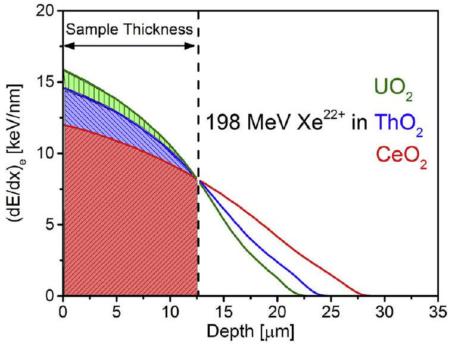
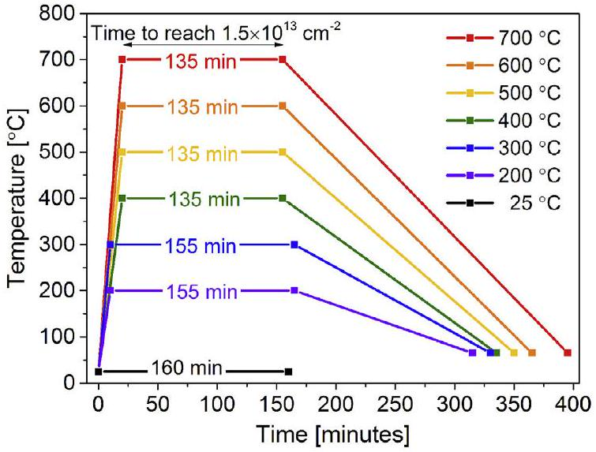
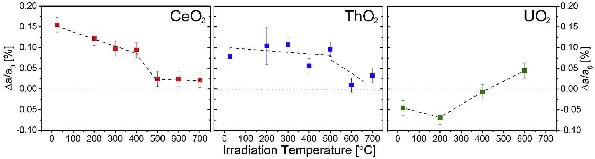
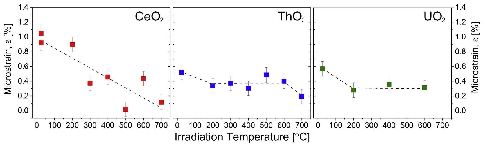
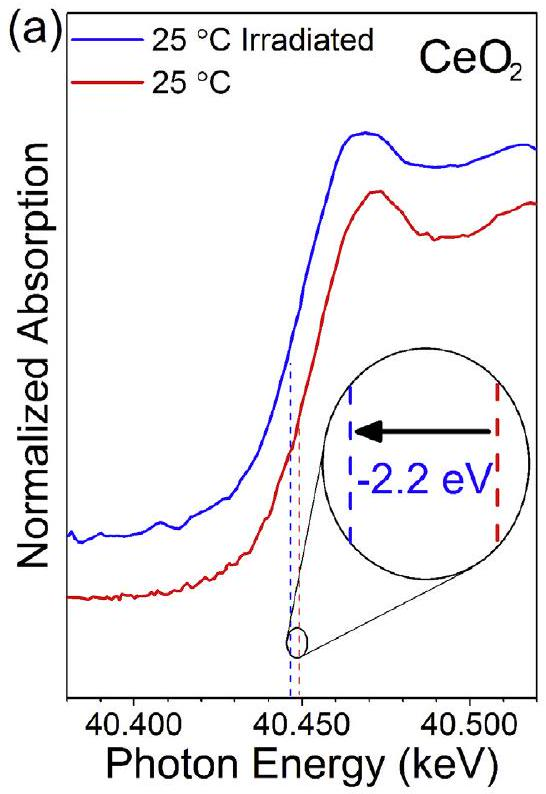
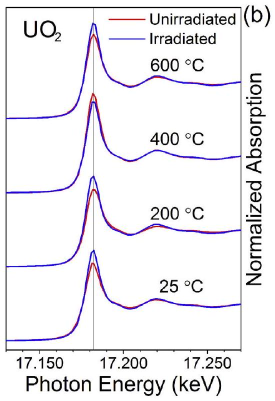
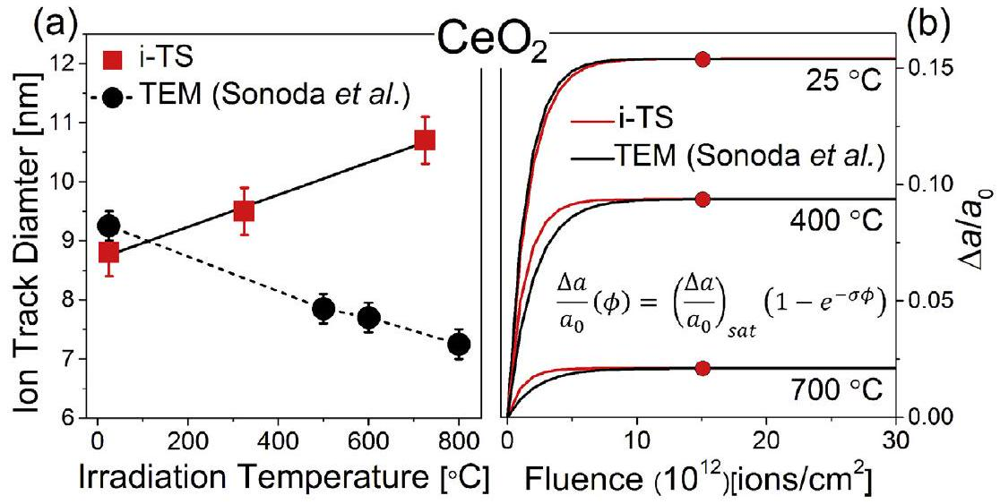

# Effects of irradiation temperature on the response of $\mathrm{CeO}_{2}, \mathrm{ThO}_{2}$, and $\mathrm{UO}_{2}$ to highly ionizing radiation 

William F. Cureton ${ }^{\mathrm{a}}$, Raul I. Palomares ${ }^{\mathrm{a}}$, Cameron L. Tracy ${ }^{\mathrm{b}, \mathrm{c}}$, Eric C. O'Quinn ${ }^{\mathrm{a}}$, Jeffrey Walters ${ }^{\mathrm{a}}$, Maxim Zdorovets ${ }^{\mathrm{d}, \mathrm{e}, \mathrm{f}}$, Rodney C. Ewing ${ }^{\mathrm{b}}$, Marcel Toulemonde ${ }^{\mathrm{g}}$, Maik Lang ${ }^{\mathrm{a}, \text { * }}$ ${ }^{\mathrm{a}}$ Department of Nuclear Engineering, University of Tennessee, Knoxville, TN, 37996, USA ${ }^{\mathrm{b}}$ Department of Geological Sciences, Stanford University, Stanford, CA, 94305, USA ${ }^{\mathrm{c}}$ Belfer Center for Science and International Affairs, John F. Kennedy School of Government, Harvard University, Cambridge, MA, 02138, USA ${ }^{\mathrm{d}}$ Institute of Nuclear Physics, Almaty, 050032, Kazakhstan ${ }^{\mathrm{e}}$ L. N. Gumilyov Eurasian National University, Nur-Sultan, 010008, Kazakhstan ${ }^{\mathrm{f}}$ Ural Federal University, Yekaterinburg, 620075, Russia ${ }^{\mathrm{g}}$ CIMAP-GANIL, CEA-CNRS-ENSICAEN, Bd H. Becquerel, Caen, 14070, France

## ARTICLE INFO

## Article history:

Received 18 April 2019
Received in revised form
30 June 2019
Accepted 23 July 2019
Available online 23 July 2019

## Keywords:

$\mathrm{CeO}_{2}$
$\mathrm{ThO}_{2}$
$\mathrm{UO}_{2}$
Ion irradiation
High temperature
X-ray diffraction
X-ray absorption spectroscopy

#### Abstract

Microcrystalline $\mathrm{CeO}_{2}, \mathrm{ThO}_{2}$, and $\mathrm{UO}_{2}$ were irradiated with $198 \mathrm{MeV}{ }^{132} \mathrm{Xe}$ ions to the same fluence at temperatures ranging from $25^{\circ} \mathrm{C}$ to $700^{\circ} \mathrm{C}$ then characterized by synchrotron X-ray diffraction and X-ray absorption spectroscopy. All samples retain crystallinity and their nominal fluorite-type phase at a fluence of $1.5 \times 10^{13}$ ions $/ \mathrm{cm}^{2}$. Both $\mathrm{CeO}_{2}$ and $\mathrm{ThO}_{2}$ display defect-induced unit cell expansion after irradiation at room temperature ( $\sim 0.15 \%$ and $\sim 0.10 \%$, respectively), yet as irradiation temperature increases, the maximum swelling produced decreases to $\sim 0.02 \%$. Alternatively, $\mathrm{UO}_{2}$ shows an initial contraction in unit cell parameter (approximately $-0.05 \%$ ) for room temperature irradiation, most likely related to irradiation-enhanced annealing or irradiation-induced oxidation. At higher temperatures (above $200^{\circ} \mathrm{C}$ ) $\mathrm{UO}_{2}$ begins to swell, surpassing its unit cell parameter prior to irradiation ( $\sim 0.05 \%$ ), an effect which could be attributed to minor reduction in uranium oxidation state in vacuum. However, while $\mathrm{CeO}_{2}$ irradiated at room temperature undergoes partial reduction, both $\mathrm{UO}_{2}$ and $\mathrm{ThO}_{2}$ exhibit no measurable change in cation oxidation state as evidenced by X-ray absorption spectroscopy. All samples display a decrease in irradiation-induced heterogeneous microstrain as a function of increasing irradiation temperature.

© 2019 Elsevier B.V. All rights reserved.

## 1. Introduction

Nuclear fuels are subject to extreme conditions including high temperatures, large temperature gradients, evolving chemical composition, and intense irradiation from neutrons, alpha particles, and energetic fission fragments. Such exposure leads to the accumulation of defects that eventually manifest themselves in the microstructure and lead to material degradation, limiting the lifetime of the fuel in the reactor. Due to the difficulty of handling irradiated fuel from reactors and the wide variety of coincident radiation effects (i.e., neutron damage, fission-fragment ionization effects, fission-product accumulation, and fission gas bubble

[^0]formation), characterization and decoupling of the effects of individual damage processes are complex. The use of ion accelerators provides a valuable tool for the simulation of select radiation effects in fuel materials in order to study, in isolation, the mechanisms of one type of damage by maintaining well-controlled experimental conditions, such as irradiation temperature.

The use of swift heavy ions can specifically simulate the effects of electronic energy deposition from energetic fission fragments, which have kinetic energies of approximately 100 MeV , masses in the approximate range $80-150 \mathrm{u}$, and initially deposit energy to electrons at a magnitude of $18-22 \mathrm{keV} / \mathrm{nm}$ [1]. Swift heavy ions deposit energy primarily via electronic excitation and ionization processes, and their generation by particle accelerators allows for precise control of irradiation conditions. This energy deposition is localized near the relatively straight ion path and causes electron
cascades, followed by the thermalization of electrons. Excited electrons then deposit energy to atoms in the system via electronphonon coupling causing local heating known as a thermal spike [2]. This rapid heating can lead to local melting over short time scales before heat is quickly dissipated, inducing rapid quenching in the structure $[3,4]$. Atoms are hypothesized to be partially or entirely freed from their sites during the rapid heating, and their subsequent reordering during the quench is kinetically-limited, which causes the formation of cylindrical damage zones along the paths of ions known as ion tracks. In ceramics, rapid quenching can cause the formation of point defects [5], formation of extended defects [6], amorphization [7], order-to-disorder phase transformation [8], or crystalline-to-crystalline phase transformation [9] within the track or in the bulk at sufficiently high ion fluences.

Fluorite-structured ( $F m \overline{3} m$ ) oxides with compositions of $\mathrm{CeO}_{2}$, $\mathrm{ThO}_{2}$, and $\mathrm{UO}_{2}$ are important nuclear fuel and non-radioactive analogue materials and have been studied in detail under swift heavy ion irradiation at room temperature [1,10-18]. The three materials' radiation response is heavily dependent on their redox behavior [16,17,19]. $\mathrm{CeO}_{2}$ tends to reduce [16,20] under swift heavy ion irradiation, while $\mathrm{UO}_{2}$ is prone to oxidation under many conditions including under swift heavy ion irradiation [21,22]. Thorium typically remains in the tetravalent state in the oxide form, such that its oxide maintains stoichiometry under irradiation [14,16,23]; therefore, $\mathrm{ThO}_{2}$ is a good control when investigating the redox response. While higher temperature irradiations are necessary to compare results with reactor-relevant conditions, studies of how temperature (intimately tied to redox behavior) affects the swift heavy ion radiation response are much more limited [24,25]. Temperatures at the centerline of $\mathrm{UO}_{2}$ fuel pellets approach $\sim 1200^{\circ} \mathrm{C}$ (and higher in some applications) and decrease parabolically along radial directions outward to temperatures as low as $\sim 500^{\circ} \mathrm{C}$. At the outer periphery of the fuel pellet, an increase in resonance absorption and decrease in self shielding causes higher fission rates. At high burnup levels, this causes important effects, such as the so-called "rim effect" wherein extensive fission fragment damage, coupled with relatively low temperatures (less annealing), induces grain fragmentation and leaves behind a porous morphology at the periphery of the fuel pellet [26-28]. In addition, most of the observed unit cell swelling in fuel occurs at fractional radii (from pellet center to the edge) between 0.5 and 0.9 [29].

Here, we report the response of common nuclear fuel materials and analogues to irradiation with a typical fission fragment (Xe) at temperatures relevant to fuel pellet rim regions at normal operating conditions. The structural stability (resistance to swelling/ contraction or phase transformation) and the induced defect structure were probed with synchrotron X-ray diffraction, while the redox response was investigated with X-ray absorption spectroscopy.

## 2. Experimental

### 2.1. Irradiation

Polycrystalline powders of $\mathrm{CeO}_{2}, \mathrm{ThO}_{2}$, and $\mathrm{UO}_{2}(\sim 2 \mu \mathrm{~m}$ grain size [19]) obtained from commercial vendors were uniaxially pressed into holes of $120 \mu \mathrm{~m}$ diameter drilled into $12.5 \mu \mathrm{~m}$ thick molybdenum sheets, explained in detail elsewhere [30]. The resultant compacts were determined to be $\sim 50 \%$ of theoretical densities, in agreement with [31]. Samples of each compound were irradiated in Kazakhstan at the Astana branch of the Institute of Nuclear Physics, Cyclotron DC-60 with $198 \mathrm{MeV}{ }^{132} \mathrm{Xe}$ ions. Stopping powers and ion ranges were calculated using the SRIM-2008 code [32]. Density-corrected electronic stopping profiles as a
function of sample depth are shown in Fig. 1 and confirm that all ions completely penetrate the $12.5 \mu \mathrm{~m}$ thick sample pellets, avoiding implantation effects or significant changes in the energy loss. The nuclear energy loss was greater than two orders of magnitude lower than the electronic and can be thus neglected.

Samples were placed on stages with heating coils and were irradiated in vacuum at controlled temperatures ranging from room temperature to $700^{\circ} \mathrm{C}$ to a fluence of $1.5 \times 10^{13}$ ions $/ \mathrm{cm}^{2}$. In order to isolate the effects of irradiation at high temperature from just thermally-induced modifications, control samples were heated in vacuum under identical conditions, but in the absence of irradiation. The temperature profiles during the experiments for each sample, including dwell time at the irradiation temperature, are shown in Fig. 2. Heating ramp times ranged between 10 and 20 min , and cooling time between 150 and 240 min.

### 2.2. Characterization

After irradiation, atomic structural modifications were probed by synchrotron X-ray diffraction (XRD) at Argonne National Laboratory, Advanced Photon Source, beamline 16BM-D (HPCAT sector) [33]. Angle dispersive X-rays were utilized in transmission geometry with a monochromatic $29.2 \mathrm{keV}(\lambda=0.4246 \AA)$ beam selected by a Si (111) double-crystal monochromator with a focused beam spot size of $12 \mu \mathrm{~m}$ (vertical) by $5 \mu \mathrm{~m}$ (horizontal). Resulting DebyeScherrer rings were captured with a MAR345 image plate detector with a collection time of 300 s . The beamline's switchable diffraction-absorption setup allowed for collection of transmission X-ray absorption spectroscopy (XAS) at the cerium K-edge $(\sim 40 \mathrm{keV})$ and at the thorium and uranium $\mathrm{L}_{\text {III }}-\mathrm{edge}(\sim 17 \mathrm{keV})$ at the same sample location.

Radially integrated diffraction patterns were obtained using Dioptas [34]. The patterns were analyzed via Rietveld refinement methods performed using Fullprof [35]. Analysis of XAS spectra was performed using the Athena software for normalization to pre- and post-edges, while OriginLab was used in order to locate inflection points (edges), utilizing the first derivative maxima and/or second derivative zeros.

## 3. Results

At each temperature, all three materials were irradiated simultaneously under identical conditions. Upon irradiation at room

Fig. 1. Electronic Stopping Power profiles as a function of depth for 198 MeV Xe ions in $\mathrm{CeO}_{2}$, $\mathrm{ThO}_{2}$, and $\mathrm{UO}_{2}$ determined by the SRIM-2008 code. Extent of shaded region and dashed line represent sample thickness and signify that all ions completely penetrated samples.

Fig. 2. Temperature profiles as a function of time for irradiation experiments.

temperature, all diffraction maxima of $\mathrm{CeO}_{2}$ and $\mathrm{ThO}_{2}$ shift to lower $2 \theta$ values, yet an increase in peak positions of $\mathrm{UO}_{2}$ occurs (not shown). This behavior is indicative of unit cell swelling due to accumulation of point and extended defects [14,17]. For all materials, concurrent peak broadening and a decrease in peak intensity, compared to diffraction patterns from unirradiated samples, occurs during irradiation at room temperature, an effect attributed to local structural distortions and heterogeneous microstrain that accompany the presence of point defects and defect clusters. After irradiation at higher temperatures, the shift and broadening in $2 \theta$ becomes less as irradiation temperature increases for $\mathrm{CeO}_{2}$ and $\mathrm{ThO}_{2}$. The evolution of the diffraction maxima position and broadening for $\mathrm{UO}_{2}$ as irradiation temperature is increased is more complex. Diffraction maxima initially shift to higher $2 \theta$ values for room temperature and $200^{\circ} \mathrm{C}$ irradiation, but this reverses at higher irradiation temperatures.

Rietveld refinement was used to quantitatively analyze the unit cell behavior as a function of increasing temperature. Each irradiated sample's unit cell parameter was compared with its respective unirradiated reference material's unit cell parameter for each temperature using the relation ( $\Delta a / a_{0}$ ), where $\Delta a$ is the difference in unit cell parameter and $a_{0}$ is the unit cell parameter of the unirradiated reference material (Fig. 3). For $\mathrm{CeO}_{2}$ and $\mathrm{ThO}_{2}$, the data reveal that the magnitude of unit cell expansion is inversely proportional to irradiation temperature for the same irradiation fluence. Swelling is lower at higher temperatures due to a reduced concentration of defects or the formation of more complex defects, which is attributed to the thermal annealing of irradiation-induced defects at high temperature [15].
$\mathrm{CeO}_{2}$ and $\mathrm{ThO}_{2}$ show the same trend of divergence from the unirradiated unit cell parameter ( $0.15 \%$ and $0.08 \%$, respectively) following room temperature irradiation and decrease toward, yet never fully return to the unirradiated value ( $\Delta a / a_{0}=0 \%$ ) as the irradiation temperatures increases. The reduction in unit cell parameter implies a lower concentration of defects at higher temperatures due to higher recombination rates as point defects become more mobile. In $\mathrm{CeO}_{2}$, an approximately linear decrease in the extent of swelling, as a function of temperature, occurs initially with a more pronounced reduction of unit cell parameters between $300^{\circ} \mathrm{C}$ and $500^{\circ} \mathrm{C}$. For $\mathrm{ThO}_{2}$, due to scatter in the data, a monotonic decrease toward the pristine unit cell values between $200^{\circ} \mathrm{C}$ and $700^{\circ} \mathrm{C}$ is inferred. The overall trend is most likely a step-wise reduction in unit cell parameter with increasing temperature, similar to $\mathrm{CeO}_{2}$, yet these details cannot be extracted from the data for $\mathrm{ThO}_{2}$. The source of this scatter is unclear, as samples were irradiated simultaneously and measured under identical conditions. In contrast to $\mathrm{CeO}_{2}$ and $\mathrm{ThO}_{2}, \mathrm{UO}_{2}$ shows a small unit cell contraction between $25^{\circ} \mathrm{C}$ and $200^{\circ} \mathrm{C}\left(\Delta \mathrm{a} / \mathrm{a}_{0}=-0.05\right.$ to $\left.-0.07 \%\right)$. The unit cell contraction behavior at room temperature has been observed previously in swift heavy ion irradiated $\mathrm{UO}_{2}$ [19]. After $200^{\circ} \mathrm{C}$, $\mathrm{UO}_{2}$ samples revert to swelling, increasing in unit cell parameter to the unirradiated value between $200^{\circ} \mathrm{C}$ and $400^{\circ} \mathrm{C} \left(\Delta \mathrm{a} / \mathrm{a}_{0}=0 \%\right)$ and exceeds the pristine value at $600^{\circ} \mathrm{C}(\Delta \mathrm{a} / \mathrm{a}_{0}=0.05 \%$ ).

Heterogeneous microstrain, quantified by broadening of X-ray diffraction peaks, serves as an additional characterization metric of irradiation-induced changes in materials. Williamson-Hall analysis [36] allows for X-ray diffraction maxima broadening to be separated into contributions from the accumulation of microstrain and changes in grain size. X-ray diffraction maxima were fit with Pseudo-Voigt peaks in order to obtain accurate peak positions and widths. Based on this analysis, no significant crystallite size change occurs in any of the three oxides, which seems reasonable taking into account the fluence applied [19]. The irradiation-induced microstrain, present in all three oxides, decreases as a function of increasing irradiation temperature (Fig. 4).

Local distortions are highest in $\mathrm{CeO}_{2}$ for room temperature irradiation, then monotonically decrease as a function of irradiation temperature at a rate that is slowed after $300^{\circ} \mathrm{C}$. In $\mathrm{ThO}_{2}$, microstrain decreases between $25^{\circ} \mathrm{C}$ and $700^{\circ} \mathrm{C}$, with the most significant decreases occurring between $25^{\circ} \mathrm{C}$ and $200^{\circ} \mathrm{C}$ and between $600^{\circ} \mathrm{C}$ and $700^{\circ} \mathrm{C} . \mathrm{UO}_{2}$ exhibits a decrease in microstrain between $25^{\circ} \mathrm{C}$ and $200^{\circ} \mathrm{C}$, then remains relatively constant as a function of increasing irradiation temperature. In all materials, the maximum irradiation temperature was insufficient to fully suppress microstrain, which is consistent with the remaining defect-induced swelling at these temperatures (Fig. 3).

Fig. 3. Normalized unit cell parameter of irradiated fluorite oxides relative to unirradiated reference samples as a function of increasing irradiation temperature. Dashed lines indicate changes of unit cell parameter with temperature and serve to guide the eye. Error bars derived from Rietveld refinement.

Fig. 4. Microstrain of irradiated oxide materials obtained from Williamson-Hall plots as a function of increasing irradiation temperature. Dashed lines serve to guide the eye. Errors determined from weighted linear fit during Williamson-Hall analysis based on peak fitting uncertainties.

XAS allows for analysis of irradiation- or temperature-induced redox behavior by probing changes in the electronic structure of cations. $\mathrm{CeO}_{2}$ irradiated at room temperature showed a negative shift in the position of the cerium K-edge of approximately 2.2 eV at a fluence of $1.5 \times 10^{13}$ ions $/ \mathrm{cm}^{2}$ (Fig. 5a), indicating partial irradiationinduced reduction of $\mathrm{Ce}^{4+}$ to $\mathrm{Ce}^{3+}$. A shift of 7 eV correlates to a complete reduction of all cerium cations [37]. Similar irradiationinduced reduction of $\mathrm{CeO}_{2}$ irradiated with 200 MeV [20,38] and 167 MeV [16] Xe ions has been previously observed at room temperature. X-ray absorption spectra obtained from $\mathrm{CeO}_{2}$ after irradiation at higher ( $200^{\circ} \mathrm{C}$ and above) temperatures showed no shift in the K-edge position, nor in post-edge shape, indicating no detectable changes in valency of the Ce cation. $\mathrm{ThO}_{2}$ and, surprisingly, $\mathrm{UO}_{2}$ showed no shift in their cation L-III edges and no change in post-edge shape, regardless of irradiation or temperature (Fig. 5b).

## 4. Discussion

The observed decrease in swelling with increasing irradiation

temperature is a well-documented behavior for electron and lowenergy ion irradiations. It is attributed to thermally initiated defect recovery mechanisms that are common to most materials [39]. Damage observed in swift heavy ion irradiated fluorite-type structured oxides is mostly attributed to defects and clustering on the oxygen sublattice. According to a recent high-resolution transmission electron microscopy (TEM) study on $\mathrm{CeO}_{2}$, the cation sublattice remains largely intact after irradiation; however, the oxygen sublattice displays more defects [40]. Thus, the damage observed in this study as increased unit-cell swelling and microstrain is primarily attributed to oxygen defects and defect clusters. This is further supported by a recent neutron total scattering study which evidenced the formation of small peroxide-like defect clusters in swift heavy ion irradiated $\mathrm{CeO}_{2}$, which was a major component of the radiation damage in this material [17]. Molecular dynamic simulations corroborate these results by suggesting that the formation of cation defects is energetically unfavorable [41,42]. Therefore, the observed decrease in swelling and microstrain is assumed to be annihilation of oxygen defects and defect clusters.

Fig. 5. (a) XAS cerium K-edges normalized to pre- and post-edges (offset for ease of viewing) measured before (red) and after (blue) ion irradiation at room temperature to a fluence of $1.5 \times 10^{13}$ ions $/ \mathrm{cm}^{2}$. Dashed lines indicate edge energy and show a shift of -2.2 eV upon irradiation corresponding to partial reduction of cerium from the tetravalent to the trivalent electronic state. (b) XAS uranium L-III edges for (red) before and (blue) after irradiation at various temperatures, normalized to pre- and post-edge intensities. Changes in peak height are attributed to varying sample thickness, affecting photon attenuation. (For interpretation of the references to colour in this figure legend, the reader is referred to the Web version of this article.)

The onset temperatures of the major recovery stages are material and defect species dependent, arising from unique characteristics of thermally activated point defect motion and defect cluster mobility. Each stage typically correlates well with a specific fraction of the absolute melting temperature of the material ( $\mathrm{T}_{\mathrm{m}}=2400^{\circ} \mathrm{C}$, $2850^{\circ} \mathrm{C}$, and $3350^{\circ} \mathrm{C}$ for $\mathrm{CeO}_{2}, \mathrm{UO}_{2}$ and $\mathrm{ThO}_{2}$, respectively [43,44]). For example, in $\mathrm{CeO}_{2}$, oxygen interstitials become mobile at around $325^{\circ} \mathrm{C}$ [45]. This agrees well with the sharp decrease in unit cell parameter observed in the range of irradiation temperatures from $300^{\circ} \mathrm{C}$ to $500^{\circ} \mathrm{C}$.

In order to provide a more detailed explanation of the observed behavior in $\mathrm{CeO}_{2}$, the ion-matter interaction was described as a transient thermal process, where ion-induced excited electrons thermalize and deposit their energy to atoms through electronphonon coupling, as previously described. This causes localized heating within the path of the ion and a rapid quench, often resulting in a cylindrical region of defects (or even amorphization in some materials) known as the ion track. The theory that aims to characterize this ion-induced effect is known as the thermal spike model [2,3], describing the process with two coupled differential equations [46]:

$$
C_{e}\left(T_{e}\right) \frac{\partial T_{e}}{\partial r}=\frac{1}{r} \frac{\partial}{\partial r}\left[r K_{e}\left(T_{e}\right) \frac{\partial T_{e}}{\partial r}\right]-g\left(T_{e}-T_{a}\right)+A(r)
$$

$$
C_{a}\left(T_{a}\right) \frac{\partial T_{a}}{\partial r}=\frac{1}{r} \frac{\partial}{\partial r}\left[r K_{a}\left(T_{a}\right) \frac{\partial T_{a}}{\partial r}\right]-g\left(T_{e}-T_{a}\right)
$$

where Eqn. (1) describes the electronic system and Eqn. (2) describes the atomic system (i.e., subscripts $e$ and $a$, respectively). $T_{e, a}$ are the temperatures, $C_{e, a}$ are the heat capacities, and $K_{e, a}$ are the thermal conductivities of the respective systems and are all a function of radial distance $r$ and time $t$ from the incident ion passage. $A(r)$ is the energy deposited to the electronic system as a function of radial distance to the incident ion path. The parameter $g$ describes the electron-phonon coupling strength and is the only free parameter. In the case of insulators, this electron-phonon coupling is linked to the electron-phonon mean free path $\lambda$ via the relation $\lambda^{2}=2 / g$ [47,48], which is experimentally determined by fitting the observed ion track size of several insulating ceramics that can be amorphized or not [3], assuming tracks result from the quench of a molten phase appearing along the ion path. Track diameters decrease monotonously with the band gap energy of insulators. In $\mathrm{CeO}_{2}$, the band gap energy is 6.0 eV , which yields an electron-phonon mean free path estimation of $\lambda=4.5 \mathrm{~nm}$ [43]. The inelastic thermal spike (i-TS) model uses a numerical method approach [49] to solve the system of coupled differential equations (1) and (2) and has been iteratively developed for ceramics [3,50,51]. A more detailed description and discussion of the current implementation of the calculation can be found elsewhere [47,48].

After performing the i-TS calculation with the specific beam energy and electronic energy loss for this study, resultant ion track sizes in $\mathrm{CeO}_{2}$ from the calculation show a diameter of $8.8 \pm 0.2 \mathrm{~nm}$ at room temperature, which agrees well with previous studies with similar ions and energies [16,25,38]. As temperature increases, track size increases linearly at a rate of $0.27 \pm 0.02 \mathrm{~nm} / 100^{\circ} \mathrm{C}$ (Fig. 6a). In this case, ion tracks would overlap at lower ion fluences for irradiation at higher temperatures (assuming a singleimpact damage trend based on previous studies [13,14,52,53]), causing a decrease of fluence needed to reach the saturation damage. Due to the decrease in unit cell swelling and microstrain observed in $\mathrm{CeO}_{2}$ and $\mathrm{ThO}_{2}$ with increased irradiation temperatures, the defect density within an individual ion track must decrease with the increasing track size. Assuming the same energy
deposition by the ions at each temperature a similar number of excited electrons would be most likely produced, regardless of temperature. With increased matrix energy at higher ambient temperatures, the extent of electronic excitation would increase due to greater diffusion of the delta electrons, decreasing the energy per area within the track. This would cause an ion track that is larger, although with less damage per unit area with increasing irradiation temperature, thus reducing damage. Nevertheless, considering the linear behavior of the track size as compared with the non-linear trend observed in the swelling and local distortion data in $\mathrm{CeO}_{2}$ (and all materials), a more complete description of the behavior involves the synergism of other processes such as the thermally-induced onset of defect mobility and subsequent recombination with the increase in track size.

However, two of the few studies of swift heavy ion irradiation of $\mathrm{CeO}_{2}$ at high temperature using similar ions and energy ( 210 MeV Xe ) and temperatures as this work observed a decrease in ion track size a function of increasing irradiation temperature by means of TEM [24,25] (Fig. 6a). Another recent high-resolution TEM study of swift heavy ion tracks in $\mathrm{CeO}_{2}$ irradiated at room temperature reported observation of an oxygen vacancy-rich track core with an oxygen interstitial-rich track periphery [40]. Together, these results suggest that many oxygen interstitials at the periphery of ion track are mobile at high temperatures and are annihilated, shrinking the effective track size and reducing the amount of corresponding structural swelling. As structural swelling decreases continuously with increasing irradiation temperature, it is expected that local distortions due to accumulated defects will decrease as well, explaining the accompanying decrease in microstrain. The discrepancy between the i-TS calculations presented in this study and the aforementioned TEM results could be explained as follows: (i) TEM is showing an incomplete picture of the true extent of ion tracks, only displaying certain defect types due to the configuration of the instrument (i.e., bright field images), and the track sizes derived from the i-TS calculations are an accurate portrait of the observed behavior or (ii) the TEM results accurately display the shrinking of the effective track size as a function of increasing irradiation temperature, while the i-TS calculation's description of the physics is incomplete.

Alternatively, and most likely, both track sizes could be an accurate portrayal of two individual, coupled phenomena. The first, represented by the i-TS calculations, describes solely the area of initial energy deposition and possible melting which produces defects after the quench from thermal spike to ambient temperatures. The second describes the remaining defects after the subsequent defect recombination annihilation. At room temperature, the i-TS and TEM track sizes are extremely similar, suggesting minimal temperature induced defect mobility and annihilation. Previous studies have proposed that the density of energy deposition is radially dependent, highest at the center of the ion path and decreasing with distance [54]. This implies defect density would be subject to the same radial dependence as a function of perpendicular distance from the incident ion path. At higher temperatures, an increase in defect recombination could leave defect density at outer track radii negligible or below the detection limit of TEM, leading to smaller measured track radii. The area of this region would most likely increase with increasing temperature due to more thermally activated defect mobility. Based on the i-TS model, the same ion energy is deposited over a larger volume at higher temperatures, which leads to a decrease in defect density radially from the incident ion path. The smaller number of defects per unit volume and associated reduction in strain contrast directly impacts the track size observable by TEM, leading to a decrease in effective track diameter as a function of increasing temperature.

While future studies utilizing complementary experimental

Fig. 6. (a) Ion track diameters as a function of temperature derived from i-TS calculations and TEM analysis of ion tracks produced from similar ion and energy irradiations by Sonoda et al. [24,25]. Error for i-TS data determined from the radial step-size of the calculation. (b) Single-impact model curves calculated based on unit cell swelling at each respective temperature ( $\Delta \mathrm{a} / \mathrm{a}_{0}(\phi)$ ) for fluence ( $\phi=1.5 \times 10^{13}$ ions $/ \mathrm{cm}^{2}$ ) and track diameters converted to track cross sections ( $\sigma$ ). Circles indicate swelling data at respective determined by XRD in this study.

techniques (e.g., TEM with small angle X-ray/neutron scattering) to determine the track size as a function of irradiation temperature are needed to elucidate this discrepancy, these results mainly suggest that the track size has little influence on the microstructural modifications. Rather, the density and type of defects produced within the tracks that survive temperature-induced annihilation drive material swelling, microstrain, and chemical changes. In order to illustrate this, a single-impact behavior [52,53] for swelling was assumed and is described by Eqn. (3):

$$
\frac{\Delta a}{a_{0}}(\phi)=\left(\frac{\Delta a}{a_{0}}\right)_{\text {sat }}\left(1-e^{-\sigma \phi}\right)
$$

where $\frac{\Delta a}{a_{0}}(\phi)$ represents the relative change in unit cell parameter as a function of fluence, $\left(\frac{\Delta a}{a_{0}}\right)_{\text {sat }}$ represents the saturation value of the relative change in unit cell parameter, $\sigma$ represents the ion track cross section. For data at select temperatures, both track sizes from i-TS and Sonoda et al. [24,25] were converted to cross sections and relative change in unit cell parameter determined by XRD in this study were input into the equation at the fluence value of $\phi=1.5 \times 10^{13}$ [ions $/ \mathrm{cm}^{2}$ ]. Single impact behavior for damage accumulation caused by swift heavy ions is well documented for $\mathrm{CeO}_{2}$ [16,19]. Curves were generated for both cases and are presented in Fig. 6b, which shows that the discrepancy in track size has little influence on the shape of the curve. More importantly, the saturation value in the single-impact curve (ion-track overlap regime) is reached with the fluence used in this study, as suggested by previous studies [16]. Instead, the material modifications induced by the energy deposition is primarily influenced by the type and density of defects produced which is largely dependent on the respective cation's electronic structure and redox response (e.g., reduction in $\mathrm{CeO}_{2}$ ).

Partial oxidation state reduction of cations in $\mathrm{CeO}_{2}$ under swift heavy ion irradiation at room temperature is well-documented [16,19,20,40] and is highly dependent on projectile ion type and energy [55]. At a certain ion fluence, $\mathrm{CeO}_{2}$ becomes severely oxygen deficient and forms a second, hypo-stoichiometric phase [16,19], a process that dramatically increases with reducing grain size of the material. The expulsed oxygen may not necessarily leave the sample but may instead produce complex peroxide defects as shown by Ref. [17]. No phase separation was observed in this study, however, partial reduction occurred for room temperature irradiation. To maintain charge neutrality, the configuration of oxygen
anions must change as does the oxidation state of cations. This produces oxygen vacancies and potentially small vacancy clusters, primarily at the core of the ion track as suggested by highresolution transmission electron microscopy studies [39]. Such vacancy clusters could contribute to additional volumetric swelling that is not fully accessible by long-range diffraction techniques. As mentioned previously, small peroxide-like defects have been observed by probing the local atomic structure in swift heavy ion irradiated $\mathrm{CeO}_{2}$ by neutron probes [17]. Reduction of $\mathrm{CeO}_{2}$ when heating in vacuum is well documented [56], however, the hypostoichiometric material will typically reoxidize when exposed to air [57] particularly the loosely pressed powder used in this study. The samples in this study were exposed to and stored in air between irradiation and characterization. Our results on swelling and microstrain suggest that irradiation at room temperature stabilizes the $\mathrm{CeO}_{2-\mathrm{x}}$ material, yet as oxygen becomes more mobile at higher temperatures, these anions become more likely to recover their initial configurations, prompting a reoxidation process analogous to point defect recombination. The lack of change in the X-ray absorption spectra of $\mathrm{ThO}_{2}$ is expected given the monovalency of the Th ions. Thus, redox effects play no role for $\mathrm{ThO}_{2}$ and previous postirradiation thermal annealing studies reported a single major defect recovery stage at $\sim 325-675^{\circ} \mathrm{C}$ [15] and $\sim 275-425^{\circ} \mathrm{C}$ [18] in swift heavy ion irradiated $\mathrm{ThO}_{2}$. This was primarily attributed to the annihilation of oxygen point defects and small oxygen defect clusters. Because $\mathrm{ThO}_{2}$ has the highest melting temperature of the three materials studied here, and the onset of defect mobility typically occurs at a specific fraction of the absolute melting temperature [39], it is expected to only undergo one overall stage of defect mobility onset (most likely $\mathrm{O}^{2-}$ interstitials) for irradiation temperatures used in this study. This explains the behavior observed regarding the change in unit cell parameter and microstrain as a function of irradiation temperature. Simple point defect accumulation, without any contribution of redox behavior, and increased point defect recombination at higher irradiation temperatures are expected in $\mathrm{ThO}_{2}$.

Defect formation and recovery behaviors of $\mathrm{CeO}_{2}$ and $\mathrm{ThO}_{2}$ after irradiation at all temperatures can be primarily attributed to point defect accumulation on the oxygen sublattice, in agreement with prior study [13-18]. However, at similar fluences, $\mathrm{UO}_{2}$ exhibits different behavior as oxygen defects are known to strongly cluster, altering defect accommodation mechanisms compared with $\mathrm{CeO}_{2}$ and $\mathrm{ThO}_{2}$ [58]. In most past swift heavy ion irradiation studies, $\mathrm{UO}_{2}$
typically exhibits no unit cell expansion and only swells at extremely high fluences [10]. This behavior is has been associated with a multiple-impact model [10] requiring substantial ion track overlap for swelling to occur, which contrasts to the single-impact trends observed in $\mathrm{CeO}_{2}$ and $\mathrm{ThO}_{2}$. Irradiation-induced unit cell contraction of $\mathrm{UO}_{2}$ has been previously ascribed to limited oxidation of uranium [19]. Because the samples used here were prepared and stored in air, moderate hyperstoichiometry, particularly near sample surfaces, is likely. Upon irradiation in vacuum at room and slightly elevated temperatures, $\mathrm{UO}_{2}$ becomes increasingly oxidized homogenously throughout entire grains by driving excess oxygen from the surface into the bulk of the sample by irradiationenhanced diffusion mechanisms. This oxidation process could explain the contraction in unit cell parameter observed for the room temperature irradiation since an increase in excess oxygen content translates to a contraction in unit cell parameter [59-63]. At each temperature, the unit cell parameters of irradiated $\mathrm{UO}_{2}$ are indicative of slight oxidation ( $\mathrm{x}<0.05$ in $\mathrm{UO}_{2+\mathrm{x}}$ ). Evidence of irradiation-enhanced inward oxygen diffusion has been previously observed in swift heavy ion irradiated $\mathrm{UO}_{2}$ [19,22]. This inward diffusion could be enhanced at slightly elevated temperatures evidenced in increased contraction at $200^{\circ} \mathrm{C}$. At higher temperatures, the vacuum environment in which irradiation was performed likely hinders oxidation and over-compensates inward diffusion of excess oxygen leading to reduction towards stoichiometry, which could explain the observed swelling of $\mathrm{UO}_{2}$ at irradiation temperatures above $200^{\circ} \mathrm{C}$.

Oxygen interstitials in polycrystalline $\mathrm{UO}_{2}$ are liberated at $\sim 100^{\circ} \mathrm{C}$ and become fully mobile at $\sim 300^{\circ} \mathrm{C}$ [45,64]. The largest source of local distortions come from interstitials due to the large perturbation in the structure [65]. This explains the increase in unit cell parameter back to the unirradiated value between $200^{\circ} \mathrm{C}$ and $400^{\circ} \mathrm{C}$ and the decrease in heterogeneous microstrain between $25^{\circ} \mathrm{C}$ and $200^{\circ} \mathrm{C}$. Based on this behavior, the interstitial's effect manifests itself locally as microstrain before long range periodicity begins to change (i.e., unit cell parameter). However, it is also possible that swift heavy ion irradiation caused annealing of defects that existed prior to irradiation, causing the unit cell contraction observed following irradiation at room temperature. Similar behavior has been previously observed in other ceramic materials [66]. In contrast to $\mathrm{CeO}_{2}$ and $\mathrm{ThO}_{2}$, the microstrain in $\mathrm{UO}_{2}$ irradiated at and above $200^{\circ} \mathrm{C}$ remains relatively constant $(\sim 0.3 \%)$. This implies that the mechanism causing the relative unit cell parameter in $\mathrm{UO}_{2}$ (slightly negative for $\mathrm{T}_{\text {irr }}=25^{\circ} \mathrm{C}$ and $200^{\circ} \mathrm{C}$ ) to increase, surpassing $\Delta \mathrm{a}_{0}=0$ at $600^{\circ} \mathrm{C}$, prevents the release of microstrain with increasing temperature as it was the case in $\mathrm{CeO}_{2}$ and $\mathrm{ThO}_{2}$. In addition to increased annihilation of irradiation induced defects, the reduction of $\mathrm{UO}_{2}$ at temperatures around $200^{\circ} \mathrm{C}$ may initially decrease microstrain only by the elimination of oxygen interstitials. With increasing temperature, oxygen vacancies are also produced, which cause an increase of microstrain; thus, the combination of both processes creates an equilibrium of microstrain. Therefore, at higher temperatures, it is likely that the observed effects in $\mathrm{UO}_{2}$ are primarily influenced by redox effects with little impact of irradiation.

For $\mathrm{UO}_{2}$, the absence of an absorption edge shift or change in post-edge features at any temperature for both irradiated and unirradiated samples (Fig. 5b) is inconsistent with prior speculation that redox effects might be enhanced at higher temperatures. Based on the unit cell data, it was expected that samples irradiated at room temperature would be slightly oxidized. Tracy et al. [16] reported a significant change in the shape of the uranium L-III postedge feature of $\mathrm{UO}_{3}$ (containing $\mathrm{U}^{6+}$ ) following irradiation with swift heavy ions, which accompanied irradiation-induced reduction to $\mathrm{UO}_{2+\mathrm{x}}$ (primarily $\mathrm{U}^{4+}$ ). Irradiation-induced oxidation of $\mathrm{UO}_{2}$, as previously observed [19,22], would also yield changes to the
post-edge shape. However, no substantial change in the XAS spectra, corresponding to either reduction or oxidation, are observed in the present study, as shown in Fig. 5b. It may be that $\mathrm{UO}_{2}$ is subject to redox effects which are occurring related to the changes observed in the unit cell parameter, but the chemical changes were below the detection limit of the XAS measurements performed in this study. Alternatively, due to the relatively small magnitude of unit cell parameter change observed ( $\sim-0.05$ to $0.05 \%$ ), it is possible that the observed changes are merely lost in the statistical background, and the XAS results are an accurate portrayal of a lack of radiation response in $\mathrm{UO}_{2}$ under the irradiation conditions utilized in this study.

These results, combining a number of different analytical techniques, provide a unique insight into electronic energy loss for ions approximately midway through their range when electronic stopping has dropped from 18 to $22 \mathrm{keV} / \mathrm{nm}$ just after fission to $8-15 \mathrm{keV} / \mathrm{nm}$ at temperatures relevant to fractional fuel pellet radii greater than approximately $0.5 r_{0}$ depending on reactor operation parameters. In addition, due to the qualitative similarity of the annealing behavior of swift heavy ion irradiated fluorite-structured materials displayed in previous studies [15,18], as compared to the reduction of damage during high temperature irradiation behavior in this study, these results suggest that the ex situ and in situ defect recovery mechanisms are similar.

## 5. Conclusion

Irradiation of $\mathrm{CeO}_{2}, \mathrm{ThO}_{2}$, and $\mathrm{UO}_{2}$ with $198 \mathrm{MeV}{ }^{132} \mathrm{Xe}$ ions results in the accumulation of point defects and defect clusters, causing changes in their unit cell parameters and inducing local distortion (heterogeneous microstrain). These effects are minor relative to that commonly induced in ceramics by lower energy irradiations, for which nuclear stopping dominates, and are efficiently annealed at elevated temperatures. Irradiation at $25^{\circ} \mathrm{C}$ induces unit cell swelling in $\mathrm{CeO}_{2}$ and $\mathrm{ThO}_{2}$ yet contraction in $\mathrm{UO}_{2}$. At elevated temperatures, the swelling is reduced for $\mathrm{CeO}_{2}$ and $\mathrm{ThO}_{2}$, and the behavior is much more complex in $\mathrm{UO}_{2}$. Only room temperature irradiation of $\mathrm{CeO}_{2}$ yields a measurable change in cation oxidation state (partial reduction) indicating that for these irradiation conditions, temperature does not enhance irradiationinduced redox response. The damage behavior observed as a function of increasing irradiation temperature is primarily attributed to the enhancement of point defect mobility, which occurs at an onset temperature that is typically proportional to the melting temperature of the material. This study of the high temperature response of nuclear fuel materials to swift heavy ion irradiation provides insight into the source of the exceptional radiation tolerance exhibited by many fluorite-structured nuclear materials.

## Acknowledgements

This work was supported by the Energy Frontier Research Center Materials Science of Actinides funded by the US Department of Energy, Office of Science, Office of Basic Energy Sciences (DESC0001089). Portions of this work were performed at HPCAT (Sector 16), Advanced Photon Source, Argonne National Laboratory. HPCAT operations are supported by DOE-NNSA under award No. DE-NA0001974 and DOE-BES under award No. DE-FG0299ER45775, with partial instrumentation funding by NSF. APS is supported by DOE-BES, under contract No. DE-AC02-06CH11357. W.F.C. and R.I.P. gratefully acknowledge support from the U.S. Department of Energy (DOE) National Nuclear Security Administration (NNSA) through the Capital/DOE Alliance Center (DENA0003858). HPCAT beamtime was granted by the Capital/DOE Alliance Center.

## Appendix A. Supplementary data

Supplementary data to this article can be found online at https://doi.org/10.1016/j.jnucmat.2019.07.029.

## References

[1] H. Matzke, P.G. Lucuta, T. Wiss, Swift heavy ion and fission damage effects in $\mathrm{UO}_{2}$, Nucl. Instrum. Methods Phys. Res. Sect. B Beam Interact. Mater. Atoms 166-167 (2000) 920-926.
[2] M. Toulemonde, E. Paumier, C. Dufour, Thermal spike model in the electronic stopping power regime, Radiat. Eff. Defects Solids 126 (1-4) (1993) 201-206.
[3] M. Toulemonde, C. Dufour, A. Meftah, E. Paumier, Transient thermal processes in heavy ion irradiation of crystalline inorganic insulators, Nucl. Instrum. Methods Phys. Res. Sect. B Beam Interact. Mater. Atoms 166 (Supplement C) (2000) 903-912.
[4] M. Toulemonde, S. Bouffard, F. Studer, Swift heavy ions in insulating and conducting oxides: tracks and physical properties, Nucl. Instrum. Methods Phys. Res. Sect. B Beam Interact. Mater. Atoms 91 (1) (1994) 108-123.
[5] C. Trautmann, M. Toulemonde, K. Schwartz, J.M. Costantini, A. Müller, Damage structure in the ionic crystal LiF irradiated with swift heavy ions, Nucl. Instrum. Methods Phys. Res. Sect. B Beam Interact. Mater. Atoms 164-165 (Supplement C) (2000) 365-376.
[6] G. Baldinozzi, D. Simeone, D. Gosset, I. Monnet, S. Le Caër, L. Mazerolles, Evidence of extended defects in pure zirconia irradiated by swift heavy ions, Phys. Rev. B 74 (13) (2006) 132107.
[7] A.B. Cusick, M. Lang, F. Zhang, K. Sun, W. Li, P. Kluth, C. Trautmann, R.C. Ewing, Amorphization of $\mathrm{Ta}_{2} \mathrm{O}_{5}$ under swift heavy ion irradiation, Nucl. Instrum. Methods Phys. Res. Sect. B Beam Interact. Mater. Atoms 407 (2017) 25-33.
[8] M. Lang, F. Zhang, J. Zhang, J. Wang, J. Lian, W.J. Weber, B. Schuster, C. Trautmann, R. Neumann, R.C. Ewing, Review of $\mathrm{A}_{2} \mathrm{~B}_{2} \mathrm{O}_{7}$ pyrochlore response to irradiation and pressure, Nucl. Instrum. Methods Phys. Res. Sect. B Beam Interact. Mater. Atoms 268 (19) (2010) 2951-2959.
[9] C.L. Tracy, M. Lang, F. Zhang, C. Trautmann, R.C. Ewing, Phase transformations in $\mathrm{Ln}_{2} \mathrm{O}_{3}$ materials irradiated with swift heavy ions, Phys. Rev. B 92 (17) (2015) 174101.
[10] K. Hayashi, H. Kikuchi, K. Fukuda, Radiation damage of $\mathrm{UO}_{2}$ by high-energy heavy ions, J. Nucl. Mater. 248 (Supplement C) (1997) 191-195.
[11] T. Wiss, H. Matzke, C. Trautmann, M. Toulemonde, S. Klaumünzer, Radiation damage in $\mathrm{UO}_{2}$ by swift heavy ions, Nucl. Instrum. Methods Phys. Res. Sect. B Beam Interact. Mater. Atoms 122 (3) (1997) 583-588.
[12] F. Garrido, C. Choffel, J.C. Dran, L. Thome, L. Nowicki, A. Turos, Structural modifications in uranium dioxide irradiated with swift heavy ions, Nucl. Instrum. Methods Phys. Res. Sect. B Beam Interact. Mater. Atoms 127-128 (1997) 634-638.
[13] K. Yasuda, M. Etoh, K. Sawada, T. Yamamoto, K. Yasunaga, S. Matsumura, N. Ishikawa, Defect formation and accumulation in $\mathrm{CeO}_{2}$ irradiated with swift heavy ions, Nucl. Instrum. Methods Phys. Res. Sect. B Beam Interact. Mater. Atoms 314 (2013) 185-190.
[14] C.L. Tracy, J. McLain Pray, M. Lang, D. Popov, C. Park, C. Trautmann, R.C. Ewing, Defect accumulation in $\mathrm{ThO}_{2}$ irradiated with swift heavy ions, Nucl. Instrum. Methods Phys. Res. Sect. B Beam Interact. Mater. Atoms 326 (2014) 169-173.
[15] R.I. Palomares, C.L. Tracy, F. Zhang, C. Park, D. Popov, C. Trautmann, R.C. Ewing, M. Lang, In situ defect annealing of swift heavy ion irradiated $\mathrm{CeO}_{2}$ and $\mathrm{ThO}_{2}$ using synchrotron X-ray diffraction and a hydrothermal diamond anvil cell, J. Appl. Crystallogr. 48 (3) (2015) 711-717.
[16] C.L. Tracy, M. Lang, J.M. Pray, F.X. Zhang, D. Popov, C.Y. Park, C. Trautmann, M. Bender, D. Severin, V.A. Skuratov, R.C. Ewing, Redox response of actinide materials to highly ionizing radiation, Nat. Commun. 6 (2015) 9.
[17] R.I. Palomares, J. Shamblin, C.L. Tracy, J. Neuefeind, R.C. Ewing, C. Trautmann, M. Lang, Defect accumulation in swift heavy ion-irradiated $\mathrm{CeO}_{2}$ and $\mathrm{ThO}_{2}$, J. Mater. Chem. (2017) 12193-12201.
[18] R.I. Palomares, C.L. Tracy, J. Neuefeind, R.C. Ewing, C. Trautmann, M. Lang, Thermal defect annealing of swift heavy ion irradiated $\mathrm{ThO}_{2}$, Nucl. Instrum. Methods Phys. Res. Sect. B Beam Interact. Mater. Atoms 405 (2017) 15-21.
[19] W.F. Cureton, R.I. Palomares, J. Walters, C.L. Tracy, C.-H. Chen, R.C. Ewing, G. Baldinozzi, J. Lian, C. Trautmann, M. Lang, Grain size effects on irradiated $\mathrm{CeO}_{2}, \mathrm{ThO}_{2}$, and $\mathrm{UO}_{2}$, Acta Mater. 160 (2018) 47-56.
[20] A. Iwase, H. Ohno, N. Ishikawa, Y. Baba, N. Hirao, T. Sonoda, M. Kinoshita, Study on the behavior of oxygen atoms in swift heavy ion irradiated $\mathrm{CeO}_{2}$ by means of synchrotron radiation X-ray photoelectron spectroscopy, Nucl. Instrum. Methods Phys. Res. Sect. B Beam Interact. Mater. Atoms 267 (6) (2009) 969-972.
[21] R. Devanathan, Molecular dynamics simulation of fission fragment damage in nuclear fuel and surrogate material, MRS Adv. 2 (21-22) (2017) 1225-1230.
[22] M. Beauvy, C. Dalmasso, P. Iacconi, Irradiation effects of swift heavy ions in actinide oxides and actinide nitrides: structure and optical properties, Nucl. Instrum. Methods Phys. Res. Sect. B Beam Interact. Mater. Atoms 250 (1) (2006) 137-141.
[23] D.L. Douglass, S.E. Bronisz, Alpha particle irradiation damage in $\mathrm{ThO}_{2}$, J. Am. Ceram. Soc. 54 (3) (1971) 158-161.
[24] T. Sonoda, M. Kinoshita, N. Ishikawa, M. Sataka, Y. Chimi, N. Okubo, A. Iwase, K. Yasunaga, Clarification of the properties and accumulation effects of ion
tracks in $\mathrm{CeO}_{2}$, Nucl. Instrum. Methods Phys. Res. Sect. B Beam Interact. Mater. Atoms 266 (12) (2008) 2882-2886.
[25] T. Sonoda, M. Kinoshita, Y. Chimi, N. Ishikawa, M. Sataka, A. Iwase, Electronic excitation effects in $\mathrm{CeO}_{2}$ under irradiations with high-energy ions of typical fission products, Nucl. Instrum. Methods Phys. Res. Sect. B Beam Interact. Mater. Atoms 250 (1) (2006) 254-258.
[26] H. Matzke, On the rim effect in high burnup $\mathrm{UO}_{2}$ LWR fuels, J. Nucl. Mater. 189 (1) (1992) 141-148.
[27] M. Kinoshita, K. Yasunaga, T. Sonoda, A. Iwase, N. Ishikawa, M. Sataka, K. Yasuda, S. Matsumura, H.Y. Geng, T. Ichinomiya, Y. Chen, Y. Kaneta, M. Iwasawa, T. Ohnuma, Y. Nishiura, J. Nakamura, H. Matzke, Recovery and restructuring induced by fission energy ions in high burnup nuclear fuel, Nucl. Instrum. Methods Phys. Res. Sect. B Beam Interact. Mater. Atoms 267 (6) (2009) 960-963.
[28] M. Kinoshita, Towards the mathematical model of rim structure formation, J. Nucl. Mater. 248 (1997) 185-190.
[29] J. Spino, D. Papaioannou, Lattice parameter changes associated with the rimstructure formation in high burn-up $\mathrm{UO}_{2}$ fuels by micro X-ray diffraction, J. Nucl. Mater. 281 (2) (2000) 146-162.
[30] M. Lang, C.L. Tracy, R.I. Palomares, F. Zhang, D. Severin, M. Bender, C. Trautmann, C. Park, V.B. Prakapenka, V.A. Skuratov, R.C. Ewing, Characterization of ion-induced radiation effects in nuclear materials using synchrotron x-ray techniques, J. Mater. Res. (2015) 1366-1379.
[31] C.N.E. Luther, B. Mihaila, P. Papin, D. Guidry, Microstructural characterization of uranium oxide, Trans. Am. Nucl. Soc. 104 (2011) 257.
[32] J.F. Ziegler, M.D. Ziegler, J.P. Biersack, SRIM - the stopping and range of ions in matter, Nucl. Instrum. Methods Phys. Res. Sect. B Beam Interact. Mater. Atoms 268 (11-12) (2010) 1818-1823, 2010.
[33] C. Park, D. Popov, D. Ikuta, C. Lin, C. Kenney-Benson, E. Rod, A. Bommannavar, G. Shen, New developments in micro-X-ray diffraction and X-ray absorption spectroscopy for high-pressure research at 16-BM-D at the Advanced Photon Source, Rev. Sci. Instrum. 86 (7) (2015), 072205.
[34] C. Prescher, V.B. Prakapenka, DIOPTAS: a program for reduction of twodimensional X-ray diffraction data and data exploration, High Press. Res. 35 (3) (2015) 223-230.
[35] J. Rodríguez-Carvajal, Recent developments of the program FULLPROF, Commission on powder diffraction (IUCr), Newsletter 26 (2001) 12-19.
[36] G.K. Williamson, W.H. Hall, X-ray line broadening from filed aluminium and wolfram, Acta Metall. 1 (1) (1953) 22-31.
[37] S. Skanthakumar, L. Soderholm, Oxidation state of Ce in $\mathrm{Pb}_{2} \mathrm{Sr}_{2} \mathrm{Ce}_{1-\mathrm{x}} \mathrm{Ca}_{\mathrm{x}} \mathrm{Cu}_{3} \mathrm{O}_{8}$, Phys. Rev. B 53 (2) (1996) 920-926.
[38] H. Ohno, A. Iwase, D. Matsumura, Y. Nishihata, J. Mizuki, N. Ishikawa, Y. Baba, N. Hirao, T. Sonoda, M. Kinoshita, Study on effects of swift heavy ion irradiation in cerium dioxide using synchrotron radiation X-ray absorption spectroscopy, Nucl. Instrum. Methods Phys. Res. Sect. B Beam Interact. Mater. Atoms 266 (12) (2008) 3013-3017.
[39] S.J. Zinkle, 1.03 - Radiation-Induced Effects on Microstructure* A2 - Konings, Rudy J.M, Comprehensive Nuclear Materials, Elsevier, Oxford, 2012, pp. 65-98.
[40] S. Takaki, K. Yasuda, T. Yamamoto, S. Matsumura, N. Ishikawa, Atomic structure of ion tracks in Ceria, Nucl. Instrum. Methods Phys. Res. Sect. B Beam Interact. Mater. Atoms 326 (2014) 140-144.
[41] E.A. Colbourn, W.C. Mackrodt, The calculated defect structure of thoria, J. Nucl. Mater. 118 (1) (1983) 50-59.
[42] L. Van Brutzel, J.M. Delaye, D. Ghaleb, M. Rarivomanantsoa, Molecular dynamics studies of displacement cascades in the uranium dioxide matrix, Philos. Mag. 83 (36) (2003) 4083-4101.
[43] M. Zinkevich, D. Djurovic, F. Aldinger, Thermodynamic modelling of the cerium-oxygen system, Solid State Ion. 177 (11) (2006) 989-1001.
[44] D. Manara, R. Böhler, K. Boboridis, L. Capriotti, A. Quaini, L. Luzzi, F. De Bruycker, C. Guéneau, N. Dupin, R. Konings, The melting behaviour of oxide nuclear fuels: effects of the oxygen potential studied by laser heating, Procedia Chem. 7 (2012) 505-512.
[45] W.J. Weber, Alpha-irradiation damage in $\mathrm{CeO}_{2}, \mathrm{UO}_{2}$ and $\mathrm{PuO}_{2}$, Radiat. Eff. 83 (1-2) (1984) 145-156.
[46] I.M. Lifshits, M.I. Kaganov, L.V. Tanatarov, On the theory of radiation-induced changes in metals, J. Nucl. Energy - Part A React. Sci. 12 (1) (1960) 69-78.
[47] C. Dufour, M. Toulemonde, Ion beam modification of solids, in: E.W. Werner Wesch (Ed.), Springer Series in Surface Sciences, Springer International Publishing2016, pp. 63-104.
[48] J.-M. Costantini, S. Miro, G. Gutierrez, K. Yasuda, S. Takaki, N. Ishikawa, M. Toulemonde, Raman spectroscopy study of damage induced in cerium dioxide by swift heavy ion irradiations, J. Appl. Phys. 122 (20) (2017) 205901.
[49] C.L.d.C. Dufour, B, V. Delignon, M. Toulemonde, E. Paumier, in: P. Mazzoldi (Ed.), A transient thermodynamic model for track formation in amorphous semi-conductors: a possible mechanism?, E-MRS, Strasbourg, 1992, p. 61.
[50] M. Toulemonde, W.J. Weber, G. Li, V. Shutthanandan, P. Kluth, T. Yang, Y. Wang, Y. Zhang, Synergy of nuclear and electronic energy losses in ionirradiation processes: the case of vitreous silicon dioxide, Phys. Rev. B 83 (5) (2011) 054106.
[51] A. Meftah, J.M. Costantini, N. Khalfaoui, S. Boudjadar, J.P. Stoquert, F. Studer, M. Toulemonde, Experimental determination of track cross-section in $\mathrm{Gd}_{3} \mathrm{Ga}_{5} \mathrm{O}_{12}$ and comparison to the inelastic thermal spike model applied to several materials, Nucl. Instrum. Methods Phys. Res. Sect. B Beam Interact. Mater. Atoms 237 (3) (2005) 563-574.
[52] J.F. Gibbons, Ion implantation in semiconductors-Part II: damage production and annealing, Proc. IEEE 60 (9) (1972) 1062-1096.
[53] W.J. Weber, Models and mechanisms of irradiation-induced amorphization in ceramics, Nucl. Instrum. Methods Phys. Res. Sect. B Beam Interact. Mater. Atoms 166-167 (2000) 98-106.
[54] S. Bouffard, C. Leroy, S. Della-Negra, A. Brunelle, J.M. Costantini, Damage production yield by electron excitation in mica for ion and cluster irradiations, Philos. Mag. A 81 (12) (2001) 2841-2854.
[55] A. Shelyug, R.I. Palomares, M. Lang, A. Navrotsky, Energetics of defect production in fluorite-structured $\mathrm{CeO}_{2}$ induced by highly ionizing radiation, Phys. Rev. Mater. 2 (9) (2018) 093607.
[56] W. Jiang, M.A. Conroy, K. Kruska, M.J. Olszta, T.C. Droubay, J.M. Schwantes, C.A. Taylor, P.M. Price, K. Hattar, R. Devanathan, In situ study of particle precipitation in metal-doped $\mathrm{CeO}_{2}$ during thermal treatment and ion irradiation for emulation of irradiating fuels, J. Phys. Chem. C 123 (4) (2019) 2591-2601.
[57] R. Körner, M. Ricken, J. Nölting, I. Riess, Phase transformations in reduced ceria: determination by thermal expansion measurements, J. Solid State Chem. 78 (1) (1989) 136-147.
[58] S.C. Middleburgh, G.R. Lumpkin, R.W. Grimes, Accommodation of excess oxygen in fluorite dioxides, Solid State Ion. 253 (2013) 119-122.
[59] J.M. Elorrieta, L.J. Bonales, N. Rodriguez-Villagra, V.G. Baonza, J. Cobos, A detailed Raman and X-ray study of $\mathrm{UO}_{2+\mathrm{x}}$ oxides and related structure transitions, Phys. Chem. Chem. Phys. 18 (40) (2016) 28209-28216.
[60] F. Grønvold, High-temperature X-ray study of uranium oxides in the $\mathrm{UO}_{2}$ $\mathrm{U}_{3} \mathrm{O}_{8}$ region, J. Inorg. Nucl. Chem. 1 (6) (1955) 357-370.
[61] L. Lynds, W.A. Young, J.S. Mohl, G.G. Libowitz, X-Ray and Density Study of Nonstoichiometry in Uranium Oxides, Nonstoichiometric Compounds, AMERICAN CHEMICAL SOCIETY1963, pp. 58-65.
[62] T. Ishii, K. Naito, K. Oshima, X-ray study on a phase transition and a phase diagram in the $\mathrm{U}_{4} \mathrm{O}_{9}$ phase, Solid State Commun. 8 (9) (1970) 677-683.
[63] V.A. Alekseyev, L.A. Anan'yeva, R.P. Rafal'skiy, Effects of composition on lattice parameter of $\mathrm{UO}_{2+\mathrm{X}}$, Int. Geol. Rev. 23 (10) (1981) 1229-1236.
[64] W.J. Weber, Thermal recovery of lattice defects in alpha-irradiated $\mathrm{UO}_{2}$ crystals, J. Nucl. Mater. 114 (2) (1983) 213-221.
[65] C.L. Tracy, M. Lang, F. Zhang, S. Park, R.I. Palomares, R.C. Ewing, Review of recent experimental results on the behavior of actinide-bearing oxides and related materials in extreme environments, Prog. Nucl. Energy 104 (2016) 342-358.
[66] Y. Zhang, R. Sachan, O.H. Pakarinen, M.F. Chisholm, P. Liu, H. Xue, W.J. Weber, Ionization-induced annealing of pre-existing defects in silicon carbide, Nat. Commun. 6 (2015) 8049.

[^0]:    * Corresponding author.

    E-mail address: mlang2@utk.edu (M. Lang).

