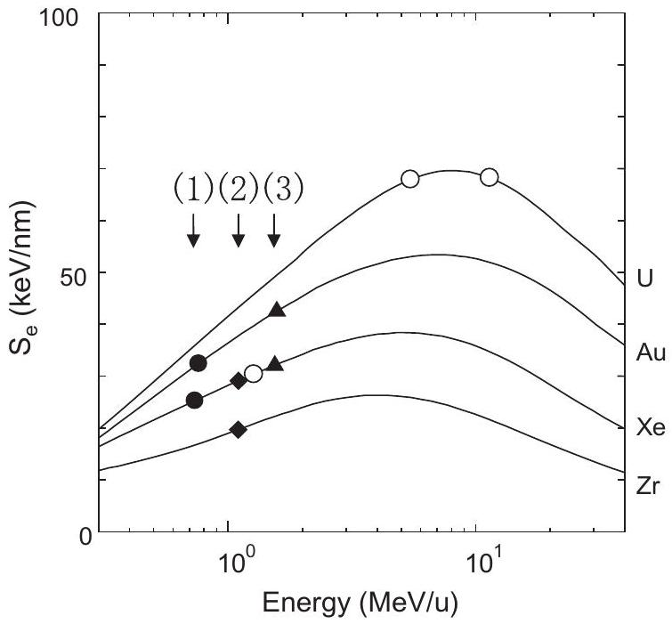
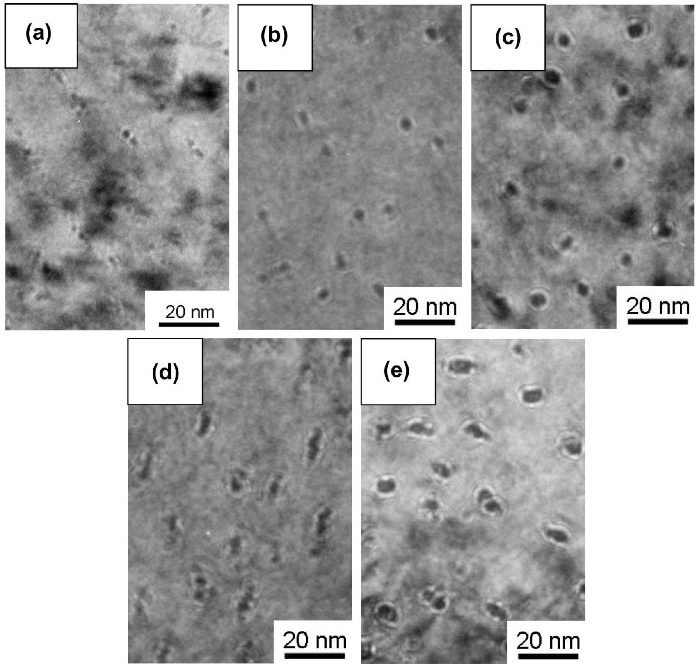
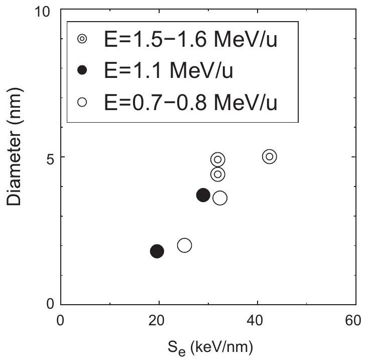
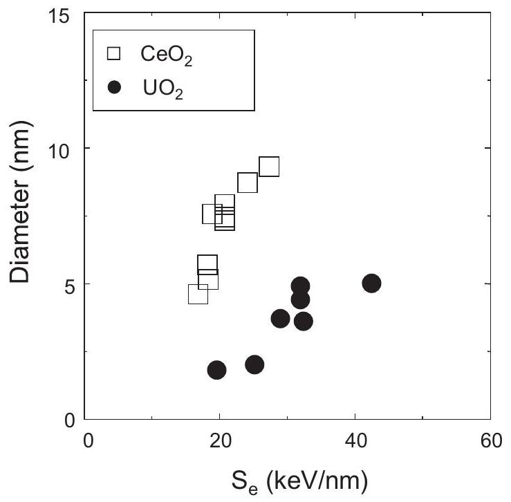
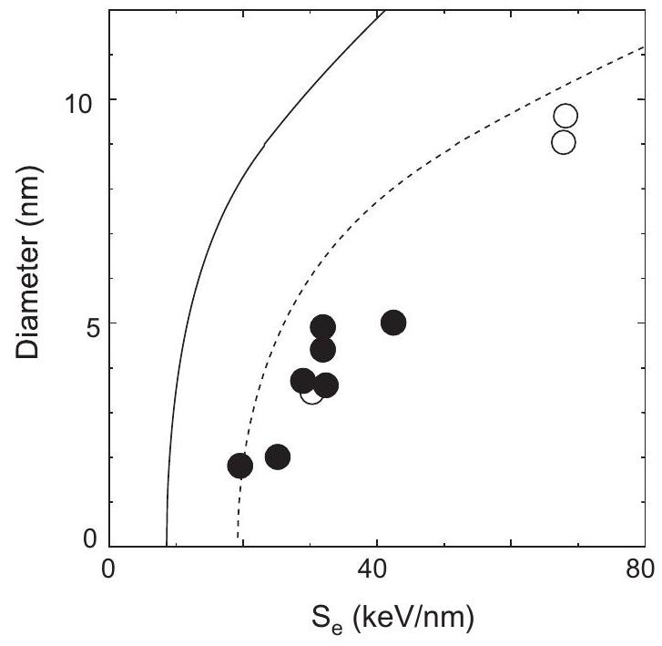

# Electronic stopping power dependence of ion-track size in $\mathrm{UO}_{2}$ irradiated with heavy ions in the energy range of $\sim 1 \mathrm{MeV} / \mathrm{u}$ 

N. Ishikawa ${ }^{\mathrm{a}, *}$, T. Sonoda ${ }^{\mathrm{b}}$, T. Sawabe ${ }^{\mathrm{b}}$, H. Sugai ${ }^{\mathrm{a}}$, M. Sataka ${ }^{\mathrm{c}}$ ${ }^{\mathrm{a}}$ Nuclear Science and Engineering Directorate, Japan Atomic Energy Agency (JAEA), Tokai-mura, Ibaraki 319-1195, Japan ${ }^{\mathrm{b}}$ Central Research Institute of Electric Power Industry (CRIEPI), 2-11-1, Iwado-kita, Komae-shi, Tokyo 201-8511, Japan ${ }^{\mathrm{c}}$ Nuclear Science Research Institute, Japan Atomic Energy Agency (JAEA), Tokai-mura, Ibaraki 319-1195, Japan

## ARTICLE INFO

## Article history:

Received 30 November 2012
Received in revised form 19 March 2013
Accepted 17 May 2013
Available online 18 June 2013

## Keywords:

Irradiation effect
Ion-tracks
$\mathrm{UO}_{2}$
Transmission electron microscopy

#### Abstract

In order to investigate electronic stopping power dependence of ion-track size in $\mathrm{UO}_{2}$, ion-tracks in $\mathrm{UO}_{2}$ irradiated with various ions with the specific energy in the order of $1 \mathrm{MeV} / \mathrm{u}$ have been observed by a transmission electron microscope. The ion-track size shows monotonic increase as a function of the electronic stopping power. The ion-track size obtained for $\mathrm{UO}_{2}$ is smaller than that obtained for $\mathrm{CeO}_{2}$, although these two compounds have same crystallographic structure and similar thermal properties. The ion-track sizes for irradiations with ions having relatively low energy of about $1 \mathrm{MeV} / \mathrm{u}$ are smaller than those expected from the thermal spike models based on melting temperature criterion. The possible interpretations for the unusually small ion-tracks observed for $\mathrm{UO}_{2}$ are discussed.

© 2013 Elsevier B.V. All rights reserved.

## 1. Introduction

Uranium dioxide ( $\mathrm{UO}_{2}$ ) fuels in light water reactors are subjected to various high-energy particles. Not only neutrons but also high-energy fission fragments play an important role in radiation damage process of nuclear fuels. Since fission fragments have high kinetic energy of about $70-100 \mathrm{MeV}$, they can create prominent radiation damages in $\mathrm{UO}_{2}$ oxide fuels. For investigating damage mechanism of ion-irradiated oxides, accelerated ion beams having well-defined energy and ion-fluence can be powerful tools to simulate radiation damage behavior.

One of the intriguing characteristics of the radiation damages due to high-energy ion irradiation in $\mathrm{UO}_{2}$ is the formation of continuous ion tracks along the ion-paths [ $1-3$ ]. If the density of energy deposited to electron system of the target is sufficiently high, such that it exceeds a certain energy threshold, then an ion-track can be created by each traversing ion. Mechanism of radiation damage behavior of $\mathrm{UO}_{2}$ subjected to high-energy fission fragments should be understood on the basis of ion-track formation process. The present study aims at analyzing the dependence of size of the ion tracks in ion-irradiated $\mathrm{UO}_{2}$ on the electronic stopping power ( $S_{\mathrm{e}}$ ).

[^0]Some data of ion-track size in ion-irradiated $\mathrm{UO}_{2}$ have already been reported by Wiss et al. [1]. In Ref. [1], ion-track radii of 1.7, 4.8 and 4.4 nm were reported for irradiations with 173 MeV Xe , 1300 MeV U and 2713 MeV U ions, respectively. In the paper, the data have been analyzed in the framework of inelastic thermal spike model (ITSM or so-called two-temperature model) [1,4].

There are several models proposed to account for ion-track formation, such as the inelastic thermal spike model (ITSM) [4,5], the analytical thermal spike model (ATSM) [6,7], the Coulomb explosion model [8,9], the exciton self-trapping model [10,11]. Although each model has its own rationale, only the ITSM and the ATSM predict ion-track radii. A comparison between experimentally determined ion-track radii in UO2 and predictions by the ATSM can be found in Refs. [3,6]. The ion-track data for 1300 MeV U and 2713 MeV U were in "good agreement" with the ATSM. However, the data for 173 MeV Xe was not included in the analysis because the sample had been annealed at $900^{\circ} \mathrm{C}$ prior to ion-track radii determination [6]. And the author (Szenes) further claimed that "Our opinion is that the experiments with Xe and I beams are not suitable for establishing reliably $S_{\mathrm{et}}$ because of the non-standard sample conditions." Because of this reason, the author asserted that the data for 173 MeV Xe ion is not reliable.

Our standpoint is that it is important to obtain reliable ion-track data using specimens without post-annealing in the course of sample preparation. Because the reliable data are absent in the low energy range at this moment, it is important to obtain ion-track size data in the low energy range of $0.7 \leqslant E \leqslant 1.6 \mathrm{MeV} / \mathrm{u}$. In other words, the reproducibility of data in Ref. [1] in the low specific
energy region should be tested. Since not only $S_{\mathrm{e}}$ but also the ion velocity ( $v$ ) is in general an important factor which determines the ion-track formation [5], the ion-velocity should be taken into consideration. Therefore, present data are analyzed in terms of the specific energy ( $\propto v^{2}$ ) of ions, as well.

In our previous report [3], the ion-track size data for $S_{\mathrm{e}}$ value of $32.0 \mathrm{keV} / \mathrm{nm}$ ( 210 MeV Xe ion) has been reported. In this study, we have extended the $S_{\mathrm{e}}$ region to $42.5 \mathrm{keV} / \mathrm{nm}(310 \mathrm{MeV} \mathrm{Au})$, while the specific energy is kept in the low energy range of $0.7 \leqslant E \leqslant 1.6 \mathrm{MeV} / \mathrm{u}$.

## 2. Experimental procedure

The disc of $\mathrm{UO}_{2}$ (diameter: 3 mm , thickness: $0.2-0.4 \mathrm{~mm}$ ) were prepared from $\mathrm{UO}_{2}$ powder which was first pressed with $2 \mathrm{t} / \mathrm{cm}^{2}$ pressure to form pellet shape, and were subsequently sintered at $1740^{\circ} \mathrm{C}$ for 3 h in the mixed gas of $40 \% \mathrm{H}_{2}+\mathrm{N}_{2}$. The disc was prepared by Nippon Nuclear Fuel Development Co. Ltd. After sintering of the disc sample, the surfaces of samples were polished to mirror finish. The density of the samples was confirmed to be around $97 \%$ of the theoretical density. TEM samples of this sintered $\mathrm{UO}_{2}$ for ion irradiations were picked up and thinned by focused ion beam (FIB) method using Hitachi FB-2000A at CRIEPI.

The thin specimens were then irradiated with $100 \mathrm{MeV} \mathrm{Xe}^{+25}$, $150 \mathrm{MeV} \mathrm{Xe}^{+27}, 210 \mathrm{MeV} \mathrm{Xe}^{+29}, 150 \mathrm{MeV} \mathrm{Au}^{+27}$, and. 310 MeV $\mathrm{Au}^{+27}$. The data for $100 \mathrm{MeV} \mathrm{Zr}^{10+}$ and $210 \mathrm{MeV} \mathrm{Xe}^{14+}$ obtained by our group [3] are added, when necessary, in the course of the present analysis. The ions were accelerated by the tandem accelerator at JAEA-Tokai. The observation of ion-tracks were performed by 300 kV field emission transmission electron microscope (FETEM); Hitachi HF-3000 at CRIEPI.

The electronic stopping power and the projected range were estimated using SRIM-2008 [12,13]. The values of $S_{\mathrm{e}}$ for ion irradiations appeared in previous literatures were recalculated using SRIM-2008 for consistency of the analysis. The estimated $S_{\mathrm{e}}$ values for ions used in the present study are plotted as a function of the specific energy in Fig. 1. The ions can be classified into three groups as indicated by three arrows in the figure; (1) $E=0.7-0.8 \mathrm{MeV} / \mathrm{u}$ (2) $E=1.1 \mathrm{MeV} / \mathrm{u}$ (3) $E=1.5-1.6 \mathrm{MeV} / \mathrm{u}$.

Fig. 1. Electronic stopping power, $S_{\mathrm{e}}$, as a function of the specific energy in ionirradiated $\mathrm{UO}_{2}$. Closed symbols represent $S_{\mathrm{e}}$ for the ions used in the present study and our previous study [3]. Open circles represent $S_{e}$ for the ions used in the study of Ref. [1]. Three groups of the specific energies are indicated. (See text).

## 3. Results and discussion

## 3.1. $S_{e}$-dependence of ion-track size in $U_{2}$

Fig. 2(a-e) show the bright field images of ion-irradiated $\mathrm{UO}_{2}$ observed by TEM. The ion-tracks can be imaged with off-focus condition, while they cannot be imaged clearly by bright field image mode with focused condition. The individual ion-tracks are observed as black (or white) circular images each surrounded with a white (or black) ring. The image of ion-tracks becoming black or white depends on whether the observation condition is overfocus or under-focus. Since the ring is considered to be due to a Fresnel fringe, the size of the black circular core is taken as a measure of the ion-track size. It should be noted here that the shortest diameter is measured in case image of an ion-track is not circular and the irradiation direction is suspected to be somehow different from the observation direction. The $S_{\mathrm{e}}$-dependence of ion-track size is plotted in Fig. 3. The present data (including the data obtained by our previous study [3]) are consistent with the data for 173 MeV Xe irradiation reported in Ref. [1]. This indicates the data for 173 MeV irradiation is reliable, although the specimen was annealed at $900^{\circ} \mathrm{C}$ after the irradiation. It is clear from the figure that the ion-track size increases monotonically as a function of $S_{\mathrm{e}}$. In order to take the effect of ion-velocity (the velocity effect) [5] into consideration, it is better to compare data for different $S_{\mathrm{e}}$ while fixing the ion-velocity (or the specific energy). For all the data sets for constant specific energy, we again find the ion-track size monotonically increases as increasing $S_{\mathrm{e}}$. It seems that specific energy (or ion-velocity) hardly influences the ion-track size for ion-irradiated $\mathrm{UO}_{2}$, or the influence is very small, if any, in this energy range.

### 3.2. Comparison with ion-track size in $\mathrm{CeO}_{2}$

$\mathrm{UO}_{2}$ has a same crystallographic structure (fluorite structure) as $\mathrm{CeO}_{2}$. Moreover, the thermal properties, that are considered to give influence on ion-track formation according to the thermal spike model, are similar to those of $\mathrm{CeO}_{2}$. For example, melting temperature of $\mathrm{UO}_{2}$ is 3120 K [14], while that of $\mathrm{CeO}_{2}$ is 2873 K [15]. The specific heat for $\mathrm{UO}_{2}$ is 0.26 and $0.31 \mathrm{~J} / \mathrm{Kg}$ at 360 and 900 K , respectively [16], while for $\mathrm{CeO}_{2} 0.38$ and $0.45 \mathrm{~J} / \mathrm{Kg}$ at 340 and 860 K , respectively [17]. According to the ATSM proposed by Szenes [6], the threshold $S_{\mathrm{e}}$ values for ion-track formation predicted for $\mathrm{UO}_{2}$ and $\mathrm{CeO}_{2}$ are 8.6 and $8.2 \mathrm{keV} / \mathrm{nm}$, respectively. This prediction demonstrates that the similar thermal properties of $\mathrm{UO}_{2}$ and $\mathrm{CeO}_{2}$ give similar prediction results according to ATSM. However, as shown in Fig. 4 the observed ion-track size for $\mathrm{UO}_{2}$ is evidently smaller than that for $\mathrm{CeO}_{2}$. It is possible to argue that recrystallization during cooling down of the melted region may be contributing to shrinkage of ion-tracks. If so, recrystallization behavior of $\mathrm{UO}_{2}$ should be different from that of $\mathrm{CeO}_{2}$. At this moment, there is no direct evidence to prove the different recrystallization behavior between these two materials. Nevertheless, it should be mentioned here that, according to the previous literature [19], thermal recovery of alpha-irradiation damage (lattice parameter change) in $\mathrm{UO}_{2}$ is more pronounced than that in $\mathrm{CeO}_{2}$. This indicates that the radiation damage in $\mathrm{UO}_{2}$ is relatively unstable, suggesting that recrystallization of $\mathrm{UO}_{2}$ may be easier than that of $\mathrm{CeO}_{2}$.

Another interpretation for small ion-tracks in $\mathrm{UO}_{2}$ has been proposed in Ref. [20] based on ITSM, in which the boiling criterion rather than melting criterion is proposed in order to account for relatively small ion-track size observed for non-amorphizable materials, such as CaF and $\mathrm{UO}_{2}$. According to the paper, this interpretation qualitatively explains the small ion-track, since the core region where the local temperature exceeds boiling temperature is smaller than the region where the local temperature exceeds

Fig. 2. Bright field images of ion-tracks in $\mathrm{UO}_{2}$ irradiated with (a) $100 \mathrm{MeV} \mathrm{Xe}^{25+}$, (b) $150 \mathrm{MeV} \mathrm{Xe}^{27+}$, (c) $210 \mathrm{MeV} \mathrm{Xe}^{29+}$, (d) $150 \mathrm{MeV} \mathrm{Au}{ }^{27+}$, and (e) $310 \mathrm{MeV} \mathrm{Au}{ }^{27+}$.

melting temperature. In the literature, the experimental data of ion-track size for ion-irradiated $\mathrm{UO}_{2}$ are compared with the prediction curves based on ITSM (the curve based on the melting criterion and that based on the boiling criterion). The experimental data for $\mathrm{UO}_{2}$ were smaller than the theoretical curve predicted by melting criterion, while they were larger than that predicted by boiling criterion. This means that the small ion-tracks for ionirradiated $\mathrm{UO}_{2}$ can be qualitatively explained by adopting a boiling criterion, but such prediction does not give quantitative agreement with the ion-track size data. This disagreement remains to be unsolved even after taking consideration of the present data. Furthermore, the interpretation based on ITSM does not give clear insight of the discrepancy between ion-track size of $\mathrm{CeO}_{2}$ and that of $\mathrm{UO}_{2}$.

One might argue that the unusually small ion-tracks for $\mathrm{UO}_{2}$ may be due to the limitation of TEM observation. Since the iontracks are imaged by off-focused condition for $\mathrm{UO}_{2}$, the TEM image does not necessarily represents the exact size of the ion-track. In general smaller ion-track tends to give larger error in the observed ion-track size in such condition. However, since the ion-track size obtained in the present study is relatively large, it seems reasonable that the observed image represents nearly the same size of the modified region (ion-track). Again, it should be reminded that
the ion-track size for $\mathrm{UO}_{2}$ is smaller than that for $\mathrm{CeO}_{2}$, although both ion-tracks are observed by means of same TEM technique.

### 3.3. Comparison with the prediction based on ATSM

ATSM proposed by Szenes [6,7] has assumed the melting criterion, at least up to the present. The following equations are proposed according to ATSM.

$$
R_{\mathrm{e}}=a^{2}(0) \ln \left(S_{\mathrm{e}} / S_{\mathrm{et}}\right) \quad \text { for } \quad S_{e}<2.7 S_{\mathrm{et}}
$$

$$
R_{\mathrm{e}}=\frac{a^{2}(0) S_{\mathrm{e}}}{2.7 S_{\mathrm{et}}} \quad \text { for } \quad S_{\mathrm{e}}>2.7 S_{\mathrm{et}}
$$

$$
S_{\mathrm{et}}=\frac{\pi \rho c T_{\mathrm{o}} a^{2}(0)}{g}
$$

where $R_{\mathrm{e}}$ is the effective radius of ion-tracks, $S_{\mathrm{e}}$ the electronic stopping power, $S_{\mathrm{et}}$ the threshold value of $S_{\mathrm{e}}$ for track formation, and $a(0)$ the initial Gaussian width. In Eq. (3), $\rho$ and $c$ are the density and the average specific heat for the temperature range of the spike, respectively, and $T_{\mathrm{o}}=T_{\mathrm{m}}-T_{\mathrm{ir}}$ where $T_{\mathrm{m}}$ and $T_{\mathrm{ir}}$ are the melting point and the irradiation temperature, respectively. The parameter $g$ is

Fig. 3. $\mathrm{S}_{\mathrm{e}}$-dependence of the diameter of ion-tracks in ion-irradiated $\mathrm{UO}_{2}$. The values of specific energy of the ions are indicated in the figure. Part of the data ( $100 \mathrm{MeV} \mathrm{Zr}^{10+}$ and $210 \mathrm{MeV} \mathrm{Xe}^{14+}$ ) for $\mathrm{UO}_{2}$ are quoted from our previous paper [3].

Fig. 4. $S_{\mathrm{e}}$-dependence of the diameter of ion-tracks in ion-irradiated $\mathrm{UO}_{2}$ and $\mathrm{CeO}_{2}$. All the data for $\mathrm{CeO}_{2}$ are quoted from our previous paper [18]. Part of the data for $\mathrm{UO}_{2}\left(100 \mathrm{MeV} \mathrm{Zr}^{10+}\right.$ and $\left.210 \mathrm{MeV} \mathrm{Xe}^{14^{+}}\right)$are quoted from our previous paper [3].

the efficiency which may depend on the specific ion energy. Szenes assumes that the origin of the velocity effect [5] is the change of the thermal energy $\varepsilon=g S_{\mathrm{e}}$ depending on the specific ion energy. For example, according the prediction in the framework of ATSM [7] relatively high g value $(\mathrm{g}=0.4)$ is used for low specific ion energy regime ( $E<2 \mathrm{MeV} / \mathrm{u}$ ) and low $g$ value ( $g=0.17$ ) is used for high specific ion energy regime ( $E>8 \mathrm{MeV} / \mathrm{u}$ ). In Fig. 5, the prediction of ATSM and the ion-track data are compared for $\mathrm{UO}_{2}$. The prediction is done using material parameters ( $\rho, c$ and $T_{\mathrm{m}}$ for $\mathrm{UO}_{2}$ ) presented in Ref. [6]. The energy region of ions used in this study is in the low specific energy region. However, the figure shows that the present data are smaller than the prediction curve for low specific energy.

It should be mentioned here that discrepancy between experimental data and the prediction is relatively large for low specific ion energy regime ( $E<2.2 \mathrm{MeV} / \mathrm{u}$ ), while the discrepancy is rather small for high specific ion energy regime ( $E>8 \mathrm{MeV}$ /nucleon). The

Fig. 5. Comparison of the obtained ion-track size as a function of $S_{\mathrm{e}}$ with the prediction curve based on ATSM[6] in ion-irradiated $\mathrm{UO}_{2}$. The solid curve and the dotted curve are the curves predicted for low specific ion energy ( $0.6<E<2.3 \mathrm{MeV} /$ u) and for high specific ion energy ( $7.6<E<20 \mathrm{MeV} / \mathrm{u}$ ), respectively. Data from Ref.[1] (open circles) are also plotted in the same figure.

reason for this different behavior is unclear, and it should be clarified by further investigation.

### 3.4. Structure inside the nonamorphizable ion-tracks

It has not been directly confirmed for $\mathrm{UO}_{2}$ whether the structure inside the individual ion-track is amorphous or not. However, it should be pointed out that halo in the diffraction spots, indicating that the amorphous phase, is not observed in $\mathrm{UO}_{2}$ irradiated heavily with 210 MeV Xe up to the order of $10^{16}$ ions $/ \mathrm{cm}^{2}$.

When interpreting the experimental data of ion-tracks, distinction between amorphized ion-tracks and non-amorphized iontracks may be an important factor to be taken into account [20]. What makes the difference between amorphized ion-tracks and non-amorphized ion-tracks? Techniques to observe ion-tracks in focused condition using TEM have been applied in Ref. [21] for non-amorphizable $\mathrm{MgAl}_{2} \mathrm{O}_{4}$, and radial distribution of damaged structure of an ion-track is proposed based on the observation using various TEM techniques. Their study shows that, unlike the amorphized ion-track, the ion-track in non-amorphizable material has a complicated structure which can be regarded as a core damaged region and peripheral disordered region surrounding the core. In this sense, for non-amorphized ion-tracks it is important to clarify a radial damage distribution in order to elucidate the thermal history after the passage of the ion. If the core region of the iontrack once experiences melting and recrystallization, the influenced region may have left some trace of melting. If a passage of an ion results in melting of a material, a newly traversing ion can give an influence on the already created ion-tracks by overlapping of the influenced region. The precise observation of overlapped structure may give a clue to elucidate the thermal history. Many unclear problems are still left behind for non-amorphizable iontracks. $\mathrm{UO}_{2}$, as one of the non-amorphizable materials, should be further studied to solve the problems.

## 4. Summary

The electronic stopping power dependence of ion-track size has been investigated for ion-irradiated $\mathrm{UO}_{2}$ in the specific energy
region of the order of $1 \mathrm{MeV} / \mathrm{u}$. The ion-track size shows monotonic increase as a function of the electronic stopping power. The iontrack size obtained for $\mathrm{UO}_{2}$ is smaller than that obtained for $\mathrm{CeO}_{2}$, although these two compounds have same crystallographic structure and similar thermal properties.

## Acknowledgements

The authors are grateful to the technical staff of the accelerator facilities at JAEA-Tokai for their great help. Part of the present work was financially supported by KAKENHI (21360474).

## References

[1] T. Wiss, Hj. Matzke, C. Trautmann, M. Toulemonde, S. Klaumünzer, Nucl. Instr. Meth. B 122 (1997) 583.
[2] Hj. Matzke, P.G. Lucuta, T. Wiss, Nucl. Instr. Meth. B 166-167 (2000) 920.
[3] T. Sonoda, M. Kinoshita, N. Ishikawa, M. Sataka, A. Iwase, K. Yasunaga, Nucl. Instr. Meth. B 268 (2010) 3277.
[4] M. Toulemonde, W. Assmann, C. Dufour, A. Meftah, F. Studer, C. Trautmann, Matematisk-fysiske Meddelelser 52 (2006) 263.
[5] A. Meftah, F. Brisard, J.M. Costantini, M. Hage-Ali, J.P. Stoquert, F. Studer, M. Toulemonde, Phys. Rev. B 48 (1993) 920.
[6] G. Szenes, J. Nucl. Mater. 336 (2005) 81.
[7] G. Szenes, Nucl. Instr. Meth. B 269 (2011) 174.
[8] R.L. Fleischer, P.B. Price, R.M. Walker, E.L. Hubbard, Phys. Rev. 156 (1967) 353.
[9] P.K. Haff, Appl. Phys. Lett. 29 (1976) 473.
[10] K.S. Song, R.T. Williams, Self Trapped Excitons, Springer, Berlin, 1993.
[11] N. Itoh, A.M. Stoneham, Materials Modification by Electronic Excitation, Cambridge University Press, Cambridge, 2001.
[12] J.F. Ziegler, J.P. Biersack, U. Littmark, The Stopping and Range of Ions in Solids, Pergamon, New York, 1985.
[13] J.F. Ziegler, Nucl. Instr. Meth. B 219-220 (2004) 1027.
[14] F.S. Galasso, Structure and Properties of Inorganic Solids, Pergamon, New York, 1970.
[15] H. Kleykamp, J. Nucl. Mater. 275 (1999) 1.
[16] R.A. Verrall, P.G. Lucuta, J. Nucl. Mater. 228 (1996) 251.
[17] M. Ricken, J. Nölting, I. Riess, J. Solid State Chem. 54 (1984) 89.
[18] T. Sonoda, M. Kinoshita, Y. Chimi, N. Ishikawa, M. Sataka, A. Iwase, Nucl. Instr. Meth. B 250 (2006) 254.
[19] W.J. Weber, Radiat. Eff. 83 (1984) 145.
[20] M. Toulemonde, A. Benyagoub, C. Trautmann, N. Khalfaoui, M. Boccanfuso, C. Dufour, F. Gourbilleau, J.J. Grob, J.P. Stoquert, J.M. Costantini, F. Haas, E. Jacquet, K.-O. Voss, A. Meftah, Phys. Rev. B 85 (2012) 054112.
[21] K. Yasuda, T. Yamamoto, M. Etoh, S. Kawasoe, S. Matsumura, N. Ishikawa, Int. J. Mater. Res. 102 (2011) 1082.

[^0]:    * Corresponding author. Address: Nuclear Science and Engineering Directorate, Japan Atomic Energy Agency, Tokai-mura, Ibaraki-ken 319-1195, Japan. Tel.: +81 29 282 5472; fax: +81 292826716.

    E-mail address: ishikawa.norito@jaea.go.jp (N. Ishikawa).

