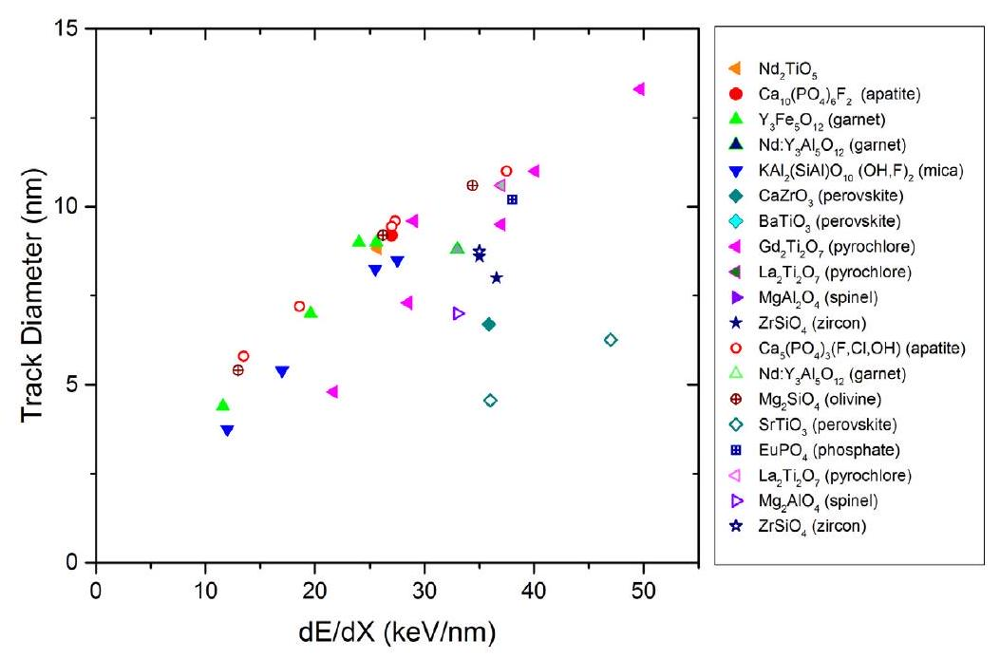
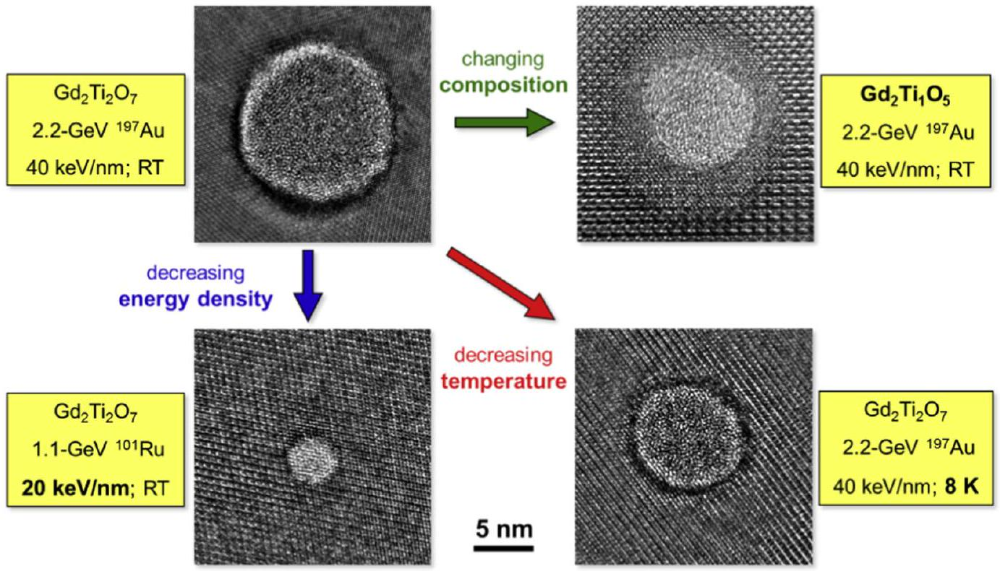
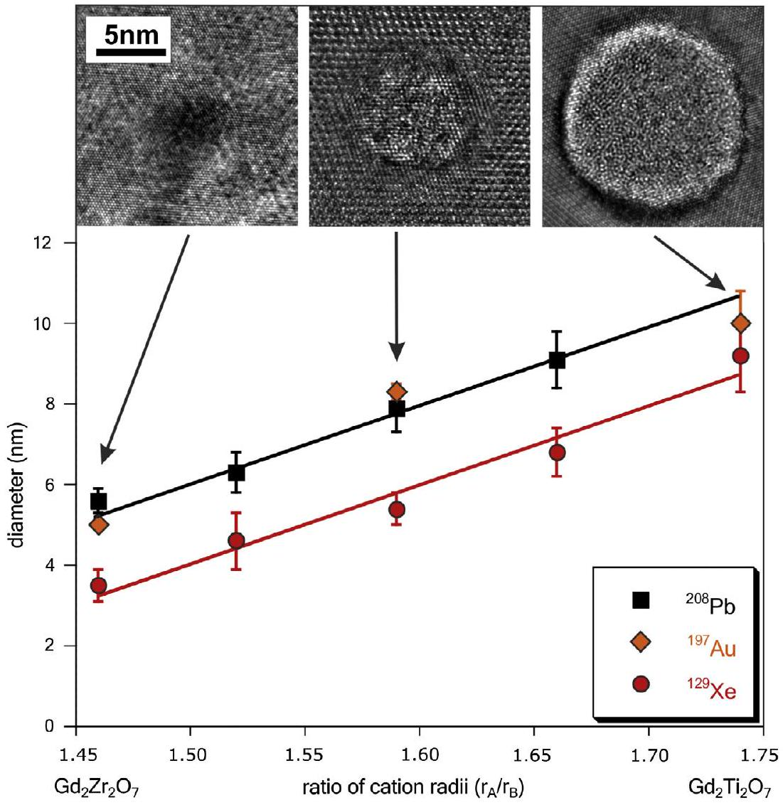
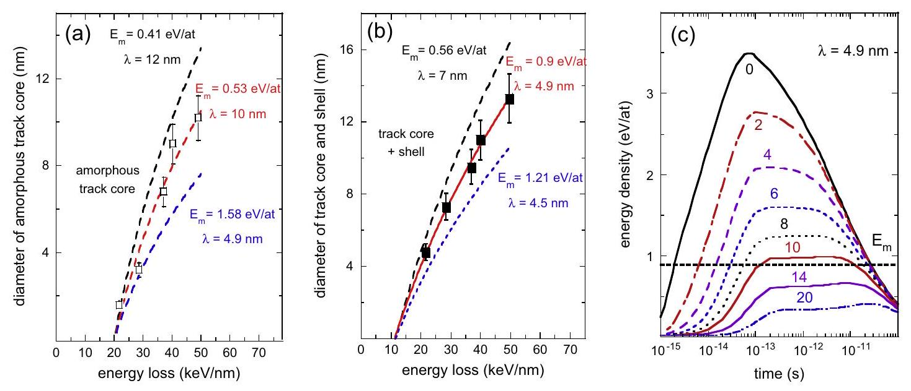
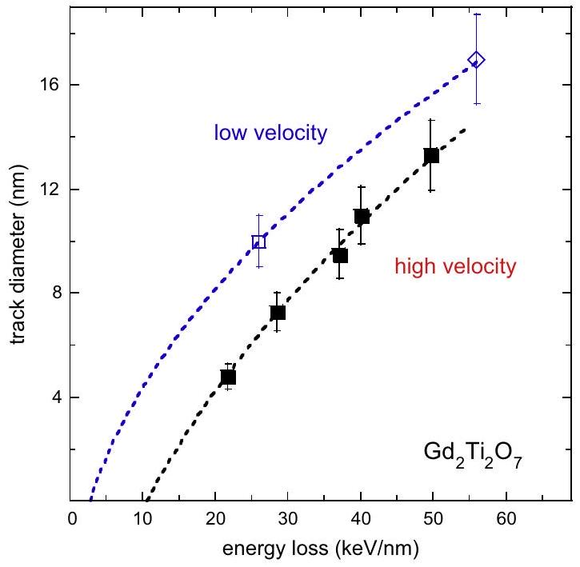
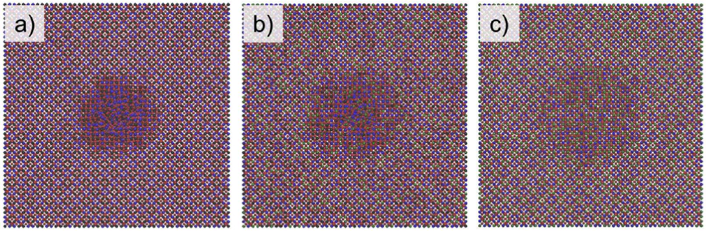
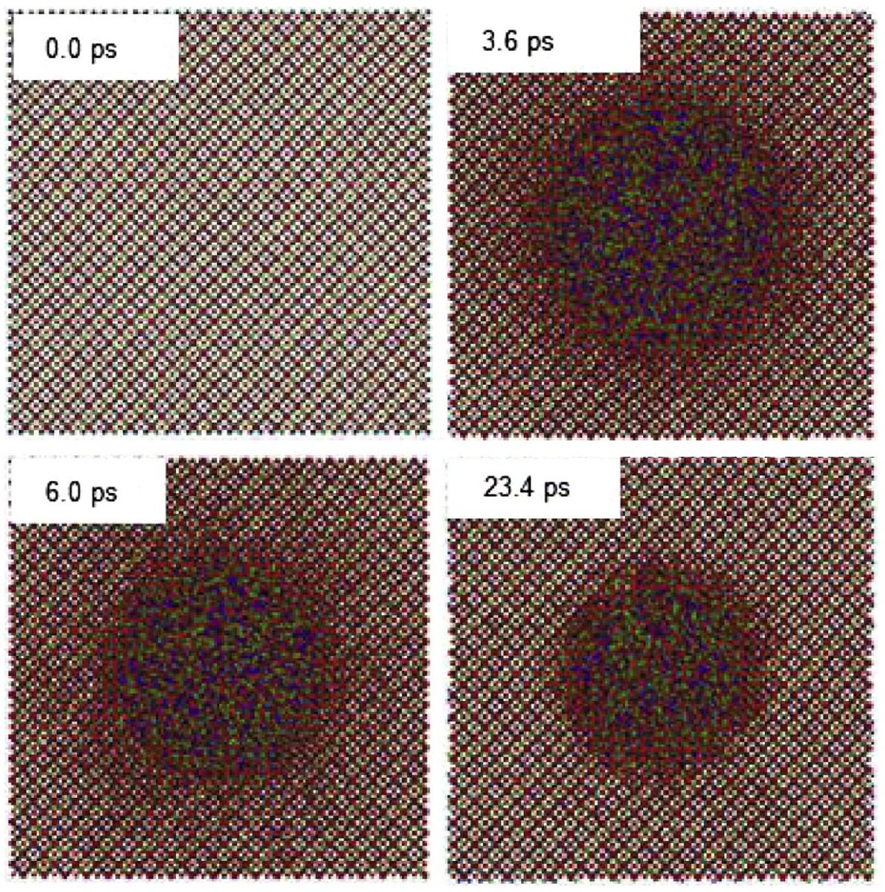

# Advances in understanding of swift heavy-ion tracks in complex ceramics 

Maik Lang ${ }^{\text {a }}$, Ram Devanathan ${ }^{\text {b }}$, Marcel Toulemonde ${ }^{\text {c }}$, Christina Trautmann ${ }^{\text {d }, \text { e,* }}$ ${ }^{\text {a }}$ Department of Nuclear Engineering, University of Tennessee, Knoxville, TN 37996, USA ${ }^{\mathrm{b}}$ Nuclear Sciences Division, Pacific Northwest National Laboratory, Richland, WA 99352, USA ${ }^{\mathrm{c}}$ Centre de Recherche sur les Ions, les Matériaux et la Photonique, CIMAP-GANIL, CEA-CNRS-ENSICAEN-Univ. Caen, Bd., H. Becquerel, 14070 Caen, France ${ }^{\mathrm{d}}$ GSI Helmholtzzentrum für Schwerionenforschung, Planckstr. 1, 64291 Darmstadt, Germany ${ }^{\mathrm{e}}$ Technische Universität Darmstadt, Petersenstraße 23, 64287 Darmstadt, Germany

## ARTICLE INFO

## Article history:

Received 21 August 2014
Revised 3 October 2014
Accepted 12 October 2014
Available online 3 December 2014

## Keywords:

Swift heavy Ions
Pyrochlores
Tracks
Thermal spike
MD simulation

#### Abstract

Tracks produced by swift heavy ions in ceramics are of interest for fundamental science as well as for applications covering different fields such as nanotechnology or fission-track dating of minerals. In the case of pyrochlores with general formula $\mathrm{A}_{2} \mathrm{~B}_{2} \mathrm{O}_{7}$, the track structure and radiation sensitivity show a clear dependence on the composition. Ion irradiated $\mathrm{Gd}_{2} \mathrm{Zr}_{2} \mathrm{O}_{7}$, e.g., retains its crystallinity while amorphous tracks are produced in $\mathrm{Gd}_{2} \mathrm{Ti}_{2} \mathrm{O}_{7}$. Tracks in Ti-containing compositions have a complex morphology consisting of an amorphous core surrounded by a shell of a disordered, defect-fluorite phase. The size of the amorphous core decreases with decreasing energy loss and with increasing Zr content, while the shell thickness seems to be similar over a wide range of energy loss values. The large data set and the complex track structure has made pyrochlore an interesting model system for a general theoretical description of track formation including thermal spike calculations (providing the spatial and temporal evolution of temperature around the ion trajectory) and molecular dynamics (MD) simulations (describing the response of the atomic system). Recent MD advances consider the sudden temperature increase by inserting data from the thermal spike. The combination allows the reproduction of the core-shell track characteristic and sheds light on the early stages of track formation including recrystallization of the molten material produced by the thermal spike.

© 2014 Elsevier Ltd. All rights reserved.

## Introduction

In nature, nanometer-sized particle tracks of many micrometers in length are formed over millions of years when radioactive elements decay by fission processes, producing energetic fragments of sufficiently high mass ( $\sim 100 \mathrm{u}$ ) and energy ( $\sim 100 \mathrm{MeV}$ ) that slowdown in their host minerals. In the laboratory, large accelerator facilities for swift heavy ions provide the most suitable conditions for producing particle tracks under controlled irradiation conditions using adjustable ion energies ( MeV to GeV ) and beams of all elements up to uranium. Swift heavy ions are typically defined as high-mass particles of kinetic energy above about 1 MeV per nucleon ( $\mathrm{MeV} / \mathrm{u}$ ). In this regime, the energy deposition of the ions is dominated by electronic stopping, and each individual ion may induce a linear trail of damage with a width of a few nanometers and a length of several tens of micrometers or more.

[^0]During the last decade, radiation effects induced by swift heavy ions have been studied in a wide range of materials for basic research, as well as for very different applications. The interest in ion tracks has also been boosted by the rapidly increasing activities in nanoscience, in particular for the fabrication of tailored nanopores and nanowires [1-4].

Although track formation has been the subject of research for many years, our current understanding of the complex mechanisms involved is far from being complete. The process is quite different from damage creation induced by low energy ions (keV-MeV), where atoms are directly displaced from their lattice sites via elastic collisions. At high energies, the projectiles transfer their energy to the electrons of the target, inducing ionization and initiating a cascade of secondary electrons that quickly spreads radially. Within a time of less than a picosecond, the energy is gradually transferred into atomic motion, thereby modifying the atomic structure of the solid. About half of the ion energy is deposited within a few nm around the ion path [5], providing in extreme cases sufficient energy to break all atomic bonds in this region. The
energy deposition per unit path length, electronic energy loss $\mathrm{d} E / \mathrm{d} x$, increases with the charge of the ions and can reach values as large as some tens of $\mathrm{keV} / \mathrm{nm}$ [6]. The formation of tracks typically is material dependent and appears above a critical value of electronic energy loss. This threshold is directly correlated with the radiation hardness of a given solid, being high for metals and low for insulators. In many materials, predominantly in insulators but also in a few selected semiconductors and metals, tracks consist of extended amorphous cylinders embedded in the crystalline matrix, with the interface between the amorphous zone and intact surroundings being rather sharp. There also exist many other ioninduced structural modifications including amorphous tracks in an amorphous matrix [7,8], tracks consisting of a different crystalline phase than the initial non-irradiated crystal [9,10], and tracks of a more complex core-shell structure as discussed below.

With respect to the track-formation process of swift heavy ions, the main unsolved question concerns the spread of the iondeposited energy as a function of space and time and its conversion into atomic motion. Besides several other descriptions [11-15], the most widespread theoretical approach is the inelastic thermal spike model, in which track formation is linked to localized lattice heating [16-18]. The diffusion of the deposited ion energy is followed in space and time by separate classical heat transport equations for the electrons and atoms that are coupled by an electron-phonon coupling term. Estimations of the temperature reached along the ion path depend on details of this coupling and can vary quite noticeably from some tens up to several thousands of degrees. A crucial point is the radial spread of the electron cascade dissipating part of the deposited energy into a larger volume and thus not contributing to local lattice heating. The target volume to which the energy is initially deposited is dependent on the energy transfer in the ion-electron collision process. At a given energy loss, high-velocity ions spread their energy into a larger volume which leads to a lower energy density (denoted as "velocity effect") [19]. New approaches nowadays combine ther-mal-spike calculations with molecular dynamics (MD) simulations by introducing space and time dependent temperature profiles to the atoms and following up their motion. This approach provides important information about the atomic structure, bonding, and density variations in the track and surrounding regions [20,21]. As it will be described in this review, the complex morphology of swift heavy ion tracks in pyrochlore (general formula $\mathrm{A}_{2} \mathrm{~B}_{2} \mathrm{O}_{7}$ ) provides a unique opportunity to validate theoretical descriptions and computer simulation related to the track-formation process. The first part of the review summarizes the most important experimental findings of tracks in different complex ceramics, which is followed by a more detailed description for different pyrochlore compounds. This will be the basis for thermal spike and MD model calculations yielding theoretical descriptions of the observed track effects.

In the past, swift heavy ion effects have been studied in a wide range of complex ceramics with very different applications including, e.g., the formation of pinning centers in high- $T_{\mathrm{c}}$ superconductors [22], radiation hardness tests of nuclear waste materials, or the simulation of fission-fragment tracks in apatite, $\mathrm{Ca}_{5}\left(\mathrm{PO}_{4}\right)_{3}(\mathrm{~F}, \mathrm{Cl}, \mathrm{OH})$ and zircon, $\mathrm{ZrSiO}_{4}$ [23]. The analysis of tracks from spontaneous fission of uranium in various minerals is an important dating technique used to constrain the age and thermal history of geological and archaeological samples. Although the original damage morphology and annealing mechanisms of latent tracks are poorly understood, the temperature-dependent size distribution of chemically etched tracks is the key measurement used to constrain the thermal history of Earth's crust. Several studies have recently applied an advanced experimental approach to characterize tracks at the atomic scale by means of state-of-the-art transmission electron microscopy (TEM) together
with synchrotron-based small angle X-ray scattering (SAXS) [23-30]. These detailed investigations have provided new insights into the fundamental aspects of the formation and stability of ion tracks in minerals over a range of geologically relevant conditions.

Swift heavy ion effects are less intensively investigated in complex ceramics of importance for nuclear applications. The flexible chemistry of such materials allows for the incorporation of actinides, with application as inert matrix fuels for burning actinides, burnable neutron absorber materials to increase nuclear fuel burn up, and nuclear waste forms [31-33]. To simulate the structural modifications induced by neutron irradiation or alpha-decay damage, past studies have focused primarily on interactions with $\mathrm{keV}-\mathrm{MeV}$ ions that lose their energy mainly through elastic collisions with the target atoms. However, in recent years the interest in swift-heavy ion effects in ceramics with nuclear applications has significantly increased, and the response of spinels, perovskites, garnets, pyrochlores, and related materials to GeV ions has been investigated. Also synergetic and competing effects of nuclear and electronic stopping powers were identified [34-36]. Recent research activities are also motivated by the general interest in the behavior of complex ceramics in extreme environments. The exceptionally high energy densities induced by swift heavy ions (up to tens of eV/atom), drive the local atomic structure far out of equilibrium conditions. Owing to their rich variety of phases, such unique conditions lead, in some complex oxides, to interesting structural modifications [37,38].

## Experimental observation of ion tracks in different ceramics

Track data of various research groups on a wide range of complex ceramics are compiled in Fig. 1 showing the average diameter as a function of the energy loss. In order to exclude effects due to different beam velocities, the data set is limited to irradiation experiments with ions of kinetic energy on the order of 5$10 \mathrm{MeV} / \mathrm{u}$ (see Table 1). The track diameters in Fig. 1 were obtained either by TEM or SAXS. For various amorphizable materials, both methods were demonstrated to lead to the same diameter values [27,39-41]. Moreover, TEM as well as SAXS provide direct information of the size of non-overlapping tracks, in contrast to the indirect damage cross-section measurements where the damage evolution is recorded as a function of the ion fluence, followed by data analysis assuming a single or double hit damage process [42].

It is interesting to note that the track sizes show a rather consistent trend over a wide range of energy loss (Fig. 1). The average track diameter increases gradually between 10 and $30 \mathrm{keV} / \mathrm{nm}$ followed by less pronounced increase for higher energy loss values. Taking into account the large differences in chemical composition and structure of these materials (Table 1), the track-size conformity for a given $\mathrm{d} E / \mathrm{d} x$ is remarkable. Only tracks in perovskites (general formula $\mathrm{ABO}_{3}$ ) seem to be systematically smaller than in most other materials indicating a higher radiation resistance. While the size of ion tracks is comparable in a large number of complex ceramics, high-resolution TEM reveals that the track morphology can differ significantly. In most of the compiled materials, tracks are amorphous, but there also exist crystalline tracks consisting of a different structure than the non-irradiated matrix (e.g., spinel [43]). Of special interest for track-formation studies is the complex track morphology observed for pyrochlores and compositionally related materials characterized by a track core surrounded by a shell to be discussed in more detail.

Isometric pyrochlore ( $F d \overline{3} m, Z=8, a=0.9-1.2 \mathrm{~nm}$ ), with the general formula $\mathrm{A}_{2} \mathrm{~B}_{2} \mathrm{O}_{7}$, is closely related to the fluorite structure ( $\mathrm{AX}_{2}$ ), with two cation sites and one-eighth fewer anions [52]. In the ordered pyrochlore structure, the two aliovalent cations are

Fig. 1. Compilation of ion track diameter in a wide range of complex ceramics from irradiations with heavy ions of kinetic energy between 5 and $10 \mathrm{MeV} / \mathrm{u}$. The data include measurements by TEM (filled symbols) and SAXS (open symbols). Details of target materials and irradiation conditions are given in Table 1.

Table 1
Track diameters in a wide range of complex ceramics induced with different ion beams. Material properties and ion-beam conditions were extracted from the corresponding papers listed as references. The diameters are plotted vs. $\mathrm{d} E / \mathrm{d} x$ in Fig. 1.
| Material class | Composition | Crystal system | Ion | Energy (GeV) | $\mathrm{d} E / \mathrm{d} x(\mathrm{keV} / \mathrm{nm})$ | Diameter (nm) | Ref. |
| :--- | :--- | :--- | :--- | :--- | :--- | :--- | :--- |
| Transmission electron microscopy (TEM) data |  |  |  |  |  |  |  |
| 215-comp. | $\mathrm{Nd}_{2} \mathrm{Ti}_{1} \mathrm{O}_{5}$ | Orthorhombic | Xe | 1.4 | 25.7 | 9.0 | [44] |
| Apatite | $\mathrm{Ca}_{5}\left(\mathrm{PO}_{4}\right)_{3}(\mathrm{~F}, \mathrm{C}, \mathrm{OH})$ | Hexagonal | Au | 2.2 | 27.0 | 9.2 | [27] |
| Garnet | $\mathrm{Y}_{3} \mathrm{Fe}_{5} \mathrm{O}_{12}$ | Cubic | Xe | 3.0 | 19.6 | 7.0 | [45] |
|  |  |  | Xe | 1.9 | 25.6 | 9.0 | [45] |
|  |  |  | U | 2.3 | 24.0 | 9.0 | [46] |
|  | Nd. $\mathrm{Y}_{3} \mathrm{Al}_{5} \mathrm{O}_{12}$ | Cubic | Au | 2.2 | 33.0 | 8.8 | [41] |
| Mica | $\mathrm{KAl}_{2}(\mathrm{Si}, \mathrm{Al}) \mathrm{O}_{10}(\mathrm{OH}, \mathrm{F})_{12}$ | Monoclinic | Kr | 1.0 | 12.0 | 3.8 | [47] |
|  |  |  | Xe | 1.5 | 17.0 | 5.4 | [47] |
|  |  |  | Au | 2.2 | 25.5 | 8.3 | [47] |
|  |  |  | Pb | 2.4 | 27.5 | 8.5 | [47] |
| Perovskite | $\mathrm{CaZrO}_{3}$ | Orthorhombic | Au | 0.9 | 35.9 | 6.7 | [48] |
| Pyrochlore | $\mathrm{La}_{2} \mathrm{Ti}_{2} \mathrm{O}_{7}$ | Monoclinic | Ta | 2.0 | 37.0 | 10.6 | [40] |
|  | $\mathrm{Gd}_{2} \mathrm{Ti}_{2} \mathrm{O}_{7}$ | Cubic | Xe | 0.9 | 29.0 | 9.6 | [49] |
|  |  |  | Ru | 1.1 | 21.7 | 4.8 | [50] |
|  |  |  | Xe | 1.4 | 28.5 | 7.3 | [50] |
|  |  |  | Ta | 2.0 | 37.0 | 9.5 | [50] |
|  |  |  | Au | 2.2 | 40.1 | 11.0 | [50] |
|  |  |  | U | 2.6 | 49.7 | 13.3 | [58] |
| Zircon | $\mathrm{ZrSiO}_{4}$ | Tetragonal | Au | 2.2 | 35.0 | 8.4 | [27] |
|  |  |  | Pb | 2.9 | 36.6 | 8.0 | [51] |
| Small angle X-ray scattering (SAXS) data |  |  |  |  |  |  |  |
| Apatite | $\mathrm{Ca}_{5}\left(\mathrm{PO}_{4}\right)_{3}(\mathrm{~F}, \mathrm{C}, \mathrm{OH})$ | Hexagonal | Ru | 1.1 | 13.5 | 5.8 | [25] |
|  |  |  | Xe | 1.4 | 18.6 | 7.2 | [25] |
|  |  |  | Au | 2.2 | 27.3 | 9.6 | [25] |
|  |  |  | U | 2.6 | 37.5 | 11.0 | [25] |
|  |  |  | Au | 2.2 | 27.3 | 9.4 | [27] |
| Garnet | Nd: $\mathrm{Y}_{3} \mathrm{Al}_{5} \mathrm{O}_{12}$ | Cubic | Au | 2.2 | 33.0 | 8.8 | [41] |
| Olivine | $\mathrm{Mg}_{2} \mathrm{SiO}_{4}$ | Orthorhombic | Ru | 1.1 | 13.0 | 5.4 | [29] |
|  |  |  | Au | 2.2 | 26.2 | 9.2 | [29] |
|  |  |  | U | 2.6 | 34.4 | 10.6 | [29] |
| Perovskite | $\mathrm{SrTiO}_{3}$ | Cubic | Au | 36.0 | 36.0 | 4.6 | [39] |
|  |  |  | U | 2.0 | 47.0 | 6.3 | [39] |
| Monazite | $\mathrm{EuPO}_{4}$ | Monoclinic | Au | 2.2 | 38.0 | 10.2 | * |
| Pyrochlore | $\mathrm{La}_{2} \mathrm{Ti}_{2} \mathrm{O}_{7}$ | Monoclinic | Ta | 2.0 | 37.0 | 10.6 | [40] |
| Spinel | $\mathrm{MgAl}_{2} \mathrm{O}_{4}$ | Cubic | Au | 2.2 | 33.0 | 8.8 | * |
| Zircon | $\mathrm{ZrSiO}_{4}$ | Tetragonal | Au | 2.2 | 35.0 | 8.8 | [27] |

Data labeled with an asterisk (*) refer to unpublished data from one or more authors of this paper.
ordered on the cation sublattice, and the oxygen vacancies are ordered on the anion sublattice. The radiation stability of pyrochlore depends strongly on the ratio of the radius of the A- and B-site cations of the specific chemical composition. If this ratio $r_{\mathrm{A}} / r_{\mathrm{B}}$
exceeds 1.78 , the ordered pyrochlore structure is no longer the stable phase, but a monoclinic structure will form. If the radius ratio is below 1.46, a disordered, defect-fluorite structure forms for $\mathrm{A}_{2} \mathrm{~B}_{2} \mathrm{O}_{7}$ oxides instead of ordered pyrochlore, in which the A- and B-type

Fig. 2. High-resolution planar view TEM images of individual ion tracks produced under different beam and target conditions. The damage morphology and size of the tracks depends strongly on composition, energy loss, and irradiation temperature. This figure was modified from [37].

Fig. 3. Track diameters for three different ions as function of the ratio of the ionic radii of $\mathrm{A}(\mathrm{Gd})$ and $\mathrm{B}(\mathrm{Zr}$ and $/$ or Ti$), r_{\mathrm{A}} / r_{\mathrm{B}}$, in the $\mathrm{Gd}_{2} \mathrm{Zr}_{2-x} \mathrm{Ti}_{x} \mathrm{O}_{7}$ binary system. The diameters comprise the amorphous track core and the defect-fluorite shell. The mean values were deduced from bright-field TEM measurements (errors represent sigma of 20 individual tracks) and the lines are guides to the eye. The corresponding high-resolution planar view TEM images of 2.2 GeV Au ion tracks are shown for $\mathrm{Gd}_{2} \mathrm{Zr}_{2} \mathrm{O}_{7}, \mathrm{Gd}_{2} \mathrm{TiZrO}_{7}$, and $\mathrm{Gd}_{2} \mathrm{Ti}_{2} \mathrm{O}_{7}$. With increasing Zr-content, the amount of amorphous phase and the overall track size is reduced. This figure was modified from [50].

cations are randomly distributed over the A- and B-sites, and the oxygen vacancies are disordered on the anion sublattice. Systematic research with complementary analytical techniques has focused on structural modifications that can be induced by swift
heavy ions in pyrochlore as a function of chemical composition (A-site cation [53,54] and B-site cation [49,55]), energy loss [50,56], ion velocity [49,56], ion-track length [57], and annealing effects [49]. The most striking radiation response in these materials

Table 2
Diameter of core-shell tracks in $\mathrm{Gd}_{2} \mathrm{Ti}_{2} \mathrm{O}_{7}$ for irradiations with different ion beams. The energy loss ( $\mathrm{d} E / \mathrm{d} x$ ) is calculated with the SRIM-2008 code [6]. The errors in energy loss consider the uncertainty of the layer from which the sample was prepared for TEM. All diameter values are deduced from high-resolution TEM images [50,58].
|  | ${ }^{58} \mathrm{Ni}$ | ${ }^{101} \mathrm{Ru}$ | ${ }^{129} \mathrm{Xe}$ | ${ }^{181} \mathrm{Ta}$ | ${ }^{197} \mathrm{Au}$ | ${ }^{238} \mathrm{U}$ |
| :--- | :--- | :--- | :--- | :--- | :--- | :--- |
| Energy (MeV) | 644 | 1121 | 1432 | 2009 | 2187 | 2642 |
| $\mathrm{d} E / \mathrm{d} x(\mathrm{keV} / \mathrm{nm})$ | $10.9 \pm 1.7$ | $21.7 \pm 2.0$ | $28.5 \pm 1.5$ | $37.0 \pm 1.1$ | $40.1 \pm 1.3$ | $49.7 \pm 3.9$ |
| Core (nm) | 0 | 1.6 | 3.2 | 6.8 | 8.6 | 10.2 |
| Core + shell (nm) | $\leqslant 2.0$ | 4.8 | 7.3 | 9.5 | 11.0 | 13.3 |

is the complex damage morphology of individual ion tracks: a nano-scale amorphous track core surrounded by a concentric disordered shell. High-resolution TEM revealed a significant dependence of the core-shell tracks on various experimental parameters, including the chemical composition, the ion energy loss, and the irradiation temperature (Fig. 2). Interestingly, a similar core-shell structure was also observed in the compositionally related orthorhombic $\mathrm{A}_{2} \mathrm{BO}_{5}$ oxides [37,44].

The pyrochlore solid-solution series $\mathrm{Gd}_{2} \mathrm{Zr}_{2-x} \mathrm{Ti}_{x} \mathrm{O}_{7}$ has been systematically studied since the relative amount of Ti and Zr cations at the B-site covers the entire range of stability for the pyrochlore structure [50,49]. As displayed in Fig. 3, the overall track diameter increases gradually from $\mathrm{Gd}_{2} \mathrm{Zr}_{2} \mathrm{O}_{7}$ to $\mathrm{Gd}_{2} \mathrm{Ti}_{2} \mathrm{O}_{7}$. The same linear trend with increasing Ti content was observed for different $\mathrm{d} E / \mathrm{d} x$ with an identical rate of diameter increase vs. $r_{\mathrm{A}} / r_{\mathrm{B}}$ for the different ion beams [50].

High-resolution TEM images revealed additionally that the damage morphology changes significantly with the pyrochlore composition (Fig. 3). For Ti-rich compounds (i.e., large $r_{\mathrm{A}} / r_{\mathrm{B}}$ values), the tracks are dominated by a large amorphous core; whereas Zr rich compositions (i.e., small $r_{\mathrm{A}} / r_{\mathrm{B}}$ values) show tracks consisting of an extended defect-fluorite shell [37,50,55]. This complex damage morphology provides a unique experimental benchmark to validate inelastic thermal spike calculations and MD simulations by reproducing the track size and morphology as a function of pyrochlore composition and $\mathrm{d} E / \mathrm{d} x$. For such studies, $\mathrm{Gd}_{2} \mathrm{Ti}_{2} \mathrm{O}_{7}$ is the most suitable pyrochlore composition since the pronounced core-shell boundaries allow a direct comparison with highresolution TEM results, which are summarized in Table 2 [50]. At low $\mathrm{d} E / \mathrm{d} x$, tracks in $\mathrm{Gd}_{2} \mathrm{Ti}_{2} \mathrm{O}_{7}$ are small and predominantly consist of the defect-fluorite structure; whereas at high $\mathrm{d} E / \mathrm{d} x$ they are amorphous. Continuous tracks form if the ion energy loss exceeds a critical value of $\sim 11 \mathrm{keV} / \mathrm{nm}$, and the amorphous core is detectable above $\sim 20 \mathrm{keV} / \mathrm{nm}$. Once formed, this core accounts for the size increase of tracks as a function of $\mathrm{d} E / \mathrm{d} x$, while the thickness of the defect-fluorite structured outer shell remains almost constant [50]. The existence of a disordered shell in $\mathrm{Gd}_{2} \mathrm{Ti}_{2} \mathrm{O}_{7}$ is interesting because, given the large difference in the radii of the cations, the fluorite structure is a non-equilibrium phase and thus energetically not favored. As shown below, MD simulations provide insights into the formation mechanism of the disordered, defect-fluorite shell.

## Inelastic thermal-spike calculations

Within the thermal-spike model, the dissipation of the ion energy deposited to the target is considered in two steps: (i) initially, the ions transfer their energy to the electrons of the target. By electron-electron interactions, this energy is shared among other electrons and finally transferred to the lattice by electronphonon coupling. (ii) The transferred energy is dissipated among the atoms and induces a high-temperature spike along the ion trajectory. The spike temperature may exceed the critical energy to induce a solid-liquid transformation [59] and in some cases even a liquid-vapor phase change [60]. Track formation is assumed to be the result of rapid quenching of a molten cylinder. Due to the small cylindrical volume of the thermal-spike zone (several nm in diameter), the high-temperature spike cools down within
$10^{-11} \mathrm{~s}$, leading to a cooling rate of $\sim 10^{15} \mathrm{~K} \mathrm{~s}^{-1}$. The thermal spike model considers the transient process by coupling separate heat transport equations of the electron and atomic systems [61] and monitor the temperature in space and time. The calculations are performed within cylindrical geometry with the ion trajectory being the cylinder axis [16]. Over the years, the model was refined in several steps [16,62].

$$
\begin{aligned}
& C_{e}\left(T_{e}\right) \frac{\partial T_{e}}{\partial t}=\frac{1}{r} \frac{\partial}{\partial r}\left[r K_{e}\left(T_{e}\right) \frac{\partial T_{e}}{\partial r}\right]-g\left(T_{e}-T_{a}\right)+A(r, v, t) \\
& C_{a}\left(T_{a}\right) \frac{\partial T_{a}}{\partial t}=\frac{1}{r} \frac{\partial}{\partial r}\left[r K_{a}\left(T_{a}\right) \frac{\partial T_{a}}{\partial r}\right]+g\left(T_{e}-T_{a}\right)
\end{aligned}
$$

A complete numerical solution of the two equations has been developed in order to directly introduce the distribution $A(r, v, t)$ of the energy deposition to the electronic subsystem as proposed by Waligorski et al., [63] and validated by Monte Carlo calculations [64]. The parameter $v$ denotes the velocity of the ions which has to be considered because it has a direct impact on the radial extension of the electron cascade and thus on the initial dose distribution. The radial extension is characterized by a mean absorption length $\alpha$ that defines a cylinder radius in which $66 \%$ of the electronic energy loss is deposited [17]. In the heat transport equations, the properties of the target material, such as specific heat and thermal conductivity of the electronic system ( $C_{e}\left(T_{e}\right)$, $K_{e}\left(T_{e}\right)$ ) as well as of the atomic system $\left(C_{a}\left(T_{a}\right), K_{a}\left(T_{a}\right)\right)$ are included. The numerical solution of Eqs. (1) and (2) yields the evolution of the temperature in the electronic and atomic subsystem in space and time. In the ther-mal-spike model, track formation is directly linked to quenching of a molten phase. The energy related to the ion-induced temperature along the trajectory has therefore to surpass a critical melting energy ( $E_{\mathrm{m}}$ ). The formation of a molten track requires that the deposited energy is high enough to reach the melting temperature and to provide the latent heat for the solid-liquid phase change. This condition is only fulfilled for sufficiently strong electron-phonon coupling described by the parameter $g$ in Eqs. (1) and (2). In insulators, $g$ is represented by $g=D_{e} C_{e} / \lambda^{2}$, where $\lambda$ denotes the electron-phonon mean free path. Under high electronic excitation and at high electron temperatures, the parameters of insulators are assumed to be the same as for hot electrons in metals, i.e., the specific heat becomes temperature independent. For the simulation, $\mathrm{C}_{\mathrm{e}}$ is approximated by $C_{e}=1 \mathrm{~J} /\left(\mathrm{cm}^{3} \mathrm{~K}\right)$ and the thermal diffusivity by $D_{e}=2 \mathrm{~cm}^{2} / \mathrm{s}$. This finally yields $\lambda^{2} \sim 2 / \mathrm{g}$ (with $\lambda$ given in cm and g given in $\left.\mathrm{J} /\left(\mathrm{cm}^{3} \mathrm{~K} s\right)\right)$ [16].

The numerical solution of Eqs. (1) and (2) yields the temperature of the atomic subsystem as a function of radial distance from the ion trajectory and time which is then converted into the corresponding energy deposition per atom (eV/at) within a superheating scenario [65]. Depending on available material parameters, the thermal spike simulations face different scenarios. If both, $\lambda$ and $E_{\mathrm{m}}$, are known, the calculations directly provide track radii and describe the evolution of the track size as a function of the energy loss as well as the track formation threshold [16]. If the melting energy but not the electron-phonon mean free path is known, $\lambda$ is used as free fit parameter that is fixed by fits to experimental track-diameter data. Alternatively, $\lambda$ can be estimated

Fig. 4. Thermal-spike calculations for $\mathrm{Gd}_{2} \mathrm{Ti}_{2} \mathrm{O}_{7}$ irradiated with $7-\mathrm{MeV} / \mathrm{u} \mathrm{Au}$ ions ( $43 \mathrm{keV} / \mathrm{nm}$ ). (a) Diameter of the amorphous track core (open squares) with a formation threshold of $\sim 20 \mathrm{keV} / \mathrm{nm}$. (b) Diameter of the overall track composed of amorphous core plus defect-fluorite shell (full squares) with a formation threshold of $\sim 11 \mathrm{keV} / \mathrm{nm}$. (c) Energy density per atom as a function of time for various cylinder diameters (given in nm ). The dashed line was used to deduce the energy $E_{\mathrm{m}}$ for melting. (a) and (b) Track diameter as a function of energy loss with experimental data provided from various high-resolution TEM experiments [50,58] and corresponding thermal-spike calculations (solid and dashed lines) using different $E_{\mathrm{m}}$ and $\lambda$ values.

from the universal $\lambda$-vs.-bandgap curve established from a large data set of tracks mainly in amorphizable insulators [17,66]. Otherwise, if a value for $\lambda$ is available but no experimental value for the melting energy $E_{\mathrm{m}}$, recent simulations have shown that thermalspike calculations can provide realistic $E_{\mathrm{m}}$ values [66]. The situation is even more complicated when no experimental data are available, neither for $E_{\mathrm{m}}$ nor for $\lambda$ (or alternatively the bandgap), which is often the case for complex systems, such as the here discussed pyrochlore oxides. In order to apply the thermal-spike approach for track description is such materials, both $\lambda$ as well as $E_{\mathrm{m}}$ need to be treated as free parameters. Fig. 4 presents calculations for the titanate pyrochlore end member $\mathrm{Gd}_{2} \mathrm{Ti}_{2} \mathrm{O}_{7}$ irradiated with $7-\mathrm{MeV} / \mathrm{u} \mathrm{Au}$ ions. The core-shell structure of the ion tracks adds additional complexity for the thermal-spike calculations. A key question is which track diameter is the relevant parameter for the melting process, the amorphous core or the combined core-shell extension? In the first step, both $\lambda$ and $E_{\mathrm{m}}$ were varied to fit the radii of the amorphous track core as experimentally determined from high-resolution TEM images (Table 2). Fig. 4a presents fits for several $\lambda$ and $E_{\mathrm{m}}$ combinations, with best agreement for $\lambda=10 \mathrm{~nm}$ and $E_{\mathrm{m}}=0.53 \mathrm{eV} / \mathrm{at}$. However, compared to the previous thermal-spike calculations of amorphous tracks in various insulators [66], a value of $\lambda=10 \mathrm{~nm}$ is too large. From the physics point of view, the deduced $E_{\mathrm{m}}$ value is also not convincing because it just provides the energy to reach the melting temperature ( $0.56 \mathrm{eV} / \mathrm{at}$ ) without the additional energy required for the solid-liquid phase transition. This result suggests that the overall track size, i.e. amorphous core plus surrounding disordered shell, has to be used for the thermal-spike calculations.

Assuming that the entire core-shell track was produced from an initially molten phase, the parameter set of $\lambda=4.9 \pm 0.6 \mathrm{~nm}$ and $E_{\mathrm{m}}=0.9 \pm 0.3 \mathrm{eV} /$ at describes the experimental data most accurately across the entire energy loss range, including the threshold for track formation (Fig. 4b). According to the systematic relation between $\lambda$ and $E_{\mathrm{g}}$ [66], a $\lambda$ value of 4.9 eV corresponds to an optical band gap of 3.0 eV which is in agreement with $E_{\mathrm{g}} \cong 3.3 \mathrm{eV}$ expected from theory [67]). The melting energy, $E_{\mathrm{m}}=0.9 \mathrm{eV} / \mathrm{at}$, deduced from the fit (Fig. 5a) also seems reasonable because it is $0.34 \mathrm{eV} /$ at ( $360 \mathrm{~kJ} / \mathrm{mol}$ ), larger than the energy ( $0.56 \mathrm{eV} / \mathrm{at}$ ) required to reach the melting temperature. The energy difference is comparable to the latent heat determined experimentally for $\mathrm{La}_{2} \mathrm{Zr}_{2} \mathrm{O}_{7}$ pyrochlore [68] and is thus assumed to correspond to the energy required for the solid-liquid phase change. Fig. 4c shows the

Fig. 5. Overall diameter of core-shell tracks as a function of energy loss from high-resolution TEM measurements of high-velocity ions (full symbols) [50] and low-velocity ions $0.1 \mathrm{MeV} / \mathrm{u} \mathrm{C}_{60}$ clusters (open diamond) and $0.5 \mathrm{MeV} / \mathrm{u} \mathrm{U}$ ions (open square) [57]. The two curves represent thermal-spike calculations with fit values fixed to $\lambda=4.9 \mathrm{~nm}$ and $E_{\mathrm{m}}=0.9 \mathrm{eV} / \mathrm{at}$.

simulation results for this $\lambda-E_{\mathrm{m}}$ data set providing the energy per atom (equivalent to the superheating temperature) of the atomic subsystem as a function of time for different radial distances from the original ion trajectory.

The set of fit parameters $\lambda=4.9 \pm 0.6 \mathrm{~nm}$ and $E_{\mathrm{m}}=0.9 \pm 0.3 \mathrm{eV} /$ at allows us not only to describe the evolution of the track size produced with high-velocity ions ( $5-10 \mathrm{MeV} / \mathrm{u}$ ) but provides also good agreement with data from low-energy ions, including $0.1 \mathrm{MeV} / \mathrm{u} \mathrm{C}_{60}$ clusters and $0.5 \mathrm{MeV} / \mathrm{u}$ U ions [58] (Fig. 5). As mentioned earlier, the velocity of the ions plays an important role because the energy transfer to the atoms is eventually determined by a combination of the radial distribution ( $\alpha$ ) of the initial energy deposition (given by the electronic energy loss value and by the range of the electron cascade) and the electron phonon coupling (given by the electron-phonon mean free path $\lambda$ ). With increasing ion velocity, the impact of $\lambda$ decreases compared to $\alpha$. For a given energy loss, low-velocity ions produce a higher energy density than high velocity ions leading consequently to a higher energy
transfer to the atoms. If $\alpha$ becomes larger than $\lambda$, the initial energy distribution mainly determines the volume in which the electrons transfer their energy to the atoms. This may explain the surprisingly consistent behavior of track diameters ( $15 \%$ variation for a given energy loss) in a wide variety of complex ceramics that are induced by high velocity ions ( $5-10 \mathrm{MeV} / \mathrm{u}$ ) (see Fig. 1).

In conclusion, for complex oxides such as pyrochlore, thermal spike model calculations provide a good description of how the size of tracks produced by low and high-velocity ions evolves as a function of the energy loss. However, the experimental data can only be modelled by a realistic set of fit parameters for the melting energy and for the electron-phonon mean free path when assuming that not only the amorphous track core but also the outer track shell results from a molten phase. The rather constant size of the outer defect-fluorite shell is an indication that ion tracks are not formed by a simple melting mechanism. Relaxation processes during quenching may play a crucial role in the formation of the fully crystalline defect-fluorite phase. During the rapid quenching process, this disordered fluorite structure is probably kinetically more accessible than the fully ordered pyrochlore structure. Such relaxation and crystallization processes cannot be described by the thermal-spike approach and MD simulations are indispensable to fully explain the complex track-formation process that leads to the observed core-shell track morphology in pyrochlore. For such MD simulations, the thermal-spike description can provide the spatial and temporal evolution of the energy within the electrons and the atomic subsystem as described in the following section.

## Molecular dynamics simulations of thermal spikes

MD simulations follow the time evolution of classical atoms interacting through empirical force fields that are fitted to structural and elastic property data from experiments and quantum mechanical calculations. The numerical integration of equations of motion is carried out with small time steps of the order of femtoseconds to minimize discretization errors. MD calculations are being increasingly used to understand the early stages of track formation by swift heavy ions by implementing a sudden temperature increase over a limited cylindrical track arising from the electronic energy loss using a temperature distribution generated from the two-temperature thermal-spike model [69-72]. These simulations can provide valuable information about the atomic structure, bonding, and density variations in the track and surrounding regions. The approach is of particular interest for complex ceramics because of variable and complicated responses to thermal spikes, including amorphization resistance, annealing of pre-existing defects, and/or recrystallization of amorphous material. This section presents recent results from MD simulations of track formation in a number of ceramics with special focus on pyrochlores.

Fluorite-structured ceramics, such as $\mathrm{UO}_{2}$, are known to resist radiation-induced amorphization. Modelling the atomic motion during a thermal spike induced by swift heavy ions in $\mathrm{UO}_{2}$ (energy loss $3.9 \mathrm{keV} / \mathrm{nm}$ ) shows that 7200 ions are displaced by a distance of 0.2 nm or more along the ion track length ( 10.94 nm ) within the simulation cell ( 20 unit cells thick), but after 40 ps the primary damage consists of only about 36 Frenkel pairs mainly in the anion sublattice [69]. A continuous amorphous damage track is not produced, because only $0.5 \%$ of the displaced ions end up as point defects while all other displaced atoms recombine. The remarkable dynamic defect recovery within the picosecond time scale has been related to small energy barriers for defect migration. MD simulations of thermal spikes have also shown the recovery of preexisting defects in crystalline SiC [73]. In the case of a crystal with a buried amorphous layer, recrystallization was observed to begin at the amorphous-crystalline interface. Damage recovery was more
effective in partially disordered SiC due to the presence of residual crystalline material throughout the volume of the simulation cell. These results suggest that local heating is the principal reason behind the experimentally observed recovery in damaged SiC irradiated with swift heavy ions.

In contrast to the damage tolerance and recovery processes discussed above, many ceramics exhibit amorphous tracks. MD simulations of thermal spikes performed for tracks in amorphous silica by instantly depositing kinetic energy in a random direction give evidence of a low-density track core surrounded by a high-density shell in quantitative agreement with experimental observations by means of SAXS measurements [70]. A similar core-shell structure, although with a smaller density variation, was found in crystalline quartz [74]. This study was extended to materials such as diamond and ZnO by considering a large range of electronic energy loss values [75]. Track formation appears to be dictated by the competing influences of heat and mass transfer, melt quenching, and recrystallization. Some of the density reduction in the track core is recovered over a time scale of 100 ps .

Using MD simulations, thermal-spike effects were also investigated in crystalline silicates (e.g., $\mathrm{ZrSiO}_{4}$ [76], $\mathrm{Mg}_{2} \mathrm{SiO}_{4}$ [77]), titanates (e.g., $\mathrm{BaTiO}_{3}$ [78]), and pyrochlores with complex chemistry yielding good agreement with experimental track data including the energy loss threshold for track formation and the evolution of the track size with increasing energy loss. In addition, details about bonding length, coordination numbers, stoichiometry and density changes, are revealed on a time scale of up to nanoseconds that are challenging to obtain experimentally.

Swift heavy ion irradiation effects in the pyrochlore system have been studied extensively, as discussed in the preceding sections, because of the core-shell track structures produced and the possibility of tuning the properties of the ceramic by changing the composition. Detailed MD simulation were also performed for different pyrochlore compositions of the $\mathrm{Gd}_{2} \mathrm{Zr}_{2-x} \mathrm{Ti}_{x} \mathrm{O}_{7}$ system $(0<x<2)[20,37]$. The thermal spike was typically introduced by increasing the kinetic energy of atoms within a region by assigning velocities in random directions such that the desired energy deposition per unit length was achieved. If the spike is considered as a cylinder (with the axis along the ion track), the energy profile along the radial direction can be flat. Alternatively, a Gaussian energy profile can be used with a standard deviation of typically $1-$ 2 nm . In the directions perpendicular to the cylinder axis, boundary layers with a thickness of 0.5 nm were coupled to a heat bath at 300 K . The structural evolution of the system was then followed for about 100 ps . The MD simulations provide an explanation of the observed core-shell morphology in pyrochlore and reproduce the differences in the structure with composition going from titanate to zirconate (Fig. 6). The amorphous core and defect fluorite shell in $\mathrm{Gd}_{2} \mathrm{Ti}_{2} \mathrm{O}_{7}$ are clearly seen in Fig. 6(a). This agreement between simulation and experiment (Fig. 2) offers validation of the simulation method. MD simulations also provided structural details that are difficult to obtain by experiment (Fig. 3). For the Zr-end member $\mathrm{Gd}_{2} \mathrm{Zr}_{2} \mathrm{O}_{7}$, the density of the track core was essentially unchanged after 50 ps , while it was $4 \%$ lower than the perfect crystal value for $\mathrm{Gd}_{2} \mathrm{Ti}_{2} \mathrm{O}_{7}$. It is interesting to note that experimental studies [79] on bulk irradiated $\mathrm{Gd}_{2} \mathrm{Ti}_{2} \mathrm{O}_{7}$ suggest a maximum volume change of $6.5 \%$ and thermal recrystallization results in the same work demonstrate that the volume change of amorphous $\mathrm{Gd}_{2} \mathrm{Ti}_{2} \mathrm{O}_{7}$ decreases to about $3.25 \%$ before the onset of recrystallization. The $4 \%$ lower density of the amorphous state seen in MD simulations is within the window of known amorphous state densities for $\mathrm{Gd}_{2} \mathrm{Ti}_{2} \mathrm{O}_{7}$, which provides further validation of the simulations. For intermediate compositions between these end members, the density decrease was between $0 \%$ and $4 \%$ and the magnitude of this change increased with increasing Ti composition. In $\mathrm{Gd}_{2} \mathrm{Ti}_{2} \mathrm{O}_{7}, \mathrm{Gd}$ bond defects were twice as numerous as Ti

Fig. 6. Atomic projection from a $12.5 \mathrm{~nm} \times 12.5 \mathrm{~nm}$ section centered on a simulated thermal spike with energy deposition of $12 \mathrm{keV} / \mathrm{nm}$. (a) $\mathrm{Gd}_{2} \mathrm{Ti}_{2} \mathrm{O}_{7}$ at 55 ps after spike initiation; (b) $\mathrm{Gd}_{2} \mathrm{TiZrO}_{7}$ at 55 ps ; (c) $\mathrm{Gd}_{2} \mathrm{Zr}_{2} \mathrm{O}_{7}$ at 54 ps . The simulations are able to reproduce the core-shell structure of the track and the differences in susceptibility to amorphization as a function of composition observed experimentally and shown in Fig. 3. This figure was modified from [37].

Fig. 7. Dynamic recrystallization and formation of core-shell structure observed in MD simulations of a thermal spike in $\mathrm{Gd}_{2} \mathrm{Ti}_{2} \mathrm{O}_{7}$. This Figure was modified from [37].

bond defects, while the number of Gd and Zr bond defects was comparable in $\mathrm{Gd}_{2} \mathrm{Zr}_{2} \mathrm{O}_{7}$. Cation site exchange was much more favorable in Zr -rich compositions than in Ti-rich compositions. Ti did not exhibit significant changes in coordination number relative to the other cation, which is similar to the findings of thermalspike simulations in $\mathrm{BaTiO}_{3}$. Anion diffusion was also seen to be faster in $\mathrm{Gd}_{2} \mathrm{Zr}_{2} \mathrm{O}_{7}$ than in $\mathrm{Gd}_{2} \mathrm{Ti}_{2} \mathrm{O}_{7}$.

The core-shell structure of tracks in $\mathrm{Gd}_{2} \mathrm{Ti}_{2} \mathrm{O}_{7}$ pyrochlores was also reproduced by recent MD simulations combined with thermal spike temperature profiles [80]. The simulations show that track formation is governed by atomic transport that depends
on the energy deposition of the ion, the target material, and its crystallographic orientation. Overall, changes in pyrochlore composition subtly shift the balance between amorphization by melt quenching and recrystallization of the track core that is surrounded by defect-rich crystal. This dynamic recrystallization is evident in Fig. 7, which presents the time evolution of $\mathrm{Gd}_{2} \mathrm{Ti}_{2} \mathrm{O}_{7}$ pyrochlore structure following the initiation of a thermal spike. At 3.6 ps , the extent of the damage is large, but dynamic recrystallization from the surrounding pyrochlore crystal reduces the extent of damage. Composition (and ionic diffusion), energy deposition, and thermal conductivity are likely to dictate the final
core-shell track structure (or defect fluorite structure in the zirconate) that forms.

Although these simulations shed light on the initial stages of track formation and atomic-level details of the track structure after 0.1 ns , a direct comparison of MD simulations with experimental observations can be problematic. Experimental TEM studies in general provide the structure of the track averaged over a column of atoms and may not be able to distinguish between highly disordered, partially amorphous, and amorphous material that may occur within the column. At the same time, simulations are limited by fixed charge potentials, the use of potentials fitted based on equilibrium properties to describe highly non-equilibrium processes, artifacts from small system sizes, and limitations on accessing time scale beyond a few nanoseconds with million-atom systems. Due to the short time scale of the simulations discussed here, there is a need to better understand damage evolution over experimental time scales by linking to methods such as kinetic Monte Carlo or rate theory. More realistic density functional the-ory- or reactive force field-based simulations of track formation in complex ceramics are limited by current computational resources and algorithms. Realistic simulations must account for energy transfer to electrons, transport of energetic electrons, elec-tron-phonon coupling, defect migration, quenching of heated material, non-stoichiometry, and mesoscale microstructural features, which is a tall order. If these caveats are kept in mind, one can gain valuable insights about radiation response of complex ceramics by the judicious use of simulation data to interpret experiments and the use of experimental data to validate simulations and to refine models.

## Conclusions

During the past few years, the understanding of swift heavy-ion tracks in complex ceramics has greatly advanced. Heavy ions of MeV to GeV kinetic energy deposit exceptional amounts of energy (several eV per atom) within an exceedingly short interaction time (less than fs) into nm-sized sample volumes. In pyrochlore ( $\mathrm{A}_{2} \mathrm{~B}_{2} \mathrm{O}_{7}$ ) and compositionally related oxides ( $\mathrm{A}_{2} \mathrm{BO}_{5}$ ), this extreme energy deposition leads to ion tracks with a complex structure consisting of an amorphous core surrounded by a disordered, defectfluorite structured shell. The track size and damage morphology depend on the chemical composition of the material, irradiation temperature, and ion energy loss. This complex nanoscale coreshell track structure and its dependence on a number of experimental parameters provide a unique record of the track-formation process that can be used to benchmark calculations and simulations. The thermal-spike approach can only simulate experimental track data, if the entire track diameter (core + shell) is used as lateral extension of the originally molten phase. Then, the size of tracks in $\mathrm{Gd}_{2} \mathrm{Ti}_{2} \mathrm{O}_{7}$ determined from high-resolution TEM images can be fully described as function of the energy loss at high and low ion velocities. In recent approaches, temperature profiles from the thermal spike calculations are inserted in MD simulations yielding information on how tracks evolve over picoseconds. The final track structures from simulations are in good agreement with microscopic observations and reveal the importance of recrystallization and defect recovery dynamics for the formation of the disordered shell. Experimental results in combination with computational simulations provide the basis for predicting materials response of complex ceramics under extreme conditions.

## Acknowledgements

This work was supported as part of the Materials Science of Actinides, an Energy Frontier Research Center funded by the U.S.

Department of Energy, Office of Science, Office of Basic Energy Sciences under Award \#DE-SC0001089 (UT). The authors gratefully acknowledge editing support by Jacob Shamblin (University of Tennessee).

## References

[1] Spohr R. Ion tracks and microtechnology, principles and applications. Braunschweig: Vieweg Verlag; 1990.
[2] Toulemonde M, Trautmann C, Balanzat E, Hjort K, Weidinger A. Track formation and fabrication of nanostructures with MeV-ion beams. Nucl Instrum Methods B 2004;216:1-8.
[3] Trautmann C. Micro- and nanoengineering with ion tracks. In: Ion beams in nanoscience and technology. In: Hellborg R, Whitlow H, Zhang Y, editors. Top Appl Phys, 110. Springer-Verlag; 2009. p. 215-64.
[4] Toimil-Molares ME. Characterization and properties of micro- and nanowires of controlled size, composition, and geometry fabricated by electrodeposition and ion-track technology. Beilstein J Nanotechnol 2012;3:860-83.
[5] Gervais B, Bouffard S. Simulation of the primary stage of the interaction of swift heavy ions with condensed matter. Nucl Instrum Methods B 1994;88:355-64.
[6] Ziegler JF, Biersack JP, Littmark U. The stopping and ranges of ions in solids. New York: Pergamon Press; 1985. [http://www.srim.org/](http://www.srim.org/).
[7] Toulemonde M, Dufour C, Paumier E. Transient thermal process after a highenergy heavy-ion irradiation of amorphous metals and semiconductors. Phys Rev B 1992;46:14362.
[8] Klaumünzer S. Ion tracks in quartz and vitreous silica. Nucl Instrum Methods B 2004;225(1-2):136-53.
[9] Schuster B, Fujara F, Merk B, Neumann R, Seidl T, Trautmann C. Response behavior of $\mathrm{ZrO}_{2}$ under swift heavy ion irradiation with and without external pressure. Nucl Instrum Methods B 2012;277:42-52.
[10] Benyagoub A, Couvreur F, Bouffard S, Levesque F, Dufour C, Paumier E. Phase transformation induced in pure zirconia by high energy heavy ion irradiation. Nucl Instrum Methods B 2001;175-177:417-21.
[11] Fleischer RL, Price PB, Walker RM. Nuclear Tracks in Solids. Principles and Applications. Berkeley: University of California Press; 1975.
[12] Stampfli P. Electronic excitation and structural stability of solids. Nucl Instrum Methods B 1996;107:138-45.
[13] Itoh N. Self-trapped exciton model of heavy-ion track registration. Nucl Instrum Methods B 1996;116(1-4):33-6.
[14] Schiwietz G, Luderer E, Grande PL. Ion tracks-quasi one-dimensional nanostructures. Appl Surf Sci 2001;182:286-92.
[15] Lesueur D, Dunlop A. Damage creation via electronic excitations in metallic targets part II: A theoretical model. Radiat Eff Defects Solids 1993;126:163-72.
[16] Toulemonde M, Dufour Ch, Meftah A, Paumier E. Transient thermal processes in heavy ion irradiation of crystalline inorganic insulators. Nucl Instrum Methods B 2000;166-167:903-12.
[17] Toulemonde M, Assmann W, Dufour C, Meftah A, Studer F, Trautmann C. Experimental phenomena and thermal spike model description of ion tracks in amorphisable inorganic insulators. Mat Fys Medd 2006;52:263-92.
[18] Wang ZG, Dufour Ch, Paumier E, Toulemonde M. The $\mathrm{S}_{\mathrm{e}}$ sensitivity of materials under swift heavy ion irradiation: a transient thermal process. J Phys: Condens Matter 1994;6:6733-50.
[19] Meftah A, Brisard F, Costantini JM, Hage-Ali M, Stoquert JP, Studer F, et al. Swift heavy ions in magnetic insulators: a damage cross-section velocity effect. Phys Rev B 1993;48:920-5.
[20] Devanathan R, Gao F, Sundgren CJ. Role of cation choice in the radiation tolerance of pyrochlores. RSC Adv 2013;3:2901-9.
[21] Pakarinen OH, Djurabekova F, Nordlund K, Kluth P, Ridgway MC. Molecular dynamics simulations of the structure of latent tracks in quartz and amorphous $\mathrm{SiO}_{2}$. Nucl Instrum Methods B 2009;267(8-9):1456-9.
[22] Wiesner J, Traeholt C, Wen J-G, Zandbergen H-W, Wirth G, Fuess H. High resolution electron microscopy of heavy-ion induced defects in superconducting Bi-2212 thin films in relation to their effect on $\mathrm{J}_{\mathrm{c}}$. Phys C: Supercond Appl 1996;268:161-72.
[23] Li WX, Wang LM, Lang M, Trautmann C, Ewing RC. Thermal annealing mechanisms of latent fission tracks: Apatite vs. Zircon. Earth Planet Sci Lett 2011;302:227-35.
[24] Lang M, Lian J, Zhang FX, Hendriks BWH, Trautmann C, Neumann R, et al. Fission tracks simulated by swift heavy ions at crustal pressures and temperatures. Earth Planet Sci Lett 2008;274:355-8.
[25] Afra B, Lang M, Rodriguez MD, Zhang JM, Giulian R, Kirby N, et al. Annealing kinetics of latent particle tracks in Durango apatite. Phys Rev B 2011;83:064116.
[26] Li WX, Lang M, Gleadow AJW, Zdorovets M, Ewing RC. Thermal annealing of unetched fission tracks in apatite. Earth Planet Sci Lett 2012;321-322:121-7.
[27] Li WX, Kluth P, Schauries D, Rodriguez MD, Lang M, Zhang FX, et al. Effect of orientation on ion track formation in apatite and zircon. Am Mineral 2014;99:1127-32.
[28] Schauries D, Afra B, Bierschenk T, Lang M, Rodriguez MD, Trautmann C, et al. The shape of ion tracks in natural apatite. Nucl Instrum Methods B 2014;326:117-20.
[29] Afra B, Rodriguez MD, Lang M, Ewing RC, Kirby N, Trautmann C, et al. SAXS study of ion tracks in San Carlos olivine and Durango apatite. Nucl Instrum Methods B 2012;286:243-6.
[30] Zhang Y, Debelle A, Boulle A, Kluth P, Tuomisto F. Advanced techniques in characterization of ion beam modified materials. Curr Opin Solid State Mater Sci 2015;19:19-28.
[31] Sickafus KE, Minervini L, Grimes RW, Valdez JA, Ishimaru M, Li F, et al. Radiation tolerance of complex oxides. Science 2009;289:748-51.
[32] Weber WJ, Ewing RC. Plutonium immobilization and radiation effects. Science 2000;289:2051-2.
[33] Ewing RC, Weber WJ, Lian J. Nuclear waste disposal-pyrochlore ( $\mathrm{A}_{2} \mathrm{~B}_{2} \mathrm{O}_{7}$ ): Nuclear waste form for the immobilization of plutonium and "minor" actinides. J Appl Phys 2004;95:5949-71.
[34] Thomé L, Debelle A, Garrido F, Trocellier P, Serruys Y, Velisa G, et al. Combined effects of nuclear and electronic energy losses in solids irradiated with dualion beam. Appl Phys Lett 2013;102:141906.
[35] Zhang Y, Varga T, Ishimaru M, Edmondson PD, Xue H, Liu P, et al. Competing effects of electronic and nuclear energy loss on microstructural evolution in ionic-covalent materials. Nucl Instrum Methods B 2014;327:33-43.
[36] Weber WJ, Duffy DM, Thomé L, Zhang Y. The role of electronic energy loss in ion beam modification of materials. Curr Opin Solid State Mater Sci 2015;19:1-11.
[37] Zhang JM, Lang M, Ewing RC, Devanathan R, Weber WJ, Toulemonde M. Nanoscale phase transitions under extreme conditions within an ion track. J Mater Res 2010;25:1344-51.
[38] Lang M, Zhang FX, Zhang JM, Wang JW, Schuster B, Trautmann C, et al. Nanoscale manipulation of the properties of solids at high pressure with relativistic heavy ions. Nat Mater 2009;8:793-7.
[39] Li WX, Rodriguez MD, Kluth P, Lang M, Medvedev N, Sorokin M, et al. Effect of doping on the radiation response of conductive $\mathrm{Nb}-\mathrm{SrTiO}_{3}$. Nucl Instrum Methods 2013;302:40-7.
[40] Park S, Lang M, Tracy CL, Zhang JM, Zhang FX, Trautmann C, et al. Swift heavy ion irradiation-induced amorphization of $\mathrm{La}_{2} \mathrm{Ti}_{2} \mathrm{O}_{7}$. Nucl Instrum Methods 2014;326:145-9.
[41] Rodriguez MD, Li WX, Chen F, Trautmann C, Bierschenk T, Afra B, et al. SAXS and TEM investigation of ion tracks in neodymium-doped yttrium aluminium garnet. Nucl Instrum Methods B 2014;326:150-3.
[42] Weber WJ. Models and mechanisms of irradiation-induced amorphization in ceramics. Nucl Instrum Methods B 2000;166-167:98-106.
[43] Yasuda K, Yamamoto T, Matsumura S. The atomic structure of disordered ion tracks in magnesium aluminate spinel. JOM 2007;59:27-30.
[44] Tracy CL, Lang M, Zhang JM, Zhang FX, Wang ZW, Ewing RC. Structural response of $\mathrm{A}_{2} \mathrm{TiO}_{5}(\mathrm{~A}=\mathrm{La}, \mathrm{Nd}, \mathrm{Sm}, \mathrm{Gd})$ to swift heavy ion irradiation. Acta Mater 2012;60:4477-86.
[45] Toulemonde M, Studer F. Comparison of the radii of latent tracks induced by high-energy heavy ions in $\mathrm{Y}_{3} \mathrm{Fe}_{5} \mathrm{O}_{12}$ by HREM, channelling Rutherford backscattering and Mössbauer spectrometry. Phil Mag A 1988;58(5):799-808.
[46] Studer F, Toulemonde M. Irradiation damage in magnetic insulators. Nucl Instrum Methods B 1992;65:560-7.
[47] Vetter J, Scholz R, Dobrev D, Nistor L. HREM investigation of latent tracks in GeS and mica induced by high energy ions. Nucl Instrum Methods B 1998; 141:747-52.
[48] Lang M, Zhang FX, Li WX, Severin D, Bender M, Klaumünzer S, et al. Swift Heavy Ion-Induced Amorphization of CaZrO3 Perovskite. Nucl Instrum Methods B 2012;286:271-6.
[49] Sattonnay G, Moll S, Thomé L, Decorse C, Legros C, Simon P, et al. Phase transformations induced by high electronic excitation in ion-irradiated Gd2 $\left(\mathrm{Zr}_{\mathrm{x}} \mathrm{Ti}_{1-\mathrm{x}}\right)_{2} \mathrm{O}_{7}$ pyrochlores. J Appl Phys 2010;108:103512.
[50] Lang M, Toulemonde M, Zhang JM, Zhang FX, Tracy CL, Lian J, et al. Swift Heavy Ion Track Formation in $\mathrm{Gd}_{2} \mathrm{Zr}_{2-\mathrm{x}} \mathrm{Ti}_{\mathrm{x}} \mathrm{O}_{7}$ Pyrochlore: Effect of Electronic Energy Loss. Nucl Instrum Methods B 2014;336:102-15.
[51] Bursill LA, Braunshausen G. Heavy-ion irradiation tracks in zircon. Phil Mag A 1990;62:395-420.
[52] Subramanian MA, Aravamudan G, Subba Rao GV. Oxide pyrochlores-a review. Prog Solid State Chem 1983;15:55-143.
[53] Sattonnay G, Grygiel C, Monnet I, Legros C, Herbst-Ghysel M, Thomé L. Phenomenological model for the formation of heterogeneous tracks in pyrochlores irradiated with swift heavy ions. Acta Mater 2012;60:22-34.
[54] Shamblin J, Tracy CL, Li WX, Zhang FX, Trautmann C, Ewing RC, Lang M; in preparation.
[55] Lang M, Lian J, Zhang JM, Zhang FX, Weber WJ, Trautmann C, et al. Single-ion tracks in $\mathrm{Gd}_{2} \mathrm{Zr}_{2-\chi} \mathrm{Ti}_{\chi} \mathrm{O}_{7}$ pyrochlores irradiated with swift heavy ions. Phys Rev B 2009;79:224105.
[56] Moll S, Sattonnay G, Thome L, Jagielski J, Legros C, Monnet I. Swift heavy ion irradiation of pyrochlore oxides: Electronic energy loss threshold for latent track formation. Nucl Instrum Methods B 2010;268:2933-6.
[57] Jozwik-Biala I, Jagielski J, Arey B, Kovarik L, Sattonnay G, Debelle A, et al. Effect of combined local variations in elastic and inelastic energy losses on the morphology of tracks in ion-irradiated materials. Acta Mater 2013; 61(12):4669-75.
[58] Zhang J, Toulemonde M, Lang M, Costantini JM, Della-Negra S, Ewing RC, Phys. Rev B, submitted for publication.
[59] Toulemonde M, Assmann W, Dufour C, Meftah A, Trautmann C. Nanometric transformation of the matter by short and intense electronic excitation: experimental data versus inelastic thermal spike model. Nucl Instrum Methods B 2012;277:28-39.
[60] Toulemonde M, Benyagoub A, Trautmann C, Khalfaoui N, Boccanfuso M, Dufour C, et al. Dense and nanometric electronic excitations induced by swift heavy ions in an ionic $\mathrm{CaF}_{2}$ crystal: evidence for two thresholds of damage creation. Phys Rev B 2012;85:054112.
[61] Lifshitz IM, Kaganov MI, Tanararov LV. On the theory of radiation-induced changes in metals. J Nucl Energy A 1960;12:69-78.
[62] Dufour C, Audouard A, Beuneu F, Dural J, Girard JP, Hairie A, et al. A highresistivity phase induced by swift heavy-ion irradiation of Bi : a probe for thermal spike damage? J Phys: Condens Matter 1993;5:4573.
[63] Waligorski MPR, Hamm RN, Katz R. The radial distribution of dose around the path of a heavy ion in liquid water. Nucl Tracks Radiat Meas 1986;11:309-19.
[64] Zhang C, Dunn DE, Katz R. Radial distribution of dose and cross-sections for the inactivation of dry enzymes and viruses. Radiat Prot Dosim 1985;13:215-8.
[65] Rethfeld B, Sokolowski-Tinten K, von der Linde D, Anisimov SI. Ultrafast thermal melting of laser-excited solids by homogeneous nucleation. Phys Rev B 2002;65:092103.
[66] Meftah A, Costantini JM, Khalfaoui N, Boudjadar S, Stoquert JP, Studer F, et al. Experimental determination of track cross-section in $\mathrm{Gd}_{3} \mathrm{Ga}_{5} \mathrm{O}_{12}$ and comparison to the inelastic thermal spike model applied to several materials. Nucl Instrum Methods B 2005;237:563-74.
[67] Wilde PJ, Catlow CRA. Defects and diffusion in pyrochlore structured oxides. Solid State Ionics 1998;112:173-83.
[68] Radha AV, Ushakov SV, Navrotsky A. Thermochemistry of lanthanum zirconate pyrochlore. J Mater Res 2009;24:3350-7.
[69] Devanathan R, Weber WJ. Simulation of collision cascades and thermal spikes in ceramics. Nucl Instrum Methods B 2010;268:2857-62.
[70] Huang M, Schwen D, Averback RS. Molecular dynamic simulation of fission fragment induced thermal spikes in $\mathrm{UO}_{2}$ : sputtering and bubble re-solution. J Nucl Mater 2010;399:175-80.
[71] Kluth P, Schnohr CS, Pakarinen OH, Djurabekova F, Sprouster DJ, Giulian R, et al. Fine structure in swift heavy ion tracks in amorphous $\mathrm{SiO}_{2}$. Phys Rev Lett 2008;101:175503.
[72] Govers K, Bishop CL, Parfitt DC, Lemehov SE, Verwerft M, Grimes RW. Molecular dynamics of Xe bubble resolution in $\mathrm{UO}_{2}$. J Nucl Mater 2012; 420:282-90.
[73] Backman M, Toulemonde M, Pakarinen OH, Juslin N, Djurabekova F, Nordlund K, et al. Molecular dynamics simulations of swift heavy ion induced defect recovery in SiC. Comput Mater Sci 2013;67:261-5.
[74] Pakarinen OH, Djurabekova F, Nordlund K, Kluth P, Ridgway MC. Molecular dynamics simulations of the structure of latent tracks in quartz and amorphous $\mathrm{SiO}_{2}$. Nucl Instrum Methods B 2009;267:1456-9.
[75] Pakarinen OH, Djurabekova F, Nordlund K. Density evolution in formation of swift heavy ion tracks in insulators. Nucl Instrum Methods B 2010;268:2163-6.
[76] Moreira PAFP, Devanathan R, Weber WJ. Atomistic simulation of track formation by energetic recoils in zircon. J Phys: Condens Matter 2010; 22:395008.
[77] Devanathan R, Durham P, Du J, Corrales LR, Bringa EM. Molecular dynamics simulation of amorphization in forsterite by cosmic rays. Nucl Instrum Methods B 2007;255:172-6.
[78] Jiang W, Devanathan R, Sundgren CJ, Ishimaru M, Sato K, Varga T, et al. Ion tracks and microstructures in barium titanate irradiated with swift heavy ions: a combined experimental and computational study. Acta Mater 2013; 61:7904-16.
[79] Weber WJ, Wald JW, Matzke Hj. Effects of self-radiation damage in Cm-doped $\mathrm{Gd}_{2} \mathrm{Ti}_{2} \mathrm{O}_{7}$ and $\mathrm{CaZrTi}_{2} \mathrm{O}_{7}$. J Nucl Mater 1986;138:196-209.
[80] Wang J, Lang M, Ewing RC, Becker U. Multi-scale simulation of structural heterogeneity of swift-heavy ion tracks in complex oxides. J Phys: Condens Matter 2013;25:135001.

[^0]:    * Corresponding author at: GSI Helmholtzzentrum für Schwerionenforschung, Planckstr. 1, 64291 Darmstadt, Germany.

