Phase transformations in $\mathrm{Ln}_{2} \mathrm{O}_{3}$ materials irradiated with swift heavy ions

Cameron L. Tracy ${ }^{1,2}$, Maik Lang ${ }^{3}$, Fuxiang Zhang ${ }^{4,5}$, Christina Trautmann ${ }^{6,7}$, Rodney C. Ewing ${ }^{2}$

¹ Department of Materials Science and Engineering, University of Michigan, Ann Arbor, Michigan 48109, USA
${ }^{2}$ Department of Geological Sciences, Stanford University, Stanford, California 94305, USA
${ }^{3}$ Department of Nuclear Engineering, University of Tennessee, Knoxville, Tennessee 37996, USA
${ }^{4}$ Department of Earth and Environmental Sciences, University of Michigan, Ann Arbor, Michigan 48109, USA
${ }^{5}$ State Key Laboratory of Metastable Materials Science \& Technology, Yanshan University, Qinhuangdao, Hebei 066004, China
${ }^{6}$ GSI Helmholtzzentrum für Schwerionenforschung, 64291 Darmstadt, Germany
${ }^{7}$ Technische Universität Darmstadt, 64287 Darmstadt, Germany

#### Abstract

Phase transformations induced in the cubic C-type lanthanide sesquioxides, $\mathrm{Ln}_{2} \mathrm{O}_{3}(\mathrm{Ln}=\mathrm{Sm}$, Gd, Ho, Tm, and Lu), by dense electronic excitation are investigated. The structural modifications resulting from exposure to beams of 185 MeV Xe and 2246 MeV Au ions are characterized using synchrotron x-ray diffraction and Raman spectroscopy. The formation of a B-type polymorph, an X-type non-equilibrium phase, and an amorphous phase are observed. The specific phase formed and the transformation rate show dependence on the material composition, as well as the ion beam mass and energy. Atomistic mechanisms for these transformations are determined, indicating that formation of the B-type phase results from the production of antiFrenkel defects and the aggregation of anion vacancies into planar clusters, whereas formation of the X-type and amorphous phases require extensive displacement of both anions and cations. The observed variations in phase behavior with changing lanthanide ionic radius and deposited electronic energy density are related to the energetics of these transformation mechanisms.

## I. INTRODUCTION

Ions of high velocity, known as swift heavy ions and possessing specific energies above $\sim 1 \mathrm{MeV} / \mathrm{u}$, interact with insulating materials by exciting nearby core and valence electrons to the conduction band. This dense electronic excitation occurs over a few femtoseconds and produces a cylindrical region along the path of the energetic ion, typically a few hundred nanometers in diameter, within which a high temperature electron-hole plasma coexists with a relatively low temperature solid composed of ionized atoms ${ }^{1-3}$. Resulting electron temperatures near the core of this region, generally within a few nanometers of the ion path, are typically $\sim 10^{4} \mathrm{~K}$, such that the state of this ion-solid interaction volume can be considered warm dense matter ${ }^{4,5}$. The excitation
of electrons from bonding valence orbitals to antibonding conduction band orbitals modifies atomic interactions and weakens bonds. After thermalization of this electron cascade, electronhole recombination moves the electronic and atomic subsystems towards equilibrium. When this occurs through non-radiative recombination, emitted phonons locally heat the material, producing a thermal spike ${ }^{3}$. Similarly, electron relaxation can cause the formation of self-trapped excitons, which can subsequently decay to displace atoms ${ }^{6}$.

Typically, energy is transferred from the excited electron-hole cascade to the atomic subsystem over a few picoseconds, followed by quenching of the atomic subsystem to ambient conditions on the order of 10 picoseconds ${ }^{2}$. The structural modifications that a material undergoes following electronic excitation, caused by modified bonding, heating, and atomic displacements, can be retained after quenching due to kinetic limitations on phase recovery. This highly transient, nanometric energy deposition can produce unique structural changes in insulating materials, including the formation of defects ${ }^{7,8}$, polymorphic phase transformations ${ }^{9,10}$, amorphization ${ }^{11,12}$, chemical decomposition ${ }^{13,14}$, and irreversible deformations ${ }^{15,16}$. These irradiation-induced modifications are useful for the engineering of nanostructures ${ }^{17-20}$, the tailoring of optoelectronic properties ${ }^{21}$, and the simulation of damage to materials from particles of similar mass and energy, such as nuclear fission fragments ${ }^{22}$ and cosmic rays ${ }^{23}$.

Few studies have investigated the behavior of lanthanide sesquioxides, $\mathrm{Ln}_{2} \mathrm{O}_{3}$, under these extreme energy deposition conditions. These compounds find use in diverse applications, as high- $\kappa$ dielectrics ${ }^{24,25}$, nanoparticles for biomedical imaging ${ }^{26}$, materials for high-power and ultrafast lasers ${ }^{27,28}$, neutron absorbers in nuclear fuels ${ }^{29}$, and scintillators for the detection of ionizing radiation ${ }^{30,31}$. Under ambient conditions, most lanthanide sesquioxides adopt a cubic (Ia-3) structure characteristic of the mineral bixbyite, $(\mathrm{Fe}, \mathrm{Mn})_{2} \mathrm{O}_{3}$, and known within the $\mathrm{Ln}_{2} \mathrm{O}_{3}$
phase systematics as the C-type phase. This structure is shared by $\mathrm{Sc}_{2} \mathrm{O}_{3}, \mathrm{Mn}_{2} \mathrm{O}_{3}, \mathrm{Y}_{2} \mathrm{O}_{3}, \mathrm{In}_{2} \mathrm{O}_{3}$, and $\mathrm{U}_{2} \mathrm{~N}_{3}$. It is a derivative of the fluorite structure ( $F m-3 m$ ), characteristic of all lanthanide and actinide dioxides ( $\mathrm{LnO}_{2}$ and $\mathrm{AnO}_{2}$ ), with a unit cell composed of eight fluorite-like subcells ${ }^{32,33}$. Cations occupy $24 d$ and $8 b$ sites that are close to the cation positions on an ideal fluorite sublattice, forming a distorted face-centered cubic arrangement. Anions occupy $48 e$ sites in tetrahedrally-coordinated interstices, while one-fourth of these tetrahedral positions, the $16 c$ sites, remain vacant in order to accommodate the deviation in stoichiometry from that of fluoritestructured materials. The anions relax towards these "constitutional vacancies," so called because they are not defects but are rather intrinsic to the C-type structure, producing a distorted, aniondeficient fluorite-structured sublattice.

Two other $\mathrm{Ln}_{2} \mathrm{O}_{3}$ phases have been observed at ambient conditions: the trigonal A-type $(P-3 m 1)$ and the monoclinic B-type $(C 2 / m)^{32-34}$. The A-type phase forms only for oxides with lanthanide cations of low atomic number, while the B-type phase is a high-temperature polymorph that forms for oxides of cations near the middle of the lanthanide series and can be quenched to ambient temperature. Two additional polymorphs, the hexagonal H-type ( $P 6_{3} / m m c$ ) and cubic X-type (Im-3m) have been observed only at high temperature ${ }^{32,34-36}$, with the stability of both decreasing across the lanthanide series (i.e. with increasing atomic number). The thermal polymorphism of materials in the $\mathrm{Ln}_{2} \mathrm{O}_{3}$ system are strongly influenced by the ionic radii of their constituent lanthanide elements, as illustrated in Fig. 1. Because the $4 f$ electron shell, which is filled across the series, is highly localized, all lanthanide elements are chemically similar. The poor screening provided by $f$-electrons results in a monotonic decrease of the ionic radius of $\mathrm{Ln}^{3+}$ across the series, a behavior known as the lanthanide contraction. Thus, as smaller Ln cations are substituted in the sesquioxides, the stability of the A-type phase, with seven-fold cation
coordination, decreases. Concomitantly, the B-type phase, with mixed seven- and six-fold coordination, and the C-type phase, with six-fold coordination, become more stable ${ }^{33,34}$. The compounds that adopt multiple polymorphic structures generally follow a C-to-B-to-A transition pathway with increasing temperature or pressure, with the critical temperatures and pressures for these transformations exhibiting inverse proportionality with the lanthanide cation's ionic radius ${ }^{32,33,37-44}$.

Observation of a swift heavy ion irradiation-induced transformation from a C-type to a Btype structure was first reported by Hémon et al. ${ }^{10,45}$ in $\mathrm{Y}_{2} \mathrm{O}_{3}$, a material closely related to the lanthanide sesquioxides, and has been confirmed by others ${ }^{46,47}$. Recently, the same transformation has been demonstrated in the lanthanide sesquioxide $\mathrm{Gd}_{2} \mathrm{O}_{3}$ by Lang et al. ${ }^{48}$. In addition, Tang et al. ${ }^{49-52}$ and Antic et al. ${ }^{53}$ have shown evidence of this transformation in $\mathrm{Gd}_{2} \mathrm{O}_{3}$, $\mathrm{Dy}_{2} \mathrm{O}_{3}$, and $\mathrm{Er}_{2} \mathrm{O}_{3}$ irradiated with ions of low specific energies ( $<5 \mathrm{keV} / \mathrm{u}$ ), which interact with materials through elastic nuclear collisions. These investigations have studied the radiation responses of only a small number of materials, yielding little insight into the influence of the $\mathrm{Ln}_{2} \mathrm{O}_{3}$ phase systematics on their irradiation-induced phase behavior. The gradual variation in the polymorphism of oxides across the lanthanide series makes this an ideal system for the study of phase transformations induced by dense electronic excitation. Such systematic study is particularly relevant to prediction of the behavior of the heavy actinide sesquioxides $\mathrm{An}_{2} \mathrm{O}_{3}$ (An $=$ Pu-Es). These compounds have localized $5 f$ electrons ${ }^{54}$, exhibit polymorphism analogous to that of the lanthanide sesquioxides ${ }^{55}$, and are continuously exposed to radiation in the electronic energy loss regime due to nuclear decay, yet are difficult to synthesize and handle for direct study. Limited data have indicated transformations of C-type $\mathrm{Am}_{2} \mathrm{O}_{3}$ and $\mathrm{Cm}_{2} \mathrm{O}_{3}$ to high
temperature polymorphs following self-irradiation with alpha particles of high specific energy ${ }^{56-}$ 58

In this work, lanthanide sesquioxides with compositions spanning the stability range of the C-type phase were irradiated with swift heavy ions of differing mass and energy in order to systematically characterize their phase behavior under these non-equilibrium conditions and to determine its relation to the equilibrium phase systematics of this series. Analysis of the dependence of the induced transformations on both the lanthanide ionic radius and the energy deposition parameters allowed for the observed phase transformations to be related to the production of specific crystallographic defects and accompanying phase transformation mechanisms. This yields a basis for prediction and modelling of the radiation responses of related materials, as it provides information on the dynamic atomistic processes that such materials undergo during and following the transfer of energy from a hot electron-hole plasma to a solid.

## II. EXPERIMENTAL METHODS

Samples were made from powders of $\mathrm{Sm}_{2} \mathrm{O}_{3}, \mathrm{Gd}_{2} \mathrm{O}_{3}, \mathrm{Ho}_{2} \mathrm{O}_{3}, \mathrm{Tm}_{2} \mathrm{O}_{3}$, and $\mathrm{Lu}_{2} \mathrm{O}_{3}$ with typical grain sizes on the order of $1 \mu \mathrm{~m}$, supplied by Alfa Aesar. They were annealed in air for 24 hours at 1000 K to remove any water present and to ensure high crystallinity. Holes of $100 \mu \mathrm{~m}$ diameter were drilled into $50 \mu \mathrm{~m}$ and $25 \mu \mathrm{~m}$ thick stainless steel sheets by electric discharge machining and the powders were uniaxially pressed into these cavities using a hydraulic press operating at a pressure of 20 MPa . These sample holders stabilize the compacted powder during irradiation, allowing for changes in density without the loss of material. Typical densities of the compacted powders were $40-50 \%$ theoretical densities of the bulk materials. X-ray diffraction
(XRD) measurements confirmed that all samples adopted a well-crystallized C-type structure prior to irradiation.

Irradiations were performed with the UNILAC accelerator at the GSI Helmholtz Centre for Heavy Ion Research in Darmstadt, Germany, using 2246 MeV Au ions at the M2 beamline and 185 MeV Xe ions at the HLI beamline. All samples were exposed simultaneously to an ion beam defocused to approximately $1 \mathrm{~cm}^{2}$. To prevent bulk heating of the samples, the ion flux was maintained below $2 \times 10^{9}$ ions $\mathrm{cm}^{-2} \mathrm{~s}^{-1}$ for the Au beam and below $4 \times 10^{9}$ ions $\mathrm{cm}^{-2} \mathrm{~s}^{-1}$ for the Xe beam. Identical sets of samples were irradiated to various ion fluences, $\Phi$, ranging from 5 $\times 10^{10}$ ions $\mathrm{cm}^{-2}$ to $5 \times 10^{13}$ ions $\mathrm{cm}^{-2}$, with typical fluence uncertainties of $\sim 10 \%$. Accounting for the different energies of the two ion beams, and therefore their different ranges in the material as calculated with the SRIM code ${ }^{59}, 50 \mu \mathrm{~m}$ thick samples were used in conjunction with the Au irradiations, and $25 \mu \mathrm{~m}$ thick samples were used in conjunction with the Xe irradiations. This ensured that all ions passed completely through the samples and that the ion end-of-range region, in which nuclear collisions dominate the transfer of energy to the material, was excluded. In this way, the effects of electronic excitation were isolated.

After irradiation, the long-range structures of the samples were characterized using angledispersive micro-beam x-ray diffraction at beamline X17C of the National Synchrotron Light Source at Brookhaven National Laboratory. A monochromatic beam of wavelength $\lambda=0.4082 \AA$ was used, selected using a sagittally-bent Laue monochromator and calibrated with a $\mathrm{CeO}_{2}$ standard. Measurements were collected in transmission geometry, with the x-ray beam parallel to the axis of ion beam irradiation, such that the entire length of the ion tracks was probed. Debye rings diffracted from each sample were recorded for 300 s on a Mar CCD detector. The resulting
two-dimensional diffraction patterns were integrated in the azimuthal direction with the software FIT2D ${ }^{60}$.

Rietveld refinement ${ }^{61}$ of the diffractograms was performed with the FullProf program ${ }^{62}$ to characterize irradiation-induced phase transformations and to determine phase fractions of all crystalline phases as a function of ion fluence. A pseudo-Voigt peak profile function was used in simulation of the patterns to model both Gaussian and Lorentzian character of the diffraction maxima, including possible diffraction angle-dependent broadening of the Bragg peaks due to size and strain effects ${ }^{63}$. For each sample, refinement was first performed on the patterns corresponding to the unirradiated samples, using initial peak profile parameters (e.g., Cagliotti coefficients) measured from the $\mathrm{CeO}_{2}$ calibrant. Isotropic displacement parameters and occupancies were refined for each crystallographic site, although the refined occupany fractions were typically 1.0 or similar and no significant systematic reduction in the occupancy of any site was observed with increasing ion fluence. To model the preferential formation of irradiationinduced phases in specific crystallographic orientations the March model ${ }^{64}$, which introduces a single refined parameter representing the degree of preferred orientation, was applied. After refinement of patterns corresponding to each ion fluence, the refined parameter values were used as initial values in the refinement of patterns corresponding to the next ion fluence step. In total, the parameters refined for each phase at each ion fluence were: scale factor, unit cell parameters, peak shape function coefficients, isotropic displacement parameters, site occupancies, background coefficients, sample displacement, and preferred orientation parameter. $R_{\mathrm{wp}}$ values for the refinements ranged from 3.16 to 7.94 , while those for $R_{\text {Bragg }}$ ranged from 3.22 to 5.07.

The local structure and bonding of the irradiated materials were characterized by Raman spectroscopy. A confocal Horiba Jobin Yvon HR800 system with a 20nW He-Ne laser was used,
with an excitation wavelength of $\lambda=632.8 \mathrm{~nm}$ to minimize photoluminescence signal from point defects. A diffraction grating with 1800 grooves $/ \mathrm{mm}$ provided a spectral resolution of approximately 0.01 nm . Multiple spectra were collected from randomly selected areas of each sample, with a laser spot size of approximately $1 \mu \mathrm{~m}^{2}$. Each measurement was performed for 40 s, and each final spectrum was averaged over three measurements to reduce noise.

## III. RESULTS

## A. Irradiation with $\mathbf{2 2 4 6 ~ M e V ~ A u ~ i o n s ~}$

Energy deposition by 2246 MeV Au ions caused $\mathrm{Sm}_{2} \mathrm{O}_{3}, \mathrm{Gd}_{2} \mathrm{O}_{3}$, and $\mathrm{Ho}_{2} \mathrm{O}_{3}$ to transform from the initial C-type phase to a B-type polymorph. Representative XRD patterns from $\mathrm{Sm}_{2} \mathrm{O}_{3}$ are shown in Fig. 2. Formation of the irradiation-induced phase is indicated by the growth of new diffraction maxima concomitant with attenuation of the initial maxima, which correspond to the C-type structure, as the ion fluence increases. Refinement showed that the new peaks fit well to the B-type structure. Evidence of this transformation was not observed in sesquioxides of the lanthanide elements with higher atomic number $\left(\mathrm{Tm}_{2} \mathrm{O}_{3}\right.$ and $\left.\mathrm{Lu}_{2} \mathrm{O}_{3}\right)$. The C-to-B transformation entails modification of the crystal structure and symmetry, as well as an increase in density of approximately $10 \%$, an unusual result considering that defect production by swift heavy ion irradiation causes swelling in many oxides, rather than densification ${ }^{14,65}$.

While all peaks in the XRD patterns collected from these three materials can be indexed with either the C-type or B-type structures, the relative intensities of the B-type maxima differ substantially from those of a well-crystallized, polycrystalline B-type material with randomly oriented crystallites. Furthermore, these relative intensities evolve with increasing ion fluence, even after the C-to-B transformation is complete. As shown in Fig. 2, the B-type (40-2) peak
intensity increases rapidly as the transformation proceeds, while the intensities of all other peaks increase more slowly. Thus, at intermediate ion fluences (between $\Phi=4 \times 10^{12}$ ions $\mathrm{cm}^{-2}$ and $\Phi =1 \times 10^{13}$ ions $\mathrm{cm}^{-2}$ ) the diffraction patterns show no evidence of the initial C -type phase, but also differ from that corresponding to the highest ion fluence achieved, $\Phi=5 \times 10^{13}$ ions $\mathrm{cm}^{-2}$, in that they are dominated by the (40-2) peak. Only at the highest ion fluence do the remaining Btype peaks reach intensities commensurate with the ideal B-type phase. Similar behavior was observed in the other materials that underwent a C-to-B transformation ( $\mathrm{Gd}_{2} \mathrm{O}_{3}$ and $\left.\mathrm{Ho}_{2} \mathrm{O}_{3}\right)$. Such deviation in relative peak intensities from that of an ideal polycrystal can be caused by variation in: (i) site occupancy, if the scattering contributions of specific crystallographic sites vary between diffraction peaks, or (ii) crystallite orientation, if the B-type phase forms preferentially in specific crystallographic directions corresponding to the dominant diffraction maxima. Changes in site occupancy with increasing ion fluence could be caused by preferential B-type ordering on either the cation or anion sublattices, such that scattering from specific sites preceded that from others. However, refinement of the occupancy fractions of all B-type sites showed that the deviations in peak intensity were inconsistent with changes in occupancy. Therefore, this behavior is attributed to an orientation dependence of the C-to-B transformation. The two-dimensional detector images from which the diffractograms were obtained showed highly homogeneous Debye rings, with photon counts exhibiting minimal variation as a function of azimuthal angle. This indicates that the orientation effect does not arise from poor sampling statistics of a textured sample, which would yield spotty Debye rings, and is instead suggestive of anisotropic characteristics of the C-to-B transformation.

The results of Raman spectroscopy measurements provide further evidence of the irradiation-induced C-to-B transformation in $\mathrm{Sm}_{2} \mathrm{O}_{3}, \mathrm{Gd}_{2} \mathrm{O}_{3}$, and $\mathrm{Ho}_{2} \mathrm{O}_{3}$. Representative spectra
from $\mathrm{Gd}_{2} \mathrm{O}_{3}$ are shown in Fig. 3, along with XRD patterns corresponding to the same ion fluences. Raman spectra from the unirradiated samples correspond to the C-type phase. They consisting of an intense band from the $\mathrm{A}_{\mathrm{g}}+\mathrm{T}_{\mathrm{g}}$ vibrational modes at $\sim 120 \mathrm{~cm}^{-1}$, along with seven $\mathrm{T}_{\mathrm{g}}$ and three $\mathrm{E}_{\mathrm{g}}$ modes, in good agreement with spectra reported in the literature ${ }^{66,67}$. At the highest ion fluence achieved, $\Phi=5 \times 10^{13}$ ions $\mathrm{cm}^{-2}$, the spectra show no evidence of C-type phonon modes, and instead indicate a B-type phase, again showing agreement with Raman data from the literature ${ }^{66,67}$. This phase nominally exhibits twenty-one Raman-active modes, including fourteen $\mathrm{A}_{\mathrm{g}}$ modes from atomic vibrations in the basal (010) planes and seven $\mathrm{B}_{\mathrm{g}}$ modes arising from out-of-plane vibrations, however, fewer modes are typically observed ${ }^{66,67}$, as is the case here. Instead, seventeen modes are apparent in the wavenumber range $110-600 \mathrm{~cm}^{-1}$, comprising twelve $\mathrm{A}_{\mathrm{g}}$ modes, four $\mathrm{B}_{\mathrm{g}}$ modes, and one $\mathrm{B}_{\mathrm{g}}+\mathrm{A}_{\mathrm{g}}$ mode. At intermediate fluences, for which the XRD results show that irradiation has induced the adoption of a B-type long-range structure in a significant fraction of the material, the Raman signal from this phase remains weak. At an ion fluence of $\Phi=6 \times 10^{12}$ ions $\mathrm{cm}^{-2}$ in Fig. 3, for example, only a few weak, broad bands around $175 \mathrm{~cm}^{-1}, 265 \mathrm{~cm}^{-1}$, and $480 \mathrm{~cm}^{-1}$ provide evidence of the transformation, in contrast to the relatively intense signal from the B-type phase in the corresponding XRD data. Raman spectroscopy is highly sensitive to the coordination and local ordering of a material, as these govern the accessible vibrational states. This means that even minor structural distortion or insufficient ordering in specific crystallographic directions, which would have comparatively little effect on XRD measurements, can strongly attenuate Raman spectroscopy signal. Such attenuation is consistent with the observation, from the XRD data, that the B-type phase does not initially form in a well-crystallized, isotropic manner, but instead the C-to-B transformation is highly orientation dependent. As such, only once a structure close to that of the ideal B-type
phase is formed (i.e. at an ion fluence of $\Phi=5 \times 10^{13}$ ions $\mathrm{cm}^{-2}$ in Fig. 2) will strong Raman vibrational modes be observed. At lower fluences, the spectra are instead dominated by signal arising from the remaining, un-transformed C-type volume.

Analysis of the C-type and B-type phase fractions in each material, as a function of ion fluence, shows that the transformation rate decreases as lanthanides of higher atomic number, and therefore smaller ionic radius, are substituted in the sesquioxides. Comparison of diffraction patterns collected from the different sesquioxides at the same ion fluence, as shown in Fig. 4, shows qualitatively that the B-type phase fraction decreases with increasing lanthanide atomic number. The intensities of the B-type diffraction maxima, relative to those of the C-type structure, decrease substantially across the lanthanide series. Fig. 5 shows corresponding quantitative data on the B-type phase fractions for all samples, extracted from refinement of the XRD patterns. From Poisson statistics, a model for the accumulation of modified material with increasing ion fluence can be developed. The data in Fig. 5 are best fit when such a model is based on the assumption of a single-impact transformation process ${ }^{68,69}$, wherein each impinging ion causes a columnar volume centered on its path to transform from its initial phase to the Btype polymorph. This yields the equation:

$$
f(\Phi)=1-e^{(-\alpha \Phi)}
$$

where $f(\Phi)$ is the phase fraction of the irradiation-induced phase, $\sigma$ is the cross-sectional area of the ion track, and $\Phi$ is the ion fluence. The observation of single-impact damage accumulation is consistent with the results of Hémon et al. ${ }^{45}$ for the same transformation in $\mathrm{Y}_{2} \mathrm{O}_{3}$ irradiated with swift heavy ions. The data in Fig. 5 are fit with this model, yielding track diameters for the C-toB transformation of $10.1 \pm 0.9 \mathrm{~nm}, 4.0 \pm 0.7 \mathrm{~nm}$, and $3.2 \pm 0.8 \mathrm{~nm}$ in $\mathrm{Sm}_{2} \mathrm{O}_{3}, \mathrm{Gd}_{2} \mathrm{O}_{3}$, and $\mathrm{Ho}_{2} \mathrm{O}_{3}$, respectively, assuming cylindrical track geometry. No such transformation was observed for
$\mathrm{Tm}_{2} \mathrm{O}_{3}$ and $\mathrm{Lu}_{2} \mathrm{O}_{3}$. This indicates that the amount of material transformed to the B-type phase per incident ion is proportional to the atomic number of the constituent lanthanide element. In other words, materials in the $\mathrm{Ln}_{2} \mathrm{O}_{3}$ system become more resistant to the irradiation-induced C-to-B transformation with decreasing lanthanide ionic radius.

The two materials containing the lanthanide cations of highest atomic number, among those tested, did not show evidence of formation of a B-type phase and largely retained their Ctype structure under irradiation with 2246 MeV Au ions. Fig. 6 shows representative XRD data for $\mathrm{Lu}_{2} \mathrm{O}_{3}$. For all ion fluences below $\Phi=5 \times 10^{13}$ ions $\mathrm{cm}^{-2}$ only diffraction maxima corresponding to the C-type phase were observed. At the highest ion fluence achieved, diffraction patterns from both $\mathrm{Tm}_{2} \mathrm{O}_{3}$ and $\mathrm{Lu}_{2} \mathrm{O}_{3}$ revealed the emergence of a new diffraction peak of very low intensity, seen at $2 \theta \approx 8.2^{\circ}$ in Fig. 6. The angular position of this peak is inconsistent with both the B-type phase, which is not known to form for either of these compounds, and the H-type phase, which forms at high temperature in $\mathrm{Tm}_{2} \mathrm{O}_{3}$ only (see Fig. 1). However, the low intensity of this peak and the lack of other observable peaks corresponding to the new structure, which indicate a very small phase fraction, make it unsuitable for refinement and structure determination. Raman spectroscopy (not shown) shows no evidence of irradiationinduced vibrational modes in these materials, further suggesting that only a small volume of material has adopted this new structure.

## B. Irradiation with $\mathbf{1 8 5 ~ M e V ~ X e ~ i o n s ~}$

The phase responses of all materials in the $\mathrm{Ln}_{2} \mathrm{O}_{3}$ system to irradiation with 185 MeV Xe ions differ substantially from those observed under irradiation with the Au ions of higher mass and energy. For the three sesquioxides with lanthanides of relatively low atomic number and
high ionic radius, $\mathrm{Sm}_{2} \mathrm{O}_{3}, \mathrm{Gd}_{2} \mathrm{O}_{3}$, and $\mathrm{Ho}_{2} \mathrm{O}_{3}$, an irradiation-induced loss of long-range structural periodicity was observed. As illustrated in Fig. 7, which shows representative XRD patterns for $\mathrm{Ho}_{2} \mathrm{O}_{3}$, the dominant response to 185 MeV Xe irradiation was the production of an amorphous phase, as indicated by the growth of broad features characteristic of diffuse scattering from an aperiodic arrangement of atoms. Additional peaks of low intensity corresponding to a B-type phase are evident, superimposed on the diffuse scattering background, indicating the partial occurrence of a C-to-B transformation. However, in contrast to the phase behavior of these materials under irradiation with 2246 MeV Au ions, it is clear that this C-to-B transformation is largely precluded by the concurrent amorphization. Additionally, a portion of the C-type phase is retained to the highest ion fluences measured. Some volume of the sample has not been transformed to either the amorphous or B-type phases at these fluences, suggesting a relatively small ion track cross-sectional area. Raman spectra (not shown) from these samples were consistent with a mixture of C-type, B-type, and amorphous ${ }^{70}$ phases.

As was the case for irradiation with 2246 MeV Au ions, the radiation-tolerant sesquioxides with lanthanides of high atomic number, $\mathrm{Tm}_{2} \mathrm{O}_{3}$ and $\mathrm{Lu}_{2} \mathrm{O}_{3}$, exhibited greater retention of their initial C-type structures under irradiation, as compared with the other compounds tested. As shown in Fig. 8, neither a B-type phase nor an amorphous phase forms as irradiation proceeds. These materials instead exhibit a sluggish transformation to a distinct crystalline phase. The most intense diffraction maxima arising from the irradiation-induced phase are at diffraction angles of $2 \theta \approx 8.2^{\circ}$ and $14.2^{\circ}$. The former peak position is in good agreement with that of the single, low intensity peak observed in these material under irradiation with 2246 MeV Au ions, suggesting that the same phase forms under both irradiation conditions. The growth of these peaks is relatively slow, as compared with the C-to-B and C-to-amorphous
phase transformations observed in the compounds with lanthanides of large ionic radii. However, it is much more rapid, as a function of fluence, than the same transformation induced by the 2246 MeV Au ions.

Refinement was performed on XRD data collected from both $\mathrm{Tm}_{2} \mathrm{O}_{3}$ and $\mathrm{Lu}_{2} \mathrm{O}_{3}$ after irradiation. Structure models corresponding to all known polymorphs in the $\mathrm{Ln}_{2} \mathrm{O}_{3}$ series were used, as well as those of other transition metal sesquioxides that exhibit the C-type bixbyite structure, such as $\mathrm{Mn}_{2} \mathrm{O}_{3}$ and $\mathrm{In}_{2} \mathrm{O}_{3}$. The only structure yielding a satisfactory fit to the irradiation-induced peaks was that of the $\mathrm{Ln}_{2} \mathrm{O}_{3}$ X-type (Im-3m) phase, which has previously been observed only for materials with lanthanide cations of lower atomic number than Ho. Additionally, this phase has never before been recovered to ambient conditions, occurring only at temperatures above $2400 \mathrm{~K}^{36,71}$. Thus, swift heavy ion irradiation of lanthanide sesquioxides with cations of small ionic radius produces a newly-observed, non-equilibrium phase. Fig. 9 shows representative data from the Rietveld refinement of $\mathrm{Lu}_{2} \mathrm{O}_{3}$ at an ion fluence of $\Phi=3 \times 10^{13}$ ions $\mathrm{cm}^{-2}$, illustrating the goodness of fit of a C-type and X-type mixture to the diffraction data. Measured unit cell parameters of the X-type phase were $4.0504(5) \AA$ for $\mathrm{Tm}_{2} \mathrm{O}_{3}$ and 4.0312(7) Å for $\mathrm{Lu}_{2} \mathrm{O}_{3}$. This phase exhibits a body-centered cubic cation sublattice, with lanthanides in the $2 a$ position, along with a highly disordered anion sublattice rich in constitutional vacancies. The precise positions of the anions have not been determined, due in large part to the fact that the formation of this phase has previously been achieved only at very high temperatures, but the $6 b$ ( $50 \%$ occupancy), $12 d$ ( $25 \%$ occupancy) and $24 g$ ( $12.5 \%$ occupancy) sites have been proposed ${ }^{35}$. Due to the poor sensitivity of x-ray scattering techniques to oxygen, the data obtained here is not sufficient for determination of the anion sublattice structure. Refined X-type phase fractions for both materials are shown in Fig. 10, along with results from the fitting of a single-impact model
(Eq. 1). As is clear from quantitative analysis of the diffraction patterns, the C-to-X transformation occurs very slowly, as a function of ion fluence, compared with the other phase transformations observed in this investigation. The model yields ion track radii of $1.4 \pm 0.2 \mathrm{~nm}$ and $1.3 \pm 0.1 \mathrm{~nm}$ for the transformation in $\mathrm{Tm}_{2} \mathrm{O}_{3}$ and $\mathrm{Lu}_{2} \mathrm{O}_{3}$, respectively. In contrast to the C -to-B transformation behavior, these values are within error of one another, such that no influence of lanthanide ionic radius on the radiation response of these materials is evident.

Raman spectra from these materials exhibit irradiation-induced changes distinct from those of the sesquioxides that underwent the C-to-B or C-to-amorphous transformations. As seen in Fig. 11, which shows representative data from $\mathrm{Tm}_{2} \mathrm{O}_{3}$, the vibrational modes of the unirradiated material correspond to a well-crystallized C-type phase, consistent with the XRD results. As the ion fluence increases, several broad bands grow in intensity while the C-type modes are attenuated. The irradiation-induced signal, which is attributed to the X-type phase, is similar to that of amorphous $\mathrm{Ln}_{2} \mathrm{O}_{3}$ materials ${ }^{70}$, which share the bands centered around $90 \mathrm{~cm}^{-1}$ and $350 \mathrm{~cm}^{-1}$. This similarity is consistent with the formation of a highly disordered structure with low occupancy of anion sites. Several additional bands were observed in the X-type material, which are not present in the spectra of the amorphous phase, such as that at approximately $175 \mathrm{~cm}^{-1}$. This is, to the authors' knowledge, the first instance in which Raman spectra corresponding to an X-type phase has been reported.

## IV. DISCUSSION

## A. C-to-B transformation

A transformation from the initial C-type structure to the B-type polymorph occurred in some materials under both 2246 MeV Au and 185 MeV Xe irradiations, although it was
accompanied by significant amorphization in the latter. Notable features of this transformation include its unique orientational behavior, with B-type ordering in the [40-2] direction preceding that of other orientations, its dependence on irradiation conditions, with 2246 MeV Au ion irradiation causing a more extensive transformation than 185 MeV Xe ion irradiation, and its dependence on sesquioxides composition, with materials featuring lanthanides of large ionic radius transforming more rapidly than those with smaller cations. To understand this behavior, it is essential to consider the atomistic processes that drive the phase transformation.

The primary effect of ion irradiation-induced electronic excitation on a material's atomic subsystem, following relaxation from a state of warm dense matter, is the production of structural defects through the displacement of atoms. There are three intrinsic defect modes accessible to $\mathrm{Ln}_{2} \mathrm{O}_{3}$ materials: Frenkel pair formation, anti-Frenkel pair formation, and Schottky defect formation. These defect reactions are represented in Kröger-Vink notation as:

$$
\begin{aligned}
& \operatorname{Ln}_{\mathrm{Ln}}^{\times} \text {É } \mathrm{V}_{\mathrm{Ln}}^{\prime \prime \prime}+\operatorname{Ln}_{\mathrm{i}}^{\cdots \cdots} \\
& \mathrm{O}_{\mathrm{O}}^{\times} \mathrm{E}_{\mathrm{O}}^{\prime \prime \prime}+\mathrm{O}_{\mathrm{i}}^{\prime \prime \prime} \\
& 2 \operatorname{Ln}_{\mathrm{Ln}}^{\times}+3 \mathrm{O}_{\mathrm{O}}^{\times} \mathrm{E}^{\prime \prime \prime} 2 \mathrm{~V}_{\mathrm{Ln}}^{\prime \prime \prime}+3 \mathrm{~V}_{\mathrm{O}}^{\prime \prime \prime}+\operatorname{Ln}_{2} \mathrm{O}_{3}
\end{aligned}
$$

respectively, where an $\mathrm{Ln}^{3+}$ vacancy, $\mathrm{V}_{\mathrm{Ln}}^{\prime \prime \prime}$, and an $\mathrm{Ln}^{3+}$ interstitial, $\mathrm{Ln}_{\mathrm{i}}^{\prime \cdots}$, constitute a Frenkel pair, while an $\mathrm{O}^{2-}$ vacancy, $\mathrm{V}_{\mathrm{O}}^{\bullet \bullet}$, and an $\mathrm{O}^{2-}$ interstitial, $\mathrm{O}_{\mathrm{i}}^{\prime \prime}$, constitute an anti-Frenkel pair.

Atomistic simulations have shown that oxygen anions have the lowest threshold displacement energy, $E_{\mathrm{d}}$, in these materials ${ }^{72}$. Thus, energy deposited by a swift heavy ions and subsequently transferred to the atomic subsystem will tend to displace more anions than cations. Displaced anions can localize on vacant $16 c$ constitutional vacancy sites on the C-type anion sublattice with a very low increase in lattice energy. Consequently, simulations have shown that anti-Frenkel pair formation is the lowest energy defect mode in these materials, followed by Schottky defect
formation ${ }^{73}$. Frenkel defects are much higher in energy at $\sim 9-10 \mathrm{eV}$, compared with $\sim 4 \mathrm{eV}$ for anti-Frenkel pairs, regardless of composition. Both anti-Frenkel pair and Schottky defect formation produce predominantly anion sublattice defects, further indicating that oxygen vacancies will be the most common form of structural damage in an irradiated $\mathrm{Ln}_{2} \mathrm{O}_{3}$ material.

An oxygen vacancy-driven mechanism for this transformation, similar to those described by Hyde ${ }^{74}$ for redox-driven transformations between $\mathrm{Ln}_{2} \mathrm{O}_{3}$ phases and related structure-types, is consistent with the data presented here. The C-type structure, wherein cations are coordinated by six anions in distorted octahedra, can adopt seven-fold, monocapped octahedral coordination of cations and a long-range periodicity characteristic of the A-type phase via the removal of oxygen atoms from some C-type (222) planes, followed by crystallographic shear of the adjacent matrix into the empty space left by this anion displacement. This exclusive seven-fold cation coordination is unstable when the ionic radii of the lanthanide cations is smaller than that of Nd (see Fig. 1). Thus, for such materials, this structure will spontaneously transform to that of the Btype phase, which requires only a slight distortion of the A-type structure in the form of minor oxygen atom motion ${ }^{32,38,39,66,74}$. Density functional theory calculations indicate that these A-type and B-type structures have very similar formation energies, making the reversible transformation between the two energetically inexpensive ${ }^{75}$. This efficient displacive transformation gives rise to a B-type mixed six- and seven-fold coordination of cations. These transformation mechanisms, illustrated in Fig. 12a, explain how the displacement of oxygen atoms from the (222) anion planes of the C-type structure to the anion sublattice constitutional vacancies leads to the formation of a B-type phase under swift heavy ion irradiation. An oxygen vacancy-driven C-to-B transformation is supported by the observation that synthesis of $\mathrm{Gd}_{2} \mathrm{O}_{3}$ materials in low
oxygen concentration conditions promotes the formation of the B-type phase, rather than the more stable C-type phase ${ }^{76}$.

In order for this transformation to proceed, isolated oxygen vacancies produced following the formation of anti-Frenkel and Schottky defects must aggregate into planar clusters, known as dislocation loops, on the (222) anion planes of the C-type phase. In this way, the mechanism described above can occur locally, allowing for nucleation of B-type lamellae coherent with a Ctype matrix ${ }^{74}$. Such a lamella is illustrated schematically in Fig. 12b. Molecular dynamics simulations have shown that the oxygen vacancy is the most mobile defect in C-type $\operatorname{Ln}_{2} \mathrm{O}_{3}$ materials, with migration energies around $1 \mathrm{eV}^{72,77}$. Additionally, electronic excitation from ion irradiation causes ionization-enhanced diffusion in a variety of oxides, promoting the aggregation of defects into these clusters ${ }^{78,79}$. Oxygen vacancy dislocation loops in (222) anion planes have previously been observed in C-type $\mathrm{Y}_{2} \mathrm{O}_{3}$ thin films grown using ion beam processing ${ }^{80}$.

This transformation mechanism is consistent with the observed orientation-dependent formation of the B-type phase. When oxygen vacancy dislocation loops form on C-type (222) planes and crystallographic shear results, the material locally adopts ordering characteristic of Btype (40-2) planes (see Fig. 12). These B-type nuclei can then grow, as more irradiation-induced defects are formed, but will always order initially in the B-type [40-2] direction. In the XRD data reported here, it was seen that the B-type (40-2) diffraction peak grew faster than other B-type peaks at intermediate ion fluences (see Fig. 2), as it is in this crystallographic direction that the material first adopts B-type ordering. This is also consistent with the Raman spectra obtained from materials that underwent the irradiation-induced C-to-B transformation, as signal from the B-type vibrational modes remained weak at these intermediate ion fluences. In the wavenumber
range probed, Raman signal arises primarily from vibrations in the B-type (010) basal planes ${ }^{67}$. Because B-type ordering is initially generated only in the (40-2) planes, significant signal from this phase's Raman-active vibrational modes will not be observed until the B-type nuclei grow, at high ion fluences, into an isotropically well-crystallized structure. In previous observations of ion irradiation-induced C-to-B transformations in $\mathrm{Y}_{2} \mathrm{O}_{3}$ and $\mathrm{Dy}_{2} \mathrm{O}_{3}$, a crystallographic relationship between the transformed and unirradiated materials was observed ${ }^{46,47,49,81}$. In all cases, B-type (40-2) planes grew parallel to the C-type (222) planes, as is consistent with the transformation mechanism reported here.

The observed variation in the phase response of these lanthanide sesquioxides with ion beam mass and energy results from the dependence of oxygen vacancy production and the resulting C-to-B transformation on the energy densities produced by swift heavy ion irradiation under different beam parameters. The transformation occurred more extensively during irradiation with 2246 MeV Au ions than during irradiation with 185 MeV Xe ions. The latter instead induced a more substantial modification of the intial structure, primarily to an amorphous phase. This seemingly contradictory result, of more extensive damage resulting from irradiation with ions of lower energy and mass, is explained by the swift heavy ion velocity effect ${ }^{82}$. As the velocity of a swift heavy ion decreases, so does the radial distance from its path center which excited electrons reach prior to relaxation, reducing the volume within which the ion deposits energy to a material. For example, Meftah et al. showed that the in-track energy density produced during irradiation of $\mathrm{Y}_{3} \mathrm{Fe}_{5} \mathrm{O}_{12}$ with 185 MeV Xe ions was more than twice that produced by irradiation with 2484 MeV Pb ions ${ }^{82}$. These ion masses, energies, and velocities are close to those used in the present work, such that qualitatively similar proportionality between ion velocity and deposited energy density can be assumed. Thus, while the total energy deposited
per unit path length by the 2246 MeVAu ions $(\mathrm{d} E / \mathrm{d} x \approx 49 \mathrm{keV} / \mathrm{nm}$ for all materials) is greater than that of the 185 MeV Xe ions ( $\mathrm{d} E / \mathrm{d} x \approx 30 \mathrm{keV} / \mathrm{nm}$ for all materials), the energy densities produced in the irradiated materials will show the opposite relation. More energy per atom is available for atomic displacement within the smaller energy deposition volumes produced by 185 MeV Xe irradiation, compared with the larger energy deposition volumes corresponding to 2246 MeV Au irradiation. Based on the identified C-to-B transformation mechanism, formation of the B-type phase requires only the formation of anti-Frenkel defects, produced when oxygen atoms are displaced. This is the lowest-energy defect process accessible to $\mathrm{Ln}_{2} \mathrm{O}_{3}$ materials, and should therefore be the predominant process over a wide range of energy densities. Furthermore, oxygen becomes mobile, and therefore relatively easy to displace, in lanthanide oxides at temperatures around 600 K , whereas cation transport is appreciable only above around $1200 \mathrm{~K}^{32}$. Thus, within the 2246 MeV Au ion tracks of comparatively low energy density, the C-to-B transformation occurs exclusively, as the necessary oxygen vacancies are preferentially produced. In contrast, the amorphization observed in materials irradiated with 185 MeV Xe ions requires the production of both anti-Frenkel pairs and high energy Frenkel pairs (i.e. the displacement of both anions and cations). This is consistent with the higher energy densities produced by irradiation with these ions of relatively low velocity.

With the atomistic processes controlling the irradiation-induced C-to-B transformation identified, the observed compositional dependence of the transformation can be understood on the basis of the relationship between composition, defect formation, and the transformation mechanism. As has been established, this transformation is driven by the production of anion vacancies via the displacement of $48 e$ oxygen to the $16 c$ site. Thus, the transformation rate, as a function of ion fluence, should depend on the efficiency of both anti-Frenkel pair formation and
the C-to-B transformation mechanism. Atomistic simulations have shown minimal variation in the anti-Frenkel formation energy of $\mathrm{Ln}_{2} \mathrm{O}_{3}$ materials across the lanthanide series ${ }^{73}$. However, this value expresses only the difference in lattice energy between the pre- and post- defect formation states, and does not account for the dynamic nature of atomic displacement or the associated energy barriers. The threshold displacement energy accounts for these parameters, but such values have not been determined for compositions across the lanthanide series. However, trends in the ease of anion displacement can be predicted through analysis of related materials properties. The packing of atoms in these materials becomes more efficient as the ionic radius of the lanthanide cation decreases. Atomic packing factors vary from monotonically from 0.43 for $\mathrm{Sm}_{2} \mathrm{O}_{3}$ to 0.47 for $\mathrm{Lu}_{2} \mathrm{O}_{3}$, based on reported unit cell parameters ${ }^{32}$ and ionic radii ${ }^{83}$. As the amount of "empty" space within a material decreases, greater structural distortion, and therefore greater energy, is required for atomic displacement to occur. $A b$ initio calculations ${ }^{37,84}$ and experiments ${ }^{41,42}$ show that this improved packing is concomitant with an increase in bulk modulus, which represents the resistance of a material to structural distortion. Calculations show that the $\mathrm{Ln}-\mathrm{O}$ bond covalency increases ${ }^{37,85}$, and the $\mathrm{Ln}_{2} \mathrm{O}_{3}$ lattice energy decreases ${ }^{75,86}$, with lanthanide atomic number, with the latter result supported by calorimetric measurements ${ }^{87}$. Shifts in the frequency of Raman-active vibrational modes indicate an increase in the $\mathrm{Ln}-\mathrm{O}$ force constant with increasing lanthanide atomic number ${ }^{66}$. These changes indicate stronger bonding across the lanthanide series, meaning improved resistance to the bond breaking associated with atomic displacement. Finally, oxygen mobility decreases rapidly across the lanthanide series ${ }^{32}$. Together, these trends suggest that the formation of anti-Frenkel pairs through oxygen displacement becomes much less energetically favorable as the ionic radius of the lanthanide cation in an $\mathrm{Ln}_{2} \mathrm{O}_{3}$ material decreases.

Similar to this variation in the efficiency of irradiation-induced anti-Frenkel pair formation with lanthanide sesquioxide composition, the formation of a B-type structure is inhibited by a decrease in the ionic radius of the lanthanide cation. The C-to-B transformation involves an increase in the anion coordination of cations from a six-fold distorted octahedron to a seven-fold monocapped octahedron. From Pauling's first rule ${ }^{88}$, the stability of a cation coordination polyhedron is governed in large part by the cation-anion ionic radius ratio, $\mathrm{r}_{\text {cation }} / \mathrm{r}_{\text {anion }}$. As the cation radius decreases, as occurs across the lanthanide series, the coordinated anions must move closer to one another, increasing anion-anion repulsion and lattice energy. Thus, the B-type seven-fold coordination of lanthanide cations by oxygen becomes less stable for smaller lanthanide elements, making the C-to-B transformation less energetically favorable, as is consistent with the positive slope of the equilibrium transformation temperature, as a function of lanthanide ionic radius (Fig. 1). Measured transition enthalpies are in agreement with this assessment, as they increase from $3.8 \pm 2.6 \mathrm{~kJ} \mathrm{~mol}^{-1}$ for $\mathrm{Sm}_{2} \mathrm{O}_{3}$ to $16.691 \mathrm{~kJ} \mathrm{~mol}^{-1}$ for $\mathrm{Lu}_{2} \mathrm{O}_{3}$, as reported by Zinkevich ${ }^{33}$. For a sufficiently small cation, the increased Coulomb energy of the seven-fold coordination will render the B-type phase unstable, explaining why it is not observed as a polymorph for compounds with lanthanides of higher atomic number than Er (see Fig. 1). Consequently, the irradiation-induced C-to-B transformation was not observed for $\mathrm{Tm}_{2} \mathrm{O}_{3}$ or $\mathrm{Lu}_{2} \mathrm{O}_{3}$ in this work. Similar behavior has been observed in C-type $\mathrm{Ln}_{2} \mathrm{O}_{3}$ materials irradiated with light ions of low energy, for which elastic nuclear collisions are the dominant process of energy transfer to the material. Irradiation with 30 keV O ions induces a C-to-B transformation in $\mathrm{Gd}_{2} \mathrm{O}_{3}$, but $\mathrm{Er}_{2} \mathrm{O}_{3}$ retains its C -type structure under these conditions ${ }^{53}$. Similarly, irradiation with 300 keV Kr ions induces the same transformation in $\mathrm{Dy}_{2} \mathrm{O}_{3}$ and $\mathrm{Er}_{2} \mathrm{O}_{3}$, while $\mathrm{Lu}_{2} \mathrm{O}_{3}$ retains its C-type structure ${ }^{52}$.

Similar swift heavy ion irradiation-induced crystalline-to-crystalline phase transformations have been previously observed in a small number of materials. Monoclinic $\mathrm{ZrO}_{2}$ and $\mathrm{HfO}_{2}$ transform to a tetragonal high-temperature polymorph in response to irradiation in the electronic excitation regime ${ }^{9,89-91}$. The polymorphic monoclinic-to-tetragonal transformation in these materials is driven by the displacement of oxygen atoms ${ }^{92,93}$, occurring once a critical oxygen vacancy concentration is achieved ${ }^{94,95}$. Large concentrations of oxygen vacancies have been observed in irradiated $\mathrm{ZrO}_{2}{ }^{7,96}$. Formation of the tetragonal polymorph also involves an increase in the coordination of cations by oxygen. In these respects, this transformation is analogous to the C-to-B transformation observed in this investigation.

## B. C-to-X transformation

With the C-to-B transformation rendered energetically inaccessible to the lanthanide sesquioxides with small cations, and the high bond strength and structural rigidity of these compounds preventing amorphization, these materials slowly transform to a non-equilibrium Xtype phase. The sluggish nature of this transformation is indicated by the very small ion track radii extracted from fitting of the phase fraction data to Eq. 1, indicating that each impinging ion forms only a very small volume of the X-type phase. This suggests a large kinetic barrier to the displacement of atoms and the C-to-X transformation in these materials, consistent with the above analysis of the composition dependence of the lanthanide sesquioxides' radiation response. Furthermore, there exists no obvious relation between the C-type and X-type structures, as has been demonstrated for the C-type and B-type structures. This precludes the occurrence of a facile transformation mechanism, like that of the C-to-B transformation.

Therefore, the C-to-X transformation likely requires the displacement of both anions and cations (i.e. both Frenkel and anti-Frenkel pair formation).

This dependence of the C-to-X transformation on the formation of defects on both the cation and anion sublattices contrasts with that of the C-to-B transformation, explaining the differing dependence on ion beam velocity of the two processes. The X-phase formed most rapidly under irradiation with 185 MeV Xe ions (see Fig. 8), which produce relatively high intrack energy densities suitable for the displacement of cations. Under irradiation with 2246 MeV Au ions, which produce lower energy densities, only very small X-type phase fractions (< 1\%) were produced at the highest ion fluence achieved. This is consistent with the conclusion that these energy densities are too low to cause extensive cation displacement and instead cause primarily anti-Frenkel pair formation. These defects cannot cause a C-to-B transformation in compounds with lanthanide cations of low ionic radius and are not sufficient for the cation sublattice reordering characteristic of a C-to-X transformation. Thus, under these conditions $\mathrm{Tm}_{2} \mathrm{O}_{3}$ and $\mathrm{Lu}_{2} \mathrm{O}_{3}$ largely retained the C-type structure (see Fig. 6).

This is, to the authors' knowledge, the first reported observation of an X-type phase of $\mathrm{Tm}_{2} \mathrm{O}_{3}$ or $\mathrm{Lu}_{2} \mathrm{O}_{3}$ and is the first reported instance of the recovery of an X-type $\mathrm{Ln}_{2} \mathrm{O}_{3}$ phase to ambient conditions. Previously, Lang et al. produced a material with a similar structure from the compound $\mathrm{Gd}_{2} \mathrm{Zr}_{2} \mathrm{O}_{7}$ via irradiation with swift heavy ions at a pressure of $\sim 40 \mathrm{GPa}^{97}$. This material had an initial pyrochlore structure, which is an anion-deficient derivative of the fluorite structure, like the C-type bixbyite structure. While this irradiation- and pressure-induced phase shares a body-centered cubic cation sublattice with the $\mathrm{Ln}_{2} \mathrm{O}_{3}$ X-type phase, its anion sublattice likely differs due to the differing stoichiometry of pyrochlore- and bixbyite-structured
compounds. Unlike the C-to-X transformation observed in this investigation, the pyrochlore compound does not form the X-type-like phase under irradiation at ambient pressure.

The stabilization of an X-type phase at ambient conditions is of particular interest due to the ionic conductivity of this phase. The very low occupancy of the X-type anion sublattice (between $12.5 \%$ and $50 \%$, depending on the site occupied by the anions) means that there are many paths along which oxygen can migrate with small energy barriers. Consequently, Aldebert et al. have measured very high ionic conductivities in X-type $\mathrm{La}_{2} \mathrm{O}_{3}$ at high temperatures ${ }^{35}$. Based on the damage accumulation behavior observed here, the C -to- X transformation should be complete following irradiation with 185 MeV Xe ions to a fluence on the order of $\Phi=1 \times 10^{14}$ ions $\mathrm{cm}^{-2}$. This would allow for the measurement, for the first time, of the ionic conductivity of this phase at temperatures below 2400 K .

## V. CONCLUSIONS

Dense, transient electronic excitations in C-type lanthanide sesquioxides induced various phase transformations, with the final phase formed showing dependence on the lanthanide element present in the sesquioxides, as well as the energy densities generated. For sesquioxides with cations of atomic number less than Tm, a transformation to the B-type monoclinic phase was observed. This transformation was dominant in materials irradiated with 2246 MeV Au ions, but was accompanied by extensive amorphization during irradiation with 185 MeV Xe ions. For sesquioxides with heavier lanthanides, a non-equilibrium X-type phase was produced. This transformation occurred more rapidly, as a function of ion fluence, for the 185 MeV Xe irradiation, as compared with the 2246 MeV Au irradiation. The C-to-B transformation proceeds via a mechanism driven by the production and aggregation of anion vacancies, while
amorphization and the C-to-X transformation require the displacement of both anions and cations in significant quantities.

The composition dependence of these transformations arises from the decreasing energetic favorability of both point defect formation and the C-to-B transformation across the lanthanide series. The C-to-X transformation occurs only when the formation of the B-type phase is energetically inhibited, due to the large ionic radius of the lanthanide cations present in the $\mathrm{Ln}_{2} \mathrm{O}_{3}$ material. The dependence of both transformations on the mass and energy of the accelerated ions is caused by the inverse proportionality between ion velocity and the density of energy deposition to the material. Thus, the transformations that require the formation of both Frenkel and anti-Frenkel defects ( C -to- X and C -to-amorphous) occur preferentially during irradiation with the ion of relatively low velocity, while the transformation that requires exclusively anti-Frenkel pair formation (C-to-B) occurs preferentially during irradiation with the ion of relatively high velocity. The phase space of the lanthanide sesquioxides under the extreme conditions produced by swift heavy ion irradiation are related to the equilibrium hightemperature phase space of these materials, but differs in many respects due to the unique kinetics associated with the relaxation of a material from a state of warm dense matter. This allows for the formation and recovery to ambient conditions of non-equilibrium phases, such as X-type $\mathrm{Tm}_{2} \mathrm{O}_{3}$ and $\mathrm{Lu}_{2} \mathrm{O}_{3}$, not accessible under conventional processing conditions. Due to their chemical and structural similarity, related phase behavior is likely to occur in the heavy actinide sesquioxides.

## ACKNOWLEDGEMENTS

This work was supported by the Energy Frontier Research Center Materials Science of Actinides funded by the U.S. Department of Energy, Office of Science, Office of Basic Energy Sciences (DE-SC0001089). C.L.T. acknowledges support from the National Science Foundation Graduate Research Fellowship Program under Grant Number DGE-1256260. The use of the National Synchrotron Light Source at X17C station is supported by NSF COMPRES EAR01-35554 and by US-DOE contract DE-AC02-10886. The authors are grateful to Anton Romanenko and Christian Hubert for assistance with the Raman spectroscopy measurements.
${ }^{1}$ S. Klaumünzer, Mat. Fys. Medd. 52, 293 (2006).
${ }^{2}$ N. Itoh, D. M. Duffy, S. Khakshouri, and A. M. Stoneham, J. Phys. Condens. Matter 21, 474205 (2009).
${ }^{3}$ D. M. Duffy, S. L. Daraszewicz, and J. Mulroue, Nucl. Instrum. Meth. B 277, 21 (2012).
${ }^{4}$ A. V. Lankin, I. V. Morozov, G.E. Norman, S. A. Pikuz, and I. Y. Skobelev, Phys. Rev. E 79, 036407 (2009).
${ }^{5}$ G. E. Norman, S. V. Starikov, V. V. Stegailov, I. M. Saitov, and P. A. Zhilyaev, Contrib. to Plasma Phys. 53, 129 (2013).
${ }^{6}$ K. Schwartz, C. Trautmann, and R. Neumann, Nucl. Instrum. Meth. B 209, 73 (2003).
${ }^{7}$ J. M. Costantini, F. Beuneu, D. Gourier, C. Trautmann, G. Calas, and M. Toulemonde, J. Phys. Condens. Matter 16, 3957 (2004).
${ }^{8}$ N. A. Medvedev, A. E. Volkov, K. Schwartz, and C. Trautmann, Phys. Rev. B 87, 104103 (2013).
${ }^{9}$ A. Benyagoub, Phys. Rev. B 72, 094114 (2005).
${ }^{10}$ S. Hémon, V. Chailley, E. Dooryhée, C. Dufour, F. Gourbilleau, F. Levesque, and E. Paumier, Nucl. Instrum. Meth. B 122, 563 (1997).
${ }^{11}$ M. Lang, R. Devanathan, M. Toulemonde, and C. Trautmann, Curr. Opin. Solid State Mater. Sci. 19, 39 (2014).
${ }^{12}$ A. Meftah, F. Brisard, J. M. Costantini, E. Dooryhee, M. Hage-Ali, M. Hervieu, J. P. Stoquert, F. Studer, and M. Toulemonde, Phys. Rev. B 49, 12457 (1994).
${ }^{13}$ J. Jensen, A. Dunlop, and S. Della-Negra, Nucl. Instrum. Meth. B 146, 399 (1998).
${ }^{14}$ C. L. Tracy, M. Lang, J. M. Pray, F. Zhang, D. Popov, C. Park, C. Trautmann, M. Bender, D.
Severin, V. A. Skuratov, and R. C. Ewing, Nat. Commun. 6, 6133 (2015).
${ }^{15}$ A. Hedler, S.L. Klaumünzer, and W. Wesch, Nat. Mater. 3, 804 (2004).
${ }^{16}$ C. Trautmann, S. Klaumünzer, and H. Trinkaus, Phys. Rev. Lett. 85, 3648 (2000).
${ }^{17}$ I. P. Jain and G. Agarwal, Surf. Sci. Rep. 66, 77 (2011).
${ }^{18}$ M. C. Ridgway, R. Giulian, D. J. Sprouster, P. Kluth, L. L. Araujo, D. J. Llewellyn, A. P.
Byrne, F. Kremer, P. F. P. Fichtner, G. Rizza, H. Amekura, and M. Toulemonde, Phys. Rev.

Lett. 106, 095505 (2011).
${ }^{19}$ E. Akcöltekin, T. Peters, R. Meyer, A. Duvenbeck, M. Klusmann, I. Monnet, H. Lebius, and M. Schleberger, Nat. Nanotechnol. 2, 290 (2007).
${ }^{20}$ M. C. Ridgway, F. Djurabekova, and K. Nordlund, Curr. Opin. Solid State Mater. Sci. 19, 29 (2015).
${ }^{21}$ M. Jubera, J. Villarroel, A. García-Cabañes, M. Carrascosa, J. Olivares, F. Agullo-López, A. Méndez, and J. B. Ramiro, Appl. Phys. B 107, 157 (2012).
${ }^{22}$ C. Romano, Y. Danon, R. Block, J. Thompson, E. Blain, and E. Bond, Phys. Rev. C 81, 014607 (2010).
${ }^{23}$ L. Adams, Microelectronics J. 16, 17 (1985).
${ }^{24}$ M. Hong, J. Kwo, A. R. Kortan, J. P. Mannaerts, and A. M. Sergent, Science 283, 1897 (1999).
${ }^{25}$ H. J. Osten, J. P. Liu, and H. J. Müssig, Appl. Phys. Lett. 80, 297 (2002).
${ }^{26}$ L. Zhou, Z. Gu, X. Liu, W. Yin, G. Tian, L. Yan, S. Jin, W. Ren, G. Xing, W. Li, X. Chang, Z. Hu, and Y. Zhao, J. Mater. Chem. 22, 966 (2012).
${ }^{27}$ F. Druon, M. Velázquez, P. Veber, S. Janicot, O. Viraphong, G. Buşe, M. A. Ahmed, T. Graf, D. Rytz, and P. Georges, Opt. Lett. 38, 4146 (2013).
${ }^{28}$ A. A. Kaminskii, S. N. Bagaev, H. J. Eichler, K. Ueda, K. Takaichi, A. Shirakawa, H. Yagi, T. Yanagitani, and H. Rhee, Laser Phys. Lett. 3, 310 (2006).
${ }^{29}$ M. Durazzo, F. B. V. Oliveira, E. F. Urano de Carvalho, and H. G. Riella, J. Nucl. Mater. 400, 183 (2010).
${ }^{30}$ A. Fukabori, V. Chani, K. Kamada, F. Moretti, and A. Yoshikawa, Cryst. Growth Des. 11

2404 (2011).
${ }^{31}$ C. R. Stanek, M. R. Levy, K. J. McClellan, B. P. Uberuaga, and R. W. Grimes, Nucl. Instrum. Meth. B 266, 2657 (2008).
${ }^{32}$ G. Adachi and N. Imanaka, Chem. Rev. 98, 1479 (1998).
${ }^{33}$ M. Zinkevich, Prog. Mater. Sci. 52, 597 (2007).
${ }^{34}$ G. Chen and J. R. Peterson, J. Alloys Comp. 186, 233 (2008).
${ }^{35}$ P. Aldebert, A. J. Dianoux, and J. P. Traverse, J. Phys. 40, 1005 (1979).
${ }^{36}$ J. Couture, A. Rouanet, R, Verges, and M. Foex, J. Solid State. Chem. 17, 171 (1976).
${ }^{37}$ M. Rahm and N. V. Skorodumova, Phys. Rev. B 80, 104105 (2009).
${ }^{38}$ T. Atou, K. Kusaba, Y. Tsuchida, W. Utsumi, T. Yagi, and Y. Syono, Mater. Res. Bull. 24, 1171 (1989).
${ }^{39}$ S. Jiang, J. Liu, C. Lin, L. Bai, W. Xiao, Y. Zhang, D. Zhang, X. Li, Y. Li, and L. Tang, J. Appl. Phys. 108, 083541 (2010).
${ }^{40}$ L. Bai, J. Liu, X. Li, S. Jiang, W. Xiao, Y. Li, L. Tang, Y. Zhang, and D. Zhang, J. Appl. Phys. 106, 073507 (2009).
${ }^{41}$ S. Jiang, J. Liu, X. Li, L. Bai, W. Xiao, Y. Zhang, C. Lin, Y. Li, and L. Tang, J. Appl. Phys. 110, 013526 (2011).
${ }^{42}$ S. Jiang, J. Liu, C. Lin, L. Bai, Y. Zhang, X. Li, Y. Li, L. Tang, and H. Wang, Solid State Commun. 169, 37 (2013).
${ }^{43}$ S. Jiang, J. Liu, C. Lin, X. Li, and Y. Li, J. Appl. Phys. 113, 113502 (2013).
${ }^{44}$ J. O. Sawyer, B. G. Hyde, and L. Eyring, Inorg. Chem. 4, 426 (1965).
${ }^{45}$ S. Hémon, A. Berthelot, C. Dufour, F. Gourbilleau, E. Doorhée, S. Bégin-Colin, and E. Paumier, Eur. Phys. J. 19, 517 (2001).
${ }^{46}$ R. J. Gaboriaud, M. Jublot, F. Paumier, and B. Lacroix, Nucl. Instrum. Meth. B 310, 6 (2013).
${ }^{47}$ M. Jublot, F. Paumier, F. Pailloux, B. Lacroix, E. Leau, P. Guérin, M. Marteau, M. Jaouen, R.
J. Gaboriaud, and D. Imhoff, Thin Solid Films 515, 6385 (2007).
${ }^{48}$ M. Lang, F. Zhang, J. Zhang, C. L. Tracy, A. B. Cusick, J. VonEhr, Z. Chen, C. Trautmann, and R. C. Ewing, Nucl. Instrum. Meth. B 326, 121 (2014).
${ }^{49}$ M. Tang, J. A. Valdez, P. Lu, G. E. Gosnell, C. J. Wetteland, and K. E. Sickafus, J. Nucl. Mater. 328, 71 (2004).
${ }^{50}$ M. Tang, P. Lu, J. A. Valdez, and K. E. Sickafus, Nucl. Instrum. Meth. B 250, 142 (2006).
${ }^{51}$ M. Tang, P. Lu, J. A. Valdez, and K. E. Sickafus, Philos. Mag. 86, 1597 (2006).
${ }^{52}$ M. Tang, P. Lu, J. A. Valdez, and K.E. Sickafus, J. Appl. Phys. 99, 063514 (2006).
${ }^{53}$ B. Antic, A. Kremenovic, I. Draganic, P. Colomban, D. Vasiljevic-Radovic, J. Blanusa, M. Tadic, and M. Mitric, Appl. Surf. Sci. 255, 7601 (2009).
${ }^{54}$ T. Gouder, P. M. Oppeneer, F. Huber, F. Wastin, and J. Rebizant, Phys. Rev. B 72, 115122 (2005).
${ }^{55}$ R. D. Baybarz, J. Inorg. Nucl. Chem. 35, 4149 (1973).
${ }^{56}$ C. Hurtgen and J. Fuger, Inorg. Nucl. Chem. Lett. 13, 179 (1977).
${ }^{57}$ J. C. Wallmann, J. Inorg. Nucl. Chem. 26, 2053 (1964).
${ }^{58}$ W. C. Mosley, J. Am. Ceram. Soc. 54, 475 (1971).
${ }^{59}$ J. F. Ziegler, M. D. Ziegler, and J. P. Biersack, Nucl. Instrum. Meth. B 268, 1818 (2010).
${ }^{60}$ A. P. Hammersley, S. O. Svensson, M. Hanfland, A. N. Fitch, and D. Hausermann, High Press. Res. 14, 235 (1996).
${ }^{61}$ H. M. Rietveld, J. Appl. Crystallogr. 2, 65 (1969).
${ }^{62}$ J. Rodríguez-Carvajal, Physica B 192, 55 (1993).
${ }^{63}$ D. Balzar, N. Audebrand, M. R. Daymond, A. Fitch, A. Hewat, J. I. Langford, A. Le Bail, D. Louër, O. Masson, C. N. McCowan, N. C. Popa, P. W. Stephens, and B. H. Toby, J. Appl. Crystallogr. 37, 911 (2004)
${ }^{64}$ W. A. Dollase, J. Appl. Crystallogr. 19, 267 (1986).
${ }^{65}$ J. M. Costantini, C. Trautmann, L. Thomé, J. Jagielski, and F. Beuneu, J. Appl. Phys. 101, 073501 (2007).
${ }^{66}$ D. Yan, P. Wu, S. P. Zhang, L. Liang, F. Yang, Y. L. Pei, and S. Chen, J. Appl. Phys. 114, 193502 (2013).
${ }^{67}$ J. Gouteron, D. Michel, A. M. Lejus, and J. Zarembowitch, J. Solid State Chem. 38, 288 (1981).
${ }^{68}$ W.J. Weber, Nucl. Instrum. Meth. B 166-167, 98 (2000).
${ }^{69}$ J.F. Gibbons, Proc. IEEE 60, 1062 (1972).
${ }^{70}$ C. Le Luyer, A. García-Murillo, E. Bernstein, and J. Mugnier, J. Raman Spectrosc. 34, 234 (2003).
${ }^{71}$ P. Aldebert and J. P. Traverse, Mater. Res. Bull. 14, 303 (1979).
${ }^{72}$ L. Kittiratanawasin, R. Smith, B. P. Uberuaga, K. E. Sickafus, A. R. Cleave, and R. W. Grimes, Nucl. Instrum. Meth. B 266, 2691 (2008).
${ }^{73}$ A. Chroneos, M. R. Levy, C. R. Stanek, K. McClellan, and R. W. Grimes, Phys. Stat. Sol. 4, 1213 (2007).
${ }^{74}$ B. G. Hyde, Acta Cryst. 27, 617 (1971).
${ }^{75}$ J. R. Rustad, Am. Mineral. 97, 791 (2012).
${ }^{76}$ Y. Li, N. Chen, J. Zhou, S. Song, L. Liu, Z. Yin, and C. Cai, J. Cryst. Growth 265, 548 (2004).
${ }^{77}$ L. Kittiratanawasin, R. Smith, B. P. Uberuaga, and K. E. Sickafus, J. Phys.: Condens. Matter 21, 115403 (2009).
${ }^{78}$ S. J. Zinkle, Nucl. Instrum. Meth. B 91, 234 (1994).
${ }^{79}$ S. J. Zinkle, V. A. Skuratov, and D. T. Hoelzer, Nucl. Instrum. Meth. B 191, 758 (2002).
${ }^{80}$ B. Lacroix, F. Paumier, and R. J. Gaboriaud, Phys. Rev. B 84, 014104 (2011).
${ }^{81}$ R. J. Gaboriaud, B. Lacroix, and F. Paumier, Nucl. Instrum. Meth. B 277, 18 (2012).
${ }^{82}$ A. Meftah, F. Brisard, J. M. Costantini, M. Hage-Ali, J. P. Stoquert, F. Studer, and M.
Toulemonde, Phys. Rev. B 48, 920 (1993).
${ }^{83}$ R. D. Shannon, Acta Cryst. 32, 751 (1976).
${ }^{84}$ B. Wu, M. Zinkevich, F. Aldinger, D. Wen, and L. Chen, J. Solid State Chem. 180, 3280 (2007).
${ }^{85}$ M. V. Ryzhkov, V. A. Gubanov, Y. A. Teterin, and A. S. Baev, Z. Phys. B Con. Mat. 59, 7 (1985).
${ }^{86}$ B. M. Angelov, J. Phys. C Solid State 15, L239 (2000).
${ }^{87}$ E. H. P. Cordfunke and R. J. M. Konings, Thermochim. Acta 375, 65 (2001).
${ }^{88}$ L. Pauling, J. Am. Chem. Soc. 51, 1010 (1929).
${ }^{89}$ A. Benyagoub, F. Levesque, F. Couvreur, C. Gibert-Mougel, C. Dufour, and E. Paumier, Appl. Phys. Lett. 77, 3197 (2000).
${ }^{90}$ A. Benyagoub, Nucl. Instrum. Meth. B 245, 225 (2006).
${ }^{91}$ B. Schuster, F. Fujara, B. Merk, R. Neumann, T. Seidl, and C. Trautmann, Nucl. Instrum. Meth. B 277, 45 (2012).
${ }^{92}$ D. K. Smith and H. W. Newkirk, Acta Cryst. 18, 983 (1965).
${ }^{93}$ D. Simeone, G. Baldinozzi, D. Gosset, S. LeCaër, and L. Mazerolles, Phys. Rev. B 70, 134116 (2004).
${ }^{94}$ X. Guo, Solid State Ionics 112, 113 (1998).
${ }^{95}$ S. Shukla and S. Seal, Int. Mater. Rev. 50, 45 (2005).
${ }^{96}$ J. M. Costantini, F. Beuneu, K. Schwartz, and C. Trautmann, J. Phys.: Condens. Matter 22, 349801 (2010).
${ }^{97}$ M. Lang, F. Zhang, J. Zhang, J. Wang, B. Schuster, C. Trautmann, R. Neumann, U. Becker, and R.C. Ewing, Nat. Mater. 8, 793 (2009).

FIG. 1. High temperature polymorphism of the lanthanide sesquioxides as a function of the lanthanide cation's ionic radius. Five equilibrium phases are observed in these materials: trigonal A-type, monoclinic B-type, cubic C-type, hexagonal H-type, and cubic X-type. Because the lanthanide elements have localized $4 f$ electrons, they are chemically similar and contract with increasing nuclear charge. This leads to gradual variation in the stability of sesquioxides phases across the lanthanide series. Adapted from Coutures et al. ${ }^{36}$

FIG. 2. XRD data showing an irradiation-induced transformation from the C-type phase to the Btype phase in $\mathrm{Sm}_{2} \mathrm{O}_{3}$ irradiated with 2246 MeV Au ions. The transformation is indicated by the appearance and growth of new diffraction maxima with increasing ion fluence, $\Phi$. The pattern corresponding to the unirradiated sample corresponds to a fully C-type material, with the peak indexing shown. At ion fluences of $\Phi=4 \times 10^{12}$ ions $\mathrm{cm}^{-2}$ and greater, the patterns correspond to a fully B-type material. At intermediate fluences, a mixture of the two phases is observed. Growth of the B-type (40-2) peak occurs more rapidly than that of other peaks, indicating that the B-type ordering occurs preferentially in this crystallographic direction.

FIG. 3. Raman spectra (left) and XRD patterns (right) showing the C-to-B transformation in $\mathrm{Gd}_{2} \mathrm{O}_{3}$ irradiated with 2246 MeV Au ions. The Raman spectrum from the unirradiated sample is consistent with a C-type phase, while that corresponding to an ion fluence of $\Phi=5 \times 10^{13}$ ions $\mathrm{cm}^{-2}$ is consistent with a complete transformation to the B-type phase. At intermediate ion fluences, very weak bands matching the B-type spectrum are evident, but the spectra are dominated by C-type vibrational modes. A complete transformation from the C-type phase to the

B-type phase is also indicated by the XRD patterns. However, signal from the B-type phase is significantly stronger at intermediate fluences, in comparison with the Raman spectra.

FIG. 4. XRD patters of all materials investigated, irradiated to an ion fluence of $\Phi=1 \times 10^{13}$ ions $\mathrm{cm}^{-2}$. The B-type phase fraction, which is proportional to the intensity of the corresponding diffraction maxima, decreases across the lanthanide series. The two materials with lanthanide cations of highest atomic number, $\mathrm{Tm}_{2} \mathrm{O}_{3}$ and $\mathrm{Lu}_{2} \mathrm{O}_{3}$, show no evidence of a phase transformation.

FIG. 5. B-type phase fractions for all materials investigated as a function of 2246 MeV Au ion fluence. At each ion fluence, the transformed fraction decreases with increasing lanthanide cation atomic number. No B-type phase fraction exists for $\mathrm{Tm}_{2} \mathrm{O}_{3}$ and $\mathrm{Lu}_{2} \mathrm{O}_{3}$ at any ion fluence, as they do not undergo a C-to-B transformation. The data corresponding to each material are fit with a single-impact damage accumulation model (Eq. 1), shown by the dotted lines. Error bars represent the standard deviations of phase fractions determined by refinement of multiple patterns.

FIG. 6. XRD patterns collected from $\mathrm{Lu}_{2} \mathrm{O}_{3}$ irradiated with 2246 MeV Au ions. The material largely retains its C-type structure during irradiation, but shows a single new diffraction peak at the highest ion fluence achieved of $\Phi=5 \times 10^{13}$ ions $\mathrm{cm}^{-2}$. This peak, at a diffraction angle of $2 \theta \approx 8.2^{\circ}$, cannot be indexed to a B-type phase, indicating that a sluggish transformation to a different crystalline phase is induced in this material by irradiation with swift heavy ions.

FIG. 7. XRD patterns collected from $\mathrm{Ho}_{2} \mathrm{O}_{3}$ irradiated with 185 MeV Xe ions. The primary effect of irradiation is a transformation from the initial C-type phase to an amorphous phase, giving rise to diffuse x-ray scattering. Signal resulting from the amorphous phase is most evident in the broad feature centered at a diffraction angle of $2 \theta \approx 8^{\circ}$ in the diffractograms collected from irradiated samples. At all ion fluences, peaks corresponding to the C-type and B-type phases coexist with this diffuse scattering signal, indicating that some material remains untransformed and some undergoes a C-to-B transformation.

FIG. 8. XRD patterns showing an irradiation-induced transformation from the C-type phase to a phase with the X-type structure in $\mathrm{Tm}_{2} \mathrm{O}_{3}$ and $\mathrm{Lu}_{2} \mathrm{O}_{3}$ irradiated with 185 MeV Xe ions. This transformation, which is sluggish compared to the C-to-B transformation in sesquioxides with lanthanides of lower atomic number, is most clearly indicated by the emergence of new diffraction maxima at $2 \theta \approx 8.2^{\circ}$ and $14.2^{\circ}$ with increasing ion fluence.

FIG. 9. Refinement of an XRD pattern collected from $\mathrm{Lu}_{2} \mathrm{O}_{3}$ irradiated with 185 MeV Xe ions to a fluence of $\Phi=3 \times 10^{13}$ ions $\mathrm{cm}^{-2}$. The simulated pattern, shown by the red line, fits well to the experimental data, shown by the black circles. As shown by the vertical lines marking the angular positions of C-type and X-type phases, the pattern is well-indexed as a mixture of these two phases, with only small deviations between the simulated and experimental patterns, as shown by the blue line.

FIG. 10. X-type phase fractions of $\mathrm{Tm}_{2} \mathrm{O}_{3}$ and $\mathrm{Lu}_{2} \mathrm{O}_{3}$ as a function of 185 MeV Xe ion fluence. At all fluences, these phase fractions for the two materials are within error of one another. This
transformation is relatively sluggish, reaching phase fractions below 50\% at the highest ion fluence achieved. The data corresponding to each material are fit with a single-impact damage accumulation model (Eq. 1), shown by the dotted lines. Extrapolation based on this model suggests that the transformation to the X-type phase will be complete at ion fluences on the order of $\Phi=1 \times 10^{14}$ ions $\mathrm{cm}^{-2}$. Error bars represent the standard deviations of phase fractions determined by refinement of multiple patterns.

FIG. 11. Raman spectra collected from $\mathrm{Tm}_{2} \mathrm{O}_{3}$ irradiated with 185 MeV Xe ions. The spectrum from the unirradiated sample is consistent with a pure C-type phase. With increasing ion fluence new, broad bands appear and grow, indicating a transformation to the X-type phase.

Concurrently, the existing bands corresponding to vibrational modes of the C-type structure are attenuated. The existence of C-type peaks at the highest fluence achieved indicates that the C-toX transformation remains incomplete, consistent with the XRD results.

FIG. 12. (a) Projections of single (1-10), (-1-10), and (010) cation (blue circles) planes in the C-, A-, and B-type structures, respectively, along with coordinated anions (red circles). The removal of every fourth (222) anion plane in the C-type structure (indicated by the horizontal dashed lines) by the displacement of these anions to vacant $16 c$ sites causes crystallographic shear of adjacent cation planes in the direction indicated by the arrow. This process yields A-type ordering, involving an increase in the coordination of cation from six-fold to seven-fold. A subsequent reversible, displacive transformation to the B-type phase involves minor motion of oxygen, yielding mixed six- and seven-fold coordination of cations. Diagonal dashed lines are included to highlight the similarities of these three polymorphic phases. (b) Projection of a single
(1-10) cation plane in a fluorite-structured material, along with coordinated anions. A fluorite structure is illustrated, rather than the similar C-type structure, for clarity. A vacancy dislocation loop and accompanying crystallographic shear of an adjacent cation plane cause local ordering characteristic of the A- and B-type polymorphs. In this way, the transformation process described in part (a) can proceed locally, allowing for nucleation of the polymorphic phase. Dashed lines are included to guide the eye. Adapted from Hyde ${ }^{74}$.

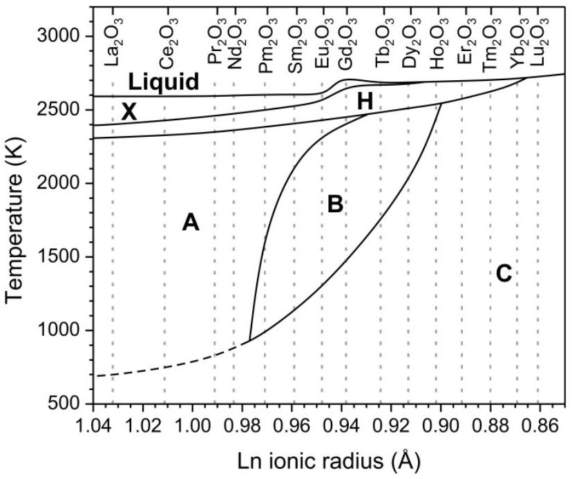
FIG. 1

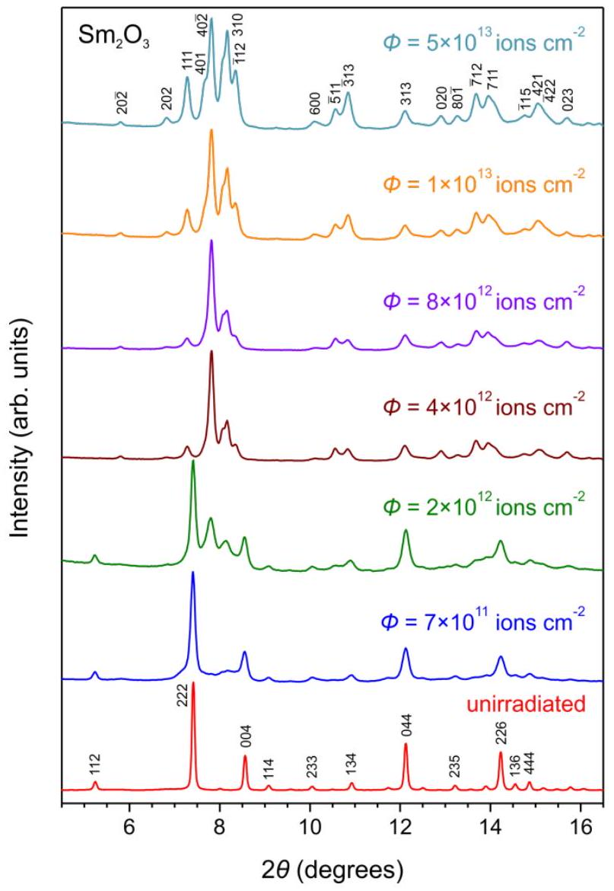
FIG. 2

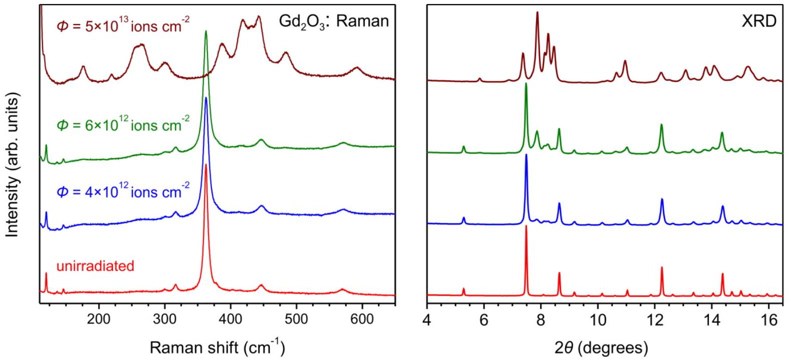
FIG. 3

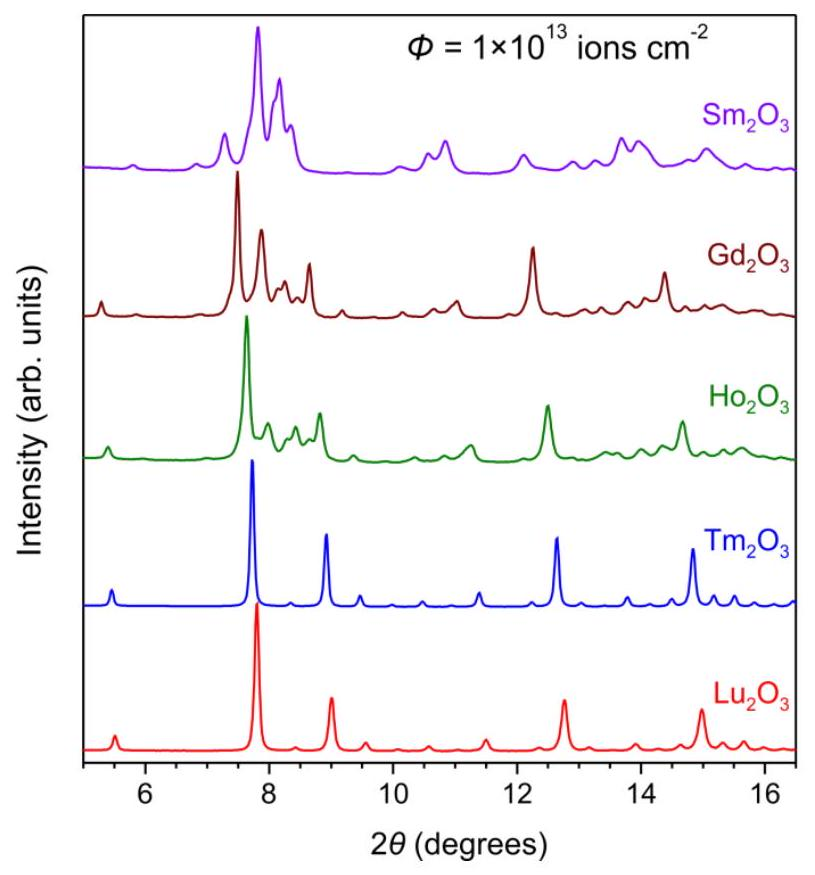
FIG. 4

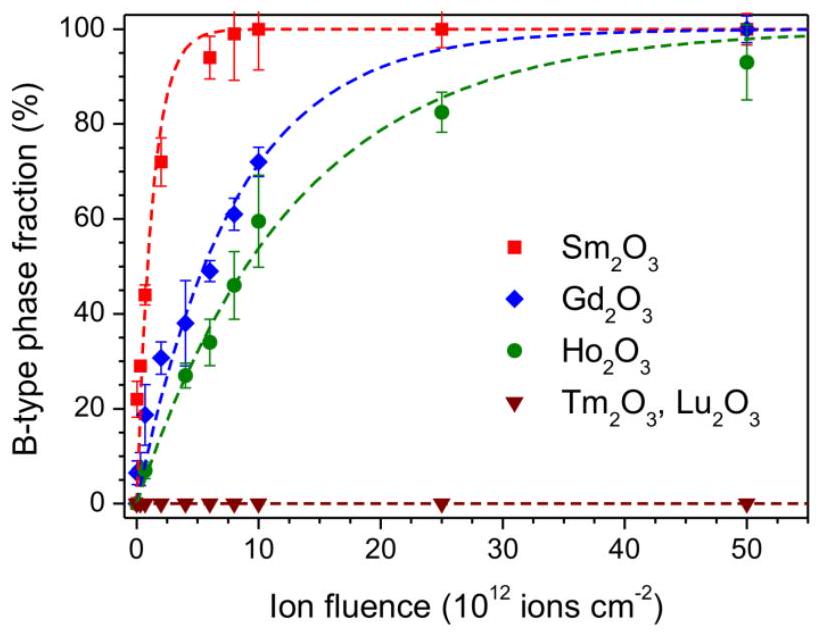
FIG. 5

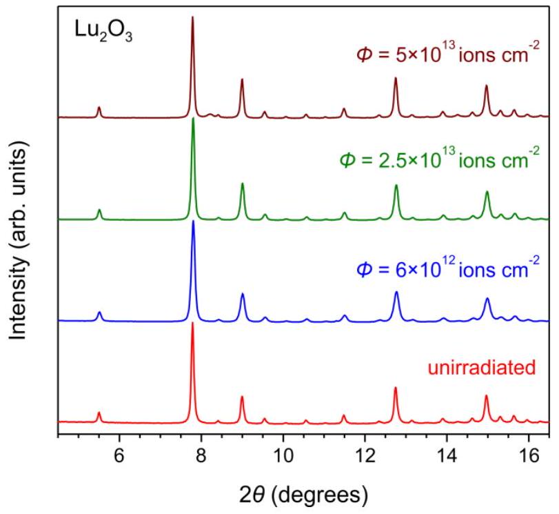
FIG. 6

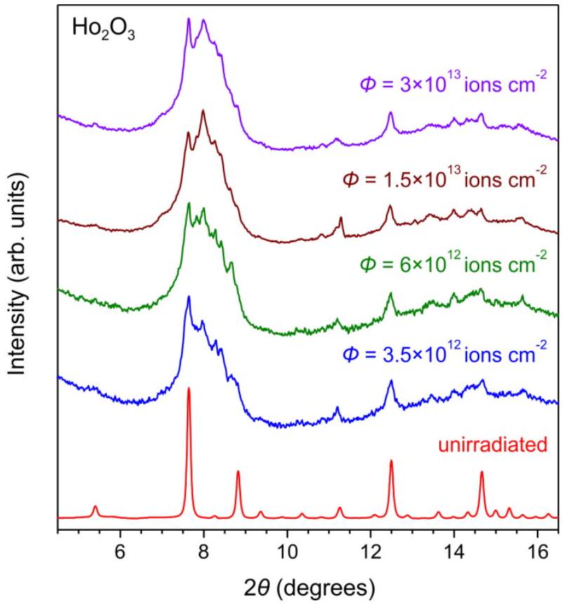
FIG. 7

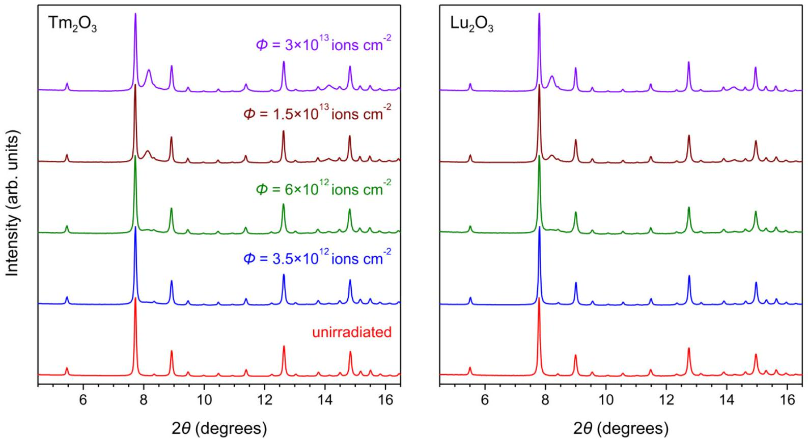
FIG. 8

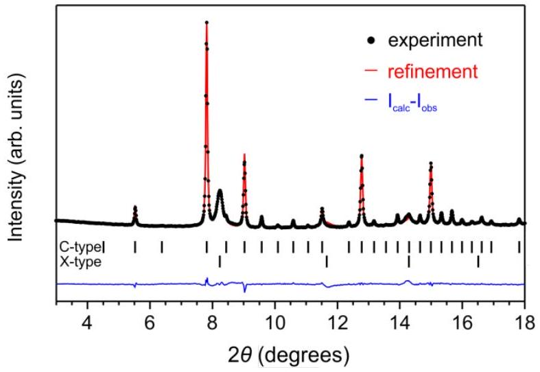
FIG. 9

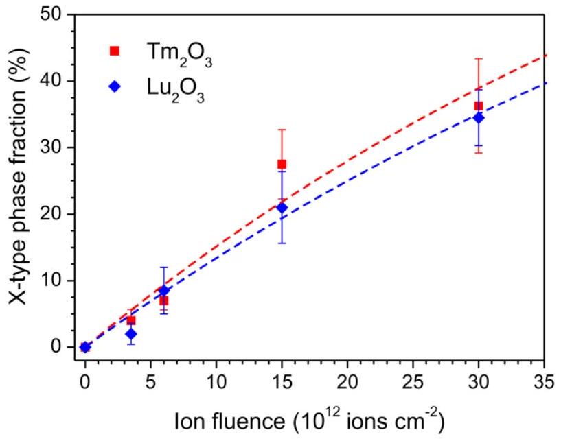
FIG. 10

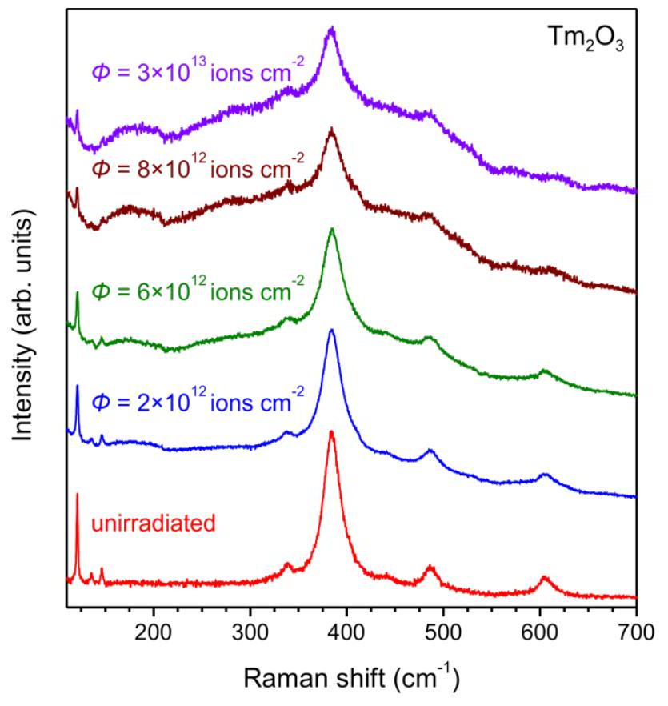
FIG. 11

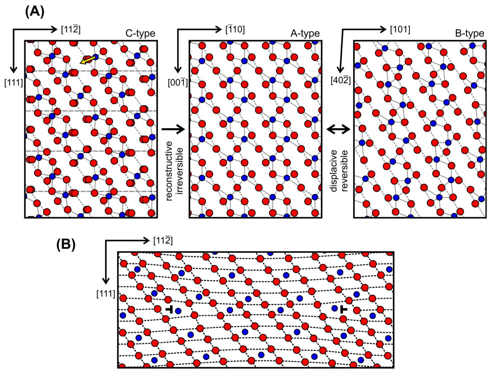
FIG. 12

