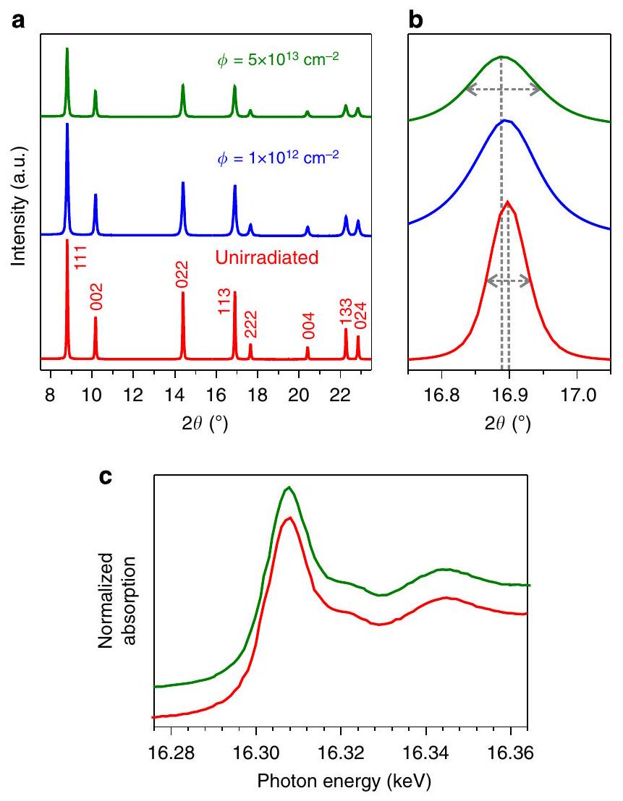
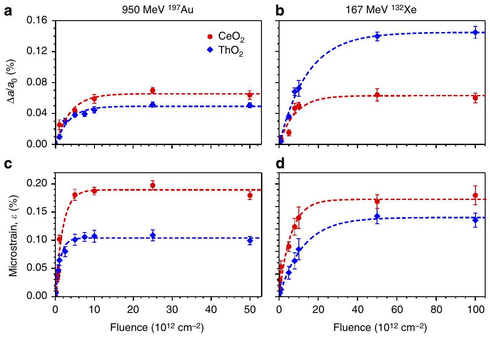
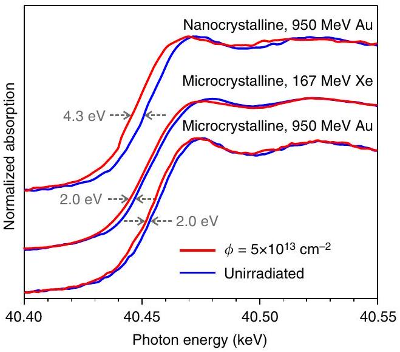
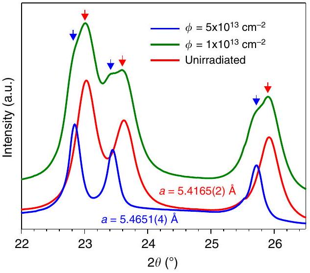
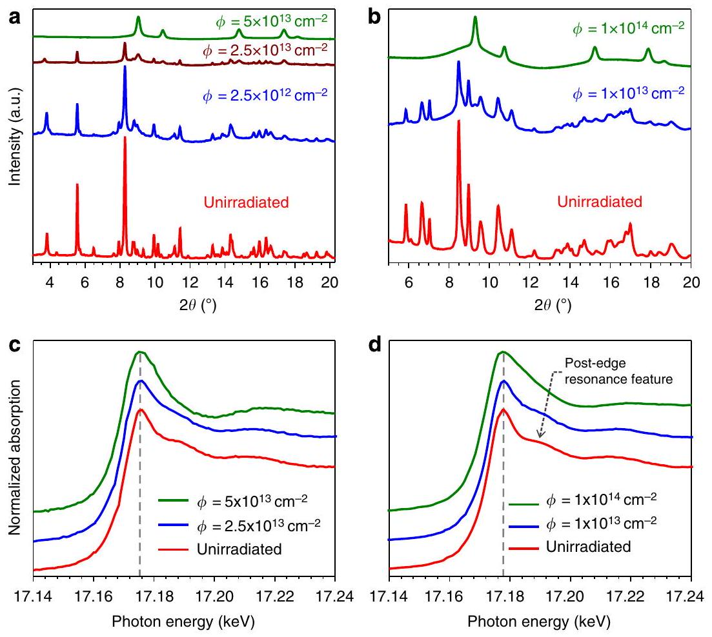

# Redox response of actinide materials to highly ionizing radiation 

Cameron L. Tracy ${ }^{1}$, Maik Lang ${ }^{2}$, John M. Pray ${ }^{3}$, Fuxiang Zhang ${ }^{3}$, Dmitry Popov ${ }^{4}$, Changyong Park ${ }^{4}$, Christina Trautmann ${ }^{5,6}$, Markus Bender ${ }^{5}$, Daniel Severin ${ }^{5}$, Vladimir A. Skuratov ${ }^{7}$ \& Rodney C. Ewing ${ }^{8}$

Energetic radiation can cause dramatic changes in the physical and chemical properties of actinide materials, degrading their performance in fission-based energy systems. As advanced nuclear fuels and wasteforms are developed, fundamental understanding of the processes controlling radiation damage accumulation is necessary. Here we report oxidation state reduction of actinide and analogue elements caused by high-energy, heavy ion irradiation and demonstrate coupling of this redox behaviour with structural modifications. $\mathrm{ThO}_{2}$, in which thorium is stable only in a tetravalent state, exhibits damage accumulation processes distinct from those of multivalent cation compounds $\mathrm{CeO}_{2}\left(\mathrm{Ce}^{3+}\right.$ and $\left.\mathrm{Ce}^{4+}\right)$ and $\mathrm{UO}_{3}\left(\mathrm{U}^{4+}, \mathrm{U}^{5+}\right.$ and $\left.\mathrm{U}^{6+}\right)$. The radiation tolerance of these materials depends on the efficiency of this redox reaction, such that damage can be inhibited by altering grain size and cation valence variability. Thus, the redox behaviour of actinide materials is important for the design of nuclear fuels and the prediction of their performance.

[^0]1nsulating materials exhibit diverse responses to radiation, ranging from isolated point defect formation and disordering to phase transformations and amorphization ${ }^{1}$. Substantial effort has been devoted to understanding the influence of crystal structure and chemistry on radiation damage accumulation ${ }^{2,3}$. The radiation tolerance of actinide materials, which refers to their ability to retain their atomic structures and properties during irradiation, is of primary concern for the design of nuclear fuels with long operating lifetimes and adequate performance in reactor accident scenarios ${ }^{4}$. A variety of criteria have been proposed as predictors of radiation tolerance, including bond covalency ${ }^{5}$, susceptibility to disordering ${ }^{2}$, thermodynamic stability ${ }^{6}$ and grain size ${ }^{7}$. However, relating trends in radiation tolerance to the dynamic process of radiation damage accumulation is difficult due to the complex nature of defect production and recovery, both of which occur at nanometric length scales, femto- and picosecond timescales, and extremely high energy densities ${ }^{8}$. In addition, the conditions under which a material is irradiated can drastically affect its response. High temperatures, as encountered in the centre of nuclear fuel pellets, can alter the kinetics of radiation-induced defect production, such that materials that are tolerant of radiation in one temperature regime can be less so in others ${ }^{9}$. Moreover, materials tolerant of low-energy radiation, which produces damage through atomic displacement caused by elastic collisions with nuclei, are not necessarily resistant to high-energy radiation, which deposits energy in a material primarily through the excitation of electrons ${ }^{10,11}$. The effects of highly ionizing radiation are generally less well understood than those of displacive radiation, but fission fragments, which fall into this high-energy regime, are known to significantly degrade the performance of nuclear fuels ${ }^{12}$. To better understand the physics of damage production by ionizing radiation, a comprehensive approach, in which structural modifications are considered alongside coupled electron delocalization and redox processes, is necessary.

We have investigated the effects of highly ionizing radiation on actinide materials using heavy ions accelerated to velocities ranging from $5 \%$ to $10 \%$ the speed of light. At specific energies above $\sim 1 \mathrm{MeV}$ per nucleon, these swift heavy ions simulate the effects of the energetic nuclear fragments that form during fission events and the $\alpha$-particles released in radionuclide decay, both of which deposit energy in irradiated materials primarily by electronic excitation ${ }^{13}$. Damage resulting from elastic collisions is generally minor until the particle end-of-range region, and the resulting defects are often distinct from those caused by the electronic interactions ${ }^{14}$. Electronic stopping results in extensive local ionization, yielding excitation densities of up to several $\mathrm{keV} \mathrm{nm}^{-3}$ within a nanometric cylinder along the ion trajectory ${ }^{15}$. Although the atomistic modifications that occur following this electron cascade have been extensively studied ${ }^{8,13}$, the relaxation of these delocalized electrons is complex and difficult to relate directly to atomic behaviour ${ }^{16}$. It is generally assumed that electron-hole recombination leads to recovery of the pre-irradiation charge distribution ${ }^{13}$ but, given the highly nonequilibrium conditions under which relaxation of the electron cascade occurs, electronic structure modifications are possible. Of particular interest is the influence of complex $f$-electron chemistry on a material's radiation response, considering previous work ${ }^{17,18}$ reporting the reduction of $\mathrm{Ce}^{4+}$ to $\mathrm{Ce}^{3+}$, following exposure of $\mathrm{CeO}_{2}$ to ionizing radiation. In addition, the reduction of $\mathrm{Zr}^{4+}$ to $\mathrm{Zr}^{3+}$ has been shown ${ }^{19}$ to accompany a radiation-induced phase transformation in $\mathrm{Sc}_{4} \mathrm{Zr}_{3} \mathrm{O}_{12}$ (ref. 20), suggesting that this redox behaviour might have some effect on the accumulation of structural damage. Any relationship between radiation tolerance and redox behaviour would have important implications for the technologically important light actinide (Th-Cm) oxides, as their
partially delocalized $5 f$ orbitals cause significant variation in the accessible stable electronic configurations across this series ${ }^{21}$.

Motivated by the potential influence of their complex chemistry on the radiation response of actinide materials, we have systematically irradiated $f$-block oxides with $167 \mathrm{MeV}{ }^{132} \mathrm{Xe}$ ions, similar in mass and energy to fission fragments, and $950 \mathrm{MeV}{ }^{197} \mathrm{Au}$ ions. Fission rates are highest, and fission fragment damage most prevalent, in the relatively cool rim region of nuclear fuel pellets, where temperatures are typically between 500 and $700^{\circ} \mathrm{C}$, and thermal activation is generally negligible ${ }^{22}$. Thus, these irradiations were performed at room temperature to avoid radiation-induced heating of the materials above fuel pellet rim temperatures. Complementary synchrotron-based structural and chemical probes, X-ray diffraction (XRD) and X-ray absorption spectroscopy (XAS) were used to characterize the resulting atomic-scale modifications. Thorium and cerium are both nominally one $f$-electron elements and possess dioxides isostructural with those of the light actinides, all of which exhibit the fluorite structure, yet they possess contrasting solidstate chemistry. $\mathrm{ThO}_{2}$, a proposed nuclear fuel component used for the breeding of uranium, cannot be reduced, while the cerium in the actinide analogue $\mathrm{CeO}_{2}$ is easily reduced from the tetravalent state to the trivalent state, similar to the behaviour of $\mathrm{UO}_{2}$ and $\mathrm{PuO}_{2}$. Finally, $\mathrm{UO}_{3}$ and its room-temperature hydration products, $\left(\mathrm{UO}_{2}\right)(\mathrm{OH})_{2}$ ( $\alpha$-uranyl hydroxide) and $\left(\mathrm{UO}_{2}\right)_{8} \mathrm{O}_{2}(\mathrm{OH})_{12}\left(\mathrm{H}_{2} \mathrm{O}\right)_{10}$ (metaschoepite), feature hexavalent uranium that can be reduced multiple steps to the tetravalent oxidation state ${ }^{23}$. They are common oxidation/hydrolysis products of the nuclear fuel $\mathrm{UO}_{2}$ and are produced by fuelcoolant interactions and groundwater exposure of fuel ${ }^{4}$.

The results of these experiments show evidence of coupling between radiation-induced redox behaviour and structural modifications, with materials that undergo cation valence state changes exhibiting damage accumulation behaviour different than those that are resistant to such chemical modification. In redox-active materials, control of the efficiency of these radiationinduced redox processes through, for example, grain-size modification can be used to tailor the susceptibility of a material to radiation damage. These results are particularly important for actinide oxides as, due to the partially itinerant nature of their $5 f$ electrons, they exhibit increasing variability in stable electronic configurations across the actinide series (as the $5 f$ orbitals are filled). This results in systematic variation in their radiation tolerance, as demonstrated here via a comparative study of such materials. These results yield new insight into the mechanisms by which highly ionizing radiation produces damage in nuclear fuel materials and demonstrate potential for the design of radiationtolerant materials through control of their redox behaviour.

## Results

Defect accumulation in $\mathbf{T h O}_{\mathbf{2}}$. Irradiation of $\mathrm{ThO}_{2}$ with swift heavy ions induces only minor structural modifications (Fig. 1a,b), as discussed in detail elsewhere ${ }^{24}$. XRD patterns corresponding to both irradiation energies display a shift in the fluorite structure diffraction maxima to lower $2 \theta$ angles, signifying an increase in the unit cell parameter and broadening of the peaks due to the accumulation of heterogeneous microstrain. The latter effect was quantified via the use of Williamson-Hall analysis ${ }^{25}$, in which microstrain and crystallite size contributions to peak breadth are differentiated based on the angular dependence of broadening. No contribution to broadening from a decrease in crystallite size is observed (Supplementary Fig. 1), consistent with previous work that has shown grain growth to result from irradiation of fluorite materials in the electronic stopping regime ${ }^{26}$. Therefore, the increased

Figure 1 | Structural modification of $\mathbf{T h O}_{\mathbf{2}}$ by irradiation. (a,b) XRD patterns of $\mathrm{ThO}_{2}$ irradiated with $950 \mathrm{MeV}{ }^{197} \mathrm{Au}$ ions as a function of fluence, $\Phi$. The fluorite-structure diffraction maxima exhibit both an increase in width and a shift to lower $2 \theta$ values with increasing fluence, as illustrated by the dashed lines. These indicate the presence of strain and unit cell volume expansion, respectively. (c) No changes appear in the XAS spectra, indicating that thorium remains in a tetravalent oxidation state.

breadth of the diffraction peaks can be attributed solely to microstrain. Together, these peak shifts and broadening are consistent with the accumulation of defects that distort the local periodicity of the atomic structure. Both unit cell expansion and microstrain can be produced by the same defects, such as Frenkel pairs. The former indicates long-range changes in the periodicity length of atomic planes due to the additional volume occupied by these defects, while the latter results from heterogeneous, shortrange distortion in the spacing of planes in the local environment of defects.

Figure 2 shows refined unit cell parameter expansion, $\Delta a / a_{0}$, and average microstrain, $\varepsilon$, for $\mathrm{ThO}_{2}$ as a function of ion fluence for both ion species. The evolution of these parameters is consistent with a single-impact model of damage accumulation ${ }^{27}$, which predicts an initial linear relationship between radiation damage and ion fluence, corresponding to well-separated ion tracks in which structural modification has occurred, followed by saturation with increasing track overlap. Thus, single-impact behaviour was assumed for the analysis performed. For both irradiations, the slopes of the initial linear regions, which are proportional to the ion track cross-sectional area, are greater for microstrain than for unit cell expansion. This indicates ion track heterogeneity due to a decreasing defect density along the radial track direction ${ }^{15,24}$. The energy density deposited by a highenergy heavy ion exhibits similar radial dependence, such that defect production is most efficient in the track core. Here the damage is sufficient to induce an increase in the average spacing
of atomic planes over medium-range length scales, along with significant microstrain. In contrast, the more isolated defects present in the track shell region cause only local structural distortion, or microstrain, resulting in a larger effective track diameter for this modification. Track diameters extracted from fitting of a single impact model to the data are $d_{\text {cell expansion }}= 3.0 \pm 0.1 \mathrm{~nm}$ and $d_{\text {microstrain }}=3.2 \pm 0.3 \mathrm{~nm}$ for the 167 MeV Xe irradiations, while the 950 MeV Au irradiations yielded $d_{\text {cell expansion }}=6.1 \pm 0.4 \mathrm{~nm}$ and $d_{\text {microstrain }}=10.2 \pm 0.9 \mathrm{~nm}$.

Comparison of the damage induced by the two ions used in this work indicates increased track size for the high specific energy ion, but a significant decrease in the saturation volume expansion and strain. This is consistent with the ion 'velocity effect,' in which reduction of the energy and mass of impinging particles can lead to enhanced damage efficiency within smaller ion tracks, due to more compact energy deposition volumes. For example, Meftah et al. ${ }^{28}$ have shown that mean in-track energy densities produced by 185 MeV Xe ions in $\mathrm{Y}_{3} \mathrm{Fe}_{5} \mathrm{O}_{12}$ are more than double of those produced by 2.5 GeV Pb ions, a trend similar to that seen here. As the magnitude of the structural damage quenched into ion tracks in $\mathrm{ThO}_{2}$ depends on the amount of energy available to displace atoms and produce defects, the decreased spatial extent of energy deposition by the Xe ions, as compared with Au , results in enhanced damage production within smaller ion tracks. Saturation of the unit cell parameter expansion and microstrain for the Xe irradiations occur at $0.145 \pm 0.004 \%$ and $0.141 \pm 0.003 \%$, respectively, while those for the Au irradiations occur at $0.049 \pm 0.002 \%$ and $0.107 \pm 0.003 \%$, respectively. XAS spectra of the Th $\mathrm{L}_{\text {III }}$-edge (Fig. 1c) confirm that thorium remains in the tetravalent oxidation state following irradiation, as expected. Trivalent thorium compounds are rare and are unknown in the Th-O system ${ }^{29}$. Minor modification of features in the pre-edge region may be present, but the resolution obtained is not sufficient for analysis. Such features arise from electron transitions to bound states and are sensitive to the local environment of absorbing atoms, such that thorium Frenkel defects are a probable cause of any changes in this region of the spectra.

Redox response of $\mathbf{C e O}_{\mathbf{2}} \cdot \mathrm{CeO}_{\mathbf{2}}$ exhibits a structural radiation response qualitatively similar to that of $\mathrm{ThO}_{2}$, but a dramatically different dependence of saturation damage on ion mass and energy (Fig. 2). Again, peak shifts indicate unit cell expansion, while peak broadening indicates the accumulation of heterogeneous microstrain. As expected ${ }^{26}$, no decrease in the crystallite size was observed in the Williamson-Hall analysis (Supplementary Fig. 1), such that broadening can be attributed solely to microstrain. The evolution of unit cell expansion and microstrain both follow single-impact behaviour and exhibit ion track diameters of $d_{\text {cell expansion }}=3.9 \pm 0.3 \mathrm{~nm}$ and $d_{\text {microstrain }}= 4.6 \pm 0.5 \mathrm{~nm}$ for the 167 MeV Xe irradiations, with $d_{\text {cell expansion }}= 5.8 \pm 0.6 \mathrm{~nm}$ and $d_{\text {microstrain }}=8.4 \pm 0.7 \mathrm{~nm}$ for the 950 MeV Au irradiations. Saturation of the cell expansion and microstrain occur for the Xe irradiation at $0.063 \pm 0.004 \%$ and $0.172 \pm 0.009 \%$, respectively, and at $0.066 \pm 0.004 \%$ and $0.192 \pm 0.007 \%$, respectively, for the Au irradiation. This relatively constant unit cell parameter expansion agrees well with that reported by Ohno et al. ${ }^{17}$ of $0.06 \%$ for irradiation with 200 MeV Xe ions. Clearly, the energy and mass of swift heavy ions have little effect on the efficiency of in-track damage evolution in this material, suggesting a damage production mechanism fundamentally different from the defect accumulation process active in $\mathrm{ThO}_{2}$. This unique radiation response is further demonstrated by XAS spectra of the Ce K-edge, shown in Fig. 3, which confirm the partial reduction of cerium to its trivalent state, as demonstrated

Figure $\mathbf{2}$ | Volume expansion and heterogeneous microstrain in irradiated $\mathbf{T h O}_{\mathbf{2}}$ and $\mathbf{C e O}_{\mathbf{2}}$. Both the unit cell parameter expansion ( $\mathbf{a}, \mathbf{b}$ ), $\Delta a / a_{0}$, and the heterogeneous microstrain ( $\mathbf{c , d}$ ), $\varepsilon$, present in each material increase with ion fluence. This increase is initially linear, but saturates as ion track overlap occurs. Saturation damage shows strong dependence on ion specific energy for $\mathrm{ThO}_{2}$, but is relatively constant for $\mathrm{CeO}_{2}$. The dashed lines corresponds to fits of the data to a single-impact model and the error bars represent the s.d. of unit cell expansion and microstrain values determined from multiple samples irradiated to the same ion fluence.

Figure 3 | Irradiation-induced reduction of microcrystalline and nanocrystalline $\mathbf{C e O}_{\mathbf{2}}$. XAS Ce K-edges measured before and after ion irradiation. Following irradiation to a fluence of $5 \times 10^{13} \mathrm{~cm}^{-2}$, the absorption edges shift to lower energies, indicative of partial reduction of cerium from the tetravalent to the trivalent oxidation state. Little dependence of the edge shift on ion mass or energy is observed. Under identical irradiation conditions, nanocrystalline $\mathrm{CeO}_{2}$ exhibits more extensive cation reduction than microcrystalline $\mathrm{CeO}_{2}$.

by a shift in the edge to a lower energy following irradiation. This is evidence of a decreased core electron binding energy concomitant with decreased charge of the cation. The roughly 2 eV edge shift, which also does not vary significantly between the two ions, indicates partial reduction, as a complete reduction of all $\mathrm{Ce}^{4+}$ to $\mathrm{Ce}^{3+}$ corresponds to a 7 eV shift ${ }^{30}$. Previous studies ${ }^{17,18}$ of $\mathrm{CeO}_{2}$ irradiated with 200 MeV Xe ions have demonstrated similar oxidation state changes using X-ray photoelectron spectroscopy.

The reduction of cerium alone, without concurrent Frenkel defect accumulation, has been shown to result in structural
modifications identical to those observed here ${ }^{31,32}$. As large $\mathrm{Ce}^{3+}$ cations (ionic radius $=1.14 \AA$ ) replace $\mathrm{Ce}^{4+}$ (ionic radius $= 0.97 \AA)^{33}$, the fluorite unit cell expands and the distribution of atoms of different ionic radii on the cation sublattice causes local structural distortion. Additional unit cell expansion arises from a decrease in the electrostatic attraction between cations and anions accompanying the reduction of cerium's charge. Therefore, the radiation-induced structural modifications to $\mathrm{CeO}_{2}$ shown in Fig. 2 must be at least partially attributed to the effects of the observed cerium valence reduction. Comparison of quantitative unit cell expansion and valence reduction data by Iwase et al. ${ }^{18}$ indicates that the expansion induced in $\mathrm{CeO}_{2}$ by ions in the electronic stopping regime can be almost entirely attributed to this redox effect. The lack of a significant influence of ion mass and energy on the extent to which cerium is reduced to the trivalent state explains the constant damage saturation in this material and further suggests that this redox effect is the primary cause of the observed structural modifications. The saturation of cerium reduction may be related to the efficiency of electron capture by this element's $f$-orbitals during relaxation of the electron cascade.

Interestingly, although the higher energy density produced by 167 MeV Xe radiation, compared with 950 MeV Au , leads to an increase in the unit cell expansion of $\mathrm{ThO}_{2}$ above the relatively constant expansion seen in $\mathrm{CeO}_{2}$, the same effect is not observed for microstrain. Although microstrain in $\mathrm{ThO}_{2}$ does increase with ion track energy density, it still remains below that observed in $\mathrm{CeO}_{2}$. This discrepancy might be related to the different character of radiation-induced defects in these two materials, with the Frenkel pairs that cause the majority of damage in $\mathrm{ThO}_{2}$ producing local structural distortions of the fluorite structure distinct from those produced by cerium ions of mixed valence on the cation sublattice. Owing to the difficulties associated with attempts to compare the magnitudes of the complex structural distortion produced by these different types of radiation damage, we limit the analysis here to the relative energy dependencies of unit cell expansion and microstrain in each material. Such energy dependencies, which show clear differences between $\mathrm{ThO}_{2}$ and
$\mathrm{CeO}_{2}$, yield insight into the mechanisms of damage production, rather than merely its magnitude. In contrast to $\mathrm{ThO}_{2}$, for which atomic defect formation controls the accumulation of radiation damage, the response of $\mathrm{CeO}_{2}$ to fission fragments depends strongly on its radiation-induced redox behaviour.

The modified electronic structure observed in $\mathrm{CeO}_{2}$ ion tracks requires accompanying modification of the atomic structure to maintain charge neutrality, as the oxygen coordination of $\mathrm{Ce}^{3+}$ must be lower than that of $\mathrm{Ce}^{4+}$ in unirradiated $\mathrm{CeO}_{2}$. Takaki et al. ${ }^{34}$, using advanced scanning transmission electron microscopy (STEM) techniques, have demonstrated a decrease in the atomic density of ion track core regions of $\mathrm{CeO}_{2}$ irradiated with 200 MeV Xe ions. The $4-\mathrm{nm}$ diameter of this modified region is much smaller than the $17-\mathrm{nm}$ track diameter identified using conventional TEM analysis ${ }^{35}$. They attribute this track size discrepancy to the production of a small, vacancy-rich track core (visible in STEM micrographs) surrounded by a large, interstitialrich track shell (observed with conventional TEM). Comparison of these STEM results with X-ray photoelectron spectroscopy and extended X-ray absorption fine structure studies ${ }^{17,18}$ of irradiated $\mathrm{CeO}_{2}$ indicate that the segregation of defects occurs preferentially on the oxygen sublattice, resulting in a hypostoichiometric track core and a hyperstoichiometric shell. Consistent with our results, this suggests that damage accumulation in this reducible material is driven by concurrent cation valence changes and anion-specific Frenkel pair formation, a process distinct from that of nonreducible $\mathrm{ThO}_{2}$. Similar oxygen-selective point defect production has been observed in $\mathrm{CeO}_{2}$ irradiated with electrons ${ }^{36-38}$, which deposit energy through isolated electron excitation, confirming that the formation of these ion tracks is an effect of ionization. In this work, clusters of interstitial oxygen were observed, indicating that anions preferentially displaced by ionizing radiation tend to aggregate in planar interstitial dislocation loops ${ }^{37}$, which have been identified as a possible cause of problematic microstructure changes in the rim region of nuclear fuel pellets ${ }^{22}$.

A process analogous to the redox effect of highly ionizing radiation on $\mathrm{CeO}_{2}$ can be found in the radiation response of the alkaline earth halides. Under high-energy, heavy ion irradiation, fluorite-structured $\mathrm{CaF}_{2}$ forms nanoscale metallic inclusions within the track cores due to anion-specific expulsion of atoms from the particle-solid interaction volume following the formation of mobile interstitial fluorine ${ }^{39,40}$. Similar behaviour, which indicates complete valence reduction of the cations, has been observed in $\mathrm{SrF}_{2}$ and $\mathrm{BaF}_{2}$ under ionizing radiation ${ }^{41}$. Planar defects, probably composed of interstitial anions, were observed in the track shell regions and TEM analysis ${ }^{42}$ has shown the presence of strain around ion tracks caused by the volume expansion that accompanies the track core redox effect. The saturation of damage in $\mathrm{CaF}_{2}$ seems to be related to its redox chemistry, with electron radiation damage accumulation ceasing once $5 \%-10 \%$ of the material has been fully reduced to metallic Ca , regardless of the irradiation conditions ${ }^{41}$. This is consistent with the constant saturation damage and cerium reduction observed in $\mathrm{CeO}_{2}$, for which the same coupling of radiationinduced redox behaviour with structural damage, in the form of lattice distortion, is observed. Cation valence reduction by ionizing radiation is further evident in the fluorite materials $\mathrm{ZrO}_{2}$ (ref. 14) and $\mathrm{UO}_{2}$ (ref. 43), while $\mathrm{Al}_{2} \mathrm{O}_{3}$ has been shown to undergo both reduction ${ }^{44}$ and anion-selective defect accumulation ${ }^{45}$. Anion segregation, accompanied by chemical reduction, has also been observed in $\mathrm{Al}_{2} \mathrm{O}_{3}$ irradiated with an ultrafast laser ${ }^{46}$, which, similar to high-energy heavy ions, deposits energy in a material via electronic excitation. Taken together, these results suggest that the redox mechanism proposed here represents a fundamental response of ionic compounds to electronic excitation.

Enhanced reduction of nanocrystalline $\mathbf{C e O}_{\mathbf{2}}$. If damage accumulation in $\mathrm{CeO}_{2}$ is controlled largely by this material's redox behaviour, its radiation response should exhibit a strong dependence on grain size, as the presence of high-energy surfaces dramatically enhances the redox activity of $\mathrm{CeO}_{2}$ (ref. 47). To test this hypothesis, nanocrystalline $\mathrm{CeO}_{2}$ with an average crystallite size of 20 nm was irradiated. Figure 3 shows a Ce K-edge shift of 4.3 eV for the nanocrystalline material, more than twice that of microcrystalline powder, which had a grain size of several micrometres. This confirms the occurrence of more extensive cation valence reduction, accompanied by increased saturation damage. The unit cell expansion in the nanocrystalline sample (Fig. 4) of $0.903 \pm 0.002 \%$ is more than an order of magnitude greater than that observed in microcrystalline $\mathrm{CeO}_{2}$. Furthermore, the XRD results for this material show attenuation of the initial, small cell parameter peaks accompanied by the growth of new, larger cell parameter peaks. This differs from the gradual peak shifts seen in diffraction patterns of the microcrystalline material and suggests that highly ionizing radiation induces a phase transformation-like process, rather than a gradual accumulation of damage, for these nanometric crystallites. A local transformation from $\mathrm{CeO}_{2}$ to $\mathrm{CeO}_{2-x}$ is consistent with the aforementioned STEM results of Takaki et al. ${ }^{34}$, as they directly observed the expulsion of oxygen from a central track region and determined an oxygen segregation distance, 17 nm , that is very close to the grain size of the nanocrystals used here. Thus, oxygen expelled from the track core region should reach crystallite surfaces, where it can be efficiently released, facilitating the production of a highly modified hypostoichiometric phase. Interestingly, this result contrasts with the increased radiation tolerance observed in many nanocrystalline materials due to enhanced defect annihilation at grain boundaries ${ }^{7}$. This provides further evidence that the redox mechanism of radiation damage accumulation, rather than simple point defect production, is the dominant source of radiation damage in $\mathrm{CeO}_{2}$.

A deleterious effect of nanocrystallinity on high-energy heavy ion radiation tolerance has previously been observed in a small number of oxides. Merkle ${ }^{48}$ proposed the spatial confinement of

Figure 4 | Irradiation-induced phase transformation in nanocrystalline CeO2. XRD patterns of nanocrystalline $\mathrm{CeO}_{2}$ as a function of ion fluence. With increasing fluence, the initial fluorite-structure peaks decrease in intensity, while new fluorite-structure peaks at lower $2 \theta$ values appear and increase in intensity. At the highest fluence achieved, $5 \times 10^{13} \mathrm{~cm}^{-2}$, the initial peaks are no longer observed, indicating a complete transformation to the new fluorite material with a $0.903 \pm 0.002 \%$ larger unit cell parameter. Minimal $2 \theta$ shifts of the diffraction maxima corresponding to each phase are observed as a function of fluence, such that the pattern at intermediate fluences is a superposition of the low- and high-fluence patterns.

energy deposited by this radiation as the cause of its destruction of very small crystallites, an effect modelled by Berthelot et al. ${ }^{49}$ using a two-temperature thermal spike model. However, experimental results suggest that the influence of grain size on radiation tolerance in the electronic stopping regime cannot be explained solely by this effect. For example, Hémon et al. ${ }^{50}$ showed that microcrystalline powders of $\mathrm{Y}_{2} \mathrm{O}_{3}$ are more susceptible to high-energy heavy ion radiation damage than bulk single crystals of the same material. Thermal confinement should have no effect for such a material, as the grain size is several orders of magnitude larger than the ion-solid interaction volume cross-section, suggesting that this behaviour is instead related to the presence of interfaces, as is consistent with the enhanced reduction of nanocrystalline $\mathrm{CeO}_{2}$. Similarly, Moll et al. ${ }^{51}$ have attributed the differing responses of microcrystalline and single crystal fluorite $\mathrm{ZrO}_{2}$ to radiation in this regime to the loss of defects, such as interstitial anions, at grain boundaries.

Hexavalent uranium compounds. In contrast to $\mathrm{CeO}_{2}$, in which one electron can be localized on the cerium $4 f$ shell during reduction, hexavalent uranium compounds can be further reduced from $\mathrm{U}^{6+}$ to $\mathrm{U}^{4+}$, making possible dramatic structural effects of radiation-induced redox processes. Powders of $\gamma$-phase $\mathrm{UO}_{3}$ and a mixture of $88 \% \alpha$-uranyl hydroxide, $12 \%$ metaschoepite, simulating the complex phase assemblages common to fuel/water interactions, were irradiated with both 167 MeV Xe and 950 MeV Au ions (Fig. 5). When compared with published spectra of $\mathrm{UO}_{2}$ (ref. 52) and $\mathrm{UO}_{3}$ (ref. 53), the XAS spectra shown in Fig. 5c,d confirm that reduction of uranium to the tetravalent oxidation state occurs, for both ions used, based on the shift in the $\mathrm{U} \mathrm{L}_{\text {III }}$-edge to lower photon energies, broadening of the main edge and the disappearance of the shoulder at $\sim 17.19 \mathrm{keV}$.

This post-edge feature is characteristic of axial oxygen atoms present in the uranyl groups of the pre-irradiated materials ${ }^{52}$. The hexavalent uranium oxide structures are not stable without uranyl groups and, as shown in Fig. 5a,b, this instability results in a phase transformation. With increasing ion fluence, the diffraction maxima corresponding to the hexavalent uranium compounds decrease in intensity, accompanied by the growth of new peaks corresponding to fluorite-structured $\mathrm{UO}_{2+x}$. This transformation constitutes a much more extensive structural modification than the volume expansion and microstrain observed in $\mathrm{CeO}_{2}$, indicating that the larger potential for reduction of hexavalent uranium, as compared with tetravalent cerium, results in greatly reduced radiation tolerance. Similar transformations of $\mathrm{U}^{6+}$ hydrolysis compounds to $\mathrm{UO}_{2}$ have been observed in materials irradiated with electron beams ${ }^{54,55}$, confirming that this transformation is driven by electronic excitation.

## Discussion

These results demonstrate a significant influence of cation valence behaviour on the ability of oxides to resist damage caused by highly ionizing radiation. Although radiation-induced redox effects have been observed in previous studies ${ }^{14,17-19,44}$, this comparative investigation of both valence state changes and structural damage caused by irradiation, in a range of materials, represents the first demonstration of systematic coupling between the two modifications. Reducible materials, with multivalent cations, show structural radiation responses that are fundamentally different from that of non-redox active $\mathrm{ThO}_{2}$. As the efficiency of redox changes or the extent to which they can occur is increased, radiation tolerance is decreased. For example, reduction of the grain size of $\mathrm{CeO}_{2}$ enhances the radiationinduced redox behaviour, resulting in significantly increased unit

Figure 5 | Structural and chemical modification of $\mathbf{U O}_{\mathbf{3}}$ and its hydration products by irradiation. (a) Representative XRD patterns of the hydration product as a function of 950 MeV Au ion fluence. (b) Representative XRD patterns of $\mathrm{UO}_{3}$ as a function of 167 MeV Xe ion fluence. With increasing fluence, the diffraction maxima corresponding to the structures of the hexavalent uranium compounds decrease in intensity, while peaks corresponding to a $\mathrm{UO}_{2}$-type fluorite structure increase in intensity. (c,d) XAS spectra of the uranium $\mathrm{L}_{\text {III }}$-edge for both materials as a function of fluence. As irradiation progresses, the spectra transform from one corresponding to hexavalent uranium to one corresponding to tetravalent uranium.

cell expansion. Irradiation of $\mathrm{UO}_{3}$, containing hexavalent uranium with multiple accessible lower oxidation states, results in phase modification much more extensive than that caused by irradiation of $\mathrm{CeO}_{2}$, for which cerium can only have one lower oxidation state, and $\mathrm{ThO}_{2}$, which cannot be reduced. In this way, radiation damage production at the atomic scale is closely linked to modification of materials by at the electron scale, in the case of highly ionizing radiation. This indicates that for some materials, radiation tolerance can be tailored by the control of redox behaviour, through either doping with cations of different electronic configurations or grain size coarsening. Evidence of the former effect has been shown by Tahara et al. ${ }^{56}$ who measured disorder in the $\mathrm{Ce}-\mathrm{O}$ coordination of $\mathrm{CeO}_{2}$ irradiated with 200 MeV Xe ions and found that doping of the material with non-multivalent $\mathrm{Gd}^{3+}$ reduced the extent to which this disorder was induced, thereby preserving local stoichiometry. The influence of microstructure on redox-induced damage was demonstrated in the present work, with nanocrystalline $\mathrm{CeO}_{2}$ showing enhancement of both chemical and structural modifications, compared with its microcrystalline counterpart.

The highly heterogeneous anion distributions produced by ionizing radiation lead to structural changes that are distinct from those produced by homogeneous reduction mechanisms, such as thermal decomposition. Reduction of $\mathrm{CeO}_{2}$ generally proceeds via a reaction involving an oxygen and two cerium atoms, wherein the anion's ionic bonds are broken when two of its electrons are localized on the cations, producing an oxygen vacancy, two trivalent cerium cations and half of a neutral $\mathrm{O}_{2}$ molecule ${ }^{57}$. Displacement of this oxygen from its ideal site is limited in the case of irradiation by the short timescales over which it possesses the energy necessary for mobility, leading to the heterogeneous core-shell tracks discussed previously. In contrast, during thermally induced reduction, oxygen can easily escape from the crystallites to form a homogeneous $\mathrm{CeO}_{2-x}$ phase. The heterogeneity of the material produced by irradiation might be expected to result in decreased expansion compared with a homogeneous case, as the hypostoichiometric track shells within which the valence of cerium is reduced are contained within a hyperstoichiometric matrix, constraining their expansion. Consistent with this interpretation, the $0.06 \%$ expansion observed for irradiated $\mathrm{CeO}_{2}$ is much lower than the $1.1 \%$ expansion measured for the same material reduced by thermal treatment to the same trivalent cerium fraction ${ }^{32}$, assuming that this fraction is linearly proportional to the Ce K-edge position. The influence of stoichiometric heterogeneity on unit cell expansion should be lessened in the case of irradiated nanocrystals, for which displaced oxygen can more easily escape the crystallites, as occurs in reduction through thermal processes. The results presented here agree, as the irradiated $\mathrm{CeO}_{2}$ nanospheres exhibit a $0.9 \%$ expansion that is much closer to the $2.5 \%$ observed for thermal reduction to the same trivalent cerium fraction ${ }^{32}$, again assuming linear proportionality between this fraction and the Ce K-edge position.

In this study, materials in which the $f$-block cations exhibited their highest stable oxidation state were used, to isolate the influence of valence reduction on radiation damage accumulation. However, the actinide elements present in the common nuclear fuel components $\mathrm{UO}_{2}$ and $\mathrm{PuO}_{2}$ possess higher oxidations states, allowing for the formation of stable, hyperstoichiometric oxides with the fluorite structure. This might be expected to result in enhanced tolerance for highly ionizing radiation, as these materials can easily incorporate adventitious oxygen, as found in ion track shells, with minimal structural modification ${ }^{58}$. Experimental work has demonstrated, for low fluences, exceptional tolerance of $\mathrm{UO}_{2}$ to fission fragment radiation ${ }^{12,59}$. However, at fluences on the order of
$1 \times 10^{14} \mathrm{~cm}^{-2}$, damage to the atomic structure begins to rapidly accumulate in the form of unit cell expansion ${ }^{60}$. At such high fluences, both $\mathrm{CeO}_{2}$ (refs 61,62 ) and $\mathrm{UO}_{2}$ (refs 12,63 ) are known to undergo extensive microstructural modification under fission fragment irradiation, developing nanocrystalline subgrains and porosity. Termed the 'rim effect', this process is commonly encountered in the relatively cool outer region of fuel pellets where fission rates are highest, and has been attributed to the formation of a dislocation loop network ${ }^{12,61-63}$. The precipitation of anion interstitial defects into these dislocation loops has been observed in $\mathrm{CeO}_{2}$ (ref. 64) and $\mathrm{UO}_{2}$ (refs 59,65) irradiated with ionizing radiation. Density functional theory calculations ${ }^{66}$ have shown that these interstitial oxygen defects are stable in neutral charge states, which would allow for charge neutrality following the transfer of electrons to cations. This behaviour is consistent with the redox-induced charge redistribution process observed in the current work. At low fluences, $\mathrm{UO}_{2}$ is able to easily incorporate the local stoichiometry variation produced by radiation-induced valence changes. However, once the interstitial oxygen expelled from ion track cores begins to form neutral defect clusters and, at high fluences, a dislocation network, it can contribute to fuel degradation in the form of 'rim effect' microstructural damage. As it has been shown that the production of these anion defects is coupled to valence state changes in the cations, control of a material's redox behaviour presents a possible strategy for the mitigation of this radiation-induced fuel degradation process.

These results are applicable primarily to the behaviour of nuclear fuel materials in the cool rim region of a fuel pellet, where fission fragment fluences are highest. However, the operating environment of nuclear fuels is complex and large temperature gradients are common. Therefore, further study in the form of high-temperature irradiations are needed to investigate the radiation response of materials in the interior of a fuel pellet. In addition, combined fission fragment and neutron irradiation might give insight into the interaction of redox-induced damage with displacement cascades ${ }^{11}$. In this way, these findings on the physical principles underlying radiation damage production in chemically complex actinides can be extended to the design and engineering of nuclear fuel materials.

## Methods

Irradiation. Powders of $\mathrm{CeO}_{2}, \mathrm{ThO}_{2}, \mathrm{UO}_{3}$ and a mixture of $\left(\mathrm{UO}_{2}\right)(\mathrm{OH})_{2}$ and $\left(\mathrm{UO}_{2}\right)_{4} \mathrm{O}(\mathrm{OH})_{6}\left(\mathrm{H}_{2} \mathrm{O}\right)_{5}$ were pressed into holes of $200 \mu \mathrm{~m}$ diameter in thick stainless steel sheets of 12.5 and $50 \mu$ m thickness. Nanocrystalline $\mathrm{CeO}_{2}$, in the form of spherical nanocrystals, was procured from MTI Corporation and was synthesized from cerium ammonium nitrate using a hydrothermal process. The uranium oxyhydroxide material was produced by exposure of $\gamma-\mathrm{UO}_{3}$ to humid air for several years and contains a minor amount ( $<2 \%$ ) of the oxide precursor phase. Typical grain sizes were on the order of a few micrometres for the microcrystalline samples and 20 nm for nanocrystalline samples. The resulting compacts were $50 \%-60 \%$ theoretical density ( $50-\mu$ m-thick samples: $\mathrm{CeO}_{2}$ was 51.1 (6) $\%$, $\mathrm{ThO}_{2}$ was $50.6(9) \%$, nano- $\mathrm{CeO}_{2}$ was $46.9(9) \%$ and the uranyl oxyhydroxide mixture was $53.8(7) \% ; 12.5-\mu$ m-thick samples: $\mathrm{CeO}_{2}$ was $57.7(4) \%, \mathrm{ThO}_{2}$ was $56.9(3) \%$ and $\mathrm{UO}_{3}$ was $\left.53.1(5) \%\right)$. Irradiation of the $50-\mu \mathrm{m}$-thick samples in vacuum, at room temperature, with $950 \mathrm{MeV}{ }^{197} \mathrm{Au}$ ions was carried out at beamline M2 of the UNILAC linear accelerator at the GSI Helmholtzzentrum für Schwerionenforschung in Darmstadt, Germany. Samples were irradiated to fluences of up to $5 \times 0^{13} \mathrm{~cm}^{-2}$, with the ion flux limited to $\sim 10^{9} \mathrm{~cm}^{-2} \mathrm{~s}^{-1}$, to avoid heating of the samples. Irradiation of the $12.5-\mu \mathrm{m}$-thick samples with $167 \mathrm{MeV}{ }^{132} \mathrm{Xe}$ ions was carried out under the same conditions using the IC-100 cyclotron at the Joint Institute for Nuclear Research in Dubna, Russia, to fluences of up to $1 \times 10^{14} \mathrm{~cm}^{-2}$. The ranges and stopping powers of these ions in the samples were calculated using the software SRIM ${ }^{67}$, correcting for the low densities of the samples ${ }^{68}$ (Supplementary Fig. 2). In all cases, the projected ranges were greater than the sample thickness, indicating that all ions passed completely through the samples and were not implanted. The influence of nuclear energy loss, which is significant only in the end-of-range region, was minimized to isolate the effects of ionization. For all samples, the electronic energy loss is several orders of magnitude greater than the nuclear energy loss for the majority of the ion path and remains greater throughout the entire sample. However, significant variation in
both the electronic and nuclear energy loss exists across the ion paths. To simulate the damage produced in nuclear material by ionizing fission fragments, sample dimensions were selected such that damage across the majority of the ion tracks could be probed, while excluding the end-of-range regions in which nuclear collisions dominate. Thus, the extent of damage measured is averaged over the majority of the ion path, to account for variation in ion energy loss as the ion is slowed and to obtain data that are directly relevant to the specific modification of a nuclear fuel material by fission fragments.

Characterization. The structure and electronic configuration of irradiated and unirradiated samples were investigated by means of synchrotron XRD and synchrotron XAS, both performed in transmission geometry. In this geometry, the entirety of the ion tracks in a given sample are probes simultaneously, such that the signal obtained is averaged over the entire sample depth and is representative of the total damage caused by fission fragments in the electronic stopping regime. Angle dispersive XRD was performed at beam line HPCAT 16BM-D of the Advanced Photon Source at Argonne National Laboratory. A monochromatic beam of 25 keV ( $\lambda=0.4959 \AA$ ), selected using a Si (111) double crystal monochromator with a focused spot size of $12 \mu \mathrm{~m}(\mathrm{v}) \times 5 \mu \mathrm{~m}(\mathrm{~h})$ in the full width at half maximum, was used in transmission geometry and diffraction rings were recorded with a Mar345 image plate detector. A collection time of 300 s and a photon flux on the order of $10^{9} \mathrm{~s}^{-1}$ was used for all diffraction patterns. Unit cell parameters were determined by full XRD pattern refinement using the Rietveld method with the software Fullprof ${ }^{69}$ and microstrain was determined using Williamson-Hall analysis ${ }^{25}$. In the latter method, the broadening of all peaks, expressed as integral breadths, were measured and instrumental broadening was subtracted to obtain the radiation-induced X-ray line broadening (the increase in integral breadth relative to the intrinsic instrumental peak breadth). The angular dependences of these peak breadths were fit using a convolution of the models for strain ( $\beta_{\text {strain }}$ ) and crystallite size ( $\beta_{\text {size }}$ ) broadening:

$$
\beta_{\text {strain }}=4 \varepsilon \tan \theta
$$

$$
\beta_{\text {size }}=\frac{0.9 \lambda}{t \cos \theta}
$$

where $\beta$ is the peak breadth after correction for instrumental broadening, $\varepsilon$ is the heterogeneous microstrain, $\theta$ is the diffraction angle of a given peak, $\lambda$ is the X-ray wavelength and $t$ is the mean linear dimension of a crystallite. Owing to their distinct angular dependences, these two contributions could be distinguished and quantified. As damage appears to accumulate selectively on the anion sublattice and X-ray scattering in these materials is dominated by the cation sublattice, there may be some systematic error associated with these measurements. Therefore, conclusions are drawn only from their relative values, such that this potential error does not affect the analysis. Phase proportions in the uranyl hydrate mixture were determined by Rietveld refinement. Transmission XAS at the Ce K-edge, Th $\mathrm{L}_{\text {III }}{ }^{-}$ edge and $\mathrm{U}_{\text {III }}$-edge were measured immediately after the diffraction measurements without changing the beam spot on the sample or the experiment geometry. HPCAT 16BM-D's fixed-exit beam monochromator ( Si (111) double crystals in pseudo channel cut mode) and switchable diffraction-absorption setup allowed consistent measurement of the two properties at an identical sample condition. Analysis of the XAS spectra was performed using the software DATLAB ${ }^{70}$ and the XAS edge energies were defined as the inflection points of the edges (that is, the zero of the second derivative).

## References

1. Hobbs, L. W., Clinard, F. W., Zinkle, S. J. \& Ewing, R. C. Radiation effects in ceramics. J. Nucl. Mater. 216, 291-321 (1994).
2. Sickafus, K. E. et al. Radiation tolerance of complex oxides. Science 289, 748-751 (2000).
3. Trachenko, K. Understanding resistance to amorphization by radiation damage. J. Phys. Cond. Matter 16, R1491-R1515 (2004).
4. Burns, P. C., Ewing, R. C. \& Navrotsky, A. Nuclear fuel in a reactor accident. Science 335, 1184-1188 (2012).
5. Trachenko, K., Pruneda, J., Artacho, E. \& Dove, M. How the nature of the chemical bond governs resistance to amorphization by radiation damage. Phys. Rev. B 71, 184104 (2005).
6. Lian, J. et al. Effect of structure and thermodynamic stability on the response of lanthanide stannate pyrochlores to ion beam irradiation. J. Phys. Chem. B 110, 2343-2350 (2006).
7. Bai, X. M., Voter, A. F., Hoagland, R. G., Nastasi, M. \& Uberuaga, B. P. Efficient annealing of radiation damage near grain boundaries via interstitial emission. Science 327, 1631-1634 (2010).
8. Zhang, J. et al. Nanoscale phase transitions under extreme conditions within an ion track. J. Mater. Res. 25, 1344-1351 (2011).
9. Zinkle, S. J. \& Kinoshita, C. Defect production in ceramics. J. Nucl. Mater. 251, 200-217 (1997).
10. Zinkle, S. J., Skuratov, V. A. \& Hoelzer, D. T. On the conflicting roles of ionizing radiation in ceramics. Nucl. Instrum. Methods B 191, 758-766 (2002).
11. Kinoshita, C., Yasuda, K., Matsumura, S. \& Shimada, M. Effects of simultaneous displacive and ionizing radiations and of electric field on radiation damage in ionic crystals. Metall. Mater. Trans. A 35, 2257-2266 (2004).
12. Matzke, H. j., Lucuta, P. G. \& Wiss, T. Swift heavy ion and fission damage effects in $\mathrm{UO}_{2}$. Nucl. Instrum. Methods B 167, 920-926 (2000).
13. Duffy, D. M., Daraszewicz, S. L. \& Mulroue, J. Modelling the effects of electronic excitations in ionic-covalent materials. Nucl. Instrum. Methods B 277, 21-27 (2012).
14. Costantini, J. M. et al. Colour centre production in yttria-stabilized zirconia by swift charged particle irradiations. J. Phys. Cond. Matter 16, 3957-3971 (2004).
15. Schwartz, K., Trautmann, C. \& Neumann, R. Electronic excitations and heavy-ion-induced processes in ionic crystals. Nucl. Instrum. Methods B 209, 73-84 (2003).
16. Medvedev, N. A., Volkov, A. E., Shcheblanov, N. S. \& Rethfeld, B. Early stage of the electron kinetics in swift heavy ion tracks in dielectrics. Phys. Rev. B 82, 125425 (2010).
17. Ohno, H. et al. Study on effects of swift heavy ion irradiation in cerium dioxide using synchrotron radiation X-ray absorption spectroscopy. Nucl. Instrum. Methods B 266, 3013-3017 (2008).
18. Iwase, A. et al. Study on the behavior of oxygen atoms in swift heavy ion irradiated $\mathrm{CeO}_{2}$ by means of synchrotron radiation X-ray photoelectron spectroscopy. Nucl. Instrum. Methods B 267, 969-972 (2009).
19. Blair, M. W. et al. Charge compensation in an irradiation-induced phase of $\delta-\mathrm{Sc}_{4} \mathrm{Zr}_{3} \mathrm{O}_{12}$. J. Mater. Sci. 44, 4754-4757 (2009).
20. Ishimaru, M., Hirotsu, Y., Tang, M., Valdez, J. A. \& Sickafus, K. E. Ion-beam-induced phase transformations in $\delta-\mathrm{Sc}_{4} \mathrm{Zr}_{3} \mathrm{O}_{12}$. J. Appl. Phys. 102, 063532 (2007).
21. Krupa, J. C. High-energy optical absorption in $f$-compounds. J. Solid State Chem. 178, 483-488 (2005).
22. Ichinomiya, T. et al. Temperature accelerated dynamics study of migration process of oxygen defects in $\mathrm{UO}_{2}$. J. Nucl. Mater. 384, 315-321 (2009).
23. Finch, R., Hawthorne, F. \& Ewing, R. Structural relations among schoepite, metaschoepite and "dehydrated schoepite.". Can. Mineral 36, 831-845 (1998).
24. Tracy, C. L. et al. Defect accumulation in $\mathrm{ThO}_{2}$ irradiated with swift heavy ions. Nucl. Instrum. Methods B 326, 169-173 (2014).
25. Williamson, G. K. \& Hall, W. H. X-ray line broadening from filed aluminium and wolfram. Acta Metall. 1, 22-31 (1953).
26. Zhang, Y. et al. The effect of electronic energy loss on irradiation-induced grain growth in nanocrystalline oxides. Phys. Chem. Chem. Phys. 16, 8051-8059 (2014).
27. Weber, W. J. Models and mechanisms of irradiation-induced amorphization in ceramics. Nucl. Instrum. Methods B 166-167, 98-106 (2000).
28. Meftah, A. et al. Swift heavy ions in magnetic insulators: A damage-crosssection velocity effect. Phys. Rev. B 48, 920-925 (1993).
29. Walensky, J. R., Martin, R. L., Ziller, J. W. \& Evans, W. J. Importance of energy level matching for bonding in $\mathrm{Th}^{3+}-\mathrm{Am}^{3+}$ actinide metallocene amidinates, $\left(\mathrm{C}_{5} \mathrm{Me}_{5}\right)_{2}\left[{ }^{\mathrm{i}} \mathrm{PrNC}(\mathrm{Me}) \mathrm{N}^{\mathrm{i}} \mathrm{Pr}\right] \mathrm{An}$. Inorg. Chem. 49, 10007-10012 (2010).
30. Skanthakumar, S. \& Soderholm, L. Oxidation state of Ce in $\mathrm{Pb}_{2} \mathrm{Sr}_{2} \mathrm{Ce}_{1}$ ${ }_{\mathrm{x}} \mathrm{Ca}_{\mathrm{x}} \mathrm{Cu}_{3} \mathrm{O}_{8}$. Phys. Rev. B 53, 920-926 (1996).
31. Tsunekawa, S., Ishikawa, K., Li, Z. Q., Kawazoe, Y. \& Kasuya, A. Origin of anomalous lattice expansion in oxide nanoparticles. Phys. Rev. Lett. 85, 3440-3443 (2000).
32. Bishop, S. R. et al. Chemical expansion: implications for electrochemical energy storage and conversion devices. Annu. Rev. Mater. Res. 44, 205-239 (2014).
33. Shannon, R. Revised effective ionic radii and systematic studies of interatomic distances in halides and chalcogenides. Acta Cryst. A 32, 751-767 (1976).
34. Takaki, S., Yasuda, K., Yamamoto, T., Matsumura, S. \& Ishikawa, N. Atomic structure of ion tracks in Ceria. Nucl. Instrum. Methods B 326, 140-144 (2014).
35. Yasuda, K. et al. Defect formation and accumulation in $\mathrm{CeO}_{2}$ irradiated with swift heavy ions. Nucl. Instrum. Methods B 314, 185-190 (2013).
36. Yasunaga, K., Yasuda, K., Matsumura, S. \& Sonoda, T. Electron energydependent formation of dislocation loops in $\mathrm{CeO}_{2}$. Nucl. Instrum. Methods B 266, 2877-2881 (2008).
37. Yasunaga, K., Yasuda, K., Matsumura, S. \& Sonoda, T. Nucleation and growth of defect clusters in $\mathrm{CeO}_{2}$ irradiated with electrons. Nucl. Instrum. Methods B 250, 114-118 (2006).
38. Kinoshita, M. et al. Recovery and restructuring induced by fission energy ions in high burnup nuclear fuel. Nucl. Instrum. Methods B 267, 960-963 (2009).
39. Jensen, J., Dunlop, A. \& Della-Negra, S. Microscopic observations of metallic inclusions generated along the path of MeV clusters in $\mathrm{CaF}_{2}$. Nucl. Instrum. Methods B 146, 399-404 (1998).
40. Jensen, J., Dunlop, A. \& Della-Negra, S. Tracks induced in $\mathrm{CaF}_{2}$ by MeV cluster irradiation. Nucl. Instrum. Methods B 141, 753-762 (1998).
41. Johnson, E. \& Chadderton, L. T. Anion voidage and the void superlattice in electron irradiated $\mathrm{CaF}_{2}$. Radiat. Eff. 79, 183-233 (1983).
42. Abu Saleh, S. \& Eyal, Y. Morphologies of latent and etched heavy-ion tracks in $\{111\} \mathrm{CaF}_{2}$. Philos. Mag. 87, 3967-3980 (2007).
43. Guimbretiére, G. et al. Determination of in-depth damaged profile by Raman line scan in a pre-cut $\mathrm{He}^{2+}$ irradiated $\mathrm{UO}_{2}$. Appl. Phys. Lett. 100, 251914 (2012).
44. Berger, S. D., Salisbury, I. G., Milne, R. H., Imeson, D. \& Humphreys, C. J. Electron energy-loss spectroscopy studies of nanometre-scale structures in alumina produced by intense electron-beam irradiation. Philos. Mag. B 55, 341-358 (1987).
45. Kabir, A. et al. Structural disorder in sapphire induced by 90.3 MeV xenon ions. Nucl. Instrum. Methods B 268, 3195-3198 (2010).
46. Vailionis, A. et al. Evidence of superdense aluminium synthesized by ultrafast microexplosion. Nat. Commun. 2, 445 (2011).
47. Zec, S., Bošković, S., Kaluđerović, B., Bogdanov, Ž. \& Popović, N. Chemical reduction of nanocrystalline CeO2. Ceram. Int. 35, 195-198 (2009).
48. Merkle, K. L. Fission-fragment tracks in metal and oxide films. Phys. Rev. Lett. 9, 150-154 (1962).
49. Berthelot, A. et al. Behaviour of a nanometric $\mathrm{SnO}_{2}$ powder under swift heavy-ion irradiation: from sputtering to splitting. Philos. Mag. A 80, 2257-2281 (2000).
50. Hémon, S. et al. Influence of the grain size: yttrium oxide irradiated with swift heavy ions. Nucl. Instrum. Methods B 146, 443-448 (1998).
51. Moll, S. et al. Damage induced by electronic excitation in ion-irradiated yttria-stabilized zirconia. J. Appl. Phys. 105, 023512 (2009).
52. Farges, F., Ponader, C. W., Calas, G. \& Brown, G. E. Structural environments of incompatible elements in silicate glass/melt systems: II. $\mathrm{U}^{\mathrm{IV}}, \mathrm{U}^{\mathrm{V}}$, and $\mathrm{U}^{\mathrm{VI}}$. Geochim. Cosmochim. Acta 56, 4205-4220 (2000).
53. Bertsch, P. M., Hunter, D. B., Sutton, S. R., Bajt, S. \& Rivers, M. L. In situ chemical speciation of uranium in soils and sediments by micro X-ray absorption spectroscopy. Environ. Sci. Technol. 28, 980-984 (1994).
54. Rey, A. et al. Stability of uranium (VI) peroxide hydrates under ionizing radiation. Am. Mineral. 94, 229-235 (2009).
55. Sureda, R. et al. Effects of ionizing radiation and temperature on uranyl silicates: Soddyite $\left(\mathrm{UO}_{2}\right)_{2}\left(\mathrm{SiO}_{3} \mathrm{OH}\right)_{2}$ and uranophane $\mathrm{Ca}\left(\mathrm{UO}_{2}\right)_{2}\left(\mathrm{SiO}_{3} \mathrm{OH}\right)_{2} \cdot 5 \mathrm{H}_{2} \mathrm{O}$. Environ. Sci. Technol. 45, 2510-2515 (2011).
56. Tahara, Y. et al. Study on effects of energetic ion irradiation in $\mathrm{Gd}_{2} \mathrm{O}_{3}$-doped $\mathrm{CeO}_{2}$ by means of synchrotron radiation X-ray spectroscopy. Nucl. Instrum. Methods B 277, 53-57 (2012).
57. Bishop, S. R., Nakamura, T. \& Amezawa, K. Chemically-induced expansion of $\mathrm{Zr}_{0.2} \mathrm{Ce}_{0.8} \mathrm{O}_{2-\delta}$. Solid State Ionics 261, 1-4 (2014).
58. Haschke, J. M., Allen, T. H. \& Morales, L. A. Reaction of plutonium dioxide with water: formation and properties of $\mathrm{PuO}_{2+\mathrm{x}}$. Science 287, 285-287 (2000).
59. Wiss, T., Matzke, H. j., Trautmann, C., Toulemonde, M. \& Klaumünzer, S. Radiation damage in $\mathrm{UO}_{2}$ by swift heavy ions. Nucl. Instrum. Methods B 122, 583-588 (1997).
60. Hayashi, K., Kikuchi, H. \& Fukuda, K. Radiation damage of $\mathrm{UO}_{2}$ by high-energy heavy ions. J. Nucl. Mater. 248, 191-195 (1997).
61. Sonoda, T. et al. Clarification of the properties and accumulation effects of ion tracks in $\mathrm{CeO}_{2}$. Nucl. Instrum. Methods B 266, 2882-2886 (2008).
62. Sonoda, T. et al. Electronic excitation effects in $\mathrm{CeO}_{2}$ under irradiations with high-energy ions of typical fission products. Nucl. Instrum. Methods B 250, 254-258 (2006).
63. Sonoda, T. et al. Clarification of high density electronic excitation effects on the microstructural evolution in $\mathrm{UO}_{2}$. Nucl. Instrum. Methods B 268, 3277-3281 (2010).
64. Shiiyama, K. et al. Molecular dynamics simulations of oxygen Frenkel pairs in cerium dioxide. Nucl. Instrum. Methods B 268, 2980-2983 (2010).
65. Ishikawa, N., Sonoda, T., Sawabe, T., Sugai, H. \& Sataka, M. Electronic stopping power dependence of ion-track size in $\mathrm{UO}_{2}$ irradiated with heavy ions in the energy range of $\sim 1 \mathrm{MeV} / \mathrm{u}$. Nucl. Instrum. Methods B 314, 180-184 (2013).
66. Xiao, H. Y., Zhang, Y. \& Weber, W. J. Stability and migration of charged oxygen interstitials in $\mathrm{ThO}_{2}$ and $\mathrm{CeO}_{2}$. Acta Mater. 61, 7639-7645 (2013).
67. Ziegler, J. F., Ziegler, M. D. \& Biersack, J. P. SRIM - The stopping and range of ions in matter (2010). Nucl. Instrum. Methods $B$ 268, 1818-1823 (2010).
68. Lang, M. et al. Swift heavy ion-induced phase transformation in $\mathrm{Gd}_{2} \mathrm{O}_{3}$. Nucl. Instrum. Methods B 326, 121-125 (2014).
69. Rodríguez-Carvajal, J. Recent developments of the program FULLPROF. Comm. Powder Diffrn (IUCr) Newslett. 26, 12-19 (2001).
70. Syassen, K. DATLAB, version 1.29, MPI/FKF Stuttgart, Germany (2003).

## Acknowledgements

This work was supported as part of the Materials Science of Actinides, an Energy Frontier Research Center funded by the U.S. Department of Energy, Office of Science, Basic Energy Sciences under Award \# DE-SC0001089. Portions of this work were performed at HPCAT (Sector 16), Advanced Photon Source (APS), Argonne National Laboratory. HPCAT operations are supported by DOE-NNSA under Award No. DE-NA0001974 and DOE-BES under Award No. DE-FG02-99ER45775, with partial instrumentation funding by NSF. This research used resources of the Advanced Photon Source, a U.S. Department of Energy (DOE) Office of Science User Facility operated for the DOE Office of Science by Argonne National Laboratory under Contract No. DE-AC02-06CH11357. HPCAT beamtime was granted by the Cargnegie/DOE Alliance Center (CDAC).

## Author contributions

C.L.T., M.L., F.Z. and R.C.E conceived of the research strategy and designed the experiments. J.M.P. prepared the samples and coordinated their irradiation. C.T., M.B., D.S. and V.A.S. performed the ion irradiations. D.P. and C.P. designed the experimental set-up at the synchrotron beamline, while the X-ray characterization was performed by C.L.T. and M.L. C.L.T. analysed and interpreted the data. C.L.T. and R.C.E. prepared the manuscript. All authors discussed the results and contributed to the manuscript.

## Additional information

Supplementary Information accompanies this paper at http://www.nature.com/ naturecommunications

Competing financial interests: The authors declare no competing financial interests.
Reprints and permission information is available online at http://npg.nature.com/ reprintsandpermissions/

How to cite this article: Tracy, C. L. et al. Redox response of actinide materials to highly ionizing radiation. Nat. Commun. 6:6133 doi: 10.1038/ncomms7133 (2015).

[^0]:    ${ }^{1}$ Department of Materials Science and Engineering, University of Michigan, Ann Arbor, Michigan 48109, USA. ${ }^{2}$ Department of Nuclear Engineering, University of Tennessee, Knoxville, Tennessee 37996, USA. ${ }^{3}$ Department of Earth and Environmental Sciences, University of Michigan, Ann Arbor, Michigan 48109, USA. ${ }^{4}$ High Pressure Collaborative Access Team (HPCAT), Geophysical Laboratory, Carnegie Institution of Washington, Argonne, Illinois 60439, USA. ${ }^{5}$ GSI Helmholtzzentrum für Schwerionenforschung, 64291 Darmstadt, Germany. ${ }^{6}$ Technische Universität Darmstadt, 64287 Darmstadt, Germany. ${ }^{7}$ Flerov Laboratory of Nuclear Reactions, Joint Institute for Nuclear Research, 141980 Dubna, Russia. ${ }^{8}$ Department of Geological and Environmental Sciences, Stanford University, Stanford, California 94305, USA. Correspondence and requests for materials should be addressed to R.C.E. (email: rewing1@stanford.edu).

