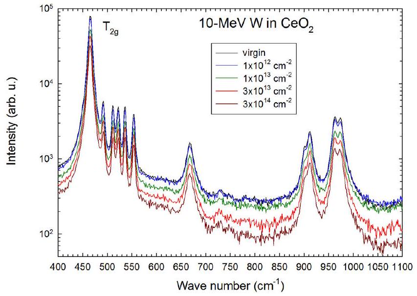
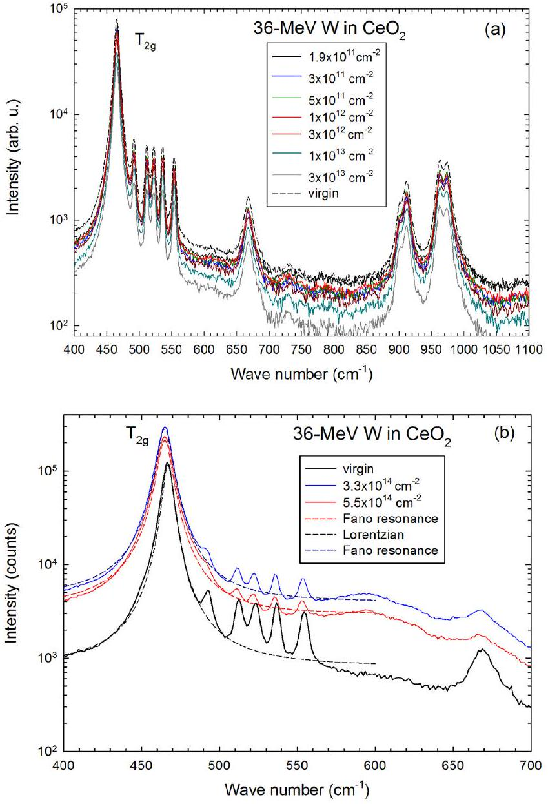
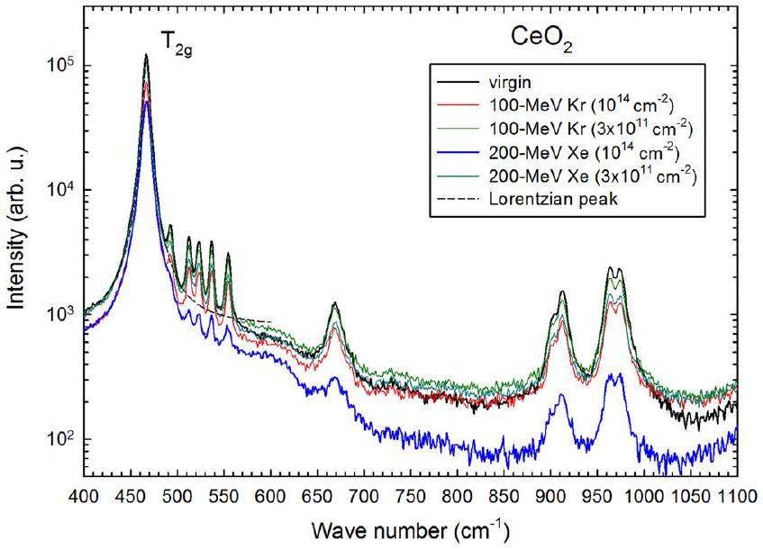
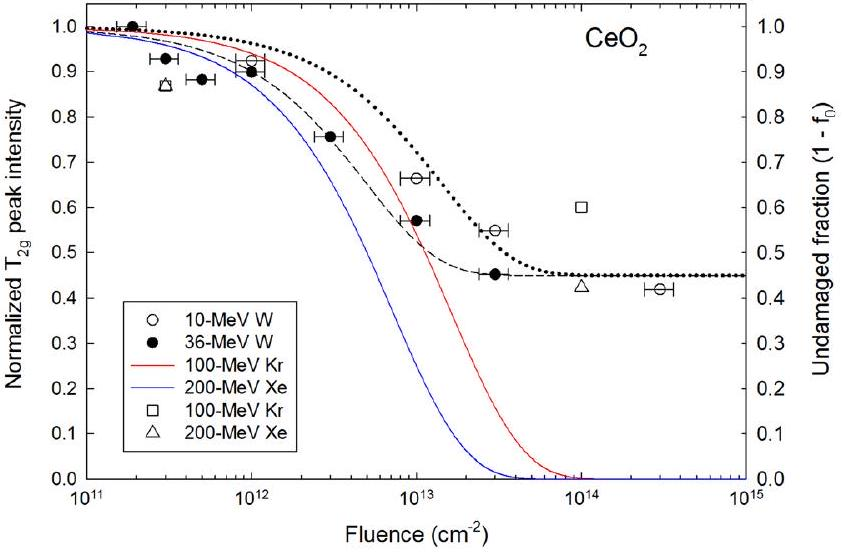
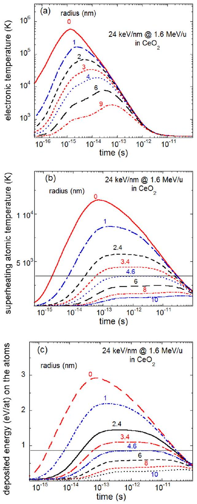
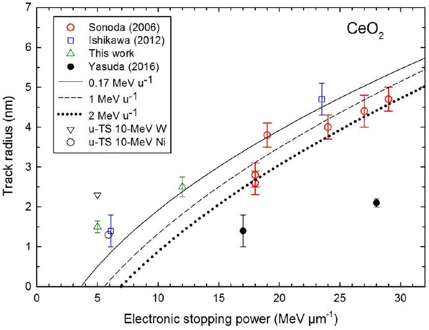
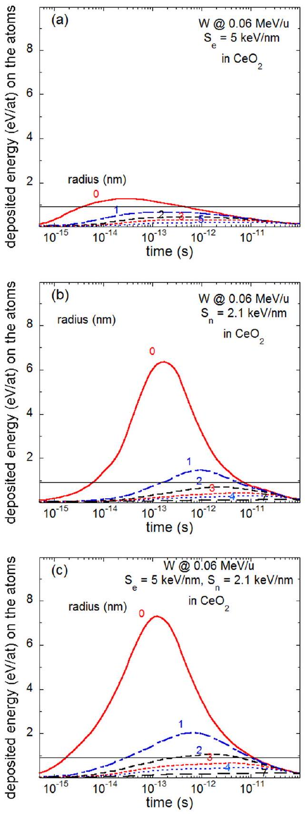

## Journal of Applied Physics

## RESEARCH ARTICLE | NOVEMBER 282017

## Raman spectroscopy study of damage induced in cerium dioxide by swift heavy ion irradiations

Jean-Marc Costantini; Sandrine Miro; Gaëlle Gutierrez; Kazuhiro Yasuda; Seiya Takaki; Norito Ishikawa; Marcel Toulemonde

## Articles You May Be Interested In

Annealing effects on structural and magnetic properties of Co implanted ZnO single crystals
J. Appl. Phys. (April 2011)

# Raman spectroscopy study of damage induced in cerium dioxide by swift heavy ion irradiations 

Jean-Marc Costantini, ${ }^{1, \mathrm{a})}$ Sandrine Miro, ${ }^{1}$ Gaëlle Gutierrez, ${ }^{1}$ Kazuhiro Yasuda, ${ }^{2}$ Seiya Takaki, ${ }^{3}$ Norito Ishikawa, ${ }^{3}$ and Marcel Toulemonde ${ }^{4}$ ${ }^{1}$ DEN, Service de Recherches Métallurgiques Appliquées, CEA, Université Paris-Saclay, F-91191, Gif-sur Yvette Cedex, France ${ }^{2}$ Department of Applied Quantum Physics and Nuclear Engineering, Kyushu University, 744 Motooka, Nishi-ku, Fukuoka 819-0395, Japan ${ }^{3}$ Nuclear Science and Engineering Center, Japan Atomic Energy Agency (JAEA), Shirakata 2-4, Tokai, Ibaraki 319-1195, Japan ${ }^{4}$ CIMAP-GANIL, CEA-CNRS-ENSICAEN, Bd H. Becquerel, 14070 Caen, France

(Received 5 May 2017; accepted 28 October 2017; published online 28 November 2017)

#### Abstract

The damage induced in cerium dioxide by swift heavy ion irradiation was studied by micro-Raman spectroscopy. For this purpose, polycrystalline sintered pellets were irradiated by $100-\mathrm{MeV} \mathrm{Kr}$, $200-\mathrm{MeV} \mathrm{Xe}, 10-\mathrm{MeV}$, and $36-\mathrm{MeV}$ W ions in a wide range of fluence and stopping power (up to $\sim 28 \mathrm{MeV} \mu \mathrm{m}^{-1}$ ). No amorphization of ceria was found whatsoever, as shown by the presence of the peak of Raman-active $\mathrm{T}_{2 \mathrm{~g}}$ mode (centered at $467 \mathrm{~cm}^{-1}$ ) of the cubic fluorite structure for all irradiation conditions. However, a clear decrease of the $\mathrm{T}_{2 \mathrm{~g}}$ mode peak intensity was observed as a function of ion fluence to an asymptotic relative value of about $45 \%$. Similar decays were also observed for satellite peaks and second-order peaks. Track radii deduced from the decay kinetics for the $36-\mathrm{MeV}$ W ion data are in good agreement with previous determinations by X-ray diffraction and reproduced by the inelastic thermal spike model for low ion velocities. However, interaction between the nuclear and electronic stopping powers is needed to describe the decay kinetics of $10-\mathrm{MeV}$ W ion data by the thermal spike process. Moreover, the asymmetrical broadening of the main $\mathrm{T}_{2 \mathrm{~g}}$ peak after irradiation was analyzed with different theoretical models. Published by AIP Publishing. https://doi.org/10.1063/1.5011165

## I. INTRODUCTION

Ceria ( $\mathrm{CeO}_{2-\mathrm{x}}$ ) is generally envisioned as a non-radioactive surrogate of sub-stoichiometric plutonium dioxide $\left(\mathrm{PuO}_{2-\mathrm{x}}\right)$ with the same cubic fluorite $\left(\mathrm{CaF}_{2}\right)$ structure. Besides, it is also widely studied as an important solid oxide fuel cell (SOFC) material due to its high ionic conductivity arising from oxygen deficiency. A review on irradiated ceria was recently published and compared to yttria-stabilized zirconia (YSZ) and urania with the same crystal structure. ${ }^{1}$ All these oxides show a remarkable resistance to irradiation since they cannot be amorphized by either nuclear-collision or electronic-excitation processes. This behavior was supported by molecular dynamics (MD) simulations for fast particles with electronic stopping powers ( $\mathrm{S}_{\mathrm{e}}$ ) up to $1.2 \mathrm{MeV} \mu \mathrm{m}^{-1}$, showing that the deposited thermal energy is quickly dissipated in the lattice. ${ }^{2}$ The radial distribution function after 3.0 ps exhibits a decrease and broadening of peaks, but the crystalline order was kept in a shell of $1-\mathrm{nm}$ radius. MD simulations for higher electronic stopping powers revealed the formation of point defects (for $\mathrm{S}_{\mathrm{e}}=12 \mathrm{MeV} \mu \mathrm{m}^{-1}$ ) and defect clusters (for $\mathrm{S}_{\mathrm{e}}=36 \mathrm{MeV} \mu \mathrm{m}^{-1}$ ) with a strong recombination in the Cesublattice. ${ }^{3}$ Ion track cores were found to be enriched in O and Ce vacancies and the periphery in interstitials.

Several experimental studies were dedicated to the damage by swift heavy ion irradiation of ceria as a means to

[^0]simulate the effect of fission fragments. For this purpose, the authors have mainly used transmission electron microscopy (TEM), ${ }^{4-7}$ high-resolution scanning transmission electron microscopy (STEM), ${ }^{8,9} \mathrm{X}$-ray diffraction (XRD), ${ }^{10-13} \mathrm{X}$-ray absorption spectroscopy (XAS), ${ }^{14}$ and X-ray photoelectron spectroscopy (XPS). ${ }^{15}$ All of these data showed that ceria is not amorphized by heavy ion irradiations for electronic stopping powers ranging between $\sim 4$ and $28 \mathrm{MeV} \mu \mathrm{m}^{-1}$. Moreover, STEM showed that ion tracks are produced with a limited atomic disorder inside the cores with almost no damage on the Ce-sublattice. ${ }^{8,9}$ Moreover, XPS and XAS data provided evidence that $\mathrm{Ce}^{3+}$ ions were produced, ${ }^{14,15}$ in agreement with the magnetic property modifications. ${ }^{12}$ However, electron energy loss spectroscopy (EELS) measurements did not give evidence of any Ce reduction next to the ion tracks. ${ }^{3}$

To best of our knowledge, very few studies were based on Raman spectroscopy except for the paper by Ohhara et al. ${ }^{16}$ Therefore, we have undertaken a study using this technique that already proved instrumental to reveal details on the radiation damage at the level of chemical bonds for amorphizable oxides such as yttrium iron garnet (YIG). ${ }^{17}$ Rich information can be gained by following the evolution of the Raman-active phonon modes upon accumulation of defects and disorder.

The present work reports Raman spectra of ceria after swift heavy ion irradiations in a wide range of stopping power encompassing the alleged threshold for observable

TABLE I. Irradiation parameters of ceria (mass density $=7.215 \mathrm{~g} \mathrm{~cm}^{-3}$ ) for ions at the incident energy E : mean projected range $\left(\mathrm{R}_{\mathrm{p}}\right)$, electronic stopping power $\left(\mathrm{S}_{\mathrm{e}}\right)$, and nuclear stopping power $\left(\mathrm{S}_{\mathrm{n}}\right)$ computed with the SRIM2013 code, ${ }^{18}$ damage cross section $(\sigma)$ and track radius $(\mathrm{R})$ deduced from Raman spectra, and track-core radius ( $\mathrm{R}_{0}$ ) and cross sections ( $\sigma_{0}$ ) deduced from STEM. ${ }^{9}$
| Ion | E (MeV) | $\mathrm{E} / \mathrm{A}\left(\mathrm{MeV} \mathrm{u}^{-1}\right)$ | $\mathrm{R}_{\mathrm{p}}(\mu \mathrm{m})$ | $\mathrm{S}_{\mathrm{e}}\left(\mathrm{MeV} \mu \mathrm{m}^{-1}\right)$ | $\mathrm{S}_{\mathrm{n}}\left(\mathrm{MeV} \mu \mathrm{m}^{-1}\right)$ | $\mathrm{S}_{\mathrm{e}} / \mathrm{S}_{\mathrm{n}}$ | $\sigma\left(\mathrm{cm}^{2}\right)$ | R (nm) | $\mathrm{R}_{0}(\mathrm{~nm})$ | $\sigma_{0}\left(\mathrm{~cm}^{2}\right)$ |
| :--- | :--- | :--- | :--- | :--- | :--- | :--- | :--- | :--- | :--- | :--- |
| ${ }^{183} \mathrm{~W}$ | 10 | 0.054 | 1.3 | 5 | 2.1 | 2.4 | $7 \pm 1.4 \times 10^{-14}$ | $1.5 \pm 0.15$ |  |  |
| ${ }^{183} \mathrm{~W}$ | 36 | 0.2 | 3.8 | 12 | 0.1 | 120 | $2 \pm 0.4 \times 10^{-13}$ | $2.5 \pm 0.25$ |  |  |
| ${ }^{82} \mathrm{Kr}$ | 100 | 1.2 | 9.1 | 17 | 0.064 | 265 |  |  | $1.4 \pm 0.4$ | $6 \times 10^{-14}$ |
| ${ }^{131} \mathrm{Xe}$ | 200 | 1.57 | 11.8 | 27.5 | 0.011 | 2500 |  |  | $2.1 \pm 0.1$ | $1.4 \times 10^{-13}$ |

track formation of $16 \mathrm{MeV} \mu \mathrm{m}^{-1} .^{18}$ The evolution of the main Raman peak was analyzed to provide information on the damage kinetics in a wide range of fluence. Similar trends were found for the various irradiation conditions.

## II. EXPERIMENTAL PROCEDURES

Ceria polycrystalline samples with grain sizes of $\sim 10 \mu \mathrm{~m}$ have been prepared by a sintering process at 1800 K for 12 hours, and then at 1700 K for 4 hours. Irradiations were applied near room temperature (RT) with $10-\mathrm{MeV}$ and $36-\mathrm{MeV}{ }^{183} \mathrm{~W}$ ions at the JANNUS facility (CEA-Saclay, France) up to a fluence of $5.5 \times 10^{14} \mathrm{~cm}^{-2}$, with fluxes of $\sim 10^{10} \mathrm{~cm}^{-2} \mathrm{~s}^{-1}, 100-\mathrm{MeV} { }^{82} \mathrm{Kr}$, and $200-\mathrm{MeV}{ }^{131} \mathrm{Xe}$ ions at the Tokai Tandem accelerator (JAEA, Ibaraki, Japan) up to a fluence of $1 \times 10^{14} \mathrm{~cm}^{-2}$, with fluxes of $\sim 10^{9} \mathrm{~cm}^{-2} \mathrm{~s}^{-1}$. Irradiation parameters computed with the SRIM2007 code ${ }^{19}$ are displayed in Table I. The mean standard deviation on fluences at the JANNUS facility was of $\pm 20 \%$. The effect of the nuclear stopping power $\left(\mathrm{S}_{\mathrm{n}}\right)$ can be overlooked except for $10-\mathrm{MeV}$ W ions with an $\mathrm{S}_{\mathrm{e}} / \mathrm{S}_{\mathrm{n}}$ ratio $=2.4$, quite lower than for $36-\mathrm{MeV}$ W for which $\mathrm{S}_{\mathrm{e}} / \mathrm{S}_{\mathrm{n}}=120$.

Micro-Raman spectra were recorded at RT in a broad wave-number range, between 100 and $2000 \mathrm{~cm}^{-1}$ for virgin and irradiated samples in a backscattering geometry using an Invia Reflex ${ }^{\text {® }}$ Renishaw spectrometer coupled with an Olympus microscope containing an $x-y-z$ stage. On-line measurements were carried out on a single grain for the 10MeV and $36-\mathrm{MeV}$ W ion irradiations only, after beam shut off, whereas off-line measurements were performed for all projectiles on samples irradiated at various fluences. In all cases, the (non-polarized) $532-\mathrm{nm}$ line of a frequencydoubled Nd-YAG laser was focused on a $1 \times 1 \mu \mathrm{~m}^{2}$ spot and collected through a $100 \times$ objective. The laser power was kept below 1 mW to avoid in-beam sample annealing.

## III. RESULTS

A progressive change from ivory to green color was noticed for all irradiated samples. For $\mathrm{O} / \mathrm{Ce}=2.0$, sintered samples should be white in color. The ivory color arises from a slight deviation from oxygen stoichiometry. The same change in color was already observed in sintered and single crystal samples after $2.5-\mathrm{MeV}$ electron irradiation, but not for $1.0-\mathrm{MeV}$, due to color center formation by elastic collisions. ${ }^{20}$

The first-order Raman spectra for the various ions show the same peak of the Raman-allowed $\mathrm{T}_{2 \mathrm{~g}}$ mode of pure ceria centered at $\omega_{0}=467 \mathrm{~cm}^{-1}$ (Figs. 1-3). Other second-order peaks are found at $667,900,912,963$, and $975 \mathrm{~cm}^{-1}$.

Besides, five satellite peaks (at 493, 512, 523, 536, and $554 \mathrm{~cm}^{-1}$ ) with much smaller intensities are also seen close to the first-order main peak. A clear decay of all peaks with fluence was observed for all projectiles in on-line measurements [Figs. 1 and 2(a)]. Off-line measurements [Figs. 2(b) and 3] also show this trend but with a large scattering of data due to the measurements in different grains.

The noticeable downward $\mathrm{T}_{2 \mathrm{~g}}$ peak shifts about $-2 \mathrm{~cm}^{-1}$ were found for $36-\mathrm{MeV}$ W ions at high fluences [Fig. 2(b)], whereas smaller shifts by $-1 \mathrm{~cm}^{-1}$ were noticed for the other ions. Moreover, the Lorentzian shape of the $\mathrm{T}_{2 \mathrm{~g}}$ peak for virgin samples became asymmetrical on the lower wavenumber side after irradiation, whereas the satellite and second-order peaks kept symmetrical shapes.

The $\mathrm{T}_{2 \mathrm{~g}}$ peak intensity normalized by the virgin sample value for on-line $10-\mathrm{MeV}$ and $36-\mathrm{MeV}$ W ion measurements exhibits a decrease as a function of fluence to an asymptotic relative value of $\sim 0.45$, corresponding to a maximum damage fraction of 55\% (Fig. 4). However, when peak intensities were normalized by the total amount of counts in the spectra, only a small decrease was found. This Raman reduced intensity (RRI) was often used as a measurement of the radiationinduced disorder inducing an overall decrease of the scattered intensity, as found for amorphization in the case of silicon carbide. ${ }^{21}$ Off-line measurements for W ion irradiations were not plotted due to a significant scattering of data between different grains. Nonetheless, some data for Kr and Xe ions were also plotted at two fluences only. Besides, a new band was found to grow at $\sim 600 \mathrm{~cm}^{-1}$ for $36-\mathrm{MeV}$ W [Fig. 2(b)], and Kr and Xe ions at the same high fluences (Fig. 3).

FIG. 1. Raman spectra of virgin and $10-\mathrm{MeV}$ W ion-irradiated ceria samples for various ion fluences (on-line measurements).

FIG. 2. Raman spectra of virgin and $36-\mathrm{MeV}$ W ion-irradiated ceria samples for various ion fluences: on-line measurements (a) and off-line measurements (b). The Lorentzian and Fano line shapes are used to fit the $\mathrm{T}_{2 \mathrm{~g}}$ peaks of the virgin and irradiated samples, respectively (dashed lines). The spectrum of the virgin sample in Fig. 2(b) was down-shifted for sake of clarity.

Similar decays of satellite and second-order peaks with fluence were also found for the various ions. These sharp satellite peaks close to the main peak might be assigned to contributions of phonon modes arising from the lattice disorder

FIG. 3. Raman spectra of virgin and Kr and Xe ion-irradiated ceria samples for various ion fluences (off-line measurements). The Lorentzian line shape is used to fit the $\mathrm{T}_{2 \mathrm{~g}}$ peak of the virgin sample (dashed line).

FIG. 4. Normalized $\mathrm{T}_{2 \mathrm{~g}}$ peak intensity for the W ion irradiations (left scale), and undamaged fraction $\left(1-\mathrm{f}_{0}\right)$ for Kr and Xe ion irradiations deduced from STEM ${ }^{8}$ (solid lines, right scale) as a function of fluence. Dashed and dotted lines are fits of W-ion data with Eq. (1) for $36-\mathrm{MeV}$ and $10-\mathrm{MeV}$ energies, respectively.

linked to the native oxygen deficiency. The second-order peaks arise from overtones of the center-of-zone $\mathrm{T}_{2 \mathrm{~g}}$ phonon mode or combinations with other phonon modes in the first Brillouin zone (BZ) like for $\mathrm{ThO}_{2}{ }^{22}$ For example, the first peak at $667 \mathrm{~cm}^{-1}$, for a Raman shift difference from the $\mathrm{T}_{2 \mathrm{~g}}$ peak ( $\Delta \omega_{0}=200 \mathrm{~cm}^{-1}$ ), could be attributed to the combination mode of the $\mathrm{T}_{2 \mathrm{~g}}$ mode with the center-of-zone $\mathrm{T}_{1 \mathrm{u}}$ mode (TO) or with the $\mathrm{A}_{1 \mathrm{u}}$ mode at point L of the BZ ([ $\zeta \zeta \zeta$ ] ] $\Lambda$ axis). ${ }^{23}$ The first doublet peak at 900 and $912 \mathrm{~cm}^{-1}$ might correspond to the center-of-zone $\mathrm{LO}+\mathrm{TO}\left(\mathrm{T}_{1 \mathrm{u}}\right)$ summation mode and the $2 \omega_{0}$ overtone, respectively. Finally, the higherfrequency doublet at 963 and $975 \mathrm{~cm}^{-1}$ might be assigned to combinations with the $\mathrm{E}_{\mathrm{u}}$ and $\mathrm{A}_{1 \mathrm{~g}}$ modes at the L point. ${ }^{23}$

## IV. DISCUSSION

## A. Damage kinetics

The present Raman data show unambiguously that ceria was not amorphized upon swift heavy ion irradiations even for high electronic stopping power values, in agreement with the vast body of literature data, ${ }^{4-9,11-13,16}$ The Raman-active center-of-zone $\mathrm{T}_{2 \mathrm{~g}}$ (or $\mathrm{F}_{2 \mathrm{~g}}$ ) phonon mode of the crystal ${ }^{23}$ was still found in the first-order spectra up to high fluences and high stopping powers (Figs. 2 and 3). The plot of $\mathrm{T}_{2 \mathrm{~g}}$ peak intensities (I) normalized to the virgin sample value ( $\mathrm{I}_{0}$ ) versus fluence $(\phi)$ was analyzed with a decay function (Fig. 4, left scale)

$$
\mathrm{I}=\mathrm{I}_{0}+\left(\mathrm{I}_{\infty}-\mathrm{I}_{0}\right)\left(1-\mathrm{e}^{-\sigma \phi}\right),
$$

where $\mathrm{I}_{\infty}$ is the saturation value, and $\sigma$ stands for the damage cross section. For both W ion energies, $\mathrm{I}_{\infty} / \mathrm{I}_{0}=0.45$, but a larger cross section was found for $36-\mathrm{MeV}$ than for $10-\mathrm{MeV}$, with increasing electronic stopping power (Table I). The few data for Kr and Xe ions are consistent with this evolution although they must be taken with caution due to polycrystalline sample inhomogeneity. Such dependence can be related to the variation of the damage fraction (f) according to the following rate equation:

$$
\mathrm{df} / \mathrm{d} \phi=\sigma \mathrm{f}-\mathrm{S},
$$

where S is a recovery cross section arising from track overlap. This gives

$$
\mathrm{f}=(\mathrm{S} / \sigma)\left(1-\mathrm{e}^{-\sigma \phi}\right)
$$

Equation (1) can be derived by assuming a linear dependence of the intensity on the damage fraction. Damage crosssections and deduced track radii $\mathrm{R}=(\sigma / \pi)^{1 / 2}$ are reported in Table I.

The undamaged fraction $\left(1-f_{0}\right)$ values were calculated from track-core radius $\left(\mathrm{R}_{0}\right)$ determinations by STEM for Kr and Xe ion irradiations ${ }^{9}$ (Fig. 4, right scale) by using Poisson's equation for track overlap without recovery, obtained for $\mathrm{S}=0$ and $\sigma=\sigma_{0}$ in Eq. (2)

$$
\mathrm{f}_{0}=1-\mathrm{e}^{-\sigma_{0} \phi}
$$

where $\sigma_{0}=\pi \mathrm{R}_{0}{ }^{2}$ is the corresponding track-core cross section. Saturation is reached for about the same fluences ( $\sim 10^{14} \mathrm{~cm}^{-2}$ ) as for W ion irradiations, although Eq. (4) yields a zero asymptotic value for a full track-core overlap ( $\mathrm{f}_{0} \rightarrow 1$ ).

## B. Analysis of Raman spectra

The $\mathrm{T}_{2 \mathrm{~g}}$ Raman peaks are showing asymmetrical broadening to lower wave numbers for high fluences. Such behavior was already reported for $200-\mathrm{MeV}$ Au ion irradiation with high electronic stopping power $\left(32 \mathrm{MeV} \mu \mathrm{m}^{-1}\right)$. ${ }^{16}$ Generally speaking, symmetrical inhomogeneous broadening and decrease in intensity are expected for disorder arising from irradiation. ${ }^{24}$ The narrow Lorentzian band shape of oscillators should gradually transform into a broad Gaussian shape as irradiation proceeds. Three kinds of explanations might be used to account for this unusual effect: (i) the Fano resonance effect, (ii) the phonon-confinement effect, and (iii) the formation of oxygen vacancies.

## 1. Fano line shape

The Fano resonance leads to an asymmetrical band shape

$$
\mathrm{I}(\omega)=\mathrm{A} \frac{\left(\mathrm{q}_{\mathrm{F}}+\epsilon\right)^{2}}{\left(1+\epsilon^{2}\right)},
$$

with

$$
\mathrm{A}=\frac{2 \mathrm{p}}{\pi \Gamma_{0}\left(\mathrm{q}_{\mathrm{F}}^{2}+1\right)}
$$

where $\mathrm{p}>0$ is the phonon intensity parameter, $1 / \mathrm{q}_{\mathrm{F}}$ is the Fano coupling parameter, $\varepsilon=2\left(\omega-\omega_{0}\right) / \Gamma_{0}, \omega_{0}$ is the wave number of the uncoupled phonon mode, and $\Gamma_{0}$ is the full width at half maximum (FWHM) of the uncoupled Lorentzian peak. ${ }^{25}$

In the present case, the negative $\mathrm{q}_{\mathrm{F}}$-value for a low wave-number asymmetry corresponds to coupling of an electronic continuum with a discrete phonon energy level that is
degenerate in energy with the continuum. Such a Fano resonance can result from an interference effect between photon scattering from an optical phonon at the center ( $\Gamma$ point) of the first BZ and an electronic continuum. A downward shift and asymmetrical broadening on the low-frequency side of the TO/LO phonon peak were also found for Si nanowires when the laser power was increased. ${ }^{26}$ The phonon confinement effect was discarded in the latter case. In the present case, the laser excitation at photon energy of 2.3 eV is well below the absorption edge at $\sim 3.2 \mathrm{eV}$, ${ }^{20}$ in contrast to semiconductors with lower band-gaps. It is to be noted that this absorption edge was assigned to $2 \mathrm{p} \rightarrow 4 \mathrm{f}$ transitions from oxygen-related valence band states to cerium localized states inside the $2 \mathrm{p}-5 \mathrm{~d}$ band gap ( $\mathrm{E}_{\mathrm{g}} \sim 5.5-6.5 \mathrm{eV}$ ). ${ }^{27}$

Fano resonance also occurred in Raman spectra of ptype GaAs: Zn (with $\mathrm{E}_{\mathrm{g}}=1.42 \mathrm{eV}$ ) due to interference of scattering by the hole continuum and the LO phonon mode. ${ }^{28}$ Electronic excitations of shallow impurity or defect levels are indeed feasible in a disordered material. Actually, we found that $2.5-\mathrm{MeV}$ electron irradiation generates point defects by elastic collisions producing a broad sub band-gap absorption feature. ${ }^{20}$ Therefore, such interpretation cannot be discarded in the present case with swift heavy ions. In contrast, the virgin sample spectrum was very well fit with a symmetrical Lorentzian profile for $\omega_{0}=467 \mathrm{~cm}^{-1}$ and $\Gamma_{0} =6.5 \mathrm{~cm}^{-1}$ corresponding to $1 / \mathrm{q}_{\mathrm{F}} \rightarrow 0$ [Fig. 2(b)]. Fits of the $\mathrm{T}_{2 \mathrm{~g}}$ peaks with Eq. (5) yielded values of parameters for 36MeV W ion. The Fano coupling parameter ( $1 / \mathrm{q}_{\mathrm{F}}$ ) is -0.010 for $3.3 \times 10^{14} \mathrm{~cm}^{-2}$ and-0.017 for $5.0 \times 10^{14} \mathrm{~cm}^{-2}$, with a rather small downshift and broadening ( $\omega_{0}=465 \mathrm{~cm}^{-1}$ and $\Gamma_{0}=9 \mathrm{~cm}^{-1}$ ) for both highest fluences [Fig. 2(b)]. However, much larger peak shifts (up to $-16 \mathrm{~cm}^{-1}$ ) and broadening (by a factor of $\sim 4$ ), and $1 / \mathrm{q}_{\mathrm{F}}$ values varying from -0.06 and -0.12 were observed for Si nanowires with increasing laser power. ${ }^{26}$ In the latter case, the larger $1 / \mathrm{q}_{\mathrm{F}}$ values can be accounted for by a larger free carrier concentration in doped Si .

## 2. Phonon confinement effect

The second interpretation of asymmetrical broadening is based on a phonon-confinement effect in small domains for optical-phonon wavelength about the crystallite size. ${ }^{29,30}$ For this, some conditions are required on the considered phonon dispersion curves. The slope of the curve from the $\Gamma$ point to any first BZ edge must be clearly negative. Such a phonon confinement effect is generally noticeable in nanocrystalline (nc) materials only for grain sizes smaller than about 20 lattice parameters (i.e., $\sim 11 \mathrm{~nm}$ for $\mathrm{CeO}_{2}$ with $\mathrm{a}=0.541 \mathrm{~nm}$ ), and strong negative dispersion of the phonon branch away from the $\Gamma$ point, like for nc- ZnO . ${ }^{29}$ For some materials, like $\mathrm{SrTiO}_{3}$ nano-cubes, the asymmetry could be explained by a phonon-confinement effect only for sizes lower than $5 \mathrm{~nm} .^{31}$ In the present case, phonon-confinement can be possible inside the partly disordered ion tracks produced after irradiation with diameters smaller than 5 nm (Table I). Actually, the asymmetry of the $\mathrm{T}_{2 \mathrm{~g}}$ peak of nanocrystalline ceria thin films already appeared for grain sizes smaller than $\sim 9 \mathrm{~nm} .^{32}$

Calculations indeed showed that the triply degenerate $\mathrm{T}_{2 \mathrm{~g}}$ mode of $\mathrm{CeO}_{2}$ was found to split into doublet (transverse) and singlet (longitudinal) modes along the $\Lambda$-axis ( $[\zeta \zeta \zeta$ ) direction), $\Delta$-axis ( $[00 \zeta]$ direction), and $\Sigma$-axis ( $[0 \zeta \zeta]$ direction). ${ }^{23,33}$ Both split modes have a negative dependence versus wave vector ( q ) along the $\Lambda$-axis, but not for the other directions. The split $\mathrm{E}_{\mathrm{u}}$ mode shows almost no dependence or only a slightly positive dependence on q along the $\Delta$ - and $\Sigma$-axes.

Due to the limited sizes of the crystalline domains, the selection rules for an infinite crystal are not valid any longer, and not only the center-of-zone optical phonon (for $\mathrm{q}=0$ ) will contribute to the Raman spectrum. The spectrum intensity (I) at frequency $\omega$ can be derived from the following equation:

$$
\mathrm{I}(\omega)=\int \frac{C(q)^{2} d^{3} q}{[\omega-\omega(q)]^{2}+\left(\frac{\Gamma_{0}}{2}\right)^{2}},
$$

where $\mathrm{C}(\mathrm{q})$ is the weight factor of phonon modes for $\mathrm{q} \neq 0$ contributing to the spectrum, $\omega(\mathrm{q})$ is the dispersion curve, and $\Gamma_{0}$ is the FWHM of the center-of-zone mode. A Gaussian distribution of modes is often used

$$
C(q)=\exp \left(-\frac{q^{2} L^{2}}{4}\right)
$$

where the phonon wave vector (q) is given in units of $2 \pi / \mathrm{a}$, and L is the size of domains. ${ }^{32,34}$ Such a model was used to fit the $\mathrm{T}_{2 \mathrm{~g}}$ peak shape of nanocrystalline ceria films, for which the correlation-length parameter (L) was introduced as the average size of material homogeneity. ${ }^{32}$ A similar analysis was applied in the case of neutron-irradiated cubic $\beta$-SiC ( 3 C -SiC) also showing a similar asymmetrical broadening but a larger downward shift of the LO phonon peak (up to $\sim-50 \mathrm{~cm}^{-1}$ ), where the L parameter, or diameter of the correlation region, was assigned to the mean distance between defects. ${ }^{34}$ The smaller downward shift of the TO phonon peak (up to $\sim-20 \mathrm{~cm}^{-1}$ ) was instead assigned to strain accumulation, since the phonon dispersion curve in $\beta$-SiC could not quantitatively explain such an effect. The confinement effect on the LO peak became significant only for $\mathrm{L}<5 \mathrm{~nm}$.

## 3. Oxygen vacancy formation

Finally, a third interpretation is based on the formation of oxygen vacancies. Raman spectra of ceria doped with trivalent rare-earth (RE) elements (such as $\mathrm{Gd}^{3+}$ ) showed an extra band at $\sim 570 \mathrm{~cm}^{-1} .^{35}$ Moreover, the $\mathrm{T}_{2 \mathrm{~g}}$ peak also became asymmetrical and shifted to the low wave-number side when the RE concentration increased. In that case, charge compensation vacancies were produced owing to the substitution of $\mathrm{RE}^{3+}$ for $\mathrm{Ce}^{4+}$ ions. Two bands at 545 and $599 \mathrm{~cm}^{-1}$ were also assigned to oxygen vacancies in $\mathrm{Ce}_{1-\mathrm{x}} \mathrm{Nd}_{\mathrm{x}} \mathrm{O}_{2-\delta}$ nanopowders. ${ }^{36}$ However, in the latter case, the asymmetrical shape of the $\mathrm{T}_{2 \mathrm{~g}}$ peak was attributed to a
phonon confinement effect with a contribution of inhomogeneous stress field effect.

An approach based on Green's function techniques was used to treat the effect of substitutional mass disorder on Raman spectra. ${ }^{35}$ These calculations actually showed that the new feature at $570 \mathrm{~cm}^{-1}$ derives from the mixing of the center-of-zone $\mathrm{T}_{2 \mathrm{~g}}$ mode with the uppermost optical phonon density-of-states (DOS) around $600 \mathrm{~cm}^{-1}$. In this phonon frequency range, the total DOS is almost equal to the oxygenprojected contribution. Although no complete match of experimental band intensities was achieved by these calculations, it is liable to assign this extra band to oxygen vacancies. A similar broad band was already reported for $200-$ MeV Au ion irradiation of polycrystalline ceria. ${ }^{16}$ Likewise, an extra band was observed at $\sim 600 \mathrm{~cm}^{-1}$ for $36-\mathrm{MeV}$ W ions and accompanied with $\mathrm{T}_{2 \mathrm{~g}}$ peak shift and asymmetrical broadening [Fig. 3(b)]. Such a broad band with $\mathrm{T}_{2 \mathrm{~g}}$ peak asymmetrical broadening was also found for Kr and Xe ions at the same high fluences (Fig. 4). However, although the above-mentioned calculations yield a low-frequency tail of the main peak, they predict an upward shift by $+1-2 \mathrm{~cm}^{-1}$, whereas we note a similar downward shift instead [Fig. 2(b)], like for the trivalent RE substitutions. ${ }^{35}$ In the latter case, a correction due to the Grüneisen effect was applied to account for such a discrepancy. Oxygen vacancies may be formed in the ion tracks for such high electronic stopping power values, as deduced from STEM studies. ${ }^{8,9}$

In summary, the present analysis cannot give a clear-cut answer for the origin of asymmetrical broadening and downward shift of the $\mathrm{T}_{2 \mathrm{~g}}$ peak which might include different contributions. However, this behavior is a clear signature of the weak disorder accumulated with ion-track overlap in this non-amorphizable solid.

## C. Track description by a transient thermal process

## 1. The thermal spike model

To describe material modifications resulting from ion irradiation, it was suggested that the atomic motion may result from a transient thermal process. ${ }^{37,38}$ With swift heavy ions in the energy range of $\sim 1 \mathrm{MeV} \mathrm{u}^{-1}$ or larger, the dissipation of the ion energy deposited on target electrons is considered in two steps: (i) ions transfer their energy to electrons of the target and this energy is shared among electrons by electron-electron interactions, and finally transferred to the lattice by electron-phonon coupling; (ii) the transferred energy is dissipated among atoms and induces a hightemperature spike along the ion path. This description was coined as the two-temperature model. We rather use the term inelastic thermal spike (i-TS) model, ${ }^{39,40}$ which seems more appropriate to make a distinction with the elastic thermal spike. For low beam energies ( $\sim 1 \mathrm{keV} \mathrm{u}^{-1}$ ), the incident ion deposits directly its energy on target atoms: it is called the elastic collision spike model. ${ }^{38-40}$ The cooperative effect of the two stopping powers ${ }^{41}$ was associated in the unified thermal spike (u-TS) model. ${ }^{41-43}$ Damage creation was assumed to be the result of a rapid quenching of the highly thermally excited atoms in a cylinder. Due to the small volume of the spike zone (a few nm in diameter), extremely high cooling
rates up to $\sim 10^{15} \mathrm{~K} \mathrm{~s}^{-1}$ may be reached. An equilibrated track region is produced in the solid state within $\sim 10^{-11} \mathrm{~s}$.

Over the last years, the thermal-spike model ${ }^{44,45}$ was devised in several steps. ${ }^{37-48}$ The following description will be restricted to insulators. ${ }^{40,43,47,48}$ Calculations are based on time-dependent energy diffusion equations of two coupled systems, one on electrons and the other on atoms, ${ }^{42,49}$ and solved numerically for a cylindrical geometry

$$
\begin{aligned}
& C_{e}\left(T_{e}\right) \frac{\partial T_{e}}{\partial t}=\frac{1}{r} \frac{\partial}{\partial r}\left[r K_{e}\left(T_{e}\right) \frac{\partial T_{e}}{\partial r}\right]-g\left(T_{e}-T_{a}\right)+\mathrm{A}(\mathrm{r}[\nu], \mathrm{t}) \\
& C_{a}\left(T_{a}\right) \frac{\partial T_{a}}{\partial t}=\frac{1}{r} \frac{\partial}{\partial r}\left[r K_{a}\left(T_{a}\right) \frac{\partial T_{a}}{\partial r}\right]+g\left(T_{e}-T_{a}\right)+\mathrm{B}(\mathrm{r}[\nu], \mathrm{t})
\end{aligned}
$$

where $\mathrm{T}_{\mathrm{e}, \mathrm{a}}, \mathrm{C}_{\mathrm{e}, \mathrm{a}}$, and $\mathrm{K}_{\mathrm{e}, \mathrm{a}}$ are the temperatures, specific heats, and thermal conductivities of the electronic (e) and atomic (a) subsystems, respectively. All these parameters are defined at a time t and radius r from the ion axis. $\mathrm{A}(\mathrm{r}[\mathrm{v}], \mathrm{t})$ and $\mathrm{B}(\mathrm{r}[\mathrm{v}], \mathrm{t})$ are the energy inputs into the electronic and atomic subsystems from the electronic and nuclear stopping powers, respectively, for specific ion velocity v .

While the nuclear energy loss directly heats up the atomic subsystem, the energy initially imparted to target electrons diffuses out within the electronic subsystem and gradually transfers to the atomic subsystem via electronphonon coupling. MD simulations have shown that the conversion factor of the electronic excitation energy to the atomic subsystem is $\sim 85 \%$ for $\mathrm{S}_{\mathrm{e}}=36 \mathrm{MeV} \mu \mathrm{m}^{-1} .^{3}$ The two main parameters in the model are (i) the energy necessary to achieve a melt phase ( $\mathrm{E}_{\mathrm{m}}$ ), which is equal to the energy to reach the melting temperature from the temperature of irradiation plus the energy to achieve the solid-liquid transformation, ${ }^{40,43}$ and (ii) the electron-phonon coupling parameter (g) represented by an average adjustable parameter, $\lambda \sim \mathrm{D}_{\mathrm{e}}\left(\mathrm{T}_{\mathrm{e}}\right) \mathrm{C}_{\mathrm{e}}\left(\mathrm{T}_{\mathrm{e}}\right) / \mathrm{g}$, which is approximately equal to $2 / \mathrm{g}$ in insulators ${ }^{37,40,47}$ and scaled with $\mathrm{E}_{\mathrm{g}} .^{40,47,48}$ The damage will result from the quenching of a molten phase.

Due to the high heating rate of atoms ( $\sim 10^{16}-10^{17} \mathrm{~K} \mathrm{s}^{-1}$ ), the equilibrium melting temperature $\mathrm{T}_{\mathrm{m}}$ is not the adequate parameter to characterize the melting process. This was experimentally observed in femtosecond laser experiments: ${ }^{49}$ the measured increase of temperature versus the laser power input does not stop at $\mathrm{T}_{\mathrm{m}}$, but continues to increase above $\mathrm{T}_{\mathrm{m}}$. Rethfeld et al. ${ }^{50}$ calculated that the temperature allowing the nucleation of a molten phase is larger than $\mathrm{T}_{\mathrm{m}}$ when the heating rate is $\sim 10^{15} \mathrm{~K} \mathrm{~s}^{-1}$. Therefore, the numerical solutions of Eqs. (1) and (2) were performed in the frame of a superheating scenario, i.e., the atomic temperature increase does not stop at the melting temperature. However, the energy $\mathrm{E}_{\mathrm{m}}$ to reach the molten phase is unknown for $\mathrm{CeO}_{2}$ : for $\mathrm{T}_{\mathrm{m}}=2670 \mathrm{~K}$, the latent heat could not be measured experimentally and needed to be determined by fitting the measured track size, as was done for GeS . ${ }^{46}$ However, it is to be noted that the concept of a thermodynamic temperature is not applicable for times shorter than $10^{-13} \mathrm{~s}$. Fast quenching of a molten crystalline solid may
result in the formation of an amorphous phase for garnets or $\mathrm{SiO}_{2}$ quartz with partly covalent bonds, ${ }^{47}$ or of a crystalline phase for ionic $\mathrm{CaF}_{2} .{ }^{51} \mathrm{~A}$ general trend was found for various materials in dependence with the ionicity of bonding. ${ }^{52}$

Such an oversimplified modelling based on specific approximations must be considered as a phenomenological approach used to fit the experimental track radius as a function of $\mathrm{S}_{\mathrm{e}}$. In the case of non-amorphizable materials like ceria, this model can be applied as for $\mathrm{CaF}_{2}$ an ionic material. A first detailed approach for this material using several physical characterizations ${ }^{51,53}$ was performed, leading to a comprehensive description of the process of track formation by the inelastic thermal spike model.

## 2. The inelastic thermal spike model

For swift heavy ions, $\mathrm{B}(\mathrm{r}[\mathrm{v}], \mathrm{t})$ is much smaller than $\mathrm{A}(\mathrm{r}[\mathrm{v}], \mathrm{t})$. If $\mathrm{B}(\mathrm{r}[\mathrm{v}], \mathrm{t})$ is neglected, the thermal spike model is called the inelastic thermal spike model (i-TS model) that was applied to insulators. ${ }^{40} \mathrm{~A}(\mathrm{r}[\mathrm{v}], \mathrm{t})$ is calculated by Monte Carlo simulations. ${ }^{54}$ The core part of the energy is deposited on the electrons within $\sim 3 \times 10^{-15} \mathrm{~s}$ in a cylinder radius of around 5 nm and is immediately thermalized on the electrons. This initial energy distribution is well described by an analytical formula deduced from MC calculations. ${ }^{55}$ Moreover, Daraszewicz et al. have shown that $66 \%$ of the carrier concentration is relaxed in a time of $4 \times 10^{-15} \mathrm{~s} .^{56}$

The integration of $\mathrm{A}(\mathrm{r}, \mathrm{v}, \mathrm{t})$ over time and space coordinates gives the electronic stopping power. ${ }^{54}$ In the following, we first calculated the track radii for monoatomic swift heavy ions on the basis of the i-TS model. The thermodynamic parameters involved for the electronic subsystem were previously defined. ${ }^{40}$ For the atomic subsystem, the mass density is $7.2 \mathrm{~g} \mathrm{~cm}^{-3}$, the specific heat ( $0.44 \mathrm{~J} \mathrm{~g}^{-1} \mathrm{~K}^{-1}$ ) was deduced from the Dulong-Petit law, and the atomic thermal diffusivity decreases versus temperature: it is equal to $0.07 \mathrm{~J} \mathrm{~cm}^{-1} \mathrm{~K}^{-1} \mathrm{~s}^{-1}$ at $300 \mathrm{~K} .^{57}$ The band gap corresponding to the energy difference between the 2 p and 5 d bands is equal to 6 eV , which results into an adjustable parameter value $\lambda=4.5 \mathrm{~nm}$ on an empirical basis. ${ }^{47,48}$ The unknown energy necessary to make the solid-liquid phase change was determined by fitting the measured track radii, ${ }^{47}$ as reported by Sonoda et al. ${ }^{4}$

Results of calculations are displayed in Fig. 5, where the electronic temperature [Fig. 5(a)], atomic temperature [Fig. 5(b)], and deposited energy on atoms [Fig. 5(c)] are plotted for different radii from the ion axis versus time for $210-\mathrm{MeV}$ Xe ion irradiation. ${ }^{4}$ Within the superheating scenario, the evolution of atomic temperature $\mathrm{T}_{\mathrm{a}}(\mathrm{r}, \mathrm{t})$ is plotted versus time [Fig. 5(b)]: it increase up to a maximum of 12000 K without stopping at $\mathrm{T}_{\mathrm{m}}$ equal to 2670 K . In that case, the track radius ( 4.6 nm ) was reached above an atomic temperature of 3490 K , i.e., 1380 K above the melting temperature. The energy deposited on atoms is deduced from the equation: $\mathrm{E}_{\mathrm{a}}(\mathrm{r}, \mathrm{t}) \sim \int_{0}^{\mathrm{T}_{\mathrm{a}}(\mathrm{r}, \mathrm{t})} \mathrm{C}_{\mathrm{a}}\left(\mathrm{T}_{\mathrm{a}}(\mathrm{r}, \mathrm{t})\right) \mathrm{dT}_{\mathrm{a}}$, where $\mathrm{C}_{\mathrm{a}}\left(\mathrm{T}_{\mathrm{a}}(\mathrm{r}, \mathrm{t})\right.$ is the lattice specific heat at $T_{a}(r, t)$. The evolution of $E_{a}(r, t)$ versus time $t$ is plotted in Fig. 5(c) for different radii $r$. The initial condition of calculations is for an irradiation temperature of 300 K , corresponding to an internal energy of $\mathrm{E}_{\mathrm{a}}(\mathrm{r}, 0)$

FIG. 5. i-TS calculations for $\mathrm{CeO}_{2}$ : electronic temperature (a), superheating atomic temperature (b), and deposited energy on atoms versus time (c) for the irradiation condition quoted in the plots. For a radius of 4.6 nm (Refs. 4 and 5), the energy deposited on atoms is equal to 0.9 eV at ${ }^{-1}$ (c) leading to a superheating melting temperature of 3490 K (b).

$=0.038 \mathrm{eV} \mathrm{at}^{-1}$. For a track radius of 4.6 nm [Fig. 5(c)], the energy $\mathrm{E}_{\mathrm{m}}$ to create a track is $0.87 \pm 0.10 \mathrm{eV}$ at ${ }^{-1}$. Renewing the calculations for other track radii, as measured by Sonoda et al. ${ }^{4}$ for Xe ion irradiations, the deduced mean value of $\mathrm{E}_{\mathrm{m}}$ is $0.90 \pm 0.06 \mathrm{eV}$ at ${ }^{-1}$. The solid-liquid phase transition energy is $0.28 \pm 0.06 \mathrm{eV}$ at ${ }^{-1}$, since the energy to reach the melting temperature is 0.62 eV at ${ }^{-1}$. This corresponds to the solid-liquid phase transition energy of $470 \mathrm{~J} \mathrm{~g}^{-1}$ for $\mathrm{CeO}_{2}$.

Calculations for three different beam energies (0.17, 1.0 , and $2.0 \mathrm{MeV} \mathrm{u}^{-1}$ ) and the deduced radii versus electronic stopping power are plotted in Fig. 6. The latter values agree quite well with predictions of the i-TS model. For a

FIG. 6. Experimental radii versus electronic energy loss from Sonoda et al., ${ }^{4,5}$ Ishikawa et al., ${ }^{11}$ Yasuda et al., ${ }^{8,9}$ and the present work. The lines are i-TS calculations for the three different beam energies of $0.17,1.0$, and 2.0 MeV $\mathrm{u}^{-1}$. Open triangles and open circles are u -TS calculations combining the electronic and nuclear energy losses for $10-\mathrm{MeV} \mathrm{W}$ and $10-\mathrm{MeV} \mathrm{Ni}$ ions.

stopping power of $\mathrm{S}_{\mathrm{e}} \sim 5.5 \mathrm{MeV} \mu \mathrm{m}^{-1}$, the calculated track size is $\sim 0.6 \mathrm{~nm}$, which is smaller than the one reported for $0.17 \mathrm{MeV} \mathrm{u}^{-1} \mathrm{Ni}\left(\mathrm{S}_{\mathrm{e}}=5.9 \mathrm{MeV} \mu \mathrm{m}^{-1}\right)$ and for 0.06 MeV $\mathrm{u}^{-1} \mathrm{~W}$ ions $\left(\mathrm{S}_{\mathrm{e}}=5 \mathrm{MeV} \mu \mathrm{m}^{-1}\right)$. It is striking to note that the track size obtained by conventional TEM ${ }^{58}$ and high resolution STEM ${ }^{8,59}$ gives track radii lower by a factor $\sim 2$ than the track size by Sonoda et al. ${ }^{4}$ (Fig. 6). This is presumably due to differences in electron-beam focusing condition and imaging technique, which means that the present analysis represents a larger shell of damage region than the track core, like the XRD data. The strained defective outer shells (track-halos) may contribute to these measurements, even though no amorphous track cores are produced in the case of ceria, unlike for YIG. ${ }^{17}$ This is consistent with the MD simulations finding accumulation of interstitials around the track cores. ${ }^{3}$ Anyway, the present results suggest a shift of the threshold for track-formation to $\sim 4 \mathrm{MeV} \mu \mathrm{m}^{-1}$ for ions in the $0.1-\mathrm{MeV} \mathrm{u}^{-1}$ energy range, due to the velocity effect ${ }^{60}$ (Fig. 6).

## 3. The unified thermal spike model

In order to explain the large radii at $\sim 5 \mathrm{MeV} \mu \mathrm{m}^{-1}$ for the W and Ni ions of 10 MeV , the unified thermal spike (uTS) model was used, as was done for track radii in a- $\mathrm{SiO}_{2}$, ${ }^{43} \mathrm{Si}_{3} \mathrm{~N}_{4}$, ${ }^{11}$ and the sputtering of Ti . ${ }^{42}$ In this model, the nuclear energy loss has been implemented as $\mathrm{B}(\mathrm{r}, \mathrm{t}, \nu)$, which is the energy deposited directly on atoms at time t and distance r , for an ion velocity $\nu$. This combined interaction may be competitive, cooperative, additive, or synergetic as described in Ref. 41. In the u-TS model, the energy input into the atomic subsystem from the nuclear energy loss is given by

$$
B(r, t, \nu)=b_{n} S_{n} e^{-t / \tau} e^{-r / r(\nu)} / r,
$$

where $\tau$ is the deposition time and $\mathrm{r}(\nu)$ is the effective radius of a cylinder in which the nuclear energy is deposited ${ }^{54}$ for ions of velocity $\nu$. The constant $b_{n}$ is chosen so that the
integration over time and space coordinates yields the total nuclear stopping power $\mathrm{S}_{\mathrm{n}}{ }^{19}$ The parameter $\mathrm{r}(\nu)$ has been assessed by calculating the mean energy deposited on atoms of the target ${ }^{38,60}$ for $10-\mathrm{MeV} \mathrm{Ni}$ and $10-\mathrm{MeV} \mathrm{W}$ ions using a screening cross section for atomic collisions. The mean energies on Ce and O are 2.1 and 0.9 keV , respectively, for the Ni beam, and 8 and 2.75 keV , respectively, for the W beam. Assuming atom ejection normal to the beam direction, $\mathrm{r}(\nu)$ values are 2.7 nm and 2.3 nm for Ce and O with the Ni beam, and 5.2 nm and 5.1 nm for the W beam, respectively. The mean values implemented in the code were 2.5 nm and 5.1 nm for the Ni and W ion irradiations, respectively.

FIG. 7. Deposited energy versus time for: (a) pure electronic energy loss, (b) pure nuclear energy loss, and (c) electronic + nuclear energy losses for the $0.06 \mathrm{MeV} \mathrm{u}^{-1} \mathrm{~W}$ ion beam.

The results corresponding to the $10-\mathrm{MeV}$ W ion irradiation (Fig. 7) represent the evolution of the energy deposited on atoms versus time for three cases: for $\mathrm{S}_{\mathrm{e}}$ only [Fig. 7(a)], for $\mathrm{S}_{\mathrm{n}}$ only [Fig. 7(b)], and for $\left(\mathrm{S}_{\mathrm{e}}+\mathrm{S}_{\mathrm{n}}\right)$ [Fig. 7(c)]. The molten radius evolves as $0.6,1.7$, and 2.3 nm , respectively. The value deduced from Fig. 7(c) is somewhat larger than the experimental value (Fig. 6). For the $10-\mathrm{MeV} \mathrm{Ni}$ beam, calculations give a molten radius of 0.8 nm for $\mathrm{S}_{\mathrm{e}}, 0.3 \mathrm{~nm}$ for $\mathrm{S}_{\mathrm{n}}$, and 1.3 nm for $\left(\mathrm{S}_{\mathrm{e}}+\mathrm{S}_{\mathrm{n}}\right)$. In the last two cases of irradiation with W and Ni ions, the interaction seems to be nearly additive. ${ }^{41,61}$ The last value of the molten radius is quite in agreement with the measured estimation by Ishikawa et al. ${ }^{11}$

## V. CONCLUSIONS

Micro-Raman spectroscopy data confirmed that polycrystalline ceria was not amorphized by swift-heavy ion irradiations for electronic stopping powers ranging between 5 and $27.5 \mathrm{MeV} \mu \mathrm{m}^{-1}$. A maximum asymptotic value of the damage fraction of about $55 \%$ was found for all projectiles at fluences about $10^{14} \mathrm{~cm}^{-2}$. The track radii deduced from the decrease of the Raman-allowed $\mathrm{T}_{2 \mathrm{~g}}$ peak intensity versus ion fluence are in good agreement with the previous XRD data for low stopping powers. These results are well reproduced by the i-TS model for ions in the $0.1-\mathrm{MeV} \mathrm{u}^{-1}$ velocity range giving a threshold stopping power $\sim 4 \mathrm{MeV} \mu \mathrm{m}^{-1}$ for track formation. The asymmetrical broadening of the $\mathrm{T}_{2 \mathrm{~g}}$ peak (increasing with fluence) is analyzed with different theoretical models taking account of disorder in this nonamorphizable material. The origin of such a broadening is not fully understood.

## ACKNOWLEDGMENTS

The ion irradiations and Raman measurements were carried out at the JANNUS facility under the EMIR program (\#15-0168 SRMP) and at JAEA Tokai tandem accelerator under the Cooperation Priority Research program. This work was also supported by JSPS KAKENHI with a grant number of JP16K06961.

[^1]${ }^{11}$ N. Ishikawa and K. Takegahara, Nucl. Instrum. Methods Phys. Res., Sect. B 272, 227 (2012).
${ }^{12}$ K. Shimizu, S. Kosugi, Y. Tahara, K. Yasunaga, Y. Kaneta, N. Ishikawa, and F. Hori, Nucl. Instrum. Methods Phys. Res., Sect. B 286, 291 (2012).
${ }^{13}$ T. Kishino, K. Shimizu, Y. Saitoh, N. Ishikawa, F. Hori, and A. Iwase, Nucl. Instrum. Methods Phys. Res., Sect. B 314, 191 (2013).
${ }^{14}$ H. Ohno, A. Iwase, D. Matsumura, Y. Nishihata, J. Mizuki, N. Ishikawa, Y. Baba, N. Hirao, T. Sonoda, and M. Kinoshita, Nucl. Instrum. Methods Phys. Res., Sect. B 266, 3013 (2008).
${ }^{15}$ A. Iwase, H. Ohno, N. Ishikawa, Y. Baba, N. Hirao, T. Sonoda, and M. Kinoshita, Nucl. Instrum. Methods Phys. Res., Sect. B 267, 969 (2009).
${ }^{16}$ K. Ohhara, N. Ishikawa, S. Sakai, Y. Matsumoto, O. Michikami, and Y. Ohta, Nucl. Instrum. Methods Phys. Res., Sect. B 267, 973 (2009).
${ }^{17}$ J.-M. Costantini, S. Miro, F. Beuneu, and M. Toulemonde, J. Phys.: Condens. Matter 27, 496001 (2015).
${ }^{18}$ M. Kinoshita et al., Nucl. Instrum. Methods Phys. Res., Sect. B 267, 960 (2009).
${ }^{19}$ J. P. Biersack and L. G. Haggmark, Nucl. Instrum. Methods Phys. Res., Sect. 174, 257 (1980).
${ }^{20}$ J.-M. Costantini, G. Lelong, M. Guillaumet, W. J. Weber, S. Takaki, and K. Yasuda, J. Phys.: Condens. Matter 28, 325901 (2016).
${ }^{21}$ S. Sorieul, J. M. Costantini, L. Gosmain, G. Calas, J. J. Grob, and L. Thome, J. Phys-Condens. Matter 18, 8493 (2006).
${ }^{22}$ M. Ishigame and M. Kojima, J. Phys. Soc. Jpn. 41, 202 (1976).
${ }^{23}$ J. Buckeridge, D. O. Scanlon, A. Walsh, C. R. A. Catlow, and A. A. Soko, Phys. Rev. B 87, 214304 (2013).
${ }^{24}$ M. H. Brodsky and M. Cardona, J. Non-Cryst. Solids 31, 81 (1978).
${ }^{25}$ Z. Li, C. H. Lui, E. Cappelluti, L. Benfatto, K. F. Mak, G. L. Carr, J. Shan, and T. F. Heinz, Phys. Rev Lett. 108, 156801 (2012).
${ }^{26}$ R. Gupta, Q. Xiong, C. K. Adu, U. J. Kim, and P. C. Eklund, Nano Lett. 3, 627 (2003).
${ }^{27}$ S. Guo, H. Atwin, S. N. Jacobsen, K. Järendahl, and U. Helmersson, J. Appl. Phys. 77, 5369 (1995).
${ }^{28}$ G. Irmer, M. Wenzel, and J. Monecke, in The Physics of Semiconductors, edited by M. Schefler and R. Zimmermann (World scientific, Singapore, 1996), vol. 1, p. 217.
${ }^{29}$ A. K. Arora, M. Rajalakshmi, T. R. Ravindran, and V. Sivasubramanian, J. Raman Spectrosc. 38, 604 (2007).
${ }^{30}$ D. Georgescu, L. Baia, O. Ersen, M. Baia, and S. Simon, J. Raman Spectrosc. 43, 876 (2012).
${ }^{31}$ S. Banerjee, D.-I. Kim, R. D. Robinson, I. P. Hermana, Y. Mao, and S. S. Wong, Appl. Phys. Lett. 89, 223130 (2006).
${ }^{32}$ I. Kosacki, V. Petrovsky, H. U. Anderson, and P. Colomban, J. Am. Ceram. Soc. 85, 2646 (2002).
${ }^{33}$ K. Clausen, W. Hayes, J. E. McDonald, R. Osborn, P. E. Schanbel, M. T. Hutchings, and A. Magerl, J. Chem. Soc. Faraday Trans. 83, 1109 (1987).
${ }^{34}$ T. Koyanagi, M. J. Lance, and Y. Katoh, Scr. Mater. 125, 58 (2016).
${ }^{35}$ R. McBride, K. C. Hass, B. D. Poindexter, and W. H. Weber, J. Appl. Phys. 76, 2435 (1994).
${ }^{36}$ Z. D. Dohčević-Mitrović, M. J. Šćepanović, M. U. Grujić-Brojčin, Z. V. Popović, S. B. Bošković, B. M. Matović, M. V. Zinkevich, and F. Aldinger, Solid State Commun. 137, 387 (2006).
${ }^{37}$ C. Dufour and M. Toulemonde, in Ion Beam Modification of Solids, edited by W. Wesch and E. Wendler (Springer International Publishing, 2016), vol. 61, p. 63.
${ }^{38}$ P. Sigmund and C. Claussen, J. Appl. Phys. 52, 990 (1981).
${ }^{39}$ C. Dufour, A. Audouard, F. Beuneu, J. Dural, J. P. Girard, A. Hairie, M. Levalois, E. Paumier, and M. Toulemonde, J. Phys.: Condens. Matter 5, 4573 (1993).
${ }^{40}$ M. Toulemonde, C. Dufour, A. Meftah, and E. Paumier, Nucl. Instrum. Methods Phys. Res., Sect. B 166/167, 903 (2000).
${ }^{41}$ M. Toulemonde, W. Assmann, Y. Zhang, M. Backman, W. J. Weber, C. Dufour, and Z. G. Wang, Procedia Mater. Sci. 7, 272 (2014).
${ }^{42}$ H. D. Mieskes, W. Assmann, F. Gruener, H. Kucal, Z. G. Wang, and M. Toulemonde, Phys. Rev. B 67, 155414 (2003).
${ }^{43}$ M. Toulemonde, W. J. Weber, G. Li, V. Shutthanandan, P. Kluth, T. Yang, Y. Wang, and Y. Zhang, Phys. Rev. B 83, 054106 (2011).
${ }^{44}$ I. M. Lifshitz, M. I. Kaganov, and L. V. Tanartarov, J. Nucl. Energy, Part A 12, 69 (1960).
${ }^{45}$ C. Dufour, B. Lesellier de Chezelles, V. Delignon, M. Toulemonde, and E. Paumier, in Proceedings of On Chemical and Physical Modifications Induced by Irradiation in Glasses,edited by P. Mazzoldi (E-MRS Strasbourg, 1992), p. 61.
${ }^{46}$ M. Toulemonde, C. Trautmann, E. Balanzat, K. Hjort, and A. Weidinger, Nucl. Instrum. Methods Phys. Res., Sect. B 216, 1 (2004).
${ }^{47}$ A. Meftah, J. M. Costantini, N. Khalfaoui, S. Boudjadar, J. P. Stoquert, F. Studer, and M. Toulemonde, Nucl. Instrum. Methods Phys. Res., Sect. B 237, 563 (2005).
${ }^{48}$ M. Toulemonde, W. Assmann, C. Dufour, A. Meftah, F. Studer, and C. Trautmann, Mat. Fys. Medd. 52, 263 (2006).
${ }^{49}$ P. Hermes, B. Danielzik, N. Fabricius, D. von der Linde, J. Luhl, Y. Heppner, B. Stritzker, and A. Pospieszczyk, Appl. Phys. A 39, 9 (1986).
${ }^{50}$ B. Rethfeld, K. Sokolowski-Tinten, D. von der Linde, and S. I. Anisimov, Phys. Rev. B 65, 092103 (2002).
${ }^{51}$ M. Toulemonde, A. Benyagoub, C. Trautmann, N. Khalfaoui, M. Boccanfuso, C. Dufour, F. Gourbilleau, J. J. Grob, J. P. Stoquert, J. M. Costantini, F. Haas, E. Jacquet, K.-O. Voss, and A. Meftah, Phys. Rev. B 85, 054112 (2012).
${ }^{52}$ H. M. Naguib and R. Kelly, Radiat. Eff. 25, 1 (1975).
${ }^{53}$ N. Ishikawa, T. Taguchi, and N. Okubo, Nanotechnology 28, 445708 (2017).
${ }^{54}$ B. Gervais and S. Bouffard, Nucl. Instrum. Methods Phys. Res., Sect. B 88, 355 (1994).
${ }^{55}$ C. Zhang, D. E. Dunn, and R. Katz, Radiat. Prot. Dosim. 13, 215 (1985).
${ }^{56}$ S. L. Daraszewicz and D. M. Duffy, Nucl. Instrum. Methods Phys. Res., Sect. B 303, 112 (2013).
${ }^{57}$ A. T. Nelson, D. R. Rittman, J. T. White, J. T. Dunwoody, M. Kato, and K. J. McClellan, J. Amer. Cer. Soc. 97, 3652 (2014).
${ }^{58}$ T. Kitayama, Y. Morita, K. Nakajima, K. Narumi, Y. Saitoh, M. Matsuda, M. Sataka, M. Tsujimoto, S. Isoda, M. Toulemonde, and K. Kimura, Nucl. Instrum. Methods Phys. Res., Sect. B 356/357, 22 (2015).
${ }^{59}$ K. Yasuda, T. Nagaishi, S. Takaki, S. Yoshioka, N. Ishikawa, S. Matsumura, and J.-M. Costantini, "Role of electronic stopping on the structure and accumulation of ion tracks in ceria" (unpublished).
${ }^{60}$ A. Meftah, F. Brisard, J. M. Costantini, M. Hage-Ali, J. P. Stoquert, F. Studer, and M. Toulemonde, Phys. Rev. B 48, 920 (1993).
${ }^{61}$ M. Backman, F. Djurabekova, O. H. Pakarinen, K. Nordlund, Y. Zhang, M. Toulemonde, and W. J. Weber, J. Phys. D: Appl. Phys. 45, 505305 (2012).

[^0]:    ${ }^{\text {a) }}$ Author to whom correspondence should be addressed: jean-marc.costantini@ cea.fr

[^1]:    ${ }^{1}$ J.-M. Costantini, F. Beuneu, and W. J. Weber, "Radiation damage in cubic-stabilized zirconia and ceria," in Properties of Fluorite Structure Materials, edited by P. Vajda and J. M. Costantini (Nova Science Publishers, New York, 2013), Chap. 5.
    ${ }^{2}$ Y. Sasajima, N. Ajima, T. Osada, N. Ishikawa, and A. Iwase, Nucl. Instrum. Methods Phys. Res., Sect. B 314, 202 (2013).
    ${ }^{3}$ C. A. Yablinsky, R. Devanathan, J. Pakarinen, J. Gan, D. Severin, C. Trautmann, and T. R. Allen, J. Mater. Res. 30, 1473 (2015).
    ${ }^{4}$ T. Sonoda, M. Kinoshita, Y. Chimi, N. Ishikawa, M. Sataka, N. Okubo, A. Iwase, and K. Yasunaga, Nucl. Instrum. Methods Phys. Res., Sect. B 266, 2882 (2008).
    ${ }^{5}$ T. Sonoda, M. Kinoshita, N. Ishikawa, M. Sataka, Y. Chimi, and A. Iwase, Nucl. Instrum. Methods Phys. Res., Sect. B 250, 254 (2006).
    ${ }^{6}$ W. Y. Chen, J. Wen, M. A. Kirk, Y. Miao, B. Ye, B. R. Kleinfeldt, A. J. Oaks, and J. F. Stubbins, Philos. Mag. 93, 4569 (2013).
    ${ }^{7}$ K. Yasuda, M. Etoh, K. Sawada, T. Yamamoto, K. Yasunaga, S. Matsumura, and N. Ishikawa, Nucl. Instrum. Methods Phys. Res., Sect. B 314, 185 (2013).
    ${ }^{8}$ S. Takaki, K. Yasuda, T. Yamamoto, S. Matsumura, and N. Ishikawa, Nucl. Instrum. Methods Phys. Res., Sect. B 326, 140 (2014).
    ${ }^{9}$ S. Takaki, K. Yasuda, T. Yamamoto, S. Matsumura, and N. Ishikawa, Prog. Nucl. Energy 92, 306 (2016).
    ${ }^{10}$ N. Ishikawa, Y. Chimi, O. Michikami, Y. Ohta, K. Ohhara, M. Lang, and R. Neumann, Nucl. Instrum. Methods Phys. Res., Sect. B 266, 3033 (2008).

