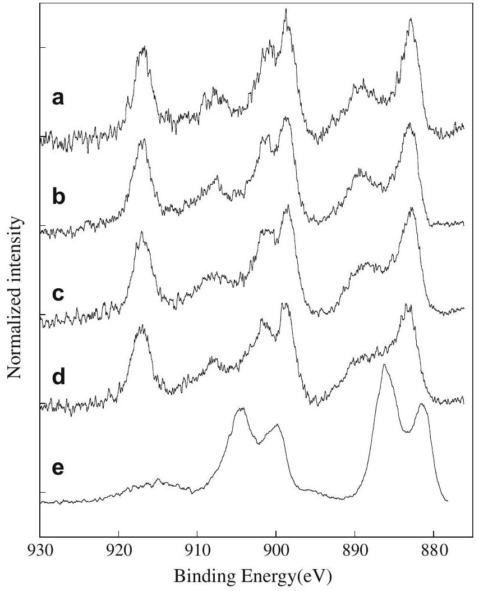
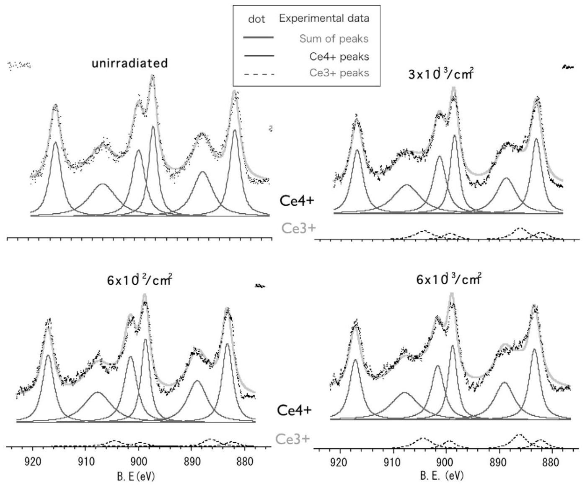
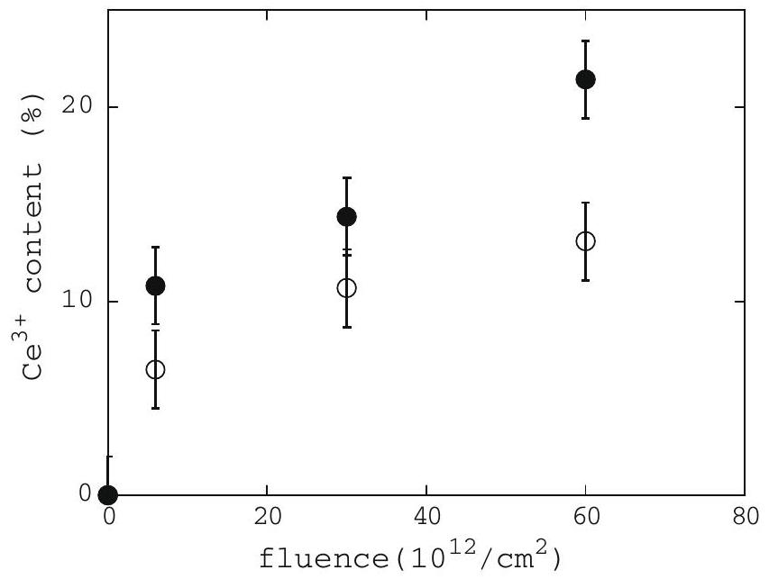

# Study on the behavior of oxygen atoms in swift heavy ion irradiated $\mathrm{CeO}_{2}$ by means of synchrotron radiation X-ray photoelectron spectroscopy 

A. Iwase ${ }^{\mathrm{a}, *}$, H. Ohno ${ }^{\mathrm{a}}$, N. Ishikawa ${ }^{\mathrm{b}}$, Y. Baba ${ }^{\mathrm{b}}$, N. Hirao ${ }^{\mathrm{b}}$, T. Sonoda ${ }^{\mathrm{c}}$, M. Kinoshita ${ }^{\mathrm{c}}$ ${ }^{\mathrm{a}}$ Department of Materials Science, Osaka Prefecture University, Gakuen-cho, Sakai, Osaka 599-8531, Japan ${ }^{\mathrm{b}}$ Japan Atomic Energy Agency (JAEA-Tokai), Tokai, Ibaraki 319-1195, Japan ${ }^{\mathrm{c}}$ Central Research Institute of Electric Power Industry, Komae, Tokyo 201-8511, Japan

## ARTICLE INFO

Available online 11 February 2009

PACS:
61.80.Jh
61.82.Ms

Keywords:
$\mathrm{CeO}_{2}$
Swift heavy ion irradiation
XPS measurements
Ce valence state
Oxygen atom displacements
Electronic excitation effect

#### Abstract

To study the effects of swift heavy ion irradiation on cerium dioxide ( $\mathrm{CeO}_{2}$ ), $\mathrm{CeO}_{2}$ sintered pellets were irradiated with 200 MeV Xe ions at room temperature. For irradiated and unirradiated samples, the spectra of X-ray photoelectron spectroscopy (XPS) were measured. XPS spectra for the irradiated samples show that the valence state of Ce atoms partly changes from +4 to +3 . The amount of $\mathrm{Ce}^{3+}$ state was quantitatively obtained as a function of ion-fluence. The relative amount of oxygen atom displacements, which are accompanied by the decrease in Ce valence state, is $3-5 \%$. This value is too large to be explained in terms of elastic interactions between $\mathrm{CeO}_{2}$ and 200 MeV ions. The experimental result suggests the contribution of 200 MeV Xe induced electronic excitation to the displacements of oxygen atoms.

© 2009 Elsevier B.V. All rights reserved.

## 1. Introduction

Recently, to study the effects of high energy fission products on light water nuclear fuels ( $\mathrm{UO}_{2}$ ), cerium dioxide ( $\mathrm{CeO}_{2}$ ) has been used as a simulation material and irradiation experiments using high energy ion accelerators have been performed [1-3]. In our previous report, we showed that swift heavy ion irradiation induced a large amount of oxygen atom displacements from their regular sites, not only at the surface but also inside the samples [4]. Through the synchrotron radiation X-ray spectroscopy measurements, this irradiation effect was observed as a decrease in Ce valence state and that in $\mathrm{Ce}-\mathrm{O}$ coordination number. Displacements of oxygen atoms and the their clustering by high energy ion irradiation is an important process for understanding the interaction between $\mathrm{CeO}_{2}$ (and also $\mathrm{UO}_{2}$ nuclear fuels) and high energy fission products. In this paper, we report the dependence of the amount of $\mathrm{Ce}^{3+}$ and $\mathrm{Ce}^{4+}$ states on the fluence of 200 MeV Xe ions, which has been obtained by the curve fitting of the XPS spectra for Ce-3d state. Then, we discuss the oxygen atom displacements by the irradiation in terms of elastic interaction and electronic excitation processes.

[^0]
## 2. Experimental procedure

Specimens in this study were $\mathrm{CeO}_{2}$ bulk pellets which were prepared by sintering $\mathrm{CeO}_{2}$ powder at $1400^{\circ} \mathrm{C}$. The dimension of the pellets was 8 mm in diameter and 1 mm thick. Details of the sample preparation have been described elsewhere [1]. The samples were irradiated with 200 MeV Xe ions at room temperature by using a high energy ion accelerator at Japan Atomic Energy Agency (JAEA-Tokai). The irradiation fluences were $6 \times 10^{12} / \mathrm{cm}^{2}, 3 \times 10^{13} / \mathrm{cm}^{2}$ and $6 \times 10^{13} / \mathrm{cm}^{2}$.

X-ray photoelectron spectra (XPS) for the ion irradiated $\mathrm{CeO}_{2}$ pellets and unirradiated one were acquired at room temperature at the end of the station of the 27 A beam line in the Photon Factory at High Energy Accelerator Research Organization (KEK-PF). The monochromatized photon energy for the measurements was just 2200.0 eV . The energy resolution of the X-rays near 2200 eV was 0.1 eV . The binding energy, $E_{\mathrm{B}}$, was normalized by Au $4 \mathrm{f}_{7 / 2}$ photoelectron peak ( $E_{\mathrm{B}}=84.0 \mathrm{eV}$ ) from metallic gold. After the XPS measurements, to remove a few layers at the surface and to obtain the spectra corresponding to a bulk state, the samples were slightly sputtered with $3 \mathrm{keV} \mathrm{Ar}^{+}$ions using a penning source which was installed in a high-vacuum chamber for XPS measurements. After the sputtering, XPS spectra were measured again without exposing the sputtered samples to air. Finally, the reference XPS spectra corresponding to $\mathrm{Ce}^{3+}$ valence state was obtained from a $\mathrm{CeO}_{2}$ pellet,
which was heavily sputtered by $3 \mathrm{keV} \mathrm{Ar}^{+}$ions with a high current $(10 \mu \mathrm{~A})$ for ca. 2 h .

## 3. Results and discussion

The XPS spectrum of (a) in Fig. 1 shows the typical Ce-3d XPS spectrum for $\mathrm{Ce}^{4+}$ valence state, which is obtained from an unirradiated $\mathrm{CeO}_{2}$ pellet. In usual elements, we find only two XPS peaks corresponding to $3 \mathrm{~d}_{3 / 2}$ and $3 \mathrm{~d}_{5 / 2}$ levels. In the case of Ce element, six peaks can be observed due to multielectron interaction [5]. The spectrum (e) in Fig. 1 shows the Ce-3d XPS spectra measured for $\mathrm{CeO}_{2}$ pellet heavily sputtered in situ with 3 keV Ar ions. It is known that under such a severe irradiation with low energy ions, Ce atoms in $\mathrm{CeO}_{2}$ are reduced and the valence state of most Ce atoms changes from $4^{+}$to $3^{+}$[6]. We therefore adopt the spectrum (e) in Fig. 1 as the Ce-3d reference spectrum for $\mathrm{Ce}^{3+}$ valence state.

Fig. 1 also shows the ion-fluence variation of Ce-3d XPS spectra for $\mathrm{CeO}_{2}$ pellets irradiated with 200 MeV Xe ions. The spectra except for the fluence of $3 \times 10^{13} / \mathrm{cm}^{2}$ have already been reported [4]. With increasing the ion-fluence, the intensity of the peaks around 917, 907 and 889 eV , which correspond to $\mathrm{Ce}^{4+}$ state decrease and those around 904 and 886 eV increase gradually. This result implies that in the irradiated samples, both $\mathrm{Ce}^{4+}$ and $\mathrm{Ce}^{3+}$ oxidation states coexist and the amount of $\mathrm{Ce}^{3+}$ state increases by the irradiation.

To discuss the change in Ce valence state more quantitatively, the data reduction of measured XPS Ce-3d spectra has been performed by the symmetric Gaussian-Lorentzian function curve fitting using six peak components of $\mathrm{Ce}^{4+}$ reference spectrum

Fig. 1. Ion-fluence variation of $\mathrm{Ce}-3 \mathrm{~d}$ XPS spectra for $\mathrm{CeO}_{2}$ pellets irradiated with 200 MeV Xe ions; (b) $6 \times 10^{12} / \mathrm{cm}^{2}$, (c) $3 \times 10^{13} / \mathrm{cm}^{2}$, (d) $6 \times 10^{13} / \mathrm{cm}^{2}$. The spectrum for unirradiated $\mathrm{CeO}_{2}$ (a) (reference spectrum for $\mathrm{Ce}^{4+}$ ) and that for heavily sputtered $\mathrm{CeO}_{2}(\mathrm{e})$ (reference spectrum for $\mathrm{Ce}^{3+}$ ) are also plotted.

(spectrum (a) in Fig. 1) and four peak components of $\mathrm{Ce}^{3+}$ reference spectrum (spectrum (e) in Fig. 1). The details of the data analysis are as follows. Before the curve fitting, an appropriate background was subtracted from the original XPS spectra. For each peak of $\mathrm{Ce}^{4+}$ reference spectrum, we determined the peak position, the peak width, the fraction of Lorentzian, and the relative intensity by using these values as fitting parameters. The parameters for each peak of $\mathrm{Ce}^{3+}$ reference spectrum were also determined by the same procedure. Then, by using these parameters and the ratio of the intensities for $\mathrm{Ce}^{4+}$ spectrum and $\mathrm{Ce}^{3+}$ spectrum as a new fitting parameter, we reproduced the shape of XPS spectra for the irradiated $\mathrm{CeO}_{2}$ pellets. From the above procedure, we can decide the relative amount of $\mathrm{Ce}^{3+}$ state in the irradiated samples. In the present data analysis, we assume that each XPS spectrum for the irradiated samples consists of a linear combination of the $\mathrm{Ce}^{3+}$ spectrum and $\mathrm{Ce}^{4+}$ spectrum and that the parameters for each peak of XPS spectra remain unchanged after the irradiation. As $\mathrm{CeO}_{2}$ is a typical ionic crystal and valence electrons are localized near the specific atoms, this assumption can be acceptable in the present case.

Fig. 2 presents the spectra for unirradiated and 200 MeV Xe irradiated $\mathrm{CeO}_{2}$, along with their fitted six components for $\mathrm{Ce}^{4+}$ and four components for $\mathrm{Ce}^{3+}$. As can be seen in the figure, the $\mathrm{CeO}_{2}$ surface gets gradually increased in the amount of $\mathrm{Ce}^{3+}$ state with increasing the ion-fluence. From the area under each component, the relative amount of $\mathrm{Ce}^{3+}$ state can be estimated. The result is shown in Fig. 3. The relative amount of $\mathrm{Ce}^{3+}$ state gradually increases with increasing the ion-fluence.

As the XPS spectra for Xe ion irradiated $\mathrm{CeO}_{2}$ were, however, measured after they were irradiated and were once kept in the atmosphere, the surface of the irradiated $\mathrm{CeO}_{2}$ may possibly have been to some extent re-oxidized. To obtain XPS spectra which were not affected by the re-oxidization, we measured the XPS spectra again after sputtering the specimens slightly with 3 keV Ar ions without any exposure in atmosphere. The Ar ion sputtering, however, caused the $7 \%$ increase in relative amount of $\mathrm{Ce}^{3+}$ state. We therefore plotted the data in the figure after removing this effect. Fig. 3 shows that the relative amount of $\mathrm{Ce}^{3+}$ state for the slightly sputtered $\mathrm{CeO}_{2}$ is larger than that for the unsputtered one. The difference in the relative amount of $\mathrm{Ce}^{3+}$ state is due to the effect of re-oxidization which has occurred during keeping the samples in atmosphere. The result for the slightly sputtered $\mathrm{CeO}_{2}$ also shows that the valence state of Ce atoms changes by the ion irradiation not only at the sample surface but also inside the sample.

Effects of ion irradiation on the lattice structure of $\mathrm{CeO}_{2}$ bulk pellets irradiated with 200 MeV Xe and $\mathrm{CeO}_{2}$ thin films irradiated with 200 MeV Au have been already studied by using X-ray diffraction method (XRD) [7,8]. Although the position and the height of XRD peaks assigned to the fluorite structure of $\mathrm{CeO}_{2}$ are changed by the irradiations, no peaks originating from other crystallographic structure appear. This result means that, although the structure is disordered, the $\mathrm{CeO}_{2}$ samples keep their fluorite structure even after 200 MeV Xe or Au ion irradiation. Therefore, the appearance of $\mathrm{Ce}^{3+}$ valence state in the fluorite structure has to be accompanied by oxygen vacancies as a result of oxygen displacements from the regular sites. The present study and the result of the EXAFS spectra for 200 MeV Xe irradiated $\mathrm{CeO}_{2}$ [4] show that the oxygen displacements are induced by the irradiation not only at the surface but also inside $\mathrm{CeO}_{2}$.

As Fig. 3 shows, the relative amount of $\mathrm{Ce}^{3+}$ which appears by the irradiation is $13-21 \%$, meaning that $3-5 \%$ of the oxygen atoms are displaced from the regular sites. The estimated amount of oxygen vacancies nearly agrees with the amount of oxygen vacancies $(5 \%)$ which has been deduced from the change in lattice parameter of the 200 MeV Au ion irradiated $\mathrm{CeO}_{2}$ thin films [8]. This amount of oxygen atom displacements cannot be explained if we only

Fig. 2. Ce-3d XPS for four $\mathrm{CeO}_{2}$ samples, unirradiated, irradiated with 200 MeV Xe ions to the fluence of $6 \times 10^{12} / \mathrm{cm}^{2}, 3 \times 10^{13} / \mathrm{cm}^{2}$, and $6 \times 10^{13} / \mathrm{cm}^{2}$. Plotted on the figures are from bottom to top; the individual peak contributions corresponding to $\mathrm{Ce}^{3+}$, corresponding to $\mathrm{Ce}^{4+}$, measured spectrum (dotted symbols), and the solid line envelope which is the result of the actual fit using the sum of all the contributions.

consider the effect of the elastic interaction between $\mathrm{CeO}_{2}$ and 200 MeV Xe ions, because the value of dpa (displacement per atom) near the sample surface is below 0.01 even for the Xe ion-fluence of $10^{14} / \mathrm{cm}^{2}$. To understand the change in Ce valence state and accompanying oxygen atom displacements by the irradiation, the effect of

Fig. 3. Relative amount of $\mathrm{Ce}^{3+}$ state as a function of ion-fluence, open circles: for $\mathrm{CeO}_{2}$ irradiated with 200 MeV Xe ions, solid circles: $\mathrm{CeO}_{2}$ irradiated with 200 MeV Xe ions and then slightly sputtered with 3 keV Ar ions.

high density electronic excitation on atomic movements has to be considered.

## 4. Summary

The relative amount of $\mathrm{Ce}^{3+}$ state in $\mathrm{CeO}_{2}$, which is induced by 200 MeV Xe ion irradiation, is estimated by the analysis of XPS spectra. The amount of $\mathrm{Ce}^{3+}$ state increases with an increase in ion-fluence. The oxygen atom displacements which are accompanied by the reduction of Ce valence state are possibly induced by the high density electronic excitation due to 200 MeV Xe ions.

## Acknowledgements

This work was financially supported by the Budget for Nuclear Research of MEXT (Ministry of Education, Culture, Sports, Science and Technology - Japan) based on the screening and counseling by the Atomic Energy Commission. The XPS measurements at KEK-PF were performed with the approval of KEK (Proposal No. 2007G058). The authors are grateful to thank Prof. K. Kobayashi for the use of the 27 A beamline of KEK-PF.

## References

[1] T. Sonoda, M. Kinoshita, Y. Chimi, N. Ishikawa, M. Sataka, A. Iwase, Nucl. Instr. Meth. B 250 (2006) 254.
[2] T. Sonoda, M. Kinoshita, N. Ishikawa, M. Sataka, Y. Chimi, N. Okubo, A. Iwase, K. Yasunaga, Nucl. Instr. Meth. B 266 (2008) 2882.
[3] M. Kinoshita, Y. Chen, Y. Kaneta, Hua Yun Geng, M. Iwasawa, T. Ohnuma, T. Ichinomiya, Y. Nishiura, M. Itakura, J. Nakamura, K. Misoo, S. Suzuki, H.J. Matzke, Mater. Res. Soc. Symp. Proc., 1043-T12-04, 2008.
[4] H. Ohno, A. Iwase, D. Matsumura, Y. Nishihata, J. Mizuki, N. Ishikawa, Y. Baba, N. Hirao, T. Sonoda, M. Kinoshita, Nucl. Instr. Meth. B266 (2008) 3013.
[5] Atsushi Fujimori, Phys. Rev. B28 (1983) 2281.
[6] Juan P. Holgado, Rafael Alvarez, Guillermo Munuera, Appl. Surf. Sci. 161 (2000) 301.
[7] H. Ohno, D. Matsumura, Y. Nishihata, J. Mizuki, N. Ishikawa, T. Sonoda, M. Kinoshita, A. Iwase, Mater. Res. Soc. Symp. Proc., 1043-T09-02, 2008.
[8] N. Ishikawa, Y. Chimi, O. Michikami, Y. Ohta, K. Ohhara, M. Lang, R. Neumann, Nucl. Instr. Meth. B266 (2008) 3033.

[^0]:    * Corresponding author. Tel./fax: +81722549810.

    E-mail address: iwase@mtr.osakafu-u.ac.jp (A. Iwase).

