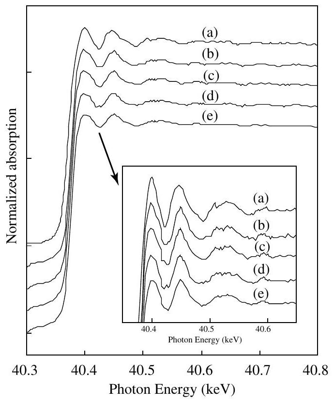
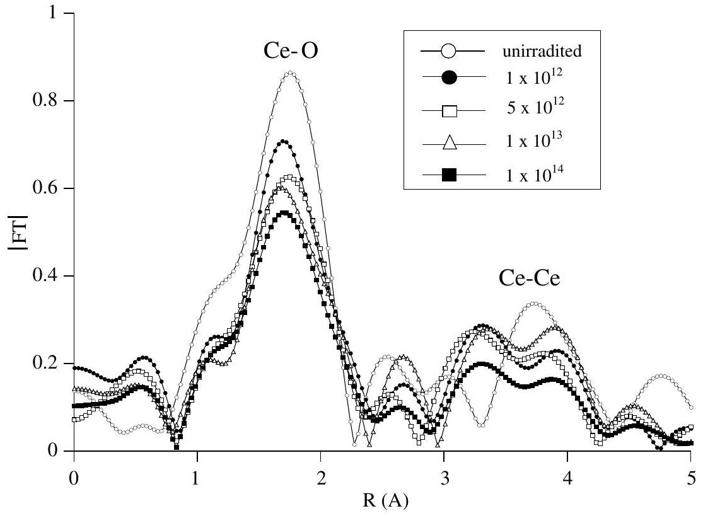
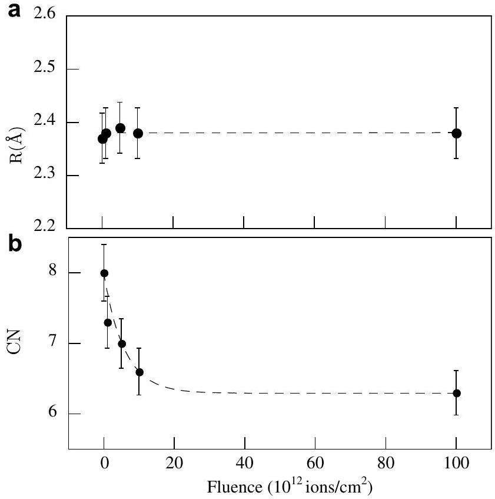
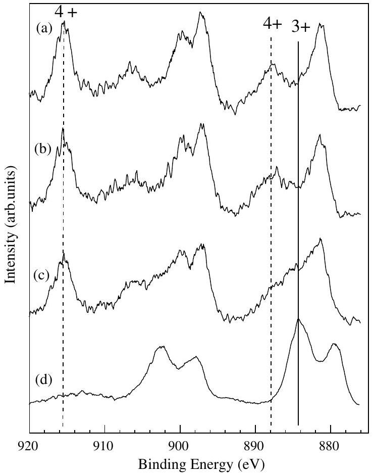
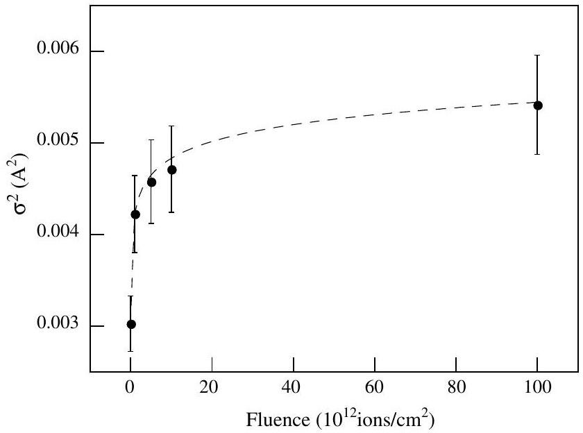

# Study on effects of swift heavy ion irradiation in cerium dioxide using synchrotron radiation X-ray absorption spectroscopy 

H. Ohno ${ }^{\text {a }}$, A. Iwase ${ }^{\text {a, } *}$, D. Matsumura ${ }^{\text {b }}$, Y. Nishihata ${ }^{\text {b }}$, J. Mizuki ${ }^{\text {b }}$, N. Ishikawa ${ }^{\text {c }}$, Y. Baba ${ }^{\text {c }}$, N. Hirao ${ }^{\text {c }}$, T. Sonoda ${ }^{\text {d }}$, M. Kinoshita ${ }^{\text {d }}$ ${ }^{\mathrm{a}}$ Department of Materials Science, Osaka Prefecture University, Gakuen-cho, Naka-ku, Sakai, Osaka 599-8570, Japan ${ }^{\mathrm{b}}$ Japan Atomic Energy Agency, Sayo-cho, Hyogo 679-5148, Japan ${ }^{\mathrm{c}}$ Japan Atomic Energy Agency (JAEA-Tokai), Tokai-mura, Naka-gun, Ibaraki 319-1195, Japan ${ }^{\mathrm{d}}$ Central Research Institute of Electric Power Industry, 2-11-1 Komae-shi, Tokyo 201-8511, Japan

Available online 23 March 2008

#### Abstract

In order to simulate the effects of high energy fission products on high-burnup $\mathrm{UO}_{2}$ nuclear fuel pellets, $\mathrm{CeO}_{2}$ thin films and bulk specimens were irradiated with 200 MeV Xe ions. Effects of the irradiation were studied by using Extended X-ray Absorption Fine Structure (EXAFS) measurement and X-ray photoelectron spectroscopy (XPS) at synchrotron radiation facilities. The EXAFS spectra for the irradiated thin films near the Ce K-edge show the formation of the oxygen deficiency around Ce ions. XPS Spectra show that the valence state of Ce atoms is changed from intrinsic $\mathrm{Ce}^{4+}$ to $\mathrm{Ce}^{3+}$ state by the irradiation. As such irradiation effects appear even for low fluence irradiation, the experimental result suggests that the oxygen deficiency and the change in Ce valence state are due to high-density electronic excitation induced by the 200 MeV Xe ions.

© 2008 Elsevier B.V. All rights reserved.

PACS: 61.82.Ms; $61.10 . \mathrm{Ht}$; $79.60 . \mathrm{Bm}$
Keywords: EXAFS; XPS; $\mathrm{CeO}_{2}$; Ion irradiation effects

## 1. Introduction

High-burnup extension of light-water reactor (LWR) nuclear fuel ( $\mathrm{UO}_{2}$ ) is a good option to reduce the total amount of spent fuel and the fuel cycle costs. In high-burnup nuclear fuel pellets, however, so-called "rim structure" [1,2], is produced by high energy (around 100 MeV ) fission products (FPs). This structure includes highly dense smallsub grains whose size is $\sim 100 \mathrm{~nm}$, and small pores with average size around $1 \mu \mathrm{~m}$. The rim structure may influence the fuel performance, including, e.g. fuel temperature and thermal conductivity. This is the matter of concern on the atomic power generation systems.

[^0]Interaction between $\mathrm{UO}_{2}$ matrix and high energy FPs consists of elastic collision with atomic nuclei and highdensity electronic excitation along the ion path. In addition, Kr and Xe atoms, which are typical fission products, are accumulated in the $\mathrm{UO}_{2}$ matrix. These three effects (elastic collision, high-density electronic excitation and inert gas accumulation) are expected to be responsible for the rim structure formation.

This study has been performed to clarify the effects of high energy FPs on nuclear fuels by using cerium dioxide $\left(\mathrm{CeO}_{2}\right)$ with the fluorite structure as a simulation material of $\mathrm{UO}_{2}$ fuel. To evaluate the effects of high energy FPs, heavy ion irradiation method using energetic ion accelerators is effective. Structural change of $\mathrm{CeO}_{2}$ by energetic ion irradiation has often been studied so far by using X-ray diffraction and TEM (Transmission electron microscope), and lattice expansion, ion tracks and defect clusters in
$\mathrm{CeO}_{2}$ due to the ion irradiation have been observed [3-5]. In the present experiment, to evaluate the effect of high energy ion irradiation on $\mathrm{CeO}_{2}$, we have used Extended X-ray Absorption Fine Structure (EXAFS) spectroscopy and X-ray Photoelectron Spectroscopy (XPS) at synchrotron radiation facilities. From the EXAFS spectra near Ce K-edge, we can obtain the information about the local atomic-structure around Ce atom. From the XPS spectra, the chemical state of Ce and O atoms can be discussed.

## 2. Experimental procedure

### 2.1. Specimen preparation

Specimens used in the present experiment were $\mathrm{CeO}_{2}$ thin films 300 nm thick and sintered bulk $\mathrm{CeO}_{2}$ pellets about 1 mm thick. $\mathrm{CeO}_{2}$ thin films were prepared on $\mathrm{Al}_{2} \mathrm{O}_{3}$ substrates by using a RF magnetron sputtering method. Concerning the preparation for bulk specimens, we have described the details elsewhere [3].

### 2.2. Swift heavy ion irradiation, Ce K-edge EXAFS and $X$-ray diffraction measurement for $\mathrm{CeO}_{2}$ thin films

The thin $\mathrm{CeO}_{2}$ films were irradiated at room temperature with $200 \mathrm{MeV} \mathrm{Xe}^{14+}$ ions up to $1.0 \times 10^{14}$ ions $/ \mathrm{cm}^{2}$ using the tandem accelerator at JAEA-Tokai. EXAFS measurements near the Ce K-edge ( 40.449 keV ) were carried out at room temperature on the beam line BL14B1 of SPring-8 synchrotron radiation facility. The spectra were obtained using a 19 element germanium detector in fluorescence mode. We note here that because of the high-density of Ce atoms in $\mathrm{CeO}_{2}$ lattice, we have to use thin films and not bulk specimen to avoid the self-absorption of X-ray. For comparison, X-ray diffraction (XRD) measurements were performed for unirradiated and irradiated thin films with a conventional X-ray diffractometer.

### 2.3. Swift heavy ion irradiation and XPS measurements for $\mathrm{CeO}_{2}$ bulk specimens

$\mathrm{CeO}_{2}$ bulk specimens were irradiated at room temperature with $200 \mathrm{MeV} \mathrm{Xe}^{14+}$ ions up to $1.0 \times 10^{14}$ ions $/ \mathrm{cm}^{2}$ using the tandem accelerator at JAEA-Tokai. XPS spectra for the Ce-3d electrons were obtained on the beamline BL27A of the photon factory at High Energy Accelerator Research Organization (KEK). The monochromatized photon energy used for the measurements was 2200.0 eV .

## 3. Results and discussion

Fig. 1 shows the normalized EXAFS spectra near Ce K-edge for $\mathrm{CeO}_{2}$ thin films irradiated with 200 MeV Xe ions. The spectrum for unirradiated thin film is also shown in the figure. EXAFS oscillation is clearly observed in each spectrum, indicating that the short-range ordered structure around Ce ions is kept even after the irradiation. The

Fig. 1. Ce K-edge EXAFS spectra for $\mathrm{CeO}_{2}$ thin films unirradiated (a), and irradiated with 200 MeV Xe ions of the fluence $1 \times 10^{12}$ ions $/ \mathrm{cm}^{2}$ (b), $5 \times 10^{12}$ ions $/ \mathrm{cm}^{2}$ (c), $1 \times 10^{13}$ ions $/ \mathrm{cm}^{2}$ (d), and $1 \times 10^{14}$ ions $/ \mathrm{cm}^{2}$ (e).

amplitude of the EXAFS oscillation is, however, decreased with increasing ion-fluence.

Fig. 2 shows the $k^{2}$-weighted Fourier transforms corresponding to the EXAFS spectra. To focus on the first neighboring peaks (i.e. $\mathrm{Ce}-\mathrm{O}$ ), the Fourier transforms were extracted by using the wave number, $k$, ranging from 3 to $10 \mathrm{~A}^{-1}$. A position of the absorption edge ( $E_{0}$ ) was fixed to a constant value of $40.372(\mathrm{keV})$ to produce the EXAFS function $\chi(k)$ before Fourier transformation. A main peak appears around $1.8 \AA$ for each spectrum. The curve-fitting analysis to the Fourier transform was performed for the inverse FTs on the first coordination shell (i.e. $\mathrm{Ce}-\mathrm{O}$ ) ranging from 0.8 to $2.4(\AA)$ using theoretical parameters calculated by McKale et al. [6]. The values of some parameters (coordination number, average interatomic distance and Debye-Waller factor) for the best curve-fitting were decided by using REX2000 EXAFS analysis code. The values of $S_{0}^{2}$ (intrinsic loss factor) and $\Delta \mathrm{E}_{0}$ (edge shift value) were fixed at 1.0 and -13.6 eV , respectively in our simulation. The parameters obtained by the simulation are tabulated in Table 1. The $R$ factors, which indicate the quality of the fitting are also shown in Table 1. The curve-fitting result confirms that peaks around 1.8 Å correspond to oxygen ions with the first coordination of Ce atom for fluorite structure. The second peak for each spectrum around $3.5 \AA$ in Fig. 2 corresponds to the second coordination of Ce atom for the fluorite structure (i.e. Ce atoms). The peak height tends to decrease by the irradiation. The Fourier transforms using the short $k$ range ( $3-10 \AA^{-1}$ ), however, makes the curve fitting for the second peaks less accurate. Therefore, we do not mention the curve-fitting analysis to second coordination in this paper. Fig. 3(a) shows the interatomic distance $(R)$ between Ce atom and O atom as

Fig. 2. Fourier transform of Ce K-edge EXAFS spectra for $\mathrm{CeO}_{2}$ thin films unirradiated (a) and irradiated with 200 MeV Xe of the fluence $1 \times 10^{12}$ ions/ $\mathrm{cm}^{2}$ (b), $5 \times 10^{12}$ ions $/ \mathrm{cm}^{2}$ (c), $1 \times 10^{13}$ ions $/ \mathrm{cm}^{2}$ (d), and $1 \times 10^{14}$ ions $/ \mathrm{cm}^{2}$ (e).

a function of ion-fluence. As can be seen in the figure, the $\mathrm{Ce}-\mathrm{O}$ interatomic distance is nearly constant up to the fluence of $1 \times 10^{14}$ ions $/ \mathrm{cm}^{2}$. The measurement of the X-ray diffraction pattern for $\mathrm{CeO}_{2}$ thin films shows that all the peak positions for the fluorite structure shift towards low angles, but new peaks corresponding to other lattice structures are not observed after the irradiation up to the fluence $1 \times 10^{14}$ ions $/ \mathrm{cm}^{2}$. The peak shift towards lower angles of Bragg reflections indicates the lattice expansion of about $0.06 \%$ for the fluence of $1 \times 10^{14}$ ions $/ \mathrm{cm}^{2}$. This value is below the accuracy limit of the EXAFS method. Therefore, the analysis of EXAFS spectra shows the nearly constant $\mathrm{Ce}-\mathrm{O}$ distance irrespective of ion-fluence.

In the fluorite crystal, the first coordination shell around a Ce atom has eight oxygen neighbors. Fig. 3(b) shows that the coordination number decreases from eight with increasing ion-fluence. This result implies that some O atoms are removed from neighboring sites of Ce atoms by the irradiation. The removal of O atoms from the regular sites is also observed through the XPS measurement. Fig. 4 shows the effect of 200 MeV Xe ion irradiation on Ce-3d XPS spectrum of $\mathrm{CeO}_{2}$ bulk specimens. The spectrum of unirradiated $\mathrm{CeO}_{2}$ ((a) in Fig. 4) has six peaks for 3d electron

Fig. 3. Ion-fluence dependence of (a) interatomic distance (R) and (b) Coordination number (CN).

Table 1
Local structure parameters for first coordination shell(Ce-O) estimated by EXAFS analysis
| Fluence ( $\times 10^{12}$ ions $/ \mathrm{cm}^{2}$ ) | Coordination number (CN) | Interatomic distance ( Å ) | $\sigma^{2}\left(\times 10^{-3} \AA^{2}\right)$ | $R$-factor (\%) |
| :--- | :--- | :--- | :--- | :--- |
| 0 | ${ }^{*} 8.0$ | $2.37 \pm 0.05$ | $3.0 \pm 0.3$ | 2.3 |
| 1 | $7.3 \pm 0.4$ | $2.38 \pm 0.05$ | $4.2 \pm 0.4$ | 4.8 |
| 5 | $7.0 \pm 0.4$ | $2.39 \pm 0.05$ | $4.6 \pm 0.5$ | 3.9 |
| 10 | $6.6 \pm 0.3$ | $2.38 \pm 0.05$ | $4.7 \pm 0.5$ | 6.5 |
| 100 | $6.3 \pm 0.3$ | $2.38 \pm 0.05$ | $5.4 \pm 0.5$ | 5.4 |

[^1]
Fig. 4. XPS spectra of Ce 3d electrons for $\mathrm{CeO}_{2}$ unirradiated (a) and irradiated with 200 MeV Xe ions of the fluence $6 \times 10^{12}$ ions $/ \mathrm{cm}^{2}$ (b), $1 \times 10^{14}$ ions $/ \mathrm{cm}^{2}$ (c), and for the standard specimen with the valence of $\mathrm{Ce}^{3+}$ (d).

state due to the strong correlation with 4 f electrons [7], and these peaks correspond to the valence state of $\mathrm{Ce}^{4+}$ [8]. XPS spectra of (b) and (c) in Fig. 4 are the spectra for the specimens irradiated with the fluence of $6 \times 10^{12}$ ions/ $\mathrm{cm}^{2}$ and $1 \times 10^{14}$ ions $/ \mathrm{cm}^{2}$, respectively. XPS spectrum (d) in the figure corresponds to a cerium oxide with the valence of $\mathrm{Ce}^{3+}$ [8]. As can clearly be seen in Fig. 4, the shape of the Ce-3d XPS spectrum varies gradually from the shape of spectrum for $\mathrm{Ce}^{4+}$ state to that for $\mathrm{Ce}^{3+}$ state by the irradiation. This result can be explained as follows; O atoms are partly removed from the regular lattice sites by the irradiation, and the resulting oxygen deficiency leads to the reduction of Ce atoms from $4+$ state to $3+$ state. The result of XPS measurement is consistent with the result of EXAFS discussed above.

Fig. 5 shows the $\mathrm{Ce}-\mathrm{O}$ Debye-Waller factor for $\mathrm{CeO}_{2}$ thin films as a function of ion-fluence. The Debye-Waller factor increases with increasing the ion-fluence and tends to be saturated for higher ion-fluence. The Debye-Waller factor is generally the sum of a temperature independent static contribution, $\sigma_{\mathrm{s}}^{2}$, and a temperature dependent dynamic contribution, $\sigma_{\mathrm{d}}^{2}$. If the ion irradiation enhances the fluctuation of oxygen coordination number around Ce atoms, the value of $\sigma_{\mathrm{s}}^{2}$ is increased by the ion irradiation. On the other hand, if the thermal vibration of O atoms is enhanced by the irradiation, the value of $\sigma_{\mathrm{d}}^{2}$ is increased with increasing ion-fluence. As the present EXAFS measurement was performed only at room temperature, we cannot discuss the static and the dynamic contri-

Fig. 5. Ion-fluence dependence of Debye-Waller factor $\left(\sigma^{2}\right)$.

butions separately. To separate the two contributions, we need the data for the temperature dependence of the Debye-Waller factor.

As can be seen in Figs. 3 and 5, the 200 MeV Xe irradiation with the fluence of only $1 \times 10^{12}$ ions $/ \mathrm{cm}^{2}$ remarkably changes the coordination number of O atoms around Ce and the $\mathrm{Ce}-\mathrm{O}$ Debaye-Waller factor. The calculation using SRIM2003 code [9] has, however, revealed that the concentration of Frenkel-pair defects produced through the elastic collisions of 200 MeV Xe ions with $\mathrm{CeO}_{2}$ crystal is less than $10^{-4}$. Such a small concentration of defects could hardly induce the large changes in the oxygen coordination number or the Ce-O Debye-Waller factor. The experimental result suggests that the highdensity electronic excitation induced by the irradiation mainly contributes to the oxygen deficiencies in $\mathrm{CeO}_{2}$.

## 4. Summary

$\mathrm{CeO}_{2}$ films and bulk specimens were irradiated with 200 MeV Xe ions, and the irradiation effects were studied by means of EXAFS and XPS measurements at the synchrotron radiation facilities. The irradiation decreases the coordination number of O atoms around Ce atoms and increases the $\mathrm{Ce}-\mathrm{O}$ Debye-Waller factor. The valence state of Ce atoms is partly changed from $4+$ to $3+$ by the irradiation. To explain such irradiation effects, the contribution of the high-density electronic excitation induced by 200 MeV Xe ions has to be considered.

## Acknowledgments

This work was financially supported by the Budget for Nuclear Research of MEXT, based on the screening and counselling by the Atomic Energy Commission. The EXAFS measurements at SPring-8 were performed with the approval of Japan Atomic Energy Agency (JAEA) and Japan Synchrotron Radiation Research Institute (JASRI) (Proposal No. 2007B3616). The XPS measurements at

KEK Photon Factory were performed with the approval of High Energy Accelerator Research Organization (KEK) (Proposal No. 2007G058).

## References

[1] J.O. Barner, M.E. Cunningham, M.D. Freshley, D.D. Lanning, HBEP-61, 1990, Battelle Pacific Northwest Laboratories.
[2] M.Kinoshita et al., in: Proceedings of the 2004 International Meeting on LWR Fuel Performance, Orlando, Florida, USA, 2004, Paper 1102.
[3] T. Sonoda, M. Kinoshita, Y. Chimi, N. Ishikawa, M. Sataka, A. Iwase, Nucl. Instr. and Meth. B 250 (2006) 254.
[4] K. Yasunaga, K. Yasuda, S. Matsumura, T. Sonoda, Nucl. Instr. and Meth. B 250 (2006) 114.
[5] N.Ishikawa, private communication.
[6] A.G. McKale, B.W. Veal, A.P. Paulikas, S.K. Chan, G.S. Knapp, J. Am. Chem. Soc. 110 (1988) 3763.
[7] Atsushi Fujimori, Phys. Rev. B 28 (1983) 2281.
[8] Juan P. Holgado, Rafael Alvarez, Guillermo Munuera, Appl. Surf. Sci. 161 (2000) 301.
[9] J F Ziegler. http://www.srim.org/.

[^0]:    * Corresponding author. Tel./fax: +81 722549810.

    E-mail address: iwase@mtr.osakafu-u.ac.jp (A. Iwase).

[^1]:    * Fixed value.

