# Diffusion of oxygen in ceria at elevated temperatures and its application to $\mathrm{H} 2 \mathrm{O} / \mathrm{CO} 2$ splitting thermochemical redox cycles 

## Journal Article

## Author(s):

Ackermann, Simon; Scheffe, Jonathan R.; Steinfeld, Aldo (D)

## Publication date:

2014-03-13

## Permanent link:

https://doi.org/https://doi.org/10.3929/ethz-b-000081454

## Rights / license:

In Copyright - Non-Commercial Use Permitted

## Originally published in:

The Journal of Physical Chemistry C 118(10), https://doi.org/10.1021/jp500755t

# Diffusion of Oxygen in Ceria at Elevated Temperatures and Its Application to $\mathbf{H}_{\mathbf{2}} \mathbf{O} / \mathbf{C O}_{\mathbf{2}}$ Splitting Thermochemical Redox Cycles 

Simon Ackermann, ${ }^{\dagger}$ Jonathan R. Scheffe,,$^{\dagger \dagger}$ and Aldo Steinfeld ${ }^{\dagger, \ddagger}$ ${ }^{\dagger}$ Department of Mechanical and Process Engineering, ETH Zurich, Sonneggstrasse 3, 8092 Zurich, Switzerland ${ }^{\ddagger}$ Solar Technology Laboratory, Paul Scherrer Institute, 5232 Villigen PSI, Switzerland

(S) Supporting Information
Downloaded via ETH ZURICH on August 26, 2022 at 09:15:14 (UTC).
See https://pubs.acs.org/sharingguidelines for options on how to legitimately share published articles.

#### Abstract

Determination of reaction and oxygen diffusion rates at elevated temperatures is essential for modeling, design, and optimization of high-temperature solar thermochemical fuel production processes, but such data for state-of-the-art redox materials, such as ceria, is sparse. Here, we investigate the solidstate reduction and oxidation of sintered nonstoichiometric ceria at elevated temperatures relevant to solar thermochemical redox cycles for splitting $\mathrm{H}_{2} \mathrm{O}$ and $\mathrm{CO}_{2}(1673 \mathrm{~K} \leq T \leq 1823 \mathrm{~K}, 3 \times$ 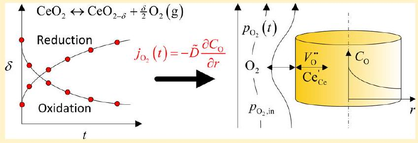 $10^{-4} \mathrm{~atm} \leq p_{\mathrm{O}_{2}} \leq 2.5 \times 10^{-3} \mathrm{~atm}$ ). Relaxation experiments are performed by subjecting the sintered ceria to rapid oxygen partial pressure changes and measuring the time required to achieve thermodynamic equilibrium state. From such data, we elucidate information regarding ambipolar oxygen diffusion coefficients through comparison of experimental data to a numerical approximation of Fick's second law based on finite difference methods. In contrast to typically applied analytical approaches, where diffusion coefficients are necessarily concentration independent, such a numerical approach is capable of accounting for more realistic concentration dependent diffusion coefficients and also accounts for transient gas phase boundary conditions pertinent to dispersion and oxygen consumption/evolution. Ambipolar diffusion coefficients are obtained in the range $1.5 \cdot 10^{-5} \mathrm{~cm}^{2} \mathrm{~s}^{-1} \leq \tilde{D} \leq 4 \cdot 10^{-4} \mathrm{~cm}^{2} \mathrm{~s}^{-1}$ between 1673 and 1823 K . These results highlight the rapid nature of ceria reduction to help guide the design of redox materials for solar reactors, the importance of accounting for transient boundary conditions during relaxation experiments (either mass based or conductivity based), and point to the flexibility of using a numerical analysis in contrast to typical analytical approaches.

## - INTRODUCTION

The ceria-based thermochemical redox cycle offers a promising pathway for storage of intermittent sunlight in the form of $\mathrm{H}_{2}$ and CO through splitting $\mathrm{H}_{2} \mathrm{O}$ and $\mathrm{CO}_{2}{ }^{1,2}$ The two-step cycle consists of a high-temperature endothermic reduction, driven by concentrated solar energy, and a lower temperature exothermic oxidation, represented by eq 1 and eq 2 , respectively

$$
\begin{aligned}
& \mathrm{CeO}_{2-x} \xrightarrow{T_{\mathrm{H}}} \mathrm{CeO}_{2-x-\delta}+\frac{\delta}{2} \mathrm{O}_{2} \\
& \mathrm{CeO}_{2-x-\delta}+\alpha \mathrm{H}_{2} \mathrm{O}+\beta \mathrm{CO}_{2} \xrightarrow{T_{\mathrm{L}}} \mathrm{CeO}_{2-x}+\alpha \mathrm{H}_{2}+\beta \mathrm{CO}
\end{aligned}
$$

where $\alpha+\beta=\delta$. In the first reduction step, ceria is thermally dissociated, generally at above $T_{\mathrm{H}}=1673 \mathrm{~K}$ and low oxygen partial pressures, to a nonstoichiometric state resulting in $\mathrm{O}_{2}(\mathrm{~g})$ release. In the second oxidation step, the reduced ceria is oxidized with $\mathrm{H}_{2} \mathrm{O}(\mathrm{g}), \mathrm{CO}_{2}(\mathrm{~g})$, or a combination of both (generally at $T_{\mathrm{L}} \left.<T_{\mathrm{H}}\right)$ to form $\mathrm{H}_{2}(\mathrm{~g})$ and $\mathrm{CO}(\mathrm{g})$.

The application of ceria as redox material for solar thermochemical cycles is relatively new, ${ }^{3}$ and work has been primarily focused on characterizing the thermodynamics of pure ${ }^{4-6}$ and doped systems ${ }^{7}$ and the experimental demonstration using electrically heated furnaces ${ }^{4,8-14}$ and solar reactors. ${ }^{2,3,15,16}$ To date, however, there is limited information available regarding the
rate-limiting mechanism of ceria-based materials at elevated temperatures pertinent to eqs 1 and 2 . Oxidation rates of pure ceria with $\mathrm{H}_{2} \mathrm{O}$ and $\mathrm{CO}_{2}$ were faster than those for $\mathrm{ZrO}_{2}$-doped ceria because of diffusion limitations in the latter. ${ }^{10}$ Rates increased with higher specific surface area of highly ordered macroporous ceria structures compared to randomly structured mesoporous ceria. ${ }^{12}$ In these previous studies, there was no quantitative analysis that could yield a rate expression. Reduction rates measured in an IR furnace without heat/mass transfer limitations were $\sim 80$ times greater than those obtained in a solar reactor. ${ }^{2}$ This highlighted the rapid nature of the intrinsic chemical kinetics and the importance of heat transfer on the overall reaction rates for the design of efficient solar reactors.

Ceria and ceria-based materials are mixed ionic and electronic conductors and are stable over a wide range of operating conditions, ${ }^{17,18}$ rendering them suitable for other high-temperature applications such as electrolytes in solid oxide fuel cells. The thermodynamics, ${ }^{19-24}$ electronic mobility, ${ }^{25-29}$ and ionic mobility ${ }^{27,30}$ within ceria and doped ceria have been extensively studied, mostly at temperatures lower than those required for thermochemical fuel production. Reduction and oxidation rates, which are directly related to ionic and electronic mobility, are often measured by temporally dependent changes in mass ${ }^{31,32}$ or

[^0]conductivity, ${ }^{33,34}$ so-called relaxation kinetics, as either temperature or oxygen partial pressure ( $p_{\mathrm{O}_{2}}$ ) is changed rapidly and the other is held constant. With knowledge of the time dependence to reachieve equilibration, rates of oxygen diffusion, or ambipolar diffusion, and surface reaction rates can be elucidated.

Within the framework of this investigation, we describe the rate dependency of ceria reduction (thermal dissociation, eq 1) and oxidation with $\mathrm{O}_{2}(\mathrm{~g})$ by measuring the aforementioned relaxation behavior at conditions relevant to solar thermochemical cycles $\left(1673 \leq T_{\mathrm{H}} \leq 1823 \mathrm{~K}\right)$. Oxygen ambipolar diffusion coefficients are extracted by fitting experimental data to a numerical model based on finite difference methods which approximate Fick's second law. This model accounts for concentration-dependent diffusion coefficiencts and gas-phase $p_{\mathrm{O}_{2}}$ boundary conditions related to the uptake/release of $\mathrm{O}_{2}(\mathrm{~g})$ during reduction and oxidation. Finally, a rate expression is presented on the basis of extracted ambipolar diffusion coefficients which is translatable to various material morphologies and, thus, guides the design of redox materials for solar reactors.

## - EXPERIMENTAL METHODS

Small- and large-sized cylindrical samples were prepared by uniaxially cold pressing ceria powder (Lehmann \& Voss \& Co., purity: $99.99 \%$ ) at a pressure of 2 and 8 tons, followed by sintering in air at 1823 K for 12 h . The density of the large cylinder is lower than that of the small one because of nonuniform pressing of large sample sizes. The dimensions and physical properties measured after sintering are listed in Table 1.

Table 1. Dimensions and Physical Properties of the Sintered Ceria Samples
| sample name | small cylinder | large cylinder |
| :--- | :--- | :--- |
| manufacturing | pressed ceria powder with 2 tons, sintered at 1823 K | pressed ceria powder with 8 tons, sintered at 1823 K |
| $2 R(\mathrm{~cm})$ | $0.62 \pm 0.005$ | $1.095 \pm 0.005$ |
| $L(\mathrm{~cm})$ | $0.35 \pm 0.005$ | $0.72 \pm 0.005$ |
| $m_{\mathrm{s}}(\mathrm{mg})$ | $\sim 715 \pm 0.05$ | $\sim 4310 \pm 0.05$ |
| $\rho_{\mathrm{CeO}_{2}}\left(\mathrm{~g} \mathrm{~cm}^{-3}\right)$ | 6.766 | 6.364 |
| density | 94\% | 88.4\% |

Weight relaxation experiments were conducted using a thermogravimetric analyzer (TGA, NETZSCH STA 409 SD). Samples were loaded on a flat $\mathrm{Al}_{2} \mathrm{O}_{3}$ crucible with a diameter of either 17 mm or 5 mm . Oxygen partial pressure was controlled by mixing high-purity Ar (Messer, Argon 5.0) with three different $\mathrm{O}_{2} / \mathrm{Ar}$ mixtures $\left(0.5 \%, 1.0 \%\right.$, and $1.5 \% \mathrm{O}_{2}$ in Ar , Messer $\mathrm{Ar} / \mathrm{O}_{2}$ 5.0). Gases were delivered to the TGA with a mechanical mass flow controller (Voegtlin Q-Flow 140). Gas compositions were analyzed by gas chromatography (GC, CP-4900 System, Agilent Technologies). Temperatures were varied in the range $1673-1823 \mathrm{~K} . p_{\mathrm{O}_{2}}$ was varied in the range $3 \cdot 10^{-4}-2.5 \cdot 10^{-3} \mathrm{~atm}$.

The TGA consisted of two gas inlets (shown in Figure S1 of the Supporting Information): one through the bottom for purging the balance and another through the side for feeding gaseous reactants. Both inlets affected the atmosphere seen by the sample. For all experiments, a constant Ar flow rate of 200 sccm was delivered from the bottom. One of the three $\mathrm{O}_{2} / \mathrm{Ar}$ gas mixtures was connected to two independent mass flow controllers (MFC1 and MFC2) set at two different flow rates
between 50 and 100 sccm . Depending on the gas concentration desired, either MFC1 or MFC2 was used to feed the gas mixture into the side inlet. It was assumed that gases from the bottom and side inlets were well mixed by the time they reached the sample.

A typical relaxation experiment consisted of the following steps:
(1) Equilibration of the atmosphere at room temperature to a high $p_{\mathrm{O}_{2}}$ of 0.35 atm .
(2) Heating at a rate of $20 \mathrm{~K} \mathrm{~min}^{-1}$ to 1173 K until the mass was stabilized. Because of the relatively high $p_{\mathrm{O}_{2}}$ used, it was assumed that at this point $\delta=0 .^{20}$
(3) Heating to the desired temperature of interest and letting the mass stabilize $\left(\delta_{0}\right)$.
(4) Changing the mass flow on the side inlet by switching from MFC1 to MFC2 to lower the $p_{\mathrm{O}_{2}}$ (reduction) and allowing the mass to stabilize $\left(\delta_{\mathrm{f}}\right)$. Several tests with different purging scenarios indicated that this is the most rapid way to change atmospheres within the furnace.
(5) Changing the mass flow on the side inlet to obtain the original higher $p_{\mathrm{O}_{2}}$ (oxidation) and allowing the mass to stabilize $\left(\delta_{0}\right)$.
(6) Increasing/decreasing to the next desired temperature at a rate of $20 \mathrm{~K} \mathrm{~min}^{-1}$ and letting the mass stabilize.
(7) Repeating steps 4-7 at all temperatures of interest.
(8) Decreasing the temperature to 1173 K until the mass was stabilized to obtain $\delta=0$ again. Fluctuations between the initial and final delta were used to account for any possible drift or sublimation throughout the experiment.
Defect Theory and lonic Transport. Oxygen nonstoichiometry at equilibrium under ideal solution limit ${ }^{20}$ is governed by the following redox reaction, written in Kröger-Vink notation, ${ }^{35}$

$$
\mathrm{O}_{\mathrm{O}}^{x}+2 \mathrm{Ce}_{\mathrm{Ce}}^{x} \leftrightarrow V_{\mathrm{O}}^{\bullet \bullet}+2 \mathrm{Ce}_{\mathrm{Ce}}^{\prime}+\frac{1}{2} \mathrm{O}_{2}(g)
$$

where oxygen ions on oxygen lattice sites ( $\mathrm{O}_{\mathrm{O}}^{x}$ ) and cerium ions on cerium lattice sites ( $2 \mathrm{Ce}_{\mathrm{Ce}}^{x}$ ) are in equilibrium with gas-phase $\mathrm{O}_{2}$, oxygen vacancies ( $V_{\mathrm{O}}^{\bullet \bullet}$ ), and electrons on cerium lattice sites $\left(\mathrm{Ce}_{\mathrm{Ce}}^{\prime}\right)$. Thus, the reduction of ceria proceeds via the creation of oxygen vacancies, and electrons are released in order to maintain charge neutrality. On the basis of charge neutrality, the above electron and vacancy concentrations can be directly related to the nonstoichiometry, $\delta$. ${ }^{9,20}$

Oxygen transport through ceria occurs via ambipolar, or chemical, diffusion. ${ }^{4,36}$ This implies that both oxygen vacancies and electrons are transported concurrently through the lattice to maintain charge neutrality, and thus, oxygen is transported through ceria as a neutral species. As such, its diffusion rate is dependent upon the self-diffusion coefficients of oxygen vacancies ( $D_{\text {ion }}$ ) and electrons ( $D_{\text {el }}$ ). Assuming ideal solution behavior and charge neutrality, the ambipolar diffusion coefficient $(\tilde{D})$ can be described according to ${ }^{37}$

$$
\tilde{D}=\frac{\left(c_{\text {ion }}+c_{\mathrm{el}}\right) D_{\text {ion }} D_{\mathrm{el}}}{c_{\text {ion }} D_{\text {ion }}+c_{\mathrm{el}} D_{\mathrm{el}}}
$$

where $c_{\text {ion }}$ and $c_{\text {el }}$ are the concentration of oxygen vacancies and electrons, respectively. If ionic and electronic mobilities are assumed to be constant, then the diffusion coefficient of species i can take on the general form ${ }^{38}$

$$
D_{\mathrm{i}}=D_{\mathrm{i}, 0} e^{-E_{\mathrm{A}} /\left(R_{\mathrm{gas}} T\right)}
$$

where $D_{\mathrm{i}, 0}$ is the maximum diffusion coefficient at infinite temperature, $E_{\mathrm{A}}$ is the activation energy, and $R_{\text {gas }}=8.314 \mathrm{~J} \mathrm{~mol}^{-1} \mathrm{~K}^{-1}$ is
the universal gas constant. The diffusivity of a species $\mathrm{i}, D_{i}$, can be related to its mobility by the Nernst-Einstein equation ${ }^{38}$

$$
D_{\mathrm{i}}=\frac{\mu_{\mathrm{i}} k T}{z_{\mathrm{i}} e}
$$

where $z_{\mathrm{i}}$ is the number of unit charges on the charge carrier, $k$ is Boltzman's constant, $T$ is temperature, and $\mu_{\mathrm{i}}$ is the mobility. Several studies have indicated that electronic mobility within the ceria lattice is dependent on the concentration of electrons, or nonstoichiometry $\delta$. For example, the electronic mobility $\mu_{\mathrm{el}}$ is inversely proportional to $\delta .^{26,28}$ More specifically, the mobility was shown to be independent of $\delta$ in the range $-3.0<\log \delta<-1.8$, but it decreases with increasing $\delta$ for higher deviations in the range $-1.8<\log \delta<-0.7$ because its activation energy becomes larger. The decrease in electron mobility with increasing vacancy concentration is presumably coupled to an increase in the activation energy of the hopping type electronic transport that occurs within the lattice. The increase in activation energy is due to an increase in the lattice parameter resulting from chemical expansion. This can be seen in Figure 1a, where various $\mu_{\mathrm{el}}$ values documented in literature are collected and plotted as a function of ceria nonstoichiometry. Such a dependency should result in ambipolar diffusion coefficients having qualitatively similar dependencies. Indeed, ambipolar diffusion coefficients collected from various sources show an inverse dependence on $\delta$ as well (other than values documented by Stan et al. ${ }^{32}$ ) as shown in Figure 1b. The diffusion coefficients documented by Chueh and Haile ${ }^{4}$ are measured from $15 \%$ samarium-doped ceria, which are around 1 order of magnitude higher compared to pure ceria.

Because of this dependency, we postulate in this study that $\tilde{D}$ is inversely proportional to $\delta$ according to eq 7 , an important distinction as this expression is directly fitted to experimental data for extraction of $\tilde{D}$.

$$
\tilde{D}(\delta)=\frac{\tilde{D}_{0} e^{-E_{\mathrm{A}} /\left(R_{\mathrm{gas}} T\right)}}{\delta}=\frac{Z(T)}{\delta}
$$

Numerical Modeling: Diffusion. A 2D diffusion model based on radial and axial diffusion within a finite cylinder is formulated to describe the solid-state transport of neutral oxygen within the crystal lattice of ceria. ${ }^{44-46}$ The governing diffusion equation Fick's second law, expressed into its constituent components, yields

$$
\begin{aligned}
\frac{\partial C(t, x, r)}{\partial t}= & \frac{\partial}{\partial x}\left(\tilde{D}(C) \cdot \frac{\partial C(t, x, r)}{\partial x}\right) \\
& +\frac{1}{r} \frac{\partial}{\partial r}\left(r \cdot \tilde{D}(C) \cdot \frac{\partial C(t, x, r)}{\partial r}\right)
\end{aligned}
$$

where $C(t, x, r)$ is the time and spatially dependent oxygen concentration in the sample and $\tilde{D}$ is the oxygen ambipolar diffusion coefficient, which is assumed to be dependent on the concentration within the bulk according to eq 7 . The following temporal boundary conditions were applied

$$
\begin{aligned}
& C(t=0, x, r)=C_{0} \\
& C(t \rightarrow \infty, x, r)=C_{\infty}
\end{aligned}
$$

where $C_{0}$ and $C_{\infty}$ are the initial and final oxygen concentrations at equilibrium. Directional boundary conditions were applied by assuming that surface reactions are rapid and, thus, that oxygen activities in the gas and solid phases are equal. Thus, the boundary condition is expressed by

$$
C(t, \pm L, \pm R)=C_{\text {gas }}
$$

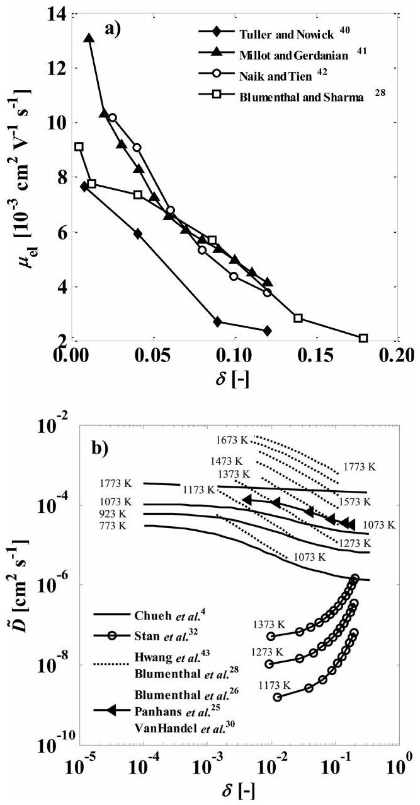
Figure 1. (a) Variation of the electrical mobility as a function of ceria nonstoichiometry, ${ }^{39}$ Tuller and Nowick, ${ }^{40}$ Millot and Gerdanian, ${ }^{41}$ Naik and Tien, ${ }^{42}$ and Blumenthal and Sharma. ${ }^{28}$ (b) Variation of the ambipolar diffusion coefficient as a function of ceria nonstoichiometry and temperature calculated from data documented by Chueh and Haile ${ }^{4}$ ( $15 \%$ samarium-doped ceria), Stan et al., ${ }^{32}$ Blumenthal and Sharma, ${ }^{28}$ Hwang and Mason, ${ }^{43}$ Blumenthal and Hofmaier, ${ }^{26}$ Panhans and Blumenthal, ${ }^{25}$ and VanHandel and Blumenthal. ${ }^{30}$

where $R$ is the radius of the cylinder and $2 L$ is the length. $C_{\text {gas }}$ is a temporally changing concentration based on $p_{\mathrm{O}_{2}}$ in the gas phase around the sample. This is often accounted for by assuming a surface reaction rate and a constant oxygen concentration $C_{\infty}$ within the purging gas flow. ${ }^{31,47}$ However, because such an instantly fast gas switch is not realistic (at least within our experimental setup) and because the sample is continuously releasing or removing $\mathrm{O}_{2}$ to or from the gas phase, $p_{\mathrm{O}_{2}}$ and, thus, $C_{\infty}$ are assumed to change temporally as discussed in the following section.

The 2D partial differential equation shown in eq 8 is discretized by using finite differences in axial and radial direction

$$
\begin{aligned}
& \frac{C_{i, j}^{n+1}-C_{i, j}^{n}}{\Delta t}=\tilde{D} \cdot \frac{C_{i, j-1}^{n+1}-2 C_{i, j}^{n+1}+C_{i, j+1}^{n+1}}{\Delta x^{2}}+\frac{\tilde{D}}{\Delta r \cdot r_{i}} \\
& \cdot\left[r_{i+1 / 2} \cdot \frac{C_{i+1, j}^{n+1}-C_{i, j}^{n+1}}{\Delta r}-r_{i-1 / 2} \cdot \frac{C_{i, j}^{n+1}-C_{i-1, j}^{n+1}}{\Delta r}\right]
\end{aligned}
$$

where $i$ and $j$ denotes points in radial and axial direction, respectively. First-order backward differencing in time is used to make the method unconditionally stable for any time step. ${ }^{48,49} \mathrm{~A}$ restriction in time step size is used for ensuring accuracy. The

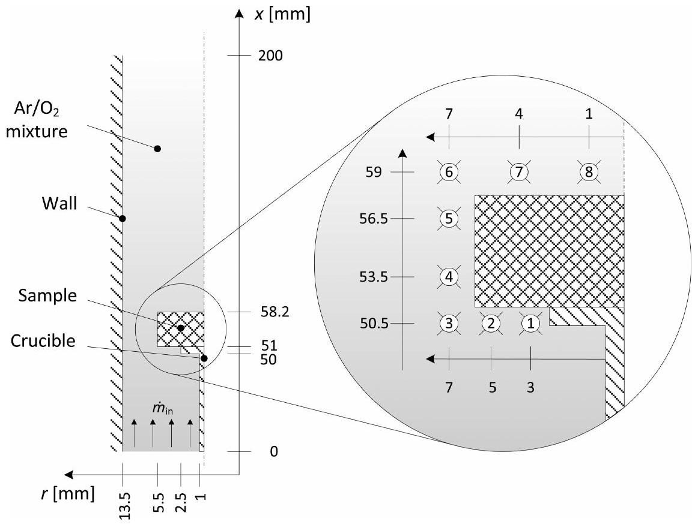
Figure 2. Geometrical properties of multicomponent flow simulation setup. Points $1-8$ (inset) represent locations where temporal oxygen mass fractions were recorded. The average oxygen mass fraction was used in the diffusion model as a transient boundary condition at the sample surface.

mean concentration, $C_{\text {mean }}$, within the sample at a certain time is weighted by the radius in the radial direction and is defined as

$$
C_{\text {mean }}(t)=\frac{1}{N_{\mathrm{x}}} \sum_{j=1}^{N_{\mathrm{x}}}\left(\frac{\sum_{i=1}^{N_{\mathrm{r}}} C\left(t, r_{i}, x_{j}\right) \cdot r_{i}}{\sum_{i=1}^{N_{\mathrm{r}}} r_{i}}\right)
$$

where $N_{\mathrm{r}}$ and $N_{\mathrm{x}}$ are the radial and axial grid resolutions of the discretized partial differential equations. An optimization routine minimizes the sum of least-squares between $C_{\text {mean }}$ and the measured concentration as determined by the TGA weight relaxation experiments. This concentration $C(\delta)$ is defined as

$$
C(\delta)=\delta
$$

The 2D diffusion model described in eq 12 is tested and verified against the 1D analytical exact solutions for the axial (infinite plane wall) and radial (infinite cylinder) cases for a constant diffusion coefficient. Such analytical solutions to transient heat conduction problems for simplified geometries and boundary conditions are well documented. ${ }^{50-54}$ The analytical solutions of the constitutive transport equations for heat conduction (Fourier's law) are related to diffusive mass transfer (Fick's law) by the heat and mass transfer analogy. ${ }^{51}$ The results of the numerical 2D diffusion model match the results of the 1D analytical exact solutions (shown in Figure S2 of the Supporting Information).

Prediction of Boundary Conditions. Isothermal switching of $p_{\mathrm{O}_{2}}$ cannot be assumed to be instantaneous as confirmed from temporal measurements of $\mathrm{O}_{2}$ concentrations without the presence of a reactive sample. Additionally, equilibrium nonstoichiometry at the sample surface must change temporally because the sample releases and consumes $\mathrm{O}_{2}$ during reduction and oxidation, respectively. Therefore, the boundary conditions needed for the transient 2D diffusion simulation are predicted with a multicomponent flow simulation ( $\mathrm{Ar} / \mathrm{O}_{2}$ mixture) of the TGA setup using a commercial CFD code (ANSYS Academic Research, release 14.0). The geometrical properties of the setup are shown in Figure 2. An unstructured mesh with a refined grid
around the sample wall with 45684 elements in total is generated (see Figure S3 of the Supporting Information). $p_{\mathrm{O}_{2}}$ is recorded over time during the simulation at eight distinct points within the fluid domain around the sample and at the TGA inlet and outlet.

The rate of oxygen flux into and out of the sample surface is known from the temporal mass change measured by the TGA, assuming that mass changes are only due to oxygen uptake/ release. $p_{\mathrm{O}_{2}}$ prior to and after reduction is determined from the experimentally determined nonstoichiometry, $\delta_{\text {eq }}$

$$
\delta_{\mathrm{eq}}(t)=-\frac{\Delta m_{\mathrm{eq}} \cdot M_{\mathrm{CeO}_{2}}}{m_{\mathrm{s}} \cdot M_{\mathrm{O}}}=-10.7563 \cdot \frac{\Delta m_{\mathrm{eq}}}{m_{\mathrm{s}}}
$$

where $m_{\mathrm{s}}$ is the sample mass, $\Delta m_{\mathrm{eq}}$ is the measured absolute equilibrated mass change, and $M_{\mathrm{O}}$ and $M_{\mathrm{CeO}_{2}}$ are the molar masses of oxygen and ceria, respectively. $\delta_{\mathrm{eq}}$ is then converted to $p_{\mathrm{O}_{2}}$ using thermodynamic data of nonstoichiometric ceria documented by Panlener et al. ${ }^{20}$ Equation 15 lists $\delta_{\text {eq }}$ as a function of $p_{\mathrm{O}_{2}}$ and temperature, valid for $1 \mathrm{~atm} \geq p_{\mathrm{O}_{2}} \geq 10^{-5} \mathrm{~atm}$. Functions for 1723 and 1823 K are linearly interpolated in the log-log range using the fits of the data of 1673 and 1773 K . Further detail regarding the gas-phase mass transport model is described in the Supporting Information.

$$
\begin{aligned}
& \delta_{\text {eq }, 1673 \mathrm{~K}}\left(p_{\mathrm{O}_{2}}\right)=10^{-\left(0.2105 \cdot \log _{10}\left(\frac{p_{\mathrm{O}_{2}}}{\mathrm{~atm}}\right)+2.613\right)} \\
& \delta_{\text {eq }, 1723 \mathrm{~K}}\left(p_{\mathrm{O}_{2}}\right)=10^{-\left(0.2168 \cdot \log _{10}\left(\frac{p_{\mathrm{O}_{2}}}{\mathrm{~atm}}\right)+2.4585\right)} \\
& \delta_{\text {eq }, 1773 \mathrm{~K}}\left(p_{\mathrm{O}_{2}}\right)=10^{-\left(0.2231 \cdot \log _{10}\left(\frac{p_{\mathrm{O}_{2}}}{\mathrm{~atm}}\right)+2.304\right)} \\
& \delta_{\text {eq }, 1823 \mathrm{~K}}\left(p_{\mathrm{O}_{2}}\right)=10^{-\left(0.2295 \cdot \log _{10}\left(\frac{p_{\mathrm{O}_{2}}}{\mathrm{~atm}}\right)+2.1495\right)}
\end{aligned}
$$

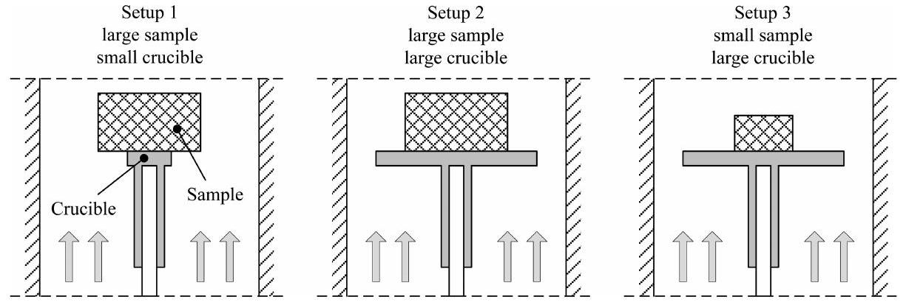
Figure 3. Left to right: Experimental configurations comprised three setups. Setup 1: a large sample (cylinder $R=0.55 \mathrm{~cm}, L=0.72 \mathrm{~cm}$ ) with a small crucible (disk $d_{\text {cruc }}=5 \mathrm{~mm}$ ); setup 2: a large sample with a large crucible (disk $d_{\text {cruc }}=17 \mathrm{~mm}$ ); setup 3: a small sample (cylinder $R=0.31 \mathrm{~cm}, L=0.35 \mathrm{~cm}$ ) with a large crucible.

## - RESULTS AND DISCUSSION

Initial experiments were conducted to ensure operation in a regime where experimental results are limited by chemical kinetics or solid-state diffusion rather than by gaseous mass transfer phenomena or thermodynamics ( $p_{\mathrm{O}_{2}}$ ). To corroborate this, we examined three geometrical configurations, namely, two different cylindrical sample sizes and two different disk crucible sizes, as shown in Figure 3.

Experimental results for each of the three experimental configurations are shown in Figure 4, where the nonstoichiometry

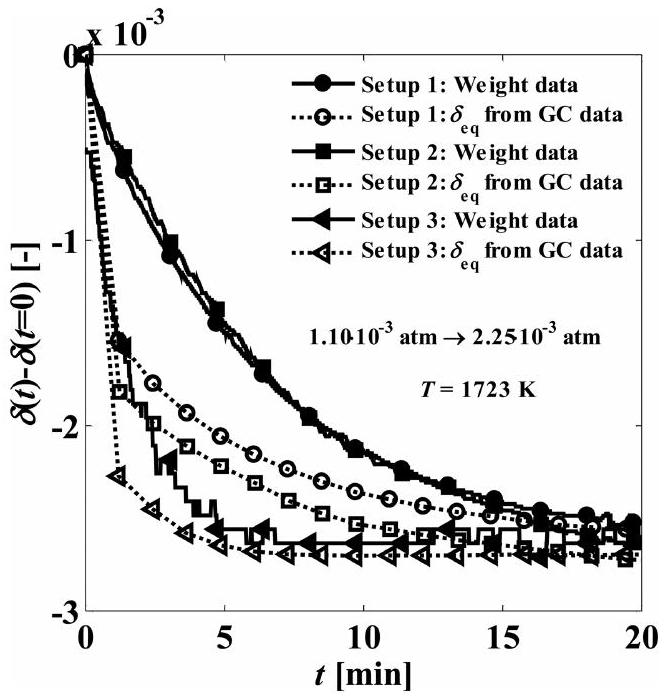
Figure 4. Measured nonstoichiometry from TGA (solid points) and calculated surface nonstoichiometry based on gas composition (hollow points) for the geometrical configurations described in Figure 3. Surface nonstoichiometry is determined by assuming equilibrium between surface and gas phase. Conversion of $p_{\mathrm{O}_{2}}$ (measured by GC) to $\delta$ is based on equilibrium data from Panlener et al. ${ }^{20}$

is shown as a function of time at 1723 K after changing $p_{\mathrm{O}_{2}}$ from $2.25 \cdot 10^{-3} \mathrm{~atm}$ to $1.1 \cdot 10^{-3} \mathrm{~atm}$. The solid lines represent $\delta$ measured by TGA, and the dashed lines are the calculated $\delta$ based on equilibrium data from Panlener et al., ${ }^{20}$ where the oxygen concentration was measured by GC at the outlet of the TGA. As seen for setup 3, the weight data and predicted equilibrium data are nearly identical, indicating that the sample is at chemical equilibrium for all times. This could be due to inadequately rapid gas switching rates or to the release of $\mathrm{O}_{2}$ from the sample which limited the rate, providing a negative feedback. The former was confirmed not to be
the cause because temporal measurements of $\mathrm{O}_{2}$ without a sample present indicated that purging was completed in less than 1.5 min (the time resolution of the GC). In contrast, the large sample used in setup 1 and setup 2 showed a noticeable difference between the measured and calculated nonstoichiometries. The measured equilibration behavior was slower, indicating at the least that the bulk sample did not reach equilibrium with its surrounding atmosphere as the smaller sample probably did. Additionally, the measured relaxation behavior for the large and small crucible sizes was nearly identical, giving confidence that the rates were not limited by mass transfer due to nonuniform flow around the crucible. It is clear from these results that a stepwise change in atmosphere is not a realistic assumption primarily because of the oxygen that is released/ absorbed during reduction and oxidation. In the extreme case, this fully limited the rate of reduction in the smallest sample.

A summary of temporal reduction and oxidation relaxation measurements with setup 1 is shown in Figure 5. The variation of the nonstoichiometry and temperature are plotted over time for various oxygen partial pressure ranges. There is a clear trend of increasing mass loss with increasing temperature and $p_{\mathrm{O}_{2}}$. During isothermal conditions, $p_{\mathrm{O}_{2}}$ was decreased and subsequently increased (conditions as indicated in the figure) with a corresponding increase and decrease in $\delta$ over time. The weight is stabilized at every condition for 1.5 h and, except for the highest temperatures and lowest oxygen partial pressures, mostly re-equilibrates within the given time. For all experiments shown, the rates predicted by equilibrium were faster than the measured weight relaxation rates at the given conditions. For all cases, the furnace was held for 1.5 h at 1073 K initially and at the end of the experimental run to correct for any drift over the course of the experiments.

The relative mass change as a function of time at 1673, 1723, 1773, and 1823 K is shown in Figure 6a for identical changes in $p_{\mathrm{O}_{2}}$. As expected, the degree of reduction increased with temperature. Additionally, the time it takes to achieve complete reduction and oxidation increased with temperature. Further, the oxidation relaxation rates were always faster compared to the corresponding reduction relaxation rates as previously observed for different materials. ${ }^{31,47}$ Because the relative mass change is shown rather than $\delta$, the data began at the same value. This is convenient when directly comparing absolute rates, but the actual initial deviation from stoichiometry for each data set increased with temperature. Because $\delta$ affects the chemical diffusion coefficient (see Figure 1a and b), it is difficult to differentiate between the effect of temperature and $\delta$ on the observed rates without a valid model in hand. This is further seen in Figure 6b in which isothermal ( 1723 K ) reductions and oxidations are shown for various changes in $p_{\mathrm{O}_{2}}$. Here, the rates

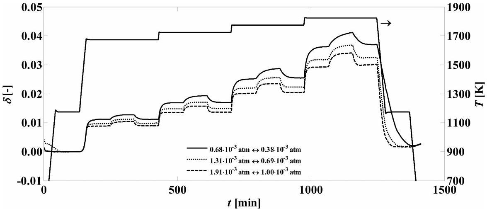
Figure 5. Variation of the nonstoichiometry and temperature during reduction and oxidation recorded over time for various oxygen partial pressure ranges. Experimental configuration: setup 1 (see Figure 3).

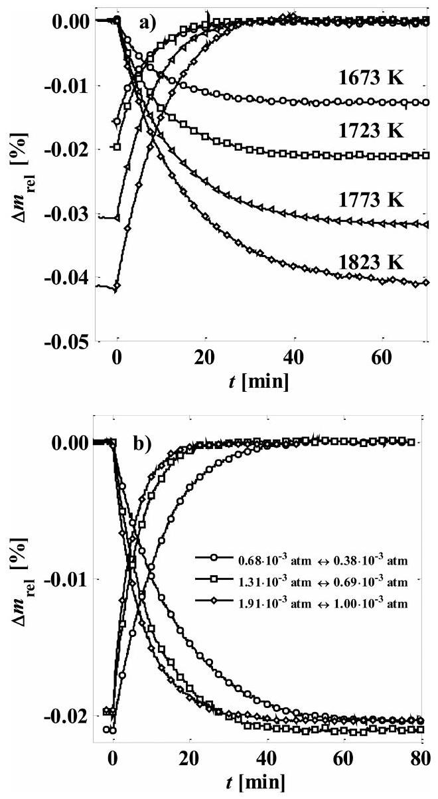
Figure 6. (a) Relative relaxation behavior between $T=1673$ and 1823 K for equivalent $p_{\mathrm{O}_{2}}$ changes $\left(1.31 \cdot 10^{-3} \mathrm{~atm} \leftrightarrow 0.69 \cdot 10^{-3} \mathrm{~atm}\right)$. (b) Relaxation behavior at constant temperature ( $T=1723 \mathrm{~K}$ ) and varying $p_{\mathrm{O}_{2}}$ changes.

clearly increased with $p_{\mathrm{O}_{2}}$ presumably because of higher electronic mobilities with increasing $\mathrm{O}_{2}$ concentration within the bulk. ${ }^{31,36,47}$

An exemplary fit to the model according to eq 7 at $T=1723 \mathrm{~K}$ and at $p_{\mathrm{O}_{2}}=0.69 \cdot 10^{-3}-1.31 \cdot 10^{-3} \mathrm{~atm}$ for the large sample size is shown in Figure 7a, using a grid resolution $N_{\mathrm{x}}=N_{\mathrm{f}}=21$ and $Z= 8.07 \cdot 10^{-5} \mathrm{~cm}^{2} \mathrm{~min}^{-1}$. The diffusion model (open squares) slightly underpredicted initial nonstoichiometries for $t<10 \mathrm{~min}$ and overpredicted for later times. In addition, the constructed
boundary condition relaxation rate within the atmosphere around the sample (dashed-open circles) clearly shows that the surface oxygen concentration was lower than the bulk. An example of the spatially dependent oxygen concentration surrounding the sample is shown in Figure S4 of the Supporting Information. It points out again the importance of a temporally dependent $C_{\infty}$, contrary to the general simplifying assumption that it is constant. A detailed extraction of the spatially dependent solution profile of $\delta$ at $t=7 \mathrm{~min}$ is shown in a surface plot in Figure 7b.
As mentioned previously, the ambipolar diffusion coefficient at each discrete point is adapted for every time step with an inverse dependence on the nonstoichiometry, $\tilde{D}(\delta) \propto \tilde{D}_{0} \cdot \delta^{-1}$. This is consistent with several reports and is partly attributed to interactions among defects at high oxygen nonstoichiometries. ${ }^{31-33,36,47,55}$ For pure ceria, defect interactions become significant for very small deviations from stoichiometry (delta $> 0.01)$. ${ }^{20}$ Katsuki et al. ${ }^{31}$ showed an increasing dependence of the diffusion coefficient with decreasing $\delta$ for Gd-doped ceria. A chemical diffusion coefficient was also proposed as a function of $p_{\mathrm{O}_{2}}$ for reduction/oxidation of $\mathrm{La}_{0.6} \mathrm{Sr}_{0.4} \mathrm{Co}_{0.8} \mathrm{Fe}_{0.2} \mathrm{O}_{3-\delta} \cdot{ }^{47}$ Kishio et al. ${ }^{55}$ proposed a model for the chemical diffusion coefficient with a pre-exponential factor and an activation energy dependent on $\delta$ for $\mathrm{Ba}_{2} \mathrm{YCu}_{3} \mathrm{O}_{7-\delta}$. An inverse dependence is also observed for doped ceria systems as the rate-limiting process is transformed from one determined solely by electron mobility (low delta) to one weighted by electron and vacancy mobilities at large deviations from stoichiometry. ${ }^{4}$ However, such behavior is not expected for pure ceria.

An Arrhenius plot showing $Z(T)$ verses inverse temperature is shown in Figure 8a. The activation energy and the preexponential factor are extracted by a least-squares fit of a firstorder polynomial function. In a subsequent step, ambipolar diffusion coefficients are computed as a function of nonstoichiometry and temperature using the least-squares fitted parameters listed in Table 2 as shown in Figure 8b. Diffusion coefficients are plotted over a range of nonstoichiometry $0.01 \leq \delta \leq 0.04$ at 1673, 1723, 1773, and 1823 K . Maximum and minimum values obtained were $\tilde{D}=4$. $10^{-4} \mathrm{~cm}^{2} \mathrm{~s}^{-1}$ at $\delta=0.01$ and $T=1823 \mathrm{~K}$ and $\tilde{D}=1.5 \cdot 10^{-3} \mathrm{~cm}^{2} \mathrm{~s}^{-1}$ at $\delta=0.04$ and $T=1673 \mathrm{~K}$. As expected, the diffusion coefficient increased with increasing temperature and decreasing nonstoichiometry.

Exemplary oxidation and reduction weight relaxation measurements between 1673 and 1823 K are compared to relaxation rates computed with the 2D diffusion model using the fitted parameters listed in Table 2. Oxidation results are shown in Figure 9a,

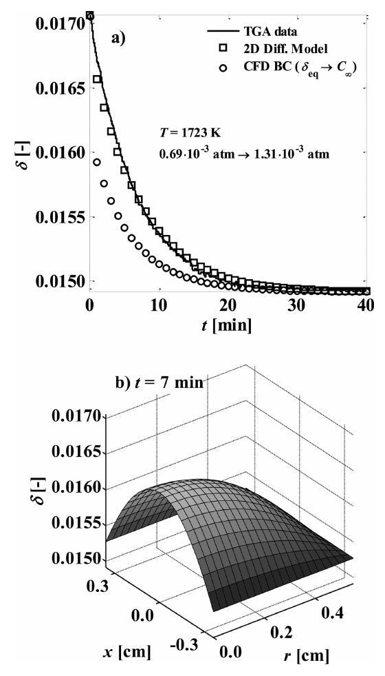
Figure 7. (a) Experimentally measured and calculated (by the 2D diffusion model) nonstoichiometry during oxidation. Also shown is the more rapid decrease of surface nonstoichiometry determined from CFD. This shows that the bulk is not in equilibrium with the transiently changing atmosphere. (b) Solution profile of nonstoichiometry within ceria cylinder at $t=7 \mathrm{~min}$ obtained by the 2D diffusion model.

where the measured model determined nonstoichiometry is plotted as a function of time at $1673,1723,1773$, and 1823 K . At 1673 K , nonstoichiometries are underpredicted for short times $(t<10 \mathrm{~min})$ and are slightly overpredicted for longer times. In general, however, there is very good agreement over all temperatures and deviations from nonstoichiometry investigated. The model is also able to predict the slower weight relaxation measured for the reduction as shown in Figure 9b. This capability is based on slower changes of $C_{\infty}$ combined with the inverse dependence of the ambipolar diffusion coefficient on the oxygen concentration in the bulk.

Ambipolar diffusion coefficients of various sources at $\delta=0.01$ are collected and compared to the fitted diffusion coefficient obtained in this work at $\delta=0.01$. The comparison is shown in Figure 10. Chueh and Haile ${ }^{4}$ reported diffusion coefficients for $15 \% \mathrm{Sm}$-doped ceria that are an order of magnitude higher compared to those expected for pure ceria. Diffusion coefficients for pure ceria computed from electronic and ionic conductivities documented by Blumenthal and Sharma, ${ }^{28}$ Hwang and Mason, ${ }^{43}$ Gerhardt-Anderson and Nowick, ${ }^{56}$ Xiong et al., ${ }^{57}$ Blumenthal and Hofmaier, ${ }^{26}$ Panhans and Blumenthal, ${ }^{25}$ and VanHandel and Blumenthal ${ }^{30}$ showed a broad range at $T=1073 \mathrm{~K}$ from $10^{-6}$ up to $2 \cdot 10^{-4} \mathrm{~cm}^{2} \mathrm{~s}^{-1}$. The relationship between the self-diffusion coefficient and the conductivity of species assuming it behaves ideally was given by ${ }^{4}$

$$
D_{\mathrm{i}}=\frac{k \cdot T \cdot \mu_{\mathrm{i}}}{z_{\mathrm{i}} e}=\frac{k \cdot T \cdot \sigma_{\mathrm{i}}}{\left(z_{\mathrm{i}} e\right)^{2} \cdot \delta} \cdot \frac{M_{\mathrm{CeO}_{2}}}{N_{\mathrm{A}} \cdot \rho_{\mathrm{CeO}_{2}}}
$$

where $\sigma_{\mathrm{i}}$ is the electrical conductivity of species i and $N_{\mathrm{A}}$ is the Avogadro number. It has been reported that ceria behaves as an

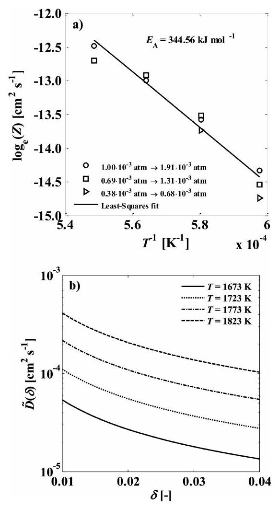
Figure 8. (a) Arrhenius plot with least-squares fit of $Z(T)$. Extracted parameters are $\tilde{D}_{0}=3.0888 \cdot 10^{4} \mathrm{~cm}^{2} \mathrm{~s}^{-1}$ and $E_{\mathrm{A}}=344.56 \mathrm{~kJ} \mathrm{~mol}^{-1}$. (b) Resulting ambipolar diffusion coefficient as a function of nonstoichiometry for various temperatures.

Table 2. Fitted Parameters of Diffusion Model
| $\tilde{D}_{0}$ | $3.0888 \cdot 10^{-4}$ | $\mathrm{~cm}^{2} \mathrm{~s}^{-1}$ |
| :---: | :---: | :---: |
| $E_{\mathrm{A}}$ | 344.56 | $\mathrm{~kJ} \mathrm{~mol}^{-1}$ |

ideal solution below 0.01. ${ }^{4}$ The diffusion coefficients obtained in this work above 1673 K are roughly 1 to 2 orders of magnitude lower compared to the values computed from electronic and ionic conductivities documented by Blumenthal and Sharma ${ }^{28}$ and Hwang and Mason. ${ }^{43}$ The discrepancy may be partly due to the ideal solution assumption for determining the diffusion coefficients from conductivity data. Additionally, the range of nonstoichiometries over which conductivity data is reported and ours varies, leading to a loss in accuracy during extrapolation.

The application of the model to guide the solar reactor design can be seen in Figure 11, where the necessary time required to reduce ceria is shown for a hypothetical structure with three different characteristic diffusion length scales: (1) the cylinder used in this study ( $d=1.1 \mathrm{~cm}, L=0.72 \mathrm{~cm}$ ), (2) a strut of a reticulated foam ( $d=0.4 \mathrm{~mm}, L=2 d$ ); and (3) a particle $(d=10 \mu \mathrm{~m}, L=d) . C_{\infty}$ is assumed to be constant for cases 2 and 3. Changes in stoichiometry presented are small to allow for a direct comparison of one experimental result $\left(T=1723 \mathrm{~K}\right.$ and $p_{\mathrm{O}_{2}}=0.69$. $10^{-3}-1.31 \cdot 10^{-3} \mathrm{~atm}$ ). For small length scales of $\sim 10 \mu \mathrm{~m}$ (i.e., particles in aerosolized form), reduction is expected to occur in the order of milliseconds. Thus, reactors based on aerosol particle flows could theoretically achieve very fast overall reduction rates provided removal of the evolved $\mathrm{O}_{2}$ from the surface and heat transfer rates are not limiting. For length scales of $\sim 0.4 \mathrm{~mm}$, similar to those used in a solar reactor containing reticulated foams, ${ }^{16}$ reduction times are expected to be on the order of seconds. This

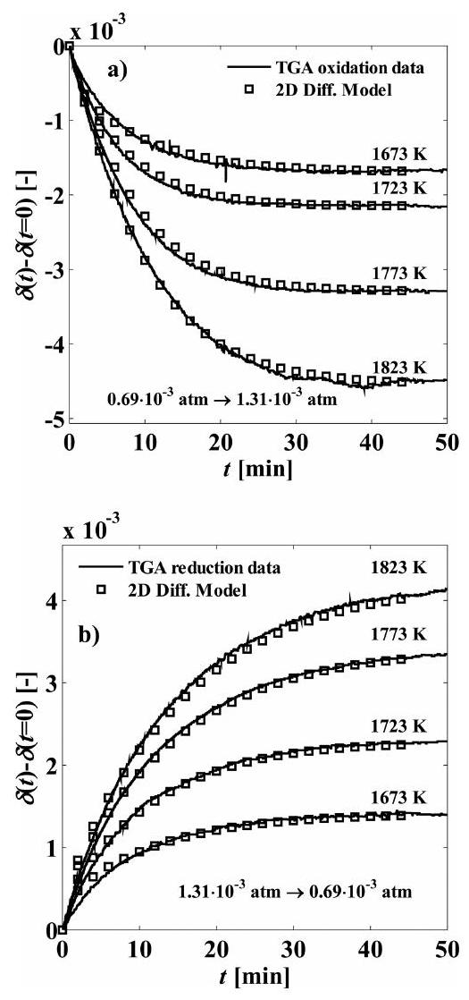
Figure 9. (a) Measured and calculated (by 2D diffusion model) nonstoichiometry as a function of time at various temperatures. (b) Slower equilibration of nonstoichiometry predicted with the 2D diffusion model and compared with nonstoichiometry from TGA at various temperatures.

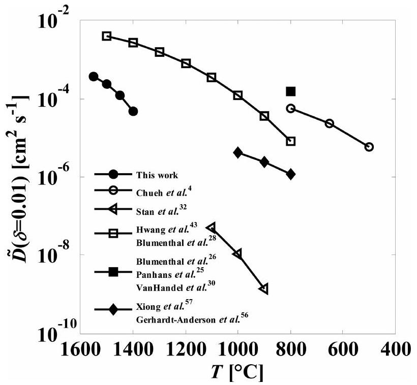
Figure 10. Comparison of fitted diffusion coefficients from this work ( $\delta=0.01$ ) with documented values by Chueh and Haile, ${ }^{4}$ Stan et al., ${ }^{32}$ Blumenthal and Sharma, ${ }^{28}$ Hwang and Mason, ${ }^{43}$ Gerhardt-Anderson and Nowick, ${ }^{56}$ Xiong et al., ${ }^{57}$ Blumenthal and Hofmaier, ${ }^{26}$ Panhans and Blumenthal, ${ }^{25}$ and VanHandel and Blumenthal. ${ }^{30}$

agrees with experimental results that indicated that heat and mass transfer are rate controlling for such structures within a solar reactor and that solid-state diffusion and chemical kinetics are not.

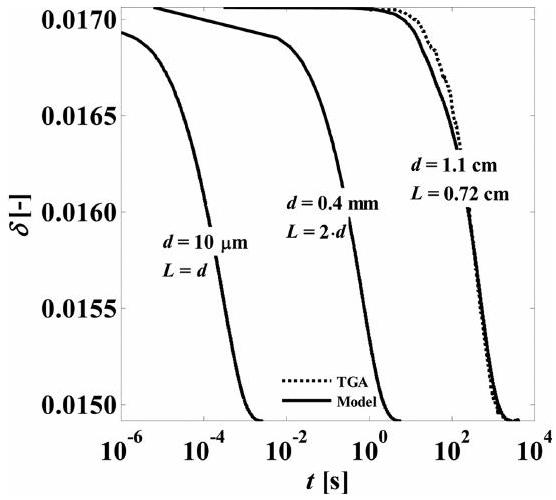
Figure 11. Predicted equilibration of nonstoichiometry at $T=1723 \mathrm{~K}$ from $0.69 \cdot 10^{-3} \mathrm{~atm} \rightarrow 1.31 \cdot 10^{-3} \mathrm{~atm}$ for pure ceria with three characteristic diffusion length scales: (1) the cylinder used in this study ( $d=1.1 \mathrm{~cm}, L=0.72 \mathrm{~cm}$ ), (2) a strut of a reticulated foam ( $d= 0.4 \mathrm{~mm}, L=2 d$ ), and (3) a particle ( $d=10 \mu \mathrm{~m}, L=d$ ).

While the experimental results and accompanying modeling agree well within the range of conditions considered, extrapolation to other conditions is questionable. For example, surface-limited effects begin to dominate as the characteristic length scale becomes smaller and smaller. Additionally, our model is not able to describe oxidation rates at very high oxygen concentrations ( $p_{\mathrm{O}_{2}} \approx 0.35 \mathrm{~atm}$ ) where the experimentally observed rates are much faster than those predicted (see Figure S5 of the Supporting Information). This is probably related to the fact that the ambipolar diffusion coefficient's inverse dependence on temperature does not capture the true mechanistics of the oxygen concentration dependence. This dependency was assumed on the basis of observations in the literature and was not confirmed to fit better than other types of concentration dependencies, for example, higher order functions or activation energy dependency.

## - CONCLUSION

The reduction and oxidation of ceria via isothermal thermogravimetric weight relaxation experiments was carried out to investigate the rates' dependency on temperature and oxygen partial pressure. It is shown that the rate of oxygen removal and uptake at 16731823 K is dependent on the ambipolar diffusion of oxygen, which increased with increasing temperature and decreasing nonstoichiometry. Additionally, the transient oxygen concentrations due to purging and to oxygen evolution/uptake during reduction/ oxidation were shown to affect $p_{\mathrm{O}_{2}}$ locally at the sample surface and, consequently, the rate of oxygen diffusion within the lattice.

We have shown the advantages of a numerical based analysis compared to typically applied analytical approaches. ${ }^{31,34,36,47,55,58}$ The numerical model is capable of accounting for realistic concentration dependent diffusion coefficients and transient gas phase boundary conditions related to oxygen release and uptake during reduction and oxidation. Furthermore, the model presented is capable of accurately describing redox rates over the range of conditions investigated relevant to solar thermochemical cycles, namely, $T=1673-1823 \mathrm{~K}$ and $p_{\mathrm{O}_{2}}=3 \times 10^{-4}-2.5 \cdot 10^{-3} \mathrm{~atm}$.

## - ASSOCIATED CONTENT

## (S) Supporting Information

The manuscript was written through contributions of all authors. All authors have given approval to the final version of the manuscript. This material is available free of charge via the Internet at http://pubs.acs.org.

## AUTHOR INFORMATION

## Corresponding Author

*E-mail: jscheffe@ethz.ch.

## Notes

The authors declare no competing financial interest.

## ACKNOWLEDGMENTS

Financial support by the Swiss Competence Center Energy \& Mobility, by the Helmholtz-Gemeinschaft Deutscher Forschungszentren (Impuls- und Vernetzungsfonds - Virtuelles Institut SolarSyngas) and by the European Research Council under the European Union's ERC Advanced Grant (SUNFUELS - $\mathrm{n}^{\circ}$ 320541) is gratefully acknowledged.

## - NOMENCLATURE

$c_{\text {ion }}$ concentration of oxygen vacancies $\left(\mathrm{cm}^{-3}\right)$
$c_{\mathrm{el}}$ concentration of electrons $\left(\mathrm{cm}^{-3}\right)$
C theoretical oxygen concentration of diffusion model (-)
$C_{0} \quad$ initial equilibrium concentration (-)
$C_{\infty} \quad$ final equilibrium concentration (-)
$C_{\text {bottle }}$ oxygen percentages of moles within $\mathrm{Ar} / \mathrm{O}_{2}$ mixture (mol \%)
$\mathrm{Ce}_{\mathrm{Ce}}^{\prime} \quad$ electron on cerium lattice side
$\mathrm{Ce}_{\mathrm{Ce}}^{x} \quad$ cerium ion on cerium lattice side
$C_{\text {mean }}$ mean sample concentration (-)
$C_{\text {gas }}$ concentration based on gas phase around sample surface (-)
d characteristic diffusion length (cm)
$d_{\text {cruc }}$ crucible diameter (mm)
$\tilde{D}$ ambipolar oxygen diffusion coefficient ( $\mathrm{cm}^{2} \mathrm{~s}^{-1}$ )
$\tilde{D}_{0}$ maximum ambipolar diffusion coefficient at infinite temperature ( $\mathrm{cm}^{2} \mathrm{~s}^{-1}$ )
$D_{\text {el }}$ self-diffusion coefficient of electrons $\left(\mathrm{cm}^{2} \mathrm{~s}^{-1}\right)$
$D_{\mathrm{i}} \quad$ diffusion coefficient of species i ( $\mathrm{cm}^{2} \mathrm{~s}^{-1}$ )
$D_{\text {ion }}$ self-diffusion coefficient of oxygen vacancies ( $\mathrm{cm}^{2} \mathrm{~s}^{-1}$ )
$D_{\mathrm{i}, 0}$ maximum diffusion coefficient at infinite temperature ( $\mathrm{cm}^{2} \mathrm{~s}^{-1}$ )
$e \quad$ unit charge, $-1.602176565 \cdot 10^{-19} \mathrm{C}$
$E_{\mathrm{A}}$ activation energy $\left(\mathrm{J} \mathrm{mol}^{-1}\right)$
$k$ Stefan-Boltzmann constant, $1.3806488 \cdot 10^{-23} \mathrm{~J} \mathrm{~K}^{-1}$
$L \quad$ length of ceria cylinder (cm)
$\dot{m}_{\text {in }}$ total molar gas flow rate ( $\mathrm{mol} \mathrm{s}^{-1}$ )
$m_{\mathrm{s}} \quad$ ceria sample mass ( mg )
$M_{\mathrm{Ar}} \quad$ molar mass of argon ( $\mathrm{g} \mathrm{mol}^{-1}$ )
$M_{\text {mix }}$ molar mass of purge mixture ( $\mathrm{g} \mathrm{mol}^{-1}$ )
$M_{\mathrm{CeO}_{2}}$ molar mass of ceria ( $\mathrm{g} \mathrm{mol}^{-1}$ )
$M_{\mathrm{O}} \quad$ molar mass of single oxygen atoms ( $\mathrm{g} \mathrm{mol}^{-1}$ )
$M_{\mathrm{O}_{2}} \quad$ molar mass of oxygen ( $\mathrm{g} \mathrm{mol}^{-1}$ )
$\dot{n}_{\mathrm{Ar}}$ molar flow rate of Ar purge flow (mol s-1)
$\dot{n}_{\text {mix }}$ molar flow rate of $\mathrm{Ar} / \mathrm{O}_{2}$ mixture ( $\mathrm{mol} \mathrm{s}^{-1}$ )
$N_{\mathrm{A}} \quad$ Avogadro constant, $6.0221412927 \cdot 10^{23} \mathrm{~mol}^{-1}$
$N_{\mathrm{r}} \quad$ radial grid resolution (-)
$N_{\mathrm{x}} \quad$ axial grid resolution (-)
$\mathrm{O}_{\mathrm{O}}^{x} \quad$ oxygen ion on oxygen lattice side
$p_{\mathrm{O}_{2}} \quad$ oxygen partial pressure (atm)
$p_{\text {tot }}$ total pressure (atm)
$r$ radial direction (cm)
$R \quad$ radius of ceria cylinder (cm)
$R_{\text {gas }}$ universal gas constant $\left(\mathrm{J} \mathrm{mol}^{-1} \mathrm{~K}^{-1}\right)$
$t \quad$ time (min)
$T$ temperature (K)
$T_{\text {amb }} \quad$ ambient air temperature (K)
$T_{\mathrm{H}} \quad$ reduction temperature (K)
$T_{\mathrm{L}}$ oxidation temperature (K)
$V_{\mathrm{O}}^{\bullet \bullet}$ oxygen vacancy
$\dot{V}_{T_{\text {anb }}, \mathrm{Ar}}$ volumetric flow rate of pure Ar purge ( $\mathrm{m}^{3} \mathrm{~s}^{-1}$ )
$\dot{V}_{T_{\text {amb }} \text {,mix }}^{\text {amb }}$ volumetric flow rate of $\mathrm{Ar} / \mathrm{O}_{2}$ mixture ( $\mathrm{m}^{3} \mathrm{~s}^{-1}$ )
$w_{\mathrm{O}_{2}}$ oxygen mass fraction (-)
$x$ axial direction (cm)
$z_{\mathrm{i}} \quad$ number of unit charges (-)
$Z \quad$ fitted pre-exponential factor $\left(\mathrm{cm}^{2} \mathrm{~s}^{-1}\right)$
$\alpha \quad$ stoichiometric amount of water (-)
$\beta$ stoichiometric amount of $\mathrm{CO}_{2}$ or $\mathrm{CO}(-)$
$\delta$ oxygen nonstoichiometry of ceria (-)
$\delta_{0}$ initial oxygen nonstoichiometry of ceria (-)
$\delta_{\text {eq }} \quad$ equilibrium oxygen nonstoichiometry of ceria (-)
$\delta_{\mathrm{f}} \quad$ final oxygen nonstoichiometry of ceria (-)
$\Delta m_{\text {eq }}$ equilibrium oxygen mass defect of ceria (mg)
$\Delta m_{\text {rel }}$ relative sample mass change (\%)
$\mu_{\mathrm{el}}$ electronic mobility ( $\mathrm{cm}^{2} \mathrm{~V}^{-1} \mathrm{~s}^{-1}$ )
$\mu_{\mathrm{i}} \quad$ mobility of species $\mathrm{i}\left(\mathrm{cm}^{2} \mathrm{~V}^{-1} \mathrm{~s}^{-1}\right)$
$\rho_{\mathrm{CeO}_{2}}$ density of ceria sample $\left(\mathrm{g} \mathrm{cm}^{-3}\right)$
$\sigma_{\mathrm{i}} \quad$ electrical conductivity of species i ( $\Omega^{-1} \mathrm{~cm}^{-1}$ )

## - REFERENCES

(1) Romero, M.; Steinfeld, A. Concentrating Solar Thermal Power and Thermochemical Fuels. Energy Environ. Sci. 2012, 5 (11), 9234-9245.
(2) Chueh, W. C.; Falter, C.; Abbott, M.; Scipio, D.; Furler, P.; Haile, S. M.; Steinfeld, A. High-Flux Solar-Driven Thermochemical Dissociation of $\mathrm{CO}_{2}$ and $\mathrm{H}_{2} \mathrm{O}$ Using Nonstoichiometric Ceria. Science 2010, 330 (6012), 1797-1801.
(3) Abanades, S.; Flamant, G. Thermochemical Hydrogen Production from a Two-Step Solar-Driven Water-Splitting Cycle Based on Cerium Oxides. Solar Energy 2006, 80 (12), 1611-1623.
(4) Chueh, W. C.; Haile, S. M. A Thermochemical Study of Ceria: Exploiting an Old Material for New Modes of Energy Conversion and $\mathrm{CO}_{2}$ Mitigation. Philos. Trans. R. Soc., A: Math., Phys. Eng. Sci. 2010, 368 (1923), 3269-3294.
(5) Lapp, J.; Davidson, J. H.; Lipiński, W. Heat Transfer Analysis of a Solid-Solid Heat Recuperation System for Solar-Driven Nonstoichiometric Redox Cycles. J. Solar Energy Eng. 2013, 135 (3), 031004031004.
(6) Bader, R.; Venstrom, L. J.; Davidson, J. H.; Lipiński, W. Thermodynamic Analysis of Isothermal Redox Cycling of Ceria for Solar Fuel Production. Energy Fuels 2013, 27 (9), 5533-5544.
(7) Scheffe, J. R.; Steinfeld, A. Thermodynamic Analysis of CeriumBased Oxides for Solar Thermochemical Fuel Production. Energy Fuels 2012, 26 (3), 1928-1936.
(8) Singh, P.; Hegde, M. S. $\mathrm{Ce}_{0.67} \mathrm{Cr}_{0.33} \mathrm{O}_{2.11}$ : A New Low-Temperature $\mathrm{O}_{2}$ Evolution Material and $\mathrm{H}_{2}$ Generation Catalyst by Thermochemical Splitting of Water †. Chem. Mater. 2009, 22 (3), 762-768.
(9) Chueh, W. C.; Haile, S. M. Ceria as a Thermochemical Reaction Medium for Selectively Generating Syngas or Methane from $\mathrm{H}_{2} \mathrm{O}$ and $\mathrm{CO}_{2}$. ChemSusChem 2009, 2 (8), 735-739.
(10) Le Gal, A.; Abanades, S.; Flamant, G. $\mathrm{CO}_{2}$ and $\mathrm{H}_{2} \mathrm{O}$ Splitting for Thermochemical Production of Solar Fuels Using Nonstoichiometric Ceria and Ceria/Zirconia Solid Solutions. Energy Fuels 2011, 25 (10), 4836-4845.
(11) Petkovich, N. D.; Rudisill, S. G.; Venstrom, L. J.; Boman, D. B.; Davidson, J. H.; Stein, A. Control of Heterogeneity in Nanostructured $\mathrm{Ce}_{1-x} \mathrm{Zr}_{x} \mathrm{O}_{2}$ Binary Oxides for Enhanced Thermal Stability and Water Splitting Activity. J. Phys. Chem. C 2011, 115 (43), 21022-21033.
(12) Venstrom, L. J.; Petkovich, N.; Rudisill, S.; Stein, A.; Davidson, J. H. The Effects of Morphology on the Oxidation of Ceria by Water and Carbon Dioxide; American Society of Mechanical Engineers: New York, U.S., 2012; Vol. 134.
(13) Abanades, S.; Legal, A.; Cordier, A.; Peraudeau, G.; Flamant, G.; Julbe, A. Investigation of Reactive Cerium-Based Oxides for $\mathrm{H}_{2}$

Production by Thermochemical Two-Step Water-Splitting. J. Mater. Sci. 2010, 45 (15), 4163-4173.
(14) Meng, Q.-L.; Lee, C.-i.; Ishihara, T.; Kaneko, H.; Tamaura, Y. Reactivity of $\mathrm{CeO}_{2}$-Based Ceramics for Solar Hydrogen Production via a Two-Step Water-Splitting Cycle with Concentrated Solar Energy. Int. J. Hydrogen Energy 2011, 36 (21), 13435-13441.
(15) Furler, P.; Scheffe, J. R.; Steinfeld, A. Syngas Production by Simultaneous Splitting of $\mathrm{H}_{2} \mathrm{O}$ and $\mathrm{CO}_{2}$ via Ceria Redox Reactions in a High-Temperature Solar Reactor. Energy Environ. Sci. 2012, 5 (3), 6098-6103.
(16) Furler, P.; Scheffe, J.; Gorbar, M.; Moes, L.; Vogt, U.; Steinfeld, A. Solar Thermochemical $\mathrm{CO}_{2}$ Splitting Utilizing a Reticulated Porous Ceria Redox System. Energy Fuels 2012, 26 (11), 7051-7059.
(17) Mogensen, M.; Sammes, N. M.; Tompsett, G. A. Physical, Chemical and Electrochemical Properties of Pure and Doped Ceria. Solid State Ionics 2000, 129 (1-4), 63-94.
(18) Sun, C.; Li, H.; Chen, L. Nanostructured Ceria-Based Materials: Synthesis, Properties, and Applications. Energy Environ. Sci. 2012, 5 (9), 8475-8505.
(19) Garnier, J. E.; Blumenthal, R. N.; Panlener, R. J.; Sharma, R. K. A Thermodynamic Study on CaO-Doped Nonstoichiometric Cerium Dioxide. J. Phys. Chem. Solids 1976, 37 (4), 368-378.
(20) Panlener, R. J.; Blumenthal, R. N.; Garnier, J. E. A Thermodynamic Study of Nonstoichiometric Cerium Dioxide. J. Phys. Chem. Solids 1975, 36 (11), 1213-1222.
(21) Toft Sorensen, O. Thermodynamic Studies of the Phase Relationships of Nonstoichiometric Cerium Oxides at Higher Temperatures. J. Solid State Chem. 1976, 18 (3), 217-233.
(22) Kobayashi, T.; Wang, S.; Dokiya, M.; Tagawa, H.; Hashimoto, T. Oxygen Nonstoichiometry of $\mathrm{Ce}_{1-y} \mathrm{Sm}_{y} \mathrm{O}_{2-0.5 y-x}(y=0.1,0.2)$. Solid State Ionics 1999, 126 (3), 349-357.
(23) Otake, T.; Yugami, H.; Yashiro, K.; Nigara, Y.; Kawada, T.; Mizusaki, J. Nonstoichiometry of $\mathrm{Ce}_{1-X} \mathrm{Y}_{X} \mathrm{O}_{2-0.5 X-\delta}(X=0.1,0.2)$. Solid State Ionics 2003, 161 (1), 181-186.
(24) Wang, S.; Inaba, H.; Tagawa, H.; Dokiya, M.; Hashimoto, T. Nonstoichiometry of $\mathrm{Ce}_{0.9} \mathrm{Gd}_{0.1} \mathrm{O}_{1.95-x}$. Solid State Ionics 1998, 107 (12), 73-79.
(25) Panhans, M. A.; Blumenthal, R. N. A Thermodynamic and Electrical Conductivity Study of Nonstoichiometric Cerium Dioxide. Solid State Ionics 1993, 60 (4), 279-298.
(26) Blumenthal, R. N.; Hofmaier, R. L. The Temperature and Compositional Dependence of the Electrical Conductivity of Nonstoichiometric $\mathrm{CeO}_{2-x^{*}}$ J. Electrochem. Soc. 1974, 121 (1), 126-131.
(27) Lai, W.; Haile, S. M. Impedance Spectroscopy as a Tool for Chemical and Electrochemical Analysis of Mixed Conductors: A Case Study of Ceria. J. Am. Ceram. Soc. 2005, 88 (11), 2979-2997.
(28) Blumenthal, R. N.; Sharma, R. K. Electronic Conductivity in Nonstoichiometric Cerium Dioxide. J. Solid State Chem. 1975, 13 (4), 360-364.
(29) Tuller, H. L.; Nowick, A. S. Defect Structure and Electrical Properties of Nonstoichiometric $\mathrm{CeO}_{2}$ Single Crystals. J. Electrochem. Soc. 1979, 126 (2), 209-217.
(30) VanHandel, G. J.; Blumenthal, R. N. The Temperature and Oxygen Pressure Dependence of the Ionic Transference Number of Nonstoichiometric $\mathrm{CeO}_{2-x}$. J. Electrochem. Soc. 1974, 121 (9), 11981202.
(31) Katsuki, M.; Wang, S.; Yasumoto, K.; Dokiya, M. The Oxygen Transport in Gd-Doped Ceria. Solid State Ionics 2002, 154-155 (0), 589-595.
(32) Stan, M.; Zhu, Y. T.; Jiang, H.; Butt, D. P. Kinetics of Oxygen Removal from Ceria. J. Appl. Phys. 2004, 95 (7), 3358-3361.
(33) Knauth, P.; Tuller, H. L. Nonstoichiometry and Relaxation Kinetics of Nanocrystalline Mixed Praseodymium-Cerium Oxide $\mathrm{Pr}_{0.7} \mathrm{Ce}_{0.3} \mathrm{O}_{2-\mathbf{x}}$. J. Eur. Ceram. Soc. 1999, 19 (6), 831-836.
(34) Gopal, C. B.; Haile, S. M. An electrical conductivity relaxation study of oxygen transport in samarium doped ceria. J. Mater. Chem. A 2014, 2 (7), 2405-2417.
(35) Kroger, F. A.; Vink, H. J. Relations between The Concentrations of Imperfections in Crystalline Solids. Solid State Physics 1956, 3, 307435.
(36) Yashiro, K.; Onuma, S.; Kaimai, A.; Nigara, Y.; Kawada, T.; Mizusaki, J.; Kawamura, K.; Horita, T.; Yokokawa, H. Mass Transport Properties of $\mathrm{Ce}_{0.9} \mathrm{Gd}_{0.1} \mathrm{O}_{2-\delta}$ at the Surface and in the Bulk. Solid State Ionics 2002, 152-153 (0), 469-476.
(37) Schetzina, J. F.; McKelvey, J. P. Ambipolar Transport of Electrons and Holes in Anisotropic Crystals. Phys. Rev. B 1970, 2 (6), 1869-1874.
(38) Smyth, D. M. The Defect Chemistry of Metal Oxides; Oxford University Press: New York, 2000.
(39) Boureau, G.; Masmoudi, O.; Tetot, R. Electrical Conductivity in Nonstoichiometric Cerium Dioxide. Solid State Commun. 1991, 79 (4), 299-302.
(40) Tuller, H. L.; Nowick, A. S. Small Polaron Electron Transport in Reduced $\mathrm{CeO}_{2}$ Single Crystals. J. Phys. Chem. Solids 1977, 38 (8), 859867.
(41) Millot, F.; Gerdanian, P. Thermomigration dans $\mathrm{CeO}_{2-\mathrm{x}}$. J. Nucl. Mater. 1983, 116 (1), 55-62.
(42) Naik, I. K.; Tien, T. Y. Small-Polaron Mobility in Nonstoichiometric Cerium Dioxide. J. Phys. Chem. Solids 1978, 39 (3), 311-315.
(43) Hwang, J. H.; Mason, T. O. Defect Chemistry and Transport Properties of Nanocrystalline Cerium Oxide. Z. Phys. Chem. 1998, 207 (Part_1_2), 21-38.
(44) Crank, J. The Mathematics of Diffusion, 2d ed.; Clarendon Press: Oxford, U.K., 1975.
(45) Cussler, E. L. Diffusion, Mass Transfer in Fluid Systems; Cambridge University Press: Cambridge, U.K., 1984.
(46) Hannay, N. B. Reactivity of Solids; Plenum Press: New York, 1976.
(47) Katsuki, M.; Wang, S.; Dokiya, M.; Hashimoto, T. High Temperature Properties of $\mathrm{La}_{0.6} \mathrm{Sr}_{0.4} \mathrm{Co}_{0.8} \mathrm{Fe}_{0.2} \mathrm{O}_{3-\mathrm{d}}$ Oxygen Nonstoichiometry and Chemical Diffusion Constant. Solid State Ionics 2003, 156 (3-4), 453-462.
(48) Ferziger, J. H.; Perić, M. Computational Methods for Fluid Dynamics, 3rd ed.; Springer: Berlin, 2002.
(49) Lomax, H.; Pulliam, T. H.; Zingg, D. W. Fundamentals of Computational Fluid Dynamics; Springer: Berlin, 2001.
(50) Kakaç, S.; Yener, Y. Heat Conduction, 3rd ed.; Taylor \& Francis: Washington, DC, 1993.
(51) Incropera, F. P.; DeWitt, D. P. Fundamentals of Heat and Mass Transfer, 5th ed.; J. Wiley: New York, 2002.
(52) Carslaw, H. S.; Jaeger, J. C. Conduction of Heat in Solids, 2nd ed.; Oxford: New York, 1986.
(53) Schneider, P. J. Conduction Heat Transfer; Addison-Wesley Pub. Co.: Cambridge, MA, 1955.
(54) Poulikakos, D. Conduction Heat Transfer; Prentice Hall: Englewood Cliffs, NJ, 1994.
(55) Kishio, K.; Suzuki, K.; Hasegawa, T.; Yamamoto, T.; Kitazawa, K.; Fueki, K. Study on Chemical Diffusion of Oxygen in $\mathrm{Ba}_{2} \mathrm{YCu}_{3} \mathrm{O}_{7-\delta} . J$. Solid State Chem. 1989, 82 (2), 192-202.
(56) Gerhardt-Anderson, R.; Nowick, A. S. Ionic Conductivity of $\mathrm{CeO}_{2}$ with Trivalent Dopants of Different Ionic Radii. Solid State Ionics 1981, 5 (0), 547-550.
(57) Xiong, Y.-P.; Kishimoto, H.; Yamaji, K.; Yoshinaga, M.; Horita, T.; Brito, M. E.; Yokokawa, H. Electronic Conductivity of $\mathrm{CeO}_{2}$ : Its Dependence on Oxygen Partial Pressure and Temperature. Electrochem. Solid-State Lett. 2010, 13 (3), B21-B24.
(58) Yasuda, I.; Hikita, T. Precise Determination of the Chemical Diffusion Coefficient of Calcium-Doped Lanthanum Chromites by Means of Electrical Conductivity Relaxation. J. Electrochem. Soc. 1994, 141 (5), 1268-1273.

[^0]:    Received: January 22, 2014
    Published: January 29, 2014

