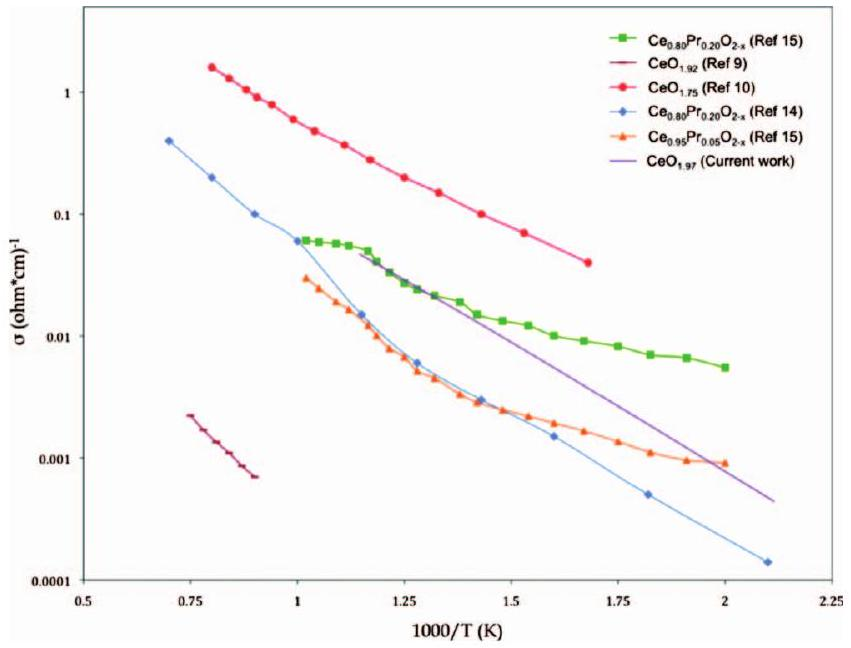
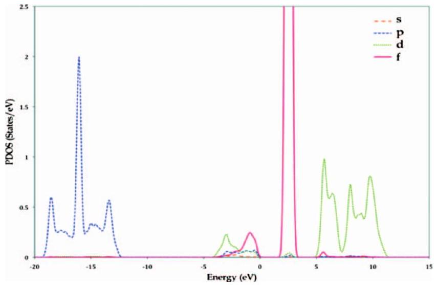
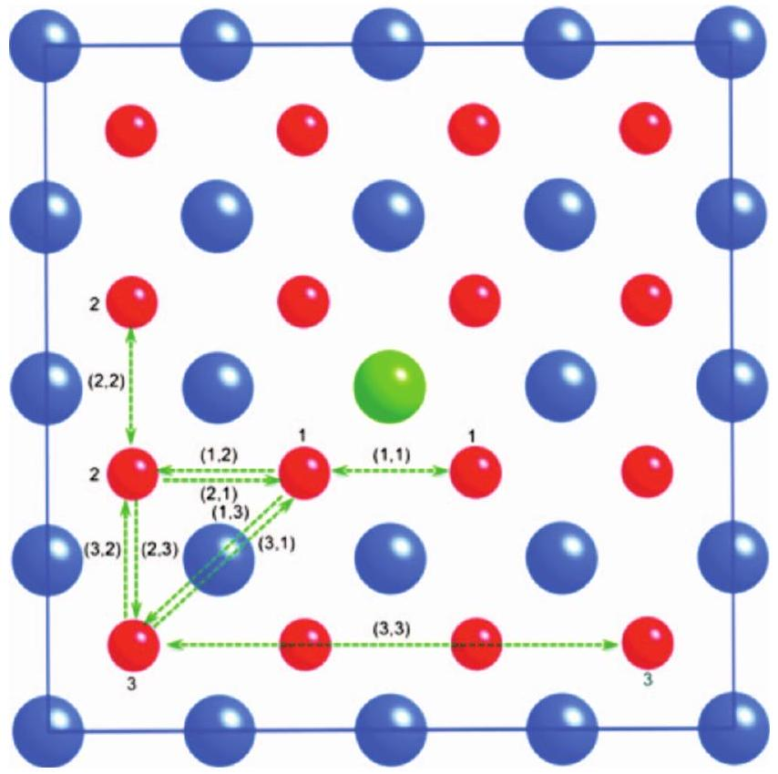
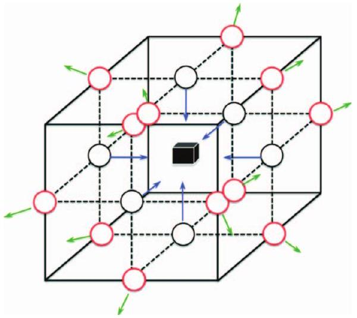
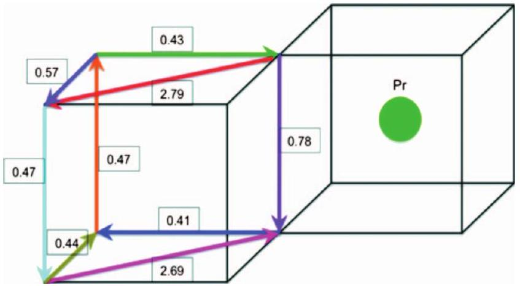

## RESEARCH ARTICLE | MARCH 012010

## Oxygen vacancy migration in ceria and Pr-doped ceria: A $\mathrm{DFT}+U$ study

Pratik P. Dholabhai; James B. Adams; Peter Crozier; Renu Sharma
J. Chem. Phys. 132, 094104 (2010)
https://doi.org/10.1063/1.3327684

## Articles You May Be Interested In

Impact of doping on the ionic conductivity of ceria: A comprehensive model
J. Chem. Phys. (June 2013)

Oxygen vacancy ordering in heavily rare-earth-doped ceria
Appl. Phys. Lett. (October 2006)
Direct evidence of dopant segregation in Gd-doped ceria
Appl. Phys. Lett. (March 2011)

## AIP Advances

## Why Publish With Us?

# Oxygen vacancy migration in ceria and Pr-doped ceria: A DFT + U study 

Pratik P. Dholabhai, ${ }^{1, a)}$ James B. Adams, ${ }^{1, b)}$ Peter Crozier, ${ }^{2, c)}$ and Renu Sharma ${ }^{2, d)}$ ${ }^{1}$ School of Mechanical, Aerospace, Chemical and Materials Engineering, Arizona State University, Tempe, Arizona 85287, USA ${ }^{2}$ School of Mechanical, Aerospace, Chemical and Materials Engineering, Center for Solid State Science, Arizona State University, Tempe, Arizona 85287, USA

(Received 12 November 2009; accepted 29 January 2010; published online 1 March 2010)

#### Abstract

Oxygen vacancy formation and migration in ceria ( $\mathrm{CeO}_{2}$ ) is central to its performance as an ionic conductor. It has been observed that ceria doped with suitable aliovalent cationic dopants improves its ionic conductivity. To investigate this phenomenon, we present total energy calculations within the framework of density functional theory to study oxygen vacancy migration in ceria and Pr-doped ceria (PDC). We report activation energies for oxygen vacancy formation and migration in undoped ceria and for different migration pathways in PDC. The activation energy value for oxygen vacancy migration in undoped ceria was found to be in reasonable agreement with the available experimental and theoretical results. Conductivity values for reduced undoped ceria calculated using theoretical activation energy and attempt frequency were found in reasonably good agreement with the experimental data. For PDC, oxygen vacancy formation and migration were investigated at first, second, and third nearest neighbor positions to a Pr ion. The second nearest neighbor site is found to be the most favorable vacancy formation site. Vacancy migration between first, second, and third nearest neighbors was calculated (nine possible jumps), with activation energies ranging from 0.41 to 0.78 eV for first-nearest-neighbor jumps. Overall, the presence of Pr significantly affects vacancy formation and migration, in a complex manner requiring the investigation of many different migration events. We propose a relationship illuminating the role of additional dopants toward lowering the activation energy for vacancy migration in PDC. © 2010 American Institute of Physics. [doi:10.1063/1.3327684]

## I. INTRODUCTION

Ceria plays a very significant role in catalytic converters for automotive applications. Due to its inherent property to change from $\mathrm{CeO}_{2}$ to $\mathrm{Ce}_{2} \mathrm{O}_{3}$ depending on the ambient partial pressure of oxygen, it can release or uptake oxygen from the exhaust stream of a combustion engine. Recently, theoretical and experimental studies based on oxygen vacancy migration in ceria and doped ceria have received major attention due to its possible applications as the anode material within solid oxide fuel cells (SOFCs). ${ }^{1-7}$ Applications in three way catalyst technology are also dependent upon oxygen mobility since the oxygen uptake/release process must necessarily involve a diffusion step from the surface to bulk and vice versa. ${ }^{1}$ It has been observed that mixing ceria with suitable aliovalent cationic metal dopant enhances the redox behavior of ceria. In stabilized $\mathrm{CeO}_{2}$, higher temperatures can facilitate oxygen ion movement on the $\mathrm{O}^{2-}$ ion sublattice through vacancies, which are introduced in the oxygen sub-

[^0]lattice to balance the effective negative charge of the dopant cations. The movement of these oxygen ions is influenced by their interactions with the dopant cations.

Previously, experiments have been performed to study the diffusion of oxygen vacancies in ceria. The results for activation energy for diffusion of oxygen vacancies range from 0.5 to $0.9 \mathrm{eV} .^{1}$ The main experimental techniques used to study oxygen migration in doped ceria are based on the ac impedance analysis of the measured electrical conductivity. It is observed that the oxygen ion conductivity of ceria-based oxides depends strongly upon the dopant and concentration. Table I summarizes the experimentally observed activation energy values for oxygen vacancy migration in ceria and doped ceria. Figure 1 shows conductivity values from literature for reduced undoped ceria and reduced Pr-doped ceria (PDC). The slopes of the conductivity versus 1/T are similar for two studies of undoped ceria [0.49 (Ref. 8 and 0.52 (Ref. 9)], but somewhat higher for one study [0.76 (Ref. 10)], which only studied a limited temperature range. The absolute magnitude of conductivity differs significantly for two of the studies performed by Adler et al. ${ }^{8}$ and Steele and Floyd ${ }^{9}$ (Ref. 10 does not give the absolute value). One reason for some of the difference is the different amount of reduction of the samples, resulting in different vacancy concentrations ( $4 \%$ and $12 \%$ oxygen vacancies in the two studies). Also shown in Fig. 1 is a plot for theoretically calculated conductivity values at different temperatures for reduced undoped ceria, which shows reasonably good agreement with the ex-

TABLE I. A summary of the available experimentally observed activation energy ( $E_{\mathrm{a}}$ ) values for oxygen vacancy migration in ceria and doped ceria. Activation energy values quoted are approximate values. (For references with data involving doped ceria, the activation energy values for the lowest dopant concentration are quoted.)
| Material | $E_{\text {a }}$ (eV) | Material | $E_{\mathrm{a}}$ (eV) |
| :--- | :--- | :--- | :--- |
| Ceria ${ }^{\text {a }}$ | 0.49 | Gd-doped ceria ${ }^{\text {b }}$ | 0.75 |
| Ceria ${ }^{\text {c }}$ | 0.52 | Gd-Pr-doped ceria ${ }^{\text {b }}$ | 0.76 |
| Ceria ${ }^{\mathrm{d}}$ | 0.76 | Gd-doped ceria ${ }^{\text {e }}$ | 0.64 |
| Y-doped ceria ${ }^{\text {a }}$ | 0.99 | Sm-doped ceria ${ }^{\text {e }}$ | 0.66 |
| Y-doped ceria ${ }^{\text {d }}$ | 0.76 | Y-doped ceria ${ }^{\text {f }}$ | 0.87 |
| CaO-doped ceria ${ }^{\text {d }}$ | 0.91 | $\mathrm{PDC}^{\mathrm{g}}$ | 0.42 |
| Nd-doped ceria ${ }^{\mathrm{f}}$ | 0.54 | PDC ${ }^{\text {h }}$ | 0.37 |
| ${ }^{\mathrm{a}}$ Reference 8. |  | ${ }^{\mathrm{e}}$ Reference 6. |  |
| ${ }^{\mathrm{b}}$ Reference 12. |  | ${ }^{\mathrm{f}}$ Reference 11. |  |
| ${ }^{\mathrm{c}}$ Reference 9. |  | ${ }^{\mathrm{g}}$ Reference 14. |  |
| ${ }^{\mathrm{d}}$ Reference 10. |  | ${ }^{\mathrm{h}}$ Reference 15. |  |

perimental data. The conductivity values were calculated using the theoretical activation energy and attempt frequency with an oxygen vacancy concentration of $1.5 \%$.

For PDC, the conductivities are in reasonable agreement with each other, especially at 1000 K . The absolute value of conductivity for PDC in Refs. 14 and 15 is intermediate between the values for pure ceria. The conductivity increases as compared to that found for reduced undoped ceria from Steel et al. ${ }^{9}$ but decreases as compared to values reported by Tuller et al. ${ }^{10}$

It has been shown by Takasu et al. ${ }^{13}$ that ceria doped with Pr can be used as an oxide electrode having high electronic and ionic conductivity. Nauer et al. ${ }^{14}$ investigated PDC for application as cathode materials for SOFC. Both these studies found this particular system to have a high electronic and ionic conductivity. Shuk et al. ${ }^{15}$ studied the structure, electrical, and thermophysical properties of PDC, which is a very promising material for membranes for oxygen separation, where equally high electronic and ionic conductivities are required to achieve the maximum of oxygen

FIG. 1. Conductivity vs 1/T from literature for undoped ceria, PDC and for undoped ceria from current calculations.

flux through the membrane. In this regard, it will be valuable to have knowledge of different aspects of oxygen vacancy migration/diffusion in PDC.

Migration in ceria and ceria-based compounds takes place through a simple hopping mechanism. ${ }^{16}$ The only likely migration events involve an oxygen ion hopping to a vacancy in a nearest neighbor (NN) or a next NN (NNN) site thus exchanging its place with the vacancy. The activation energy for migration can be determined by the difference between the total energy of the system before the migration and the saddle point energy. This methodology is used in a number of calculations to evaluate the migration energy in ceria and doped-ceria. Table II summarizes the theoretically calculated activation energy values for oxygen vacancy migration in ceria and doped ceria from literature.

Unfortunately, most of the previous theoretical studies have only investigated part of a diffusion pathway. In order for diffusion to occur over long distances, it is necessary to investigate both, diffusion toward and away from dopants. Calculations which investigate only a single jump event are likely to miss the true rate-limiting jump events, and thus lead to incorrect interpretations of the true effect of dopants on the diffusion process.

In this article, we present a DFT $+U$ study of oxygen vacancy migration in ceria and different diffusion pathways for oxygen vacancy migration in PDC via a vacancy hopping mechanism. Pr (or any dopant) has a complex effect on vacancy formation and migration. Our intent is to investigate all NN and second NN jump events among first (1NN), second $(2 \mathrm{NN})$, and third $\mathrm{NN}(3 \mathrm{NN})$ sites. The calculation of the rate of each of these events will let us develop a kinetic lattice Monte Carlo (KLMC) model of vacancy diffusion in undoped and doped ceria (to be published) that will allow the rigorous determination of the oxygen conductivity (and hence ionic conductivity) as a function of temperature and dopant concentration.

## II. METHODOLOGY

For all cases considered, spin-polarized calculations have been performed within the generalized gradient approximation (GGA) to density functional theory (DFT) (Ref. 26) with the Perdew-Burke-Ernzerhof (PBE) exchangecorrelation functional. ${ }^{27}$ We have applied the rotationally invariant form of GGA+U, a combination of the standard GGA and a Hubbard Hamiltonian for the Coulomb repulsion and exchange interaction, formulated by Dudarev et al. ${ }^{28}$ to account for the strong on-site Coulomb repulsion amid the localized $\mathrm{Ce} 4 f$ electrons. Standard DFT methods using GGA or local density approximation are qualitatively unsuccessful in describing the partially filled $4 f$ levels of reduced ceria as they fail to elucidate the $\mathrm{Ce} 4 f$ electron localization. ${ }^{29-39}$ In the GGA $+U$ formalism, if the $4 f$ levels are partially filled, the potential is attractive and promotes the on-site $4 f$ electrons to localize. Moreover, the introduction of the parameter $U$ helps correcting the error due to the self-interaction of an electron that is not cancelled correctly with DFT. In the formalism of Dudarev et al., ${ }^{28}$ the Coulomb repulsion parameter $U$ and exchange interaction parameter $J$

TABLE II. A summary of the available theoretically calculated activation energy ( $E_{\mathrm{a}}$ ) values for oxygen vacancy migration in ceria and doped ceria. Activation energy values quoted are approximate values. Jump distance denotes the initial and final positions of the migrating ion with respect to the dopant ion.
| Material | Method | Jump distance | $E_{\text {a }}$ (eV) | Material | Method | Jump distance | $E_{\text {a }}$ (eV) |
| :--- | :--- | :--- | :--- | :--- | :--- | :--- | :--- |
| Ceria ${ }^{\text {a }}$ | IP ${ }^{\text {b }}$ | ⋯ | 0.95 | Lu-doped ceria ${ }^{\text {c }}$ | GGA-PBE | $2 \rightarrow 1$ | 0.60 |
| Ceria ${ }^{\mathrm{d}}$ | IP | ⋯ | 0.63 | La-doped ceria ${ }^{\text {e }}$ | GGA-PW91 | $1 \rightarrow 2$ | 0.20 |
| Ceria ${ }^{\mathrm{f}}$ | IP | ⋯ | 0.53 | PDC ${ }^{\text {e }}$ | GGA-PW91 | $1 \rightarrow 2$ | 0.30 |
| Ceria ${ }^{\text {g }}$ | IP | ... | 0.47 | Nd-doped ceria ${ }^{\text {e }}$ | GGA-PW91 | $1 \rightarrow 2$ | 0.35 |
| Ceria ${ }^{\text {h }}$ | GGA $+U$ | ⋯ | 0.53 | Pm-doped ceria ${ }^{\text {e }}$ | GGA-PW91 | $1 \rightarrow 2$ | 0.40 |
| Ceria ${ }^{\mathrm{i}}$ | IP | … | 0.74 | Sm-doped ceria ${ }^{\text {e }}$ | GGA-PW91 | $2 \rightarrow 1$ | 0.39 |
| Ceria ${ }^{\text {c }}$ | GGA-PBE | ⋯ | 0.70 | Gd-doped ceria ${ }^{\text {e }}$ | GGA-PW91 | $2 \rightarrow 1$ | 0.35 |
| Ceria ${ }^{\text {e }}$ | GGA-PW91 | … | 0.46 | Tb-doped ceria ${ }^{\text {e }}$ | GGA-PW91 | $2 \rightarrow 1$ | 0.30 |
| Th-doped ceria ${ }^{\text {d }}$ | IP | X | 0.57 | Dy-doped ceria ${ }^{\text {e }}$ | GGA-PW91 | $2 \rightarrow 1$ | 0.28 |
| In-doped ceria ${ }^{\mathrm{i}}$ | IP | $1 \rightarrow 2$ | 0.32 | Ho-doped ceria ${ }^{\text {e }}$ | GGA-PW91 | $2 \rightarrow 1$ | 0.24 |
| Cd-doped ceria ${ }^{\mathrm{i}}$ | IP | $1 \rightarrow 2$ | 0.65 | Er-doped ceria ${ }^{\text {e }}$ | GGA-PW91 | $2 \rightarrow 1$ | 0.20 |
| La-doped ceria ${ }^{\text {c }}$ | GGA-PBE | $1 \rightarrow 2$ | 0.81 |  |  |  |  |

${ }^{\mathrm{a}}$ Reference 17.
${ }^{\mathrm{b}} \mathrm{IP}=$ interionic potential.
${ }^{\mathrm{c}}$ Reference 21.
${ }^{\mathrm{d}}$ References 18 and 19.
${ }^{\mathrm{e}}$ Reference 23.
${ }^{\mathrm{f}}$ Reference 25
${ }^{\mathrm{g}}$ Reference 20.
${ }^{\mathrm{h}}$ Reference 22.
${ }^{\mathrm{i}}$ Reference 24.
do not enter separately, but only the difference $U_{\text {eff }}$ is meaningful ( $U_{\text {eff }}=U-J$ ). The choice of $U_{\text {eff }}$ is decided and usually fitted to recover the experimentally measured parameters, for instance, band gap, magnetic moment, and structural properties.

To determine the optimal value of the empirical parameter $U_{\text {eff }}$, we performed static bulk calculations by varying $U_{\text {eff }}$ from 0 to 6 eV . For different $U_{\text {eff }}$ values, we compared the bulk modulus $\left(B_{0}\right)$, lattice constant $\left(a_{0}\right)$, and electronic band gap ( $E_{\text {gap }}$ ) with the experimental values. $U_{\text {eff }}=0$ represents the GGA limit. We find that with increasing $U_{\text {eff }}$ the $a_{0}$ deviates further from the experimental value, but the $B_{0}$ and $E_{\text {gap }}$ approaches the experimental limit. Similar behavior of these parameters has been reported. ${ }^{31,40}$ We concluded that a $U_{\text {eff }}$ value of 5 eV represents a good fit for reproducing the experimental data. For $U_{\text {eff }}=5 \mathrm{eV}$, we derived $a_{0}=5.494 \AA$, $B_{0}=189.4 \mathrm{GPa}, \quad E_{\text {gap }}[\mathrm{O}(2 p) \rightarrow \mathrm{Ce}(4 f)]=2.06 \mathrm{eV}$, and $E_{\text {gap }}[\mathrm{O}(2 p) \rightarrow \mathrm{Ce}(5 d)]=4.99 \mathrm{eV}$ (Fig. 2). These calculated values are in reasonable agreement with the measured values of $a_{0}=5.411 \AA{ }^{\circ}, B_{0}=204-236 \mathrm{GPa},{ }^{42,43} \quad E_{\text {gap }}[\mathrm{O}(2 p) \rightarrow \mathrm{Ce}(4 f)]=3 \mathrm{eV},{ }^{43}$ and $E_{\text {gap }}[\mathrm{O}(2 p) \rightarrow \mathrm{Ce}(5 d)]=6 \mathrm{eV} .{ }^{44}$ For the case of reduced ceria, which is of significance in the current work, we find using Bader analysis ${ }^{45}$ that for $U_{\text {eff }} =5 \mathrm{eV}$, the $4 f$ electrons are completely localized on two Ce ions near the oxygen vacancy and the electronic structure is converged. This result shows a significant improvement in the description of $\mathrm{Ce} 4 f$ electrons as GGA ( $U_{\text {eff }}=0$ ) applied to reduced ceria shows that the $\mathrm{Ce} 4 f$ electrons are delocalized over all the cerium ions. ${ }^{29-39}$ Moreover, this value of $U_{\text {eff }}=5 \mathrm{eV}$ has been used within the GGA $+U$ formalism before for studying ceria and doped ceria. ${ }^{30,32,46-49}$ In this regard, the chosen $U_{\text {eff }}$ value of 5 eV is optimal to model ceria related materials in the GGA+ $U$ formalism and the total energies obtained for these materials should be very accurate.

Within the GGA+U formalism, the Kohn-Sham equa-
tions were solved using the plane wave basis and used with projected augmented wave (PAW) ${ }^{50,51}$ method as implemented in the Vienna $a b$ initio simulation package (vasp). ${ }^{52,53}$ PAW method reproduces the effect of the core electrons on the valence electrons, with [ He ] core for oxygen and $[\mathrm{Xe}]$ cores for cerium and praseodymium. In all calculations, the $\mathrm{Ce} 5 s 5 p 6 s 5 d 4 f, \operatorname{Pr} 5 s 5 p 6 s 5 d$, and $\mathrm{O} 2 s 2 p$ are treated as the valence electron configurations for these potentials. We wish to mention that for Pr , the $4 f$ electrons were treated as part of the core (core state model) and hence no empirical $U_{\text {eff }}$ parameter for the $4 f$ electrons of $\operatorname{Pr}$ is needed. The Broyden mixing scheme ${ }^{54}$ was used to calculate energies and charge densities self-consistently. To assure accurate results, we used the plane-wave cutoff energy of 400 eV , which converged the energies to approximately 0.01 meV . Block Davidson ${ }^{55}$ minimization algorithm was used to achieve a convergence in total energies of the order of $0.01 \mathrm{meV} /$ atom

FIG. 2. Projected density of states for $\mathrm{CeO}_{2}$ obtained with GGA for $U =5 \mathrm{eV}$. The low-lying Ce $5 s$ states found at energy of -33 eV are not shown. Only spin-up channel is shown. Zero energy corresponds to the Fermi level.

or better. Ground state geometries of different systems were obtained by minimizing the Hellman-Feynman ${ }^{56,57}$ forces until the total forces on each atom were less than $0.02 \mathrm{eV} / \AA$. The irreducible Brillouin-zone integrations were performed using Monkhorst-Pack (MP) ${ }^{58}$ grids with a Gaussian smearing of 0.1 eV . A convergence test for undoped ceria was performed for viability of the chosen MP grid. A MP grid of $2 \times 2 \times 2$ was deemed to be optimal for maintaining a balance between accuracy and computing efficiency.

For the current calculations, we have implemented a periodic supercell model. ${ }^{59}$ In this treatment, periodic boundary conditions are applied and all interactions are periodic with the periodicity of the supercell. We have opted to use a 96atom $(32 \mathrm{Ce}$ and 64 O atoms, i.e., eight elementary unit cells of $\mathrm{CeO}_{2}$ ) supercell with a $2 \times 2 \times 2$ periodicity built from a conventional 12 -atom cubic unit cell of ceria. The supercell was built using the theoretically optimized lattice constant of $5.494 \AA$ for bulk ceria. In this 96 -atom supercell, the vacancy-vacancy and the dopant-dopant interactions are small. Moreover, this kind of supercell has been previously used to simulate ceria, reduced ceria, and reduced ceria with dopants. ${ }^{23,29,34,46,47,60,61}$

The pure ceria supercell was optimized with respect to lattice parameter and atomic positions. The pure ceria system after optimization did not show any signs of relaxation and the 96 atoms retained their positions in the supercell. The PDC was simulated by substituting two Ce ions with two trivalent Pr ions, corresponding to a dopant concentration of approximately $6 \%$. Reduced ceria and reduced PDC was simulated by removing an oxygen ion to create an oxygen vacancy concentration of approximately $1.5 \%$. Two $\mathrm{Pr}^{3+}$ ions compensate for an oxygen vacancy and the system under consideration is charge neutral. The doped systems were optimized with respect to cell parameter as well as atomic positions and we found that lattice parameter for PDC increased by $\sim 0.024 \AA$. This is qualitatively in reasonably good agreement with the experimental results obtained by Shuk et al. ${ }^{15}$ who found that the lattice parameter increases with increasing Pr content. This result is justified considering the larger ionic radius of $\mathrm{Pr}^{3+}(1.266 \AA)$ as compared to $\mathrm{Ce}^{4+}$ (1.11 Å). For the reduced systems, the cell parameter was fixed at the corresponding unreduced value.

As mentioned earlier, activation energies for oxygen vacancy migration were determined by the difference between the total energy of the system before the migration of an oxygen ion and the saddle point energy. The saddle point positions were chosen as the midpoints along the line joining the initial and the final site for the migrating ion. To ensure that the optimal saddle point positions are found, the ion was allowed to relax in the plane perpendicular to the migration path. To ensure that the midpoint is in fact the true maximum energy point, test calculations were performed for cases where the migrating ion was shifted slightly from the midpoint. These calculations showed that the midpoint is in fact the highest energy position.

FIG. 3. Top view of a $2 \times 2 \times 2$ PDC supercell. The blue, green, and red balls represent cerium, praseodymium, and oxygen ions, respectively. Numbers 1,2 , and 3 represent $1 \mathrm{NN}, 2 \mathrm{NN}$, and 3 NN oxygen ions with respect to the Pr ion, respectively. (X, Y) represents an oxygen ion jump from X NN to Y NN and the green arrow shows the direction of jump. For $(3,3)$, because of the top view and for the ease of showing all the migration paths in the same picture, the migration direction is shown as $\langle 300\rangle$, whereas in practice, the direction is $\langle 100\rangle$. Pr ion closer to the migrating vacancy is only shown.

## III. RESULTS AND DISCUSSION

## A. Oxygen vacancy formation and structural relaxations in undoped ceria and PDC

Diffusion of oxygen vacancies dominates ionic conductivity in ceria. We have therefore calculated the energetics of oxygen vacancy migration in ceria and PDC. In the absence of any dopant ion, the ceria supercell is highly symmetric. Moreover, for undoped ceria, there is only one possible position for creating an oxygen vacancy due to symmetry. Hence, in undoped ceria, the only migration paths for an oxygen vacancy are along the vector directions $\langle 100\rangle,\langle 110\rangle$, and $\langle 111\rangle$ between the initial and final positions of a migrating vacancy.

For PDC, there are different possible positions for creating an oxygen vacancy. We have analyzed the cases where the oxygen vacancy is located at $1 \mathrm{NN}, 2 \mathrm{NN}$, and 3 NN with respect to the Pr ion. The second Pr ion is placed far apart (distance $[\mathrm{Pr}-\mathrm{Pr}]=6.729 \AA$ ) from the Pr ion that is closer to the oxygen vacancy. This arrangement will enable us to understand the effect of a single Pr ion toward the activation energy for vacancy migration. Later we will address the case where two Pr ions are placed next to each other. In this context, we have studied nine different migration paths for an oxygen vacancy located at $1 \mathrm{NN}, 2 \mathrm{NN}$, or 3 NN in PDC as showed in Fig. 3. These paths are (1NN $\rightarrow 1 \mathrm{NN})$, (1NN $\rightarrow 2 \mathrm{NN}), \quad(1 \mathrm{NN} \rightarrow 3 \mathrm{NN}), \quad(2 \mathrm{NN} \rightarrow 1 \mathrm{NN}), \quad(2 \mathrm{NN} \rightarrow 2 \mathrm{NN})$, $(2 \mathrm{NN} \rightarrow 3 \mathrm{NN}), \quad(3 \mathrm{NN} \rightarrow 1 \mathrm{NN}), \quad(3 \mathrm{NN} \rightarrow 2 \mathrm{NN}), \quad$ and $(3 \mathrm{NN} \rightarrow 3 \mathrm{NN}$ ). These nine different migration paths can be studied for an oxygen vacancy migrating along different directions

TABLE III. Activation energies ( $E_{\mathrm{a}}$ ) for oxygen vacancy migration in ceria and for different pathways in PDC. $E_{\text {Bulk }}$ is the activation energy for bulk diffusion in ceria, whereas $E_{(\mathrm{X}, \mathrm{Y})}$ denotes activation energy for a oxygen ion migrating from X NN to Y NN with respect to the Pr ion in PDC. $\langle\mathrm{hkl}\rangle$ is the vector direction between the initial and final positions of a migrating vacancy. Activation energies quoted correspond to the vector direction for oxygen vacancy migration given in bold.
| Migration pathway | Possible vector directions for oxygen vacancy migration | $E_{\text {a }}$ (eV) |
| :--- | :--- | :--- |
| $E_{\text {Bulk }}$ | $\langle\mathbf{1 0 0}\rangle,\langle 110\rangle,\langle 111\rangle$ | 0.47 |
| $E_{(1,1)}$ | $\langle\mathbf{1 0 0}\rangle,\langle 110\rangle,\langle 111\rangle$ | 0.78 |
| $E_{(1,2)}$ | $\langle\mathbf{1 0 0}\rangle,\langle 110\rangle$ | 0.41 |
| $E_{(1,3)}$ | $\langle\mathbf{1 1 0}\rangle,\langle 111\rangle$ | 2.79 |
| $E_{(2,1)}$ | $\langle\mathbf{1 0 0}\rangle,\langle 110\rangle$ | 0.43 |
| $E_{(2,2)}$ | $\langle\mathbf{1 0 0}\rangle,\langle 110\rangle,\langle 111\rangle$ | 0.47 |
| $E_{(2,3)}$ | $\langle\mathbf{1 0 0}\rangle,\langle 110\rangle$ | 0.57 |
| $E_{(3,1)}$ | $\langle\mathbf{1 1 0}\rangle,\langle 111\rangle$ | 2.69 |
| $E_{(3,2)}$ | $\langle\mathbf{1 0 0}\rangle,\langle 110\rangle$ | 0.44 |
| $E_{(3,3)}$ | $\langle 100\rangle$ | 0.47 |

$\langle 100\rangle,\langle 110\rangle$, or $\langle 111\rangle$, as shown in Table III. We have only evaluated activation energies for NN and NNN migration paths since they are expected to have the lowest energy barriers.

For undoped ceria, the four cerium ions in the first coordination shell of an oxygen vacancy relax away from the vacancy with the relaxation distances being $\sim 0.08 \AA$. The six oxygen ions in the second coordination shell relax toward the vacancy center by $\sim 0.14-0.20 \AA$, whereas the 12 oxygen ions in the third coordination shell relax away from the vacancy center by $\sim 0.02 \AA$. The above structural relaxation is primarily due to electrostatic attraction and repulsion. The cations (cerium ions) move away from the vacancy as the ionized oxygen vacancy corresponds to a net effective positive charge, and the anions (oxygen ions) move toward the vacancy.

For PDC, oxygen vacancies were created at three different positions; $1 \mathrm{NN}, 2 \mathrm{NN}$, and 3 NN with respect to the Pr ion to study the nine different migration paths. The formation of a vacancy at 2 NN is found to be the most favorable, which is consistent with the results obtained by Andersson et al. ${ }^{23}$ The ionic radius of $\operatorname{Pr}^{3+}(1.266 \AA)$ is larger than the ionic radius of $\mathrm{Ce}^{4+}$ ( $1.11 \AA$ ). Owing to the larger ionic radius, the volume available for an oxygen vacancy formation in PDC is smaller at the first NN position compared to the 2 NN position. The relaxation pattern observed for the vacancy formation at $1 \mathrm{NN}, 2 \mathrm{NN}$, and 3 NN is similar to reduced undoped ceria. The three Ce ions and one Pr ion for the case where vacancy is at 1 NN and four Ce ions for the case when the vacancy is at 2 NN or 3 NN move away from the vacancy with the relaxation distances being $\sim 0.07-0.09 \AA$. Oxygen ions in the second coordination shell relax toward the vacancy with the relaxation distance being in the range $\sim 0.09-0.22 \AA$ whereas those in the third coordination shell relax away from the vacancy by $\sim 0.02-0.03 \AA$. For all the three cases (vacancy in the $1 \mathrm{NN}, 2 \mathrm{NN}$, and 3 NN positions), the relaxation of the oxygen ions results in decreasing $\mathrm{Ce}-\mathrm{O}$ distances and increasing the $\mathrm{O}-\mathrm{O}$ distances around the oxygen vacancy. A simplified average picture portraying the six

FIG. 4. Average relaxation pattern for the oxygen ions surrounding an oxygen vacancy located at $1 \mathrm{NN}, 2 \mathrm{NN}$, and 3 NN positions with respect to a Pr ion. The black box at the center represents an oxygen vacancy; the black balls represent the 1NN six oxygen ions relaxing toward the vacancy center and the red balls represent the 2NN 12 oxygen ions relaxing away from the vacancy center. For simplicity, this model does not show any cerium ions.

oxygen ions relaxing toward and the 12 oxygen ions relaxing away from an oxygen vacancy in either $1 \mathrm{NN}, 2 \mathrm{NN}$, or 3 NN position is shown in Fig. 4.

## B. Oxygen vacancy migration in undoped ceria and PDC

Activation energies for bulk diffusion in undoped ceria and the nine different pathways for oxygen vacancy migration in PDC are listed in Table III. For undoped ceria, a vacancy at any position in the supercell is equivalent to the one created at a different position. The bulk activation energy was calculated by creating an oxygen vacancy in the undoped ceria supercell. The migrating oxygen ion was placed at the saddle point position; the cell was relaxed with the migrating oxygen ion allowed to relax in the plane perpendicular to the migration path. The difference in energy between this saddle point position and the system in its initial state was calculated. As mentioned earlier, we found that the $4 f$ electrons are completely localized on two Ce ions near the oxygen vacancy. In this case, the two neighboring $\mathrm{Ce}^{4+}$ ions essentially reduce to two $\mathrm{Ce}^{3+}$ ions so as to make the system charge neutral after formation of an oxygen vacancy. The calculated bulk diffusion energy of 0.47 eV is in reasonable agreement with the migration energy in undoped ceria determined by previous theoretical studies. ${ }^{17,18,20-23,25}$ This calculated bulk diffusion energy can best be compared with the experimentally observed activation energy value of 0.52 eV for self-diffusion in nonstoichiometric ceria in the temperature range 1123-1423 K, obtained by Steele and Floyd. ${ }^{9}$ Our calculation involves an oxygen vacancy concentration of $\sim 1.5 \%$ and the calculated result agrees well with the above experimental result obtained for single crystal of nonstoichiometric ceria with an anionic vacancy concentration of $\sim 4 \%$. Moreover, the calculated activation energy for bulk diffusion is also found to be in reasonable agreement with the experimental values of 0.49 and $0.76 \pm 0.015 \mathrm{eV}$ observed by Adler et al. ${ }^{8}$ and Tuller et al., ${ }^{10}$ respectively.

A pictorial representation of the oxygen migration paths in PDC is shown in Fig. 5, with activation energies given in

FIG. 5. Side view illustration of nine different migration pathways in the neighborhood of Pr ion in PDC. The values in the boxes correspond to activation energy ( eV ) for oxygen migration along the direction shown by the arrows. Pr ion closer to the migrating vacancy is only shown.

boxes. The activation energies for vacancy migration along the paths $1 \mathrm{NN} \rightarrow 1 \mathrm{NN}, 2 \mathrm{NN} \rightarrow 2 \mathrm{NN}$, and $3 \mathrm{NN} \rightarrow 3 \mathrm{NN}$ are $0.78,0.47$, and 0.47 eV , respectively. For all the three migration paths, the vector direction for the oxygen migration is chosen along $\langle 100\rangle$. Migration path $1 \mathrm{NN} \rightarrow 1 \mathrm{NN}$ has a higher activation energy compared to the $2 \mathrm{NN} \rightarrow 2 \mathrm{NN}$ and 3NN → 3NN paths. This is due to the fact that in the vicinity of larger trivalent Pr ion, there is less space for an oxygen ion to move from 1NN to a 1NN position through the saddle point.

For the $2 \mathrm{NN} \rightarrow 2 \mathrm{NN}$ and $3 \mathrm{NN} \rightarrow 3 \mathrm{NN}$ jumps, the local environment is different in that the initial and final positions of the migrating oxygen ion are closer to the smaller tetravalent Ce ion. The $2 \mathrm{NN} \rightarrow 2 \mathrm{NN}$ and $3 \mathrm{NN} \rightarrow 3 \mathrm{NN}$ migration paths are similar to the scenario where the oxygen ion is migrating in undoped ceria and hence the activation energies for migration are similar to bulk migration. The saddle point geometries for these three migration paths showed similar relaxation trends as found in undoped ceria. The only major difference is that in these cases the migrating oxygen ion stays halfway between the initial and final position and in turn corresponds to a structure having two oxygen vacancies. Due to this, the surrounding oxygen ions are relaxed toward these two vacancy centers, but the relaxation distances are small $(\sim 0.04-0.09 \AA)$ compared to the undoped ceria. For migration path $1 \mathrm{NN} \rightarrow 1 \mathrm{NN}$, the Pr ion relaxed slightly ( $0.15-0.17 \AA$ ) away from the vacancy, whereas for the other two paths, the Pr ion only relaxed negligibly ( $0.02 \AA$ ). Also, the oxygen ion at saddle point position was allowed to relax in the direction perpendicular to the migration path, and relaxations in the range of $0.03-0.1 \AA$ were observed.

The activation energy for vacancy migration along the path $1 \mathrm{NN} \rightarrow 2 \mathrm{NN}$, which is the most favorable among all the nine paths, is 0.41 eV and that for $2 \mathrm{NN} \rightarrow 1 \mathrm{NN}$ is 0.43 eV . From the two symmetrically possible vector directions $\langle 100\rangle$ and $\langle 110\rangle$ for the migration paths, the vector direction for the oxygen migration is chosen along $\langle 100\rangle$ for these two cases. It is evident that the movement of an oxygen ion from a less favorable to a more favorable site $(1 \mathrm{NN} \rightarrow 2 \mathrm{NN})$ is easier than the reverse, as expected. The saddle point geometry for the migration path $1 \mathrm{NN} \rightarrow 2 \mathrm{NN}$ and $2 \mathrm{NN} \rightarrow 1 \mathrm{NN}$ is the same and showed similar relaxation pattern to the one found for
the migration paths $1 \mathrm{NN} \rightarrow 1 \mathrm{NN}, 2 \mathrm{NN} \rightarrow 2 \mathrm{NN}$, and 3 NN $\rightarrow 3 \mathrm{NN}$. Moreover, the activation energies for these two migration paths, $1 \mathrm{NN} \rightarrow 2 \mathrm{NN}$ and $2 \mathrm{NN} \rightarrow 1 \mathrm{NN}$, are lower compared to the bulk migration energy by 0.06 and 0.04 eV , respectively. These lower activation energies in PDC as compared to undoped ceria can be attributed to the geometric relaxation of the cations and anions in the vicinity of the larger trivalent $\operatorname{Pr}$ ion and the larger volume available in PDC for the formation of an oxygen vacancy. This shows that the Pr ion slightly lowers the migration energy in PDC as compared to undoped ceria, which would increase the ionic conductivity of ceria.

A number of different diffusion pathways can take place for diffusion in an ionic conductor. Determination of the ratelimiting step for a path is complex because it depends on the dopant concentration and arrangement. For example, the activation energy for the jump $1 \mathrm{NN} \rightarrow 2 \mathrm{NN}$ is the lowest ( 0.41 eV ), but that is not a complete path-a vacancy cannot diffuse a long distance along that path. Instead, at high dopant concentrations, one possible path is $1 \mathrm{NN} \rightarrow 2 \mathrm{NN}$, followed by $2 \mathrm{NN} \rightarrow 1 \mathrm{NN}$, where the final 1 NN site is different from the first (it may or may not be to the same dopant). Repeated jumps of this type do form a continuous long-distance path, and the rate-limiting jump on the path is the $2 \mathrm{NN} \rightarrow 1 \mathrm{NN} (0.43 \mathrm{eV})$. At lower dopant concentrations, this path is unlikely to allow a vacancy to jump from one dopant to another; instead, additional jumps such as $2 \mathrm{NN} \rightarrow 2 \mathrm{NN}$ and $2 \mathrm{NN} \rightarrow 3 \mathrm{NN}$ may be required. The exact concentrations at which these other jumps would be significant would require either a KLMC model or a complex percolation theory calculation.

According to the above formalism, the calculated activation energy of 0.43 eV for oxygen vacancy migration from $2 \mathrm{NN} \rightarrow 1 \mathrm{NN}$ for $\sim 6 \%$ PDC is the rate determining step for diffusion and should be compared with the experimentally ${ }^{15}$ obtained activation energy value in the range of $(0.37-0.49) \pm 0.05 \mathrm{eV}$ for a Pr concentration of $5 \%-30 \%$ in the temperature range $0-450^{\circ} \mathrm{C}$. Hence, the calculated activation energy of 0.43 eV can be considered to be in reasonable agreement with that observed experimentally $(0.37 \pm 0.05 \mathrm{eV})$ for $5 \%$ PDC. We wish to point out that the activation energy would decrease as a function of increasing dopant concentration due to the presence of more dopant ions, but at extremely high dopant concentration will limit the ionic conductivity. ${ }^{5,62}$ Similar agreement is found between our results and that obtained experimentally by Nauer et al. ${ }^{14}$ who reported activation energy value of $0.42 \pm 0.02 \mathrm{eV}$ for $20 \% \mathrm{PDC}$ at temperatures below $200^{\circ} \mathrm{C}$. Moreover, these calculated activation energy values for PDC falls in similar range as compared to those obtained by theoretical ${ }^{17-19,21,23,24}$ calculations for ceria doped with different aliovalent cations.

A direct comparison between our calculations and the above experimental data requires the development of a diffusion model that incorporates the results of the present paper. In other words, these activation energies can be used as input to a KLMC model for simulating the vacancy diffusion in PDC.

One of our primary objectives for pursuing the current
calculations is to understand the change in activation energy for vacancy migration in presence of multiple Pr dopants. To understand this relationship, we calculated activation energies for vacancy motion adjacent to two Pr ions located next to each other. We performed calculations for two of the most favorable cases of vacancy migrating from $1 \mathrm{NN} \rightarrow 2 \mathrm{NN}$ and $2 \mathrm{NN} \rightarrow 1 \mathrm{NN}$ in the vicinity of two Pr ions. For these two migration paths, we found that the decrease in activation energy for ceria doped with two Pr ions located next to each other was twice as much compared to ceria doped with two Pr ions that are separated. Moreover, this decrease in activation energy for the case where two Pr ions are next to each other is in reasonably good agreement with results reported by Andersson et al. ${ }^{23}$ This suggests that increasing the number/percentage of dopants can have an additive effect on the activation energies, for low dopant concentrations. This relationship between the decrease in activation energies for vacancy migration for every additional dopant in the vicinity of the migrating vacancy can be incorporated in the KLMC model to simulate larger cells and extract the diffusion coefficients in PDC.

The activation energy for vacancy migration along the path $1 \mathrm{NN} \rightarrow 3 \mathrm{NN}$, which is the least favorable among all the nine paths, is 2.79 eV and that for $3 \mathrm{NN} \rightarrow 1 \mathrm{NN}$ is 2.69 eV . These jump events will be very rare and will contribute little to diffusion. For these two migration paths, the two symmetrically possible vector directions are $\langle 110\rangle$ and $\langle 111\rangle$. The vector direction for the oxygen migration was chosen along $\langle 110\rangle$ for these two cases. The activation energy associated with these two migration paths are very high compared to other paths in PDC because it is a much longer second-neighbor jump. For a vacancy migration along $\langle 110\rangle$ direction, the migrating oxygen ion has to pass between two diagonally located oxygen ions of a square, and in turn has to elongate the $\mathrm{O}-\mathrm{O}$ bond formed by those two oxygen ions. A visualization of the relaxed saddle point geometry did highlight this fact and showed that the $\mathrm{O}-\mathrm{O}$ bond is significantly stretched by $0.57 \AA$. The oxygen ion at the saddle point position relaxed $0.74 \AA$ in the perpendicular direction along the migration path. Due to the large structural rearrangements along these migration paths, a migrating oxygen ion has to overcome a higher energy barrier.

The activation energies for vacancy migration in the vector direction $\langle 100\rangle$ along the paths $2 \mathrm{NN} \rightarrow 3 \mathrm{NN}$ and 3 NN $\rightarrow 2 \mathrm{NN}$ are 0.57 and 0.44 eV , respectively. Activation energy for vacancy migration along the path $3 \mathrm{NN} \rightarrow 2 \mathrm{NN}$ is found be the third most favorable path among the nine paths studied. This reiterates the fact that it is more likely for a migrating vacancy with the initial position at either 1NN or 3NN to be in 2 NN position at the end of the migration path, as 2 NN is the most favorable position for vacancy formation in PDC. Overall, the relaxation pattern for the saddle point state was found to be similar to that found for migration in undoped ceria or along migration paths $1 \mathrm{NN} \rightarrow 1 \mathrm{NN}, 2 \mathrm{NN} \rightarrow 2 \mathrm{NN}$, and $3 \mathrm{NN} \rightarrow 3 \mathrm{NN}$ in PDC.

## IV. CONCLUSIONS

Ceria and PDC have been studied in detail by DFT calculations to elucidate the oxygen vacancy migration in these
systems via a vacancy hopping mechanism. The lattice parameter for PDC was found to slightly increase, which is in agreement with the experimental observations. Activation energies for oxygen vacancy migration in undoped ceria and PDC were evaluated with respect to the migrating oxygen ion in the saddle point position. The activation energy for oxygen vacancy migration in undoped ceria was found to be in good agreement with the available experimental and theoretical results. For PDC, the oxygen vacancies were created at three different positions; $1 \mathrm{NN}, 2 \mathrm{NN}$, and 3 NN with respect to the Pr ion to study the nine different migration paths. The formation of oxygen vacancy at 2 NN is found to be the most favorable, owing to the larger volume available in this vicinity. The most favorable oxygen vacancy migration path in PDC was found to be $1 \mathrm{NN} \rightarrow 2 \mathrm{NN}$ and the activation energy value for a complete migration path was found to be in reasonable agreement with available experimental results. We propose a relationship that every additional Pr dopant in the vicinity of the migrating vacancy will have an additive effect toward decreasing the activation energy for migration for low concentrations. Depending on different temperatures, these activation energies for different migration pathways can be used in the Arrhenius equation to yield diffusion coefficients for PDC.

## ACKNOWLEDGMENTS

This paper is based upon the work supported by the Department of Energy under the Grant No. DE-PS02-06ER0617. The authors gratefully acknowledge the Fulton High Performance Computing Initiative (HPCI) at the Arizona State University for the computational resources. P.P.D wishes to thank Douglas Fuller of the HPCI for technical assistance with the Saguaro cluster used for computations and Shahriar Anwar for some stimulating discussions.

[^1]${ }^{21}$ C. Frayret, A. Villesuzanne, M. Pouchard, and S. Matar, Int. J. Quantum Chem. 101, 826 (2005).
${ }^{22}$ M. Nolan, J. F. Fearon, and G. W. Watson, Solid State Ionics 177, 3069 (2006).
${ }^{23}$ D. A. Andersson, S. I. Simak, N. V. Skorodumova, I. A. Abrikosov, and B. Johansson, Proc. Natl. Acad. Sci. U.S.A. 103, 3518 (2006).
${ }^{24}$ A. K. A. Pryde, S. Vyas, R. W. Grimes, J. A. Gardner, and R. Wang, Phys. Rev. B 52, 13214 (1995).
${ }^{25}$ V. Butler, C. R. A. Catlow, B. E. F. Fender, and J. H. Harding, Solid State Ionics 8, 109 (1983).
${ }^{26}$ P. Hohenberg and W. Kohn, Phys. Rev. 136, B864 (1964); W. Kohn and L. J. Sham, ibid. 140, A1133 (1965).
${ }^{27}$ J. P. Perdew, K. Burke, and M. Ernzerhof, Phys. Rev. Lett. 77, 3865 (1996).
${ }^{28}$ S. L. Dudarev, G. A. Botton, S. Y. Savrasov, C. J. Humphreys, and A. P. Sutton, Phys. Rev. B 57, 1505 (1998).
${ }^{29}$ Z. Yang, T. K. Woo, and K. Hermansson, J. Chem. Phys. 124, 224704 (2006).
${ }^{30}$ D. A. Andersson, S. I. Simak, B. Johansson, I. A. Abrikosov, and N. V. Skorodumova, Phys. Rev. B 75, 035109 (2007).
${ }^{31}$ C. Sevik and T. Çağın, Phys. Rev. B 80, 014108 (2009).
${ }^{32}$ M. Nolan, S. Grigoleit, D. C. Sayle, S. C. Parker, and G. W. Watson, Surf. Sci. 576, 217 (2005).
${ }^{33}$ Y. Jiang, J. B. Adams, and M. van Schilfgaarde, J. Chem. Phys. 123, 064701 (2005).
${ }^{34}$ Y. Jiang, J. B. Adams, M. van Schilfgaarde, R. Sharma, and P. A. Crozier, Appl. Phys. Lett. 87, 141917 (2005).
${ }^{35}$ S. Fabris, S. de Gironcoli, and S. Baroni, Phys. Rev. B 72, 237102 (2005).
${ }^{36}$ S. Fabris, S. de Gironcoli, S. Baroni, G. Vicario, and G. Balducci, Phys. Rev. B 71, 041102 (2005).
${ }^{37}$ Z. Yang, Y. Wei, Z. Fu, Z. Lu, and K. Hermansson, Surf. Sci. 602, 1199 (2008).
${ }^{38}$ J. L. F. Da Silva, M. V. Ganduglia-Pirovano, J. Sauer, V. Bayer, and G. Kresse, Phys. Rev. B 75, 045121 (2007).
${ }^{39}$ N. V. Skorodumova, R. Ahuja, S. I. Simak, I. A. Abrikosov, B. Johansson, and B. I. Lundqvist, Phys. Rev. B 64, 115108 (2001).
${ }^{40}$ C. W. M. Castleton, J. Kullgren, and K. Hermansson, J. Chem. Phys.

127, 244704 (2007).
${ }^{41}$ L. Eyring, in Handbook on the Physics and Chemistry of Rare Earths, edited by K. A. Gschneider and L. Eyring (North-Holland, Amsterdam, 1979), Vol. 3, Chap. 27.
${ }^{42}$ A. Nakajima, A. Yoshihara, and M. Ishigame, Phys. Rev. B 50, 13297 (1994).
${ }^{43}$ L. Gerward and J. S. Olsen, Powder Diffr. 8, 127 (1993).
${ }^{44}$ C. Loschen, J. Carrasco, K. M. Neyman, and F. Illas, Phys. Rev. B 75, 035115 (2007).
${ }^{45}$ G. Henkelman, A. Arnaldsson, and H. Jonsson, Comput. Mater. Sci. 36, 354 (2006).
${ }^{46}$ Z. Yang, G. Luo, Z. Lu, T. K. Woo, and K. Hermansson, J. Phys.: Condens. Matter 20, 035210 (2008).
${ }^{47}$ Z. Yang, G. Luo, Z. Lu, and K. Hermansson, J. Chem. Phys. 127, 074704 (2007).
${ }^{48}$ M. Nolan, V. S. Verdugo, and H. Metiu, Surf. Sci. 602, 2734 (2008).
${ }^{49}$ E. L. Wilson, R. Grau-Crespo, C. L. Pang, G. Cabailh, Q. Chen, J. A. Purton, C. R. A. Catlow, W. A. Brown, N. H. de Leeuw, and G. Thornton, J. Phys. Chem. C 112, 10918 (2008).
${ }^{50}$ P. E. Bhöchl, Phys. Rev. B 50, 17953 (1994).
${ }^{51}$ G. Kresse and D. Joubert, Phys. Rev. B 59, 1758 (1999).
${ }^{52}$ G. Kresse and J. Hafner, Phys. Rev. B 47, 558 (1993).
${ }^{53}$ G. Kresse and J. Furthmuller, Phys. Rev. B 54, 11169 (1996).
${ }^{54}$ D. D. Johnson, Phys. Rev. B 38, 12807 (1988).
${ }^{55}$ C. G. Broyden, Math. Comput. 19, 577 (1965).
${ }^{56}$ H. Hellman, An Introduction to Quantum Chemistry (Deuticke, Leipzig, 1937).
${ }^{57}$ R. P. Feynman, Phys. Rev. 56, 340 (1939).
${ }^{58}$ H. J. Monkhorst and J. D. Pack, Phys. Rev. B 13, 5188 (1976).
${ }^{59}$ M. C. Payne, M. P. Teter, D. C. Allan, T. A. Arias, and J. D. Joannopoulos, Rev. Mod. Phys. 64, 1045 (1992).
${ }^{60}$ N. V. Skorodumova, S. I. Simak, B. I. Lundqvist, I. A. Abrikosov, and B. Johansson, Phys. Rev. Lett. 89, 166601 (2002).
${ }^{61}$ D. A. Andersson, S. I. Simak, N. V. Skorodumova, I. A. Abrikosov, and B. Johansson, Appl. Phys. Lett. 90, 031909 (2007).
${ }^{62}$ R. Krishnamurthy, Y. G. Yoon, D. J. Srolovitz, and R. Car, J. Am. Ceram. Soc. 87, 1821 (2004).

[^0]:    ${ }^{\text {a) }}$ Tel.: 480-965-3057. FAX: 480-727-9321. Electronic mail: pratik.dholabhai@asu.edu.
    ${ }^{\text {b) }}$ Tel.: 480-965-3316. FAX: 480-965-0037. Electronic mail: jim.adams@asu.edu.
    ${ }^{\text {c) }}$ Tel.: 480-965-2934. FAX: 480-965-900. Electronic mail: crozier@asu.edu.
    ${ }^{\mathrm{d})}$ Present address: National Institute of Technology, 100 Bureau Drive, P.O. Box 6203, Gaithersburg, MD 20899. Tel.: 480-965-4541. FAX: 480-9654541. Electronic mail: renu.sharma@asu.edu.

[^1]:    ${ }^{1}$ A. Trovarelli, "Catalytic Science Series 2," Catalysis by Ceria and Related Materials, 15 (2002).
    ${ }^{2}$ S. Sharma, S. Hilaire, J. M. Vohs, R. J. Gorte, and H. W. Jen, J. Catal. 190, 199 (2000).
    ${ }^{3}$ H. L. Tuller, J. Phys. Chem. Solids 55, 1393 (1994).
    ${ }_{5}^{4}$ H. Inaba and H. Tagawa, Solid State Ionics 83, 1 (1996).
    ${ }^{5}$ M. Mogensen, N. M. Sammes, and G. A. Tompsett, Solid State Ionics 129, 63 (2000).
    ${ }^{6}$ B. C. H. Steele, Solid State Ionics 129, 95 (2000).
    ${ }^{7}$ B. C. H. Steele and A. Heinzel, Nature (London) 414, 345 (2001).
    ${ }^{8}$ S. B. Adler and J. W. Smith, J. Chem. Soc., Faraday Trans. 89, 3123 (1993).
    ${ }^{9}$ B. C. H. Steele and J. M. Floyd, Proc. Br. Ceram. Soc. 19, 55 (1971).
    ${ }^{10}$ H. L. Tuller and A. S. Nowick, J. Phys. Chem. Solids 38, 859 (1977).
    ${ }^{11}$ M. Kamiya, E. Shimada, Y. Ikuma, M. Komatsu, H. Haneda, S. Sameshima, and Y. Hirata, J. Mater. Res. 16, 179 (2001).
    ${ }^{12}$ V. V. Kharton, A. P. Viskup, F. M. Figueiredo, E. N. Naumovich, A. L. Shaulo, and F. M. B. Marques, Mater. Lett. 53, 160 (2002).
    ${ }^{13}$ Y. Takasu, T. Sugino, Y. Matsuda, J. Appl. Electrochem. 14, 79 (1984).
    ${ }^{14}$ M. Nauer, Ch. Fticos, and B. C. H. Steele, J. Eur. Ceram. Soc. 14, 493 (1994).
    ${ }^{15}$ P. Shuk and M. Greenblatt, Solid State Ionics 116, 217 (1999).
    ${ }^{16}$ C. R. A. Catlow, J. Chem. Soc., Faraday Trans. 86, 1167 (1990).
    ${ }^{17}$ N. N. Bulgakov, V. A. Sadykov, V. V. Lunin, and E. Kemmitz, React. Kinet. Catal. Lett. 76, 103 (2002).
    ${ }^{18}$ G. Balducci, J. Kaspar, P. Fornasiero, M. Graziani, M. S. Islam, and J. D. Gale, J. Phys. Chem. B 101, 1750 (1997).
    ${ }^{19}$ G. Balducci, M. S. Islam, J. Kaspar, P. Fornasiero, and M. Graziani, Chem. Mater. 12, 677 (2000).
    ${ }^{20}$ J. C. Conesa, Surf. Sci. 339, 337 (1995).

