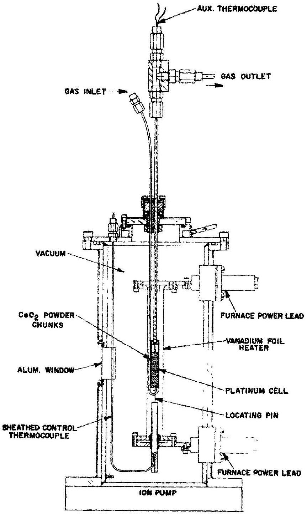
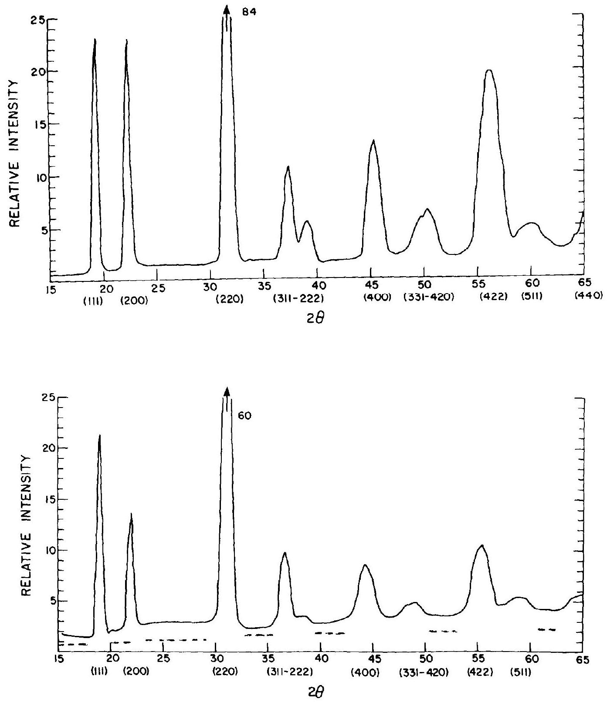
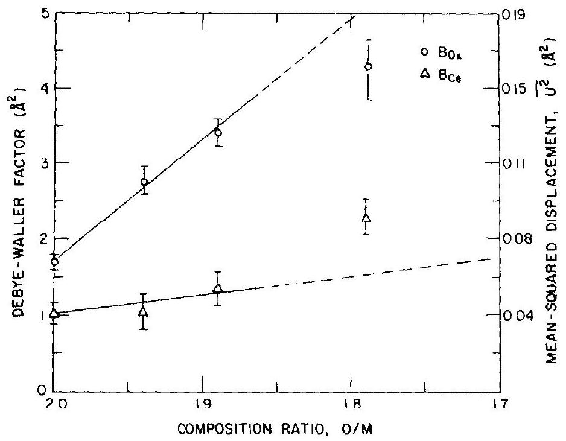

# DEFECT CHARACTERIZATION IN $\mathrm{CeO}_{2-x}$ AT ELEVATED TEMPERATURES-II 

NEUTRON DIFFRACTION † John Faber, Jr. $\ddagger$ and Martin A. Seitz Materials Science Department, Marquette University, Milwaukee, WI 53233, U.S.A. and Melvin H. Mueller Materials Science Division, Argonne National Laboratory, Argonne, IL 60439, U.S.A.

(Received 7 February 1975; accepted in revised form 27 February 1976)

#### Abstract

Polycrystalline $\mathrm{CeO}_{2-x}(0 \leq x \leq 0.21)$ has been examined at $900^{\circ} \mathrm{C}$ by means of neutron diffraction to characterize the predominant atomic point defects responsible for nonstoichiometry. The stoichiometry was controlled by adjusting the oxygen partial pressure between 1 and $10^{-21} \mathrm{~atm}$. For $x \leq 0.11$, good agreement (residual $\leq 1.0 \%$ ) is obtained by assuming a random distribution of defects on the oxygen sublattice. Vacancy concentrations obtained from the neutron-data analysis are in agreement with thermogravimetric determinations. Over this region of $x$, the temperature factors of both the cation and anion increase with an increase in vacancy concentration, which implies greater root-mean-square (r.m.s.) displacement of the atoms. However, for $x>0.11$, the analysis of the neutron data indicates a smaller anion vibrational amplitude than in the near-stoichiometric compositions and is accompanied by a shift in the equilibrium position of the oxygen atoms. The effect of anharmonic thermal motion has also been considered, but alone, cannot explain the neutron data. The results of the present study correlate well with the previous X-ray experiment.

## 1. INTRODUCTION

The principal objective was to characterize the predominant atomic point defects responsible for nonstoichiometry in ceria. To accomplish this objective the integrated intensities of Bragg reflections for $\mathrm{CeO}_{2-x}$ have been examined using neutron diffraction. The investigations were carried out at $900^{\circ} \mathrm{C}$ in situ using $\mathrm{CO}-\mathrm{CO}_{2}$ mixtures to control the oxygen partial pressure ( $1<\mathrm{P}_{\mathrm{O}_{2}} \leq 10^{-21} \mathrm{~atm}$ ). This allowed the composition of ceria to be varied from $\mathrm{CeO}_{2}$ to $\mathrm{CeO}_{1.79}$. High-temperature X-ray diffraction results on the defect structure[1] (referred to here as Part I) showed that the cation sublattice remains intact, as a function of increasing defect concentration. Evidence for oxygen vacancies as the predominant atomic point defects was obtained using electron density difference techniques and least-squares analysis. Based on these findings and the more favorable oxygen-to-metal (O/M) scattering ratio, both complementary and additional information on the defect structure would be expected from a neutron-diffraction study. An isotropic form factor and the reduced absorption effects observed in neutron diffraction are of distinct advantage when compared with X-ray techniques.

[^0]
## 2. THEORY

The case of Bragg scattering from defect crystals has been outlined in Part I. In addition, for neutron scattering the proposed structure factor formalism of Dawson[2] will be applied to ceria. The Willis[3] treatment of anharmonic thermal vibration will be considered, and his notations will be used. For ceria, the structure factors can be written as

$$
\begin{aligned}
F(h k l) & =4 b_{\mathrm{ce}} T_{c_{\mathrm{ce}}} \pm 8 b_{\mathrm{ox}} T_{a_{\mathrm{ox}}} \text { for } h+k+l=4 n \pm 1, \\
& =4 b_{\mathrm{ce}} T_{c_{\mathrm{ce}}}+8 b_{\mathrm{ox}} T_{\mathrm{cox}} \text { for } h+k+l=4 n, \text { and } \\
& =4 b_{\mathrm{ce}} T_{c_{\mathrm{ce}}}-8 b_{\mathrm{ox}} T_{\mathrm{cox}} \text { for } h+k+l=4 n+2
\end{aligned}
$$

In the harmonic approximation, $T_{c}$ takes the usual form

$$
T_{c}=\exp \left[-1 / 2\left(\bar{Q} \cdot \bar{u}_{k}\right)^{2}\right]=\exp \left[-B \sin ^{2} \theta / \lambda^{2}\right],
$$

where $\bar{u}_{k}$ is the vector displacement of the $k$ th atom from its equilibrium position, and $B$ is the Debye-Waller factor. Consideration of only cubic anharmonic effects yields

$$
T_{a_{0 x}}=\left(\frac{2 \pi}{a_{0}}\right)^{3} \frac{\beta_{O x}}{\left(\alpha_{O x}\right)^{3}}(k T)^{2} h k l \exp \left[\frac{-Q^{2} k T}{2 \alpha_{O x}}\right],
$$

where, $\alpha_{O x}$, is related to the Debye-Waller factor by

$$
\alpha_{O x}=\frac{8 \pi^{2} k T}{B_{O x}}
$$

and $\beta_{O x}$ is a parameter associated with the cubic term in the potential expansion for an oxygen atom. Willis[4] developed a phenomenological expression to account for distortions in the thermal smearing functions, which replaces each anion by four "quarter-anions" displaced to $1 / 4+\delta, 1 / 4+\delta, 1 / 4+\delta$ positions in the fluorite structure of $\mathrm{UO}_{2}$. Rouse, Willis and Pryor[5] identified the $\delta$ parameter in terms of the cubic anharmonic parameter, $\beta_{\mathrm{Ox}}$, in the following manner:

$$
\delta_{O x}=\frac{B_{O x}}{8 \pi^{2}} \frac{1}{a_{0}}\left[\frac{\beta_{O x}}{k T}\right]^{1 / 3}
$$

Results given in Section 4 will be tested, using the relations given above.

The observed diffracted powers, $P_{h k l}$, are related to the structure factors [6] by

$$
P_{h k l}=K^{\prime} K j_{h k l} L_{h k l}\left|F_{h k l}\right|^{2},
$$

where

$$
K=\frac{\rho^{\prime}}{\rho} \frac{A_{h k l} V}{V_{\mathrm{cell}}^{2}}
$$

for a cylindrical specimen configuration. Here, $K^{\prime}$ contains instrumental factors, $K$ is the sample-dependent scaling factor, $j_{h k l}$ is the powder multiplicity factor, $L_{h k l}$ is the Lorentz factor, $\rho^{\prime}$ and $\rho$ are the measured and theoretical densities, $A_{h k l}$ is the absorption correction, $V$ is the volume of the specimen in the beam, and $V_{\text {cell }}$ is the unit-cell volume. Since, experimentally, the specimen height was greater than the beam height, the loss or gain of scattering material as the lattice expands or contracts can be taken into account. Only the gas composition over the sample was changed at $900^{\circ} \mathrm{C}$ and therefore data sets should scale as the ratio of the lattice parameters, i.e. $K_{1} / K_{2}=a_{o_{2}} / a_{o_{1}}$, where sintering and absorption have been neglected.

## 3. EXPERIMENTAL

$\mathrm{CeO}_{2}$ powder was treated as described in Part I, except that $\sim 0.5 \mathrm{in}$. dia. rod-shape specimen chunks were fabricated in a die (using light hand pressure) before firing. Neutron diffraction experiments were carried out on the dual-beam ARCADE spectrometer[7], with $\lambda=1.05 \AA$ on both units. All high-temperature studies were performed on the lower unit, using a germanium (220) monochromator in transmission ( $\lambda / 2<0.5 \%$ ). A vanadiumelement vacuum furnace[8] was modified to accommodate a 0.5 in . dia. platinum cell ( 0.010 in . wall tubing) with two smaller platinum tubes ( 0.087 and 0.180 in . dia., both with 0.005 in . walls) attached to allow gases to flow over the specimen, as shown in Fig. 1. Temperature gradients along the length of the cell were $<10^{\circ} \mathrm{C}$ and temperature variations $\pm 1^{\circ} \mathrm{C}$ at $900^{\circ} \mathrm{C}$. Effects of preferred orientation in the Pt cell were minimized by annealing at $900^{\circ} \mathrm{C}$ for 24 hr , and the entire furnace and theta table were
oscillated continuously (analogous to rotating a specimen in a Debyc-Scherrer powder camera). An empty cell pattern was obtained at $900^{\circ} \mathrm{C}$ for subtraction from all patterns. Several cells failed as a result of loss of vacuum integrity; however, minimizing the cell-wall thickness reduced the interference effects.

Integrated intensities for ceria were determined for eight reflections at all compositions, and the data were refined as described in Part I. The variable parameters for each refinement were a scaling factor, two Debye-Waller factors, and an oxygen atom occupation factor. As a further test of the consistency of the least-squares solutions, the scale factors were checked using relations given in Section 2. A thermal diffuse scattering correction (discussed in Part I) was not used.

## 4. RESULTS AND DISCUSSION

The investigations discussed here are divided into three groups: (1) the stoichiometric composition at room temperature and $900^{\circ} \mathrm{C}$, (2) qualitative results on $\mathrm{CeO}_{2-x}$ data, and (3) quantitative analysis.

### 4.1 Room-temperature and $900^{\circ} \mathrm{C}$ stoichiometric studies

The objectives of these studies was to determine the scattering length for cerium atoms, $b_{\mathrm{Ce}}$, and to analyze and compare the experimental scaling constants with theoretical predictions. The results of least-squares analysis on 12 peaks at room temperature gave a cerium scattering length, $b_{\mathrm{Ce}}=0.475(5) \times 10^{-12} \mathrm{~cm}$. This agrees with results given on ceria[9] ( $b_{\mathrm{Ce}}=0.479(2) \times 10^{-12} \mathrm{~cm}$ ) and on $\mathrm{CeH}_{2}[10]\left(b_{\mathrm{Ce}}=0.470(4) \times 10^{-12} \mathrm{~cm}\right)$. The scale factor, $K$, for two runs at room temperature gave $K_{20^{\circ} \mathrm{C}}=5.741(55)$. The results of two experimental runs at $900^{\circ} \mathrm{C}$, in an $\mathrm{O}_{2}$ atmosphere are shown in Table 1. The scaling constant was found to be $\mathrm{K}_{900 \mathrm{C}}=5.603(24)$. The scaling factor analysis in Section 2 predicts that

$$
\frac{K_{900^{\circ} \mathrm{C}}}{K_{20^{\circ} \mathrm{C}}}=\frac{a_{o}^{20^{\circ} \mathrm{C}}}{a_{o}^{900^{\circ} \mathrm{C}}}=0.980,
$$

whereas experimentally $K_{900^{\circ} \mathrm{C}} / K_{20^{\circ} \mathrm{C}}=0.976(18)$, using $a_{0}^{20^{\circ} \mathrm{C}}=5.4108 \AA$ and the results from Part I. The Debye-Waller factors obtained at 20 and $900^{\circ} \mathrm{C}$ for $\mathrm{CeO}_{2}$ are similar to the results of Willis et al.[12] on $\mathrm{ThO}_{2}$ and $\mathrm{UO}_{2}$ and with the X-ray results given in Part I. It was fully expected that anharmonic thermal vibration effects would be manifested in the data at $900^{\circ} \mathrm{C}$; however, the influence of anharmonic effects could not be identified. Evidence for anharmonic thermal vibration is obscured in the case of equivalent reflections, e.g. (511-333), since eqn (1) shows opposite signs for the contributions. Also, eqn (3) shows that the anharmonic thermal vibration contribution is proportional to the product of the Miller indices ( $h k l$ ) and consequently most visible at high scattering angles. Data were not obtained at high angles where large $h k l$ products occur.
4.2 Qualitative results on $\mathrm{CeO}_{2-x}$ at $900^{\circ} \mathrm{C}$

The diffraction profiles for $\mathrm{CeO}_{2}$ and $\mathrm{CeO}_{179}$, at $900^{\circ} \mathrm{C}$, are shown in Fig. 2. Peak-intensity changes between the compositions are quite striking because large decreases

Fig. 1. Modified high-temperature furnace with platinum cell.

Table 1. $\mathrm{CeO}_{2}, 900^{\circ} \mathrm{C}$, stoichiometric analysis*
| A. Comparison of F (obs) and F (calc) |  |  | B. Parameter Summary |  |
| :--- | :--- | :--- | :--- | :--- |
| ARZ | F (obs) ${ }_{\mathrm{avg}}$ | F(calc) | Parsmeter | Solution |
| (111) | 21.08 (08) ${ }^{\text {c }}$ | 21.05 | $\mathrm{B}_{\mathrm{Ce}}\left(\mathrm{A}^{2}\right)$ | 1.02(13) |
| (200) | 28.90 (10) | 28.88 | ${ }^{\mathrm{m}} 0 x{ }^{\mathrm{b}}$ | 1.999(015) |
| (220) | 66.55 (130) | 67.16 | xxx | 0.250 |
| (311) | 19.36 (23) | 19.66 | ${ }^{B_{0 X}}\left({ }^{I^{2}}\right)$ | 1.71 (08) |
| (222) | 24.01 (58) | 24.87 | $x^{2}$ | 1.07 |
| (400) | 59.46 (590) | 60.73 | wR(1) | 0.5 |
| (422) | 55.14 (38) | 54.95 |  |  |
| (333) | 17.21(87) | 17.14 |  |  |

[^1]
Fig. 2. Diffraction patterns obtained at $900^{\circ} \mathrm{C}$ on $\mathrm{CeO}_{2}$ and $\mathrm{CeO}_{179}$. The dashed lines in the lower pattern indicate the background levels obtained from the $\mathrm{CeO}_{2}$ data shown in the upper pattern.

are observed for the $4 n+2$ reflections [e.g. (200) and (222)] as the state of reduction increases. Also, the $4 n$ reflections decrease, as can be seen by the (220), (400) and (422). The $4 n \pm 1$ reflections do not seem to change. An estimate of the changes can be obtained from the peak heights, as observed in Fig. 2; the $4 n+2$ reflections change $\sim 30 \%$ between $\mathrm{CeO}_{2}$ and $\mathrm{CeO}_{179}$, whereas the $4 n$ change $\sim 15 \%$. When these observed changes were compared with defect model calculations, it was concluded that the oxygen sublattice is highly defective and the predominant defects must be oxygen vacancies. (Complementary information about the cation sublattice is given in Part I.)

It can be noted in Fig. 2(b), that the background levels for $\mathrm{CeO}_{179}$ contain evidence for modulated diffuse
scattering. This suggests a degree of local defect ordering or clustering for $\mathrm{CeO}_{179}$. The intensity maximum at $2 \theta \sim 28^{\circ}$ does not scale linearly with the vacancy concentration.

### 4.3 Quantitative results on $\mathrm{CeO}_{2-x}$ at $900^{\circ} \mathrm{C}$

The results of the least-squares analysis for $\mathrm{CeO}_{194}$ and $\mathrm{CeO}_{189}$ are presented in Table 2. The model for $F_{\text {caic }}$ assumes a random distribution of defects in the statistically representative unit cell. The O/M ratio solutions in both cases are in excellent agreement with the composition determinations. The positions of the remaining oxygen atoms were allowed to have one variable parameter and the solutions for $x x x_{o x}$ in Table 2 indicate that the equilibrium positions are still the fluorite

Table 2. $\mathrm{CeO}_{1.99}, \mathrm{CeO}_{1.89}, 900^{\circ} \mathrm{C}$ data analysis
| A. Comparison of F (oba) and F (calc). |  |  |  |  | B. Parameter Summary |  |  |
| :--- | :--- | :--- | :--- | :--- | :--- | :--- | :--- |
|  | $\mathrm{CeO}_{1.94}$ |  | $\mathrm{CeO}_{1.89}$ |  |  | $\mathrm{CeO}_{1.94}$ | $\mathrm{CeO}_{1.89}$ |
| hkz | ${ }^{\mathrm{F}}$ obs | $F_{\text {calc }}$ | $\mathrm{F}_{\mathrm{obs}}$ | $\mathrm{F}_{\text {calc }}$ | Parameter | Solution | Solution |
| (111) | 20.33 (07) | 20.31 | 19.65(08) | 19.65 | $\mathrm{B}_{\mathrm{Ce}}\left(\AA^{2}\right)$ | 1.08 (17) | 1.35 (18) |
| (200) | 25.06(12) | 25.06 | 22.62 (15) | 22.59 | ${ }^{\mathrm{m}} 0 \mathrm{x}$ | 1.946 (20) | 1.897(16) |
| (220) | 62.78 (150) | 60.63 | 57.08 (174) | 56.13 | ${ }^{\mathrm{xxx}}{ }_{0 \mathrm{x}}$ | 0.250 (5) | 0.255 (5) |
| (311) | 18.52 (22) | 18.90 | 17.69 (20) | 17.97 | $\mathrm{B}_{0 \mathrm{X}}\left(\mathrm{A}^{2}\right)$ | 2./6(14) | 3.40 (16) |
| (222) | 18.52(61) | 18.85 | 13.56 (80) | 15.78 | $\chi^{2}$ | 1.39 | 1.45 |
| (400) | 54.56 (1180) | 52.33 | 47.42(760) | 46,97 | wR(\%) | 0.7 | 1.0 |
| (422) | 45.32 (38) | 45.29 | 39.83 (44) | 39.47 |  |  |  |
| (333) | 17.42(70) | 16.35 | 15.79(97) | 15.03 |  |  |  |

positions, $x x x_{o_{x}}=\frac{111}{444}$. Thus, no detectable evidence could be found for anharmonic thermal vibration.

The data analysis on the last composition investigated, $\mathrm{CeO}_{1.79}$, can be found in Table 3. Model A assumes the oxygen atoms at fixed ideal fluorite sites, i.e. $x x x=0.250$. It should be noted that the $\mathrm{O} / \mathrm{M}=1.793(42)$ is in agreement with the composition determination. For comparison, model $\mathbf{B}$ allowed the remaining oxygen atoms to have coordinates $x x x$. As can be seen in Table 3, $x x x=0.275(8)$ indicates the equilibrium anion positions deviate significantly from their ideal fluorite lattice sites. Using Hamilton's significance tests[13], we can accept model B over model A at the $92 \%$ confidence level.

A question arises concerning these results because $x x x \neq 0.250$ for the anions could be interpreted as a manifestation of anharmonic thermal vibration. A leastsquares fit to the data (using the equations in Section 2) gave $\beta=3.6(1.0) \times 10^{-12}$, with a residual of $1.6 \%$. While we cannot distinguish between model B ( $x x x \neq 0.250$ ) and anharmonic effects, the diffuse scattering observed for $\mathrm{CeO}_{1.79}$ (see Fig. 2) suggests a complex defect configuration, with attendent lattice relaxation around the defects. A more likely interpretation of the $\mathrm{CeO}_{1,79}$ data is that the oxygen atoms have formed a distorted oxygen sublattice. Carter and Roth[14] used the same distorted oxygen sublattice model to characterize the behavior of $\mathrm{Zr}(\mathrm{Ca}) \mathrm{O}_{2-x}$, and the anion shifts $(x x x=0.284)$ were not a function of the vacancy concentration. Steele and Fender[15] have examined static relaxation phenomena
associated with the oxygen vacancies in $\mathrm{Zr}(\mathrm{Y}) \mathrm{O}_{2-x}$. Attempts to refine our ceria data using their model were unsuccessful; in particular $x \frac{11}{44}$ and $x x^{\frac{1}{4}}$ static relaxation models gave no better agreement with experiment than did the ideal fluorite lattice model. A detailed investigation of the Steele and Fender model will have to await more extensive data. It is interesting to note that in contrast with stabilized zirconia (highly ionic conductors), $\mathrm{CeO}_{2-x}$ has both high anion mobility and a multivalent cation. Oxygen vacancy-cation complexes or clusters can occur through an electronic process (vacancy- $\mathrm{Ce}^{3+}$ ion interaction), and are not limited to dopant ion mobility as in $\mathrm{Zr}(\mathrm{Y}) \mathrm{O}_{2-x}$, for example.

An inspection of Tables 1-3 show that the Debye-Waller factors, $B_{\mathrm{Ce}}$ and $B_{O_{x}}$ increase as a function of $x$ in $\mathrm{CeO}_{2-x}$, although the temperature was fixed at $900^{\circ} \mathrm{C}$. The Debye-Waller factors are plotted as a function of O/M ratio in Fig. 3 so that their dependence upon composition may be examined. For $\mathrm{CeO}_{2-x}$, where $0<x \leq 0.11$, it is seen that for increasing anion vacancy concentrations, the mean-squared displacements of oxygen atoms around the defects are much greater than the displacements of the cerium atoms. This is consistent with the results of Part I (see Fig. 2). Roberts and Markin[16] have suggested that this behavior may be characteristic of sub-stoichiometric defect fluorites. However, for $x>$ 0.11 , $B_{\mathrm{Ce}}$ increases markedly for $\mathrm{O} / \mathrm{M}=1.79$, but the postulated oxygen sublattice distortion should perturb the cation sublattice in a more pronounced way. The

Table 3. $\mathrm{CeO}_{179}$ data analysis
| A. | rison of $F($ obs $)$ and $F($ calc $)$ for models $A, B$ |  |  | B. Parameter Summary |  |  |
| :--- | :--- | :--- | :--- | :--- | :--- | :--- |
|  | $x x x=0.250$ Model A |  | $\mathbf{x x x} \boldsymbol{=} \mathbf{0 . 2 7 5}$ Model B |  | $x x x=0.250$ Model A | $x x x=0.275$ Model B |
| $h k L$ | $F_{\text {obs }}$ | $\mathbf{F}_{\text {calc }}$ | $F_{\text {calc }}$ | Parameter | Solution | Solution |
| (111) | 19.20 (09) | 19.59 | 19.37 | $\mathrm{B}_{\mathrm{Ce}}{ }^{\left(\mathrm{A}^{2}\right)}$ | 2.16 (29) | 2.27 (21) |
| (200) | 20.25 (16) | 20.23 | 20.22 | ${ }^{m} 0 x$ | 1.793 (42) | 1.780 (30) |
|  |  |  |  | xxx | 0.250 | 0.275 (08) |
| (220) | 54.17 (140) | 52.47 | 52.44 |  |  |  |
| (311) | 17.17(22) | 17.03 | 17.26 | $\mathrm{B}_{0 \mathrm{x}}\left(\mathrm{A}^{2}\right)$ | 4.15 (51) | 2.44(35) |
|  |  |  |  | $\chi^{2}$ | 2.82 | 1.97 |
| (222) | 10.52 (96) | 13.44 | 13.87 |  |  |  |
| (400) | 46.98(760) | 41.99 | 41.81 | wR(X) | 2.3 | 1.6 |
| (422) | 34.20(55) | 33.74 | 33.68 |  |  |  |
| (333) | 15.70 (95) | 12.88 | 15.02 |  |  |  |

Fig. 3. Temperature-factor dependence on $\mathrm{O} / \mathrm{M}$ from the neutron data analysis, showing the effects of static displacements due to increasing defect concentration. The dashed line for $\mathbf{B}_{\mathbf{C e}}$ demonstrates the increase in $\mathbf{B}_{\mathbf{C e}}$ for $\mathrm{CeO}_{179}$. The static displacement effects are much greater for the oxygen sublattice.

$x x x=0.275$ oxygen positions are displacements of the anions towards the interstices of the lattice, $\sim 9 \%$ of the shortest oxygen-oxygen distance, with an average displacement of $\sim 0.24 \AA$.

Throughout the composition range investigated in ceria, no evidence was found in the diffraction scans that might indicate a change in space group. No superlattice lines were observed. Other ordered defect models were examined to explore alternative methods of interpreting the data. The models considered were (a) various modifications of Willis $2: 1: 2$ and $2: 2: 2$ clusters, (b) the $C$ rare-earth bixbyite structure, (c) the pyrochlore structure, and (d) a modified ZnS structure. None of these models could adequately explain the behavior for $\mathrm{CeO}_{2-x}$, where $x>0.11$.

An appropriate means to relate these findings to other measurements focuses upon finding a property that describes the energy of formation associated with the defects. Panlener et al.[17] have obtained the relation for the partial molal enthalpy, $\Delta \bar{H}_{\mathrm{O}_{2}}$, as a function of $x$ in $\mathrm{CeO}_{2-x}$. A minimum in $\Delta \bar{H}_{\mathrm{O}_{2}}$ occurs at $\sim \mathrm{CeO}_{1.86}$, but $\Delta \bar{H}_{\mathrm{O}_{2}}$ then rises for $x>0.14$. The conductivity becomes essentially independent of the oxygen partial pressure for $x>0.14$. For $x>0.14$ the relative increase in $\left|\Delta \bar{H}_{\mathrm{O}_{2}}\right|$ indicates an increase in the energy necessary to create additional oxygen vacancies. On the basis of the neutron results, at least part of the energy increase must be associated with the appearance of a distorted oxygen sublattice.

## 5. CONCLUSIONS

Analysis of the neutron data has shown that oxygen vacancies are the predominant atomic point defects responsible for nonstoichiometry in ceria. This conclusion is supported by the exellent agreement of the O/M ratios determined from the neutron data, and composition determinations obtained from thermogravimetric data. It has been assumed, in the statistically representative unit
cell, that the vacancies were distributed randomly among available sites, and good agreement ( $R<1.6 \%$ ) between the observed and calculated structure factors support this assumption.

For $\mathrm{CeO}_{2-x}$, where $x \leq 0.11$, the analysis of the data has shown that the temperature factors of both the metal and oxygen atoms increase with an increase in vacancy concentration, implying greater mean-squared displacement of the atoms from their equilibrium positions. However, the increase in static displacements associated with the anion sublattice was much greater than for the cation sublattice.

For $x>0.11$, the analysis of the data indicates a relatively smaller oxygen vibrational amplitude. The smaller vibrational amplitude is, however, accompanied by a shift in the equilibrium positions of the anions from $x x x=0.250$ to $x x x=0.275$. The effect of anharmonic vibration has been considered, but by itself, could not explain the neutron data. The shift in the oxygen atom positions indicated that the oxygen sublattice had become highly distorted.

Acknowledgements-We gratefully acknowledge the National Science Foundation and Bacon Foundation for support during the course of this work, as well as Argonne National Laboratory for the use of its facilities. We thank the Argonne Center for educational Affairs and the Materials Science Division for support under a Thesis Parts Program.

## REFERENCES

1. Faber J. Jr. and Seitz M. A., J. Phys. Chem. Solids 37, 903 (1976).
2. Dawson B., Proc. Roy. Soc. A298, 255 (1967).
3. Willis B. T. M., Acta Cryst. A25, 277 (1969).
4. Willis B. T. M., Acta Cryst. 18, 75 (1965).
5. Rouse K. D., Willis B. T. M. and Pryor A. N., Acta Cryst. B24, 117 (1968).
6. Bacon G. E., Neutron Diffraction, p. 96. Clarendon Press, Oxford (1962).
7. Mueller M. H., Heaton L. and Amiot L., Research/Development, 34 (August 1968).
8. Sidhu S. S., Heaton L. and Mueller M. H., J. Appl. Phys. 30, 1323 (1959).
9. Willis B. T. M. and Valentine T. M., A Neutron Diffraction Study of Cerium Dioxide at Room Temperature, AERER4939. Atomic Energy Research Establishment, Harwell (1965).
10. Cheetham A. K. and Fender B. E. F., J. Physics C (London) 5, L35 (1972).
11. Bacon G. E., Acta Cryst. A28, 357 (1972).
12. Willis B. T. M., Lambe K. A. D. and Valentine T. M., A Neutron Diffraction Study of the Thermal Motions of the

Atoms in Urania and Thoria, AERE-R4001. Atomic Energy Research Establishment, Harwell (1962).
13. Hamilton W. C., Acta Cryst. 18, 502 (1965).
14. Carter R. E. and Roth W. L., Electromotive Force Measurements in High-Temperature Systems, pp. 125-144. Elsevier, New York (1968).
15. Steele D. and Fender B. E. F., J. Physcis C (London) 7, 1 (1974).
16. Roberts L. E. J. and Markin T. L., Proc. Brit. Ceram. Soc. 8, 201 (1967).
17. Panlener R. J., Blumenthal R. N. and Garnier J. E., J. Chem. Phys. Solids 36, 1213 (1975).

[^0]:    † Work supported by the U.S. Energy Research and Development Administration.
    ‡ This paper is based in part on a dissertation submitted by J. Faber, Jr., in partial fulfillment of the requirements for the Ph.D. degree, Marquette University, December 1973. Present address: Argonne National Laboratory, Materials Science Division, Argonne, IL 60439, U.S.A.

[^1]:    ${ }^{\text {If }}$ o is blank, then parameter was not varied in this analysis;
    $b_{0 x}=0.580 \times 10^{-12} \mathrm{~cm}$ throughout the paper [11].
    ${ }^{b}$ The O/M ratio i* sefind from O/M $=\mathrm{mox}_{\mathrm{ox}} / \mathrm{be}$.
    "Numbers in parenthesin indicate last significant figure.

