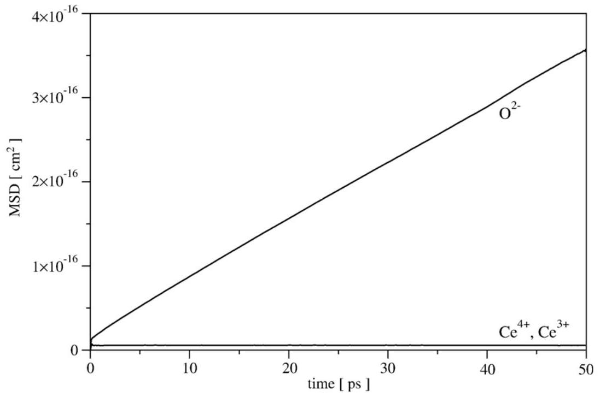
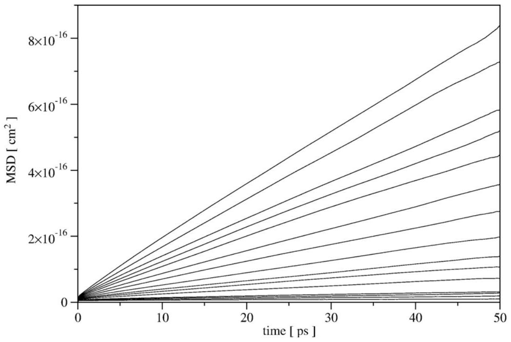
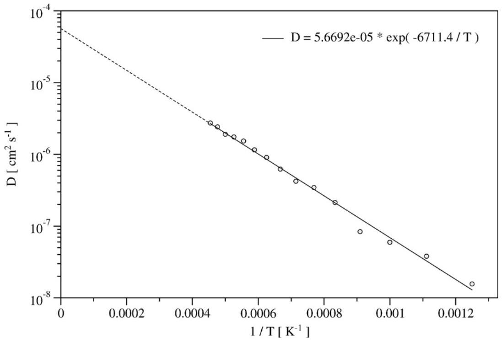
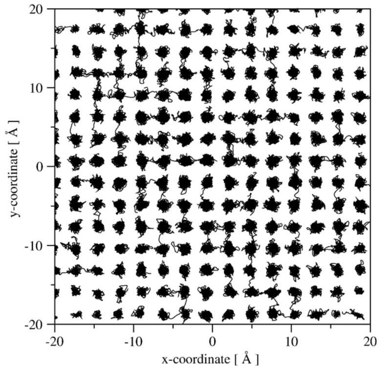
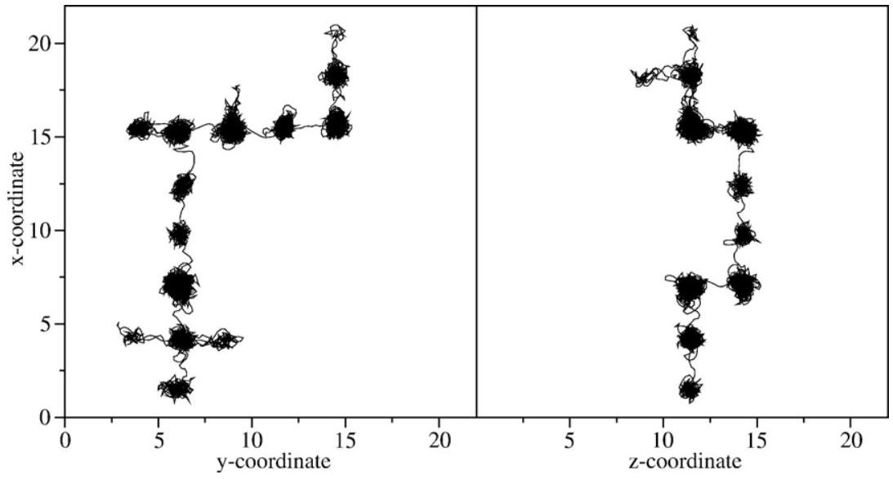
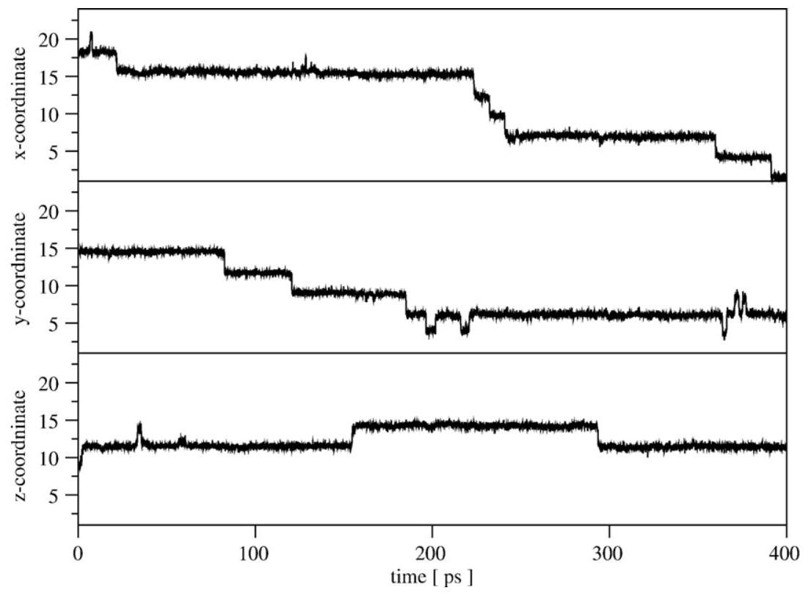

# Molecular dynamics study of oxygen self-diffusion in reduced $\mathrm{CeO}_{2}$ 

A. Gotte ${ }^{\mathrm{a}}$, D. Spångberg ${ }^{\mathrm{a}, \mathrm{b}, *}$, K. Hermansson ${ }^{\mathrm{a}}$, M. Baudin ${ }^{\mathrm{a}}$ ${ }^{\mathrm{a}}$ Department of Materials Chemistry, The Angström Laboratory, Box 538, Uppsala, Sweden ${ }^{\mathrm{b}}$ Uppsala Multidisciplinary Center for Advanced Computational Science (UPPMAX), Uppsala University, Sweden

Received 14 December 2006; received in revised form 16 April 2007; accepted 9 August 2007

#### Abstract

The oxygen self-diffusion in partially reduced $\mathrm{CeO}_{2}$ has been investigated by large-scale Molecular Dynamics simulations, in the temperature range between 800 and 2200 K . Simulation boxes with $\sim 4100$ and $\sim 33,000$ ions were investigated for randomly distributed oxygen vacancies and $\mathrm{Ce}^{3+}$ ions. Our calculated self-diffusion coefficients vary between $10^{-8}$ and $10^{-6} \mathrm{~cm}^{2} / \mathrm{s}$ in the temperature range studied. The activation energy and $D_{0}$ values are also reported. The oxygen diffusion mechanism has also been analyzed: only a $\langle 100\rangle$ vacancy mechanism is observed.

© 2007 Elsevier B.V. All rights reserved.

Keywords: Diffusion; Molecular dynamics; Cerium dioxide

## 1. Introduction

Ceria ( $\mathrm{CeO}_{2}$ ) is an important component in modern exhaustgas catalysts. These catalysts are commonly complex compositions with several washcoat layers, containing various combinations of active noble metals and ceria or ceria-containing mixed oxides. Here, a key role of ceria is to function as an oxygen "sponge": under lean-burn conditions (high air to fuel ratios), ceria stores oxygen, which can later be released when the engine runs rich. In this way, the three-way catalyst (TWC) allows for efficient redox conversions of hydrocarbons, carbon monoxide and $\mathrm{NO}_{x}$ gases under a wide range of combustion conditions. Ceria has also increasingly been used in electrolytes in solid oxide fuel cells and as oxygen sensors, where high ionic conductivity has a crucial role for the functionality.

The transport properties of undoped, doped and/or reduced ceria have been the subject of intensive study for many years, and there have been a large number of studies on the ionic conductivity of these materials and many review articles as well as regular papers have been written (see e.g., Ref. [1] and references therein). The data on oxygen self-diffusion is, parti-

[^0]cularly for reduced ceria, more scarce, partly reflecting the difficulties in performing tracer experiments and dynamic calculations on reduced ceria.

The chemical diffusion coefficient of oxygen for partially reduced ceria has been determined experimentally at 1244 K for different degrees of reduction [2]. The temperature independent pre-exponential factor, $D_{0}$, has also been reported for a few different non-stoichiometric ceria samples [3]. It has been suggested in the literature that the oxygen storage process is restricted to surface oxygens in stoichiometric ceria, while bulk oxygen atoms are involved in the process in doped ceria [4], which will inherently contain oxygen vacancies throughout the material. Hence, it can be expected that bulk oxygen is involved in the oxygen storage process also in undoped non-stoichiometric ceria. The number of oxygen ions available at the surface of the modified ceria used in modern TWCs are too few, and hence diffusion of oxygen to and from the ceria bulk is needed, in order to explain the high oxygen storage capability at operational conditions [1]. Furthermore, in an investigation of the reduction kinetics of ceria [5], it was found that the diffusion time scale was much shorter than the characteristic reaction time for the oxidation of $\mathrm{H}_{2}$, in which surface ceria is reduced while releasing oxygen.

Current experimental studies essentially provide a macroscopic evaluation of the diffusion properties. The observed diffusion coefficient constitutes a global evaluation of the

Table 1
Experimental values used in the potential fit and the corresponding values reproduced with the fitted potential
| Property | Experiment | Force field |
| :--- | :--- | :--- |
| $\mathrm{a}\left(\mathrm{CeO}_{2}\right)[\AA]$ | 5.4112 [10] | 5.4110 |
| $\mathrm{a}\left(\mathrm{Ce}_{2} \mathrm{O}_{3}\right)[\AA]$ | 3.8910 [33] | 3.8890 |
| $\mathrm{c}\left(\mathrm{Ce}_{2} \mathrm{O}_{3}\right)[\AA]$ | 6.059 [33] | 6.1610 |
| $\mathrm{C}_{11}[\mathrm{GPa}]$ | 40.3 [34] | 40.2 |
| $\mathrm{C}_{12}[\mathrm{GPa}]$ | 10.5 [34] | 10.4 |
| $\mathrm{C}_{44}[\mathrm{GPa}]$ | 6.0 [34] | 6.1 |
| Bulk modulus [GPa] | 236 [35] | 203.5 |
| $\epsilon_{\infty}$ | 4.0 [14] | 4.0 |
| $\epsilon_{0}$ | 18.6 [14] | 18.6 |

All elastic and dielectric properties refer to $\mathrm{CeO}_{2}$.
transport phenomena, where all the components (bulk, grain boundaries, and dislocations) are averaged in a single property of the material. This last point prevents extracting the bulk diffusion component directly related to the materials intrinsic properties. Consequently, there exists a need for knowledge of the microscopic aspects of bulk diffusion within oxide conductors. It is clear that computational methods here can provide a valuable tool, not only in the interpretation of experimental results, but also in the fundamental understanding of the diffusion mechanism at the microscopic level.

In this paper we present results from a study of the oxygen self-diffusion in partially reduced non-stoichiometric ceria using Molecular Dynamics (MD) simulations at a range of temperatures. With this method, we have the possibility to acquire information on both the diffusion rate and the diffusion mechanism. Previous MD simulations of diffusion in non-stoichiometric ceria have mainly focused aliovalent substitution with transition metals, such as Yor with other lanthanides, such as La, Gd [6,7]. Recently, there have also been attempts on describing the microscopic aspect of oxygen diffusion in reduced and doped ceria materials by DFT-calculations [8,9].

## 2. Method

### 2.1. System description

$\mathrm{CeO}_{2}$ crystallizes in the fluorite structure (space group $F m \overline{3} m$ ), in which each $\mathrm{Ce}^{4+}$ cation is surrounded by eight $\mathrm{O}^{2-}$ ions forming the corners of a cube, and with each $\mathrm{O}^{2-}$ coordinated to four $\mathrm{Ce}^{4+}$. The crystallographic lattice parameter obtained from single-crystal neutron diffraction measurements is $5.4112 \AA[10]$. In the present study, $\mathrm{CeO}_{2}$ was reduced by removing $6.11 \%$ of the oxygen ions and charge balance by reducing $24.4 \%$ of the $\mathrm{Ce}^{4+}$-ions to $\mathrm{Ce}^{3+}$. The non-stoichiometric formula is thus $\mathrm{CeO}_{1.8778}$. The oxygen removal and reduction of ceria was performed randomly, and independent of each other. This degree of doping is the same as in our previous article on Calcium doped ceria [11].

The simulation box contained 4144 ions ( $1088 \mathrm{Ce}^{4+}$, $352 \mathrm{Ce}^{3+}$ and $2704 \mathrm{O}^{2-}$ ). The simulation box was oriented in such way that the $x$ direction corresponds to the crystallographic $[\overline{1} \overline{1} 2]$ direction, $y$ to $[\overline{1} 10]$ and $z$ to [111]. The dimensions of the simulation box were $39.8 \times 38.3 \times 37.5 \AA^{3}$. The reason for not
choosing a MD box with cell axes commensurate to the crystallographic unit cell was to avoid the potential phonon sampling problems related to such a box for cubic systems. Also, a larger simulation box was used for comparison; this box was constructed from 8 replicas of the 4144 -ion box and thus was doubled in size in all directions. This system contained 33152 ions.

### 2.2. Interatomic potentials

The short-range part of the interatomic interactions was described by a Buckingham type shell-model potential[12], where each ion consists of a core and a shell and where the interaction between two ions occurs via the shells of ion $i$ and ion $j$, and is expressed as

$$
V_{i j}=A_{i j} \exp \frac{-r_{i j}}{\rho_{i j}}-\frac{C_{i j}}{r_{i j}^{6}}
$$

where $A, \rho$ and $C$ were fitted to reproduce the structure of both $\mathrm{CeO}_{2}$ and $\mathrm{Ce}_{2} \mathrm{O}_{3}$ and the dielectric properties of $\mathrm{CeO}_{2}$, found in Table 1.

The core-shell interactions are described by harmonic potentials, where the spring constants, $k\left(\mathrm{Ce}^{4+}\right), k\left(\mathrm{Ce}^{3+}\right)$ and $k \left(\mathrm{O}^{2-}\right)$, and the core and shell charges, $Y_{\mathrm{C}}$ and $Y_{\mathrm{S}}$ for each ion, were included in the potential fit. $Y_{\mathrm{C}}$ and $Y_{\mathrm{S}}$ were restricted to produce formal ionic charges. The potential parameters and the shell model parameters were fitted using the lattice dynamics code GULP by J. Gale et al. [13]

In a previous MD study of ours, concerning the surface and bulk structures of reduced ceria [11], the short-range potential parameters were based on those used by Vyas et al. [14] in a static modeling investigation of $\mathrm{CeO}_{2}$. In that model, $\mathrm{Ce}^{4+}$ and $\mathrm{Ce}^{3+}$ have the same short range parameters for their interaction with oxygen. The model used in Ref. [11] was found to properly describe the structural properties of reduced ceria, such as the cell expansion compared to unreduced ceria and the large structural relaxation at the atomic level. However, we found that

Table 2
Potential and shell-model parameters
| Parameter | Value |
| :--- | :--- |
| $A\left(\mathrm{Ce}^{4+}-\mathrm{O}^{2-}\right)[\mathrm{eV}]$ | 755.1311 |
| $A\left(\mathrm{Ce}^{3+}-\mathrm{O}^{2-}\right)[\mathrm{eV}]$ | 1140.193 |
| $A\left(\mathrm{O}^{2-}-\mathrm{O}^{2-}\right)[\mathrm{eV}]$ | 9533.421 |
| $\rho\left(\mathrm{Ce}^{4+}-\mathrm{O}^{2-}\right)[\AA]$ | 0.429 |
| $\rho\left(\mathrm{Ce}^{3+}-\mathrm{O}^{2-}\right)[\AA]$ | 0.386 |
| $\rho\left(\mathrm{O}^{2-}-\mathrm{O}^{2-}\right)[\AA]$ | 0.234 |
| $C\left(\mathrm{Ce}^{4+}-\mathrm{O}^{2-}\right)\left[\mathrm{eV} \cdot \AA^{6}\right]$ | 0.0 |
| $C\left(\mathrm{Ce}^{3+}-\mathrm{O}^{2-}\right)\left[\mathrm{eV} \cdot \AA^{6}\right.$ ] | 0.0 |
| $C\left(\mathrm{O}^{2}-\mathrm{O}^{2-}\right)\left[\mathrm{eV} \cdot \AA^{6}\right]$ | 224.88 |
| $Y_{\mathrm{s}}\left(\mathrm{Ce}^{4+}\right)[\mathrm{e}]$ | 4.6475 |
| $Y_{\mathrm{s}}\left(\mathrm{Ce}^{3+}\right)[\mathrm{e}]$ | 15.092 |
| $Y_{\mathrm{s}}\left(\mathrm{O}^{2-}\right)[\mathrm{e}]$ | -6.5667 |
| $k\left(\mathrm{Ce}^{4+}\right)\left[\mathrm{eV} \cdot \AA^{-2}\right]$ | 43.451 |
| $k\left(\mathrm{Ce}^{3+}\right)\left[\mathrm{eV} \cdot \AA^{-2}\right]$ | 2172.5 |
| $k\left(\mathrm{O}^{2-}\right)\left[\mathrm{eV} \AA^{-2}\right]$ | 1759.8 |

Fig. 1. Anion and cation mean square displacements at 1700 K .

the same model fails to describe the structure of $\mathrm{Ce}_{2} \mathrm{O}_{3}$. In the present study, an improved force-field, capable of describing the structures of both $\mathrm{CeO}_{2}$ and $\mathrm{Ce}_{2} \mathrm{O}_{3}$, has been developed. This model also reproduces the structural changes of $\mathrm{CeO}_{2}$ upon reduction that was observed with the previous model.

As mentioned above, the ionic charges were restricted to produce formal charges, i.e. the oxygen ion carries a total charge of -2 . Thus, the $\mathrm{Ce}^{4+}$ and $\mathrm{Ce}^{3+}$ ions carry total charges of +4 and +3 , respectively. These charges are determined initially and are not allowed to change during the simulation, i.e. a $\mathrm{Ce}^{3+}$ ion cannot transform into a $\mathrm{Ce}^{4+}$ ion or vice versa. Therefore, this model resembles ceria doped using $\mathrm{Ce}^{3+}$ ions. Allowing the valence state to change would seriously complicate the model, and is not included in this first paper on oxygen diffusion in reduced ceria using molecular dynamics.

The best set of potential parameters capable of reproducing the structures of both cerium oxides is presented in Table 2. Since the coefficient for the $\mathrm{O}-\mathrm{O}$ dispersion term ( C ) is rather high in the current potential, a large cutoff for the short range forces is needed in the simulations. To avoid the impact on simulation speed associated with a large real space cutoff, longrange tail corrections [15] to the energy and pressure was used. With this method a short-range cutoff of $14 \AA$ was found to be sufficient. The long range core-core, core-shell and shell-shell Coulombic interactions were evaluated using the Ewald summation technique [16].

The adiabatic shell-model was used, in which a small fraction of the ion-mass was assigned to the each shell, as first introduced by Mitchell and Fincham [17]. This allows us to include the shells in the integration of Newton's equations of motion. A different

Fig. 2. Oxygen mean square displacements at $800-2200 \mathrm{~K}$ in steps of 100 K . The diffusion coefficients, obtained from the slopes, are plotted as an Arrhenius plot in Fig. 3.

approach to treat the shell in an MD simulation is to iteratively minimize the shell positions at every time-step; this approach is often found to be less efficient. However, in using the former approach, care must be taken to choose the fractional masses small enough to allow the shells to follow the cores adiabatically and to use a time-step mall enough to describe the high-frequency core-shell vibrations. Here, the mass assigned to the shell was $0.1 \%, 4 \%$ and $8 \%$ of the total mass for $\mathrm{Ce}^{4+}, \mathrm{Ce}^{3+}$ and $\mathrm{O}^{2-}$, respectively.

### 2.3. MD simulations

MD simulations at 15 different temperatures between 800 and 2200 K were performed using an in-house written MD code [18].

The integration of the equations of motion was performed using the Gear predictor-corrector algorithm to the fifth order for all translational degrees of freedom and to the sixth order for the core-shell vibrational degrees of freedom. The equations of motion for the box were handled by the Cleveland modification [19] of the Raman-Parrinello scheme[20,21], ensuring a translationally invariant Hamiltonian. The Nosé-Hoover formalism[22,23] was used for the constant-temperature control. The time-step was 0.10 fs .

All simulations were started by a 14 ps "equilibration" simulation at 1600 K , followed by at least another 50 ps of "equilibration" at 1100 K . The temperature was then scaled to the correct temperature during 2 ps . This methodology was chosen to overcome some of the problems that might occur at lower temperatures, associated with the random placement of vacancies and $\mathrm{Ce}^{3+}$-ions. By equilibrating at high temperatures we reach structural equilibrium faster since some of the structural rearrangements needed to reach equilibrium are too slow at lower temperatures. Equilibration was followed by 50 ps long production runs. Additionally, at 1500 K trajectories were

Table 3
Oxygen diffusion data from the present study compared with values for various non-stoichiometric ceria systems from experiments and from MD simulations
| Sample | $D_{0}$ | D | $\mathrm{E}_{a}$ | $T$ | Ref. |
| :--- | :--- | :--- | :--- | :--- | :--- |
|  | $\mathrm{cm}^{2} / \mathrm{s}$ | $\mathrm{cm}^{2} / \mathrm{s}$ | kJ/mol | K |  |
| $\mathrm{CeO}_{1.8778}$ | $5.7 \cdot 10^{-5}$ | - | 55.7 | 800-2200 | This work |
| $\mathrm{CeO}_{1.8778}$ | - | $2.6 \cdot 10^{-7}$ | - | $1250^{1}$ | This work |
| $\mathrm{CeO}_{1.92}$ | $1.5 \cdot 10^{-5}$ | - | 49.8 | 1123-1423 | Exp. [3] |
| $\mathrm{CeO}_{1.8}$ | $6.2 \cdot 10^{-6}$ | - | 15.1 | 1123-1423 | Exp. [3] |
| $\mathrm{Ce}_{0.9} \mathrm{Y}_{0.1} \mathrm{O}_{1.95}$ | $1.5 \cdot 10^{-4}$ | - | 80.4 | 1123-1423 | Exp. [3] |
| $\mathrm{Ce}_{0.8} \mathrm{Y}_{0.2} \mathrm{O}_{1.9}$ | $1.7 \cdot 10^{-4}$ | - | 76.6 | 1123-1423 | Exp. [3] |
| $\mathrm{Ce}_{0.6} \mathrm{Y}_{0.4} \mathrm{O}_{1.8}$ | $5.1 \cdot 10^{-3}$ | - | 89.1 | 1123-1423 | Exp. [3] |
| $\mathrm{Ce}_{0.8} \mathrm{Y}_{0.2} \mathrm{O}_{1.9}$ | - | $\sim 1.1 \cdot 10^{-5}$ |  | 1273 | MD [3] |
| $\mathrm{Ce}_{0.8} \mathrm{La}_{0.2} \mathrm{O}_{1.9}$ | - | $\sim 1.2 \cdot 10^{-5}$ |  | 1273 | MD [3] |
| $\mathrm{Ce}_{0.8} \mathrm{Gd}_{0.2} \mathrm{O}_{1.9}$ | - | $\sim 2.4 \cdot 10^{-5}$ |  | 1273 | MD [3] |
| $\mathrm{Ce}_{0.8} \mathrm{Gd}_{0.2} \mathrm{O}_{1.9}$ | - | $\sim 1.5 \cdot 10^{-5}$ |  | 1273 | MD [7] |
| $\mathrm{ZrO}_{2}+8 \% \mathrm{Y}_{2} \mathrm{O}_{3}$ | - | $\sim 1.10^{-6}$ | $\sim 50$ | 1400 | Exp. [27] |
| $\mathrm{ZrO}_{2}+42 \% \mathrm{Y}_{2} \mathrm{O}_{3}$ | - | $\sim 2.10^{-7}$ | ~ 170 | 1400 | Exp. [27] |

The temperature 1250 K was selected to help comparisons with the various literature values.
collected for another 600 ps with the normal MD box and for 120 ps with the larger simulation box.

## 3. Results

### 3.1. Ionic relaxations

Ionic relaxations of oxygen ions adjacent to oxygen vacancies was found to occur along the $\langle 100\rangle$ directions, resulting in an increase of the $\mathrm{O}-\mathrm{O}$ distances and a decrease of $\mathrm{Ce}-\mathrm{O}$ distances locally around the vacancies. This can also be found as additional features in the partial radial distribution functions such as a shift of the first $\mathrm{Ce}-\mathrm{O}$ peak to shorter distances and an additional $\mathrm{O}-\mathrm{O}$ peak at $\sim 3.3 \AA$, in accordance with the 300 K results, reported in our previous article [11]. This is also in accordance with forcefield based MD-simulations of doped ceria [6,7]. The increase in

Fig. 3. Arrhenius plot of the oxygen self-diffusion coefficients in the temperature range $800-2000 \mathrm{~K}$.

Fig. 4. Projection of the oxygen trajectories from the first 1.2 ps of the MD simulation at 1500 K on a (100) plane.

intensity with a maximum at approximately $3.3 \AA$ has also been observed in neutron-diffraction studies of reduced ceria [24,25].

### 3.2. Oxygen diffusion rate

The self-diffusion coefficient can be calculated from the long time slope of the mean square displacement (MSD) function. Fig. 1 shows the MSD function at 1700 K for both the cations and anions. In Fig. 2, the oxygen MSD function is plotted for all temperatures ( $800 \mathrm{~K}-2200 \mathrm{~K}$, with 100 K increments). As can be seen in Fig. 1, the diffusion rate for the cations is very low. It has previously been shown [26] that, for fluorite-type crystals, the diffusion rate of the cations, which are arranged in a fcc sublattice, is several orders of magnitude lower than the diffusion rate of the anions, which are ordered in a simple cubic sublattice. In the model systems used in the present study, the cation sublattice is defect free, which might lead to a too small cation diffusion.

From the calculated diffusion coefficients (shown in Fig. 3) the activation energy for oxygen migration was calculated using the standard Arrhenius relation:
$D(T)=D_{0} \cdot \exp \left(\frac{-E_{a}}{R T}\right)$

The Arrhenius plot of the diffusion coefficients is shown in Fig. 3. The activation energy ( $E_{a}$ ) and the temperature independent prefactor ( $D_{0}$ ) was calculated from Eq. (2) and the results are presented in Table 3, where they are also compared with diffusion data for reduced and doped ceria as well as for yttria stabilized zirconia.

As can be seen in Table 3, the various experimentally determined diffusion quantities of non-stoichiometric ceria span large ranges. Our own MD results agree reasonably well with the results presented for reduced ceria single crystals by Steele et al. [3]. The oxygen self-diffusion coefficients calculated by Hayashi et al. [6] and Inaba et al. [7] from MD simulations of doped ceria, $\mathrm{Ce}_{1-x} \mathrm{M}_{x} \mathrm{O}_{2-0.5 x}$ (where $\mathrm{M}=\mathrm{Y}$, La or Gd and $x \approx 0.2$ ) are higher than the value we obtain in the present study. However, experiments on polycrystalline Y-doped ceria by Steele et al. [3] suggest a lower diffusion rate for doped ceria than for reduced ceria for the same degrees of doping used by Hayashi et al. [6] and Inaba et al. [7]. In contrast, for a higher degree of doping, the diffusion rate for $\mathrm{Ce}_{0.6} \mathrm{Y}_{0.4} \mathrm{O}_{1.8}$ by Steele et al. was found to be higher than for reduced $\mathrm{CeO}_{1.8}$ by the same author (at least for $T>\sim 1325 \mathrm{~K}$ and for $T>\sim 900 \mathrm{~K}$ compared with our results). The diffusion coefficients of the isomorphic yttria stabilized zirconia samples by Arima et al. [27] are quite similar to the values for the two different reduced samples reported by Steele et al. [3].

For liquids, the self-diffusion coefficient has been reported to follow a $1 / L$ dependence, where $L$ is the side length of the cubic simulation box [28-31]. Therefore, to check for any dependency of our calculated self-diffusion coefficient on the size of the simulation box, a simulation using a box doubled in $x, y$ and $z$, i.e. with the dimension $79.5 \times 76.5 \times 75.0 \AA^{3}$, and containing 33,152 ions, was also performed for 120 ps at 1500 K . For the two sizes used in this study, the difference in

Fig. 5. Trajectory for a selected oxygen ion followed during 400 ps at 1500 K projected on two 100 planes.

Fig. 6. $x y z$-coordinates for the same oxygen ion as in Fig. 5.

the self-diffusion coefficient was found to be approximately $3 \%$.

### 3.3. Oxygen diffusion mechanism

Fig. 4 displays the oxygen trajectories from the first 1.2 ps of the simulation at 1500 K projected on a (100) plane. As can be seen, the oxygen ions diffuse along the lattice vectors of the oxygen sublattice, corresponding to $\langle 100\rangle$ directions in the fluorite structure. In Fig. 5, the trajectory of one single oxygen ion during 400 ps at 1500 K projected on two $\{100\}$ planes. Fig. 6 displays the coordinate changes in the $x, y$ and $z$ directions (i.e. the [100], [010] and [001] directions, respectively) for the same ion. Also Figs 5 and 6 support the picture that the oxygen migration paths are always along the $\langle 100\rangle$ directions. After inspection of the oxygen trajectories from all temperatures, no other elemental diffusion step, than oxygen jumps to vacant positions along the $\langle 100\rangle$ directions could be found. This is in agreement with earlier MD-simulations by F. Shimojo et al. [32] for yttria stabilized zirconia, which also crystallizes in the fluorite structure.

## 4. Concluding remarks

We conclude that the oxygen self-diffusion in reduced ceria occur though a [100] oxygen vacancy mechanism and that the diffusion rates and activation energy from the simulations agree quite well with diffusion measurements on single crystalline reduced ceria by Steele et al. [3]. In comparison with MD simulations on doped ceria [6,7], we obtain a lower diffusion rate, but observe the same diffusion mechanism. Although the current model which prevents charge transfer between the Ceions, still manages to give diffusion coefficients which compare reasonably well with experiment, the influence of dynamically varying charges on the diffusion coefficient is still a subject for
further studies. We also conclude that for the two system sizes used in the present study, no large system size dependence on the diffusion constant could be observed.

## Acknowledgments

The Swedish Research Council (VR) is gratefully acknowledged for the financial support. The computations were performed on UPPMAX resources under Project p2003034.

## References

[1] A. Trovarelli, M. Boaro, E. Rocchini, C. de Leitenburg, G. Dolcetti, J. Alloys Compd. 323-324 (2001) 584.
[2] F. Millot, P.D. Mierry, J. Ceram. Soc. Jpn., Int. Ed. 106 (1998) 1023.
[3] B.C.H. Steele, J.M. Floyd, Proc. Br. Ceram. Trans. 72 (1971) 55.
[4] S. Bedrane, C. Descorme, D. Duprez, Catal. Today 75 (2002) 401.
[5] F. Giordano, A. Trovarelli, C. de Leitenburg, G. Dolcetti, M. Giona, Ind. Eng. Chem. Res. 40 (2001) 4828.
[6] H. Hayashi, R. Sagawa, H. Inaba, K. Kawamura, Solid State Ion. 131 (2000) 281.
[7] H. Inaba, R. Sagawa, H. Hayashi, K. Kawamura, Solid State Ion. 122 (1999) 95.
[8] D.A. Andersson, S.I. Simak, N.V. Skorodumova, I.A. Abrikosov, B. Johansson, Proc. Natl. Acad. Sci. U. S. A. 103 (2006) 3518.
[9] C. Frayret, A. Villesuzanne, M. Pouchard, S. Matar, Int. J. Quant. Chem. 101 (2005) 826.
[10] E. Kümmerle, G. Heger, J. Solid State Chem. 147 (2) (1999) 485.
[11] A. Gotte, K. Hermansson, M. Baudin, Surf. Sci. 552 (2004) 273.
[12] B. Dick, A. Overhauser, Phys. Rev. 112 (1958) 90.
[13] J. Gale, J. Chem. Soc., Faraday Trans. 93 (1997) 629.
[14] S. Vyas, R.W. Grimes, D.H. Gay, A.L. Rohl, J. Chem. Soc., Faraday Trans. 94 (3) (1998) 427.
[15] M.P. Allen, D.J. Tildesley, Computer Simulation of Liquids, Clarendon, Oxford, 1989 London.
[16] P. Ewald, Ann. Phys. 62 (1921) 253.
[17] P. Mitchell, D. Fincham, J. Phys. Condens. Matter 5 (1993) 1031.
[18] M. Baudin, M. Wójcik, K. Hermansson, Surf. Sci. 375 (2-3) (1997) 374.
[19] C. Cleveland, J. Chem. Phys. 89 (1988) 4987.
[20] M. Parrinello, A. Rahman, Phys. Rev. Lett. 45 (1980) 1196.
[21] M. Parrinello, A. Rahman, J. Appl. Phys. 52 (1981) 7182.
[22] S. Nosé, J. Chem. Phys. 81 (1984) 511.
[23] W. Hoover, Phys. Rev., A 31 (1985) 1695.
[24] M. Baudin, A. Palmqvist, A. Hannon, L. Furenlid, K. Hermansson, (unpublished results).
[25] E. Mamontov, T. Egami, J. Phys. Chem. Solids 61 (2000) 1345.
[26] K. Ando, Y. Oishi, J. Nucl. Sci. Technol. 20 (1983) 973.
[27] T. Arima, K. Fukuyo, K. Idemitsu, Y. Inagaki, J. Mol. Liq. 113 (2004) 67.
[28] B. Dünweg, K. Kremer, Phys. Rev. Lett. 66 (1991) 2996.
[29] B. Dünweg, K. Kremer, J. Chem. Phys. 99 (1993) 6983.
[30] I. Yeh, G. Hummer, J. Phys. Chem., B 108 (2004) 15873.
[31] D. Spångberg, K. Hermansson, J. Chem. Phys. 119 (2003) 313.
[32] F. Shimojo, H. Okazaki, J. Phys. Soc. Jpn. 61 (1992) 4106.
[33] H. Baernighausen, G. Schiller, J. Less-Common Met. 110 (1985) 385.
[34] A. Nakajima, A. Yoshihara, M. Ishigame, Phys. Rev., B 50 (1994) 13297.
[35] L. Gerward, J.S. Olsen, Powder Diffr. 8 (1993) 127.

[^0]:    * Corresponding author. Uppsala Multidisciplinary Center for Advanced Computational Science (UPPMAX), Uppsala University, Sweden.

    E-mail address: daniels@mkem.uu.se (D. Spångberg).

