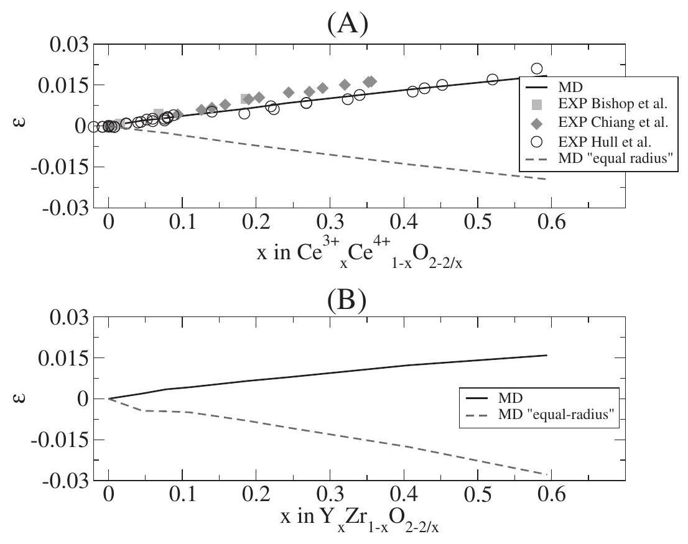
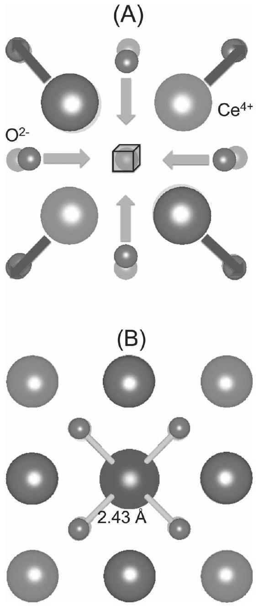
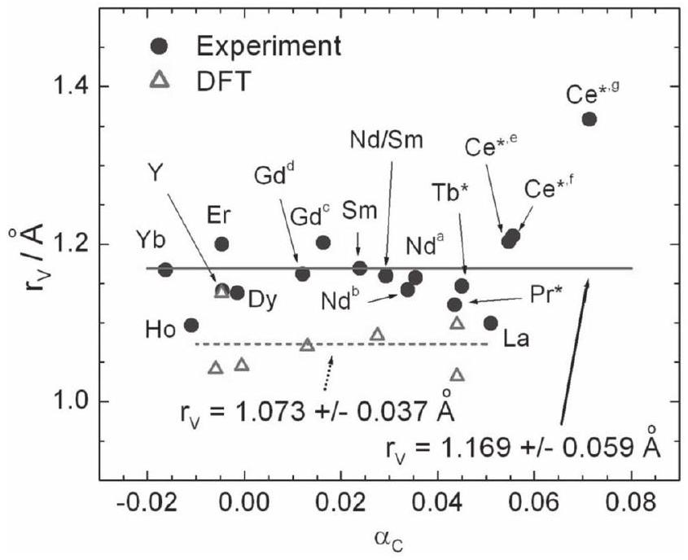
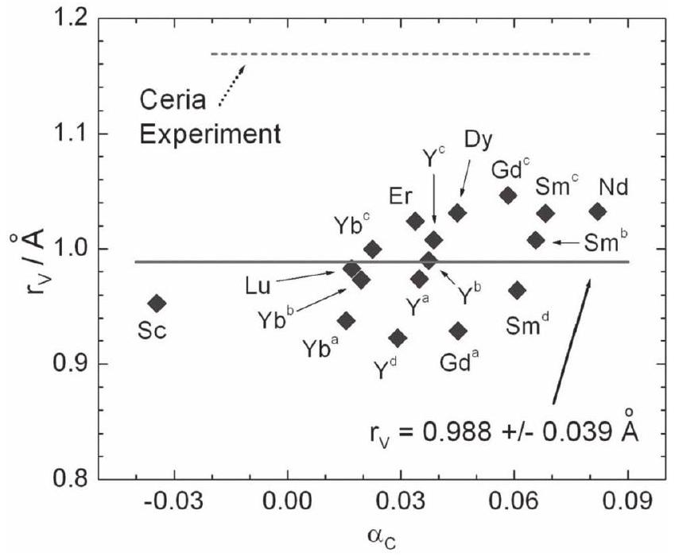

# Understanding Chemical Expansion in Non-Stoichiometric Oxides: Ceria and Zirconia Case Studies 

Dario Marrocchelli,* Sean R. Bishop,* Harry L. Tuller,* and Bilge Yildiz*

#### Abstract

Atomic scale computer simulations, validated with experimental data, are used to uncover the factors responsible for defect-induced chemical expansion observed in non-stoichiometric oxides, exemplified by $\mathrm{CeO}_{2}$ and $\mathrm{ZrO}_{2}$. It is found that chemical expansion is the result of two competing processes: the formation of a vacancy (leading to a lattice contraction primarily due to electrostatic interactions) and the cation radius change (leading to a lattice expansion primarily due to steric effects). The chemical expansion coefficient is modeled as the summation of two terms that are proportional to the cation and oxygen radius change. This model introduces an empirical parameter, the vacancy radius, which can be reliably predicted from computer simulations, as well as from experimental data. This model is used to predict material compositions that minimize chemical expansion in fluorite structured solid oxide fuel cell electrolyte materials under typical operating conditions.

referred to as chemical expansion. ${ }^{[5-7]}$ For example, an increase in the effective thermal expansion coefficient due to oxygen loss upon heating in air has been observed for both $\mathrm{Pr}_{0.1} \mathrm{Ce}_{0.9} \mathrm{O}_{2-\delta}$ (>200\%) and $\mathrm{La}_{0.6} \mathrm{Sr}_{0.4} \mathrm{Co}_{0.2} \mathrm{Fe}_{0.8} \mathrm{O}_{3-\delta}(>50 \%)$ SOFC cathode materials. ${ }^{[6,8]}$ Under the large oxygen partial pressure ( $\mathrm{pO}_{2}$ ) gradient typical of SOFC operation, chemical expansion has been shown to lead to cracking of cerium oxide membranes, and as a consequence, models have been developed to predict safe operating conditions. ${ }^{[9-14]}$ Secondarily, the increase in lattice parameter is reported to decrease the elastic modulus, requiring additional consideration in device design. ${ }^{[15-17]}$ Chemical expansion is also suspected of playing a role in the recently observed orders of magnitude increase in conductivity of highly strained heterostructure thin films (via longer and hence weaker bonds, with consequent decrease in oxide ion migration enthalpy) ${ }^{[11,18-21]}$ as well as in the large changes of strain in ceria thin films at low temperatures ( $<300^{\circ} \mathrm{C}$ ) (believed to result from oxygen vacancy rearrangements). ${ }^{[22-24]}$ Recent considerations of space charge have also predicted that chemical expansion results in significant stresses near surfaces, with consequent changes in thermodynamic equilibrium and lattice parameter anomalies in nanoscale materials. ${ }^{[25]}$ The above-mentioned examples represent a coupling of electro-chemomechanical properties, recently reviewed. ${ }^{[26,27]}$

While many experimental measurements have confirmed the existence of chemical expansion, its atomic-level origin is not well understood. ${ }^{[5,8,28,29]}$ For example, in ceria, it arises during defect formation through the following reduction reaction (written in Kröger-Vink notation). With decreasing $\mathrm{pO}_{2}$ and/or increasing temperature, oxygen vacancies ( $\mathrm{V}_{\mathrm{O}}^{\bullet \bullet}$ ) form with charge compensation through two electrons, localized on trivalent cerium cations ( Cé $_{\text {Ce }}$ ), forming small polarons: ${ }^{[30]}$

$$
2 \mathrm{Ce}_{\mathrm{Ce}}^{\mathrm{x}}+\mathrm{O}_{\mathrm{O}}^{\mathrm{x}} \leftrightarrow \mathrm{~V}_{\mathrm{O}}^{\bullet \bullet}+\frac{1}{2} \mathrm{O}_{2}+2 \mathrm{Ce}_{\mathrm{Ce}}^{\prime}
$$

The chemical expansion is believed to result from a superposition of two effects upon formation of defects during this reduction reaction: i) increase in ionic radius upon decrease in valence state of the cations from $4+$ to $3+$ and ii) the formation of positively charged oxygen vacancies with subsequent electrostatic repulsion of the cations surrounding it. Previously, Hong and Virkar analyzed the lattice parameter change of ceria, at room temperature in air, by partial substitution of tetravalent

Dr. D. Marrocchelli, ${ }^{[+]}$Prof. B. Yildiz
Laboratory for Electrochemical Interfaces
Department of Nuclear Science and Engineering
Massachusetts Institute of Technology Cambridge, MA 02139, USA
E-mail: dmarrocc@mit.edu; byildiz@mit.edu

Prof. S. R. Bishop
International Institute for Carbon Neutral Energy Research (WPI-I2CNER) Kyushu University
Nishi-ku Fukuoka 819-0395, Japan
E-mail: bishop@i2cner.kyushu-u.ac.jp
Prof. S. R. Bishop, Prof. H. L. Tuller
Department of Materials Science and Engineering
Massachusetts Institute of Technology
Cambridge, MA 02139, USA
E-mail: tuller@mit.edu
[+] Present address: School of Chemistry
Trinity College Dublin, Dublin 2, Ireland
DOI: 10.1002/adfm. 201102648

## 1. Introduction

Non-stoichiometric oxides are widely used in high temperature energy applications, such as solid oxide fuel cells (SOFCs), oxygen permeation membranes, and gas conversion/reformation catalysis. ${ }^{[1-4]}$ Indeed, many high performance SOFC electrodes, and even electrolytes, exhibit significant oxygen stoichiometry fluctuations with changes in atmosphere (oxidizing to reducing), temperature, and power demand, resulting not only in changes in electrical properties and phase stability, but also in significant mechanical stresses from defect induced lattice parameter changes, also
cerium with trivalent cations, resulting in the formation of oxygen vacancies to maintain charge neutrality. ${ }^{[31]}$ They developed an empirical model explaining that dopinginduced expansion results from an ionic radius change (from the difference in Ce and substitutional cation radii), plus an effective anion radius change (from the difference in the oxygen and vacancy radius). In the present work, the authors use, for the first time, atomic level computational methods, validated by more recent experimental data at elevated temperatures and controlled atmospheres, to rigorously examine the origin of chemical expansion in $\mathrm{CeO}_{2}$ and, to a lesser extent, in $\mathrm{ZrO}_{2}$. To the best of the authors' knowledge, there has been no computational study performed to support Hong and Virkar's conclusion, and, as previously stated, recent research has shown that chemical expansion is also a function of temperature and $\mathrm{pO}_{2}$ in many advanced SOFC materials, which are considered here. Finally, the power of the atomic- and electronic-level models used in this paper is the predictive capability to identify material compositions that minimize chemical expansion in fluorite-based SOFC materials under typical operating conditions.

Computational simulations were per-

Figure 1. Chemical expansion of ceria (A) and yttria-stabilized zirconia (B), showing experimental values (previously published data points ${ }^{[39-41]}$ ) and values predicted using MD simulations (ceria from, ${ }^{[35]}$ zirconia from this work) at 1273 K with realistic contributions to expansion from both cation radii change and vacancy formation (solid line), and for the hypothetical equal-radius cation substitution, resulting only in a contribution from vacancy formation (dashed line). It is clear from the figures that oxygen vacancy formation results in a contraction of the lattice.

formed using molecular dynamics (MD) to isolate the contributions of the anion and cation defects to chemical expansion, followed by density functional theory (DFT) to predict chemical expansion for a variety of defect concentrations. Using a simple analytical model to predict and explain chemical expansion in fluorite oxides, good agreement is found between experimental data and the atomistic simulations.

Before describing the results, it is worth noting that this paper is limited to the study of fluorite oxides known to have highly localized electrons (as indicated by their relatively large electron migration energies) and, hence, ionic character. Electron delocalization was described by Shannon to result in a significant decrease of metal to oxygen bond distance ${ }^{[32]}$ and, consequently, electron delocalization results in different (usually lower) chemical expansion coefficients, as evident in recent observations in perovskite oxides with transition metal cations. ${ }^{[8,32]}$ This means that care must be taken when using Shannon ionic radii in those less ionic systems. A computational example of the effect of electron delocalization in chemical expansion in $\mathrm{CeO}_{2-\delta}$ will be published by the authors in a future communication.

## 2. Results

### 2.1. The Origin of Chemical Expansion

As described in the introduction for the example of ceria, chemical expansion is believed to result from a superposition
of two effects, cation radii change upon reduction and electrostatic repulsion of cations around a positive oxygen vacancy. In this section, MD simulations are used to isolate these contributions, using a novel technique: an experiment performed computationally, in which the parameters of the interatomic potential have been altered in order to illustrate the physical factors responsible for a particular aspect of the observed behavior (see Computational Methods), providing a means to decouple factors ordinarily difficult or impossible to separate experimentally. ${ }^{[33-35]}$
Chemical expansion ${ }^{[36]}$ is defined as

$$
\varepsilon_{\mathrm{C}}=\frac{a-a_{0}}{a_{0}}
$$

where, in the example of reduced ceria, $a$ is the lattice parameter for $\mathrm{Ce}^{4+}{ }_{1-x} \mathrm{Ce}^{3+}{ }_{x} \mathrm{O}_{2-x / 2}$, and $a_{0}$ is the lattice parameter when $x=0$. The predicted chemical expansion using MD simulations for $\mathrm{Ce}^{4+}{ }_{1-x} \mathrm{Ce}^{3+}{ }_{x} \mathrm{O}_{2-x / 2}$ as a function of $x$, is plotted in Figure 1A, with reliable reproduction of the interatomic potential confirmed by comparison to experimental values from several authors. To separate the effects of cerium cation radii change and oxygen vacancy formation on chemical expansion, an MD simulation on a hypothetical system in which the ionic radius of $\mathrm{Ce}^{3+}$ is set equal to that for $\mathrm{Ce}^{4+}$ (see Computational Methods and Supporting Information), referred to as "equal-radius" $\mathrm{Ce}^{4+}{ }_{1-x} \mathrm{Ce}^{3+}{ }_{x} \mathrm{O}_{2-x / 2}$, was performed and also shown in Figure 1A. It is readily appreciated that oxygen vacancy formation by itself,
without a cation radius change, results in a contraction of the lattice parameter, and therefore, that the contribution resulting from cation radii change is larger than the overall expansion. This result is contradictory to prior beliefs that a positive oxygen vacancy should repel surrounding cations and thus result in an expansion of the lattice. ${ }^{[37,38]}$ To understand the origin of this phenomenon, we turn to an additional advantage of MD simulation, the precise identification and visualization of ion positions surrounding the defect, as shown in Figure 2.

Figure 2A, shows the relaxation patterns for the cations and anions surrounding an oxygen vacancy in reduced ceria. As expected on the basis of simple electrostatic considerations (the removal of an oxide ion means that the cation repulsion is not screened), the cations relax away from the vacancy (by approximately $0.10 \AA$ ), however, the anions get closer to it (by approximately $0.16 \AA$ ), also observed by others,

Figure 2. Local (less than one unit cell) lattice relaxations observed around a vacancy (cube in A) and a $\mathrm{Ce}^{3+}$ cation (central ion in B). Small (big) spheres indicate oxygen (cerium) ions and lighter shading indicates ions in planes below the page (further from the viewer; depth cuing). The snapshots are parallel to (001) planes.

both computationally and experimentally. ${ }^{[42-44]}$ It is clear that the magnitude of the significant distortions results in a net local contraction of the lattice around the vacancy. In the case of electrostatic relaxation around trivalent cations (Figure 2B), the electrostatic distortions are negligible with a much larger contribution by physical distortion from the increase in ionic radius. Electrostatic interactions may dominate around oxygen vacancies due to the relatively large change in charge upon their formation ( $2+$ ) as compared to reduced Ce ions $(1-)$ as well as a reduced "shielding" of charge by the vacant space.

With the origin of chemical expansion in ceria defined, it is useful to extend this model to investigate another fluorite system widely used in SOFC technology, zirconium oxide, shown in Figure 1B. The solid curve shows the chemical expansion calculated for $\mathrm{Y}_{2} \mathrm{O}_{3}$-stabilized $\mathrm{ZrO}_{2}$ (YSZ), the cubic symmetry being imposed by the isotropic barostat (see Computational Methods), whereas the dashed curve refers to "equal-radius" $\mathrm{ZrO}_{2}$. For ceria, the equal radius "dopant" cation was $\mathrm{Ce}^{3+;}$ however, in zirconia, $\mathrm{Zr}^{3+}$ does not occur experimentally, so one can consider the dopant to be an imaginary trivalent ion ${ }^{[45]}$ with radius equal to that of $\mathrm{Zr}^{4+}$. As also observed in the ceria case, the overall effect of oxygen vacancy formation is a contraction of the lattice parameter, and the vacancy induced chemical contraction in $\mathrm{ZrO}_{2}$ is greater than in $\mathrm{CeO}_{2}$. Empirically, this effect was also observed by Hong and Virkar. ${ }^{[31]}$ This finding, and its implications, will be discussed further in the following sections.

### 2.2. A Model for Chemical Expansion

In the previous section, computational modeling was used to demonstrate that chemical expansion results from a competition between two distinct chemical reactions, cation radii change and oxygen vacancy formation. In this section, an empirical model is used to quantify these two contributions from experimental data and, independently, from the previous MD simulations.

The lattice parameter (a) of a fluorite structured oxide is given by

$$
a=\frac{4}{\sqrt{3}}\left(r_{\text {cation }}+r_{\text {anion }}\right)
$$

where Hong and Virkar previously defined the effective cation and anion radii as ${ }^{[31]}$

$$
r_{\text {cation }}=x r_{\mathrm{s}}+(1-x) r_{\mathrm{h}}
$$

$$
r_{\text {anion }}=\left(\frac{2-0.5 x}{2}\right) r_{\mathrm{o}}+\left(\frac{0.5 x}{2}\right) r_{\mathrm{V}}
$$

with $r_{\mathrm{s}}, r_{\mathrm{h}}, r_{\mathrm{o}}$, and $r_{\mathrm{V}}$ the radius of substitutional impurity cation (e.g., $\mathrm{Ce}^{3+}$ or $\mathrm{Gd}^{3+}$ ), host cation (e.g., $\mathrm{Ce}^{4+}$ ), oxygen anion, and oxygen vacancy, respectively. The values for these radii are all available, with the exception of those for an oxygen vacancy, from the work of Shannon. ${ }^{[32]}$ The parameter $x$ represents the
fraction of trivalent cation substituted for tetravalent cerium as in $\mathrm{M}_{x} \mathrm{Ce}_{1-x} \mathrm{O}_{2-x / 2}$. Using Equations (4) and (5), Equation (2) is expanded as

$$
\begin{aligned}
\varepsilon= & \frac{a-a_{0}}{a_{0}}=\frac{\left(r_{\text {cation }}+r_{\text {anion }}\right)-\left(r_{\mathrm{h}}+r_{\mathrm{o}}\right)}{r_{\mathrm{h}}+r_{\mathrm{o}}} \\
& {\left[\frac{r_{\mathrm{s}}-r_{\mathrm{h}}}{r_{\mathrm{h}}+r_{\mathrm{o}}}+\frac{1}{4} \frac{\left(r_{\mathrm{V}}-r_{\mathrm{o}}\right)}{\left(r_{\mathrm{h}}+r_{\mathrm{o}}\right)}\right] x=\left(\alpha_{\mathrm{M}}+\alpha_{\mathrm{V}}\right) x=\alpha_{\mathrm{C}} x }
\end{aligned}
$$

where the initial cation and anion radii are used for $x=0$, i.e., $a_{0}=\frac{4}{\sqrt{3}}\left(r_{\mathrm{h}}+r_{\mathrm{o}}\right)$. The term preceding $x$ on the right hand side is the chemical expansion coefficient $\left(\alpha_{\mathrm{C}}\right)$, which is separated into a component due to cation radius change ( $\alpha_{\mathrm{M}}$ )
$\alpha_{\mathrm{M}}=\frac{r_{\mathrm{s}}-r_{\mathrm{h}}}{r_{\mathrm{h}}+r_{\mathrm{o}}}$
followed by a component due to the effective anion radius change ( $\alpha_{\mathrm{V}}$ ).
$\alpha_{\mathrm{V}}=\frac{1}{4} \frac{r_{\mathrm{V}}-r_{\mathrm{o}}}{r_{\mathrm{h}}+r_{\mathrm{o}}}$

It is important to note here that $\alpha_{\mathrm{C}}$ values used in this paper are based on $x$ fraction of trivalent cation, as opposed to basing it on oxygen non-stoichiometry ( $\delta$ ) as often done in the literature for redox-induced expansion (for example, see Bishop et al. ${ }^{[40]}$ ). Since from charge neutrality, $x=2 \delta$, $\alpha$ based on $x$ is half that based on $\delta$. From Equation (6) it is apparent that $\alpha_{\mathrm{M}}+\alpha_{\mathrm{V}}=\alpha_{\mathrm{C}}$, which, with Equation (8), is rearranged to solve for the effective oxygen vacancy radius,
$r_{\mathrm{V}}=4\left(r_{\mathrm{h}}+r_{\mathrm{o}}\right)\left[\alpha_{\mathrm{C}}-\alpha_{\mathrm{M}}\right]+r_{\mathrm{o}}$

Therefore, knowing the measured chemical expansion coefficient and using values of Shannon radii, $r_{\mathrm{V}}$ can be determined as shown in Figure 3 along with an average value of $r_{\mathrm{V}}$ including standard deviation (Table I in the Supporting Information reports the values of $\alpha_{\mathrm{C}}$ from the literature). The calculated $r_{\mathrm{V}}=1.169 \AA$ is less than $r_{\mathrm{o}}(1.38 \AA)$, confirming the computationally determined contraction resulting from oxygen vacancy formation (see Section 2.1) and agrees very well with the value determined by Hong and Virkar ( $1.164 \AA$ ), in which a smaller dataset, without the more recent experimental data at elevated temperatures and controlled atmospheres, was used. $\alpha_{\mathrm{V}}$ can now be calculated using Equation (8), resulting in $\alpha_{\mathrm{V}}=-0.023$ for ceria. Using the $\operatorname{Pr}^{4+} / \operatorname{Pr}^{3+}$ redox couple as an example, where $\alpha_{\mathrm{M}}=0.071$, the superposition of cation radii change and oxygen vacancy formation leads to a predicted expansion $a_{\mathrm{M}}+a_{\mathrm{V}}=a_{\mathrm{C}}=0.048$, close to the experimentally derived value of 0.044 .

Returning to the MD simulation case, an estimate for the values of $\alpha_{\mathrm{M}}$ and $\alpha_{\mathrm{V}}$ are extracted by a linear fit of the chemical expansion shown in Figure 1A, resulting in $\alpha_{\mathrm{C}}=0.031$ (solid line) and $\alpha_{\mathrm{V}}=-0.033$ (dashed line), matching well with $\alpha_{\mathrm{V}}$ determined above experimentally. $\alpha_{\mathrm{M}}$ is thus 0.064 (using the above-mentioned relation), similar to the value predicted by Shannon ionic radii ( $\alpha_{\mathrm{M}}=0.074$ ).

It is important to note here that though thermal expansion can, in principle, change $\alpha_{\mathrm{C}}$, the change in radii would be on the order of $1-2 \%$ in the temperature range studied (based on

Figure 3. Oxygen vacancy radius ( $r_{\mathrm{V}}$ ) calculated from experimental data using Equation (9) (filled circles) and plotted against measured $\alpha_{\mathrm{C}}$ for ceria based oxides, and $r_{\mathrm{V}}$ calculated using DFT (open triangles) plotted against predicted $\alpha_{\mathrm{C}}$. The average values of $r_{\mathrm{V}}$ are reported with their standard deviation. * indicates a redox induced expansion (e.g., $\mathrm{Pr}^{4+} / \mathrm{Pr}^{3+}$ ). Data from: Hong and Virkar ${ }^{[31]} \mathrm{La}, \mathrm{Nd}^{\mathrm{b}}, \mathrm{Gd}^{\mathrm{c}}, \mathrm{Yb}, \mathrm{Sm}, \mathrm{Er}, \mathrm{Dy}, \mathrm{Ho}$; Ray and Muccillo ${ }^{[46]}$ Y; Omar et al. ${ }^{[47]} \mathrm{Nd} / \mathrm{Sm}$; Stephens and Kilner ${ }^{[48]}$ Nd ${ }^{\text {a }}$; Kudo and Obayashi ${ }^{[49]} \mathrm{Gd}^{\text {d }}$; Chiang et al. ${ }^{[41]} \mathrm{Ce}{ }^{*, \mathrm{f}}$; Hull et al. ${ }^{[39]} \mathrm{Ce}{ }^{*, \mathrm{f}}$; Bishop et al. ${ }^{[40]} \mathrm{Ce}{ }^{*, \mathrm{e}}$ (undoped), $\mathrm{Ce}{ }^{*, g}$ (Gd-doped)Pr*; and, Chatzichristodoulou et al. ${ }^{[50]} \mathrm{Tb}$ *.

measured thermal expansion) and experimentally measured $\alpha_{\mathrm{C}}$ values have been shown to be invariant (ceria) ${ }^{[6,40,51]}$ or display only a small variation with temperature. ${ }^{[5,8]}$ In addition, the effect of defect interactions, that occur for high levels of dopant (or reduced cation) has not been considered here. It is highly probable that defect interactions are playing a role in chemical expansion (see Atkinson et al. and Bishop et al. ${ }^{[37,51]}$ ), however, in order to maximize the number of consistent data points (and minimize noise), chemical expansion data has been taken from materials doped with up to $25 \mathrm{~mol} \%$ cation. Furthermore, due to the small volumes of DFT calculations (see next section), the dopant density is also approximately $25 \mathrm{~mol} \%$, so that the comparison of experimental and computational work is possible.

In addition, values of $r_{\mathrm{V}}$ for $\mathrm{ZrO}_{2}$ are reported in Figure 4 (chemical expansion coefficients are reported in the Supporting Information). Unfortunately, only expansion due to fixed valent doping has been reported in the literature, though there is evidence of mixed valency for certain dopants and experimental conditions. ${ }^{[52]}$ As in the previous case, here we use a larger data set than that used by Hong and Virkar; the calculated $r_{\mathrm{V}}=0.988 \AA$ agrees well with the value determined by Hong and Virkar ( $0.994 \AA$ ), the small difference being a consequence of the different data sets used. Our analysis of the experimental data from the literature therefore confirms what was found in the previous section with MD simulations, namely that the lattice contraction observed around a vacancy in $\mathrm{ZrO}_{2}$ is greater than that in $\mathrm{CeO}_{2}$. The implications of this finding will be discussed

Figure 4. Oxygen vacancy radius $\left(r_{\mathrm{V}}\right)$ versus measured chemical expansion coefficient $\left(\alpha_{C}\right)$ for stabilized zirconia and calculated using experimental data. The average value for $r_{\mathrm{V}}$ in stabilized zirconia (solid line) and ceria from Figure 3 (dashed line) are reported along with the standard deviation for zirconia. Data from Lefevre and Strickler ${ }^{[53,54]} \mathrm{Y}^{\mathrm{a}}, \mathrm{Gd}^{\mathrm{a}}, \mathrm{Yb}^{\mathrm{a}}$; Strickler et al. ${ }^{[54]} \mathrm{Sc}, \mathrm{Sm}^{\mathrm{b}}, \mathrm{Yb}^{\mathrm{b}}$; Yashima et al. ${ }^{[55]} \mathrm{Lu}, \mathrm{Yb}^{\mathrm{c}}, \mathrm{Er}, \mathrm{Y}^{\mathrm{c}}, \mathrm{Dy}, \mathrm{Gd}^{\mathrm{c}}$, $S m^{c}, N d$; Hartmanova et al. ${ }^{[56]} \gamma^{d}, S m^{d}$.

in the next sections. The values of $\alpha_{\mathrm{M}}$ and $\alpha_{\mathrm{V}}$ are extracted from our MD calculations by a linear fit to the chemical expansion shown in Figure 1B, resulting in $\alpha_{\mathrm{C}}=0.026$ (solid line) and $\alpha_{\mathrm{V}}=-0.044$ (dashed line). These compare well with the experimental values $\alpha_{\mathrm{C}}=0.0269$ to 0.036 for Y doping (see Table II in the Supporting Information) and with $\alpha_{\mathrm{V}}=-0.044$, extracted from $r_{\mathrm{V}}=0.988 \AA$.

### 2.3. Ab Initio Prediction of Chemical Expansion

In our third and final approach for evaluating the origin of chemical expansion, we use another computational method, density functional theory (DFT). The DFT method, taking into account the electronic behavior of the material explicitly, complements the MD simulations, providing an additional method to predict chemical expansion in these systems and particularly useful when there is no experimental data available. In its treatment here, the DFT method acts as a replacement for the often laborious process of making various compositions of material and measuring their lattice parameters. Similar dopant cation compositions as the experimental ones are made (see Computational Methods) and their lattice parameters are evaluated as a function of dopant or reduced cation concentration, yielding a measure of chemical expansion and derivation of chemical expansion coefficient. Thus, the same routine to determine $\alpha_{\mathrm{V}}$ used in Section 2.2 is applied in this section.

Figure 3 (open triangles) shows this DFT calculation result for ceria with the vacancy radius ( $r_{\mathrm{V}}$ ) also reported in the figure. Like the experimental case, a constant value for $r_{\mathrm{V}}$ is derived. A summary of values for $r_{\mathrm{V}}$ is shown in Table 1 (since $\mathrm{ZrO}_{2}$ is

Table 1. Vacancy ( $r_{\mathrm{V}}$ ) and matching cation radii ( $r^{*}$ ) as extracted from the experimental data (EXP) and predicted from MD simulations and DFT calculations.
|  | $\mathrm{CeO}_{2}$ (EXP) | $\mathrm{CeO}_{2}$ (MD) | $\mathrm{CeO}_{2}$ (DFT) | $\mathrm{ZrO}_{2}$ (EXP) | $\mathrm{ZrO}_{2}$ (MD) |
| :--- | :---: | :---: | :---: | :---: | :---: |
| $r_{\mathrm{V}}(\AA)$ | 1.164 | 1.07 | 1.07 | 0.988 | 1.02 |
| $r_{\mathrm{S}}(\AA)$ | 1.024 | 1.05 | 1.05 | 0.938 | 0.93 |

not cubic at low temperature and dopant concentrations, DFT was not performed, though this restriction can be lifted in the case of MD). There is good agreement between the different computational methods used and experiment (with a difference of less than $10 \%$ ). Lastly, though not explicitly indicated in Figure 3, the simulated and measured $\alpha_{\mathrm{C}}$ for each dopant (Y, etc.) showed general agreement, usually within $20 \%$ of the experiment values.

In summary of this section, in this work, two computational approaches were used to predict the $r_{\mathrm{V}}$ parameters and they yield exactly the same values, ${ }^{[57]}$ which are in turn within less than $10 \%$ variance from the experimental ones. Both computational approaches have pros and cons. The MD approach is very fast, since only a few calculations on one system are required to extract $\alpha_{\mathrm{V}}$ and these can be readily performed in a few hours on a standard desktop computer. However, this approach requires the use of very accurate inter-ionic potentials, and the parameterization of these can be very time-demanding. ${ }^{[35,58]}$ On the other hand, the DFT-based method does not require any parameterization and as such requires little setup, though, the more intensive simulation requires significantly more time (e.g., more than 16 processors for several days, representative of the simulation of configurations in this work).

### 2.4 Devising Materials with No Chemical Expansion

As discussed in the introduction, chemical expansion presents a challenge in designing SOFC systems, and its minimization would improve the operability of advanced electrodes and electrolytes. By using the above-introduced formula, $\alpha_{\mathrm{C}}=\alpha_{\mathrm{M}} +\alpha_{\mathrm{V}}$ in this section, we suggest two different, and separate, strategies to minimize chemical expansion: i) selecting variable valence cation dopants that balance the cation radius change (corresponding to reducing $\alpha_{\mathrm{M}}$ ) against the vacancy formationinduced contraction, and, ii) increase the vacancy formation induced contraction by taking advantage of the different $r_{\mathrm{V}}$ values of ceria and zirconia (essentially modifying $\alpha_{\mathrm{V}}$, as discussed at the end of this section). At this point, these are proof of concept approaches as additional factors, such as, inter alia, the oxygen activity and temperature range in which variable valence of dopant and cerium takes place, must be considered. Currently, our group is investigating these predictions and additional considerations.

If we impose that $\alpha_{\mathrm{C}}=0$ in Equation 6, we obtain the following expression for a critical dopant radius for zero chemical expansion (shown in Table 1 for ceria and zirconia):
$r_{\mathrm{s}}^{\bullet}=r_{\mathrm{h}}-\frac{1}{4}\left(r_{\mathrm{V}}-r_{\mathrm{o}}\right)$

It is worth noting that, since the ( $r_{\mathrm{V}}-r_{\mathrm{o}}$ ) term is negative, this radius will be greater than the host cation radius. In the example of ceria, by using $r_{\mathrm{V}}=1.169 \AA$, we find that $r_{\mathrm{S}}= 1.027 \AA$ for a trivalent dopant, as opposed to $r_{\mathrm{h}}=0.97 \AA$. Therefore, doping with an element such as Dy ( $r=1.027 \AA$ ) will result in nearly zero chemical expansion, as can be readily observed in Figure 3. Previous efforts have more or less recognized this approach (also considering coulombic interactions) and used it to minimize lattice distortion and successfully maximize ionic conductivity. ${ }^{[47,59]}$ However, in the following discussion, the minimization of chemical expansion concept is integrated to also encompass multivalent systems (e.g., the reduction of Ce ), thereby tackling high temperature and oxygen activity variant mechanical properties. Doping ceria with elements with variable valence elements, such as $\operatorname{Pr}^{4+} / \operatorname{Pr}^{3+}$, has been shown to result in a chemical expansion with changes in oxygen activity and temperature and it correlates well with our developed model. However, the $\alpha_{\mathrm{C}}$ measured for the Pr redox couple is similar to the Ce redox couple, both of which are relatively large. As mentioned in the introduction, these redox couples lead to mixed ionic electronic conductive behavior, advantageous in SOFC electrodes, and, therefore, it is useful to find other variable valence elements which have a lower $\alpha_{\mathrm{M}}$ and hence $\alpha_{\mathrm{C}}$. Examination of Shannon radii shows that several transition elements exhibit much smaller radius changes upon $4+$ to $3+$ valence change. For example, $\mathrm{Fe}\left(\alpha_{\mathrm{M}}=0.031\right), \mathrm{Ti}\left(\alpha_{\mathrm{M}}=0.033\right)$, and $\mathrm{V}\left(\alpha_{\mathrm{M}}=0.031\right)^{[60]}$ each exhibit expansion coefficients much closer to $\left|\alpha_{\mathrm{V}}\right|(=|-0.023|)$ than $\mathrm{Ce}\left(\alpha_{\mathrm{M}}=0.074\right)$. The solubility of these elements in ceria is not well known nor is their valence state when in solution, though investigations in, for example, the $\mathrm{Ce}_{1-x-\gamma} \mathrm{Fe}_{x} \mathrm{Mn}_{\gamma} \mathrm{O}_{2}$ solid solution system are underway. ${ }^{[61]}$

Our second strategy for decreasing reduction induced chemical expansion in ceria is to increase $\left|\alpha_{\mathrm{V}}\right|$. We showed in this manuscript that the vacancy radius in $\mathrm{ZrO}_{2}\left(r_{\mathrm{V}}=0.988 \AA\right)$ is significantly smaller than in $\mathrm{CeO}_{2}\left(r_{\mathrm{V}}=1.169 \AA\right)$, and with the same $r_{\mathrm{o}}$, zirconia thus has a larger $\left|\alpha_{\mathrm{V}}\right|$ (further exemplified by the relatively larger cation critical radius in zirconia, see Table 1). An example of using this to our advantage is a $\mathrm{CeO}_{2}-\mathrm{ZrO}_{2}$ solid solution, where only cerium will reduce under typical SOFC anode operating conditions. Assuming that $r_{\mathrm{V}}$ obeys Vegard's law with zirconia to ceria ratio, $\left|\alpha_{\mathrm{V}}\right|$ can concomitantly be increased above ceria alone, resulting in a net reduction of $\alpha_{\mathrm{C}}$.

In summary, in view of our results, two different approaches can be used to minimize chemical expansion in ceria, the first one aiming at decreasing $\alpha_{\mathrm{M}}$, the second one at increasing $\left|\alpha_{\mathrm{V}}\right|$. By way of example, both approaches were shown to potentially decrease $\alpha_{\mathrm{C}}$. However, it has to be noted that some of the abovesuggested doping strategies might affect other important figures of merit, for instance ionic and electronic conductivity and stability, highlighting the importance of thorough examinations of the defect structure and transport properties of materials of interest. ${ }^{[26]}$

## 3. Conclusions

We used atomic level modeling and simulations to rigorously examine the origin of chemical expansion in ceria and zirconia
as model systems for non-stoichiometric fluorite oxides. It was found that chemical expansion in both materials is the result of two competing processes, the formation of a vacancy (leading to a lattice contraction) and the cation radius change upon reduction (leading to a lattice expansion). This can be described by a very simple model, based on the formalism introduced by Hong and Virkar, ${ }^{[31]}$ in which the chemical expansion coefficient is written as $\alpha_{\mathrm{C}}=\alpha_{\mathrm{M}}+\alpha_{\mathrm{V}}$ where $\alpha_{\mathrm{M}}$ and $\alpha_{\mathrm{V}}$ can be expressed in terms of the host and substitutional cation radii and the oxygen and vacancy radii. While the first three can be obtained from the work of Shannon, ${ }^{[32]}$ the latter is an empirical parameter describing the extent of the lattice relaxations around a vacancy.

One of the main results of this work was to show that the vacancy radius, $r_{\mathrm{V}}$ can be obtained, not only by fitting the model to experimental data, but also, independently, by means of MD simulations and DFT calculations. Both approaches yield values for $r_{\mathrm{V}}$ that are within less than $10 \%$ of the experimentally determined ones, demonstrating the validity of the approach. This opens the door for an ab initio prediction of chemical expansion in these and related fluorite-structured materials. It is worth noting that while an experimental determination of $r_{\mathrm{V}}$ might take months, the electronic and atomic level computational methods demonstrated on this problem here can provide a reliable value for $r_{\mathrm{V}}$ within days.

Finally our results were used to provide guidelines for devising materials with negligible chemical expansion. Our strategy relies on the $\alpha_{\mathrm{C}}=\alpha_{\mathrm{M}}+\alpha_{\mathrm{V}}$ formula, where $\alpha_{\mathrm{V}}$ is negative, because vacancies cause a lattice contraction. A smaller chemical expansion coefficient can therefore be obtained by either increasing $\left|\alpha_{\mathrm{V}}\right|$ or decreasing $\alpha_{\mathrm{M}}$. We suggested doping strategies for ceria that, according to our model, are expected to result in materials with lower chemical expansion coefficients. We are currently investigating these predictions and additional considerations.

## 4. Computational Methods

In this work we used a combination of DFT calculations, within the DFT+U framework, and potential-based MD simulations. The interaction potential used for the MD simulations of $\mathrm{CeO}_{2}$ and $\mathrm{ZrO}_{2}$ is known as the DIPole polarizable ion model (DIPPIM) and includes a pair potential (a Buckingham-like term plus Coulombic interactions), together with an account of the polarization effects that result from the induction of dipoles on the ions. This reads
$\mathrm{V}=\sum_{i \leq j} \frac{q_{i} q_{j}}{r_{i j}}+\sum_{i \leq j} \frac{A^{i j} e^{a^{i j} r_{i j}}}{r_{i j}}+V_{\text {disp }}+V_{\text {pol }}$
where $V_{\text {disp }}$ and $V_{\text {pol }}$ are the dispersion and polarization terms and were described previously. ${ }^{[35]}$ The parameterization and testing of this model were reported in a previous publication. ${ }^{[35,58]}$ The accuracy of this model was found to be similar to that of DFT calculations, ${ }^{[33-35,58,62]}$ and the lower computational cost allows the performance of longer simulations on bigger systems. The lattice parameters for the studied systems were obtained by performing molecular dynamics simulations with $4 \times 4 \times 4$ supercells in an NPT ensemble, at the required temperatures. We used
an isotropic barostat and thermostats as described by Martyna et al. ${ }^{[63,64]}$ and we set the external pressure to zero. The isotropic barostat enforced a cubic fluorite symmetry. The lattice parameters were usually averaged over long trajectories (less than 0.1 ns ). All these calculations were performed with an in-house code called PIMAIM. The DIPPIM potential has been recently implemented in the freely available CP2K code. ${ }^{[65]}$

In addition to these "realistic" potentials, we also constructed ideal systems in which the radius of the dopant cation was changed. This was done by manually modifying the short-range interaction parameters of the potentials, $A^{i j}$ and $a^{i j}$, which are directly related to the cation size. This allowed us to study systems in which, for instance, the dopant cation had exactly the same radius as the host cation or in which the dopant cation's radius was chosen so that the chemical expansion of this material was equal to zero. This approach has been successfully used to study the effects of vacancy ordering on the ionic conductivity of YSZ and YDC. ${ }^{[33-35,66]}$ We refer the reader to the Supporting Information for further details on this approach.

The DFT calculations were performed with the Vienna ab initio simulation package (VASP), ${ }^{[67-68]}$ with the projector augmented wave (PAW) method. We used the generalized gradient approximation (GGA) with the Perdew-Wang 91 (PW91) exchange-correlation functional and an energy cut-off of 500 eV . We also added a Hubbard term, $U=5 \mathrm{eV}$, to properly describe the localized nature of the $f$ electrons in cerium. All trivalent lanthanide dopants (Tb, Sm, Gd, Nd, La) were described by treating localized $4 f$ electrons as a part of the frozen core. The calculations were carried out using the Brillouin zone sampled with a ( $2 \times 2 \times 2$ ) Monkhorst-Pack mesh $k$-points grid. These settings are in line with those previously used in the literature and convergence tests were performed to make sure that the results are well converged with respect to these parameters. Chemical expansion coefficients were extracted from the lattice parameters of 4 compositions, corresponding to $0 \%, 6.25 \%, 12.5 \%$, and $25 \%$ dopant cation concentrations.

## Supporting Information

Supporting Information is available from the Wiley Online Library or from the author.

## Acknowledgements

D.M. and S.R.B. contributed equally to this work. S.R.B., H.L.T. and B.Y. thank Basic Energy Sciences, and the U.S. Department of Energy (contract \# DE SC0002633), and, B.Y. and D.M. thank the SchlumbergerDoll Research Center for support of this research. D.M. and B.Y. acknowledge the National Science Foundation for computational support through the TeraGrid Advanced Support Program, with a start-up allocation (TG-DMR100098) and a research allocation (TGDMR110004). S.R.B recognizes partial support from WPI-I ${ }^{2}$ CNER, supported by the World Premier International Research Initiative (WPI), MEXT, Japan.
[1] S. B. Adler, J. A. Lane, B. C. H. Steele, J. Electrochem. Soc. 1996, 143, 3554.
[2] M. Sugiura, Catal. Surv. Asia 2003, 7, 77.
[3] P. N. Dyer, R. E. Richards, S. L. Russek, D. M. Taylor, Solid State Ionics 2000, 134, 21.
[4] Y. Y. Liu, X. Y. Tan, K. Li, Catal. Rev. Sci. Eng. 2006, 48, 145.
[5] S. B. Adler, J. Am. Ceram. Soc. 2001, 84, 2117.
[6] S. R. Bishop, H. L. Tuller, Y. Kuru, B. Yildiz, J. Eur. Ceram. Soc. 2011, 31, 2351.
[7] A. Y. Zuev, A. I. Vylkov, A. N. Petrov, D. S. Tsvetkov, Solid State Ionics 2008, 179, 1876.
[8] S. R. Bishop, K. L. Duncan, E. D. Wachsman, J. Am. Ceram. Soc. 2010,4115.
[9] K. Sato, K. Yashiro, T. Kawada, H. Yugami, T. Hashida, J. Mizusaki, J. Power Sources 2010, 195, 5481.
[10] J. Kuebler, U. F. Vogt, D. Haberstock, J. Sfeir, A. Mai, T. Hocker, M. Roos, U. Harnisch, Fuel Cells 2010, 10, 1066.
[11] N. Swaminathan, J. Qu, Y. Sun, Philos. Mag. 2007, 87, 1705.
[12] R. Krishnamurthy, B. W. Sheldon, Acta Mater. 2004, 52, 1807.
[13] A. Atkinson, Solid State Ionics 1997, 95, 249.
[14] E. Blond, N. Richet, J. Eur. Ceram. Soc. 2008, 28, 793.
[15] Y. Wang, K. Duncan, E. D. Wachsman, F. Ebrahimi, Solid State Ionics 2007, 178, 53.
[16] T. Kushi, K. Sato, A. Unemoto, K. Amezawa, T. Kawada, S. Singhal, K. Eguchi, ECS Trans. 2011, 35, 1145.
[17] N. Swaminathan, J. Qu, Modell. Simul. Mater. Sci. Eng. 2009, 17, 045006.
[18] J. Garcia-Barriocanal, A. Rivera-Calzada, M. Varela, Z. Sefrioui, E. Iborra, C. Leon, S. J. Pennycook, J. Santamaria, Science 2008, 321, 676.
[19] N. Schichtel, C. Korte, D. Hesse, J. Janek, Phys. Chem. Chem. Phys. 2009, 11, 3043.
[20] E. Fabbri, D. Pergolesi, E. Traversa, Sci. Technol. Adv. Mater. 2010, 11, 054503.
[21] A. Kushima, B. Yildiz, J. Mater. Chem. 2010, 20, 4809.
[22] A. Kossoy, A. I. Frenkel, Q. Wang, E. Wachtel, I. Lubomirsky, Adv. Mater. 2010, 22, 1659.
[23] A. Kossoy, Y. Feldman, R. Korobko, E. Wachtel, I. Lubomirsky, J. Maier, Adv. Funct. Mater. 2009, 19, 634.
[24] Y. Kuru, S. R. Bishop, J.-J. Kim, B. Yildiz, H. L. Tuller, ECS Trans. 2011, 35, 1131.
[25] B. W. Sheldon, V. B. Shenoy, Phys. Rev. Lett. 2011, 106, 216104.
[26] H. L. Tuller, S. R. Bishop, Annu. Rev. Mater. Res. 2011, 41, 369.
[27] H. L. Tuller, S. R. Bishop, Chem. Lett. 2010, 39, 1226.
[28] T. R. Armstrong, J. W. Stevenson, L. R. Pederson, P. E. Raney, J. Electrochem. Soc. 1996, 143, 2919.
[29] M. Mogensen, N. M. Sammes, G. A. Tompsett, Solid State Ionics 2000, 129, 63.
[30] H. L. Tuller, A. S. Nowick, J. Phys. Chem. Solids 1977, 38, 859.
[31] S. J. Hong, A. V. Virkar, J. Am. Ceram. Soc. 1995, 78, 433.
[32] R. D. Shannon, Acta Crystallogr., Sect. A 1976, 32, 751.
[33] D. Marrocchelli, P. A. Madden, S. T. Norberg, S. Hull, J. Phys. Condens. Matter 2009, 21, 405403.
[34] D. Marrocchelli, P. A. Madden, S. T. Norberg, S. Hull, Chem. Mater. 2011, 23, 1365.
[35] M. Burbano, D. Marrocchelli, B. Yildiz, H. L. Tuller, S. T. Norberg, S. Hull, P. A. Madden, G. W. Watson, J. Phys. Condens. Matter 2011, 23, 255402.
[36] Note that here we use the term chemical expansion loosely. Indeed, the quantity $\varepsilon_{\mathrm{C}}$, defined in Equation (2), can also be negative, thus leading to a chemical contraction.
[37] A. Atkinson, T. M. G. M. Ramos, Solid State Ionics 2000, 129, 259.
[38] Though, as shown here, an overall local lattice expansion around a vacancy is not observed in the ceria and zirconia systems, these arguments remain untested in perovskite systems.

## www.MaterialsViews.com

[39] S. Hull, S. T. Norberg, I. Ahmed, S. G. Eriksson, D. Marrocchelli, P. A. Madden, J. Solid State Chem. 2009, 182, 2815.
[40] S. R. Bishop, K. L. Duncan, E. D. Wachsman, Electrochim. Acta 2009, 54, 1436.
[41] H. W. Chiang, R. N. Blumenthal, R. A. Fournelle, Solid State Ionics 1993, 66, 85.
[42] J. P. Goff, W. Hayes, S. Hull, M. T. Hutchings, K. N. Clausen, Phys. Rev. B 1999, 59, 14202.
[43] P. P. Dholabhai, J. B. Adams, P. Crozier, R. Sharma, J. Chem. Phys. 2010, 132, 094104.
[44] H. Wang, Y. Guo, G. Lu, P. Hu, Angew Chem., Int. Ed. 2009, 48, 8289.
[45] $\mathrm{Sc}^{3+}$ is the element closest to this definition. Indeed its ionic radius is $0.87 \AA$ which is very close to that of $\mathrm{Zr}^{4+}, 0.84 \AA$.
[46] J. F. Q. Rey, E. N. S. Muccillo, J. Eur. Ceram. Soc. 2004, 24, 1287.
[47] S. Omar, E. D. Wachsman, J. C. Nino, Solid State Ionics 2008, 178, 1890.
[48] I. E. L. Stephens, J. A. Kilner, Solid State Ionics 2006, 177, 669.
[49] T. Kudo, H. Obayashi, J. Electrochem. Soc. 1975, 122, 142.
[50] C. Chatzichristodoulou, P. V. Hendriksen, A. Hagen, J. Electrochem. Soc. 2010, 157, B299.
[51] S. R. Bishop, K. L. Duncan, E. D. Wachsman, Acta Mater. 2009, 57, 3596.
[52] K. Sasaki, J. Maier, Solid State Ionics 2000, 134, 303.
[53] J. Lefevre, Ann. Chim. Fr. 1963, 8, 118.
[54] D. W. Strickler, W. G. Carlson, J. Am. Ceram. Soc. 1965, 48, 286.
[55] M. Yashima, N. Ishizawa, M. Yoshimura, J. Am. Ceram. Soc. 1992, 75, 1550.
[56] M Hartmanova, E.E. Lomonova, F. Kubel, J. Schneider, V. Bursikova, M. Jergel, V. Navratil, F. Kundracik, J. Mater. Sci. 2009, 44, 234
[57] The fact that both the MD and DFT approaches yield exactly the same values for $r_{\mathrm{V}}$ and $r_{\mathrm{S}}$ is probably a consequence of the fact that the MD potentials have been fitted to DFT data.
[58] S. T. Norberg, S. Hull, I. Ahmed, S. G. Eriksson, D. Marrocchelli, P. A. Madden, P. Li, J. T. S. Irvine, Chem. Mater. 2011, 23, 1356.
[59] J. A. Kilner, Chem. Lett. 2008, 37, 1012.
[60] For these elements, we used the ionic radii for a six-fold coordination, since there are no values available for the eight-fold coordination case. Also, for those elements such as Fe that have different spin states, we always used the high spin state.
[61] T. Ishihara, T. H. Shin, P. Vanalabhpatana, K. Yonemoto, M. Matsuka, Electrochem. Solid State Lett. 2010, 13, B95.
[62] D. Marrocchelli, M. Salanne, P. A. Madden, J. Phys. Condens. Matter 2010, 22, 152102.
[63] G. J. Martyna, D. J. Tobias, M. L. Klein, J. Chem. Phys. 1994, 101, 4177.
[64] G. J. Martyna, M. L. Klein, M. Tuckerman, J. Chem. Phys. 1992, 97, 2635.
[65] M. Salanne, B. Rotenberg, S. Jahn, R. Vuilleumier, C. Simon, P. A. Madden, Theor. Chem. Acc. DOI: 10.1007/s00214-012-1143-9.
[66] M. Burbano, S. T. Norberg, S. Hull, S. G. Eriksson, D. Marrocchelli, P. A. Madden, G. W. Watson, Chem. Mater. 2012, 24, 222.
[67] G. Kresse, D. Joubert, Phys. Rev. B 1999, 59, 1758.
[68] G. Kresse, J. Furthmuller, Phys. Rev. B 1996, 54, 11169.

