# Physical, chemical and electrochemical properties of pure and doped ceria 

Mogens Mogensen ${ }^{\mathrm{a}, *}$, Nigel M. Sammes ${ }^{\mathrm{b}}$, Geoff A. Tompsett ${ }^{\mathrm{b}}$ ${ }^{\mathrm{a}}$ Materials Research Department, Risø National Laboratory, DK-4000 Roskilde, Denmark ${ }^{\mathrm{b}}$ Department of Materials and Process Engineering, The University of Waikato, Private Bag 3105, Hamilton, New Zealand

Received 1 February 1999; accepted 27 November 1999

#### Abstract

This paper gives an extract of available data on the physical, chemical, electrochemical and mechanical properties of pure and doped ceria, predominantly in the temperature range from 200 to $1000^{\circ} \mathrm{C}$. Several areas are pointed out where further research is needed in order to make a better basis for the evaluation of the real potential and limits for the practical application of ceria in solid oxide fuel cells and other solid state electrochemical devices. 2000 Elsevier Science B.V. All rights reserved.

Keywords: Ceria; Mixed ionic and electronic conductor; Solid oxide fuel cell; Electrolyte; Anode

## 1. Introduction

Ceria-based materials have been very widely investigated. The number of hits in a literature search on the keyword 'ceria' for the period from June 1993 until the end of 1998 was 560 , and this search was restricted to main journal articles only. A total ceria search in Chemical Abstracts covering this century reveals thousands of references. Therefore, within the available frames, it will be possible to cover only a limited number of properties in any depth. For example, the area of the catalytic properties of ceria will just be mentioned very briefly in the context of electrochemical properties even though this is one of the areas where most papers are being produced.

[^0]Also, several books and numerous review articles on the topic of oxide conductors have been written, e.g., Refs. [1-6], which all cover ceria to some extent. Recently a specific review of ceria-based solid electrolytes was published [7]. However, it is in no way the intention of the present paper to substitute any of these reviews. The purpose is to contribute to the construction of a basis, which will make it possible to draw more reliable conclusions about the potential and limitations of the applications of ceria based materials as electrolyte and electrodes in high temperature electrochemical devices, especially in solid oxide fuel cells (SOFC). In this context it is necessary to look into a number of different properties of ceria such as mechanical properties, chemical stability and electrical conductivity.

Pure stoichiometric $\mathrm{CeO}_{2}$ has the calcium fluoride (fluorite) type of structure with space group Fm3m over the whole temperature range from room tem-

Table 1
Some physical properties of pure stoichiometric $\mathrm{CeO}_{2}$
| Property | Value (unit) |
| :--- | :--- |
| Density | $7.22 \mathrm{~g} \mathrm{~cm}^{-3}$ |
| Melting point | Ca. 2750 K |
| Specific heat | Ca. $460 \mathrm{~J} \mathrm{~kg}^{-1} \mathrm{~K}^{-1}$ |
| Thermal conductivity | Ca. $12 \mathrm{~W} \mathrm{~m}^{-1} \mathrm{~K}^{-1}$ |
| Refractive index | Ca. 2.1 visible Ca. 2.2 infrared |
| Relative dielectric constant ( $0.5-50 \mathrm{MHz}$ ) | 11 |
| Youngs' modulus | Ca. $165 \times 10^{9} \mathrm{~N} \mathrm{~m}^{-2}$ |
| Poisson’s ratio | Ca. 0.3 |
| Hardness | 5-6 |

perature to the melting point. Pure $\mathrm{CeO}_{2}$ is pale yellow in colour probably due to Ce (IV)-O(-II) charge transfer. The ceria structure is known to tolerate a considerable reduction without phase change, especially at elevated temperatures. Such $\mathrm{CeO}_{2-x}$ is blue and turns almost black when it is grossly nonstoichiometric. The colour of $\mathrm{CeO}_{2}$ is also sensitive to the presence of other lanthanides. As small a content as $0.02 \%$ of Pr results in a brownish-yellow colour due to $\mathrm{Ce}^{4+}-\mathrm{Pr}^{3+}$ transitions [8]. Some of the physical properties of $\mathrm{CeO}_{2}$ are listed in Table 1. The data are from Kilbourn [8] apart from density [9] and dielectric constant [10].

## 2. Defect and redox chemistry

### 2.1. Types of defects and reactions

When $\mathrm{CeO}_{2}$ is reduced to $\mathrm{CeO}_{2-x}$ defects are formed in the form of $\mathrm{Ce}^{3+}$, which in the Kröger-Vink-notation is written as $\mathrm{Ce}_{\mathrm{Ce}}^{\prime}$ as the $\mathrm{Ce}^{3+}$ has one negative charge compared to the normal lattice In early works, such as those of Kofstad and Hed [11], Kevane [12], Blumenthal et al. [13], and Iwasaka and Katsura [14], it was discussed whether these substitutional negative defects were balanced by some of the $\mathrm{Ce}^{3+}$ going on interstitial sites as $\mathrm{Ce}_{\mathrm{i}}^{\cdot \cdot}$ or by oxide ion vacancies, $\mathrm{V}_{\mathrm{O}}^{\cdot \cdot}$. Later works using oxygen self-diffusion studies [15-17]) in nonstoichiometric $\mathrm{CeO}_{2}$ appear to show that the behaviour was consistent with the oxygen vacancy model. Now it is generally agreed that the main compensating defects in $\mathrm{CeO}_{2-x}$ are oxygen vacancies. Faber et al.
[18] examined the electron density distribution using x-ray diffraction (XRD), and they concluded that the amount of interstitial Ce is less than about $0.1 \%$ of the total defect concentration in $\mathrm{CeO}_{1.91}$.

The process of ceria reduction may be written as
$\mathrm{O}_{\mathrm{O}}+2 \mathrm{Ce}_{\mathrm{Ce}}=\frac{1}{2} \mathrm{O}_{2}($ gas $)+\mathrm{V}_{\mathrm{O}}^{\cdot \cdot}+2 \mathrm{Ce}_{\mathrm{Ce}}^{\prime}$

Oxide vacancies may also be introduced by doping with oxides of metals with lower valencies, e.g., by dissolution of CaO or $\mathrm{Gd}_{2} \mathrm{O}_{3}$ :
$\mathrm{CaO}=\mathrm{Ca}_{\mathrm{Ce}}^{\prime \prime}+\mathrm{V}_{\mathrm{O}}^{\prime \prime}+\mathrm{O}_{\mathrm{O}}$
$\mathrm{Gd}_{2} \mathrm{O}_{3}=2 \mathrm{Gd}_{\mathrm{Ce}}^{\prime}+\mathrm{V}_{\mathrm{O}}^{\bullet \bullet}+3 \mathrm{O}_{\mathrm{O}}$

And oxide vacancies may be removed by doping with oxides of higher valencies:
$\mathrm{Nb}_{2} \mathrm{O}_{5}+\mathrm{V}_{\mathrm{O}}^{\bullet \bullet}=2 \mathrm{Nb}_{\mathrm{Ce}}^{\cdot}+4 \mathrm{O}_{\mathrm{O}}$

Reaction (2.1) may also take place in doped ceria, and doping will naturally affect the equilibrium of Reaction (2.1) by changing the concentration of oxide vacancies and by decreasing the concentration of $\mathrm{Ce}_{\mathrm{Ce}}$.

Assuming no interaction between the various defects (only valid for very low concentrations) the law of mass action is valid. Applied on Reaction (2.1) this gives:
$\left[\mathrm{V}_{\mathrm{O}}^{\cdot \cdot}\right]\left[\mathrm{Ce}_{\mathrm{Ce}}^{\prime}\right]^{2} P \mathrm{O}_{2}^{1 / 2}=$ constant
as the concentrations of $\mathrm{O}_{\mathrm{O}}$ and $\mathrm{Ce}_{\mathrm{Ce}}$ are about constant. In the case of undoped ceria [ $\mathrm{V}_{\mathrm{O}}^{\cdot \cdot}$ ] $=x$ and $\left[\mathrm{Ce}_{\mathrm{Ce}}^{\prime}\right]=2 x$. Insertion in Reaction (2.5) and rearrangement gives:
$x=$ constant $P \mathrm{O}_{2}^{-1 / 6}$

For doped ceria the concentration of vacancies may also be regarded as constant, and thus the result is
$x=$ constant $P \mathrm{O}_{2}^{-1 / 4}$
where $x$ is defined by $2 x=\left[\mathrm{Ce}_{\mathrm{Ce}}^{\prime}\right]$.

### 2.2. Thermodynamic properties

Extensive studies of the thermodynamics of Reaction (2.1) have been carried out on pure ceria in
which $x$ was measured as a function of oxygen partial pressure. The methods used were thermogravimetry, coulometric titration and electrical conductivity (the electronic conductivity is proportional to $x$ for $x<10^{-2}$, see below). It was possible to divide the $P \mathrm{O}_{2}$-range into intervals where $x$ is proportional to $\mathrm{PO}_{2}^{-1 / n}$. Near stoichiometry ( $x<$ 0.006 ) an $n$-value of 5 has in many cases been found. In the composition range $0.006<x<0.1$ it is reported that $2<n<5$. The region $0.1<x<0.3$ must be divided into smaller intervals with $n$ increasing rapidly with $x$, up to $n$-values of approximately 30 (see e.g., Refs. [19-25]). In Fig. 1, which gives $-\Delta G_{\mathrm{O}_{2}}$ at $1100^{\circ} \mathrm{C}$ versus $-\log x, n$-values are shown for the different $P \mathrm{O}_{2}$-intervals. It also shows that the regions with different $n$-values have different but linear behaviour in this plot.

The simple theory of non-interacting-defects predicts an $n$-value of 6 , which should at least be obtained for low values of $x$, and indeed this value has now been reported [26,27]. The difficulty in obtaining the $n$-value of 6 was explained by Dawicke and Blumenthal [28]. They determined that for values of $x$ less than $10^{-2.4}$, the observed $\mathrm{PO}_{2}^{-1 / 5}$ dependency of both the conductivity and the deviation from stoichiometry, was due to the existence of vacancies caused by Ca impurities. The oxygen partial pressure dependence of $-\frac{1}{6}$ is only valid for pure $\mathrm{CeO}_{2-x}$. In order to obtain the oxygen partial pressure dependence of the conductivity and $x$ of $-\frac{1}{6}$, Chang and Blumenthal [29] doped pure $\mathrm{CeO}_{2-x}$ ( 300 ppm CaO ) with $\mathrm{Ta}_{2} \mathrm{O}_{5}$ in order to remove the oxide vacancies (see Reaction (2.4)), and the authors actually showed that the conductivity was proportional to $\mathrm{PO}_{2}^{-1 / 6}$ as predicted.

The strong increase in $n$-values with increasing $x$ above $x=0.1$ is not explainable in terms of noninteracting defects and the law of mass action. This may be explained by a series of discrete ordering phases separated by two-phase regions (also see Section 3.1 and Fig. 16 [below]). A similar but much weaker type of development of $n$-values versus $x$ was reported for $10 \mathrm{~mol} \%$ gadolinia, samaria and calcia doped ceria at $900^{\circ} \mathrm{C}$ by Schneider et al. [30], even though they did not interpret the increasing $n$-values directly in terms of formation of ordering phases.

Riess et al. [31] measured the chemical potential
of oxygen in nonstoichiometric $\mathrm{CeO}_{2-x}$ as a function of $x\left(10^{-4} \leq x \leq 10^{-2}\right)$ and temperature (873-1073 K ), by coulometric titration using an electrochemical cell based on yttria-stabilised zirconia (YSZ) (determined by measuring the EMF (ElectroMotive Force) of the cell, using air as a reference). The results of their work and other previous work [23,32,33] are summarised in Fig. 2, which shows $x$ (in $\mathrm{CeO}_{2-x}$ ) as a function of the oxygen equilibrium pressure; a fair agreement is observed.

Garnier et al. [34] and Park et al. [35] investigated ceria doped with $10 \mathrm{~mol} \% \mathrm{CaO}$. Zachau-Christiansen et al. [36,37] measured the relationship between stoichiometry and $\mathrm{PO}_{2}$ for pure ceria and $\mathrm{Gd}_{2} \mathrm{O}_{3}$ doped $\mathrm{CeO}_{2}\left(\mathrm{Ce}_{1-y} \mathrm{Gd}_{y} \mathrm{O}_{2-y / 2}, y=0.05\right.$, 0.18 and 0.4) at $1000^{\circ} \mathrm{C}$. Schneider et al. [30] investigated $\mathrm{Sm}_{2} \mathrm{O}_{3}, \mathrm{Gd}_{2} \mathrm{O}_{3}$ and CaO doped $\mathrm{CeO}_{2}, y=0.2,0.2$ and 0.1 , respectively (i.e. the same nominal vacancy concentration in all three cases). The temperature range was from 700 to $900^{\circ} \mathrm{C}$. Wang et al. [38,39] studied the reduction of $\mathrm{Gd}_{2} \mathrm{O}_{3}$ doped $\mathrm{CeO}_{2}$ with $y=0.1$ and 0.2 over a temperature range from 700 to $1100^{\circ} \mathrm{C}$. Results are shown in Figs. 3-5. Note the changes in slope of the pure ceria curve in Fig. 3 at around $P \mathrm{O}_{2}=10^{-15} \mathrm{~atm}$. This is believed to be due to the strong interaction between defects resulting in ordered phases. (Below $648^{\circ} \mathrm{C}$ a phase transition takes place, see Section 3). This is not seen in the curves of the doped cerias where no phase change takes place (see Section 3). However, interactions are expected to occur, and we see indications of this in the work of Schneider et al. [30] in the variation of the $n$-values with $x$, i.e., $n$ decreases with increasing $x$ for small $x$ and then increases again. This type of behaviour is difficult to explain by any type of defects following the law of mass action, c.f. Toft Sørensen's work, Fig. 1.

The partial free energy of formation (per $\mathrm{mol} \mathrm{O}_{2}$ ) of a given nonstoichiometric ceria, $\Delta G_{\mathrm{O}_{2}}$, is given by
$\Delta \bar{G}_{\mathrm{O}_{2}}=R T \ln P \mathrm{O}_{2}$
where $\mathrm{PO}_{2}$ is the oxygen partial pressure which is in equilibrium with this ceria. (Note that Reaction (2.1) only operates with $\frac{1}{2}$ a $\mathrm{mol} \mathrm{O}_{2}$ ). Combining this with $\Delta G_{\mathrm{O}_{2}}=\Delta H_{\mathrm{O}_{2}}-T \Delta S_{\mathrm{O}_{2}}$ and rearranging it gives
$\ln P \mathrm{O}_{2}=\left(\Delta \bar{H}_{\mathrm{O}_{2}} / R\right)(1 / T)-\Delta \bar{S}_{\mathrm{O}_{2}} / R$

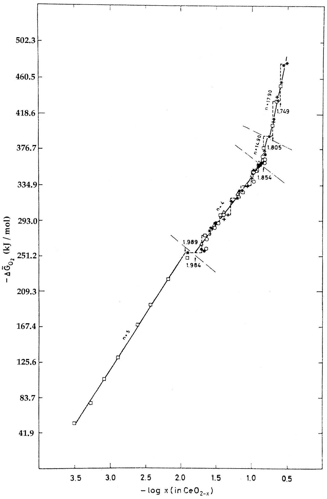
Fig. 1. Relative partial free energies, $\Delta \bar{G}_{\mathrm{O}_{2}}$, at $1100^{\circ} \mathrm{C}$ of $\mathrm{CeO}_{2-x}$ as a function of composition ( $\log x$ ) from several sources. After Toft Sørensen [24]. (•) Heating, Toft Sørensen; ( ◯ ) cooling, Toft Sørensen; ( $\square$ ) Panlener and Blumenthal; ( △ ) Iwasaki and Katsura; (*) Bevan and Kordis; (+) Toft Sørensen, another study. See Ref. [24] for the detailed references.

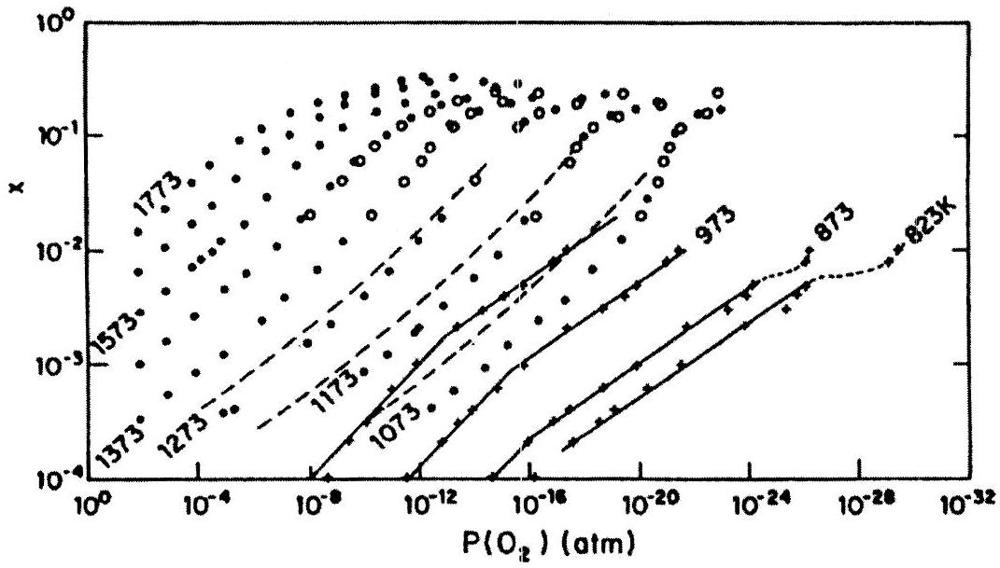
Fig. 2. Oxygen equilibrium pressure of $\mathrm{CeO}_{2-x}$ vs. oxygen deficiency $x$ from several reports. After Riess et al. [31]. (Dashed line) Tuller and Nowick [33]; (-) Panlener et al. [23]; (-) Bevan and Kordis [32]; (+) Riess et al. experimental; (solid line) Riess et al. theoretical.

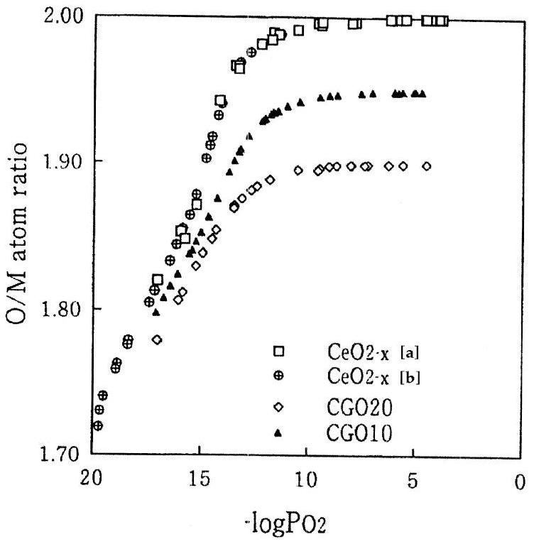
Fig. 3. Comparison among $\mathrm{CeO}_{2-x}, \mathrm{Ce}_{0.9} \mathrm{Gd}_{0.1} \mathrm{O}_{1.95-x}$ and $\mathrm{Ce}_{0.8} \mathrm{Gd}_{0.2} \mathrm{O}_{1.9-x}$ of the feature of $\mathrm{O} / \mathrm{M}$ to $\log P \mathrm{O}_{2}$ relationship at $1000^{\circ} \mathrm{C}$. (a) Wang et al. data; (b) Bevan and Kordis data. After Wang et al. [39].

From Eq. (2.9) it can be seen that $\Delta \bar{H}_{\mathrm{O}_{2}}$ (the partial free enthalpy of formation) and $\Delta S_{\mathrm{O}_{2}}$ (the partial free entropy of formation) may be derived from curves of the types shown in Figs. 2-5. $\Delta H_{\mathrm{O}_{2}} / R$ may be obtained from the slopes of the curves and $\Delta S_{\mathrm{O}_{2}} / R$ from the intercepts.

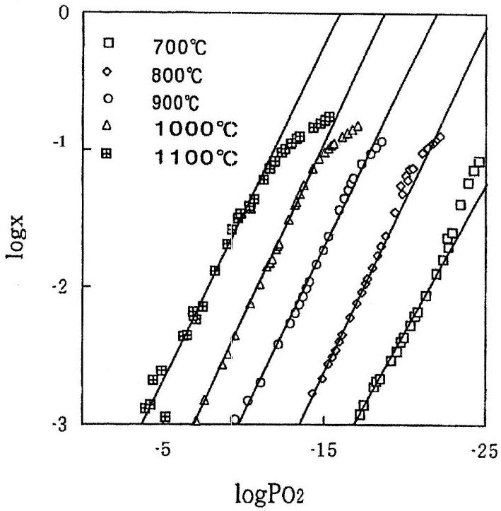
Fig. 4. The $\log x-\log P \mathrm{O}_{2}$ relationship of $\mathrm{Ce}_{0.9} \mathrm{Gd}_{0.1} \mathrm{O}_{1.95-x}$ at various temperatures. After Wang et al. [39].

Results of $\Delta \bar{H}_{\mathrm{O}_{2}}$ are shown in Figs. 6-9. $\Delta \bar{H}_{\mathrm{O}_{2}}$ is approximately independent of temperature but is somewhat dependent on $x$, or probably rather on vacancy concentration. The fact that only little variation with $x$ (or $\mathrm{O} / \mathrm{M}=$ oxygen to metal ratio) is seen in the case of $\mathrm{Ce}_{0.9} \mathrm{Ca}_{0.1} \mathrm{O}_{1.9}$ (Fig. 9) may just reflect that the variation in vacancies is small compared to the original vacancy concentration. This

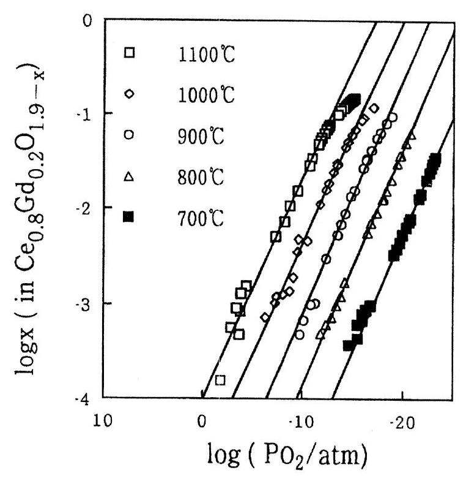
Fig. 5. Plots of $\log x$ vs. $\log P \mathrm{O}_{2}$ at various temperatures. In the region up to to $\log x=-1.4$, or $x \leq 0.04$, the relationship can be expressed by straight lines with their slopes close to $-\frac{1}{4}$. After Wang et al. [38].

view is supported by comparing the $-\Delta \bar{H}_{\mathrm{O}_{2}}$-value of Fig. $7(x=0.2,-\log x=0.7),-\Delta H_{\mathrm{O}_{2}}=790 \mathrm{~kJ} \mathrm{mol}_{-}^{-1} \mathrm{O}_{2}$, with that of $\mathrm{Ce}_{0.8} \mathrm{Gd}_{0.2} \mathrm{O}_{1.9}$ (Fig. 9), $-\Delta \bar{H}_{\mathrm{O}_{2}}=775 \mathrm{~kJ} \mathrm{~mol}^{-1} \mathrm{O}_{2}$. The value reported by

Garnier et al. [34] and Park et al. [35] for $\mathrm{Ce}_{0.9} \mathrm{Ca}_{0.1} \mathrm{O}_{1.9}$ was $-\Delta \bar{H}_{\mathrm{O}_{2}}=834 \mathrm{~kJ} \mathrm{~mol}^{-1} \mathrm{O}_{2}$. Wang et al.'s data [38,39] for $\mathrm{Ce}_{1-y} \mathrm{Gd}_{y} \mathrm{O}_{2-y / 2}, y=$ 0.10 and 0.20 are quite similar to the findings for $\mathrm{Ce}_{1-y} \mathrm{Ca}_{y} \mathrm{O}_{2-y}, y=0.01,0.045,0.01,0.10,0.14$ of Garnier et al. in their comprehensive study. The results reported by Schneider et al. [30] for $\mathrm{Ce}_{0.8} \mathrm{Gd}_{0.2} \mathrm{O}_{1.9}, \mathrm{Ce}_{0.8} \mathrm{Sm}_{0.2} \mathrm{O}_{1.9}$ and $\mathrm{Ce}_{0.9} \mathrm{Ca}_{0.1} \mathrm{O}_{1.9}$ were $700-720 \mathrm{~kJ} \mathrm{~mol}^{-1} \mathrm{O}_{2}$, i.e., quite a bit lower. The amount of data behind the latter values was much lower than for the data of Figs. 6-9 and thus more uncertain.

Data for $\Delta S_{\mathrm{O}_{2}}$ are given in Figs. 10-13. Fig. 10, which shows a plot of $-\Delta S_{\mathrm{O}_{2}}$ versus $-\log x$, reflects that $\Delta S_{\mathrm{O}_{2}} \propto \mathrm{PO}_{2}^{-1 / n}$. This may also be shown by simple mathematical argumentation; $\Delta \bar{S}_{\mathrm{O}_{2}}= \partial\left(\Delta G_{\mathrm{O}_{2}}\right) / \partial T$. If this is applied to Eq. (2.8), it gives $\Delta S_{\mathrm{O}_{2}}=-R \ln P \mathrm{O}_{2}$, and this combined with $x=$ constant $\mathrm{PO}_{2}^{-1 / n}$ gives:

$$
\Delta \bar{S}_{\mathrm{O}_{2}}=-\operatorname{constant} n R \ln x
$$

The comparison of $\Delta \bar{S}_{\mathrm{O}_{2}}$ for doped and undoped ceria is not as straight forward as with the enthalpy. However, comparing the data of Figs. 12 and 13 with Fig. 11 shows that the entropy of formation of the

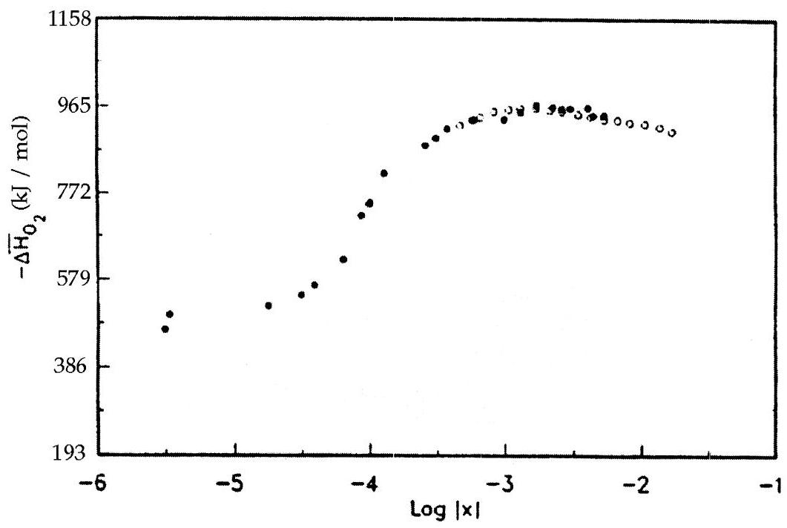
Fig. 6. Partial molar enthalpy for $99.99 \%$ pure $\mathrm{CeO}_{2-x}$ as a function of $-\log |x|$. (•) Panhas and Blumenthal data [27]; (○) Panlener et al. data [23].

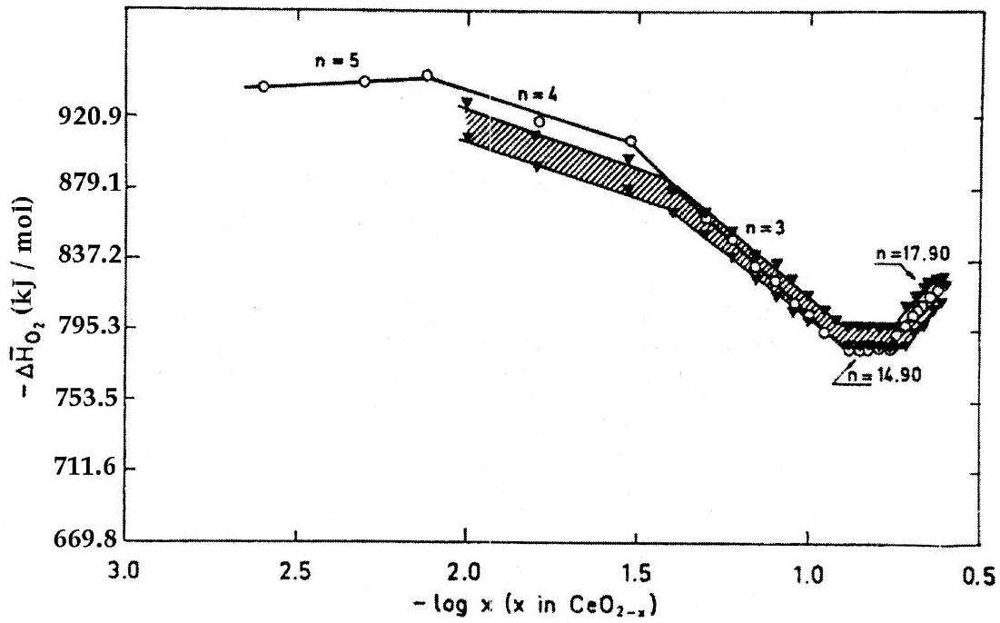
Fig. 7. Relative partial enthalpy of oxygen, $\Delta \bar{H}_{\mathrm{O}_{2}}$, calculated at 1353 K as a function of composition ( $\log x-x$ in $\mathrm{CeO}_{2-x}$ ). ( O ) Toft Sørensen; ( $\mathbf{V}$ ) Campservaux and Gerdanian. After Toft Sørensen [24].

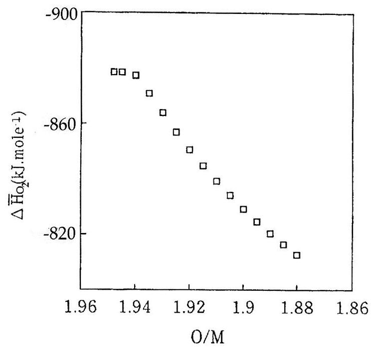
Fig. 8. Dependence of $\Delta \bar{H}_{\mathrm{O}_{2}}$ of $\mathrm{Ce}_{0.9} \mathrm{Gd}_{0.1} \mathrm{O}_{1.95-x}$ on $\mathrm{O} / \mathrm{M}$ ratio. Modified from Wang et al. [39].

two doped cerias lies within the range of the values for the undoped ceria. For a_given $\mathrm{O} / \mathrm{M}$ ratio (vacancy concentration) the $-\Delta S_{\mathrm{O}_{2}}$-values are about $130 \mathrm{~J} \mathrm{~mol}^{-1} \mathrm{~K}$ higher for the $\mathrm{Ce}_{0.8} \mathrm{Gd}_{0.1} \mathrm{O}_{1.95}$ and about $100 \mathrm{~J} \mathrm{~mol}^{-1} \mathrm{~K}$ higher for $\mathrm{Ce}_{0.8} \mathrm{Gd}_{0.2} \mathrm{O}_{1.9}$ than those for the pure ceria. This is about a $25 \%$ increase.

Some results indicate that it is easier to reduce

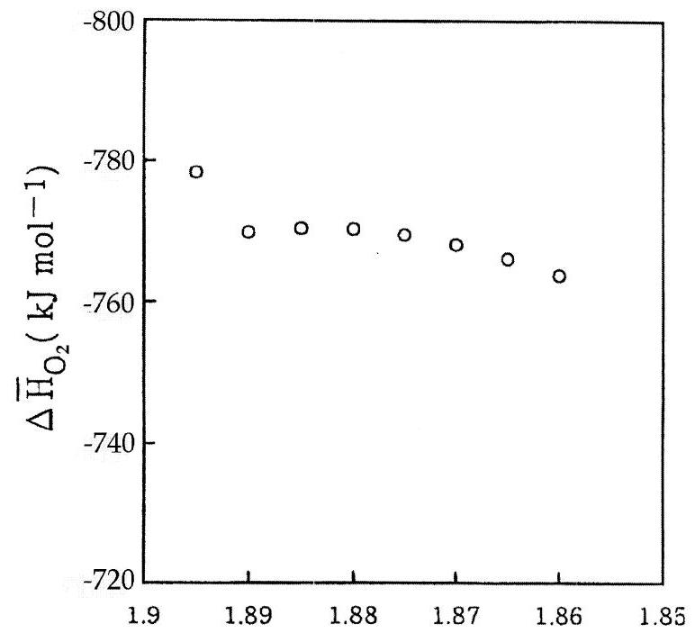
0/M

Fig. 9. $\Delta \bar{H}_{\mathrm{O}_{2}}$ of $\mathrm{Ce}_{0.8} \mathrm{Gd}_{0.2} \mathrm{O}_{1.9-x}$ is almost independent of $\mathrm{O} / \mathrm{M}$ ratio in the region $x \leq 0.04$. After Wang et al. [38].
highly doped than low doped and undoped ceria [30] especially at temperatures lower than $800^{\circ} \mathrm{C}$. However, the main body of reported thermodynamic data does not support this conclusion, and it is in contrast to the detailed work of Yasuda and Hishinuma [40],

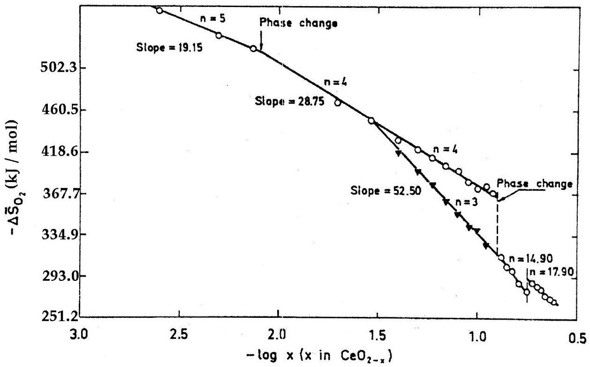
Fig. 10. Relative partial entropy of oxygen, $\Delta \bar{S}_{\mathrm{O}_{2}}$ as a function of composition ( $\log x-x$ in $\mathrm{CeO}_{2-x}$ ). After Toft Sørensen [24].

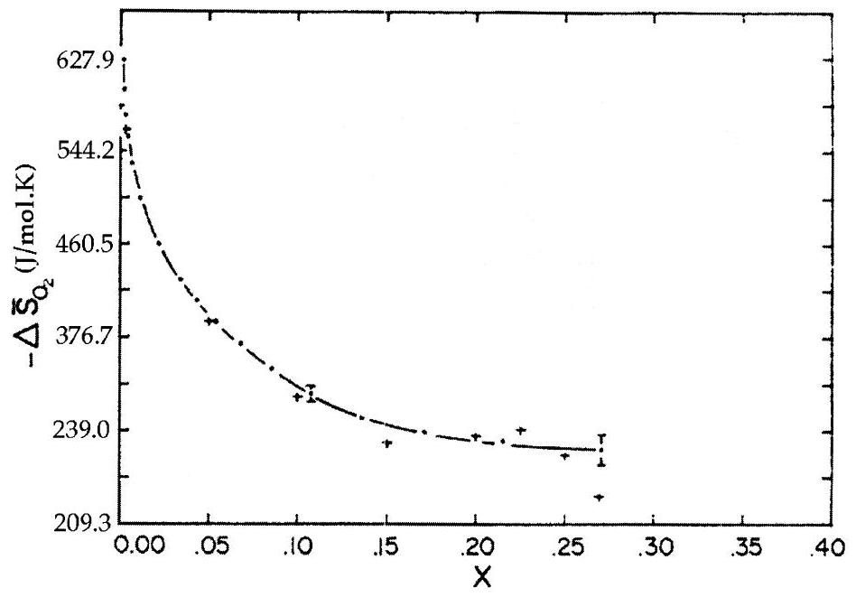
Fig. 11. $\Delta \bar{S}_{\mathrm{O}_{2}}$ vs. $x$ in $\mathrm{CeO}_{2-x}$. (+) Data from Bevan and Kordis. After Panlener et al. [23].

which shows that in the full temperature range from $700^{\circ} \mathrm{C}$ to $1000^{\circ} \mathrm{C}$, it is easier to reduce $\mathrm{Ce}_{0.9} \mathrm{Gd}_{0.1} \mathrm{O}_{1.95}$ than $\mathrm{Ce}_{0.8} \mathrm{Gd}_{0.2} \mathrm{O}_{1 . .9}$.

Here, a need for further work is seen in order to
make better thermodynamic data available, especially for highly doped ceria and for lower temperatures where short and/or long range ordering might occur.

Recently, it has been reported by Chiang et al.

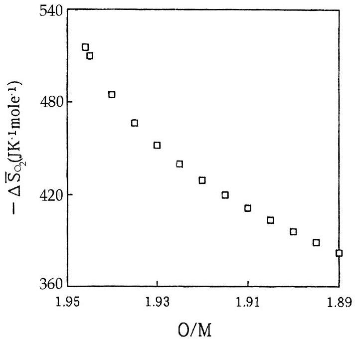
Fig. 12. Dependence of $\Delta \bar{S}_{\mathrm{O}_{2}}$ of $\mathrm{Ce}_{0.9} \mathrm{Gd}_{0.1} \mathrm{O}_{1.95-x}$ on $\mathrm{O} / \mathrm{M}$ atom ratio. After Wang et al. [39].

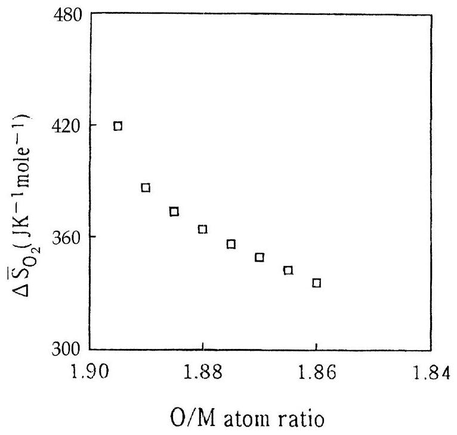
Fig. 13. Dependence of $\Delta \bar{S}_{\mathrm{O}_{2}}$ of $\mathrm{Ce}_{0.8} \mathrm{Gd}_{0.2} \mathrm{O}_{1.9-x}$ as a function of O/M ratio. After Wang et al. [38].

[41,42] that nanocrystalline (ca. 10 nm crystallite size) undoped and doped ceria are very easily reduced. The heat of reduction was found to be less
than one-half of the value for conventional polycrystalline and single crystal samples.

## 3. Structure and phase equilibria

### 3.1. Pure ceria

Even though the ceria fluorite phase is very tolerant to reduction and dissolution of other oxides, there are naturally some limits. These are described below together with the changes in the unit cell size, which occur with reduction and/or dissolution of other oxides.

### 3.1.1. Phase diagram of $\mathrm{CeO}_{2-x}$

During the early 1950s Brauer and Gradinger [43] and Bevan [44] studied the structure of $\mathrm{CeO}_{2-x}$ using powder XRD. They revealed the existence of the phases $\mathrm{CeO}_{1.812}$, $\mathrm{CeO}_{1.782}$, and $\mathrm{CeO}_{1.719}$, which were thought to be formed as a result of ordering in the cation and anion sublattices. Based on the work of Brauer and Holtschmidt [45,46], Brauer et al. [47], Brauer and Gingerich [48] and Bevan and Kordis [32] a phase diagram for the system $\mathrm{CeO}_{2}$ to $\mathrm{CeO}_{1.8}$ was constructed. It showed that at room temperature a miscibility gap exists between $\mathrm{CeO}_{2}$ and $\mathrm{CeO}_{1.81}$, which contracts with increasing temperature and closes at $685^{\circ} \mathrm{C}$ at a composition of $\mathrm{CeO}_{1.92} \cdot$

In the lower temperature region, the phase $\mathrm{Ce}_{9} \mathrm{O}_{16}$ ( $=\mathrm{CeO}_{1.77}$ ) was reported by Bevan [44] to have a rhombohedral symmetry. However, Anderson and Wuensch [49] concluded that there was no intermediate phase corresponding to this composition, but rather a mixture of phases with compositions $\mathrm{Ce}_{11} \mathrm{O}_{20}$ and $\mathrm{Ce}_{7} \mathrm{O}_{12}$. Bevan [44] had also reported that the $\delta$-phase, $\mathrm{Ce}_{11} \mathrm{O}_{20}$, shows rhombohedral symmetry and exists over a broad composition range of $\mathrm{CeO}_{1.804}$ to $\mathrm{CeO}_{1.812}$. Anderson and Wuensch reported the phase to be bcc, with the space group Ia 3 . The cell was related to that of $\mathrm{CeO}_{2}$ and had twice the cell edge of the fluorite structure. Thus, up to 1975, there appeared to be confusion over the intermediate phases in $\mathrm{CeO}_{2-x}$.

Ray et al. [50], therefore, examined the system $\mathrm{CeO}_{2-x}$ using XRD and neutron diffraction to de-
termine if there was a series of homologues of $\mathrm{Ce}_{n} \mathrm{O}_{2 n-2}$ ( $n=$ an integer). Four distinct phases, corresponding to $n=7,9,10$ and 11 were found. Aside from the phase $\mathrm{Ce}_{7} \mathrm{O}_{12}\left(\mathrm{CeO}_{1.714}\right)$ which showed rhombohedral symmetry based on $<111>$ vacancy strings, structures of the other three phases were not determined. However, the authors did suggest that they were of lower symmetry such as monoclinic or triclinic.

More recently, Ricken et al. [51], Riess et al. [52] and Körner et al. [53] investigated the phase transformations in reduced ceria using specific heat, EMF, dilatometry and XRD measurements. Fig. 14 shows the phase diagram of $\mathrm{CeO}_{2-x}$ determined by specific heat measurements. They concluded that $\mathrm{CeO}_{2}$ can be reduced to nonstoichiometric compositions, $\mathrm{CeO}_{2-x}$, where $1.7 \leq 2-x \leq 2$. For $T>921 \mathrm{~K} \left(648^{\circ} \mathrm{C}\right)$ and $2>2-x>1.818$, only the $\alpha$-phase exists. For $T<722 \mathrm{~K}\left(449^{\circ} \mathrm{C}\right), \mathrm{CeO}_{2-x}$ forms a discrete set of compositions. Körner et al. [53] also studied the volume changes associated with the phase transformation across the 722 K -line as a function of the $\mathrm{O} / \mathrm{Ce}$ ratio. The results are shown in Fig. 15. On cooling, the maximum linear dimensional change amounted to about $0.1 \%$. The difference
between heating and cooling is suggested to be due to undercooling during the temperature decrease.

Toft Sørensen [24] studied the relation between $P \mathrm{O}_{2}$ and $x$ (in $\mathrm{CeO}_{2-x}$ ) by thermogravimetry in the temperature range $900-1400^{\circ} \mathrm{C}$, i.e., well within the $\alpha$-phase region. Based on the obtained relations (see also Section 3) he suggested that the $\alpha$-phase transformed into ordered intermediate phases with compositions following the series $\mathrm{Ce}_{n} \mathrm{O}_{2 n-2}$ as shown in Fig. 16. This was derived from the type of data shown in Fig. 1. Körner et al. [53] mentioned that no indication for such transformations could be observed in any of their experiments. Nevertheless, Zachau-Christiansen et al. [37] reported indications of a phase separation in pure $\mathrm{CeO}_{2}$ at $1000^{\circ} \mathrm{C}$ at $x=0.23\left(\mathrm{Ce}_{9} \mathrm{O}_{16}\right)$, which is inside the $\alpha^{\prime}$-phase region in Fig. 14.

### 3.1.2. Lattice parameter of pure ceria as function of temperature and stoichiometry

The lattice parameter at room temperature is 0.541134 nm [9]. Brauer and Gingerich [48], Sims and Blumenthal [54], Toft Sørensen [24], Körner et al. [53], Chiang et al. [55], Wilfong et al. [56], Schwab et al. [57], and Mogensen et al. [58]

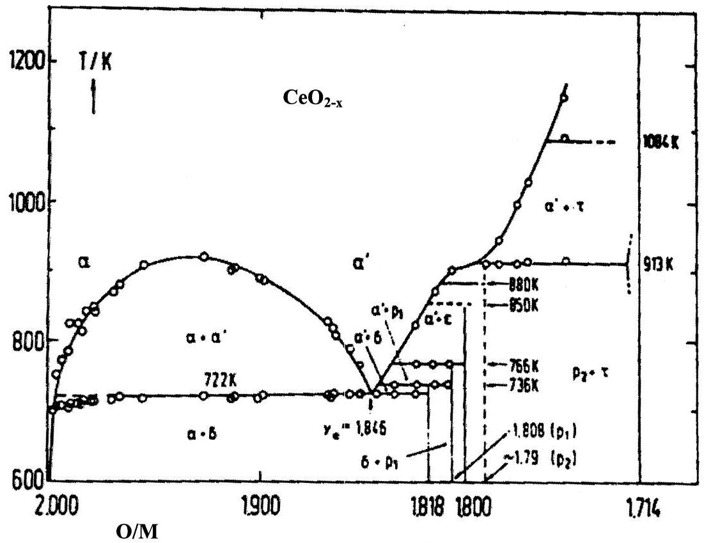
Fig. 14. Phase diagram of $\mathrm{CeO}_{2-x}$ determined from specific heat measurements. After Riess et al. [52].

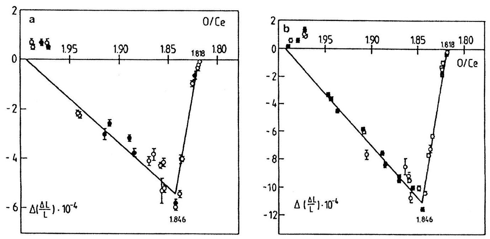
Fig. 15. Changes in the molar volume of $\mathrm{CeO}_{2-x}$ vs. composition for the transformation $\alpha+\delta \leftrightarrow \alpha+\alpha_{\mathrm{e}}^{\prime}$ and $\alpha+\delta \leftrightarrow \alpha_{\mathrm{e}}^{\prime}+\delta$ : (a) on heating; (b) on cooling. After Körner et al. [53].

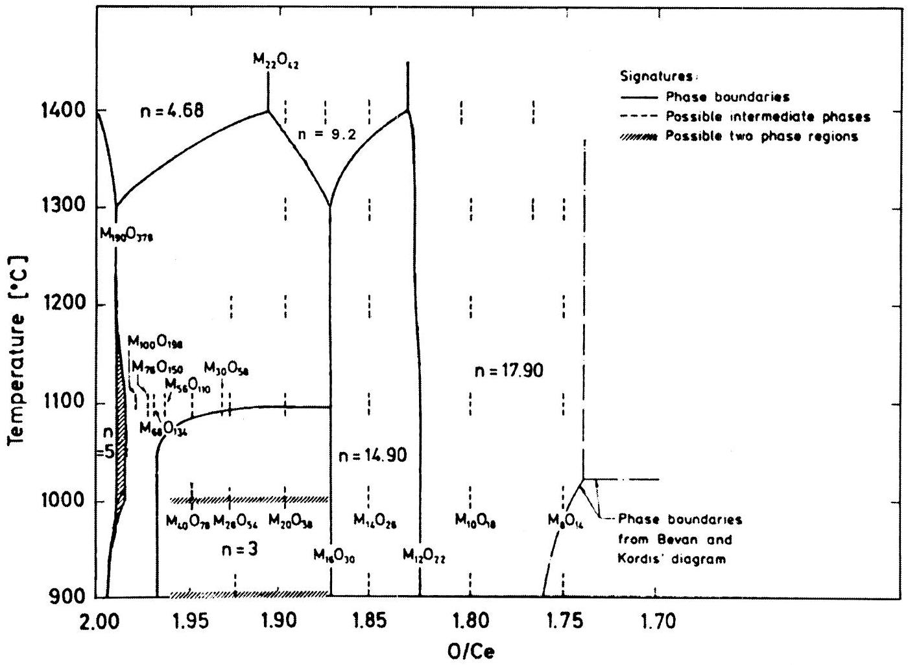
Fig. 16. Diagram of subregions with possible ordered intermediate phases in the $\alpha^{\prime}$-phase for the cerium-oxygen system. Modified from Toft Sørensen [24].

measured the thermal expansion of stoichiometric $\mathrm{CeO}_{2}$ up to $1000^{\circ} \mathrm{C}$. A reasonable agreement between the results is found, and our evaluation is that the linear thermal expansion coefficient is:

At room temperature:

| Room temperature to |
| :--- |
| $500^{\circ} \mathrm{C}$ : |

| Room temperature to |
| :--- |
| $1000^{\circ} \mathrm{C}$ : |

It has been discussed that the nonstoichiometry may be regarded as a simple solid solution of $\mathrm{Ce}_{2} \mathrm{O}_{3}$ in $\mathrm{CeO}_{2}$. The special feature is that $\mathrm{Ce}^{3+}$ or $\mathrm{Ce}_{\mathrm{Ce},}^{\prime}$ the small polaron, is mobile in contrast to many other dopant cations. If it can be regarded as a simple solid solution, one consequence is that the lattice parameter should follow Vegard's rule, i.e., that a linear relationship exists between lattice parameter and the concentration of the solute. The slope of this straight line is termed Vegard's slope. Kim [59] published an empirical relation between ionic radius of the metal ion of oxides (dopants) dissolved in ceria (and other fluorite structured oxides)

$$
a=0.5413+\Sigma\left(0.00220 \Delta r_{k}+0.00015 \Delta z_{k}\right) m_{k}
$$

where $a$ (in nm) is the lattice constant of the ceria solid solution at room temperature, $\Delta r_{k}$ (in nm ) is the difference in ionic radius ( $r_{k}-r_{\mathrm{Ce}}$ ) of the $k$ th dopant and the $\mathrm{Ce}^{4+}$-radius, which in eightfold coordination is 0.097 nm according to Shannon [60], $\Delta \mathrm{z}_{k}$ is the valence ( $z_{k}-4$ ), and $m_{k}$ is the mole percent of the $k$ th dopant in the form of $\mathrm{MO}_{x}$. It is noted that the Kim's lattice constant of the pure ceria is 0.000166 nm higher than the accepted value of 0.541134 nm [9]. Kim verified his relations against a considerable amount of data, and his analysis of the uncertainty gave a standard error of $3 \times 10^{-4} \mathrm{~nm}$. If the values for $\mathrm{CeO}_{1.5}\left(r_{\mathrm{Ce}^{3+}}=0.1143 \mathrm{~nm} \Rightarrow \Delta r=0.0173 \mathrm{~nm}\right.$, and $\Delta z=-1$ ) are inserted it gives:

$$
\begin{aligned}
a= & 0.5413 \mathrm{~nm}+m \times 2.306 \\
& \times 10^{-4} \mathrm{~nm} \mathrm{~mol} \%^{-1} \mathrm{CeO}_{1.5}
\end{aligned}
$$

i.e., a Vegard's slope of $2.306 \times 10^{-4} \mathrm{~nm} \mathrm{~mol} \%^{-1} \mathrm{CeO}_{1.5}$. (And as $m($ in $\%)=200 x$ ( $x$ in $\mathrm{CeO}_{2-x}$ ), we
get for homogeneous samples at room temperature: $a=0.5413 \mathrm{~nm}+x \times 4.612 \times 10^{-2} \mathrm{~nm}$ ).

Hong and Virkar [61] analysed the relationship between concentration of $\mathrm{LnO}_{1.5}$ in ceria (and zirconia) and lattice parameter of the fluorite lattice ( $\mathrm{Ln}=$ lanthanide). When we reduce their formula we get for the ceria case (using the symbols described above)

$$
\begin{aligned}
a= & 0.54112 \mathrm{~nm} \\
& +0.023027\left(\mathrm{~mol}^{2} \mathrm{LnO}_{1.5}\right)^{-1}\left(r_{k}-0.1024 \mathrm{~nm}\right) m
\end{aligned}
$$

Inserting the $\mathrm{Ce}^{3+}$-radius in this we get

$$
\begin{aligned}
a= & 0.54112 \mathrm{~nm}+m \times 2.740 \\
& \times 10^{-4} \mathrm{~nm} \mathrm{~mol} \%^{-1} \mathrm{CeO}_{1.5}
\end{aligned}
$$

i.e., a Vegard slope of $2.740 \times 10^{-4} \mathrm{~nm} \mathrm{~mol} \%^{-1} \mathrm{CeO}_{1.5}$.

Ray et al. [50] plotted the pseudocubic lattice parameter measured at room temperature in the $\alpha+ \delta$-phase composition region in the phase diagram as a function of oxygen to metal ratio in pure ceria. For $\mathrm{O} / \mathrm{M}$ ratios between 2 and 1.8 a straight line was obtained. For $\mathrm{O} / \mathrm{M}$ below 1.8 a deviation from the straight line is observed. From this plot we derive a Vegard slope of $2.25 \times 10^{-4} \mathrm{~nm} \mathrm{~mol} \%^{-1} \mathrm{CeO}_{1.5}$. This is about $5 \%$ lower than the value obtained from Kim's formula. The observation that Vegard's rule is obeyed even in a two-phase system invalidates this as a criteria from which it may be determined whether $\mathrm{CeO}_{2-x}$ can be regarded as a simple solid solution of $\mathrm{Ce}_{2} \mathrm{O}_{3}$ in $\mathrm{CeO}_{2}$ or not. However, the Vegard's slope concept is very useful as described below.

Data on the expansion of the ceria lattice with increasing $x$ at temperatures within the $\alpha$-phase region was also reported by several of the authors mentioned above [24,48,55-58]. Fig. 17 shows a plot of percentage expansion versus $\mathrm{O} / \mathrm{M}$ ratio at $900^{\circ} \mathrm{C}$ mainly from Chiang et al. [55], who verified that their data agreed with a number of other previously published work. Chiang et al.'s data reveals some curvature at $\mathrm{O} / \mathrm{M}$ lower than ca. 1.88. On the same plot are given two data points from Mogensen and Mogensen [62] (measured at $1000^{\circ} \mathrm{C}$, but corrected for thermal expansion to $900^{\circ} \mathrm{C}$ ). The

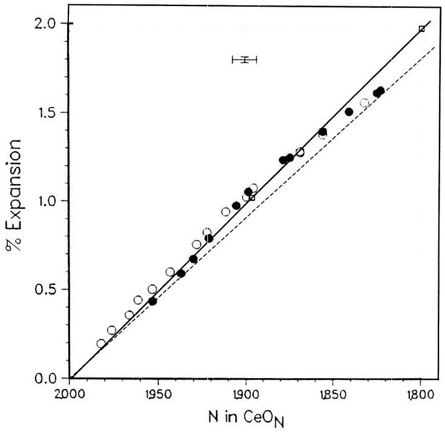
Fig. 17. Percent expansion of cerium dioxide versus nonstoichiometric composition at $900^{\circ} \mathrm{C}$. Chiang et al. [55]. (- - -) Theoretical slope; (—) best fit slope. (□) Points from Mogensen and Mogensen [62].

$\mathrm{O} / \mathrm{M}$-values of 1.800 and 1.895 were obtained from the measured $\mathrm{PO}_{2}$ values using the $x$ versus $\mathrm{PO}_{2}$ relations published by Panlener et al. [23]. The same data was used by Chiang et al. for determination of $x$. The special feature of the Mogensen and Mogensen data are, that they are obtained by isothermal dilatometry with equilibration times of the order of a day. It is seen from Fig. 17 that these two points fit onto the straight line through Chiang et al.'s data for the $1.88<x<2.00$ region even though the lowest $\mathrm{O} / \mathrm{M}$ ratio is as low as 1.8 . Using the lattice parameter of 0.54665 nm at $900^{\circ} \mathrm{C}$ and the slope of the upper full line in Fig. 17 we find a Vegard's slope of $2.71 \times 10^{-4} \mathrm{~nm} \mathrm{~mol} \%^{-1} \mathrm{CeO}_{1.5}$. The corresponding value at room temperature is $2.68 \times 10^{-4} \mathrm{nm} \mathrm{mol} \%{ }^{-1} \mathrm{CeO}_{1.5}$. The lower line in Fig. 17 is a theoretical line calculated by Chiang et al. based on a work of Möbius [63]. The slope of this line corresponds to $2.4 \times 10^{-4} \mathrm{~nm} \mathrm{~mol} \%^{-1} \mathrm{CeO}_{1.5}$.

The detailed reason for the expansion on reduction of ceria is often discussed. The problem may be phrased as: (1) is it because the $\mathrm{Ce}^{3+}$-ion is bigger than the $\mathrm{Ce}^{4+}$-ion? or (2) is it because the oxide vacancy volume is bigger than the oxide ion volume? One reason for the questions is that the effective ion
radius is dependent on how many nearest neighbours the ion has (its coordination number). Hong and Virkar [61] analysed this question, and concluded that the reason is that of point (1). They introduced the concept of an oxide vacancy radius. For ceria the oxide vacancy radius was found to be 0.1164 nm at room temperature which is significantly smaller than the radius of the oxide ion of 0.138 nm .

### 3.2. Doped ceria

The ceria fluorite structure is also very tolerant to dissolution of lower valent metal oxides other than $\mathrm{Ce}_{2} \mathrm{O}_{3}$ up to high concentrations, above $40 \%$ in some cases, see, e.g., Etsell and Flengas [2], and Bevan and Summerville [64]. There is, however, a lot of contradicting information in the literature about the solubility limits.

### 3.2.1. Solubility of other oxides and change in lattice parameters

Rare earth oxides and yttria are highly soluble in ceria, about $40 \%$ or more [ 2,64 ]. For temperatures in the range of 1450 to $1650^{\circ} \mathrm{C}$ Eguchi et al. [65] report the solubility limits $23 \mathrm{~mol} \%$ for $\mathrm{CaO}, 8 \mathrm{~mol} \%$ for SrO and very small for MgO and BaO . The solubility of CaO in $\mathrm{CeO}_{2}$ was reported by Keler et al. [66] to be $15 \mathrm{~mol} \%$ at $1600^{\circ} \mathrm{C}$. Zachau-Christiansen et al. [37] reported evidence that the solubility of CaO is a little below $10 \mathrm{~mol} \%$ at $1000^{\circ} \mathrm{C}$ in samples which were kept at temperature for 40 days, and during that period they were reduced several times to an $\mathrm{O} / \mathrm{M}$ ratio of 1.75 . The solubility of MgO is about $2 \%, \mathrm{SrO} 9 \%$ and $\mathrm{Sc}_{2} \mathrm{O}_{3} 5 \%$ at 1600,1600 and $1750^{\circ} \mathrm{C}$, respectively, according to the compilation by Etsell and Flengas [2].

Kim [59] argues that the solubility limit of a solute depends on the elastic energy, $W$, which is introduced in the lattice due to differences in ionic radius. The larger the elastic energy per substituted ion, the lower is the solubility. The relation between $W$ and the change in the lattice parameter, $\Delta a$, due to formation of a substitutional solid solution is given by:

$$
W=6 G a_{0}(\Delta a)^{2}
$$

where $G$ is the shear modulus of ceria. $\Delta a$ is
governed by Vegard's slope for the given solute. This implies that the highest solubilities should be achieved for a Vegard's slope of $S_{\mathrm{v}}=0$. Based on analogy with $\mathrm{ThO}_{2}$ [59], it seems reasonable to assume that the solubility limit at $1500-1600^{\circ} \mathrm{C}$ is about $60 \mathrm{~mol} \%$ for rare earth cations with ionic radius near $r_{\mathrm{c}}$ and close to zero if $\left(S_{\mathrm{v}}\right)^{2}$ is above ca. $6 \times 10^{-8}\left(\mathrm{~nm} \mathrm{~mol} \%^{-1}\right)^{2}$.

From Kim's formula (Eq. (3.1)) the following expressions for Vegard's slopes can be derived:

$$
\begin{aligned}
S_{\mathrm{V} 3, K}= & 0.0022(\mathrm{~mol} \%)^{-1}\left[\left(r_{k}-0.097 \mathrm{~nm}\right)-1.5\right. \\
& \left.\times 10^{-4} \mathrm{~nm}\right] m
\end{aligned}
$$

for trivalent dopants, and

$$
\begin{aligned}
S_{\mathrm{V} 2, K}= & 0.0022(\mathrm{~mol} \%)^{-1}\left[\left(r_{k}-0.097 \mathrm{~nm}\right)-3.0\right. \\
& \left.\times 10^{-4} \mathrm{~nm}\right] m
\end{aligned}
$$

for divalent dopants.
From Hong and Virkar’s formula (Eq. (3.3)) another type of expression for the trivalent dopants is obtained
$S_{\mathrm{V} 3, H}=0.023027(\mathrm{~mol} \%)^{-1}\left(r_{k}-0.1024 \mathrm{~nm}\right)$

The different formulae give different values of Vegard's slopes and also imply different values of the critical radius, $r_{\mathrm{c}}$, which is the radius giving a Vegard's slope of zero. Kim's expression implies that $r_{\mathrm{c}}=0.1106 \mathrm{~nm}$ for divalent ions and 0.1038 nm for trivalent ions, whereas Hong and Virkar's expression gives $r_{\mathrm{c}}=0.1024 \mathrm{~nm}$. Hong and Virkar derived their $r_{\mathrm{c}}$-value from plotting measured values of $S_{\mathrm{V}}$ for a number of cations against the cation radius as shown in Fig. 18. In principle, $r_{\mathrm{c}}$ may be obtained from a plot of lattice parameter versus dopant radius for a number of different oxide solutions of the same concentration such as $\mathrm{Ce}_{1-y} \mathrm{Ln}_{y} \mathrm{O}_{2-y / 2} . r_{\mathrm{c}}$ is the ionic radius which gives $a=0.541113 \mathrm{~nm}$, the lattice parameter of pure ceria at $25^{\circ} \mathrm{C}$. Eguchi et al. [65] published such a plot using eight lanthanide oxides with $y=0.2$. From this we read that $r_{\mathrm{c}}=0.101 \mathrm{~nm}$. Li et al. [67] measured the lattice constants of solutions of oxides of Sc, In, Y, Gd and La in ceria. From their plot we also read $r_{\mathrm{c}}=0.101 \mathrm{~nm}$. From the work of Zhen et al. [68] we derive that $0.10130 \mathrm{~nm}<r_{\mathrm{c}}<$ 0.10145 nm somewhere between the ionic radius of $\mathrm{Y}^{3+}(0.1019 \mathrm{~nm})$ and $\mathrm{Gd}^{3+}(0.1053 \mathrm{~nm})$ and closest

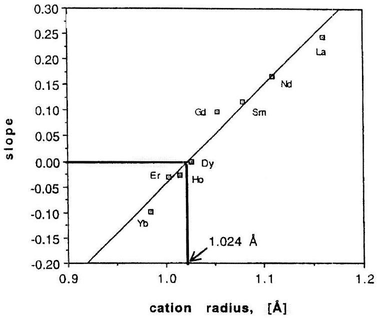
Fig. 18. Determination of the critical ionic radius $r_{\mathrm{c}}$. The $y$-axis is the slopes of each individual lattice parameter as a function of dopant concentration, $x$. The slope is equal to $b$. After Hong and Virkar [61].

to that of $\mathrm{Gd}^{3+}$. For different cation valencies it is reasonable to get different values for $r_{\mathrm{c}}$ and for $S_{\mathrm{v}}$, but for the same type of ions such as the trivalent lanthanides the same values should naturally be found. Here there is a clear need for more work. Possibly, a more detailed literature review on this topic might be able to select data sets from which accurate $r_{\mathrm{c}}$ values and $S_{\mathrm{v}}$ expressions could be derived. We should also look for ways of estimating the solubility limit as a function of temperature. Could it be derived from a balance between the elastic strain energy and $T \Delta S_{\text {mix }}$ ( $\Delta S_{\text {mix }}=$ entropy of mixing of the solute into solution)? However, solubility limits may be estimated using the above data, and for example, the solubilities of CoO and NiO in ceria were estimated to be below ca. 1\% by Ranløv et al. [69] based on Kim's correlation and the Vegard slope principle. This is in good with the experimental findings of Sirman et al. of ca. $0.5 \%$ [70].

It is often difficult to determine by means of XRD if there is another phase present in $\mathrm{CeO}_{2}$, especially if this other phase consists of light elements. Therefore, it is usual to plot lattice parameter versus nominal concentration of solute for concentrations inside the Vegard's rule region and a couple of nominal concentrations above the solubility limit. The solubility limit may then be determined from the
intersection between the Vegard line and the horizontal line for the saturated value. This is, however, quite time consuming. The formulas of Kim (Eq. (3.1)) and of Hong and Virkar (Eq. (3.3) for $\mathrm{LnO}_{1.5}$ ) makes it possible to calculate (within their accuracy limits) the concentration of a given solute in a solid solution using the measured lattice parameter, the knowledge of the valency of the cation and the tabulated ionic radii [60].

### 3.2.2. Phase diagram of $\mathrm{Ce}_{0.818} \mathrm{Gd}_{0.182} \mathrm{O}_{1.909-x}$

Steltzer et al. [71] constructed a phase diagram for the system $\mathrm{Ce}_{0.818} \mathrm{Gd}_{0.182} \mathrm{O}_{1.909-x}$ in the temperature range $27-977^{\circ} \mathrm{C}$ and $1.909 \geq x \geq 1.731$ based on specific heat measurements, Fig. 19. No phase transition is found above room temperature, only a miscibility gap is observed. Compared to $\mathrm{CeO}_{2-x}$ (Fig. 14), $\mathrm{Ce}_{0.818} \mathrm{Gd}_{0.182} \mathrm{O}_{1.909-x}$ has a larger miscibility gap at similar temperatures, i.e., less reduction is tolerated before demixing into two fluorite phases with different compositions ( $\alpha$ and $\alpha$ ) takes place. The results indicate that the $\alpha$-phase exists up to $x=\mathrm{ca} .0 .01$ at room temperature. The temperature of the gap closure is $666^{\circ} \mathrm{C}, 18^{\circ} \mathrm{C}$ higher than the $648^{\circ} \mathrm{C}$ of $\mathrm{CeO}_{2-x}$. As a reason for the absence of reduced phases in this material, it was suggested that
the gadolinium ions may bind the oxygen vacancies at low temperatures and therefore prohibit oxygen vacancies from ordering in a three-dimensional superlattice.

### 3.2.3. Expansion of doped ceria on reduction

Expansion of reduction data for several doped cerias were reported by Mogensen et al. [58] at $1000^{\circ} \mathrm{C}$, and the $x$-values were determined by Zachau-Christiansen et al. [36] for the same conditions for two of these. The results are summarised in Table 2; results for pure ceria are included for comparison.

The uncertainty is estimated to be about $10 \%$

Table 2
Expansion on reduction of pure and gadolinia doped ceria at $1000^{\circ} \mathrm{C} ; S_{\mathrm{V}, \mathrm{CeO}_{2}}$ is the Vegard's slope for the $\mathrm{CeO}_{1.5}$-component produced by reduction
| $\mathrm{Mol} \% \mathrm{GdO}_{1.5}$ | $x$ | \% Expansion | $S_{\mathrm{V}, \mathrm{CeO}_{2}}$ |
| :--- | :--- | :--- | :--- |
| 0 | 0.105 | 1.14 | $2.7 \times 10^{-4}$ |
| 0 | 0.200 | 2.10 | $2.7 \times 10^{-4}$ |
| 18 | 0.060 | 0.77 | $3.5 \times 10^{-4}$ |
| 18 | 0.120 | 1.49 | $3.4 \times 10^{-4}$ |
| 40 | 0.022 | 0.28 | $3.5 \times 10^{-4}$ |
| 40 | 0.045 | 0.67 | $4.1 \times 10^{-4}$ |

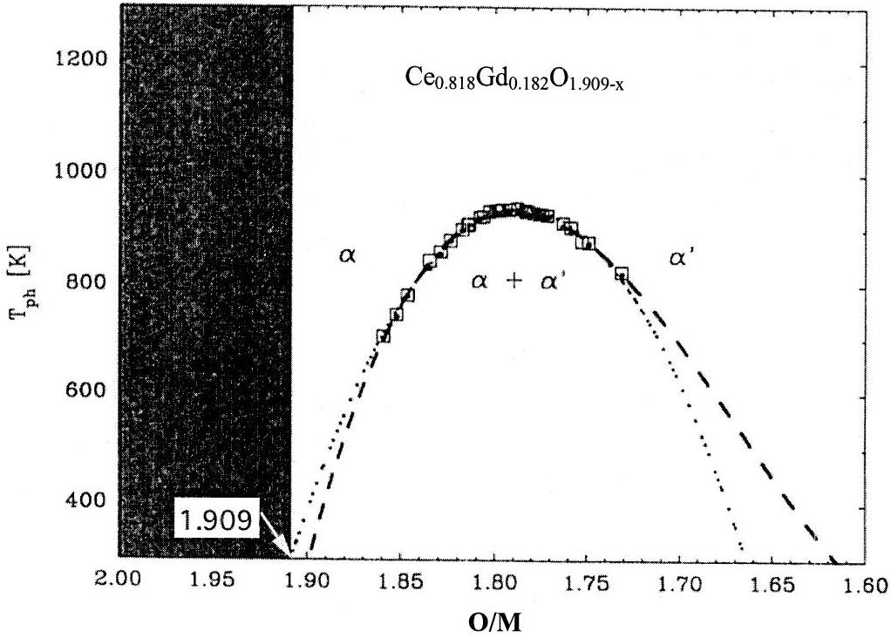
Fig. 19. Phase diagram of $\mathrm{Ce}_{0.818} \mathrm{Gd}_{0.182} \mathrm{O}_{1.909-y}$. ( $\square$ ) From $C_{\mathrm{p}}$ measurements taken on heating and (•) on cooling; (•) parabolic extrapolation; (- - -) cubic extrapolation. Steltzer et al. [71].

relative on the $S_{\mathrm{V}, \mathrm{CeO}_{2}}$-values except for the ' $40 \% \mathrm{GdO}_{1.5}-x=0.02$ '-value, where it is estimated to about $20 \%$. We believe that the best average values for $S_{\mathrm{V}, \mathrm{CeO}_{2}}$ are $(3.5 \pm 0.4) \times 10^{-4} \mathrm{~nm} \mathrm{~mol} \%^{-1} \mathrm{CeO}_{1.5}$ and $(3.8 \pm 0.5) \times 10^{-4} \mathrm{~nm} \mathrm{~mol}^{-1} \mathrm{CeO}_{1.5}$. Irrespective of the high relative uncertainties, it is sufficient to show that additivity of Vegard's slopes for several solutes, as implied in the general form of Kim's formula (Eq. (3.1)), is not valid for a high degree of substitution (doping) on the level of 20\% and above. We suggest the following explanation for this finding. The $\mathrm{Gd}^{3+}-\mathrm{O}^{2-}$-bond strength is lower than $\mathrm{Ce}^{4+}-\mathrm{O}^{2-}$-bond strength (due to the charge difference), and therefore the gadolinia component in the mixture cannot exert the same force on the bigger $\mathrm{Ce}^{3+}$-ions as the ceria lattice.

Yasuda and Hishinuma [40] measured the expansion on reduction for $\mathrm{Ce}_{0.9} \mathrm{Gd}_{0.1} \mathrm{O}_{1.95}$ and $\mathrm{Ce}_{0.8} \mathrm{Gd}_{0.2} \mathrm{O}_{1.9}$ as a function of both $P \mathrm{O}_{2}\left(10^{-24}-1\right. \mathrm{atm} \mathrm{O}_{2}$ ) and temperature ( $600-1000^{\circ} \mathrm{C}$ ). At $1000^{\circ} \mathrm{C}$ good agreement with the data in Table 2 was obtained. At $600^{\circ} \mathrm{C}$ no expansion could be measured even at the lowest $P \mathrm{O}_{2}$ values for any of the two compositions.

The expansion on reduction is of great importance for practical applications, and therefore much more work is needed here.

## 4. Conductivity

### 4.1. Electronic conductivity of pure ceria

Forty years ago $\mathrm{CeO}_{2-x}$ was already known to be an electrical conductor. Ruloph [72] found that the conductivity was proportional to $\mathrm{PO}_{2}^{1 / 5.7}$ at 1260 K . Noddack and Walch [19] concluded that the ionic transference number for sintered $\mathrm{CeO}_{2-x}$ is less than 0.002 in the temperature range of $600-1300^{\circ} \mathrm{C}$, i.e., the material is an electronic conductor. It was concluded (e.g. Refs. [20,73]) that $\mathrm{CeO}_{2-x}$ between $200^{\circ} \mathrm{C}$ and $1300^{\circ} \mathrm{C}$ is an n-type semiconductor. Vinokurov et al. [74] described the electrical conductivity of $\mathrm{CeO}_{2}$ (using a single crystal) as being mixed n-type and oxide ion conduction. Even though this is correct, the ionic conductivity of pure reduced ceria at $1000^{\circ} \mathrm{C}$ is less than $3 \%$ of the total con-
ductivity at a $P \mathrm{O}_{2}$ of $10^{-6} \mathrm{~atm}$ and even lower at lower $\mathrm{PO}_{2}$ (see, e.g., Mogensen et al. [58]). The maximum ionic conductivity at $1000^{\circ} \mathrm{C}$ is estimated to be ca. $7 \times 10^{-2} \mathrm{~S} \mathrm{~cm}^{-1}$ for $\mathrm{CeO}_{1.9}$. The total conductivity for this condition is $2.5 \mathrm{~S} \mathrm{~cm}^{-1}$ ).

Based on works such as those of Blumenthal and Panlener [75], Blumenthal and Hofmaier [21], Tuller and Nowick [76], and Naik and Tien [77], it is now generally agreed that the n-type conductivity takes place by small polaron transport. According to Tuller and Nowick a small polaron is a defect created when an electronic carrier becomes trapped at a given site as a consequence of the displacement of adjacent atoms or ions. The entire defect, i.e., the electron (or electron hole) plus distortion, migrates by a thermally activated hopping.

The small polaron in $\mathrm{CeO}_{2-x}$ may thus be identified as $\mathrm{Ce}_{\mathrm{Ce}}^{\prime}$. The electronic conductivity, $\sigma_{\mathrm{e}}$, may be expressed by
$\sigma_{\mathrm{e}}=\left[\mathrm{Ce}_{\mathrm{Ce}}^{\prime}\right] e \mu$
where [ $\mathrm{Ce}_{\mathrm{Ce}}^{\prime}$ ] is the concentration of $\mathrm{Ce}^{3+}$-ions $\mathrm{cm}^{-3}, e$ is the charge of the electron (in As) and $\mu$ is the mobility in $\left(\mathrm{cm}^{2} \mathrm{Vs}^{-1}\right)$. The mobility has the form
$\mu=(B / T) \exp \left(-E_{\mathrm{H}} / k T\right)$
where $E_{\mathrm{H}}$ is the activation energy for the small polaron hopping and $B$ is a constant. This implies that
$\sigma_{\mathrm{e}}=(A / T) \exp \left(-E_{\mathrm{H}} / k T\right)$

Thus, $E_{\mathrm{H}}$ is the activation energy of both the electron mobility and the electronic conductivity. The detailed expressions and explanations of the constants $A$ and $B$ are given in the paper of Tuller and Nowick [76].

Naik and Tien [77] used a slightly different expression for the small polaron hopping
$\sigma_{\mathrm{e}}=\left(\sigma_{\mathrm{o}} / T^{3 / 2}\right) \exp \left(-E_{\mathrm{H}} / k T\right)$
and showed that this explained their data well.
Studies of the electronic conductivity as a function of $x$ and temperature have been carried out $[21,22,33,76,77]$. Three temperature conductivity regions exist, which correspond to the regions in the phase diagram, Fig. 14. Fig. 20 shows the con-

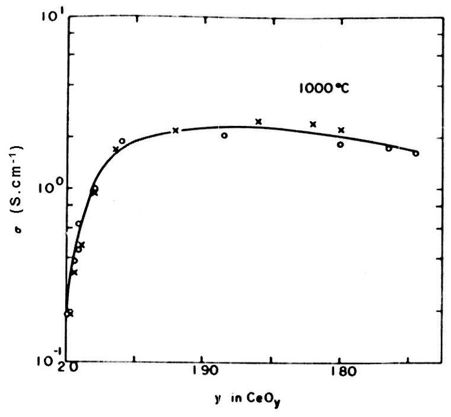
Fig. 20. Conductivity at $1000^{\circ} \mathrm{C}$ as a function of nonstoichiometry, comparing data from Tuller and Nowick ( ) [76] with earlier data from Blumenthal et al. ( × ) [13]. After Tuller and Nowick [76].

ductivity, $\sigma$, as a function of $1-x$ at $1000^{\circ} \mathrm{C}$ as measured by Tuller and Nowick [76]. It shows that even though $\sigma_{\mathrm{e}}$ is known to be proportional to $x$ in the vicinity of stoichiometry (up to $x=10^{-2}$ ) a saturation already takes place at $x=0.05$ and $\sigma_{\mathrm{e}}$ goes through a broad maximum at about $x=0.1$. Also the activation energy was found to vary with $x$ as shown in Fig. 21 starting just below 0.4 eV near $x=0$ and increasing to just above 0.5 eV at $x=0.25$.

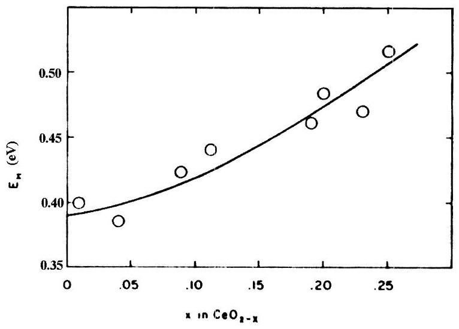
Fig. 21. Variation of activation energy, $E_{\mathrm{H}}$, from the high temperature region of the conductivity curve, with nonstoichiometry, $x$. After Tuller and Nowick [76].

Naik and Tien [77] also found that the activation energy increased with increasing $x$, but found lower values about 0.2 eV near stoichiometry as shown in Fig. 22 using the expression of Eq. (4.4). At $x=0.07$ and above, the values are quite similar to those found by Tuller and Nowick (Fig. 21). Ananthapadmanabhan et al. [78] derived an activation energy of 0.2 eV from measurements on ceria doped with $1-3 \% \mathrm{TaO}_{2.5}$.

Brugner and Blumenthal [79] compared the electrical conductivity of single crystal $\mathrm{CeO}_{2}$ and sintered polycrystalline samples and found good agreement between the conductivity results. This means that the grain boundaries do not form any barrier to the electron migration. Recent results on nanocrystalline ceria [41,42] have indicated that the grain 'boundary phase' is more easily reduced than the bulk of the crystal. The activation energy of the electron hopping seems to be similar to that of the bulk material.

As many semiconducting oxides may exhibit both an n - (electron) and p - (electron hole) type of conductivity, researchers have also looked for p-type conductivity in ceria. VanHandel and Blumenthal [80] reported that at $P \mathrm{O}_{2}$ around 1 atm , the elec-

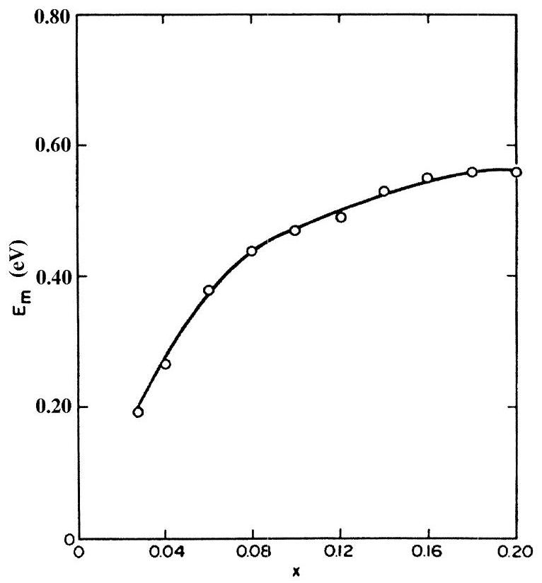
Fig. 22. Activation energy of mobility versus nonstoichiometry, $x$. After Naik and Tien [77].

tronic conductivity was p-type in the temperature range of 600 to $800^{\circ} \mathrm{C}$. This was envisaged to be caused by vacancies induced by lower valent impurities according to the reaction
$\mathrm{V}_{\mathrm{O}}^{\cdot \cdot}+\frac{1}{2} \mathrm{O}_{2}(\mathrm{~g})=\mathrm{O}_{\mathrm{O}}+2 \mathrm{~h}$.

Baker et al. [81] reported p-type conductivity at high oxygen partial pressures (up to 400 atm ) between $700^{\circ} \mathrm{C}$ to $1100^{\circ} \mathrm{C}$. Panhas and Blumenthal [27] found at $800^{\circ} \mathrm{C}$ an electron hole mobility of approximately $10^{-5} \mathrm{~cm}^{2} \mathrm{Vs}^{-1}$ in the high oxygen partial pressure region compared to an electron mobility of $6.1 \times 10^{-3} \mathrm{~cm}^{2} \mathrm{Vs}^{-1}$ in the low oxygen partial pressure region. This means that only by using very special conditions and extremely careful measurements, electron hole conductivity may be observed in pure ceria even at high oxygen pressure.

Tuller and Nowick [76] mentioned that there is a possibility of p-type conductivity at very low $\mathrm{PO}_{2}$ at $x$ about 0.3 as all available sites for electrons are filled in compositions approaching $\mathrm{Ce}_{2} \mathrm{O}_{3}$, but this was not observed.

### 4.2. Ionic conductivity

Whereas the ionic conductivity is always much lower than the electronic conductivity in pure reduced ceria, the situation is quite different in ceria doped with oxides of two- or three-valent metals due to the introduction of oxide ion vacancies, cf. Reactions (2.2) and (2.3). As a high vacancy concentration will shift Reaction (2.2) to the left, the electronic conductivity in air may be very low, and the doped cerias are under these conditions excellent electrolytes. The conductivity mechanism is the hopping of oxide ions to vacant sites, and the ionic conductivity, $\sigma_{\mathrm{i}}$, may be expressed as

$$
\sigma_{\mathrm{i}}=\left(\sigma_{\mathrm{o}} / T\right) \exp \left(-E_{\mathrm{H}} / k T\right)
$$

It has been found that the total conductivity consists of a contribution from the bulk of the grains (crystals or crystallites) and one from the grain boundaries, which are often very badly conducting. The two contributions are in series, i.e., a low grain boundary conductivity results in a low total con-
ductivity. Below we give some examples on how the ionic conductivity of doped ceria may behave.

### 4.2.1. Grain boundary conductivity

In the review of Kilner and Steele [4] it is described how the grain boundary resistance may occur due to, for example, an amorphous glassy phase in the grain boundaries caused by impurities. Other reasons mentioned are microporosity in the boundaries or segregation of the dopant ions. Riess et al. [82] measured the ionic conductivity of $\left(\mathrm{CeO}_{2}\right)_{0.82}\left(\mathrm{GdO}_{1.5}\right)_{0.18}$ prepared by different methods and showed that both the ionic conductivity and activation energy were dependent upon the powder preparation route. Some grain boundary resistance is most often seen, even in high purity material, especially at low temperature.

Wang and Nowick [83] separated the total conductivity of $\mathrm{Y}_{2} \mathrm{O}_{3}$ and CaO doped $\mathrm{CeO}_{2}$ in bulk and grain boundary contributions. The presence of relatively high-resistivity material along the grain boundaries caused an extra arc in the impedance spectra. The effect was greatest for relatively dilute solid solutions and almost disappeared for dopant concentrations greater than approximately $15 \mathrm{~mol} \%$. Figs. 23 and 24 show the difference between bulk

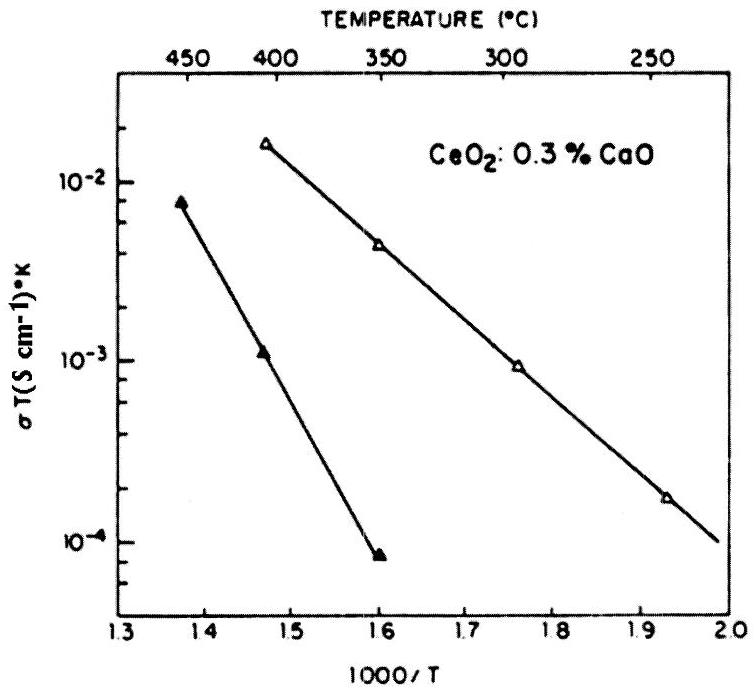
Fig. 23. Plot of $\sigma T$ versus $1 / T$ for the $\mathrm{CeO}_{2}: 0.3 \% \mathrm{CaO}$ sample based on a.c. measurements. Solid triangles are for bulk+ boundary and open triangles for bulk conductivity. After Wang and Nowick [83].

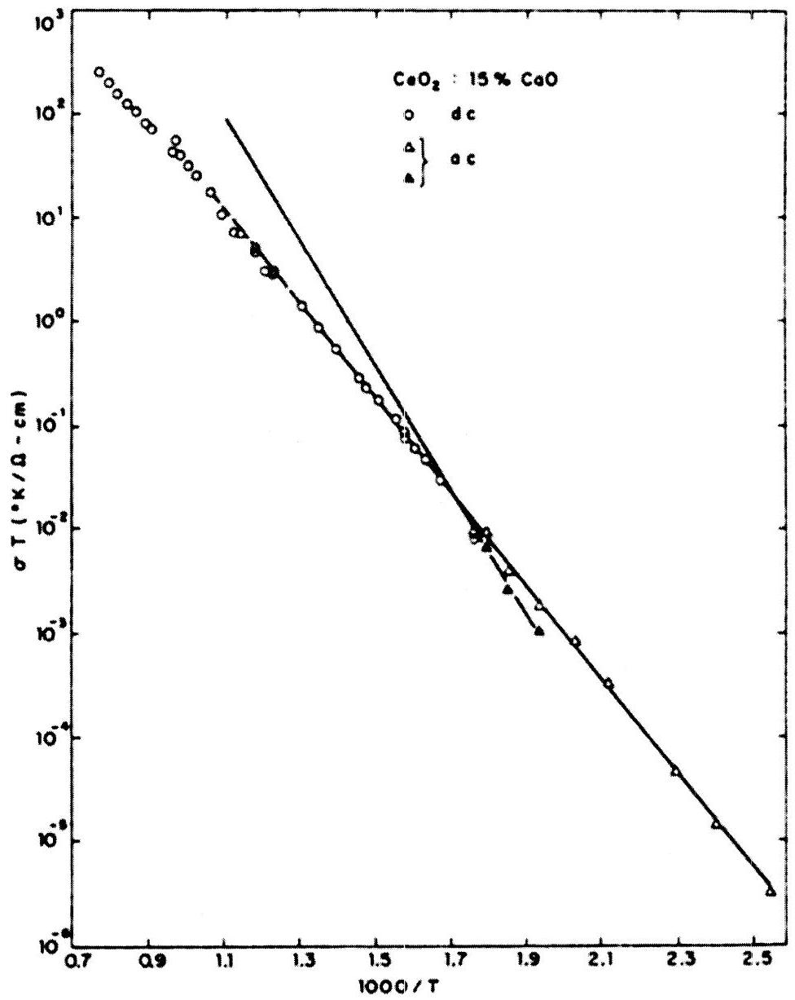
Fig. 24. Plot of $\sigma T$ versus $1 / T$ for the $\mathrm{CeO}_{2}: 15 \% \mathrm{CaO}$ sample based on a.c. measurements. Three sets of data are incorporated: open circles are from four-probe d.c. measurements, solid triangles are for bulk + boundary and open triangles for bulk conductivity. After Wang and Nowick [83].

and grain boundary conductivity for a low dopant concentration ( $0.3 \% \mathrm{CaO}$ ) and a high dopant concentration ( $15 \% \mathrm{CaO}$ ). Adham and Hammou [84] also showed that the grain boundary resistance of CaO doped $\mathrm{CeO}_{2}$ decreased with increasing dopant concentration. They found that the activation energy, $E_{\mathrm{a}}$, decreased with increasing dopant concentration for both the grain boundary and the bulk contribution. Increasing the CaO content from 0.6 to 11 $\mathrm{mol} \%$ caused a decrease from of $E_{\mathrm{a}, \text { grb }}$ (grain boundary) from 1.2 to 0.96 eV and $E_{\mathrm{a}, \mathrm{b}}$ (bulk) from 1.15 to 0.85 eV . Furthermore, they reported an enrichment of the calcia in the surroundings of the grain boundary.

Christie and van Berkel [85] have recently shown that a clear minimum in the grain boundary conductivity plotted as a function of grain size occurred at a size of $3 \mu \mathrm{~m}$. Using electron microscopy, it was shown that there were absolutely no foreign phases present in the grain boundaries. In spite of this fact, the grain boundary material in a width of about 3 nm had a specific ionic conductivity, which was of the order of 1000-times lower than the bulk material in the temperature range of 250 to $500^{\circ} \mathrm{C}$. In qualitative agreement with these results, Chiang et al. [42] state that "in the intrinsic limit, grain boundaries remain 100 -times more resistive than the bulk". This was based on their study of nanocrystalline (ca. 10 nm )
gadolinia doped ceria. They also found that very small grains might affect the bulk conductivity adversely because the dopant is extracted to the grain boundaries to an extent that the grains become practically undoped. However, as the grain boundary phase in materials with grain sizes of a micron and above, constitutes a very tiny fraction of the material, the bulk conductivity is not affected significantly. Therefore, it is possible to fabricate dense samples with very low contribution from the grain boundaries to the total resistivity as shown recently by Van herle et al. [86]. For $20 \mathrm{~mol} \% \mathrm{YO}_{1.5}$ the grain boundary conductivity becomes insignificant at $480^{\circ} \mathrm{C}$.

### 4.2.2. Total ionic conductivity

Most of the early, and a lot of later, works were carried out using classical four-point conductivity measurements. This gives the total conductivity of the sample, with small possibilities of resolving it into the bulk and the grain boundary conductivities. This, however, can be done by means of a.c. impedance analysis using two electrodes only. Under favourable conditions it is possible to derive the grain boundary resistances from the measured impedance spectra.

The total d.c. conductivity is the important quanti-
ty for practical applications, and, as some general features were observed from these measurements, examples of such work are described below.

Kevane et al. [87] reported in 1963 that calcia (up to $10 \mathrm{wt} \%$ ) dissolved in ceria introduced extrinsic ionic conduction. Since then many works [88-95] have been carried out on ceria doped with CaO and SrO. Overall the findings are that the ionic conductivity increases with dopant concentration up to about 7 to $8 \mathrm{~mol} \%$ after which it goes through a broad flat maximum and decreases again above ca. 13 to $14 \%$ dopant in the case of CaO . The SrO solubility limit is reached before passing the maximum. An example for CaO doped ceria is shown in Fig. 25. In general, there is some scatter in the reported values of the conductivity as well as in the activation energy. The level is $0.1-0.2 \mathrm{~S} \mathrm{~cm}^{-1}$ at $1000^{\circ} \mathrm{C}$ and the activation energies in the range of 0.6 to 1.0 eV were reported.

Kudo and Obayashi [96,97] and Dirstine et al. [98] examined the electrical properties of $\mathrm{CeO}_{2}$ doped with $\mathrm{LnO}_{1.5}(\mathrm{Ln}=\mathrm{Y}$, La, to Yb). The data showed that the behaviour for all of the lanthanide oxides was very similar to that of CaO and SrO doped ceria when compared on a vacancy concentration basis. Kudo and Obayashi observed a variation in the

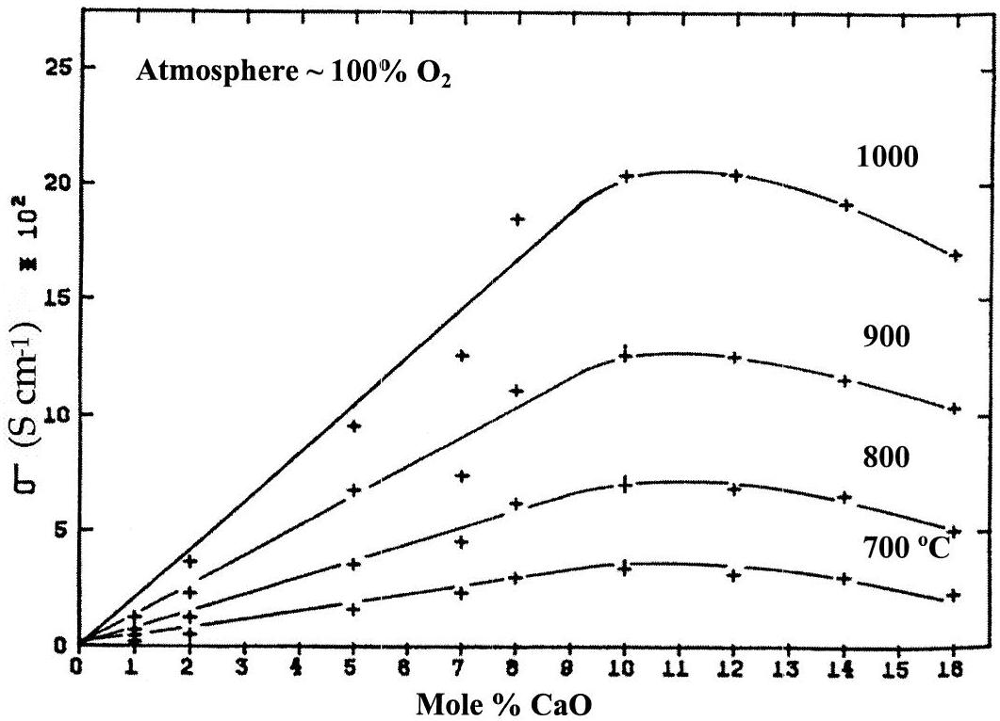
Fig. 25. Isothermal plot of $\sigma$ vs. $\mathrm{mol} \% \mathrm{CaO}$ in $\mathrm{CeO}_{2}$ at $1 \mathrm{~atm} \mathrm{O}_{2}$. After Blumenthal et al. [13].

activation energy with lattice parameter, but this was not confirmed by Dirstine et al. The maximum conductivities as a function of lattice parameter (or dopant type) at a given temperature in the range of 800 to $1000^{\circ} \mathrm{C}$ varied within a factor of about three. Even though some variation in the activation energy was observed, a corresponding variation was seen in the values of $\sigma_{\mathrm{o}}$, which more or less compensated the changes in activation energy, and hence the magnitudes of the conductivities were similar. Hohnke [99] also reported different activation energies for different gadolinia dopant concentrations in the range from 1 to $20 \mathrm{~mol} \%$. He also observed the compensation by variation in $\sigma_{\mathrm{o}}$ at temperatures above ca. $1000^{\circ} \mathrm{C}$. In fact, at $1300^{\circ} \mathrm{C}$ the very same conductivity was approached irrespective of dopant concentrations. At the high temperatures the activation energy did not vary for dopant concentrations above a nominal vacancy concentration of 0.015 . His results are shown in Figs. 26 and 27. We think this

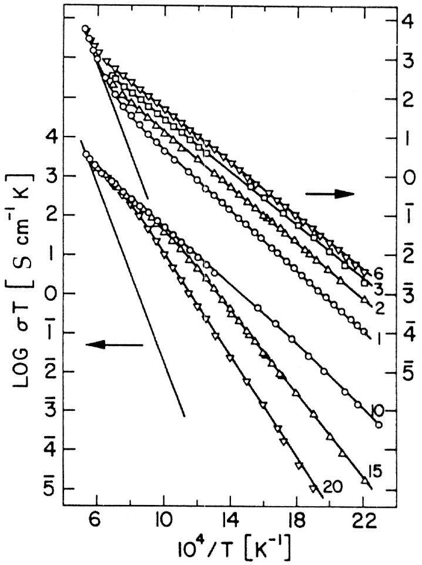
Fig. 26. Ionic conductivity of $\mathrm{Ce}(\mathrm{Gd}) \mathrm{O}_{2-y}$. Dopant concentrations as indicated ( $\times 100$ ). After Hohnke [99].

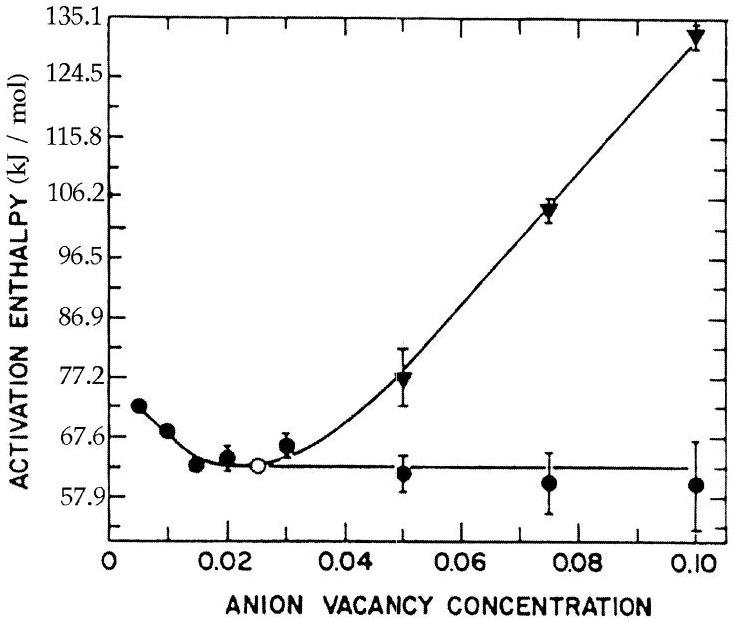
Fig. 27. Activation enthalpies for $\mathrm{Ce}(\mathrm{Gd}) \mathrm{O}_{2-y}$, ( $\mathbf{V}$ ) low temperature; (•) high temperature. Modified from Hohnke [99].

means that above this concentration there is no change in the concentration of 'free' vacancies or, in other words, in the effective charge carrier concentration.

Yahiro et al. [100] examined the total ionic conductivity of the series $\left(\mathrm{CeO}_{2}\right)_{0.8}\left(\mathrm{LnO}_{1.5}\right)_{0.2} (\mathrm{Ln}=\mathrm{La}, \mathrm{Nd}, \mathrm{Sm}, \mathrm{Eu}, \mathrm{Gd}, \mathrm{Y}, \mathrm{Ho}, \mathrm{Tm}, \mathrm{Yb})$ at $800^{\circ} \mathrm{C}$. $\left(\mathrm{CeO}_{2}\right)_{0.8}\left(\mathrm{SmO}_{1.5}\right)_{0.2}$ was found to have the highest conductivity ( $9.45 \times 10^{-2} \mathrm{~S} \mathrm{~cm}^{-1}$ ), whereas that of $\left(\mathrm{CeO}_{2}\right)_{0.8}\left(\mathrm{GdO}_{1.5}\right)_{0.2}\left(5.53 \times 10^{-2} \mathrm{~S} \mathrm{~cm}^{-1}\right)$ was almost $50 \%$ lower. Only the conductivity of the lanthania doped ceria ( $4.16 \times 10^{-2} \mathrm{~S} \mathrm{~cm}^{-1}$ ) was lower than the gadolinia doped one. Further studies by the same group [65,101] modified the position of the various lanthanides in the ranking list, but still the samaria doped samples have the highest and the lanthania the lowest conductivity. Fig. 28 summarises their findings of the ionic conductivity of $\left(\mathrm{CeO}_{2}\right)_{0.8}\left(\mathrm{LnO}_{1.5}\right)_{0.2}$ as a function of radius of dopant ion. The authors found that the ionic conductivity increased with increasing ionic radius, from Yb to Sm , but decreased at $r>0.109 \mathrm{~nm}$.

According to Steele [5] the highest ionic conductivity of the doped cerias is exhibited by the $\mathrm{Ce}_{0.8} \mathrm{Gd}_{0.2} \mathrm{O}_{1.9}$ in contradiction with the above findings. In order to look for an explanation for this let us look at some numbers published by different authors [5,65,102-104] for the two dopants as given in Table 3.

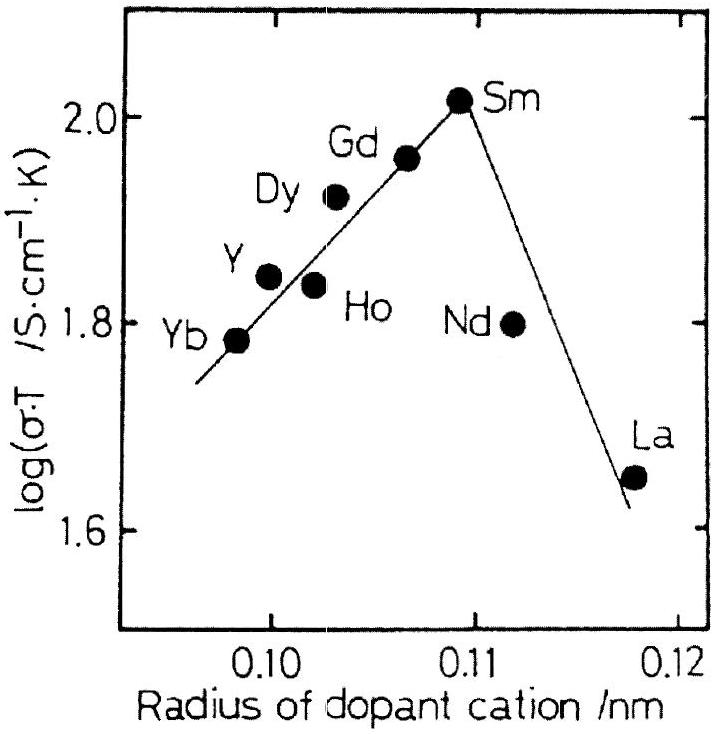
Fig. 28. Dependence of ionic conductivity for $\left(\mathrm{CeO}_{2}\right)_{0.8}\left(\mathrm{LnO}_{1.5}\right)_{0.2}$ at $800^{\circ} \mathrm{C}$ on a radius of dopant cation. After Eguchi et al. [65].

Table 3
Conductivities in $\mathrm{mS} \mathrm{cm}^{-1}$ at $600^{\circ} \mathrm{C}$ for gadolinia and samaria doped ceria
| $\mathrm{Ce}_{0.8} \mathrm{Sm}_{0.2} \mathrm{O}_{1.9}$ | $\mathrm{Ce}_{0.8} \mathrm{Gd}_{0.2} \mathrm{O}_{1.9}$ | Ref. |
| :--- | :--- | :--- |
| 17 | 5 | Eguchi et al. [65] |
| - | 35,40 | Steele et al. [5,104] |
| 5 | - | Huang et al. [102] |
| 10 | 11 | Balazs and Glass [103] |

On the background of the scatter in the values seen in Table 3, a plausible explanation for the apparent disagreement seems to be that the actual values obtained are dependent on the grain boundary resistivity, i.e., differences in methods of fabrication of the samples. The high total conductivities found for $\mathrm{Ce}_{0.8} \mathrm{Sm}_{0.2} \mathrm{O}_{1.9}$ might indicate that doping with samaria for some reason tends to induce a lower grain boundary resistance. Ralph et al. [105] indeed found indications that this might be the case.

### 4.2.3. Bulk ionic conductivity

The observation that the activation energy is a strong function of dopant concentration at low temperature was also found for the pure bulk conductivity [106,107]. Fig. 29 shows the conductivity of yttria doped ceria as a function of dopant con-
centration, and in the same figure the variation in the activation enthalpy is also shown. The suggested explanation is as follows. The oxygen vacancies may form associates with the dopant cations of the type $\left\{\mathrm{Y}_{\mathrm{Ce}} \mathrm{V}_{\mathrm{O}}\right\}^{\cdot}$. The decrease in activation enthalpy in the dilute range is due to a decrease in association enthalpy as a result of electrostatic interaction, and the increase in the high concentration range is due to the development of deep vacancy traps as a result of defect ordering and formation of microdomains.

Faber et al. [108] investigated the variation of the activation energy for conduction, as a function of the dopant ion type and concentration in $\mathrm{CeO}_{2}$. For all five dopants studied, a plot of activation energy versus dopant concentration showed a minimum (see Fig. 30). They described this minimum in terms of attractive interactions between immobile dopant ions and mobile oxygen vacancies. Their explanation is similar to Wang et al.'s. When the amount of dopant is increased, the oxide vacancies interact with several dopant ions. The energy of an oxide ion in a saddlepoint between sites with interactions with dopant ions will have a lower energy than in a saddle-point between sites with no interaction. (The activation energy of the oxide ion mobility is the extra energy which is necessary to bring the oxide ion from a regular site to the saddle-point). At higher dopant concentrations more deep traps consisting of dopant ions next to each other are formed, and the activation energy increases. The composition associated with the minimum of the activation energy is determined by the range of interaction of the dopant ion with the mobile oxygen ion. It is necessary to consider the interaction of a vacancy out to a distance of third or fourth nearest neighbours. It is further concluded that the charge and the size are not the only parameters which determine the interaction range.

Huang et al. [109] studying $\mathrm{Ce}_{0.9} \mathrm{Gd}_{0.1} \mathrm{O}_{1.95}$ found that below a temperature, $T^{*}=583 \pm 45^{\circ} \mathrm{C}$ the system could be modelled by a condensation of mobile oxide vacancies into ordered clusters. The trapping energy is $\Delta H_{\mathrm{t}}\left(1-T / T^{*}\right)$ and $\Delta H_{\mathrm{t}}=0.19 \pm 0.01 \mathrm{eV}$. The activation enthalpy for oxide ion motion was found to be $0.63 \pm 0.01 \mathrm{eV}$.

Kilner and Faktor [110] proposed that since defect binding is dependant upon the relative host and dopant radii, then plots of lattice parameters versus concentration should give quantitative information

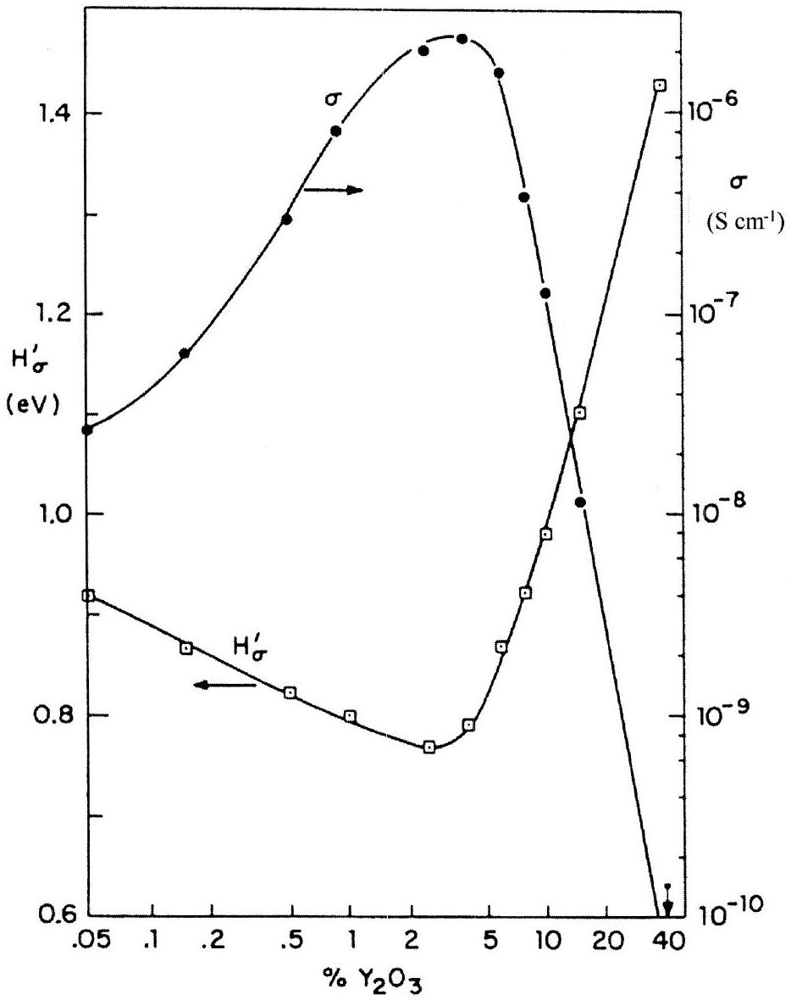
Fig. 29. Variation of the low temperature activation enthalpy, $H_{\sigma}^{\prime}$, with composition, the latter plotted on a logarithmic scale. Also shown is the conductivity at $182^{\circ} \mathrm{C}$ as a function of composition. The point for $40 \% \mathrm{Y}_{2} \mathrm{O}_{3}$ falls at $\sigma=10^{-11} \mathrm{~S} \mathrm{~cm}^{-1}$. After Wang et al. [106].

on the expected strain component of the structure. Kilner [111] and Kilner and Brook [112] examined the effect of the ion radius of the dopants. A correlation between $\sigma_{\mathrm{i}}$ and the ratio $r_{\text {dopant }} / r_{\text {host }} (=R)$ was found. It was concluded that $R$ should be greater than or equal to 1 . If $R$ becomes less than 1 , the dopant defect association energy is expected to be large. This was in accordance with the dopant $\mathrm{Gd}_{2} \mathrm{O}_{3}$ giving the highest conductivity.

As mentioned above, Kim established an empirical relation between lattice parameter and dopant ion radius at room temperature. He pointed out that the lowest internal stress in the lattice would be obtained with a dopant radius, $r_{\mathrm{c}}$, which resulted in no change in lattice parameter compared to pure ceria (i.e. Vegard slope, $V_{\mathrm{s}}=0$, see Sections 3.1.2 and 3.2.1).

Kim advocated similar arguments to that of Kilner et al. that the highest ionic conductivities would be obtained in a lattice with no strain. This means that the ionic radius of the dopant should be as close to $r_{\mathrm{c}}$ as possible.

Working along this kind of idea, Zhen et al. [68] showed that for a series of yttria and gadolinia co-doped samples, the lowest activation energy was obtained for the composition $\mathrm{Ce}_{0.9} \mathrm{Gd}_{0.09} \mathrm{Y}_{0.01} \mathrm{O}_{1.95}$. Mogensen et al. [58] plotted $\sigma_{\mathrm{i}}$ versus $r_{\mathrm{c}}$ for four compositions of $\mathrm{Ce}_{0.9} \mathrm{Ln}_{0.1} \mathrm{O}_{1.95}(\mathrm{Ln}=\mathrm{Gd}, \mathrm{Y}, \mathrm{La}, \mathrm{Sc})$ at $1000^{\circ} \mathrm{C}$ and obtained a straight line using $r_{\mathrm{c}}=$ 0.1038 nm as published by Kim, even though the correct value for $r_{\mathrm{c}}$ may be slightly lower, about 0.1014 as discussed in Section 3.2.1. These findings support the concept that there is a close relationship

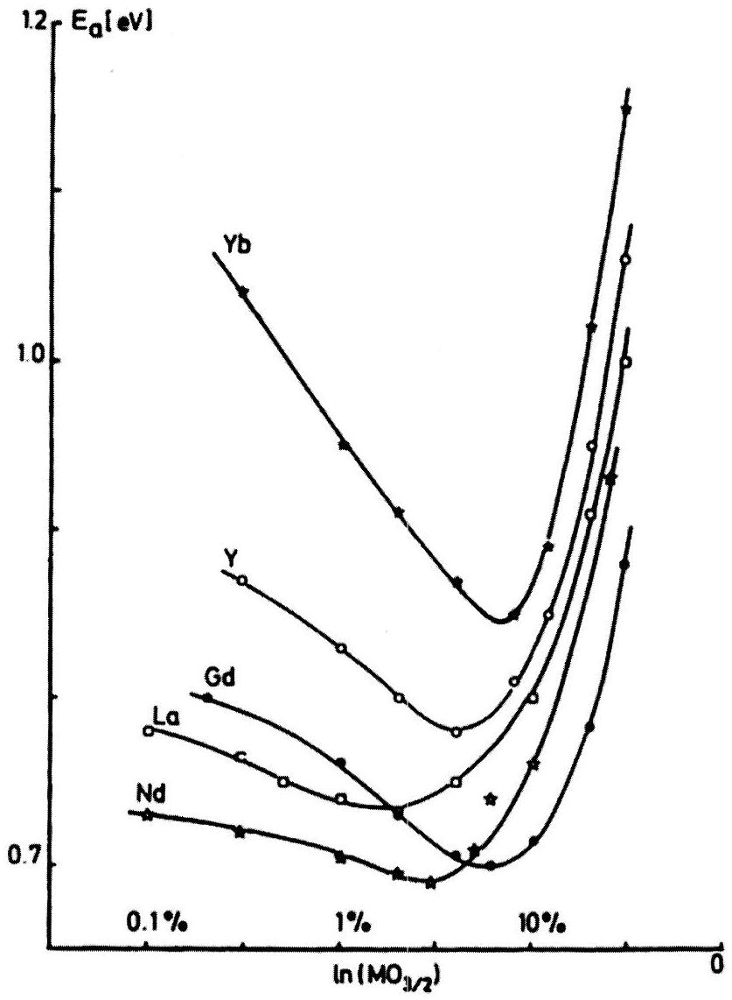
Fig. 30. Activation energy versus composition (log scale) for dopants $\mathrm{Yb}, \mathrm{Y}, \mathrm{Ga}, \mathrm{La}$ an Nd in $\mathrm{CeO}_{2}$. After Faber et al. [108].

between the ionic conductivity and the lattice strain. In a series of experiments, Ralph et al. [105] tested whether it was the overall stress or the local stress which is important. The authors co-doped, on the one hand, with $\mathrm{Sm}^{3+}$ and $\mathrm{Y}^{3+}$, having radii just above and below but close to $r_{\mathrm{c}}$, and on the other with $\mathrm{La}^{3+}$ and $\mathrm{Yb}^{3+}$, having radii far above and below $r_{\mathrm{c}}$. In both cases samples with lattice parameters very close to pure ceria were obtained. This proves that the local stress is most important in the temperature range of 150 to $500^{\circ} \mathrm{C}$.

### 4.2.4. Defect interaction models

Atlas [113] proposed a statistical model to account for the partial ordering of anion vacancies and reduced cations in the substoichiometric $\mathrm{CeO}_{2}$ com-
pound. The author showed a semiquantitative agreement between the proposed model and the work of Bevan and Kordis [32].

Tuller and Nowick [114] derived from measurements a model for pure $\mathrm{CeO}_{2-x}$. For $x<10^{-3}$ the ideal situation with non-interacting small polarons and doubly ionised oxide vacancies prevails. For $10^{-3}<x<10^{-2}$ singly ionised vacancies (i.e. a small polaron associated with the oxide vacancy, which is regarded as one defect) are dominant. For even larger $x$-values defect interaction takes place. They calculated the enthalpy of formation of singly and doubly ionised vacancies to be 4.1 eV and 4.7 eV , respectively, ( 396 and $454 \mathrm{~kJ} \mathrm{~mol}^{-1}$ ). Assuming only pairwise defect interaction, they obtained a defect interaction energy of $0.055 \mathrm{eV}\left(5.3 \mathrm{~kJ} \mathrm{~mol}^{-1}\right)$.

Butler et al. [115] and Catlow [116] modelled the effect of the dopant ion radius on the dopant-vacancy interaction in $\mathrm{CeO}_{2}$, and thus on the ionic conductivity. The authors calculated the binding energy of oxide vacancies with an oxygen vacancy with one, two, three and four nearest neighbour dopant ions for dopant ions with different ion size and charge. Fig. 31 shows a plot of binding energy versus ionic radius for a range of dopant ions ( $\mathrm{M}^{\prime}$ ) associated with a single oxygen vacancy ( $\mathrm{V}_{\mathrm{O}}^{\cdot \cdot}$ ) forming an $\left(\mathrm{MV}_{\mathrm{O}}\right)^{\cdot}$ pair in $\mathrm{CeO}_{2}$. Association energies are given in Table 4. The reasons for the observed trends were explained as follows. For small dopant ions, relaxation of the dopant towards the oxide vacancy increases the stability of the complex, while for larger dopant ions, there is an energy associated with the reduction in strain in the crystal when an oxygen vacancy is introduced into a neighbouring site. These two opposing effects lead to a minimum in the binding energy at $\mathrm{Gd}^{3+}$.

During recent years, several workers [117-120] have been quite successful in terms of agreement with measurements in modelling the behaviour of ceria using statistical thermodynamics or Monte Carlo simulation and percolation theory. Even though these models improve our detailed physicalchemical understanding, it seems difficult so far to

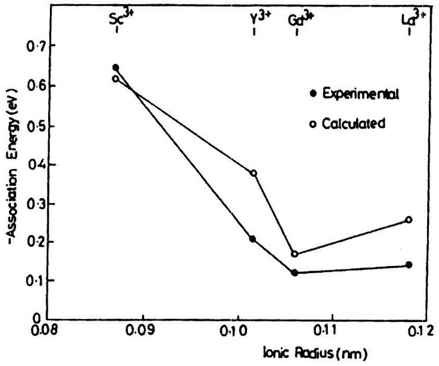
Fig. 31. Plot of binding energy (both experimental and calculated values) versus ionic radius for a range of dopant ions associated with an oxygen vacancy in $\mathrm{CeO}_{2}$. After Butler et al. [115].

Table 4
Calculated binding energies of the defect clusters in $\mathrm{CeO}_{2}$; 1nn refers to an oxide vacancy with one nearest neighbour dopant ion, 2 nn refers to two nearest neighbour dopant ions, etc (After Butler et al. [115]).
| Dopant | Ionic radius ${ }^{\text {a }}$ (Å) | Binding energies (eV) in $\mathrm{CeO}_{2}{ }^{\text {b }}$ |  |  |  |
| :--- | :--- | :--- | :--- | :--- | :--- |
|  |  | 1 nn | 2 nn | 3 nn | 4 nn |
| Trivalent |  |  |  |  |  |
| $\mathrm{Sc}^{3+}$ | 0.87 | 0.62 | 1.15 | 1.48 | 1.61 |
| $\mathrm{Y}^{3+}$ | 1.014 | 0.38 | 0.72 | 0.91 | 0.96 |
| $\mathrm{Gd}^{3+}$ | 1.06 | 0.17 | 0.26 | 0.19 | -0.06 |
| $\mathrm{Ce}^{3+}$ | 1.15 | 0.25 | 0.43 | 0.45 | 0.29 |
| $\mathrm{La}^{3+}$ | 1.18 | 0.26 | 0.46 | 0.49 | 0.35 |
| Divalent |  |  |  |  |  |
| $\mathrm{Mg}^{2+}$ | 0.89 | 1.23 | 1.86 | 1.81 | 0.91 |
| $\mathrm{Ca}^{2+}$ | 1.12 | 1.08 | 1.58 | 0.59 | 0.83 |

${ }^{\text {a }}$ Effective ionic radii for eight coordinated cations. The values used in this work are earlier values from Shannon and Prewitt and are only approximately equal to those of Shannon's [60], which p.t. are the generally accepted.
${ }^{\mathrm{b}}$ A positive binding energy indicates that the cluster is bound with respect to the component species.
find guidelines of how to improve or optimise the materials’ properties.

### 4.2.5. Electronic conductivity in doped ceria

Takahashi and coworkers [121,122] made ionic transport measurements on $\mathrm{La}_{2} \mathrm{O}_{3}$ doped $\mathrm{CeO}_{2}$, and observed that they had a substantial electronic component ( $t_{\mathrm{i}}$ fell between 0.6 and 0.9 ). Tuller and Nowick [123] examined the electrical properties of $\left(\mathrm{CeO}_{2}\right)_{0.95}\left(\mathrm{Y}_{2} \mathrm{O}_{3}\right)_{0.05}$ as a function of temperature and oxygen partial pressure ( 1 atm and $10^{-22} \mathrm{~atm}$ ). The authors observed that the ionic domain extended down to $10^{-13} \mathrm{~atm}$ at $600^{\circ} \mathrm{C}$.

Kudo and Obayashi [124] examined the EMF of a cell of the type:
$\mathrm{O}_{2}\left(P \mathrm{O}_{2}=1 \mathrm{~atm}\right), \mathrm{Pt}\left|\mathrm{Ce}_{1-y} \mathrm{Gd}_{y} \mathrm{O}_{2-y / 2}\right| \mathrm{Pt}, \mathrm{O}_{2}\left(P \mathrm{O}_{2}\right)$
between 700 and $800^{\circ} \mathrm{C}$, as a function of $P \mathrm{O}_{2}$. The authors observed that as the oxygen partial pressure decreased, the EMF fell below the theoretical (Nernst) potential, indicating the onset of electronic conductivity, according to the relationship:
$E=R T / F \ln \left[\left(1+P^{*} \mathrm{O}_{2}^{1 / 4}\right) /\left(P \mathrm{O}_{2}^{1 / 4}+P^{*} \mathrm{O}_{2}^{1 / 4}\right)\right]$
where $P^{*} \mathrm{O}_{2}$ corresponds to the oxygen partial pressure at which the ionic transference number of the solid solution becomes 0.5.

Table 5 shows the $P^{*} \mathrm{O}_{2}$ values as a function of $y$

Table 5
$P * \mathrm{O}_{2}$ (atm) for various dopant levels, $y$, and temperatures for $\mathrm{Ce}_{1-y} \mathrm{Gd}_{y} \mathrm{O}_{2-y / 2}$, after Kudo and Obayashi [97]
| $y$ | Temperature ( ${ }^{\circ} \mathrm{C}$ ) |  |  |  |
| :--- | :--- | :--- | :--- | :--- |
|  | 700 | 750 | 800 | 850 |
| 0.1 | $1.3 \times 10^{-17}$ | $2.53 \times 10^{-16}$ | $2.43 \times 10^{-15}$ | $3.56 \times 10^{-14}$ |
| 0.2 | $1.24 \times 10^{-19}$ | $3.92 \times 10^{-18}$ | $9.2 \times 10^{-17}$ | $1.73 \times 10^{-15}$ |
| 0.3 | $3.16 \times 10^{-19}$ | $5.6 \times 10^{-18}$ | $8.5 \times 10^{-17}$ | $9.0 \times 10^{-16}$ |
| 0.4 | $9.3 \times 10^{-19}$ | $8.8 \times 10^{-18}$ | $6.3 \times 10^{-17}$ | $3.85 \times 10^{-16}$ |
| 0.5 | $1.46 \times 10^{-16}$ | $1.38 \times 10^{-15}$ | $1.12 \times 10^{-14}$ | $6.5 \times 10^{-14}$ |

and temperature. As the value of $y$ increased, the value of $P^{*} \mathrm{O}_{2}$ is pushed to lower oxygen partial pressures. This is considered to be due to an increase in the vacancy concentration (due to the dopant concentration), which in turn suppresses the reduction of $\mathrm{Ce}^{4+}$ to $\mathrm{Ce}^{3+}$ according to the law of mass action (see Reaction (2.1)).

Yahiro et al. [95] examined the ionic conductivity and microstructure of the $\left(\mathrm{CeO}_{2}\right)_{1-x}(\mathrm{SrO})_{x}$ system as a function of temperature $\left(600-900^{\circ} \mathrm{C}\right)$ and oxygen partial pressure ( 1 atm to $10^{-18} \mathrm{~atm}$ ). The effect of oxygen partial pressure is given in Fig. 32.

Mogensen et al. [58] investigated whether there was any effect of dopant radii (lattice strain) on the electronic conductivity, but no effect was found. No effect of grain size or grain boundaries on the electronic conductivity have been reported as a

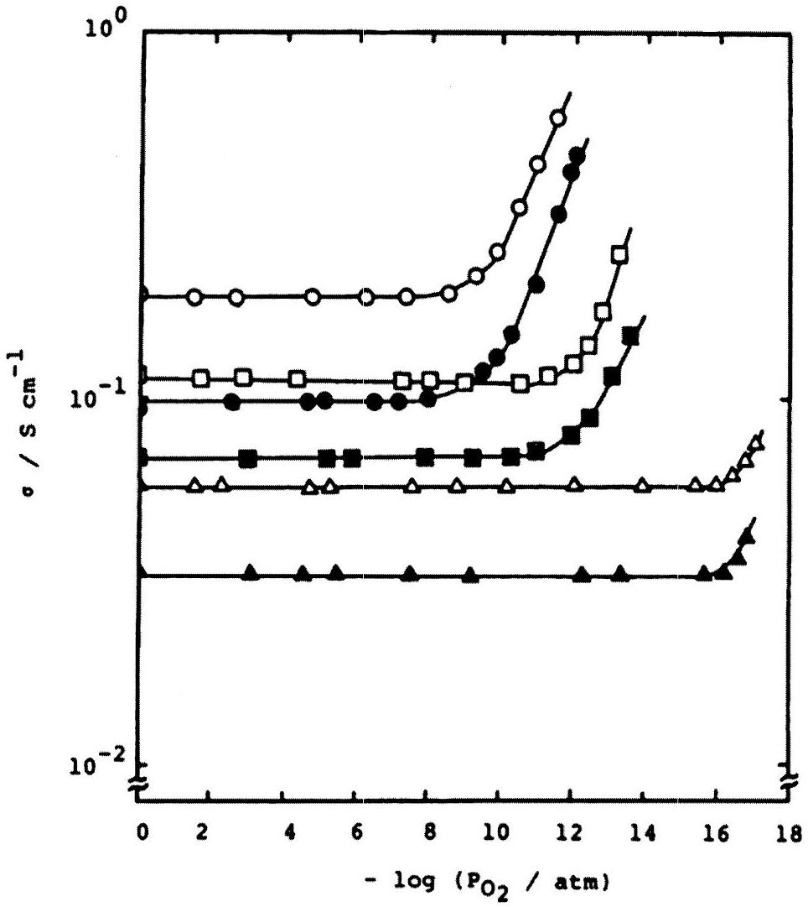
Fig. 32. Electrical conductivities of $\left(\mathrm{CeO}_{2}\right)_{0.90}(\mathrm{SrO})_{0.10}$ (open symbols) and $\left(\mathrm{CeO}_{2}\right)_{0.80}(\mathrm{SrO})_{0.20}$ (closed symbols) as a function of $P \mathrm{O}_{2}$. Measured at $(\mathrm{O}, \mathrm{O}) 1000^{\circ} \mathrm{C},(\square, \mathbf{m}) 900^{\circ} \mathrm{C}$ and $(\Delta, \mathbf{A}) 800^{\circ} \mathrm{C}$. After Yahiro et al. [95].

function of grain size from around $1 \mu \mathrm{~m}$ and above. Thus, as $\sigma_{\mathrm{e}}$ is a function of $x$ and temperature only (for reasonable pure materials), it is the parameters, which affect the ionic conductivity that control the $P^{*} \mathrm{O}_{2}$ value.

Similar to pure $\mathrm{CeO}_{2-x}$ the activation energy of the electronic conduction seems to be dependent on the oxide vacancy concentration. According to Levy et al. [125] 2\% and 26\% substitution of Ce with Y gave activation energies of 0.3 and 0.5 eV , respectively. In both cases the electronic defect concentration was in the range of $1-3 \%$ of the cation sites.

In the case of nanometer grains a very significant effect is observed. These fine-grained materials are much easier to reduce, (see Section 2.2), and thus the $P^{*} \mathrm{O}_{2}$ values move towards much higher values.

## 5. Practical applications in electrochemical devices

### 5.1. Ceria as an SOFC electrolyte

Takahashi and Iwahara [126] investigated $\mathrm{La}_{2} \mathrm{O}_{3}$ doped $\mathrm{CeO}_{2}$ as an electrolyte in an SOFC. Although the authors observed a high power density with this material, they observed open circuit voltages lower than theoretical due to partial reduction of the electrolyte by the fuel. Yahiro et al. [127] fabricated a high temperature SOFC using $\left(\mathrm{CeO}_{2}\right)_{0.8}\left(\mathrm{YO}_{1.5}\right)_{0.2}$ as the electrolyte and $\mathrm{La}_{0.6} \mathrm{Sr}_{0.4} \mathrm{CoO}_{3}$ as the cathode. They also showed good performance characteristics. Inoue et al. [128] fabricated an SOFC using an electrolyte based on $\left(\mathrm{CeO}_{2}\right)_{0.8}\left(\mathrm{SmO}_{1.5}\right)_{0.2}$, and Pt electrodes. The authors, however, observed that the open circuit voltage was low due to reduction of the electrolyte by the $\mathrm{H}_{2}$ fuel. They also showed that if a protective layer of YSZ (put down using RF sputtering) was coated on the fuel side of the SOFC, then the reduction of the electrolyte was suppressed. This cell showed good performance. The incentive for making such a cell may be limited because cells with anode or cathode supported thin electrolytes of YSZ have been demonstrated. In spite of this, the results are interesting because they show that ceria-zirconia interfaces may be formed without causing adverse effects. This means that doped ceria, for example, may be used as a barrier layer for high-performance
$\mathrm{LaCoO}_{3}$ based cathodes, which react adversely with zirconia.

A number of more recent publications have examined the use of doped $\mathrm{CeO}_{2}$ as a possible SOFC electrolyte [129-132]. Many of the more recent publications have concentrated on improving the synthesis and fabrication processes of doped $\mathrm{CeO}_{2}$. Park et al. [133] studied $\mathrm{CeO}_{2}-\mathrm{Gd}_{2} \mathrm{O}_{3}$ powders synthesised using a glycine-nitrate process, while Van herle et al. [134,135] have studied a number of doped ceria powders (Y, Gd, and Sm) using a coprecipitation technique. A review of the fabrication methods is not within the scope of this paper and is a subject for its own review paper, which we hope somebody will undertake in the near future.

### 5.2. Ceria as SOFC anode

Back in 1964, Möbius and Rohland [136] showed that ceria could work as an anode in an SOFC fuelled with $\mathrm{H}_{2}$ and CO . Takahashi et al. [137] described $\mathrm{Ce}_{0.6} \mathrm{Y}_{0.4} \mathrm{O}_{1.8}$ and $\mathrm{Ce}_{0.6} \mathrm{La}_{0.4} \mathrm{O}_{1.8}$ as being excellent anode materials for SOFC. Much later, this work was continued with the purpose of using ceria based materials as an anode for direct oxidation of dry methane [138-143]. Cells with a ceria anode had a performance similar to cells with Ni-YSZ-electrodes in hydrogen. Also in methane good performances were reported when Pt or Ni metals were present. Originally, Mogensen et al. [140] believed that reduced ceria was a good electrocatalyst for direct methane oxidation. This was based on the observation that in blind tests with the Pt current collector directly on the YSZ electrolyte, a very high polarisation resistance was obtained, and thus it was concluded that Pt was almost inert for the reactions in question as also reported by Steele et al. [144]. The tricky point is, however, that platinum is a good methane cracking catalyst. Thus, it was later shown by the same group that if an inert gold current collector is used, then the ceria based anode is equally good in hydrogen but almost inert in methane, and hence a cracking catalyst must be present. In spite of this, we believe that there is real potential in ceria as an anode for conversion of hydrocarbon fuels, because ceria can tolerate carbon precipitation and is able to oxidise the carbon. In this context it should be remembered that one of the
oldest applications of ceria has been as a carbon oxidation catalyst, and still today it is used as a catalyst in self-cleaning ovens and for the oxidation of diesel soot in automobiles [8].

Ceria has also been used as an addition (or as the only ceramic) in nickel - or ruthenium - cermet anodes for hydrogen oxidation. Schmidberger [145], Eguchi et al. [146], Watanabe et al. [147], Uchida et al. [148,149] and Tsai and Barnett [150] have all reported beneficial effects probably due to the broadening of the three-phase boundary zone width as pointed out by Schouler and Kleitz [151]. Basic studies of the electrocatalytic activity of doped ceria were carried out by Horita et al. [152].

### 5.3. Mechanical-thermodynamical considerations

In Section 3 it was described how both doped and undoped ceria expand on reduction. This phenomenon will cause mechanical stresses in the ceria in cases where it is used as an electrolyte, where the anode side is reduced to a smaller or larger degree. If the ceria is used as an anode the expansion will cause stresses at the anode-electrolyte interface and may, unless special precautions are taken, cause a delamination of the anode. To what extent this is a practical problem is, of course, a matter of the balance between the mechanical strength of the ceria and the local expansion at the conditions in question. Thus, in order to assess the problem it is necessary to also have knowledge of the mechanical properties of ceria.

### 5.3.1. Mechanical properties of ceria and doped ceria materials

Mashino et al. [153] found that cubic $\mathrm{CeO}_{2}$ has a room temperature four-point bend strength of $<100$ MPa and a fracture toughness of approximately 1.5 MPa $\mathrm{m}^{1 / 2}$. Recently, Zhang [154], Sammes et al. [155], and Bellon et al. [156] have examined the mechanical properties of $\left(\mathrm{CeO}_{2}\right)_{0.8}\left(\mathrm{GdO}_{1.5}\right)_{0.2}$ electrolyte materials. Using a four-point bend test method on polished bars of $\left(\mathrm{CeO}_{2}\right)_{0.8}\left(\mathrm{GdO}_{1.5}\right)_{0.2}$, the bending strength was found to be $143 \pm 10 \mathrm{MPa}$ at room temperature and $115 \pm 12 \mathrm{MPa}$ at $800^{\circ} \mathrm{C}$. The bending strength and fracture toughness of this material was carried out on bars fabricated using the standard solid state technique on precipitated powders. The fracture toughness was determined to be $2.48 \mathrm{MPa} \mathrm{m}^{1 / 2}$ or below, depending on the method used. In general, fracture of ceramics is caused by flaws originating from the fabrication, and thus, the fabrication method is of most importance. Bellon et al. [156] fabricated thin tubes and rods of $\left(\mathrm{CeO}_{2}\right)_{0.8}\left(\mathrm{GdO}_{1.5}\right)_{0.2}$ by extruding a dried slurry. A room temperature modulus of rupture (MOR) of 220 MPa was realised for this material, after firing at $1600^{\circ} \mathrm{C}$ for 10 h . A sintering temperature of at least $1400^{\circ} \mathrm{C}$ for 10 h was necessary to achieve a density of $>90 \%$, required for SOFC applications. The essential data are collected in Table 6.

### 5.3.2. Chemically induced stresses

When a ceria electrolyte is reduced on one side and not on the other stresses will be generated due to

Table 6
Literature values of mechanical properties of ceria and doped ceria materials
| Material | Fabrication method | Bending strength MOR (four-point test) (MPa) | Temperature ( ${ }^{\circ} \mathrm{C}$ ) | Fracture toughness $K_{\mathrm{Ic}}\left(\mathrm{MPa} \mathrm{m}^{1 / 2}\right)$ | Ref. |
| :--- | :--- | :--- | :--- | :--- | :--- |
| $\mathrm{CeO}_{2} \left(\mathrm{CeO}_{2}\right)_{0.8}\left(\mathrm{GdO}_{1.5}\right)_{0.2}$ | Pressing of co-precipitated powders | <100 | Room temperature | 1.5 | [153] |
|  |  | $143 \pm 10$ | Roon temperature | $2.1 \pm 0.3$ | [155] |
|  |  |  |  | $2.5 \pm 0.4$ |  |
|  |  |  |  | $1.0 \pm 0.1$ |  |
|  |  | $115 \pm 12$ | 800 |  |  |
| $\left(\mathrm{CeO}_{2}\right)_{0.8}\left(\mathrm{GdO}_{1.5}\right)_{0.2}$ | Extrusion $1600^{\circ} \mathrm{C}$ for 10 h $1400^{\circ} \mathrm{C}$ for 10 h | 220 | Room temperature |  | [156] |
|  |  |  |  |  |  |
|  |  | 180 |  |  | [156] |

the expansion on reduction. Atkinson [157] did an interesting mathematical analysis in which he found that the maximum safe temperature of operation for a fuel cell with a ceria electrolyte was lower than about $750^{\circ} \mathrm{C}$. Yasuda and Hishinuma [40] performed a similar analysis and arrived at a similar conclusion. Atkinson assumed a number of conditions which were relatively mild, a $\mathrm{PO}_{2}$ at the anode equal to $10^{-20} \mathrm{~atm}$, and the polarisation resistance of both anode and cathode were set to $0.2 \Omega \mathrm{~cm}^{2}$. The value $\epsilon_{\mathrm{r}} / x$ of the lattice expansion strain, $\epsilon_{\mathrm{r}}$, for a given reduction $x$ (in $\mathrm{Ce}_{0.8} \mathrm{Gd}_{0.2} \mathrm{O}_{1.8-x}$ ) was assumed to be only 0.119 compared to the value of 0.13 , which may be derived from the results presented in Section 3. This means that the results of Atkinson may be too optimistic, as also expressed by Atkinson himself. Thus, there is a need for more work of this type, including a sensitivity analysis in order to determine which of the parameters that is the most critical.

### 5.4. Compatibility of doped ceria with other SOFC components

### 5.4.1. Compatibility with YSZ

Several workers have studied coating of YSZ on $\mathrm{CeO}_{2}$ electrolytes [127,158,159]. The intention was to avoid the reduction of ceria, and by this avoid the electronic conductivity. These works showed that the diffusion of ceria and zirconia into each other did not take place within periods of days at temperatures below about $1000^{\circ} \mathrm{C}$. The reactions of doped ceria with YSZ have been studied by Tompsett et al. [160], Dokiya [161] and Sammes et al. [162]. Tompsett et al. studied the reaction of $\mathrm{Ce}_{1-x} \mathrm{Gd}_{x} \mathrm{O}_{2-y}$ with 8YSZ, in which polished pellets were held in intimate contact at elevated temperatures of up to $1300^{\circ} \mathrm{C}$ for 72 h . Also samples of the powdered materials mixed in a $1: 1$ ratio (weight basis) were formed into pellets and fired at elevated temperatures. These workers found that reaction was observed only after heat treatment at $1300^{\circ} \mathrm{C}$ for 72 h. The formation of a third cubic-like phase was observed using XRD and Raman spectroscopy and a diffusion layer of up to $20 \mu \mathrm{~m}$ thickness was observed at the interface, using energy dispersive x-ray analysis. Horita et al. [163] also reported the presence of an interfacial phase between doped ceria
and YSZ layers. This interfacial phase degraded the conductivity of the composite electrolyte system. At operating temperatures $\left(<1000^{\circ} \mathrm{C}\right)$ there will be little interfacial phase formation. However, at higher temperatures, which may be used in the fabrication of composite electrolytes, it will be significant.

Sammes et al. [162] report the formation of single cubic phases over a range of compositions of $\mathrm{Ce}_{0.8} \mathrm{Gd}_{0.2} \mathrm{O}_{2-x}-\mathrm{YSZ}$ with an immiscibility gap close to $50 \mathrm{~mol} \% 8 \mathrm{YSZ}$.

### 5.4.2. Compatibility with other SOFC materials

Sahibzada et al. [164] revealed that when a NiYSZ anode was sintered at $1300^{\circ} \mathrm{C}$ onto a $\mathrm{Ce}(\mathrm{Gd}) \mathrm{O}_{2-x}$ electrolyte, the formation of $\mathrm{Gd}_{2} \mathrm{Zr}_{2} \mathrm{O}_{7}$ and $\mathrm{Gd}_{2} \mathrm{NiO}_{4}$ were observed. These compounds were thought to contribute to the poor cell performance, due to their high resistivities.

Hatchwell et al. [165] studied the chemical compatibility of chromium based interconnects and related materials with gadolinia doped ceria. XRD and scanning electron microscopy were used to determine the reaction products of (La, Sr$) \mathrm{CrO}_{3}, \mathrm{SrCrO}_{4}$, $\mathrm{CaCrO}_{4}$ and $\mathrm{Cr}_{2} \mathrm{O}_{3}$ with gadolinia doped ceria (CGO). Powder mixtures and multilayer pellets were annealed in air at temperatures of $650-1600^{\circ} \mathrm{C}$ for up to 400 h . No reaction was observed between $(\mathrm{La}, \mathrm{Sr}) \mathrm{CrO}_{3}$ and $\mathrm{Ce}_{0.8} \mathrm{Gd}_{0.2} \mathrm{O}_{1.9}$ after 10 h at $1600^{\circ} \mathrm{C}$. However, $\mathrm{SrCrO}_{4}$ reacted with CGO via a $\mathrm{Sr}-\mathrm{Cr}-\mathrm{O}$ liquid phase forming an unknown phase at the interface and grain boundaries, consisting of Ce , $\mathrm{Sr}, \mathrm{Gd}$ and Cr . Similarly, the $\mathrm{CaCrO}_{4}$ phase reacted with CGO via a liquid Ca-Cr-O phase, transforming CGO grains into an unknown phase. $\mathrm{Cr}_{2} \mathrm{O}_{3}$ was shown to be compatible with CGO for temperatures below $1400^{\circ} \mathrm{C}$ in air.

## 6. Concluding remarks

We think that ceria is an intriguing material. It holds a lot of potential for many applications, but it is also a fairly complicated material. It is our hope that this paper may contribute to the inspiration for further work, which will improve our knowledge about ceria and help us in making practical applications.

## References

[1] P. Kofstad, Nonstoichiometry, Diffusion, and Electrical Conductivity in Binary Metal Oxides, Wiley, New York, 1972.
[2] T.H. Etsell, S.N. Flengas, Chem. Rev. 70 (1970) 339.
[3] H.L. Tuller, in: O. Toft Sørensen (Ed.), Non-Stoichiometric Oxides, Academic Press, NY, 1981, p. 271.
[4] J.A. Kilner, B.C.H. Steele, in: O. Toft Sørensen (Ed.), Non-Stoichiometric Oxides, Academic Press, NY, 1981, p. 233.
[5] B.C.H. Steele, in: T. Takahashi (Ed.), High Conductivity Solid Ionic Conductors, Recent Trends and Applications, World Scientific, London, 1989, p. 402.
[6] H. Obayashi, T. Kudo, in: J.B. Goodenough, M.S. Wittingham (Eds.), Solid State Chemistry of Energy Conversion and Storage, Advances in Chemistry Series, Vol. 163, American Chemical Society, Washington DC, 1977, p. 316.
[7] H. Inaba, H. Tagawa, Solid State Ionics 83 (1996) 1.
[8] B.T. Kilbourn, Cerium, A Guide To Its Role in Chemical Technology, Molycorp, NY, 1992.
[9] JCPDS - International Committee for Diffraction Data, Card \#43-1002.
[10] C. Wang, M. Xiao, W. Chen, Cemical Abstract Number 112:46676.
[11] P. Kofstad, A.Z. Hed, J. Am. Ceram. Soc. 50 (1967) 681.
[12] C.J. Kevane, Phys. Rev. 133 (1964) A1431.
[13] R.N. Blumenthal, P.W. Lee, R.J. Panlener, J. Electrochem. Soc. 118 (1971) 123.
[14] B. Iwasaka, T. Katsura, Bull. Chem. Soc. Jpn. 44 (1971) 1297.
[15] B.C.H. Steele, J.M. Floyd, Proc. Br. Ceram. Soc. 19 (1971) 55.
[16] I.V. Vinokurov, Neorgan. Mater. 6 (1970) 31.
[17] I.V. Vinokurov, V.A. Ioffe, Soviet. Phys. Solid State 11 (1969) 207.
[18] J. Faber, M.A. Seitz, M.H. Mueller, J. Phys. Chem. Solids 37 (1975) 903.
[19] W. Noddack, H. Walch, Z. Phys. Chem. 211 (1959) 194.
[20] E.H. Greener, J.M. Wimmer, W.M. Hirthe, in: K.S. Vorres ((Ed.), Rare Earth Research, Vol. III, Gordan and Breach, New York, 1964.
[21] R.N. Blumenthal, R.L. Hofmaier, J. Electrochem. Soc. 121 (1974) 126.
[22] R.N. Blumenthal, R.K. Sharma, J. Solid State Chem. 13 (1975) 360.
[23] R.J. Panlener, R.N. Blumenthal, J.E. Garnier, J. Phys. Chem. Solids 36 (1975) 1213.
[24] O. Toft Sørensen, J. Solid State Chem. 18 (1976) 217.
[25] J. Campserveux, D. Gerdanian, J. Solid State Chem. 23 (1978) 73.
[26] D.Y. Wang, D.A. Park, J. Griffith, A.S. Nowick, Solid State Ionics 2 (1981) 251.
[27] M.A. Panhas, R.N. Blumenthal, Solid State Ionics 60 (1993) 279.
[28] J.W. Dawicke, R.N. Blumenthal, J. Electrochem. Soc. 133 (1986) 905.
[29] E.K. Chang, R.N. Blumenthal, J. Solid State Chem. 72 (1988) 330.
[30] D. Schneider, M. Godickemeier, L. Gauckler, J. Electroceram. 1 (1997) 165.
[31] I. Riess, H. Janczikowski, J. Nölting, J. Appl. Phys. 61 (1987) 4931.
[32] D.J.M. Bevan, J. Kordis, J. Inorg. Nucl. Chem. 26 (1964) 1509.
[33] H.L. Tuller, A.S. Nowick, J. Electrochem. Soc. 126 (1979) 209.
[34] J.E. Garnier, R.N. Blumenthal, R.J. Panlener, R.K. Sharma, J. Phys. Chem. Solids 37 (1976) 369.
[35] J.H. Park, R.N. Blumenthal, M.A. Panhans, J. Electrochem. Soc. 135 (1988) 855.
[36] B. Zachau-Christiansen, T. Jacobsen, K. West, S. Skaarup, in: S.C. Singhal, H. Iwahara (Eds.), Proc. Third Int. Symp. on SOFC, Electrochemical Soc. Proc, Vol. 93(5), 1993, p. 104.
[37] B. Zachau-Christiansen, T. Jacobsen, S. Skaarup, Solid State Ionics 86-88 (1996) 725.
[38] S. Wang, H. Inaba, H. Tagawa, T. Hashimoto, J. Electrochem. Soc. 144 (1997) 4076.
[39] S. Wang, H. Inaba, H. Tagawa, M. Dokiya, T. Hashimoto, Solid State Ionics 107 (1998) 73.
[40] I. Yasuda, M. Hishinuma, in: T.A. Ramanarayanan, W. Worrell, H.L. Tuller, A.C. Khandkar, M. Mogensen, W. Gopel (Eds.), Ionic and Mixed Conducting Ceramics III, Electrochem. Soc. Proc, Vol. 97(24), 1998, p. 178.
[41] Y.-M. Chiang, E.B. Lavik, I. Kosacki, H.L. Tuller, J.M. Ying, Appl. Phys. Lett. 69 (1996) 185.
[42] Y.-M. Chiang, E.B. Lavik, D.A. Blom, NanoStruct. Mater. 9 (1997) 633.
[43] G. Brauer, H. Gradinger, Z. Anorg. Chem. 277 (1954) 8B.
[44] D.J.M. Bevan, J. Inorg. Nucl. Chem. 1 (1955) 49.
[45] G. Brauer, U. Holtschmidt, Z. Anorg. Chem. 265 (1951) 105.
[46] G. Brauer, U. Holtschmidt, Z. Anorg. Chem. 279 (1955) 129.
[47] G. Brauer, K.A. Gingerich, U. Holtschmidt, J. Inorg. Nucl. Chem. 16 (1960) 77-86.
[48] G. Brauer, K.A. Gingerich, J. Inorg. Nucl. Chem. 16 (1960) 87-99.
[49] H.T. Anderson, B.J. Wuensch, in: W. Van Gool (Ed.), Fast Ion Transport in Solids, North Holland, Amsterdam, 1973, p. 284.
[50] S.P. Ray, A.S. Nowick, D.E. Cox, J. Solid State Chem. 15 (1975) 344.
[51] M. Ricken, J. Nolting, I. Riess, J. Solid State Chem. 54 (1984) 89.
[52] I. Riess, M. Ricken, J. Nölting, J. Solid State Chem. 57 (1985) 314.
[53] R. Körner, M. Ricken, J. Nötling, I. Riess, J. Solid State Chem. 78 (1989) 136.
[54] J.R. Sims, R. Blumenthal, High Temp. Sci. 8 (1976) 99.
[55] H.-W. Chiang, R.N. Blumenthal, R.A. Fournelle, Solid State Ionics 66 (1993) 85.
[56] R.L. Wilfong, L.P. Dominiques, L.R.R. Furlong, J.A. Findlayson, US Bur. Mines Report, Invest. No. 6180 (as quoted by Körner et al.)
[57] R.G. Schwab, R.A. Steiner, G. Mages, H.-J. Beie, Thin Solid Films 207 (1992) 288.
[58] M. Mogensen, T. Lindegaard, U.R. Hansen, G. Mogensen, J. Electrochem. Soc. 141 (1994) 2122.
[59] D.-J. Kim, J. Am. Ceram. Soc. 72 (1989) 1415.
[60] R.D. Shannon, Acta Crystallogr. A32 (1976) 751.
[61] S.J. Hong, A.V. Virkar, J. Am. Ceram. Soc. 78 (1995) 433.
[62] G. Mogensen, M. Mogensen, Thermochim. Acta 214 (1993) 47.
[63] H.H. Möbius, Z. Chem. 4 (1964) 81 (as cited by Chiang et al.).
[64] D.J.M. Bevan, E. Summerville, in: K.A. Gschneider, L. Eyring (Eds.), Handbook on the Physics and Chemistry on Rare Earth's, Vol. 4, North Holland, Amsterdam, 1979.
[65] K. Eguchi, T. Setoguchi, T. Inoue, H. Arai, Solid State Ionics 52 (1992) 165.
[66] E.K. Keler, N.A. Godina, A.M. Kalinina, Zh. Neorgan. Khim. Moscow 1 (1956) 2557.
[67] P. Li, I.-W. Chen, J.E. Penner-Hahn, T.-Y. Tien, J. Am. Ceram. Soc. 74 (1991) 958.
[68] Y.S. Zhen, S.J. Milne, J.R. Brook, Sci. Ceram. 14 (1988) 1025.
[69] J. Ranløv, F.W. Poulsen, M. Mogensen, Solid State Ionics 61 (1993) 277.
[70] J.D. Sirman, D. Waller, J.A. Kilner, in: U. Stimming, S.C. Singhal, H. Tagawa, W. Lehnert (Eds.), Solid Oxide Fuel Cells V, Electrochem. Soc. Proc, Vol. 97(40), 1997, p. 1159.
[71] N. Steltzer, J. Nölting, I. Riess, J. Solid State Chem. 117 (1995) 392.
[72] V.J. Ruloph, Z. Naturforsch. 14a (1959) 727-737.
[73] R.N. Blumenthal, B.A. Pinz, J. Appl. Phys. 38 (5) (1967) 2376.
[74] I.V. Vinokurov, Z.N. Zonn, V.A. Ioffe, Soviet Phys. Solid State 9 (12) (1968) 2659.
[75] R.N. Blumenthal, P.J. Panlener, J. Phys. Chem. Solids 31 (1970) 1190.
[76] H.L. Tuller, A.S. Nowick, J. Phys. Chem. Solids 38 (1977) 859.
[77] I.K. Naik, T.Y. Tien, J. Phys. Chem. Solids 39 (1978) 311.
[78] P.V. Ananthapadmanabhan, S.B. Menon, D.S. Patil, N. Venkatramani, J. Mater. Sci. Lett. 11 (1992) 501.
[79] F.S. Brugner, R.N. Blumenthal, J. Am. Ceram. Soc. 54 (1971) 57, Discussions and Notes.
[80] G.J. VanHandel, R.N. Blumenthal, J. Electrochem. Soc. 121 (1974) 1198.
[81] E.H. Baker, M. Iqbal, B.E. Knox, J. Mater. Sci. 12 (1977) 305.
[82] I. Riess, D. Braunshtein, D.S. Tannhauser, J. Am. Ceram. Soc. 64 (1981) 479.
[83] D.Y. Wang, A.S. Nowick, J. Solid State Chem. 35 (1980) 325.
[84] K.E. Adham, A. Hammou, Solid State Ionics 9,10 (1983) 905.
[85] G.M. Christie, F.P.F. van Berkel, Solid State Ionics 83 (1996) 17.
[86] J. Van herle, T. Horita, T. Kawada, N. Sakai, H. Yokokawa, M. Dokiya, J. Eur. Ceram. Soc. 16 (1996) 961.
[87] C.J. Kevane, E.L. Holverson, R.D. Watson, J. Appl. Phys. 34 (1963) 2083.
[88] E. Meyer, B. Marincek, Schweiz. Arch. 36 (1970) 194.
[89] L.D. Yushina, S.F. Pal'guev, in: M.V. Smirnov) (Ed.), Electrochemistry of Molten and Solid Electrolytes, Vol. 11, Consultants Bureau, New York, 1969, p. 74.
[90] R.N. Blumenthal, F.S. Brugner, J.E. Garnier, J. Electrochem. Soc. 120 (1973) 1230.
[91] M.A. Seitz, T.B. Holliday, J. Electrochem. Soc. 121 (1974) 122.
[92] H. Arai, T. Kunisaki, Y. Shimizu, T. Seiyama, Solid State Ionics 20 (1986) 241.
[93] K. Eguchi, T. Kunisaki, H. Arai, J. Am. Ceram. Soc. 69 (1986) C282.
[94] R.N. Blumenthal, J.E. Garnier, J. Solid State Chem. 16 (1976) 21.
[95] H. Yahiro, K. Eguchi, H. Arai, Solid State Ionics 21 (1986) 37.
[96] T. Kudo, H. Obayashi, J. Electrochem. Soc. 122 (1975) 142.
[97] T. Kudo, H. Obayashi, J. Electrochem. Soc. 123 (1976) 415.
[98] R.T. Dirstine, R.N. Blumenthal, T.F. Kuech, J. Electrochem. Soc. 126 (1979) 264.
[99] D.K. Hohnke, Solid State Ionics 5 (1981) 531.
[100] H. Yahiro, Y. Eguchi, K. Eguchi, H. Arai, J. Appl. Electrochem. 18 (1988) 527.
[101] H. Yahiro, K. Eguchi, H. Arai, Solid State Ionics 36 (1989) 71.
[102] W. Huang, P. Shuk, M. Greenblatt, Solid State Ionics 100 (1997) 23.
[103] G.B. Balazs, R.S. Glass, Solid State Ionics 76 (1995) 155.
[104] B.C.H. Steele, K. Zheng, R.A. Rudkin, N. Kiratzis, M. Cristie, in: M. Dokiya, O. Yamamoto, T. Tagawa, S.C. Sinhal (Eds.), Electrochem. Soc. Proc, Vol. 95(1), 1995, p. 1028.
[105] J.M. Ralph, J. Przydatek, J.A. Kilner, T. Seuelong, Ber. Bunsenges. Phys. Chem. 101 (1997) 1403.
[106] D.Y. Wang, D.A. Park, J. Griffith, A.S. Nowick, Solid State Ionics 2 (1981) 95.
[107] D.Y. Wang, A.S. Nowick, Solid State Ionics 5 (1981) 551.
[108] J. Faber, C. Geoffroy, A. Roux, A. Sylvestre, P. Abélard, Appl. Phys. A49 (1989) 225.
[109] K. Huang, M. Feng, J.B. Goodenough, J. Am. Ceram. Soc. 81 (1998) 357.
[110] J.A. Kilner and J.D. Faktor, in: T.A. Wheat, A.K. Kuriakose (Eds.), Progress in Solid Electrolytes, Publication ERP/ MSL 83-94 (TR), Energy, Mines and Resources, Ottawa, Canada, 1983, p. 347.
[111] J. Kilner, Solid State Ionics 8 (1983) 201.
[112] J. Kilner, R.J. Brook, Solid State Ionics 6 (1982) 237.
[113] L.M. Atlas, J. Phys. Chem. Solids 29 (1968) 91.
[114] H.L. Tuller, A.S. Nowick, J. Electrochem. Soc. 126 (1979) 166.
[115] V. Butler, C.R.A. Catlow, B.E.F. Fender, J.H. Harding, Solid State Ionics 8 (1983) 109.
[116] C.R.A. Catlow, Solid State Ionics 8 (1983) 89.
[117] S. B Adler, J.W. Smith, J. Chem. Soc., Faraday Trans. 89 (1993) 3123.
[118] S. Ling, Am. Phys. Soc. Phys. Rev. B 49 (1994) 864.
[119] M. Meyer, N. Nicoloso, Ber. Bunsenges. Phys. Chem. 101 (1997) 1393.
[120] M. Meyer, N. Nicoloso, V. Jaenisch, Am. Phys. Soc. Phys. Rev. B 56 (1997) 5961.
[121] T. Takahashi, in: J. Hladik (Ed.), Physics of Electrolytes, Vol. 2, Academic Press, London, 1972, p. 989.
[122] T. Takahashi, K. Ito, H. Iwahara, in: Proc Journées Int. d'Etude des Piles à Combustible III, S.E.R.A.I., Bruxelles, 1965, p. 42.
[123] H.L. Tuller, A.S. Nowick, J. Electrochem. Soc. 122 (1975) 255.
[124] T. Kudo, H. Obayashi, J. Electrochem. Soc. 123 (1976) 415.
[125] M. Levy, J. Fouletier, M. Kleitz, J. Phys. C6 (1980) 335.
[126] T. Takahashi, H. Iwahara, Denki Kagaku 24 (1966) 205.
[127] H. Yahiro, Y. Baba, K. Eguchi, H. Arai, J. Electrochem. Soc. 135 (1988) 2077.
[128] T. Inoue, T. Setoguchi, K. Eguchi, H. Arai, Solid State Ionics 35 (1989) 285.
[129] K. Zheng, B.C.H. Steele, M. Sahibzada, I.S. Metcalfe, Solid State Ionics 86-88 (1996) 1241.
[130] K. Eguchi, T. Hatagishi, H. Arai, Solid State Ionics 86-88 (1996) 1245.
[131] I. Riess, M. Gödickemeier, L.J. Gauckler, Solid State Ionics 90 (1996) 91.
[132] T. Mori, H. Yamamura, S. Saito, J. Am. Ceram. Soc. 79 (1997) 3309.
[133] I.S. Park, S.J. Kim, B.H. Lee, S. Park, Jpn. J. of Appl. Phys 36 (1997) 6426, Part 1 - Regular Papers and Short Notes and Review Papers,.
[134] J. Van herle, T. Horita, T. Kawada, N. Sakai, H. Yokakawa, M. Dokiya, Solid State Ionics 86-88 (1996) 1255.
[135] J. Van herle, T. Horita, T. Kawada, N. Sakai, H. Yokokawa, M. Dokiya, J. Am. Ceram. Soc. 80 (1997) 933.
[136] H.H. Möbius, B. Rohland, US Patent no. 3377 203, April 9, 1968, filed Nov. 18, 1964.
[137] T. Takahashi, H. Iwahara, Y. Suzuki, in: Proc. Third Int. Symp. on Fuel Cells, Bruxelles 16-20-VI, Presses Academiques Europeennes, Bruxelles, 1969, p. 113.
[138] M. Mogensen, J.J. Bentzen, in: S.C. Singhal (Ed.), Proc. First Int. Symp. on SOFC, Electrochem. Soc. Proc, Vol. 89(11), 1989, p. 99.
[139] B.C.H. Steele, P.H. Middleton, R.A. Rudkin, Solid State Ionics 40,41 (1990) 388.
[140] M. Mogensen, B. Kindl, B. Malmgreen-Hansen, in: Program and Abstracts of 1990 Fuel Cell Seminar, Courtesy Associates, Washington, DC, 1990, p. 195.
[141] E.S. Putna, J. Stubenrauch, J.M. Vohs, R.J. Gorte, Langmuir 11 (1995) 4832.
[142] O.A. Marina, C. Bagger, S. Primdahl, M. Mogensen, in: P. Stevens (Ed.), Proc. Third Eur. SOFC Forum, Oral Presentations, European Fuel Cell Forum, Oberrohrdorf, Switzerland, 1998, p. 427.
[143] O.A. Marina, C. Bagger, S. Primdahl, M. Mogensen, Solid State Ionics 123 (1999) 199.
[144] B.C.H. Steele, I. Kelly, H. Middleton, R. Rudkin, Solid State Ionics 28-30 (1988) 1547.
[145] R. Schmidberger, Deutsches Patentamt, 2747 467, 1979.
[146] K.Eguchi, T. Setoguchi, K. Okamoto and H. Arai, Proc. Int. Fuel Cell Conference, Makuhari, Japan, 1992, IV-F-4.
[147] M. Watanabe, H. Uchida, M. Yoshida, J. Electrochem. Soc. 144 (1997) 1739.
[148] H. Uchida, N. Mochizuki, M. Watanabe, J. Electrochem. Soc. 143 (1996) 1700.
[149] H. Uchida, H. Suzuki, M. Watanabe, J. Electrochem. Soc. 145 (1998) 615.
[150] T. Tsai, S.A. Barnett, J. Electrochem. Soc. 145 (1998) 1696.
[151] E.J. Schouler, M. Kleitz, J. Electrochem. Soc. 134 (1987) 1045.
[152] T. Horita, K. Yamaji, N. Sakai, M. Ishikawa, H. Yokokawa, T. Kawada, M. Dokiya, Electrochem. Solid State Lett. 1 (1998) 4.
[153] S. Mashino, O. Sbaizero, S. Meriani, J. Eur. Ceram. Soc. 9 (1992) 127.
[154] Y. Zhang, MSc Thesis, University of Waikato, Hamilton, New Zealand, 1996.
[155] N.M. Sammes, G. Tompsett, Y. Zhang, A. Cartner, R. Torrens, Denki Kagaku 64 (1997) 674.
[156] O. Bellon, N.M. Sammes, J. Staniforth, J. Power Sources 75 (1998) 116.
[157] A. Atkinson, Solid State Ionics 95 (1997) 249.
[158] K. Metha, S.J. Hong, J.F. Fue, A.V. Virkar, in: S.C. Singwal, H. Iwahara (Eds.), Proc. Third Int. Symp, Solid Oxide Fuel Cells, Electrochemical Society, Tokyo, Japan, 1993, pp. 92-103.
[159] A.V. Virkar, J. Electrochem. Soc. 138 (1991) 1481.
[160] G.A. Tompsett, N.M. Sammes, O. Yamamoto, J. Am. Ceram. Soc. 80 (1997) 3181.
[161] M. Dokiya, in: Abstracts for the Second International Meeting of Pacific Rim Ceramics Societies, Cairns, Australia, July, 1996, 1996, p. A168, No. 458.
[162] N.M. Sammes, G.A. Tompsett, Z. Cai, Solid State Ionics 121 (1999) 121.
[163] T. Horita, N. Sakai, H. Yokokawa, M. Dokiya, T. Kawada, J. Van herle, K. Sasaki, J. Electroceram. 1 (2) (1997) 155.
[164] M. Sahibzada, R.A. Rudkin, B.C.H. Steele, I.S. Metcalfe, J.A. Kilner, in: U. Stimming, S.C. Singwal, H. Tagawa, W. Lehner (Eds.), Solid Oxide Fuel Cells V, Vol. PV 97-40, The Electrochemical Society, Aachen, Germany, 1997, p. 244.
[165] C.E. Hatchwell, N.M. Sammes, G.A. Tompsett, I.W.M. Brown, J. Eur. Ceram. Soc. 19 (1999) 1697.

[^0]:    *Corresponding author. Tel.: + 45-4677-5726; fax: + 45-46775758.

    E-mail address: mogens.mogensen@risoe.dk (M. Mogensen)

