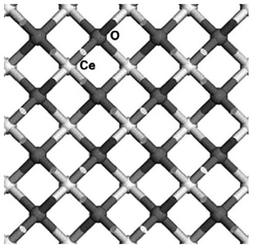
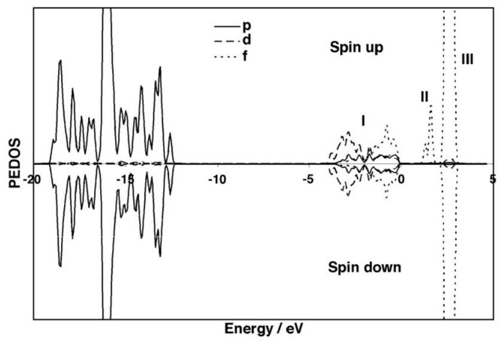
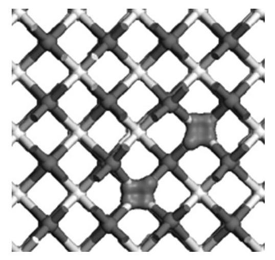
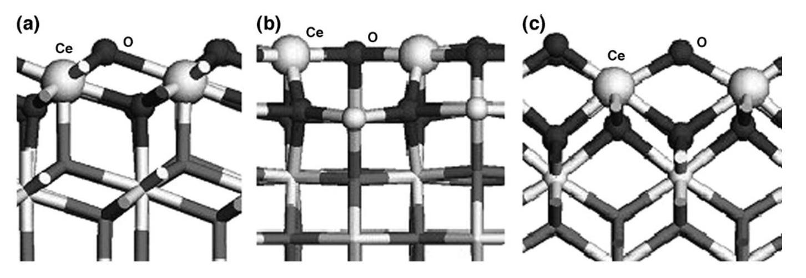
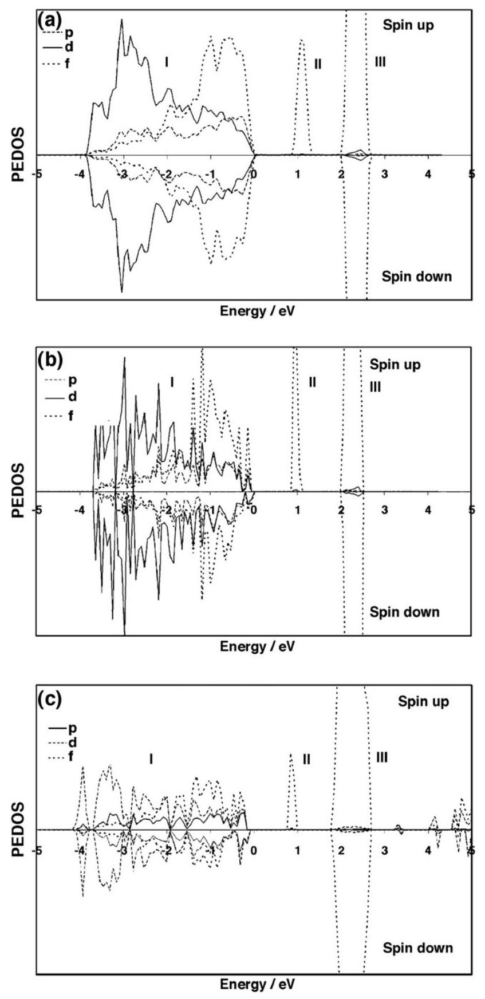
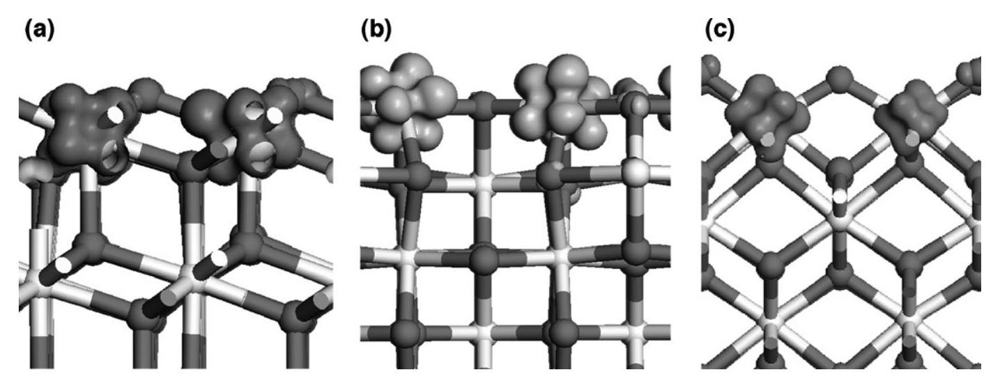
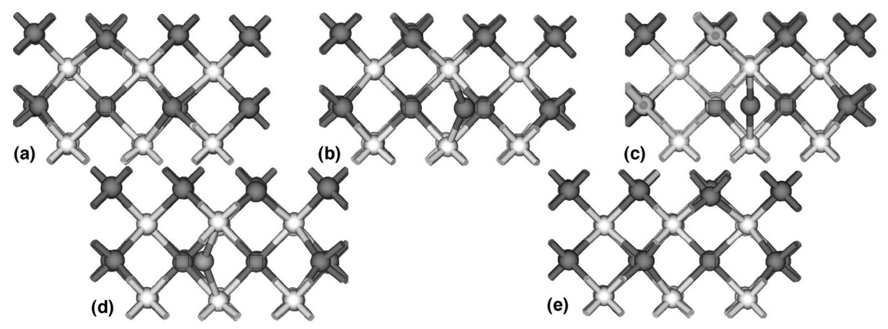
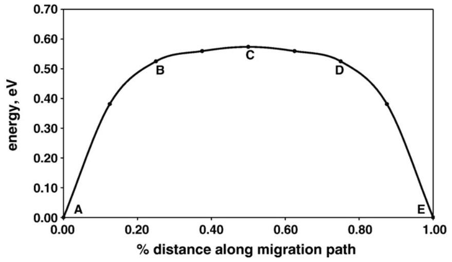

# Oxygen vacancy formation and migration in ceria 

Michael Nolan ${ }^{\mathrm{a}, \mathrm{b}}$, Joanne E. Fearon ${ }^{\mathrm{a}}$, Graeme W. Watson ${ }^{\mathrm{a}, *}$ ${ }^{\mathrm{a}}$ School of Chemistry, University of Dublin, Trinity College Dublin, Dublin 2, Ireland ${ }^{\mathrm{b}}$ Tyndall National Institute, Lee Maltings, Prospect Row, Cork, Ireland

Received 6 May 2006; received in revised form 17 July 2006; accepted 31 July 2006

#### Abstract

Applications of ceria, $\mathrm{CeO}_{2}$ in catalysis and solid oxide fuel cells arise from the relative ease with which oxygen vacancies are formed, producing reactive sites or facilitating ionic diffusion. In this paper, we consider modelling oxygen vacancies in bulk ceria and on the low index surfaces, as well as oxygen vacancy migration in bulk. We apply density functional theory (DFT), corrected for on-site Coulomb interactions, $\mathrm{DFT}+U$, since DFT is unable to describe correctly the electronic structure of defective ceria. We obtain a description of oxygen vacancies consistent with experiment, with localisation of charge on the Ce ions neighbouring the vacancy site. Confirming classical interatomic potential results, the oxygen vacancy formation energy in reduced on surfaces compared to bulk. An elastic band approach is applied to the study of vacancy migration in bulk ceria, yielding a diffusion path and energy barrier which are compared with previous studies.

© 2006 Elsevier B.V. All rights reserved.

Keywords: Ceria; $\mathrm{CeO}_{2}$; Surface; Bulk; Vacancy; Diffusion; Migration; 100; 111; 110; DFT+U, elastic band

## 1. Introduction

Two major applications of ceria are in catalysis [1] and solid oxide fuel cells [2]. This interest arises since the reduction of ceria through formation of neutral oxygen vacancies is relatively facile. Using Kroger-Vink notation, we can write the vacancy formation reaction as $\mathrm{O}_{\mathrm{o}}^{x}+2 \mathrm{Ce}_{\mathrm{Ce}}^{x} \rightarrow \mathrm{~V}_{\mathrm{o}}^{\bullet \bullet}+2 \mathrm{Ce}_{\mathrm{Ce}}{ }^{\prime \prime}+ 1 / 2 \mathrm{O}_{2}$. In this picture of defect formation, two electrons from the oxygen atom are transferred to two cerium ions neighbouring the vacancy site, so that these cerium ions are reduced from the +4 state to the +3 state. The importance of oxygen vacancies lies in the fact that after vacancy formation, reactive sites are present or oxygen vacancy migration is possible.

Given their importance, it is necessary to have an atomiclevel understanding of oxygen vacancies in ceria. Experimental data has demonstrated that partial reduction of ceria surfaces results in the presence of a new peak in the valence band photoemission spectrum (UPS) [3-5], which is taken to be due to the formation of $\mathrm{Ce}^{3+}$ ions, with a $\mathrm{Ce} 4 \mathrm{f}^{1}$ configuration. This gap state lies between the valence band and the unoccupied Ce

[^0]4f states. The origin of the gap state is important - does it arise from occupation a Ce 4 f states on each of the two Ce ions neighbouring the vacancy site (localisation) or from partial occupation of Ce 4 f states over all Ce ions in the surface (delocalisation)?

The diffusion of oxygen through ceria materials occurs via a vacancy hopping mechanism [6]. Several experimental studies

Fig. 1. Unit cell of bulk ceria. The Ce ions are the light spheres indicated with "Ce" and the oxygen ions are the dark spheres, indicated with "O".

Fig. 2. Ce PEDOS for one oxygen vacancy in bulk ceria from $\mathrm{DFT}+U$, with $U=5 \mathrm{eV}$.

Fig. 3. Excess spin density for one oxygen vacancy in bulk ceria from $\mathrm{DFT}+U$, with $U=5 \mathrm{eV}$.

have been reviewed previously [1] and the results for the activation energy for the diffusion range from 0.16 eV to 3.17 eV depending on the method, sample (single or polycrystalline) and exact stoichiometry. Interatomic potential (IP) studies of the energetics of oxygen vacancy formation and migration in bulk ceria have been presented [7,8], which have been rationalised on the basis of surface energies and structures
of the pure surfaces. Energy barriers for different vacancy migration paths have also been computed with IPs for doped ceria and with density functional theory (DFT) [9-12]. The IP and DFT calculations study simple migration along a line joining two nearest-neighbour oxygen sites for undoped and doped $\mathrm{CeO}_{2}$, the latter is not of interest for this work. With the DFT calculations, two different vacancy concentrations are considered in Ref. [11], those being $\mathrm{CeO}_{1.75}$ and $\mathrm{CeO}_{1.875}$. The calculated activation energy for vacancy migration decreases with decreasing vacancy concentration, being 1.08 eV and 0.78 eV respectively [11], while in Ref. [12], a vacancy migration energy of 0.46 eV is found.

While DFT is a useful computational tool for the study of material properties, its description of the electronic structure of reduced ceria has been shown to be inconsistent with experiment, in that no gap state between the valence band and the unoccupied $\mathrm{Ce} 4 f$ states is present $[13,14]$. Thus, a consistent treatment of pure and reduced ceria is needed. The DFT $+U$ methodology has been applied to partially reduced ceria by Fabris et al. [15] for bulk and Nolan et al. [16,17] for the (100) surface. DFT $+U$ corrects for the incorrect description of highly localised partially occupied $d$ and $f$ states in metal oxides by adding a correction for on-site Coulomb interactions; further details of $\mathrm{DFT}+U$ are discussed in [18]. The results of Refs. [15-17] have shown the superiority of DFT $+U$ to DFT for the description of reduced ceria.

In this paper we will present an analysis of oxygen vacancy defects in bulk ceria and the low index (111), (110) and (100) surfaces computed with $\mathrm{DFT}+U$, with particular interest in (i) the vacancy formation energy in bulk compared to the surfaces and (ii) oxygen vacancy migration, using an elastic band approach. Both aspects will be compared with previous IP and DFT studies, allowing for a validation of the earlier IP results.

## 2. Methods

All calculations presented herein were carried out with the VASP program [19]. The valence electronic states are expanded in a basis of plane waves. The strongly oscillating wavefunctions of the core electrons are represented using the projector augmented wave (PAW) approach. This is essentially an all-

Fig. 4. Front view of the defective surfaces, (a) (111) surface; (b) (110) surface, (c) (100) surface. The Ce ions are the light spheres, indicated with "Ce" and the oxygen ions are the dark spheres, indicated with " O ". $\mathrm{Ce}^{3+}$ ions are denoted by the large light spheres, the $\mathrm{Ce}^{4+}$ ions are the remaining lightly shaded spheres, and the oxygen ions in the surface and first subsurface layer are the darkly shaded spheres.

electron calculation with a frozen core [20], to describe the core-valence interaction; we use $[\mathrm{He}]$ and $[\mathrm{Xe}]$ cores for oxygen and cerium. The exchange correlation functional is the generalised gradient approximation, GGA, of Perdew and Wang, PW91 [21]. DFT $+U$ is chosen as our computational approach [17]. In a $\mathrm{DFT}+U$ calculation, the $U$ parameter is determined empirically and we have already described how the value of $U$ is fitted against experimental results of Refs. [3-5]. We set $U$ to 5 eV for all calculations [16,17].

The surfaces are represented as slabs within the 3-D periodic boundary conditions, and are separated from their images in the direction perpendicular to the surface by a $15 \AA$ vacuum gap. For the type 1 (111) surface a slab $10.5 \AA$ ( 12 atomic layers) thick is used, for the type 2 (110) surface a thickness of $11.5 \AA$ ( 7 atomic layers) is used and for the polar type $3(100)$ surface, we have a $10.94 \AA$ (9 layers) thick slab; convergence tests for slab thickness are presented in Ref. [16]. For the (111) and (100) surfaces, we use a $p(2 \times 2)$ expansion of the surface unit cell and for the (110) surface, we use a $p(2 \times 1)$ expansion. With four oxygen atoms terminating each surface, the introduction of one oxygen vacancy gives a vacancy concentration of $25 \%$; in [14], the same vacancy concentrations are found in the (111) and (110) surfaces. The cut-off energy for the plane wave basis is 500 eV and for sampling the Brillouin zone we use a $2 \times 2 \times 1$ Monkhorst Pack grid; sampling along the vector separating the slabs is not required. Oxygen vacancies are generated on both sides of the slab to ensure that the slab has no net dipole and all layers in the surface slabs are relaxed. The nudged elastic band method allows calculation of the minimum energy path for an atomic rearrangement. In this study the rearrangement in question is the diffusion of oxygen vacancies in the bulk ceria. The maximum of the diffusion energy profile gives the activation energy barrier to the diffusion. The method begins by defining a two point boundary conditions. These are the high symmetry vacancy sites determined using the standard plane wave DFT method. A chain of images (the elastic band) is then generated by linear interpolation between the two endpoints with a spring between each image and these intermediate images are optimised simultaneously with the constraint that they remain equidistant from each other. A $2 \times 2 \times 2$ unit cell with a single vacancy site is used within the DFT $+U$ methodology $\left(\mathrm{CeO}_{1.96}\right)$. The maximum forces on any atom were converged to $0.01 \mathrm{eV} \AA^{-1}$.

## 3. Results

### 3.1. Oxygen vacancy formation in bulk ceria and surfaces

A $(2 \times 2 \times 2)$ cell expansion of bulk ceria is shown in Fig. 1. Experimental studies of reduced ceria show that upon formation of oxygen vacancies in ceria surfaces, a new feature in the ultra violet photoemission spectrum (UPS) appears between the top of the valence band and the unoccupied $\mathrm{Ce} 4 f$ states [3-5]. This new state is due to the presence of reduced $\mathrm{Ce}^{3+}$ ions in which one electron populates a previously empty $\mathrm{Ce} 4 f$ state of each of the two Ce ions neighbouring the oxygen vacancy site. However, it has not been possible to definitively confirm this mechanism of oxygen vacancy formation.

We now consider the electronic structure through analysis of the atomic and angular momentum decomposed partial electronic density of states, PEDOS. In Fig. 2 we show the Ce PEDOS for $U=5 \mathrm{eV}$. For this value of $U$, a gap state is present (region II). This gap state lies between the top of the valence band (region I) and the unoccupied $\mathrm{Ce} 4 f$ manifold (region III). The offset from the valence band to the Ce 4f gap state is 1.64 eV , which has yet to be determined experimentally for bulk ceria. The spin density as a function of $U$ is shown in

Fig. 5. (a) Ce PEDOS for the defective (111) surface. (b) Ce $4 f$ PEDOS for the defective (110) surface. (c) Ce $4 f$ PEDOS for the defective (100) surface. In this figure, the PEDOS for region I is multiplied by 5 in order to allow the detailed PEDOS in this region to be more clearly seen.

Fig. 6. (a) Front view of the excess spin density for the gap state of the defective (111) surface; (b) front view of the charge density for the gap state of the defective (110) surface; (c) front view of the charge density of the gap state of the defective (100) surface. The contour values for the isosurfaces are 0.16 electrons $/ \AA^{3}$.

Fig. 3 and allows a determination of the origin of the gap state in Fig. 2. The spin density is presented as an isosurface, with a contour value of 0.16 electrons $/ \AA^{3}$. There is a localised spin density on the two Ce ions neighbouring the vacancy site, demonstrating reduction of these Ce atoms to $\mathrm{Ce}^{3+}$. An important feature of the spin density is that the isosurface takes the form of an $f$-function, which is what we expect since the gap state arises due to occupation of $\mathrm{Ce} 4 f$ states. The gap state forms a slight double peak, suggesting that the symmetry of the two $\mathrm{Ce}^{3+}$ ions is slightly broken upon vacancy formation.

The fully relaxed atomic structures of the ceria surfaces are displayed in Fig. 4(a),(b),(c). All reduced surfaces show distortions about the vacancy site, which is labeled with a "V" in Fig. 2(d),(e),(f), the $\mathrm{Ce}^{4+}$ ions are the small lightly shaded spheres. The details of the effect of vacancy formation on the surface structures have been discussed in Ref. [17].

In Fig. 5 we show the $\mathrm{Ce} 4 f$ partial electronic density of states (PEDOS) for the three defective surfaces. A new gap state between the top of the valence band (region I) and the unoccupied Ce $4 f$ band (region III) is present (region II) and is well separated from the valence and $\mathrm{Ce} 4 f$ bands. This result is consistent with the experimental UPS data of Refs. [3-5] which
show the presence of this gap state for reduced ceria and is in contrast to the description obtained with GGA-DFT [13,14,16] in which there is no gap state found between the top of the valence band and the bottom of the conduction band with the Fermi level crossing the Ce $4 f$ states, resulting in a metallic state.

Table 1
Surface energies (column 2), DFT $+U$ vacancy formation energies (column 3) and vacancy formation energies with interatomic-potentials (column 4)
| Structure | $E^{\text {surf }}$ | $E^{\text {vac }}(\mathrm{DFT}+U)$ | $E^{\text {vac }}(\mathrm{IP})$ |
| :--- | :--- | :--- | :--- |
| Bulk | - | +3.39 | +6.48 |
| $(111)$ | 0.68 | +2.60 | +2.71 |
| $(110)$ | 1.01 | +1.99 | -0.47 |
| $(100)$ | 1.41 | +2.27 | - |

The offset from the valence band to the gap state is 1.10 eV for the (111) surface, 1.00 eV for the (110) surface and 0.90 eV for the (100) surface. The available experimental offsets are 1.2 eV for the reduced (111) surface [3-5] and 2 eV for the reduced (110) surface [3-5]. Additionally, experimental determination of band offsets is complicated by the fact that

Fig. 7. Oxygen vacancy migration path studied for bulk ceria. (A) and (E) are the endpoints with the vacancy site marked with a box, □ , (B), (C) and (D) show the elastic band images. The corresponding energies are marked in Fig. 8.

Fig. 8. Energy barrier for vacancy migration in bulk ceria, following the path in Fig. 7.

in the UPS spectrum, this band, while being distinct, is quite broad. For all surfaces, the new gap state is due to occupation of Ce $4 f$ states. The question of the nature of these states is treated below.

The origin of the gap state is demonstrated through analysis of the spin density in Fig. 6. For each surface, spin is localised at the two cerium sites neighbouring the oxygen vacancy sites. This demonstrates the formation of reduced $\mathrm{Ce}^{3+}$ ions (with an electronic configuration $4 f^{1}$ ) on those Ce atoms neighbouring the oxygen vacancy sites in the surface. Again, these findings are consistent with experimental results and bulk $\mathrm{CeO}_{2}$.

## 3.2. $\mathrm{DFT}+U$ energetics of vacancy formation in $\mathrm{CeO}_{2}$

Of great interest are the energetics of vacancy formation for partial reduction of ceria. The favourablilty of oxygen vacancy formation compared to e.g. MgO makes ceria an attractive material in catalysis and fuel cells. Experimental observations suggest that ceria surfaces are more reactive than bulk and IP calculations seek to explain this by postulating that oxygen vacancy formation is easier on ceria surfaces compared to bulk [7,8]. Ab initio data on these aspects of oxygen vacancy formation would provide confirmation of the IP results as well as providing insights into experimental observations.

To study these aspects of $\mathrm{CeO}_{2}$ reduction, we firstly compare the vacancy formation energies of bulk ceria and the three low index surfaces in Table 1; these energies are obtained for the reaction $\mathrm{CeO}_{2} \rightarrow \mathrm{CeO}_{2-x}+1 / 2 \mathrm{O}_{2}$ for $U=5 \mathrm{eV}$, allowing comparison of the effect of bulk against surface on the vacancy formation energies with a consistent $a b$ initio approach.

The important result from Table 1 is that oxygen vacancy formation in bulk ceria is less favourable than in the surfaces, confirming the result found in interatomic potential (IP) calculations [7,8]. The difference in the formation energies from the present calculations is notably smaller than in the IP calculations of [6,7]. The results of both sets of calculations are consistent with experimental observations that ceria surfaces are more reactive than bulk. For vacancy migration, the vacancy formation energy is not so informative, since the migration process will be influenced by aspects not connected to the energy required to form the vacancy in the first place and the
next section considers the migration of an oxygen vacancy in bulk ceria.

### 3.3. Oxygen vacancy migration

Fig. 7 shows the diffusion pathway of the vacancy in ceria and Fig. 8 plots the activation energy as a function of the distance the vacancy has traveled along the migration path. The maximum corresponding to an activation energy occurs half way between the endpoints. Our value of 0.53 eV for this activation barrier is in very good agreement with a previous single crystal conductivity study with a similarly small number of vacancies ( $\mathrm{CeO}_{1.92}$ ) which obtained an activation energy 0.52 eV [22] although it is know that this is sensitive to the precise stoichiometry [23]. The previous DFT calculations [11,12] find concentration dependent migration energies of $0.46-1.08 \mathrm{eV}$, while in the IP study of Ref. [9] the migration energy is 0.60 eV . The value of the energy rises rapidly when the vacancy migrates a small amount from the lattice position but towards the centre of the path the energy changes are less dramatic. These elastic band calculations show that the minimum energy pathway is indeed the proposed straight line diffusion between two adjacent oxygen sites.

## 4. Conclusions

Oxygen vacancies in ceria are of great importance so that it is necessary to be able to consistently describe the nature of defective ceria, while for solid oxide fuel cells, a description of the vacancy migration process is also important. In the present work we have investigated the electronic structure of defective ceria bulk and surfaces using DFT $+U$. We have shown the difference between bulk and surface oxygen vacancy formation energies and have considered the oxygen vacancy migration process using a consistent first principles approach.

## Acknowledgements

We acknowledge support for this work from the Donors of the Petroleum Research Fund administered by the American Chemical Society, Science Foundation Ireland (grant numbers 04/BR/C0216 (M.N.) and 05/CE0035 (J.F.)). We also acknowledge the Trinity Centre for High Performance Computing and the IITAC program (PRTLI cycle III) for funding of and access to the TCHPC computational facilities.

## References

[1] A. Trovarelli, Catalysis by Ceria and Related Materials, Imperial College Press, UK, 2002.
[2] B.C.H. Steele, A. Heinzel, Nature 404 (2001) 345.
[3] D.R. Mullins, P.V. Radanovich, S.H. Overbury, Surface Science 429 (1999) 186.
[4] D.R. Mullins, S.H. Overbury, D.R. Huntley, Surface Science 409 (1998) 307.
[5] M.A. Henderson, C.L. Perkins, M.H. Engelhard, S. Thevuthasan, C.H.F. Peden, Surface Science 526 (2003) 1.
[6] C.R.A. Catlow, Journal of the Chemical Society, Faraday Transactions 86 (8) (1990) 1167.
[7] T.X.T. Sayle, S.C. Parker, C.R.A. Catlow, Chemical Communications (1992) 977.
[8] J.C. Conesa, Surface Science 339 (1995) 337.
[9] G. Balducci, J. Kaspar, P. Fornasiero, M. Graziani, M.S. Islam, J.D. Gale, Journal of Physical Chemistry, B 101B (1997) 1750.
[10] G. Balducci, M.S. Islam, J. Kaspar, P. Fornasiero, M. Graziani, Chemistry of Materials 12 (2000) 677.
[11] C. Frayret, A. Villesuzanne, M. Pouchard, S. Mater, International Journal of Quantum Chemistry 101 (2005) 826.
[12] D.A. Andersson, S.I. Simak, N.V. Skorodumova, A. Abrikosov, B. Johansson, Proceedings of the National Academy of Sciences 103 (2006) 3518.
[13] N.V. Skorodumova, R. Ahuja, S.I. Simak, I.A. Abrikosov, B. Johansson, B.I. Lundqvist, Physical Review B 64 (2001) 115108.
[14] X.Z. Yang, T.K. Woo, M. Baudin, K. Hermansson, Journal of Chemical Physics 120 (2004) 7741.
[15] S. Fabris, S. de Gironcoli, S. Baroni, G. Vicario, G. Balducci, Physical Review B 71 (2005) 041102.
[16] M. Nolan, S. Grigoleit, D.C. Sayle, S.C. Parker, G.W. Watson, Surface Science 576 (2005) 217.
[17] M. Nolan, S.C. Parker, G.W. Watson, Surface Science 595 (2005) 223.
[18] V.I. Anisimov, J. Zaanen, O.K. Andersen, Physical Review B 44 (1991) 943; S.L. Dudarev, G.A. Botton, S.Y. Savrasov, C.J. Humphreys, A.P. Sutton, Physical Review B 57 (1998) 1505.
[19] G. Kresse, J. Hafner, Physical Review B 49 (1994) 14251; G. Kresse, J. Furthmüller, Computational Materials Science 6 (1996) 15.
[20] P.E. Blöchl, Physical Review B 50 (1994) 17953; D. Joubert, G. Kresse, Physical Review B 59 (1999) 1758.
[21] J.P. Perdew, in: P. Ziesche, H. Eschrig (Eds.), Electronic Structure of Solids '91, Akademie Verlag, Berlin, 1991.
[22] B.C.H. Steele, J.M. Floyd, Proceeding of British Ceramic Transactions 72 (1971) 55.
[23] A. Trovarelli, "Structural properties and nonstoichiometric behavior of $\mathrm{CeO}_{2}$ ", in Catalysis by Ceria and Related Materials, pp. 15-50, ISBN 1-86094-299-7.

[^0]:    * Corresponding author. Tel.: +353 16081357.

    E-mail address: watsong@tcd.ie (G.W. Watson).

