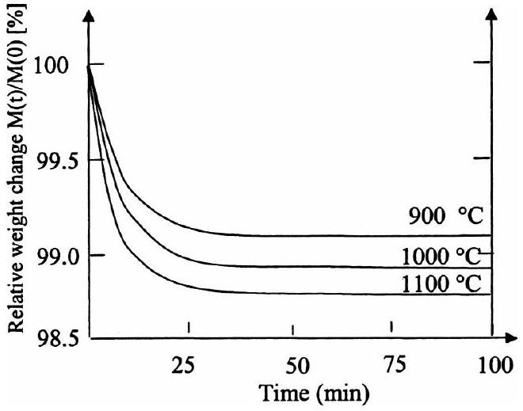
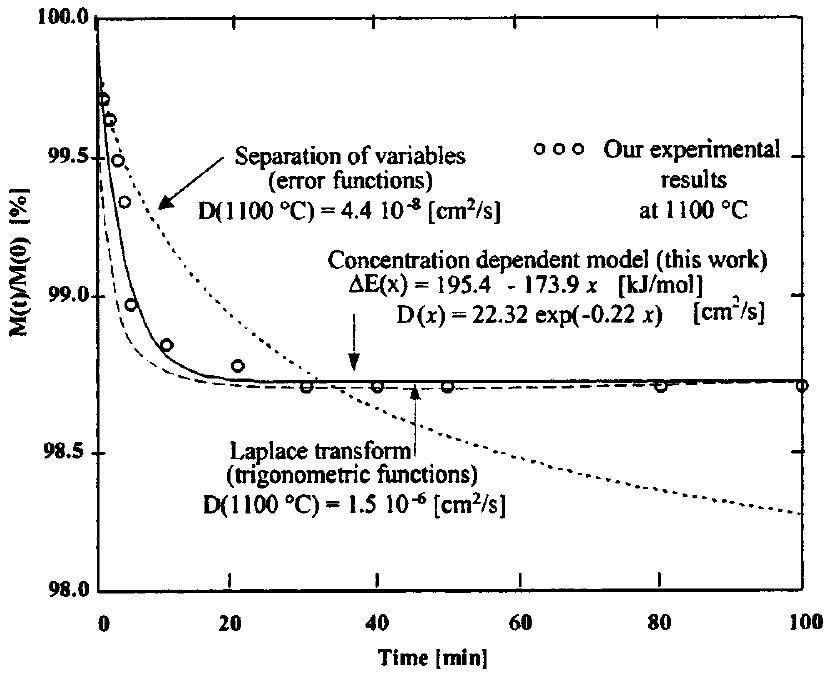
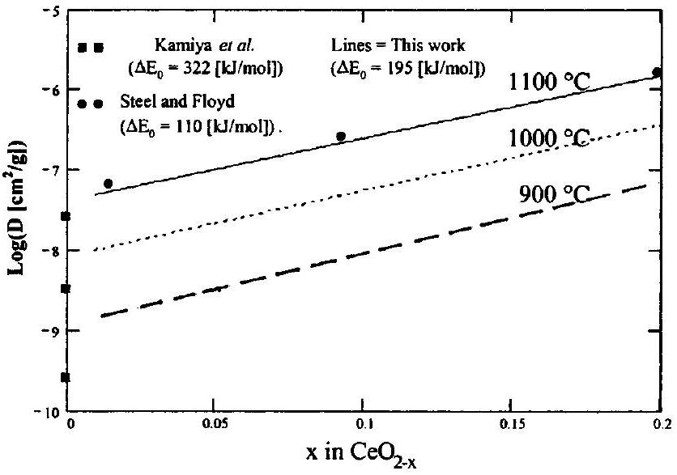

## Journal of Applied Physics

## RESEARCH ARTICLE | APRIL 012004

## Kinetics of oxygen removal from ceria

M. Stan; Y. T. Zhu; H. Jiang; D. P. Butt

Check for updates
J. Appl. Phys. 95, 3358-3361 (2004)
https://doi.org/10.1063/1.1650890

## Articles You May Be Interested In

Distinguishibility of oxygen desorption from the surface region with mobility dominant effects in nanocrystalline ceria films
J. Appl. Phys. (November 2004)

Higher ionic conductive ceria-based electrolytes for solid oxide fuel cells
Appl. Phys. Lett. (October 2007)
Density-functional calculation of Ce O 2 surfaces and prediction of effects of oxygen partial pressure and temperature on stabilities
J. Chem. Phys. (August 2005)

# Kinetics of oxygen removal from ceria 

M. Stan, ${ }^{\text {a) }}$ Y. T. Zhu, and H. Jiang Materials Science and Technology Division, Los Alamos National Laboratory, Los Alamos, New Mexico 87544 D. P. Butt Department of Materials Science and Engineering, University of Florida, 206 Rhines Hall, P.O. Box 116400, Gainesville, Florida 32611-6400

(Received 31 October 2003; accepted 5 January 2004)

#### Abstract

The kinetics of oxygen removal from $\mathrm{CeO}_{2}$ were investigated using thermogravimetric analysis, at high temperatures, under a reducing atmosphere of $\mathrm{Ar}-6 \% \mathrm{H}_{2}$. A chemical diffusivity model was developed that takes into account the composition dependence of both the pre-exponential factor and the activation energy. In this model, the pre-exponential factor is given by $D_{0} =22.32 \exp (-0.22 x)\left(\mathrm{cm}^{2} / \mathrm{s}\right)$, and the activation energy is $\Delta E=195.4-173.9 x(\mathrm{~kJ} / \mathrm{mol})$, where $x$ is the nonstoichiometry coefficient in $\mathrm{CeO}_{2-x}$. The model describes well the oxygen removal kinetics for the entire time range ( 100 min ), demonstrating its superiority over two popular mathematical models that can only fit part of the experimental data. © 2004 American Institute of Physics. [DOI: 10.1063/1.1650890]

## I. INTRODUCTION

Ceria is an essential component of automotive emission catalysts. ${ }^{1-3}$ It is capable of absorbing or releasing oxygen, maintaining the optimal stoichiometry. ${ }^{4}$ Ceria is also a basis for solid electrolytes. ${ }^{5,6}$ As an example, cerium oxide is part of multicomponent systems, such as $\mathrm{Ce}-\mathrm{Gd}-\mathrm{O}$, that are important for fuel cells. The oxygen transport in these systems is critical for improving the fuel cell performance ${ }^{7}$ and the diffusivity of oxygen determines the sintering behavior of ceria. ${ }^{8}$ Studies of polycrystalline $\mathrm{CeO}_{2-x}$ show that this material is a semiconductor at temperatures above $650^{\circ} \mathrm{C}$. The temperature and oxygen pressure also determine electrical properties, such as electrical conductivity. ${ }^{9}$ Ceria is also often used as a surrogate material for studies of thermochemical properties of actinide based oxides. For example, $\mathrm{PuO}_{2}$ is an important component of the fuel for nuclear reactors. Plutonia is difficult to experiment with, being toxic and radioactive. When heated at high temperatures in a reducing atmosphere, both oxides lose oxygen and become substoichiometric in a similar fashion and form isostructural compounds. ${ }^{10}$

Ceria has a $F m 3 m$ fluorite structure, with a lattice parameter $a=5.411 \AA .^{11}$ As shown in early studies by Bevan and Kordis, ${ }^{12}$ ceria has a wide range of nonstoichiometry, determined by temperature and oxygen pressure. Recently, Mogensen reviewed the physical and chemical properties of pure and doped ceria. ${ }^{13}$ As with most of the nonstoichiometric oxides, the thermochemical properties are directly influenced by the type and concentration of point defects. ${ }^{14,15}$

The reduction of $\mathrm{CeO}_{2}$ by hydrogen has been studied from room temperature to $1200^{\circ} \mathrm{C}$ by several complementary techniques. ${ }^{16-19}$ The reduction usually results in a stabilized state with the formal composition $\mathrm{CeO}_{1.83}$, but thermal

[^0]treatments at temperatures higher than $720^{\circ} \mathrm{C}$ can reduce the ceria further. Thermogravimetic analysis (TGA) was used to study the oxidation kinetics of nanoparticles, such as nickel, ${ }^{20,21}$ and will be a good technique for studying the reduction of $\mathrm{CeO}_{2}$.

Mathematical solutions of the Fick's diffusion equations for various geometries and boundary conditions have been published by Crank ${ }^{22}$ and by Carslaw and Jaeger ${ }^{23}$ (for the equivalent heat transfer problem). For the case of constant diffusivity, the Laplace transform method leads to a solution consisting of an infinite sum of error functions. ${ }^{24}$ The solution is good for relatively short diffusion times. The separation of variables method produces a solution in the form of an infinite sum of trigonometric functions. ${ }^{25}$ This solution describes well changes in concentration at long times. For concentration dependent diffusivity, Boltzmann ${ }^{26}$ introduced a similarity variable and Matano ${ }^{27}$ proposed the geometric conditions that define the Boltzmann-Matano solution. However, the model imposes geometric restrictions that make it difficult to use for the ceria reduction problem in this study. Butt and Wallace ${ }^{28}$ used a temperature and concentration dependent diffusivity model to describe diffusion and vaporization in groups 4 and 5 transition metal carbides.

In this work, TGA is used to study the oxygen reduction kinetics. The oxygen chemical diffusivity is determined by modeling the oxygen removal kinetics from the $\mathrm{CeO}_{2}$ powder samples. It is known that the diffusion coefficient of ceria strongly depends on stoichiometry. ${ }^{29,30}$ The model takes into account the influence of temperature and nonstoichiometry ( $x$ in $\mathrm{CeO}_{2-x}$ ) on oxygen diffusivity. The proposed model is able to fit the experimental TGA data for both short and long diffusion times.

## II. EXPERIMENTAL PROCEDURE

The TGA device used in these studies was a Shimadzu TG-50. In each TGA experiment about 16 mg samples of
$\mathrm{CeO}_{2}$ powder from Johnson Matthey, were used, of specific density $7.132 \mathrm{~g} / \mathrm{cm}^{3}$. The average radius of the powder particles was $4 \mu \mathrm{~m}$, as determined by scanning electron microscopy. The reducing atmosphere consisted of a mixture of argon and $6 \mathrm{vol} \%$ hydrogen. The TGA furnace was purged for 2 h using the reducing gas mixture at a flow rate of 20 $\mathrm{cm}^{3} / \mathrm{min}$ before heating started. The sample was then rapidly heated at $40^{\circ} \mathrm{C} / \mathrm{min}$ and held at 900,1000 , or $1100^{\circ} \mathrm{C}$. From the TGA results, the relative weight change was calculated as the ratio of the time dependent weight to the weight measured at the time when the sample reached the experimental temperature.

As detailed in a previous publication, ${ }^{10}$ in this type of experiment the oxygen partial pressure in the atmosphere around the sample is fixed by the chemical reaction

$$
2 \mathrm{H}_{2}(g)+\mathrm{O}_{2}(g) \rightarrow 2 \mathrm{H}_{2} \mathrm{O}(g) .
$$

The concentration of oxygen in the atmosphere around the sample is orders of magnitude lower than the concentration of oxygen at the surfaces of $\mathrm{CeO}_{2}$ particles. This gradient of concentration is the driving force for the oxygen removal. By losing oxygen, $\mathrm{CeO}_{2}$ becomes substoichiometric

$$
\mathrm{CeO}_{2}+x \mathrm{H}_{2}(g) \rightarrow \mathrm{CeO}_{2-x}+x \mathrm{H}_{2} \mathrm{O}(g) .
$$

## III. MODELING

The models considered in this work apply to powder consisting of identical spheres of radius $R$. The radius does not change during the diffusion process. At high temperatures and low oxygen partial pressure, the oxygen diffuses by a two-step mechanism: diffusion towards the surface of the sphere followed by removal from the surface. The adsorption/desorption processes are not included in the model. Assuming the oxygen diffusion occurs only on the radial direction, the diffusion equation in spherical coordinates is

$$
\frac{\partial C(T, t, r)}{\partial t}=\nabla[D(T, C) C],
$$

where $D$ is the diffusion coefficient, $r$ is the space coordinate originating at the center of the sphere, $T$ is the temperature, $t$ is the time, and $C$ is the oxygen mass concentration (nondimensional). If $D$ has no radial dependence, the equation becomes

$$
\frac{\partial C(T, t, r)}{\partial t}=D(T)\left(\frac{\partial^{2} C}{\partial r^{2}}+\frac{2}{r} \frac{\partial C}{\partial r}\right) .
$$

The temperature dependence of the diffusion coefficient is taken to be of the Arrhenius type

$$
D(T)=D_{0} \exp \left(\frac{-\Delta E}{R T}\right),
$$

where $D_{0}$ is the pre-exponential factor and $\Delta E$ is the activation energy.

At $t=0$, the oxygen is assumed to be distributed homogeneously in each sphere, at a concentration $C_{0}$. The boundary conditions relate the rate of mass loss due to the oxygen
leaving the powder to the difference between the time dependent concentration at the surface of the sphere [ $C_{s}(t)$ ] and the final concentration ( $C_{f}$ ):

$$
\frac{d m(t)}{d t}=-4 \pi R^{2} \rho_{0} \alpha\left[C_{s}(t)-C_{f}\right],
$$

where $m(t)$ is the mass of the particle, $\rho_{0}$ is the density, and $\alpha$ is a parameter related to the rate of oxygen removal from the surface. The mass of the particle can be calculated at any moment in time by integrating the amount of oxygen diffused per unit surface area

$$
m(t)=\left(1-C_{0}\right) m_{0}+4 \pi \rho_{0} \int_{0}^{R} r^{2} C(t, r) d r
$$

where $m_{0}$ and the initial mass.

## Concentration dependent diffusivity model

The model proposed in this work takes into account the composition dependence of the chemical diffusivity. Experimental observations ${ }^{29,30}$ show that in nonstoichiometric ceria, the logarithm of the pre-exponential factor is linear in oxygen concentration, at each fixed temperature. That is consistent with the following form:

$$
D(x) \propto D_{0} \exp (-k x),
$$

where $D_{0}$ and $k$ are constants and $x$ is the nonstoichiometry coefficient in $\mathrm{CeO}_{2-x}$.

Changing the concentration and assuming Arrhenius behavior [Eq. (5)], a similar linearity was observed ${ }^{29,30}$ in the relationship between the term that plays the role of the activation energy and the composition

$$
\Delta E(x)=\Delta E_{0}-\mu x,
$$

where $\Delta E_{0}$ and $\mu$ are constants. Combining Eqs. (8) and (9), the following model of the diffusion coefficient is proposed:

$$
D(T, x)=D_{0} \exp (-k x) \exp \left(\frac{-\Delta E_{0}+\mu x}{R T}\right) .
$$

An equivalent form is

$$
D(T, x)=D_{0} \exp \left[-x\left(k-\frac{\mu}{R T}\right)\right] \exp \left(\frac{-\Delta E_{0}}{R T}\right) .
$$

The model is based on the observation of experimental result and aims at describing the chemical diffusion of oxygen from the ceria powder in a reducing atmosphere. The model is valid in a temperature range of ( $900-1100^{\circ} \mathrm{C}$ ) and a nonstoichiometry range $x \in[0.01-0.2]$. A full theoretical justification will be published in an upcoming article.

## IV. RESULTS AND DISCUSSION

Figure 1 shows a set of typical TGA weight change profile. As expected, the weight of the sample decreased faster at higher temperatures. The decrease in the weight of the sample was smooth and allowed for the tabulation of the values and time derivatives with a time step of 1 min . The zero for the time was set when the sample was fully equilibrated at the given temperature. The analysis of the TGA results does not include the transition period (10-15 min).

FIG. 1. The relative weight change of the TGA samples.

The molar mass of cerium ( $M_{\mathrm{Ce}}$ ) was taken to be $140.115 \mathrm{~g} / \mathrm{mol}$ while the molar mass of oxygen ( $M_{\mathrm{O}}$ ) is 16 $\mathrm{g} / \mathrm{mol}$. Since at $t=0$, the initial $\mathrm{O} / \mathrm{Ce}$ mole ratio for $\mathrm{CeO}_{2}$ is 2 , the initial concentration of oxygen ( $C_{0}$ ) was calculated using

$$
C_{0}=\frac{2 M_{\mathrm{O}}}{2 M_{\mathrm{O}}+M_{\mathrm{Ce}}}=18.6 \% .
$$

The average volume of individual particles of radius $R =4 \mu \mathrm{~m}$ is given by

$$
V=\frac{4 \pi R^{3}}{3}=2.681 \times 10^{-10} \mathrm{~cm}^{3} .
$$

And the calculated initial mass of each sphere of density $\rho_{0}=7.132\left(\mathrm{~g} / \mathrm{cm}^{3}\right)$ is

$$
m_{0}=\rho_{0} V=1.912 \times 10^{-9} \mathrm{~g} .
$$

The TGA experiments were run for 200 min and there was no significant change after 100 min . The final oxygen concentration was retrieved from the limit of the weight decrease, as given in Fig. 1. For example, at $1100^{\circ} \mathrm{C}$, the limit was $17.3 \%$. That is consistent with a final nonstoichiometry $x=0.136$.

An optimization procedure, based on the minimization of the standard deviation, was used to determine the optimal parameters of each model: separation of variables, Laplace transform, and the concentration dependent diffusivity model. The numerical solutions have been retrieved by the means of a program written in Mathcad ${ }^{31}$ and based on the conjugate gradient method. ${ }^{32,33}$

For the first two models, the diffusivity was taken to be concentration independent. The optimized value of the diffusivity was obtained solving for the Eq. (3), with the boundary conditions defined in Eq. (6), with $\alpha =5 \times 10^{-5} \mathrm{~cm} / \mathrm{min}$. The standard deviation (optimization target function) was calculated by comparing the experimental weight changes with the one predicted by each model through Eq. (7). The methods converged using no more than ten terms for the separation of variables solution and the long time regime (more than 30 min ) and six terms for the Laplace transform solution and the short time regime data (less than 5 min ). It was impossible to obtain values of the diffusion coefficient able to accurately fit the data in the en-

FIG. 2. Comparison of the experimental change in the relative weight change of the ceria sample at $1100^{\circ} \mathrm{C}$ and the three models discussed in the article ( $\alpha=5 \times 10^{-5} \mathrm{~cm} / \mathrm{min}$ ).

tire time domain. This was expected since the diffusion coefficient of ceria strongly depends on stoichiometry. ${ }^{29,30}$

In the case of the concentration dependent diffusivity model proposed in this work [Eq. (10)], the optimization of the $\alpha, k, \Delta E_{0}$, and $\mu$ parameters was performed by numerically solving Eq. (3) with the boundary conditions defined in Eq. (6). The target function was built using Eq. (7) and the experimental TGA results. The optimized pre-exponential factor was $D_{0}=22.32 \exp (-0.22 x)\left(\mathrm{cm}^{2} / \mathrm{s}\right)$, and the optimized activation energy was $\Delta E=195.4-173.9 x(\mathrm{~kJ} / \mathrm{mol})$, with $\alpha=5 \times 10^{-5} \mathrm{~cm} / \mathrm{min}$.

Figure 2 shows the relative mass change of the sample at $1100^{\circ} \mathrm{C}$ and the predictions of the three models described earlier. As expected, the model resulted from the separation of variables method fitted data well for short times. However, extrapolating the solution to long diffusion times led to wrong values, missing completely the weight change limit. Adding more terms to the solutions brought the predicted weight change limit closer to the experimental one but did not improve significantly the prediction at the short times. The model resulted from the Laplace transform method produced better results at long diffusion times but did not work as well for short times. In contrast, the concentration dependent diffusivity model proposed in this work provided the best fit of the experimental values on the entire time domain.

The parameters of the model proposed in this work are consistent with previously reported values. Figure 3 shows the diffusivity dependence on nonstoichiometry, for several temperatures. The predictions at $1100^{\circ} \mathrm{C}$ are close to the data reported by Steel and Floyd. ${ }^{30}$ At $x=0$ (stoichiometric ceria), the predictions are significantly different from the values published by Kamiya et al. ${ }^{29}$ and slightly different from the value given by Steel and Floyd. This is not surprising, considering the fact that the transition period of $10-15 \mathrm{~min}$, which was excluded from this analysis, was sufficiently long to allow ceria to become nonstoichiometric. It is likely that the initial concentration in the particles was not the one given in Eq. (11), but a lower one.

FIG. 3. Comparison of the diffusivity dependence on nonstoichiometry, according to the model proposed in this article, and experimental results reported in literature by Kamiya et al. (see Ref. 29) and by Steel and Floyd (see Ref. 30).

The model proposed in this article is only intended to provide a better working relationship for the chemical diffusivity of oxygen in ceria for temperatures between 900 and $1100^{\circ} \mathrm{C}$ and nonstoichiometry in the ( $0.01,0.2$ ) domain. We are currently refining the model to include the size distribution of the particles, sintered conglomerates, the dynamics of the radius and density changes with time, and to accommodate different diffusion mechanisms.

## V. SUMMARY

We studied by TGA the diffusion of oxygen in a $\mathrm{CeO}_{2}$ powder at 900,1000 , and $1100^{\circ} \mathrm{C}$, in a reducing atmosphere of $\mathrm{Ar}-6 \% \mathrm{H}_{2}$. The numerical solution of the equation of oxygen diffusion through $\mathrm{CeO}_{2-x}$ spherical particles provided a good fitting of the TGA results, for both short and long diffusion times. The best fit of experimental values was obtained for a pre-exponential factor $D_{0} =22.32 \exp (-0.22 x)\left(\mathrm{cm}^{2} / \mathrm{s}\right), \quad$ activation energy $\Delta E=195.4-173.9 x(\mathrm{~kJ} / \mathrm{mol}), \quad$ and $\quad \alpha=5 \times 10^{-5} \mathrm{~cm} / \mathrm{min}$. The model shows that the chemical diffusivity of oxygen in ceria strongly depends on temperature and stoichiometry. The model is consistent with data reported in literature.
${ }^{1}$ A. Trovarelli, M. Boaro, E. Rocchini, C. De Leitenburg, and G. Dolcetti, J. Alloys Compd. 323, 584 (2001).
${ }^{2}$ A. Trovarelli, C. De Leitenburg, M. Boaro, and G. Dolcetti, Catal. Today 50, 353 (1999).
${ }^{3}$ A. Trovarelli, Catal. Rev. 38, 439 (1996).
${ }^{4}$ D. Terribile, J. Llorca, M. Boaro, C. De Leitenburg, G. Dolcetti, and A. Trovarelli, Chem. Commun. (Cambridge) No.17, 1897 (1998).
${ }^{5}$ H. Inaba and H. Tagawa, Solid State Ionics 83, 1 (1996).
${ }^{6}$ M. Mogensen, S. Primdahl, M. J. Jorgensen, and C. Bagger, J. Electroceram. 5, 141 (2000).
${ }^{7}$ B. C. H. Steele, J. Power Sources 49, 1 (1994).
${ }^{8}$ H. Inaba, T. Nakajima, and H. Tagawa, Solid State Ionics 106, 3 (1998).
${ }^{9}$ E. K. Chang and R. N. Blumenthal, J. Solid State Chem. 72, 330 (1988).
${ }^{10}$ M. Stan, T. J. Armstrong, D. P. Butt, T. C. Wallace, Y. S. Park, C. L. Haertling, T. Hartmann, and R. J. Hanrahan, J. Am. Ceram. Soc. 85, 2811 (2002).
${ }^{11}$ CRC Handbook of Chemistry and Physics (CRC Press., Boca Raton, FL, 1992), Vol. 72.
${ }^{12}$ D. J. M. Bevan and J. Kordis, J. Inorg. Nucl. Chem. 26, 1509 (1964).
${ }^{13}$ M. Mogensen, N. M. Sammes, and G. A. Tompsett, Solid State Ionics 129, 63 (2000).
${ }^{14}$ R. Dieckmann, J. Phys. Chem. Solids 59, 507 (1998).
${ }^{15}$ A. Nakamura, J. Nucl. Mater. 201, 17 (1993).
${ }^{16}$ V. Perrichon, A. Laachir, S. Abouarnadasse, O. Touret, and G. Blanchard, Appl. Catal., A 129, 69 (1995).
${ }^{17}$ V. Perrichon, A. Laachir, G. Bergeret, R. Frety, L. Tournayan, and O. Touret, J. Chem. Soc., Faraday Trans. 90, 773 (1994).
${ }^{18}$ A. Laachir et al., J. Chem. Soc., Faraday Trans. 87, 1601 (1991).
${ }^{19}$ C. Lamonier, G. Wrobel, and J. P. Bonnelle, J. Mater. Chem. 4, 1927 (1994).
${ }^{20}$ R. Karmhag, T. Tesfamichael, E. Wackelgard, A. Niklasson, and M. Nygren, Sol. Energy 68, 329 (2000).
${ }^{21}$ R. Karmhag, G. A. Niklasson, and M. Nygren, J. Appl. Phys. 89, 3012 (2001).
${ }^{22}$ J. Crank, The Mathematics of Diffusion (Oxford University Press, Oxford, 1993).
${ }^{23}$ H. S. Carslaw and J. C. Jaeger, Conduction of Heat in Solids (Oxford University Press, Oxford, 1986).
${ }^{24}$ S. Goldstein, Z. Angew. Math. Mech. 12, 234 (1932).
${ }^{25}$ A. Newman, Trans. Am. Inst. Chem. Eng. 27, 203 (1931).
${ }^{26}$ L. Boltzmann, Ann. Phys. (Leipzig) 53, 959 (1894).
${ }^{27}$ C. Matano, Jpn. J. Phys. 8, 109 (1933).
${ }^{28}$ T. C. Wallace and D. P. Butt, The Chemistry of Transition Metal Carbides and Nitrides (Blackie Academic \& Professional), New York, 1995, pp. 53-90.
${ }^{29}$ M. Kamiya, E. Shimada, Y. Ikuma, M. Komatsu, and H. Haneda, J. Electrochem. Soc. 147, 1222 (2000).
${ }^{30}$ B. C. H. Steele and J. M. Floyd, Proc. Br. Ceram. Soc. 19, 55 (1971).
${ }^{31}$ Mathcad, v. 11 (MathSoft, 2003).
${ }^{32}$ M. R. Hestenes, Commun. ACM 18, 40 (1975).
${ }^{33}$ M. R. Hestenes and E. Stiefel, J. Res. Natl. Bur. Stand. 49, 409 (1952).

[^0]:    ${ }^{\text {a) }}$ Electronic mail: mastan@lanl.gov

