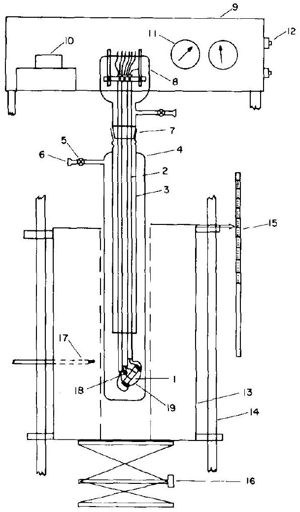
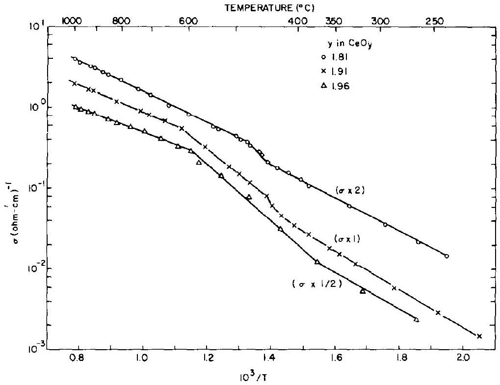
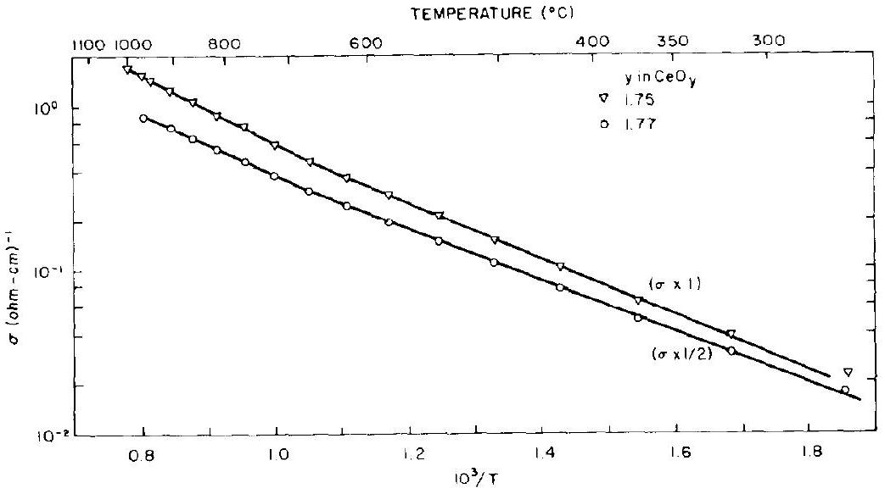
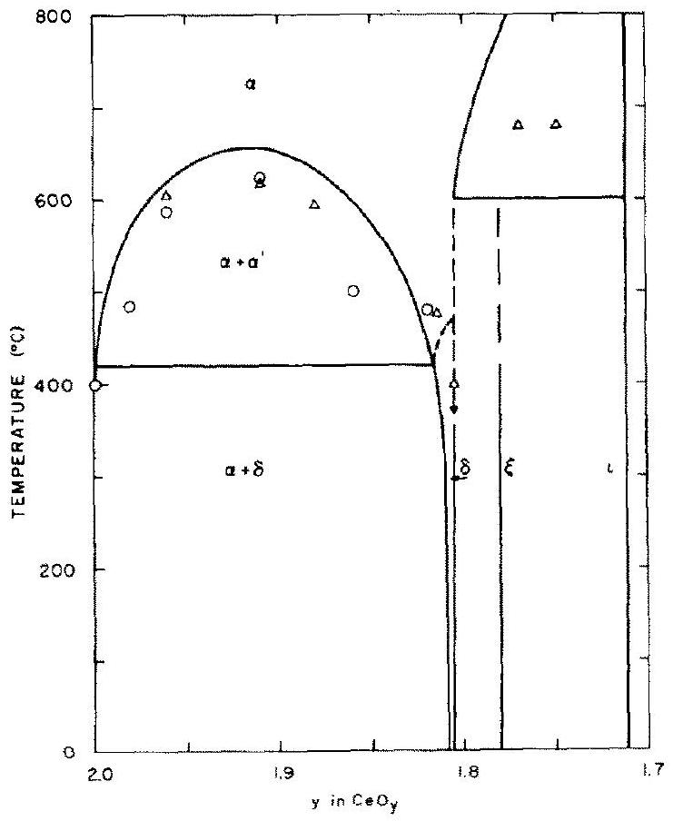
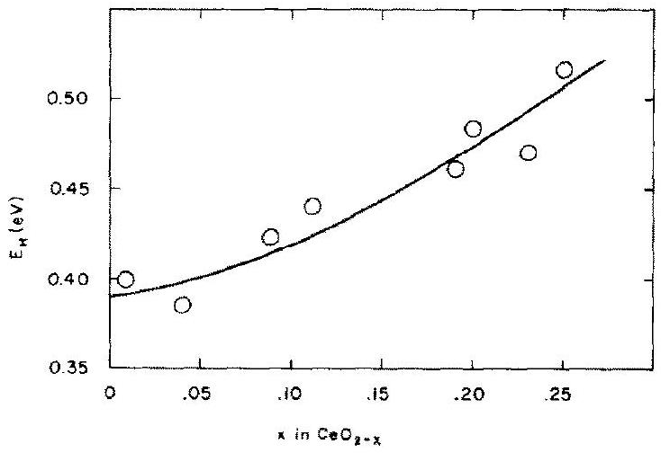
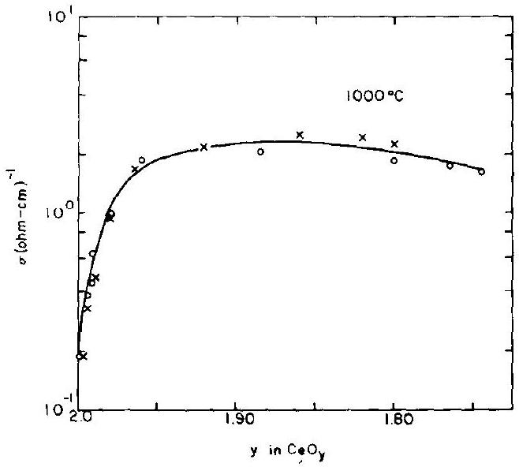
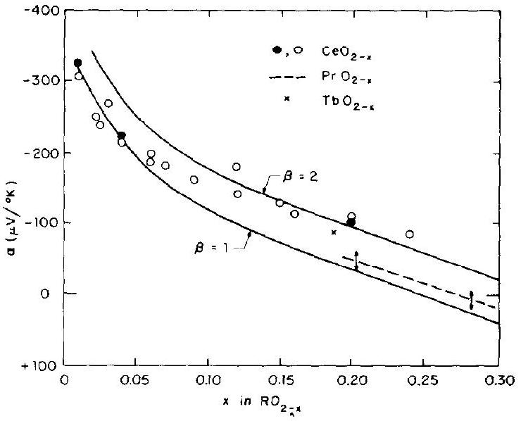
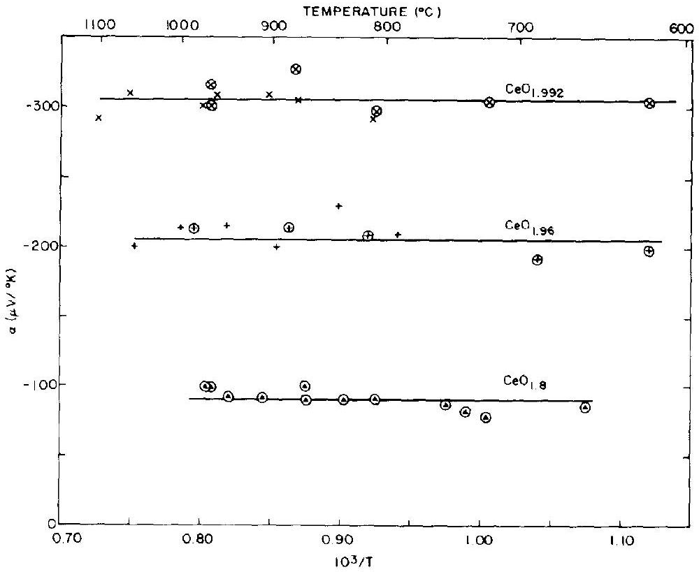

# SMALL POLARON ELECTRON TRANSPORT IN REDUCED $\mathrm{CeO}_{2}$ SINGLE CRYSTALS 

H. L. Tuller † and A. S. Nowick Hemy Krumb School of Mines, Columbia University, NY 10027, U.S.A.

(Received 30 September 1976; accepted in revised form 1 December 1976)

#### Abstract

An investigation of the electrical properties of reduced ceria, $\mathrm{CeO}_{2-x}$, carried out on single crystals, shows that $\mathrm{CeO}_{2-x}$ provides one of the clearest examples of hopping conduction and the small polaron mechanism. Included are conductivity and Seebeck coefficient measurements at constant $x$, obtained by sealing off the specimen chamber after reduction. The Seebeck coefficient is independent of temperature, suggesting that the number of carriers is constant. On the other hand, the mobility is activated, with activation energy $E_{H}=0.40 \mathrm{eV}$ at small $x$ and increasing to 0.52 eV at $x=0.25$. The results for the mobility preexponential are consistent with the adiabatic theory of small polaron behavior. A puzzling feature of the Secbeck data as a function of $x$ is that, for low $x$, the data fit the well-known Heikes formula, without a degeneracy factor of 2 for spin. Nevertheless, these data are interpreted to show that the proportion of mobile carriers decreases as $x$ increases, presumably because of the presence of short-range ordered configurations which immobilize some carriers.

## 1. INTRODUCTION

A small polaron is a defect created when an electronic carrier becomes trapped at a given site as a consequence of the displacement of adjacent atoms or ions. The entire defect (carrier plus distortion) then migrates by an activated hopping mechanism. Small polaron formation can take place in materials whose conduction electrons belong to incomplete inner ( $d$ or $f$ ) shells which, due to small electron overlap, tend to form extremely narrow bands. The possibility for the occurrence of hopping conductivity in certain low mobility semiconductors, especially oxides, has been widely recognized for some time, and a rather extensive theoretical literature has developed which considers the small polaron model and its consequences $[1-5]$. By contrast, however, experimental verification of hopping conduction in solids has been limited, and the assignment of the small polaron model to some systems has not stood the test of time. Thus, for example, NiO , which is one of the most widely studied low mobility materials, was for a time regarded as providing a good example of small polaron conduction. Later data forced a reevaluation, however, and it is now believed that, in $\mathrm{Li}^{+}$doped NiO , only electrons adjacent to $\mathrm{Li}^{+}$ions undergo true hopping[6,7]. Similarly, the analogous materials CoO and MnO also show somewhat borderline behavior[6, 8]. In fact, Appel in his review [4], after considering many of the transition metal oxides that have been studied, states that "in no case has d.c. hopping motion of small polarons been observed unambiguously." ‡

An interesting group of low mobility electronic con-

[^0]ductors are the nonstoichiometric oxides which have the fluorite structure, notably $\mathrm{PrO}_{2-x}, \mathrm{CeO}_{2-x}$ and $\mathrm{TbO}_{2-x}$. The composition of these oxides can be varied over a wide range of $x$ (from 0 to 0.5 ) by reduction, i.e. by controlling the oxygen partial pressure, $p_{\mathrm{O}_{2}}$, during equilibration. The removal of oxygen creates electrons as well as ionized oxygen vacancies, $V_{0}^{\prime \prime}$, in the lattice. From time to time, these materials have been discussed as possible small polaron conductors. Ceria has two advantages over the others: firstly, it offers the best opportunity to achieve the theoretically simple case of small $x$, where the number of electrons is small;§ secondly, the electronic structure is simple, because the $\mathrm{Ce}^{4+}$ ion in $\mathrm{CeO}_{2}$ has an empty $4 f$ shell which begins to be occupied only upon reduction. Blumenthal et al.[9, 10] have carried out two investigations of this system which indicate that hopping type conductivity does indeed take place. In the first investigation [9], they attempted to hold $x$ constant by purging the system with purified He gas, but found that the readings changed with time, and that it was therefore necessary to heat or cool relatively rapidly to avoid changes in composition. They reported an activation energy for hopping, $E_{H}$, of 0.22 eV at low $x$, which increases with increasing $x$ ! In the second paper[10], the conductivity was measured in equilibrium as a function of $p_{0_{2}}$ and compared with separately determined thermogravimetric data for $x$ vs $p_{02}$. They claim that this second method gives better results than the previous non-equilibrium method, and report a somewhat smaller value of $E_{H}=0.16 \mathrm{eV}$ at low $x$. The danger of error is great, however, because measurements from two different types of experiments are being combined, and because the thermogravimetric data are least reliable at low $x$, the range of greatest interest. Measurements of the Seebeck coefficient, which offer the opportunity to verify that the number of carriers is constant at constant $x$, have not been done for $\mathrm{CeO}_{2-x}$ (although they were done for $\mathrm{PrO}_{2-x}$ at higher $x$ values, and over a limited temperature range [11]).

In view of the great interest in the small polaron mechanism of conduction and the promise shown by $\mathrm{CeO}_{2}{ }_{x}$, it seemed that a more complete study of this system was needed. The present work attempts to carry out such a program, and is aimed at verifying the hopping mechanism and determining the relevant parameters more quantitatively. Since relatively large single crystals had become available, these were used instead of the polycrystalline sintered compacts of earlier work. It was also felt that the non-equilibrium method (i.e. holding $x$ constant), offered the best promise. We therefore sought to perfect this method by using a system which allowed nearly complete isolation of the sample after its reduction.

## 2. THEORY

The migration of a small polaron requires the hopping of both the electron and the polarized atomic configuration from one site to an adjacent one. For an f.c.c. lattice, the drift mobility takes the form

$$
\mu=(1-c) e a^{2} \Gamma / k T
$$

where $e$ is the electronic charge, $\underline{a}$ is the lattice parameter, and $k T$ has the usual meaning. The quantity $c$ is the fraction of sites which contain an electron, i.e.

$$
c=n / N
$$

where $n$ is the number of electrons and $N$ the number of available sites per unit volume. The quantity $\Gamma$ is the jump rate of the polaron from one site to a specific neighboring site, given by

$$
\Gamma=P \nu_{0} \exp \left(-E_{H} / k T\right)
$$

Here $\nu_{0}$ is the appropriate (optical mode) phonon frequency, $E_{H}$ the activation energy for hopping, and $P$ is a factor which gives the probability that the electron will transfer after the polarized configuration has moved to the adjacent site. In evaluating $P$, there are two cases $[2,3]$ to consider depending on the relative value of the electron transfer time, $t_{e l} \sim \hbar / J$, where $J$ is the electron transfer integral, and the time $t_{a r}$ which characterizes the transfer of the atomic polarization between adjacent sites. Specifically, in the adiabatic case, $t_{e l} \ll t_{a t}$ and $P \simeq 1$. On the other hand, for the non-adiabatic case, for which $t_{e l} \gg t_{a t}, P$ is $\ll 1$ and takes a form $P \propto J^{2} /(k T)^{1 / 2}$.

Since the conductivity, $\sigma$, is given by

$$
\sigma=n e \mu
$$

it can be written in the form

$$
\sigma=(A / T) \exp \left(-E_{H} / k T\right)
$$

where the factor $A$ in the pre-exponential is

$$
A=N P c(1-c) e^{2} a^{2} \nu_{0} / k .
$$

Strictly the form of eqn (5) is only valid for the adiabatic case, where $P=1$, since in the non-adiabatic case the factor $P$ brings in an additional temperature dependence such that the pre-exponential varies as $T^{-3 / 2}$ rather than $T^{-1}$. Similarly, for the mobility in the adiabatic case, we can write

$$
\mu=(B / T) \exp \left(-E_{H} / k T\right)
$$

with

$$
B=(1-c) e a^{2} \nu_{0} / k
$$

Because of the difficulty in making and interpreting Hall effect measurements on low mobility materials, thermoelectric data provide a valuable supplement to conductivity measurements. The Seebeck coefficient, $\alpha$, is defined as the open-circuit potential difference per unit temperature difference across a sample

$$
\alpha=-\left(V_{h}-V_{c}\right) /\left(T_{\mathrm{h}}-T_{c}\right)
$$

where the subscripts $h$ and $c$ refer to the hot and cold ends, respectively. In the case of a broad-band semiconductor, $\alpha$ is given by[12]

$$
\alpha= \pm \frac{k}{e}\left(\frac{E_{F}}{k T}+A\right)
$$

where $E_{F}$ is the Fermi energy measured relative to the transport level and $A$ is a dimensionless constant $\sim 2-4$, depending on the details of the scattering mechanism. In that case $\alpha$ shows a strong temperature dependence. For a hopping mechanism involving a fixed number of carriers, on the other hand, $\alpha$ can be calculated as $S^{*} / e$, where $S^{*}$ is the entropy transported per charge carrier. Under the assumptions that only one electron is permitted on a given site and that all other interaction effects are negligible, one readily obtains

$$
\alpha=-\frac{k}{e}\left\{\ln \beta\left(\frac{1-c}{c}\right)+\frac{S_{T}^{*}}{k}\right\} .
$$

Here $S_{T}^{*}$ is the vibrational entropy associated with the ions surrounding a polaron on a given site, and $\beta$ is a degeneracy factor, including both spin and orbital degeneracy of the electronic carrier. For the case of $\beta=1$, eqn (10) is often referred to as the "Heikes formula"[13]. However, various authors $[6,14]$ have suggested that $\beta=2$ as a consequence of spin degeneracy. Estimates of the $S_{t}^{*}$ term [5,15] indicate that it is small enough to be negligible, contributing only $\sim 10 \mu \mathrm{~V} /{ }^{\circ} \mathrm{K}$ to $\alpha$. If this is the case, eqn (10) predicts that $\alpha$ should be independent of temperature, and that it can be used to determine the number of carriers unambiguously, provided that $\beta$ is known.

It is interesting to note that eqn (10) predicts an $n \rightarrow p$ transition (i.e. a change of sign of $\alpha$ ) at high electron concentrations, namely (for $S_{T}^{*}=0$ ) when

$$
c=\beta /(1+\beta)
$$

i.e. at $c=1 / 2$ for $\beta=1$, or $c=2 / 3$ for $\beta=2$. At the higher values of $c(\geq 0.1)$, however, the situation can become complicated as a consequence of interaction effects which change the form of $\alpha$. Examples of such effects are given in a recent paper[14].

Still another complication is the possibility of a contribution from a second carrier, e.g. oxygen vacancies. In such cases, the general relation is[12]

$$
\alpha-\left(\alpha_{1} \sigma_{1}+\alpha_{2} \sigma_{2}\right) / \sigma_{2}
$$

where the subscripts 1 and 2 refer to the two different carriers and $\sigma_{\mathrm{t}}$ to the total conductivity.

## 3. EXPERIMENTAL METHODS

Crystals of ceria were grown for us by the Materials Research Corporation, using an arc fusion method. Single crystals as large as $1^{\prime \prime} \times \frac{1}{2}^{\prime \prime} \times \frac{1}{2}^{\prime \prime}$ were obtained from the arc melted product. The as-grown material was black, indicating nonstoichiometry. Upon oxidation at elevated temperatures the color changed to a pink-beige, but the crystals were not transparent. Nevertheless, X-ray Laue photographs were indicative of good single crystals.

Rectangular parallelopipeds were prepared by cleaving on (111) planes and cutting the sides with a diamond saw. The faces were then polished on fine emery paper. Final dimensions were $12 \times 5 \times 5 \mathrm{~mm}^{3}$. To make possible fourprobe measurements, leads consisting of very fine ( 5 mil) Pt wire were wrapped about the sample at equally spaced intervals, and the areas of contact between sample and wires were coated with several layers of fired-on Pt paste.

The apparatus shown in Fig. 1 was used to measure both the conductivity and Seebeck effect. The system was made leak tight by building it of quartz with as few joints as possible, and with special O-ring valves (5) which could hold a vacuum of $10^{-6}$ torr. (See the figure for numbered items.) The sample (1) was suspended by Pt leads brought into the chamber through a modified ionization gauge (8) and down to the sample through insulating alumina tubes (2). The lower region containing the sample was surrounded by a furnace (13), capable of attaining temperatures up to $1200^{\circ} \mathrm{C}$ with temperature control. The sample temperature was measured by a $\mathrm{Pt}-\mathrm{Pt}+10 \% \mathrm{Rh}$ thermocouple (18) placed close to the sample. The temperature gradient could be precisely and continuously varied by raising or lowering the furnace about the sample with the aid of a finely threaded scissor jack (16). The movement of the furnace was monitored on a calibrated scale (15) by following a pointer fastened to the furnace.
In order to carry out measurements at a fixed composition, it was first necessary to equilibrate the sample at elevated temperatures in a flowing stream of reducing gas ( $\mathrm{CO} / \mathrm{CO}_{2}$ mixture). Available equilibrium data[16,17] were used to determine the degree of reduction obtained for a given $\mathrm{CO} / \mathrm{CO}_{2}$ mixture and temperature; the sample was held under these conditions for $12-14 \mathrm{hr}$ to ensure attainment of equilibrium. Then the $\mathrm{CO} / \mathrm{CO}_{2}$ mixture was abruptly pumped out (for a period $\sim 30 \mathrm{sec}$ ) and the system sealed before dropping the temperature. (This

Fig. 1. Diagram of apparatus used to measure conductivity and Seebeck effect. Numbered items not mentioned in the text are: inner quartz envelope (3), outer quartz envelope (4), ball joint socket (6), quartz taper joint (7), electrical shield (chassis box) (9), electrometer head (10), switches (11), electrical feedthroughs (12), control thermocouple (17), and differential thermocouple (19).

procedure eliminated the problem of carbon deposition at lower temperatures.) With this technique, it was found that the sample could be kept at a fixed predetermined composition for several days (except when $x$ in $\mathrm{CeO}_{2-x}$ was less than 0.01 ).
D.c. conductivity measurements were made using a standard four-probe technique. The potential across the inner leads was measured at low current levels, using a Keithley 640 vibrating capacitor electrometer with an input impedance of $10^{16} \Omega$. A.c. conductivity measurements were also made using a Wayne-Kerr model B221A Universal Bridge with a low impedance adaptor. Generally, the a.c. and d.c. measurements gave almost identical results.
For the thermoelectric measurements, controlled temperature gradients across the sample were obtained by slowly raising or lowering the furnace; the maximum temperature difference, $\Delta T$, across the sample was kept to $\pm 3^{\circ} \mathrm{C}$, so as to ensure linearity in the $\Delta V$ vs $\Delta T$ plot. The temperature difference $\Delta T$ was measured by means of a differential thermocouple. In the earlier measurements, which we call method (a), the junctions of the thermocouple were placed adjacent to the ends of the sample but not touching (to avoid shorting out the potential difference $\Delta V$ ). It was shown that readings for $\Delta T$ obtained in this way were approximately $20 \%$ too
low. In later measurements, method (b), one electrode was connected directly to one end of the sample, while a thin strip of ceramic paper was used to insulate the second junction from the sample. Finally a second strip of paper was wrapped around this end of the sample plus the junction to insure good thermal contact. In both methods $\Delta V$ and $\Delta T$ were recorded simultaneously while the gradient was slowly varied at a rate $\mathrm{d} T / \mathrm{d} t \sim 0.2^{\circ} \mathrm{C} / \mathrm{min}$.

## 4. RESULTS

The electrical conductivity, $\sigma$, of a number of nonstoichiometric $\mathrm{CeO}_{2 x}$ single crystals has been measured as a function of temperature for several fixed compositions in the range between $\mathrm{CeO}_{1.992}$ and $\mathrm{CeO}_{1.75}$. In each case the sample was reduced to the desired composition and then sealed off to maintain constant com-
position, in the manner described in the previous section. Measurements were then carried out over the range of temperature from $200^{\circ}$ to $1150^{\circ} \mathrm{C}$. Some of the results are shown in Figs. 2 and 3. For samples in which $x$ (in $\mathrm{CeO}_{2-x}$ ) was greater than 0.08 , reproducible results for $\sigma$ vs $T$ could be obtained over a period of several weeks. Accordingly, measurements on such samples were made after equilibration at each temperature. For samples closer to stoichiometry, however, the results became more sensitive to time, indicating that relatively significant reoxidation was taking place within the apparatus. Consequently, a dynamical method was used for such samples whereby $\sigma$ was continuously recorded as the temperature was lowered or raised, in the manner of Blumenthal and Hofmaier [9]. However, the heating and cooling rates used here ( $\sim 10^{\circ} \mathrm{C} / \mathrm{min}$ ) were $\sim 1 / 10$ those of Blumenthal, thus ensuring better attainment of equilibrium.

Fig. 2. Electrical conductivity vs $T^{-1}$ of reduced ceria at three fixed compositions, $\mathrm{CeO},(y=2-x)$.

Fig. 3. Conductivity vs $T$ ' for two additional compositions.

Figure 2 shows that for $x<0.2$, the $\sigma$ vs $T$ curves show a steep region at intermediate temperatures bounded by two regions with smaller slopes. For $\mathrm{CeO}_{1.75}$ and $\mathrm{CeO}_{1.77}$, however, there are just two regions, with the higher temperature one showing the steeper slope (see Fig. 3). The temperature at which there is a change in slope varies with composition. In Fig. 4 the temperature of the

Fig. 4. Plot of the high temperature break points of the conductivity curves on the $\mathrm{Ce}-\mathrm{O}$ phase diagram, showing present data ( △ ) and earlier data from Ref. [9] (O).

first break in slope (as $T$ is decreased) is plotted as a function of composition, superimposed on the phase diagram of the $\mathrm{Ce}-\mathrm{O}$ system obtained in this range from X-ray data[18]. Also shown are the break points previously obtained by Blumenthal and Hofmaier for $x<$ 0.2 . The figure supports the suggestion of these authors that for $x<0.2$ the break in slope is related to the crossing from the single phase to the two-phase field. The agreement between the present data on single crystals and that of Blumenthal and Hofmaier on pressed powders is quite good where they overlap. In both cases, the points fall below the miscibility gap boundary as
determined by the X-ray measurements. The discrepancy was previously attributed to a failure to attain equilibrium [9], but this interpretation is no longer possible since our measurements at $\mathrm{CeO}_{1.91}$ and $\mathrm{CeO}_{1.88}$ were performed under equilibrium conditions. A sample at composition $\mathrm{CeO}_{1: 80}$ (not shown in Fig. 2) showed no break in slope at all, which samples reduced further (Fig. 3) showed different behavior, both in that the slope decreases at the break, and in the fact that the break temperature falls well within a two-phase field (Fig. 4).

From the data for $\sigma(T)$ in the high temperature region, above the break, it is possible to obtain the activation energy, $E_{H}$, of the conductivity by plotting log $\sigma T$ vs $1 / T$. The values obtained at various compositions are given in Table 1 and plotted as a function of $x$ in Fig. 5. This figure shows that $E_{H}$ begins at a value close to 0.4 eV at low $x$ and then increases with increasing $x$, especially above 0.1 . The present values for $E_{H}$ are substantially

Fig. 5. Variation of activation energy, $E_{H}$, from the high temperature region of the conductivity curve, with nonstoichiometry, $x$.

higher than those of Blumenthal and Hofmaier [9], presumably due to the better isolation of the reduced sample during the measurements. Table 1 also gives the pre-exponential factor, $A$, of the conductivity (see eqn 5 ), as well as other information which will be discussed later.
The variation of conductivity, $\sigma$, at a fixed temperature $\left(1000^{\circ} \mathrm{C}\right)$ is shown as a function of $x$ in Fig. 6. Also included are points for $x<0.01$ obtained by combining measurements of $\sigma$ vs $p_{\mathrm{o}_{2}}$ with thermogravimetric data ( $x$ vs $p_{\mathrm{O}_{2}}$ )[19]. Data of Blumenthal et al.[20] on polycrystalline samples are also included. The agreement

Table 1. Activation energy, effective number of carriers, and pre-exponentials, $A$ and $B$, of conductivity and mobility, respectively, as functions of $x$
| $x$ | $E_{H}$ (eV) | A ( $10^{5} \mathrm{~K} / \Omega \mathrm{cm}$ ) | c/2x | ne ( $10^{2} \mathrm{C} / \mathrm{cm}^{3}$ ) | $B /(1-2 x)$ ( $10^{2} \mathrm{~K} \mathrm{~cm}^{2} / \mathrm{V} \mathrm{s}$ ) | $\mu\left(1000^{\circ} \mathrm{C}\right)$ ( $10^{-3} \mathrm{~cm}^{2} / \mathrm{Vs}$ ) |
| :--- | :--- | :--- | :--- | :--- | :--- | :--- |
| 0.008 | 0.40 | 0.25 | 1 | 0.64 | 4.0 | 8.1 |
| 0.04 | 0.38, | 0.86 | 1 | 3.2 | 2.9 | 6.3 |
| 0.09 | 0.42 | 1.2 | 0.70 | 5.0 | 2.9 | 4.1 |
| 0.12 | 0.44 | 1.7 | 0.65 | 6.2 | 3.6 | 3.9 |
| 0.19 | 0.46 | 1.6 | 0.51 | 7.8 | 3.3 | 2.4 |
| 0.20 | 0.48 s | 2.0 | 0.52 | 8.3 | 4.0 | 2.3 |
| 0.23 | 0.46: | 1.7 | 0.48 | 8.8 | 3.6 | 2.2 |
| 0.25 | 0.52 | 2.3 | - | - | - | - |

Fig. 6. Conductivity at $1000^{\circ} \mathrm{C}$ as a function of nonstoichiometry, comparing present data $(\mathrm{O})$ with earlier data from Ref. [20] ( $\times$ ).

among all these measurements is very good, in showing that the curve of $\sigma$ vs $x$ increases rapidly up to $x \simeq 0.04$ and then undergoes a very broad flat maximum with the peak value near $x=0.1$.

In order to obtain direct information about the density of electronic carriers and whether it is independent of temperature for constant $x$, measurements of the Seebeck coefficient were carried out simultaneously with some of the conductivity measurements in the single phase (high temperature) region. The results are shown in Fig. 7. Here the circled points are those obtained in the earlier runs (method (a) in the previous section) while the other points are obtained after the modification to improve the technique (method (b)). The results show that the Seebeck coefficient, $\alpha$, is independent of temperature over the range studied (a factor of at least 1.5 in
the absolute temperature), thus confirming that the density of carriers is independent of temperature at constant $x$.

A composite presentation of data on the dependence of $\alpha$ on composition is given in Fig. 8. Included are not

Fig. 8. Seebeck coefficient of reduced fluorite type oxides, $\mathrm{RO}_{2-x}$, as a function of $x$, (after correction for contribution from Pt leads). Solid circles are from Fig. 7, while open circles are obtained by combining measurements on ceria at fixed $p_{\mathrm{O}_{2}}$ with thermogravimetric data. The data for $\mathrm{PrO}_{2-x}$ (dashed line, with vertical arrows showing the uncertainty in the data) and for $\mathrm{TbO}_{2-x}$ are from Refs. [11] and [21]. The solid curves are calculated from eqn (10) with $\beta=1$ and 2 , respectively.

only the 3 points obtained from Fig. 7, but also additional data obtained by the present authors[19] from measurement of $\alpha$ vs $p_{\mathrm{O}_{2}}$ as combined with thermogravimetric data for $x$ vs $p_{\mathrm{O}_{2}}$. Of the measurements shown for $\mathrm{CeO}_{2-x}$, the solid circles should be given greatest weight, since each of these points is derived

Fig. 7. Seebeck coefficient of reduced ceria as a function of $T^{-1}$ for three compositions. Circled points are obtained by method (a) and are multiplied by a correction factor of 1.2, while uncircled points are obtained by method (b).

from a complete curve, for a fixed value of $x$. Also included in Fig. 8 for comparison are data of other investigations $[11,21]$ on the analogous systems $\mathrm{PrO}_{2 . x}$ and $\mathrm{TbO}_{2, x}$ mostly in the higher range of $x$. The values of $\alpha$ for $\mathrm{CeO}_{2 \cdots x}$ appear to fall higher than those for $\mathrm{PrO}_{2-x}$. Nevertheless both sets appear basically similar, since the CeO, data indicate that, if continued, they would cross the $\alpha=0$ axis near $x=0.35$, while the $\mathrm{PrO}_{2-x}$ data have been observed to cross this axis near $x=0.28$ and to continue on to large positive values at higher levels of reduction.

The two solid curves in Fig. 8, which are calculated from eqn (10), with $\beta=1$ and $\beta=2$ respectively, will be discussed in the next section.

## 5. DISCUSSION

From the present results, it appears as though we have in $\mathrm{CeO}_{2-x}$ one of the clearest examples of conduction by electronic hopping. The evidence may be summarized as follows:
(a) The low value of mobility, $\mu$ : In $\mathrm{CeO}_{2-x}$, at least for small $x$, the number of carriers is known from the value of $x$, i.e. taking two electrons per oxygen vacancy, $n=8 x / a^{3}$; we therefore can obtain values of $\mu$ unambiguously. Thus we find, for example, that $\mu \sim 4 \times 10^{-3} \mathrm{~cm}^{2} / \mathrm{V}$ s at $1000^{\circ} \mathrm{K}$. This value is much lower than the limiting value ( $-0.1 \mathrm{~cm}^{2} / \mathrm{V} \mathrm{s}$ ) usually taken[6] as the minimum value for band conduction.
(b) The independence of Seebeck coefficient on $T$ : As shown in Fig. 7, $\alpha$ is independent of $T$. This result agrees with the predictions of a hopping model with a fixed carrier concentration, eqn (10), and contrasts with a band model, which predicts a term which goes as $-1 / T$. The temperature range of the present measurements is sufficient to rule out such a dependence.
(c) Thermally activated $\sigma$ at constant $x$ : The present work shows that $\sigma$ is thermally activated with an energy $E_{H}$ which increases with increasing $x$ (Fig. 5), starting from a value of about 0.40 eV at small $x$. Since from (b), the concentration of carriers is independent of temperature in these experiments, $E_{H}$ is also the activation energy for the mobility, i.e. the hopping activation energy.
(d) Occurrence of an $n \rightarrow p$ transition near $\mathrm{CeO}_{1.70}$ : Although not directly observed in this work, the close similarity of the present results to those for $\mathrm{PrO}_{2-x}$ (Fig. 8), and the reversal of sign of $\alpha$ in the latter system at $\mathrm{PrO}_{1,72}$, strongly suggest that the same applies to $\mathrm{CeO}_{2-x}$. Such a result is expected for the hopping model, because for compositions approaching $\mathrm{R}_{2} \mathrm{O}_{3}$ (at which all available sites for electrons are filled), the carriers must be holes rather than electrons. From the viewpoint of the band model, on the other hand, no $n \rightarrow p$ transition is expected, since we would be dealing with an almost empty $4 f$ band over the entire range of composition. The fact that the $\mathrm{R}_{2} \mathrm{O}_{3}$ compounds are insulators [22] also indicates that the band model is not valid. These results

[^1]are all consistent with the expectation that the radius of the $4 f$ shell is sufficiently small that the electron is well confined to a single cation, i.e. there is no tendency toward hybridization with neighboring $\mathrm{O}^{2-}$ ions.
In view of the establishment of a hopping mechanism of conduction, it is next appropriate to ask whether the small polaron model applies here, since this is the model which is usually associated with hopping conductivity. The question, then, is whether the electron becomes localized by virtue of its interaction with phonons. In fact, upon formation of a single $\mathrm{Ce}^{3+}$ ion, there must be a lowering of energy due to relaxation of the neighboring $\mathrm{O}^{2-}$ ions. It is just this polarization, which serves to trap the electron in the localized configuration, that constitutes the small polaron. Since Anderson localization [5] is not expected for small defect concentrations, the only other reasonable alternative to either the band or small polaron models is the large polaron model, but this gives rise to band-like behavior, not to hopping $[4,6]$.

From these general considerations, we now turn to some of the more quantitative aspects of the hopping behavior which emerge from the present work. For this purpose, the Seebeck measurements are particularly helpful, since they yield information about the numbers of carriers, as distinct from the mobilities. From Fig. 8 we see that the data for $\alpha$ vs $x$ in the range of small $x$ fits very well to eqn (10) ${ }^{\dagger}$ with $\beta=1$ and $S_{\tau}^{*}=0$. This result is surprising, since an electronic carrier in this system undoubtedly takes the form of a $\mathrm{Ce}^{3+}$ ion, which has a single $4 f$ electron. The lowest state of a free $\mathrm{Ce}^{3+}$ ion is a ${ }^{2} F_{5 / 2}$, which has a degeneracy of 6 . (This state falls well below the next higher ${ }^{2} F_{7 / 2}$ state[23].) This degeneracy will be further split by a crystal field, but not, however, beyond a degeneracy of 2 (the so-called Kramers doublet). Thus, there is no reason to expect a degeneracy $\beta=1$.

One possible reason for this discrepancy might be a positive contribution, $\alpha_{i}$, to the Seebeck coefficient from ionic carriers, specifically, oxygen vacancies. This would give an overall $\alpha$ which is less negative than the electronic value $\alpha_{\varepsilon}$ alone (see eqn 11). In fact the present authors [19] have found that for very low $x\left(<10^{-3}\right)$ the Seebeck coefficient goes through a maximum negative value and eventually crosses the $\alpha=0$ axis to become positive (at $x \approx 10^{-5}$ ). It should be noted that this occurs in the range where $\sigma$ is predominantly ionic, $\sigma_{i}$, and is controlled by aliovalent cation impurities. For the present range of interest, $x>0.01$, however, the ionic component $\sigma_{i}$ must be primarily from vacancies related to nonstoichiometry. Under these conditions, knowing the respective activation energies, we estimate that $\sigma_{i} / \sigma \sim 0.03$. If we substitute a value $\alpha_{i} \sim 200-300 \mu \mathrm{~V} /{ }^{\circ} \mathrm{K}$ (based on recent Seebeck measurements on doped $\mathrm{CeO}_{2}$ [24]) into eqn (11), we anticipate a correction of only $\sim 10 \mu \mathrm{~V} /{ }^{\circ} \mathrm{K}$. Thus, the agreement of the data with the curve for $\beta=1$ and not $\beta=2$ in Fig. 8 remains unexplained. It is interesting, however, to note that Goodenough [15], in a study of the vanadium spinels, also obtains a good fit to the Heikes ( $\beta=1$ ) formula without adjustable parameters.

At higher $x(>0.1)$ the data of Fig. 8 show fair
agreement with the theoretical curve for $\beta=2$. This agreement cannot be taken too seriously, however, because of the large interaction effects at high $x$, which can substantially change the form of the $\alpha(x)$ curve [14]. Such interactions are indicated, for example, by the increase in $E_{H}$ with increasing $x$ (Fig. 5). It is, therefore, more reasonable to believe that the increase in $\alpha$ relative to the Heikes curve ( $\beta=1$ ) at higher $x$ is due to a decrease in the number of carriers. Such a decrease may be related to the type of local order prevalent in these structures, viz. the tendency to form chainlike configurations of oxygen vacancies along (111) directions of the fluorite structure. This ordering feature particularly characterizes the $\mathrm{Ce}_{7} \mathrm{O}_{12}$ structure, which is long-range ordered and very stable [23], but it may also be present as a basic unit of short-range order in the high temperature fluorite phase. We may then assume that some of the $\mathrm{Ce}^{3+}$ ions in reduced $\mathrm{CeO}_{2}$, particularly those which are situated between two oxygen vacancies, are immobilized. Such an idea was suggested earlier by Subba Rao et al.[21] in relation to their study of $\mathrm{PrO}_{2-x}$ and $\mathrm{TbO}_{2-x}$.

These considerations suggest that it is reasonable to obtain the ratio of the effective number of carriers, $n$, to the ideal number $8 x / a^{3}$ through the departure of the Seebeck coefficient $\alpha(x)$ from the value given by the Heikes formula, at each value of $x$. This ratio, which can be written as $c / 2 x$ (since $c=n / N$ ), can then be expected to decrease, from an initial value of unity, as $x$ increases. Column 4 of Table 1 gives the value of the ratio $c / 2 x$ calculated in this way, while column 5 gives the product ne. In order to obtain the preexponential constant, $B$, of the mobility, as given by eqn (8), we set the fraction of available sites, $1-c$, equal to $1-2 x$ since all sites occupied by an electron are unavailable whether or not the electron is mobile. Column 6 of Table 1 gives the quantity $B /(1-2 x)$ obtained from $A / \mathrm{ne}(1-2 x)$. The results show that this quantity is independent of $x$, within experimental error, over the entire range of $x$. (This conclusion is brought out even more strikingly by noting that the scatter in $B /(1-2 x)$ is generally consistent with the scatter of $E_{H}$ about the smooth curve drawn in Fig. 5.) It appears, then, that the geometry of the hopping process does not change with changing $x$; only the fraction of available sites changes. In the last column of Table 1, the mobility $\mu$ at $1000^{\circ} \mathrm{C}$ is given. According to the present considerations, the sharp decrease in $\mu$ with increasing $x$ is due to the combined effect of the increase in $E_{H}$ and the decrease in the number of available sites. Also, the increase in $E_{H}$, together with the decrease in number of carriers as $x$ increases, explains why $\sigma(x)$ is not a symmetrical function about $x=0.25$, as predicted from the preexponential factor alone (eqn 6), but gives a broad maximum shifted to lower $x$, as shown in Fig. 6.

From eqn (8) and the mean value $B /(1-2 x)= 3.5 \times 10^{2} \mathrm{~K} \mathrm{~cm}^{2} / \mathrm{Vs}$, we calculate the frequency factor $\nu_{0}$, and obtain $\nu_{0} \simeq 10^{13} \mathrm{sec}^{-1}$. This value is in good agreement with optical phonon frequencies, and therefore appears to support the adiabatic small polaron model (see the Theory section). In contrast, if the nonadiabatic model were applicable, the apparent frequency factor would be much smaller (since $P \ll 1$ ).

Finally, since the $\mathrm{Ce}-\mathrm{O}$ phase diagram shows an orderdisorder transformation at $\mathrm{CeO}_{1.81}$ near $450^{\circ} \mathrm{C}$, and since we have measured the conductivity as a function of temperature through this range, it is interesting to compare the values of $E_{H}$ above and below this transformation. Both in the data for $\mathrm{CeO}_{1,81}$ in Fig. 2 (which shows a slight jog indicating some two-phase separation) and in data for $\mathrm{CeO}_{1.80}$ (which shows no jog), we have observed the same activation energy, within experimental error, above and below the transformation temperature, $T_{c}$. The low-temperature ordered phase is a complex phase of low symmetry formed by vacancy ordering [26] while the high temperature phase is the fluorite structure with disordered vacancies. The result indicates that a high degree of short-range order must exist above $T_{c}$, so that the environment seen by a hopping electron is not much different in the ordered or disordered phases. In fact, the increase in $E_{H}$ with increasing $x$ (Fig. 5) can be attributed to such local order at the higher $x$-values, as well as to the increase in lattice parameter with increasing $x$ [18].

## 6. CONCLUSIONS

1. The system $\mathrm{CeO}_{2-x}$ provides perhaps the clearest case of small polaron hopping conductivity, with a relatively high value of $E_{H} \sim 0.4 \mathrm{eV}$.
2. The results are quite consistent with the adiabatic theory of small polaron behavior.
3. Data for Seebeck coefficient fit the Heikes formula, without the factor of 2 for spin, at low $x$ values; the reason for this is not yet apparent.
4. $\Lambda$ high degree of short-range order is present in the reduced fluorite phase at the higher values of $x$, and these locally ordered configurations serve to immobilize some of the carriers.

Acknowledgements-This work was supported initially by the Advanced Research Projects Agency and subsequently by the National Science Foundation under grants GH-34269 and DMR 75-09603. The authors are grateful to Drs. D. Adler, D. I. Paul, I. Nowik and D. Emin for helpful discussions.

## REFERENCES

1. Yamashita J. and Kurosawa T., J. Phys. Chem. Solids 5, 34 (1958).
2. Holstein T., Ann. Phys. (N.Y.) 8, 343 (1959).
3. Emin D. and Holstein T., Ann. Phys. (N.Y.) 53, 439 (1969).
4. Appel J., Solid State Phys. 21, 193 (1969).
5. Austin I. G. and Mott N. F., Adv. Phys. 18, 41 (1969).
6. Bosman A. J. and val Daal H. J., Adv. Phys. 19, 1 (1970).
7. Adler D., in Treatise on Solid State Chemistry (Edited by N. B. Hannay), Vol. 2. Plenum Press, New York (1975).
8. Bransky I. and Tallan N. M., in Physics of Electronic Ceramics (Edited by L. L. Hench and D. B. Dove), Part A. Marcel Dekker, New York (1971).
9. Blumenthal R. N. and Hofmaier R. L., J. Electrochem. Soc. 121, 126 (1974).
10. Blumenthal R. N. and Sharma R. K., J. Solid State Chem. 13, 360 (1975).
11. Honig J. M., Cella A. A. and Cornwell J. C., in Rare Earth Research II (Edited by K. S. Vorres), p. 255. Gordon \& Breach, New York (1964).
12. Joffe A. F., Physics of Semiconductors. Academic Press, New York (1960).
13. Heikes R. R., in Thermoelectricity (Edited by R. Heikes and R. Ure), Chap. 4. Interscience, New York (1961).
14. Chaikin P. M. and Beni G., Phys. Rev. 13, 647 (1976).
15. Goodenough J. B., Mat. Res. Bull. 5, 621 (1970).
16. Bevan D. J. M. and Kordis J., J. Inorg. Nucl. Chem. 26, 1509 (1964).
17. Panlener R. J., Blumenthal R. N. and Garnier J. E., J. Phys. Chem. Solids 36, 1213 (1975).
18. Brauer G., Gingerich K. A. and Holtzschmidt U., J. Inorg. Nucl. Chem. 16, 77, 87 (1960).
19. Tuller H. L. and Nowick A. S., to be published.
20. Blumenthal R. N., Lee K. W. and Panlener K. J., J. Electrochem. Soc. 118, 123 (1971).
21. Subba Rao G. B., Ramdas S., Mahrotra P. N. and Rao C. N. R., J. Solid State Chem. 2, 377 (1970).
22. Chandrashekhar G. V., Mehrotra P. N., Subba Rao G. V., Subbarao E. C. and Kao C. N. R., Trans. Farad. Soc. 63, 1295 (1967).
23. McClure D. S., Solid state Phys. 9, 400 (1959).
24. Wang D. Y., M.S. Thesis, Columbia University; to be pubished.
25. Ray S. P. and Cox D. E., J. Solid State Chem. 15, 333 (1975).
26. Ray S. P., Nowick A. S. and Cox D. E., J. Solid State Chem. 15, 344 (1975).
27. Belanger G., Destry J., Perluzzo G. and Raccah P. M., Can. J. Phys. 52, 2272 (1975).
28. Berkooz O., Malamud M. and Shtrikman S., Solid State Comm. 6, 185 (1968).
29. Endo K., Yamauchi S., Fueki K. and Mukaibo T., J. Solid State Chem. 19, 13 (1976).

[^0]:    ${ }^{\dagger}$ Present address: Department of Materials Science, M.I.T., Cambridge, MA 02139, U.S.A.
    ‡ Hopping conductivity is indicated, however, in some more complex systems involving transition[27] and rare earth ions [28, 29].
    § $\mathrm{PrO}_{2}$ and $\mathrm{TbO}_{2}$ depart more strongly from stoichiometry for a given $\mathrm{p}_{\mathrm{m}_{2}}$ and temperature than does $\mathrm{CeO}_{2}$.
    "Actually, this value should be higher (by $\sim 0.1 \mathrm{eV}$ ), since $E_{H}$ was obtained from a plot of $\log \sigma$ vs $1 / T$ instead of $\log \sigma T$ vs $1 / T$.

[^1]:    ${ }^{\dagger}$ In fitting eqn (10) we have taken $c=2 x$ based on the conclusion that the oxygen vacancies are doubly ionized, at least in the dilute (small $x$ ) range [19].

