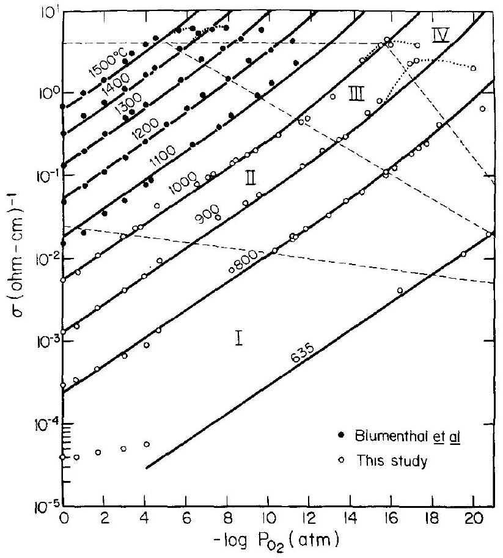
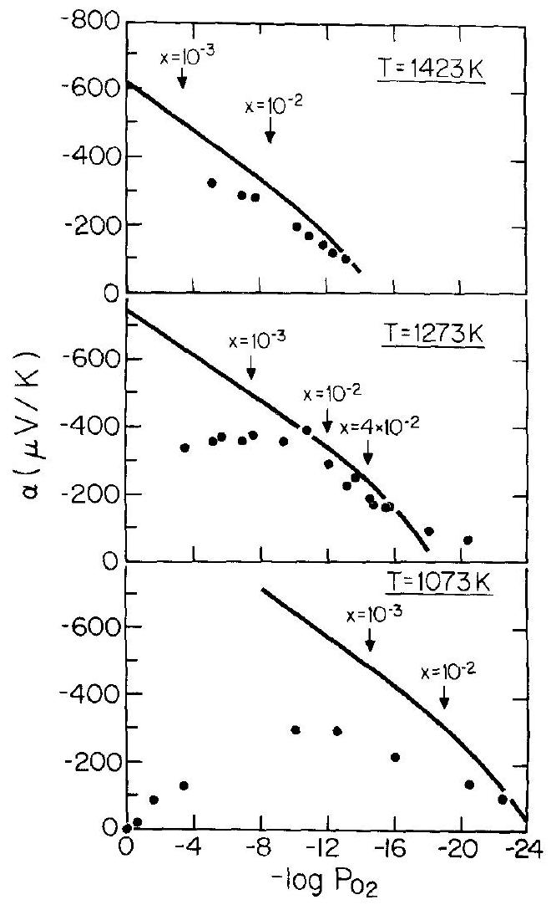
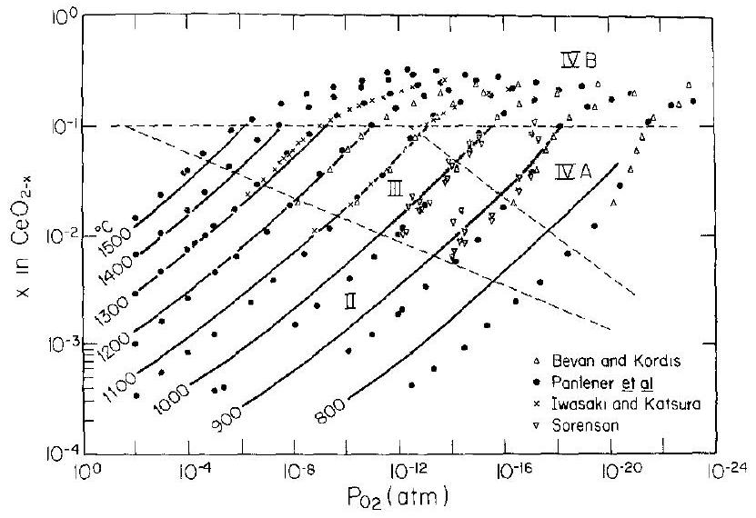
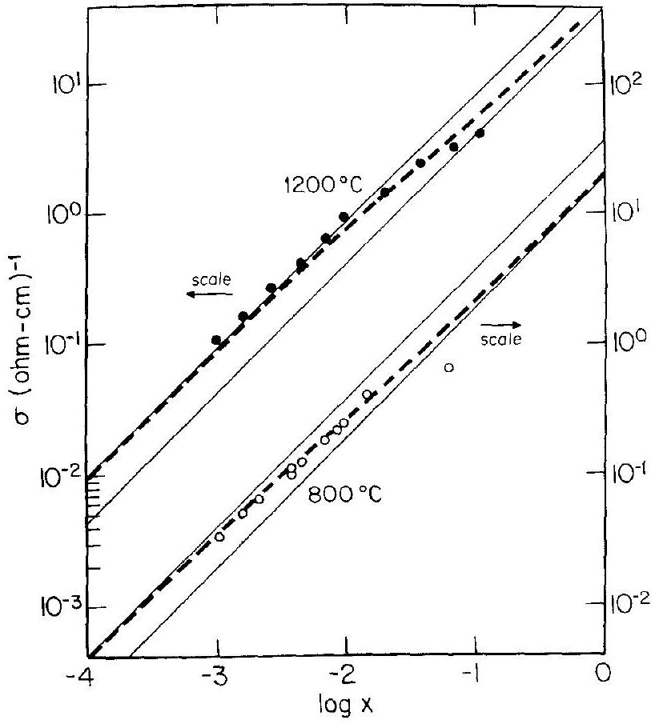
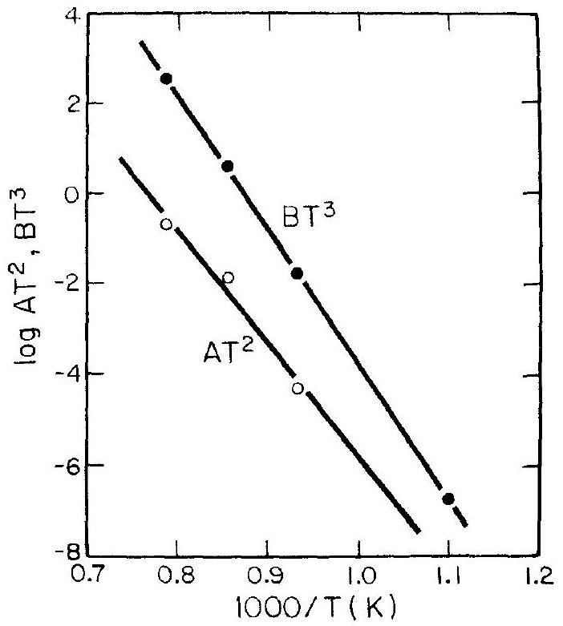

# Defect Structure and Electrical Properties of Nonstoichiometric $\mathrm{CeO}_{2}$ Single Crystals 

To cite this article: H. L. Tuller and A. S. Nowick 1979 J. Electrochem. Soc. 126209

View the article online for updates and enhancements.

You may also like

- On the Mechanisms of Chromium Electrodeposition
James P. Hoare
- Epitaxial Relations in Films of Cr, Pt, and CrPt on Sapphire
J. E. E. Baglin and F. M. d'Heurle
- Potentiostatic Transients at Rotating Solid Electrolyte Electrodes
D. den Engelsen, A. A. C. M. v. Gorp and L. Heyne

## Your Lab in a Box!

The PAT-Tester-i-16 Multi-Channel Potentiostat for Battery Material Testing!
✓ All-in-One Solution with Integrated Temperature Chamber (+10 to +80 ${ }^{\circ} \mathrm{C}$ )!

No additional devices are required to measure at a stable ambient temperature.
✓ Fully Featured Multi-Channel Potentiostat / Galvanostat / EIS!

Up to 16 independent battery test channels, no multiplexing.
✓ Ideally Suited for High-Precision Coulometry!

Measure with excellent accuracy and signal-to-noise ratio.
✓ Small Footprint, Easy to Setup and Operate!

Cableless connection of 3-electrode battery test cells. Powerful EL-Software included.

Learn more on our product website:

Download the data sheet (PDF):

Or contact us directly:
+49 40 79012-734
sales@el-cell.com
www.el-cell.com

# Defect Structure and Electrical Properties of Nonstoichiometric $\mathrm{CeO}_{2}$ Single Crystals 

H. L. Tuller*, ${ }^{1}$ and A. S. Nowick* Henry Krumb School of Mines, Columbia University, New York, New York 10027

#### Abstract

Cerium dioxide $\left(\mathrm{CeO}_{2-x}\right)$ deviates strongly from stoichiometry at elevated temperatures and reduced partial pressures of oxygen ( $\mathrm{po}_{2}$ ) to produce an oxygen deficient n-type semiconductor. Measurements of electrical conductivity and thermoelectric power as a function of $p_{02}$ were performed on single crystals of $\mathrm{CeO}_{2-x}$ over an extended composition range $\left(10^{-5} \leq x \leq 2.5 \times\right. 10^{-1}$ ) in order to: (i) remove the ambiguity concerning the identity of the dominant ionic defects, (ii) obtain the formation energies of appropriate defect species, and (iii) establish the composition ranges at which defect interactions set in. A system developed for generating and monitoring por almost continuously, enabled the acquisition of data in previously unobtained critical ranges of $p_{\mathrm{O} 2}$. A defect model which includes singly and doubly ionized oxygen vacancies and quasi-free electrons was established by the excellent agreement found at small $x$ between experimentally obtained conductivity data and theoretical curves based on the model. Doubly ionized vacancies were shown to be dominant at small $x\left(x<10^{-3}\right)$ with a transition occurring over an extended range of $p_{\mathrm{O}_{2}}$ 's toward singly ionized vacancies at larger deviations from stoichiometry. The energies associated with the formation of singly and doubly ionized vacancies were found to be equal to $\sim 4.1$ and 4.7 eV , respectively. For $x$ values greater than $\sim_{10^{-2}}$ indications of significant defect interactions were observed in the electrical conductivity, thermogravimetric, and electron mobility data. Assuming only pairwise defect interactions, we obtain a defect interaction energy of 0.055 eV . This low value is found to be consistent with the relatively larger region of ideal point defect behavior which exists in reduced ceria.

Cerium dioxide, $\mathrm{CeO}_{2-x}$, is known to deviate strongly from its stoichiometric composition at elevated temperatures and reduced partial pressures of oxygen ( $p_{\mathrm{O}_{2}}$ ) to produce an oxygen deficient $n$-type semiconductor. In a series of x-ray ( 1,2 ) and thermodynamic studies (3-7) it was demonstrated that reduced ceria retains its cubic fluorite structure intact over an extended composition range at elevated temperatures. This single phase region has been shown by Bevan and Kordis (4) to extend from $\mathrm{CeO}_{2}$ to $\mathrm{CeO}_{1.72}$ for temperatures above $680^{\circ} \mathrm{C}$. At lower temperatures, on the other hand, x-ray and neutron diffraction studies (1, 2, 8) have indicated the existence of a series of sharply defined intermediate phases whose compositions are given by the general formula $\mathrm{R}_{n} \mathrm{O}_{2 n-2}$.

The fact that the fluorite structure remains intact, even after the incorporation of up to the order of 14\% oxygen vacancies, presents a unique opportunity to study the defect properties of this solid for small as well as large concentrations of defects. Since stoichiometric $\mathrm{CeO}_{2}$ is stable in air, and no thermodynamically stable higher oxide exists at higher $p_{o_{2}}$ 's, one can easily achieve deviations from stoichiometry as small as $x=10^{-4}-10^{-5}$ under oxidizing conditions in the temperature range $700^{\circ}-1000^{\circ} \mathrm{C}$. Thus one has an extended range of experimental conditions for which defect concentrations remain small and for which one may properly apply the idealized defect theory of Schottky and Wagner as outlined in the next section. In addition, the existence of a large single phase region at elevated temperatures offers the opportunity to observe, at a given temperature, the transition from ideal defect behavior to the region characterized by defect interactions.

Although nonstoichiometric $\mathrm{CeO}_{2}$ appears to be ideally suited for defect structure determinations by electrical and thermodynamic means, no defect model

[^0]consistent with all the available evidence has been established. Oxygen deficiency can be caused by disorder either on the cation sublattice (i.e., by cerium interstitials) or on the anion sublattice (i.e., by oxygen vacancies). The object of any investigation is, therefore, to identify the defective sublattice as well as to determine the states of ionization of the ionic defects as a function of the temperature and $p_{0_{2}}$.

A number of investigators have studied the $p_{0_{2}}$ dependence exhibited by the electrical conductivity, $\sigma$, for pressed powder samples of ceria. Rudolph (9) observed a $p_{\mathrm{O}_{2}}{ }^{-1 / 5.7}$ dependence at $970^{\circ} \mathrm{C}$ and concluded that ceria was an $n$-type semiconductor due to its increasing conductivity with decreasing $p_{\mathrm{O}_{2}}$. Greener et al. (10) obtained approximately a $p_{\mathrm{O}_{2}}{ }^{-1 / 5}$ dependence for $\sigma$ over the $p_{\mathrm{O}_{2}}$ range $0.006-1.0 \mathrm{~atm}$ above $1100^{\circ} \mathrm{C}$ and suggested that the defects were therefore either quadruply ionized cerium interstitials or fully ionized oxygen vacancy pairs. Blumenthal and Laubach (11) measured the electrical conductivity from $800^{\circ}$ to $1500^{\circ} \mathrm{C}$ over an extended range of $p_{\mathrm{O}_{2}}$ and showed that their results were consistent with a vacancy model exhibiting multiple states of ionization. Later Blumenthal et al. (12) concluded instead that a defect model based on cerium interstitials in multiple states of ionization was a more appropriate description, based on the results of somewhat more extensive measurements.

Other types of measurements, which depend more directly on the type of ionic defect present in $\mathrm{CeO}_{2-x}$, point invariably to an oxygen-vacancy model. Steele and Floyd (13) measured the self-diffusion of oxygen in both ceria and ceria-yttria solutions and concluded that oxygen vacancies were clearly the predominant defect. Ban and Nowick (14) found no significant difference in the relative changes of the macroscopic length and the lattice parameter of a single crystal of ceria upon reduction, a result consistent only with a vacancy model. Recent x-ray and neutron diffraction studies (8) also are consistent only with an oxygen defect model.

The major purpose of the present work is to carry out a careful study of the electrical conductivity of ceria as a function of temperature and $p_{\mathrm{O}_{2}}$, in order to see whether these measurements, in combination with previous ones, can be interpreted in terms of an oxy-gen-vacancy model, thereby removing the ambiguity that had existed previously. We also wish to obtain the formation energies of appropriate defect species, as well as to establish ranges of composition at which defect interactions set in and idealized mass-action relations are no longer applicable. In order to accomplish the above objectives, the following special features of the present work are to be noted: (i) Single crystals are used, in contrast to all previous work on pressed and sintered powder compacts. (ii) A system was developed for generating and monitoring $p_{\mathrm{O}_{2}}$ almost continuously over twenty decades. This makes possible the acquisition of data in critical range of $p_{n_{2}}$ heretofore unobtained. (iii) Thermoelectric power measurements are carried out concurrently with the conductivity measurements in order that the dominant charge carrier can better be identified. A separate paper has been published by the present authors (15) dealing with the transport properties of the electronic carriers in reduced ceria.

## Theory

Defect equilibria.-For small deviations from stoichiometry, one may describe the reduction of ceria by the following defect reactions written in terms of the familiar Kroger-Vink notation (16)

$$
\begin{gathered}
\mathrm{O}_{\mathrm{O}} \rightarrow V_{\mathrm{O}} \cdot+2 e^{\prime}+1 / 2 \mathrm{O}_{2}(\mathrm{~g}) \\
V_{\mathrm{O}} \cdot \rightarrow V_{\mathrm{O}} \cdot+e^{\prime} \\
V_{\mathrm{O}} \rightarrow V_{0^{\prime}}+e^{\prime}
\end{gathered}
$$

(Contributions from cerium interstitials will be ignored in accordance with the available evidence presented earlier.)

The mass action relations which correspond to the above equations are, respectively

$$
\begin{gathered}
{\left[V_{\mathrm{O}}\right] n^{2} p_{\mathrm{O}_{2}}{ }^{1 / 2}=K_{1}(T)=K_{10} \exp \left(-\Delta H_{1} / k T\right)} \\
{\left[V_{\mathrm{O}} \cdot\right] n /\left[V_{\mathrm{O}} \cdot\right]=K_{2}(T)=K_{20} \exp \left(-\Delta H_{2} / k T\right)} \\
{\left[V_{\mathrm{O}} \cdot\right] n /\left[V_{\mathrm{O}}\right]=K_{3}(T)=K_{30} \exp \left(-\Delta H_{3} / k T\right)}
\end{gathered}
$$

where the $K_{i}(T)$ 's are the appropriate equilibrium constants.

Normally, the electroneutrality condition is expressed by

$$
n=\left[V_{0} \cdot\right]+2\left[V_{0} \cdot\right]
$$

However, lower valent cationic substitutional impurities (e.g., $\mathrm{Ca}^{2+}, \mathrm{Y}^{3+}$ ) are known (17,18) to be compensated by doubly ionized oxygen vacancies in $\mathrm{CeO}_{2}$. One should then properly consider an expanded version of Eq. [7] which includes contributions from the di- and trivalent impurities. In this paper, however, we will be concerned primarily with the range of compositions where the nonstoichiometric defects are far in excess of those due to impurity compensation, so that the simplified electroneutrality equation given by Eq. [7] suffices. (A later paper will deal with the range of nonstoichiometry for which impurity effects cannot be neglected.)

By combining Eq. [4]-[7] one may solve for the defect concentrations as functions of the temperaturedependent equilibrium constants and $\mathrm{p}_{\mathrm{O}_{2}}$. One then obtains a cubic equation in the electron concentration, $n$, given by

$$
n^{3}-K_{1}(T) p_{O_{2}}{ }^{-1 / 2}\left(\frac{n}{K_{2}(T)}+2\right)=0
$$

The exact solutions to this equation and for the variously charged vacancy concentrations are given in a thorough analysis by Kevane (19).

Before discussing the exact solutions, it is instructive to examine Eq. [8] at the two limiting conditions, i.e., for $n / K_{2}(T)$ much less or much greater than 2 . In the first case with $n / K_{2}(T)=\left[V_{\mathrm{O}} \cdot\right] /\left[V_{\mathrm{O}} \cdot\right] \ll 2$ one obtains the following solution for the dominant ionic and electronic defects

$$
\left[V_{\mathrm{O}}\right]=n / 2=\left[K_{1}(T) / 4\right]^{1 / 3} p_{\mathrm{O}_{2}}{ }^{-1 / 6}
$$

In the second case $n / K_{2}(T)=\left[V_{\mathrm{O}} \cdot\right] /\left[V_{\mathrm{O}} \cdot\right] \gg 2$ and one obtains instead the following solution

$$
\left[V_{O}\right]=n=\left[K_{1}(T) / K_{2}(T)\right]^{1 / 2} p_{O_{2}}-1 / 4
$$

This simple analysis shows that one expects doubly ionized vacancies and electrons to dominate near stoichiometry, each defect obeying a $p_{\mathrm{O}_{2}}{ }^{-1 / 6}$ concentration dependence, while at larger deviations from stoichiometry singly ionized vacancies and electrons are anticipated, both following instead a $p_{\mathrm{O}_{2}}{ }^{-1 / 4}$ dependence.

Although simplified treatments like the above are often used to analyze data in terms of a given defect model, Kevane (19) and more recently Tallan (20) have emphasized the danger of neglecting the "transition regions" where neither of the ionic defects may be safely neglected and for which the complete cubic equation for n, Eq. [8], must properly be used.

In fact, in Kevane's analysis, one finds that the transition between doubly and singly ionized vacancies covers 7-8 decades in $p_{\mathrm{O}_{2}}$, which is often in excess of the range measured experimentally (19). This region is so extended that Kevane was able to demonstrate theoretically an excellent fit to a $\mathrm{p}_{\mathrm{O}_{2}}{ }^{-1 / 5}$ dependence over six decades of $p_{\mathrm{O}_{2}}$, where in fact no such simple dependence exists. This suggests that cases exist in which investigators who have experimentally obtained a $p_{O_{2}}{ }^{-1 / 5}$ dependence for $\sigma$ were in fact operating in such a transition region and have, therefore, incorrectly attributed such results to other defect models.

A second transition is further predicted at even lower $p_{\mathrm{O}_{2}}$, from a region dominated by single ionized vacancies to one dominated by un-ionized vacanies. Normally, the transition to un-ionized vacancies is not encountered in real systems, since at this stage the concentrations of defects are relatively large. One must bear in mind that the validity of Eq. [4]-[8] is based on the assumption that the defects are noninteracting. Consequently, the behavior predicted for high defect concentrations may never be observed experimentally if the above simplifying assumptions do not apply. We later show that this is, in fact, the case for reduced $\mathrm{CeO}_{2}$.

Electrical conductivity.-Since the mobility of the electrons is considerably greater than that of the ionic defects (15) we may safely assume that the total conductivity is equal to the electronic conductivity ( $\sigma= n e_{\mu_{\mathrm{e}}}$ ) at least for reasonable deviations from stoichiometry. If, in addition, the electronic mobility, $\mu_{\mathrm{e}}$, remains independent of $n$ (for small $n$ ) then one should obtain the identical $p_{0_{2}}$ dependence for $\sigma$ as for $n$.

Under these assumptions, Eq. [8] may be converted into an equation for $\sigma$ by multiplying it through by $\left(e_{\mu_{\mathrm{e}}}\right)^{3}$ to obtain

$$
\sigma^{3}-A(T) p_{\mathrm{O}_{2}}^{-1 / 2} \sigma-B(T) p_{\mathrm{O} 2}^{-1 / 2}=0
$$

where

$$
\begin{gathered}
A(T)=\left[K_{1}(T) / K_{2}(T)\right]\left(e_{\mu_{\mathrm{e}}}\right)^{2} \\
B(T)=2 K_{1}(T)\left(e \mu_{\mathrm{e}}\right)^{3}
\end{gathered}
$$

Since the activation energy for $\mu_{\mathrm{e}}$ has been obtained independently (15), the enthalpies given in Eq. [4] and [5] can be derived from the experimentally obtained functions $A(T)$ and $B(T)$.

Thermoelectric measurements.-The thermoelectric power or Seebeck coefficient, $\alpha$, is defined as the ratio of the change in emf across a sample due to a change in the temperature gradient imposed across it under
open-circuit conditions or

$$
\alpha=-\Delta V /\left.\Delta T\right|_{I=0}
$$

Since the carriers diffuse to the cold end, the polarity of the emf at that end then gives the sign of the carriers. For small polaron conductors the thermoelectric power is related to the concentration of electrons by (21)

$$
\alpha=-k / e\left\{\ln \beta \frac{(N-n)}{n}+\frac{S^{*}}{k}\right\}
$$

where $N$ is the concentration of normal cation sites; $k$, the Boltzmann constant; and $S^{*}$, the entropy transported per particle, which is generally small in oxides ( $S^{*} / e<10 \mu \mathrm{~V} /{ }^{\circ} \mathrm{K}$ ) and can be neglected. The factor $\beta$ is a degeneracy factor which includes the spin degeneracy of the electronic carrier, and accordingly we may expect that $\beta=2$. For small deviations from stoichiometry the concentration of electrons is much smaller than $N$ so that the term $(N-n)$ may be replaced by $N$. Substituting an expression for $n$ giving its temperature and $p_{\mathrm{O}_{2}}$ dependence, of the form obtained in Eq. [9] and [10], viz., $n=C(T) p_{\mathrm{O}_{2}}^{-1 / r}$, we obtain

$$
\alpha=-\frac{k}{e}\left(\frac{1}{r}\right) \ln p_{\mathrm{O}_{2}}-\frac{k}{e}\left[\ln \frac{\beta N}{C(T)}+\frac{S^{*}}{k}\right]
$$

One may therefore determine the value of $r$, i.e., the $p_{\mathrm{O}_{2}}$ dependence of $n$, from the slope of a plot of $\alpha v s$. In $p_{\mathrm{O}_{2}}$.

Thermogravimetric measurements.-Thermogravimetric or weight change measurements are directly dependent on the total number of vacancies in the solid, given by

$$
\left[V_{\mathrm{O}}\right]_{\text {total }}=\left[V_{\mathrm{O}} \cdots\right]+\left[V_{\mathrm{O}} \cdot\right]+\left[V_{\mathrm{O}}\right]=N x
$$

In a composition range where one of these components clearly dominates, $\left[V_{O}\right]_{t o t a l}$ or equivalently the weight change, should follow the $p_{0_{2}}{ }^{-1 / \mathrm{r}}$ dependence appropriate for that region. At small deviations from stoichiometry, weight measurements are not nearly as sensitive to varying defect concentrations as is the electrical conductivity. Consequently, in that range, measurements of $\sigma$ should be more reliable in the establishment of the defect model and in determination of the equilibrium constants.

## Experimental Methods

The specimens used in this study were single crystals of ceria grown by arc fusion by Materials Research Corporation through a cooperative research program with our laboratory (22). The crystals, fabricated from nominally pure $\mathrm{CeO}_{2}$ powder ${ }^{2}$ ( $99.9 \%$ pure with respect to other rare earths) were black as solidified, indicating significant nonstoichiometry. Upon oxidation at elevated temperatures, the crystals changed to a pink-beige color, the color of the starting powder. Analysis both of starting powders and single crystals (Table I) show that, except for pickup of sodium during crystal growth, both forms show essentially the same aliovalent impurity content, in the range of 150-200 pmw. X-ray Laue photographs of the crystals showed sharp spots, indicating good single crystallinity. Furthermore, the crystals cleaved easily along the (111) plane, typical of other crystals of the fluorite structure.

Rectangular specimens with dimensions of $12 \times 5 \times 5 \mathrm{~mm}^{3}$ were obtained by cleaving parallel sections from the large crystals and then cutting the remaining faces with a diamond saw. After polishing all faces smooth with fine emery paper, platinum paste electrodes (Englehard No. 6082) were applied which were later fired in air at $800^{\circ} \mathrm{C}$ to burn off the organic binder. Such electrodes are known (23) to be suffi-

[^1]Table I. Mass spectrographic analysis of cerium oxide materials. Major impurities (ppmw)
| Element | Starting powder | Single crystal |
| :--- | :--- | :--- |
| Na* | 33 | 150 |
| Al | 6 | 30 |
| Si | 20 | 20 |
| Cl | 20 | 10 |
| K | 100 | 25 |
| Ca | 50 | 50 |
| Fe | 6 | 10 |
| Y | 20 | 20 |
| $\mathrm{Zr}_{\mathrm{r}}$ | 2 | 6 |
| C | 29 | 26** |
| La | 5 | 5 |
| Pr | 20 | 10 |
| Nd | 40 | 80 |
| Sm | 30 | 30 |
| Gd | 10 | 10 |
| Dy | 2 | 10 |
| Th | 40 | 100 |

* Flame photometric analyses.
** Possible contamination from electrode holders.
ciently porous to allow specimens to equilibrate easily with the surrounding gas phase.

A standard four-probe d-c technique was used to measure the conductivity. To avoid polarization effects (23), the current, $I$, was restricted to values between $10^{-7}$ and $10^{-4} \mathrm{~A}$. The potential drop across the two center leads was measured with a Keithley Model 650 vibrating capacitor electrometer (input impedance of $10^{16} \Omega$ ) for both positive and negative values of $I$ to eliminate any spurious contributions to the potential. In addition, a-c measurements at 1592 Hz ( $10^{4} \mathrm{rad} / \mathrm{sec}$ ) were made with a Wayne-Kerr Model B221A universal bridge; results obtained by the two methods were essentially identical.

The method of measurement of the thermoelectric power was fully described in an earlier paper (15). Basically, $\Delta V$ was measured as a function of an imposed small thermal gradient, $\Delta T$. The thermoelectric power was obtained from the linear plot of $\Delta V$ vs. $\Delta T$, both of which were measured simultaneously as the gradient was slowly varied.

Atmosphere control, ranging over 22 orders of magnitude in the oxygen partial pressure, $p_{\mathrm{O}_{2}}$, was achieved as follows. For the range $p_{\mathrm{O}_{2}}=1-10^{-4} \mathrm{~atm}$, $\mathrm{O}_{2}$-Ar mixtures were used, while for the range $10^{-4}$ -$10^{-22} \mathrm{~atm} \mathrm{CO}-\mathrm{CO}_{2}$ mixtures were used. The value of $p_{\mathrm{O}_{2}}$ of $\mathrm{CO}-\mathrm{CO}_{2}$ mixture with a known ratio of $\mathrm{CO} / \mathrm{CO}_{2}$ can be calculated at any temperature using the wellknown free energy values for the $\mathrm{CO}-\mathrm{CO}_{2}$ reaction (24). Fixed ratios of $\mathrm{CO} / \mathrm{CO}_{2}$ premixed and analyzed, were purchased from the Matheson Gas Company, but these mixtures were limited to $\mathrm{CO} / \mathrm{CO}_{2}$ ratios between $10^{3}$ and $10^{-3}$. The value for $p_{\mathrm{O}_{2}}$ for $\mathrm{CO} / \mathrm{CO}_{2}= 10^{-3}$ is $\sim 10^{-12} \mathrm{~atm}$, at $800^{\circ} \mathrm{C}$. Thus, a gap of approximately eight decades in $p_{\mathrm{O}_{2}}$ exists between the lowest available $\mathrm{O}_{2} / \mathrm{Ar}$ ratio and the least reducing $\mathrm{CO} / \mathrm{CO}_{2}$. Since critical data fall within this gap, we have closed the gap by setting up a system for (i) mixing the premixed $\mathrm{CO} / \mathrm{CO}_{2}=10^{-3}$ gas with pure $\mathrm{CO}_{2}$ under controlled relative flow rates, and (ii) monitoring the $\mathrm{p}_{\mathrm{O}_{2}}$ level by means of a calcia-stabilized zirconia (CSZ) cell located in the hot zone close to the sample under study. The same technique was also used to span the gap between other premixed pairs of $\mathrm{CO}-\mathrm{CO}_{2}$ mixtures.

The premixed and analyzed mixtures also served as useful checks on the accuracy of the system. Excellent agreement was obtained between measured and calculated values of $p_{\mathrm{O}_{2}}$ (from free energy values of the $\mathrm{CO}-\mathrm{CO}_{2}$ reaction) for these premixed gases. The procedure followed to obtain a desired equilibrium $p_{\mathrm{O}_{2}}$ in the sample chamber was as follows: (i) the relative flow rates of the gases were adjusted in the direction of the desired $p_{\mathrm{O}_{2}}$ (i.e., the mixture was made more reducing or oxidizing), (ii) the approach to the new equilibrium $p_{\mathrm{O}_{2}}$ was monitored by recording the out-
put of the CSZ cell on a strip chart recorder, (iii) when the cell emf reached a fixed value, that is, a constant $p_{\mathrm{O}_{2}}$, measurements of $\sigma$ or $\alpha$ were recorded after it was established that the sample had also reached equilibrium. The procedure was then repeated to obtain the next value of $p_{0_{2}}$.

## Results

Measurements of electrical conductivity and thermoelectric power were performed on a single crystal of ceria over a wide range of $p_{0_{2}}$ at a series of fixed temperatures to test the predictions of the vacancy defect model derived in the Theory section. Particular emphasis was placed on obtaining data in the "gap" region of $p_{\mathrm{O}_{2}}$ in which no previous measurements had been reported, but which appeared to cover a critical range of compositions in relation to the application of the mass action equations.
Recent thermodynamic data ( $4,6,7,25$ ) were combined and analyzed in conjunction with the electrical measurements to further test the validity of the mass action relations over the composition range considered in this study.

Electrical conductivity.-The electrical conductivity of a pure single crystal of ceria was measured isothermally as a function of $p_{0_{2}}$ at a series of temperatures ranging from $635^{\circ}$ to $1150^{\circ} \mathrm{C}$. The results are shown plotted as $\log \sigma v s$. - $\log p_{0_{2}}$ in Fig. 1, along with higher temperature data of Blumenthal et al. (12) on polycrystalline $\mathrm{CeO}_{2}$ for temperatures of $1100^{\circ} \mathrm{C}$ and above where no gap is expected to exist. ${ }^{3}$ Our measurements have been multiplied by a factor of five ${ }^{4}$ to bring them into line with earlier measurements performed in our laboratory as well as with those of Blumenthal et al. (12). Values of $\sigma$ were obtained at closely spaced intervals of $\mathrm{p}_{\mathrm{O}_{2}}$ from 1 to $10^{-20} \mathrm{~atm}$, including values in the "gap" region. This was made possible by the use of the gas mixing and monitoring system described in the previous section.
In the region of high $p_{\mathrm{O}_{2}}$ and at low temperatures, we observe that the conductivity shows an insensitivity to changes in $p_{\mathrm{O}_{2}}$. Such a $p_{\mathrm{O}_{2}}$-independent conductivity is expected when impurity generated ionic defects dominate the conductivity (18). It will be shown later that the range in question corresponds to very small deviations from stoichiometry, i.e., $x \leq 10^{-5}$ in $\mathrm{CeO}_{2-x}$. The results of the chemical analysis, shown in Table I, indicate that on the order of 100 ppm of di- and trivalent substitutional impurities are present, so that an equivalent concentration of $V_{\mathrm{O}} \cdot$ is expected to be present for charge compensation. This is well in excess of the expected concentration of intrinsic carriers at high $p_{0_{2}}$ 's.

Since, in this paper, we wish to confine our analysis to intrinsic defect carriers present by virtue of deviations from stoichiometry, the boundary at which the extrinsic defects become significant must be established for the present material. This boundary will be shown, in another paper (26), to be given by the dashed line which separates regions I and II in Fig. 1. We will therefore focus attention, for now, only on the data above this boundary, i.e., on regions II-IV. In these regions, the conductivity exhibits a strong dependence on $p_{\mathrm{O}_{2}}$. Within the region designated by II, $\sigma$ obeys reasonably well, a $p_{\mathrm{O}_{2}}{ }^{-1 / 6}$ dependence at all temperatures. The II-III boundary does not involve a sharp transition in slope but only indicates the position at which a transition away from a $\mathrm{p}_{\mathrm{O}_{2}}{ }^{-1 / 6}$ de-

[^2]
Fig. 1. Electrical conductivity as a function of $\mathrm{pO}_{2}$ in a series of isotherms. Circled points $(\bigcirc)$ are single crystal data obtained in this study. -'s indicate data obtained on pressed pellets by Blumenthal et al. (12). The solid curves designate the theoretical fit to the data based on an oxygen vacancy model while the dashed lines identify boundaries at which the defect mechanisms change.

pendence becomes appreciable. ${ }^{5}$ Within region III, the data then transform smoothly toward a $p_{O_{2}}{ }^{-1 / 4}$ dependence. This, indeed, is the type of $p_{\mathrm{O}_{2}}$ dependence predicted earlier from the oxygen vacancy model (see Eq. [9] and [10]), indicating that doubly ionized oxygen vacancies are the dominant ionic defect near to stoichiometry and that a transition to singly ionized vacancies occurs at larger deviations from stoichiometry.

Finally, in region IV of Fig. 1, one finds that $\sigma$ again becomes insensitive to changes in $p_{0_{2}}$. At $900^{\circ}$ and $1000^{\circ} \mathrm{C}$ the data actually go through a shallow maximum in this region, as was also observed by Blumenthal et al. (12). We will show later that region IV corresponds to rather large deviations from stoichiometry and it is thus not surprising to find deviations from ideal behavior.

Thermoelectric power.-The thermoelectric power was measured as a function of $p_{\mathrm{O}_{2}}$ coincidently with the conductivity measurements at temperatures of $800^{\circ}, 1000^{\circ}$, and $1150^{\circ} \mathrm{C}$.

The results, given in Fig. 2, show a decreasing ntype thermoelectric power with decreasing $p_{\mathrm{O}_{2}}$ at low $p_{\mathrm{O}_{2}}$, as expected from Eq. [16]. This confirms that an increasing concentration of electrons is indeed being generated with departure from stoichiometry, as predicted by our defect model. At higher $p_{02}$ 's (i.e., small $x)$, however, a reversal in the $p_{\mathrm{O}_{2}}$ dependence of $\alpha$ is found at $800^{\circ}$ and $1000^{\circ} \mathrm{C}$, such that $\alpha$ goes through a maximum and then decreases with increasing $p_{0_{2}}$. This reversal at small deviations from stoichiometry, also observed by Vinokurov et al. (27) and Wilbert et al. (28), can be shown (26) to be a consequence of a ptype contribution to $\alpha$ arising from impurity-compensating oxygen vacancies near stoichiometry.

One may apply Eq. [16] at low $p_{\mathrm{O}_{2}}$ 's (where the contributions to $\alpha$ are expected to be solely due to electrons) to obtain the $p_{0_{2}}$ dependence of the elec-

[^3]
Fig. 2. The thermoelectric power plotted as a function of $\mathrm{pO}_{2}$ at several isotherms. Solid curves have been calculated on basis of proposed oxygen vacancy model and arrows designate the deviation from stoichiometry at several specified $\mathrm{pO}_{2}{ }^{\mathrm{s}} \mathrm{s}$.

tron concentration, i.e., the exponent $1 / r$, directly. The values of $r$ obtained in this manner are approximately 6.5 at $1150^{\circ} \mathrm{C}$ and 5.9 at $1000^{\circ} \mathrm{C}$. These are close to the value of 6 expected for a region dominated by doubly ionized oxygen vacancies. At $800^{\circ} \mathrm{C}$ one obtains a value 9.7 for $r$. At this temperature, most of the data, however, are still close to the maximum and therefore include contributions from other extrinsic carriers. The solid curves drawn in Fig. 2 are calculated curves which are discussed later.

Analysis of thermogravimetric data.-It was shown in the Theory section that thermogravimetric data (i.e., weight change measurements as a function of temperature and $p_{\mathrm{O}_{2}}$ ) also yield information concerning the dominant ionic defects. Until recently the most complete thermogravimetric data were available from the work of Bevan and Kordis (4). Although this work covers a wide range of compositions, from $\mathrm{CeO}_{1.5}$ to $\mathrm{CeO}_{1.98}$, the range close to stoichiometry, where mass action relations should apply, was not measured.

More recently, Iwasaki and Katsura (7), Panlener et al. (6), and Sorensen (25) have extended these measurements closer to stoichiometry. Their results, together with those of Bevan and Kordis, have been replotted in Fig. 3 in terms of $x$ (in $\mathrm{CeO}_{2-x}$ ) vs. $p_{\mathrm{O}_{2}}$. Generally the data of the various investigators show good agreement where they overlap. (The data of Iwasaki and Katsura, for temperatures below $1100^{\circ} \mathrm{C}$, have not been included because of apparent difficulties with equilibration at small $x$.) The one major discrepancy between the reported results is related to the existence of hysteresis effects at the lower temperatures. Sorenson (25) observed substantial hysteresis in his thermogravimetric results at $900^{\circ}$ and $1000^{\circ} \mathrm{C}$ in the composition range $2-x=1.995-1.875$ as indicated in Fig. 3, while Panlener et al. (6) reported none. The possible existence of hysteresis at the lower temperatures is later considered in the Discussion section when analyzing this data with respect to the pro-

Fig. 3. Deviation from stoichiometry of $\mathrm{CeO}_{2-x}$ given in terms of $x$ as a function of $\mathrm{pO}_{2}$ at a series of isotherms. Solid lines give theoretically calculated curves while dashed lines indicate boundaries associated with change in defect mechanism. Cross-hatched regions indicate observed hysteresis effects by Sorenson (25). The data points are from the following investigators: - Panlener et al. (6); $\Delta$, Bevan and Kordis (4); $x$, Iwasaki and Katsura (7); and ∇, Sorenson (25).

posed defect model. Since these results, particularly those of Panlener et al., cover at least an order of magnitude of $x$ below $10^{-2}$, it should be possible to correlate these data with the predictions of the defect model as well as with the electrical conductivity measurements.

The regions designated II and III in Fig. 3 involve, for the most part, the same ranges of $p_{\mathrm{O}_{2}}$ and temperature as the equivalent regions for $\sigma$ in Fig. 1. In region II, $x$ follows roughly a $p_{\mathrm{O}_{2}}{ }^{-1 / 5}$ dependence at lower values of $x$, and gradually changes with increasing $x$, finally achieving nearly a $p_{\mathrm{O}_{2}}{ }^{-1 / 4}$ dependence in region III.

In regions IVA and IVB, on the other hand, the data deviate from any simple mass-action relation. In fact the $p_{\mathrm{O}_{2}}$ dependence of $x$ tends toward the vertical at $800^{\circ} \mathrm{C}$ in region IVA. The steepening $x$ vs. $p_{\mathrm{O}_{2}}$ behavior, beginning at the III-IVA boundary, appears to presage the formation of a two-phase region as found by Bevan and Kordis (4) below $680^{\circ} \mathrm{C}$. In region IVB, corresponding to even further deviations from stoichiometry, $x$ shows the same insensitivity to changes in $p_{\mathrm{O}_{2}}$ as observed for $\sigma$ in region IV of Fig. 1.

Composition dependence of $\sigma$. -By combining the two sets of data given in Fig. 1 and 3, it becomes possible to obtain the composition dependence of the electrical conductivity. The results for $\log \sigma v s . \log x$ at $800^{\circ}$ and $1200^{\circ} \mathrm{C}$ are presented in Fig. 4. For both isotherms the data appear to follow a slope of near unity at small $x$, but $\sigma$ varies more slowly with composition changes at larger values of $x$. A slope of unity indicates that both the state of ionization of the vacancy and the electron mobility remain constant as $x$ changes, and therefore insures that the same $p_{\mathrm{O}_{2}}$ dependence is obtained for the conductivity as for the density of carriers. Therefore a deviation from a slope of unity indicates either a change in the state of ionization of the ionic defects or a breakdown in the simplifying assumptions involved in the ideal model of randomly distributed noninteracting defects.

The value of $x$ at which the deviation from a slope of unity begins appears to increase with increasing temperature. Thus while the deviation becomes apparent at $x \sim 2 \times 10^{-3}$ at $800^{\circ} \mathrm{C}$, it is only noticeable at $x \sim 2 \times 10^{-2}$ at $1200^{\circ} \mathrm{C}$. As we shall show later, the defect model proposed here is consistent with these results.

## Discussion

Establishment of defect model.-By extending the electrical conductivity measurements to higher $p_{\mathrm{O}_{2}}$ 's [just above the $p_{\mathrm{O}_{2}}{ }^{-1 / 5}$ region studied by Blumenthal

Fig. 4. Electrical conductivity as a function of $x$ in $\mathrm{CeO}_{2-x}$ for $800^{\circ}$ and $1200^{\circ} \mathrm{C}$. $x$ values at $800^{\circ} \mathrm{C}$ (see Fig. 3) have been normalized by a factor of 2.2 in order to simplify comparison with predicted results given as dashed curves. A slope of near unity is obtained at both temperatures in the relation between $\log \sigma$ and $\log x$ for small values of $x$.

et al. (12)] the present work shows that a significant region exists where $\sigma$ follows a $p_{\mathrm{O}_{2}}{ }^{-1 / 6}$ dependence. Thus the Ce interstitial model, which is never expected to show a weaker $p_{\mathrm{O}_{2}}$ dependence than $p_{\mathrm{O}_{2}}{ }^{-1 / 5}$, is revealed to be inconsistent with the conductivity data. Our results, however, remain in accord with the oxygen vacancy model, as formulated in the Theory section.
To test the vacancy model more precisely and to obtain values for the equilibrium constants describing defect deformation and ionization, the exact expression, Eq. [11], for $\sigma\left(p_{\mathrm{O}_{2}}, T\right)$ was fitted to the experimental data. A computer program was written to obtain the best values of $A(T)$ and $B(T)$ for each isotherm of the single crystal data by a least squares technique. Since it has been shown (15) that electrons move by an activated hopping process in ceria, the form of $\mu_{\mathrm{e}}$ in Eq. [12] and [13] is given by

$$
\mu_{\mathrm{e}}=\left(\mu_{0} / T\right) \exp -\left(E_{\mathrm{H}} / k T\right)
$$

where $E_{\mathrm{H}}$ is the activation energy for electron hopping. Because of the $1 / T$ term in $\mu_{\mathrm{e}}$, one must plot $A(T) T^{2}$ and $B(T) T^{3}$ vs. 1/T to obtain the correct values for the activation energies associated with $A(T)$ and $B(T)$. The computer fitted values for $A(T)$ and $B(T)$ are shown plotted in this manner in Fig. 5. The solid lines drawn through the points are the calculated least mean fits.

The expression for $A(T)$ and $B(T)$ corresponding to the least mean square fits are given by

$$
\begin{aligned}
& A(T)=7.94 \times 10^{18} / T^{2} \exp (-4.91 \pm 0.75 \mathrm{eV} / k T) \\
& B(T)=6.03 \times 10^{25} / T^{3} \exp (-5.98 \pm 0.06 \mathrm{eV} / k T)
\end{aligned}
$$

The solid curves in Fig. 1 were obtained by substituting these best values for $A\left(T^{\prime}\right)$ and $B(T)$ into Eq. [11] for the temperature range $635^{\circ}-1500^{\circ} \mathrm{C}$. For all temperatures the fit to the data is quite good in regions II and III where the mass action relations, as derived above, are expected to apply. This is particularly satisfying since the $A(T)$ and $B(T)$ values used were obtained by considering our single crystal data ( $635^{\circ}$ -

Fig. 5. The experimentally determined values of $A(T)$ and $B(T)$ plotted as $\log A T^{2}$ and $\log B T^{3}$ as a function of reciprocal temperatures. Solid lines represent best least mean squares fits to data.

$1000^{\circ} \mathrm{C}$ ) alone. It is thus gratifying that the data of Blumenthal et al. (12) at higher temperatures fit the predicted curves so well. The oxygen vacancy model, therefore, appears to be well supported by the electrical conductivity data obtained for $\mathrm{CeO}_{2-x}$.

One may obtain values for the mass action constants $K_{1}(T)$ and $K_{2}(T)$ from Eq. [12] and [13] if an expression for $\mu_{\mathrm{e}}$ is known. In the related study (15) we found $\mu_{0}$ and the activation energy for hopping, $\mathbf{E}_{\mathrm{H}}$, to be equal to $3.9 \times 10^{2}{ }^{\circ} \mathrm{K} \mathrm{cm}^{2} / \mathrm{V}-\mathrm{sec}$ and 0.40 eV , respectively. Substituting the appropriate expression for $\mu_{e}$, Eq. [18], into Eq. [12] and [13], we obtain for the equilibrium constants $K_{1}(T)$ and $K_{2}(T)$

$$
\begin{gathered}
K_{1}(T)=1.20 \times 10^{74} \exp (-4.67 \pm 0.07 \mathrm{eV} / k T) \\
K_{2}(T)=6.01 \times 10^{22} \exp (-0.56 \mathrm{eV} / k T)^{6}
\end{gathered}
$$

Comparing these results with Eq. [4] and [5] shows that the formation enthalpy for doubly ionized vacancies is equal to 4.67 eV while that for singly ionized vacancies is $(4.67-0.56)=4.11 \mathrm{eV}$.

Following conventional semiconductor theory, the preexponential of $K_{2}(T)$ should correspond to the density of states in the conduction band while the activation energy to the second ionization of the vacancy donor site (19). The well-known expression for the density of states, $N_{\mathrm{c}}=2\left(2 \pi m^{*} k T / h^{2}\right)^{3 / 2}$, turns out to be equal to approximately $10^{20} \mathrm{~cm}^{-3}$ at $1000^{\circ} \mathrm{C}$ assuming a free electron effective mass. This value is more than two orders of magnitude smaller than our derived value. A density of states of the order of $10^{22} \mathrm{cm}^{-3}$ is, however, consistent with the small polaron model derived for ceria in our previous paper (15) for which the density of states should be roughly equal to the concentration of cations, $N=2.5 \times 10^{22} \mathrm{~cm}^{-3}$. The agreement within a factor of $\sim 2$ between this number and our value for $K_{20}$ is quite reasonable considering the uncertainties in $A(T)$ and $B(T)$ from which it was derived.

One can further test the reasonableness of the 0.56 eV value obtained for the second donor ionization energy by checking if this is consistent with full ionization of the oxygen vacancy donor sites for the composition ranges in which a $p_{\mathrm{O}_{2}}{ }^{-1 / 6}$ dependence was obtained experimentally. Following McKelvey (29) one obtains the following condition for full ionization

[^4]
## $\left[V_{0}\right]_{\text {total }} \ll 1 / 2 K_{2}(T)$

At $1000^{\circ} \mathrm{C}$ this requires that $\left[V_{\text {o }}\right]_{\text {total }} \ll 3.66 \times 10^{20} \mathrm{cm}^{-3}$, a value which falls within region III in both Fig. 1 and 3. At a $\left[V_{0}\right]_{\text {total }}$ equal to one-fifth this value, the data fall within region II of both figures which corresponds to near full ionization of the oxygen vacancies. Thus the values obtained for the equilibrium constant, $K_{2}(T)$ appear to be consistent with both a localized electron model and full vacancy ionization at small values of $x$ in $\mathrm{CeO}_{2-x}$.

With the complete expression for $\sigma$ as a function of $p_{\mathrm{O}_{2}}$ now in hand it becomes possible to explain the apparent discrepancy of the data of Blumenthal et al. (12) with the oxygen-vacancy defect model. If one compares the conductivity data of Ref. (12) for temperatures $<1100^{\circ} \mathrm{C}$ with the present results of Fig. 1, it becomes clear that their data, which show a $p_{\mathrm{O}_{2}}{ }^{-1 / 5}$ dependence at intermediate $p_{\mathrm{O}_{2}}$ 's, happen to fall within the transition from doubly to singly ionized vacancies which, as noted earlier, covers over six orders of magnitude in $p_{\mathrm{O}_{2}}$.

Further evidence for the existence of a $V_{0} \cdot \cdot$ dominated region at small $x$ comes from the observed $p_{\mathrm{O}_{2}}{ }^{-1 / 4}$ dependence of the electronic conductivity in reduced yttria, calcia, and lanthana-doped ceria (18, 30,31 ). As noted earlier, lower valent cations are compensated by doubly ionized oxygen vacancies. For relatively heavily doped samples, [ $V_{\mathrm{O}} \cdot \cdot$ ] is essentially fixed by the impurity concentration $[i]$. When $\left[V_{0} \cdot\right] =[i]$ is substituted into Eq. [4] it results in an expression for $n$ given by

$$
n=\left(K_{1}(T) /[i]\right)^{1 / 2} p_{\mathrm{O}_{2}}^{-1 / 4}
$$

in agreement with the above results. In fact, often it is easier to distinguish the $V_{0} \cdot$ dominant region in heavily doped oxides of this type than in the normally pure samples. This is primarily due to the fact that one can impose the simplified electroneutrality condition (i.e., $\left[V_{\mathrm{O}} \cdot\right]=[i]$ ) over a wider range of $p_{\mathrm{O}_{2}}$ by doping.

Thermogravimetric data.-With values for the equilibrium constants $K_{1}(T)$ and $K_{2}(T)$ in hand, it becomes possible, with the aid of Eq. [4], [5], [7], [8], and [17] to generate curves of $x v s$. $p_{0_{2}}$. Such curves calculated, assuming contributions only from singly and doubly ionized vacancies, are drawn as solid lines in Fig. 3.

On the whole, one finds reasonably good agreement between the predicted and measured curves for temperatures above $1100^{\circ} \mathrm{C}$. At lower temperatures, however, one finds increasingly larger discrepancies appearing, particularly at small $x$. In general, the experimental data show a smaller degree of nonstoichiometry for a given value of temperature and $p_{\mathrm{O}_{2}}$, as well as a somewhat steeper $p_{\mathrm{O}_{2}}$ dependence than the predicted curves.

It is interesting to note that for temperatures of $1000^{\circ} \mathrm{C}$ and below, for which these discrepancies become increasingly large, Sorenson (25) also observed increasing hysteresis effects. These are indicated in Fig. 3 by the cross-hatched regions in the vicinity of the $900^{\circ}$ and $1000^{\circ} \mathrm{C}$ isotherms. It is tempting to say that this is the cause of the discrepancies, particularly because the predicted curves fall almost at the middle of these cross-hatched regions. Nevertheless, Sorenson mentions that these hysteresis effects do not appear to extend to values of $x<5 \times 10^{-3}$, at least for the lowest temperatures of his measurements ( $900^{\circ}$ and $1000^{\circ} \mathrm{C}$ ). Thus hysteresis appears not to be the major cause for the discrepancy between our predicted curves and the thermogravimetric data, at least for small $x$.

If one examines the chemical analysis of the specimens used by Panlener et al. (6) in their thermogravimetric experiments one finds that the specimens possess relatively high levels of calcium, $\sim 300 \mathrm{ppm}$.

As shown by Garnier et al. (32) in a later paper, additions of calcium to $\mathrm{CeO}_{2}$ noticeably shift the log $x$ vs. $\log p_{\mathrm{O}_{2}}$ curves to lower $p_{\mathrm{O}_{2}}$ for values of $x<10^{-2}$. This shift tends to be greater at the lower temperatures. The single crystals used in our experiments, on the other hand, possessed only $\sim 50 \mathrm{ppm}$ of calcium and smaller levels of other lower valent cations; these add up to roughly $1 / 4$ th the impurity level of the material used by Panlener et al. This difference in purity could very well account for the observed difference between the calculated curves and experimental data in Fig. 3. Furthermore it would explain why the data in region II of Fig. 3 follow a somewhat steeper $p_{\mathrm{O}_{2}}$ dependence than predicted (most clearly so for the $1000^{\circ}, 1100^{\circ}$, and $1200^{\circ} \mathrm{C}$ isotherms). Garnier et al. show, in fact, that given enough dopant, $x$ will follow a $p_{\mathrm{O}_{2}}{ }^{-1 / 4}$ dependence down to even very small values of $x$. It would therefore be very helpful to have the thermogravimetric results repeated on very pure specimens of $\mathrm{CeO}_{2}$ to see if this discrepancy between calculated and measured values at small $x$ will disappear. In any case, noting that the electrical conductivity is generally far more sensitive than thermogravimetric measurements in the range of small $x$, we must give greater weight to the electrical measurements in the development of the defect model and in the calculation of defect parameters.

Composition dependence of $\sigma$ and $\alpha$.-Previously we showed in Fig. 4 that in plots of $\sigma$ vs. $x$, deviations from slope of unity occur at all temperatures considered, the deviations occurring at larger $x$, the higher the temperature. Since we now have the calculated curves for both $\sigma$ and $x v s$. $p_{\mathrm{O}_{2}}$, we can combine these to generate $\sigma$ vs. $x$ curves and compare them with experimental values. The calculated $\sigma$ vs. $x$ curves are shown as dashed lines in Fig. 4.

A number of important observations concerning the predicted curves can be made. First, at sufficiently small $x$, the slope of the curve is always unity. However, at intermediate $x$, the curves deviate from unit slope in the same direction as the experimental points. Second, at sufficiently large values of $x$ the calculated curves resume a slope of unity but with the magnitude of $\sigma$ at any $x$ equal to $1 / 2$ that associated with the extrapolated curve at small $x$. Finally, as observed experimentally, the deviation from slope of unity occurs at a larger $x$ value as one increases the temperature.

These results are readily understood in terms of the fact that the data run through the composition ranges where one expects the transition from doubly to singly ionized oxygen vacancies to occur and that each singly ionized vacancy contributes only half the number of electrons as a doubly ionized one. Accordingly, shift from doubly ionized vacancies at small $x$ to singly ionized vacancies at large $x$ is the reason for the downward shift by a factor of two between the two extreme regions each of which has a slope of unity.

The importance of these observations is that they ilustrate that in a $\sigma$ vs. $x$ plot, deviations from unit slope do not necessarily imply the breakdown of the simplified mass action relations, as suggested by Blumenthal and Hofmaier (33), but rather indicate a shift in the state of ionization of the defects.

The data for thermoelectric power may also be compared with the predictions of the defect model. In Fig. 2, the solid curves represent the values of $\alpha$ calculated at the three temperatures from Eq. [15] with $\beta=1$ and using the values of $n$ obtained from the solution of Eq. [8]. The calculated curves show the expected steepening of slope at low $p_{\mathrm{O}_{2}}$ values due to the transition toward singly ionized vacancies. While the data are not inconsistent with these calculated results, it is not possible to claim that they give strong support to the model either. This stems, on the one hand, from the appearance of a maximum at low $p_{\mathrm{O}_{2}}$ at each temperature which, as already mentioned, is attributable to impurities, and, on the other hand, from the fact
that much of the data at low $p_{\mathrm{O}_{2}}$ falls in the range of high $x$, beyond which the model no longer applies. Accordingly, it must be concluded that the thermoelectric data are not as useful in establishing the defect model as had originally been hoped.

Additional remarks concerning the defect model.-It is interesting to consider the cause of the shrinking and ultimate disappearance in Fig. 1 of region III above $1000^{\circ} \mathrm{C}$, the region for which singly ionized vacancies become dominant. One may calculate the center of the expected $V_{0} \cdot$ to $V_{0} \cdot$ transition for a given temperature by setting Eq. [9] and [10] equal and solving for $p_{\mathrm{O}_{2}}$. The result is given by

$$
p_{\mathrm{O}_{2}}=1.91 \times 10^{10} \exp (-6.00 \mathrm{eV} / k T)
$$

which predicts an increase in the transition $p_{\mathrm{O}_{2}}$ with increasing $T$. With the aid of Fig. 3 one finds that this also corresponds to an increase in $x$ with increasing temperature. For temperatures above $\sim 1200^{\circ} \mathrm{C}$ these transitions are predicted to occur at relatively large deviations from stoichiometry $\left(x>7 \times 10^{-2}\right)$ for which the ideal mass action relations are not expected to remain valid. Thus, only region III, which corresponds to smaller deviations from stoichiometry, is still experimentally observed at higher $T$.

One can similarly predict the center of the $V_{0} \rightarrow V_{0}$ transition by estimating the first ionization energy of the oxygen vacancies from the second ( 0.56 eV ), assuming a hydrogen-like model. One finds in this way that the center of the transition even at $800^{\circ} \mathrm{C}$ is predicted to occur at roughly $\mathrm{CeO}_{1.8}$. This composition is deeply into the region where defect interactions must be very important. Thus our earlier assumption, in which we ignored contributions from un-ionized vacancies within the ideal mass-action region, is clearly supported by these calculations.

Breakdown of dilute solution approximation.-In the dilute solution approximation, we assumed that the concentration of defects was so small that they were essentially isolated from each other and therefore that the idealized mass action equations were obeyed. However, when deviation from stoichiometry becomes large, a substantial percentage of defects become close neighbors and their interactions become an important perturbation. The larger the magnitude of the interaction energy between vacancies, $E_{\mathrm{vv}}$, the greater is the tendency for the vacancies to cluster or to order. The fact that $E_{\mathrm{vv}}$ is relatively small for nonstoichiometric ceria is indicated by the large number of vacancies that the fluorite lattice can accommodate. As the temperature is lowered, the configurational entropy term in the free energy is decreased, and therefore the interaction energy is expected to become more important. Thus in ceria one observes $(4,8)$ intermediate ordered phases at low temperatures.

Anderson (34) and Libowitz (35) have derived equations relating the deviations from stoichiometry to $p_{\mathrm{O}_{2}}$ and temperature as a function of the interaction energy, $E_{v v}$, assuming only pairwise interactions between defects. Their equations predict that for a given $E_{\mathrm{vv}}$, there exists a critical temperature, $T_{\mathrm{c}}$, below which a two-phase region becomes stable. The bellshaped miscibility gap predicted by the above equations is similar to the one observed for ceria by Brauer (2) and Bevan (4). Also, the steep $x$ vs. $p_{\mathrm{O}_{2}}$ isotherms observed in region IVA of Fig. 3 are similar to those predicted by Anderson for the region above the miscibility gap. This indicates that in region IVA there already exist substantial interactions between defects. At lower temperatures, the entropy term is smaller, so for a given $E_{v v}$, clustering begins at a lower concentration of defects. It is therefore clear why the breakdown of the mass-action relations both for $x$ and $\sigma$ begin at smaller deviations from stoichiometry the lower the temperature, as indicated by the III-IVA boundary in Fig. 3, as well as by the conductivity results in Fig. 1.

Libowitz (35) gives the following expression relating $T_{\mathrm{c}}$ to $E_{\mathrm{vv}}$

$$
E_{\mathrm{vv}}=4 \mathrm{k} T_{\mathrm{c}} / z
$$

where $z$ is the number of nearest neighbor oxygen sites about each oxygen vacancy. Substituting $z=6$ and the observed value $\mathrm{T}_{\mathrm{c}}=953^{\circ} \mathrm{K}\left(680^{\circ} \mathrm{C}\right)$ into the above equation gives a value for $E_{\mathrm{vv}}$ of

$$
E_{\mathrm{vv}}=0.55 \mathrm{eV}
$$

Atlas (36), using a somewhat more sophisticated model involving short range order, predicted (with parameters derived from Bevan's results) a two-phase field for ceria below $900^{\circ} \mathrm{K}$. His equations also indicated a degree of statistical order even above the critical miscibility gap, similar to the predictions of Anderson. Therefore, one can conclude that at elevated temperatures, within the single phase region and over a wide range of compositions, interactions play an important role which should be reflected in the electrical properties.

The question that then arises is whether the above value of $E_{\mathrm{vv}}$, obtained from a phase transition in this system, is consistent with the values of $x$ at which the mass action relations break down. We observe (Fig. 3) that at $1000^{\circ} \mathrm{C}$ the III-IVA boundary occurs at $x=$ 0.05 , or at a total fraction of oxygen sites vacant equal to 0.025 . We assume that pairwise interactions are responsible, and that deviations from ideality set in when approximately $20 \%$ of the vacancies are paired. Then the ratio of the mole fraction of pairs, $C_{v v}$, to the mole fraction of single vacancies, $C_{v}$, is

$$
C_{\mathrm{vv}} / C_{\mathrm{v}}=z C_{\mathrm{v}} \exp \left(E_{\mathrm{vv}} / k T\right) \simeq 0.2
$$

With $\mathrm{C}_{\mathrm{v}}=0.02$ (i.e., $80 \%$ of the total $V_{0}$ concentration) and $z=6$, we obtain $E_{\mathrm{vv}}=0.056 \mathrm{eV}$. This agreement with the above value obtained from $T_{\mathrm{c}}$ is better than is justified by the coarse approximations used; nevertheless it indicates the validity of such a low value for $E_{\mathrm{vv}}$.

Another indication of the appropriateness of these boundaries comes from our earlier study (15) of electron mobility as a function of the deviation from stoichiometry. Throughout the present study, the interpretation of our conductivity data has depended on the assumption that the electron mobility, $\mu_{e}$, remains independent of electron concentration or, correspondingly, of the value of $x$. This assumption also relies on the fact that the electrons can be treated independently of each other. In the previous study we found, however, that the electron mobility begins to fall rapidly for values of $x>4 \times 10^{-2}$ at $1000^{\circ} \mathrm{C}$. This fall in mobility was correlated with the advent of a high degree of short-range order of oxygen vacancies at larger values of $x$ which tended to immobilize some of the electronic carriers. Thus, indications of the onset of short-range order from mobility results are consistent with the above breakdown of ideal behavior for $\sigma$ and $x$ as a function of $p_{0_{2}}$.

Concluding remarks.-We would like to close by commenting on a recent suggestion by Panlener et al. (6) that only doubly ionized defects need be considered over the entire range of small $x$. They reported that the relative partial molar enthalpy, $\Delta \overline{\mathrm{H}}_{\mathrm{O}_{2}}$, defined for the reaction

$$
\operatorname{limit}_{\Delta \rightarrow 0} \mathrm{O}_{2}(\mathrm{~g}, 1 \mathrm{~atm})+2 / \Delta \mathrm{CeO}_{2-x}=2 / \Delta \mathrm{CeO}_{2-x+\Delta}
$$

decreases with increasing values of $x$ for $x>10^{-3}$. In their study they try to rationalize an oxygen vacancy model involving a single state of ionization, i.e., $V_{\mathrm{o}} \cdot \cdot$, with their conductivity data which followed a $p_{\mathrm{O}_{2}}{ }^{-1 / 5}$ dependence. They therefore suggest that the variation with $x$ of $\Delta \overline{\mathrm{H}}_{\mathrm{O}_{2}}$ could explain the discrepancy between their results and the model. They further suggest, from their observed dependence of $\Delta \overline{\mathrm{H}}_{\mathrm{O}_{2}}$ on $x$, that the mass-
action approximation is only approximately valid over the range $-3.0<\log x<-2.2$ and for $\log x>-2.2$ the onset of significant defect-defect interactions begins. They thus propose a smaller range of ideality than obtained from the present results.

These difficulties can easily be eliminated once one recognizes that in fact a transition from $V_{0}$. to $V_{0}$. occurs at intermediate values of $x$. It can easily be shown that $-\Delta \bar{H}_{\mathrm{O}_{2}}$ is equal to twice the enthalpy of formation of the dominant ionic defect in a region where a single defect is operative. Thus

$$
\begin{array}{ll}
\Delta \bar{H}_{\mathrm{O}_{2}}=-2 \Delta H_{1} & \left(V_{0} \cdots \text {-dominant region }\right) \\
\Delta \bar{H}_{\mathrm{O}_{2}}=-2\left(\Delta H_{1}-\Delta H_{2}\right) & \left(V_{0} \cdot \text { dominant region }\right)
\end{array}
$$

Substituting the present values for $\Delta H_{1}$ and $\Delta H_{2}$, we expect that $\Delta \bar{H}_{\mathrm{O}_{2}}$ should vary from $\sim-9.3 \mathrm{eV}$ at small $x$ to $\sim-8.3 \mathrm{eV}$ at intermediate $x$. In this way one can easily interpret Panlener et al.'s (6) resuits, which show $\Delta \bar{H}_{\mathrm{O}_{2}}$ to be a constant $\sim-10 \mathrm{eV}$ for $-3.0<\log x<-2.4$ and then smoothly decreasing by 1 eV to $\Delta H_{\mathrm{O}_{2}} \sim-9 \mathrm{eV}$ for $\log x=-1.4$, in terms of the present model. Thus it is unnecessary to introduce composition dependent formation energies for relatively small $x$.

We therefore conclude that the present defect model, which includes doubly ionized vacancies at small $x$ and a transition to singly ionized vacancies at intermediate $x\left(x \geq 10^{-3}\right)$, is consistent with all of the available data in $\mathrm{CeO}_{2-x}$. Although the ideal mass action relations finally break down for reasonably large $x$ (i.e., in region IV) as expected, they do remain valid to larger deviations from stoichiometry than expected in most solids.

Addendum.-In a paper recently brought to the attention of the authors, Naik and Tien (37) report additional electrical conductivity data on polycrystalline $\mathrm{CeO}_{2}$ as a function of $T$ and $p_{0_{2}}$. The bulk of their data, which lie above $1000^{\circ} \mathrm{C}$, are generally consistent with the data of Blumenthal et al. (12) presented in Fig. 1, although somewhat lower in magnitude.

Naik and Tien interpret their data as we do, viz., a transition from doubly ionized oxygen vacancies at high $p_{\mathrm{O}_{2}}$ to singly ionized vacancies at reduced $p_{\mathrm{O}_{2}}$. However, again due to their lack of data over a substantial $\mathrm{po}_{2}$ range at intermediate oxygen pressures, interpretation of the details of the model become difficult. Nevertheless, it is gratifying that others also observe a region at high $p_{\mathrm{O}_{2}}$ 's which is characterized by $\sigma \propto p_{\mathrm{O}_{2}}{ }^{-1 / 6}$, strong evidence for the oxygen vacancy model.

## Acknowledgments

This work was supported initially by the Advanced Research Projects Agency and subsequently by the National Science Foundation under grants GH-34269 and DMR 76-80157. Additional thanks go to D. Reed and M. Foodman for assistance with the computer programming.

Manuscript submitted April 14, 1978; revised manuscript received Aug. 7, 1978.

Any discussion of this paper will appear in a Discussion Section to be published in the December 1979 Journal. All discussions for the December 1979 Discussion Section should be submitted by Aug. 1, 1979.

## REFERENCES

1. D. J. M. Bevan, J. Inorg. Nucl. Chem., 1, 49 (1955).
2. G. Brauer and K. A. Gingerich, ibid., 16, 87 (1960).
3. G. Brauer, K. A. Gingerich, and U. Holtzschmidt, ibid., 16, 77 (1960).
4. D. J. M. Bevan and J. Kordis, ibid., 26, 1509 (1964).
5. F. A. Kuznetsov, V. I. Beliy, and T. N. Rezukhina, Dokl. An. SSR, Fiz-Khim., 139, 1405 (1961).
6. R. J. Panlener, R. N. Blumenthal, and J. E. Garnier, J. Phys. Chem. Solids, 36, 1213 (1975).
7. B. Iwasaki and T. Katsura, Bull. Chem. Soc. Jpn., 44, 1297 (1971).
8. S. P. Ray, A. S. Nowick, and D. E. Cox, J. Solid State Chem., 15, 344 (1975).
9. J. von Rudolph, Z. Naturforsch. Teil A, 14, 727 (1959).
10. E. M. Greener, J. M. Wimmer, and W. M. Hirthe, in Proceedings of the Conference of Rare Earths, Fourth Conference, Phoenix, Arizona, 1964, p. 538.
11. R. N. Blumenthal and J. E. Laubach, in "Anisotropy in Single-Crystal Refractory Compounds," M. S. Seltzer and S. A. Mersol, Editors, p. 138, Plenum Press, New York (1968).
12. R. N. Blumenthal, P. W. Lee, and R. J. Panlener, This Journal, 118, 123 (1971).
13. B. C. H. Steele and J. M. Floyd, Proc. Br. Ceram. Soc., 19, 55 (1971).
14. Y. Ban and A. S. Nowick, National Bureau of Standards Special Publications 364, Solid State Chemistry, Proceedings of 5th Material Research Symposium, July 1972, p. 353.
15. H. L. Tuller and A. S. Nowick, J. Phys. Chem. Solids, 38, 859 (1977).
16. F. A. Kroger and H. J. Vink, Solid State Phys., 3, 310 (1956).
17. T. Takahashi, in "Physics of Electrolytes," J. Hladik, Editor, p. 989, Academic Press, London and New York (1972).
18. H. L. Tuller and A. S. Nowick, This Journal, 122, 255 (1975).
19. C. J. Kevane, Phys. Rev. A, 133, 1431 (1964).
20. N. M. Tallan, in "Defects and Transport in Oxides," M. S. Seltzer and R. I. Jaffe, Editors, p. 239, Plenum Press, New York (1974).
21. R. R. Heikes, in "Rare Earth Research," E. V. Kleber, Editor, p. 247, Macmillan Co., New York (1960).
22. A. S. Nowick, Defects and Mass Transport in Single Crystals of Refractory Oxides, Semiannual reports to ARPA under Contract DAHC-15-68-C0129, November 1968.
23. R. A. Rapp and D. A. Shores, in "Techniques of Metals Research," Vol. 4, Book 2, p. 123, John Wiley \& Sons, Inc., New York (1970).
24. D. D. Wagner, J. E. Kilpatrick, W. G. Taylor, K. S. Pitzer, and F. D. Rossini, U.S. Bur. Stds. J. Res., 34, 143 (1945).
25. O. T. Sorenson, J. Solid State Chem., 18, 217 (1976).
26. H. L. Tuller, To be published.
27. I. V. Vinokurov, Z. N. Zonn, and V. A. Ioffe, Sov. Phys.-Solid State, 9, 2659 (1968).
28. Y. Wilbert, J. J. Oehlig, and A. Duquesnoy, C. R. Acad. Sci. Paris, Ser. C., 272, 1960 (1971).
29. J. P. McKelvey, "Solid State and Semiconductor Physics," chap. 9, Harper \& Row, New York (1966).
30. R. N. Blumenthal, F. S. Brugner, and J. E. Garnier, This Journal, 120, 1230 (1973).
31. A. D. Neuimin, S. F. Palguev, and V. N. Chebotin, in "Electrochemistry of Molten and Solid Electrolytes," Vol. 2, M. V. Smirnov, Editor, p. 79, Consultants Bureau, New York (1963).
32. J. E. Garnier, R. N. Blumenthal, R. J. Panlener, and R. K. Sharma, J. Phys. Chem. Solids, 37, 369 (1976).
33. R. N. Blumenthal and R. L. Hofmaier, This Journal, 121, 126 (1974).
34. J. S. Anderson, in "Problems of Nonstoichiometry," A. Rabenau, Editor, American Elsevier Publishing Co., New York (1970).
35. G. G. Libowitz, Prog. Solid State Chem., 2, 216 (1965).
36. L. M. Atlas, J. Phys. Chem. Solids, 29, 91 (1968).
37. I. K. Naik and T. Y. Tien, ibid., 39, 311 (1978).

[^0]:    * Electrochemical Society Active Member.
    ${ }^{1}$ Present address: Department of Materials Science and Engineering, M.I.T., Cambridge, Massachusetts 02139.

    Key words: nonstoichiometry, cerium dioxide, point defects, electrical conductivity, thermoelectric power, oxide semiconductor, defect interactions, thermogravimetry.

[^1]:    ${ }^{2}$ American Potash and Chemical Company, Rare Earth Division (Code 217).

[^2]:    ${ }^{3}$ Note: The "gap" in $\mathrm{po}_{2}$ becomes progressively smaller with increasing temperature due to the increasing equilibrium $p_{\mathrm{O}_{2}}$ of a given $\mathrm{CO} / \mathrm{CO}_{2}$ gas mixture with increasing temperature. Thus it was only for temperatures $\leqq 1000^{\circ} \mathrm{C}$ that important data were lacking.
    ${ }^{4}$ The single crystal on which these measurements are reported had been previously exposed to repeated oxidation and reduction cycles which may have produced microscopic cracks in the crystal, thereby decreasing the absolute magnitude of $\sigma$. However, the data reported in Fig. 1 were found to be reproducible on further repeated oxidation, reduction, and temperature cycling.

[^3]:    ${ }^{5}$ The position of this boundary was actually determined by setting $\sigma=05 B(T) / A(T)$, the condition for which $V_{\circ} \cdot$ begins to make a significant contribution to the total concentration of oxygen vacancies (see Eq. [11]).

[^4]:    ${ }^{6}$ Since this activation energy of 0.56 eV is obtained from a difference of two large values, it can only be regarded as an approximate value.

