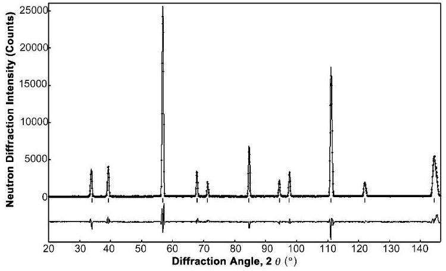
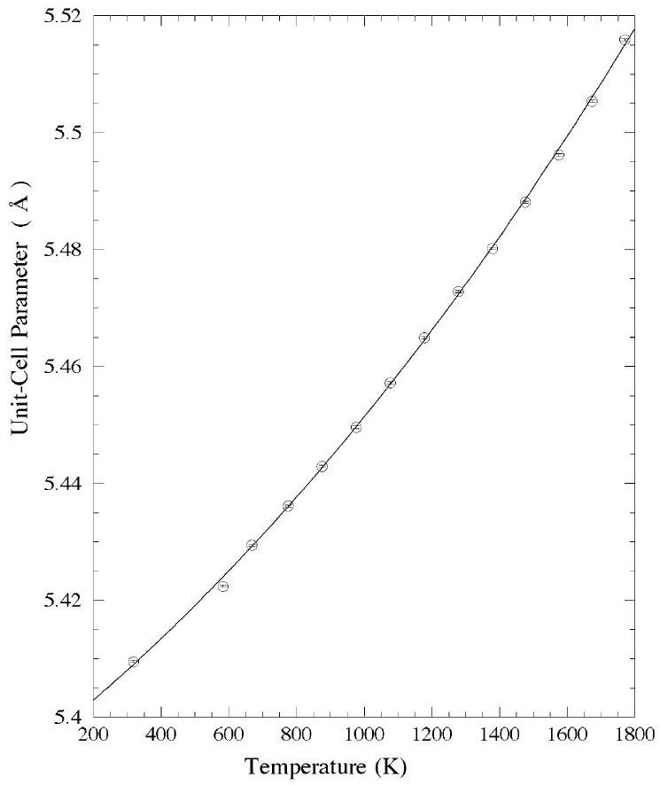
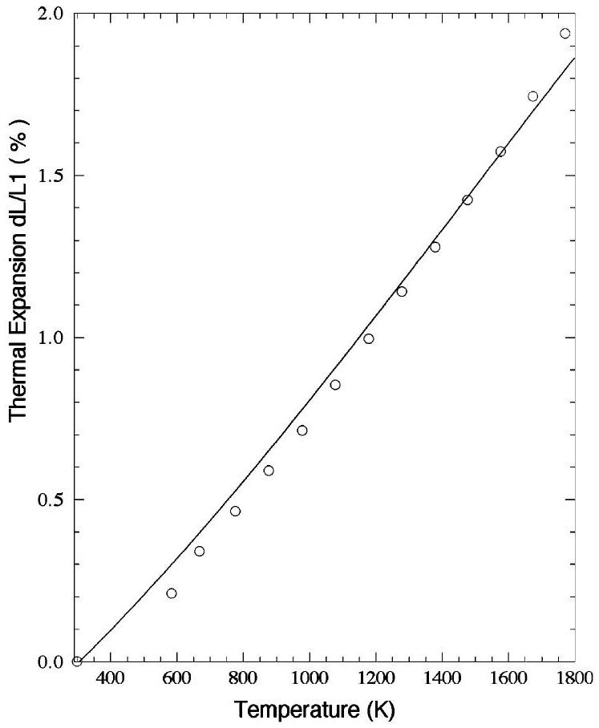
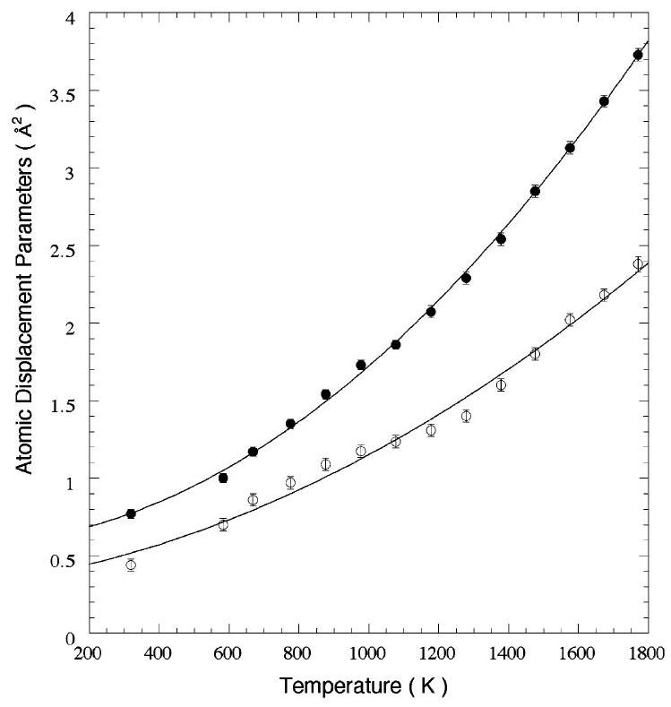

# High-temperature neutron powder diffraction study of cerium dioxide $\mathrm{CeO}_{2}$ up to 1770 K 

Masatomo Yashima ${ }^{\mathrm{a}, *}$, Daiju Ishimura ${ }^{\mathrm{a}}$, Yasuo Yamaguchi ${ }^{\mathrm{b}}$, Kenji Ohoyama ${ }^{\text {b }}$, Katsuhiro Kawachi ${ }^{\text {c }}$ ${ }^{\mathrm{a}}$ Department of Materials Science and Engineering, Interdisciplinary Graduate School of Science and Engineering, Tokyo Institute of Technology, 4259 Nagatsuta-cho, Midori-ku, Yokohama 226-8502, Japan ${ }^{\mathrm{b}}$ Institute for Materials Research, Tohoku University, Katahira 2-1-1, Aoba-ku, Sendai 980-8577, Japan ${ }^{\mathrm{c}}$ Daiichi Kigenso Kagaku Kogyo, Hirabayashi-Minami 1-6-38, Suminoe-ku, Osaka 559-0025, Japan

Received 12 February 2003; in final form 20 March 2003

#### Abstract

We have investigated the temperature dependence of unit-cell and structural parameters of ceria (cerium dioxide, $\mathrm{CeO}_{2}$ ) from room temperature to 1770 K by neutron powder diffraction and the Rietveld method. The unit-cell parameter increases continuously with temperature. It was confirmed that the Debye-Waller factor of oxygen $B(\mathrm{O})$ is larger than that of cerium $B(\mathrm{Ce})$ at any temperature from room temperature to 1770 K . Both $B(\mathrm{O})$ and $B(\mathrm{Ce})$ increase with an increase of temperature.

© 2003 Elsevier Science B.V. All rights reserved.

## 1. Introduction

Cerium dioxide (ceria, $\mathrm{CeO}_{2}$ ) based materials are of considerable interest for potential use as electrolytes in solid oxide fuel cells (SOFCs) due to a higher oxygen ionic conductivity than that of stabilized zirconia and a lower cost comparing with lanthanum gallate-based phases $[1-5]$. Other promising applications of ceria-based materials include automotive catalysts, SOFCs anode materials, solid-electrolyte oxygen pumps, and mixedconducting membranes for oxygen separation and

[^0]partial oxidation of hydrocarbons [6-9]. Many ceria-based materials are utilized at high temperatures. Knowledge of the temperature dependence of unit-cell parameters is very useful in designing the component of the SOFCs $[10,11]$. Therefore many researchers have studied the thermal expansion of ceria and ceria-based materials by means of dilatometry. The thermal expansion obtained by the dilatometry strongly depends on the apparent density and microstructure of the materials. Neutron powder diffraction technique is able to determine exact thermal expansion of materials by measuring the lattice parameters. This method has some merits overcoming the conventional X-ray powder diffraction technique [12]. The neutron scattering length of oxygen in ceria is
relatively large comparing with its X-ray scattering factor. The change of sample surface does not influence on the results of Rietveld analyses of neu-tron-diffraction data, although it is often serious problem in the X-ray powder diffraction analyses. However, there have been very little reports on the temperature dependence of unit-cell and structural parameters measured in situ at high temperatures by using neutron powder diffraction techniques. In this Letter, we report the results of high-temperature neutron powder diffraction experiments for ceria $\mathrm{CeO}_{2}$. This study provides crucial information for understanding the physical model concerning the ceria-based materials.

## 2. Experimental procedure

To investigate the temperature dependence of unit-cell and structural parameters of ceria, neutron powder diffraction experiments were carried out at high temperatures. High-purity ceria powders were pressed into pellets, and they were sintered at 1770 K for 5 h . The cylindrical sintered product of 16 mm in diameter and of 410 mm in height was obtained after the sintering. Neutron powder diffraction measurements were performed in air with a 150-detector system, HERMES [13], installed at the JRR-3M reactor in Japan Atomic Energy Research Institute, Tokai, Japan. Neutrons with wavelength $1.8207 \AA$ were obtained by the (311) reflection of a Ge monochromator. Diffraction data were collected in the $2 \theta$ range from $20^{\circ}$ to $150^{\circ}$ in step interval of $0.1^{\circ}$, in the temperature range from room temperature to 1770 K . A furnace with $\mathrm{MoSi}_{2}$ heaters was placed on the sample table, and used for neutron diffraction measurements at high temperatures $[12,14]$. The temperature was kept constant within $\pm 1.5 \mathrm{~K}$ during each data collection. The unit-cell parameter and Debye-Waller factors of ceria were refined by Rietveld analysis using a computer program RIETAN-2000 [15].

## 3. Results and discussion

Rietveld analyses of neutron powder diffraction data of ceria measured in the whole tem-
perature range were performed assuming the ideal fluorite-type structure (space group Fm $\overline{3} m$ ). The cerium and oxygen ions were assumed to be located in special positions $4(a)$ and $8(c)$, respectively. The occupancy of cerium ion was

Fig. 1. Rietveld analysis pattern of neutron powder diffraction data of ceria measured at 1770 K . The solid lines are calculated intensities and the crosses are observed intensities. The short vertical lines show the position of possible Bragg reflections. The difference between observed and calculated intensities is plotted below the profiles.

Fig. 2. Temperature dependence of unit-cell parameter of ceria.

assumed to be unity. The occupancy of oxygen ion was refined and confirmed to be 1.0 . Thus, it was fixed to be unity in the final refinement. The calculated profile pattern showed a good fitness with the observed one, even at 1770 K (Fig. 1). Fig. 2 shows the temperature dependence of unit-cell parameter of ceria. The refined unit-cell parameter of ceria increased smoothly with an increase of temperature due to the thermal expansion. In fact, the thermal expansion $\Delta L / L 1$ calculated from the present unit-cell parameters (open circles in Fig. 3) agree with that obtained by a thermal mechanical analysis in the literature [16] (solid line in Fig. 3). The thermal expansion $\Delta L / L 1$ is defined by
$\frac{\Delta L}{L 1} \equiv \frac{a(T)-a(T=298 \mathrm{~K})}{a(T=298 \mathrm{~K})}$,
where $a(T)$, and $a(T=298 \mathrm{~K})$ are the unit-cell parameters at a temperature $T$ and at 298 K , respectively.

Fig. 3. Temperature dependence of linear thermal expansion of ceria. Circles denote the linear thermal expansion calculated from the present crystal data. Solid line is data through thermomechanical analysis in the literature [16].

Fig. 4 shows the temperature dependence of Debye-Waller factors for cerium $B(\mathrm{Ce})$ and for oxygen $B(\mathrm{O})$. It was confirmed that the DebyeWaller factor of oxygen is larger than that of cerium at any temperature in the whole temperature range from room temperature to 1770 K. Faber et al. [17,18] reported that the DebyeWaller factor $B(\mathrm{O})$ is larger than $B(\mathrm{Ce})$ at 1173 K, but they did not measure at different temperatures. The inequality $B(\mathrm{O})>B(\mathrm{Ce})$ indicates that the thermal disorder of oxide ion from the ideal $8 c 0.25,0.25,0.25$ site of $F m \overline{3} m$ is larger than that of cerium ion from ideal $4 a 0,0,0$ position in the ceria. This structural feature is consistent with the fact that the ceria is an oxide ion conductor. Both $B(\mathrm{O})$ and $B(\mathrm{Ce})$ increased smoothly with an increase of temperature in the whole temperature region (Fig. 4). The increase of $B(\mathrm{O})$ with temperature indicates the increase of the thermal disorder of oxide ion from the ideal $8 c$ site of Fm $\overline{3} m$ in ceria. This structural feature is consistent with the increase of oxide ion conductivity with temperature.

Fig. 4. Temperature dependence of Debye-Waller factors for Ce atom (Open circles) and for oxygen atom (closed circles) in ceria.

## 4. Conclusions

In the present study we precisely determined the temperature dependence of the unit-cell parameter and Debye-Waller factors of ceria $\mathrm{CeO}_{2}$ by means of high-temperature neutron powder diffraction technique. The unit-cell parameter increases continuously with an increase of temperature. The Debye-Waller factor of oxygen $B(\mathrm{O})$ is larger than that of cerium $B(\mathrm{Ce})$ at any temperature from room temperature to 1770 K . Both $B(\mathrm{O})$ and $B(\mathrm{Ce})$ increase with an increase of temperature. These structural features are consistent with the oxide ion conduction of ceria. This study can provide important information not only for understanding the crystal structure of ceria but also for the practical application of the ceria-based materials. The present high-temperature neutron powder diffraction technique would yield many applications in high-temperature chemical physics.

## Acknowledgements

We express special thanks to Mr. K. Nemoto, A. Sakai and M. Mori for experimental assistance. This work was supported partly by Grant-in-Aids for Scientific Research (B) of the Monbu-Kagaku-sho.

## References

[1] M. Mogensen, N.M. Sammes, G.A. Tompsett, Solid State Ion. 129 (2000) 63.
[2] M. Yashima, S. Sasaki, Y. Yamaguchi, M. Kakihana, M. Yoshimura, T. Mori, Appl. Phys. Lett. 72 (1998) 182.
[3] H. Inaba, H. Tagawa, Solid State Ion. 83 (1996) 1.
[4] T. Kudo, H. Obayashi, J. Electrochem. Soc. 123 (1976) 415.
[5] M. Godickemeier, L.J. Gauckler, J. Electrochem. Soc. 145 (1998) 414.
[6] H.J.M. Bouwmeester, A.J. Burgraaf, in: A.J. Burgraaf, L. Cot (Eds.), Fundamentals of Inorganic Membrane Science and Technology, Elsevier, Amsterdam, 1996, p. 435.
[7] T.J. Mazanec, T.L. Cable, J.G. Frye, W.R. Kliewer, US Patent 5,306,411, 1994.
[8] V.V. Kharton, A.A. Yaremchenko, E.N. Naumovich, F.M.B. Marques, J. Solid State Electrochem. 4 (2000) 243.
[9] V.V. Kharton, A.V. Kovalevsky, A.P. Viskup, F.M. Figueiredo, A.A. Yaremchenko, E.N. Naumovich, F.M.B. Marques, J. Electrochem. Soc. 147 (2000) 2814.
[10] M. Yashima, R. Ali, H. Yoshioka, Solid State Ion. 128 (2000) 105.
[11] M. Yashima, R. Ali, M. Tanaka, T. Mori, Chem. Phys. Lett. 363 (2002) 129.
[12] M. Yashima, J. Am. Ceram. Soc. 85 (2002) 2925.
[13] K. Ohoyama, T. Kanouchi, K. Nemoto, M. Ohashi, T. Kajitani, Y. Yamaguchi, Jpn. J. Appl. Phys. 37 (1998) 3319.
[14] M. Yashima, J. Cryst. Soc. Jpn. 44 (2002) 121.
[15] F. Izumi, T. Ikeda, Mater. Sci. Forum. 321-324 (2000) 198.
[16] S. Sameshima, M. Kawaminami, Y. Hirata, J. Ceram. Soc. Jpn. 110 (2002) 597.
[17] J. Faber Jr., M.A. Seitz, M.H. Mueller, J. Phys. Chem. Solids 37 (1976) 909.
[18] J. Faber Jr., M.A. Seitz, M.H. Mueller, J. Phys. Chem. Solids 37 (1976) 903.

[^0]:    *Corresponding author. Fax: +81-45-924-5630.
    E-mail address: yashima@materia.titech.ac.jp (M. Yashima).

