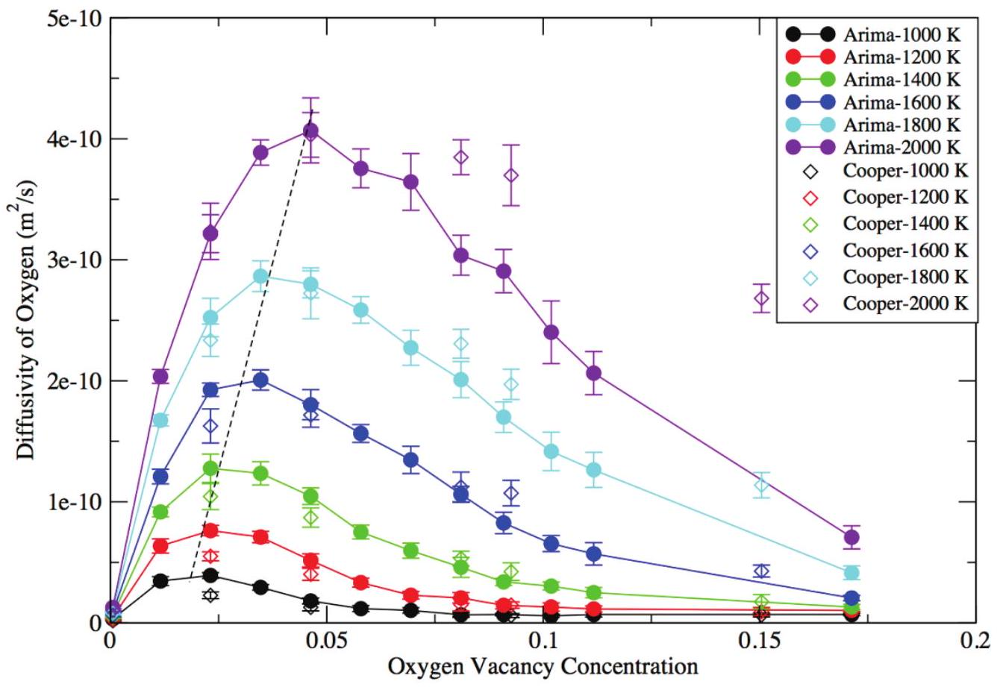
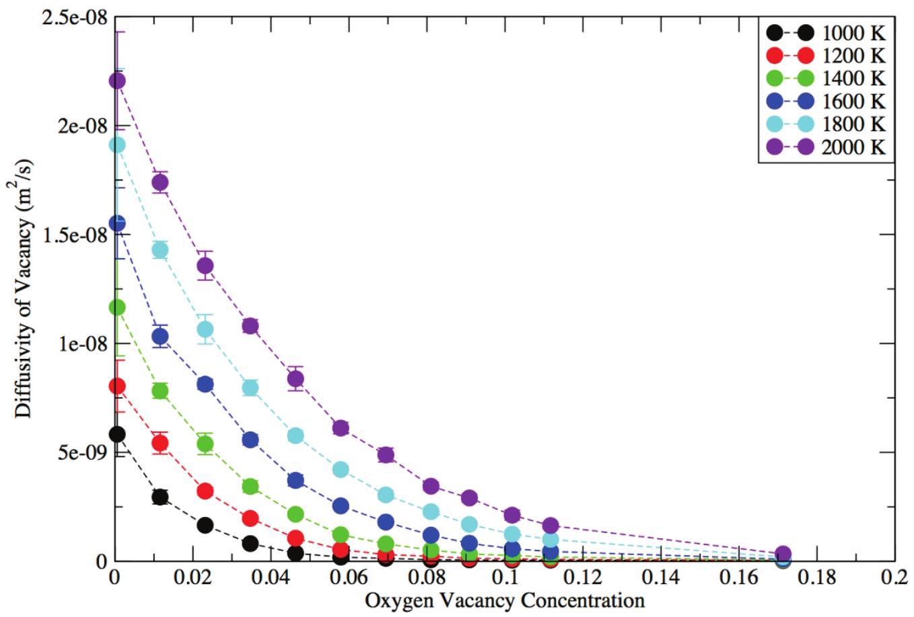
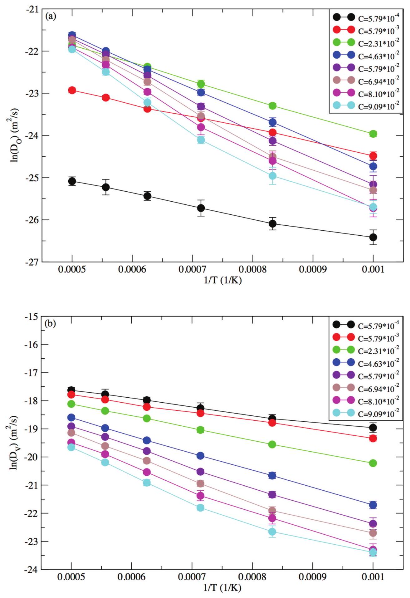
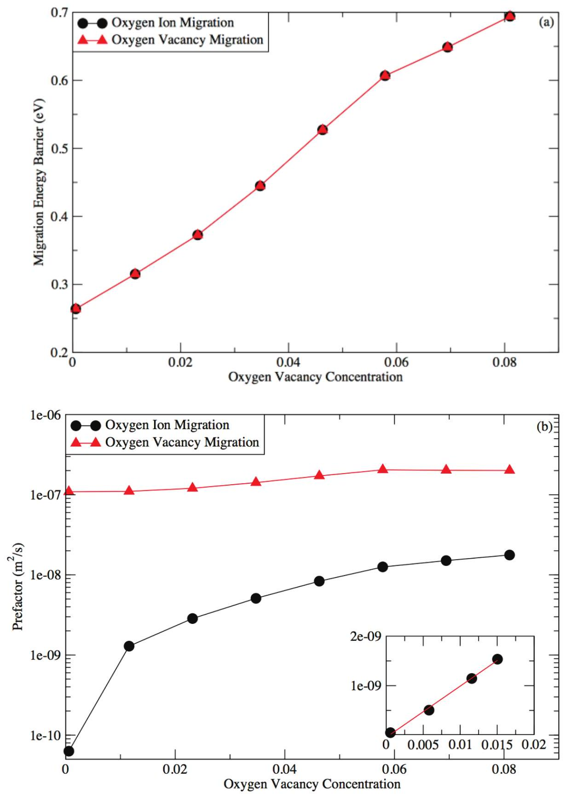
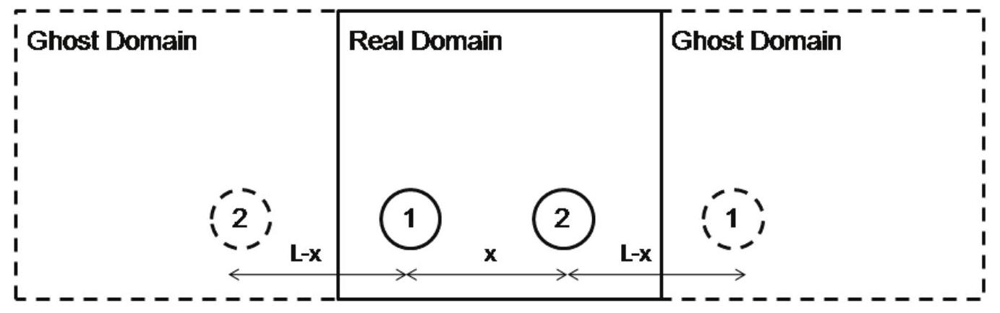
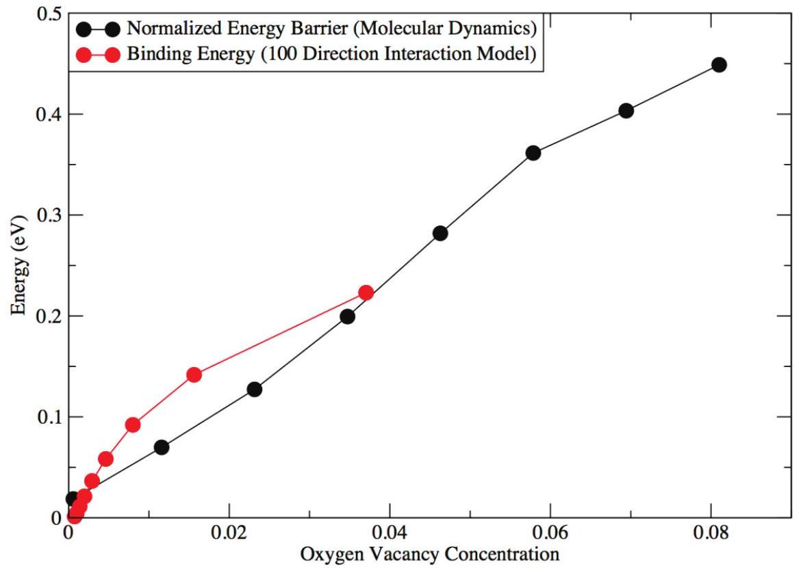
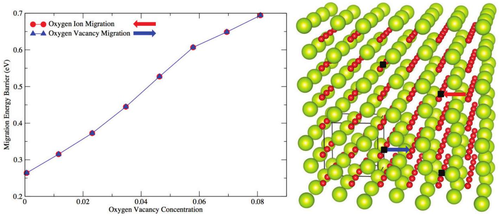

# Vacancy-Vacancy Interaction Induced Oxygen Diffusivity Enhancement in Undoped Nonstoichiometric Ceria 

Fenglin Yuan ${ }^{1, *}$, Yanwen Zhang ${ }^{1,2}$ and William J. Weber ${ }^{1,2, *}$ ${ }^{1}$ Department of Materials Science and Engineering, University of Tennessee, Knoxville, Tennessee 37996, USA ${ }^{2}$ Materials Science \& Technology Division, Oak Ridge National Laboratory, Oak Ridge, Tennessee 37831, USA

#### Abstract

:

Molecular dynamics simulations and molecular static calculations have been used to systematically study oxygen vacancy transport in undoped nonstoichiometric ceria. A strong oxygen diffusivity enhancement appears in the vacancy concentration range of $2-4 \%$ over the temperature range from 1000 to 2000 K . An Arrhenius ion diffusion mechanism by vacancy hopping along the $<100>$ direction is unambiguously identified, and an increasing trend of both the oxygen migration barrier and the prefactor with increasing vacancy concentration is observed. Within the framework of classical diffusion theory, a weak concentration dependence of the prefactor in oxygen vacancy migration is shown to be crucial for explaining the unusual fast oxygen ion migration in the low concentration range and consequently the appearance of a maximum in oxygen diffusivity. A representative $<100>$ direction interaction model is constructed to identify long-range vacancy-vacancy interaction as the structural origin of the positive correlation between oxygen migration barrier and vacancy concentration.

## Introduction

In the past decades, ceria has attracted countless research efforts due to a wide-range of potential applications in solid state fuel cell ${ }^{1-3}$, oxygen sensor ${ }^{4,5}$ and radiation tolerant materials ${ }^{6,7}$. The conduction of oxygen is essential; understanding and optimizing oxygen conductivity is a central task for material scientists. Oxygen diffusion in nonstoichiometric ceria crucially depends on a vacancy-assisted oxygen migration mechanism, and therefore optimization of oxygen vacancy and its neighboring environment becomes the bottleneck ${ }^{8-} { }^{12}$. Experimentally, there are two distinct methods to introduce oxygen vacancies into ceria: one is doping with aliovalent ions, the other is reduction of ceria through tuning the oxygen partial pressure. For defect transport mechanisms, various theories and models ${ }^{13-17}$ centralized on dopant-defect interactions were attempted for doped ceria. Classical defect theory relies on the assumption that defects are far away from each other, such as in the dilute limit. For charged defects, a Debye-Hückel correction ${ }^{18}$ can be applied to account for the effect of Coulombic screening of near-by ions. Hohnke ${ }^{13}$ proposed there may be a deep trapped state for the oxygen vacancy in fluorite structures, where longrange defect-defect interaction prevails, and if so, micro-domain's size may range from 3 to 30 nm . Ling ${ }^{15}$ formulated a statistical-thermodynamic model to demonstrate the importance of long-range defect-defect interactions and exclusion effect in reduced ceria (i.e., oxygen poor environment). Recently, Grope ${ }^{17}$ showed by a kinetic Monte Carlo (KMC) simulation that jump blocking, trapping and vacancy-vacancy interaction should account for the conductivity maxima in Y - and Sm -doped ceria. Dholabhai et al. ${ }^{10}$ used KMC to demonstrate the importance of vacancy-vacancy interaction and dopant trapping of vacancy in Pr-doped ceria. Despite such extensive research on oxygen transport in the literature, limited knowledge exists for undoped nonstoichiometric or reduced ceria. While the first approach is easier to realize in experiments, the introduction of foreign ions make it difficult to assess vacancy-vacancy interactions and concentration effects on oxygen diffusion. A simple environment in reduced ceria allows for a direct assessment of defect-defect interactions and easier interpretation of the correlation between physical interaction and observed properties.

Therefore, in this study we employed atomistic simulation techniques molecular dynamics (MD) simulation and molecular static (MS) calculation to systematically explore oxygen transport in reduced ceria. By such atomistic simulations, we can accurately control the concentration of oxygen vacancies present in ceria and link the atomic level information with macroscopic transport properties.

We found a strong oxygen diffusivity enhancement with increasing oxygen vacancy concentration and attributed this to the weak concentration dependency of the prefactor of oxygen vacancy migration. The origin of the increase of oxygen migration energy barrier with vacancy concentration is pinned down to be long-range vacancy-vacancy interaction and a simple $<100>$ direction interaction model is proposed to predict such a concentration dependency.

## Methodology

Molecular simulations were conducted with the LAMMPS ${ }^{19}$ package with two robust potentials: Buckingham potential from Arima et al. ${ }^{20}$ and many-body potential from Cooper et al. ${ }^{21}$. In order to overcome the attractive force at small separation inherent to the Buckingham potential and realistically model inter-nuclear collision, an interpolation with Ziegler-Biersack-Littmark (ZBL) potential ${ }^{22}$ is applied for short atomic separation. The interpolation uses a fifth order polynomial to ensure the continuity of potential energy, force and force constant at the boundaries. Here we outline mathematical formulae in Table 1, as well as all potential parameters in Table 2 for the Buckingham-ZBL potential. For convenience, we still use the Arima potential to denote short-range modified Buckingham-ZBL potential.

The simulation cell consisted of a $6 \times 6 \times 6$ (12atom) unit cells with 2592 atoms. A variation-cell minimization method with steep-descent algorithm is used to achieve a stress-free state as our starting point. Periodical boundary condition (PBC) is applied in all simulations. Two types of simulations were carried out: one is MS calculations for migration path of oxygen, the other is MD simulations for oxygen diffusion at various temperatures. For MS calculation, nudge elastic band (NEB) method with climbing image ${ }^{23,24}$ was applied for migration path calculation. For MD simulations, a Nose-Hover thermostat ${ }^{25,26}$ and barostat ${ }^{27}$ was applied to achieve and maintain a target temperature and zero external pressure, and the integration timestep for equation of motion was set to 1 fs . Coulombic interaction is computed by Ewald summation method ${ }^{28}$ with a short range cutoff at 1.1 nm and the energy precision up to $10^{-6}$. Oxygen diffusion simulations were conducted with a constant particle number, constant volume and constant energy (NVE) ensemble between 1000 K and 2000 K with a temperature step of 200 K . Eight parallel samples were generated by random deletion of oxygen ions for each target concentration and relaxation of vacancy-induced internal stress under constant number of atom, constant pressure and constant temperature (NPT) ensemble. The total
simulation length for mean square displacement (MSD) part is 1 ns and only the final 500 ps is used for data collection.

## Results

Our approach is validated by the comparison of structural properties and defect formation energies, as shown in Table 3. The calculated structural properties, such as lattice constant, bulk modulus, elastic constants, and cohesive energy, are in reasonable agreement with the results from Cooper et al.'s work ${ }^{21}$ and experiments ${ }^{29-33}$. Bulk modulus and elastic constants were measured by linearly fitting stress-strain curve in the strain range $1 \% \sim 1 \%$. Cohesive energy was evaluated at equilibrium states to be comparable with literature data. Defect formation energy for bound Frenkel or Schottky pairs was computed using the formula: $E_{f}($ Schottky $)=E($ defect $)-(N-3) / N * E($ bulk $) \quad$ and $\mathrm{E}_{\mathrm{f}}($ Frenkel $)=\mathrm{E}($ defect $)-\mathrm{E}($ bulk $)$, where $\mathrm{E}_{\mathrm{f}}$ is the formation energy of Schottky or Frenkel pairs, E (defect) is the equilibrium energy after defect creation and relaxation, N is the total number of atom before defect creation, E(bulk) is the total energy before defect creation. For Frenkel pairs, the defect atom was displaced to the second nearest interstitial site to prevent a spontaneous recombination of interstitial and vacancy. For cation Frenkel pairs, the cation $\mathrm{Ce}^{4+}$ ion was displaced to ( $1 / 2,1 / 2,1 / 2$ ) from ( $0,0,0$ ) in a unit cell. For anion Frenkel pairs, the anion $\mathrm{O}^{2-}$ ion can be displaced to ( $1 / 2,1 / 2,1 / 2$ ) from either ( $-1 / 4,-1 / 4,- 1 / 4)$ or ( $-1 / 4,-1 / 4,1 / 4$ ) and defect pair is named as anion Frenkel pair 1 and pair 2, respectively. For Schottky pairs, one $\mathrm{CeO}_{2}$ unit needs to be removed from the unit cell and three different combinations can be formulated: a) pair 1: remove $\mathrm{Ce}(0,1 / 2$, $1 / 2)$ and $\mathrm{O}(-1 / 4,1 / 4,1 / 4)(1 / 4,1 / 4,1 / 4)$; b) pair 2: remove $\mathrm{Ce}(0,1 / 2,1 / 2)$ and $\mathrm{O}(-1 / 4,1 / 4,1 / 4)(1 / 4$, 3/4, 1/4); c) pair 3: remove $\mathrm{Ce}(0,1 / 2,1 / 2)$ and $\mathrm{O}(- 1 / 4,1 / 4,1 / 4)(1 / 4,3 / 4,3 / 4)$. These three O-O Schottky defects are considered as an edge (pair 1), face diagonal (pair 2) and cubic diagonal (pair 3) of a Ce-centered O-neighbored cube, respectively.

The oxygen diffusivity, $\mathrm{D}_{\mathrm{O}}$, and oxygen vacancy diffusivity, $\mathrm{D}_{\mathrm{v}}$, are obtained from tracking MSD functions of oxygen ion and vacancy with respect to simulation time and are calculated by the following equations:

$$
\begin{aligned}
& D_{O}=\lim _{t \rightarrow \infty} \frac{<r_{O}^{2}(t)-r_{O}^{2}(0)>}{6 t} \\
& D_{V}=\lim _{t \rightarrow \infty} \frac{<r_{V}^{2}(t)-r_{V}^{2}(0)>}{6 t}
\end{aligned}
$$

where $r^{2}{ }_{O}(t)-r^{2}{ }_{O}(0)$ and $r^{2}{ }_{V}(t)-r^{2}{ }_{V}(0)$ are the squared displacement for ion and vacancy at time t ,
respectively. The mean squared displacement for the oxygen vacancy is calculated from that for oxygen ion by the following equation:
$<r^{2}{ }_{V}(t)-r^{2}{ }_{V}(0)>=<r^{2}{ }_{O}(t)-r^{2}{ }_{O}(0)>(1-C) / C$
where C is the concentration of oxygen vacancies.
Concentration-dependent diffusivities of oxygen ion at $1000,1200,1400,1600,1800$ and 2000 K are compared in Figure 1. Maximum peaks appear for all temperatures. The corresponding maximum diffusivity increases with increasing temperature, concurrent with the trend in models and experimental data ${ }^{13-17}$ for doped ceria. Since the Arima and Cooper potentials give very similar results, from now on the results based on Arima potential are discussed unless it's stated otherwise. The concentration dependence of oxygen vacancy diffusivity is shown in Figure 2 from 1000 K to 2000 K . The diffusivity for oxygen vacancy (Figure 2) continuously decreases with increasing defect concentration, in contrast with the trend for the oxygen ion (Figure 1). Diffusivities of oxygen ion and vacancy at selected concentrations are plotted in Figure 3. A linear trend is observed for all concentrations, implying an Arrhenius type mechanism is operating in this temperature range. Subsequently, linear fitting is applied in Figure 4 to obtain the activation energy and the prefactor for the Arrhenius mechanism. As expected, the linear fitting for oxygen ion and vacancy migration give the exact same migration energy barrier and yield a correlation coefficient of 0.996 (Figure 4a). The migration barrier linearly increases with increasing concentration before nonlinearity occurs after $\mathrm{C}=6 \%$. This nonlinear trend is consistent with nonlinear diffusivity versus reciprocal temperature, as shown in Figure 3a after $\mathrm{C}=5.79 \%$. For the linear part in Figure 4, the relation between migration energy and vacancy concentration is determined as $\mathrm{E}_{\text {mig }}=0.2454+6.09^{*} \mathrm{C}$. It's noteworthy that the prefactor, $\mathrm{D}_{0}$, increases very fast for small concentrations ( $\mathrm{C}<2 \%$ ) in the ion migration case compared with the migration energy barrier, and this unusual fast increase of the prefactor directly leads to the appearance of maximum diffusivity peak in Figure 1.

Vacancy-vacancy interactions can be categorized into two types: the first type is elastic interaction mediated by lattice distortion between two vacancies; the second type is electrostatic interaction influenced by charge redistribution and long-range Coulombic force. In molecular dynamics, the vacancy-vacancy interaction can be effectively modeled by including self-self interaction and self-ghost interaction under the PBC , as shown in Figure 5. Since the migration barrier of the oxygen is lowest along the $<100>$ direction, the vacancy-vacancy interaction was
systematically studied by tracking the binding energy for oxygen vacancy pairs along $<100>$ direction. Due to the long-range nature of the Coulombic force between vacancies, we doubled the original 2592 -atom simulation cell along all principle axes to further reduce the self-ghost interaction. In the MD simulation, the migration energy barrier is normalized with respect to the extrapolated barrier (i.e., 0.2454 eV ) at zero vacancy concentration. In Figure 6, the normalized migration energy barrier is compared with binding energy of the oxygen vacancy pair, and a similar increasing trend of energy with increasing concentration is observed in both cases.

## Discussion

## Defect Formation Energy

For the Schottky pair, the systematic decrease of defect formation energy with increasing O-O distance (Table 3) is consistent with literature data ${ }^{21}$ and is attributed to minimizing the O-O vacancy pair's repulsive Coulombic interaction. It's worthnoting that in DFT calculations ${ }^{34}$, Schottky pair 2 is predicted to the most stable Schottky defect, in contrast with our results. This difference may originate from a possible artifact of the small simulation box ${ }^{34}$ (i.e., only 2 by 2 by 2 duplication of original unit cell). From comparison of defect formation energies in Frenkel and Schottky pairs (Table 3), it is expected that Schottky pairs 2 and 3 are the easiest to form, followed by Schottky pair 1 and the anion Frenkel pairs. The most energetically unfavorable defect is the cation Frenkel pair.

## Defect Migration Energy and Prefactor

The migration energy barrier can be computed by either NEB or MSD method. The equivalence of two methods in predicting migration energy barrier is verified by comparing results within a MD framework for $\mathrm{CeO}_{1.99884}$. Small difference of $\mathrm{E}_{\text {mig }}$ between the two methods (less than 0.02 eV ) confirms such equivalence and also indicates oxygen diffusion along <100> direction is dominant. Moreover, we compare our data with literature data in Table 4. A moderate agreement is observed in both the migration energy barrier and the migration prefactor for $\mathrm{CeO}_{1.96875}, \mathrm{CeO}_{1.92}$ and $\mathrm{CeO}_{1.8}$, respectively. Despite that experimental migration energy barrier data determined in a reduced ceria environment are scarce, a decreasing trend of migration energy barrier can be observed for increasing oxygen vacancy concentration at least when concentration is large enough ${ }^{35}$, and this trend is well reproduced in our work. Such a decreasing trend of the migration energy barrier with increasing vacancy concentration may be
attributed to oxygen vacancy trapping states proposed by Hohnke ${ }^{13}$, which can decrease the effective number of mobile vacancy and hence repulsive interactions between them.

## Ion vs Vacancy Diffusion

Assuming one thermal-activated process dominates in diffusion, according to Arrhenius relationship in classical diffusion theory, the diffusivity for oxygen ion and vacancy migration at arbitrary temperature can be expressed as:

$$
\begin{aligned}
& D_{O}=D_{O}^{0} \exp \left(-E_{O}^{m i g} / k_{B} T\right) \\
& D_{V}=D_{V}^{0} \exp \left(-E_{V}^{m i g} / k_{B} T\right) \\
& D_{V}^{0}=a^{2} v_{0} \exp \left(S_{V}^{m i g} / k_{B}\right)
\end{aligned}
$$

where $D_{O}^{0}$ and $D_{V}^{0}$ are prefactors for oxygen and vacancy migration, $E_{O}^{\text {mig }}$ and $E_{V}^{\text {mig }}$ is migration energy barrier for oxygen and vacancy migration, $S_{V}^{\text {mig }}$ is migration entropy for vacancy migration, $a$ is migration length in one jump and $v_{0}$ is vibrational frequency of oxygen vacancy. By taking into account of flux balance between oxygen ions and vacancies ${ }^{36}, \mathrm{D}_{\mathrm{O}}$ and $\mathrm{D}_{\mathrm{V}}$ can be related by:

$$
D_{O}=\frac{C}{1-C} D_{V}
$$

where C is the number concentration of oxygen vacancies. In the small concentration limit ( $\mathrm{C}<2 \%$ ), i.e., C is approaching zero, Equation 7 can be, therefore, approximated by:

$$
D_{O}=C D_{V}
$$

Figure 4 b shows that prefactor for vacancy migration is on the order of $10^{-7} \mathrm{~m}^{2} / \mathrm{s}$, and a weak concentration dependence is observed in the concentration range up to $8 \%$. Therefore, in the small concentration limit ( $\mathrm{C}<2 \%$ ), due to the constant nature of $\mathrm{D}_{\mathrm{v}}$, Equation 8 can be reduced to:

$$
D_{O} \propto C
$$

A strong concentration dependency of $D_{o}$ is shown to follow a linear scaling relationship governed by Equation 9, and it has been confirmed by inset graph in Figure 4b.

By combining the concentration dependence of $\mathrm{E}_{\text {mig }}$ and $\mathrm{D}_{0}$, an analytical model is constructed for a low concentration range ( $\mathrm{C}<6 \%$ ) and to predict the maximum peak concentration in oxygen diffusivity. There are two assumptions: a) the migration energy barrier is linearly dependent on vacancy concentration; and b) the prefactor of vacancy migration can be approximated as a constant. Under
such assumptions, by combining Equations 4, 7 and the $\mathrm{E}_{\text {mig }}$ 's concentration dependence, we've:

$$
D_{O}(C)=\frac{C}{1-C} D_{V} \exp \left(-\frac{\alpha C+\beta}{k_{B} T}\right)
$$

where $\alpha$ is 6.09 and $\beta$ is 0.2454 .
Applying the first derivative with respect to C for Equation 10, we obtain:

$$
\frac{d\left[D_{o}(C)\right]}{d C}=\exp \left(-\frac{\alpha C+\beta}{k_{B} T}\right) D_{V} \frac{\alpha C^{2}-\alpha C+k_{B} T}{k_{B} T(1-C)^{2}}
$$

By equating the right hand side of Equation 11 to zero and solving the equation, we get the solutions for the maximum $\mathrm{C}_{\mathrm{M}}$ as:

$$
C_{M}=0.5\left(1-\sqrt{1-\frac{4 k_{B} T}{\alpha}}\right)
$$

Therefore, based on Equation 12 we can estimate the range for maximum peak's concentration, $\mathrm{C}_{\mathrm{M}}$, as from $1.4 \%$ at 1000 K to $2.9 \%$ at 2000 K , which is in qualitative agreement with Figure 1.

## Vacancy-Vacancy Interaction

The vacancy-vacancy interaction in MD with PBC needs to include the self-ghost interaction for common-sized simulation cells due to its long range nature, and a simple case along $<100>$ direction is shown in Figure 5. The observed binding energy of the vacancy pair $\mathrm{U}(\mathrm{x})$ should be a summation function of the real binding energy function $\mathrm{f}(\mathrm{x})$, as expressed by the following equations:

$$
\begin{aligned}
& f(x)+2 f(L-x)=U(x) \\
& 2 f(x)+f(L-x)=U(L-x)
\end{aligned}
$$

where x is the separation distance between two vacancy in real domain, L is the periodical length or box length along a principle axis. By combining Equations 13 and 14, $\mathrm{f}(\mathrm{x})$ can be described by Equation 15:

$$
f(x)=\frac{2}{3} U(L-x)-\frac{1}{3} U(x)
$$

where the real binding energy, $\mathrm{f}(\mathrm{x})$, is expressed from two observed binding energies, $\mathrm{U}(\mathrm{L}-\mathrm{x})$ and $\mathrm{U}(\mathrm{x})$. In order to express binding energy as a function of vacancy concentration, oxygen vacancies can be considered as uniform distribution in crystal and, therefore, the concentration C can be linked with average separation x between nearest vacancies, as described in Equation 16:

$$
C=\frac{V / N_{O}}{x^{3}}
$$

where V is the total volume of simulation box, $\mathrm{N}_{\mathrm{O}}$ is the total number of oxygen lattice sites. By combining Equations 15 and 16, the real binding energy is calculated as a function of concentration, and is compared with normalized oxygen migration energy barrier shown in Figure 6. An increasing
trend of oxygen migration energy barrier with increasing vacancy concentration is unambiguously captured by the simple <100> direction interaction model. The consistency directly proves that a nonnegligible long-range vacancy-vacancy interaction is the main cause of energy barrier increment with oxygen vacancies. Further improvement of the current <100> direction interaction model may be achieved by incorporation of interaction along <110> and <111> directions.

## Conclusion

In conclusion, a strong vacancy concentration dependent oxygen diffusivity enhancement is reported for undoped nonstoichometric bulk ceria, evidenced by molecular dynamics simulations. Based on classical diffusion theory, a weak concentration dependency of the prefactor in vacancy migration results in a fast increase of prefactor ( $\mathrm{C}<2 \%$ ) and consequently appearance of a diffusivity maximum for ion migration. In the low concentration range ( $\mathrm{C}<6 \%$ ), the migration energy barrier is predicted to be linear with concentration by a correlation coefficient 0.996 and such a linear increase is attributed to long-range vacancyvacancy interaction evidenced by a simple $<100>$ direction interaction model.

In a reduced ceria environment using a simplified model, we demonstrate the crucial role of the longrange vacancy-vacancy interaction in vacancyassisted dynamics of ionic conductors. This study shows a strong influence of vacancy-vacancy interaction on ion diffusion for undoped ceria due to one order of magnitude enhancement of oxygen ion diffusivity. Our work paves the way for predicting the optimal oxygen vacancy concentration and optimizing the ion diffusion related properties in nonstoichiometric fluorite structures. Future work includes investigating the competition and/or cooperation between dopantdefect interaction and defect-defect interaction in doped ionic conductors.

## Author Information

## Corresponding Author

*Email: wjweber@utk.edu or fyuan5@utk.edu

## Notes

The author declares no competing financial interest.

## Acknowledgement

We're grateful for stimulating discussions with Dr. Bin Liu and Dr. Dilpuneet S. Aidhy. This research
was supported by the U.S. Department of Energy, Office of Science, Basic Energy Sciences, Materials Sciences and Engineering Division. The computer simulations were performed at the National Energy Research Scientific Computing Center at Lawrence Berkeley National Laboratory, which is supported by the Office of Science, U.S. Department of Energy under Contract No. DEAC02-05CH11231.

## References

(1) Badwal, S. P. S.; Foger, K. Solid Oxide Electrolyte Fuel Cell Review. Ceram. Int. 1996, 22 (3), 257-265.
(2) Stambouli, A. B.; Traversa, E. Solid Oxide Fuel Cells (SOFCs): A Review of an Environmentally Clean and Efficient Source of Energy. Renew. Sustain. Energy Rev. 2002, 6 (5), 433-455.
(3) Zhu, W. Z.; Deevi, S. C. A Review on the Status of Anode Materials for Solid Oxide Fuel Cells. Mater. Sci. Eng. A 2003, 362 (1-2), 228-239.
(4) Fergus, J. W. Doping and Defect Association in Oxides for Use in Oxygen Sensors. J. Mater. Sci. 2003, 38 (21), 4259-4270.
(5) Jasinski, P.; Suzuki, T.; Anderson, H. U. Nanocrystalline Undoped Ceria Oxygen Sensor. Sens. Actuators B-Chem. 2003, 95 (1-3), 73-77.
(6) Edmondson, P. D.; Zhang, Y.; Moll, S.; Namavar, F.; Weber, W. J. Irradiation Effects on Microstructure Change in Nanocrystalline Ceria - Phase, Lattice Stress, Grain Size and Boundaries. Acta Mater. 2012, 60 (15), 54085416.
(7) Zhang, Y.; Aidhy, D. S.; Varga, T.; Moll, S.; Edmondson, P. D.; Namavar, F.; Jin, K.; Ostrouchov, C. N.; Weber, W. J. The Effect of Electronic Energy Loss on Irradiation-Induced Grain Growth in Nanocrystalline Oxides. Phys. Chem. Chem. Phys. 2014, 16 (17), 8051.
(8) Andersson, D. A.; Simak, S. I.; Skorodumova, N. V.; Abrikosov, I. A.; Johansson, B. Optimization of Ionic Conductivity in Doped Ceria. Proc. Natl. Acad. Sci. U. S. A. 2006, 103 (10), 3518-3521.
(9) Nakayama, M.; Martin, M. First-Principles Study on Defect Chemistry and Migration of Oxide Ions in Ceria Doped with Rare-Earth Cations. Phys. Chem. Chem. Phys. 2009, 11 (17), 3241.
(10) Dholabhai, P. P.; Anwar, S.; Adams, J. B.; Crozier, P.; Sharma, R. Kinetic Lattice Monte Carlo Model for Oxygen Vacancy Diffusion in Praseodymium Doped Ceria: Applications to Materials Design. J. Solid State Chem. 2011, 184 (4), 811-817.
(11) Dholabhai, P. P.; Anwar, S.; Adams, J. B.; Crozier, P. A.; Sharma, R. Predicting the Optimal Dopant Concentration in Gadolinium Doped Ceria: A Kinetic Lattice Monte Carlo Approach. Model. Simul. Mater. Sci. Eng. 2012, 20 (1), 015004.

Dholabhai, P. P.; Adams, J. B. A Blend of FirstPrinciples and Kinetic Lattice Monte Carlo Computation to Optimize Samarium-Doped Ceria. J. Mater. Sci. 2012, 47 (21), 7530-7541.
Hohnke, D. K. Ionic Conduction in Doped Oxides with the Fluorite Structure. Solid State Ion. 1981, 5, 531-534.
Adler, S. B.; Smith, J. W. Effects of LongRange Forces on Oxygen Transport in YttriaDoped Ceria: Simulation and Theory. J. Chem. Soc. Faraday Trans. 1993, 89 (16), 3123.
Ling, S. High-Concentration Point-Defect Chemistry: Statistical-Thermodynamic Approach Applied to Nonstoichiometric Cerium Dioxides. Phys. Rev. B 1994, 49 (2), 864-880.
Meyer, M.; Nicoloso, N.; Jaenisch, V. Percolation Model for the Anomalous Conductivity of Fluorite-Related Oxides. Phys. Rev. B 1997, 56 (10), 5961-5966.
Grope, B. O. H.; Zacherle, T.; Nakayama, M.; Martin, M. Oxygen Ion Conductivity of Doped Ceria: A Kinetic Monte Carlo Study. Solid State Ion. 2012, 225, 476-483.
Fowler, S. R. H.; Guggenheim, E. A. Statistical Thermodynamics: A Version of Statistical Mechanics for Students of Physics and Chemistry; University Press (printed by W. Lewis), 1939.
Plimpton, S. Fast Parallel Algorithms for ShortRange Molecular-Dynamics. J. Comput. Phys. 1995, 117 (1), 1-19.
Arima, T.; Yamasaki, S.; Torikai, S.; Idemitsu, K.; Inagaki, Y.; Degueldre, C. Molecular Dynamics Simulation of Zirconia-Based Inert Matrix Fuel. J. Alloys Compd. 2005, 398 (1-2), 296-303.
Cooper, M. W. D.; Rushton, M. J. D.; Grimes, R. W. A Many-Body Potential Approach to Modelling the Thermomechanical Properties of Actinide Oxides. J. Phys. Condens. Matter 2014, 26 (10), 105401.
Ziegler, J. F. The Stopping and Range of Ions in Solids, First Edition.; Pergamon Pr, 1985.
Henkelman, G.; Jónsson, H. Improved Tangent Estimate in the Nudged Elastic Band Method for Finding Minimum Energy Paths and Saddle Points. J. Chem. Phys. 2000, 113 (22), 99789985.
(24) Henkelman, G.; Uberuaga, B. P.; Jónsson, H. A Climbing Image Nudged Elastic Band Method for Finding Saddle Points and Minimum Energy Paths. J. Chem. Phys. 2000, 113 (22), 99019904.

Nose, S. A Unified Formulation of the Constant Temperature Molecular-Dynamics Methods. $J$. Chem. Phys. 1984, 81 (1), 511-519.
Nose, S. A Molecular-Dynamics Method for Simulations in the Canonical Ensemble. Mol. Phys. 1984, 52 (2), 255-268.
Shinoda, W.; Shiga, M.; Mikami, M. Rapid Estimation of Elastic Constants by Molecular Dynamics Simulation under Constant Stress. Phys. Rev. B 2004, 69 (13), 134103.
Ewald, P. P. Die Berechnung Optischer Und Elektrostatischer Gitterpotentiale. Ann. Phys.
1921, 369 (3), 253-287.

Wyckoff, R. W. G. Crystal Structures.; Interscience Publishers: New York, 1963. Nakajima, A.; Yoshihara, A.; Ishigame, M. Defect-Induced Raman Spectra in Doped CeO2. Phys. Rev. B 1994, 50 (18), 13297-13307. Duclos, S. J.; Vohra, Y. K.; Ruoff, A. L.; Jayaraman, A.; Espinosa, G. P. High-Pressure X-Ray Diffraction Study of CeO2 to 70 GPa and Pressure-Induced Phase Transformation from the Fluorite Structure. Phys. Rev. B 1988, 38 (11), 7755-7758.

Gerward, L.; Staun Olsen, J.; Petit, L.; Vaitheeswaran, G.; Kanchana, V.; Svane, A. Bulk Modulus of CeO2 and PrO2-An Experimental and Theoretical Study. J. Alloys Compd. 2005, 400 (1-2), 56-61.
(33) Voloshina, E.; Paulus, B. Influence of Electronic Correlations on the Ground-State Properties of Cerium Dioxide. J. Chem. Phys. 2006, 124 (23), 234711.

Xiao, H. Y.; Zhang, Y.; Weber, W. J. Trapping and Diffusion of Fission Products in ThO2 and CeO2. J. Nucl. Mater. 2011, 414 (3), 464-470. Steele, B. C. H.; Floyd, J. M. The Oxygen SelfDiffusion and Electrical Transport Properties of Non-Stoicheiometric Ceria and Ceria Solid Solutions. Proc Brit Ceram. Soc 1971, 19, 5576.

Chroneos, A.; Yildiz, B.; Tarancón, A.; Parfitt, D.; Kilner, J. A. Oxygen Diffusion in Solid Oxide Fuel Cell Cathode and Electrolyte Materials: Mechanistic Insights from Atomistic Simulations. Energy Environ. Sci. 2011, 4 (8), 2774-2789.
Nolan, M.; Fearon, J. E.; Watson, G. W. Oxygen Vacancy Formation and Migration in Ceria. Solid State Ion. 2006, 177 (35-36), 3069-3074.
Xiao, H. Y.; Weber, W. J. Oxygen Vacancy Formation and Migration in $\mathrm{Ce}{ }_{x}$ Th ${ }_{1-x} \mathrm{O}_{2}$ Solid Solution. J. Phys. Chem. B 2011, 115 (20), 6524-6533.

## Tables:

Table 1. Mathematical formulae for Arima potential.
Table 2. Arima potential parameters for modeling ceria.
Table 3. Comparison of structural properties and defect formation energies between current work and available references including experiments and Density Functional Theory (DFT) results. For the last column, all data are from experiments unless a DFT postfix is appended.

Table 4. Migration energy barrier and prefactor for oxygen ion diffusion.

## Figures:

Figure 1. Vacancy concentration dependency of oxygen ion diffusivity for Arima and Cooper potentials at 1000 K , $1200 \mathrm{~K}, 1400 \mathrm{~K}, 1600 \mathrm{~K}, 1800 \mathrm{~K}$ and 2000 K , respectively. Black dashed line is a guide for eye of maximum oxygen diffusivity.

Figure 2. Vacancy concentration dependency of oxygen vacancy diffusivity for Arima potential at $1000 \mathrm{~K}, 1200 \mathrm{~K}$, $1400 \mathrm{~K}, 1600 \mathrm{~K}, 1800 \mathrm{~K}$ and 2000 K , respectively.

Figure 3. Natural logarithm of oxygen (a) ion and (b) vacancy diffusivity versus reciprocal temperature at selected concentrations for Arima potential.

Figure 4. Oxygen vacancy concentration dependence of (a) migration energy barrier $E^{m i g}$ and (b) prefactor $D^{0}$ for oxygen ion and vacancy migration by Arima potential. Inset graph shows linear concentration dependency of prefactor for oxygen ion in small concentration $\mathrm{C}<2 \%$ range. Red line in inset graph gives a best linear fitting.

Figure 5. Schematic plot of periodical boundary condition's effect on evaluating binding energy of vacancy 1-2 pair. The real vacancies are shown by solid circles with label 1 and 2 and the ghost vacancies are shown by dashed circles with the same labels. $x$ is separation distance of real vacancy pair 1-2 and $L$ is box length along a principle axis.

Figure 6. Comparison of normalized migration energy barrier in molecular dynamics and binding energy of vacancy pair in 100 direction interaction model.

Table 1. Mathematical formulae for Arima potential.
|  | Buckingham ZBL |
| :--- | :--- |
| Formula | $U\left(r_{i j}\right)=A e^{-r_{i j} / \rho}-\frac{C}{r_{i j}{ }^{6}} \quad U\left(r_{i j}\right)=\frac{Z_{i} Z_{j}}{4 \pi \varepsilon_{0} r_{i j}} \phi\left(\frac{r_{i j}}{a}\right)$ |
| Notes | $\begin{aligned} & \phi(x)=0.1875 e^{-3.1998 x}+0.50986 e^{-0.94229 x}+0.28022 e^{-0.4029 x}+0.02817 e^{-0.20162 x} \\ & a=\frac{0.46850}{Z_{i}^{0.23}+Z_{j}^{0.23}} \\ & \mathrm{Z}_{\mathrm{i}}, \mathrm{Z}_{\mathrm{j}} \text { is atom i and } \mathrm{j} \text { 's proton charge number } \end{aligned}$ |

Table 2. Arima potential parameters for modeling ceria.
| Parameters | 0-0 | O-Ce | Ce-Ce |
| :--- | :--- | :--- | :--- |
| A (eV) | 22760 | 1176.3 | 0.0 |
| $\rho(\AA)$ | 0.149 | 0.381 | 1.0 |
| $\mathrm{C}\left(\mathrm{eV} \cdot \AA^{6}\right)$ | 27.89 | 0.0 | 0.0 |
| $\mathbf{R}_{\mathbf{1}} \boldsymbol{(} \mathbf{\AA} \boldsymbol{)}$ | 0.5 | 0.2 | 0.9 |
| $\mathbf{R}_{\mathbf{2}} \boldsymbol{(} \mathbf{\AA} \boldsymbol{)}$ | 1.0 | 0.5 | 1.0 |
| $\mathrm{P}_{0}(\mathrm{eV})$ | 4486.031 | 89966.209 | 0.0 |
| $\mathbf{P}_{\mathbf{1}}(\mathrm{eV})$ | -26214.833 | -1029541.678 | 0.0 |
| $\mathbf{P}_{1}(\mathbf{e V})$ | 65285.532 | 5176616.388 | 0.0 |
| $\mathbf{P}_{\mathbf{1}}(\mathrm{eV})$ | -83317.526 | -13507183.927 | 0.0 |
| $\mathbf{P}_{\mathbf{1}}(\mathbf{e V})$ | 53225.220 | 17689356.720 | 0.0 |
| $\mathbf{P}_{1}(\mathrm{eV})$ | -13464.617 | -9159027.916 | 0.0 |
| Notes | $P(x)=\sum_{i=0}^{5} P_{i} x^{i}$   $\mathrm{R}_{1}, \mathrm{R}_{2}$ is the low and upper boundary for polynomial function $\mathrm{P}(\mathrm{x})$   $\mathrm{P}_{0}, \mathrm{P}_{1}, \mathrm{P}_{2}, \mathrm{P}_{3}, \mathrm{P}_{4}, \mathrm{P}_{5}$ is the prefactors for polynomial function $\mathrm{P}(\mathrm{x})$ |  |  |

Table 3. Comparison of structural properties and defect formation energies between current work and available references including experiments and Density Functional Theory (DFT) results. For the last column, all data are from experiments unless a DFT postfix is appended.
|  | Arima (our work) | Cooper (our work) | Cooper (reference) | Experiment or DFT Results |
| :--- | :--- | :--- | :--- | :--- |
| Structural Property |  |  |  |  |
| Lattice constant ( Å ) | 5.413 | 5.414 | $5.412^{21}$ | $5.411{ }^{29}$ |
| Bulk Modulus (GPa) | 225.1 | 190.9 | $202.0^{21}$ | $204^{30}, 230^{31}, 236^{32}$ |
| $\mathrm{C}_{11}(\mathrm{GPa})$ | 476.5 | 387.8 | $405.2^{21}$ | $403^{30}$ |
| $\mathrm{C}_{12}(\mathrm{GPa})$ | 99.4 | 92.4 | $100.5^{21}$ | $105^{30}$ |
| $\mathrm{C}_{44}(\mathrm{GPa})$ | 95.8 | 64.8 | $66.8^{21}$ | $60^{30}$ |
| Cohesive Energy (eV/atom) | 34.6 | 13.4 | N.A. | $21.2^{33}$ |
| Defect Formation Energy (eV) |  |  |  |  |
| Cation Frenkel Pair | 19.96 | 12.53 | $12.55^{21}$ | $16.7^{34}, \quad 16.53^{21}$ (DFT) ${ }^{\mathrm{a}}$ |
| Anion Frenkel Pair 1 | 6.23 | 5.21 | $5.22^{21}$ | $7.0^{34}$ (DFT) ${ }^{\text {a }}$ |
| Anion Frenkel Pair 2 | 5.88 | 4.82 | $4.83^{21}$ |  |
| Schottky Pair 1 | 5.90 | 6.32 | $6.33^{21}$ | $5.69^{34}$ (DFT) |
| Schottky Pair 2 | 4.85 | 5.44 | $5.44^{21}$ | $5.07^{34}$ (DFT) |
| Schottky Pair 3 | 4.67 | 5.23 | $5.23^{21}$ | $5.15^{34}$ (DFT) |

a. The defect formation energy by DFT labeled by a superscript is isolated defect formation energy. However, our results are for bound defect pairs only. Therefore, no direct comparison with our data can be made.

Table 4. Migration energy barrier and prefactor for oxygen ion diffusion.
|  | Arima | Cooper | DFT | Experiment |
| :--- | :--- | :--- | :--- | :--- |
| Migration Energy Barrier of Oxygen (eV) |  |  |  |  |
| $\mathrm{CeO}_{1.96875}$-NEB Along <100> | 0.432 | 0.443 | $0.46^{8}$, $0.53^{37}, 0.55^{38}$ | $0.52^{35}$ |
| $\mathrm{CeO}_{1.99884}$-NEB Along <100> | 0.258 | 0.358 | N.A. | N.A. |
| CeO1.99884-MSD | 0.262 | 0.343 | N.A. | N.A. |
| $\mathrm{CeO}_{1.92000}-\mathrm{MSD}^{\mathrm{a}}$ | 0.432 | N.A. | N.A. | $0.516^{35}$ |
| $\mathrm{CeO}_{1.80000}-\mathrm{MSD}^{\mathrm{a}}$ | 0.329 | N.A. | N.A. | $0.157^{35}$ |
| Migration Prefactor of Oxygen ( $10^{-10} \mathrm{~m}^{2} / \mathrm{s}$ ) |  |  |  |  |
| $\mathrm{CeO}_{1.92000}-\mathrm{MSD}^{\mathrm{a}}$ | 42 | N.A. | N.A. | 15 |
| $\mathrm{CeO}_{1.80000}-\mathrm{MSD}^{\mathrm{a}}$ | 7.5 | N.A. | N.A. | 6.2 |

a. For CeOx-MSD calculations $(x=1.92$ and 1.8), we only use the diffusivity data in temperature range (1100 to 1400 K ) for linear fitting to be comparable to experimental fitting range ( 1123 to 1423 K ). A simulation cell of 69984 atoms is used to minimize self-ghost's interaction.

Figure 1. Vacancy concentration dependency of oxygen ion diffusivity for Arima and Cooper potentials at 1000 K , $1200 \mathrm{~K}, 1400 \mathrm{~K}, 1600 \mathrm{~K}, 1800 \mathrm{~K}$ and 2000 K , respectively. Black dashed line is a guide for eye of maximum oxygen diffusivity.

Figure 2. Vacancy concentration dependency of oxygen vacancy diffusivity for Arima potential at $1000 \mathrm{~K}, 1200 \mathrm{~K}$, $1400 \mathrm{~K}, 1600 \mathrm{~K}, 1800 \mathrm{~K}$ and 2000 K , respectively.

Figure 3. Natural logarithm of oxygen (a) ion and (b) vacancy diffusivity versus reciprocal temperature at selected concentrations for Arima potential.

Figure 4. Oxygen vacancy concentration dependence of (a) migration energy barrier $E^{m i g}$ and (b) prefactor $D^{0}$ for oxygen ion and vacancy migration by Arima potential. Inset graph shows linear concentration dependency of prefactor for oxygen ion in small concentration $\mathrm{C}<2 \%$ range. Red line in inset graph gives a best linear fitting.

Figure 5. Schematic plot of periodical boundary condition's effect on evaluating binding energy of vacancy 1-2 pair. The real vacancies are shown by solid circles with label 1 and 2 and the ghost vacancies are shown by dashed circles with the same labels. $x$ is separation distance of real vacancy pair 1-2 and $L$ is box length along a principle axis.

Figure 6.Comparison of normalized migration energy barrier in molecular dynamics and binding energy of vacancy pair in 100 direction interaction model.

## Graphic Abstract

Migration barrier for oxygen ion and vacancy migration increases as oxygen vacancy concentration increases.

