□

Cite this: Phys. Chem. Chem. Phys., 2014, 16, 27065

Received 19th September 2014, Accepted 30th October 2014

DOI: 10.1039/c4cp04215h
www.rsc.org/pccp

# Effect of grain size and microstructure on radiation stability of $\mathrm{CeO}_{2}$ : an extensive study 

V. Grover, ${ }^{\star}$ R. Shukla, ${ }^{a}$ Renu Kumari, ${ }^{b}$ B. P. Mandal, ${ }^{a}$ P. K. Kulriya, ${ }^{b}$ S. K. Srivastava, ${ }^{c}$ S. Ghosh, ${ }^{\text {d }}$ A. K. Tyagi ${ }^{\text {a }}$ and D. K. Avasthi ${ }^{\text {b }}$

#### Abstract

To investigate the variation in the radiation stability of ceria with microstructure under the electronic excitation regime, ceria samples sintered under different conditions were irradiated with high energy 100 MeV Ag ions. The ceria nanopowders were synthesized and sintered at $800^{\circ} \mathrm{C}$ (S800), $1000^{\circ} \mathrm{C}$ (S1000) and $1300^{\circ} \mathrm{C}$ (S1300), respectively. The samples with widely varying grain size, densities and microstructure were obtained. The pristine and irradiated samples were studied by X-ray diffraction (XRD), Scanning electron microscopy (SEM), Raman spectroscopy and X-ray photoelectron spectroscopy (XPS). None of the samples amorphized up to the highest fluence of $1 \times 10^{14}$ ions per $\mathrm{cm}^{2}$ employed in this study. XRD and Raman studies showed that the sample with lowest grain size suffered maximum damage while the sample with largest grain size was most stable and showed little change in crystallinity. Raman spectroscopy indicated the enhanced formation of $\mathrm{Ce}^{3+}$ and related defects in the sample with larger grain size after irradiation. The most intriguing result was the absence of $\mathrm{Ce}^{3+}$-related defects in the sample with lowest grain size which actually showed maximum damage upon irradiation. The XPS studies on S 800 and S 1300 provided concrete evidence for the presence of $\mathrm{Ce}^{3+}$ and oxygen ion vacancies in S1300. The grain boundaries and grain size dependent stability have been discussed.

## 1. Introduction

Oxide ceramic fuels in the nuclear applications are subjected to various high energy particles. In particular the fuel matrices are under attack by high energy fission products having typical energies in the range 70 to 100 MeV . Most of the oxide based fuels employed in the nuclear technology crystallize in a fluorite-type lattice. More often than not, ceria, $\mathrm{CeO}_{2}$, is used as a surrogate material for $\mathrm{UO}_{2}, \mathrm{PuO}_{2}$ etc. for studying the material properties of the fuel oxides since ceria possesses an identical structure and has similar thermophysical properties. Furthermore, zirconia and ceria are the possible component of inert matrix fuels such ROX (rock like oxides) ${ }^{1}$ or CERMET fuels etc. In view of importance of ceria in nuclear technology, quite a few studies have been performed on $\mathrm{CeO}_{2}$ wherein the radiation stability of ceria has been explored under low energy ions as well as swift heavy ion irradiation. Sonoda et al. ${ }^{2}$ performed a study involving $\mathrm{CeO}_{2}$ irradiated with 210 MeV Xe ions and they could observe the formation of ion tracks wherein the crystalline lattice structure inside the ion track was maintained.

[^0]Ishikawa et al. ${ }^{3}$ showed detailed structural investigations using XRD thin films irradiated with 150 MeV and $200 \mathrm{MeV}^{197} \mathrm{Au}$ ions that these ion tracks possess a modified crystalline lattice with larger lattice parameters.

It is speculated by Bai et al. ${ }^{4}$ that nanocrystalline materials are likely to be more resistant to radiation damage due to annihilation of defect at the grain boundaries (GBs). It has also been shown that swift heavy ions cause annealing of defects in the carbon nanostructure like carbon nanotubes, fullerenes and graphene. ${ }^{5-8}$ Recently, several nanocrystalline (NC) materials containing a large fraction of GBs like nickel, ${ }^{9}$ copper, ${ }^{9}$ gold, ${ }^{10}$ palladium, ${ }^{11} \mathrm{ZrO}_{2}$, ${ }^{11}$ and $\mathrm{MgGa}_{2} \mathrm{O}_{4}$ (ref. 12) have also been shown to exhibit improved radiation resistance compared with their polycrystalline counterparts. On the other hand it can be argued that the scattering of the electron produced by swift heavy ions (SHI) from the grain boundaries results in confinement of the energy within the grain boundaries, thereby increasing the transient lattice temperature. It is expected that the transient temperature rise will be higher in samples with smaller grain size. ${ }^{13-15}$ This is supposed to cause higher radiation damage. It is therefore interesting to study radiation damage on different grain size-samples of $\mathrm{CeO}_{2}$.

It is well known that the major characteristic of the electronic excitation effect under swift heavy ion irradiation is the formation of continuous ion tracks along ion-paths. ${ }^{16}$ The formation of these ion-tracks would be critically dependent
on the density and packing of the lattice. This implies that the microstructure and powder properties of the material should have an important bearing on the radiation damage brought about on it upon high energy irradiation. Considering the nuclear importance of ceria-based materials in conjunction with curiosity of exploring the dependence of radiation stability on microstructure, in particular the grain size, formed the basis for the present study.

In this study, the ceria nanopowders were synthesized and annealed in pellet form under various conditions. These samples were then irradiated with 100 MeV silver ions and were studied by X-ray diffraction, Raman spectroscopy, scanning electron microscopy and X-ray photoelectron spectroscopy. It is attempted to relate the irradiation behaviour of various sintered ceria samples to their microstructure.

## 2. Experimental

### 2.1 Synthesis

The synthesis was carried out by the self-assisted gel-combustion method. $\mathrm{Ce}\left(\mathrm{NO}_{3}\right)_{3} \cdot 5 \mathrm{H}_{2} \mathrm{O}$ and glycine were used as the reactants. Required amount of $\mathrm{Ce}\left(\mathrm{NO}_{3}\right)_{3} \cdot 5 \mathrm{H}_{2} \mathrm{O}$ (in order to obtain 6 g of $\mathrm{CeO}_{2}$ ) was weighed and dissolved in water. In order to carry out a fuel-deficient combustion, less than stoichiometric amount of glycine was dissolved in the $\mathrm{Ce}\left(\mathrm{NO}_{3}\right) \cdot 5 \mathrm{H}_{2} \mathrm{O}$ solution. This solution, after thermal dehydration (at approx. $80^{\circ} \mathrm{C}$ ), resulted in highly viscous liquids which was made to undergo auto ignition upon raising the temperature, with a rapid evolution of a large volume of gases to produce voluminous powders. The as-synthesized powders were calcined at $600{ }^{\circ} \mathrm{C}$ in static air for 30 min to get rid of the decomposition products and excess carbon, if any. This yielded highly sinter-active ceria nanopowder. The nano-powder, so obtained, was then divided into three parts pelletized and heated at $800^{\circ} \mathrm{C}$ for $2 \mathrm{~h}, 1000^{\circ} \mathrm{C}$ for 2 h and $1300^{\circ} \mathrm{C}$ for 100 h respectively. The aim of these different heat treatments was to obtain different microstructures and grain sizes. The samples heated at $800{ }^{\circ} \mathrm{C}, 1000^{\circ} \mathrm{C}$ and $1300{ }^{\circ} \mathrm{C}$ will henceforth be referred to as S800, S1000 and S1300, respectively, in the rest of the manuscript.

### 2.2 Irradiation and characterization

The products were characterized by powder X-ray diffraction using monochromatized Cu K $\alpha$ radiation on a Philips XRD, model PW 1927. Silicon was used as an external standard for correction due to instrumental broadening. The densities of various pellets were determined by employing Archimedes' principle. The sample pellets were irradiated with 100 MeV Ag ions at various fluences ranging from $1 \times 10^{12}$ to $1 \times 10^{14}$ ions per $\mathrm{cm}^{2}$ at IUAC, New Delhi. The ion flux was less than $3 \times 10^{10}$ ions per $\mathrm{cm}^{2} \mathrm{~s}^{-1}$. XRD spectra were recorded using the in situ XRD facility ${ }^{17}$ consisting of a Bruker D8 Advance diffractometer at IUAC, employing $\mathrm{Cu} \mathrm{K} \alpha$ (1.5406) radiation in the standard ( $\theta-2 \theta$ ) geometry. Raman spectra were recorded in the backscattering geometry with a Renishaw single monochromator equipped with a CCD. The excitation source
was the 488 nm line of Ar-ion laser. The surface morphology of the pristine and irradiated samples was analysed by field emission scanning electron microscopy (FE-SEM) [MIRA, TESCAN] at IUAC, New Delhi. An electron beam of energy 25 keV was used to capture the SEM images in the present case. X-ray photoelectron spectroscopy (XPS) was performed using the PHI 5000 Versa Probe II system. The monochromatic Al Kα radiation ( 1486.6 eV ) at 100 W power was used for the excitation. Under these conditions, the full width at half maximum of the $\mathrm{Ag} 3 \mathrm{~d}_{5 / 2}$ line from a standard Ag sample was about 0.6 eV . The C 1s peak, arising from extrinsic, yet unavoidable carbon on the sample surface, was used as the reference to correct the binding energies for photoelectron energy drifts due to charging effects. For fitting the XPS spectra, the Shirley method of background correction and $20 \%$ Lorentzian $-80 \%$ Gaussian peak fitting was used.

The electronic stopping power and the projected range were calculated using SRIM-2008. ${ }^{18}$ The projected range for 100 MeV Ag ions is $8.37 \mu \mathrm{~m}$, electronic stopping power ( $S_{\mathrm{e}}$ ) is $20 \times 10^{3} \mathrm{eV} \AA^{-1}$ and nuclear stopping power ( $S_{\mathrm{n}}$ ) is $12.8 \mathrm{eV} \AA^{-1}$. The TRIM calculations estimated the numbers of defects as $\sim 5.7 \times 10^{4}$ per ion.

## 3. Results and discussion

### 3.1 Physical characterization

The ceria samples annealed at $800^{\circ} \mathrm{C}, 1000^{\circ} \mathrm{C}$ and $1300^{\circ} \mathrm{C}$ were characterized by X-ray diffraction (XRD). Fig. 1(a) shows the XRD patterns of the ceria powders heated at three different temperatures. It is interesting to compare the XRD patterns of pure ceria annealed at various temperatures. It is quite obvious that the XRD peaks narrow down upon increasing the annealing temperature which can be attributed to increase in particle size. A more interesting observation, though, is that the XRD pattern for S800 is shifted towards lower $2 \theta$ values as compared to rest of the two samples, Fig. 1(b). This implies that the ceria powder at $800^{\circ} \mathrm{C}$ has a slightly higher lattice parameter as compared to the other two. Such kinds of anomalies have been reported in the literature for ceria and have been attributed to the prevalence of point defects such as anion vacancies and formation of $\mathrm{Ce}^{3+} .{ }^{19,20}$

The densities of the ceria samples were also determined by Archimedes' principle. The sample S1300 had $92 \%$ of theoretical density, S1000 had 89\% of theoretical density and S800 was only $79 \%$ dense. All the three ceria samples were also characterized by scanning electron microscopy. Fig. 2 depicts the SEM pictures for the three samples S800, S1000 and S1300. It is clearly observed that the sample S1300 has very well defined crystallites and is highly dense. From the SEM micrographs, it can be deduced that the average particle size is $4-5 \mu \mathrm{~m}$. This is because the nanopowder so obtained was heated at a high heating rate ( $10{ }^{\circ} \mathrm{C} \min ^{-1}$ ) and annealed at $1300^{\circ} \mathrm{C}$ for 100 h . This led to high density and large particle size for this sample. In contrast, the samples heated at $1000^{\circ} \mathrm{C}$ and $800^{\circ} \mathrm{C}$ seem to be less dense, porous and had smaller particle size. For the sample S800, the particle size is less than

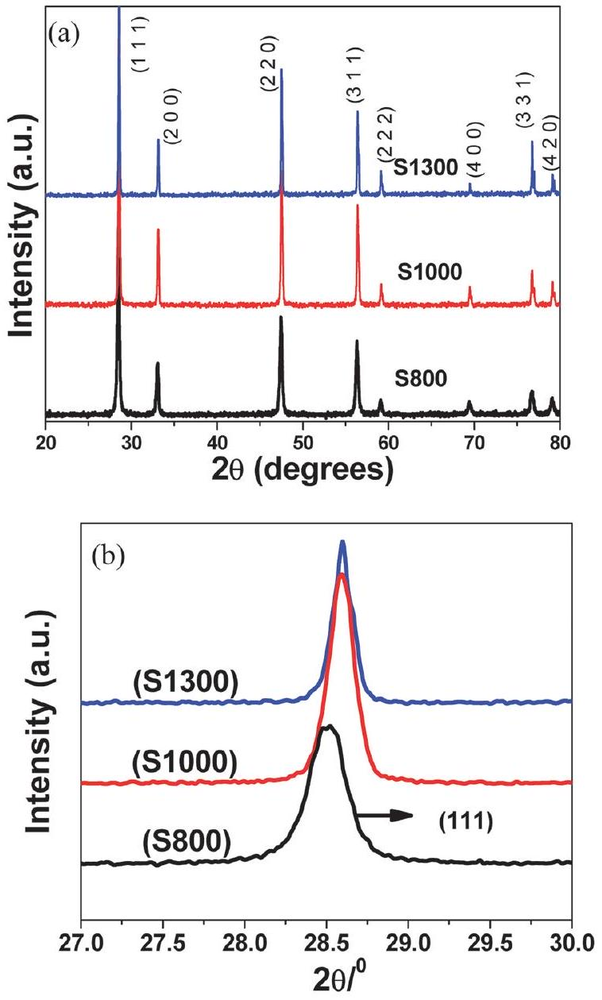
Fig. 1 (a) XRD patterns of the ceria samples annealed at $800{ }^{\circ} \mathrm{C} / 2 \mathrm{~h}$ (S800), $1000^{\circ} \mathrm{C} / 2 \mathrm{~h}$ (S1000), $1300^{\circ} \mathrm{C} / 100 \mathrm{~h}$ (S1300). (b) Relative shifts in the XRD patterns of S800, S1000 and S1300.

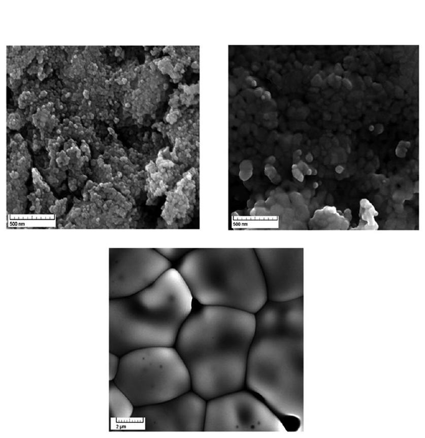
Fig. 2 SEM image of $\mathrm{S} 800, \mathrm{~S} 1000$ and S 1300 .

25 nm and the particles are not well-formed. On the other hand, the heat treatment at $1000^{\circ} \mathrm{C}$ increased the particle size to 50 nm and higher. In particular, upon comparing the micrographs for S800 and S1000 at the $2 \mu \mathrm{~m}$ scale, the formation of spherical grains is clearly obvious in S1000. It may be noted that these particular heat treatments were provided to the nanopowders to obtain different microstructures and particle sizes. It is expected that these different morphological traits will manifest into different radiation stability behaviours.

### 3.2 Behavior under swift heavy ion irradiation

The samples S800, S1000 and S1300 were subjected to irradiation by 100 MeV Ag ion beam with fluences varying from $1 \times 10^{12}$ to $1 \times 10^{14}$ ions per $\mathrm{cm}^{2}$ as described in the experimental section. Fig. 3 to 5 depict the variation of the XRD pattern of S800, S1000 and S1300, respectively, with ion fluence. The most important observation that emerges out of these figures is that none of the samples completely amorphized up to the highest fluence applied i.e. $1 \times 10^{14}$ ions per $\mathrm{cm}^{2}$ which is reasonably high. This indicates tremendous radiation stability of ceria and has immense significance in the context of application of ceria as a host material for nuclear applications.

It is obvious from these three graphs that the broadening of the XRD peaks increases with increase in fluence. The most intense XRD peak (111) has been plotted as a function of fluence and is shown in inset (a) and the variation of the intensity of the (111) peak with fluence is shown in the inset (b) in Fig. 3-5 for corresponding samples. The comparison of these figures shows that the peak broadening is maximum in S800 which implies that the relative damage caused to the lattice in the case of S800 is maximum. In fact, beyond the fluence of $1 \times 10^{13}$ ions per $\mathrm{cm}^{2}$, extra broad humps appear in the XRD patterns of irradiated ceria

## S800

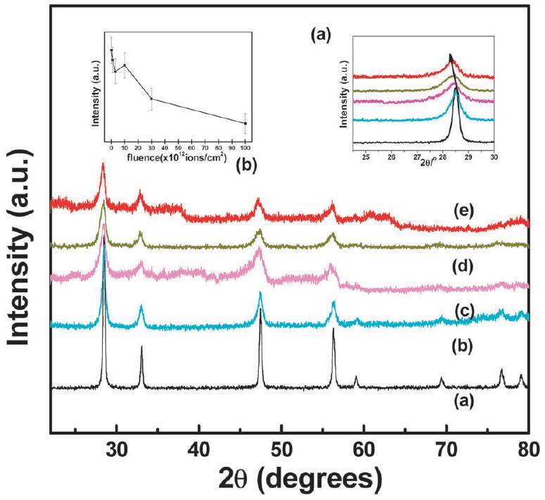
Fig. 3 The in situ XRD patterns of S800 at various fluences; (a) pristine, (b) $3 \times 10^{12}$ ions per $\mathrm{cm}^{2}$, (c) $1 \times 10^{13}$ ions per $\mathrm{cm}^{2}$, (d) $3 \times 10^{13}$ ions per $\mathrm{cm}^{2}$, (e) $1 \times 10^{14}$ ions per $\mathrm{cm}^{2}$. Inset (a): expanded view of the (111) peak. Inset (b): variation of intensity of the (111) peak with fluence.

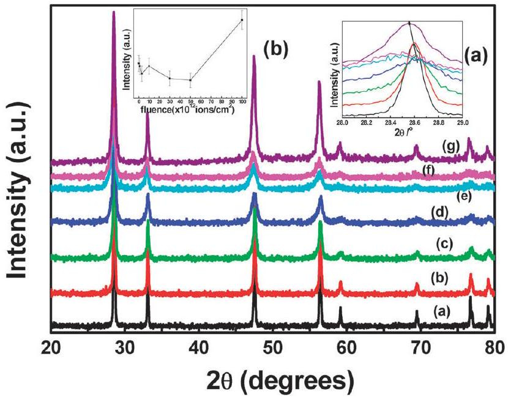
Fig. 4 The in situ XRD patterns of S1000 at various fluences; (a) pristine, (b) $1 \times 10^{12}$ ions per $\mathrm{cm}^{2}$, (c) $3 \times 10^{12}$ ions per $\mathrm{cm}^{2}$, (d) $1 \times 10^{13}$ ions per $\mathrm{cm}^{2}$, (e) $3 \times 10^{13}$ ions per $\mathrm{cm}^{2}$, (f) $5 \times 10^{13}$ ions per $\mathrm{cm}^{2}$, (g) $1 \times 10^{14}$ ions per $\mathrm{cm}^{2}$. Inset (a): expanded view of the (111) peak. Inset (b): variation of intensity of the (111) peak with fluence.

## S1300

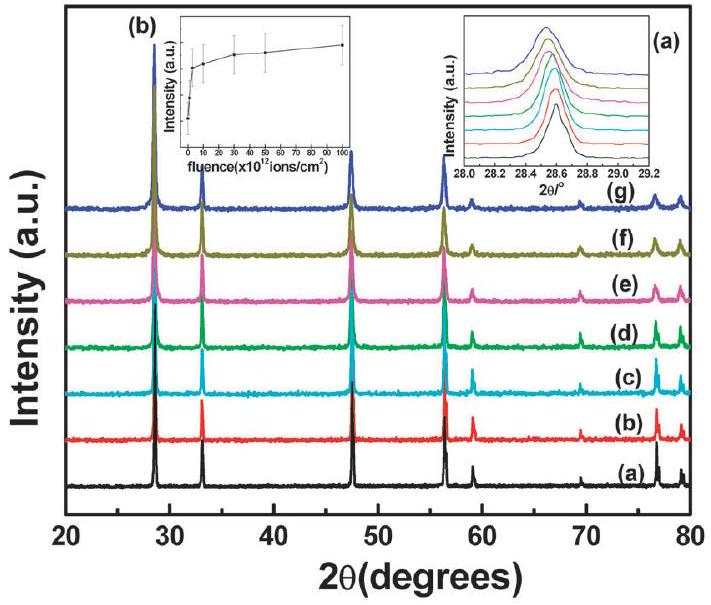
Fig. 5 The in situ XRD patterns of S1300 at various fluences; (a) pristine, (b) $1 \times 10^{12}$ ions per $\mathrm{cm}^{2}$, (c) $3 \times 10^{12}$ ions per $\mathrm{cm}^{2}$, (d) $1 \times 10^{13}$ ions per $\mathrm{cm}^{2}$, (e) $3 \times 10^{13}$ ions per $\mathrm{cm}^{2}$, (f) $5 \times 10^{13}$ ions per $\mathrm{cm}^{2}$, (g) $1 \times 10^{14}$ ions per $\mathrm{cm}^{2}$. Inset (a): expanded view of (111) peak. Inset (b): variation of intensity of (111) peak with fluence.

indicating the damage imparted to the lattice as shown in Fig. 3. The increased disorder or damage to the lattice, upon increasing fluence, can be attributed to temperature spike in the samples. It is expected that a sample with smaller grain size has higher temperature spike as a result of passage of swift heavy ions through the sample. From insets in Fig. 4, it is found that there is a decrease in intensity of XRD peaks or the damage with an increase in fluence followed by recrystallization at a fluence of $1 \times 10^{14}$ ions per $\mathrm{cm}^{2}$ in the sample S1000. Similar behaviour was also observed in the case of swift heavy ion irradiation on pyrochlores. ${ }^{21}$ The intensities of the reflections are continuously decreasing in all the three samples which is due to the fact that
the long range crystallinity and the periodic structure is being compromised upon or in other words the randomisation is increasing with increasing fluence. Though, it must be mentioned that in the sample S1300, both the broadening and the decrease in the intensity is substantially reduced as compared to the other two samples. This is due to the highly dense, crystalline structure of the lattice as is also supported by the SEM image. An interesting observation that must be mentioned is the differential change in X-ray diffraction intensities of some of the peaks. Since this is an in situ X-ray recording on the same pellet, it is justifiable to compare the relative intensities of the peaks in X-ray patterns at different fluences. It is evident from Fig. 5 that all the reflections in the X-ray diffraction pattern do not decrease in intensity to the same extent. No amorphization occurs for the peak (111) as shown in Fig. 5 (inset (b)) whereas radiation damage induced decrease in intensity is highly pronounced for the peak (331). Similarly (220) and (222) also show a relatively high decrease in intensity, whereas (420) and (400) are exceptionally stable relative to other peaks. If we consider the atomic occupancies of these planes, it stresses the fact that the damage is not specific to cerium or oxygen sites e.g. both the planes (400) and (420) show exceptional stability. The (400) plane has four oxygen ( O ) atoms whereas ( 420 ) has one cerium ( Ce ) atom. Hence, it can be assumed that the swift heavy ion irradiation on $\mathrm{CeO}_{2}$ causes damage in a random manner affecting both Ce and oxygen atoms.

Another important observation that emerges out of this study is the relative behaviour of the lattice parameters with increase in fluence for these three samples as revealed in detailed analysis of the most intense peak (111). In the case of S800, Fig. 3 shows that up to $3 \times 10^{12}$ ions per $\mathrm{cm}^{2}$, the most intense (111) peak broadens, however with little change in $d$-values (or $2 \theta$ ). But for a fluence of $1 \times 10^{13}$ ions per $\mathrm{cm}^{2}$ onwards, it appears that the lattice parameter (or the $d$-values) is increasing. However, a very careful observation of the XRD patterns indicates that peaks are becoming asymmetrical. In order to attempt to explain the crystallographic origin of this

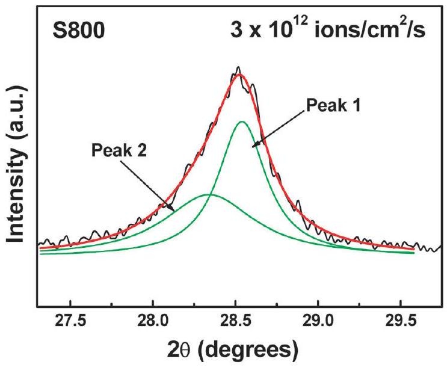
Fig. 6 Representative fitted peak (111) for the S 800 sample irradiated at a fluence of $3 \times 10^{12}$ ions per $\mathrm{cm}^{2}$.

Table 1 The peak values (2 $\theta$ (in degrees)) obtained by deconvoluting peak (111) for S800
| Fluence (ions per cm ${ }^{2}$ ) | Peak 1 (degrees) | Peak 2 (degrees) |
| :--- | :--- | :--- |
| $3 \times 10^{12}$ | 28.5 | 28.3 |
| $1 \times 10^{13}$ | 28.5 | 28.0 |
| $3 \times 10^{13}$ | 28.5 | 27.9 |
| $1 \times 10^{14}$ | 28.4 | 27.6 |

asymmetry, the deconvolution of XRD peaks was performed. Fig. 6 shows a representative deconvolution of the asymmetrical (111) peak into two peaks for S800 at a fluence of $3 \times 10^{12}$ ions per $\mathrm{cm}^{2}$. It is assumed that peak 1 belongs to the main matrix and peak 2 belongs to the "damaged zone". It has been argued by Ishikawa et al. that the higher d value (or lower $2 \theta$ ) can be ascribed to various factors such as introduction of Ce interstitials or loss of oxygen caused by the irradiation damage ${ }^{3}$ and hence the lower $2 \theta$ peak should correspond to the damaged zone. Table 1 lists the $2 \theta$ values for peaks 1 and 2 with an increase in fluence. It is interesting to note that the $2 \theta$ values for the damaged zone is continuously decreasing (implying the increase in lattice parameter) whereas that of the "main matrix" is not affected much. This suggests that the damage that is created (interstitials and vacancies) is being moved to the same (damaged) zone. This will be further discussed later in the manuscript. However, it is interesting to note that the $2 \theta$ values for S1000 show an anomalous behaviour with fluence. The peak positions increase up to a fluence of $1 \times 10^{13}$ ions per $\mathrm{cm}^{2}$ and then decrease. Similar behaviour was also observed by Ishikawa et al. ${ }^{3}$ and Edmondson et al.; ${ }^{22}$ it has been stated that such kind of behaviour is accompanied with the break in peak symmetry after irradiation. This has been observed in the present study as well. The deconvolution of the asymmetrical (111) peaks in the case of S1000 at various fluences showed that in contrast to S800, both peak 1 and peak 2 show a shift to lower $2 \theta$ values, however, the shift observed in peak 1 is greater than that of peak 2 . This implies that in the sample S1000, the damage is not only confined to the "damaged zone". The sample S1300 showed a relatively much higher stability as depicted by XRD studies (Fig. 5).

### 3.3 Raman spectroscopic studies

Raman spectroscopy is a powerful tool to analyze local structural behavior of nanomaterials, owing to the strong sensitivity to the phonon characteristics of the crystalline material. ${ }^{23}$ This technique has been frequently used to investigate local structural variations in ceria-based samples that contribute to their unique properties of ceria systems. With a view to study the changes brought about in the samples (in the present study) at the microscopic level after irradiation and to substantiate the observations from the diffraction studies, the samples were subjected to Raman spectroscopic investigations. The ex situ Raman spectra were recorded on both un-irradiated and irradiated samples (S800, S1000 and S1300). Since, this is an ex situ Raman facility, the Raman spectrum could be recorded only after the sample was taken out of irradiation zone i.e. after the sample was irradiated at highest fluence. Hence, the Raman

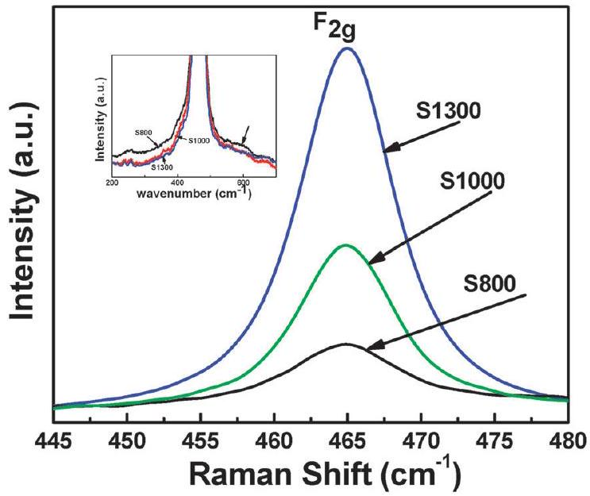
Fig. 7 Raman spectra of unirradiated ceria samples.

signatures are indicative of the cumulative damage brought about to the sample upon irradiation. Fig. 7 shows the Raman spectra of unirradiated S800, S1000 and S1300. All the three spectra show a single Raman band at $464.7 \mathrm{~cm}^{-1}$, which matches with that reported in the literature ${ }^{24}$ for $\mathrm{CeO}_{2}$, and is typically assigned to the $\mathrm{F}_{2 \mathrm{~g}}$ mode of the $\mathrm{Ce}-\mathrm{O}$ vibrational unit with $O_{\mathrm{h}}$ symmetry. Furthermore, there are very weak defect bands centered at $597 \mathrm{~cm}^{-1}$ (shown in Fig. 7 inset). These bands have a very weak relative intensity for S800 and are almost negligible for S1000 and S1300. This indicates that at the microscopic level, all the three samples have well crystalline fluorite-type lattices with minimum defects regardless of the annealing conditions. However, the inspection of Fig. 8 shows that the Raman spectra for the irradiated samples S800, S1000 and S1300 have stark differences. It can be seen that the intensities of defect bands centred at $259 \mathrm{~cm}^{-1}$ and $597 \mathrm{~cm}^{-1}$ have enhanced significantly for S1000 and S1300 (post irradiation) while they are conspicuous by their absence in the Raman spectrum

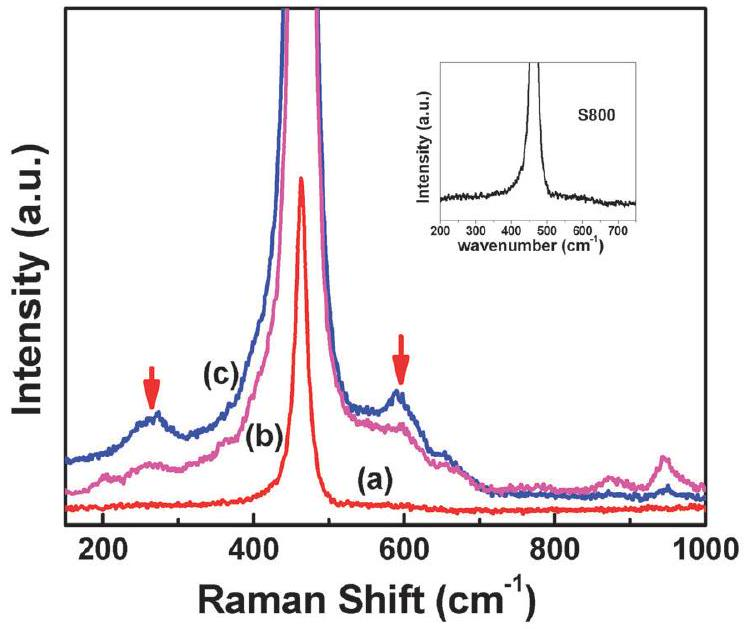
Fig. 8 Raman spectra of irradiated ceria samples; (a) S800, (b) S1300, (c) S1000. Inset shows the enlarged view of Raman spectra of S800 to show the absence of defects in the same region as S 1000 and S 1300 .

for irradiated S800. The Raman studies reported in the literature about ceria show that in addition to the main band at around $460 \mathrm{~cm}^{-1}$, if the ceria lattice has vacancies due to the presence of trivalent ions, additional bands at $\sim 260 \mathrm{~cm}^{-1}, \sim 560 \mathrm{~cm}^{-1}$ and $\sim 600 \mathrm{~cm}^{-1}$ are observed. It has been shown by Nakajima et al. ${ }^{25}$ that in ceria doped with trivalent ions, defect bands at $600 \mathrm{~cm}^{-1}$ are due to foreign guest cations in $O_{\mathrm{h}}$ symmetry. The bands at $\sim 260 \mathrm{~cm}^{-1}$ and $\sim 560 \mathrm{~cm}^{-1}$ are however due to the cation having an oxygen vacancy in its co-ordination. Furthermore, in the studies specific to ceria-reduction, it is observed that as the amount of defects increases due to an increase in $\mathrm{Ce}^{4+}$ to $\mathrm{Ce}^{3+}$ conversion, the $\sim 590 \mathrm{~cm}^{-1}$ gets blue shifted. It might be due to an increase in the ratio of the band at $560 \mathrm{~cm}^{-1}$ and $600 \mathrm{~cm}^{-1}$. Upon comparing these observations with the Raman spectra for S1000 and S1300, certain interesting inferences can be drawn. First of all, the presence of defects cannot be explained unless we invoke the formation of $\mathrm{Ce}^{3+}$ in these samples upon irradiation (refer the XPS part for further explanation). The formation of $\mathrm{Ce}^{3+}$ can be attributed to the Frenkel oxygen defects (upon irradiation with swift heavy ions) which lead to loss of oxygen from their sites and reduction of $\mathrm{Ce}^{4+}$ to $\mathrm{Ce}^{3+}$. The presence of $\mathrm{Ce}^{3+}$ was also detected by Ohno et al. ${ }^{26}$ by a detailed EXAFS and XPS analysis on irradiated ceria and they could show the creation of the oxygen deficiencies around Ce and formation of $\mathrm{Ce}^{3+}$ ions. Furthermore, the relative area of this defect band is more in S1000 relative to S1300, showing that S1000 has more numbers of defects as compared to S1300.

It is also interesting to observe the effect of irradiation on the main $\mathrm{F}_{2 \mathrm{~g}}$ band of ceria at $\sim 465 \mathrm{~cm}^{-1}$ in all the three samples. As mentioned earlier, the unirradiated sample showed this $F_{2 g}$ band at $464.8 \mathrm{~cm}^{-1}$ in the present study for all the three cases. However, upon irradiation, there is a red shift shown in this mode which increases from S1300 to S1000 and then to S 800 i.e. After irradiation, the $\mathrm{F}_{2 \mathrm{~g}}$ mode is found to be at $464.8 \mathrm{~cm}^{-1}$ for $\mathrm{S} 1300,464.4 \mathrm{~cm}^{-1}$ for S 1000 and $462.1 \mathrm{~cm}^{-1}$ for S 800 . As mentioned earlier, this Raman band corresponds to $\mathrm{Ce}-\mathrm{O}$ vibrations in $O_{\mathrm{h}}$ symmetry. The red shift in peak is normally due to a decrease in force constant. The S800 sample undergoes maximum damage, much more relative to the other two samples upon irradiation, though it does not completely amorphize. The immense red shift ( $\sim 2.7 \mathrm{~cm}^{-1}$ ) observed in the case of the S800 sample can be attributed to this damage, which has apparently manifested as elongation in the average $\mathrm{Ce}-\mathrm{O}$ bond length and hence, decreased force constant thus resulting in the red shift of $F_{2 g}$ band. This is also supported by highest net dilation in the unit cell dimensions (XRD peaks shifting to lower $2 \theta$ values) of S800 after final irradiation at a fluence of $1 \times 10^{14}$ ions per $\mathrm{cm}^{2}$. The same shift is not observable though in S1000 and S1300 because the dilation of the unit cell observed in these samples after irradiation is much less than S800 as also shown by their XRD patterns.

The most intriguing observation is the absence of defect bands at around $\sim 250 \mathrm{~cm}^{-1}$ and $\sim 590 \mathrm{~cm}^{-1}$ in the irradiated sample of S800 in spite of the fact that it is most damaged according to XRD analysis and as also proved by the red shift in the main Raman mode. In order to seek an explanation to this,
the scanning electron micrographs (SEM) of the all the samples were examined. It is evident from the microstructure of the three samples as shown in Fig. 2 that the three samples differ in their packing efficiency and the grain size, with S800 having smallest particle size ( $25-50 \mathrm{~nm}$ ) and maximum fraction of grain boundaries followed by S1000 and then S1300 which has well grown grains and hence the grain boundaries are far apart.

It has been suggested ${ }^{27}$ that the damage caused in the ceramic after irradiation depends tremendously on the separation between the grain boundaries i.e. the size of the grains. In the nanomaterials, the closely spaced grain boundaries act as sinks for the defects (mostly interstitials) upon irradiation leaving behind grains which are mostly vacancy-rich. It is plausible that in the present situation, in S800, apparently, a large content of closely spaced grain boundaries is acting as a sink for the interstitials, so the net result is that whatever damage is done to the lattice is getting accumulated in the grain boundaries. Hence, there is a continuous decrease in undamaged grain size and grains' content and a subsequent increase in the amount of grain boundaries and the damaged area. In this process, the net damaged area is increasing but the crystalline content (grain) that remains consists of an undamaged fluorite-type lattice (even though dilated due to the presence of vacancies). Hence, the resultant Raman spectra for S 800 indicate no defect clusters associated with the trivalent $\mathrm{Ce}\left(\mathrm{Ce}^{3+}\right)$. The variation observed in the $2 \theta$ values of fitted X-ray diffraction peaks, wherein peak 2 (ascribed to damaged zone) shifted to lower angles while peak 1 (undamaged part) was relatively constant, supports this observation that in the case of S800, the damage is being concentrated in the same zone. A support for accumulation of vacancies in grain or the bulk also comes from the fact that S800 shows maximum red shift in the Raman band (as mentioned above) which can be ascribed to a decrease in force constant due to vacancies. It must be noted that the grain size, however, is not very small, i.e. not in the "highly nano-regime", hence complete recombination of the interstitials from grain boundaries and vacancies from grain does not happen and the recovery is not observed in S800. However, in the case of S1000 and S1300, the grain sizes are large, grain boundaries are far apart, and hence the interstitial and vacancies (defects) generated upon irradiation cannot diffuse to grain boundaries. Thus, the defects are contained in the bulk of the grain itself and manifest as defect bands observed in Raman spectra of these samples (S1000 and S1300). The schematics in Fig. 9 depicts the above explanation.

### 3.4 X-ray photoelectron spectroscopic studies

In order to support the inferences drawn from Raman spectroscopic studies, the S800 and S1300 samples were also examined by X-ray photoelectron spectroscopy both before and after irradiation. Since XPS is a very powerful tool to study surfaces and the SHI irradiation brings about the changes/damage mostly on the surface (few nm thickness), it is an invaluable tool to study the structural variations in the present system. Fig. 10 shows the Ce 3d XPS spectra and their fits for the two samples before and after irradiation. It is known from the

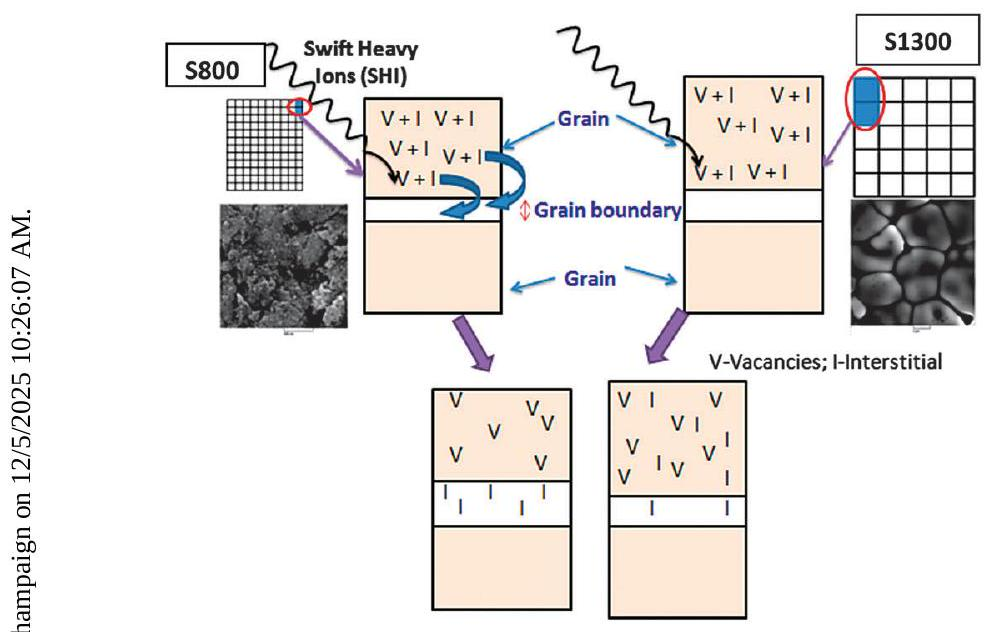
Fig. 9 Schematics depicting the defect generation in S 800 and S 1300 upon swift heavy ion irradiation.

literature that the Ce 3d XPS spectrum of $\mathrm{CeO}_{2}$ with $\mathrm{Ce}^{4+}$ ions can be fully described by two spin-orbit triplets: $\mathrm{V}, \mathrm{V}^{\prime \prime}$ and $\mathrm{V}^{\prime \prime \prime}$

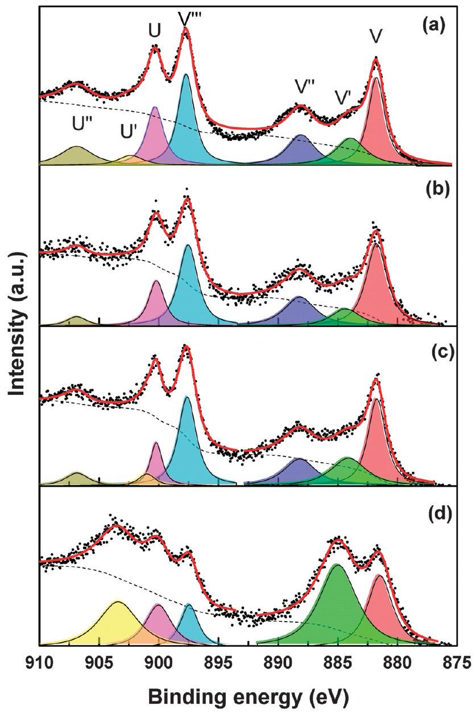
Fig. 10 XPS Ce 3d spectra for (a) S800 before irradiation, (b) S800 after irradiation, (c) S1300 before irradiation, and (d) S1300 after irradiation. In each part, symbols are the data points, thin red lines with shaded areas are the individual peak components, the dotted line is the background and the thick line is the sum of the peaks.

corresponding to $3 \mathrm{~d}_{5 / 2}$, and $\mathrm{U}, \mathrm{U}^{\prime \prime}$, and $\mathrm{U}^{\prime \prime \prime}$ corresponding to $3 \mathrm{~d}_{3 / 2},{ }^{28}$ as also marked in Fig. 10, except for the $\mathrm{U}^{\prime \prime \prime}$ peak which occurs at 917 eV and is out of the measured binding energy range. It is observable from Fig. 10a and c that both the samples consist primarily of $\mathrm{Ce}^{4+}$ ions before irradiation, though the $\mathrm{Ce}^{3+}$ ions, as marked by $\mathrm{V}^{\prime}$ and $\mathrm{U}^{\prime}$ peaks, are also present in both. ${ }^{28}$ The presence of $\mathrm{Ce}^{3+}$ peaks indicates that the as-prepared samples are also oxygen deficient to some extent. However, the post-irradiation behaviours of the two samples are very different, as shown in Fig. 10b and d, respectively. The area under the $\mathrm{Ce}^{3+}$ peak for S800 reduces after irradiation. On the other hand, for the S1300 sample, the $\mathrm{Ce}^{3+}$ peak enhances considerably after irradiation. The large enhancement of the $\mathrm{Ce}^{3+}$ fraction in S1300 after irradiation is in line with the inference that the defect bands in the Raman spectra of S1300 are attributable to the presence of $\mathrm{Ce}^{3+}$ and there is a considerably larger amount of $\mathrm{Ce}^{3+}$ related defects in S 1300 as compared to S800. Furthermore, the O 1s spectra have also been analysed in detail. It must be mentioned that there is some controversy in the interpretation of O 1s XPS spectra of $\mathrm{CeO}_{2}{ }^{29}$ Fig. 11 shows the O 1 s spectra and their fits for the two samples before and after irradiation. The peaks at around 528.6 eV are attributable to the lattice oxygen in the fluorite structure of $\mathrm{CeO}_{2}$ with $\mathrm{Ce}^{4+}$ ions. ${ }^{28}$ The peaks at around 531.3 eV

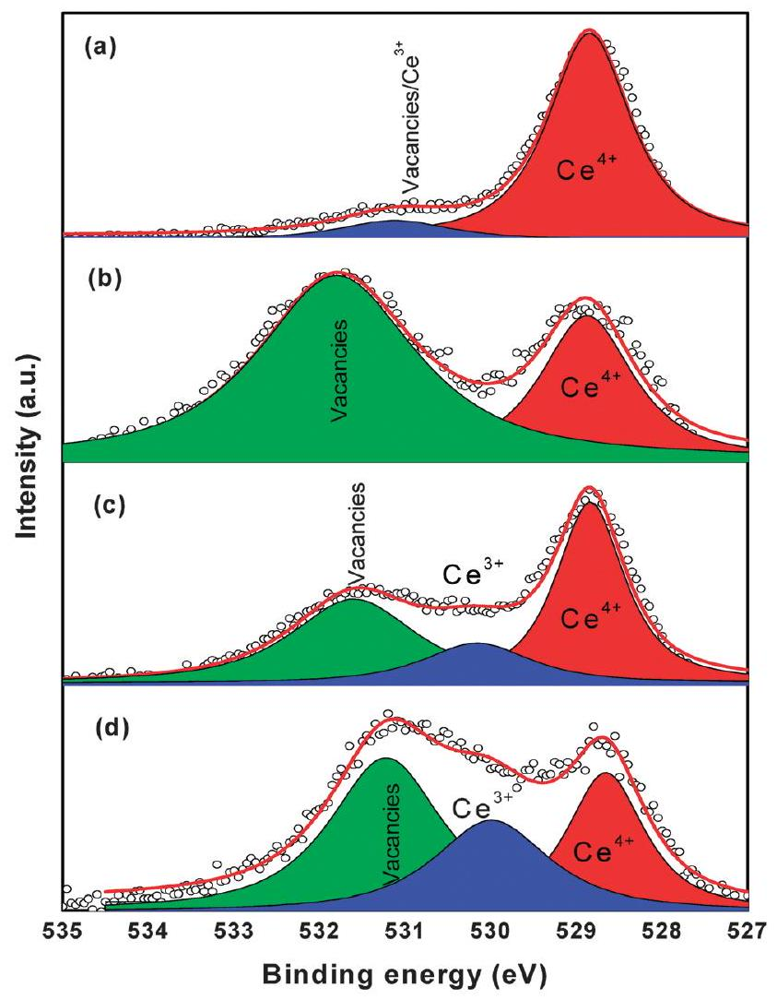
Fig. 11 XPS O 1s spectra for (a) S800 before irradiation, (b) S800 after irradiation, (c) S1300 before irradiation, and (d) S1300 after irradiation. In each part, symbols are the data points, thin red lines with shaded areas are the individual peak components, the dotted line is the background and the thick line is the sum of the peaks.

are reported to correspond either to a hydroxyl contamination, ${ }^{30}$ a $\mathrm{CO}_{3}{ }^{2-}$ contamination, ${ }^{31}$ a highly polarised oxygen atom lying closer to the defect site ${ }^{32,33}$ or oxygen vacancies in metal oxides. ${ }^{29,34}$ Under the present experimental conditions, the presence of -OH or carbonate is not expected hence it may be assigned to oxygen vacancies. The peak at around 530 eV is attributable to $\mathrm{Ce}_{2} \mathrm{O}_{3}$, i.e., to $\mathrm{Ce}^{3+} .{ }^{35}$ It is observable from Fig. 11a that the un-irradiated S800 sample contains some amount of vacancies and $\mathrm{Ce}^{3+}$ as a very small peak in between the two positions. Upon irradiation however, the vacancies get enhanced enormously (Fig. 11b). It has been reported in the literature ${ }^{27}$ that the grain boundaries interact strongly with the cascade, preferentially absorbing interstitials and leaving behind a defect structure within the grain interior that is richer in vacancies. This supports a tremendous increase in vacancy concentration in smaller sized S800 postirradiation. This also affirms the argument made earlier that the irradiation causes enormous damage to S800. The S1300 sample, on the other hand (Fig. 11c), possesses $\mathrm{Ce}^{3+}$ ions before irradiation, apart from vacancies. Irradiation of S1300 induces a considerable reduction of $\mathrm{Ce}^{4+}$ to $\mathrm{Ce}^{3+}$, as shown in Fig. 11d, apart from enhancement in vacancies, this enhancement being much smaller than that in S800. This observation is also consistent with the Ce3d XPS spectra and the Raman measurements.

## 4. Conclusions

Very fine ceria nanopowders were synthesized by gel combustions and annealed at $800^{\circ} \mathrm{C}$ for 2 h (S800), $1000^{\circ} \mathrm{C}$ for 2 h (S1000) and $1300{ }^{\circ} \mathrm{C}$ for 100 h (S1300) to obtain different densities and microstructure. The samples were irradiated with 100 MeV Ag ions to explore the variation of radiation stability with microstructure. Both the pre- and post-irradiated samples were characterised by XRD, SEM, Raman spectroscopy and XPS. SEM images showed a marked grain size variation with S800 having a particle size of 25 nm which increased to 50 nm for S 1000 and S1300 had a particle size of $4-5 \mu \mathrm{~m}$. The sample S1300 possessed maximum density of $92 \%$. None of the samples got amorphized in the fluence range used in the present study indicating towards inherent radiation stability of ceria. The present study reveals that the larger grain size has better radiation stability. The sample with smaller grain size experiences higher temperature spike due to enhanced grain boundary scattering and therefore has poor radiation stability. Also, the nature of the damage caused to the $\mathrm{CeO}_{2}$ lattice, in terms of formation of $\mathrm{Ce}^{3+}$ ions and vacancies, shows tremendous dependence on the density and the powder properties which has been revealed using XPS and Raman spectroscopy. These results are significant as they reveal the grain size dependent radiation stability of ceria which is a surrogate for plutonia.

## Acknowledgements

We express our gratitude towards Dr Udai Bhan Singh, Inter University Accelerator Centre, New Delhi, for his help during the experimental work. The authors also wish to thank Board of

Research in Nuclear Sciences, India (BRNS), for the financial support (Reference: 2011/36/40-BRNS/1979).

## References

1 N. Nitani, K. Kuramoto, T. Yamashita, Y. Nihei and Y. Kimura, J. Nucl. Mater., 2003, 319, 102-107.

2 T. Sonoda, M. Kinoshita, Y. Chimi, N. Ishikawa, M. Sataka and A. Iwase, Nucl. Instrum. Methods Phys. Res., Sect. B, 2006, 250, 254-258.
3 N. Ishikawa, Y. Chimi, O. Michikami, Y. Ohta, K. Ohhara, M. Lang and R. Neumann, Nucl. Instrum. Methods Phys. Res., Sect. B, 2008, 266, 3033-3036.
4 X. M. Bai, A. F. Voter, R. G. Hoagland, M. Nastasi and B. P. Uberuaga, Science, 2010, 327, 1631-1634.
5 N. Bajwa, A. Ingale, D. K. Avasthi, R. Kumar and A. Tripathi, J. Appl. Phys., 2008, 104, 054306.

6 K. Jeet, V. K. Jindal, L. M. Bharadwaj, D. K. Avasthi and K. Dharamvir, J. Appl. Phys., 2010, 108, 034302.

7 A. Kumar, D. K. Avasthi, J. C. Pivin and P. M. Koinkar, Appl. Phys. Lett., 2008, 92, 221904.
8 S. Kumar, A. Tripathi, F. Singh, S. A. Khan, V. Baranwal and D. K Avasthi, Nanoscale Res. Lett., 2014, 9, 126.

9 N. Nita, R. Schaeublin and M. Victoria, J. Nucl. Mater., 2004, 329-333, 953-957.
10 Y. Chimi, A. Iwase, N. Ishikawa, M. Kobiyama, T. Inami and S. Okuda, J. Nucl. Mater., 2001, 297, 355-357.

11 M. Rose, A. G. Balogh and H. Hahn, Nucl. Instrum. Methods Phys. Res., Sect. B, 1997, 127-128, 119-122.
12 T. D. Shen, S. Feng, M. Tang, J. A. Valdez, Y. Wang and K. E. Sickafus, Appl. Phys. Lett., 2007, 90, 263115.

13 A. Gupta and D. K. Avasthi, Phys. Rev. B: Condens. Matter Mater. Phys., 2001, 64, 155407.
14 D. K. Avasthi, S. Ghosh, S. K. Srivastava and W. Assmann, Nucl. Instrum. Methods Phys. Res., Sect. B, 2004, 219, 206-214.
15 M. Kumar, S. A. Khan, P. Rajput, F. Singh, A. Tripathi, D. K. Avasthi and A. C. Pandey, J. Appl. Phys., 2007, 102, 083510.

16 M. Toulemonde, W. Assmann, C. Dufour, A. Meftah, F. Studer and C. Trautmann, Mat. - Fys. Medd. - K. Dan. Vidensk. Selsk., 2006, 52, 263.
17 P. K. Kulriya, F. Singh, A. Tripathi, R. Ahuja, A. Kothari, R. N. Dutt, Y. K. Mishra, A. Kumar and D. K. Avasthi, Rev. Sci. Instrum., 2007, 78, 113901.
18 J. F. Ziegler, J. P. Biersack and U. Littmark, The Stopping and Range of Ions in Solids, Pergamon, New York, 1985.
19 V. N. Morris, R. A. Farrell, A. M. Sexton and M. A. Morris, J. Phys.: Conf. Ser., 2006, 26, 119-122.

20 F. Zhang, S. W. Chan, J. E. Spanier, E. Apak, Q. Jin, R. D. Robinson and I. P. Herman, Appl. Phys. Lett., 2002, 80, 127.
21 M. K. Patel, V. Vijayakumar, S. Kailas, D. K. Avasthi, J. C. Pivin and A. K. Tyagi, J. Nucl. Mater., 2008, 380, 93-98.
22 P. D. Edmondson, Y. Zhang, S. Moll, F. Namavar and W. J. Weber, Acta Mater., 2012, 60, 5408-5416.

23 V. Grover, R. Shukla, D. Jain, S. K. Deshpande, A. Arya, C. G. S. Pillai and A. K. Tyagi, Chem. Mater., 2012, 24, 2186-2196.
24 A. Banerji, V. Grover, V. Sathe, S. K. Deb and A. K. Tyagi, Solid State Commun., 2009, 149, 1689-1692.
25 A. Nakajima, Y. Yoshihara and M. Ishigame, Phys. Rev. B: Condens. Matter Mater. Phys., 1994, 50, 13297.
26 H. Ohno, A. Iwase, D. Matsumura, Y. Nishihata, J. Mizuki, N. Ishikawa, Y. Baba, N. Hirao, T. Sonoda and M. Kinoshita, Nucl. Instrum. Methods Phys. Res., Sect. B, 2008, 266, 3013-3017.
27 I. J. Beyerlein, A. Caro, M. J. Demkowicz, N. A. Mara, A. Misra and B. P. Uberuaga, Mater. Today, 2013, 16, 443-449.
28 P. Burroughs, A. Hamnett, A. F. Orchard and G. Thornton, J. Chem. Soc., Dalton Trans., 1976, 1686-1698.

29 L. R. Shah, B. Ali, H. Zhe, W. G. Wang, Y. Q. Song, H. W. Zhang, S. I. Shah and J. Q. Xiao, J. Phys.: Condens. Matter, 2009, 21, 486004.
30 A. Pfau and K. D. Schierbaum, Surf. Sci., 1994, 321, 71-80.
31 X. Y. Du, W. C. Li, Z. X. Liu and K. Xie, Chin. Phys. Lett., 1999, 5, 376-377.
32 M. Skoda, M. Cabal, I. Matolinova, T. Skala, K. Veltruska and V. Matolin, Vacuum, 2010, 84, 8-12.
33 J. P. Holgado, G. Munuera, J. P. Espinos and A. R. GozalezElipe, Appl. Surf. Sci., 2000, 158, 164-171.
34 X. Cao, X. Li, X. Gao, W. Yu, X. Liu, Y. Zhang, L. Chen and X. Cheng, Appl. Phys. Lett., 2009, 106, 073723.

35 D. R. Mullins, S. H. Overbury and D. R. Huntley, Surf. Sci., 1998, 409, 307-319.

[^0]:    ${ }^{a}$ Chemistry Division, Bhabha Atomic Research Centre, Mumbai-400085, India. E-mail: vinita@barc.gov.in; Fax: +91-22-25505151; Tel: +91-22-2559 2274
    ${ }^{b}$ Inter-University Accelerator Centre, Aruna Asaf Ali Marg, New Delhi-110 067, India
    ${ }^{c}$ Indian Institute of Technology Kharagpur, Kharagpur-721302, India
    ${ }^{d}$ Indian Institute of Technology Delhi, New Delhi-110 016, India

