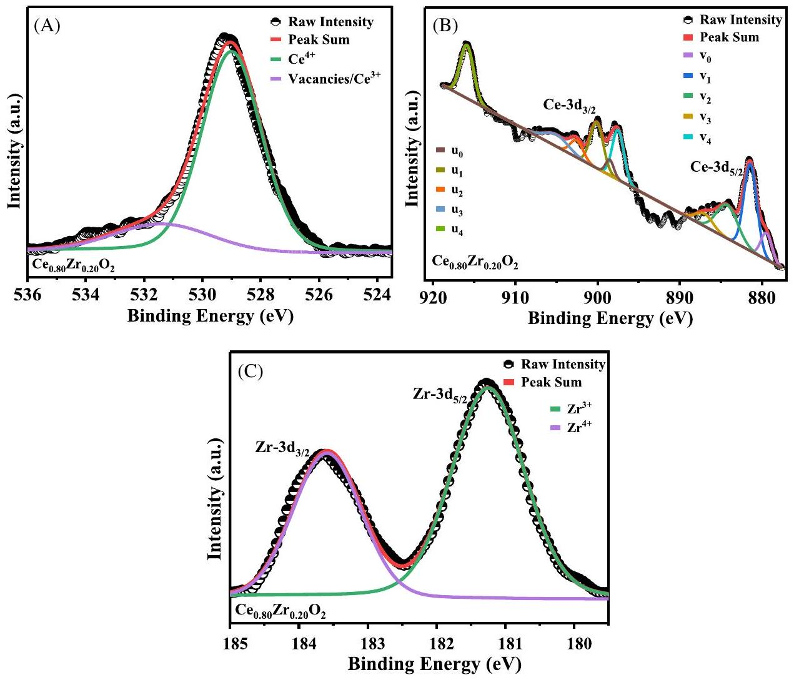
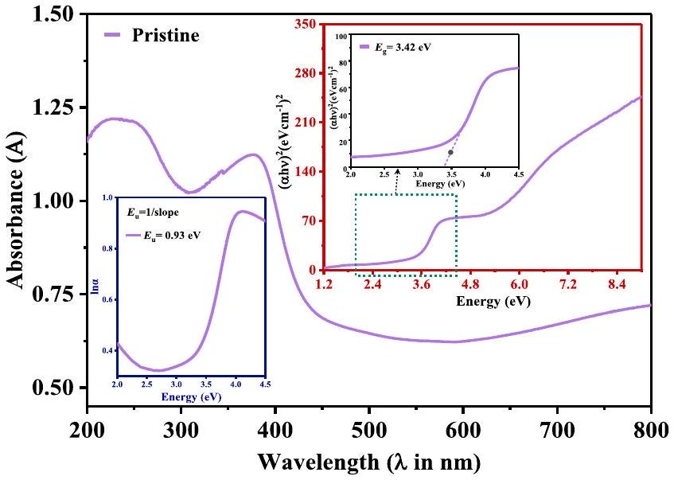
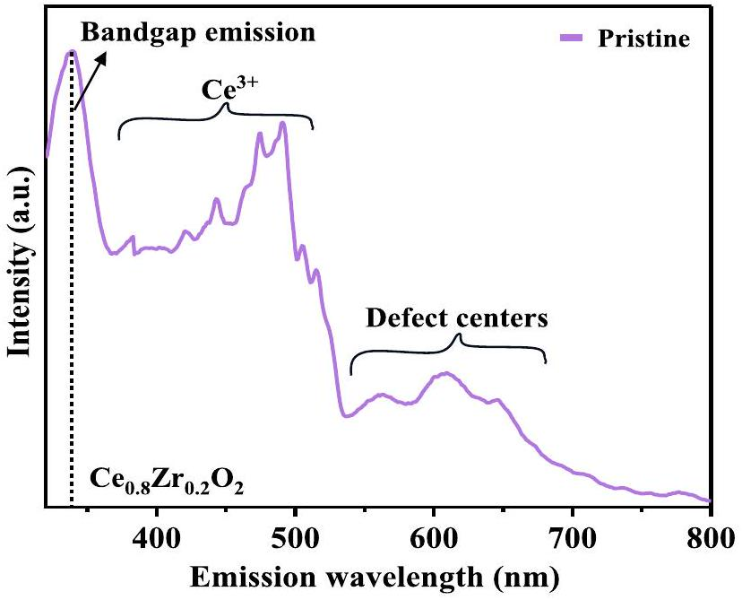
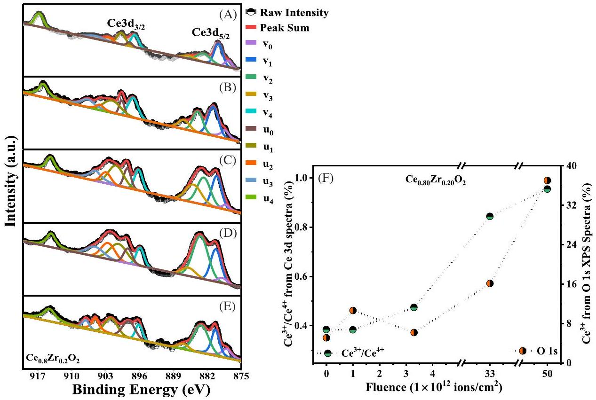
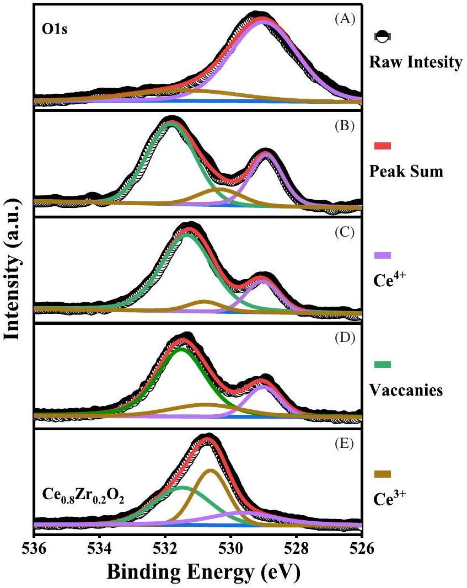
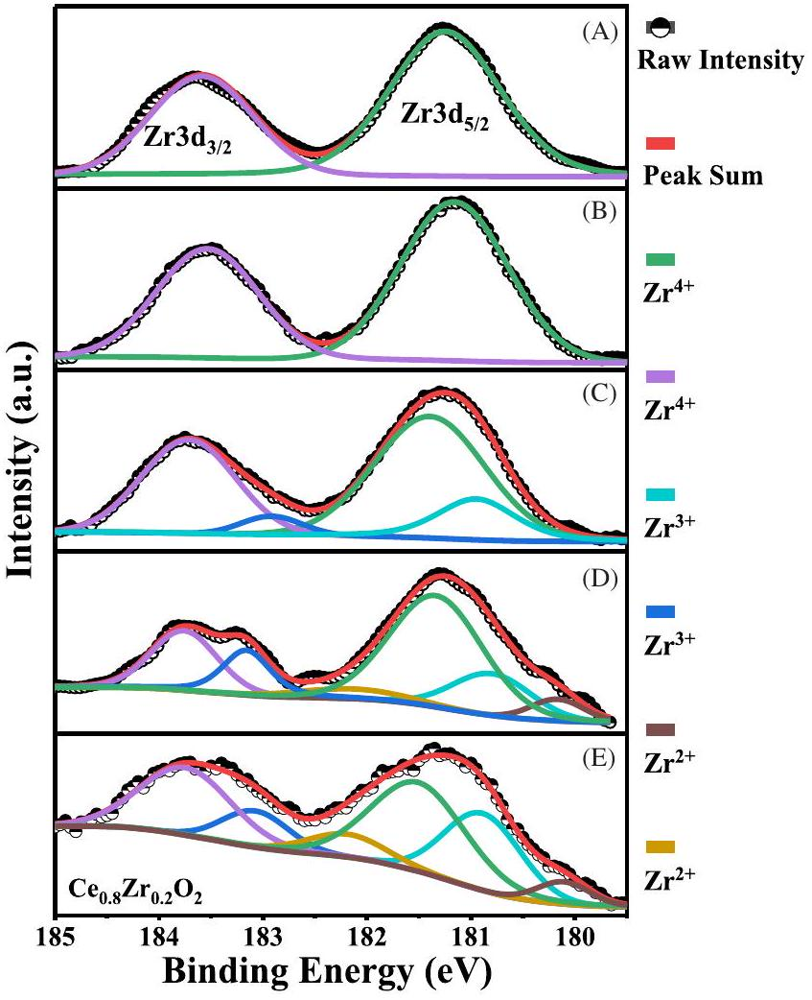
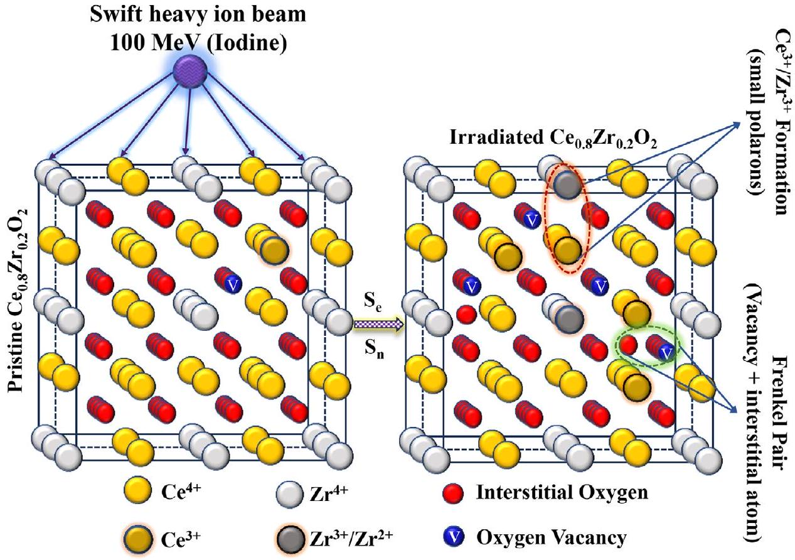
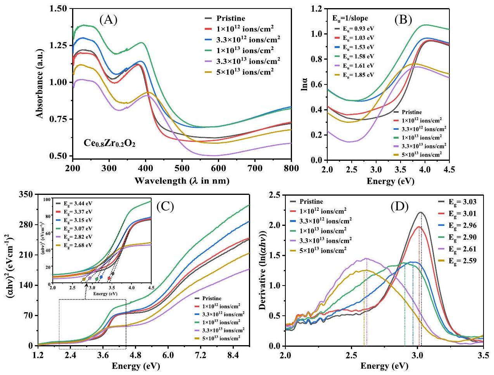
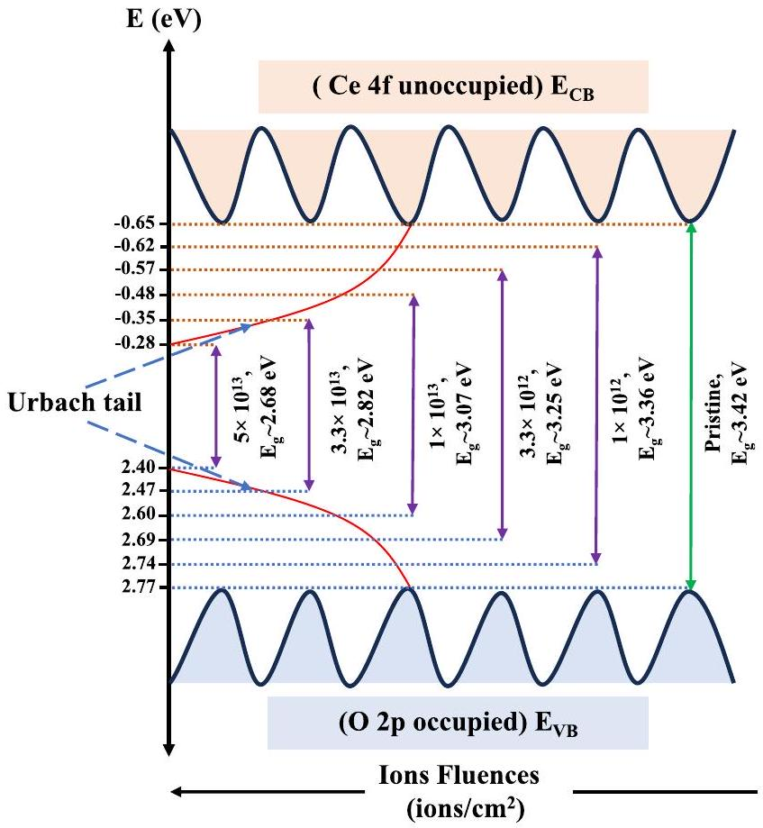
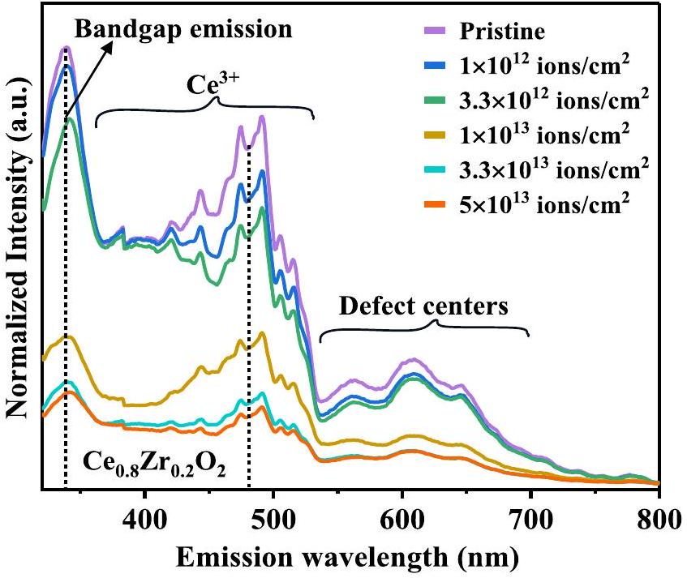

# Swift heavy ion-induced defect formation and electronic structure evolution in $\mathbf{Z r}$-doped $\mathbf{C e O}_{\mathbf{2}} \boldsymbol{(} \mathbf{C e}_{\mathbf{0 . 8}} \mathbf{Z r}_{\mathbf{0 . 2}} \mathbf{O}_{\mathbf{2}} \boldsymbol{)}$

Vivek Kumar ${ }^{\mathbf{1}}$ | Saurabh Kumar Sharma ${ }^{\mathbf{1 , 2}}$ | Yogendar Singh ${ }^{\mathbf{1}}$ | Vivek Malik ${ }^{\mathbf{3}}$ | Vinita Grover ${ }^{4}$ | Pawan Kumar Kulriya ${ }^{1}$ |

${ }^{1}$ School of Physical Sciences, Jawaharlal Nehru University, New Delhi, India
${ }^{2}$ Department of Mechanical, Aerospace, and Nuclear Engineering, Rensselaer Polytechnic Institute (RPI), Troy, New York, USA
${ }^{3}$ Indian Institute of Technology, Roorkee, Uttarakhand, India
${ }^{4}$ Chemistry Division, Bhabha Atomic Research Centre, Mumbai, India

Correspondence
Pawan Kumar Kulriya, School of Physical Sciences, Jawaharlal Nehru University, New Delhi, 110067, India.
Email: pkkulriya@mail.jnu.ac.in

#### Abstract

This study investigates the effects of 100 MeV iodine ion irradiation on zirconiadoped ceria $\left(\mathrm{Ce}_{0.8 \mathrm{Zr}} \mathrm{Zr}_{0.2} \mathrm{O}_{2}\right)$ to simulate fission fragment damage in nuclear fuel at fluences up to $5 \times 10^{13}$ ions $/ \mathrm{cm}^{2}$. X-ray photoelectron spectroscopy confirms the partial reduction of $\mathrm{Ce}^{4+}$ to $\mathrm{Ce}^{3+}$ and $\mathrm{Zr}^{4+}$ to $\mathrm{Zr}^{3+} / \mathrm{Zr}^{2+}$, driven by irradiationinduced charge trapping and stabilized by oxygen vacancies. These localized electrons distort the lattice, forming small polarons that govern the redox equilibrium and contribute to defect tolerance. UV-Vis diffuse reflectance spectroscopy confirms narrowing of the band gap (3.42-2.85 eV) and increase in Urbach energy from 0.93 to 1.85 eV confirmed enhancement of electronic disorder and band tailing. Photoluminescence measurements reveal a progressive quenching of emission intensity with increasing fluence, associated with nonradiative recombination via polaron-stabilized defect states. The combined spectroscopic results suggest that both electronic excitation and nuclear energy loss induce a synergistic mechanism involving polaron formation and oxygen Frenkel pair creation. This dual pathway enables defect accommodation without structural collapse. These results demonstrate that $\mathrm{Ce}_{0.8} \mathrm{Zr}_{0.2} \mathrm{O}_{2}$ resists amorphization through a balance of irradiation-induced redox activity and native nonstoichiometry, making it a strong candidate for radiation-resistant ceramics in nuclear and aerospace applications, and a mechanistic model for defect-tolerant oxides.

KEYWORDS
photoluminescence, SHI irradiation, UV-Vis diffuse reflectance spectroscopy, X-ray photoelectron spectroscopy

## 1 | INTRODUCTION

Ceramic oxides are crucial for transmuting and immobilizing minor actinides produced in nuclear reactors. Their physicochemical properties are significantly affected under intense radiative environments due to radiationinduced defect dynamics. Swift heavy ion (SHI) irradiation, particularly in the energy range of hundreds of MeV generates significantly damaged amorphous regions, defect clusters or point defects including oxygen Frenkel pairs, depending on the oxide structure. These defects play a vital role in controlling material behavior under radiation. ${ }^{1-3}$ SHI irradiation is a potential technique for tailoring the structural, electrical, and optical properties of materials including metals, semiconductors, insulators, and polymers by rapidly depositing high electronic energy over ultrashort timescales. This energy excites the lattice and induces significant alterations in material
properties. ${ }^{4}$ Understanding the interplay between defect formation and mechanical response is essential for developing radiation-resistant materials for advanced nuclear applications. ${ }^{5}$

Uranium dioxide ( $\mathrm{UO}_{2}$ ) is the most common material employed as nuclear fuel. Numerous theoretical and experimental investigations have been conducted on it encompassing various aspects. Several dopants including titanium, niobium, magnesium, chromium, and zirconium oxides, have been extensively explored to improve the thermophysical, mechanical, and chemical properties of the fuel matrix, as well as to reduce fission gas release and swelling during irradiation. ${ }^{6} \mathrm{ZrO}_{2}$-doped $\mathrm{UO}_{2}$ ceramic pellets have been considered as high-performance nuclear fuel in light water reactors (LWRs) because of their enhanced characteristics. ${ }^{7}$ These cover better corrosion resistance in high-temperature water or steam, steady thermal conductivity during irradiation, and a reduced swelling rate relative to pure uranium dioxide fuels during in-pile irradiation. ${ }^{6,8,9}$ Zirconia $\left(\mathrm{ZrO}_{2}\right)$ and ceria $\left(\mathrm{CeO}_{2}\right)$ having cubic phase shares structural similarities with nuclear fuel materials like ( $\mathrm{UO}_{2}, \mathrm{PuO}_{2}$, and $\mathrm{ThO}_{2}$ ) making them promising candidates for inert matrix materials (IMMs). They demonstrate elevated melting points, less neutron absorption, higher thermal conductivity, enhanced thermal stability, insolubility in coolant, compatibility with cladding materials, ease of manufacturing processes, and radiation stability. ${ }^{10,11}$

Recent studies have irradiated $\mathrm{CeO}_{2}$ with ions of varying masses and energies to simulate radiation damage analogous to that experienced by $\mathrm{UO}_{2}$ fuels due to fission fragments. ${ }^{3,12,13}$ Zhang et al. ${ }^{14}$ performed a critical analysis of recent literature on Zr-doped ceria for catalytic applications and employed density functional theory (DFT) for explaining the impact of $\mathrm{Zr}^{4+}$ doping. Therefore, fluoritestructured solid solutions of $\mathrm{ZrO}_{2}-\mathrm{CeO}_{2}$ oxides are of particular importance as model phases for studying the stability and properties of analogous systems like $\mathrm{ZrO}_{2}-\mathrm{UO}_{2}$ and $\mathrm{ZrO}_{2}-\mathrm{PuO}_{2}$ dioxide, theoretically explain by Weck et al. ${ }^{15}$ and experimentally explained by Singh et al. ${ }^{2}$ Our prior research thoroughly examined the radiation sensitivity and structural evolution of complex oxides under severe circumstances. In $\mathrm{Gd}_{2} \mathrm{Ti}_{2-y} \mathrm{Zr}_{y} \mathrm{O}_{7}$ pyrochlores, we exhibited thermally activated damage recovery and compositional influences on phase transitions, emphasizing improved radiation endurance with elevated zirconium content. ${ }^{16-20}$ Nonstoichiometric $\mathrm{Nd}_{1.8} \mathrm{Zr}_{2.2} \mathrm{O}_{7.1}$ and nanostructured $\mathrm{Nd}_{2} \mathrm{Zr}_{2} \mathrm{O}_{7}$ demonstrated enhanced resistance to electronic excitation attributed to defect recovery mechanisms and nanoscale characteristics. ${ }^{16,18}$ Short-range ordering during irradiation in $\mathrm{Gd}_{2} \mathrm{Ti}_{2-}{ }_{y} \mathrm{Zr}_{y} \mathrm{O}_{7}$ demonstrated that compositional adjustment is essential for structural durability. ${ }^{17}$

X-ray photoelectron spectroscopy (XPS) can throw light on the composition of cerium ions $\left(\mathrm{Ce}^{3+}\right.$ and $\left.\mathrm{Ce}^{4+}\right)$ present in $\mathrm{CeO}_{2}$. SHI irradiation on $\mathrm{CeO}_{2} / \mathrm{CeO}_{2}$-based mixed oxides can cause partial reduction of $\mathrm{Ce}^{4+}$ to $\mathrm{Ce}^{3+}$ and generates oxygen vacancies. ${ }^{12,21}$ Consequently, an advanced technique is needed to quantitatively evaluate the microchemistry of $\mathrm{CeO}_{2}$-based oxides, which directly impacts aqueous durability. ${ }^{22}$ XPS experiences difficulties in detecting cerium oxidation states in materials due to the complicated characteristics of valence and core electron spectra. ${ }^{23}$ The Ce 3d XPS spectra of $\mathrm{Ce}^{3+}$ ions can reveal satellites with intensities higher than the one of the primary peaks. ${ }^{24}$ The spectra of $\mathrm{CeO}_{2}$ are particularly complex, with most literature suggesting a mixed valence state containing both $\mathrm{Ce}^{3+}$ and $\mathrm{Ce}^{4+}$ ions, ${ }^{25}$ emphasizing the need for careful interpretation of the spectral data.

Research on SHI irradiation effects on $\mathrm{CeO}_{2}-\mathrm{ZrO}_{2}$ systems is limited, but investigations of similar materials like $\mathrm{Y}_{2} \mathrm{O}_{3}-\mathrm{ZrO}_{2}$ (YSZ) provide valuable insights. ${ }^{26}$ YSZ does not amorphize even at high radiation doses, instead undergoing stress, lattice swelling, and mechanical property enhancements due to ion irradiation. ${ }^{3,13,27}$ Similar experiments with $\mathrm{CeO}_{2}$ have demonstrated expansion in lattice parameters and alterations in oxidation states without resulting in bulk amorphization or phase transformation, Ohno et al. ${ }^{27}$ reported the reduction of $\mathrm{Ce}^{4+}$ to $\mathrm{Ce}^{3+}$ in $\mathrm{CeO}_{2}$ under 200 MeV Xe ions irradiation, while Ishikawa et al. ${ }^{28}$ observed lattice contraction in $\mathrm{CeO}_{2}$ upon irradiation with 150 MeV and 200 MeV ions. Tracy et al. found linear unit cell expansion in bulk $\mathrm{CeO}_{2}$ subjected to irradiation using $167 \mathrm{MeV}{ }^{132} \mathrm{Xe}$ and $950 \mathrm{MeV}{ }^{197} \mathrm{Au}$ ions. ${ }^{3}$ Cureton et al. noticed unit cell expansion, microstrain development, and alterations in oxidation states in $\mathrm{CeO}_{2}$ and $\mathrm{UO}_{2}$ without bulk amorphization or phase transformation, after irradiation with 946 MeV Au ${ }^{+}$ions. ${ }^{13}$ These findings suggest that while $\mathrm{CeO}_{2}$ does not undergo amorphization or structural transformation, it does experience a reduction into trivalent ions, similar to $\mathrm{UO}_{2}$, upon energetic ion irradiation. This resilience highlights the potential of the $\mathrm{CeO}_{2}-\mathrm{ZrO}_{2}$ system as a model for inert matrix fuels, where $\mathrm{ZrO}_{2}$ serves as the IMM and $\mathrm{CeO}_{2}$ acts as a surrogate for $\mathrm{Pu} .^{12}$

This study examines the impact of fission-energy ion radiation on the nonstoichiometry and structural integrity of polycrystalline $\mathrm{Ce}_{0.8} \mathrm{Zr}_{0.2} \mathrm{O}_{2}$, which is isostructural with $\mathrm{UO}_{2}$ and $\mathrm{PuO}_{2}$, and is also a potential candidate for the development of inert fuel matrices capable of containing high-activity nuclear waste. XPS along with photoluminescence (PL) investigations display significant chemical and electronic modifications under irradiation, even though the material resists amorphization and retains its fluorite structure up to high ion fluences. Importantly, unlike single-cation $\mathrm{CeO}_{2}$ or $\mathrm{ZrO}_{2}, \mathrm{Ce}_{0.8} \mathrm{Zr}_{0.2} \mathrm{O}_{2}$ exhibits
coupled redox behavior of Ce/Zr cations under SHI irradiation which provides advanced defect tolerance through dynamic equilibrium between native nonstoichiometry and irradiation defects, linked to oxygen vacancy formation and polaronic charge localization. These synergistic effects enhance defect accommodation and radiation tolerance, underscoring the relevance of this system for nuclear applications.

## 2 | EXPERIMENTAL DETAILS

## 2.1 | Synthesis and swift heavy ion irradiation

Polycrystalline $\mathrm{Ce}_{0.8} \mathrm{Zr}_{0.2} \mathrm{O}_{2}$ powder (space group $F m \overline{3} m$ ) was synthesized at $1500^{\circ} \mathrm{C}$ using high-purity $\mathrm{CeO}_{2}$ (<50 nm, >99.95\%) and $\mathrm{ZrO}_{2}(<5 \mu \mathrm{~m},>99.00 \%)$ powders from Sigma Aldrich, forming $8 \times 1 \mathrm{~mm}^{2}$ pellets. Sample preparation details are provided in our previous work. ${ }^{29}$

Irradiation experiments were carried out at the InterUniversity Accelerator Centre (IUAC), New Delhi, using $100 \mathrm{MeV} \mathrm{I}^{7+}$ ions at fluences ranging from $1 \times 10^{12}$ to $5 \times 10^{13}$ ions $/ \mathrm{cm}^{2}$. A uniform irradiation over a $10 \times 10$ $\mathrm{mm}^{2}$ area was achieved using a magnetic scanner. The experiments were performed at room temperature under high vacuum ( $\sim 1 \times 10^{-7} \mathrm{mbar}$ ) to suppress surface oxidation and contamination. SRIM-2013 simulations by Singh et al. ${ }^{2}$ confirm that the projected ion range $(\sim 7.9 \mu \mathrm{~m})$ lies well within the pellet thickness, with energy deposition dominated by electronic excitations. Displacement energy values of 25 eV for Ce, 25 eV for Zr, and 28 eV for O were used, consistent with literature on fluorite oxides under ion irradiation. ${ }^{29}$

## 2.2 | Characterization

XPS was performed using a PHI 5000 Versa Probe III (Ulvac-Phi, Inc.) under an ultrahigh vacuum of $10^{-7} \mathrm{mbar}$ with a monochromatic $\mathrm{Al} \mathrm{K}_{\alpha}$ X-ray source (1.48 keV, $100 \mu \mathrm{~m}$ beam diameter). XPS probes to a depth of approximately 5-10 nm, which is sufficient to capture chemical changes resulting from irradiation. Sputtering was deliberately avoided to prevent surface modification and preserve the original chemical states. Surface reoxidation is minimal due to low oxygen mobility at room temperature. Spectral acquisition utilized precise scan parameters (step width, pass energy), a stage tilt angle of 45°, and a neutralizer $(1.5 \mathrm{~V}, 20 \mu \mathrm{~A})$ to compensate for surface charging. The recorded spectra were deconvoluted using XPSPeak Fit 4.1 with Shirley background subtraction, and peak fitting was performed using a Gaussian-Lorentzian sum function to accurately resolve overlapping peaks and chemical states. UV-Vis diffuse reflectance spectroscopy (UVDRS) was conducted on an Agilent Cary 5000 spectrophotometer (175-2500 nm) equipped with a double out-of-plane Littrow monochromator, tungsten-halogen and deuterium light sources, an R928 photomultiplier for UV-Vis, and a Peltier-cooled PbS detector for near-infrared (NIR), enabling temperature-dependent reflectance and absorbance measurements for powders and thin films. The spectra were processed using the instrument's integrated software, which directly converts reflectance to absorbance, which is based on the Kubelka-Munk function (K-M). PL spectra were recorded using a Jasco FP 8300 spectrofluorometer with a modified Rowland mount ( 1650 lines /mm concave grating monochromators). A 150 W xenon flash lamp provided broadband excitation (200-750 nm), while a high-sensitivity photomultiplier ensured accurate emission detection. Emission spectra (200-750 nm) were averaged over $\geq 5$ scans to reduce intensity fluctuations and enhance the signal-to-noise ratio for high-precision spectral analysis.

## 3 | RESULTS AND DISCUSSION

## 3.1 | Spectroscopic analysis of pristine $\mathbf{C e}_{\mathbf{0 . 8}} \mathbf{Z r}_{\mathbf{0 . 2}} \mathbf{O}_{\mathbf{2}}$

### 3.1.1 | X-ray photoelectron spectroscopy analysis

XPS was utilized to examine the chemical states of Ce, Zr , and O in polycrystalline $\mathrm{Ce}_{0.8} \mathrm{Zr}_{0.2} \mathrm{O}_{2}$ before and after irradiation as shown in Figure 1, providing insights into local coordination and oxidation states through analysis of Ce 3d, Zr 3d, and O 1s core levels. All XPS spectra were calibrated to the C 1s peak at 284.8 eV for accurate comparison.

Figure 1A displays the O 1s spectrum of the pristine sample, where the peak at ~529.02 eV corresponds to lattice oxygen in the fluorite $\mathrm{Ce}_{0.8} \mathrm{Zr}_{0.2} \mathrm{O}_{2}$ structure, associated with $\mathrm{Ce}^{4+}$ ions. ${ }^{30}$ The ~531.3 eV peak is linked to hydroxyl, ${ }^{31}$ highly polarized oxygen near defect sites, ${ }^{47}$ or oxygen vacancies in metal oxides. ${ }^{12,33}$ Under the given experimental conditions, the absence of hydroxyl and carbonate species suggests that the ~531.3 eV feature originates from oxygen vacancies. The ~530 eV peak corresponds to $\mathrm{Ce}^{3+}$ in $\mathrm{Ce}_{2} \mathrm{O}_{3}$, indicating partial cerium reduction. ${ }^{34}$ Thus, even in the pristine sample, the presence of $\mathrm{Ce}^{3+}$ along with oxygen vacancies is evident.

Figure 1B shows the Ce 3d peaks split into Ce $3 \mathrm{~d}_{5 / 2}\left(\mathrm{v}_{0}\right.$, $\left.\mathrm{v}_{1}, \mathrm{v}_{2}, \mathrm{v}_{3}, \mathrm{v}_{4}\right)$ and $\mathrm{Ce} 3 \mathrm{~d}_{3 / 2}\left(\mathrm{u}_{0}, \mathrm{u}_{1}, \mathrm{u}_{2}, \mathrm{u}_{3}, \mathrm{u}_{4}\right)$ ionizations. The $\mathrm{v}_{0}, \mathrm{v}_{2}, \mathrm{u}_{0}$, and $\mathrm{u}_{2}$ peaks correspond to $\mathrm{Ce}^{3+}$, while

FIGURE 1 X-ray photoelectron spectroscopy (XPS) spectra of pristine polycrystalline $\mathrm{Ce}_{0.8 \mathrm{Z}} \mathrm{Zr}_{0.2} \mathrm{O}_{2}$ pellets, including (A) O 1s spectra, providing insights into oxygen states and bonding; (B) Ce 3d spectra, highlighting cerium's electronic and oxidation states, crucial for the $\mathrm{Ce}^{4+} / \mathrm{Ce}^{3+}$ ratio; and (C) Zr 3d spectra, revealing zirconium's chemical states and interactions within the ceria matrix.

$\mathrm{v}_{1}, \mathrm{v}_{3}, \mathrm{v}_{4}, \mathrm{u}_{1}, \mathrm{u}_{3}$, and $\mathrm{u}_{4}$ indicate $\mathrm{Ce}^{4+}$ states. ${ }^{35}$ This indicates that $\mathrm{Ce}^{4+}$ is the predominant oxidation state on the surface, with a minor presence of $\mathrm{Ce}^{3+}$. The $\mathrm{Ce}^{3+}$ peaks suggest slight oxygen deficiency in the samples. The $\mathrm{Ce}^{3+}$ state arises from the spontaneous reduction of $\mathrm{Ce}^{4+}$ (0.97 Å) to $\mathrm{Ce}^{3+}(1.10 \AA)$, mitigating lattice contraction induced by the smaller $\mathrm{Zr}^{4+}$ ions $(0.84 \AA) .{ }^{36}$

The Zr 3d region (Figure 1C) shows peaks at 181.4 eV and 183.8 eV, attributed to the $\mathrm{Zr} 3 \mathrm{~d}_{5 / 2}$ and $\mathrm{Zr} 3 \mathrm{~d}_{3 / 2}$, spinorbit components of $\mathrm{Zr}^{4+}$, respectively. ${ }^{11,37,38}$ No evidence of lower valence zirconium species is observed, indicating the predominance of $\mathrm{Zr}^{4+}$ in the unirradiated sample. ${ }^{39}$

### 3.1.2 | UV-Vis diffuse reflectance spectroscopy analysis

Diffuse reflectance spectra of pristine $\mathrm{Ce}_{0.8} \mathrm{Zr}_{0.2} \mathrm{O}_{2}$ were recorded in the 200-800 nm range and converted into absorption spectra using the K-M function (Figure 2), $\alpha$ or $F(R)=\frac{(1-2 R)^{2}}{2 R}$, where $R$ is the measured reflectance. The K-M transformation provides a pseudoabsorbance proportional to the absorption coefficient and is widely applied

FIGURE 2 The absorption spectra of pristine polycrystalline $\mathrm{Ce}_{0.8} \mathrm{Zr}_{0.2} \mathrm{O}_{2}$, whereas $(\alpha h \nu)^{2}$ versus $h \nu$ Tauc's plot in red inset and $\ln (\alpha)$ versus $h \nu$ for Urbach energy in the blue inset.

to oxide ceramics for extracting optical band gaps. The absorbance spectra of the synthesized $\mathrm{Ce}_{0.8} \mathrm{Zr}_{0.2} \mathrm{O}_{2}$ solid solution exhibit two distinct absorption bands at ~245 nm (5.06 eV) and ~375 nm (3.42 eV), consistent with previous literature. ${ }^{40-43}$

These bands are attributed to electronic transitions from the O 2p orbital of the valence band (VB) to the Ce 5d orbital of $\mathrm{Ce}^{4+}$ in the conduction band (CB), and from the O 2p orbital of the VB to the localized Ce 4f orbital of $\mathrm{Ce}^{4+}$ in the CB, as also observed in other studies. ${ }^{40,44}$ The UV absorption in $\mathrm{CeO}_{2}$ arises from charge-transfer transitions between the O 2p and Ce 4f states in $\mathrm{O}^{2-}$ and $\mathrm{Ce}^{4+}$, which is much stronger than the $4 \mathrm{f}^{1}-5 \mathrm{~d}^{1}$ transition in $\mathrm{Ce}^{3+}$ species within the mixed-valence $\mathrm{CeO}_{2}$ system. ${ }^{41,42}$ The UVDRS spectra, recorded from 200-800 nm, confirm that material exhibits a direct band gap with sharp absorption at the band edge.

The energy band gap $\left(E_{\mathrm{g}}\right)$ was calculated using Tauc's equation, derived from the Schuster-Kubelka-Munk (K-M) function approximation, ${ }^{40,44,45}$

$$
(\alpha h v)^{\frac{1}{m}}=\beta\left(h v-E_{g}\right)
$$

In this equation, $\alpha$ is the linear absorption coefficient, $h$ is Planck's constant, $\nu$ is the photon frequency, $E_{\mathrm{g}}$ represents the band gap energy, and $\beta$ is a constant related to the band properties. The exponent $m$, which reflects the transition mode, varies with the material's crystallinity.

The band gap of $\mathrm{Ce}_{0.8} \mathrm{Zr}_{0.2} \mathrm{O}_{2}$ was determined by plotting the Schuster-Kubelka-Munk function, $(\alpha h \nu)^{1 / m}$ against photon energy $(h v)$ for both indirect $(m=2)$ and direct $(m=0.5)$ transitions. For allowed transitions, extrapolating the $(\alpha h \nu)^{2}$ versus $h \nu$ plot to zero ordinate provides an estimate of the direct optical band gap. The estimated value of the band gap is 3.42 eV in good agreement, which falls within the range of the reported values for $\mathrm{CeO}_{2}\left(E_{\mathrm{g}}\right.$ $\sim 3.15 \mathrm{eV}$ ) by Nadjia et al., ${ }^{40} E_{\mathrm{g}} \sim 3.28 \mathrm{eV}$ for $\mathrm{Ce}_{0.8} \mathrm{Zr}_{0.2} \mathrm{O}_{2}$ by Bhabu et al., ${ }^{42} E_{\mathrm{g}} \sim 3.45 \mathrm{eV}$ for $\mathrm{CeO}_{2}$ Leel et al., ${ }^{46} E_{\mathrm{g}} \sim$ 3.42 eV for $\mathrm{CeO}_{2}$, ${ }^{43}$ and $E_{\mathrm{g}} \sim 4.49 \mathrm{eV}$ for $\mathrm{CeO}_{2}$ by Babitha et al. ${ }^{44}$ The $E_{\mathrm{g}}$ values are also calculated by the inverse logarithmic derivative method and presented in Table 4. ${ }^{46}$ The term $d[\ln (\alpha h \nu)] / d[h \nu]$ can be plotted versus $h \nu$ and the maximum of the curve gives the value of band gap. Therefore, Equation (1) can be rewritten as:

$$
\begin{aligned}
& \ln (\alpha h v)^{\frac{1}{m}}=\ln \left(h v-E_{\mathrm{g}}\right) \\
& \ln (\alpha h v)=m \ln \left(h v-E_{\mathrm{g}}\right) \\
& \frac{d[\ln (\alpha h v)]}{d[h v]}=\frac{m}{\left(h v-E_{\mathrm{g}}\right)}
\end{aligned}
$$

Additionally, the valence and CB edge energies of a semiconductor can be determined using the following empirical formulas ${ }^{40,46}$ :

$$
E_{\mathrm{VB}}=X-E_{e}+\left(\frac{1}{2}\right) E_{g}
$$

$$
E_{\mathrm{CB}}=E_{\mathrm{VB}}-E_{\mathrm{g}}
$$

where $X$ denotes the absolute electronegativity of a semiconductor atom. It is calculated as the geometric mean of the electronegativities of its constituent atoms. Each electronegativity is defined as the arithmetic mean of the atomic electron affinity and the first ionization energy. $E_{\mathrm{e}}$ is the free electron energy on the hydrogen scale (about 4.5 eV). $E_{\mathrm{g}}$ represents the band gap energy. $E_{\mathrm{CB}}$ is the conduction band potential while $E_{\mathrm{VB}}$ is the valence band potential. For $\mathrm{CeO}_{2}, X$ is 5.56 eV. Therefore, the estimated $E_{\mathrm{VB}}$ for pristine $\mathrm{Ce}_{0.8} \mathrm{Zr}_{0.2} \mathrm{O}_{2}$ is 2.77 eV, with the corresponding $E_{\mathrm{CB}}$ at -0.65 eV.

The Urbach tail near the optical band edge signifies an exponential absorption region, typical in disordered or amorphous materials, resulting from localized states within the band gap. The absorption $(\alpha)$ dependence on photon energy $(h v)$ is described by the Urbach empirical rule ${ }^{40,46}$ :

$$
\alpha=\alpha_{0} \times \exp \left(\frac{h \nu}{E_{\mathrm{U}}}\right)
$$

where $\alpha_{0}$ is a constant, $h \nu$ is the photon energy, and $E_{\mathrm{U}}$ represents the Urbach energy, which is related to the width of the band tail caused by localized states. Taking the natural logarithm of both sides of Equation (7) yields:

$$
\ln (\alpha)=\ln \alpha_{0}+\left(\frac{h \nu}{E_{\mathrm{U}}}\right)
$$
Figure 3 shows the PL spectra of pristine $\mathrm{Ce}_{0.8} \mathrm{Zr}_{0.2} \mathrm{O}_{2}$ which provides essential insights into its electronic structure and defect states. The room-temperature PL spectrum excited at 250 nm highlights emission features influenced by oxygen vacancies and $\mathrm{Ce}^{4+}$ or $\mathrm{Ce}^{3+}$ charge states. ${ }^{33,49}$ The room-temperature PL spectrum excited at 250 nm shows emission peaks spanning 330-650 nm. A strong ultraviolet emission near 340 nm aligns with the bandgap energy of 3.42 eV indicates direct band-to-band radiative recombination. Blue emissions at the wavelengths of 420 nm, 445 nm, and 475 nm and green emissions at the

To assess lattice disorder, the Urbach energy ( $E_{\mathrm{U}}$ ) was calculated from Equation (8), yielding $E_{\mathrm{U}}=0.93 \mathrm{eV}$, indicative of low structural defects and a highly ordered lattice similar to published studies. ${ }^{46-48}$ The minimal defect states, corroborated by the oxygen vacancy data from XPS, confirm the material's pristine condition and its suitability for radiation-tolerant and high-temperature environments.

### 3.1.3 | Photoluminescence spectroscopy analysis

FIGURE 3 Photoluminescence spectra of pristine samples of $\mathrm{Ce}_{0.8} \mathrm{Zr}_{0.2} \mathrm{O}_{2}$.

wavelengths of 492 nm, 505 nm, 515 nm, and 560 nm are attributed to defect levels related to oxygen vacancies and dislocations. These emissions arise from transitions between Ce 4f levels and O 2p levels.

The $\mathrm{Ce}^{3+}$ ions act as hole traps, while oxygen vacancies serve as electron traps, and their radiative recombination produces the observed blue and green emissions. In contrast, emission beyond 550 nm originates from defect centers that introduce electronic states within the band gap, leading to emission in various oxide matrices, as detailed in previous studies. ${ }^{41,46,49,50}$ Red emissions around $600-620 \mathrm{~nm}$ in pristine $\mathrm{Ce}_{0.8} \mathrm{Zr}_{0.2} \mathrm{O}_{2}$ are due to shallow states from extended defect clusters or interstitial oxygen atoms promoting recombination without disturbing the band structure. The low intensity of defect-related emissions compared to band-edge transitions indicates high crystallinity and minimal defects. This is confirmed by a low Urbach energy of 0.93 eV from UVDRS and the $\mathrm{Ce}^{4+}$ to $\mathrm{Ce}^{3+}$ ratio from XPS showing a low density of nonstoichiometric defects and stable optical behavior for radiation-resistant applications.

## 3.2 | Quantification of SHI-induced damage in $\mathrm{Ce}_{0.8} \mathrm{Zr}_{0.2} \mathrm{O}_{2}$

### 3.2.1 XPS studies of irradiated pellets

To investigate irradiation-induced structural defects, Figure 4 shows the Ce 3d XPS spectra of $\mathrm{Ce}_{0.8} \mathrm{Zr}_{0.2} \mathrm{O}_{2}$ samples irradiated with 100 MeV iodine ions at various fluences. The spectra consist of ten features due to spinorbit splitting into $\mathrm{Ce} 3 \mathrm{~d}_{5 / 2}\left(\mathrm{v}_{0}-\mathrm{v}_{4}\right)$ and $\mathrm{Ce} 3 \mathrm{~d}_{3 / 2}\left(\mathrm{u}_{0}-\mathrm{u}_{4}\right)$. Peaks $\mathrm{v}_{0}, \mathrm{v}_{2}, \mathrm{u}_{0}$, and $\mathrm{u}_{2}$ correspond to $\mathrm{Ce}^{3+}$, while peaks $\mathrm{v}_{1}, \mathrm{v}_{3}, \mathrm{v}_{4}, \mathrm{u}_{1}, \mathrm{u}_{3}$, and $\mathrm{u}_{4}$ correspond to $\mathrm{Ce}^{4+}$ states. ${ }^{11,12,34,35}$ An increase in the intensity of $\mathrm{Ce}^{3+}$ features is evident with increasing ion fluence. Deconvolution of these spectra, as shown in Table 1, a quantitative analysis using Equation (9), reveals that the $\mathrm{Ce}^{3+}$ fraction increases from $27.79 \%$ in the pristine sample to $48.84 \%$ at the maximum fluence. This trend is also visualized in Figure 4F, which shows a monotonic rise in the $\mathrm{Ce}^{3+} / \mathrm{Ce}^{4+}$ ratio with ion fluence. These observations are consistent with previous studies on irradiated $\mathrm{CeO}_{2}$ by Grover et al., ${ }^{12}$ and Iwase et al. ${ }^{21}$

The concentrations of $\mathrm{Ce}^{3+}$ and $\mathrm{Ce}^{4+}$ have been calculated by the $v$ and $u$ assignments, namely:

$$
\begin{aligned}
& {\left[\mathrm{Ce}^{3+}\right] \text { in } \%} \\
& =\frac{A_{\mathrm{v}_{0}}+A_{\mathrm{v}_{2}}+A_{\mathrm{u}_{0}}+A_{\mathrm{u}_{2}}}{A_{\mathrm{v}_{0}}+A_{\mathrm{v}_{1}}+A_{\mathrm{v}_{2}}+A_{\mathrm{v}_{3}}+A_{\mathrm{v}_{4}}+A_{\mathrm{u}_{0}}+A_{\mathrm{u}_{1}}+A_{\mathrm{u}_{2}}+A_{\mathrm{u}_{3}}+A_{\mathrm{u}_{4}}} \\
& \text { and }\left[\mathrm{Ce}^{4+}\right] \text { in } \%=1-\left[\mathrm{Ce}^{3+}\right]
\end{aligned}
$$

where $A_{\mathrm{i}}$ is the integrated area of peak "i."
The progressive increase in $\mathrm{Ce}^{3+}$ concentration reflects partial reduction of $\mathrm{Ce}^{4+}$, driven by electronic energy loss and facilitated by oxygen vacancy formation as shown schematically in Figure 7. This redox process arises from localized electron trapping under SHI irradiation. Given the extremely low oxygen diffusivity in dense ceramics at room temperature, surface reoxidation can be ruled out. As noted in the characterization section, the ~5-10 nm probing depth of XPS is sufficient to detect these near-surface chemical changes. Furthermore, the observed redox trend is in agreement with PL and UV-Vis DRS results discussed later, confirming that the Ce 3d spectra reflect broader defect evolution beyond the surface. A significant increase in the $\mathrm{Ce}^{3+}$ fraction in $\mathrm{Ce}_{0.8} \mathrm{Zr}_{0.2} \mathrm{O}_{2}$ on irradiation aligns with the Raman spectroscopic findings, indicating that the defect bands are linked to $\mathrm{Ce}^{3+}$ presence. ${ }^{12}$ The irradiated $\mathrm{Ce}_{0.8} \mathrm{Zr}_{0.2} \mathrm{O}_{2}$ exhibits a notably higher concentration of $\mathrm{Ce}^{3+}$-related defects than the pristine material.

Furthermore, Figure 5 presents the O 1s spectra and their fitted components for the pristine and irradiated $\mathrm{Ce}_{0.8} \mathrm{Zr}_{0.2} \mathrm{O}_{2}$ samples. Peak deconvolution (Table 2) identifies three distinct contributions: lattice oxygen (~529.02 eV), oxygen bonded to $\mathrm{Ce}^{3+}(\sim 530.0 \mathrm{eV})$, and nonlattice oxygen or oxygen vacancies (~531.3 eV). Upon increasing fluence, the fraction of lattice oxygen decreases while the $\mathrm{Ce}^{3+}$ and oxygen vacancy components increase significantly. At the highest fluence, the lattice oxygen fraction drops to $21.23 \%$, while $\mathrm{Ce}^{3+}$-related and vacancyassociated oxygen reach 37.02\% and 41.75\%, respectively. These changes are also reflected in Figure 5E, which shows a clear fluence-dependent trend.

FIGURE 4 X-ray photoelectron spectroscopy (XPS) Ce 3d spectra of polycrystalline $\mathrm{Ce}_{0.8} \mathrm{Zr}_{0.2} \mathrm{O}_{2}$, before and after being exposed to 100 MeV I ${ }^{7+}$ ions at fluences between from $1 \times 10^{12}$ to $5 \times 10^{13}$ ions $/ \mathrm{cm}^{2}$ (A) Pristine, irradiated at the fluence of (B) $1 \times 10^{12}$ ions $/ \mathrm{cm}^{2}$, (C) $3.3 \times 10^{12}$ ions $/ \mathrm{cm}^{2}$, (D) $1 \times 10^{13}$ ions $/ \mathrm{cm}^{2}$, (E) $5 \times 10^{13}$ ions $/ \mathrm{cm}^{2}$, and (F) $\mathrm{Ce}^{3+} / \mathrm{Ce}^{4+}$ ratio from Ce 3d spectra and $\mathrm{Ce}^{3+}$ from O 1s spectra.

TABLE 1 X-ray photoelectron spectroscopy (XPS) peaks assignment and concentration of individual $\mathrm{Ce}^{3+}$ and $\mathrm{Ce}^{4+}$ in (\%) of Ce 3d before and after irradiation for polycrystalline $\mathrm{Ce}_{0.8} \mathrm{Zr}_{0.2} \mathrm{O}_{2}$.
| Sample name |  | Binding energy (B.E. in eV) and peak area (P.A.) of Ce_3d |  |  |  |  |  |  |  |  |  | Concentration of element Ce 3d (\%) |  |
| :--- | :--- | :--- | :--- | :--- | :--- | :--- | :--- | :--- | :--- | :--- | :--- | :--- | :--- |
|  |  | $\mathbf{C e} \boldsymbol{\_} \mathbf{3 d}_{\mathbf{5} \boldsymbol{/} \mathbf{2}}$ |  |  |  |  | $\mathbf{C e} \boldsymbol{\_} \mathbf{3 d}_{\mathbf{3} \boldsymbol{/} \mathbf{2}}$ |  |  |  |  |  |  |
| Peaks parameter |  | $\mathbf{v}_{\mathbf{0}} \boldsymbol{/} \mathbf{C e}^{\mathbf{3} \boldsymbol{+}}$ | $\mathbf{v}_{\mathbf{1}} \boldsymbol{/} \mathbf{C e}^{\mathbf{4} \boldsymbol{+}}$ | $\mathbf{v}_{\mathbf{2}} \boldsymbol{/} \mathbf{C e}^{\mathbf{3}+}$ | $\mathbf{v}_{\mathbf{3}} \boldsymbol{/} \mathbf{C e}^{\mathbf{4} \boldsymbol{+}}$ | $\mathbf{v}_{\mathbf{4}} \boldsymbol{/} \mathbf{C e}^{\mathbf{4} \boldsymbol{+}}$ | $\mathbf{u}_{\mathbf{0}} \boldsymbol{/} \mathbf{C e}^{\mathbf{3} \boldsymbol{+}}$ | $\mathbf{u}_{\mathbf{1}} \boldsymbol{/} \mathbf{C e}^{\mathbf{4} \boldsymbol{+}}$ | $\mathbf{u}_{\mathbf{2}} \boldsymbol{/} \mathbf{C e}^{\mathbf{3} \boldsymbol{+}}$ | $\mathbf{u}_{\mathbf{3}} \boldsymbol{/} \mathbf{C e}^{\mathbf{4} \boldsymbol{+}}$ | $\mathbf{u}_{\mathbf{4}} \boldsymbol{/} \mathbf{C e}^{\mathbf{4} \boldsymbol{+}}$ | $\mathbf{C e}^{\mathbf{3}+}$ | $\mathbf{C e}^{\mathbf{4}+}$ |
| Pristine | B.E. | 879.46 | 881.41 | 884.23 | 887.01 | 897.50 | 898.51 | 900.10 | 902.54 | 905.01 | 915.89 | 27.79 | 72.21 |
|  | P.A. | 49.12 | 190.3 | 121.02 | 36.62 | 98.28 | 21.21 | 101.76 | 37.33 | 48.06 | 119.29 |  |  |
| $\mathbf{1} \times \mathbf{1 0}^{\mathbf{1 2}}$ | B.E. | 879.3 | 881.67 | 884.78 | 887.58 | 897.84 | 900.10 | 902.09 | 904.52 | 906.99 | 915.93 | 27.73 | 72.27 |
| ions/ $\mathbf{c m}^{\mathbf{2}}$ | P.A. | 273.40 | 830.25 | 575.96 | 277.82 | 540.64 | 214.34 | 583.29 | 175.02 | 471.61 | 524.93 |  |  |
| $\mathbf{3 . 3} \times \mathbf{1 0}^{\mathbf{1 2}}$ | B.E. | 878.21 | 880.07 | 882.72 | 884.87 | 896.20 | 898.49 | 900.83 | 902.94 | 905.14 | 914.36 | 32.19 | 67.81 |
| ions/ $\mathbf{c m}^{\mathbf{2}}$ | P.A. | 153.97 | 912.19 | 1081.98 | 841.92 | 484.78 | 413.59 | 891.81 | 321.94 | 550.69 | 471.50 |  |  |
| $\mathbf{1} \times \mathbf{1 0}^{\mathbf{1 3}}$ | B.E. | 878.92 | 880.23 | 883.42 | 885.87 | 895.88 | 898.38 | 900.34 | 902.48 | 905.19 | 914.21 | 45.77 | 54.23 |
| ions/ $\mathbf{c m}^{\mathbf{2}}$ | P.A. | 200.86 | 1431.81 | 2732.57 | 467.86 | 594.30 | 530.65 | 1256.49 | 931.38 | 691.46 | 766.41 |  |  |
| $\mathbf{5} \times \mathbf{1 0}^{\mathbf{1 3}}$ | B.E. | 878.04 | 880.34 | 883.26 | 886.95 | 896.11 | 898.21 | 901.85 | 905.10 | 907.09 | 914.58 | 48.84 | 51.16 |
| ions/cm ${ }^{2}$ | P.A. | 57.29 | 115.78 | 185.52 | 25.02 | 47.42 | 94.08 | 92.36 | 60.66 | 31.67 | 104.16 |  |  |

The increase in oxygen vacancy and $\mathrm{Ce}^{3+}$ components with irradiation confirms a redox-driven defect formation mechanism, where $\mathrm{Ce}^{4+}$ is partially reduced to $\mathrm{Ce}^{3+}$, and charge neutrality is maintained through oxygen vacancy formation. Despite the increase in defect concentrations, the fluorite structure remains stable, indicating a high defect tolerance facilitated by Zr incorporation. Zr promotes oxygen vacancy mobility and helps accommodate defect stress, preserving the lattice integrity. These findings align with the Ce 3d XPS data and Raman results, which also link defect band growth to $\mathrm{Ce}^{3+}$ formation. ${ }^{33,34}$ Prior to irradiation, the presence of minor $\mathrm{Ce}^{3+}$ and oxygen vacancies already indicates a slightly nonstoichiometric system.

Upon irradiation, these features intensify, confirming enhanced redox activity. Grain boundaries likely

TABLE 2 X-ray photoelectron spectroscopy (XPS) binding energies (eV) and relative area (\%) of the individual charge state of O1s before and after irradiation of polycrystalline $\mathrm{Ce}_{0.8} \mathrm{Zr}_{0.2} \mathrm{O}_{2}$.
| Sample name |  | Binding energy (B.E. in eV) and peak area (P.A.) of O 1s |  |  | Concentration of element O 1s (\%) |  |  |
| :--- | :--- | :--- | :--- | :--- | :--- | :--- | :--- |
| Peaks parameter |  | Oxygen | $\mathbf{C e}^{\mathbf{3}+}$ | Vacancies | $\mathbf{C e}^{\mathbf{4}+} \boldsymbol{/} \mathbf{O}^{\mathbf{2}-}$ | $\mathbf{C e}^{\mathbf{3}+}$ | Vacancies |
| Pristine | B.E. | 529.02 | 530.10 |  | 94.9 | 05.11 |  |
|  | P.A. | 1974.25 | 106.23 |  |  |  |  |
| $\mathbf{1} \boldsymbol{\times} \mathbf{1 0}^{\mathbf{1 2}} \mathbf{~ i o n s} \boldsymbol{/} \mathbf{c m}^{\mathbf{2}}$ | B.E. | 528.92 | 530.34 | 531.82 | 28.49 | 10.64 | 60.87 |
|  | P.A. | 1367.56 | 511.04 | 2922.01 |  |  |  |
| $\mathbf{3 . 3} \times \mathbf{1 0}^{\mathbf{1 2}}$ ions/cm ${ }^{\mathbf{2}}$ | B.E. | 529.04 | 530.80 | 531.34 | 17.44 | 06.17 | 76.39 |
|  | P.A. | 693.17 | 245.07 | 3036.05 |  |  |  |
| $\mathbf{1} \boldsymbol{\times} \mathbf{1 0}^{\mathbf{1 3}} \mathbf{~ i o n s} \boldsymbol{/} \mathbf{c m}^{\mathbf{2}}$ | B.E. | 529.01 | 530.75 | 531.51 | 17.01 | 16.13 | 66.85 |
|  | P.A. | 844.45 | 800.86 | 3318.54 |  |  |  |
| $\mathbf{5} \times \mathbf{1 0}^{\mathbf{1 3}}$ ions $\boldsymbol{/} \mathbf{c m}^{\mathbf{2}}$ | B.E. | 529.63 | 530.61 | 531.47 | 21.23 | 37.02 | 41.75 |
|  | P.A. | 631.50 | 1101.49 | 1242.28 |  |  |  |

FIGURE 5 X-ray photoelectron spectroscopy (XPS) O1s spectra of polycrystalline $\mathrm{Ce}_{0.8} \mathrm{Zr}_{0.2} \mathrm{O}_{2}$, before and after being exposed to $100 \mathrm{MeV} \mathrm{I}^{7+}$ ions at fluences between from $1 \times 10^{12}$ to $5 \times$ $10^{13}$ ions/ $\mathrm{cm}^{2}(\mathrm{~A})$ pristine, irradiation at the ion fluence of (B) $1 \times$ $10^{12}$ ions $/ \mathrm{cm}^{2}$, (C) $3.3 \times 10^{12}$ ions $/ \mathrm{cm}^{2}$, (D) $1 \times 10^{13}$ ions/ $\mathrm{cm}^{2}$, (E) $5 \times$ $10^{13}$ ions/ cm ${ }^{2}$.

play a critical role in trapping radiation-induced interstitials, resulting in a vacancy-rich defect structure within grains. ${ }^{11,12,27}$ The overall response involves localized electrons stabilizing the $\mathrm{Ce}^{3+}$ state and compensating for charge imbalance. ${ }^{51,52}$ During defect recovery, oxygen migration into vacancies and the reoxidation of $\mathrm{Ce}^{3+}$ to $\mathrm{Ce}^{4+}$ facilitate lattice healing. ${ }^{51,53}$ Oxygen vacancies thus act as defect sinks, promoting Frenkel pair recombination and suppressing irradiation-induced swelling. ${ }^{54,55}$ This mechanism is schematically illustrated in Figure 7 and is consistent with Ce 3d XPS trends and Raman results.

Figure 6 displays the Zr 3d XPS spectra for $\mathrm{Ce}_{0.8} \mathrm{Zr}_{0.2} \mathrm{O}_{2}$ samples irradiated with 100 MeV iodine ions at varying fluences. With increasing fluence, these peaks broaden and show asymmetry, suggesting the emergence of reduced Zr species. Deconvolution analysis (Table 3) reveals that at low fluence ( $1 \times 10^{12}$ ions $/ \mathrm{cm}^{2}$ ) $\mathrm{Zr}^{4+}$ remains stable but showing an 18\% reduction to $\mathrm{Zr}^{3+}$ at $3.3 \times 10^{12}$ ions $/ \mathrm{cm}^{2}$. At higher fluences ( $3.3 \times 10^{13}$ and $5 \times 10^{13}$ ions $/ \mathrm{cm}^{2}$ ), the $\mathrm{Zr}^{3+}$ and $\mathrm{Zr}^{2+}$ fractions increase significantly, reaching 33.43\% and 8.91\%, respectively. Peaks at 180.3 eV and 182.9 eV correspond to the spin-orbit splitting of $\mathrm{Zr} 3 \mathrm{~d}_{5 / 2}$ and $\mathrm{Zr} 3 \mathrm{~d}_{3 / 2}$, consistent with literature on irradiated zirconia systems. ${ }^{11,37-39}$

SHI irradiation induces partial reduction of $\mathrm{Zr}^{4+}, \mathrm{Zr}^{3+}$, and $\mathrm{Zr}^{2+}$, leading to the formation of oxygen-deficient suboxides within $\mathrm{Ce}_{0.8} \mathrm{Zr}_{0.2} \mathrm{O}_{2}$ as schematically depicted in Figure 7. This reduction is caused by electronic energy loss, which enables electron trapping at $\mathrm{Zr}^{4+}$ sites. The presence of multiple Zr oxidation states suggests the formation of substoichiometric phases and increasing oxygen vacancies. At higher fluence, deeper reduction to $\mathrm{Zr}^{2+}$ reflects stronger electronic excitation effects, as reported by Ingo et al., ${ }^{38}$ Zhang et al., ${ }^{37}$ and Liu et al. ${ }^{11}$ This reduction process, driven by high-energy ion irradiation, introduces significant chemical changes, alters the oxidation state of Zr, and creates a complex defect landscape,

TABLE 3 X-ray photoelectron spectroscopy (XPS) binding energies (eV) and relative area (\%) of the individual charge state of Zr 3d before and after irradiation of polycrystalline $\mathrm{Ce}_{0.8} \mathrm{Zr}_{0.2} \mathrm{O}_{2}$.
| Sample name |  | Binding energy (B.E. in eV) and peak area (P.A.) of Zr 3d |  |  |  |  |  | Concentration of element Zr 3d (\%) |  |  |
| :--- | :--- | :--- | :--- | :--- | :--- | :--- | :--- | :--- | :--- | :--- |
|  |  | $\mathbf{Z r}^{\mathbf{4}+}$ |  | $\mathbf{Z r}^{3+}$ |  | $\mathbf{Z r}^{\mathbf{2}+}$ |  |  |  |  |
| Peaks parameter |  | $\mathbf{Z r} \mathbf{3 d}_{\mathbf{5} \boldsymbol{/} \mathbf{2}}$ | $\mathbf{Z r} \mathbf{3 d}_{\mathbf{3} \boldsymbol{/} \mathbf{2}}$ | $\mathbf{Z r} \mathbf{3 d}_{\mathbf{5} \boldsymbol{/} \mathbf{2}}$ | $\mathbf{Z r} \mathbf{3 d}_{\mathbf{3} \boldsymbol{/} \mathbf{2}}$ | $\mathbf{Z r} \mathbf{3 d}_{\mathbf{5} \boldsymbol{/} \mathbf{2}}$ | $\mathbf{Z r} \mathbf{3 d}_{\mathbf{3} \boldsymbol{/} \mathbf{2}}$ | $\mathbf{Z r}^{\mathbf{4}+}$ | $\mathbf{Z r}^{3+}$ | $\mathbf{Z r}^{\mathbf{2}+}$ |
| Pristine | B.E. | 181.35 | 183.69 |  |  |  | 100 |  |  |  |
|  | P.A. | 334.11 | 198.04 |  |  |  |  |  |  |  |
| $\mathbf{1} \boldsymbol{\times} \mathbf{1 0}^{\mathbf{1 2}}$ | B.E. | 181.26 | 183.63 |  |  |  |  |  | 100 |  |
|  | P.A. | 405.39 | 265.00 |  |  |  |  |  |  |  |
| $\mathbf{3 . 3} \boldsymbol{\times} \mathbf{1 0}^{\mathbf{1 2}}$ | B.E. | 181.45 | 183.82 | 180.94 | 183.08 |  |  |  | 81.99 | 18.01   18.01 |
|  | P.A. | 316.39 | 200.24 | 86.91 | 26.55 |  |  |  |  |  |
| $\mathbf{1} \times \mathbf{1 0}^{\mathbf{1 3}}$ | B.E. | 181.34 | 183.76 | 180.79 | 183.16 | 180.17 | 182.13 | 64.78 | 25.68 | 09.53 |
| ions/ $\mathbf{c m}^{\mathbf{2}}$ | P.A. | 232.78 | 81.57 | 79.27 | 70.03 | 22.31 | 18.16 |  |  |  |
| $\mathbf{5} \times \mathbf{1 0}^{\mathbf{1 3}}$ | B.E. | 181.68 | 183.99 | 181.01 | 183.31 | 180.17 | 181.66 | 57.65 | 33.43 | 08.91 |
| ions/cm ${ }^{2}$ | P.A. | 32.40 | 20.43 | 21.00 | 9.63 | 4.01 | 4.16 |  |  |  |

FIGURE 6 X-ray photoelectron spectroscopy (XPS) Zr 3d spectra of polycrystalline $\mathrm{Ce}_{0.8} \mathrm{Zr}_{0.2} \mathrm{O}_{2}$, before and after being exposed to $100 \mathrm{MeV} \mathrm{I}^{7+}$ ions at fluences between from $1 \times 10^{12}$ to $5 \times$ $10^{13}$ ions/ $\mathrm{cm}^{2}$ (A) pristine, and irradiation with ion fluence of (B) $1 \times$ $10^{12}$ ions $/ \mathrm{cm}^{2}$, (C) $3.3 \times 10^{12}$ ions/ $\mathrm{cm}^{2}$, (D) $1 \times 10^{13}$ ions/ $\mathrm{cm}^{2}$, (E) $5 \times$ $10^{13} \mathrm{ions} / \mathrm{cm}^{2}$.

thereby influencing the structural and chemical stability of $\mathrm{Ce}_{0.8} \mathrm{Zr}_{0.2} \mathrm{O}_{2}$.

Figure 7 schematically represents the redox and defect evolution mechanism under SHI irradiation in $\mathrm{Ce}_{0.8} \mathrm{Zr}_{0.2} \mathrm{O}_{2}$. Rather than direct formation of oxygen vacancies $\left(\mathrm{V}_{\mathrm{O}}^{\bullet \bullet}\right)$ by electronic excitation, the reduction of $\mathrm{Ce}^{4+}$ and $\mathrm{Zr}^{4+}$ is primarily driven by electronic energy loss $\left(\mathrm{S}_{\mathrm{e}}\right)$, which generates high-density electronic excitations. These excitations promote the trapping of free electrons $\left(\mathrm{e}^{-}\right)$on $\mathrm{Ce}^{4+}$ and $\mathrm{Zr}^{4+}$ cations, leading to a $4+/ 3+$ equilibrium state through small polaron formation. These results are consistent with studies by Costantini et al. In ceria, they reported that $\mathrm{Ce}^{3+}$ formation correlates with a characteristic ~2.8 eV absorption band under $\mathrm{S}_{\mathrm{e}}$-dominated irradiation. ${ }^{56}$ In a separate work on zirconia-based systems, they showed that $\mathrm{Zr}^{3+}$ formation is driven by electronic excitation and elastic collisions, leading to oxygen sublattice disorder and Frenkel pair generation. ${ }^{57,58}$ Therefore, in the present case, the increase in $\mathrm{Ce}^{3+}$ and $\mathrm{Zr}^{3+}$ content results from electron trapping induced by $\mathrm{S}_{\mathrm{e}}$, while the concurrent formation of oxygen Frenkel pairs is driven by nuclear stopping $\left(\mathrm{S}_{\mathrm{n}}\right)$, particularly at grain boundaries. These complementary processes result in a defect-stabilized structure, enabling effective charge compensation and structural retention under irradiation.

This coupled redox response contrasts with pure $\mathrm{CeO}_{2}$, where only Ce reduction dominates, and with $\mathrm{ZrO}_{2}$, where Zr reduction is less pronounced. ${ }^{11,12,38}$ Spectroscopic evidence confirms that these processes are directly linked to band gap narrowing, an increase in Urbach energy, and PL quenching, consistent with polaronic charge localization and irradiation-induced lattice disorder. ${ }^{45,48,58}$ The equilibrium governing this process can be expressed as:

$$
\mathrm{Ce}_{0.8} \mathrm{Zr}_{0.2} \mathrm{O}_{2} \leftrightarrow \mathrm{Ce}^{3+}+\mathrm{Zr}^{3+}+\mathrm{V}_{\mathrm{O}}^{\bullet \bullet}+\mathrm{e}^{-}
$$

FIGURE 7 Schematic representation of oxidation state changes in ceria and zirconia with oxygen vacancies formation in $\mathrm{Ce}_{0.8} \mathrm{Zr}_{0.2} \mathrm{O}_{2}$ after irradiation with $100 \mathrm{MeV} \mathrm{I}^{7+}$ up to a fluence of $5 \times 10^{13}$ ions $/ \mathrm{cm}^{2}$. The illustration qualitatively depicts how swift heavy ion irradiation induces Frenkel pairs via nuclear collisions and cation reduction via electron trapping from electronic excitation that influences defect stabilization. The complementary action of $\mathrm{S}_{\mathrm{n}}$ and $\mathrm{S}_{\mathrm{e}}$ governs defect accommodation and the retention of the fluorite structure under irradiation.

This redox-vacancy equilibrium highlights the synergy between intrinsic nonstoichiometry and irradiation-driven defects in stabilizing reduced cations and preserving the fluorite structure even at the highest fluences. ${ }^{2,12,56}$ Overall, the dual mechanism of electronic excitation-induced polaron formation and nuclear energy loss-driven Frenkel pair generation explains the superior radiation tolerance of $\mathrm{Ce}_{0.8} \mathrm{Zr}_{0.2} \mathrm{O}_{2}$ compared to its individual oxide counterparts.

### 3.2.2 | UV-Vis spectroscopy of irradiated pellets

Figure 8A presents the absorbance spectra of pristine and irradiated polycrystalline $\mathrm{Ce}_{0.8} \mathrm{Zr}_{0.2} \mathrm{O}_{2}$ samples. The absorption edges initially observed in the 200-450 nm range shift toward higher wavelengths as ion fluence increases. The absorption peak shifts from 386.5 to 416 nm while the edges broaden, especially at $3.3 \times 10^{13}$ and $5 \times 10^{13}$ ions $/ \mathrm{cm}^{2}$, consistent with the findings of Varshney et al. ${ }^{43}$ The band gap values determined from Tauc's plot using the Schuster-Kubelka-Munk function, decrease from 3.42 eV to 2.68 eV as fluence increases from $1 \times 10^{12}$ to $5 \times 10^{13}$ ions $/ \mathrm{cm}^{2}$ (Figure 8C). To validate these results, the optical band gap was also evaluated using the derivative method of Tauc's equation, which provided consistent values with Tauc's analysis (Figure 8D). The band gap remains near the pristine value of 3.42 eV at lower fluences of $1 \times 10^{12}$, 3.3 × $10^{12}$, and $1 \times 10^{13}$ ions $/ \mathrm{cm}^{2}$. However, at higher fluences of $3.3 \times 10^{13}$ and $5 \times 10^{13}$ ions $/ \mathrm{cm}^{2}$, it decreases to 2.82 eV and 2.68 eV, respectively. This behavior is consistent with previous studies of band gap narrowing in $\mathrm{SnO}_{2}$ (3.75 eV to 3.1 eV under $75 \mathrm{MeV} \mathrm{Ni}^{+}$), ${ }^{4} \mathrm{CeO}_{2}$ ( 3.42 eV to 3.11 eV under $\left.175 \mathrm{MeV} \mathrm{Au}^{13+}\right),{ }^{43}$ and CdS (2.41 eV to 2.35 eV under 100 $\left.\mathrm{MeV} \mathrm{Ag}^{7+}\right) .{ }^{59}$

The Urbach energy calculated from the linear region of the $\ln (\alpha)$ versus $h \nu$ plot using Equation (8) increases from 0.93 eV for pristine to 1.85 eV at the highest fluence (Figure 8B), alongside the increase in refractive index is also observed with increasing fluence, as summarized in Table 4.

The red shift in absorption and narrowing of the band gap result from irradiation-induced of localized defect states, particularly oxygen vacancies and $\mathrm{Ce}^{4+}$ to $\mathrm{Ce}^{3+}$ reduction. These defects introduce subbandgap states that absorb lower-energy photons, reducing the effective band gap. ${ }^{43,46,59}$ The Tauc method captures this trend and aligns with XPS evidence of increased $\mathrm{Ce}^{3+}$ and oxygen vacancy concentrations, confirming its validity for analyzing irradiation-driven electronic disorder. At lower fluences, the minor band gap reduction may be

FIGURE 8 The absorption spectra of polycrystalline $\mathrm{Ce}_{0.8} \mathrm{Zr}_{0.2} \mathrm{O}_{2}$, before and after being exposed to $100 \mathrm{MeV} \mathrm{I}^{7+}$ ions at fluences between from $1 \times 10^{12}$ to $5 \times 10^{13}$ ions/ $\mathrm{cm}^{2}$ (A) UV-Vis diffuse reflectance spectroscopy (UVDRS) spectra, (B) $\ln (\alpha)$ versus $h \nu$ for urbach energy, (C) $(\alpha h \nu)^{1 / 2}$ versus $h \nu$ Tauc plot, (D) Derivation method for bandgap calculation.

TABLE 4 Optical parameters for pristine and irradiated of $\mathrm{Ce}_{0.8} \mathrm{Zr}_{0.2} \mathrm{O}_{2}$ samples.
| Samples | Optical bandgap $\boldsymbol{E}_{\mathbf{g}} \boldsymbol{(} \mathbf{e V} \boldsymbol{)}$ |  | Urbach energy $\boldsymbol{E}_{\mathbf{U}}(\mathbf{e V})$ | Refractive index (n) at 500 nm |
| :--- | :--- | :--- | :--- | :--- |
|  | Tauc's formula | Derivative method |  |  |
| Pristine | 3.42 | 3.03 | 0.93 | 2.24 |
| $\mathbf{1} \boldsymbol{\times} \mathbf{1 0}^{\mathbf{1 2}} \mathbf{~ i o n s} \boldsymbol{/} \mathbf{c m}^{\mathbf{2}}$ | 3.36 | 3.01 | 1.03 | 2.25 |
| $\mathbf{3 . 3} \boldsymbol{\times} \mathbf{1 0}^{\mathbf{1 2}} \mathbf{~ i o n s} \boldsymbol{/} \mathbf{c m}^{\mathbf{2}}$ | 3.25 | 2.96 | 1.53 | 2.27 |
| $\mathbf{1} \boldsymbol{\times} \mathbf{1 0}^{\mathbf{1 3}} \mathbf{i o n s} \boldsymbol{/} \mathbf{c m}^{\mathbf{2}}$ | 3.07 | 2.90 | 1.58 | 2.29 |
| $\mathbf{3 . 3} \boldsymbol{\times} \mathbf{1 0}^{\mathbf{1 3}} \mathbf{~ i o n s} \boldsymbol{/} \mathbf{c m}^{\mathbf{2}}$ | 2.82 | 2.61 | 1.61 | 2.31 |
| $\mathbf{5} \times \mathbf{1 0}^{\mathbf{1 3}} \mathbf{i o n s} \boldsymbol{/} \mathbf{c m}^{\mathbf{2}}$ | 2.68 | 2.59 | 1.85 | 2.34 |

attributed to enhanced crystallization, ${ }^{4}$ as supported by X-ray diffraction (XRD) results. ${ }^{2}$ However, beyond $3.3 \times$ $10^{13}$ ions/ $\mathrm{cm}^{2}$, accumulated defects dominate. The band gap narrowing arises from Urbach tailing and defectinduced mid-gap states. The reduction of $\mathrm{Ce}^{4+}$ to $\mathrm{Ce}^{3+}$ introduces localized 4f states about 1 eV below the CB minimum, consistent with Hubbard-U-corrected models. Such states are associated with polaron formation in ceria and with defect clustering reported in zirconiabased systems under irradiation. ${ }^{56-58,60}$ Together, these mechanisms explain the strong subbandgap absorption and band tailing observed at higher fluences. The rise in Urbach energy here reflects such enhanced microstructural disorder, consistent with defect generation and oxygen nonstoichiometry, ${ }^{40,46,47}$ while the increase in refractive index suggests densification and polarizability due to defect clustering and $\mathrm{Ce}^{3+}$ accumulation. These observations are supported by XPS and defect formation under irradiation.

The top of the VB and the bottom of the CB energies of a semiconductor can be determined using Equations (5) and (6). Thus, the $E_{\mathrm{VB}}$ for pristine and irradiated of $\mathrm{Ce}_{0.8} \mathrm{Zr}_{0.2} \mathrm{O}_{2}$ are estimated to be 2.77 eV, 2.74 eV, 2.69 eV, $2.60,2.47 \mathrm{eV}$, and 2.40 eV, and their corresponding $E_{\mathrm{CB}}$ are; -0.65 eV, -0.62 eV, -0.57 eV, -0.48 eV, -0.35 eV, and -0.28 eV , respectively.

FIGURE 9 Schematic energy band diagram of polycrystalline $\mathrm{Ce}_{0.8} \mathrm{Zr}_{0.2} \mathrm{O}_{2}$, before and after irradiation, showing band gap narrowing due to Urbach tailing, defect-induced mid-gap states, at fluences from $1 \times 10^{12}$ to $5 \times 10^{13}$ ions $/ \mathrm{cm}^{2}$.

The energy band diagram of polycrystalline $\mathrm{Ce}_{0.8} \mathrm{Zr}_{0.2} \mathrm{O}_{2}$ reveals significant electronic modifications due to ion irradiation, depicted in Figure 9. The pristine sample's 3.42 eV direct band gap, dominated by Ce 4f and O 2p states, narrows to 2.85 eV at $5 \times 10^{13}$ ions $/ \mathrm{cm}^{2}$, attributed to oxygen vacancies and $\mathrm{Ce}^{4+}$ reduction to $\mathrm{Ce}^{3+}$. UVDRS and XPS data confirm these vacancies introduce defect states below the Ce 4f CB, causing red shifts in absorption spectra and increased Urbach energy from 0.93 eV to 1.85 eV arising from point defect accumulation. ${ }^{46-48}$ These changes enhance subgap transitions and lattice adaptability for extreme-environment applications.

### 3.2.3 । Photoluminescence spectroscopy of irradiated pellets

Figure 10 presents the PL spectra of pristine and irradiated polycrystalline $\mathrm{Ce}_{0.8} \mathrm{Zr}_{0.2} \mathrm{O}_{2}$ samples. In the pristine state, the PL spectrum is dominated by a sharp emission near 340 nm , corresponding to the 3.42 eV bandgap and indicative of direct band-to-band radiative recombination. Additionally, broad emissions in the visible region are associated with intrinsic oxygen vacancies and defect-mediated recombination pathways. Upon irradiation, new emission peaks emerge in the blue and green regions, attributed

FIGURE 10 Photoluminescence spectra of polycrystalline $\mathrm{Ce}_{0.8} \mathrm{Zr}_{0.2} \mathrm{O}_{2}$, before and after being exposed to $100 \mathrm{MeVI}^{7+}$ ions at fluences ranging from $1 \times 10^{12}$ to $5 \times 10^{13}$ ions $/ \mathrm{cm}^{2}$.

to the formation of localized defect states such as oxygen vacancies and the partial reduction of $\mathrm{Ce}^{4+}$ to $\mathrm{Ce}^{3+}$, as confirmed by XPS. ${ }^{41,49,50}$

While the $\mathrm{Ce}^{3+}$ concentration increases with fluence, the observed PL intensity reduction is linked to the interplay of radiative and nonradiative recombination mechanisms as represented in Figure 10. $\mathrm{Ce}^{3+}$ ions enhance defect-related radiative transitions, but the simultaneous creation of charged oxygen vacancies introduces competing nonradiative pathways, as described in detail. ${ }^{46,50} \mathrm{Ce}^{3+}$ promotes radiative transitions but charged defect clusters or oxygen vacancies introduce nonradiative pathways reducing carrier mobility and elongating recombination times. UV-Vis spectroscopy reveals bandgap narrowing and elevated Urbach energy which further enhances nonradiative defect states. At higher fluences red shifting and broadening of emission peaks reflect subgap defect states and increased electron-phonon coupling. The resulting red shift and broadening of emission peaks reflect the growing influence of defect-mediated transitions.

## 4 | CONCLUSION

This work demonstrates that $\mathrm{Ce}_{0.8 \mathrm{Zr}_{0.2} \mathrm{O}_{2}}$ maintains its fluorite structure under SHI irradiation even at the high irradiation fluences. Spectroscopic analyses show that irradiation induces partial reduction of $\mathrm{Ce}^{4+}$ and $\mathrm{Zr}^{4+}$ ions, coupled with oxygen vacancy formation. The resulting trapped electrons localize on Ce and Zr sites, forming small polarons that stabilize the reduced cation states through local lattice distortions. This polaronic behavior
is supported by XPS and further evidenced by UV-Vis DRS, which shows a band gap reduction and significant enhancement in Urbach energy, both indicative of defect-induced localized states and electronic disorder. PL spectra show a systematic decrease in intensity with fluence, reflecting enhanced nonradiative recombination pathways via these defect-polaron complexes. The combination of oxygen Frenkel pairs (from nuclear collisions) and polaronic carriers (from electronic excitations) illustrates a dual mechanism for defect accommodation. The coupled Ce-Zr redox response, stabilized by oxygen vacancy-Frenkel pair equilibrium, enables efficient charge compensation and defect recovery, thereby preventing amorphization and highlighting $\mathrm{Ce}_{0.8} \mathrm{Zr}_{0.2} \mathrm{O}_{2}$ as a promising material for nuclear fuels, space applications, and other extreme radiation environments .

## ACKNOWLEDGMENTS

The authors gratefully acknowledge the funding support from the Science and Engineering Research Board (SERB), Department of Science and Technology, Government of India, for the CRG/2018/003937 project. Vivek Kumar appreciates the UGC-SRF for awarding him Reference No. 1623 (CSIR-UGC NET JUNE 2019). The authors are appreciative of the stable iodine beam facility that was provided by IUAC New Delhi. The authors thank IIT Roorkee for providing an X-ray Photoelectric Spectroscopy facility. They also extend their gratitude to AIRF-JNU, New Delhi, for offering essential tools for synthesis and characterization, including high-temperature furnaces and Raman Spectroscopy.

## DATA AVAILABILITY STATEMENT

The information that validates this investigation's conclusions is accessible upon reasonable request from the principal investigator.

## ORCID

Pawan Kumar Kulriya ® https://orcid.org/0000-0001-5563-7584

## REFERENCES

1. Shi L, Vathonne E, Oison V, Freyss M, Hayn R. First-principles DFT+ U investigation of charged states of defects and fission gas atoms in $\mathrm{CeO}_{2}$. Phys Rev B. 2016;94:115132. https://doi.org/10.1103/PhysRevB.94.115132
2. Singh H, Sharma SK, Kulriya PK. Electronic excitation driven structural evolution in $\mathrm{Ce}_{0.8} \mathrm{Zr}_{0.2} \mathrm{O}_{2}$. Ceram Int. 2023;49:7946-55. https://doi.org/10.1016/j.ceramint.2022.10.304
3. Tracy CL, Lang M, Pray JM, Zhang F, Popov D, Park C, et al. Redox response of actinide materials to highly ionizing radiation. Nat Commun. 2015;6:6133. https://doi.org/10.1038/ncomms7133
4. Rani S, Puri NK, Roy SC, Bhatnagar MC, Kanjilal D. Effect of swift heavy ion irradiation on structure, optical, and gas sensing properties of $\mathrm{SnO}_{2}$ thin films. Nucl Instrum Methods Phys Res B. 2008;266:1987-92. https://doi.org/10.1016/j.nimb.2008.02. 062
5. Ewing RC. Long-term storage of spent nuclear fuel. Nat Mater. 2015;14:252-57. https://doi.org/10.1038/nmat4226
6. Xiao H, Wang X, Long C, Liu Y, Yin A, Zhang Y. Investigation of the mechanical properties of $\mathrm{ZrO}_{2}$-doped $\mathrm{UO}_{2}$ ceramic pellets by indentation technique. J Nucl Mater. 2018;509:482-87. https://doi.org/10.1016/j.jnucmat.2018.07.035
7. Frost DG, Galvin COT, Cooper MWD, Obbard EG, Burr PA. Thermophysical properties of urania-zirconia $(\mathrm{U}, \mathrm{Zr}) \mathrm{O}_{2}$ mixed oxides by molecular dynamics. J Nucl Mater. 2020;528:151876. https://doi.org/10.1016/j.jnucmat.2019.151876
8. Kulkarni NK, Krishnan K, Kasar UM, Rakshit SK, Sali SK, Aggarwal SK. Thermal studies on fluorite type $\mathrm{Zr}_{\mathrm{y}} \mathrm{U}_{1-\mathrm{y}} \mathrm{O}_{2}$ solid solutions. J Nucl Mater. 2009;384: 81-86. https://doi.org/10.1016/j.jnucmat.2008.10.015
9. Kurosaki K, Tanaka K, Osaka M, Muta H, Uno M, Yamanaka S. Effect of Nd and Pr addition on the thermal and mechanical properties of (U, Ce) $\mathrm{O}_{2}$. J Nucl Mater. 2009;389:85-88. https://doi.org/10.1016/j.jnucmat.2009.01.011
10. Caricato AP, Lamperti A, Ossi PM, Trautmann C, Vanzetti L. Modifications of yttria fully stabilized zirconia thin films by ion irradiation in the inelastic collision regime. J Appl Phys. 2008;104:093534. https://doi.org/10.1063/1.3010302
11. Liu G, Rodriguez JA, Hrbek J, Dvorak J, Peden CHF. Electronic and chemical properties of $\mathrm{Ce}_{0.8} \mathrm{Zr}_{0.2} \mathrm{O}_{2}(111)$ surfaces: photoemission, XANES, density-functional, and $\mathrm{NO}_{2}$ adsorption studies. J Phys Chem B. 2001;105:7762-70. https://doi.org/10.1021/jp011224m
12. Grover V, Shukla R, Kumari R, Mandal BP, Kulriya PK, Srivastava SK, et al. Effect of grain size and microstructure on radiation stability of $\mathrm{CeO}_{2}$ : an extensive study. Phys Chem Chem Phys. 2014;16:27065-73. https://doi.org/10.1039/c4cp04215h
13. Cureton WF, Palomares RI, Walters J, Tracy CL, Chen CH, Ewing RC, et al. Grain size effects on irradiated $\mathrm{CeO}_{2}, \mathrm{ThO}_{2}$, and $\mathrm{UO}_{2}$. Acta Mater. 2018;160:47-56. https://doi.org/10.1016/j.actamat.2018.08.040
14. Zhang C, Wen XD, Teng BT, Zhao Y, Fan M. Catalytic effects of Zr doping ion on ceria-based catalyst. Fuel Process Technol. 2015;131:1-6. https://doi.org/10.1016/j.fuproc.2014.11.010
15. Weck PF, Juan PA, Dingreville R, Kim E. Density functional analysis of fluorite-structured $(\mathrm{Ce}, \mathrm{Zr}) \mathrm{O}_{2} / \mathrm{CeO}_{2}$ interfaces. J Phys Chem C. 2017;121:14678-87. https://doi.org/10.1021/acs. jpcc.7b03902
16. Sharma SK, Grover V, Shukla R, Hussain A, Mishra A, Kulriya PK. Response of nonstoichiometric pyrochlore composition $\mathrm{Nd}_{1.8} \mathrm{Zr}_{2.2} \mathrm{O}_{7.1}$ to electronic excitations. J Am Ceram Soc. 2024;107:561-75. https://doi.org/10.1111/jace. 19454
17. Kumar A, Sharma SK, Grover V, Singh Y, Kumar V, Shukla VK, et al. Probing the short-range ordering of ion irradiated $\mathrm{Gd}_{2} \mathrm{Ti}_{2-\mathrm{y}} \mathrm{Zr}_{\mathrm{y}} \mathrm{O}_{7}(0.0 \leq \mathrm{y} \leq 2.0)$ pyrochlore under Electronic stopping regime. J Nucl Mater. 2022;564:153682. https://doi.org/10. 1016/j.jnucmat.2022.153682
18. Sharma SK, Grover V, Shukla R, Hussain A, Mishra A, Meena RC, et al. Evidence of improved tolerance to electronic

excitation in nanostructured $\mathrm{Nd}_{2} \mathrm{Zr}_{2} \mathrm{O}_{7}$. J Appl Phys. 2021;129:115902. https://doi.org/10.1063/5.0039390
19. Kumar A, Kulriya PK, Sharma SK, Grover V, Tyagi AK, Shukla VK. Structural and compositional effects on the electronic excitation induced phase transformations in $\mathrm{Gd}_{2} \mathrm{Ti}_{2-\mathrm{y}} \mathrm{Zr}_{\mathrm{y}} \mathrm{O}_{7}$ pyrochlore. J Nucl Mater. 2020;539:152278. https://doi.org/10. 1016/j.jnucmat.2020.152278
20. Singh Y, Kumar A, Kumar V, Chattaraj A, Pandey KK, Kulriya PK. Thermally activated damage recovery in ion-irradiated $\mathrm{Gd}_{2} \mathrm{Ti}_{2-\mathrm{y}} \mathrm{Zr}_{\mathrm{y}} \mathrm{O}_{7}$ pyrochlore. J Am Ceram Soc. 2024;108:e20124. https://doi.org/10.1111/jace. 20124
21. Iwase A, Ohno H, Ishikawa N, Baba Y, Hirao N, Sonoda T, et al. Study on the behavior of oxygen atoms in swift heavy ion irradiated $\mathrm{CeO}_{2}$ by means of synchrotron radiation X-ray photoelectron spectroscopy. Nucl Instrum Methods Phys Res B. 2009;267:969-72. https://doi.org/10.1016/j.nimb.2009.02.035
22. Popel AJ, Solliec SL, Lampronti GI, Day J, Petrov PK, Farnan I. The effect of fission-energy Xe ion irradiation on the structural integrity and dissolution of the $\mathrm{CeO}_{2}$ matrix. J Nucl Mater. 2017;484:332-38. https://doi.org/10.1016/j.jnucmat.2016.10.046
23. Maslakov KI, Teterin YA, Ryzhkov MV, Popel AJ, Teterin AY, Ivanov KE, et al. The electronic structure and the nature of the chemical bond in $\mathrm{CeO}_{2}$. Phys Chem Chem Phys. 2018;20:16167-75. https://doi.org/10.1039/c8cp01442f
24. Bêche E, Charvin P, Perarnau D, Abanades S, Flamant G. Ce 3d XPS investigation of cerium oxides and mixed cerium oxide (CexTiyOz). Surf Interface Anal. 2008;40:264-67. https://doi. org/10.1002/sia. 2686
25. Shoko E, Smith MF, McKenzie RH. Mixed valency in cerium oxide crystallographic phases: valence of different cerium sites by the bond valence method. Phys Rev B Condens Matter Mater Phys. 2009;79:134108. https://doi.org/10.1103/PhysRevB. 79.134108
26. Kalita P, Ghosh S, Singh UB, Kulriya PK, Grover V, Shukla R, et al. Investigating the effect of material microstructure and irradiation temperature on the radiation tolerance of yttria stabilized zirconia against high energy heavy ions. J Appl Phys. 2019;125:115902. https://doi.org/10.1063/1.5080934
27. Ohno H, Iwase A, Matsumura D, Nishihata Y, Mizuki J, Ishikawa N, et al. Study on effects of swift heavy ion irradiation in cerium dioxide using synchrotron radiation X-ray absorption spectroscopy. Nucl Instrum Methods Phys Res B. 2008;266:3013-17. https://doi.org/10.1016/j.nimb.2008.03.155
28. Ishikawa N, Chimi Y, Michikami O, Ohta Y, Ohhara K, Lang M, et al. Study of structural change in $\mathrm{CeO}_{2}$ irradiated with highenergy ions by means of X-ray diffraction measurement. Nucl Instrum Methods Phys Res B. 2008;266:3033-36. https://doi.org/10.1016/j.nimb.2008.03.159
29. Kumar V, Sharma SK, Singh Y, Kedia SK, Meena RC, Grover V, et al. Quantification of $1.75 \mathrm{MeV} \mathrm{Xe}^{5+}$ induced defects in zirconia doped ceria $\left(\mathrm{Ce}_{0.8} \mathrm{Zr}_{0.2} \mathrm{O}_{2}\right)$. J Appl Phys. 2023;134:065902. https://doi.org/10.1063/5.0159046
30. Burroughs P, Hamnett A, Orchard AF, Thornton G. Satellite structure in the X-ray photoelectron spectra of some binary and mixed oxides of lanthanum and cerium. J Chem Soc Dalton Trans. 1976;1976:1686. https://doi.org/10.1039/DT9760001686
31. Pfau A, Schierbaum KD. The electronic structure of stoichiometric and reduced $\mathrm{CeO}_{2}$ surfaces: an XPS, UPS and HREELSstudy. Surf Sci. 1994;321: 71-80. https://doi.org/10.1016/0039-6028(94)90027-2
32. Holgado JP, Munuera G, Espinós JP, González-Elipe AR. XPS study of oxidation processes of CeOx defective layers. Appl Surf Sci. 2000;158: 164-71. https://doi.org/10.1016/S0169-4332(99)00597-8
33. Mullins DR, Overbury SH, Huntley DR. Electron spectroscopy of single crystal and polycrystalline cerium oxide surfaces. Surf Sci. 1998;409: 307-19. https://doi.org/10.1016/S0039-6028(98) 00257-X
34. Zhang G, Shen Z, Liu M, Guo C, Sun P, Yuan Z, et al. Synthesis and characterization of mesoporous ceria with hierarchical nanoarchitecture controlled by amino acids. J Phys Chem B. 2006;110:25782-90. https://doi.org/10.1021/jp0648285
35. Kim NY, Kim G, Sun H, Hwang U, Kim J, Kwak D, et al. A nanoclustered ceria abrasives with low crystallinity and high $\mathrm{Ce}^{3+} / \mathrm{Ce}^{4+}$ ratio for scratch reduction and high oxide removal rates in the chemical mechanical planarization. J Mater Sci. 2022;57: 12318-28. https://doi.org/10.1007/s10853-022-07338-x
36. Cai W, Zhong Q, Zhao W, Bu Y. Focus on the modified $\mathrm{Ce}_{\mathrm{x}} \mathrm{Zr}_{1-\mathrm{x}} \mathrm{O}_{2}$ with the rigid benzene-muti-carboxylate ligands and its catalysis in oxidation of NO. Appl Catal B. 2014, 158-159:258-68. https://doi.org/10.1016/j.apcatb.2014.04.022
37. Zhang HL, Wang DZ, Yang B, Huang NK. XPS measurement for the elements in the interface between oxygen ion irradiated $\mathrm{ZrO}_{2}-\mathrm{Y}_{2} \mathrm{O}_{3}$ films and iron substrate. Phys Status Solidi A Appl Res. 1997;160: 145-50. https://doi.org/10.1002/1521-396X(199703) 160:1<145::AID-PSSA145>3.0.CO;2-5
38. Ingo GM, Marletta G. Ion beam induced reduction of metallic cations in yttria-zirconia. Nucl Instrum Meth Phys Res Sect B. 1996;116: 440-46.
39. Joo J, Yu T, Kim YW, Park HM, Wu F, Zhang JZ, et al. Multigram scale synthesis and characterization of monodisperse tetragonal zirconia nanocrystals. J Am Chem Soc. 2003;125: 6553-57. https://doi.org/10.1021/ja034258b
40. Nadjia L, Abdelkader E, Naceur B, Ahmed B. $\mathrm{CeO}_{2}$ nanoscale particles: synthesis, characterization and photocatalytic activity under UVA light irradiation. J Rare Earths. 2018;36: 575-87. https://doi.org/10.1016/j.jre.2018.01.004
41. Hemalatha KS, Rukmani K. Synthesis, characterization and optical properties of polyvinyl alcohol-cerium oxide nanocomposite films. RSC Adv. 2016;6:74354-66. https://doi.org/10.1039/c6ra11126b
42. Bhabu KA, Theerthagiri J, Madhavan J, Balu T, Muralidharan G, Rajasekaran TR. Enhanced electrochemical behavior of ceria based zirconia electrolytes for intermediate temperature solid oxide fuel cell applications. J Mater Sci: Mater Electron. 2016;27:10980-92. https://doi.org/10.1007/s10854-016-5214-x
43. Varshney M, Sharma A, Verma KD, Kumar R. Swift heavy ion irradiation effects on structural and optical properties of nanocrystalline $\mathrm{CeO}_{2}$ films. Nanosci Nanotechnol Lett. 2012;4: 66-71. https://doi.org/10.1166/nnl.2012.1289
44. Babitha KK, Priyanka KP, Sreedevi A, Ganesh S, Varghese T. Effect of 8 MeV electron beam irradiation on the structural and optical properties of $\mathrm{CeO}_{2}$ nanoparticles. Mater Charact. 2014;98: 222-27. https://doi.org/10.1016/j.matchar.2014.11.004
45. Sharan R, Dutta A. Structural analysis of Zr4+doped ceria, a possible material for ammonia detection in ppm level. J Alloys

Compd. 2017;693: 936-44. https://doi.org/10.1016/j.jallcom.2016. 09.267

46. Leel NS, Kiran M, Kumawat MK, Alvi PA, Vats VS, Patidar D, et al. Oxygen vacancy driven luminescence, ferromagnetic and electronic structure properties of Eu doped $\mathrm{CeO}_{2}$ nanoparticles. J Lumin. 2023;263: 119981. https://doi.org/10.1016/j.jlumin.2023. 119981
47. Costantini JM, Gutierrez G, Lelong G, Guillaumet M, Seo P, Yasuda K. Radiation damage in ion-irradiated $\mathrm{CeO}_{2}$ and (Ce, $\mathrm{Gd}_{2} \mathrm{O}_{2}$ sinters: effect of the Gd content. J Nucl Mater. 2022;564: 153667. https://doi.org/10.1016/j.jnucmat.2022.153667
48. Costantini JM, Gutierrez G, Lelong G, Guillaumet M, Rahman MM, Yasuda K. Raman spectroscopy study of damage in swift heavy ion-irradiated ceramics. J Raman Spectrosc. 2022;53:1614-24. https://doi.org/10.1002/jrs. 6414
49. Kalita P, Shukla R, Ghosh S, Srivastava SK, Pathak N, Kulriya PK, et al. Insights into the effect of particle size on the low energy radiation response of ceria. J Phys Chem C. 2020;124:15489-99. https://doi.org/10.1021/acs.jpcc.0c02907
50. Wang G, Mu Q, Chen T, Wang Y. Synthesis, characterization and photoluminescence of $\mathrm{CeO}_{2}$ nanoparticles by a facile method at room temperature. J Alloys Compd. 2010;493: 202-7. https://doi. org/10.1016/j.jallcom.2009.12.053
51. Balducci G, Kašpar J, Fornasiero P, Graziani M, Islam MS, Gale JD. Computer simulation studies of bulk reduction and oxygen migration in $\mathrm{CeO}_{2}-\mathrm{ZrO}_{2}$ solid solutions. J Phys Chem B. 1997;101: 1750-53. https://doi.org/10.1021/jp962530g
52. Nolan M, Parker SC, Watson GW. The electronic structure of oxygen vacancy defects at the low index surfaces of ceria. Surf Sci. 2005;595: 223-32. https://doi.org/10.1016/j.susc.2005.08.015
53. Li Z, Xu N, Zhang Y, Liu W, Wang J, Ma M, et al. Unveiling the structure of oxygen vacancies in bulk ceria and the physical mechanisms behind their formation. J Phys Chem Lett. 2024;15:5868-74. https://doi.org/10.1021/acs.jpclett.4c00889
54. Shelyug A, Palomares RI, Lang M, Navrotsky A. Energetics of defect production in fluorite-structured $\mathrm{CeO}_{2}$ induced by highly ionizing radiation. Phys Rev Mater. 2018;2:093607. https://doi. org/10.1103/PhysRevMaterials.2.093607
55. Yuan F, Liu B, Zhang Y, Weber WJ. Segregation and migration of the oxygen vacancies in the $\Sigma 3$ (111) tilt grain boundaries ofceria. J Phys Chem C. 2016;120:6625-32. https://doi.org/10.1021/ acs.jpcc.6b00325
56. Costantini JM, Lelong G, Guillaumet M, Gourier D, Takaki S, Ishikawa N, et al. Optical reflectivity of ion-irradiated cerium dioxide sinters. J Appl Phys. 2019;126:175902. https://doi.org/10. 1063/1.5100582
57. Costantini JM, Cavani O, Boizot B. On-line optical absorption of electron-irradiated yttria-stabilized zirconia. J Phys Chem Solids. 2022;169: 110853. https://doi.org/10.1016/j.jpcs. 2022.110853
58. Costantini JM, Beuneu F, Weber WJ. Radiation damage in cubic-stabilized zirconia. J Nucl Mater. 2013;440: 508-14. https://doi.org/10.1016/j.jnucmat.2013.02.041
59. Chandramohan S, Sathyamoorthy R, Sudhagar P, Kanjilal D, Kabiraj D, Asokan K. Swift heavy ion beam irradiation induced modifications in structural, morphological and optical properties of CdS thin films. Nucl Instrum Methods Phys Res B. 2007;254: 236-42. https://doi.org/10.1016/j.nimb.2006.11. 041
60. Castleton CWM, Kullgren J, Hermansson K. Tuning LDA+U for electron localization and structure at oxygen vacancies in ceria. J Chem Phys. 2007;127:244704. https://doi.org/10.1063/1.2800015

## SUPPORTING INFORMATION

Additional supporting information can be found online in the Supporting Information section at the end of this article.

How to cite this article: Kumar V, Sharma SK, Singh Y, Malik V, Grover V, Kulriya PK. Swift heavy ion-induced defect formation and electronic structure evolution in Zr -doped $\mathrm{CeO}_{2}$ ( $\mathrm{Ce}_{0.8} \mathrm{Zr}_{0.2} \mathrm{O}_{2}$ ). J Am Ceram Soc. 2026;109:e70310. https://doi.org/10.1111/jace. 70310
