# Extended defect change in UO2 during in situ TEM annealing 

Claire Onofri, C. Sabathier, C. Baumier, C. Bachelet, D. Drouan, M. Gérardin, Marc Legros

## To cite this version:

[^0]
## HAL Id: hal-03089744   https://hal.science/hal-03089744v1

Submitted on 15 Jul 2022

HAL is a multi-disciplinary open access archive for the deposit and dissemination of scientific research documents, whether they are published or not. The documents may come from teaching and research institutions in France or abroad, or from public or private research centers.

L'archive ouverte pluridisciplinaire HAL, est destinée au dépôt et à la diffusion de documents scientifiques de niveau recherche, publiés ou non, émanant des établissements d'enseignement et de recherche français ou étrangers, des laboratoires publics ou privés.

Extended defect change in $\mathrm{UO}_{2}$ during in situ TEM annealing

C. Onofri ${ }^{1}$, C. Sabathier ${ }^{1}$, C. Baumier ${ }^{2}$, C. Bachelet ${ }^{2}$, D. Drouan ${ }^{1}$, M. Gérardin ${ }^{1}$, M. Legros ${ }^{3}$ ${ }^{1}$ CEA, DEN, DEC, F-13108 Saint Paul Lez Durance Cedex. ${ }^{2}$ CSNSM/CNRS, PARIS-SUD University, F-91400 Orsay. ${ }^{3}$ CEMES/CNRS, F-31055 Toulouse Cedex 4.

#### Abstract

Predicting the nuclear fuel microstructure at each moment of its irradiation cycle (nominal, power transient, accidental conditions) is a significant nuclear safety issue. For that, it is necessary to understand the impact of irradiation parameters on the microstructure. This study provides insight about the temperature effect on dislocations. In situ thermal annealing up to $1400^{\circ} \mathrm{C}$ on pre-irradiated polycrystalline $U_{2}$ thin foils was performed inside a TEM for the first time. The aim of the current study is to establish the kinetic and the mechanisms of thermal recovery of extended defects induced by irradiation. Whatever the initial irradiation conditions, extended defect recovery was observed around $1000-1100^{\circ} \mathrm{C}$, in good agreement with literature data. Dislocation line disappear mainly by climb and dislocation loops move by pencil glide along the <110> Burger vector directions. Defect growth by coalescence of dislocation loops is also observed.

## 1. Introduction

Uranium dioxide ( $\mathrm{UO}_{2}$ ), a ceramic compound that crystallizes in the fluorite structure ( $\mathrm{Fm}-3 \mathrm{~m}$ space group), is the standard material used as a nuclear fuel for pressurized water reactors. During fission of uranium nuclei, radiation damage and fission products accumulate in $\mathrm{UO}_{2}$ fuel pellets, in the form of point defects, extended defects (dislocation loops and lines), precipitates and fission gas bubbles. The fuel microstructure is therefore strongly modified during irradiation [1][2][3] affecting its mechanical [4][5] and thermal [6][7] properties which, in return, limit its lifetime in reactor [8]. The links between microstructure changes during irradiation and fuel properties are partially known and still currently studied. Additional characterizations of the mechanical and thermal properties of irradiated fuels to better assess their evolution upon irradiation are therefore needed. For instance, during normal irradiation conditions, subdivision of initial grains into smaller sub-domains, a phenomenon generally attributed to dislocation rearrangement, was recently observed in the pellet center [9]. Fission gas atoms ( $\mathrm{Xe}, \mathrm{Kr}$ ) may diffuse faster along the paths provided by dislocations [10][11] and be released into free volumes between the fuel pellets and the cladding. If the gases are released from the fuel, they contribute to the internal pressure increase, which may
lead to the failure of the cladding. Therefore, in order to gain a better understanding of the complex fuel evolution, extended defects and their behavior under external and internal stimuli must be characterized. The evolution of extended defects is the result of several simultaneous and correlated phenomena which are not yet fully understood: radiation damage accumulation, temperature (which changes with the radius of the pellets from $\sim 500$ to $\sim 1000^{\circ} \mathrm{C}$ ), doping by fission products, and mechanical load. A well-suited way to study separately these different phenomena consists in performing ion irradiations on polycrystalline $\mathrm{UO}_{2}$ samples. In addition to allow a precise dose control, this technic offers the possibility to handle low activity samples. Many out-of-pile studies, i.e. using ion [12] [13] [14] [15] [16], electron [17] [18] [19] or neutron [20] irradiations, have therefore been performed to characterize extended defects in $\mathrm{UO}_{2}$ or $\mathrm{CeO}_{2}$, which is proposed as a good non-radioactive surrogate of $\mathrm{UO}_{2}$. However, the impact of these different parameters was not systematically studied.

This work takes place within the scope of a broad separate effect study. Our previous works [21] [22] presented in detail the impact of radiation damage accumulation, temperature combined with radiation damage and doping by xenon atoms on extended defects change. The aim of the current study is to determine the effect of temperature on these defects. In situ thermal annealing was performed using TEM on pre-irradiated samples with 4 MeV gold ions at different temperatures ( $-180,25$ and $600^{\circ} \mathrm{C}$ ) and fluences ( $5 \times 10^{13}$ to $1 \times 10^{15} \mathrm{Au} / \mathrm{cm}^{2}$ ) in order to follow the evolution of different extended defect populations (dislocation loops exclusively or lines and loops concomitantly).

## 2. Experimental

Polycrystalline $\mathrm{UO}_{2}$ discs were cut from sintered $\mathrm{UO}_{2}$ pellets. They were mechanically thinned on one face down to a thickness of $300 \mu \mathrm{~m}$. They were subsequently annealed at $1400^{\circ} \mathrm{C}$ during 4 hours under $\mathrm{Ar} / 5 \% \mathrm{H}_{2}$ to relax strain induced by mechanical grinding and remove the last damages induced by polishing. To obtain TEM transparent thin foils, mechanical thinning was performed on the rough face using the tripod polishing technique. The final chemical etching consists of a solution of nitric acid, glacial acetic acid and orthophosphoric acid at $120^{\circ} \mathrm{C}$ [23], allowing for reaching electron transparency.
These $\mathrm{UO}_{2}$ thin foils were irradiated with 4 MeV gold ions using the Tandem accelerator ARAMIS [24] at the CSNSM laboratory (Centre de Sciences Nucléaires et de Sciences de la Matière in Orsay). Irradiation conditions were gathered in Table 1. Gold ions at the energy of 4 MeV were chosen to simulate the energy lost in the nuclear regime of fission products, which means at the end of their path. In this study, we focus on the effect of temperature on extended defects induced by irradiation, without any effect of exogenous atom implantation. As presented in detail in our previous study [21], the large majority of the gold ions at this energy traverse the thin foil without stopping there. In other words, very few gold ions are implanted into the thin foil whereas damage is promoted. All the fluences achieved in this study (between $5 \times 10^{13}$ and
$1 \times 10^{15} \mathrm{i} / \mathrm{cm}^{2}$ ), represent only a few days in reactor. Thus, they will be rather compared with the beginning of the first irradiation cycle. Irradiation temperatures range between -180 and $600^{\circ} \mathrm{C}$. These different irradiation temperatures combined with fluences allow us to study various initial defect populations: only dislocation loops or loops and lines concomitantly. The low temperature irradiation is also supposed to promote isolated point defects. The mean irradiation flux was around $1.9 \times 10^{11}$ Au. $\mathrm{cm}^{-2} \cdot \mathrm{~s}^{-1}$ to limit sample heating during irradiation.

During in pile irradiation, the irradiation flux is very low compared to the one obtained in ion irradiations; about 1 dpa per day instead of about $10^{2} \mathrm{dpa}$ /day in our conditions. The effect of temperature on preexisting defects is therefore an important parameter to understand the microstructure evolution of the fuel in pile. In situ thermal annealing was performed on these samples using a Jeol 2010 TEM at the CEMES laboratory (Centre d'Élaboration de Matériaux et d'Etudes Structurales in Toulouse). A custom-made dedicated sample holder, [25] [26], was used to perform observations at successive temperature plateaus, up to $1400^{\circ} \mathrm{C}$. The subsequent annealing conditions were summarized in Table 1. Video monitoring of the microstructure was ensured by a Megaview III CCD camera coupled with a hard drive at a rate of 25 images per second.

| Sample number | Energy and ions | Irradiation temperature ( ${ }^{\circ} \mathrm{C}$ ) | Fluence ( $\mathrm{i} / \mathrm{cm}^{2}$ ) | Annealing temperature plateaus ( ${ }^{\circ} \mathrm{C}$ ) |
| :--- | :--- | :--- | :--- | :--- |
| Sample 1a | 4 MeV Au | -180 | $5 \times 10^{13}$ | 15 min at 500, 600, 800, 900 5 min at 1000, 1150, 1200, 1250, 1350 |
| Sample 1b | 4 MeV Au | -180 | $5 \times 10^{13}$ | 15 min at 500 and 5 min at 1150 |
| Sample 2 | 4 MeV Au | -180 | $1 \times 10^{15}$ | 15 min at 200, 400, 500, 600, 800, 950 5 min at $1100,1150,1200,1250,1300$, 1350 |
| Sample 3 | 4 MeV Au | 25 | $5 \times 10^{14}$ | 5 min at $200,400,500,600,700,800$, 1000, 1100, 1200, 1300, 1400 |
| Sample 4 | 4 MeV Au | 600 | $1 \times 10^{15}$ | 15 min at 400, 600, 800, 950 5 min at $1000,1100,1150,1200,1250$, 1300 |

Table 1: Irradiation and thermal annealing conditions.

The sample thicknesses were determined using the fringe method [27]. The formula used to determine the thickness $t$ with the fringe method is given as followed:

$$
t=n \xi_{\text {eff }}=\frac{n}{\sqrt{s^{2}+\frac{1}{\xi_{g}^{2}}}}
$$

with $\xi_{\text {eff }}$ the effective extinction distance, $n$ the number of thickness fringe, $s$ the exciting error (Bragg deviation, close to 0 in our cases) and $\xi_{g}$ the extinction distance. The thicknesses of the studied areas range between 40 and 80 nm .

The analysis of dislocation loops and lines (size and density) was performed manually. Between 50 and 250 loops were characterized at each condition. Since dislocation loops have often an elliptical shape, their size was defined as the length of their longest axis. The dislocation line density was obtained by measuring the length of all the dislocation lines, divided by the volume they are contained in.
The uncertainty on the loop density is given by the following formula:

$$
\Delta d_{\text {loop }} \approx d_{\text {loop }} \sqrt{\left(\frac{1}{\sqrt{N}}\right)^{2}+\left(\frac{\Delta t}{t}\right)^{2}}
$$

were $d_{\text {loop }}$ is the loop density, $N$ is the number of counted loops and $t$ is the thickness of the studied area. The uncertainty on the thickness $\Delta \mathrm{t}$ is set to 10 nm .
The uncertainty on the loop diameter is set to $15 \%$ of the measured value, mainly due to the width of the loop contrast.
The uncertainty on the line density is obtained from:

$$
\Delta d_{\text {line }} \approx d_{\text {line }}\left(\frac{\Delta t}{t}\right)
$$

## 3. Results

### 3.1. Thermal evolution of dislocation loops

## 3.1.a. Isochronal annealing

Isochronal thermal annealing, as described in Table 1, was performed on a polycrystalline $\mathrm{UO}_{2}$ thin foil irradiated with 4 MeV Au at $-180^{\circ} \mathrm{C}$ and $5 \times 10^{13} \mathrm{Au} / \mathrm{cm}^{2}$ (sample 1a). Figure 1 presents a typical example of microstructure evolution with increasing annealing temperature. The corresponding loop density and average loop diameter changes as a function of annealing temperature are given in Figure 2 while Figure 3 shows the loop size distribution after different annealing temperatures.
Before annealing (Figure 1 (a)), the microstructure exhibits few black dots identified as small dislocation loops [12] [20] [21]. Around $500^{\circ} \mathrm{C}$, monitoring the video captured during the annealing, additional small black dots become visible at the TEM scale (diameter $<5 \mathrm{~nm}$ ), as shown in Figure 1 (b). These black dots are small dislocation loops too. So from $500^{\circ} \mathrm{C}$, Figure 2 reports an increase of the loop density (almost one order of magnitude) and a decrease of the loop average size correlated with a strong increase of the
smallest ([0-5] nm) loop proportion, as shown in Figure 3. This second set of dislocation loops was also observed by Whapham et al. [20] in $\mathrm{UO}_{2}$ irradiated with neutrons and further annealed at $1100{ }^{\circ} \mathrm{C}$ during 1 hour.

Then up to $1000^{\circ} \mathrm{C}$, there is no microstructure evolution. The loop density, average loop diameter (considering uncertainties), and loop size repartition remain stable (Figure 2 and Figure 3).
Above $1000^{\circ} \mathrm{C}$, as illustrated by Figure 1 (d-g) and Figure 2, a strong decrease of the dislocation loop density (more than on order of magnitude between 1000 and $1350{ }^{\circ} \mathrm{C}$ ) and an increase (multiplying by about 8 ) of their average size are observed simultaneously. Figure 3 shows an offset of the loop size repartition toward large sizes with increasing annealing temperature, which suggests a loop growth by coarsening mechanisms (Ostwald ripening and/or coalescence). At the final temperature ( $1350{ }^{\circ} \mathrm{C}$ ), the microstructure only consists of a few large loops and some lines. However, around $1200^{\circ} \mathrm{C}$ surface contamination settles over the thin foil. EDX measurements performed on the particles deposited on the foil surface indicated that this contamination comes from partial sublimation of the W resistances that were implemented on this holder. Using the Thermodynamics of Advanced Fuels - International Database (TAFID) [28], the calculated thermodynamic equilibrium of our samples at $1200^{\circ} \mathrm{C}$ gives a stoichiometry close to 2.0049. If the initial stoichiometry of our samples is higher than this value, the $\mathrm{O}_{2}$ released from the samples could oxidize the W resistances, inducing the $\mathrm{WO}_{2}$ particle deposition. Oxygen could also come from desorption from the walls or the sample holder. In all cases, calculations show that this surface deposition is not expected to influence significantly the stoichiometry of the sample intern microstructure. Thus, in order to increase the quality of the final image (Fig. 3g), a gallium ion beam with glazing incidence ( $16 \mathrm{keV} / 43$ pA and $5 \mathrm{keV} / 15 \mathrm{pA}$ during 3 minutes) was used after the annealing to remove this contamination. We checked that the microstructure was not altered by this operation.

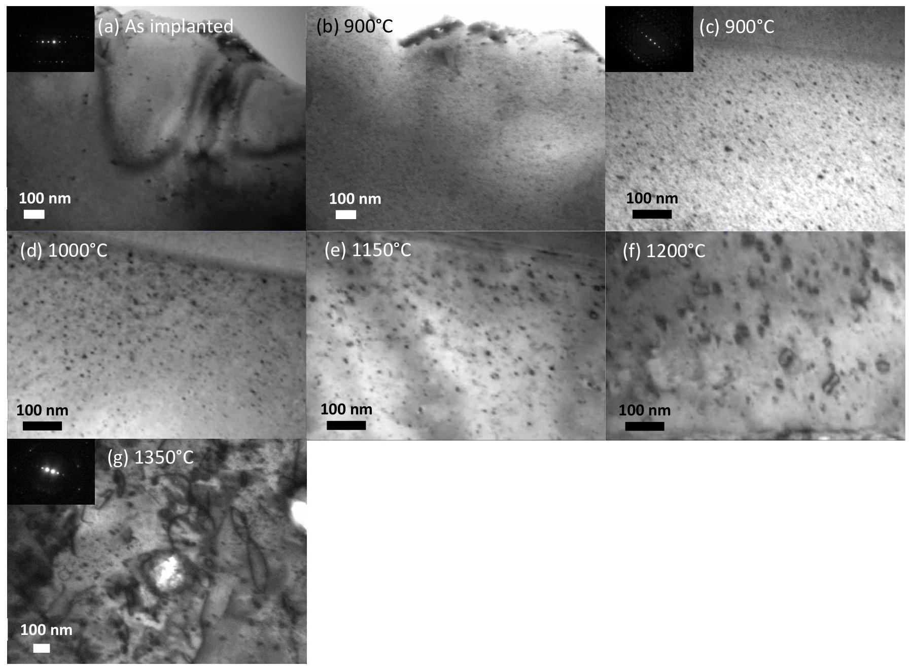
Figure 1: Sequential bright field (BF) TEM images of polycrystalline $\mathrm{UO}_{2}$ thin foil irradiated with 4 $\mathbf{M e V}$ Au at $\mathbf{- 1 8 0}{ }^{\circ} \mathbf{C}$ and $\mathbf{5} \times \mathbf{1 0}^{\mathbf{1 3}} \mathbf{A u} / \mathbf{c m}^{2}$ : (a) as implanted, (b, c) annealed at $\mathbf{9 0 0}{ }^{\circ} \mathbf{C}$ (two areas), (d) $1000^{\circ} \mathrm{C}$, (e) $\mathbf{1 1 5 0}^{\circ} \mathrm{C}$, (f) $\mathbf{1 2 0 0}^{\circ} \mathrm{C}$, (g) $1350{ }^{\circ} \mathrm{C}$. The observations were carried out with $\mathrm{g}=200$ reflection. The insets show the diffraction patterns.

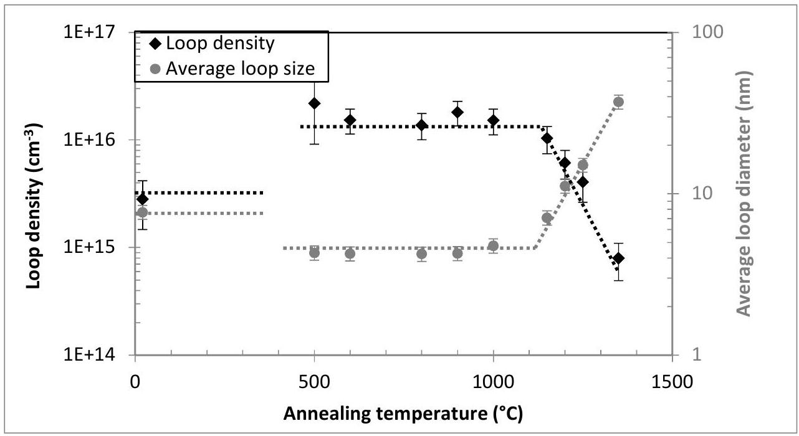
Figure 2 : Loop density and average loop diameter as a function of annealing temperature in $\mathrm{UO}_{2}$ irradiated with $\mathbf{4 ~ M e V ~ A u ~ a t ~}-\mathbf{1 8 0}{ }^{\circ} \mathbf{C}$ and $\mathbf{5} \times \mathbf{1 0}^{\mathbf{1 3}} \mathbf{A u} / \mathbf{c m}^{2}$. Doted lines are guide for the eyes.

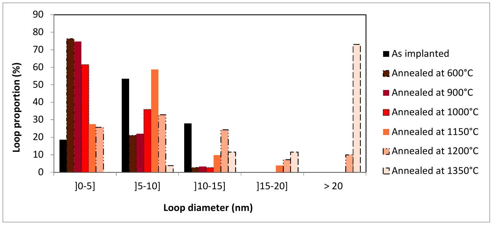
Figure 3 : Dislocation loops diameter repartition as a function of annealing temperature (Color online).

As described in the work of He et al. [29], we can obtain the loop area per volume at each temperature by multiplying the loop density by the loop surface (assuming a round shape) obtained from Figure 2. Assuming all the dislocation loops are interstitial-type, the density of interstitials in the loops can be estimated from the loop area per volume. An increase of the loop area per volume is highlighted from $1100^{\circ} \mathrm{C}$ instead of a constant level or a decrease. It is possible that above $1100^{\circ} \mathrm{C}$ additional interstitials could be released from other defects (grain boundaries for example) and be trapped by the loops

## 3.1.b. Isothermal annealing

In order to study the effect of the annealing time, isothermal annealing was performed on another sample (sample 1b) irradiated with 4 MeV Au at the same fluence ( $5 \times 10^{13} \mathrm{Au} / \mathrm{cm}^{2}$ ) and temperature ( $-180{ }^{\circ} \mathrm{C}$ ). Figure 4 presents the microstructure evolution and Figure 5 shows the loop size and density change as a function of annealing time. Before annealing (Figure 4(a)), the thin foil displays the same microstructure as sample 1a (Figure 1(a)). The density of the small defect clusters and their average diameter are similar as those presented in Figure 2: $1.0 \times 10^{15} \mathrm{~cm}^{-3}$ and 6.9 nm . First, the thin foil was annealed at $500^{\circ} \mathrm{C}$ during 15 min . The same additional black dots appear, as observed previously (Figure 4(b)), inducing a significant density increase ( $2.7 \times 10^{16} \mathrm{~cm}^{-3}$ ). Then, annealing at $1150{ }^{\circ} \mathrm{C}$ was performed during 5 min . All the major changes take place during the first minute: the density is divided by a factor 3 and systematic loop growth is observed. Then, with increasing time, there is no more microstructure evolution.

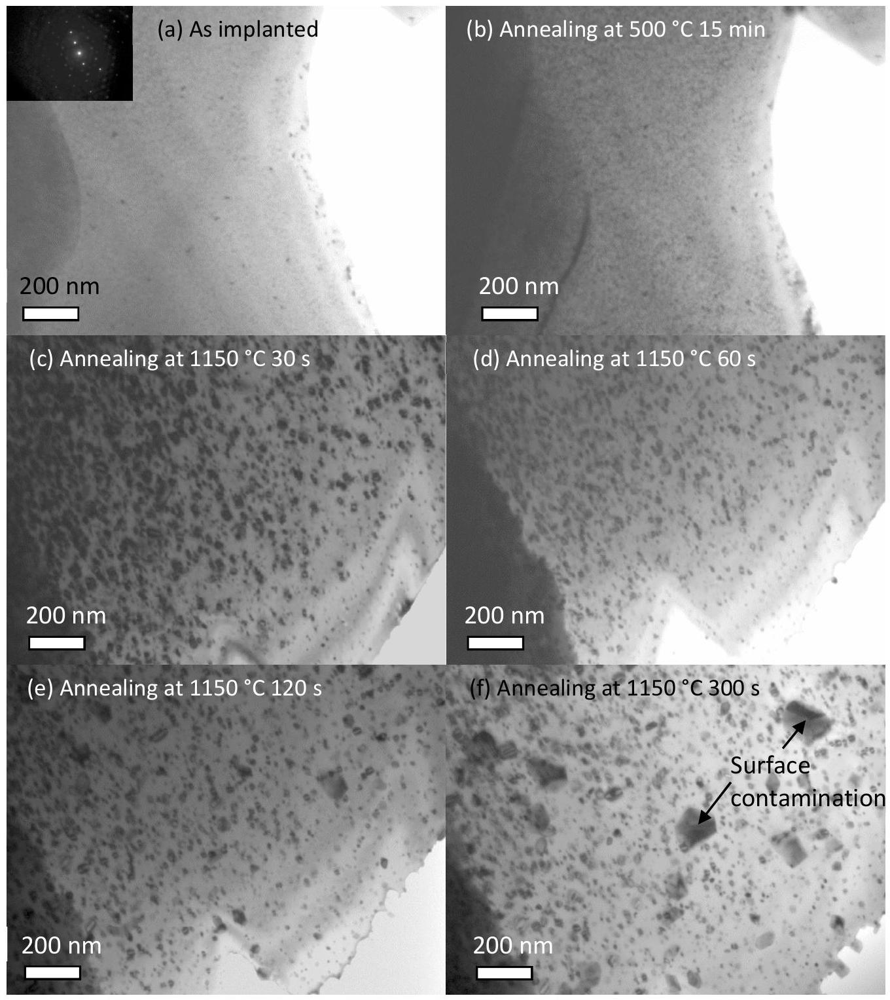
Figure 4 : Sequential BF TEM images of polycrystalline $\mathrm{UO}_{2}$ thin foil irradiated with 4 MeV Au at $\mathbf{1 8 0}^{\boldsymbol{\circ}} \mathbf{C}$ and $\mathbf{5} \times \mathbf{1 0}^{\mathbf{1 3}} \mathbf{A u} / \mathbf{c m}^{\mathbf{2}}$ : (a) as implanted, (b) annealed at $\mathbf{5 0 0}^{\boldsymbol{\circ}} \mathbf{C} \mathbf{1 5 ~ m i n}$, (c) annealed at $\mathbf{1 1 5 0}^{\boldsymbol{\circ}} \mathbf{C}$ 30 s ,(d) 60 s , (e) 120 s , (f) 300 s . The observations were carried out with $\mathrm{g}=220$ reflection (diffraction pattern shown in inset).

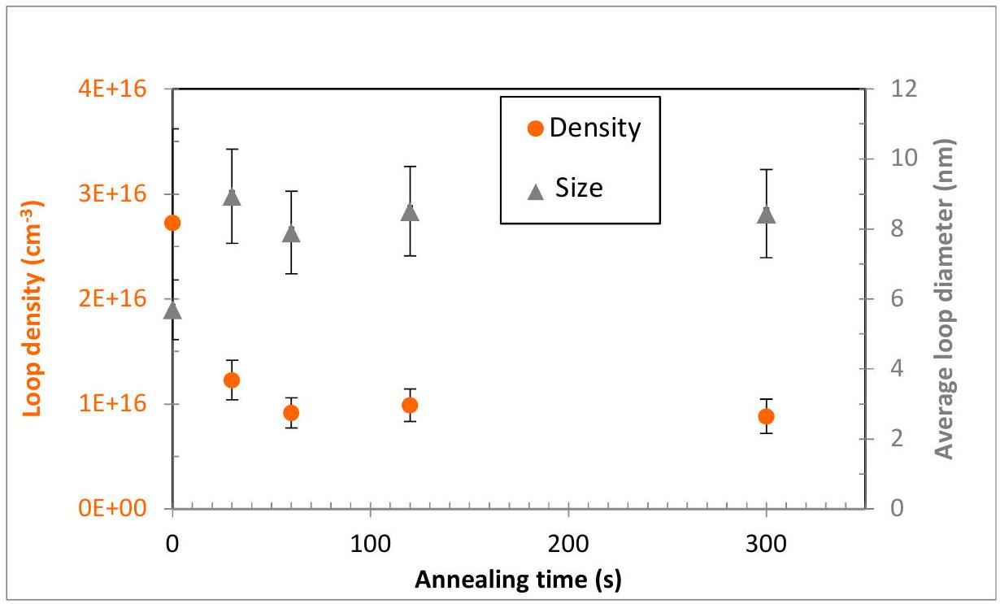
Figure 5 : Loop density and average loop diameter evolution as a function of the annealing time at $\mathbf{1 1 5 0}^{\boldsymbol{\circ}} \mathbf{C}$.

### 3.2. Thermal evolution of dislocation loops and lines concomitantly

Three samples (number 2, 3 and 4) irradiated with 4 MeV Au at high fluence ( 0.5 and $1 \times 10^{15} \mathrm{Au} / \mathrm{cm}^{2}$ ) were annealed as described in Table 1. Figure 6, Figure 7 and Figure 8 present their microstructure evolution as a function of the annealing temperature for samples 2, 3 and 4 respectively. Figure 9 shows dislocation line and loop density change with increasing the annealing temperature.

Initially, all samples present similar microstructure: dislocation lines and small dislocation loops (diameter $<10 \mathrm{~nm})$ between the lines as shown in our previous work [21]. However, the sample irradiated at $-180{ }^{\circ} \mathrm{C}$ (Figure 6(a)) is very strained, thus it is difficult to clearly see individual dislocations and impossible to quantify them below $800^{\circ} \mathrm{C}$.

All samples display very close microstructure evolution with increasing temperature. First, using video monitoring during the in situ TEM annealing, for temperatures ranging from 500 to $1000{ }^{\circ} \mathrm{C}$, many dislocation lines recombination were recorded. These movements take place in the early few minutes at each new temperature plateau and are particularly striking around $800^{\circ} \mathrm{C}$. However, densities are not significantly affected, as the total line length remains unchanged. Thus, there is no line or loop density evolution between 25 and 1000-1100 ${ }^{\circ} \mathrm{C}$ (Figure 9) in good agreement with the results of Nogita et al. obtained for fuel irradiated in pile [30]. It is important to underline that line densities obtained in this study after irradiation (up to $1000^{\circ} \mathrm{C}$ ) are of the same order of magnitude than the one found by I.L.F. Ray et al. [31] for fuel irradiated at high burn-up ( $2.210^{10} \mathrm{~cm}^{-2}$ ). This value does not change significantly between the periphery and the center of the pellet. Then, from $1000-1100^{\circ} \mathrm{C}$, both dislocation line and loop densities
decrease strongly (Figure 9), but even after annealing at $1400^{\circ} \mathrm{C}$ the extended defect recovery is not complete especially in the thickest areas, as observed by Nogita et al. [30]. It is important to remember, that in the case of fuel irradiated in pile, many exogenous atoms (in solid solution, precipitates, bubbles...) are present and should affect the dislocation mobility. The effect of exogenous atoms on extended defect annealing will be discussed in another paper. A loop growth was also highlighted from $1000-1100^{\circ} \mathrm{C}$. For instance, in sample 3 the average loop diameter increases from 4.6 to 10.6 nm between 900 and $1000^{\circ} \mathrm{C}$ and from 10.6 to 19.8 nm between 1000 and $1400^{\circ} \mathrm{C}$.

Unfortunately, above $1100^{\circ} \mathrm{C}$ samples are progressively covered by surface contamination too (visible as faceted dark particles and indicated by an arrow in Figure $6(\mathrm{~g})$ ). This contamination is due to W redeposition, originating from the oven resistances that are overheating. It does not affect the internal dislocation structure of $\mathrm{UO}_{2}$.

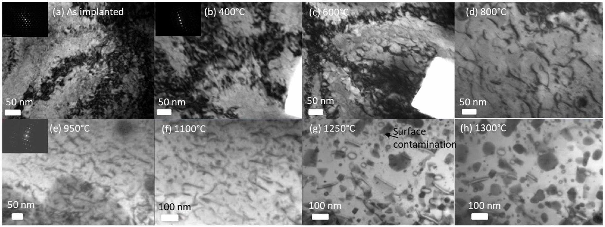
Figure 6 : Sequential BF TEM images of polycrystalline $\mathrm{UO}_{2}$ thin foil irradiated with $\mathbf{4 ~ M e V ~ A u ~ a t - ~} \mathbf{1 8 0}^{\circ} \mathbf{C}$ and $\mathbf{1} \times \mathbf{1 0}^{\mathbf{1 5}} \mathbf{A u} / \mathrm{cm}^{2}$ : (a) as irradiated, (b) annealed at $\mathbf{4 0 0}^{\circ} \mathbf{C}$, (c) $\mathbf{6 0 0}^{\circ} \mathbf{C}$, (d) $\mathbf{8 0 0}^{\circ} \mathbf{C}$, (e) $\mathbf{9 5 0}^{\circ} \mathbf{C}$, (f) $1100^{\circ} \mathrm{C}$, (g) $1250^{\circ} \mathrm{C}$, (h) $1300^{\circ} \mathrm{C}$. The observations were carried out with $\mathrm{g}=111$ reflection (a), with $\mathrm{g}=200$ reflection (b-d) and with $\mathrm{g}=220$ reflection (e-h). The insets show the diffraction patterns.

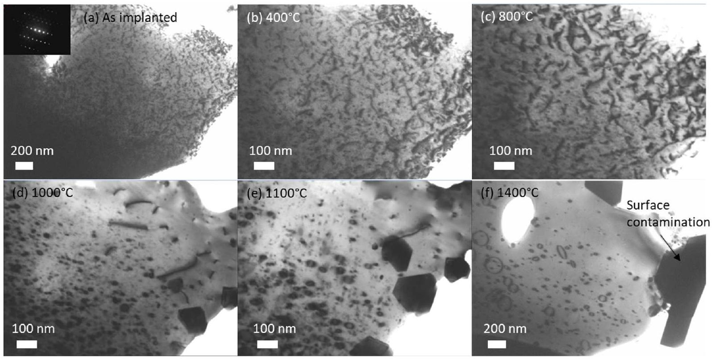
Figure 7 : Sequential BF TEM images of polycrystalline $\mathrm{UO}_{2}$ thin foil irradiated with $\mathbf{4 ~ M e V ~ A u ~ a t ~} \mathbf{2 5} { }^{\circ} \mathrm{C}$ and $5 \times 10^{14} \mathrm{Au} / \mathrm{cm}^{2}$ : (a) as implanted, (b) annealed at $400{ }^{\circ} \mathrm{C}$, (c) $800{ }^{\circ} \mathrm{C}$, (d) $1000{ }^{\circ} \mathrm{C}$, (e) $1100{ }^{\circ} \mathrm{C}$, (f) $1400^{\circ} \mathrm{C}$. The observations were carried out with $\mathbf{g} \boldsymbol{=} \mathbf{2 0 0}$ reflection. The inset shows the diffraction pattern.

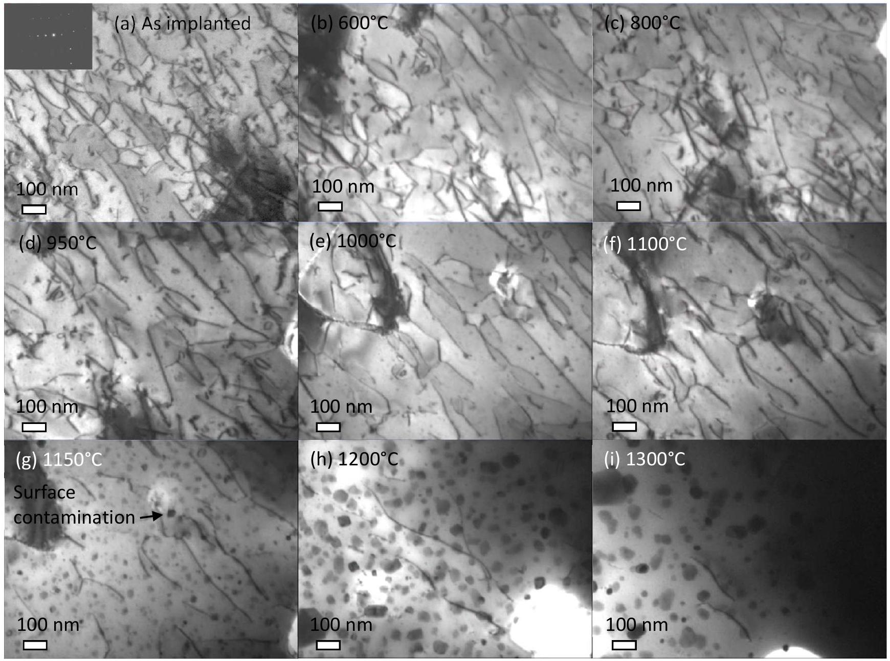
Figure 8 : Sequential BF TEM images of polycrystalline $\mathbf{U O}_{\mathbf{2}}$ thin foil irradiated with $\mathbf{4 ~ M e V}$ Au at $600^{\circ} \mathrm{C}$ and $1 \times 10^{15} \mathrm{Au} / \mathrm{cm}^{2}$ : (a) as implanted, (b) annealed at $600^{\circ} \mathrm{C}$, (c) $800^{\circ} \mathrm{C}$, (d) $950{ }^{\circ} \mathrm{C}$, (e) 1000 ${ }^{\circ} \mathrm{C}$, (f) $1100^{\circ} \mathrm{C}$, (g) $1150^{\circ} \mathrm{C}$, (h) $1200^{\circ} \mathrm{C}$, (i) $1300^{\circ} \mathrm{C}$. The observations were carried out with $\mathrm{g}=220$ reflection. The inset shows the diffraction pattern.

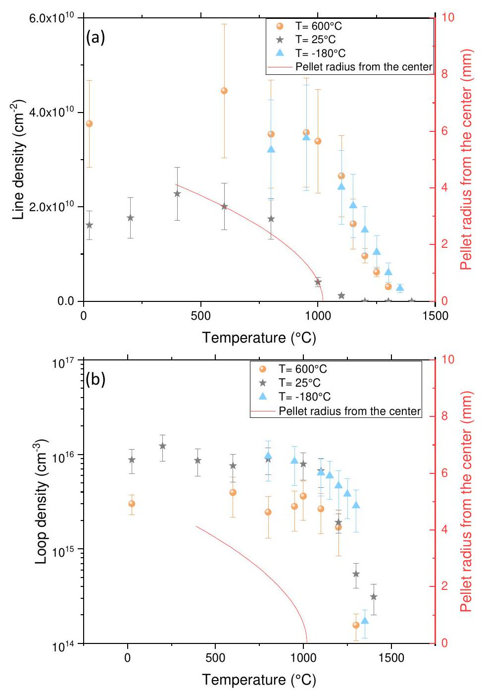
Figure 9 : (a) Dislocation line and (b) dislocation loop densities as a function of the annealing temperature for $\mathrm{UO}_{2}$ irradiated with $\mathbf{4} \mathbf{~ M e V}$ Au at -180, 25 and $\mathbf{6 0 0}^{\circ} \mathrm{C}$ at high fluences. On the right axis, temperature as a function of the pellet radius is reported from an Alcyone 2.0 calculation [32] (Burn-up of $20 \mathrm{GWj} / \mathrm{tU}$, power per unit of length of $250 \mathrm{~W} / \mathrm{cm}, 235 \mathrm{U}$ enrichment of $4.48 \%$ ).

## 4. Discussion

4.1. Annealing mechanisms below $1000-1100^{\circ} \mathrm{C}$

## 4.1.a. Dislocation loops

In the case of sample $1(\mathrm{a}-\mathrm{b})$, which initially contains exclusively small dislocation loops (mean size of 7 nm ), the apparition, at the TEM scale, of a second set of small dislocation loops (diameter < 5 nm ) was
observed around $500{ }^{\circ} \mathrm{C}$ (part 3.1.a). To understand this phenomenon, it is necessary to recall what is happening during low energy ion irradiation in $\mathrm{UO}_{2}$. According to Classical Molecular Dynamics (CMD) calculations, in the nuclear energy loss regime, atomic collisions induce displacement cascades, which lead to a thermal spike of a few picoseconds [33]. CMD simulations have shown that the overlap of displacement cascades induces the formation of cavities, interstitial dislocation loops and of many point defects [34]. These dislocation loops could be directly formed by a loop punching process [35] [34] or by trapping interstitials as the dense periphery of thermal spikes quenches [36] without the need for long-range diffusion. This could explain the presence of the first loop population. During the annealing, point defects induced by irradiation may become mobile above $500{ }^{\circ} \mathrm{C}$. Indeed, in previous thermal annealing studies performed on $\mathrm{UO}_{2}$ irradiated with neutrons, alpha particles [37] [38] [30] or helium [39], elastic strain relaxation, related to point defects recovery, was observed in the temperature range of [200-900 ${ }^{\circ} \mathrm{C}$ ]. Between one and three steps of relaxation were highlighted according to the studies. An elastic strain relaxation step was observed between 500 and $800^{\circ} \mathrm{C}$ and was attributed by previous studies to the uranium vacancy migration [37] [38]. The point defects recovery can occur by different mechanisms, such as recombination, clustering and absorption by sinks, such as dislocations. Thus, the second set of dislocation loops could result from the point defect clustering in new dislocation loops and/or absorption by defect clusters already present but too small to be detected using the TEM. It is important to mention that in our experiments, we see only clusters of diameter larger than about $1-2 \mathrm{~nm}$ (depending on the thin foil quality). Smaller clusters probably exist but are not able to be observed directly.

## 4.1.b. Dislocation lines

In the case of samples 2, 3 and 4, which initially contain dislocation lines and small loops, many dislocation line rearrangements were observed in the temperature range of [ $500-1000^{\circ} \mathrm{C}$ ], and particularly around $800^{\circ} \mathrm{C}$ (part 3.2). These movements are very fast (on the order of a second) and jerky as shown in video 1 (Supplement -Video 1). Since they take place at relatively low temperature, they could be attributed to slip.
Figure 10 illustrates some of these dislocation line slip motion. However, since dislocation lines are anchored and their movements limited, it is not possible to obtain slip traces that are long enough to determine the corresponding crystallographic slip planes.
The origin of dislocation glide is probably to be found in the mutual dislocation-dislocation interactions. Dislocations induce strain field around them, which magnitude decreases with distance to dislocation and which can be attractive or repulsive depending on their geometry (parallel or anti-parallel Burgers vectors, same or different slip planes) [40]. The high dislocation density in our samples actually promote these movements. This obviously worked as some dislocation rearrangements involving slip were observed, but their amplitude were too small to be able to clearly identify the crystallographic slip planes involved. In all
cases, this is the first time that dislocation line movements are observed and reported in real time in $\mathrm{UO}_{2}$ during annealing.

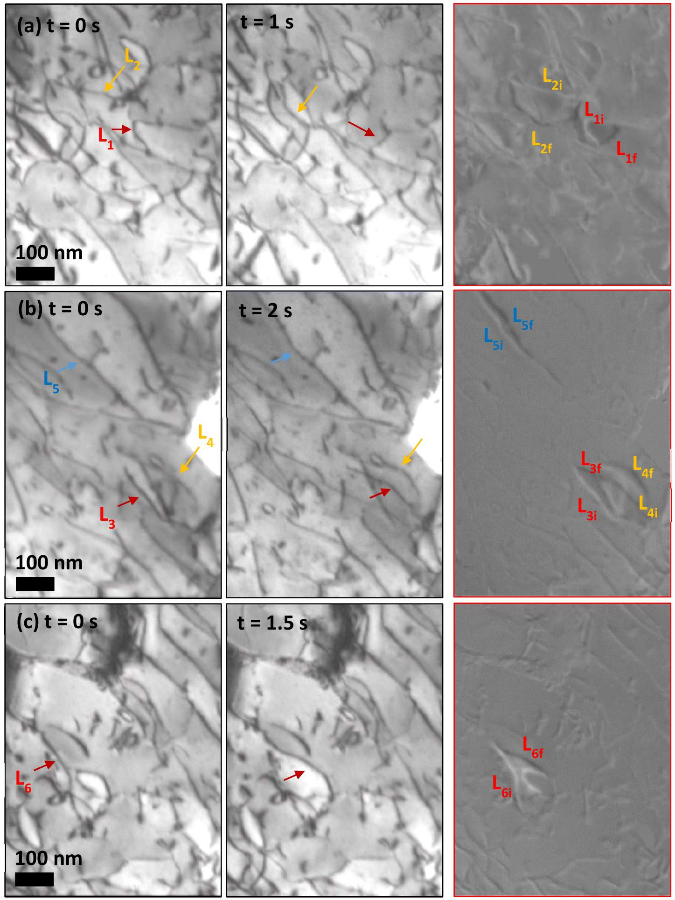
Figure 10 : Sequential BF TEM images of polycrystalline $\mathrm{UO}_{2}$ irradiated with $\mathbf{4 ~ M e V}$ Au at $\mathbf{6 0 0}^{\boldsymbol{\circ}} \mathbf{C}$ and $\mathbf{1} \boldsymbol{\times} \mathbf{1 0}^{\mathbf{1 5}} \mathbf{A u} \boldsymbol{/} \mathbf{c m}^{\mathbf{2}}$ during annealing at $\mathbf{8 0 0}^{\boldsymbol{\circ}} \mathbf{C}$, showing lines movement by glide. The arrows

indicate the studied lines. The images on the left indicate the initial positions ( $\mathbf{L}_{\mathbf{i}}$ ), the images on the middle correspond to the final positions ( $L_{f}$ ) and the images on the right are superposition of initial and final images (the colors of initial images were inverted, so the studied lines appear in white) that highlights the motion of dislocation lines $\mathbf{L}_{\mathbf{x}}(\mathbf{x}=\mathbf{1}-\mathbf{6})$.

### 4.2. Annealing mechanisms above $1000-1100^{\circ} \mathrm{C}$

In all the studied samples, above $1000-1100^{\circ} \mathrm{C}$, extended defects mobility was highlighted using videos during in situ TEM annealing. Both dislocation line and loop densities decrease and the loop size increases. All significant changes of the microstructure take place in the very first few minutes of the annealing, as shown in part 3.1.b. Then, there is no more microstructure change. It is necessary to increase temperature to continue to anneal extended defects in the same way. Thus, each temperature corresponds to a given defect density, size and distance between defects. That is in good agreement with literature data [20] [30] [41], where dislocations are still present in the sample even after several hours at high temperatures (1500$1800^{\circ} \mathrm{C}$ ).

## 4.2.a. Dislocation loops

Dislocation loops move along particular directions without any significant size variation. These movements are very fast (less than 1s) and jerky, and correspond typically to movement by pencil glide of prismatic loops along their Burgers vector direction [42] [43]. The loops induced by irradiation are prismatic with Burgers vectors along <110> directions, according to previous studies [13] [20] [44] [45]. Using stereographic representations, the <110> directions were identified as the glide directions. Therefore, these movements are in good agreement with dislocation loop characteristics in $\mathrm{UO}_{2}$. Figure 11 illustrates loop movement by pencil glide along the < $110>$ directions.

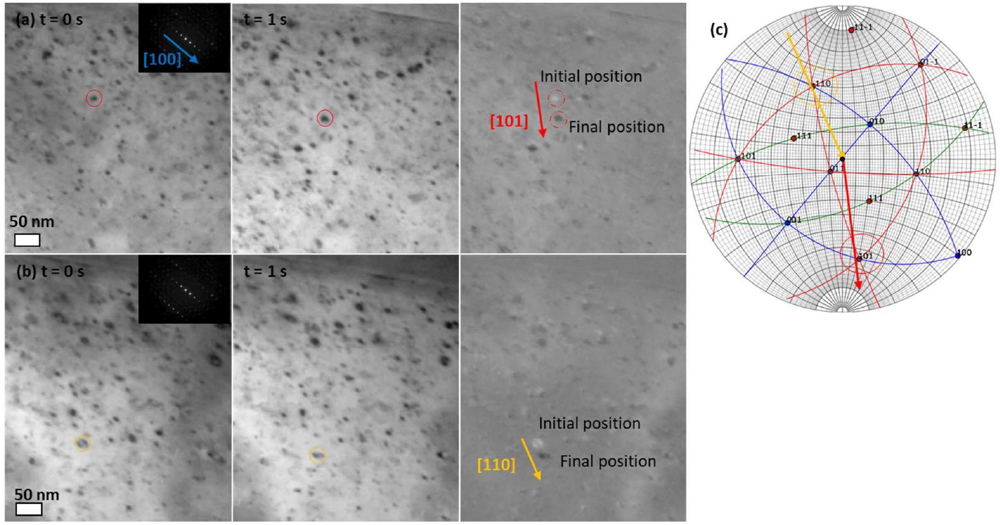
Figure 11: (a-b) Sequential BF TEM images of polycrystalline $\mathbf{U O}_{\mathbf{2}}$ irradiated with $\mathbf{4} \mathbf{~ M e V}$ Au at $\mathbf{- 1 8 0} { }^{\circ} \mathrm{C}$ and $\mathbf{5} \times \mathbf{1 0}^{\mathbf{1 3}} \mathbf{A u} / \mathbf{c m}^{2}$, showing loop movements by pencil glide along the $\langle 110\rangle$ directions during annealing at $\mathbf{1 1 5 0}^{\boldsymbol{\circ}} \mathbf{C}$. The studied loops are circled. The observations were carried out with $\mathbf{g} \boldsymbol{=} \mathbf{2 0 0}$ reflection. The images on the left indicate the initial positions, the images on the middle correspond to the final positions and the images on the right are superposition of initial and final images (the colors of initial image were inverted and the studied loops appear in white). Arrows indicate the glide directions. (c) Stereographic representation associated to (a-b) [46]. The arrows are reported to indicated the glide direction, along the <101> directions.

As explained for the line glide in part 4.1.b, repulsive or attractive interaction between dislocation loops or with free surfaces (image force) could also be a motor for the pencil glide. Thus due to elastic interaction dislocation loops can disappear at surfaces or interact with other loops and anneal themselves or grow by coalescence, as shown in Figure 12.

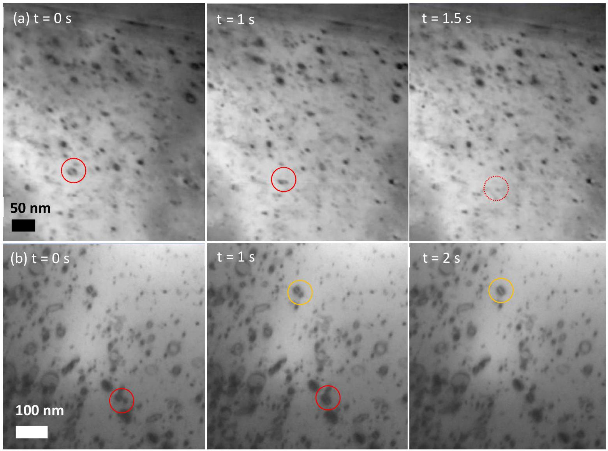
Figure 12 : Sequential BF TEM images of polycrystalline $\mathbf{U O}_{2}$ (a) irradiated with $\mathbf{4 ~ M e V ~ A u ~ a t ~} \mathbf{- 1 8 0} { }^{\circ} \mathrm{C}$ and $\mathbf{5} \times \mathbf{1 0}^{\mathbf{1 3}} \mathbf{A u} / \mathbf{c m}^{\mathbf{2}}$ under thermal annealing at $\mathbf{1 1 5 0}^{\circ} \mathbf{C}$ showing loop disappearance at surface (b) irradiated with 4 MeV Au at $25{ }^{\circ} \mathrm{C}$ and $5 \times 10^{14} \mathrm{Au} / \mathrm{cm}^{2}$ under thermal annealing at $1200{ }^{\circ} \mathrm{C}$ showing loop coalescence by pencil glide. The studied loops are circled.

Another growth mechanism was also observed during annealing. Some loops grow by coalescence using diffusion processes as shown in Figure 13. Loops interact with each other and form a junction. The junction move slowly to minimize the length of the line and a single loop is formed.
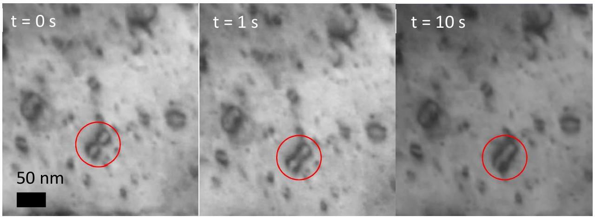

Figure 13 : Sequential BF TEM images of polycrystalline UO $_{2}$ irradiated with $\mathbf{4 ~ M e V ~ A u ~ a t ~} \mathbf{- 1 8 0}{ }^{\circ} \mathbf{C}$ and $\mathbf{5} \times \mathbf{1 0}^{\mathbf{1 3}} \mathbf{A u} / \mathbf{c m}^{\mathbf{2}}$ under thermal annealing at $\mathbf{1 2 0 0}^{\circ} \mathbf{C}$ showing loop coalescence by diffusion process. The studied loops are circled.

All these movements contribute to the loop size and density changes presented in part 3 . The loop movement by pencil glide and growth by coalescence are clearly shown in video 2 (Supplements - Video 2).

Detailed coalescence mechanisms remain unclear. They depend on the relative orientation of Burgers vectors and positions of the loops involved. Different coarsening mechanisms have been highlighted in Fe alloys irradiated with ions according to these relative orientations [47] [48]. Some cases presented in these studies have similarities with our observations (particularly on the development of loop strings and their overlapping- parts 4.2 and 4.4 in [47]). However, a detailed study of the Burgers vectors and habit planes of the colliding loops will be necessary to give more insight into the growth mechanisms.

## 4.2.b. Dislocation lines

Dislocation lines move slowly (few tens of seconds). The total length of the lines decreases. They can, in some configurations, disappear with surfaces. Lines motion is clearly observable in video 3 (Supplement Video 3). The change of the line trace (intersection with surface) is not straight, as highlighted in Figure 14. This indicates that this trace does not correspond to a crystallographic one and that dislocation climb became active at this high temperature. Either lines may climb by absorption of point defects, clusters not observable at the TEM scale, or resolvable loops (see video 3). It is likely that point defects from free surfaces could also participate to the line climb. We will comment this point in the following part.
Vacancy changes with respect to temperature is also an important parameter to fully understand the change in dislocation mechanisms. However, in available literature, only Xe or Kr irradiations at high fluences followed by annealing were performed [49][50][51]. In these conditions, vacancy behavior could be affected by xenon or krypton atoms and could be strongly different from the one without exogenous gas atoms. Marchand et al. [50] reported that after implantation at room temperature, Xe is mainly present under atomic state and no cavities (clusters of several vacancies that might contain gas atoms) could be observed using PAS [52] or TEM [53]. At equivalent irradiation conditions, He et al. [49] and Michel [51] reported small cavities with a diameter around 1 nm . These differences in the initial state could be explained, for the study of Michel, by the high out-of-focus values used for imaging bubbles. Indeed bubble size and density strongly depend on the out-of focus value [54], especially if the objects are very small, as observed in $\mathrm{UO}_{2}$ after ion irradiations [55]. In any case, a cavity growth was highlighted from $1000^{\circ} \mathrm{C} 12 \mathrm{~h}$ [51] or $1300^{\circ} \mathrm{C} 1 \mathrm{~h}$ [49]. Two bubble populations are commonly observed: the first one of around 1
nanometer size and a second one of about 10 nanometer size near dislocations. A link between dislocations, gas atoms and vacancies is thus clearly established. These cavities could pin dislocations lines, preventing their climb for example. We expect a different thermal recovery kinetics of the dislocation lines when exogenous gas atoms are implanted in the samples, as we will discuss in another work.

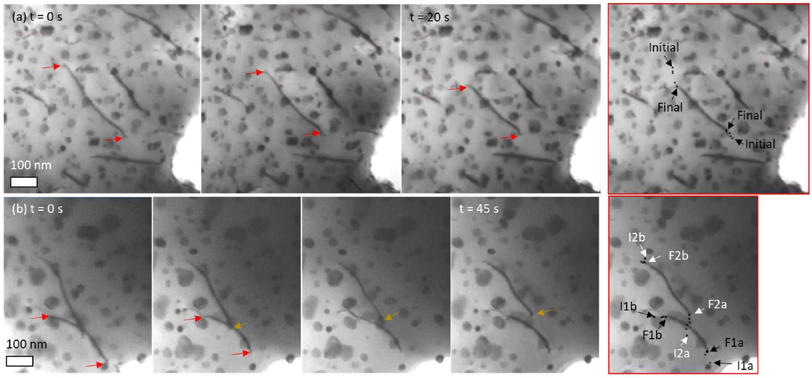
Figure 14 : Sequential BF TEM images of polycrystalline $\mathrm{UO}_{2}$ irradiated at $600^{\circ} \mathrm{C}$ and $\mathbf{1} \times \mathbf{1 0}^{\mathbf{1 5}} \mathbf{i} / \mathbf{c m}^{\mathbf{2}}$ under thermal annealing, showing line movements by climb at (a) $\mathbf{1 1 5 0}^{\circ} \mathrm{C}$, (b) $\mathbf{1 3 0 0}^{\circ} \mathrm{C}$. The arrows indicate the studied lines. The images on the right (with red contours) illustrate the path of the intersection of the line with surfaces. Each black point corresponds to this intersection at different time (each 5s).

## 4.2.c. Bulk sample

In order to study the effect of free surfaces during annealing, we performed an annealing on a bulk sample (disk of $500 \mu \mathrm{~m}$ of thickness) implanted with 27 MeV Kr at $600{ }^{\circ} \mathrm{C}$ and $5 \times 10^{15} \mathrm{i} / \mathrm{cm}^{2}$ (see [41]). This implantation condition, inducing a damage layer over $5 \mu \mathrm{~m}$ with a maximum at $3.5 \mu \mathrm{~m}$, drastically reduces the effect of surfaces during annealing (compared to thin foils). Thin foils were obtained with a FEI Helios 600 NanoLab dual beam FIB at the 'Centre Pluridisciplinaire de Microscopie Electronique et de Microanalyse' (CP2M), before and after the annealing at $1400^{\circ} \mathrm{C}$ during 1 h under $\mathrm{Ar} / 5 \% \mathrm{H}_{2}$, as shown in Figure 15. Initially the sample presents a very dense dislocation line network and small dislocation loops. After annealing, it is clearly visible that most dislocation lines disappeared and large dislocation loops are
also present. This microstructure is in good agreement with those of the thin foils directly annealed in the TEM.

This suggests that the elastic interaction between dislocations is the main motor for the microstructure evolution during annealing, even if the effect of free surfaces could affect the kinetics in case of thin foils. Indeed, during thin foil irradiations, areas near surfaces (thickness of $10-30 \mathrm{~nm}$ ) are denuded of dislocations, as previously observed by L.F. He et al. [13] in Kr irradiated $\mathrm{UO}_{2}$ or in our previous work [21]. This phenomenon was attributed to a surface sink effects and seems to be related to the irradiation temperature. In our case, it is important to note that free surfaces could provide vacancy defects which could strongly participate to dislocation climb. However, as all samples are observed in similar conditions, this potential effect should be leveled.

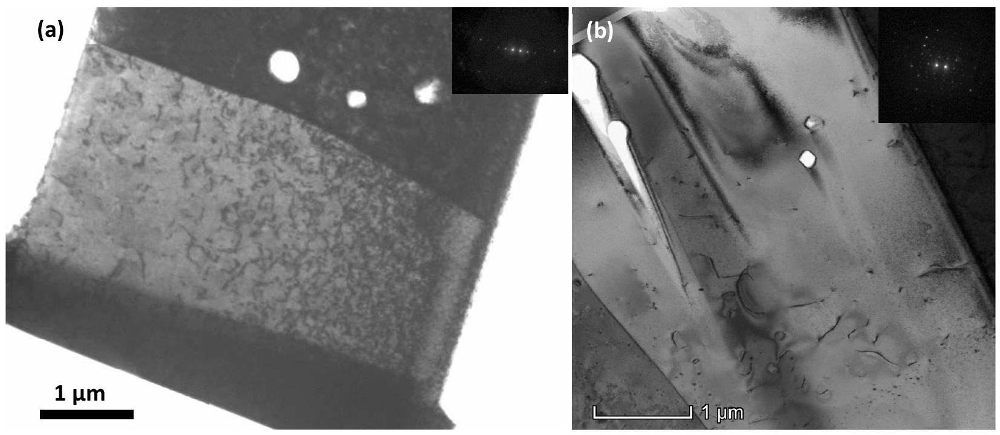
Figure 15 : BF TEM images of polycrystalline $\mathrm{UO}_{2}$ irradiated with $\mathbf{2 7 ~ M e V ~ K r}$ at $\mathbf{6 0 0}^{\boldsymbol{\circ}} \mathbf{C}$ and $\mathbf{5} \boldsymbol{\times} \mathbf{1 0}^{\mathbf{1 5}} \mathrm{i} / \mathrm{cm}^{2}$, (a) before [41] and (b) after annealing at $1400^{\circ} \mathrm{C}$ during 1 h . Observations were carried out with $\mathbf{g} \boldsymbol{=} \mathbf{2 0 0}$ reflections.

## 5. Summary and conclusion

Thermal recovery of extended defects (dislocation lines and loops) induced by ion irradiations in polycrystalline $\mathrm{UO}_{2}$ thin foils was examined through in situ TEM observations. Four samples, irradiated with 4 MeV gold ions at three temperatures ( $-180,25$ and $600^{\circ} \mathrm{C}$ ) and fluences ( $0.5,5$ and $10 \times 10^{14} \mathrm{Au} / \mathrm{cm}^{2}$ ) were annealed up to $1400^{\circ} \mathrm{C}$ in order to observe different initial microstructures. These initial levels of damage correspond to the early first time in reactor. Annealing up to high temperatures using successive temperature plateaus, allowed us to follow extended defects change for temperatures
representative of the pellet periphery $\left(400-500^{\circ} \mathrm{C}\right)$ up to the center $\left(1000-1200^{\circ} \mathrm{C}\right)$, without exogenous atoms contribution.

A first annealing stage was highlighted between 500 and $1000^{\circ} \mathrm{C}$, with different outcomes depending on initial microstructure. When only dislocation loops are initially present due to a low temperature and fluence irradiation, a second set of small dislocation loops (diameter $<5 \mathrm{~nm}$ ) was observed around $500^{\circ} \mathrm{C}$. This could be attributed to point defect recovery on sinks such as dislocations. When both dislocation lines and irradiation loops are initially present, heavy line rearrangements by slip took place, particularly around $800^{\circ} \mathrm{C}$.

Then, whatever the initial irradiation conditions, a second annealing stage corresponding to the extended defect recovery was observed above $1000-1100^{\circ} \mathrm{C}$. Both dislocation loop and line densities decrease with increasing temperature. The total length of dislocation lines is reduced by climb and the dislocation loops move by pencil glide along the <110> Burger vector directions. The coalescence and annihilation of dislocation loops could occur through pencil glide, but probably also involved climb in some cases. However, these movements are only observed in the early few minutes at each temperature plateau. Thus, even after several hours of annealing some dislocations remain, in good agreement with post mortem literature observations.

The current study about mobility of extended defects with temperature constitutes a substantial work to improve the modelling of $\mathrm{UO}_{2}$ under irradiation, especially the formation of sub-grains in central area.

## Acknowledgements

These experiments were supported by the French EMIR accelerators network. We thank the staff of SEMIRAMIS and in particular Sandrine Picard and Jérôme Bourçois (CSNSM/CNRS) for their help in performing irradiations. We also thank Martiane Cabié (CP2M) for performing FIB lamella and Chantal Martial (CEA Cadarache) for the estimation of the stoichiometry of our samples during the annealing using TAF-ID.

## References:

[1] T. Sonoda, M. Kinoshita, I.L.F. Ray, T. Wiss, H. Thiele, D. Pellottiero, V.V. Rondinella, Hj. Matzke, Transmission electron microscopy observation on irradiation-induced microstructural evolution in high burn-up $\mathrm{UO}_{2}$ disk fuel, Nucl. Instr. and Meth. B 191 (2002) 622-628.
[2] S. Kashibe, K. Une, K. Nogita, Formation and growth of intragranular fission gas bubbles in $\mathrm{UO}_{2}$ fuels with burnup of 6-83 GWd/t, J. Nucl. Mater. 206 (1993) 22-34.
[3] K. Nogita, K. Une, Irradiation-induced recrystallization in high burnup $\mathrm{UO}_{2}$ fuel, J. Nucl. Mater. 226 (1995) 302-310.
[4] D. Frazer, Elevated Temperature Small Scale Mechanical Testing of Uranium Dioxide, phD Thesis (2018) Berkeley University.
[5] R. Henry, I. Zacharie-Aubrun, T. Blay, N. Tarisien, S. Chalal, X. Iltis, J.-M. Gatt, C. Langlois, S. Meille, Irradiation effects on the fracture properties of $\mathrm{UO}_{2}$ fuels studied by micro-mechanical testing, J . Nucl. Mater. in press (2020) 152179.
[6] D. Staicu, Thermal Properties of Irradiated $\mathrm{UO}_{2}$ and MOX, in Reference Module in Materials Science and Materials Engineering, Elsevier, 2020.
[7] B. Deng, A. Chernatynskiy, P. Shukla, S. B. Sinnott, S. R. Phillpot, Effects of edge dislocations on thermal transport in $\mathrm{UO}_{2}$, J. Nucl. Mat. 434 (2013) 203-209.
[8] D. Baron, L. Hallstadius, K. Kulacsy, R. Largenton, J. Noirot, Fuel Performance of Light Water Reactors (Uranium Oxide and MOX), in Reference Module in Materials Science and Materials Engineering, Elsevier 2019.
[9] J. Noirot, I. Zacharie-Aubrun, T. Blay, Focused ion beam-scanning electron microscope examination of high burn-up $\mathrm{UO}_{2}$ in the center of a pellet, Nuclear Engineering and Technology 50 (2018) 259-267.
[10] M. Legros, G. Dehm, E. Arzt, T. John Balk, Observation of Giant Diffusivity Along Dislocation Cores, Science 319 (2008) 1646-1649.
[11] S.T. Murphy, P. Fossati, R.W. Grimes, Xe diffusion and bubble nucleation around edge dislocations in $\mathrm{UO}_{2}$. Journal of Nuclear Materials 466 (2015) 634-637.
[12] C. Sabathier, L. Vincent, P. Garcia, F. Garrido, G.Carlot, L. Thome, P. Martin, C. Valot, In situ TEM study of temperature-induced fission product precipitation in $\mathrm{UO}_{2}$, Nucl. Instr. Methods. B 266 (2008) 3027-3032.
[13] L.F. He, M. Gupta, C.A. Yablinsky, J. Gan, M.A. Kirk, X.M. Bai, J. Pakarinen, T.R. Allen, In situ TEM observation of dislocation evolution in Kr-irradiated UO ${ }_{2}$ single crystal, J. Nucl. Mater. 443 (2013) 71-77.
[14] L.F. He, J. Pakarinen, M.A. Kirk, J. Gan, A.T. Nelson, X.-M. Bai, A. El-Azab, T.R. Allen, Microstructure evolution in Xe-irradiated $\mathrm{UO}_{2}$ at room temperature, Nucl. Instr. and Meth. B 330 (2014) 55-60.
[15] B. Ye, A. Oaks, M. Kirk, D. Yun, W.Y. Chen, B. Holtzman, J.F. Stubbins, Irradiation effects in $\mathrm{UO}_{2}$ and $\mathrm{CeO}_{2}$, J. Nucl. Mater. 441 (2013) 525-529.
[16] B. Ye, M. A. Kirk, W. Chen, A. Oaks, J. Rest, A. Yacout, J. F. Stubbins, TEM investigation of irradiation damage in single crystal $\mathrm{CeO}_{2}$, J. Nucl. Mater. 414 (2011) 251-256.
[17] J. Soullard, Mise en evidence de boucles de dislocation imparfaites dans des echantillons de bioxyde d'uranium irradies, J. Nucl. Mater. 78 (1978) 125-130.
[18] K. Yasunaga. K. Yasuda, S. Matsumura, T. Sonoda, Nucleation and growth of defect clusters in $\mathrm{CeO}_{2}$ irradiated with electrons, Nucl. Instr. and Meth. B 250 (2006) 114-118.
[19] K. Yasunaga, K. Yasuda, S. Matsumura, T. Sonoda, Electron energy-dependent formation of dislocation loops in $\mathrm{CeO}_{2}$, Nucl. Instr. and Meth. B 266 (2008) 2877-2881.
[20] A.D. Whapham, B.E. Sheldon, Radiation damage in uranium dioxide, Philos. Mag. 12 (1965) 11791192.
[21] C. Onofri, C. Sabathier, C. Baumier, C. Bachelet, H. Palancher, M. Legros, Evolution of extended defects in polycrystalline Au-irradiated $\mathrm{UO}_{2}$ using in situ TEM: Temperature and fluence effects, J. Nucl. Mater. 482 (2016) 105-113.
[22] C. Onofri, C. Sabathier, C. Baumier, C. Bachelet, H. Palancher, B. Warot-Fonrose, M. Legros, Influence of exogenous xenon atoms on the evolution kinetics of extended defects in polycrystalline $\mathrm{UO}_{2}$ using in situ TEM, J. Nucl. Mater 512 (2018) 297-306.
[23] A. J. Manley, Transmission Electron Microscopy of irradiated $\mathrm{UO}_{2}$ fuel pellets, J. Nucl. Mater. 27 (1968) 216-224.
[24] E. Cottereau, J. Camplan, J. Chaumont, R. Meunier, ARAMIS: an accelerator for research on astrophysics, microanalysis and implantation in solids, Materials Science and Engineering B 2 (1989) 217221.
[25] F. Mompiou, D. Caillard, M. Legros, Grain boundary shear-migration coupling-I. In situ TEM straining experiments in Al polycrystals, Acta Materialia 57 (2009) 2198-2209.
[26] F. Mompiou, M. Legros, Quantitative grain growth and rotation probed by in-situ TEM straining and orientation mapping in small grained Al thin films, Scripta Materialia 99 (2015) 5-8.
[27] D. B. Williams, C. B. Carter, Transmission Electron Microscopy: A Textbook for Materials Science, $2{ }^{\text {e }}$ ed. Springer US, 2009.
[28] C. Guéneau, S. Gossé, A. Quaini, N. Dupin, B. Sundman, M. Kurata, T. Besmann, P. Turchi, J. Dumas, E. Corcoran, M. Piro, T. Ogata, R. Hania, B. Lee, R. Kennedy, S. Massara, "FUELBASE, TAF-ID databases and OC software: Advanced computational tools to perform thermodynamic calcu-lations on nuclear fuel materials," Proceedings of The 7th European Review Meeting on Severe Accident Research 2015, Marseille, France, 2015.
[29] L.F. He, M. Gupta, M.A. Kirk, J. Pakarinen, J. Gan, T.R. Allen, In Situ TEM Observation of Dislocation Evolution in Polycrystalline UO ${ }_{2}$. JOM 66 (2014) 2553-2561.
[30] K. Nogita, K. Une, Thermal Recovery of Radiation Defects and Microstructural Change in Irradiated $\mathrm{UO}_{2}$ Fuels, Journal of Nuclear Science and Technology 30 (1993) 900-910.
[31] I.L.F. Ray, H. Thiele, Hj. Matzke, Transmission electron microscopy study of fission product behaviour in high burnup UO2. Journal of Nuclear Materials 188 (1992) 90-95.
[32] V. Marelle, P. Goldbronn, S. Bernaud, E. Castelier, J. Julien, K. Nkonga, L. Noirot, I. Ramière, New developments in ALCYONE 2.0 fuel performance code. In TOPFUEL, Boise, Idaho (USA), 2016.
[33] L. Van Brutzel, M. Rarivomanantsoa, D. Ghaleb, Displacement cascade initiated with the realistic energy of the recoil nucleus in $\mathrm{UO}_{2}$ matrix by molecular dynamics simulation, J. Nucl. Mater. 354 (2006) 28-35.
[34] G. Martin, P. Garcia, C. Sabathier, L. Van Brutzel, B. Dorado, F. Garrido, S. Maillard, Irradiationinduced heterogeneous nucleation in uranium dioxide, Physics Letters A 374 (2010) 3038-3041.
[35] T. Diaz de la Rubia, M. W. Guinan, New mechanism of defect production in metals: A moleculardynamics study of interstitial-dislocation-loop formation in high-energy displacement cascades, Phys. Rev. Lett. 66 (1991) 2766-2769.
[36] G. Martin, C. Sabathier, J. Wiktor, S. Maillard, Molecular dynamics study of the bulk temperature effect on primary radiation damage in uranium dioxide, Nucl. Instr. and Meth. B 352 (2015) 135-139.
[37] W. J. Weber, Thermal recovery of lattice defects in alpha-irradiated $\mathrm{UO}_{2}$ crystals, J. Nucl. Mater. 114 (1983) 213-221.
[38] R. P. Turcotte. Alpha radiation damage in the actinide dioxydes. Battelle, Pacific Northwest Laboratories Richland. http://www.osti.gov/scitech/servlets/purl/4172799/
[39] H. Palancher, R. Kachnaoui, G. Martin, A. Richard, J.-C. Richaud, C. Onofri, R. Belin, A. Boulle, H. Rouquette, C. Sabathier, G. Carlot, P. Desgardin, T. Sauvage, F. Rieutord, J. Raynal, Ph. Goudeau, A. Ambard, Strain relaxation in He implanted $\mathrm{UO}_{2}$ polycrystals under thermal treatment: An in situ XRD study, J. Nucl. Mater. 476 (2016) 63-76.
[40] J. Friedel, Dislocations, 1964, Pergamon edition.
[41] C. Onofri, C. Sabathier, H. Palancher, G. Carlot, S. Miro, Y. Serruys, L. Desgranges, M. Legros, Evolution of extended defects in polycrystalline $\mathrm{UO}_{2}$ under heavy ion irradiation: combined TEM, XRD and Raman study, Nucl. Instr. and Meth. B 374 (2016) 51-57.
[42] F. R. N. Nabarro, J. P. Hirth. Dislocations in Solids. Volume 12, Elsevier 2004.
[43] T. H. Courtney. Mechanical behavior of materials. Waveland Press 2005.
[44] A. Chartier, C. Onofri, L. Van Brutzel, C. Sabathier, O. Dorosh, J. Jagielski, Early stages of irradiation induced dislocations in urania, Applied Physics Letters 109 (2016) 181902.
[45] C. Onofri, M. Legros, J. Léchelle, H. Palancher, C. Baumier, C. Bachelet, C. Sabathier, Full characterization of dislocations in ion-irradiated polycrystalline UO2, J. Nucl. Mater. 494 (2017) 252-259.
[46] F. Mompiou, Stereoproj, doi:10.5281/zenodo.1434934., 2018.
[47] M. Hernandez-Mayoral, Z. Yao, M.L. Jenkins, M.A. Kirk, Heavy-ion irradiations of Fe and $\mathrm{Fe}-\mathrm{Cr}$ model alloys Part 2: Damage evolution in thin-foils at higher doses, Philos. Mag. 88 (2008) 2881-2897.
[48] K. Arakawa, T. Amino, H. Mori, Direct observation of the coalescence process between nanoscale dislocation loops with different Burgers vectors, Acta Materialia 59 (2011) 141-145.
[49] L.F. He, X.M. Bai, J. Pakarinen, B.J. Jaques, J. Gan, A.T. Nelson, A. El-Azab, T.R. Allen, Bubble evolution in Kr-irradiated UO ${ }_{2}$ during annealing. Journal of Nuclear Materials 496 (2017) 242-250.
[50] B. Marchand, N. Moncoffre, Y. Pipon, N. Bérerd, C. Garnier, L. Raimbault, P. Sainsot, T. Epicier, C. Delafoy, M. Fraczkiewicz, C. Gaillard, N. Toulhoat, A. Perrat-Mabilon, C. Peaucelle, Xenon migration in UO2 under irradiation studied by SIMS profilometry. Journal of Nuclear Materials 440 (2013) 562-567.
[51] A. Michel, thesis, 2011. Etude du comportement des gaz de fission dans le dioxyde d'uranium: mécanismes de diffusion, nucléation et grossissement de bulles. Caen Basse Normandie.
[52] N. Djourelov, B. Marchand, H. Marinov, N. Moncoffre, Y. Pipon, P. Nedelec, N. Toulhoat, Variable energy positron beam study of Xe-implanted uranium oxide, J. Nucl. Mater. 432 (2013) 287-293.
[53] G. Sattonnay, L. Vincent, F. Garrido, L. Thomé, Xenon versus helium behavior in $\mathrm{UO}_{2}$ single crystals: A TEM investigation. J. Nucl. Mater. 355 (2006) 131-135.
[54] B. Yao, D.J. Edwards, R.J. Kurtz, G.R. Odette, T. Yamamoto, Multislice simulation of transmission electron microscopy imaging of helium bubbles in Fe. J. Electron Microsc. (Tokyo) 61 (2012) 393-400.
[55] C. Onofri, C. Sabathier, C. Carlot, D. Drouan, C. Bachelet, C. Baumier, M. Gérardin, M. Bricout, Changes in voids induced by ion irradiations in $\mathrm{UO}_{2}$ : In situ TEM studies. Nuclear Instruments and Methods in Physics Research Section B: Beam Interactions with Materials and Atoms 463 (2020) 76-85.
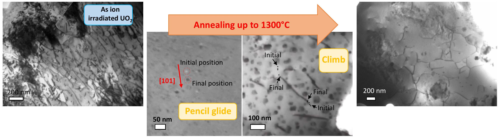

[^0]:    Claire Onofri, C. Sabathier, C. Baumier, C. Bachelet, D. Drouan, et al.. Extended defect change in UO2 during in situ TEM annealing. Acta Materialia, 2020, 196, pp.240-251. <10.1016/j.actamat.2020.06.038>. <hal-03089744>

