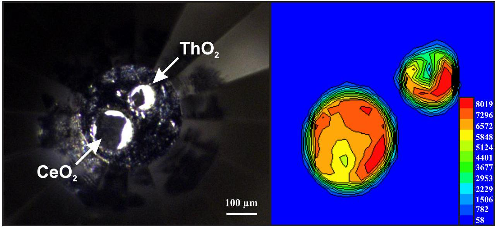
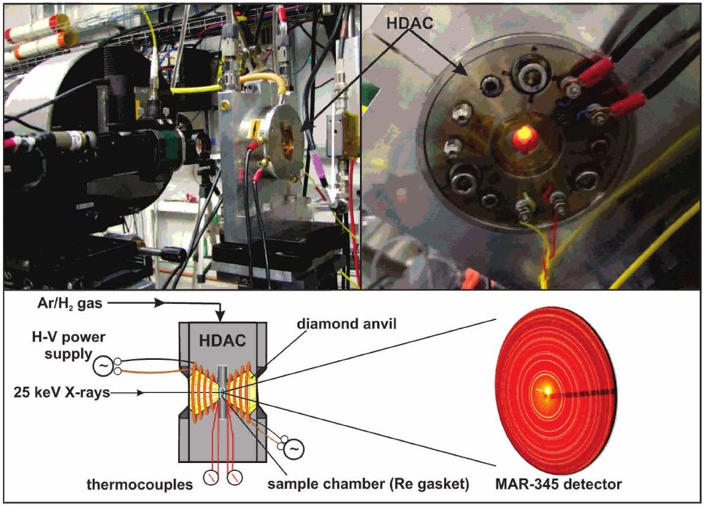
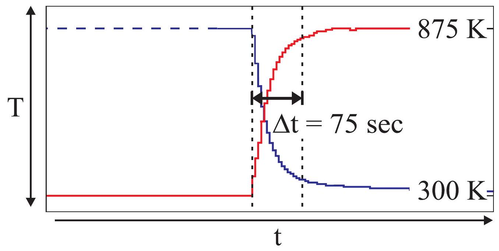
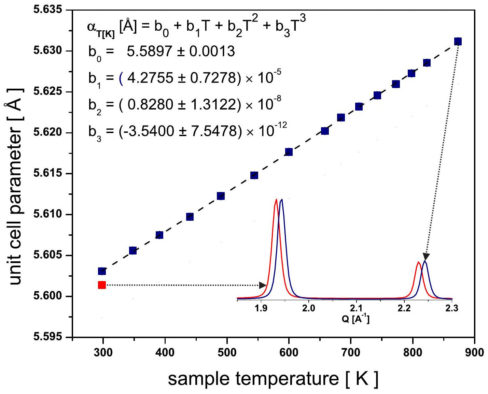
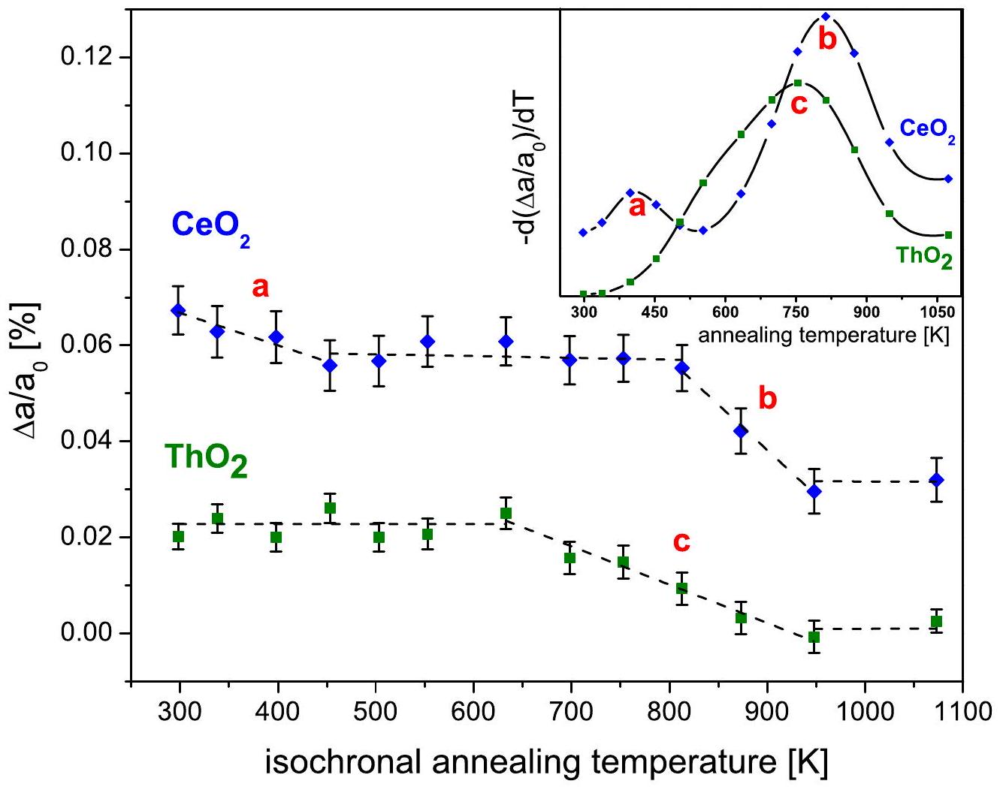
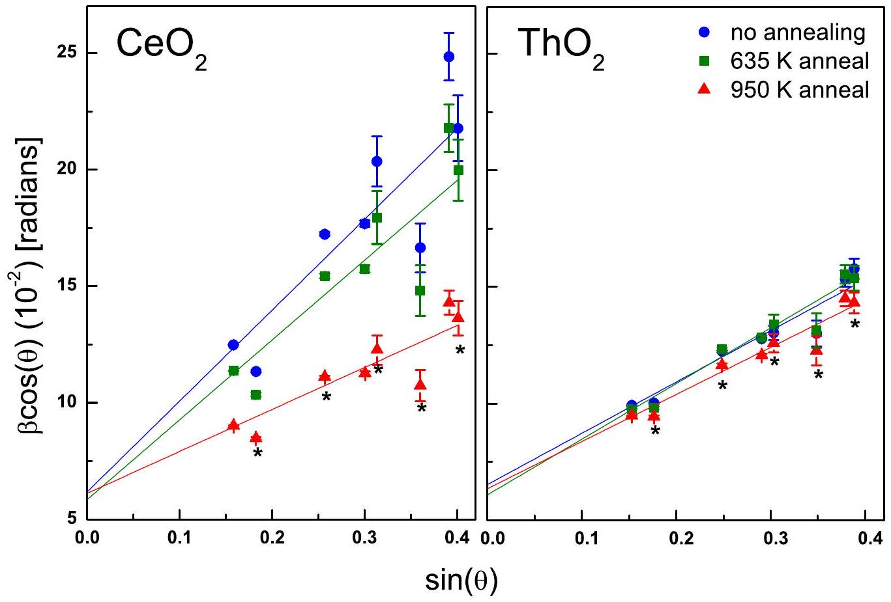

# In Situ Defect Annealing of Swift Heavy Ion Irradiated $\mathbf{C e O}_{\mathbf{2}}$ and $\mathbf{T h O}_{\mathbf{2}}$ Using Synchrotron X-Ray Diffraction 

(**Accepted for Publication - Journal of Applied Crystallography - March 2015**)

Raul I. Palomares ${ }^{\mathrm{a}}$, Cameron L. Tracy ${ }^{\mathrm{b}}$, Fuxiang Zhang ${ }^{\mathrm{b}}$, Changyong Park ${ }^{\mathrm{c}}$, Dmitry Popov ${ }^{\mathrm{c}}$, Christina Trautmann ${ }^{\text {d,e }}$, Rodney C. Ewing ${ }^{\text {f }}$, Maik Lang ${ }^{\text {a* }}$

${ }^{a}$ Department of Nuclear Engineering, University of Tennessee, Knoxville, TN, 37996, USA
${ }^{b}$ Department of Materials Science \& Engineering, University of Michigan, Ann Arbor, MI, 48109, USA
${ }^{c}$ High Pressure Collaborative Access Team (HPCAT), Geophysical Laboratory, Carnegie Institution of Washington, Argonne, IL, 60439, USA
${ }^{d}$ GSI Helmholtzzentrum für Schwerionenforschung, 64291 Darmstadt, Germany
${ }^{e}$ Technische Universität Darmstadt, 64287 Darmstadt, Germany
${ }^{f}$ Department of Geological and Environmental Science, Stanford University, Stanford, CA 94305, USA
*corresponding author: mlang2@utk.edu

Keywords: ion irradiation, actinides, oxides, diffraction, annealing, diamond anvil cell

#### Abstract

Hydrothermal diamond anvil cells (HDACs) provide facile means for coupling synchrotron Xray techniques with pressure up to 10 GPa and temperature up to 1300 K . This manuscript reports on an application of the HDAC as an ambient-pressure sample environment for performing in situ defect annealing and thermal expansion studies of swift heavy ion irradiated $\mathrm{CeO}_{2}$ and $\mathrm{ThO}_{2}$ using synchrotron X-ray diffraction. The advantages of the in situ HDAC technique over conventional annealing methods include: rapid temperature ramping and quench times, high-resolution measurement capability, simultaneous annealing of multiple samples, and prolonged temperature- and apparatus stability at high temperatures. Isochronal annealing between 300 K and 1100 K revealed 2-stage and 1-stage defect recovery processes for irradiated $\mathrm{CeO}_{2}$ and $\mathrm{ThO}_{2}$, respectively; indicating that the morphology of the defects produced by swift heavy ion irradiation of these two materials differs significantly. These results suggest that electronic configuration plays a major role in both the radiation-induced defect production and high temperature defect recovery mechanisms of $\mathrm{CeO}_{2}$ and $\mathrm{ThO}_{2}$.

## Introduction

Diamond-anvil cells (DACs) provide unparalleled high-pressure capabilities and are indispensible tools in diverse scientific fields including chemistry [1], geology [2], and materials science [3]. Of further utility is the combination of DACs with in situ application of high temperature and high-energy radiation. Coupling such extreme conditions can induce highly nonequilibrium, transient states that open pathways to novel phase transformations and modifications in materials [4]. Modern techniques for combining high pressure and high temperature environments involve the use of DACs with laser- and electrical heating systems.

Laser-heating systems can reach temperatures in excess of 5000 K and maintain minimal temperature fluctuations [5, 6]. These features, in conjunction with in situ synchrotron X-ray measurement capabilities, make laser-heated DAC systems ideal for probing the physics of extreme environments. However, laser-based systems require extensive optical alignment and calibration to yield stable heating and measurement conditions, and temperature measurements are less reliable below 1500 K . Electrical heating systems are complimentary to the laser heating method because they can generate and maintain temperatures from $300 \mathrm{~K}-1200 \mathrm{~K}$ for several hours [7]. A unique electrical heating apparatus, the hydrothermal diamond-anvil cell (HDAC), offers great flexibility with respect to sample type and experimental conditions.

Hydrothermal DACs incorporate resistive heating elements and thermocouples within the pressure apparatus, thereby eliminating the additional complexity associated with external alignment and calibration. In addition, the HDAC design minimizes heat loss through superior thermal insulation of the sample chamber such that 150 W is sufficient to reach sample temperatures of $\sim 1300 \mathrm{~K}$ [8]. In the HDAC configuration, the wire-wrapped diamond-anvils are the source of heating. The two anvils are individually heated and put in close contact $(\sim 100 \mu \mathrm{~m})$ with each other to surround the sample chamber and yield stable, homogenous heating conditions. The simplicity of operation of the HDAC and the ease of access to intermediate temperature regimes ( $300-1300 \mathrm{~K}$ ) makes this an attractive tool for performing in situ thermal annealing studies using synchrotron X-ray sources. Such annealing experiments are valuable for investigating defect morphology, diffusion kinetics, and unit cell recovery, among other applications [9, 10]. Thus, annealing experiments are vital analysis techniques for the development of current and next-generation energy materials. These materials require resiliency under high-energy irradiation, high temperature, and/or high-stress environments; hence, it is
important to characterize the evolution and recovery of novel materials in situ under these conditions. In this study, the combined use of an HDAC and synchrotron X-ray diffraction (XRD) was applied to swift heavy ion-irradiated $\mathrm{CeO}_{2}$ and $\mathrm{ThO}_{2}$ for nuclear fuels investigations.

Cerium dioxide ( $\mathrm{CeO}_{2}$ ) has a fluorite-structure, which is the same as that of typical nuclear fuels such as $\mathrm{UO}_{2}$ [11]. Thorium dioxide is a proposed LWR fuel material that boasts superior thermo-physical properties, chemical stability, and proliferation resistance properties over traditional $\mathrm{UO}_{2}$ and $\mathrm{PuO}_{2}$ fuels [12]. During reactor operation, nuclear fuels are exposed to intense radiation fields and temperature gradients. These conditions, in particular fission-fragment- and fast neutron-fluxes, generate nanoscale defects and induce adverse effects such as swelling and redox reactions [13, 14]. Such modifications can degrade materials properties relevant to fuel performance [15]. Much work has been dedicated towards investigating the behavior of nuclear fuel materials under neutron and $\alpha$-particle irradiations; however, studies concerning the effect of high-energy fission-fragment bombardment in fuel materials are far more limited.

Swift heavy ions have been used to simulate the effect of ionizing fission-fragment irradiation because of the similarity in specific kinetic energies ( $>1 \mathrm{MeV} /$ nucleon ) and energy deposition mechanisms. Swift heavy ions deposit substantial quantities of energy in the electronic system of the target in extremely short (sub-picosecond) timescales triggering electron excitation and ionization events, followed by phonon emission during decay of electrons from the conduction band [16]. Depending on the material, these inelastic interaction processes can result in complex damage morphologies. In $\mathrm{CeO}_{2}$, for example, heavy-ion irradiation induces anion deficiency and cation valence reduction in cylindrical damage zones (called "ion tracks") while maintaining bulk integrity of the fluorite-structure [11, 14, 17]. In $\mathrm{ThO}_{2}$, spectroscopic
studies indicate that cation chemistry is unaffected and charge modifications in the local cation environment are balanced by long-range ionic interactions [18]. These results elucidate the response of actinide- and structurally related oxides to swift heavy ion irradiation, yet key questions remain unanswered, such as: What are the kinetics of damage recovery in swift heavyion irradiated oxides? Furthermore, does the defect morphology and do defect migration energies in $\mathrm{ThO}_{2}$, with non-multivalent $\mathrm{Th}^{4+}$ cations, differ from $\mathrm{CeO}_{2}, \mathrm{UO}_{2}$, and $\mathrm{PuO}_{2}$, which possess multivalent cations?

This paper introduces an HDAC-synchrotron XRD experimental setup that enables in situ investigations of the structure and recovery kinetics in a vast array of materials at ambient pressure. Specific examples demonstrate the precision of this technique and the potential applications to energy materials investigations. First, the thermal expansion of swift heavy ionirradiated $\mathrm{ThO}_{2}$ was measured in situ at high temperature. Second, the defect recovery kinetics of swift heavy ion-irradiated $\mathrm{CeO}_{2}$ and $\mathrm{ThO}_{2}$ were characterized via simultaneous, in situ isochronal annealing of both materials.

## Experimental

Polycrystalline pellets of $\mathrm{CeO}_{2}$ and $\mathrm{ThO}_{2}$, with typical grain sizes on the order of $1 \mu \mathrm{~m}$, were prepared by pressing powders into $200 \mu \mathrm{~m}$ diameter holes that were drilled into $50 \mu \mathrm{~m}$ thick stainless steel foils. The samples were irradiated at room temperature and under vacuum at the M2 beamline of the UNILAC at the GSI Helmholtzzentrum für Schwerionenforschung in Darmstadt, Germany with $945 \mathrm{MeV}{ }^{197} \mathrm{Au}$ ions to a fluence of $2.5 \times 10^{13} \mathrm{~cm}^{-2}$. The energy loss and range of the ions in both materials was determined using the SRIM 2013 code [19] assuming 60 percent theoretical density [20]. Density-corrected SRIM calculations [21] estimate that 945
$\mathrm{MeV}{ }^{197} \mathrm{Au}$ ions traverse though the entirety of the pressed pellets and exhibit a mean electronic energy loss per ion of $24 \mathrm{keV} / \mathrm{nm}$ in both $\mathrm{CeO}_{2}$ and $\mathrm{ThO}_{2}$. The uncertainty in these calculated values is approximately 10 percent. The nuclear energy loss along the entire ion path is approximately three orders of magnitude lower than the electronic energy loss and was therefore considered negligible. Additional details regarding the sample preparation and irradiation techniques are described elsewhere [22].

After irradiation, the sample compacts were extracted from the stainless-steel foil holders using a needle. From each sample, a micro-grain was transferred into one of two holes (50-100 $\mu \mathrm{m}$ diameter) that were drilled into a rhenium gasket (Fig. 1) for use with a Basset-modified HDAC [8]. The gasket was pre-indented to a thickness of $\sim 100 \mu \mathrm{~m}$ using the two diamond-anvils with $400 \mu \mathrm{~m}$ cutlet size. The two holes had different diameters to facilitate the identification of the two samples in the chamber during the synchrotron x-ray measurements. The loaded gasket was sealed between the diamond-anvils without exerting pressure on the samples.

Angle-dispersive XRD was performed at the High Pressure Collaborative Access Team (HPCAT) 16-BM-D beam line at the Advanced Photon Source at Argonne National Laboratory. A monochromatic $25 \mathrm{keV}(\lambda=0.4959 \AA)$ beam selected by a Si (111) double crystal monochromator with a focused spot size of $12 \mu \mathrm{~m}(\mathrm{v}) \times 5 \mu \mathrm{~m}(\mathrm{~h})$ was used in transmission geometry. Debye-Scherrer rings were measured using a Mar345 image plate detector. Twodimensional X-ray transmission scans were performed at the beam line to verify the integrity of the samples in the HDAC and to align the X-ray beam with the samples (Fig. 1). The HDAC was connected to an $\mathrm{Ar}-1 \% \mathrm{H}_{2}$ gas source to cool and prevent oxidation of the molybdenum heating coils and the diamond-anvils (Fig. 2). The metal HDAC holder was cooled with circulating water. The temperature of each diamond-anvil was controlled both individually and remotely
outside the beamline hutch using one of two Zantrex XHR $33-33(0-33 \mathrm{~V} ; 0-33 \mathrm{~A})$ power supplies, and the temperature of each diamond-anvil was monitored with thermocouples located in close proximity ( $\sim 50$ microns) to the tip of each diamond-anvil. The high thermal conductivity of the diamond-anvils resulted in minimal temperature variance between the thermocouple contact points and the culet adjacent to the sample, allowing for accurate tracking of the sample annealing temperature.

To determine the thermal expansion of irradiated $\mathrm{ThO}_{2}$, diffraction patterns were measured in situ (i.e., at high temperature) at 50 K intervals using a collection time of 180 seconds as the temperature of the samples was continuously increased from 300 K to 875 K . Each temperature was maintained for 17 minutes prior to collecting a pattern and ramping to the next temperature step at a rate of $0.5^{\circ} \mathrm{C} / \mathrm{sec}$. To monitor the recovery kinetics of ion-beam induced defects in $\mathrm{CeO}_{2}$ and $\mathrm{ThO}_{2}$, the samples were isochronally annealed for 20 minutes in 50 - 75 K temperature steps from 300 K to 1075 K . After each heating step, the samples were quenched to ambient temperature and left to cool for an additional 20 minutes. Upon reaching stable temperature, diffraction patterns were recorded using a collection time of 300 seconds. Diffraction patterns were converted into integrated diffractograms using the software Fit2D [23] and unit cell parameter values were determined by Rietveld refinement [24].

Figure 3 shows the time required to reach and quench back to ambient from 875 K . Due to the high thermal conductivity of the diamonds, the average temperature ramp and quench times were $1-2$ minutes. One advantage of such rapid ramp and quench times is that defect annealing can be studied under well-controlled conditions, which enables higher precision in the determination of activation energies. The stabilization of high temperatures in the HDAC was nearly instantaneous and temperature fluctuations were minimal. The average uncertainty in
annealing temperature (i.e., the temperature difference between the diamonds) during the experiments was $\pm 3^{\circ} \mathrm{C}$. Visual inspection of the diamond-anvils before and after the experiments revealed that they exhibited exceptional stability during operation, even under prolonged use at high temperatures. The maximum temperature reached in the present study was 1075 K .

## Results and Discussion

## Thermal Expansion

Upon continuous heating, the unit cell of irradiated $\mathrm{ThO}_{2}$ expands with increasing temperature (Fig. 4). The red data point represents the unit cell parameter after quenching from the highest temperature. Error bars derived from Rietveld refinement of the diffractograms are smaller than the data points plotted and are therefore not visible. The unit cell parameter of the unirradiated reference sample was determined to be $5.5970 \pm 0.0001 \AA$ (not shown here), which is in good agreement with the value of $5.5974 \pm 0.0006 \AA$ reported by Yamashita et al. [25]. The unit cell parameter after quenching, $5.6014 \pm 0.0001 \AA$, was larger than the unirradiated value, indicating that radiation-induced defects were not fully annealed upon reaching 875 K -the maximum temperature in the thermal expansion study. A third-order polynomial was fit to the thermal expansion data to obtain a relation for the unit cell parameter as a function of absolute temperature (dashed line in Fig. 4). The fitted model of thermal expansion of irradiated $\mathrm{ThO}_{2}$ (present study) agrees with the thermal expansion behavior of unirradiated $\mathrm{ThO}_{2}$ measured by Yamashita et al. using a different technique, to within experimental uncertainty [25].

It is important to note the superior measurement sensitivity of in situ synchrotron XRD measurements, which is manifested in the root mean square of the error (RMSE) from the data
fitting. The RMSE of the present data $\left(1.2 \times 10^{-4}\right)$ is two orders of magnitude smaller than the estimated standard deviation (ESD) reported by Yamashita et al. $\left(6.3 \times 10^{-2}\right)$. This improved resolution is attributed to use of synchrotron XRD in combination with the optimum temperature conditions provided by the heatable diamond-anvil cell. This enables equations of state and thermal-expansion coefficients to be determined with a higher precision, allowing for the detection of miniscule changes in the thermoelastic properties of radiation-damaged materials. The HDAC method is particularly well suited to characterize changes in the thermoelastic properties of neutron-irradiated nuclear materials (for which the damage mechanisms are different and the damage often of greater magnitude than that of swift heavy ion irradiations) because the size of activated (radioactive) samples can be limited to microgram quantities without sacrificing data quality.

## Isochronal Defect Annealing

Heavy ion irradiation induces an increase in unit cell parameter (i.e., unit cell expansion) due to the accumulation of both isolated point defects and agglomerated defect clusters. As a material is heated, these defects are annealed and the unit cell parameter begins to recover. To investigate the defect recovery kinetics in $\mathrm{CeO}_{2}$ and $\mathrm{ThO}_{2}$, changes in unit cell parameter were monitored as a function of isochronal annealing temperature (Fig. 5). The dashed trend lines in Fig. 5 are approximate and are used to guide the eye. The lines were plotted with slope values less than or equal to zero on the assumption that thermal expansion effects (unit cell expansion) were negligible in comparison to defect annealing effects (unit cell reduction) because of the rapid temperature ramp and quench times. Both materials exhibit a monotonic decrease in unit cell parameter as a function of annealing temperature, although the reduction in unit cell
parameters occurs at different rates. For $\mathrm{CeO}_{2}$ (blue diamonds), unit cell parameter recovery begins at very low temperatures whereas, for $\mathrm{ThO}_{2}$ (green squares), the unit cell parameter is approximately constant up to $\sim 650 \mathrm{~K}$, where recovery begins.

Williamson-Hall plots were constructed from the diffractograms collected at various annealing temperatures to determine if the unit cell parameter reduction was influenced by changes in heterogeneous microstrain in the materials (Fig. 6). Williamson-Hall analysis evaluates the dependence of peak broadening on the diffraction angle, $\theta$, to decouple the individual contributions of grain size and microstrain to peak broadening [26]. Plotting $\beta \cos (\theta)$ against $\sin (\theta)$, where $\beta$ is the radiation-induced peak broadening (the increase in full width at half-maximum), yields a line whose slope is proportional to the $\tan (\theta)$ dependence of microstrain-induced peak broadening and whose y-intercept is inversely proportional to the $\cos ^{-} { }^{l}(\theta)$ dependent crystallite size-induced peak broadening. The analysis revealed a negligible change in the average crystallite size (y-intercepts) as a function of annealing temperature in both $\mathrm{CeO}_{2}$ and $\mathrm{ThO}_{2}$. This demonstrates that the reduction of unit cell parameters at low temperatures is accompanied by the relaxation of heterogeneous microstrain in the material but that, at these temperatures, grain growth of the irradiated materials is negligible. Figure 6 also illustrates a large discrepancy in the irradiation-induced microstrain in the materials. The irradiation-induced microstrain in $\mathrm{CeO}_{2}$ is a factor of two greater than that of $\mathrm{ThO}_{2}$, with an augmented contribution to the microstrain arising from the anion sublattice, as alluded by the consistent offset of oxygencontribution data points from the trend lines (see Fig. 6 caption).

Recovery stages and their corresponding activation energies were investigated using the derivative method [9, 27]. By this method, distinct defect annealing processes are identified via peaks in the differential curve of the data. The differential curves demonstrate that there is only
one defect recovery stage in $\mathrm{ThO}_{2}$ while there exist two in $\mathrm{CeO}_{2}$ in the temperature regime investigated (see Fig. 5 inset). The deviation implies a more complex defect annealing behavior in $\mathrm{CeO}_{2}$, which is consistent with the Williamson-Hall analysis and the reported difference in irradiation-induced redox response of the two materials. X-ray absorption spectroscopy (XAS) and X-ray photoelectron spectroscopy (XPS) measurements of $\mathrm{CeO}_{2}$ demonstrate that, under swift heavy ion irradiation, cations in the ion-track core partially reduce from $\mathrm{Ce}^{4+}$ to $\mathrm{Ce}^{3+}$ to offset local charge imbalance induced by anion-interstitial displacement to the periphery of the ion-track [17, 28, 29]. A similar redox response is notably absent in swift heavy ion irradiated $\mathrm{ThO}_{2}$ due to the non-multivalent state of $\mathrm{Th}^{4+}$ cations [18]. Thus, the discrepancy in the magnitude of microstrain and the additional recovery region in the differential curve of $\mathrm{CeO}_{2}$ can be related to (i) partial or full re-oxidation of $\mathrm{Ce}^{3+}$ atoms to the $\mathrm{Ce}^{4+}$ state and/or (ii) the annealing of defect structures that are not formed in $\mathrm{ThO}_{2}$.

Re-oxidation is possible considering that the annealing was performed in an air environment, i.e., the samples were loaded into the gasket in air without a medium. A change from $\mathrm{Ce}^{3+}$ to $\mathrm{Ce}^{4+}$ would be accompanied by a decrease in ionic radius $(1.14 \AA$ to $0.97 \AA)$ [30], which would further accelerate reduction of the average unit cell parameter. The elimination of trivalent cerium from the material, the presence of which causes a size mismatch on the cation sublattice and gives rise to local structural distortion, would also correlate to a reduction in the local strain field, which might manifest as a deviation(s) in the microstrain vs. temperature curve. However, combined influences on the strain field reduction by ionic radii changes and agglomerate defect annealing make it difficult to decouple individual contributions without XAS measurements and/or the use of an alternate sample environment.

Molecular dynamics simulations and theoretical calculations of fluorite structures show that the formation of cation defects is energetically unfavorable and the probability of defect mixing, in which a cation occupies an anion site (or vice versa), is low [31-33]. Hence, defects in $\mathrm{CeO}_{2}$ and $\mathrm{ThO}_{2}$ are predominantly anti-Frenkel defects (anion interstitial-vacancy pairs) with minor populations of Frenkel (cation pairs) and hole defects. The cylindrical ion-track structure in the oxides is similar to the core-shell morphology found in ionic alkali halide crystals [34, 35] and fluorite-derivative pyrochlores [36]. In $\mathrm{CeO}_{2}$, the two regions exhibit differences in stoichiometry induced by the formation of oxygen vacancy-rich cores and oxygen interstitial-rich shells [11, 28]. In $\mathrm{ThO}_{2}$, the concentration and size of defects decreases radially from the iontrack core [18]. In both materials, however, computational studies suggest the formation of charge-neutral oxygen defect clusters including molecular oxygen, split interstitials, and dislocation loops [37].

To elucidate the defect morphology of the irradiated samples, activation energies were derived from the differential curves and compared to literature values for specific defect types. The temperatures corresponding to the peaks in the differential recovery curve (see inset of Fig. 5) were taken to be average temperature values representative of the entire, respective recovery regions (regions $a, b$, and $c$ in Fig. 5). These temperatures ( 380 K and 820 K for $\mathrm{CeO}_{2}$, and 750 K for $\mathrm{ThO}_{2}$ ) were used in the expression [38]:

$$
E=k T \ln (C t)
$$

where $k$ is the Boltzmann constant and $C$ is a frequency factor, to estimate the activation energy, $E$, for defect recovery occurring at a particular annealing temperature $T$ and time $t$. If the frequency factor is known, Eq. (1) can be used to determine the most probable activation energy corresponding to the temperature for maximum recovery in each annealing stage under
isochronal annealing. In this study, $t=20$ minutes and it was assumed that $C=10^{10} \mathrm{~s}^{-1}$, as suggested by Weber for the isostructural oxides [10]. The derived activation energies are 0.99 $\mathrm{eV}, 2.13 \mathrm{eV}$, and 1.95 eV for recovery regions $a, b$, and $c$, respectively (see Fig. 5).

The values for $\mathrm{CeO}_{2}, 0.99 \mathrm{eV}$ and 2.13 eV , are consistent with the values calculated by Weber for O-interstitial migration and Ce-vacancy migration mechanisms in polycrystalline samples [10]. The value for $\mathrm{ThO}_{2}, 1.95 \mathrm{eV}$, does not agree with reported values for migration energies [31]; however, the differential peak of $\mathrm{ThO}_{2}$ is much broader than the peaks of $\mathrm{CeO}_{2}$, suggesting that there exists a distribution of energies, rather than one unique activation energy, for the recovery stage. Assuming the existence of multiple energies for the $\mathrm{ThO}_{2}$ recovery stage, the recovery of $\mathrm{ThO}_{2}$ can be attributed to both O -vacancy and O -interstitial migration. Cation interstitial and vacancy migration are not likely because the stable valence of $\mathrm{Th}^{4+}$ makes anion disorder predominate and cation interstitials seemingly play no part in the defect structure of $\mathrm{ThO}_{2}[31,39]$.

The derived activation energies are inconsistent with density functional theory (DFT) calculations by Xiao et al. that predict higher intrinsic mobility of oxygen defects in $\mathrm{ThO}_{2}$ as opposed to $\mathrm{CeO}_{2}$ [37]; however, discrepancies in migration energies may be attributed to irradiation and annealing conditions. Zinkle et al. indicate that ionizing radiation can promote the recovery of displacement damage in ceramic insulators by enhancing the mobility of point defects, in particular vacancies, via ionization-induced diffusion [40]. This suggests that the behavior of defects produced by highly ionizing radiation can differ from the behavior of intrinsic defects or defects that would result from other kinds of radiation, e.g., from ballistic processes. The charge states of oxygen interstitials and thus the energy of the migration barrier are also highly dependent on the sample environment. For example, Erhart and Albe found that
when annealing ZnO in an oxygen-rich atmosphere, oxygen diffusion was dominated by $\mathrm{O}^{2-}$ interstitials, as opposed to the $\mathrm{O}^{0}$ and $\mathrm{O}^{2+}$ species, which resulted in a lower oxygen migration barrier [41]. Lastly, it should be noted that the redox behavior exhibited by $\mathrm{CeO}_{2}$ under energetic irradiation conditions greatly influences defect behavior [14]. The complex defect partitioning and subsequent changes in ionic radii of cations in ion tracks yields concentration gradients that might in turn modify defect migration energies. A recent STEM study of swift heavy ion irradiated $\mathrm{CeO}_{2}$ shows that in addition to O displacement, comparatively minor populations of Ce are displaced from the ion track core [28]. In $\mathrm{ThO}_{2}$, there is no direct evidence of significant Th displacement. Studies suggest that the coordination of Th remains stable under irradiation and/or local changes in coordination are balanced by long-range ionic interactions [18]. These studies, in conjunction with studies citing relatively high cation defect formation and migration energies [31] might explain why cation-vacancy migration is observed in $\mathrm{CeO}_{2}$ but not $\mathrm{ThO}_{2}$

In summary, swift heavy ion irradiated $\mathrm{CeO}_{2}$ and $\mathrm{ThO}_{2}$ exhibit different defect recovery behaviors. $\mathrm{CeO}_{2}$ exhibits a more complex annealing behavior than $\mathrm{ThO}_{2}$, as indicated by the larger degree of heterogenous microstrain and the additional recovery stage observed during isochronal annealing. Unit cell volume recovery of irradiated $\mathrm{CeO}_{2}$ and $\mathrm{ThO}_{2}$ during the isochronal annealing can be attributed to the relaxation of heterogeneous microstrain and the recombination and annihilation of anion defects (regions $a$ and $c$ in Fig. 5). This is followed by cation vacancy migration in $\mathrm{CeO}_{2}$ (region $b$ in Fig. 5). Additional high-temperature in situ XAS [42, 43] and/or different annealing atmospheres are needed in order to confirm whether the recovery behavior in $\mathrm{CeO}_{2}$ (region $b$ in Fig. 5) is significantly modified by the partial/full reoxidation of $\mathrm{Ce}^{3+}$ cations that are produced by ionizing radiation.

## Conclusions

The combined use of an HDAC apparatus with synchrotron XRD was utilized to perform in situ isochronal annealing and thermal expansion studies on swift heavy ion irradiated $\mathrm{CeO}_{2}$ and $\mathrm{ThO}_{2}$. The advantages of the in situ HDAC technique over conventional annealing methods include: rapid temperature ramping and quench times, high-resolution measurement capability, simultaneous annealing of multiple samples, and prolonged temperature- and apparatus stability at high temperatures. The features, considering the potential for coupling with X-ray absorption spectroscopy and high-pressure, make the HDAC an attractive tool for performing highresolution, in situ investigations of defect annealing, thermal expansion, and diffusion for a wide range of materials. Isochronal defect annealing in the HDAC independently confirmed the recently reported difference in defect behavior between swift heavy ion irradiated $\mathrm{CeO}_{2}$ and $\mathrm{ThO}_{2}$. $\mathrm{CeO}_{2}$ exhibits a 2 -stage defect recovery mechanism whereas $\mathrm{ThO}_{2}$ exhibits a 1 -stage mechanism. These results suggest that cation electronic configuration plays a significant role in not only the defect production behavior, but also the defect recovery mechanisms of the fluoritestructure oxides.

## Acknowledgements

This work was supported by the Energy Frontier Research Center Materials Science of Actinides funded by the U.S. Department of Energy, Office of Science, Office of Basic Energy Sciences (DE-SC0001089). Portions of this work were performed at HPCAT (Sector 16), Advanced Photon Source (APS), Argonne National Laboratory. HPCAT operations are supported by DOENNSA under Award No. DE-NA0001974 and DOE-BES under Award No. DE-FG0299ER45775, with partial instrumentation funding by NSF. APS is supported by DOE-BES,
under Contract No. DE-AC02-06CH11357. HPCAT beamtime was granted by the Carnegie/DOE Alliance Center (CDAC).

## References

1. Smith, R.L. and Z. Fang, Techniques, applications and future prospects of diamond anvil cells for studying supercritical water systems. Journal of Supercritical Fluids, 2009. 47(3): p. 431-446.
2. Fei, Y.W., et al., Toward an internally consistent pressure scale. Proceedings of the National Academy of Sciences of the United States of America, 2007. 104(22): p. 91829186.
3. Eremets, M.I., et al., Superconductivity in boron. Science, 2001. 293(5528): p. 272-274.
4. Lang, M., et al., Nanoscale manipulation of the properties of solids at high pressure with relativistic heavy ions. Nature Materials, 2009. 8(10): p. 793-797.
5. Heinz, D.L., J.S. Sweeney, and P. Miller, A Laser-Heating System That Stabilizes and Controls the Temperature - Diamond Anvil Cell Applications. Review of Scientific Instruments, 1991. 62(6): p. 1568-1575.
6. Ma, Y.Z., et al., Two-dimensional energy dispersive $x$-ray diffraction at high pressures and temperatures. Review of Scientific Instruments, 2001. 72(2): p. 1302-1305.
7. Dubrovinskaia, N. and L. Dubrovinsky, Whole-cell heater for the diamond anvil cell. Review of Scientific Instruments, 2003. 74(7): p. 3433-3437.
8. Bassett, W.A., High pressure-temperature aqueous systems in the hydrothermal diamond anvil cell (HDAC). European Journal of Mineralogy, 2003. 15(5): p. 773-780.
9. Zinkle, S.J. and B.N. Singh, Analysis of Displacement Damage and Defect Production under Cascade Damage Conditions. Journal of Nuclear Materials, 1993. 199(3): p. 173191.
10. Weber, W.J., Alpha-Irradiation Damage in Ceo2, Uo2 and Puo2. Radiation Effects and Defects in Solids, 1984. 83(1-2): p. 145-156.
11. Yasuda, K., et al., Defect formation and accumulation in CeO2 irradiated with swift heavy ions. Nuclear Instruments \& Methods in Physics Research Section B-Beam Interactions with Materials and Atoms, 2013. 314: p. 185-190.
12. IAEA, Thorium Fuel Cycle - Potential Benefits and Challenges. 2005(IAEA-TECDOC1450).
13. Matzke, H., P.G. Lucuta, and T. Wiss, Swift heavy ion and fission damage effects in UO2. Nuclear Instruments \& Methods in Physics Research Section B-Beam Interactions with Materials and Atoms, 2000. 166: p. 920-926.
14. Tracy, C.L., et al., Redox response of actinide materials to highly ionizing radiation. Nat Commun, 2015. 6: p. 6133.
15. Macewan, J.R. and R.L. Stoute, ANNEALING OF IRRADIATION-INDUCED THERMAL CONDUCTIVITY CHANGES IN THO2-1.3 WT PERCENT UO2. Journal of the American Ceramic Society, 1969. 52(3): p. 160-\&.
16. Toulemonde, M., et al., Experimental Phenomena and Thermal Spike Model Description of Ion Tracks in Amorphisable Inorganic Insulators, in Ion Beam Science: Solved and Unsolved Problems, P. Sigmund, Editor. 2006, The Royal Danish Academy of Sciences and Letters: Copenhagen. p. 263-292.
17. Ohno, H., et al., Study on effects of swift heavy ion irradiation in cerium dioxide using synchrotron radiation X-ray absorption spectroscopy. Nuclear Instruments \& Methods in Physics Research Section B-Beam Interactions with Materials and Atoms, 2008. 266(1213): p. 3013-3017.
18. Tracy, C.L., et al., Defect accumulation in ThO2 irradiated with swift heavy ions. Nuclear Instruments \& Methods in Physics Research Section B-Beam Interactions with Materials and Atoms, 2014. 326: p. 169-173.
19. Ziegler, J.F., M.D. Ziegler, and J.P. Biersack, SRIM - The stopping and range of ions in matter (2010). Nuclear Instruments \& Methods in Physics Research Section B-Beam Interactions with Materials and Atoms, 2010. 268(11-12): p. 1818-1823.
20. Luther, E., et al., Microstructural Characterization of Uranium Oxide. Transactions of the American Nuclear Society, 2011. 104(Nuclear Fuels and Materials): p. 257-258.
21. Lang, M.I., et al., Swift heavy ion-induced phase transformation in Gd2O3. Nuclear Instruments \& Methods in Physics Research Section B-Beam Interactions with Materials and Atoms, 2014. 326: p. 121-125.
22. Lang, M., et al., Characterization of ion-induced radiation effects in nuclear materials using synchrotron X-ray techniques. Journal of Materials Research, 2015. in press.
23. Hammersley, A.P., FIT2D: An Introduction and Overview, in ESRF Internal Report. 1997.
24. Rietveld, H.M., A Profile Refinement Method for Nuclear and Magnetic Structures. Journal of Applied Crystallography, 1969. 2: p. 65-\&.
25. Yamashita, T., et al., Thermal expansions of NpO 2 and some other actinide dioxides. Journal of Nuclear Materials, 1997. 245(1): p. 72-78.
26. Williamson, G.K. and W.H. Hall, X-ray line broadening from filed aluminium and wolfram. Acta Metallurgica, 1953. 1(1): p. 22-31.
27. Weber, W.J., Thermal Recovery of Lattice-Defects in Alpha-Irradiated Uo2 Crystals. Journal of Nuclear Materials, 1983. 114(2-3): p. 213-221.
28. Takaki, S., et al., Atomic structure of ion tracks in Ceria. Nuclear Instruments \& Methods in Physics Research Section B-Beam Interactions with Materials and Atoms, 2014. 326: p. 140-144.
29. Iwase, A., et al., Study on the behavior of oxygen atoms in swift heavy ion irradiated CeO2 by means of synchrotron radiation X-ray photoelectron spectroscopy. Nuclear Instruments \& Methods in Physics Research Section B-Beam Interactions with Materials and Atoms, 2009. 267(6): p. 969-972.
30. Shannon, R.D., REVISED EFFECTIVE IONIC-RADII AND SYSTEMATIC STUDIES OF INTERATOMIC DISTANCES IN HALIDES AND CHALCOGENIDES. Acta Crystallographica Section A, 1976. 32(SEP1): p. 751-767.
31. Colbourn, E.A. and W.C. Mackrodt, The Calculated Defect Structure of Thoria. Journal of Nuclear Materials, 1983. 118(1): p. 50-59.
32. Simeone, D., et al., Impact of radiation defects on the structural stability of pure zirconia. Physical Review B, 2004. 70(13).
33. Van Brutzel, L., et al., Molecular dynamics studies of displacement cascades in the uranium dioxide matrix. Philosophical Magazine, 2003. 83(36): p. 4083-4101.
34. Schwartz, K., et al., Damage and track morphology in LiF crystals irradiated GeV ions. Physical Review B, 1998. 58(17): p. 11232-11240.
35. Trautmann, C., et al., Swelling of insulators induced by swift heavy ions. Nuclear Instruments \& Methods in Physics Research Section B-Beam Interactions with Materials and Atoms, 2002. 191: p. 144-148.
36. Lang, M., et al., Advances in understanding of swift heavy-ion tracks in complex ceramics. Current Opinion in Solid State and Materials Science, 2015. 19(1): p. 39-48.
37. Xiao, H.Y., Y. Zhang, and W.J. Weber, Ab initio molecular dynamics simulations of lowenergy recoil events in ThO2, CeO2, and ZrO2. Physical Review B, 2012. 86(5).
38. Primak, W., KINETICS OF PROCESSES DISTRIBUTED IN ACTIVATION ENERGY. Physical Review, 1955. 100(6): p. 1677-1689.
39. Murch, G.E. and C.R.A. Catlow, OXYGEN DIFFUSION IN UO2, THO2 AND PUO2 - A REVIEW. Journal of the Chemical Society-Faraday Transactions Ii, 1987. 83: p. 11571169.
40. Zinkle, S.J., V.A. Skuratov, and D.T. Hoelzer, On the conflicting roles of ionizing radiation in ceramics. Nuclear Instruments \& Methods in Physics Research Section BBeam Interactions with Materials and Atoms, 2002. 191: p. 758-766.
41. Erhart, P. and K. Albe, First-principles study of migration mechanisms and diffusion of oxygen in zinc oxide. Physical Review B, 2006. 73(11).
42. Sapelkin, A.V. and S.C. Bayliss, X-ray absorption spectroscopy under high pressures in diamond anvil cells. High Pressure Research, 2002. 21(6): p. 315-329.
43. Baldini, M., et al., High-pressure EXAFS measurements of crystalline Ge using nanocrystalline diamond anvils. Physical Review B, 2011. 84(1).

Figure 1: Optical microscope (left) and X-ray transmission scan (right) images of the hydrothermal diamond-anvil cell sample chambers. Irradiated $\mathrm{CeO}_{2}$ and $\mathrm{ThO}_{2}$, were simultaneously annealed under identical sample conditions using a single rhenium gasket with two holes that served as sample chambers. The two-dimensional X-ray transmission scan was used to locate the samples in the gasket for aligning the X-ray beam with the samples. The X-ray absorption of the sample chamber is lower than that from the surrounding rhenium gasket as indicated by the transmitted X-ray intensity (red: high intensity vs. blue: low intensity).

Figure 2: The experimental hydrothermal diamond anvil cell (HDAC) setup at the HPCAT 16BM-D beam line of the Advanced Photon Source at Argonne National Laboratory. The upper left frame shows an identical setup with a Mar165 CCD detector. The HDAC is positioned in the synchrotron x-ray beam, such that the single crystal diamonds serve as windows into the sample containment cell. The upper right frame shows in situ heating of the sample via resistive heating of the diamond-anvils. The bottom frame schematically illustrates the HDAC assembly and the x-ray diffraction setup.

Figure 3: Temperature readings from one of the diamond-anvil thermocouples during the heating and cooling cycles. The red line (overlaid on the blue line for comparison) shows the ramping of temperature to a constant value prior to annealing. The blue line shows the quenching of sample temperature after prolonged annealing at a constant, elevated temperature. The high thermal conductivity of the diamond-anvils yields average heating and quench times of 1-2 minutes and minimal temperature fluctuation.

Figure 4: The thermal expansion of swift heavy-ion irradiated $\mathrm{ThO}_{2}$ measured in a hydrothermal diamond-anvil cell (blue squares) and the associated third-order polynomial fit to the data (dashed black line). The coefficients of the polynomial fit are shown in the top left of the figure. The red point denotes the unit cell parameter after quenching from 875 K . The integrated diffractograms for the highest temperature measurement ( 875 K ) and for the quenched sample measurement are compared at the bottom right of the figure.

Figure 5: The relative change in unit cell parameter of $\mathrm{CeO}_{2}$ (blue diamonds) and $\mathrm{ThO}_{2}$ (green squares) as a function of annealing temperature. The dashed trend lines are approximate and are used to guide the eye. The lines were plotted with slope values less than or equal to zero on the assumption that thermal expansion effects (unit cell expansion) were negligible in comparison to defect annealing effects (unit cell reduction) for the procedure (sequential heating and quenching) and ramp/quench times used. The inset shows the differential curves of the annealing data. The temperature values corresponding to the maxima of the derivative curves were used as representative values for estimating the activation energies of the three recovery regions (peaks). The linear recovery regions labeled $a, b$, and $c$ correspond to the peaks labeled $a, b$, and $c$ in the differential curves.

Figure 6: Williamson-Hall plots of irradiated $\mathrm{CeO}_{2}$ (left) and $\mathrm{ThO}_{2}$ (right). Data points directly above an asterisk correspond to diffraction peaks with an oxygen-contribution. Consistent offset of oxygen-correlated data points from the trend lines suggest that the microstrain is heterogeneous with an augmented contribution to the microstrain arising from the anion sublattice.

Figure 1

Figure 2

Figure 3

Figure 4

Figure 5

Figure 6

