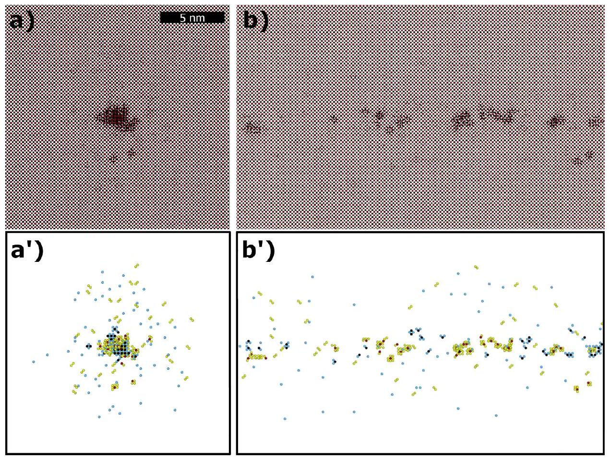
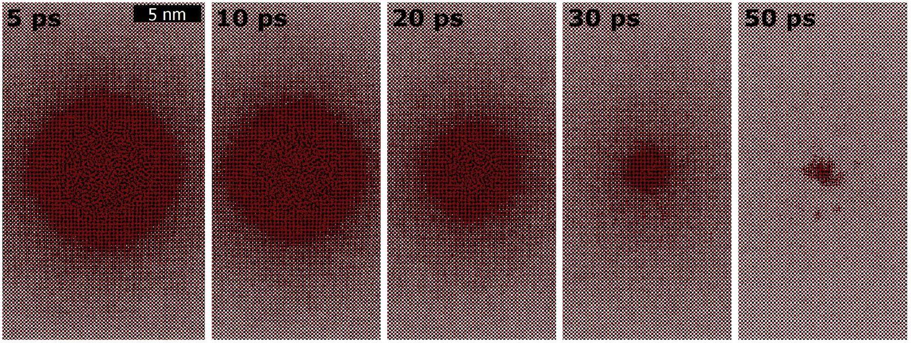
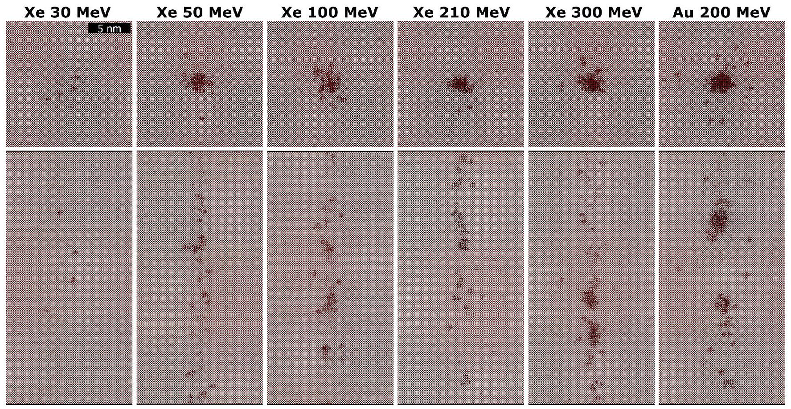
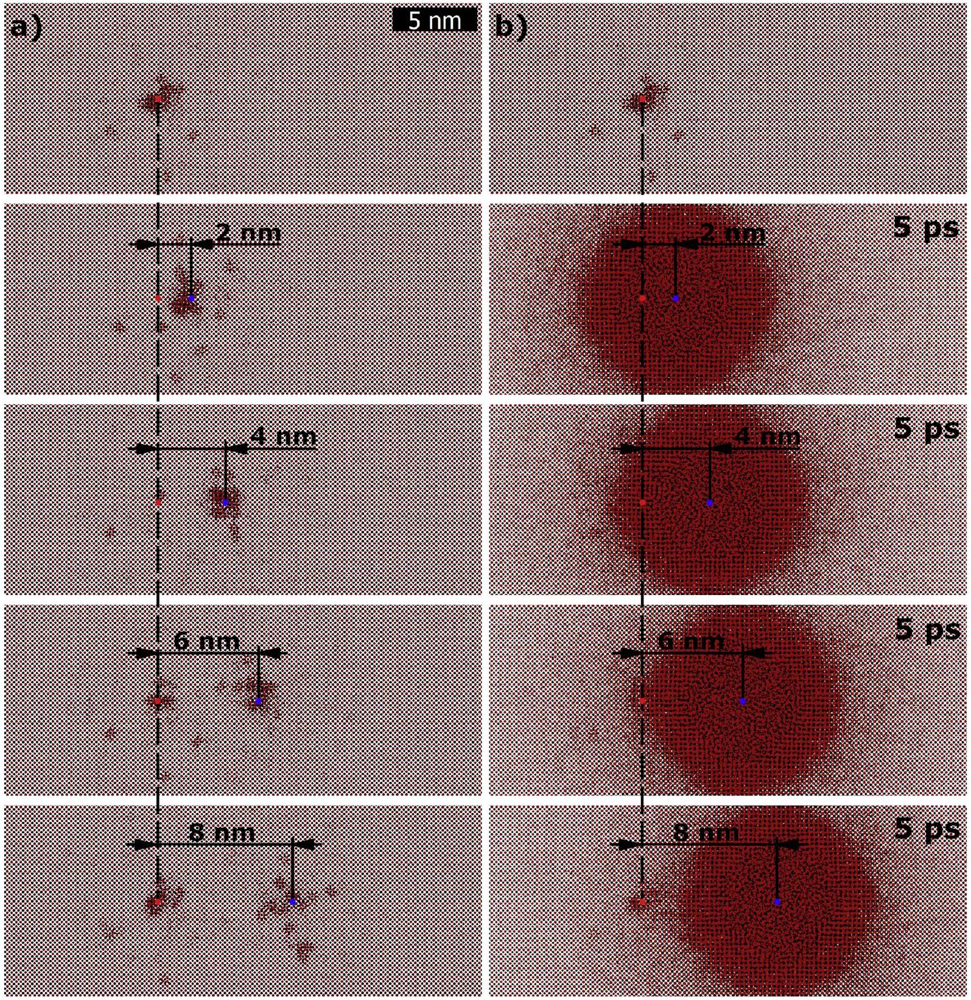
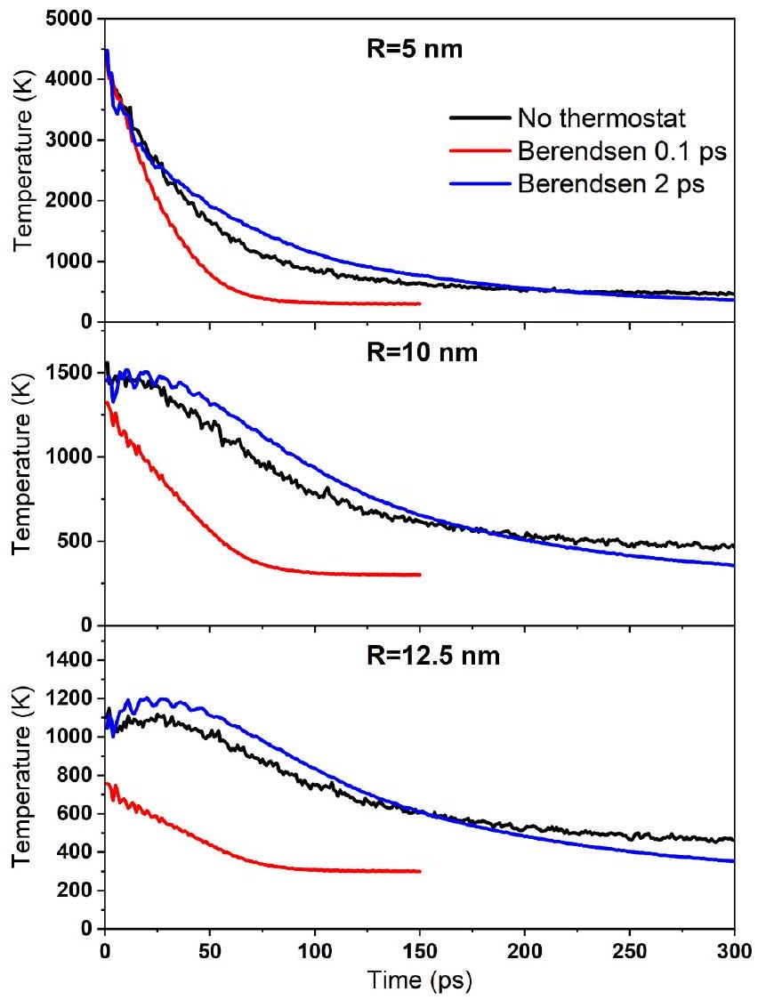
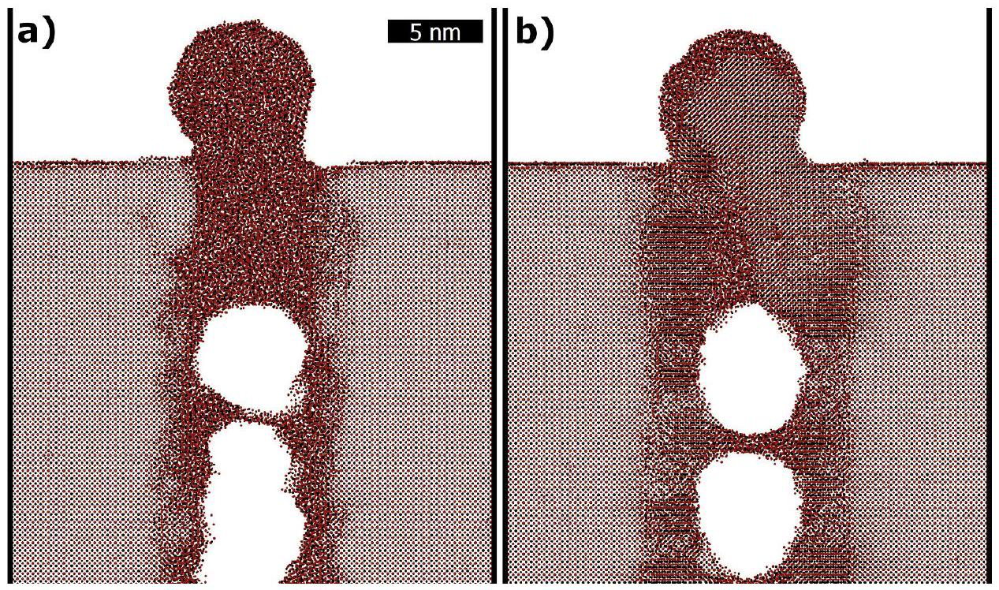
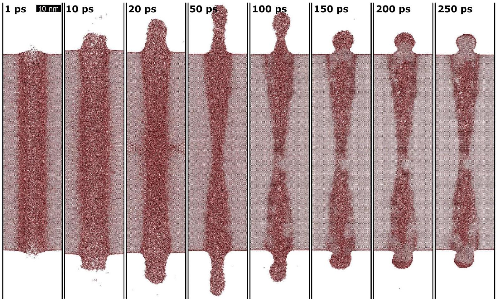
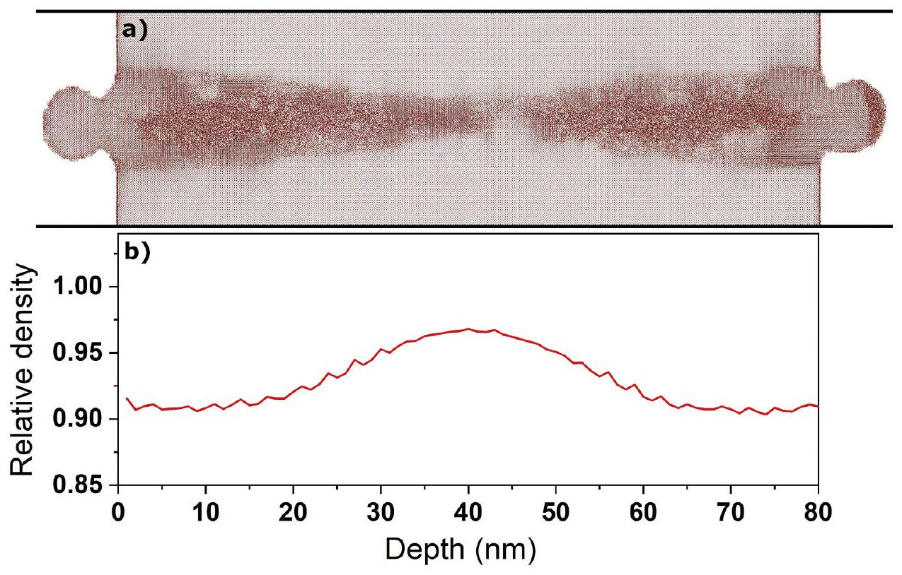
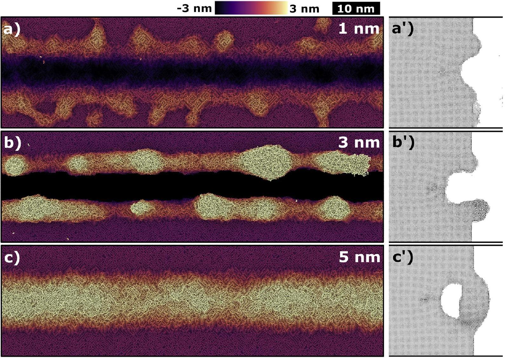

# Bulk, overlap and surface effects of swift heavy ions in $\mathrm{CeO}_{2}$ 

R.A. Rymzhanov ${ }^{\mathrm{a}, \mathrm{b}, *}$, A.E. Volkov ${ }^{\mathrm{c}}$, V.A. Skuratov ${ }^{\mathrm{a}, \mathrm{d}, \mathrm{e}}$ ${ }^{\mathrm{a}}$ Joint Institute for Nuclear Research, Joliot-Curie 6, 141980 Dubna, Moscow Region, Russia ${ }^{\mathrm{b}}$ The Institute of Nuclear Physics, Ibragimov St. 1, 050032 Almaty, Kazakhstan ${ }^{\mathrm{c}}$ PN. Lebedev Physical Institute of the Russian Academy of Sciences, Leninskij pr., 53,119991 Moscow, Russia ${ }^{\mathrm{d}}$ National Research Nuclear University MEPhI, Moscow, Russia ${ }^{\mathrm{e}}$ Dubna State University, Dubna, Russia

## H I G H L I G H T S

- Comprehensive numerical study of swift heavy ions effect in $\mathrm{CeO}_{2}$.
- Recovery of existing ion tracks due to their overlap at high fluences.
- Crystalline spherically shaped hillocks are created at the surface by SHI impacts.
- Formation of grooves bordered with hillocks during the grazing irradiation.
- Conical tracks are formed near the surface because of suppression of recovery.

## ARTICLE INFO

## Keywords:

Electronic excitation
Swift heavy ion
Cerium oxide
Nuclear fuel
Nanostructuring

#### Abstract

Formation of tracks of swift heavy ions decelerating in the electronic stopping regime in $\mathrm{CeO}_{2}$ was studied, combining the Monte Carlo code TREKIS with molecular dynamics. We show that strong lattice disordering (melting) followed by structure recovery form finally a damaged ion track consisting of a discontinuous crystalline region in $\mathrm{CeO}_{2}$. Normal ion impacts result in appearance of spherical crystalline hillocks on $\mathrm{CeO}_{2}$ surface. The solid-vacuum interface strongly suppresses the recrystallization of the near-surface layers, forming conically shaped tracks with several tens of nanometers lengths. Grazing ion irradiation induces intensive material expulsion from the surface forming finally grooves surrounded by nanohillocks. The processes of surface nanostructures formation is similar to those observed previously in $\mathrm{CaF}_{2}$ which has the similar crystalline structure, however requires much longer recrystallization time. Recent experimental data confirm the simulation results.

## 1. Introduction

Swift heavy ions (SHI) decelerated in the electronic stopping regime are widely handled to investigate the radiation stability of solids against fission fragments and cosmic rays influence. The main advantage of the SHI-based experiments is the precise control of irradiation conditions (ion mass, velocity, temperature, fluence etc.) and absence of induced radioactivity of the irradiated samples. Penetrating up to hundreds of microns depths, an SHI initially excites electrons within a few angstroms around its trajectory. Relaxation of the initial excitation may finally induce structural and phase transformations, creating a latent ion track of approximately $1-10 \mathrm{~nm}$ in diameter and $10-100 \mu \mathrm{~m}$ in length along the ion path.
$\mathrm{CeO}_{2}$ is frequently utilized as a non-radioactive replacement for $\mathrm{UO}_{2}$ and $\mathrm{PuO}_{2}$ to mimic the radiation damage of nuclear fuel by fission fragments $[1,2]$. This is due to ceria's isostructural nature similar to various actinide oxides as well as the thermal properties comparable to those of $\mathrm{UO}_{2}$. Effects of swift heavy ion irradiation of $\mathrm{CeO}_{2}$ were studied extensively during past decades, mainly experimentally. The early TEM microscopy of 210 MeV Xe irradiated $\mathrm{CeO}_{2}$ (Refs. [3,4]) detected ion tracks of $\sim 9.3 \mathrm{~nm}$ in diameter decreasing with the irradiation temperature. The threshold ion energy loss necessary for track formation was estimated to be $\sim 15 \mathrm{keV} / \mathrm{nm}$ [4]. Further high-resolution TEM studies clarified the track size and structure observing inhomogeneous and discontinuous Fresnel contrast of $2-3 \mathrm{~nm}$ in size along the trajectory of 200 MeV Xe ions [5]. The difference between the track sizes measured in

[^0]these researches is presumably due to variations in the electron beam focusing conditions and imaging technique [6]. Other studies with different methods demonstrated no amorphization in SHI tracks in ceria [5-8]. On the other hand, impacts of 200 MeV Au ions on $\mathrm{CeO}_{2}$ surface result in formation of crystalline spherical hillocks [9], similar to those in $\mathrm{CaF}_{2}$ [10]. The observed surface structures were found to be crystalline with the lattice spacing and orientation coinciding with the matrix. In the subsurface regions, the damaged tracks are conically shaped and discontinuous indicating an influence of the surface on the damage formation [11].

Atomistic simulations of SHI effects in bulk ceria [12] showed formation along the ion trajectory of isolated point defects at $12 \mathrm{keV} / \mathrm{nm}$, and defect clusters at $36 \mathrm{keV} / \mathrm{nm}$, while no amorphization was detected at any stopping powers. Another simulation indicated production of nanopores in the subsurface regions [13], however the size of the simulated system ( $\sim 3.5 \mathrm{~nm}$ ) and the ion energy loss ( $<2 \mathrm{keV} / \mathrm{nm}$ ) were too low compared to the real SHI irradiations. A mechanism of fast nanograins coarsening due to strong disorder and further epitaxial recovery was proposed for low energy ions in $\mathrm{CeO}_{2}$ in Ref. [14] coupling the experiment and MD simulations.

The variety of the swift heavy ion effects observed experimentally in non-amorphizable $\mathrm{CeO}_{2}$ and a lack of knowledge of the damage formation mechanisms under various irradiation conditions motivated us to apply the multiscale approach combining the Monte-Carlo model TREKIS [15,16] with molecular dynamics to reveal features of the SHI track formation kinetics in ceria. We consider bulk effects caused by a single impact as well as track overlap modes in the bulk. Surface and subsurface effects are also studied, showing how the recrystallization affects the track formation and how the recovery process is affected by the presence of surface.

## 2. Model

The TREKIS-3 [17] Monte-Carlo model [15,16] applies event-by-event asymptotic trajectory algorithm [18-20] to draw charged particles interaction with solid. This method was developed to describe the processes of electron ensemble excitation initiated by swift heavy ions in solid. They include the ionization of a target forming primary electrons and holes, as well as their transport and further secondary electronic cascades, accompanied by their interaction with the lattice and target electrons. The model implies both the radiative decays of core holes inducing photons emission and photo-absorption, as well as the Auger decays of deep shell holes producing secondary electrons and hole pairs in the ion track. Also, the spatial redistribution of valence holes and the energy transfer to the target atoms are included [15,16].

The charged particle interaction cross-sections are calculated in the framework of the dynamic structure factor and loss function formalism [21] (linear response theory) [21,22] taking into account collective modes of the electronic and the atomic systems excitation. The energy loss function is restored from the experimental optical data containing the information about atomic and electronic excitation states in a target. The details and numerics of the model can be found in Refs. [15,16,23]. The loss function and scattering cross-sections for $\mathrm{CeO}_{2}$ as well as the calculated electronic energy loss of various ions in ceria and their comparisons with stopping power codes SRIM [24], CasP 6.0 [25] are presented in Supplementary. The reasonable agreement of TREKIS results with these codes in the considered energy range confirms the validity of our model.

Following the procedure outlined in Refs. [15,16], we found that the reliable statistics in the MC simulation was achieved by executing 1000 code iterations. The simulation provides with 3D distributions of the energies and densities of electrons, holes in the valence band, and various atomic shells, as well as with the energy transferred into the atomic system of a target [26]. Three channels of energy transfer to the lattice are modeled: (i) elastic scattering of electrons, (ii) that of valence-band holes, and (iii) the nonthermal acceleration of atoms due
to interatomic potential changes initiated by the high electronic excitation, described by the transfer of the potential energy of electron-hole pairs to the kinetic energy of the atomic lattice [23,26].

A Gaussian-like dispersion of the kinetic energy transferred to target atoms and the uniform distribution of their momenta within the cylindrical layers along SHI trajectories are assumed [26]. The atomic velocity distribution after the cooling of the electronic system are then used as the initial conditions in the molecular dynamics simulations of the lattice response with the LAMMPS code [27].

Interatomic potential for $\mathrm{CeO}_{2}$ was taken from Ref. [28]. It is based on the embedded-atom method (EAM) accounting many-body interactions combined with coulombic forces of partially charged ions. The results of simulations were visualized with OVITO software [29].

The supercells used in the MD simulations were $25 \times 25 \times 30 \mathrm{~nm}^{3}(1$ 484464 atoms) for bulk simulation and $24.4 \times 24.4 \times 80 \mathrm{~nm}^{3}$ for the surface effects simulations. The periodic boundary conditions along the X and Y axes were applied, while open surfaces were created in $Z$ direction by extension of the box boundary by 20 nm , forming $X Y$ surface ((100) plane of $\mathrm{CeO}_{2}$ structure). The supercell borders ( 0.5 nm in thickness) in $X$ and $Y$ direction were cooled by the Berendsen [30] thermostat to 300 K with the characteristic time of 0.1 ps ( 2 ps for surface hillocks simulation, see Section 3.3). In case of grazing ion impacts, the supercell size was $80 \times 22 \times 18 \mathrm{~nm}^{3}$ with the borders in the $X$ direction and surface opposite to the irradiated cooled by the Berendsen thermostat to 300 K with the characteristic time of 2 ps . Track evolution was traced until $200-300 \mathrm{ps}$ when the temperature of overall supercell dropped below 400 K . Verlet time integrator was used in the MD simulation with the time step of 1 fs .

## 3. Results

As the first step, the formation of a single 210 MeV Xe ion track in bulk ceria was modeled using the described approach. Fig. 1 presents the track morphology in planar and cross-sectional geometry. The ion track is a discontinuous damaged crystalline region of $\sim 2 \mathrm{~nm}$ diameter surrounded by rare point defects. The transversal projection (Fig. 1b) also shows that the track consists of small crystalline regions representing agglomerations of defects and separated point defects. The TEM study [5] of 200 MeV Xe irradiation of $\mathrm{CeO}_{2}$ revealed the formation of the similar ion tracks of $2-3 \mathrm{~nm}$ in diameter having inhomogeneous and discontinuous Fresnel contrast along the trajectory of the projectile.

To analyze the track structure in detail, the distribution of displaced atoms and their reference positions were calculated using Wigner-Seitz defect analysis modifier from OVITO software [29]. The method is based on the comparison of the occupancies of the Wigner-Seitz cells between final (irradiated) and reference (pristine) configurations of atoms. If Wigner-Seitz cell does not contain any atoms, it is considered as a vacancy. If two or more atoms occupy the cell, it is believed to contain interstitials. Figure 1a',b' illustrates the distribution of the interstitials and vacancies of both atom species in case of the simulation of 210 MeV Xe ion. The central part of an ion track consists of the agglomerations of point defects, whereas the shell contains only a few of them. The size of the shell roughly corresponds to the size of the disordered region formed at initial times after an ion impact (Fig. 2). Quantifying the total number of the displaced atoms, one could find that it contains $\sim 15 \%$ of Ce defects and $\sim 85 \%$ of O defects.

The formation kinetics of an SHI track in $\mathrm{CeO}_{2}$ (Fig. 2) is similar to that in other non-amorphizable solids, e.g. $\mathrm{Al}_{2} \mathrm{O}_{3}, \mathrm{MgO}$ [31]. The ion impact initially induces strong disorder (melting) in the cylindrical region of $\sim 6-7 \mathrm{~nm}$ in radius around the projectile trajectory. Further, this region recovers the initial structure in radial direction, finally producing the damaged crystalline ion track of a smaller diameter. The recrystallization in $\mathrm{CeO}_{2}$ takes $\sim 40 \mathrm{ps}$, which is similar to the recovery time in $\mathrm{Al}_{2} \mathrm{O}_{3}(\sim 40 \mathrm{ps})$ and slower than that in $\mathrm{MgO}(\sim 20 \mathrm{ps})[31]$.

Fig. 1. Projections of the simulation box in (a) $Z$ and (b) $X$ directions after passage of 210 MeV Xe ion in $\mathrm{CeO}_{2}$. Red/black dots are $\mathrm{Ce} / \mathrm{O}$ atoms. (a') and (b') the corresponding point defects analysis of occupancies of Wigner-Seitz cells. Red/yellow dots are Ce/O interstitials, black/blue dots are Ce/O vacancies.

Fig. 2. Images of the $\mathrm{CeO}_{2}$ simulation box at different times after 210 MeV Xe ion impact. Red/black dots are $\mathrm{Ce} / \mathrm{O}$ atoms.

### 3.1. Damage formation threshold

Applying the TEM study of the damage at different depth from the surface and comparing to energy loss vs. depth dependence, Refs. [4,5] reported the $15 \mathrm{keV} / \mathrm{nm}$ ion energy loss as the threshold of SHI track formation in $\mathrm{CeO}_{2}$. To estimate the minimal $S_{e}$ necessary for the damaged track formation we performed several simulations of Xe ions of $30\left(S_{e}=10.9 \mathrm{keV} / \mathrm{nm}\right), 50\left(S_{e}=17.9 \mathrm{keV} / \mathrm{nm}\right), 100\left(S_{e}=23.8 \mathrm{keV} / \mathrm{nm}\right)$, $210\left(S_{e}=28.4 \mathrm{keV} / \mathrm{nm}\right)$ and $300 \mathrm{MeV}\left(S_{e}=30.8 \mathrm{keV} / \mathrm{nm}\right)$ energies, as well as 200 MeV Au ion ( $S_{e}=36 \mathrm{keV} / \mathrm{nm}$ ). The resulting projections of MD box along ion trajectory and perpendicular to it are shown in Fig. 3.

The impact of 30 MeV Xe ion having energy loss of $10.9 \mathrm{keV} / \mathrm{nm}$ did not induce formation of a clearly detectable ion track. Only formation of a number of point defects was observed in our simulations. On the other
hand, $17.9 \mathrm{keV} / \mathrm{nm}$ of energy deposited to electronic subsystem by 50 MeV Xe produces discontinuous damaged ion tracks. Thus, we estimate the threshold of SHI track formation in $\mathrm{CeO}_{2}$ to be $10.9<S_{\text {th }}<17.9 \mathrm{keV} / \mathrm{nm}$ consistent with the experimental value of $15 \mathrm{keV} / \mathrm{nm}$ [4,5].

### 3.2. SHI tracks overlap

As was demonstrated in our previous works [26,32,33], the recovery of the initial structure in the vicinity of SHI trajectory can induce annealing of the existing defects (tracks) by incoming ions. This process explains the experimentally observed saturation of areal density of SHI tracks in $\mathrm{Al}_{2} \mathrm{O}_{3}$ at fluences $<10^{12} \mathrm{~cm}^{-2}$ [32]. It should be mentioned, that the further increase of the fluence up to $10^{13}-10^{14}$ does not increase the number of the observed tracks, whereas the material remains

Fig. 3. Ion tracks formed by Xe ion of different energies in $\mathrm{CeO}_{2}$. Projections along and perpendicular to the ion trajectory are shown. Red/black dots are $\mathrm{Ce} /$ O atoms.

crystalline in the bulk and the tracks appears as separated defects on TEM micrographs.

The experiments [1,34] demonstrated the very similar behavior, revealing that the surface density of highly damaged ion track cores in $\mathrm{CeO}_{2}$ increases linearly with Xe ion fluence and reach the saturation value at the fluences around $10^{12} \mathrm{~cm}^{-2}$. Analyzing the dependence of the surface density of tracks on the ion fluence the radius $\sim 8.4 \mathrm{~nm}$ of the ion impact influence zone was detected in [1,34]. The track size distribution at the high fluence ( $10^{14} \mathrm{~cm}^{-2}$ ) demonstrated broadening and preferential formation of smaller and larger tracks, which is considered as the indication of coalesces and incomplete recoveries of the damaged track cores during the multiple overlaps.

Fig. 4a presents the simulation results demonstrating the annealing of previously appeared ion tracks by the incoming ions. The new ion impact induces complete recovery of existing defects at the distances of 2 and 4 nm between ion trajectories. At distances of 6 and 8 nm the observed recovery is partial, showing the reduction of the track size. From Fig. 4b one could deduce that the total annealing is observed when initially disordered region overlaps the existing ion track. If the first ion track is out of this area, the recovery is only partial and is supposed to be due to the elevated temperature in the periphery of the region excited by the second SHI.

### 3.3. Formation of surface defects

Impact of an SHI on the surface of $\mathrm{CeO}_{2}$ results in formation of crystalline spherical hillocks [9], similarly to that in $\mathrm{CaF}_{2}$ [10]. Simulations of 200 MeV Au ion passage in the near-surface regions of ceria demonstrate the similar stages of the surface defects formation as they were observed for $\mathrm{CaF}_{2}$ [35]: 1) Protrusion of liquid material from the surface; 2) fast track cooling in the bulk of the target due to heat flow into the surrounding unirradiated material; 3) the droplet on surface changes its shape to the spherical one and settles closer to the sample surface. However, the last stage, recrystallization of the surface hillock, observed in $\mathrm{CaF}_{2}$ at times of 100-200 ps was not detected in the simulation of $\mathrm{CeO}_{2}$, producing amorphous surface nanostructure contradicting the experimental data.

To resolve this issue, we supposed, that the recrystallization in $\mathrm{CeO}_{2}$ requires more time and the cooling down in our modeling occurs too fast. The cooling rate of the supercell is defined by the parameters of the Berendsen thermostat applied to the boundaries of $25 \times 25 \times 30 \mathrm{~nm}^{3}$. The real sample has macroscopic sizes and, in this regard, cooling may occur in different ways than provided by the artificial thermal bath. There are two possible solutions are in this case: 1) to increase the transversal size of the sell as much as possible, which requires huge number of computational resources; 2) to determine the cooling rate in the realistic or very close to realistic system and to find the parameters of the thermostat on borders corresponding to this cooling kinetics.

To estimate the cooling rate of the real material, the simulation of the heat flow out of the track core was performed using the cell of $200 \times 200 \times 1 \mathrm{~nm}^{3}$ with NVE ensemble without any additional thermostats. After assigning atoms velocities corresponding to 200 MeV Au ion impact this system has average kinetic energy equivalent to 390 K . The total energy was conserved as NVE ensemble assumes.

Fig. 5 illustrates the comparison of temperature vs. time at different distances from the ion trajectory. 12.5 nm radius corresponds to the cooled edges of the MD cell ( $25 \times 25 \times 30 \mathrm{~nm}^{3}$ ) used in all simulations. One can see that the temperature in the cell cooled by Berendsen thermostat with characteristic times of 0.1 ps (typical simulation) coincides with the modeling without thermostat only at radius of 5 nm and at times below $25-30 \mathrm{ps}$.

At other distances and times the temperature in the case of Berendsen 0.1 ps thermostat drops much faster than in the realistic modeling without the thermostat. Taking this into account, we found the most suitable value of the Berendsen thermostat damping time to be 2 ps for further simulations of the surface damage. The corresponding temperature evolution is also shown in Fig. 5.

We should point here that the 2 ps characteristic time was used only to model the formation of surface nanostructures (and to see its recrystallization). For bulk modeling, 0.1 ps is long enough to observe the recovery processes of an ion track. To prove that, the simulations of impact of 210 Xe ion with the 0.1 ps and 2 ps characteristic times of Berendsen thermostat [30] was made (See Supplementary materials, Fig. S4). Comparing the results, it was found no significant difference

Fig. 4. Results of the simulations of subsequent impacts of Xe 210 MeV ions to $\mathrm{CeO}_{2}$ at different distances between the ion trajectories at (a) 150 ps , (b) 5 ps after second ion passage. Projectiles' trajectories are perpendicular to the image plane and indicated by the red (first ion) and blue (second) dots.

between these results in the morphology of an ion track. Thus, the time of 0.1 ps was used in all bulk calculation to save computational resources because the duration of such modeling is $\mathbf{2 - 3}$ times shorter than that for Berendsen thermostat with 2 ps .

Fig. 6 presents the results of modeling of nanohillocks formation in $\mathrm{CeO}_{2}$ comparing the different Berendsen thermostat damping times ( 0.1 and 2 ps ). The shapes and sizes of the hillocks in both cases are similar. However, the faster cooling in the first case (Fig. 6a) does not allow recrystallization of the hillock and subsurface region forming an amorphous structure. In contrast, in the second case (Fig. 6b) the material has enough time to recrystallize both: the track and nanohillock.

Fig. 6 also shows that the track in the subsurface region is much larger than that in the bulk (Fig. 3). This effect results in a conical track form, which were observed in many materials (e.g. [11,36,37]). To study the formation of such structures, we have modeled ion impact in 80 nm long supercell. Passage of 200 MeV Au ion induces formation of the cylindrical molten region of $\sim 8 \mathrm{~nm}$ diameter (Fig. 7, 1 ps). A part of
the hot material is extruded from the surface resulting in a droplet, which then forms a spherical crystalline nanostructure, similarly to that described above. The molten material protrusion forms the deficiency of the matter in the near-surface region ( $\sim 40 \mathrm{~nm}$ ), which is supposed to suppress the recrystallization processes. To demonstrate this, the depth variation of the density of $\mathrm{CeO}_{2}$ cell at 250 ps within 5 nm vicinity of the ion trajectory was calculated (Fig. 8b). The density of a material increases with the depth indicating the reduction of a matter deficiency forming the cone-like defective region having the widest part at the surface. This region has a non-uniform structure with small pores, rotated crystalline regions and amorphous inclusions. The conical tracks in $\mathrm{CeO}_{2}$ were observed experimentally in Ref. [11] where conical part of the 550 MeV Bi ( $43.2 \mathrm{keV} / \mathrm{nm}$ ) was found to be $\sim 75 \mathrm{~nm}$ in length.

Fig. 6 shows the large bubble-like structures in 30 nm film, whereas conical tracks in $80 \mathrm{~nm} \mathrm{CeO}_{2}$ film (Fig. 7) contain only very small nanopores. The difference between these simulations can be attributed to the thickness of the MD sample. The increased temperature in an ion

Fig. 5. Evolution of the temperature at different distances from the 200 MeV Au trajectory in $\mathrm{CeO}_{2}$. "No thermostat" case is the simulation of the ion impact in $200 \times 200 \times 1 \mathrm{~nm}^{3}$ with pure NVE ensemble.

track creates molten region, leads the melt to move through the formed nanochannel and protrude from the surface. In thicker films the nanochannel is longer, creating additional resistance to the melt flow decreasing its expulsion from the surface before the track cooling down. In thin layers, the situation is opposite and the melt can rapidly escape the layer forming bubbles or even through channels. These processes
were discussed in our previous papers [38,39].
The simulation of the grazing ion irradiation of $\mathrm{CeO}_{2}$ demonstrates (Fig. 9) formation of a rift at the depth $\sim 1-3 \mathrm{~nm}$, whereas at 5 nm the protruded part has a uniform structure. The kinetics of the groove surrounded by hillocks ( 1 nm ) is almost the same observed for $\mathrm{CaF}_{2}$ in Ref. [40]: quite strong protrusion of a molten material followed by emission of atoms and atomic clusters. However, we did not find the transition region observed previously in $\mathrm{CaF}_{2}$, where the chains of hillocks covering the rift are formed at the intermediate depths ( $\sim 3-4 \mathrm{nm})$. We suppose that the low surface tension is responsible for this effect. As was discussed in [41] materials with the lower surface tension preferable form grooves. High surface tension prevents the molten material to be expelled strongly, forming rather single protruded structure, which then can split into hillocks. When the surface tension is low, the melt is expected to expel much faster, forming two jets moving in opposite directions (see example of $\mathrm{CaF}_{2}$ in [40]). Figure 9a', b' and c' also demonstrates the projections of MD simulation box after passage of 200 MeV Au ion at 1, 3 and 5 nm depth parallel to the surface. The cross-sectional image confirms the rift-like structure of surface tracks for 1 and 3 nm cases, whereas the penetration of an ion at 5 nm depth may produce subsurface nanochannel surrounded by a crystalline material.

## 4. Discussion

We found, that the recrystallization of a surface hillock in $\mathrm{CeO}_{2}$ requires longer times than in $\mathrm{CaF}_{2}$ despite these materials has similar crystalline structure and overall kinetics of spherical hillock formation. The difference in the recovery times of the surface nanostructures between ceria and calcium fluorite is supposed due to the higher viscosity of $\mathrm{CeO}_{2}$ compared to $\mathrm{CaF}_{2}$ (see Table 1). The lower atomic mobility (the higher viscosity) in $\mathrm{CeO}_{2}$ can arise from the higher masses of material components and can lead to the lower velocity of the molten material protrusion from the hot track core. This may result in different kinetics of formation of the surface nanostructures, which is seem in case of grazing irradiation. In contrast, the velocity of the less viscous liquid droplet in $\mathrm{CaF}_{2}$ can be so high [38], that induces emission of nanosized clusters.

The lower atomic mobility in $\mathrm{CeO}_{2}$ can also manifest itself in the slower recrystallization processes, requiring 1.5-2 times longer than in $\mathrm{CaF}_{2}$ in the subsurface regions. The recovery process is usually layer by layer restoration of a crystal lattice, which can be observed by the

Fig. 6. Results of simulation of surface defects in $\mathrm{CeO}_{2}$ after passage of Au 200 MeV ion in $25 \times 25 \times 30 \mathrm{~nm}^{3}$ MD cell with boundaries cooled by Berendsen thermostat with characteristic time of (a) 0.1 ps and (b) 2 ps .

Fig. 7. Simulation of 200 MeV Au ion in 80 nm film of $\mathrm{CeO}_{2}$ : MD snapshots of 2 nm slab at different times of ion passage.

Fig. 8. (a) MD snapshot of 2 nm slab of 80 nm film of $\mathrm{CeO}_{2}$ after 200 MeV Au ion passage. (b) relative density of calculated in 5 nm vicinity of the ion trajectory.

movement of the melt-solid interface. In case of SHI track one could see epitaxial recrystallization in cylindrical geometry as shown in Fig. 2. We suppose that the lower atomic mobilities decreases the probability of an atom to find the corresponding minimum in potential energy field on the interface between molten material and crystal, which reduces the efficiency and speed of the recovery process [31].

Comparing $\mathrm{CeO}_{2}$ with other materials (Table 1), one can conclude, that it belongs to the class of materials showing quite strong protrusion of a melt due to low surface tension (such as $\mathrm{CaF}_{2}, \mathrm{WO}_{3}, \mathrm{MgO}$ ). In our opinion, the low surface tension allows ceria to form spherically shaped hillocks similarly to $\mathrm{CaF}_{2}$.

## 5. Conclusions

We used the original numerical approach to uncover the atomic-scale formation kinetics of high-energy heavy ion tracks in the bulk and on the surface of $\mathrm{CeO}_{2}$. By combining the Monte-Carlo code TREKIS with the molecular dynamics simulations, we were able to investigate various effects in swift heavy ion tracks without the need for adjustable parameters.

It was shown that the formation of a crystalline SHI track containing agglomerations of defects results from the strong disorder followed by further recovery of the initially damaged region. The observed

Fig. 9. Results of MD simulation of 200 MeV Au ion impacts parallel to the surface at (a) 1 nm , (b) 3 nm and (c) 5 nm depth. Atoms are colored according to their $Z$ coordinates (counted from the surface) to reflect the height of the nanostructures. (a'), (b') and (c') are corresponding projections along the ion trajectory of 2 nm slab of MD simulation box.

Table 1
Viscosities and surface tensions of $\mathrm{CeO}_{2}$ compared with various materiasl at temperature of 100 K above melting point (liquid state) calculated using molecular dynamics.
| Material | Calculated viscosity, $\mathrm{mPa} \cdot \mathrm{s}$ | Exp. viscosity, $\mathrm{mPa} \cdot \mathrm{s}$ | Calculated surface tension, mN/m | Exp. surface tension, mN/ m |
| :--- | :--- | :--- | :--- | :--- |
| $\mathrm{CaF}_{2}$ [35] | 0.54 | 0.59-14 [42] | 278.514 | 242-264 [42] |
| $\mathrm{WO}_{3}$ [39] | 0.55 | - | 91.5 | - |
| $\mathrm{CeO}_{2}$ | 1.5 | - | 85.29 | - |
| MgO [35] | 1.44 | 1.25 [43] | 324.999 | - |
| YAG [35] | 9.58 | 39.5 [44] | 881.58 | 778 [44] |
| $\mathrm{Al}_{2} \mathrm{O}_{3}$ [35] | 9.72 | - | 594.8 | - |

recrystallization strongly affects the morphology of existing ion tracks causing their partial or total annealing, which can be considered as the mechanism of the experimentally observed saturation of the areal track number at high fluences. The presence of a surface suppresses the recovery processes producing conically shaped subsurface tracks of several tens of nanometers in length. Spherically shaped crystalline hillocks were observed on the surface of cerium oxide confirming strong recrystallization ability of this material. All these simulations were compared with the experimental data exhibiting reasonable agreement.

The model was also applied to predict the grazing ion tracks in $\mathrm{CeO}_{2} \cdot$ We demonstrated that 200 MeV Au impact induces formation of a rift
structure on the surface, similarly to that on the $\mathrm{CaF}_{2}$ surface observed in the previous works. At larger distances, this structure is transformed into the single and almost uniform in length protruded surface track.

The results of the numerical studies, presented in the paper, shed light on the mechanisms of a damage and nanostructures formation in $\mathrm{CeO}_{2}$, which can help the studies of radiation tolerance of nuclear materials, including nuclear fuel, as well as in development of tools of nanostructuring of solids with ion beams.

## CRediT authorship contribution statement

R.A. Rymzhanov: Writing - review \& editing, Writing - original draft, Visualization, Software, Methodology, Investigation, Formal analysis, Conceptualization. A.E. Volkov: Writing - review \& editing, Methodology, Conceptualization. V.A. Skuratov: Writing - review \& editing, Investigation, Conceptualization.

## Declaration of competing interest

The authors declare that they have no known competing financial interests or personal relationships that could have appeared to influence the work reported in this paper.

## Acknowledgements

The work of R.A. Rymzhanov was funded by the Russian Science Foundation,The Russian Federation (grant No 23-72-01017, https://r scf.ru/project/23-72-01017/).

This work has been carried out using computing resources of the Federal collective usage center Complex for Simulation and Data

Processing for Mega-science Facilities at NRC "Kurchatov Institute", htt p://ckp.nrcki.ru//. The research is carried out using the equipment of the shared research facilities of HPC computing resources at Lomonosov Moscow State University.

## Supplementary materials

Supplementary material associated with this article can be found, in the online version, at doi:10.1016/j.jnucmat.2024.155480.

## Data availability

Data will be made available on request.

## References

[1] K. Yasuda, M. Etoh, K. Sawada, T. Yamamoto, K. Yasunaga, S. Matsumura, N. Ishikawa, Defect formation and accumulation in CeO 2 irradiated with swift heavy ions, Nucl. Instruments Methods Phys. Res. Sect. B Beam Interact. Mater. Atoms. 314 (2013) 185-190, https://doi.org/10.1016/j.nimb.2013.04.069.
[2] D. Yun, A.J. Oaks, W.Y. Chen, M.A. Kirk, J. Rest, Z.Z. Insopov, A.M. Yacout, J. F. Stubbins, Kr and Xe irradiations in lanthanum (La) doped ceria: study at the high dose regime, J. Nucl. Mater. 418 (2011) 80-86, https://doi.org/10.1016/J. JNUCMAT.2011.08.005.
[3] T. Sonoda, M. Kinoshita, Y. Chimi, N. Ishikawa, M. Sataka, A. Iwase, Electronic excitation effects in CeO 2 under irradiations with high-energy ions of typical fission products, Nucl. Instruments Methods Phys. Res. Sect. B Beam Interact. Mater. Atoms. 250 (2006) 254-258, https://doi.org/10.1016/j.nimb.2006.04.120.
[4] T. Sonoda, M. Kinoshita, N. Ishikawa, M. Sataka, Y. Chimi, N. Okubo, A. Iwase, K. Yasunaga, Clarification of the properties and accumulation effects of ion tracks in CeO2, Nucl. Instruments Methods Phys. Res. Sect. B Beam Interact. Mater. Atoms. 266 (2008) 2882-2886, https://doi.org/10.1016/j.nimb.2008.03.214.
[5] S. Takaki, K. Yasuda, T. Yamamoto, S. Matsumura, N. Ishikawa, Atomic structure of ion tracks in Ceria, Nucl. Instruments Methods Phys. Res. Sect. B Beam Interact. Mater. Atoms. 326 (2014) 140-144, https://doi.org/10.1016/j.nimb.2013.10.077.
[6] J.M. Costantini, S. Miro, G. Gutierrez, K. Yasuda, S. Takaki, N. Ishikawa, M. Toulemonde, Raman spectroscopy study of damage induced in cerium dioxide by swift heavy ion irradiations, J. Appl. Phys. 122 (2017), https://doi.org/ 10.1063/1.5011165/154080.
[7] W.F. Cureton, C.L. Tracy, M. Lang, Review of swift heavy ion irradiation effects in CeO2, Quantum Beam Sci. 5 (2021) 19, https://doi.org/10.3390/QUBS5020019. Page 19. 5 (2021).
[8] W.F. Cureton, R.I. Palomares, J. Walters, C.L. Tracy, C.-H. Chen, R.C. Ewing, G. Baldinozzi, J. Lian, C. Trautmann, M. Lang, Grain size effects on irradiated CeO2, ThO2, and UO2, Acta Mater. 160 (2018) 47-56, https://doi.org/10.1016/j. actamat.2018.08.040.
[9] N. Ishikawa, N. Okubo, T. Taguchi, Experimental evidence of crystalline hillocks created by irradiation of CeO 2 with swift heavy ions: TEM study, Nanotechnology 26 (2015) 355701, https://doi.org/10.1088/0957-4484/26/35/355701.
[10] N. Ishikawa, T. Taguchi, N. Okubo, Hillocks created for amorphizable and nonamorphizable ceramics irradiated with swift heavy ions: TEM study, Nanotechnology 28 (2017) 445708, https://doi.org/10.1088/1361-6528/aa8778.
[11] J. Lan, P. Zhai, S. Nan, L. Xu, J. Niu, C. Tian, Z. Li, W. Li, J. Liu, R.C. Ewing, Phase stability of pre-irradiated CeO 2 with swift heavy ions under high pressure up to 45 GPa, J. Am. Ceram. Soc. 105 (2022) 2889-2902, https://doi.org/10.1111/ JACE. 18273.
[12] C.A. Yablinsky, R. Devanathan, J. Pakarinen, J. Gan, D. Severin, C. Trautmann, T. R. Allen, Characterization of swift heavy ion irradiation damage in ceria, J. Mater. Res. 30 (2015) 1473-1484, https://doi.org/10.1557/JMR.2015.43/FIGURES/9.
[13] Y. Sasajima, R. Kaminaga, N. Ishikawa, A. Iwase, Nanopore formation in CeO 2 single crystal by ion irradiation: a molecular dynamics study, Q. Beam Sci. 5 (2021) 32, https://doi.org/10.3390/QUBS5040032, 2021, Vol. 5, Page 32.
[14] D.S. Aidhy, Y. Zhang, W.J. Weber, A fast grain-growth mechanism revealed in nanocrystalline ceramic oxides, Scr. Mater. 83 (2014) 9-12, https://doi.org/ 10.1016/J.SCRIPTAMAT.2014.03.020.
[15] R.A. Rymzhanov, N.A. Medvedev, A.E. Volkov, Effects of model approximations for electron, hole, and photon transport in swift heavy ion tracks, Nucl. Instruments Methods Phys. Res. Sect. B Beam Interact. Mater. Atoms. 388 (2016) 41-52, https://doi.org/10.1016/j.nimb.2016.11.002.
[16] N.A. Medvedev, R.A. Rymzhanov, A.E. Volkov, Time-resolved electron kinetics in swift heavy ion irradiated solids, J. Phys. D. Appl. Phys. 48 (2015) 355303, https:// doi.org/10.1088/0022-3727/48/35/355303.
[17] N. Medvedev, R. Rymzhanov, A. Volkov, TREKIS-3 [Computer Software], (2023) https://doi.org/10.5281/zenodo.8394462.
[18] W. Eckstein, Computer Simulation of Ion-Solid Interactions, Springer Berlin Heidelberg, Berlin, Heidelberg, 1991, https://doi.org/10.1007/978-3-642-735134.
[19] C. Jacoboni, L. Reggiani, The Monte Carlo method for the solution of charge transport in semiconductors with applications to covalent materials, Rev. Mod. Phys. 55 (1983) 645-705, https://doi.org/10.1103/RevModPhys.55.645.
[20] B. Gervais, S. Bouffard, Simulation of the primary stage of the interaction of swift heavy ions with condensed matter, Nucl. Instruments Methods Phys. Res. Sect. B Beam Interact. Mater. Atoms. 88 (1994) 355-364, https://doi.org/10.1016/0168-583X(94)95384-8.
[21] L. Van Hove, A remark on the time-dependent pair distribution, Physica 24 (1958) 404-408, https://doi.org/10.1016/S0031-8914(58)95629-5.
[22] R.H. Ritchie, A. Howie, Electron excitation and the optical potential in electron microscopy, Philos. Mag. 36 (1977) 463-481, https://doi.org/10.1080/ 14786437708244948.
[23] N. Medvedev, A.E. Volkov, R. Rymzhanov, F. Akhmetov, S. Gorbunov, R. Voronkov, P. Babaev, Frontiers, challenges, and solutions in modeling of swift heavy ion effects in materials, J. Appl. Phys. 133 (2023) 100701, https://doi.org/ 10.1063/5.0128774.
[24] J.F. Littmark, J.P. Ziegler, U. Biersack, The Stopping and Range of Ions in Solids, Pergamon Press, New York, 1985.
[25] P.L. Grande, G. Schiwietz, Convolution approximation for the energy loss, ionization probability and straggling of fast ions, Nucl. Instruments Methods Phys. Res. Sect. B Beam Interact. Mater. Atoms. 267 (2009) 859-863.
[26] R. Rymzhanov, N.A. Medvedev, A.E. Volkov, Damage threshold and structure of swift heavy ion tracks in Al2O3, J. Phys. D. Appl. Phys. 50 (2017) 475301, https:// doi.org/10.1088/1361-6463/aa8ff5.
[27] S. Plimpton, Fast parallel algorithms for short-range molecular dynamics, J. Comput. Phys. 117 (1995) 1-19, https://doi.org/10.1006/jcph.1995.1039.
[28] M.W.D. Cooper, M.J.D. Rushton, R.W. Grimes, A many-body potential approach to modelling the thermomechanical properties of actinide oxides, J. Phys. Condens. Matter. 26 (2014) 105401, https://doi.org/10.1088/0953-8984/26/10/105401.
[29] A. Stukowski, Visualization and analysis of atomistic simulation data with OVITO-the Open Visualization Tool, Model. Simul. Mater. Sci. Eng. 18 (2010) 15012, https://doi.org/10.1088/0965-0393/18/1/015012.
[30] H.J.C. Berendsen, J.P.M. Postma, W.F. van Gunsteren, A. DiNola, J.R. Haak, Molecular dynamics with coupling to an external bath, J. Chem. Phys. 81 (1984) 3684-3690, https://doi.org/10.1063/1.448118.
[31] R.A. Rymzhanov, N. Medvedev, J.H. O'Connell, A. Janse van Vuuren, V. A. Skuratov, A.E. Volkov, Recrystallization as the governing mechanism of ion track formation, Sci. Rep. 9 (2019) 3837, https://doi.org/10.1038/s41598-019-40239-9.
[32] R.A. Rymzhanov, N. Medvedev, A.E. Volkov, J.H. O'Connell, V.A. Skuratov, Overlap of swift heavy ion tracks in Al 2 O 3 , Nucl. Instruments Methods Phys. Res. Sect. B Beam Interact. Mater. Atoms. 435 (2018) 121-125, https://doi.org/ 10.1016/j.nimb.2017.11.014.
[33] R.A. Rymzhanov, N. Medvedev, J.H. O'Connell, V.A. Skuratov, A. Janse van Vuuren, S.A. Gorbunov, A.E. Volkov, Insights into different stages of formation of swift heavy ion tracks, Nucl. Instruments Methods Phys. Res. Sect. B Beam Interact. Mater. Atoms. 473 (2020) 27-42, https://doi.org/10.1016/j.nimb.2020.04.005.
[34] S. Takaki, K. Yasuda, T. Yamamoto, S. Matsumura, N. Ishikawa, Structure of ion tracks in ceria irradiated with high energy xenon ions, Prog. Nucl. Energy. 92 (2016) 306-312, https://doi.org/10.1016/J.PNUCENE.2016.07.013.
[35] R.A. Rymzhanov, J.H. O'Connell, A. Janse Van Vuuren, V.A. Skuratov, N. Medvedev, A.E. Volkov, Insight into picosecond kinetics of insulator surface under ionizing radiation, J. Appl. Phys. 127 (2020) 015901, https://doi.org/ 10.1063/1.5109811.
[36] J. O'Connell, V. Skuratov, A. Janse van Vuuren, M. Saifulin, A. Akilbekov, Near surface latent track morphology of SHI irradiated TiO2, Phys. Status Solidi. 253 (2016) 2144-2149, https://doi.org/10.1002/pssb.201600473.
[37] P. Zhai, S. Nan, L. Xu, W. Li, Z. Li, P. Hu, J. Zeng, S. Zhang, Y. Sun, J. Liu, Fine structure of swift heavy ion track in rutile TiO2, Nucl. Instruments Methods Phys. Res. Sect. B Beam Interact. Mater. Atoms. 457 (2019) 72-79, https://doi.org/ 10.1016/J.NIMB.2019.07.024.
[38] R.A. Rymzhanov, N. Medvedev, A.E. Volkov, Damage kinetics induced by swift heavy ion impacts onto films of different thicknesses, Appl. Surf. Sci. 566 (2021) 150640, https://doi.org/10.1016/J.APSUSC.2021.150640.
[39] L. Xu, R.A. Rymzhanov, P. Zhai, S. Zhang, P. Hu, X. Meng, J. Zeng, Y. Sun, J. Liu, Direct Fabrication of Sub-10 nm Nanopores in WO3 Nanosheets Using Single Swift Heavy Ions, Nano Lett 23 (2023) 4502-4509, https://doi.org/10.1021/ACS. NANOLETT.3C00884.
[40] R.A. Rymzhanov, M. Cosić, N. Medvedev, A.E. Volkov, From groove to hillocks -Atomic-scale simulations of swift heavy ion grazing impacts on CaF2, Appl. Surf. Sci. 652 (2024) 159310, https://doi.org/10.1016/J.APSUSC.2024.159310.
[41] M. Karlusic, R.A. Rymzhanov, J.H. O'Connell, L. Brockers, K.T. Luketic, Z. Siketic, S. Fazinic, P. Dubcek, M. Jaksic, G. Provatas, N. Medvedev, A.E. Volkov, M. Schleberger, Mechanisms of surface nanostructuring of Al 2 O 3 and MgO by grazing incidence irradiation with swift heavy ions, Surf. Interf.. 27 (2021) 101508. https ://doi.org/10.1016/J.SURFIN.2021.101508.
[42] K.C. Mills, B.J. Keene, Physicochemical properties of molten $\mathrm{CaF}_{2}$-based slags, Int. Met. Rev. 26 (1981) 21-69, https://doi.org/10.1179/imtr.1981.26.1.21.
[43] A.L. Leu, S.M. Ma, H. Eyring, Properties of molten magnesium oxide, Proc. Natl. Acad. Sci. U. S. A. 72 (1975) 1026-1030, https://doi.org/10.1073/pnas.72.3.1026.
[44] V.J. Fratello, C.D. Brandle, Physical properties of a Y3Al5012 melt, J. Cryst. Growth. 128 (1993) 1006-1010, https://doi.org/10.1016/S0022-0248(07)80087X.

[^0]:    * Corresponding author at: Joint Institute for Nuclear Research, Joliot-Curie 6, 141980 Dubna, Moscow Region, Russia.

    E-mail address: rymzhanov@jinr.ru (R.A. Rymzhanov).

