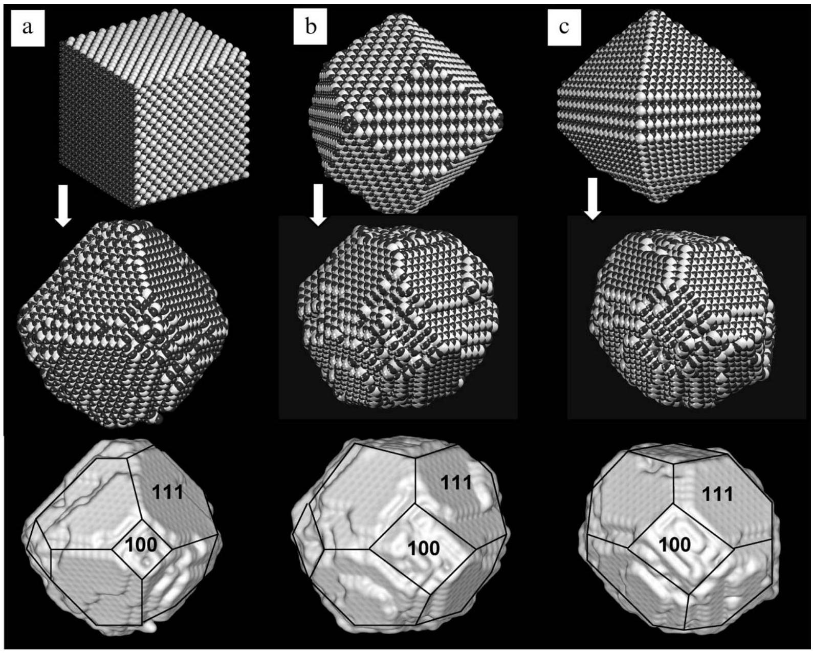
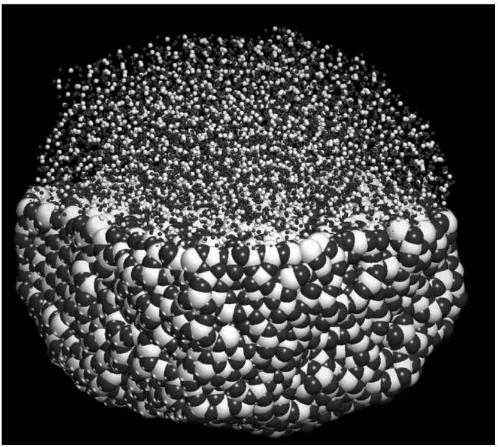

# Shape of $\mathbf{C e O}_{\mathbf{2}}$ nanoparticles using simulated amorphisation and recrystallisation † 

Thi X. T. Sayle, ${ }^{\boldsymbol{a}}$ Stephen C. Parker ${ }^{\boldsymbol{b}}$ and Dean C. Sayle* $\boldsymbol{a}$ ${ }^{a}$ Dept. Environmental and Ordnance Systems, Cranfield University, RMCS, Shrivenham, Swindon, UK. E-mail: d.c.sayle@cranfield.ac.uk ${ }^{b}$ Dept. Chemistry, University of Bath, Claverton Down, Bath, Avon, UK

Received (in Cambridge, UK) 10th June 2004, Accepted 5th August 2004
First published as an Advance Article on the web 21st September 2004

Evolutionary simulation has been used to generate full atomistic models for $\mathrm{CeO}_{2}$ nanoparticles, which comprise $\{100\}$-truncated $\{111\}$ octahedra in accord with experiments.

The remarkable properties of ceria, ${ }^{1} \mathrm{CeO}_{2}$, ensure that it is an important component in a wealth of applications spanning catalysis ${ }^{2}$ to fuel cells. ${ }^{3}$ The behaviour and properties of the material are further profound as one traverses to the nanoscale. ${ }^{4,5}$ Characterization of the $\mathrm{CeO}_{2}$ nanomaterial is central in exploiting further the material in a wealth of applications. Here, we use
† Electronic supplementary information (ESI) available: calculated radial distribution functions for $\mathrm{CeO}_{2}$ nanoparticles. See http://www.rsc.org/ suppdata/cc/b4/b408752f/
molecular dynamics (MD) simulation to generate atomistic models for $\mathrm{CeO}_{2}$ nanoparticles.

Three $\mathrm{CeO}_{2}$ nanoparticles, 10 nm in size and comprising about 16000 ions, were generated using an amorphisation and recrystallisation strategy. ${ }^{6,7}$ Starting morphologies, generated using METADISE, ${ }^{8}$ comprised: Fig. 1(a): $\{100\}$; Fig. 1(b): $\{110\}$ and Fig. 1(c): $\{111\}$ and $\{110\}$. The reason for choosing these three shapes (a-c) was to demonstrate that the final models, generated using amorphisation and recrystallisation, are morphologically similar and independent of the starting configuration. In particular, a nanoparticle comprising $\{100\}$ surfaces, Fig. 1(a), is vastly different morphologically compared with a nanoparticle comprising $\{110\}$ surfaces, Fig. 1(b). The third shape, Fig. 1(c), is the morphology predicted using static lattice energy minimization calculations. ${ }^{9}$

Fig. 1 Graphical representation of the atom positions comprising each nanoparticle. Top, starting configurations, left to right: (a): $\{100\}$; (b): $\{110\}$; (c): $\{111\}$ and $\{110\}$; middle, final configurations; bottom, final configurations with surface filling representation to aid interpretation. Cerium is white and oxygen, black.

Fig. 2 Graphical representation of the atom positions of a typical (amorphous) $\mathrm{CeO}_{2}$ nanoparticle. Cerium is white and oxygen is black. The size of the ions has been varied to aid interpretation.

Each nanoparticle was then amorphised (Fig. 2). Compression and tension induced amorphisation were explored; for example, $10 \%$ compression-induced amorphisation involves changing the coordinates of all the ions comprising the nanoparticle such that the lattice parameter is reduced by $10 \%$. Clearly, the resulting structure generated is very unstable energetically and if MD simulation is applied to this compressed structure, the system will attempt to restore its 'natural' lattice parameter. For low compressions, MD simulation resulted in an almost immediate return to the natural lattice parameter (and nanoparticle shape) and no amorphisation of the nanoparticle was achieved. For high compressions, the simulation failed catastrophically. We were unable to induce amorphisation via compression. Accordingly, tension-induced amorphisation was tried. Here, the lattice parameter is increased. Similar to compression, low tensions resulted in a simple return of the nanoparticle to its natural lattice parameter and high tensions failed catastrophically. However, dynamical simulation, performed on $38.6 \%$-tensioned nanoparticles, at 3750 K for 50 ps resulted in successful amorphisations (calculated radial distribution functions, which illustrate the amorphous nature of the nanoparticles, are available as supplementary material †).

Following a successful amorphisation, the next step was to recrystallise the nanoparticles. To achieve this, dynamical simulation was continued at 3750 K for all three nanoparticles. Crystallization started at the outer surface of each nanoparticle and continued to traverse throughout the nanoparticle. The recrystallisation was monitored by observing animations of the dynamical simulation. Recrystallisation required about 500 ps for each nanoparticle. The simulation was continued for 1000 ps to ensure that there were no further structural changes. We note that once the nanoparticle has recrystallised, the ions simply vibrate about their lattice positions - even at $3750 \mathrm{~K} . \ddagger$ At this point MD simulation was continued at gradually reduced temperatures. Specifically, each system, Fig. 1(a-c) was run at $3500,3000,2500$, $2000,1500,1000,500$ and 0 K for about 50 ps each. This procedure acts effectively as an energy minimization. Rigid-ion potential models, used in this study to describe $\mathrm{CeO}_{2}$, have been published previously. ${ }^{10}$

Close inspection of all three nanoparticles at the end of the simulations, Fig. 1, revealed octahedral morphologies with \{111\} surfaces, truncated by $\{100\}$. The morphologies are in accord with
recent experimental data. In particular, Wang and Feng observed, using transmission electron microscopy (TEM), $\mathrm{CeO}_{2}$ nanoparticles, $3-10 \mathrm{~nm}$ in size, comprising $\{111\}$ octahedra and truncated by $\{100\} .{ }^{1}$ In addition, Zhang et al. observed (using TEM) $\mathrm{CeO}_{2}$ nanoparticles comprising $\{111\}$ octahedra and $\{200\}$ truncated $\{111\}$ octahedra. ${ }^{11}$ Both experimental studies provide compelling validation for our theoretical models. The experimental studies used TEM data to explore the configuration of $\mathrm{CeO}_{2}$ nanoparticles from which line drawing schematics of the shapes were derived. Here, we present models of $\mathrm{CeO}_{2}$ nanoparticles with full atomistic detail, which we suggest will help complement the experiment.
A surprising feature associated with both the atomistic models and the experiment is the absence of $\{110\}$. Surface energies, calculated using static as opposed to dynamical methods, follow: $(111)<(110)<(100)$ with thus the (111) surface the most stable. ${ }^{9,10,12}$ Surface energy calculations predict therefore the existence of $\{110\}$ (or at least in preference to $\{100\}$ ). For $\mathrm{CeO}_{2}$ nanoparticles, this is not supported experimentally, nor do our models express $\{110\}$. In addition, fluorite-structured $\{100\}$ surfaces are dipolar and therefore inherently unstable. ${ }^{9,12}$ Surface energy calculations on dipolar surfaces have necessitated quenching the dipole prior to simulating the system with static or dynamical methods. ${ }^{12}$ This is normally achieved by physically rearranging the ions 'by hand'. Conversely, in this study, we have made no attempts to quench any dipoles by hand. Nevertheless, close inspection of the $\mathrm{CeO}_{2}\{100\}$ at the end of the simulations revealed a $50 \%$ reduction in the oxygen ions at the surface (compared with simple cleavage of the bulk material). This structural rearrangement quenches the dipole and stabilizes the surface.
In summary, realistic atomistic configurations of nanoparticles can be generated using an evolutionary method: simulated amorphisation and recrystallisation. Accordingly, the models derived are not constructed by hand; rather they are independent of starting configuration. The morphologies of the nanoparticles comprise $\{100\}$ truncated $\{111\}$ octahedra, in accord with experiments.
The shape of the $\mathrm{CeO}_{2}$ nanoparticles will influence the properties and hence applications of the material. Accordingly, this study can be extended to explore, for example, surface adsorption, defect structure including segregation, grain boundary and dislocation formation and their influence on important processes such as conductivity (fuel cells) and surface reactivity (catalysis). Analogous simulation studies on 'bulk' surfaces are now well established.

We acknowledge the Cambridge-Cranfield High Performance Computing Facility for computational resources and the EPSRC (GR/S48431/1, GR/S48448/01) for funding.

## Notes and references

‡ We suggest therefore that it is the amorphous state that allows for the exploration of the potential space rather than the high temperature at which the simulation is run.

1 Z. Wang and X. Feng, J. Phys. Chem. B, 2003, 107, 13563.
2 P. L. Gai, R. Roper and M. G. White, Curr. Opin. Solid State Mater. Sci, 2002, 6, 401.
3 W. Z. Zhu and S. C. Deevi, Mater. Sci. Eng. A, 2003, 362, 228.
4 J. Schoonman, Solid State Ionics, 2003, 157, 319.
5 C. N. R. Rao and A. K. Cheetham, J. Mater. Chem., 2001, 11, 2887.

6 D. C. Sayle, J. Mater. Chem., 1999, 9, 2961.
7 D. C. Sayle and G. W. Watson, Surf. Sci, 2001, 97, 473.
8 METADISE, available from the author: s.c.parker@bath.ac.uk.
9 J. C. Conesa, Surf. Sci., 1995, 339, 337.
10 T. X. T. Sayle, S. C. Parker and C. R. A. Catlow, Surf. Sci., 1994, 316, 329.

11 F. Zhang, Q. Jin and S.-W. Chan, J. Appl. Phys., 2004, 95, 4319.
12 H. Norenberg and J. H. Harding, Surf. Sci., 2001, 477, 17.

