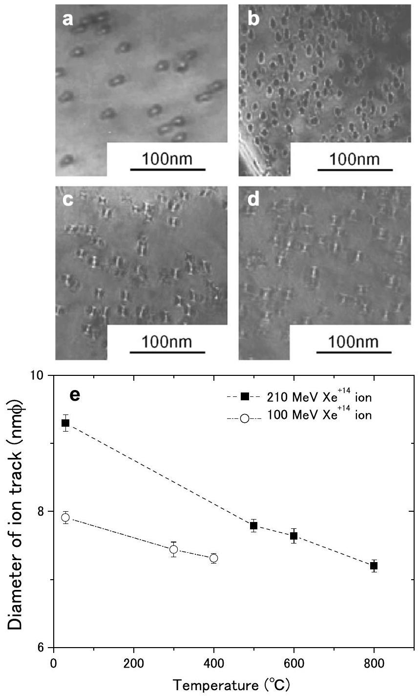
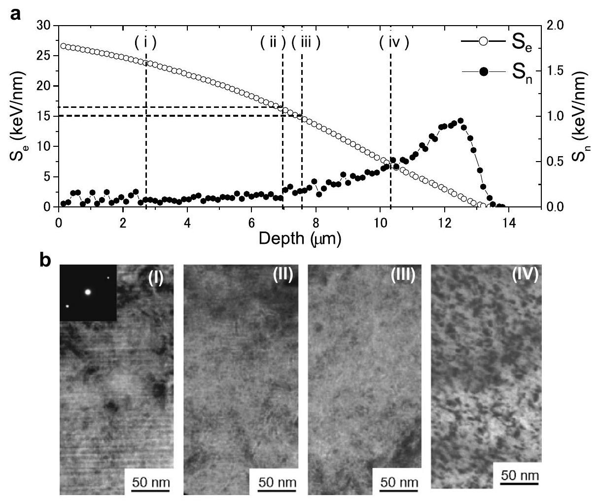
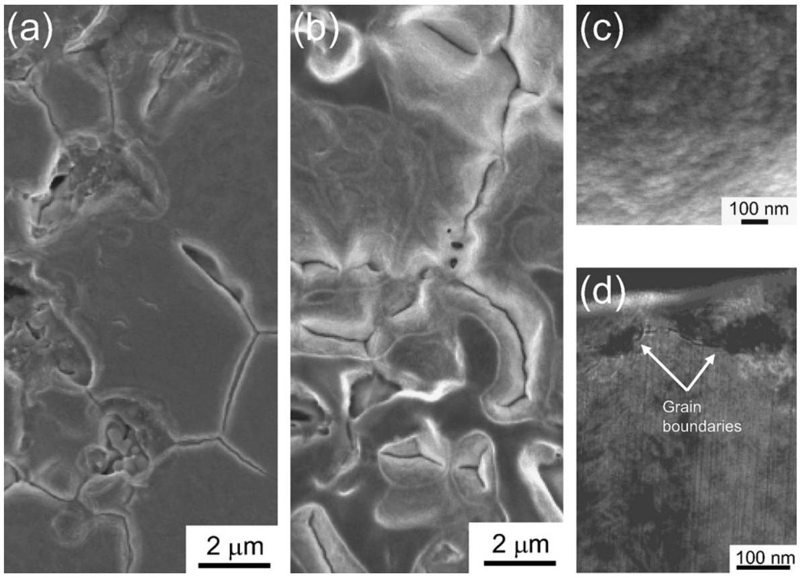
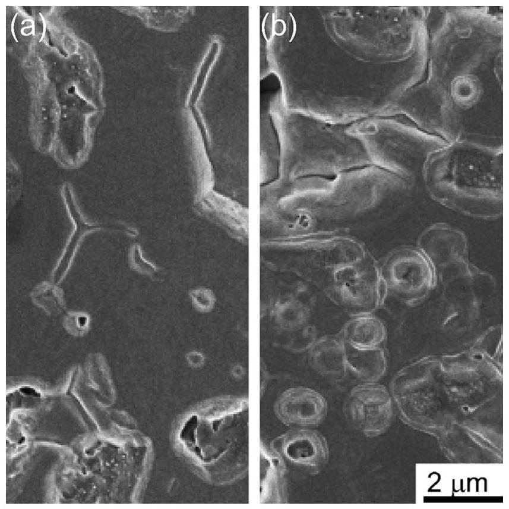

# Clarification of the properties and accumulation effects of ion tracks in $\mathrm{CeO}_{2}$ 

T. Sonoda ${ }^{\mathrm{a}, *}$, M. Kinoshita ${ }^{\mathrm{a}}$, N. Ishikawa ${ }^{\mathrm{b}}$, M. Sataka ${ }^{\mathrm{b}}$, Y. Chimi ${ }^{\mathrm{b}}$, N. Okubo ${ }^{\mathrm{b}}$, A. Iwase ${ }^{\text {c }}$, K. Yasunaga ${ }^{\text {d }}$ ${ }^{\mathrm{a}}$ Central Research Institute of Electric Power Industry (CRIEPI), 2-11-1, Iwado-kita, Komae-shi, Tokyo 201-8511, Japan ${ }^{\mathrm{b}}$ Japan Atomic Energy Agency (JAEA), Tokai-mura, Naka-gun, Ibaraki 319-1195, Japan ${ }^{\mathrm{c}}$ Osaka Prefecture University, 1-1 Gakuen-cho, Sakai-shi, Osaka 599-8531, Japan ${ }^{\mathrm{d}}$ Kyushu University, 744, Oaza Motooka, Nishi-ku, Fukuoka 819-0395, Japan

Available online 1 April 2008

#### Abstract

In order to understand the properties of ion tracks and the microstructural evolution under accumulation of ion tracks and Xe ions in $\mathrm{CeO}_{2}, 70-210 \mathrm{MeV} \mathrm{Xe}^{10 \sim 14+}$ ions irradiation examinations and pre-implantations of 240 keV Xe ions have been done at a tandem accelerator facility and an ion implanter facility of JAEA-Tokai. The microstructure observations were performed by means of a transmission electron microscope (TEM) and a scanning electron microscope (SEM) in CRIEPI.

Measurements of the diameter of ion tracks with the irradiation temperature, between room temperature and $800^{\circ} \mathrm{C}$, clarify that the prominent changes of ion tracks are hardly observed up to $800^{\circ} \mathrm{C}$. By cross-sectional observation, it becomes clear that the threshold electronic stopping power of ion track formation is around $15-16 \mathrm{keV} / \mathrm{nm}$ in case of Xe ions irradiation. 210 MeV Xe ${ }^{14+}$ ion irradiations cause a surface roughness on $\mathrm{CeO}_{2}$ in the ion fluence range between $5 \times 10^{14}$ ions $/ \mathrm{cm}^{2}$ and $1 \times 10^{15}$ ions $/ \mathrm{cm}^{2}$.

© 2008 Elsevier B.V. All rights reserved.

PACS: 61.80.Jh; 61.82.Ms; 68.37.LP; 68.37.Hk

Keywords: Ion track; Electronic excitation; $\mathrm{CeO}_{2}$; Rim structure; Ion irradiation

## 1. Introduction

For reducing the total amount of spent fuels of lightwater reactor (LWR) and eventually the fuel cycle costs, burnup extension of LWR fuels have been promoted step-by-step. At the peripheral region of high burnup fuel pellets, a crystallographic re-structuring is observed, commonly called the "rim structure [1-3]" or "high burnup structure", which is characterized by the existence of highly dense small sub-grains, whose size is approximately 100 nm , and the accumulation of small pores with average size around $1 \mu \mathrm{~m}$. This restructuring can influence the fuel performance including, e.g. fission gas release, fuel temper-

[^0]ature, hardness and swelling. Therefore, in order to extend the burnup of LWR fuels, formation and growth mechanism of the rim structure should be clarified. This structure shall be formed by the accumulation and mutual interactions of radiation damages, fission products (FPs) and electronic excitations deposited partially by nuclear fissions [4]. For separating and evaluating these effects, ion irradiation studies using high-energy ion accelerators and transmission electron microscope (TEM)/scanning electron microscope (SEM) observations after irradiation are effective. Moreover, in order to clarify the irradiation effects of fluorite structure ceramics effectively, $\mathrm{CeO}_{2}$ have been used as a simulation of $\mathrm{UO}_{2}$. Some of information about the irradiation effects in $\mathrm{CeO}_{2}$ and $\mathrm{UO}_{2}$ has been reported in previous papers [5-8], though; they have not been enough for understanding the formation mechanism of rim structure.

This paper attempts to clarify (1) the properties of ion tracks, such as the temperature effects and the threshold electronic stopping power ( $S_{\mathrm{e}}$ ) of ion tracks formation in $\mathrm{CeO}_{2}$ and (2) the microstructural evolution under accumulation of ion tracks and pre-implantation of Xe ions in $\mathrm{CeO}_{2}$.

## 2. Experimental

In this research, $4 \mathrm{~N} \mathrm{CeO}_{2}$ powder supplied by RARE METALLIC Co. was pressed and sintered as $8 \mathrm{~mm} \phi \times 1 \mathrm{~mm}$ bulk at $1400^{\circ} \mathrm{C}$ for 8 h , then cooling to room temperature for 8 h in air. The sintered bulk specimen was ground and polished for ion irradiation examination. For producing TEM samples, some of the bulk specimen was cut out as the $3 \mathrm{~mm} \phi$ discs, dimpled and thinned by ion sputtering of $5 \mathrm{keV} \mathrm{Ar}^{+}$ions. A focused ion beam (FIB) system by Hitachi FB-2000A was also adopted for making cross sectional TEM samples [9].

Ion irradiation examinations have been done at JAEATokai Tandem accelerator facility, where an ECR ion source is installed and is able to irradiate high energy inert gases such as $\mathrm{Xe}, \mathrm{Kr}$. In this study, irradiation examinations on the samples with $70-210 \mathrm{MeV} \mathrm{Xe}^{10 \sim 14+}$ ions were conducted at temperatures from room temperature to $800^{\circ} \mathrm{C}$. Moreover, in order to simulate the retained FP gas in high burnup fuels, 240 keV Xe ions are preimplanted in $\mathrm{CeO}_{2}$ by use of an ion implanter with ECR ion source.

Microstructural evolutions in the samples were observed by use of a 300 kV field emission transmission electron microscope (FE-TEM); Hitachi HF-3000 and a field emission scanning electron microscope (FE-SEM); JEOL JSM6340 F at CRIEPI.

## 3. Results and discussion

### 3.1. Properties of ion tracks in $\mathrm{CeO}_{2}$

For understanding the temperature effects on the configuration of ion tracks, the microstructure and the diameter of ion tracks are measured as a function of irradiation temperature. Fig. 1(a)-(d) indicates the typical bright field images of ion tracks in $\mathrm{CeO}_{2}$ under irradiation with $210 \mathrm{MeV} \mathrm{Xe}{ }^{+14}$ ions to a fluence $1 \times 10^{11}$ ions $/ \mathrm{cm}^{2}$ at room temperature (a), to a fluence $5 \times 10^{11}$ ions $/ \mathrm{cm}^{2}$ at $500{ }^{\circ} \mathrm{C}$ (b), to a fluence $5 \times 10^{11}$ ions $/ \mathrm{cm}^{2}$ at $600^{\circ} \mathrm{C}$ (c) and to a fluence $5 \times 10^{11}$ ions $/ \mathrm{cm}^{2}$ at $800{ }^{\circ} \mathrm{C}$ (d). These images indicate that the cross sections of ion tracks become blur over $600^{\circ} \mathrm{C}$, though, the ion tracks still exist till $800^{\circ} \mathrm{C}$. Fig. 1(e) shows the mean diameter of ion tracks by 100 MeV and $210 \mathrm{MeV} \mathrm{Xe}^{+14}$ ion irradiation as a function of irradiation temperature ( ${ }^{\circ} \mathrm{C}$ ). This figure clarified that the mean diameter of ion tracks is decreasing as irradiation temperature increases and is decreased by about $23 \%$ at $800^{\circ} \mathrm{C}$. These results indicate that the ion tracks can exist up to $800^{\circ} \mathrm{C}$ and the temperature range from room temperature to

Fig. 1. Typical bright field images of ion tracks under irradiation with $210 \mathrm{MeV} \mathrm{Xe} \mathrm{e}^{+14}$ ions (a-d) and the mean diameter of ion tracks by 100 MeV and $210 \mathrm{MeV} \mathrm{Xe}^{+14}$ ion irradiation as a function of irradiation temperature ( ${ }^{\circ} \mathrm{C}$ ) (e). The irradiation condition of (a)-(d) is to a fluence $1 \times 10^{11}$ ions $/ \mathrm{cm}^{2}$ at room temperature (a), to a fluence $5 \times 10^{11}$ ions $/ \mathrm{cm}^{2}$ at $500{ }^{\circ} \mathrm{C}$ (b), to a fluence $5 \times 10^{11}$ ions $/ \mathrm{cm}^{2}$ at $600{ }^{\circ} \mathrm{C}$ (c) and to a fluence $5 \times 10^{11}$ ions $/ \mathrm{cm}^{2}$ at $800^{\circ} \mathrm{C}$ (d), respectively.

$800^{\circ} \mathrm{C}$ does not significantly affect annealing of ion tracks. That suggests that the effects of accumulation of ion tracks on microstructure changes in $\mathrm{CeO}_{2}$ should be taken into consideration.

The affected area of electronic excitation by fissions in $\mathrm{CeO}_{2}$ has been clarified to be around $5-7 \mathrm{~nm} \phi$ [5]. For understanding the "affected volume of high-density electronic excitation" in $\mathrm{CeO}_{2}$, the length of ion tracks, that is, the threshold electronic stopping power ( $S_{\mathrm{e}}$ ) for ion track formation in $\mathrm{CeO}_{2}$ is indispensable. In order to clarify the depth profile of ion tracks in $\mathrm{CeO}_{2}$, cross sectional TEM observations by use of a FIB facility and FE-TEM were applied. Fig. 2(a) indicates the depth profile of electronic stopping power ( $S_{\mathrm{e}}$ ) and nuclear stopping power $\left(S_{\mathrm{n}}\right)$ of $210 \mathrm{MeV} \mathrm{Xe}{ }^{+14}$ ion in $\mathrm{CeO}_{2}$ that was estimated

Fig. 2. Depth profile of electronic stopping power ( $S_{\mathrm{e}}$ ) and nuclear stopping power ( $S_{\mathrm{n}}$ ) of $210 \mathrm{MeV} \mathrm{Xe}^{+14}$ ion in $\mathrm{CeO}_{2}$ (a) and the typical TEM images in selected depth positions (b). The position of each image is at depth of $\sim 2.7 \mu \mathrm{~m}$ (i), $\sim 7.0 \mu \mathrm{~m}$ (ii), $\sim 7.5 \mu \mathrm{~m}$ (iii) and $\sim 10.3 \mu \mathrm{~m}$ (iv), respectively.

by SRIM 2003 code [10] and Fig. 2(b) shows the typical TEM images at a depth of $\sim 2.7 \mu \mathrm{~m}$ (i), $\sim 7.0 \mu \mathrm{~m}$ (ii), $\sim 7.5 \mu \mathrm{~m}$ (iii) and $\sim 10.3 \mu \mathrm{~m}$ (iv), respectively. At a depth of $\sim 2.7 \mu \mathrm{~m}$, ion tracks are clearly observed in Fig. 2((b)(i)). The diameter of ion tracks decreases as the distance from irradiation surface becomes longer and the images of ion tracks become invisible at the depth of around $7.0-7.5 \mu \mathrm{~m}$, as shown in Fig. 2 ((b)-ii, iii). At the depth of $\sim 10.3 \mu \mathrm{~m}, S_{\mathrm{e}}$ is decreased and $S_{\mathrm{n}}$ become bigger, relatively, high dense defect clusters were observed, as shown in Fig. 2 ((b)-iv). These figures clarify that the depth up to which ion tracks are formed is around $7.0-7.5 \mu \mathrm{~m}$ in case of 210 MeV $\mathrm{Xe}^{+14}$ irradiation in $\mathrm{CeO}_{2}$. This result suggests that the threshold $S_{\mathrm{e}}$ of ion track formation in $\mathrm{CeO}_{2}$ is around $15-16 \mathrm{keV} / \mathrm{nm}$. In case of $80 \mathrm{MeV} \mathrm{Xe}^{+14}$ irradiation, the tracks were observed up to a depth of $\sim 2.1 \mu \mathrm{~m}$ and the threshold $S_{\mathrm{e}}$ of ion track formation in $\mathrm{CeO}_{2}$ can be estimated $\sim 15 \mathrm{keV} / \mathrm{nm}$. In order to clarify the value with a higher accuracy, cross sectional TEM observations of $\mathrm{CeO}_{2}$ under irradiation with several irradiation energies will be treated.

### 3.2. Accumulation effects of ion tracks and pre-implantation of Xe ions

In order to clarify the effects of accumulation of ion tracks on the microstructure change in $\mathrm{CeO}_{2}$, high fluence irradiations up to $2 \times 10^{15}$ ions $/ \mathrm{cm}^{2}$ have been done and the irradiated samples have been observed by SEM/TEM.

Fig. 3(a) and (b) shows the typical SEM images of irradiated surfaces in $\mathrm{CeO}_{2}$ under irradiation with 210 MeV $\mathrm{Xe}^{+14}$ at $300^{\circ} \mathrm{C}$ to a fluence of $3 \times 10^{14}$ ions $/ \mathrm{cm}^{2}$ (a) and $2 \times 10^{15}$ ions $/ \mathrm{cm}^{2}$ (b), respectively. This figure indicates that the drastic change of the surface condition is occurred between (a) and (b). High magnification image of the surface roughness in the sample (b), as shown in Fig. 3(c), has similar morphology of small sub-divided grains that are observed in inner surfaces of coarsened bubbles (size: $\sim 1 \mu \mathrm{~m}$ ) in high burnup fuels [5]. A cross-sectional TEM image of the part of surface roughness in sample (b) is indicated in Fig. 3(d). In this figure, the grain boundaries are observed at around 100 nm depth from the irradiated surface whose morphology is changed. This result suggests a possibility that the surface roughness is caused by subdivided grains. Several irradiation examinations whose irradiation temperature up to $800^{\circ} \mathrm{C}$ confirm that the drastic change of surface morphology in all irradiated area is caused at a fluence to over $5 \times 10^{14}$ ions $/ \mathrm{cm}^{2}$. These results clarify that the overlapping of ion tracks is needed for the drastic change of surface morphology.

For the simulation of high burnup fuels, high fluence preimplantation of 240 keV Xe ions ( $\sim 2 \times 10^{16}$ ions $/ \mathrm{cm}^{2}$ ) at room temperature are prepared before irradiation with 210 MeV Xe ions. The density of pre-implanted Xe ions in the ion range ( $\sim 50 \mathrm{~nm}$ ) is estimated as around $2 \times 10^{21} \mathrm{ions} / \mathrm{cm}^{3}$ and the density corresponds with that of high burnup fuels ( $\sim 70 \mathrm{MWd} / \mathrm{kgU}$ ). Fig. 4 indicates the typical SEM image of irradiated surface in $\mathrm{CeO}_{2}$ under

Fig. 3. Typical SEM images of irradiated surfaces in $\mathrm{CeO}_{2}$ under irradiation with $210 \mathrm{MeV} \mathrm{Xe}^{+14}$ at $300{ }^{\circ} \mathrm{C}$ to fluences of $3 \times 10^{14}$ ions $/ \mathrm{cm}^{2}$ (a), $2 \times 10^{15}$ ions/ $\mathrm{cm}^{2}(\mathrm{~b})$; a higher magnification SEM image of sample (b) and (c) and a cross-sectional TEM image for sample (b) and (d), respectively.

irradiation with $210 \mathrm{MeV} \mathrm{Xe} \mathrm{e}^{+14}$ to a fluence of $5 \times 10^{14}$ ions $/ \mathrm{cm}^{2}$ at $300^{\circ} \mathrm{C}$ (a) and multiple irradiation with $240 \mathrm{keV} \mathrm{Xe} \mathrm{e}^{+12}$ to a fluence of $2 \times 10^{16}$ ions $/ \mathrm{cm}^{2}$ at RT and $210 \mathrm{MeV} \mathrm{Xe}{ }^{+14}$ to a fluence of $5 \times 10^{14}$ ions $/ \mathrm{cm}^{2}$ at $300^{\circ} \mathrm{C}$. This figure suggests that the formation of surface roughness tends to be accelerated by the pre-implantation of Xe ions. In order to understand the formation mecha-

Fig. 4. Typical SEM image of irradiated surface in $\mathrm{CeO}_{2}$ under irradiation with $210 \mathrm{MeV} \mathrm{Xe}^{+14}$ to a fluence of $5 \times 10^{14}$ ions $/ \mathrm{cm}^{2}$ at $300^{\circ} \mathrm{C}$ (a) and multiple irradiation with $240 \mathrm{keV} \mathrm{Xe}{ }^{+12}$ to a fluence of $2 \times 10^{16}$ ions $/ \mathrm{cm}^{2}$ at RT and $210 \mathrm{MeV} \mathrm{Xe}^{+14}$ to a fluence of $5 \times 10^{14}$ ions $/ \mathrm{cm}^{2}$ at $300{ }^{\circ} \mathrm{C}$ (b).

nism of the surface roughness, further multiple ion irradiation examinations and cross-sectional observations will be continued in the near future.

## 4. Conclusions

Multiple ion irradiation examinations with 210 MeV and 240 keV Xe ions on $\mathrm{CeO}_{2}$ allowed clarifying the properties of ion tracks and the accumulation effects of ion tracks and pre-implantation of Xe ions on the microstructure changes in $\mathrm{CeO}_{2}$. The main conclusions are,
(1) Observations and diameter measurements of ion tracks in $\mathrm{CeO}_{2}$ clarified that the ion tracks can exist up to $800^{\circ} \mathrm{C}$ and the temperature range from room temperature to $800^{\circ} \mathrm{C}$ does not significantly affect annealing of ion tracks. Cross-sectional observation clarified that the threshold electronic stopping power of ion track formation is around $15-16 \mathrm{keV} / \mathrm{nm}$ in case of Xe irradiation.
(2) Ion track accumulation cause a surface roughness on $\mathrm{CeO}_{2}$ in the ion fluence range between $5 \times 10^{14}$ ions/ $\mathrm{cm}^{2}$ and $1 \times 10^{15}$ ions $/ \mathrm{cm}^{2}$. High fluence Xe preimplantation before high energy Xe irradiation tends to accelerate the formation of surface roughness in $\mathrm{CeO}_{2}$.

## Acknowledgements

This study was financially supported by the Budget for Nuclear Research of the Ministry of Education, Culture, Sports, Science and Technology, based on the screening
and counseling by the Atomic Energy Commission. The authors wish to thank Mr. H. Ando for operation of FIB facility.

## References

[1] J.O. Barner, M.E. Cunningham, M.D. Freshley, D.D. Lanning, HBEP-61, 1990, Battelle Pacific Northwest Laboratories.
[2] M. Kinoshita, et al., in: Proceedings of the 2004 International Meeting on LWR Fuel Performance, Orlando, Florida, USA, Paper 1102., 2004.
[3] T. Kameyama, T. Matsumura, M. Kinoshita, Nucl. Technol. 106 (1994) 334.
[4] T. Sonoda, M. Kinoshita, I.L.F. Ray, T. Wiss, H. Thiele, D. Papaioannou, V.V. Rondinella, Hj. Matzke, Nucl. Instr. and Meth. B 191 (2002) 622.
[5] T. Sonoda, M. Kinoshita, Y. Chimi, N. Ishikawa, M. Sataka, A. Iwase, Nucl. Instr. and Meth. B 250 (2006) 254.
[6] K. Yasunaga, K. Yasuda, S. Matsumura, T. Sonoda, Nucl. Instr. and Meth. B 250 (2006) 114.
[7] T. Wiss, Hj. Matzke, C. Trautmann, M. Toulemonde, S. Klaumunzer, Nucl. Instr. and Meth. B 122 (1997) 583.
[8] K. Nogita, K. Hayashi, K. Une, K. Fukuda, J. Nucl. Mater. 273 (1999) 302-309.
[9] T. Ishitani, T. Yaguchi, H. Koike, Hitachi Rev. 45 (1996) 19.
[10] J.F. Ziegler, J.P. Biersack, et al., The Stopping and Range of Ions of Solids, Pergamon Press, New York, 1985.

[^0]:    * Corresponding author. Tel.: +81 33480 2111; fax: +81 334802493.

    E-mail address: t-sonoda@criepi.denken.or.jp (T. Sonoda).

