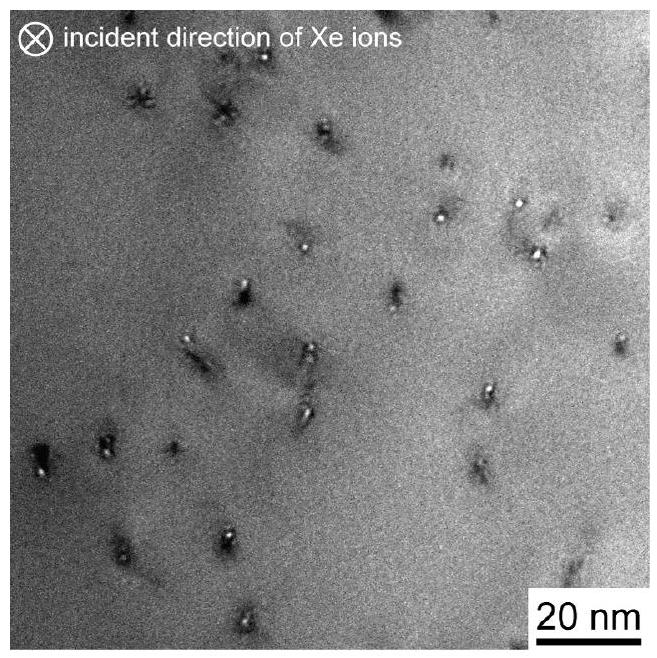
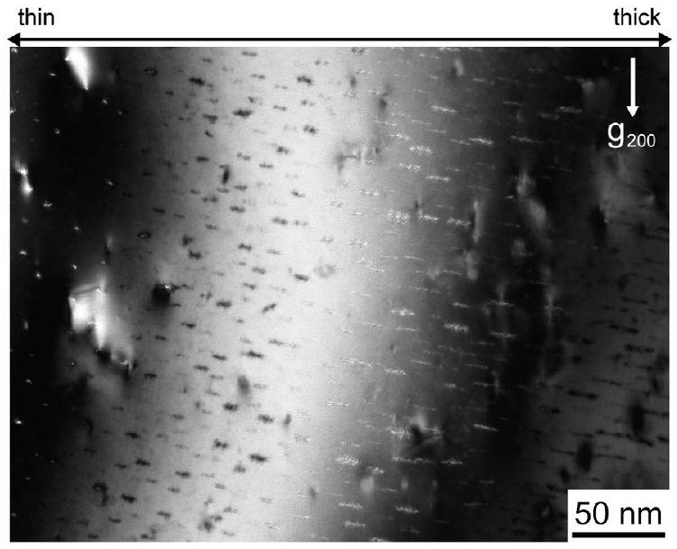
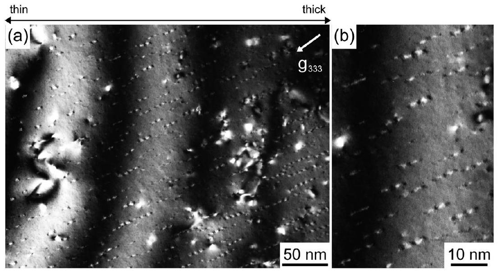
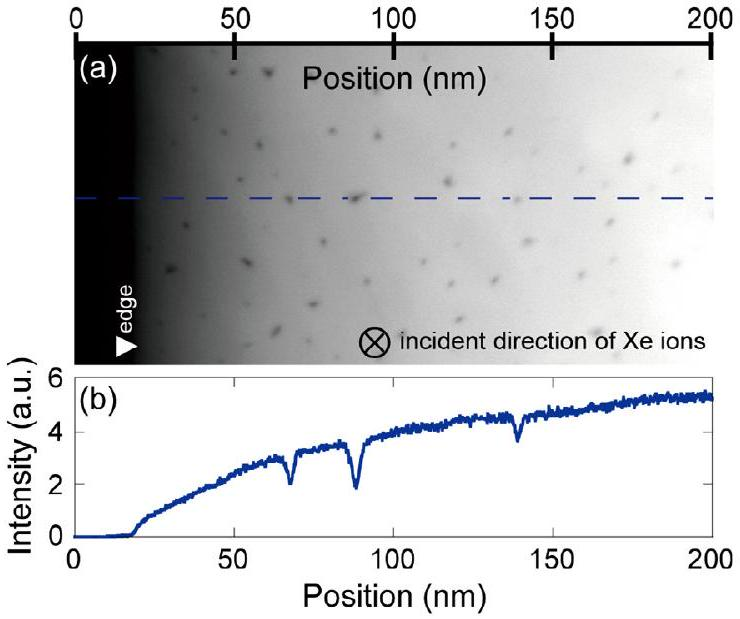
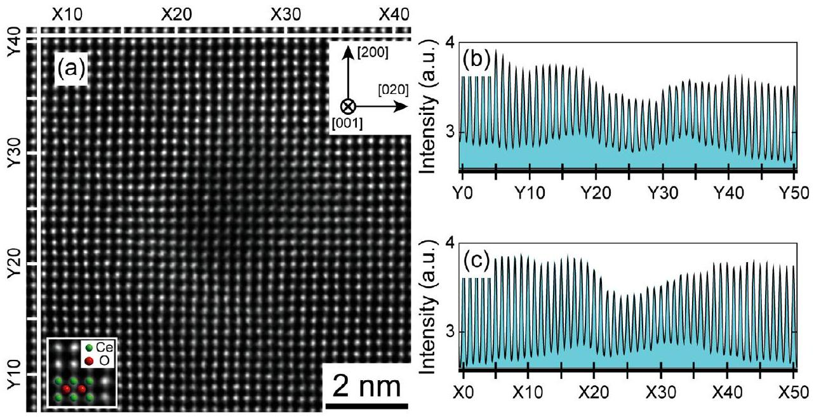
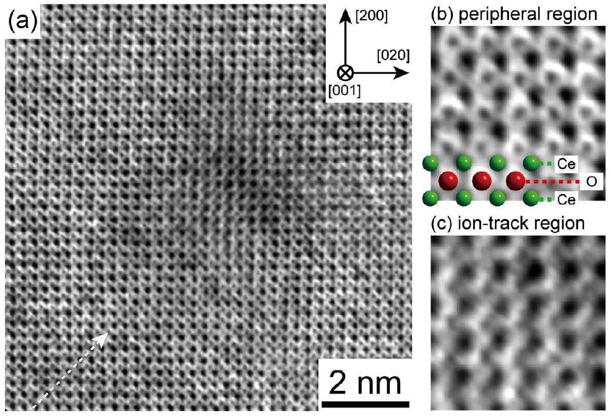
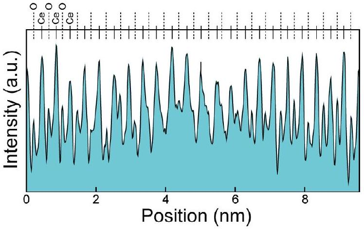

# Atomic structure of ion tracks in Ceria 

S. Takaki ${ }^{\text {a }}$, K. Yasuda ${ }^{\text {a, } *}$, T. Yamamoto ${ }^{\text {a }}$, S. Matsumura ${ }^{\text {a }}$, N. Ishikawa ${ }^{\text {b }}$ ${ }^{\mathrm{a}}$ Department of Applied Quantum Physics and Nuclear Engineering, Kyushu University, Fukuoka, Japan ${ }^{\mathrm{b}}$ Nuclear Science and Technology Directorate, Japan Atomic Energy Agency, Ibaraki, Japan

## ARTICLE INFO

## Article history:

Received 30 June 2013
Received in revised form 3 October 2013
Accepted 25 October 2013
Available online 3 February 2014

## Keywords:

Ceria
Swift heavy ion
Ion track
TEM
STEM

#### Abstract

We have investigated atomic structure of ion tracks in $\mathrm{CeO}_{2}$ irradiated with 200 MeV Xe ions by transmission electron microscopy (TEM) and scanning transmission electron microscopy (STEM). TEM observations under inclined conditions showed continuous ion tracks with diffraction and structure factor contrast, and the decrease in the atomic density of the ion tracks was evaluated to be about $10 \%$. High resolution STEM with high-angle annular dark-field (HAADF) technique showed that the crystal structure of the Ce cation column is retained at the core region of ion tracks, although the signal intensity of the Ce cation lattice is reduced over a region $4-5 \mathrm{~nm}$ in size. Annular bright field (ABF) STEM observation has detected that the O anion column is preferentially distorted at the core region of ion tracks within a diameter of 4 nm . The core region of ion track in $\mathrm{CeO}_{2}$ is determined to contain a high concentration of vacancies or small vacancy clusters and to generate interstitials in surrounding regions.

© 2014 Elsevier B.V. All rights reserved.

## 1. Introduction

Numerous investigations have shown that oxide ceramics with the fluorite-type structure are radiation tolerant [1,2]. For this reason, materials such as urania ( $\mathrm{UO}_{2}$ ) and stabilized zirconia ( $\mathrm{ZrO}_{2}$ ) have been successfully incorporated as nuclear fuels and have potential applications as inert matrix fuels and transmutation targets [3]. Radiation damage, induced by fission products (FPs) that have typical energies in the range of $70-100 \mathrm{MeV}$, is the most crucial issue for fuel/target materials, wherein high density electronic excitation is induced by FPs to form continuous ion tracks. It is also important to note that FPs induce extremely high amounts of elastic displacements around the range of FPs at which nuclear stopping is dominant.

Previous investigations of ion tracks in fluorite-type oxides such as stabilized $\mathrm{ZrO}_{2}$ [4,5], $\mathrm{CeO}_{2}$ [6,7] and $\mathrm{UO}_{2}$ [8-10] have determined that the structure of ion tracks in such oxides is not amorphous but retains the fluorite structure. Ion tracks are observed as Fresnel contrast in transmission electron microscopy (TEM) bright-field ( BF ) image, and the size of ion tracks has been discussed with respect to electronic stopping power [5-10]. Synchrotron radiation investigations with X-ray photoelectron spectroscopy (XPS) and extended X-ray absorption fine structure (EXAFS) have found that the valence state of the Ce cation changes from $4+$ to $3+$ with swift heavy ion irradiation [11,12], and the results were determined to be caused by displacement damage of

[^0]oxygen sublattice inside the ion tracks. On the other hand, prolonged irradiation to high fluences has shown the development of a dislocation structure due to the overlap of high density electronic excitation that results in the formation of subgrains and/or small-angle grain boundary [7,13]. However, at this moment, the size and atomic structure of ion tracks in fluorite structure oxide have not been fully clarified, and the understanding of the relation of microstructural evolution to the well-developed dislocation structure is rather limited.

This study aims to clarify the structure of ion tracks in $\mathrm{CeO}_{2}$ at an atomic scale, which has received considerable attention as a surrogate material for $\mathrm{UO}_{2}$ because of its identical crystal structure and similar material properties [14-20]. TEM and scanning transmission electron microscopy (STEM) techniques including high-angle annular dark-field (HAADF) and annular bright field (ABF) imaging are applied to $\mathrm{CeO}_{2}$ specimens irradiated with 200 MeV Xe ions.

## 2. Experimental

$\mathrm{CeO}_{2}$ powders of $99.99 \%$ purity (Rare Metal Corp.) were compacted into pellets followed by sintering at 1873 K for 12 h in air to obtain polycrystalline specimens. The sintered compacts were evaluated to be $98.5 \%$ theoretical density with an average grain size of $5 \mu \mathrm{~m}$. Disk specimens 3 mm in diameter and $150 \mu \mathrm{~m}$ in thickness were prepared by mechanical polishes and were irradiated with $200 \mathrm{MeV} \mathrm{Xe}^{14^{+}}$ions at an ambient temperature to fluences of $3 \times 10^{11}, 3 \times 10^{12}$, and $1 \times 10^{14}$ ions $/ \mathrm{cm}^{2}$. The electronic ( $S_{\mathrm{e}}$ ) and nuclear ( $S_{\mathrm{n}}$ ) stopping power of 200 MeV Xe ions was calculated by the SRIM (Stopping and Range of Ions in Matter)
code [21] to be 27 and $1.1 \mathrm{keV} / \mathrm{nm}$, respectively at the surface region. The irradiated specimens were mechanically dimpled at the center, followed by conventional ion-thinning with Ar ions from the opposite side of the ion-irradiated surface to prepare thin-foil specimens for plan-view observations. Ar-ion energies were decreased step by step to a final thinning of 0.5 keV to minimize the Ar-ion damage. Microstructure observations were performed with BF and weak-beam dark-field (WBDF) imaging using a conventional TEM (JEM-2100HC, JEOL Ltd.) operated at 200 kV . A part of the specimens was subjected to observations with STEM to obtain Z-contrast images at an atomic resolution using a TEM equipped with a spherical aberration corrector (JEM-ARM200F, JEOL Ltd.). HAADF and ABF-STEM images were utilized for atomic resolution observations. HAADF-STEM is advantageous for atomic scale imaging of heavy elements [22] as its signal intensity is proportional to the square of the atomic number ( $Z^{2}$ ) [23], although light elements such as oxygen are hardly observable. The signal intensity of ABF-STEM has a weak dependence on $Z$ (such as $Z^{0.3}$ [24]), which enables one to detect light and heavy elements at the same time [25,26]. The diffraction angles of electron beam to the inner and outer edge of the annular detector were 90 and 170 mrad , respectively, for HAADF image and 11 and 22 mrad , respectively, for ABF images.

## 3. Results and discussion

It has been reported that core damage region of ion tracks in fluorite-type oxides such as stabilized $\mathrm{ZrO}_{2}$ [4,5], $\mathrm{CeO}_{2}$ [6,7], and $\mathrm{UO}_{2}[8-10]$, shows Fresnel contrast. Fig. 1 shows an example of a BF plan-view image of such Fresnel contrast obtained from core damage regions of ion tracks in $\mathrm{CeO}_{2}$ irradiated with 200 MeV Xe ions to a fluence of $3 \times 10^{11}$ ions $/ \mathrm{cm}^{2}$, taken in an under-focus kinematical diffraction condition. Fresnel contrast of core damage regions is observed as a distinct white-dot contrast with a size of about 2 nm in diameter. Some faint-dark contrast regions are also seen in Fig. 1 near the ion tracks. These dark regions are diffraction contrast regions caused by defect clusters such as dislocation loops as reported previously [7], although the contrast is blurred because of the defocused condition of Fig. 1.

Fig. 2 shows an inclined BF image of $\mathrm{CeO}_{2}$ irradiated with 200 MeV Xe ions to a fluence of $1 \times 10^{14}$ ions $/ \mathrm{cm}^{2}$ under a dynamical two-beam condition with a diffraction vector of $g=200$.

Fig. 1. Plan-view BF image of $\mathrm{CeO}_{2}$ irradiated with 200 MeV Xe ions at an ambient temperature to a fluence of $3 \times 10^{11}$ ions $/ \mathrm{cm}^{2}$ taken in an under-focus kinematical diffraction condition.

Fig. 2. Inclined view of a BF image of $\mathrm{CeO}_{2}$ irradiated with 200 MeV Xe ions to a fluence of $1 \times 10^{14}$ ions $/ \mathrm{cm}^{2}$. The micrograph was taken in a just-focus condition with satisfying the Bragg condition using a diffraction vector of $g=200$. The inclined angle is $13^{\circ}$ in a resultant angle from an end-on condition of ion tracks.

Elongated rod-like contrast with a width of $2-3 \mathrm{~nm}$ in diameter is continuously observed along the path of incident ions, although the width of the contrast fluctuates with the depth of incident ions. The contrast appears in black or white, depending on the thickness extinction contour of the matrix, which indicates that the contrast is principally a diffraction contrast. The periodicity of the black and white contrast of the ion tracks is, however, observed to be different from that of the matrix, indicating that the contrast includes the structure factor type due to the difference in the excitation distance between the matrix and the damage region of ion tracks [27].

A weak-beam dark-field (WBDF) image of the region identical to Fig. 2 is shown in Fig. 3, which illustrates ion tracks as a continuous and sharp contrast along the path of penetrating ions together with its clear effective thickness extinction contour. We have measured the number of effective thickness extinction contours at a specimen thickness of $90-120 \mathrm{~nm}$ (corresponding to 4th and 5th black and white fringes of matrix from the edge of the specimen) and found that the number of fringes in ion tracks is smaller than that of the matrix for about $13 \%$ on average. The extinction distance is proportional to the inverse of the structure factor [28], which leads to the conclusion that the extinction distance is inversely proportional to the atomic density of a substance if the crystal structure is retained. Therefore, the obtained result suggests a decrease in the atomic density at the core region of the ion tracks, as the crystal structure inside the ion tracks is retained, which will be described in the following section.

Fig 4(a) is a HAADF-STEM image of $\mathrm{CeO}_{2}$ taken from a direction parallel to the ion irradiation. Ion tracks are nearly observed in an end-on condition and appeared as black-dot contrast. A signal intensity profile along the broken line shown in Fig. 4(a) reveals that the background intensity increases with increasing specimen thickness. As shown in Fig. 4(b), the intensity significantly decreases at the position of the ion tracks. As the signal intensity of a HAADF-STEM image is proportional to $Z^{2}$, where $Z$ is the atomic number of the illuminated atom [24], the intensity profiles shown in Fig. 4(b) reflects a decrease in the number of Ce cations inside the ion tracks. This result is consistent with our discussion described above based on the inclined BF and WBDF-TEM images of ion tracks.

Fig 5(a) shows a high resolution HAADF-STEM image of $\mathrm{CeO}_{2}$ taken from a [001] direction, which includes an ion track induced by irradiation with 200 MeV Xe ions to a fluence of $3 \times 10^{12}$ ions $/ \mathrm{cm}^{2}$

Fig. 3. Weak-beam ( $g, 3 g$ ), $g=111$ dark-field image of $\mathrm{CeO}_{2}$ irradiated with 200 MeV Xe ions to a fluence of $1 \times 10^{14}$ ions $/ \mathrm{cm}^{2}$ (a). The inclined angle is $21^{\circ}$ in a resultant angle from an end-on condition of ion tracks. A magnified image of a section from Fig. 3(a) is shown in (b).

Fig. 4. Low magnification HAADF-STEM image of $\mathrm{CeO}_{2}$ irradiated to a fluence of $1 \times 10^{14}$ ions $/ \mathrm{cm}^{2}$, which was taken from the ion-irradiated direction to show ion tracks from an end-on direction (a), and a line profile of the HAADF-STEM signal intensity obtained along the broken line. (b) The specimen thickness increases from the left to right in the micrograph.

at the central region of the micrograph in an end-on condition. It is clearly observed that the lattice image indicative of a distance of 0.27 nm , which corresponds to the spacing of the Ce cation column in the [001] directions, as shown in the insertion of Fig. 5(a), is retained at the core damage region of the ion track. The O anion columns surrounded by four Ce cations are not visible because of the large difference in the values of $Z$ between $C e$ cations and $O$ anions [23]. The contrast of the Ce cation column is, however, significantly decreased at the core damage region. This is clearly shown by the signal intensity profiles across the ion track in the [200] and [020] directions, as shown in Fig. 5(b) and (c), respectively, in which the signal intensity at the core damage region of the ion track is depressed for both directions. It is also noted that the base-line signal intensity increases at the core damage region of the ion track, especially for the peripheral region of the ion track. The size of the distorted region, which is defined as the distance between the peaks of the base-line signal intensity, is about 4 nm . The distance where the signal intensity of the ion track is decreased is evaluated to be $2-3 \mathrm{~nm}$, which fairly agrees with the size of the Fresnel contrast observed in the kinematical BF-TEM image (Fig. 1). It is also noted that the diffraction pattern of the specimen irradiated to this fluence is hardly changed to that of the unirradi-
ated specimen, which indicates the fluorite-type structure is retained.

High resolution ABF-STEM of $\mathrm{CeO}_{2}$ has directly detected the atomic column of O anions. Fig. 6(a) shows an ABF-STEM of a region identical to Fig. 5(a), which includes an ion track in an end-on condition. The lattice image at the peripheral region of the ion track is magnified in Fig. 6(b) with a superimposed lattice model of $\mathrm{CeO}_{2}$ viewed from the [001] direction in which O anion columns are apparently evident as black-dot contrast at the tetrahedral site of the fcc Ce cation sublattice. On the other hand, it is observed in Fig. 6(c) that the lattice image of the O anion columns at the core region of the ion track is blurred and/or disappeared. It has been reported that the image of the O anion column strongly depends on the specimen thickness [29]. However, O anion columns are visible at the peripheral regions of the ion track for both the [200] and [020] directions, although the specimen used in the present study is a wedge shaped. The blurring and disappearance of the O anion columns at the core damage region of the ion track is, therefore, caused by high density electronic excitation damage with 200 MeV Xe ions. An intensity profile along the broken line across the ion track (Fig. 7) shows that the peak intensity of the O anion signal is significantly reduced at the core damage region of the ion track over a diameter of about 4 nm , and that the base-line intensity increases there. These results clearly show that the oxygen sublattice at the core damage region of ion tracks is significantly disordered.

Previous synchrotron radiation investigations of $\mathrm{CeO}_{2}$ [11,12], by means of XPS and EXAFS, have shown that irradiation by 200 MeV Xe ions caused the valence state of the Ce cation to change from $\mathrm{Ce}^{4+}$ to $\mathrm{Ce}^{3+}$ in order to decrease their coordination number from the original value of $8-6.3$ [11]. These reported results were concluded to be caused by displacement damage of O anions owing to high density electronic excitation [11,12]. The atomic structure obtained in the present study, which show a decrease in the atomic density and disorder of the oxygen sublattice at the core damage region of ion tracks, is a direct evidence for the discussion based on the synchrotron investigations and implies the generation of vacancies and/or small vacancy clusters inside the ion tracks. Simple estimation for the accumulation of the damage region having a size of about $3-4 \mathrm{~nm}$ (based on the results in Figs. 1, 5 and 6) gives a saturation fluence of around $10^{13}$ ions $/ \mathrm{cm}^{2}$, if one assumes direct formation of the damage region of ion tracks [30]. This is good agreement with changes in the coordination number of Ce cations relative to the fluence shown in the literature [11]. On the other hand, it is has been

Fig. 5. High resolution HAADF-STEM image of $\mathrm{CeO}_{2}$ taken from the [001] direction including an ion track (located at the center of the micrograph) formed under 200 MeV Xe ion irradiation to a fluence of $3 \times 10^{12}$ ions $/ \mathrm{cm}^{2}$ (a). Inserted is an atomic model of $\mathrm{CeO}_{2}$ superimposed on the HAADF-STEM image from the [001], indicating that the lattice image reflects the Ce cation column. Signal intensity profiles including an ion track are shown in (b) and (c), respectively, for band regions from X20 to X30 (b), and from Y20 to Y30 (c).

Fig. 6. High resolution ABF-STEM image of $\mathrm{CeO}_{2}$ for a region identical to that of Fig.5(a) taken from the [001] direction (a). Magnified images of the peripheral region (b) and the core damage region of the ion track (c) are also presented. The corresponding atomic configuration is superimposed on the magnified image of (b).

Fig. 7. Signal intensity profile of an ABF-STEM image (Fig. 6(a)) along the direction indicated by the broken line and an arrow.

shown that from an analysis of the accumulation process of the Fresnel contrast of ion tracks induced by 210 MeV Xe ions [7], high density electronic excitation influences the stability of the core damage regions over an area having a 17 nm diameter. This value is significantly larger than the size obtained by TEM and STEM observations in the present study. The discrepancy implies that the size of damage regions obtained by TEM and STEM techniques is the result of the recovering process after an impact of incident swift heavy ions. Interstitial ions are, therefore, considered to be induced over a wide range region during the recovering process within the influence region to create the core damage region of ion tracks with a lower atomic density, or high concentration of vacancies. The generated interstitials are attributed to the development of dislocation networks and sub-grain boundaries [ $5-7,9,13$ ] after high fluence irradiation, or significant overlap of high density electronic excitation damage.

## 4. Conclusion

We have investigated atomic structure of ion tracks in $\mathrm{CeO}_{2}$ induced by 200 MeV Xe ions by means of TEM and STEM techniques. The following are drawn as conclusions from the present study.
(1) Core damage regions of ion tracks are observed as Fresnel contrast with plan-view observations by TEM. Inclined observations of ion tracks with BF and WBDF-TEM images show that ion tracks appear as diffraction and structure factor contrast. The atomic density of the core damage region of ion tracks is estimated to be reduced by about $13 \%$.
(2) HAADF and ABF-STEM observations reveal that the crystal structure is retained at the core region of ion tracks, although the signal intensity of the Ce cation column is reduced and O anion column is blurred and/or disappears at the core region over a diameter of $3-4 \mathrm{~nm}$. This size is in good agreement with that of Fresnel contrast obtained by BF-TEM images.
(3) The decrease in the atomic density and the disordering of the oxygen sublattice suggests that high density electronic excitation induces the formation of vacancy and/or small vacancy clusters at the core region of ion tracks, which results in the generation of interstitial ions in the surrounding region with the resulting development of dislocation networks and sub-grain boundaries at high fluence.

## Acknowledgements

The authors are deeply grateful to the technical staff at the Tandem ion accelerator facility of the Japan Atomic Energy Agency-Tokai and at the HVEM Laboratory of Kyushu University for their skillful assistance during swift heavy ion irradiation and microscopy observations, respectively. We also express our gratitude to Professor Yoshitsugu Tomokiyo of Kyushu University for a fruitful discussion. This work was partly supported by a Grant-in-Aid for Scientific Research (C) (\#25420692).

## References

[1] K.E. Sickafus, Hj. Matzke, Th. Harmann, K. Yasuda, J.A. Valdez, P. Chodak III, M. Nastasi, R.A. Verrall, J. Nucl. Mater. 274 (1999) 66.
[2] C. Degueldre, T. Yamashita, J. Nucl. Mater. 319 (2003) 1.
[3] M.A. Pouchon, M. Nakamura, Ch. Hellwig, F. Ingold, C. Degueldre, J. Nucl. Mater. 319 (2003) 37.
[4] K.E. Sickafus, Hj. Matzke, K. Yasuda, P. Chodak III, R.A. Verrall, P.G. Lucuta, H.R. Andrews, A. Turos, R. Fromknecht, N.P. Baker, Nucl. Instrum. Methods B 141 (1998) 358.
[5] S. Moll, L. Thomé, L. Vincent, F. Garrido, G. Sattonnay, T. Thomé, J. Jagielski, J.M. Costantini, J. Appl. Phys. 105 (2009) 023512.
[6] T. Sonoda, M. Kinoshita, Y. Chimi, N. Ishikawa, M. Sataka, A. Iwase, Nucl. Instrum. Methods B 250 (2006) 254.
[7] K. Yasuda, M. Etoh, K. Sawada, T. Yamamoto, K. Yasunaga, S. Matsumura, N. Ishikawa, Nucl. Instrum. Methods B 314 (2013) 185.
[8] T. Wiss, H.J. Matzke, C. Trautmann, M. Toulemonde, S. Klaumünzer, Nucl. Instrum. Methods B 122 (1997) 583.
[9] T. Sonoda, M. Kinoshita, N. Ishikawa, M. Sataka, A. Iwase, K. Yasunaga, Nucl. Instrum. Methods B 268 (2010) 3277.
[10] N. Ishikawa, T. Sonoda, T. Sawabe, H. Sugai, M. Sataka, Nucl. Instrum. Methods B 314 (2013) 180.
[11] H. Ohno, A. Iwase, D. Matsumura, Y. Nishihata, J. Mizuki, N. Ishikawa, Y. Baba, N. Hirao, T. Sonoda, M. Kinoshita, Nucl. Instrum. Methods B 266 (2008) 3013.
[12] A. Iwase, H. Ohno, N. Ishikawa, Y. Baba, N. Hirao, T. Sonoda, M. Kinoshita, Nucl. Instrum Methods B 267 (2009) 969.
[13] F. Garrido, S. Moll, G. Sattonnay, L. Thomé, L. Vincent, Nucl. Instrum. Methods B 267 (2009) 1451.
[14] M. Kinoshita, K. Yasunaga, T. Sonoda, A. Iwase, N. Ishikawa, M. Sataka, K. Yasuda, S. Matsumura, H.Y. Geng, T. Ichinomiya, Y. Chen, Y. Kaneta, M. Iwasawa, T. Ohnuma, Y. Nishiura, J. Nakamura, Hj. Matzke, Nucl. Instrum. Methods B 267 (2009) 960.
[15] T. Sonoda, M. Kinoshita, N. Ishikawa, M. Sataka, Y. Chimi, N. Okubo, A. Iwase, K. Yasunaga, Nucl. Instrum. Methods B 266 (2008) 2882.
[16] K. Yasunaga, K. Yasuda, S. Matsumura, T. Sonoda, Nucl. Instrum. Methods B 250 (2006) 114.
[17] K. Yasunaga, K. Yasuda, S. Matsumura, T. Sonoda, Nucl. Instrum. Methods B 266 (2008) 2877.
[18] N. Ishikawa, Y. Chimi, O. Michikami, Y. Ohta, K. Ohhara, M. Lang, R. Neumann, Nucl. Instrum. Methods B 266 (2008) 3033.
[19] B. Ye, M.A. Kirk, W. Chen, A. Oaks, J. Rest, A. Yacout, J.F. Stubbins, J. Nucl. Mater. 414 (2011) 251.
[20] A. Guglielmetti, A. Chartier, L.v. Brutzel, J.-P. Crocombette, K. Yasuda, C. Meis, S. Matsumura, Nucl. Instrum. Methods B 266 (2008) 5120.
[21] J.F. Ziegler, J.P. Biersack, U. Littmark, The Stopping and Range in Ions in Solids, Pergamon, New York, 1985.
[22] H.-S. Lee, S.D. Findlay, T. Mizoguchi, Y. Ikuhara, Ultramicroscopy 111 (2011) 1531.
[23] S.J. Pennycook, D.E. Jesson, Ultramicroscopy 37 (1991) 14.
[24] S.D. Findlay, N. Shibata, H. Sawada, E. Okunishi, Y. Kondo, Y. Ikuhara, Ultramicroscopy 110 (2010) 903.
[25] H. Hojo, T. Mizoguchi, H. Ohta, S.D. Findlay, N. Shibata, T. Yamamoto, Y. Ikuhara, Nano Lett. 10 (2010) 4668.
[26] R. Ishikawa, E. Okunishi, H. Sawada, Y. Kondo, F. Hosokawa, E. Abe, Nat. Mater. 10 (2011) 278.
[27] L.M. Howe, M.H. Rainville, Nucl. Instrum. Methods 170 (1980) 419.
[28] D.B. Williams, C.B. Carter, Transmission Electron Microscopy, A Textbook for Materials Science, second ed., Springer, New York, 2009. pp. 223.
[29] E. Okunishi, H. Sawada, Y. Kondo, Micron 43 (2012) 538.
[30] W. Weber, Nucl. Instrum. Methods B 166 (2000) 98.

[^0]:    * Corresponding author. Address: Motooka 744, Fukuoka 819-0395, Japan. Tel.: +8192802 3487; fax: +81928023489.

    E-mail address: yasudak@nucl.kyushu-u.ac.jp (K. Yasuda).

