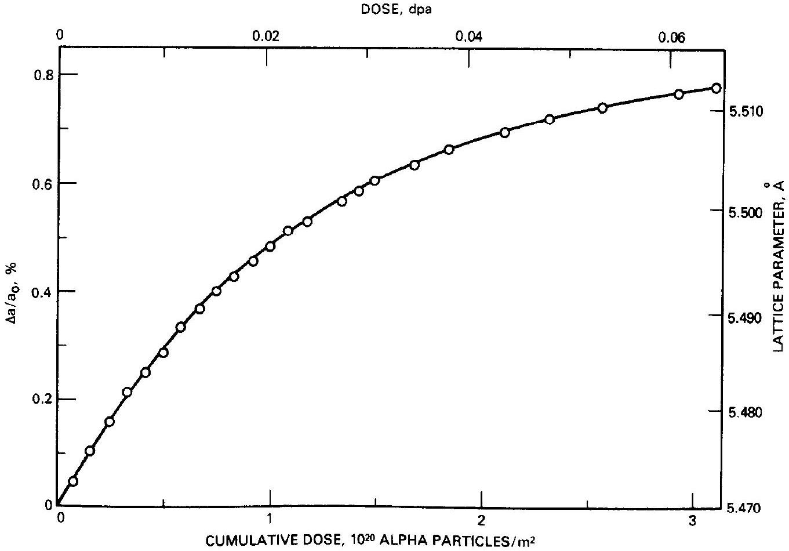
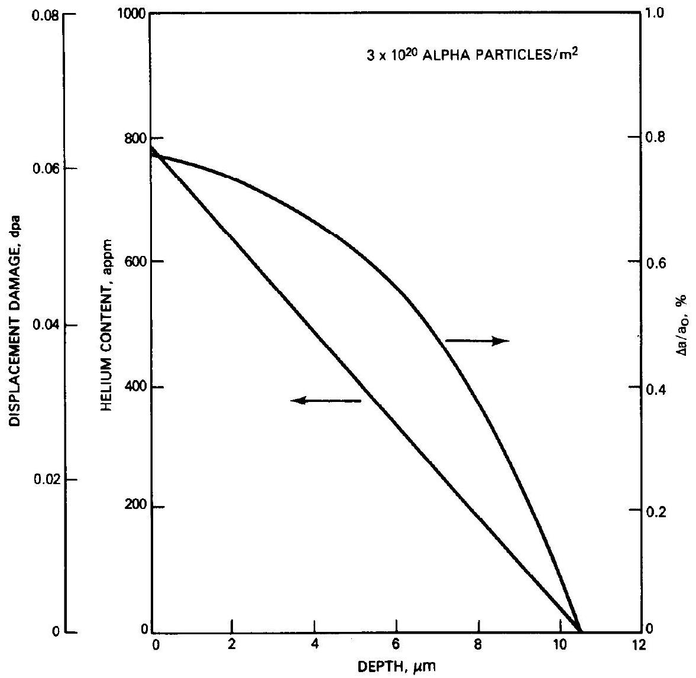
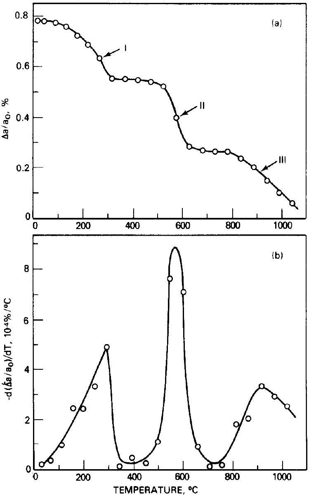
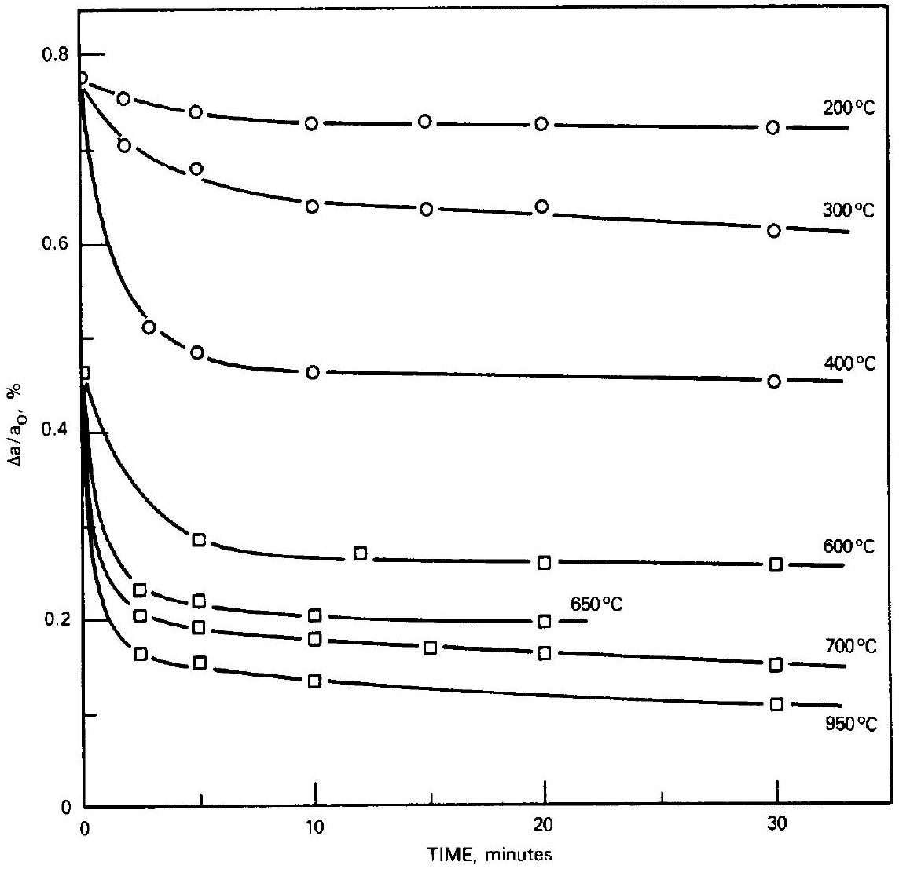
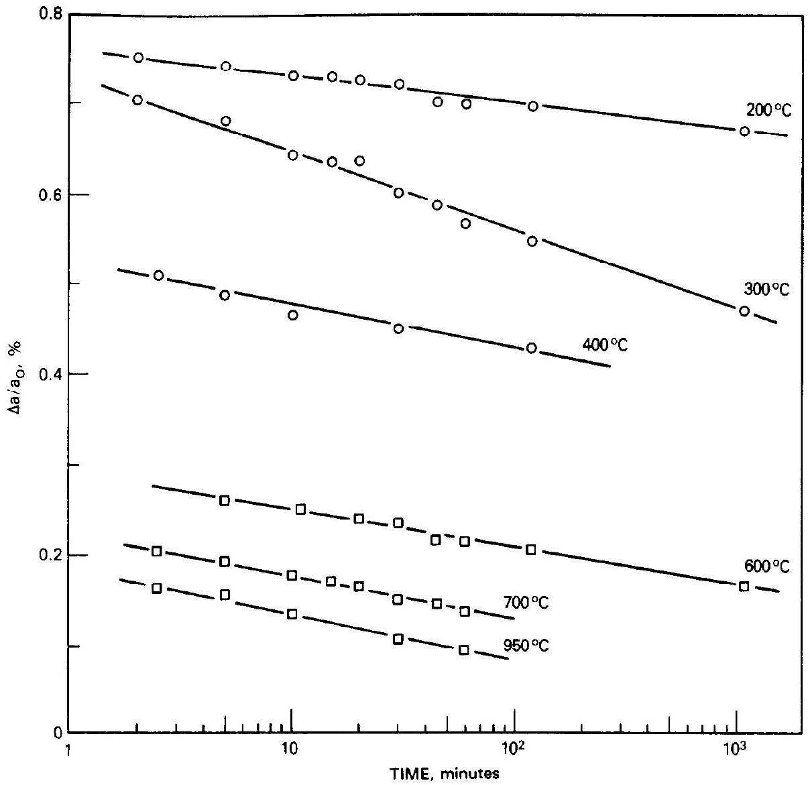
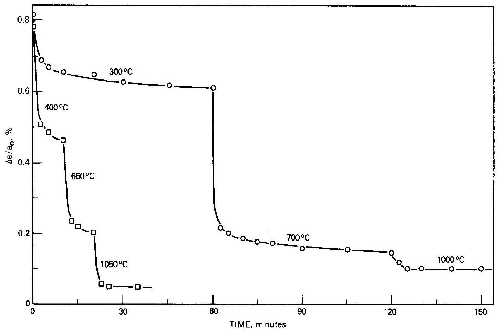
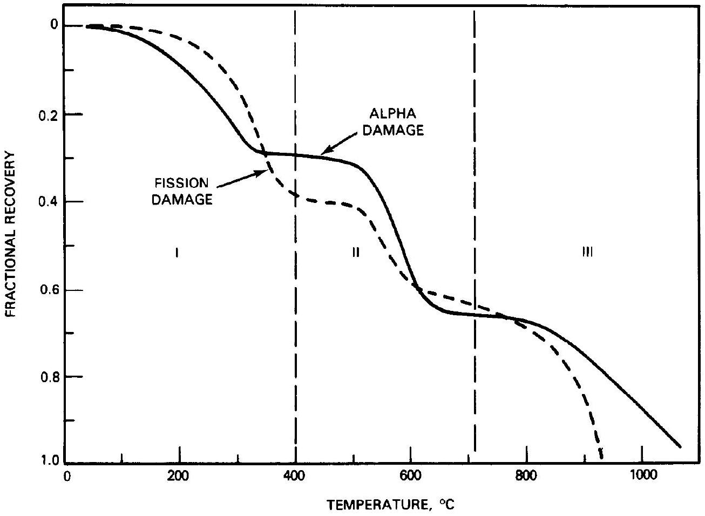

# THERMAL RECOVERY OF LATTICE DEFECTS IN ALPHA-IRRADIATED UO ${ }_{2}$ CRYSTALS * 

W.J. WEBER Pacific Northwest Laboratory, Richland, Washington 99352, USA

Received 29 June 1982; accepted 10 August 1982

#### Abstract

Isochronal and isothermal annealing have been used to study the recovery behavior of lattice defects in single crystals of stoichiometric $\mathrm{UO}_{2}$ irradiated at room temperature with alpha particles emitted from an effectively semi-infinite ${ }^{238} \mathrm{PuO}_{2}$ source to a dose of $3 \times 10^{20}$ alpha particles $/ \mathrm{m}^{2}(\sim 0.0625 \mathrm{dpa})$. Three recovery stages were observed in the temperature range between $50^{\circ}$ and $1050^{\circ} \mathrm{C}$. The activation energies were estimated and the recovery behavior of the lattice defects discussed.

## 1. Introduction

In a previously reported study [1] on the behavior of irradiation-induced lattice defects in uranium dioxide ( $\mathrm{UO}_{2}$ ), the dose-dependent changes in lattice parameter and X-ray line width were investigated in $\mathrm{UO}_{2}$ single crystals irradiated with alpha particles from an effectively semi-infinite ${ }^{238} \mathrm{PuO}_{2}$ source. In that study, the change in lattice parameter and the X-ray line broadening followed exponential ingrowth behavior over the dose range studied. A model consistent with the observed change in lattice parameter was developed, and the average number of Frenkel defect pairs produced per deposited alpha particle was determined. The effects of different damage sources on the lattice defect concentrations were also compared and the results discussed. The present investigation is concerned with the thermal recovery of the irradiation-induced lattice defects in $\mathrm{UO}_{2}$ single crystals that have been irradiated to $3 \times 10^{20}$ alpha particles $/ \mathrm{m}^{2}$. This paper describes the thermal recovery of the lattice parameter as a function of time and temperature under isochronal and isothermal annealing conditions. The discussion of these results helps to clarify the general kinetic behavior of irradiation-induced lattice defects in $\mathrm{UO}_{2}$.

Several other investigators have studied the thermal recovery of fission-induced lattice expansions in $\mathrm{UO}_{2}$. Wait [2] investigated the recovery of the lattice parameter in both single crystal and polycrystalline $\mathrm{UO}_{2}$ irradi-

[^0]ated to different fission doses. The single crystal results show three annealing stages and complete recovery of the lattice parameter by $1000^{\circ} \mathrm{C}$; whereas the polycrystalline material exhibits only two annealing steps and retains a small dilation to $1000^{\circ} \mathrm{C}$. The polycrystalline results of Wait [2] are in broad agreement with the results of Bloch [3] and Nakae et al. [4,5], who also observed only two stages in the recovery of fission-induced lattice expansions in polycrystalline $\mathrm{UO}_{2}$. Nakae et al. [5] also measured the thermal recovery of fissioninduced density changes and observed that the recovery behavior of both lattice parameter and density almost correponded to each other.

## 2. Experimental

### 2.1. Irradiated crystals

The $\mathrm{UO}_{2}$ single crystals in this study were irradiated with alpha particles ( $E_{\max }=5.5 \mathrm{MeV}$ ) emitted isotropically from an effectively semi-infinite ${ }^{238} \mathrm{PuO}_{2}$ source. The outer circumferential region of each crystal face was covered with a $50-\mu \mathrm{m}$-thick aluminum mask which shielded the area from irradiation, thereby providing a reference standard during the course of both the ingrowth study [1] and the postirradiation recovery study reported here. A $5-\mu \mathrm{m}$ aluminum cover foil protected the irradiated surface from contamination by the ${ }^{238} \mathrm{PuO}_{2}$ source. The specimen preparation techniques and irradiation conditions are more fully described elsewhere [1].

Several crystals were irradiated to an incident alpha-

Fig. 1. The change in lattice parameter as a function of dose in $\mathrm{UO}_{2}$ single crystals irradiated with alpha particles from an effectively semi-infinite ${ }^{238} \mathrm{PuO}_{2}$ source.

particle dose of $\sim 3 \times 10^{20}$ alpha particles $/ \mathrm{m}^{2}(0.0625$ dpa calculated at the surface). The fractional change in the lattice parameter, $\Delta a / a_{0}$, of one crystal, as shown in fig. 1, was measured as a function of alpha-particle dose, $D_{\alpha}$, and was found to follow an exponential relation described by the following expression:

$$
\Delta a / a_{0}=0.84 \%\left[1-\exp \left(-0.85 D_{\alpha} \times 10^{-20} \mathrm{~m}^{2}\right)\right] .
$$

The results in fig. 1 may alternatively be expressed in terms of the number of displacements per atom, dpa, by the following relation:

$$
\Delta a / a_{0}=0.84 \%[1-\exp (-41 \times \mathrm{dpa})] .
$$

This type of exponential behavior is predicted by the model that was presented previously [1]. Although the specimens were not irradiated to saturation, the lattice parameter change in all specimens attained a value of $\sim 0.8 \%$ at the end of irradiation.

The helium content and displacement damage as a function of depth at the completion of the irradiations can be estimated. As discussed previously [1], the helium content, $C_{\alpha}(x)$, as a function of depth, $x$, in the irradia-
ted specimens is a linear profile given by

$$
\begin{array}{ll}
C_{\alpha}(x)=\left(2 D_{\alpha} / R_{\mathrm{t}}\right)\left(1-x / R_{\mathrm{t}}\right), & 0 \leqslant x \leqslant R_{\mathrm{t}}, \\
C_{\alpha}(x)=0, & x \geqslant R_{\mathrm{t}},
\end{array}
$$

where $R_{\mathrm{t}}$ is the maximum range of the alpha particles in the target material. Under the experimental conditions employed in this study, the maximum energy of the alpha particles penetrating the $5-\mu \mathrm{m}$ aluminum cover foil is $\sim 5.0 \mathrm{MeV}$, and $R_{\mathrm{t}}$ is calculated to be $10.48 \mu \mathrm{~m}$ based on the range-energy relationship derived by Nitzki and Matzke [6] for alpha particles in $\mathrm{UO}_{2}$. The displacement damage, in units of dpa, was also shown to be given by the expression

$$
\operatorname{dpa}(x)=N_{\mathrm{d}} C_{\alpha}(x) / N_{\mathrm{t}},
$$

where $N_{\mathrm{d}}$ is the average number of Frenkel defect pairs produced per deposited alpha particle and $N_{t}$ is the lattice atom density of the target. The value of $N_{\mathrm{d}}$ was experimentally determined to be $\sim 80$ in the previous study. The helium content and displacement damage as a function of depth in the $\mathrm{UO}_{2}$ single crystals after irradiation to $3 \times 10^{20}$ alpha particles $/ \mathrm{m}^{2}$ are shown in

Fig. 2. The calculated helium content, displacement damage, and change in lattice parameter as a function of depth in a $\mathrm{UO}_{2}$ single crystal irradiated to $3 \times 10^{20}$ alpha particles $/ \mathrm{m}^{2}$.

fig. 2. The change in lattice parameter as a function of depth can be calculated based on eqs. (2), (3), and (4) and is also given in fig. 2.

### 2.2. Annealing technique

In order to investigate the kinetics of lattice defect recovery, isochronal and isothermal anneals of the irradiated crystals were carried out in an $\mathrm{Ar}-4 \% \mathrm{H}_{2}$ atmosphere which maintained the stoichiometry at $\mathrm{UO}_{2.00}$. One crystal was selected for isochronal annealing and was annealed at $50^{\circ} \mathrm{C}$ intervals for 30 min over the temperature range from $50^{\circ}$ to $1050^{\circ} \mathrm{C}$. The remaining crystals underwent isothermal and isothermal-step annealing at several temperatures between $200^{\circ}$ and $1050^{\circ} \mathrm{C}$ for times ranging from 2 min to 18 h . The annealing temperatures were controlled to within $\pm 5^{\circ} \mathrm{C}$,
and the recovery of the lattice parameter with each annealing step was determined after cooling to room temperature.

### 2.3. Procedures

The change in lattice parameter was determined from X-ray diffraction data obtained using a G.E. XRD-5 diffractometer, upgraded with Diano Series 8000 detector electronics, and employing copper $\mathrm{K}_{\alpha}$ radiation. Diffraction data from both irradiated and unirradiated (masked) regions of each crystal face were obtained simultaneously, as described in detail elsewhere [1]. The unirradiated region was assumed to represent preirradiation conditions. Since the crystals were aligned with (111) irradiated faces, the calculation of the lattice parameter change was carried out using the high angle
(333) reflection, which was fully resolved into $\mathrm{K}_{\alpha_{1}}$ and $\mathbf{K}_{\alpha_{2}}$ components and provided greater resolution ( $\pm 0.0001 \AA$ ) than either the (111) or (222) reflections.

As discussed previously [1], the gradient in $\Delta a / a_{0}$ with depth (fig. 2) contributed to an observed X-ray line broadening; however, it was not possible to establish whether this was the sole contribution to the observed broadening. Likewise, in the present investigation of thermal recovery, it was not possible to uniquely interpret the X-ray line broadening and recovery in terms of individual contributions from either changes in the gradient of $\Delta a / a_{0}$ or the formation of extended defect structures. Nonetheless, changes in the half-maximum breadth, $\Delta B$, of the (333) reflection were recorded and the results will be briefly discussed.

## 3. Results

### 3.1. Isochronal annealing behavior

The isochronal recovery of the change in lattice parameter of a $\mathrm{UO}_{2}$ single crystal irradiated to $3 \times 10^{20}$ alpha particles $/ \mathrm{m}^{2}(\sim 0.0625 \mathrm{dpa})$ is shown in fig. 3a. The lattice expansion is almost completely recovered by $1050^{\circ} \mathrm{C}$ in three stages. Although there appears to be an equal amount of recovery at each stage, the Stage II recovery appears much sharper than Stage I or Stage III recovery, suggesting that a distribution of activation energies, rather than a unique activation energy, may be associated with these stages. This is illustrated more clearly in fig. 3b where the differential isochronal recovery is plotted as a function of temperature. From fig. 3b the average temperature associated with each recovery stage, under these annealing conditions, can be determined from the position of the peak in the differential recovery curve. These characteristic temperatures are as follows: Stage I $\left(300^{\circ} \mathrm{C}\right)$, Stage II $\left(575^{\circ} \mathrm{C}\right)$ and Stage III ( $925^{\circ} \mathrm{C}$ ).

The change in the half-maximum breadth, $\Delta B$, during the isochronal annealing was not easily determined due to considerable scatter in the data; however, some general observations were possible. No significant change in $\Delta B$ was observed during Stage 1 recovery. During Stage II recovery an increase in $\Delta B$ was observed. Transmission electron microscopy (TEM) analysis was not performed on the specimen to determine if the broadening was associated with the formation of extended defects. In Stage III, a slight recovery in $\Delta B$ was observed, but not to preirradiation conditions.

Fig. 3. Isochronal (a) and differential isochronal (b) recovery in a $\mathrm{UO}_{2}$ single crystal irradiated to $3 \times 10^{20}$ alpha particles $/ \mathrm{m}^{2}$.

### 3.2. Isothermal annealing behavior

Three single crystals of $\mathrm{UO}_{2}$ irradiated to $\sim 3 \times 10^{20}$ alpha particles $/ \mathrm{m}^{2}$ underwent isothermal annealing at three different temperatures in the Stage I regime. In addition, four crystals were given a 30 -minute anneal at $400^{\circ} \mathrm{C}$ prior to higher-temperature isothermal anneals, allowing the high temperature (mainly Stage II) recovery to be studied in the absence of Stage I recovery. The isothermal recoveries of the change in lattice parameter are shown in fig. 4 on a linear time scale for the short time data ( $<30 \mathrm{~min}$ ) and in fig. 5 on a logarithmic time scale for data extending to 18 h . Stage I recovery is not apparent in the $200^{\circ} \mathrm{C}$ data, is relatively gradual at $300^{\circ} \mathrm{C}$ over very long times, and occurs very rapidly at $400^{\circ} \mathrm{C}$. Stage II recovery is very rapid at

Fig. 4. Isothermal recovery at short times in $\mathrm{UO}_{2}$ single crystals irradiated to $3 \times 10^{20}$ alpha particles $/ \mathrm{m}^{2}$.

all the temperatures chosen $\left(600^{\circ}, 650^{\circ}, 700^{\circ}\right.$, and $950^{\circ} \mathrm{C}$ ). Stage III may also be partially contributing to the recovery observed at $950^{\circ} \mathrm{C}$.

The nearly linear recovery behavior with log time in fig. 5, which has also been observed in $\mathrm{PuO}_{2}$ [7], suggests that the kinetic processes controlling recovery are distributed in activation energy, as discussed in detail by Primak [8-10]. The slopes in fig. 5 are proportional to the product of the activation-energy distribution function and the absolute temperature. Although the data are very limited and the complete activation-energy spectrum (distribution) cannot be determined, some features can be described. The approximately constant slope at all temperatures, except $300^{\circ} \mathrm{C}$, in fig. 5 suggests that the distribution function is in general inversely proportional to the absolute temperature and, hence, to the activation energy. The larger continuous slope in the $300^{\circ} \mathrm{C}$ data indicates a somewhat broad peak in the activation-energy spectrum that corresponds
to Stage I recovery. That portion of the activation-energy spectrum which corresponds to Stage II recovery lies between those portions of the spectrum determined by the $400^{\circ}$ and $600^{\circ} \mathrm{C}$ data in fig. 5 and, therefore, details of its shape cannot be determined. Similarly, the portion of the activation energy spectrum corresponding to Stage III recovery probably lies beyond that determined by the data in fig. 5.

The data represented in figs. 4 and 5 can also be analyzed by the conventional method of cross-cut [11] to determine the activation energies for Stage 1 and Stage II recovery. The mean activation energies determined by such an analysis are $1.5( \pm 0.1) \mathrm{eV}$ and 2.2 $( \pm 0.2) \mathrm{eV}$ for Stage I and Stage II, respectively. If the method of analysis developed by Primak [8 10] is applied to the data in fig. 5, then the frequency factor, $B$ (defined by Primak), for $\mathrm{UO}_{2}$ is calculated to be $\sim 10^{10} s^{-1}$ and the peak in the activation-energy spectrum corresponding to Stage I recovery is centered about 1.5

Fig. 5. Isothermal recovery at long times in $\mathrm{UO}_{2}$ single crystals irradiated to $3 \times 10^{20}$ alpha particles $/ \mathrm{m}^{2}$.

Fig. 5. Isothermal recovery at long times in $\mathrm{UO}_{2}$ single crystals irradiated to $3 \times 10^{20}$ alpha particles $/ \mathrm{m}^{2}$.

eV and has a width of $\sim 0.3 \mathrm{eV}$. Furthermore, if the frequency factor is assumed to be constant for all three stages, then the mean activation energy, $E_{0}$, corresponding to the temperature for maximum recovery in each stage under isochronal annealing (fig. 3b) can be estimated from the following expression [8]:

$$
E_{0}=k T \ln (B t)
$$

where $t$ is time ( 30 min ), $k$ is the Boltzmann constant, and $T$ is the absolute temperature. The mean activation energies calculted using eq. (5) and the temperatures determined from fig. 3b are $1.5,2.2$, and 3.1 eV for Stage I, Stage II, and Stage III, respectively.

Two $\mathrm{UO}_{2}$ single crystals, also irradiated to $3 \times 10^{20}$ alpha particles $/ \mathrm{m}^{2}$, were isothermally step annealed at different times and temperatures. The resulting data, shown in fig. 6, can be analyzed by the conventional ratio of slopes method [11] to determine the activation energies for Stages II and III. Although this method is not very accurate and more intermediate steps should have been taken, an analysis of the data yields an activation energy of $2.0( \pm 0.2) \mathrm{eV}$ for Stage II and an activation energy of $3.0( \pm 0.2) \mathrm{eV}$ for Stage III, in agreement with the results and calculations above.

## 4. Discussion

Irradiation-induced defects are generally considered to be of two types: lattice-point defects and extendeddefect clusters. As discussed in the previous paper [1], the irradiation-induced defects in the $\mathrm{UO}_{2}$ single crystals in this study are mostly of the lattice-point-defect type represented by interstitial atoms and vacancies on both the cation and anion sublattices. Thermal recovery of these lattice-point defects can have different effects. Recombination of point defects would be accompanied by only the recovery of the lattice parameter. Point-defect annihilation at defect sinks (surfaces, grain boundaries, dislocations, gas bubbles, etc.) or the clustering of point defects would result not only in the recovery of the lattice parameter but could also result in associated X-ray line broadening and extended defects which may be observable by TEM analysis.

The three isochronal recovery stages observed in the alpha-irradiated $\mathrm{UO}_{2}$ single crystals correspond very well with the recovery stages observed in fissiondamaged $\mathrm{UO}_{2}$ single crystals. This is illustrated in fig. 7 which compares the fractional recovery, after 24 -hour anneals, of fission-damaged $\mathrm{UO}_{2}$ single crystals irradia-

Fig. 7. Fractional recovery for both alpha-damaged (this study) and fission-damaged (Ref. [2]) $\mathrm{UO}_{2}$ single crystals.

ted to $5 \times 10^{22}$ fissions $/ \mathrm{m}^{2}$ [2] ( $\Delta a / a=0.1$ ) with the fractional recovery of alpha-damaged crystals ( $\Delta a / a_{0}=$ 0.8 ). (The dose of $5 \times 10^{21}$ fissions $/ \mathrm{m}^{2}$ corresponds to the peak in the lattice expansion curve determined by Wait [2]). These results clearly show that, although the magnitude of the lattice expansion in alpha- and fission-damaged $\mathrm{UO}_{2}$ is different [1], the recovery of the lattice expansion occurs by similar mechanisms independent of any difference in irradiation-induced microstructures which may be present. The recovery stages are, therefore, probably occurring as a result of the migration and annealing of individual lattice defect species by recombination, clustering, or annihilation at sinks. The slight shift to lower temperatures of Stage II and Stage III recovery in the fission-damaged data is probably a result of the longer anneal times used.

Although no direct information is available from this study to establish which defect is associated with each recovery stage, Nakae et al. [5] have suggested that the Stage I recovery is due to the migration of oxygen vacancies, while others $[12,13]$ have attributed it to the migration of oxygen interstitials. The Stage II recovery has been attributed by several authors [5,12,13] to the migration of uranium vacancies. The third recovery stage (Stage III) has not been generally observed except in studies of irradiated single crystals.

It is surprising, with all the studies that have been conducted on $\mathrm{UO}_{2}$, that there is still no consensus on the defects and activation energies associated with the various recovery stages. The problem has been that, unlike metals, ceramic oxides have more than one atomic species present and there is generally no direct measurement to determine on which sublattice the defects move and annihilate for a given recovery stage. The present state of knowledge on the recovery stages and activation energies in $\mathrm{UO}_{2}$ are summarized in table 1 , along with their interpretations. The interpretations are generally

Table 1
Previously observed recovery stages in irradiated $\mathrm{UO}_{2}$
| Temperature   $\left({ }^{\circ} \mathrm{C}\right)$ | Activation   energy $(\mathrm{eV})$ | Attributed   defect | Reference |
| :--- | :--- | :--- | :--- |
| $<490$ | $0.1-0.4$ | U-interstitial | 14 |
| $100^{\circ}-400$ | $0.9-1.4$ | O-interstitial | $12,13,15$ |
|  |  |  | 16,17 |
| $580^{\circ}-750$ | $2.0-2.4$ | U-vacancy | $12,13,15$ |
| $700^{\circ}-850$ | $1.7-2.8$ | O-vacancy | 12,13 |

based on careful analyses of recovery data from quenched and irradiated specimens of both stoichiometric and hyperstoichiometric $\mathrm{UO}_{2}[12,13,15,17]$ and selfdiffusion data in hyperstoichiometric $\mathrm{UO}_{2}$ [16].

Based on the information in table 1 and the characteristic temperatures and activation energies determined above, it is possible to speculate on the nature of the recovery stages observed in the alpha-irradiated $\mathrm{UO}_{2}$ single crystals of this study. The Stage I recovery is interpreted as corresponding to oxygen-interstitial migration since the data in table 1 on oxygen interstitials is fairly well established. The temperature and activation energy for Stage II recovery agrees fairly well with the data in table 1 for uranium-vacancy migration; furthermore, most oxygen vacancies in the lattice should annihilate by recombination with the mobile oxygen interstitials during Stage I recovery. Therefore, Stage II recovery is tentatively interpreted as associated with the migration of the uranium vacancy. It might be suggested that Stage III is a result of oxygen-vacancy migration; however, the temperature and activation energy for Stage III recovery differ somewhat from the data for oxygen-vacancy migration in table 1. In addition, the majority of the oxygen vacancies (as noted above) should recombine with oxygen interstitials during Stage I, and Stage III is observed only in single crystals, suggesting a mechanism other than the migration of simple lattice defects. Stage III recovery may possibly be the result of helium, trapped in vacancies, being released via the migration or dissociation of the vacancy-helium complexes. Although gas-release measurements were not performed on these specimens, this speculative interpretation is supported by the studies of Cavalera et al. [18-20], who observed in constant-heat-ing-rate experiments that the major gas-release peak in helium-implanted $\mathrm{UO}_{2}$ single crystals occurred at $\sim 1000^{\circ} \mathrm{C}$ with an activation energy of $3-4 \mathrm{eV}$. Their results show that this peak is absent in sintered $\mathrm{UO}_{2}$, where major helium release occurs at lower temperatures due to the presence of grain boundaries and residual pores. (They also reported similar behavior for other implanted inert gases; consequently, Stage III recovery in fission-damaged $\mathrm{UO}_{2}$ single crystals [2] may also be associated with inert-gas release.) It is impossible to speculate on which sublattice the vacancy-helium complexes may reside and migrate. Most likely, both sublattices may be involved, possibly as a Schottky trio [21]. The data corresponding to the recovery stages in alpha-irradiated $\mathrm{UO}_{2}$ single crystals and their interpretation are summarized in table 2.

Obviously, there is still considerably more work to be done in this area to completely define the recovery

Table 2
Recovery behavior in alpha-irradiated $\mathrm{UO}_{2}$ single crystals
| Recovery   Stage | Characteristic   temperature   $\left({ }^{\circ} \mathrm{C}\right)^{\text {a) }}$ | Activation   energy $(\mathrm{eV})$ | Tentative   interpre-   tation |
| :--- | :--- | :--- | :--- |
| I | 300 | 1.5 | O-interstitial |
| II | 575 | 2.2 | U-vacancy |
| III | 925 | 3.1 | Vacancy-   helium   complexes |

${ }^{\text {a) }}$ For 30 -minute isochronal anneals.
mechanisms. Future work involving TEM and optical spectroscopy will be directed toward better defining the recovery behavior.

## 5. Conclusions

The thermal recovery of irradiation-induced lattice defects in $\mathrm{UO}_{2}$ single crystals, irradiated at room temperature and low doses ( 0.065 dpa ) with alpha particles to near damage saturation ( $\Delta a / a_{0}=0.8 \%$ ), occurs in three stages. The first stage occurs with an activation energy of $\sim 1.5 \mathrm{eV}$ and is interpreted as being associated with oxygen-interstitial migration. The second stage has an activation energy of $\sim 2.2 \mathrm{eV}$ and is tentatively associated with the migration of the uranium vacancy. The third recovery stage with an activation energy of $\sim 3.1 \mathrm{eV}$ is speculated to be due to helium release through the migration or dissociation of vacancy-helium complexes.

The isochronal recovery behavior of both alphairradiated $\mathrm{UO}_{2}$ single crystals and fission-damaged $\mathrm{UO}_{2}$ single crystals almost correspond to each other. This indicates similar recovery processes occurring though the maximum damage states, as respresented by the change in lattice parameters, differ by almost an order of magnitude.

## Acknowledgment

The author would like to thank Dr. R.P. Turcotte for his valuable comments and discussions concerning this work and G.D. Maupin for technical assistance in the experimental work.

## References

[1] W.J. Weber, J. Nucl. Mater. 98 (1981) 206.
[2] E. Wait, cited in: B.T. Bradbury and B.R.T. Frost, Studies in Radiation Effects on Solids, Ed. G.J. Dienes, Vol. 2, (Gordon and Breach, New York, 1967) p 177.
[3] J. Bloch, J. Nucl. Mater. 3 (1961) 237.
[4] N. Nakae, A. Harada, T. Kirihara and S. Nasu, J. Nucl. Mater. 71 (1978) 314.
[5] N. Nakae, Y. Iwata and T. Kirihara, J. Nucl. Mater., 80 (1979) 314.
[6] V. Nitzki and Hj. Matzke, Phys. Rev. B8 (1973) 1894.
[7] R.P. Turcotte and T.D. Chikalla, Radiation Effects 19 (1973) 99.
[8] W. Primak, Phys. Rev. 100 (1955) 1677.
[9] W. Primak and H. Szymanski, Phys. Rev. 101 (1956) 1268.
[10] W. Primak, J. Appl. Phys. 31 (1960) 1524.
[11] A.C. Damask and G.J. Dienes, Point Defects in Metals, Ch. 3 (Gordon and Breach, New York, 1963) p. 145.
[12] H. Blank, in: Plutonium and Other Actinides, Eds. H. Blank and R. Lindner (North-Holland Publishing Co., Amsterdam, 1976) p. 873.
[13] D. Vollath, in: Plutonium and Other Actinides, Eds. H. Blank and R. Lindner (North-Holland Publishing Co., Amsterdam, 1976) p. 843.
[14] J. Soullard, French Commissariat à l'Energie Atomique Report, CEA-R-4882 (1977).
[15] P. Nagels, W. Van Lierde, R. DeBatist, M. Denayer, L. De Jonghe and R. Gevers, Thermodynamics, Vol. II (IAEA, Vienna, 1966) p. 311.
[16] W. Breitung, J. Nucl. Mater., 74 (1978) 10.
[17] Hj. Matzke, in: Plutonium and Other Actinides, Eds. H. Blank and R. Lindner (North-Holland Publishing Co.. Amsterdam, 1976) p. 801.
[18] A. Cavaleru and F. Vasiliu, in: Proc. 6th Intern. Vacuum Congr., 1974, Japan J. Appl. Phys. Suppl. 2, Pt. 1 (1974) 339.
[19] A.O.R. Cavaleru and F. Vasiliu, Rev. Romanian Phys. 19 (1974) 287.
[20] A.O.R. Cavaleru, C.M. Morley, D.G. Armour and G. Carter, Radiation Effects 18 (1973) 87.
[21] Hj. Matzke, Radiation Effects 53 (1980) 219.

[^0]:    * Work supported by the US Department of Energy, Office of Basic Energy Sciences, under Contract DE-AC06-76RLO 1830.

