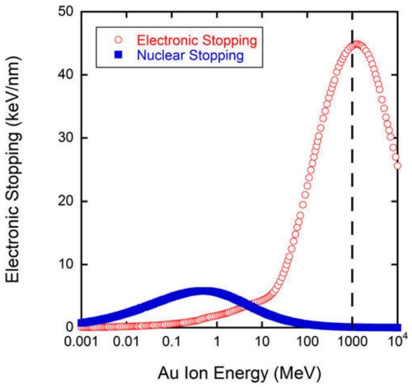
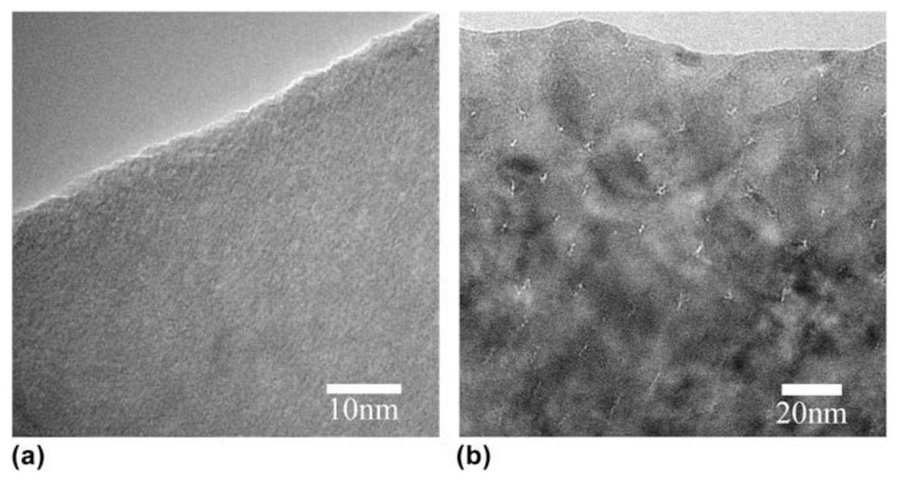
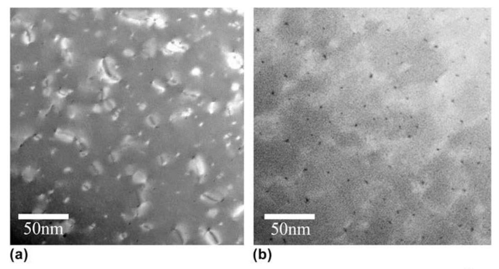
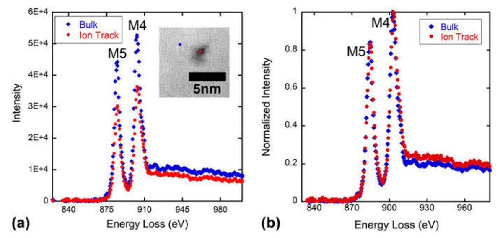
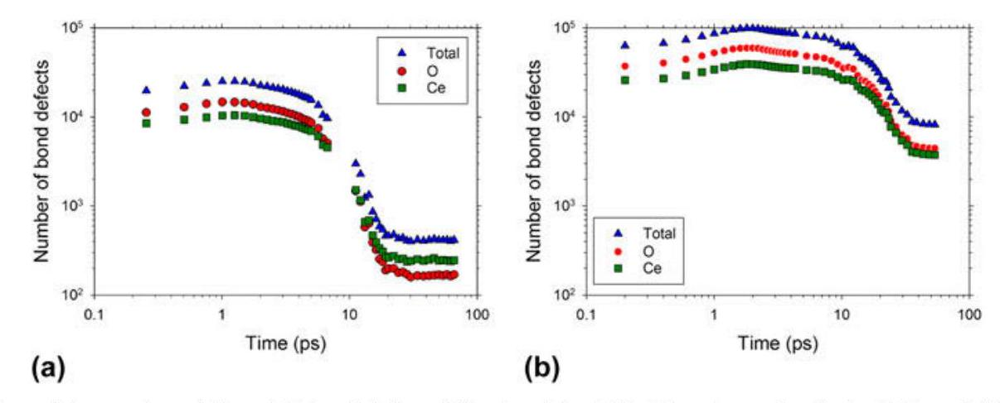
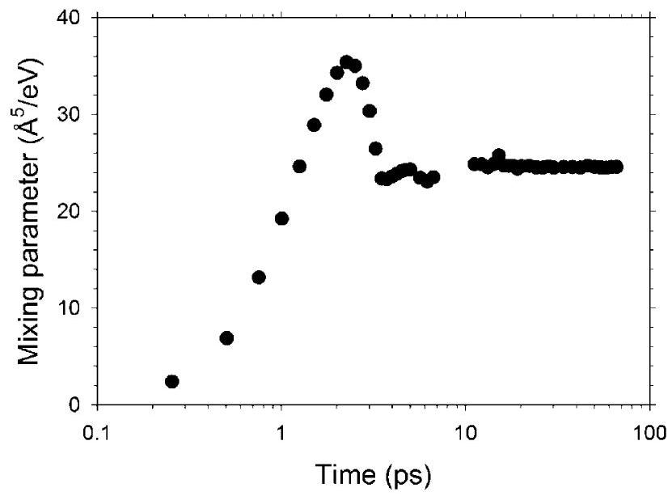
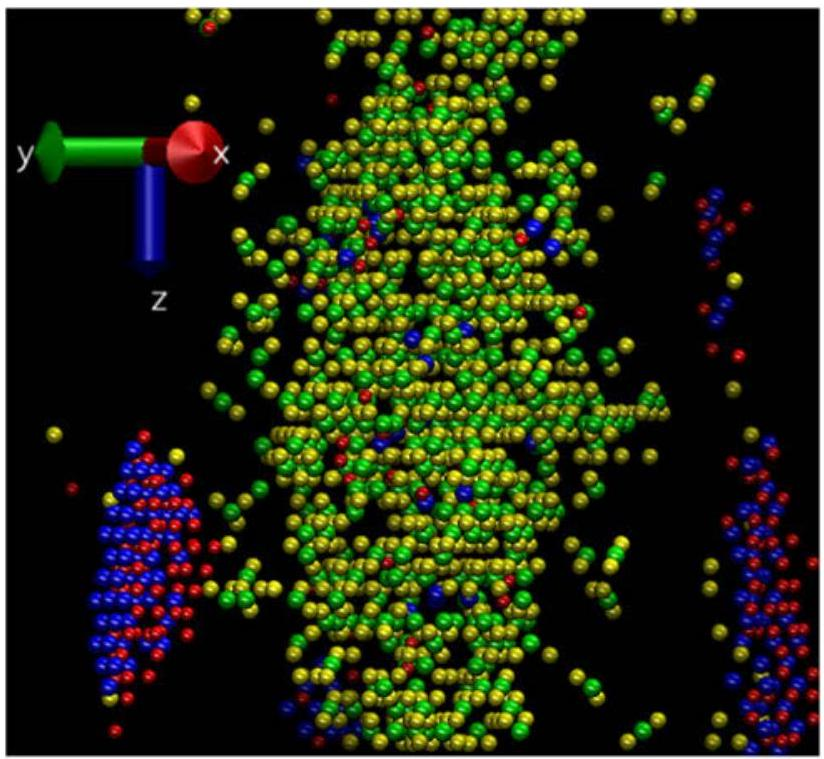
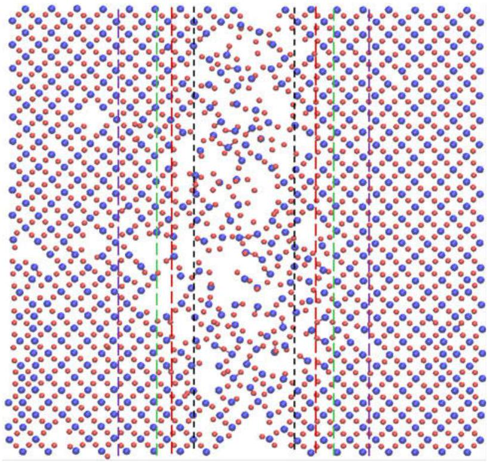
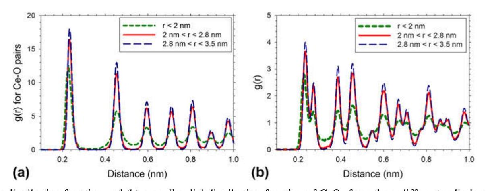

# Characterization of swift heavy ion irradiation damage in ceria 

Clarissa A. Yablinsky ${ }^{\text {a,b,d,c) }}$ Materials Science \& Technology Division, Los Alamos National Laboratory, Los Alamos, New Mexico 87545, USA Ram Devanathan ${ }^{\text {b) }}$ Nuclear Sciences Division, Pacific Northwest National Laboratory, Richland, Washington 99352, USA Janne Pakarinen ${ }^{\text {c) }}$ Fuel Materials Group, Institute for Nuclear Research Center (SCK•CEN), B-2400 Mol, Belgium Jian Gan Nuclear Fuels \& Materials Division, Idaho National Laboratory, Idaho Falls, Idaho 83415, USA Daniel Severin GSI Helmholtzzentrum, 64291 Darmstadt, Germany Christina Trautmann GSI Helmholtzzentrum, 64291 Darmstadt, Germany; and Technische Universität Darmstadt, 64287 Darmstadt, Germany Todd R. Allen Engineering Physics Department, University of Wisconsin-Madison, Madison, Wisconsin 53706, USA

(Received 10 October 2014; accepted 23 January 2015)
Swift heavy ion induced radiation damage is investigated for ceria ( $\mathrm{CeO}_{2}$ ), which serves as a $\mathrm{UO}_{2}$ fuel surrogate. Microstructural changes resulting from an irradiation with 940 MeV gold ions of $42 \mathrm{keV} / \mathrm{nm}$ electronic energy loss are investigated by means of electron microscopy accompanied by electron energy loss spectroscopy showing that there exists a small density reduction in the ion track core. While chemical changes in the ion track are not precluded, evidence of them was not observed. Classical molecular dynamics simulations of thermal spikes in $\mathrm{CeO}_{2}$ with an energy deposition of 12 and $36 \mathrm{keV} / \mathrm{nm}$ show damage consisting of isolated point defects at $12 \mathrm{keV} / \mathrm{nm}$, and defect clusters at $36 \mathrm{keV} / \mathrm{nm}$, with no amorphization at either energy. Inferences are drawn from modeling about density changes in the ion track and the formation of interstitial loops that shed light on features observed by electron microscopy of swift heavy ion irradiated ceria.

## I. INTRODUCTION

The safety and reliability of current and future generations of nuclear reactors can be advanced if the behavior of fuels and cladding materials during normal operation and accident scenarios is well understood. Nuclear fission results in fission fragments with a mass of the order of 100 amu and kinetic energy around 100 MeV . As these particles slow down, they create damage tracks in the material. Radiation damage in fuel, typically $\mathrm{UO}_{2}$, has a negative influence on thermal conductivity, ${ }^{1}$ fuel pellet integrity, ${ }^{2}$ and fission product retention. ${ }^{3}$ Examination of

[^0]nuclear fuel irradiated in a reactor suffers from the drawbacks that it usually takes a long time to accumulate damage and the fuel cannot be examined right away because of high radioactivity. There are only a few radiological facilities where nuclear fuel can be examined. Given the extensive radiological controls needed to handle irradiated $\mathrm{UO}_{2}$, there is considerable interest in the use of isostructural surrogates, such as $\mathrm{CeO}_{2}$, to understand damage evolution in nuclear fuel. ${ }^{4-8} \mathrm{CeO}_{2}$ is a known surrogate of $\mathrm{UO}_{2}$ when investigating defect behavior. However, Weber ${ }^{8}$ has shown that the radiation-induced lattice parameter changes in these two oxides are qualitatively similar but quantitatively different. Moreover, the valence states of $\mathrm{CeO}_{2}$ differ from $\mathrm{UO}_{2}$, and thus, the chemical changes due to irradiation can be different in these oxides. There is limited comparative data on swift heavy ion irradiation effects in these two oxides, which is a deficiency that this manuscript aims to address by generating such data for $\mathrm{CeO}_{2}$.

Electronic stopping is a mechanism in which target electrons are excited by the bombarding ion, creating a
dense electron cascade, which affects the lattice by producing an amorphous ion track, a trail of defect clusters, or crystalline-to-crystalline phase transformation. ${ }^{9-11}$ Fission fragment damage created within the electronic stopping regime, while traditionally studied to a lesser extent than nuclear stopping damage, still affects thermal transport, swelling, cracking, and overall fuel performance. ${ }^{1,2}$ Nuclear stopping is active when the bombarding ion directly interacts with the target nuclei, creating an atomic collision cascade and forming defects or amorphous regions. Defects can range from point defects to defect clusters. Electronic stopping dominates at high specific energies (energy deposited per unit length), while nuclear stopping dominates at low specific energies. Being based on elastic atom collisions, damage created by nuclear stopping is very efficient and occurs in any kind of material. In contrast, track formation by electronic stopping takes place predominantly in insulators and only in selected semiconducting and metallic materials. ${ }^{12-14}$ The formation of a visible track by transmission electron microscope (TEM) is dependent on both the material and the electronic energy deposited per unit track length $(\mathrm{d} E / \mathrm{d} x)$. Insulators have a much higher sensitivity to electronic stopping, with a threshold as low as $\sim 1 \mathrm{keV} / \mathrm{nm}$, whereas the threshold for metals can be as high as $50 \mathrm{keV} / \mathrm{nm} .^{12-14}$ Since the electronic energy loss scales with the square of the charge state of the projectiles, heavy ions damage more efficiently than light ions. The process of damage creation by electronic stopping is complex, because it involves several steps from initial energy deposition in the electronic subsystem to energy dissipation as heat. The description of this process is often simplified by invoking a thermal spike. ${ }^{13}$

Ion track formation is a quick process that is finalized within the first $10^{-10}$ seconds after bombardment with the incident ion. In the first $10^{-17}$ to $10^{-16}$ seconds, the energy is deposited by electronic excitation and ionization, creating a large number of "hot" electrons. In the time frame of $10^{-15}$ to $10^{-14}$ seconds, there is an electron cascade, in which energy diffuses within the electronic subsystem and the cooling of "hot" electrons takes place. Between $10^{-13}$ and $10^{-12}$ seconds, energy in the electronic system is transferred to the atoms and electronphonon interaction causes lattice heating and localized melting. Then, usually by $10^{-12}$ seconds in metals and $10^{-10}$ seconds in insulators, atomic disorder quenches and defects form. Some in-track damage mechanisms such as exciton decay to Frenkel defects may occur more slowly over the microsecond timescale. ${ }^{15}$ A more detailed description and a schematic can be found in Zhang et al. ${ }^{16}$ The short time and distance scales prevent reliable experimental characterization of these transient processes. At the same time, the high specific energies deposited and large system sizes needed to describe the process preclude the use of density functional theory
calculations. In simulations, the process described above is represented by a thermal spike that models the local heating. ${ }^{17,18}$ In this model, a localized cylinder within the structure is heated instantaneously to a temperature above the melting point and allowed to come to equilibrium with the surrounding material which is held at a constant temperature close to room temperature. ${ }^{19,20}$

In view of the relevance of $\mathrm{CeO}_{2}$ to nuclear fuel performance and safety, several studies have characterized defects produced by ion implantation in $\mathrm{CeO}_{2}$ by means of diffraction contrast imaging in a TEM. A previous experimental study ${ }^{7}$ has shown that the average diameter of ion tracks in $\mathrm{CeO}_{2}$ increases linearly with increasing irradiation energy and can be estimated based on electronic stopping power. The study investigated $\mathrm{Xe}, \mathrm{I}$, and Zr ions in the energy range of $70-210 \mathrm{MeV}(\sim 17-27 \mathrm{keV} / \mathrm{nm})$ and presented results based on bright field transmission electron microscopy (TEM) observations. ${ }^{7}$ The highest energy ion, $\mathrm{Xe}^{14+}$ at 210 MeV , produced an ion track diameter of approximately 9.3 nm . Such a large track diameter has also been observed by Sonoda et al. ${ }^{21}$ In more recent studies, ${ }^{6,22}$ examining ceria irradiated with 200 and 210 MeV Xe ions (electronic stopping of 27 and $29 \mathrm{keV} / \mathrm{nm}$, respectively) using TEM, weak beam dark field TEM, scanning transmission electron microscopy (STEM), high-angle annular dark-field (HAADF) imaging, and annular bright field imaging, a smaller track diameter of about $2-5 \mathrm{~nm}$ was found. Furthermore, it was concluded that the track diameter varies with distance from the sample surface ${ }^{6}$; crystallinity is retained in the ion track ${ }^{6,22}$; and the core of the ion track has a slightly lower density than the unirradiated material. ${ }^{22}$ The origin of the discrepancy in track sizes between the above mentioned studies ${ }^{6,7,21,22}$ is not well understood. Takaki et al. ${ }^{22}$ attribute it to a complex ion track morphology wherein a small, vacancy-rich track core is surrounded by a larger interstitial defect-rich track shell. Such a heterogeneous track morphology has been previously observed in isostructural $\mathrm{ThO}_{2}$ following swift heavy ion irradiation. ${ }^{23}$ This raises the issue of the definition of an ion track. The assumption of an abrupt boundary between a damage track and undamaged material is simplistic. The "track size" is dependent on the feature that is being recorded under a particular imaging condition and is defined as the region giving rise to the feature. Depending on the characterization technique used, the region giving rise to the observation can differ, and hence the "track size" can vary slightly between the observation techniques as well as varying with distance from the sample surface. This discrepancy creates a need for improved understanding of the track structure evolution process, density changes, and interstitial loop formation. The simulations in the present work serve this purpose.

The aim of the present work is to integrate swift heavy ion irradiation, electron microscopy, and parallel molecular dynamics (MD) simulations to understand the atomic-level details of the early stages of damage production in $\mathrm{CeO}_{2}$. The computer simulation was not intended to exactly reproduce the experimental conditions, but instead, to study damage evolution under two different stopping power scenarios and interpret experimental observations. The experimental part of this study was performed by bombarding cerium dioxide with 940 MeV gold ions, which induce very little damage due to nuclear stopping. The electronic stopping value of $42 \mathrm{keV} / \mathrm{nm}$ in the present study is higher than the value of $27 \mathrm{keV} / \mathrm{nm}$ investigated in previous experimental studies thereby extending the range of experimental observations in swift heavy ion irradiated ceria. The ion track structure seen by STEM is compared to a thermal spike model of a single ion track. The present study provides quantitative information about density changes in the ion track and surrounding regions and supports the experimental inference about lower density in the track core from previous studies. ${ }^{6,19,22,24,25}$ Such density changes have also been observed following swift heavy ion irradiation of $\mathrm{SiO}_{2} .^{24,25}$ It offers insights about ion track evolution during experimentally inaccessible time scales, defect production, and interstitial loop formation. Additionally, the inferences drawn in this paper will contribute information that can be used in future multiscale models, which traditionally do not account for electronic stopping when investigating microstructure evolution during irradiation.

## II. EXPERIMENTAL DETAILS

High purity polycrystalline bulk ceria pellets were sourced from Alfa Aesar (Ward Hill, MA). The ceria had a grain size of $5 \mu \mathrm{~m}$, a density of $6.9 \mathrm{~g} / \mathrm{cm}^{3}$, and a purity of $99.9 \%$, with the impurities listed in Table I. The pellets, 9 mm in diameter, were sectioned into 1 mm thick disks. The individual disks were polished on an Allied MultiPrep parallel polisher (Rancho Dominguez, CA ), beginning with $30 \mu \mathrm{~m}$ diamond lapping film, and continuing to decrease to $0.5 \mu \mathrm{~m}$ diamond lapping film.

Using the M branch at the Universal Linear Accelerator (UNILAC) of the Gesellschaft für Schwerionenforschung (GSI) in Darmstadt, Germany, the ceria samples were irradiated to fluences of

TABLE I. List of impurities in the 99.9\% pure $\mathrm{CeO}_{2}$ used in this study.
| Impurity | $\mathrm{Cr}_{2} \mathrm{O}_{3}$ |  |  |  |  |  |  | $\mathrm{Nd}_{2} \mathrm{O}_{3}$ |
| :--- | :--- | :--- | :--- | :--- | :--- | :--- | :--- | :--- |
| Maximum   content (ppm) | 10 | 50 | 50 | 10 | 50 | 50 | 50 | 10 |

$1 \times 10^{12}$ to $1 \times 10^{14}$ ions $/ \mathrm{cm}^{2}$ using a mean flux of $6 \times 10^{9}$ ions $/ \mathrm{s} \mathrm{cm}^{2}$. The energy of 940 MeV is equivalent to $4.77 \mathrm{MeV} / \mathrm{u}$, where u is the unified atomic mass unit of the bombarding ion. The energy of 940 MeV was chosen because the contribution from electronic stopping is very high at this energy ( $42 \mathrm{keV} / \mathrm{nm}$ ), highlighted in Fig. 1 by a dashed line, while contributions from nuclear stopping would be at a minimum. The range of 940 MeV Au ions is $\sim 32 \mu \mathrm{~m}$, thus much larger than the typical TEM sample thickness. Range as well as electronic and nuclear stopping power were calculated using the SRIM-2008 code. ${ }^{26}$ Kinchin-Pease damage calculations were used in accordance with Stoller et al., ${ }^{27}$ using the pellet density of $6.9 \mathrm{~g} / \mathrm{cm}^{3}$, and displacement threshold energies of 33 and 44 eV for O and $\mathrm{Ce},^{28}$ respectively.

After irradiation, samples were cut into 3 mm disks using an ultrasonic drill. The disks were thinned from the unirradiated side using a parallel polisher to $\sim 200 \mu \mathrm{~m}$, then dimple polished using $6 \mu \mathrm{~m}$ diamond paste to $\sim 100 \mu \mathrm{~m}$, then $1 \mu \mathrm{~m}$ diamond paste to $\sim 20 \mu \mathrm{~m}$. The disks were then ion polished from both sides using a Fischione 1010 Ar ion mill (Export, PA) in a low angle stage, resulting in a sample with a hole surrounded by an electron transparent region appropriate for viewing in TEM. Because of this procedure, it is estimated that the depth investigated by TEM was $\sim 10 \mu \mathrm{~m}$ from the irradiated surface, where the electronic stopping power is still close to $\sim 42 \mathrm{keV} / \mathrm{nm}$. A Philips CM200UT TEM in bright field mode and an FEI-Titan in STEM mode using the HAADF detector were used for imaging the

FIG. 1. Contributions from electronic and nuclear stopping in $\mathrm{CeO}_{2}$ as a function of the energy of gold ions. The energy of 940 MeV was chosen to maximize electronic stopping, indicated by the dashed line.

irradiation damage. Ion track diameter was measured by manual size determination using the ImageJ v1.44p analysis tool. ${ }^{29}$ The process involved tracing and filling in each track in the bright field TEM image in an in-focus condition and thresholding to leave only spots that represented the ion tracks. The spots are then measured using the "Analyze particles" feature, which will report the area of each "particle". The diameter was then calculated from the area measurement. More than 350 ion tracks were measured from each sample, and the number density was calculated by using the number of tracks measured in the image divided by the area interrogated, in $\mathrm{cm}^{2}$. The uncertainty of the deduced track size is equivalent to the standard deviation. Electron energy loss spectroscopy was performed on the Titan TEM, using a corrected electron optical systems (CEOS) probe aberration corrector (Heidelberg, Germany) at 300 keV aligned for a $<1 \mathrm{~nm}$ resolution. The spectra were taken in energy filtered STEM (EF-STEM) mode with 24.5 mrad convergence angle, a spectrometer energy resolution of 0.8 , and a 0.4 eV per channel dispersion. Data presented is a summation of 10 collection integrations lasting 2 s each, and then background-subtracted. Each spot was investigated once due to possible electron beam damage. However, multiple spots were investigated to assure spectrum repeatability. The sample thickness was measured using EELS and was below 0.5 of the electron inelastic mean free path ( $\lambda$ ) for all investigated spots, which assures that the sample was thin enough to give accurate results.

## III. THERMAL SPIKE MODEL DETAILS

Classical MD simulations were performed to model the effects of swift heavy ion irradiation of $\mathrm{CeO}_{2}$. The DL_POLY4 code ${ }^{30}$ was used to carry out the MD simulations and the atomic positions of the results were visualized using the VMD program. ${ }^{31}$ The simulation was initiated with ceria in the cubic fluorite structure. The simulation cells contained $2,400,000$ ions ( $100 \times 100 \times 20$ unit cells) for an energy deposition of $12 \mathrm{keV} / \mathrm{nm}$ and $11,059,200$ ions ( $160 \times 160 \times 36$ unit cells) for an energy deposition of $36 \mathrm{keV} / \mathrm{nm}$. These energy deposition values represent thermal energy deposition and are thus not directly comparable to experimental stopping power ( $\mathrm{d} E / \mathrm{d} x$ ) values. The energy deposition values were chosen to represent two different damage conditions that may be relevant to the experiment. The simulation cell was initially equilibrated in Berendsen's isothermal isobaric ensemble ${ }^{20}$ at 300 K and zero external pressure for 10 ps with a time step of 1 fs .

The potential model and parameters from the work of Sayle et al. ${ }^{32}$ were used to describe the interactions between the ions. A spline curve was used to join the Sayle potential to the Ziegler-Biersack-Littmark
potential ${ }^{26}$ to avoid unphysical attraction between the ions at close separations. The Sayle potential ${ }^{32}$ is based on Born model of the ionic solid where the ionic interaction includes long-range Coulombic terms and short-range interactions, $V(r)$, that have the following form.

$$
V\left(r_{i j}\right)=A_{i j} \exp \left(-\frac{r_{i j}}{\rho_{i j}}\right)-\frac{C_{i j}}{r_{i j}{ }^{6}},
$$

Here, $r_{i j}$ is the distance between ions $i$ and $j$, while $A_{i j}$, $\rho_{i j}$, and $C_{i j}$ are potential parameters fitted by Sayle et al. ${ }^{32}$ The ions have formal charges, i.e., +4 for Ce and -2 for O . The smooth particle mesh Ewald method ${ }^{33}$ was used to calculate the electrostatic part of the potential with a tolerance factor of $10^{-5}$.

Due to computational resource limitations, it is not feasible to directly simulate the passage of a swift heavy ion through a ceramic or the resulting electronic excitations. Instead, a thermal spike in the form of a cylinder along the shorter $Z$ axis of the cell was introduced, which coincided with the [001] crystallographic direction. The thermal spike had a Gaussian profile of kinetic energy distribution in the $X-Y$ plane with a standard deviation of 2 nm . This spike was chosen to facilitate comparison with previous simulations of swift heavy ion damage in pyrochlores ${ }^{34}$ that used a similar profile. The spike was described in detail in previous work. ${ }^{35}$ The kinetic energy of ions in the spike was increased instantaneously at time $t=0$ by assigning velocities in random directions, which correspond to energy deposition per unit length of 12 or $36 \mathrm{keV} / \mathrm{nm}$. As stated previously, these values of thermal energy deposition per unit length correspond to higher values of experimental electronic stopping, because the electron-phonon coupling efficiency in real materials is less than unity. The exact value of this efficiency is not known for ceria. After the introduction of the spike, MD simulations were performed with the constant volume constant energy ensemble for about 60 ps with variable time steps from 0.2 to 1 fs . In an effort to dissipate the deposited energy, the walls of the simulation cell were coupled, in the $X$ and $Y$ directions, over a thickness of 0.5 nm to a heat bath maintained at 300 K . These massively parallel simulations were performed with up to 1296 processors using computers at the National Energy Research Scientific Computing Center. Defects were identified based on the coordination number (CN) of the ions being different from that in the fluorite crystal. The occupation of Voronoi polyhedra centered on lattice sites was determined to identify vacancies, interstitials, and replacements. This method can be unreliable in regions of heavy damage or if there are amorphous clusters, and therefore the structure of the damaged regions was
determined by calculating radial distribution functions (RDFs) and densities from concentric cylinders centered on the thermal spike.

## IV. UNDERSTANDING IRRADIATION BEHAVIOR

Ion tracks were confirmed using bright field TEM by tilting the sample and imaging the sample in a slightly underfocused condition to check for the appearance of Fresnel contrast, a technique used in other swift heavy ion irradiation studies on $\mathrm{CeO}_{2}{ }^{6,7,22}$ Figure 2 shows a representative image from an as-received sample showing no damage during preparation and a representative image of the sample irradiated to $1 \times 10^{14}$ ions $/ \mathrm{cm}^{2}$ showing the ion tracks formed during irradiation. The tracks in the irradiated sample become shorter closer to the edge of the foil (top of the image) because of the decreasing foil thickness.

Representative substructures from samples irradiated at 940 MeV (to fluences of $1 \times 10^{12}$ and $1 \times 10^{14}$ ions $/ \mathrm{cm}^{2}$ ) are presented in Fig. 3. The ion track diameter was analyzed for both fluences and no statistical difference was found, as reported in Table II, indicating that track diameter is independent of fluence. This result is in agreement with the findings of Sonoda et al. ${ }^{7}$ given that the ion tracks were formed at the same electron stopping power, and therefore, should be the same size. The diameter of the ion tracks found in this work is similar to previous results, ${ }^{22}$ where STEM was also used for ion track observation. The number density of tracks was also calculated and is reported in Table II. In both samples, the observed number density of tracks is less than the applied fluence, which would be the expected number density without track overlapping. Using Poisson's law to determine the probability of track overlap, ${ }^{36}$ the

FIG. 2. Bright field TEM of (a) an as-received sample with no damage due to sample preparation and (b) the sample irradiated to $1 \times 10^{14}$ ions $/ \mathrm{cm}^{2}$ in a tilted condition to highlight the ion tracks. The track length decreases closer to the edge of the foil due to the foil thickness. Note the difference in scales.

FIG. 3. STEM images using the HAADF detector of the samples irradiated with 940 MeV Au ions to (a) $1 \times 10^{12}$ and (b) $1 \times 10^{14}$ ions $/ \mathrm{cm}^{2}$. Note: In HAADF, dislocations appear as white/light gray and ion tracks appear as black/dark gray spots.

probability of track overlap is 3.4 and $99.8 \%$ for $1 \times 10^{12}$ and $1 \times 10^{14}$ ions $/ \mathrm{cm}^{2}$, respectively. Yasuda et al. ${ }^{6}$ provide an interesting explanation for this observation by identifying a small core damage region visible by TEM and a larger surrounding region, i.e., influenced by the track. Previously produced tracks are erased in the latter region as a result of a recovery process related to the heterogeneous structure of the track-vacancy-rich core surrounded by interstitial-rich periphery. Consequently, the observed number fraction will be smaller than the fluence, a trend also reported in other studies. ${ }^{37}$

Dislocations were also seen in both samples, and while no dislocation analysis was done due to fracture of the samples after initial investigation, some qualitative observations can be made. For the $1 \times 10^{12} \mathrm{ion} / \mathrm{cm}^{2}$ sample, shown in Fig. 3(a), dislocation loops in a range of sizes, seen as small and large white features, have formed, and many appear to be associated with an ion track, seen as a dark dot. In the $1 \times 10^{14}$ ions $/ \mathrm{cm}^{2}$ sample, shown in Fig. 3(b), the dislocation loops have grown and coalesced into a dislocation network, light gray lines/areas, connected between the ion tracks. The result matches the expectation that continued bombardment of the sample adds disorder due to additional defects produced from the ion track, and that these defects will contribute to dislocation growth. When modeling the irradiation process, our observations indicate that the amount of atoms considered must be large enough for forming dislocations to understand all structural information.

TABLE II. Ion track diameter and number density of ion tracks for each fluence, with uncertainty, determined by TEM.
| Fluence   $\left(\right.$ ions $\left./ \mathrm{cm}^{2}\right)$ | Track diameter   $(\mathrm{nm})$ | Number density   $\left(\right.$ tracks $\left./ \mathrm{cm}^{2}\right)$ |
| :--- | :---: | :---: |
| $1 \times 10^{12}$ | $2.1 \pm 0.7$ | $1.86 \times 10^{9}$ |
| $1 \times 10^{14}$ | $2.8 \pm 1.1$ | $3.21 \times 10^{11}$ |

To further understand the structure of the ion track, EELS was performed next to an ion track in the bulk material, and within an ion track, and the results are presented in Fig. 4. EELS probes the material chemistry, specifically the reduction of cerium from $\mathrm{Ce}^{4+}$ to $\mathrm{Ce}^{3+}$, by peaks at specific energy loss values. The reduction, if present, is highlighted by (i) a decrease in energy loss of the M5 and M4 maxima, (ii) a change in the near-edge structure shapes, (iii) inversion of the M5 to M4 branching ratio, and (iv) an increase in the M5 to M4 area ratio. If the reduction is significant, these changes would be evident, as highlighted in prior work. ${ }^{38}$ For EELS investigation of our sample, there was a slight change in energy loss for the M5 and M4 maxima for the ion track of 1.2 eV less and 0.8 eV less, respectively. These changes are within the energy resolution of the spectrometer, and thus no conclusive evidence of reduction is observed. For criterion two, the shape of the curve is the same when accounting for the resolution of the spectrometer. The branching ratios, criterion three, are both 0.45 , and the area ratio, the fourth criterion, has not changed for the ion track, indicating no reduction. As an additional confirmation, if there was a reduction from $\mathrm{Ce}^{+4}$ to $\mathrm{Ce}^{+3}$, the M5 peak would broaden to the point of incorporating the near edge structure, as seen in Ref. 38, and that is not the case here. Furthermore, given the same measurement technique, the decrease in the intensity for the ion track compared to the bulk indicates a decrease in the number of atoms in the interrogated area, interpreted as a small density reduction in the ion track core.

## V. DETAIL OF ION TRACK STRUCTURE

Previous simulation work ${ }^{35}$ has shown that no stable defects are produced for thermal spikes with an energy deposition of $0.44 \mathrm{keV} / \mathrm{nm}$, while thermal spikes corresponding to $1 \mathrm{keV} / \mathrm{nm}$ merely produce two oxygen

FIG. 4. EELS results, presented as energy loss (eV) versus intensity. M5 and M4 are the specific spectra that represent Ce. (a) Original data, where decrease in intensity is likely due to a lower number of atoms within the ion track. The inset image shows the spots in which the data were taken, blue diamond: in the bulk, and red circle: in the ion track. (b) Normalized data.

Frenkel pairs. The present work examines the case of energy deposition that is one to two orders of magnitude higher. The evolution of bond defects produced by a thermal spike with an energy deposition of $12 \mathrm{keV} / \mathrm{nm}$ is shown in Fig. 5(a). A log-log scale was used because the time scale and defect count span several orders of magnitude. A Ce ion is defined as a bond defect if its CN is not 8 , and an O ion is a bond defect if its CN differs from 4. The number of defects reaches a constant value (primary damage state) within 15 ps of the introduction of the spike. About 240 Ce and 170 O bond defects are produced for a total of about 410 defects. It is important to note that bond defects can be produced by Frenkel pairs as well as by local strain. A single Ce vacancy can create eight under-coordinated O bond defects. Thus, the number of bond defects can be an overestimate of the number of Frenkel pairs. Oxygen defects outnumber Ce defects in the initial stages of the damage ( $<10 \mathrm{ps}$ ), but then this trend reverses indicating very efficient defect recovery on the oxygen sublattice. Dynamic recovery on the oxygen sublattice is well known in fluorite structured materials. ${ }^{35}$

The number of Frenkel pairs, calculated based on the occupation of Voronoi polyhedra, at the end of the thermal spike ( $\sim 66 \mathrm{ps}$ ) was about $16-20$ for Ce and 40-44 for O . The ratio of Ce Frenkel pairs to O Frenkel pairs is more or less stoichiometric. By calculating the number of ions displaced more than 0.2 nm from their original lattice site, it is observed that it is easier to knock anions out of their lattice sites than cations. After 66 ps, there were about $17,780 \mathrm{O}$ ions displaced at least 0.2 nm from their original lattice site compared to about 2700 Ce displacements. These included about 17,735 O replacements and 2685 Ce replacements. Only $0.3 \%$ of displaced ions become stable Frenkel pairs while the remaining $99.7 \%$ take part in replacement collision sequences that leave the lattice undisturbed. This remarkable dynamic defect recovery offers an explanation for the phase stability of crystalline ceria subjected to swift heavy ion irradiation. The mixing of ions in the thermal spike was studied using
the mixing parameter ${ }^{19}$ given by MSD/ $6 E$, where MSD is the mean square displacement of ions and $E$ is the energy deposited per unit volume. The evolution of the mixing parameter following a $12 \mathrm{keV} / \mathrm{nm}$ spike in $\mathrm{CeO}_{2}$ is shown in Fig. 6. The ion mixing reaches its peak at about 2 ps and attains a steady value of about $25 \AA^{5} / \mathrm{eV}$ after 15 ps . For comparison, the mixing parameter produced by a 10 keV recoil is about $4.3 \AA^{5} / \mathrm{eV}$ in Ni and $9.5-13 \AA^{5} / \mathrm{eV}$ in $\mathrm{Cu} .^{39}$ In the cases of these metals, more defects are produced and the mixing parameter is smaller. The large value of the mixing parameter for the thermal spike in ceria can be attributed to the large number of displaced ions.

Figure 5(b) shows the evolution of bond defects in ceria following a more energetic thermal spike with an energy deposition of $36 \mathrm{keV} / \mathrm{nm}$. Steady values of the number of bond defects are attained after about 35 ps . The primary damage state takes longer to develop relative to the case of the $12 \mathrm{keV} / \mathrm{nm}$ spike, because it takes more time to dissipate the larger amount of energy imparted to the system. After 54 ps , the damage state consists of 3790 Ce and 4455 O bond defects. The average CN was 6.57 for Ce bond defects and 2.90 for O bond defects, which shows considerable under-coordination. By increasing the energy deposited per unit length by a factor of 3 , the total number of bond defects has increased by a factor of 20 . At these very high values of $\mathrm{d} E / \mathrm{d} x$, there is a drastic increase in the defect production, and it is pertinent to investigate the mechanism of defect production. Moreover, the nature of the damage state is also of interest.

The Voronoi polyhedra method was used to identify vacancies and interstitials with the understanding that this method may not be optimal in regions of severe damage. Vacancy-interstitial pairs that were separated by less than 0.3 nm on each sublattice were eliminated in the analysis of defects from the spikes simulated based on the assumption that such pairs would recombine readily. The remaining defects are then referred to as surviving defects. The cut-off distance, 0.3 nm , was chosen by

FIG. 5. Time evolution of the number of Ce and O bond defects following (a) a $12 \mathrm{keV} / \mathrm{nm}$ thermal spike in $\mathrm{CeO}_{2}$ and (b) a $36 \mathrm{keV} / \mathrm{nm}$ thermal spike in $\mathrm{CeO}_{2}$.

taking a distance that is slightly larger than one-half of the unit cell length. This choice is somewhat arbitrary. Figure 7 shows an $X-Y$ projection (the thermal spike runs vertically) of the resulting defect distribution from a $9 \mathrm{~nm} \times 9 \mathrm{~nm} \times 9 \mathrm{~nm}$ volume centered on the $36 \mathrm{keV} / \mathrm{nm}$ spike. The figure shows only the surviving defects. The core of the thermal spike (swift heavy ion track) is enriched in vacancy clusters while the periphery is enriched in interstitial clusters. Isolated vacancies and interstitials as well as small clusters are present in

FIG. 6. The evolution of the mixing parameter following a $12 \mathrm{keV} / \mathrm{nm}$ thermal spike in $\mathrm{CeO}_{2}$.

FIG. 7. Orthographic projection of primary damage state from a $9 \mathrm{~nm} \times 9 \mathrm{~nm} \times 9 \mathrm{~nm}$ volume centered on a track following an energy deposition of $36 \mathrm{keV} / \mathrm{nm}$ in $\mathrm{CeO}_{2}$ at about 60 ps after thermal spike introduction. Ce vacancies, O vacancies, Ce interstitials, and O interstitials (vacancies have larger radii than interstitials) are shown in green, yellow, blue, and red, respectively. The ion trajectory is along the $Z$-axis (vertical direction).

addition to the large vacancy and interstitial clusters that are evident. Among the surviving defects, the average distance from an O interstitial to the nearest O vacancy was $0.82 \pm 0.77 \mathrm{~nm}$. The corresponding interstitial-vacancy separation for Ce was $1.63 \pm 0.62 \mathrm{~nm}$. The total number of Frenkel pairs produced after 50 ps was about 3980 . This number is much higher than the 60 Frenkel pairs produced for the $12 \mathrm{keV} / \mathrm{nm}$ spike. Time and temperature will drive defect migration leading to defect annihilation or defect clustering leading to the microstructural features observed by electron microscopy. It is interesting to note that O defects consistently outnumber Ce defects in keeping with the stoichiometry. The highly efficient anion sublattice recovery, evident for the lower energy deposition per unit length (Fig. 5), is not seen here.

To get further insights into the structure of the primary damage state, the simulation cell was cut normal to the $X$-axis or [100] direction (see Fig. 7 for axes) into slices of thickness equal to one-half the lattice constant. Such a slice will typically contain a cation layer and an anion layer. Figure 8 shows an orthographic projection of such a (100) slice from the primary damage state of $\mathrm{CeO}_{2}$ subjected to a $36 \mathrm{keV} / \mathrm{nm}$ thermal spike, which is oriented vertically in this figure. The track consists of a vacancyrich core surrounded by an interstitial-rich peripheral region. This structure is considerably different from the damage state produced by a $12 \mathrm{keV} / \mathrm{nm}$ spike because a larger number of clustered defects is produced for the

FIG. 8. Orthographic projection showing the ions of two atomic layers in $\mathrm{CeO}_{2}$ at 54 ps after the deposition of $36 \mathrm{keV} / \mathrm{nm}$ thermal energy. $\mathrm{Ce}^{4+}$ and $\mathrm{O}^{2-}$ ions are shown as blue and red spheres, respectively. The area shown measures $\sim 9.7 \times 9.7 \mathrm{~nm}$. Vertical lines have been superimposed to show diameters of 2, $2.8,3.5$, and 5 nm centered on the ion track along the vertical direction. The heat is dissipated horizontally (from the center).

$36 \mathrm{keV} / \mathrm{nm}$ spike. The density was calculated within concentric cylinders centered on the ion track for radius $<2 \mathrm{~nm}, 2 \mathrm{~nm}<$ radius $<2.8 \mathrm{~nm}, 2.8 \mathrm{~nm}<$ radius $<3.5 \mathrm{~nm}$, and $3.5 \mathrm{~nm}<$ radius $<5 \mathrm{~nm}$. The density of these regions was $6.19,6.73,6.82$, and $7.26 \mathrm{~g} / \mathrm{cm}^{3}$, respectively. For comparison, the density of perfect crystal $\mathrm{CeO}_{2}$ in our simulation was $7.13 \mathrm{~g} / \mathrm{cm}^{3}$. This indicates that the ion track is crystalline, but is vacancy rich and has a density about $13 \%$ less than that of the perfect crystal. Progressing radially outward from the core of the track of radius 2 nm , the density gradually increases. For a radius between 3.5 and 5 nm from the center of the track, the density is about $2 \%$ higher than that of the perfect crystal due to the presence of interstitial clusters. Recently, Yasuda et al. ${ }^{6}$ performed electron microscopy studies of swift heavy ion irradiated $\mathrm{CeO}_{2}$. The ceria samples were irradiated with up to 210 MeV Xe ions (electronic stopping of $27 \mathrm{keV} / \mathrm{nm}$ ) to a fluence of up to $1 \times 10^{16}$ ions $/ \mathrm{cm}^{2}$, which is higher than the fluence presented in this work. In the Yasuda samples, Fresnel contrast was observed with 3 nm diameter ion tracks, and at these higher fluences, the dislocation networks continued to evolve and subgrains were formed. The authors attributed the Fresnel contrast to a decrease in atomic density at the track core, while the subgrain formation was attributed to the creation and accumulation of interstitials during electronic excitation damage. A more recent study by Takaki et al. ${ }^{22}$ arrived at similar conclusions following 200 MeV Xe irradiation of ceria. The atomistic modeling presented in this work provides quantitative information to support the explanations advanced by these experimental studies.

The $\mathrm{Ce}-\mathrm{O}$ pair distribution function and the overall RDF were calculated from cylinders centered on the thermal spike for radius $<2 \mathrm{~nm}, 2 \mathrm{~nm}<$ radius $<2.8 \mathrm{~nm}$, and $2.8 \mathrm{~nm}<$ radius $<3.5 \mathrm{~nm}$. These plots are presented in Figs. 9(a) and 9(b), respectively. One can clearly see that ceria peaks are present for the regions in the ion track core as well as peripheral regions, indicating crystallinity. The peak height increases as we move away from the
core, because the density increases. Our findings are similar to the RDFs obtained by Sasajima et al. ${ }^{40}$ in atomistic simulations of a $1.2 \mathrm{keV} / \mathrm{nm}$ thermal spike in $\mathrm{UO}_{2}$. The final RDFs are similar to the findings in this paper, where the peaks from the peripheral regions are higher than the peaks from the damage core. Sasajima et al. ${ }^{40}$ were unable to compare this result to a density measurement because they did not have defect structure information, but the similarity is worth mentioning since the materials and electronic stopping values were different but the simulations produced similar results.

## VI. MODEL VALIDATION AND EXPERIMENT COMPARISON

The density variation calculated in the model can be carefully compared to the experimental results of the ion track. The ion tracks can be discernable in STEM for different reasons: a change in $Z$ number or from diffraction contrast owing to the presence of defects. A chemistry change within the ion track would change the $Z$ contrast because the ratio of Ce ions and O ions would change from $1: 2$ to $2: 3$, therefore slightly darkening the ion track in the image. It is worth mentioning that previous studies of swift heavy ion irradiation effects in ceria have observed radiation-induced reduction of ceria by x-ray photoelectron spectroscopy. ${ }^{41,42}$ The EELS data indicate no detectable reduction in ceria, and the decrease in peak intensity in the ion track compared to the bulk indicates a decrease in the number of atoms interrogated. The ion track structure calculated in the model can then be used in tandem with these results to further investigate the structure within an ion track, something that is not possible experimentally.

Results from the $36 \mathrm{keV} / \mathrm{nm}$ thermal spike are shown to more closely represent the experimental results and is therefore the focus of the following discussion. Based on the conclusion that the ion track is an area of atomic disorder, the structure of the atomic disorder can be inferred to be a density difference based on the calculated structure. Additionally, the simulation determined

FIG. 9. (a) Ce-O pair distribution function and (b) overall radial distribution function of $\mathrm{CeO}_{2}$ from three different cylinders centered on a thermal spike with energy per unit length of $36 \mathrm{keV} / \mathrm{nm}$.

that ions were expelled from the ion track, and experimentally, these atoms are seen as dislocation loops in the STEM images, Figs. 3(a) and 3(b). While the character of the dislocation loops was not determined in this study, other studies in $\mathrm{CeO}_{2}$ indicate that loops formed by ion bombardment are interstitial-type, ${ }^{28,43}$ offering additional validation to the modeling results.

The ability for dynamic recovery in ceria shown in the $12 \mathrm{keV} / \mathrm{nm}$ thermal spike results enables an explanation for the discrepancy in the observed track number density. In the case of an overlapped track, the second ion can annihilate the damage caused by the previous ion fairly efficiently if the material recovers well. Track overlapping was reported in Zelaya et al. as the reason for the discrepancy in the observed number density of defects compared to the applied fluence. ${ }^{37}$ This mechanism of track annihilation has been discussed by Sonoda et al. ${ }^{7}$ as well. The fluence dependence of the overlapped area of swift ion tracks has been described by Ishikawa et al. ${ }^{36}$

In the images of samples irradiated to fluences above and below $1 \times 10^{12}$ ions $/ \mathrm{cm}^{2}$, the onset of track overlapping, there is an apparent difference in the spacing of the ion tracks. At a fluence of $1 \times 10^{11}$ ions $/ \mathrm{cm}^{2}$, the tracks appear random, while at $5 \times 10^{12}$ ions $/ \mathrm{cm}^{2}$ the tracks appear more evenly spaced, similar to our findings presented in Fig. 3(b) and 3(c). Additionally in both the $5 \times 10^{12}$ ions $/ \mathrm{cm}^{2}$ case in Sonoda et al. and the findings presented in this manuscript, the distance between the ion tracks appears to be $\sim 10 \mathrm{~nm}$. There is further proof for annihilation of damage regions of one track with those of another based on modeling. The area affected by an ion track is approximately 8 nm , based on the initial diameter of the area of the thermal spike in the initial picosecond after the start of the computation. For a new track to form and not overlap with a neighboring track, it would have to be at least 8 nm away, very close to the observed $\sim 10 \mathrm{~nm}$. As a result, owing to the exceptional dynamic recovery, the area of influence from one track will annihilate most defects from a previous track. Due to the nature of TEM observation, very small clusters of vacancies or interstitials left behind during such an annihilation event that are not within the core of the new track would be difficult to see. However, these clusters and vacancies would be available to coalesce and form the dislocations, which are experimentally observed and computationally present in this work.

Direct comparison of energy deposition values from simulations and swift heavy ion irradiation experiments is challenging. The input parameters for the thermal spike model are not readily available. Moreover, the present MD simulation is not based on an underlying two-temperature model of the thermal spike. Szenes et al. ${ }^{44}$ have proposed that about $40 \%$ of the energy of excited electrons are transferred to phonons in insulators. If this value is used to convert the modeling $\mathrm{d} E / \mathrm{d} x$ value to electronic stopping, one obtains corresponding experimental values of 30 and
$90 \mathrm{keV} / \mathrm{nm}$, respectively, for the two $\mathrm{d} E / \mathrm{d} x$ values simulated here. By relating microstructural features seen in experiment to the simulation results, one can conclude that the factor of 0.4 is too low. The $36 \mathrm{keV} / \mathrm{nm}$ simulation shows features similar to the current 940 MeV Au irradiation, which has an electronic stopping of $42 \mathrm{keV} / \mathrm{nm}$. At the same time, the $12 \mathrm{keV} / \mathrm{nm}$ simulation produces only a small number of Frenkel pairs. This is consistent with the conclusion of Yasuda et al. ${ }^{6}$ that $12 \mathrm{keV} / \mathrm{nm}$ is the experimental threshold for loop formation in ceria. This suggests a conversion factor closer to 0.85 such that the present 12 and $36 \mathrm{keV} / \mathrm{nm}$ simulations correspond to experimental electron energy loss of 14 and $42 \mathrm{keV} / \mathrm{nm}$, respectively.

The comparison of model and experiment is furthering knowledge in the quest to better understand structural changes brought about by swift heavy ion irradiation. Since the simulations did not consider the exact processes that occur in experiment, the main benefit of the simulation is the information on density changes, defect evolution, cation CNs, and structural stability in swift heavy ion irradiated ceria. This work contributes to our understanding of defect production in ceria by electronic stopping. Insights from this work can inform future studies of irradiated nuclear fuel and aging of spent nuclear fuel during dry cask storage for decades.

## VII. CONCLUSIONS

In this work, state of the art swift heavy ion experiments and TEM work were coupled with parallel simulations to shed light on ion track formation and ion track structure. The present simulations indicate that swift heavy ion irradiation produces tens of Frenkel pairs per ion impact for the thermal spike of $12 \mathrm{keV} / \mathrm{nm}$. These defects may annihilate with each other or form small clusters, barely detectable by electron microscopy, as a result of defect migration over the time scale of seconds. Defect annihilation could also occur by overlap of adjacent ion damage regions with vacancies from one damage region annihilating with interstitials from the second damage region. Thus, the lower energy spike simulated is close to the threshold of loop formation by swift heavy ion irradiation. The material remains crystalline and there is no significant change in density.

For the much more energetic thermal spike of $36 \mathrm{keV} / \mathrm{nm}$, the defect production increases by more than an order of magnitude for an increase in energy deposition per unit length by a factor of 3 . Low density regions characterized by large vacancy clusters are produced at the center of the track, while higher density regions with interstitial clusters are produced away from the track. The material remains crystalline despite the large changes in density brought about by the extreme irradiation condition. The vacancy clusters could coalesce and form
voids, while the interstitial clusters could form loops. These results closely resemble the current experimental results, where the tracks themselves were found to have atomic disorder compared to the surrounding bulk material, and dislocation loops formed in association with the ion tracks. The dislocations grew to form networks connecting the ion tracks, which acted as pinning sites. The present work is an essential step toward validating a thermal spike model for fluorite structured ceramics, in this case $\mathrm{CeO}_{2}$. The defect clusters observed in the case of the $36 \mathrm{keV} / \mathrm{nm}$ thermal spike shed light on the microstructural changes that take place in irradiated nuclear fuel, for which $\mathrm{CeO}_{2}$ is a surrogate.

## ACKNOWLEDGMENTS

The authors would like to acknowledge other members of the Center for Materials Science of Nuclear Fuel who helped with sample preparation, Peng Xu, Anthony Schulte, and Lingfeng He. Experimental results are supported as part of the Center for Materials Science of Nuclear Fuel, an Energy Frontier Research Center funded by the U.S. Department of Energy, Office of Science, Office of Basic Energy Sciences under Award Number FWP 1356. Modeling results were supported by the Materials Science and Engineering Division, Office of Basic Energy Sciences, US Department of Energy under Contract DE-AC05-76RL01830. This research was performed using the resources of the National Energy Research Scientific Computing Center, which is supported by the Office of Science of the U.S. Department of Energy under Contract No. DE-AC02-05CH11231.

## REFERENCES

1. C. Ronchi, M. Sheindlin, D. Staicu, and M. Kinoshita: Effect of burn-up on the thermal conductivity of uranium dioxide up to 100.000 MWdt-1. J. Nucl. Mater. 327, 58 (2004).
2. T. Fuketa, H. Sasajima, Y. Mori, and K. Ishijima: Fuel failure and fission gas release in high burnup PWR fuels under RIA conditions. J. Nucl. Mater. 248, 249 (1997).
3. V.V. Rondinella and T. Wiss: The high burn-up structure in nuclear fuel. Mater. Today 13, 24 (2010).
4. N. Ishikawa, T. Sonoda, T. Sawabe, H. Sugai, and M. Sataka: Electronic stopping power dependence of ion-track size in $\mathrm{UO}_{2}$ irradiated with heavy ions in the energy range of $\sim 1 \mathrm{MeV} / \mathrm{u}$. Nucl. Instrum. Methods Phys. Res., Sect. B 314, 180 (2013).
5. F. Garrido, S. Moll, G. Sattonnay, L. Thome, and L. Vincent: Radiation tolerance of fluorite-structured oxides subjected to swift heavy ion irradiation. Nucl. Instrum. Methods Phys. Res., Sect. B 267, 1451 (2009).
6. K. Yasuda, M. Etoh, K. Sawada, T. Yamamoto, K. Yasunaga, S. Matsumura, and N. Ishikawa: Defect formation and accumulation in $\mathrm{CeO}_{2}$ irradiated with swift heavy ions. Nucl. Instrum. Methods Phys. Res., Sect. B 314, 185 (2013).
7. T. Sonoda, M. Kinoshita, Y. Chimi, N. Ishikawa, M. Sataka, and A. Iwase: Electronic excitation effects in $\mathrm{CeO}_{2}$ under irradiations with high-energy ions of typical fission products. Nucl. Instrum. Methods Phys. Res., Sect. B 250, 254 (2006).
8. W.J. Weber: Alpha-irradiation damage in $\mathrm{CeO}_{2}, \mathrm{UO}_{2}$, and $\mathrm{PuO}_{2}$. Radiat. Eff. Defects Solids 83, 145 (1984).
9. M. Lang, F. Zhang, J. Zhang, R.C. Ewing, C.L. Tracy, A.B. Cusick, J. VonEhr, Z. Chen, and C. Trautmann: Swift heavy ion-induced phase transformation in $\mathrm{Gd}_{2} \mathrm{O}_{3}$. Nucl. Instrum. Methods Phys. Res., Sect. B 326, 121 (2014).
10. S. Hemon, V. Chailley, E. Dooryhee, C. Dufour, F. Gourbilleau, F. Levesque, and E. Paumier: Phase transformation of polycrystalline $\mathrm{Y}_{2} \mathrm{O}_{3}$ under irradiation with swift heavy ions. Nucl. Instrum. Methods Phys. Res., Sect. B 122, 563 (1997).
11. A. Benyagoub, F. Couvreur, S. Bouffard, F. Levesque, C. Dufour, and E. Paumier: Phase transformation induced in pure zirconia by high energy heavy ion irradiation. Nucl. Instrum. Methods Phys. Res., Sect. B 175, 417 (2001).
12. M. Toulemonde, C. Trautmann, E. Balanzat, K. Hjort, and A. Weidinger: Track formation and fabrication of nanostructures with MeV-ion beams. Nucl. Instrum. Methods Phys. Res., Sect. B 216, 1 (2004).
13. M. Toulemonde, W. Assmann, C. Dufour, A. Meftah, F. Studer, and C. Trautmann: Experimental Phenomena and Thermal Spike Model Description of Ion Tracks in Amorphisable Inorganic Insulators. In Ion Beam Science: Solved and Unsolved Problems-Part I, P. Sigmund ed.; The Royal Danish Academy of sciences and Letters: Copenhagen, 2006; p. 263. Mat.-Fys. Medd. Vol. 52.
14. C. Trautmann: Micro- and Nanoengineering with Ion Tracks. In Ion Beams in Nanoscience and Technology, R. Hellborg, H.J. Whitlow, and Y. Zhang eds.; SpringerLink and C. Ebooks, Springer-Verlag: Berlin, Heidelberg, 2010; p. 215. Topics Appl. Physics 110.
15. K. Schwartz, C. Trautmann, and R. Neumann: Electronic excitations and heavy-ion-induced processes in ionic crystals. Nucl. Instrum. Methods Phys. Res., Sect. B 209, 73 (2003).
16. J.M. Zhang, M. Lang, R.C. Ewing, R. Devanathan, W.J. Weber, and M. Toulemonde: Nanoscale phase transitions under extreme conditions within an ion track. J. Mater. Res. 25, 1344 (2010).
17. M. Lang, R. Devanathan, M. Toulemonde, and C. Trautmann: Advances in understanding of swift heavy-ion tracks in complex ceramics. Curr. Opin. Solid State Mater. Sci. 19(1), 39 (2014).
18. J. Wang, M. Lang, R.C. Ewing, and U. Becker: Multi-scale simulation of structural heterogeneity of swift-heavy ion tracks in complex oxides. J. Phys.: Condens. Matter 25, 135001 (2013).
19. D.J. Bacon and T. Diaz de la Rubia: Molecular dynamics computer simulations of displacement cascades in metals. J. Nucl. Mater. 216, 275 (1994).
20. H.J.C. Berendsen, J.P.M. Postma, W.F. van Gunsteren, A. Dinola, and J.R. Haak: Molecular dynamics with coupling to an external bath. J. Chem. Phys. 81, 3684 (1984).
21. T. Sonoda, M. Kinoshita, N. Ishikawa, M. Sataka, Y. Chimi, N. Okubo, A. Iwase, and K. Yasunaga: Clarification of the properties and accumulation effects of ion tracks in $\mathrm{CeO}_{2}$. Nucl. Instrum. Methods Phys. Res., Sect. B 266, 2882 (2008).
22. S. Takaki, K. Yasuda, T. Yamamoto, S. Matsumura, and N. Ishikawa: Atomic structure of ion tracks in ceria. Nucl. Instrum. Methods Phys. Res., Sect. B 326, 140 (2014).
23. C.L. Tracy, J. McLain Pray, M. Lang, D. Popov, C. Park, C. Trautmann, and R.C. Ewing: Defect accumulation in $\mathrm{ThO}_{2}$ irradiated with swift heavy ions. Nucl. Instrum. Methods Phys. Res., Sect. B 326, 169 (2014).
24. P. Kluth, C.S. Schnohr, O.H. Sprouster, F. Giulian, D.J. Ridgway, R. Pakarinen, M.C. Djurabekova, A.P. Nordlund, C. Byrne, D.J. Trautmann, K. Cookson, and M. Toulemonde: Fine structure in swift heavy ion tracks in amorphous $\mathrm{SiO}_{2}$. Phys. Rev. Lett. 101, 175503 (2008).
25. O.H. Pakarinen, F. Djurabekova, K. Nordlund, P. Kluth, and M.C. Ridgway: Molecular dynamics simulations of the structure of latent tracks in quartz and amorphous $\mathrm{SiO}_{2}$. Nucl. Instrum. Methods Phys. Res., Sect. B 267, 1456 (2009).
26. J.F. Ziegler: The Stopping and Range of Ions in Solids (Pergamon, New York, 1985).
27. R.E. Stoller, M.B. Toloczko, G.S. Was, A.G. Certain, S. Dwaraknath, and F.A. Garner: On the use of SRIM for computing radiation damage exposure. Nucl. Instrum. Methods Phys. Res., Sect. B 310, 75 (2013).
28. K. Yasunaga, K. Yasuda, S. Matsumura, and T. Sonoda: Electron energy-dependent formation of dislocation loops in $\mathrm{CeO}_{2}$. Nucl. Instrum. Methods Phys. Res., Sect. B 266, 2877 (2008).
29. W.S. Rasband: Image $J$ (National Institutes of Health, Maryland, 1997-2014).
30. I.T. Todorov, N.L. Allan, J.A. Purton, M.T. Dove, and W. Smith: Use of massively parallel molecular dynamics simulations for radiation damage in pyrochlores. J. Mater. Sci. 42, 1920 (2007).
31. W. Humphrey, A. Dalke, and K. Schulten: VMD: Visual molecular dynamics. J. Mol. Graphics 14, 33 (1996).
32. T.X.T. Sayle, S.C. Parker, and D.C. Sayle: Oxygen transport in unreduced, reduced and Rh (III)-doped $\mathrm{CeO}_{2}$ nanocrystals. Faraday Discuss. 134, 377 (2007).
33. U. Essmann, L. Perera, M.L. Berkowitz, T. Darden, H. Lee, and L.G. Pedersen: A smooth particle mesh Ewald method. J. Chem. Phys. 103, 8577 (1995).
34. R. Devanathan, F. Gao, and C.J. Sundgren: Role of cation choice in the radiation tolerance of pyrochlores. RSC Adv. 3, 2901 (2013).
35. A. Kumar, R. Devanathan, V. Shutthanandan, S. Kuchibhata, A.S. Karakoti, Y. Yong, S. Thevuthasan, and S. Seal: Radiation-induced reduction of ceria in single and polycrystalline thin films. J. Phys. Chem. C 116, 361 (2012).
36. N. Ishikawa, K. Ohhara, Y. Ohta, and O. Michikami: Binomial distribution function for intuitive understanding of fluence
dependence of non-amorphized ion track area. Nucl. Instrum. Methods Phys. Res., Sect. B 286, 3273 (2010).
37. E. Zelaya, A. Tolley, A.M. Condo, and G. Schumacher: Swift heavy ion irradiations of $\mathrm{Cu}-\mathrm{Zn}-\mathrm{al}$ and $\mathrm{Cu}-\mathrm{al}-\mathrm{Ni}$ alloys. J. Phys.: Condens. Matter 21, 185009 (2009).
38. L.A.J. Garvie and P.R. Buseck: Determination of $\mathrm{Ce}^{4+} / \mathrm{Ce}^{3+}$ in electron-beam-damaged $\mathrm{CeO}_{2}$ by electron energy-loss spectroscopy. J. Phys. Chem. Solids 60, 1943 (1999).
39. K. Nordlund, M. Ghaly, R.S. Averback, M. Caturla, and T.D. de la Rubia, and J. Tarus: Defect production in collision cascades in elemental semiconductors and fcc metals. Phys. Rev. B: Condens. Matter 57, 7556 (1998).
40. Y. Sasajima, N. Ajima, T. Osada, N. Ishikawa, and A. Iwase: Molecular dynamics simulation of fast particle irradiation on the single crystal $\mathrm{CeO}_{2}$. Nucl. Instrum. Methods Phys. Res., Sect. B 314, 202 (2013).
41. A. Iwase, H. Ohno, N. Ishikawa, Y. Baba, N. Hirao, T. Sonoda, and M. Kinoshita: Study on the behavior of oxygen atoms in swift heavy ion irradiated $\mathrm{CeO}_{2}$ by means of synchrotron radiation X-ray photoelectron spectroscopy. Nucl. Instrum. Methods Phys. Res., Sect. B 267, 969 (2009).
42. H. Ohno, A. Iwase, D. Matsumura, Y. Nishihata, J. Mizuki, N. Ishikawa, Y. Baba, N. Hirao, T. Sonoda, and M. Kinoshita: Study on effects of swift heavy ion irradiation in cerium dioxide using synchrotron radiation X-ray absorption spectroscopy. Nucl. Instrum. Methods Phys. Res., Sect. B 266, 3013 (2008).
43. W-Y. Chen, J. Wen, M.A. Kirk, Y. Miao, B. Ye, B.R. Kleinfeldt, A.J. Oaks, and J.F. Stubbins: Characterization of dislocation loops in $\mathrm{CeO}_{2}$ irradiated with high energy krypton and xenon. Philos. Mag. 93, 4569 (2013).
44. G. Szenes, D. Fink, S. Klaumunzer, F. Paszti, and A. Peter: Ion-induced tracks in $\mathrm{Bi}_{4} \mathrm{Ge}_{3} \mathrm{O}_{12}$ and $\mathrm{Bi}_{12} \mathrm{GeO}_{20}$ crystals. Nucl. Instrum. Methods Phys. Res., Sect. B 245, 243 (2006).

[^0]:    Contributing Editor: Joel Ribis
    ${ }^{\text {a) }}$ Address all correspondence to this author. e-mail: rizz@lanl.gov
    ${ }^{\text {b) }}$ C.A. Yablinsky and R. Devanathan contributed equally to this work
    ${ }^{\text {c) }}$ This work was performed while C.A. Yablinsky and J. Pakarinen were at Engineering Physics Department, University of Wisconsin-Madison, 1500 Engineering Drive, Madison, WI 53706, USA
    DOI: 10.1557/jmr.2015.43

