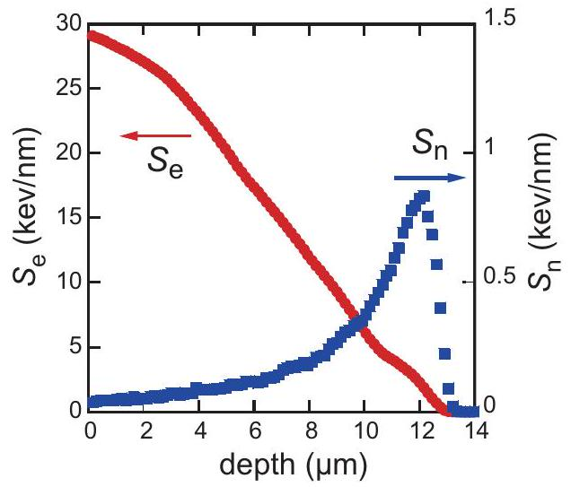
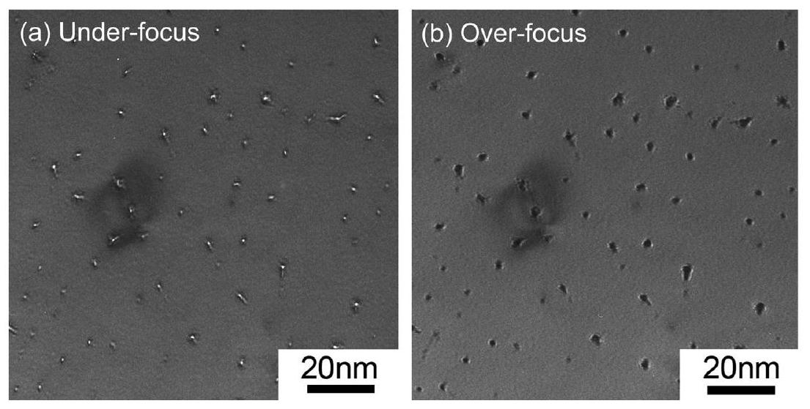
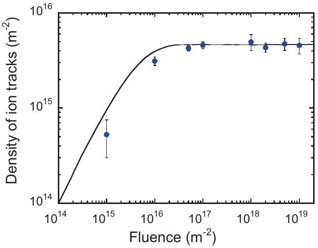
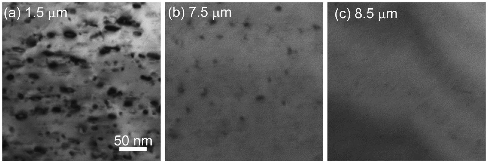
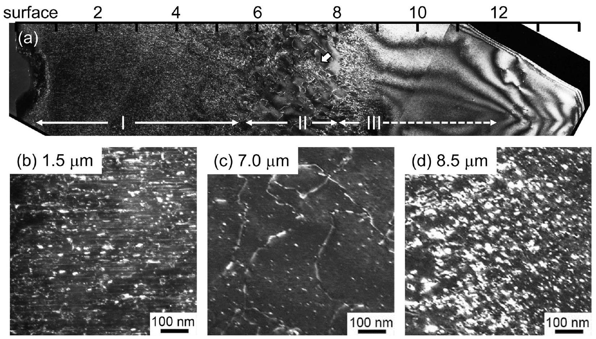
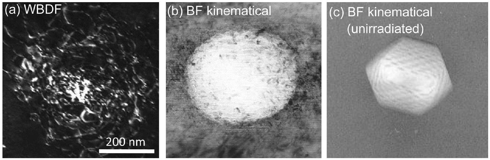
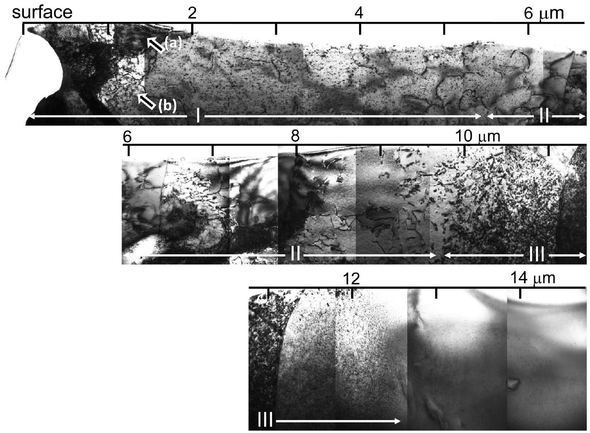
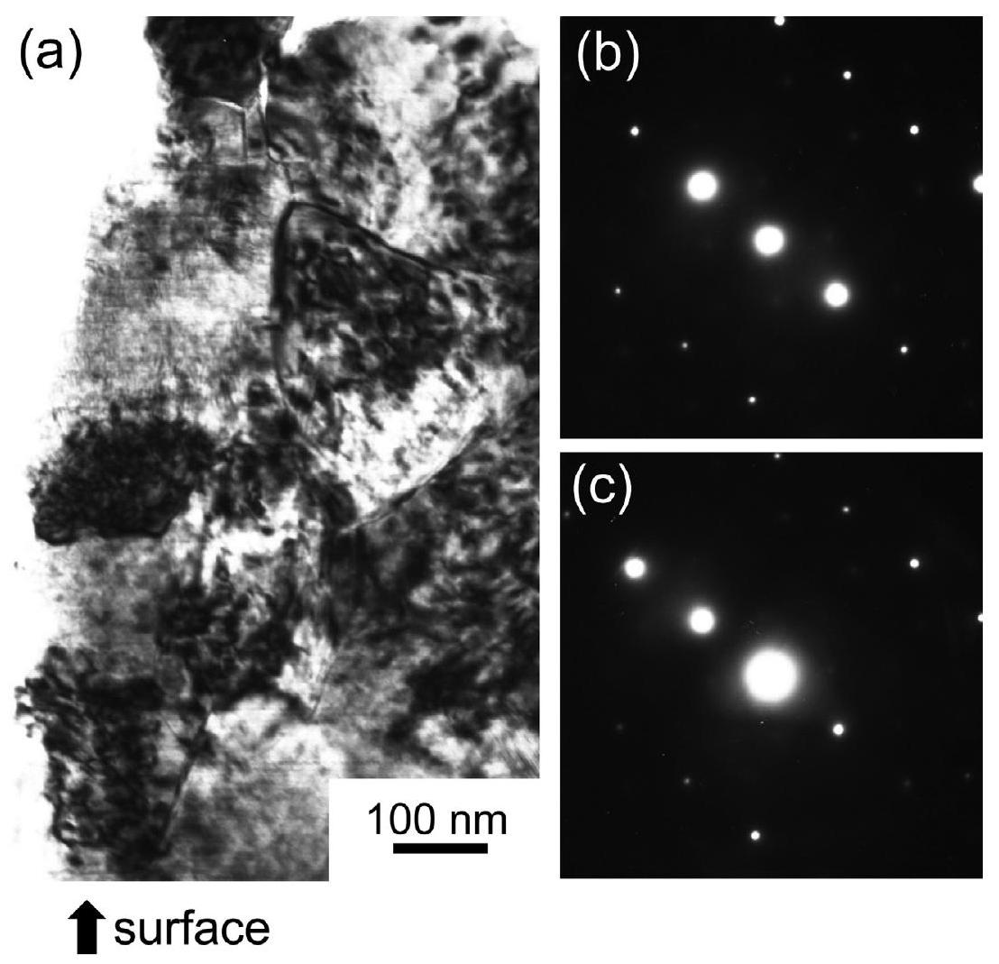

# Defect formation and accumulation in $\mathrm{CeO}_{2}$ irradiated with swift heavy ions 

K. Yasuda ${ }^{\text {a }, *}$, M. Etoh ${ }^{\text {a }}$, K. Sawada ${ }^{\text {a }}$, T. Yamamoto ${ }^{\text {a }}$, K. Yasunaga ${ }^{\text {a }}$, S. Matsumura ${ }^{\text {a }}$, N. Ishikawa ${ }^{\text {b }}$ ${ }^{\mathrm{a}}$ Department of Applied Quantum Physics and Nuclear Engineering, Kyushu University, Fukuoka, Japan ${ }^{\mathrm{b}}$ Nuclear Science and Engineering Directorate, Japan Atomic Energy Agency, Ibaraki, Japan

## ARTICLE INFO

## Article history:

Received 30 November 2012
Received in revised form 11 April 2013
Accepted 17 April 2013
Available online 19 June 2013

## Keywords:

Ceria
Swift heavy ions
Ion track
Dislocation
TEM
Nuclear fuel

#### Abstract

We have investigated microstructure evolution in $\mathrm{CeO}_{2}$ irradiated with 210 MeV Xe ions by using transmission electron microscopy to gain the fundamental knowledge on radiation damage induced by fission fragments in nuclear fuel and transmutation target. Analysis on the accumulation of ion tracks has revealed an influence region to recover pre-existing core damage regions of ion tracks to be 8.4 nm in radius. Cross section observations showed that high-density electronic excitation induces both ion tracks and dislocation loops. At high fluences of $1.5 \times 10^{19}$ and $1 \times 10^{20}$ ions $\mathrm{m}^{-2}$, depth-dependent microstructure was developed with radiation-induced defects of ion tracks, dislocation loops (dot-contrast) and line dislocations. Formation of sub-divided small grains was found at shallow depth at a fluence of $1 \times 10^{20}$ ions $\mathrm{m}^{-2}$. The microstructure evolution was discussed in terms of the accumulation of interstitials due to significant overlap of high density electronic excitation.

© 2013 Elsevier B.V. All rights reserved.

## 1. Introduction

Oxide ceramics with fluorite-type structure, such as uranium dioxide and stabilized cubic zirconia, exhibit excellent resistance to irradiation with energetic particles. Those materials have successful achievements as nuclear fuels in light water reactors (LWRs) and potential applications for inert matrices for transmutation targets of minor actinides and long life fission products [1,2], and numerous investigations have carried out to clarify the fundamental behavior of the production and kinetics of defects in fluorite oxides [3-8].

Radiation damage induced by fission fragments with typical energies of $70-100 \mathrm{MeV}$ is one of the indispensable issues, by which high density electronic excitation is induced along the penetrating ions to form continuous ion tracks, as well as extremely high amounts of elastic displacements around the range of fission fragments.

Cerium dioxide ( $\mathrm{CeO}_{2}$ ) has received considerable attention as a surrogate material for investigating radiation effects of uranium dioxides, because of its identical crystal structure and similar material's properties [9-17]. Previous studies on radiation damage by swift heavy ions in $\mathrm{CeO}_{2}$ have revealed that continuous ion

[^0]tracks are formed when electronic stopping power $S_{\mathrm{e}}$ is higher than $15 \mathrm{keV} / \mathrm{nm}$ [10]. Transmission electron microscopy (TEM) [11] and X-ray diffraction [12] investigations showed that $\mathrm{CeO}_{2}$ maintains its crystal structure after swift heavy ion irradiation to high fluences, at which radiation damage regions are overlapped. However, understandings on the microstructure development in $\mathrm{CeO}_{2}$ including defect formation and accumulation under swift heavy ion irradiation are rather limited. Therefore, the present study aims to gain insights into the microstructure evolution in $\mathrm{CeO}_{2}$ irradiated with swift heavy ions as a function of ion fluence, ranging from low fluence where ion track damage is well-separated to high fluence at which radiation damage with high density electronic excitation overlaps significantly.

## 2. Experimental

$\mathrm{CeO}_{2}$ powders of $99.99 \%$ purity (Rare Metallic Corp.) were uniaxially compacted at 50 MPa , followed by hydrostatic press in a water bath at 150 MPa . The obtained green pellets were sintered in air at 1673 K for 12 h to obtain sintered pellets with $96.6 \%$ TD. The average grain size of the pellets was evaluated to be $5 \mu \mathrm{~m}$ in diameter. The disk specimens of 3 mm in diameter and $200 \mu \mathrm{~m}$ in thickness were prepared by mechanical polish. These specimens were irradiated with 210 MeV Xe ions at 573 K , which corresponds to the approximate temperature at the periphery of fuel pellets in LWRs, or at an ambient temperature with a Tandem accelerator at Japan Atomic Energy Agency-Tokai to fluences ranging from

Fig. 1. Depth profiles of electronic stopping power ( $S_{e}$ ) and nuclear stopping power $\left(S_{n}\right)$ of 210 MeV Xe ions in $\mathrm{CeO}_{2}$ calculated by SRIM code.

$1 \times 10^{15}$ to $1 \times 10^{20}$ ions $\mathrm{m}^{-2}$. The electronic ( $S_{\mathrm{e}}$ ) and nuclear ( $S_{\mathrm{n}}$ ) stopping power of 210 MeV Xe ions was calculated by SRIM code [18], and it is shown in Fig. 1. The value of $S_{\mathrm{e}}$ at the specimen surface is $29 \mathrm{keV} / \mathrm{nm}$ and it decreases to be zero at a depth of $13 \mu \mathrm{~m}$. The value of $S_{\mathrm{n}}$ is negligible at shallow depth compared to $S_{\mathrm{e}}$, and it shows a peak at a depth of $12 \mu \mathrm{~m}$.

The irradiated specimens were thinned by mechanical and ionthinning to be suitable to transmission electron microcopy for planview and cross section-view observations: plan-view specimens were dimpled by mechanical polish, followed by the conventional ion-thinning with Ar -ions from the opposite side of the ion-irradiated surface. Cross section specimens were prepared by using Ion Slicer (JEOL Ltd.) with 6 keV Ar-ion from a shallow angle of $2.5^{\circ}$ to the Xe-ion irradiation direction. Analysis on the cross section specimens provides microstructure changes with varying the values of $S_{\mathrm{e}}$. Information on microstructure evolution by fission fragments in nuclear fuels, whose typical values of $S_{\mathrm{e}}$ are around $20 \mathrm{keV} / \mathrm{nm}$ in maximum, can be estimated from the results of the cross section observations. Both types of specimens were subjected to ion-thinning gradually with lower energy ions to a final polishing energy of 1 keV , to minimize the Ar-ion damage. Small defect clusters observed in an unirradiated region of a cross section specimen induced by 3 keV Ar ion-thinning were confirmed to be removed with 1 keV Ar ion-thinning. Microstructure observations were performed with bright-field (BF) imaging by using a conventional TEM (JEM- 2100 HC , JEOL Ltd.) at an accelerating voltage of 200 kV . A part of specimens was subjected to observations with a high voltage TEM (JEM-1000, JEOL Ltd.) at 1000 kV to obtain weak-beam
dark-field (WBDF) images. Observations with a high voltage TEM were performed carefully by using low electron beam flux to avoid microstructure changes during observations.

## 3. Results and discussion

Fig. 2 shows plan-view BF images of an identical region in $\mathrm{CeO}_{2}$ irradiated with 210 MeV Xe ions to a fluence of $1 \times 10^{16}$ ions $\mathrm{m}^{-2}$ with under-focus or over-focus condition. Distinct white dot-contrast with about 3 nm in diameter is observed with an under-focus condition (Fig. 2a), whereas those defects were observed as black dot-contrast with an over-focus condition (Fig. 2b). Such reverse of contrast dependent on focus conditions indicates that those are observed as Fresnel-contrast, as reported previously in fluo-rite-type compounds $[10,11,19-21]$. Observations at an inclined condition showed that Fresnel contrast was formed continuously along the ion-path, although its width changes with the penetration depth of ions. Recent studies on TEM and X-ray diffraction analysis revealed that $\mathrm{CeO}_{2}$ retain fluorite structure after irradiation with swift heavy ions with a wide range of $S_{\mathrm{e}}$ up to about $30 \mathrm{keV} / \mathrm{nm}$ [10-12]. The cause of Fresnel contrast of ion tracks is, therefore, attributed to the decrease in atomic density at the core damage region of the ion tracks. Formation of a high concentration of vacancies and/or small vacancy clusters inside the core region of ion tracks are the probable explanation for the decrease in the atomic density.

Fig. 3 shows the variation of the areal density of Fresnel contrast, or the core damage region of ion tracks, as a function of Xe-ion fluence. The areal density of defects increases linearly with fluence and evolves to saturation at higher fluences than $1 \times 10^{16}$ ions $\mathrm{m}^{-2}$. Since ion tracks are induced directly from an impact of an incident ion, the saturation of their density means that the formation and recovery of the core damage regions is balanced at high fluence. It has been reported by X-ray diffraction analysis that swift heavy ions of 150 and 200 MeV Au induces an asymmetric (200) peak in $\mathrm{CeO}_{2}$, which is arized from a new peak generation at slightly lower diffraction angle of the (200) peak [12]. The intensity of the new peak increases with fluence up to about $1 \times 10^{16}$ ions $\mathrm{m}^{-2}$, and then decreases with fluence. The fluence dependence of the peak intensity was explained by the accumulation of non-overlap region of ion tracks [13]. The accumulation process shown in Fig. 3, therefore, indicates that the pre-existing core damage regions are recovered or eliminated with overlap of radiation damage with high density electronic excitation induced by a new incident ion. In order to analyze the accumulation process shown in Fig. 3, we considered a cylindrical influence region with a radius $r$ along an incident ion,

Fig. 2. Plan-view microstructures from BF images of $\mathrm{CeO}_{2}$ irradiated at ambient temperature with 210 MeV Xe ions to a fluence $1 \times 10^{16}$ ions $\mathrm{m}^{-2}$, taken with a kinematical diffraction condition with under-focus (a) and over-focus (b) conditions to observe the core damage regions of ion tracks with Fresnel-contrast.

Fig. 3. Areal density of the core damage regions of ion tracks in $\mathrm{CeO}_{2}$ as a function of 210 MeV Xe-ion fluence. A curve shown is the fitted result to reproduce the experimental data using an numerical simulation described in Ref. [22], with a fitting parameter of influence region $r$. Data obtained at ambient temperature ( $1 \times 10^{15}$, $1 \times 10^{16}, 5 \times 10^{16}, 1 \times 10^{18}$ ions $\mathrm{m}^{-2}$ ) and 573 K (other data points) are plotted in the figure, and the fitting analysis was carried out without differentiation of data points.

in which pre-existing core damage regions are assumed to be eliminated. A curve shown in Fig. 3 represents the fitted results by an numerical simulation described in a previous paper [22], leading to an influence region $r$ to be 8.4 nm . The evaluation was obtained under an assumption that the pre-existing core damage regions are fully recovered within the influence region. If one assumes partial recovery for the pre-existing damage region, a larger value of the influence region might be obtained. The evaluated value is significantly larger than the size of the 'visible' damage region as appeared with Fresnel contrast in Fig. 2, and then a reported value of 'affected region' for fission products ( $2.5-3.5 \mathrm{~nm}$ in radius) obtained by analysis on BF TEM images [11]. High density electronic excitation in $\mathrm{CeO}_{2}$ induced by 210 MeV Xe ions is, therefore, understood to damage an extended region than the 'visible' damage region, and recover the core damage regions of ion tracks.

Fig. 4 shows BF images in $\mathrm{CeO}_{2}$ irradiated at 573 K to a fluence of $1 \times 10^{16}$ ions $\mathrm{m}^{-2}$. The analysis on the accumulation process in Fig. 3 gives that high density electronic excitation damage covers whole areas once on average at fluence of $1 \times 10^{16}$ ions $\mathrm{m}^{-2}$. It is seen that elongated loop contrast and tiny dot-contrast are formed

Fig. 4. Cross-section BF images of $\mathrm{CeO}_{2}$ irradiated with 210 MeV Xe ions to a fluence $1 \times 10^{16}$ ions $\mathrm{m}^{-2}$ at a depth of (a) $1.5 \mu \mathrm{~m}$, (b) $7.5 \mu \mathrm{~m}$, and (c) $8.5 \mu \mathrm{~m}$.

Fig. 5. Weak-beam ( $g, 4 g$ ), $g=111$ dark-field image of $\mathrm{CeO}_{2}$ irradiated with 210 MeV Xe ions to a fluence $1.5 \times 10^{19}$ ions $\mathrm{m}^{-2}$ (a), and magnified images at depths of (b) $1.5 \mu \mathrm{~m}$, (c) $7.0 \mu \mathrm{~m}$, and (d) $8.5 \mu \mathrm{~m}$. Regions I, II and III (described in the text) are indicated in the micrograph.

Fig. 6. WBDF ( $g, 4 g$ ), $g=111$ image (a) and BF kinematical image (b) of an identical closed pore in $\mathrm{CeO}_{2}$ irradiated with 210 MeV Xe ions to a fluence $1.5 \times 10^{19}$ ions $\mathrm{m}^{-2}$ at a depth of $7.3 \mu \mathrm{~m}$ (the position of the closed pore is indicated by an arrow in Fig. 5). An example closed pore of an unirradiated specimen is also shown for a comparison (c).

Fig. 7. Cross-section BF image in $\mathrm{CeO}_{2}$ irradiated at 573 K with 210 MeV Xe ions to a fluence $1 \times 10^{20}$ ions $\mathrm{m}^{-2}$, regions I, II and III are indicated in the micrograph.

at a depth of $1.5 \mu \mathrm{~m}$ (Fig. 4a), whereas the size and density of loop and dot-contrast decrease with penetration depth of ions (Fig. 4b), and few defect contrast is observed at depth deeper than $8.5 \mu \mathrm{~m}$ (Fig. 4c). The result clearly indicates that the formation of loops and dot-contrast is prolonged with higher electronic stopping power. Since few overlap of electronic excitation damage is induced at $1 \times 10^{16}$ ions $\mathrm{m}^{-2}$, the defects shown in Fig. 4 are considered to be induced directly from an impact of single ion damage. The threshold value of $S_{\mathrm{e}}$ for the defects formation is estimated to be about $12 \mathrm{keV} / \mathrm{nm}$ (corresponding to the value of $S_{\mathrm{e}}$ at depths
between 7.5 and $8.5 \mu \mathrm{~m}$ ), and this value is close to the threshold value of $S_{\mathrm{e}}$ for continuous ion track formation [10].

Fig. 5 shows a WBDF image in $\mathrm{CeO}_{2}$ induced by overlap of high density electronic excitation for about $10^{3}$ times at a fluence of $1.5 \times 10^{19}$ ions $\mathrm{m}^{-2}$. It is seen in Fig. 5 that the microstructure has three characteristic regions which evolve as a function of penetration depth of ions. At shallower depth less than about $6 \mu \mathrm{~m}$, dot- or elongated-contrast to the ion irradiated direction is observed together with line contrast of ion tracks (region I). At slightly deeper regions, line dislocations and tiny dot-contrast are

Fig. 8. Cross section BF image in $\mathrm{CeO}_{2}$ irradiated at 573 K with 210 MeV Xe ions to a fluence $1 \times 10^{20}$ ions $\mathrm{m}^{-2}$, showing formation of sub-grains at the surface region (a), selected area diffraction patterns taken at the matrix grain (a) and the sub-grain (b), as indicated by arrows (a) and (b) in Fig. 7, respectively.

observed (region II). The size and density of dot-contrast are apparently smaller and lower, respectively, than those observed in region I. At depth deeper than around $8 \mu \mathrm{~m}$, a high density of dot-contrast is observed to form a band structure (from 8 to $9 \mu \mathrm{~m}$ ), and at further deeper depth, smaller and faint dot-contrast is formed up to about $12 \mu \mathrm{~m}$ (region III).

It is worth to note that the morphology of closed pores, which was formed during the sintering process, has changed with the overlap of electronic excitation damage. Fig. 6 shows WBDF and BF images of a closed pore (indicated with an arrow in region II in Fig. 5). The closed pore was observed as a round shape with 210 MeV Xe-ion irradiation to a fluence of $1.5 \times 10^{19}$ ions $\mathrm{m}^{-2}$ (Fig. 6b), whereas pores in unirradiated specimens were observed with a faceted shape as shown in Fig. 6c. Tangled dislocations are also observed at the closed pore with a WBDF image (Fig. 6a) to indicate that closed pores act as a strong sink for point defects under irradiation with 200 MeV Xe ions, and it evidences enhanced migration of point defects at region II under high density electronic excitation.

The depth-dependent microstructure shown in Fig. 5 is attributed to the synergistic irradiation with electronic excitation and elastic displacement damage. The development of region II with line dislocations and a low density of dot-contrast are evidenced that point defects migration is enhanced due to electronic excitation or ionizing radiation as reported in other oxide ceramics of $\mathrm{MgAl}_{2} \mathrm{O}_{4}$ and $\alpha-\mathrm{Al}_{2} \mathrm{O}_{3}$ [23-26]. The defects band formation in region III is also due to the enhanced migration of point defects induced by nuclear stopping power due to the high density electronic excitation.

Similar depth-dependent microstructure consist of three regions, or regions I, II and III, was developed at further high fluence of $1 \times 10^{20}$ ions $\mathrm{m}^{-2}$ as shown in Fig. 7, although each region is evolved at deeper depth compared to the regions formed at $1.5 \times 10^{19}$ ions $\mathrm{m}^{-2}$. It is interesting to note that sub-divided small
grains are formed at shallow depths at a fluence of $1 \times 10^{20}$ ions $\mathrm{m}^{-2}$, at which radiation damage with high density electronic excitation overlaps about $10^{4}$ times. Fig. 8a is a magnified BF image of Fig. 7 at surface region to show several sub-divided grains with a diameter of 100 nm or less. A part of those grains was found to possess orientation relationship to the matrix grain with a small tilt angle about $1^{\circ}$, as indicated diffraction patterns taken from the matrix grain (Fig. 8b, indicated in (b) in Fig. 7) and the generated subgrain (Fig. 8c, indicated in (c) in Fig. 7).

It has been reported by Rutherford Backscattering Spectroscopy/Channeling analysis that swift heavy ion irradiation induces sub-grain formation with small tilt angles in $\mathrm{UO}_{2}$ and yttria-stabilized cubic zirconia [20,27]. TEM and SEM observations also detected surface roughness and sub-grain formation at surface region in $\mathrm{CeO}_{2}$ after prolonged irradiation to $2 \times 10^{19}$ ions $\mathrm{m}^{-2}$ [10]. The microstructure evolution shown in Figs. 5 and 7 reveals that interstitials atoms are accumulated during the repetition of the formation and recovery of the core damage regions of ion tracks which is discussed to contain a high concentration of vacancies and/or small vacancy clusters. The sub-grain formation is considered to be resulted from the formation of dislocation walls through the aggregation of interstitial atoms during the overlap of electronic excitation damage.

## 4. Conclusions

We have investigated microstructure evolution in $\mathrm{CeO}_{2}$ irradiated with 210 MeV Xe ions by using transmission electron microscopy. Followings are drawn as conclusions in the present study:

- Core damage regions of ion tracks are observed as Fresnel contrast with plan-view observations. The areal density of the core damage regions increases linearly with fluence to saturate at
higher fluence than $1 \times 10^{16}$ ions $\mathrm{m}^{-2}$. An influence region to recover the pre-existing core damage regions is evaluated to be 8.4 nm in radius.
- Radiation damage with high density electronic excitation induces not only ion tracks but also dislocation loops. The threshold electronic stopping power for loop formation is about $12 \mathrm{keV} / \mathrm{nm}$, and it is approximately consistent with the threshold value of $S_{\mathrm{e}}$ for continuous ion track formation.
- Significant overlap of high density electronic excitation evolves microstructure dependent on the penetration depth of ions, including dislocation loops, dot-contrast and line dislocations. Electronic excitation was discussed to play an important role not only to induce ion tracks and dislocation loops, but also enhances migration of point defects, which are induced either by elastic or electronic stopping power.
- Sub-grain formation was found at shallow depths at a fluence of $1 \times 10^{20}$ ions $\mathrm{m}^{-2}$, corresponding to about $10^{4}$ times overlap of high density electronic excitation damage. This is due to the accumulation of interstitial atoms during the overlap of high density electronic excitation. Formation of low angle tilt grain boundary of the sub-grains suggests the polygonization mechanism for the sub-divided grain formation.

## Acknowledgments

Swift heavy ion irradiation was carried out at ion accelerator facility in JAEA-Tokai. A part of electron microscopy observations/analyses was done at the HVEM Laboratory of Kyushu University. The authors are grateful to technical stuffs of both research facilities for their skillful technical assistance. This work includes results conducted under the budget for nuclear research supported by MEXT, based on screening and counseling by Atomic Energy Commission.

## References

[1] K.E. Sickafus, Hj. Matzke, T. Hartmann, K. Yasuda, J.A. Valdez, P. Chodak III, M. Nastasi, R.A. Verrall, J. Nucl. Mater. 274 (1999) 66.
[2] C. Degueldre, T. Yamashita, J. Nucl. Mater. 319 (2003) 1.
[3] R.J.M. Konings, K. Bakker, J.G. Boshoven, R. Conrad, H. Hein, J. Nucl. Mater. 254 (1998) 135.
[4] S. Moll, L. Thome, G. Sattonnay, A. Debelle, F. Garrido, L. Vincent, J. Jagielski, J. Appl. Phys. 106 (2009) 073509.
[5] L. Thome, S. Moll, A. Debelle, F. Garrido, G. Sattonnay, J. Jagielski, Adv. Mater. Sci. Eng. (2012) 905474.
[6] K. Yasuda, C. Kinoshita, S. Matsumura, A.I. Ryazanov, J. Nucl. Mater. 319 (2003) 74.
[7] A.I. Ryazanov, K. Yasuda, C. Kinoshita, A.V. Klaptsov, J. Nucl. Mater. 323 (2003) 372.
[8] Y. Zhang, W. Jiang, C.M. Wang, F. Namavar, P.D. Edmondson, Z. Zhu, F. Gao, J. Lian, W.J. Weber, Phys. Rev. B82 (2010) 184105.
[9] M. Kinoshita, K. Yasunaga, T. Sonoda, A. Iwase, N. Ishikawa, M. Sataka, K. Yasuda, S. Matsumura, H.Y. Geng, T. Ichinomiya, Y. Chen, Y. Kaneta, M. Iwasawa, T. Ohnuma, Y. Nishiura, J. Nakamura, Hj. Matzke, Nucl. Instr. Meth. B267 (2009) 960.
[10] T. Sonoda, M. Kinoshita, N. Ishikawa, M. Sataka, Y. Chimi, N. Okubo, A. Iwase, K. Yasunaga, Nucl. Instr. Meth. B266 (2008) 2882.
[11] T. Sonoda, M. Kinoshita, Y. Chimi, N. Ishikawa, M. Sataka, A. Iwase, Nucl. Instr. Meth. B250 (2006) 254.
[12] N. Ishikawa, Y. Chimi, O. Michikami, Y. Ohta, K. Ohhara, M. Lang, R. Neumann, Nucl. Instr. Meth. B266 (2008) 3033.
[13] N. Ishikawa, K. Ohhara, Y. Ohta, O. Michikami, Nucl. Instr. Meth. B268 (2010) 3273.
[14] K. Yasunaga, K. Yasuda, S. Matsumura, T. Sonoda, Nucl. Instr. Meth. B250 (2006) 114.
[15] K. Yasunaga, K. Yasuda, S. Matsumura, T. Sonoda, Nucl. Instr. Meth. B266 (2008) 2877.
[16] D. Yun, B. Ye, A.J. Oaks, W. Chen, M.A. Kirk, J. Rest, A.M. Yacout, J.F. Stubbins, Nucl. Instr. Meth. B272 (2012) 239.
[17] D. Yun, A.J. Oaks, W. Chen, M.A. Kirk, J. Rest, Z.Z. Insopov, A.M. Yacut, J.F. Stubbins, J. Nucl. Mater. 418 (2011) 80.
[18] J.F. Ziegler, J.P. Biersack, U. Littmark, The Stopping and Range in Ions in Solids, Pergamon, New York, 1985.
[19] J. Jensen, A. Dunlop, S. Della-Negra, Nucl. Instr. Meth. B146 (1998) 399.
[20] F. Garrido, S. Moll, G. Sattonnay, L. Thomé, L. Vincent, Nucl. Instr. Meth. B267 (2009) 1451.
[21] T. Sonoda, M. Kinoshita, N. Ishikawa, M. Sataka, A. Iwase, K. Yasunaga, Nucl. Instr. Meth. B268 (2010) 3277.
[22] K. Yasuda, T. Yamamoto, M. Etoh, S. Kawasoe, S. Matsumura, N. Ishikawa, Int. J. Mater. Res. 102 (2011) 9.
[23] S.J. Zinkle, J. Nucl. Mater. 219 (1995) 113.
[24] S.J. Zinkle, Mater. Res. Soc. Symp. Proc. 439 (1997) 667.
[25] K. Yasuda, C. Kinoshita, R. Morisaki, H. Abe, Philos. Mag. 78A (1998) 583.
[26] K. Yasuda, C. Kinoshita, M. Ohmura, H. Abe, Nucl. Instr. Meth. B166-167 (2000) 107.
[27] K.E. Sickafus, Hj. Matzke, K. Yasuda, P. Chodak III, R.A. Verrall, P.G. Lucuta, H.R. Andrews, A. Turos, R. Fromknecht, N.P. Baker, Nucl. Instr. Meth. B141 (1998) 358.

[^0]:    * Corresponding author. Address: Department of Applied Quantum Physics and Nuclear Engineering, Kyushu University, Motooka 744, Fukuoka 819-0395, Japan. Tel.: +8192802 3487; fax: +81928023489.

    E-mail address: yasudak@nucl.kyushu-u.ac.jp (K. Yasuda).

