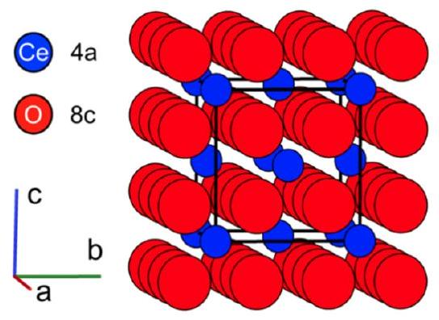
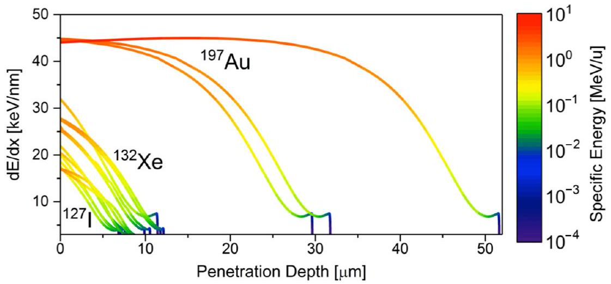
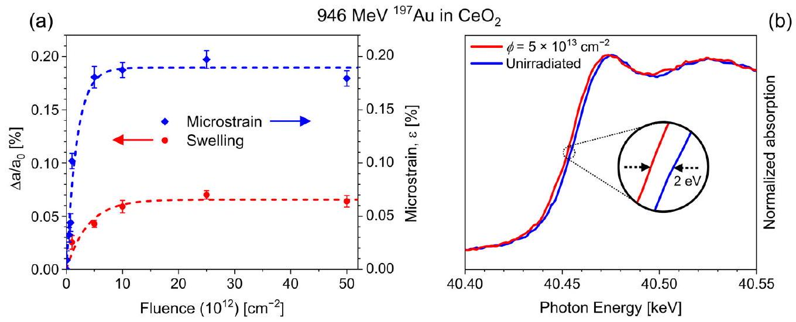
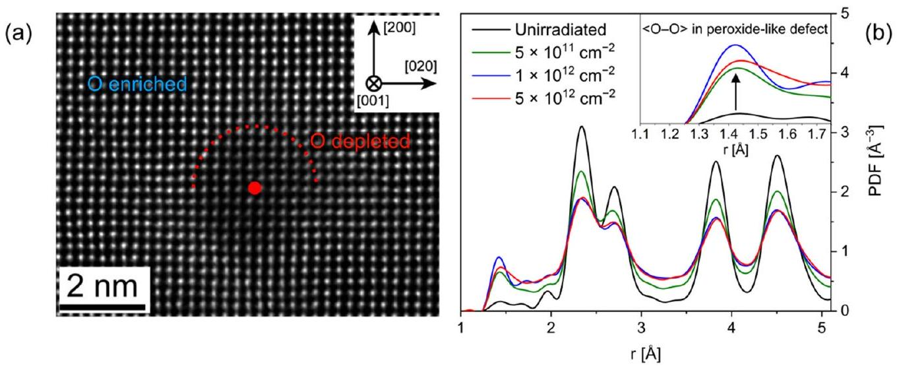
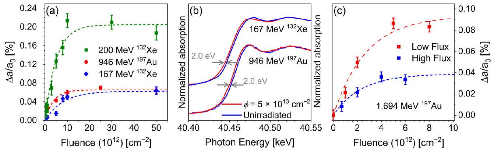
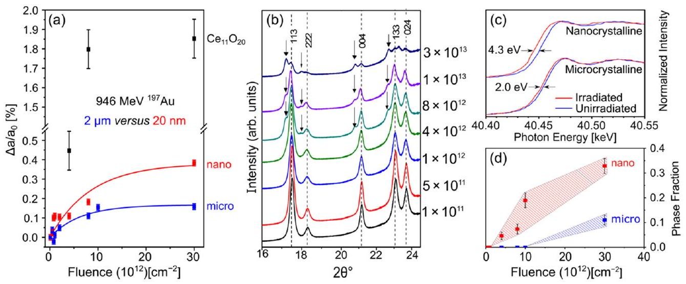
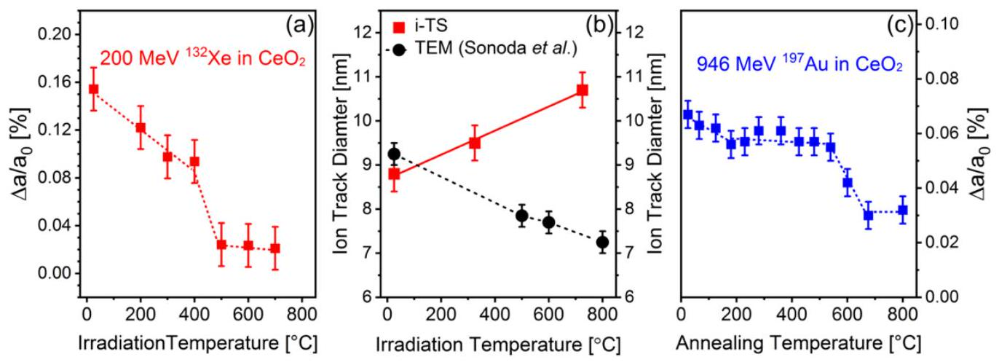
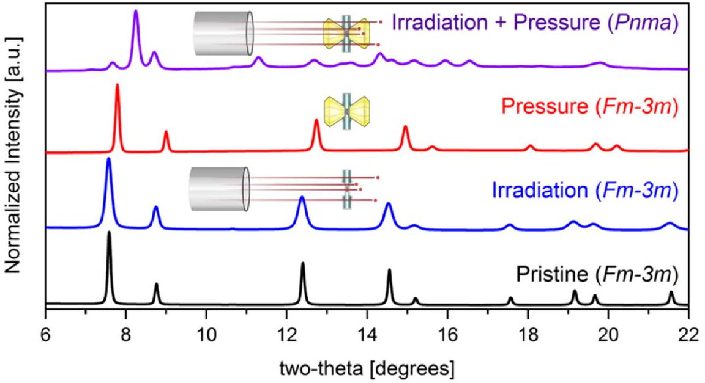
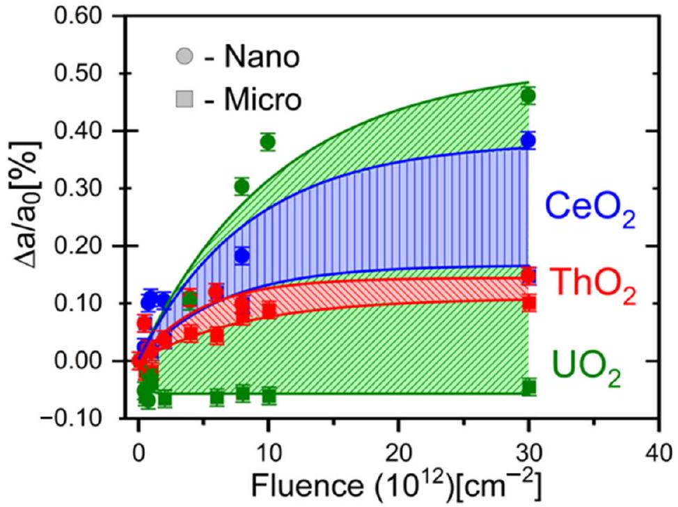
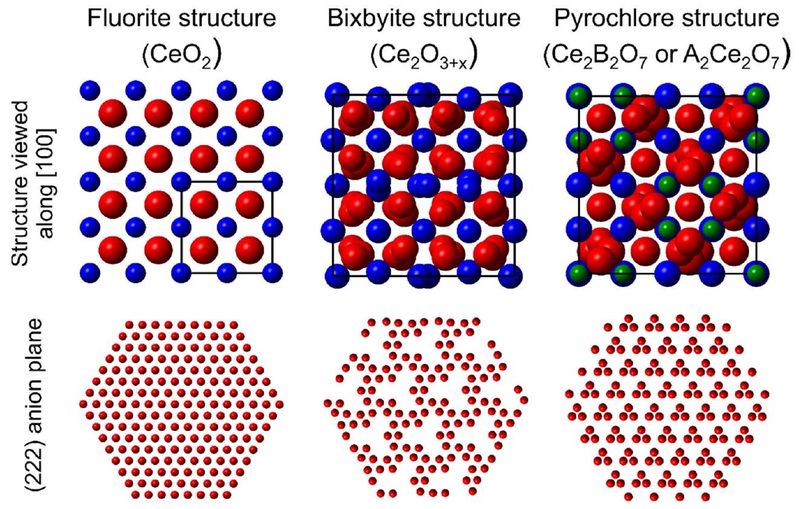

# Review of Swift Heavy Ion Irradiation Effects in CeO2 

William F. Cureton ${ }^{\mathbf{1}}$, Cameron L. Tracy ${ }^{\mathbf{2}}$ (B) and Maik Lang ${ }^{\mathbf{1} \boldsymbol{,} \boldsymbol{*} \text { (D) }}$ 1 Department of Nuclear Engineering, University of Tennessee, Knoxville, TN 37966, USA; wcureton@vols.utk.edu 2 Center for International Security and Cooperation, Stanford University, Stanford, CA 94305, USA; cltracy@umich.edu * Correspondence: mlang2@utk.edu; Tel.: +1-865-974-8247

Citation: Cureton, W.F.; Tracy, C.L.; Lang, M. Review of Swift Heavy Ion Irradiation Effects in $\mathrm{CeO}_{2}$. Quantum Beam Sci. 2021, 5, 19. https://doi.org/ 10.3390/qubs5020019

Academic Editors: Akihiro Iwase and Hiro Amekura

Received: 30 April 2021
Accepted: 11 June 2021
Published: 16 June 2021

Publisher's Note: MDPI stays neutral with regard to jurisdictional claims in published maps and institutional affiliations.

Copyright: © 2021 by the authors. Licensee MDPI, Basel, Switzerland. This article is an open access article distributed under the terms and conditions of the Creative Commons Attribution (CC BY) license (https:// creativecommons.org/licenses/by/ 4.0/).

#### Abstract

Cerium dioxide ( $\mathrm{CeO}_{2}$ ) exhibits complex behavior when irradiated with swift heavy ions. Modifications to this material originate from the production of atomic-scale defects, which accumulate and induce changes to the microstructure, chemistry, and material properties. As such, characterizing its radiation response requires a wide range of complementary characterization techniques to elucidate the defect formation and stability over multiple length scales, such as X-ray and neutron scattering, optical spectroscopy, and electron microscopy. In this article, recent experimental efforts are reviewed in order to holistically assess the current understanding and knowledge gaps regarding the underlying physical mechanisms that dictate the response of $\mathrm{CeO}_{2}$ and related materials to irradiation with swift heavy ions. The recent application of novel experimental techniques has provided additional insight into the structural and chemical behavior of irradiationinduced defects, from the local, atomic-scale arrangement to the long-range structure. However, future work must carefully account for the influence of experimental conditions, with respect to both sample properties (e.g., grain size and impurity content) and ion-beam parameters (e.g., ion mass and energy), to facilitate a more direct comparison of experimental results.

Keywords: cerium oxide; $\mathrm{CeO}_{2}$; irradiation; swift heavy ions

## 1. Introduction

Under ambient conditions, cerium dioxide ( $\mathrm{CeO}_{2}$ ) adopts the fluorite structure (space group Fm-3m), common to a variety of dioxides such as $\mathrm{UO}_{2}, \mathrm{ThO}_{2}, \mathrm{PuO}_{2}$, and doped $\mathrm{ZrO}_{2}[1,2]$. In this phase, Ce cations arrange in a face-centered cubic array on 4a Wyckoff sites with a simple cubic substructure of oxygen anions occupying 8c sites (Figure 1). The flexibility of cerium's electronic structure allows for extensive transitions between the nominal $4 f^{0}-\mathrm{Ce}^{4+}$ oxidation state and a $4 f^{1}-\mathrm{Ce}^{3+}$ state without loss of the long-range fluorite structure. This transition is so prevalent over a wide range of conditions that materials containing cerium (including oxides) with monovalent $\mathrm{Ce}^{4+}$ cations are difficult to fabricate [3].

Figure 1. The cubic fluorite structure (space group $F m-3 m)$ of $\mathrm{CeO}_{2}$, where cations (blue spheres) occupy 4a Wykoff sites and anions (red spheres) occupy 8c sites.

The reduction in cation charge state is coupled to the production of oxygen vacancies ( $V_{O}$ ) in the system; for every positively charged $V_{\ddot{O}}$, two $\mathrm{Ce}^{3+}$ cations are necessary for charge compensation. Under reducing conditions, oxygen vacancy formation is expressed in Kröger-Vink notation as:

$$
2 C e_{C e}+O_{O} \rightarrow \frac{1}{2} O_{2(g a s)}+V_{O}+2 e^{/}+2 C e_{C e}
$$

The two excess electrons ( $e^{/}$) liberated by the formation of molecular oxygen can subsequently be captured by surrounding cerium atoms, causing a reduction in the oxidation state of tetravalent cations $\{\mathrm{Ce}(\mathrm{IV}) \rightarrow \mathrm{Ce}(\mathrm{III})\}$ as expressed in:

$$
2 C e_{C e}+V_{\ddot{O}}+2 e^{\prime} \rightarrow V_{\ddot{O}}+2 C e_{C e}^{\prime}
$$

The accommodation of these $V_{\ddot{O}}$ and $\mathrm{Ce}^{3+}$ defects in the fluorite structure yields an average expansion of the unit cell, due to the larger cationic radius of $\mathrm{Ce}^{3+}$ cations compared with $\mathrm{Ce}^{4+}$ cations ( $1.14 \AA$ and $0.97 \AA$, respectively [4]) and local distortions around the $V_{O}$ and aliovalent cations [5,6]. As these $C e_{C e}^{3+}-V_{O}$ defect complexes accumulate to sufficiently large concentrations, the oxygen vacancies begin to order and arrange themselves according to Pauling's 1st and 2nd rules [7,8]. This leads to transformations into various trigonal fluorite-derivative phases such as $\mathrm{Ce}_{11} \mathrm{O}_{20}$ and $\mathrm{Ce}_{7} \mathrm{O}_{12}$ as a function of decreasing oxygen content [9,10].

The flexibility of the fluorite structure and the complex redox behavior of cerium oxide compounds make them attractive for use in a number of engineering applications, such as oxygen sensors [11], catalysts in chemical processes [12], and electrolyte materials in solid oxide fuel cells [13]. Being isostructural with the nuclear fuel materials $\mathrm{UO}_{2}, \mathrm{ThO}_{2}$, and $\mathrm{PuO}_{2}, \mathrm{CeO}_{2}$ is also an important analogue for studies of radiation effects in actinide oxides, as it obviates the need for handling of radioactive or highly regulated compounds. Due to these applications involving operation under extreme conditions, $\mathrm{CeO}_{2}$ has been studied in great detail in recent decades, particularly focusing on its behavior in harsh chemical environments, as well as during exposure to high temperature and intense irradiation. Perhaps the most extreme and least understood of these conditions is high energy heavy ion irradiation.

Swift heavy ions (SHIs), having energies $>0.5 \mathrm{MeV} / \mathrm{u}$, can be produced at large accelerator facilities and are used for a wide range of applications. The highly transient energy deposition associated with swift heavy ion irradiation leads to far-from-equilibrium material conditions, similar to those induced in nuclear fuels by the slowing down of energetic fission fragments. SHIs are therefore used to study radiation effects in nuclear materials under well-controlled experimental conditions [14]. SHIs are also used to mimic the effects of galactic cosmic rays in electronic materials [15], to study degradation mechanisms in accelerator components [16], and for medical treatment purposes [17]. Finally, SHIs can be harnessed to tailor materials by inducing modifications to their structures and properties that are not attainable by conventional processing techniques. Examples include the production of nanostructures [18-21] and the tuning of optical properties [22] for engineering applications.

Highly energetic heavy ions deposit energy to a material's electrons primarily via excitation and ionization processes [23]. This energy dissipates radially in the electronic subsystem and is then transferred to the atomic system through electron-phonon coupling, leading to high energy densities on the order of $\mathrm{eV} /$ atom . This results in rapid heating in the material over picosecond time scales [24,25] within a nanoscale region around the ion path ( $1-10 \mathrm{~nm}$ in the radial direction), which causes a thermal spike and possibly localized melting, followed by rapid quenching [26]. These processes result in complex structural and chemical modifications along the ion path, leaving behind cylindrical damage zones with radii of a few nm and lengths of 10 s of $\mu \mathrm{m}$, known as ion tracks. The type of irradiation damage that is induced within ion tracks depends on the target material and can include the
formation of defects [27], disorder [28], amorphization [29], and crystalline-to-crystalline phase transitions [30].

Fluorite-structured binary oxide materials are generally resistant to the structural modifications induced by swift heavy ion irradiation. Irradiation-induced defect formation is commonly limited to isolated point defects and extended defect clusters. This is often accompanied by the build-up of heterogeneous microstrain and, at sufficiently large defect concentrations, longer-range material modifications such as unit cell swelling. Still the long-range fluorite structure is commonly maintained.

As ion tracks accumulate with increasing ion fluence, the swelling and microstrain typically increase in a linear fashion at relatively low fluences, then saturate at higher fluences when tracks eventually overlap. This behavior is described by the so-called single impact mechanism [31]. The mathematical description of this mechanism is shown in Equation (3) for the increase in unit cell parameter as a function of increasing ion fluence:

$$
\frac{\Delta a}{a_{0}}=\frac{a(\phi)-a_{0}}{a_{0}}=\frac{a_{\text {sat }}-a_{0}}{a_{0}}\left(1-e^{-\sigma \phi}\right)
$$

where $a$ is the measured unit cell parameter at a given ion fluence $\phi, a_{0}$ is the reference unit cell parameter of the unirradiated material, $a_{\text {sat }}$ is the saturation value of the unit cell parameter at high ion fluence, and $\sigma$ is the cross-sectional ion track area.

Understanding the intermediate mechanisms by which electronic excitation and the subsequent atomic displacement yield changes to the long-range structure and chemistry of $\mathrm{CeO}_{2}$ is critical to its performance in various engineering applications. However, these processes are complex, multiscale, and difficult to fully characterize. To bridge the gaps between SHI irradiation-induced electronic excitation, atomic displacement, defect production, and bulk material modification, we review here in detail the unique response of $\mathrm{CeO}_{2}$ to swift heavy ion irradiation, as revealed by a wide range of characterization techniques. After initially summarizing the most important characterization techniques, this article first reviews work investigating the fundamental structural and electronic modifications induced by swift heavy ions that lead to the formation of ion tracks in $\mathrm{CeO}_{2}$. This is followed by a description of how these radiation effects are influenced by the irradiation conditions (ion energy, ion stopping power, temperature, and pressure) and sample characteristics (chemical composition and microstructure). The manuscript concludes with a brief comparison of swift heavy ion effects in $\mathrm{CeO}_{2}$ with those in related fluorite-derivative oxides, followed by a summary and outlook.

## 2. Methods

### 2.1. Irradiation Conditions

The controlled production of SHIs requires large, dedicated user facilities, rather than the more prevalent and accessible laboratory-based tandem ion accelerators. SHI irradiation of $\mathrm{CeO}_{2}$ materials has been performed at several large accelerator facilities worldwide [23]. However, these facilities cover different ranges of ion species and energies. The energy deposited in a material per unit length (known as energy loss, $\mathrm{d} E / \mathrm{d} x$ ) depends on ion mass and energy and is a key parameter in SHI irradiation experiments. For highly energetic ions, energy is deposited primarily to a material's electronic subsystem (electronic energy loss, $\mathrm{d} E / \mathrm{d} x_{e}$ ), with only minor contributions from nuclear collisions (nuclear energy loss, $\mathrm{d} E / \mathrm{d} x_{n}$ ).

The effects of SHI energy deposition parameters on the induced structural modifications in $\mathrm{CeO}_{2}$ has been investigated over a broad $\mathrm{d} E / \mathrm{d} x$ range between 15 and $45 \mathrm{keV} / \mathrm{nm}$, as shown in Figure 2. Ions of specific energy ranging from $0.5-30 \mathrm{MeV} / \mathrm{u}$ (with u being the number of nucleons) and species ranging from ${ }^{127} \mathrm{I}-{ }^{238} \mathrm{U}$ have been utilized in these experiments [32-56]. The strong dependence of the energy loss on the ion energy leads to continuous change in $\mathrm{d} E / \mathrm{d} x$ along the ion's penetration path in the material (Figure 2), which must be considered for characterization in order to accurately relate irradiation effects to the specific $\mathrm{d} E / \mathrm{d} x$ within the volume probed by a particular characterization technique [57].

Figure 2. Energy loss profiles as a function of penetration depth determined with SRIM 2013 [57] for the ions used in the majority of studies [32-56] on SHI irradiated $\mathrm{CeO}_{2}$, assuming $100 \%$ theoretical density. The color scale corresponds to the specific energy of ions and indicates the change in energy as ions penetrate into the material. The three ion species illustrate the range of masses and species used in these studies.

Other experimental parameters that are typically controlled in SHI irradiation studies include the ion flux, fluence, irradiation angle relative to the sample surface, and in situ environmental conditions (e.g., temperature and pressure). The many irradiation studies previously conducted on $\mathrm{CeO}_{2}$ differ also with respect to sample properties. For example, various microstructures have been employed, ranging from single crystals [58] to polycrystalline pellets [32] to loose powder compacts [14]. As this review will show, all of these parameters greatly influence the response of $\mathrm{CeO}_{2}$ to SHI irradiation. To gain further insight into radiation damage mechanisms, the impact of all ion-beam conditions and sample properties on the induced structural and chemical modifications must be understood at a holistic level.

### 2.2. Characterization

A wide range of characterization techniques have been employed to investigate the complex structural and chemical effects induced in $\mathrm{CeO}_{2}$ by SHI irradiation. Such measurements are performed either ex situ (after ion irradiation) or in situ (directly at accelerator beamlines with various dedicated characterization infrastructures). Analytical methods used in prior work include various forms of scattering, spectroscopy, calorimetry, and electron microscopy. Some of these techniques provide direct insight into the damage structure within individual ion tracks (e.g., electron microscopy), while others are based on net damage accumulation and fluence-dependent measurements (e.g., X-ray diffraction). Characterization is commonly performed on materials after irradiation at ambient conditions to study damage formation, yet select works on irradiation at high temperatures and post-irradiation thermal annealing provide insight into damage recovery and defect dynamics. The following section gives a brief overview of the most prevalent characterization techniques used to investigate SHI irradiation effects in $\mathrm{CeO}_{2}$ and other fluorite-structured oxide materials.

Scattering techniques provide information on the short-and long-range structural modifications to materials following SHI irradiation. Highly penetrating X-ray and neutron probes are commonly used for this purpose. X-ray scattering, which is sensitive to changes in the cation sublattice, is performed with either laboratory-based diffractometers or at large synchrotron facilities. Neutron probes are useful for investigating the structure of light (low-Z) atomic constituents in a material (e.g., O in $\mathrm{CeO}_{2}$ ) because, unlike X-rays, neutrons scatter efficiently on atoms of low atomic mass ( $Z$ of the atomic constituent).

Two scattering techniques have been most extensively used in the study of irradiated $\mathrm{CeO}_{2}$ : diffraction and total scattering. Diffraction experiments allow for quantification of the long-range volumetric changes (unit cell swelling) caused by the production of de-
fects $[14,36,38,39,41,45-47,52,54,56,59,60]$, as well as heterogeneous microstrain and phase transformations, should they occur. Total scattering experiments are used to study the local defect structure using real-space analysis. Recently, intense spallation neutrons have become available for materials research at dedicated facilities, such as the Nanoscale Ordered Materials Diffractometer (NOMAD) at the Spallation Neutron Source, Oak Ridge National Laboratory (ORNL). High-resolution pair distribution function (PDF) analysis is utilized at NOMAD [61] to investigate short-range structural changes associated with irradiation-induced defects, which are inaccessible to conventional long-range diffraction methods [50,53].

Spectroscopic techniques provide insight into the local damage structure and changes to the chemistry of irradiated materials. X-ray absorption spectroscopy (XAS) has been used to probe cation oxidation state changes in irradiated $\mathrm{CeO}_{2}$ and associated modifications to the local bonding environment [35,46,54,60]. X-ray photoelectron spectroscopy (XPS) provides insight into the electronic structure of cations by X-ray induced electron excitation and the consequent emission of characteristic photons during de-excitation [34,35,51,58]. Both XAS and XPS are valuable characterization tools for $\mathrm{CeO}_{2}$ due to its tendency to chemically reduce under highly ionizing irradiation. Raman spectroscopy reveals the impact of defects on correlated atomic vibrations [38,49,55]. Structural modifications in fluorite-structured materials lead to a breakdown of selection rules and the appearance of so-called Raman forbidden modes in the spectra. Quantitative analysis of these forbidden modes provides information on defect concentrations. Raman spectroscopy further reveals the formation of $\mathrm{Ce}-V_{O}$ defect complexes in irradiated $\mathrm{CeO}_{2}$ [62]; thus, this technique is also useful for studying the material's redox response under SHI irradiation.

Electron microscopy (EM) is a powerful tool for the analysis of radiation effects in materials, as it provides direct imaging of the damage structure and its spatial distribution. High-resolution transmission electron microscopy (HRTEM), using state-of-the-art microscopes, has recently provided valuable insight into the atomic-scale nature of defects in irradiated $\mathrm{CeO}_{2}[32,33,37,40,42,44,48]$. This technique has provided new information on the size and damage morphology of individual SHI tracks. In modern microscopes, imaging capabilities are often coupled with other modes of operation such as electron diffraction and spectroscopy, which are utilized to determine complementary structural and electronic defect properties. Finally, heating stages in electron microscopes are useful to monitor changes in the damage structure and defect recovery as a function of increasing temperature.

Thermodynamic techniques like differential scanning calorimetry (DSC) provide information on the heat capacity of a material through comparison of its thermal behavior with that of an unirradiated reference sample under a precisely controlled high-temperature environment. With respect to irradiated samples, DSC is used to quantify the stored defect energy [53], providing insight into the nature of the initial defects and their kinetics during thermally induced recovery processes. When DSC is used in concert with complementary structural characterization techniques, the structure-energetics relationship of defects can be directly established. For example, in situ scattering measurements show how the defect structure recovers at high temperature, while DSC measurements yield the associated energetics of these processes [53].

## 3. Radiation Effects in $\mathrm{CeO}_{2}$ Induced by Swift Heavy Ions

### 3.1. Impact on Structure and Chemistry

DSC measurements on SHI irradiated $\mathrm{CeO}_{2}$ by Shelyug et al. [53] revealed that only $\sim 1 \%$ of the energy deposited by ions is subsequently stored in irradiation-induced defects within the structure. XRD measurements of irradiated samples display distinct changes in Bragg peak position, intensity, and width in $\mathrm{CeO}_{2}$ after SHI irradiation, indicative of unit cell expansion and an increase in structural distortions around defects (microstrain) (Figure 3a) [14,36,38,39,41,45-47,52,54,56,59,60]. The original fluorite structure peaks are retained, and no diffuse scattering is apparent, indicating a very high resistance to irradiation-induced amorphization. The observed changes in the XRD patterns are consis-
tent with the formation of point defects and defect clusters. HRTEM measurements suggest that oxygen Frenkel pairs are the primary defect produced following SHI irradiation [42], a finding supported by molecular dynamics simulations [63]. Dislocation loops have been observed in SHI irradiated $\mathrm{CeO}_{2}$ above a threshold stopping power of $12 \mathrm{keV} / \mathrm{nm}$ [40].

Figure 3. Structural and chemical changes in $\mathrm{CeO}_{2}$ after irradiation with $946 \mathrm{MeV}{ }^{197} \mathrm{Au}$ ions, as adapted from Tracy et al. [46]. (a) Relative change in unit cell parameter (red) and heterogeneous microstrain (blue) based on X-ray diffraction measurements as a function of ion fluence and (b) corresponding X-ray absorption spectroscopy measurements of an unirradiated (blue) sample and after irradiation to a fluence of $5 \times 10^{13}$ ions $/ \mathrm{cm}^{2}$ (red).

XAS and XPS measurements on SHI irradiated $\mathrm{CeO}_{2}$ reveal that structural changes are accompanied by partial reduction of nominally $\mathrm{Ce}^{4+}$ cations to $\mathrm{Ce}^{3+}$ [34,39,46,51,54,58]. XAS spectra show a shift in the K-edge absorption energy of approximately -2 eV (Figure 3b), which suggests a partial reduction to the trivalent state rather than the transition of all cerium cations to the trivalent state, which corresponds to a shift of -7 eV [64]. This evidence of SHI irradiation-induced reduction is corroborated by magnetic measurements that display ferromagnetism in SHI irradiated $\mathrm{CeO}_{2}$, indicative of the magnetic moments produced by the 4 f electrons in $\mathrm{Ce}^{3+}$ cations [39,56]. Iwase et al. [34] observed a saturation of this redox behavior at a $\mathrm{Ce}^{3+} / \mathrm{Ce}^{4+}$ ratio of $\sim 12 \%$ at a maximum fluence of $6 \times 10^{13}$ ions $/ \mathrm{cm}^{2}$ using $200 \mathrm{MeV}^{132} \mathrm{Xe}$ ions. Coupled XRD and XAS measurements by Tracy et al. [46,59] revealed that the observed redox changes are directly linked with unit cell swelling and microstrain buildup, as the fluorite structure must distort to accommodate larger trivalent cations ( $1.14 \AA$ versus $0.97 \AA$ of initial tetravalent cations), as well as oxygen vacancies [4]. In certain cases, irradiation induced reduction occurs to a sufficient extent that the formation of a secondary phase is observed at high fluences [43,46,52]. This hypostoichiometric trigonal $\mathrm{Ce}_{11} \mathrm{O}_{20}$ phase consists of $\mathrm{Ce}^{4+}$ and $\mathrm{Ce}^{3+}$ cations along with ordered oxygen vacancies.

While changes in unit cell parameter and microstrain of $\mathrm{CeO}_{2}$ (Figure 3a) follow a behavior that is consistent with a single impact model [31,46] (Equation (3)), it remains unclear whether or not the induced redox changes follow the same trend. XPS data from Iwase et al. [34] suggest a single impact mechanism for redox effects, based on the increase in $\mathrm{Ce}^{3+}$ cations as a function of ion fluence. Still, additional research is needed to accurately monitor the structural and chemical changes over a range of irradiation conditions, ideally using coupled XRD and XAS measurements to better understand the formation and accumulation of Frenkel-type defects (linked to structural changes) and redox-type defects (linked to chemical change).

### 3.2. Defect Formation and Ion Track Morphology

Irradiation induced unit cell expansion and the accumulation of heterogeneous microstrain are typically studied with XRD experiments designed to track net damage accumulation in a series of samples irradiated to increasing ion fluences. This is useful for the
determination of ion track cross sections and effective track diameters, but provides no direct insight into the morphology of individual ion tracks. Electron microscopy, on the other hand, allows for direct imaging of tracks.

A recent HRTEM investigation by Takaki et al. [42] provided detailed insight into the size and damage morphology of $200 \mathrm{MeV}^{132} \mathrm{Xe}$ ion tracks in $\mathrm{CeO}_{2}$. This provides the basis for more fundamental understanding of the defect mechanisms leading to the formation of SHI tracks. A core-shell track morphology was observed, wherein the interior of the track is oxygen deficient and the annular shell oxygen rich (Figure 4a). This suggests that SHI traversal and associated energy deposition causes the radial expulsion of oxygen from the ion path region. Since cerium's electronic structure is flexible, the oxygen vacancies within a core region are stabilized by charge compensation from partial cation reduction ( $\mathrm{Ce}^{4+}$ to $\mathrm{Ce}^{3+}$ ). These measurements also showed that oxygen anions are displaced up to 17 nm from the center of the ion track [42]. Neutron total scattering measurements of $\mathrm{CeO}_{2}$ irradiated with $2000 \mathrm{MeV}{ }^{197} \mathrm{Au}$ ions showed that a fraction of the displaced oxygen atoms form peroxide-like defect clusters (Figure 4b) [50]. These defect clusters may act as a structural and chemical compensation mechanism to balance the oxygen interstitials with their counterpart oxygen vacancies stabilized through cation reduction.

Figure 4. (a) HRTEM image of a single $200 \mathrm{MeV}^{132} \mathrm{Xe}$ ion track in $\mathrm{CeO}_{2}$ with a core-shell damage morphology, consisting of an oxygen depleted core (red) and oxygen interstitial rich shell (blue). (b) Neutron pair distribution functions (PDFs) of $\mathrm{CeO}_{2}$ before and after irradiation with 2000 MeV ${ }^{197} \mathrm{Au}$ ions up to $5 \times 10^{12}$ ions $/ \mathrm{cm}^{2}$. A loss of structural order is indicated by the symmetric peak broadening and the decrease in the intensity of correlation peaks. A structural feature at $\sim 1.45 \AA$ is observed after irradiation (inset) indicative of the formation of peroxide-like defects. Adapted from (a) Takaki et al. [42] and (b) Palomares et al. [50].

A combination of the results from XRD and EM measurements provides more comprehensive information on SHI tracks in $\mathrm{CeO}_{2}$, including size, morphology, and internal damage structure. The areal extent of changes in unit cell parameters and microstrain within a single ion track can be deduced from the fitting of fluence-dependent XRD data (single-impact model, Equation (3)). The comparison of effective track diameters reveals a systematic discrepancy between those determined from unit cell expansion ( $3.9-5.8 \mathrm{~nm}$ ) and microstrain ( $4.6-10.5 \mathrm{~nm}$ ) over a range of irradiation conditions ( ${ }^{132} \mathrm{Xe}$ and ${ }^{197} \mathrm{Au}$ ions of 167 and 946 MeV energies) [46,52]. Relating these XRD-based results with diameters obtained by HRTEM investigation of SHI tracks (core diameter: $\sim 4 \mathrm{~nm}$ and core + shell: $\sim 17 \mathrm{~nm}$ ) suggests that most of the swelling induced in $\mathrm{CeO}_{2}$ occurs in the core region, since this matches well with the track diameter determined from analysis of unit cell expansion data. Thus, the unit cell expansion can be attributed to defects within the track core, which are predominantly oxygen vacancies and reduced $\mathrm{Ce}^{3+}$ cations. Microstrain can instead be attributed to distortions arising from all defects within the core and shell, such that the
effective diameter associated with the region of increased microstrain represents the total ion track size, including both the core and shell periphery.

Besides complex ion tracks, SHIs have been shown to also induce interesting surface damage morphologies in $\mathrm{CeO}_{2}$, as described by Ishikawa et al. [44]. For ions incident in oblique directions relative to sample surfaces, the formation of hillocks was observed. These hillocks are spherical in shape and crystalline, with an ideal fluorite structure of similar atomic spacing to that of the unirradiated matrix. The spherical hillocks are located above ion tracks and have a mean diameter of $10.6 \pm 1.3 \mathrm{~nm}$ for irradiation with 200 $\mathrm{MeV}{ }^{197} \mathrm{Au}$ ions. Currently, $\mathrm{CeO}_{2}$ and $\mathrm{Gd}_{2} \mathrm{Zr}_{2} \mathrm{O}_{7}$ are the only materials in which SHI irradiation-induced hillocks have been shown to exhibit a fully crystalline structure with no amorphous component [44,65]. This is consistent with the exceptionally high radiation tolerance of $\mathrm{CeO}_{2}$.

The spherical, droplet-like shapes of these hillocks imply the influence of surface tension in a liquid phase, such that the observation of hillocks on the surface of SHI irradiated $\mathrm{CeO}_{2}$ supports the conclusion that a thermal spike and localized melting occur within ion tracks. In this scenario, all atoms are displaced from their original sites over picosecond time frames, with oxygen anions moving further away from the location of the original ion path than cerium cations. Rapid quenching restores the initial crystal structure, but some defects and defect clusters remain. The core-shell damage morphology is therefore a remnant of these highly transient processes, and the separation of oxygen anions from the track core and incomplete recovery result in the observed oxygen defect clusters and cation oxidation state reduction. This is supported by the molecular dynamics modeling of Devanathan et al. [63], who showed that the rapid increase in temperature within ion tracks in $\mathrm{CeO}_{2}$ and the subsequent quenching process do not result in complete restoration of the initial atomic arrangement.

## 4. Effects of Varying Irradiation Conditions

The types of modifications that are induced in $\mathrm{CeO}_{2}$ by SHI irradiation depend on a number of parameters that are individually adjusted in each irradiation experiment. These can be grouped into (i) ion beam settings: ion species, energy, energy loss, fluence, and flux; (ii) environmental conditions: irradiation temperature and pressure; and (iii) sample properties: grain size and impurity content. The following sections briefly summarize the effects that each parameter can have on the radiation response of $\mathrm{CeO}_{2}$.

### 4.1. Ion Beam Conditions

The irradiation response of $\mathrm{CeO}_{2}$ has been studied using a wide range of ion species $\left({ }^{127} \mathrm{I}-{ }^{238} \mathrm{U}\right)$, energies ( $0.5-30 \mathrm{MeV} / \mathrm{u}$ ), $\mathrm{d} E / \mathrm{d} x(\sim 15-45 \mathrm{keV} / \mathrm{nm})$, ion fluxes ( $10-10^{10}$ ions $/ \mathrm{cm}^{2} \mathrm{~s}$ ), and ion fluences ( $10^{11}-10^{16}$ ions $/ \mathrm{cm}^{2}$ ) [32-56]. The ion energy and energy loss strongly influence the induced structural damage as seen in unit cell parameter changes with increasing fluence for various irradiation conditions (Figure 5a). For SHI irradiations within the electronic $\mathrm{d} E / \mathrm{d} x$ regime, there typically exists a material dependent energy loss threshold above which ion tracks will form [23]. Track formation has been documented by TEM in SHI irradiated $\mathrm{CeO}_{2}$ for an energy loss of $\sim 16 \mathrm{keV} / \mathrm{nm}$ [37], which suggests a lower threshold when compared with other fluorite-structured materials. For example, $\mathrm{UO}_{2}$ exhibits a threshold between $\sim 22-29 \mathrm{keV} / \mathrm{nm}$ [66]. However, the $\mathrm{d} E / \mathrm{d} x$ threshold for track formation has not been accurately determined for $\mathrm{CeO}_{2}$ over a wide range of ion species and energies; this should be the subject of future research.

Figure 5. (a) Relative change in unit cell parameter based on $X R D$ pattern analysis as a function of fluence for $\mathrm{CeO}_{2}$ irradiated with $200 \mathrm{MeV}^{132} \mathrm{Xe}$ (green, $\mathrm{dE} / \mathrm{dx}=27 \mathrm{keV} / \mathrm{nm}$ ), $946 \mathrm{MeV}{ }^{197} \mathrm{Au}$ (red, $\mathrm{dE} / \mathrm{dx}=44 \mathrm{keV} / \mathrm{nm}$ ), and $167 \mathrm{MeV}^{132} \mathrm{Xe}$ (blue, $\mathrm{dE} / \mathrm{dx}=27 \mathrm{keV} / \mathrm{nm}$ ). (b) X-ray absorption spectra of the cerium K-edge in $\mathrm{CeO}_{2}$ before irradiation (blue) and after irradiation to a fluence of $5 \times 10^{13}$ ions $/ \mathrm{cm}^{2}$ (red) with $167 \mathrm{MeV}{ }^{132} \mathrm{Xe}$ (top) and $946 \mathrm{MeV}{ }^{197} \mathrm{Au}$ (bottom). (c) Relative change in the unit cell parameter, determined by XRD pattern analysis, for $\mathrm{CeO}_{2}$ irradiated with $1694 \mathrm{MeV}{ }^{197} \mathrm{Au}$ ions at ion fluxes of $\sim 10^{9}$ ions $/ \mathrm{cm}^{2} / \mathrm{s}$ (red) and $\sim 10^{10}$ ions $/ \mathrm{cm}^{2} / \mathrm{s}$ (blue). Dashed lines in ( $\mathbf{a , b}$ ) are fits based on a single-impact model. These data are based on work published by Tracy et al. [46] $(\mathbf{a , b})$ and unpublished work (a,c).

The energy loss governs the nature and extent of the radiation damage induced in a material. In most cases, a higher energy loss induces a higher energy density within the track region, which produces more defects and results in the formation of defect clusters [53]. Sonoda et al. [37] demonstrated that the track size increases with increasing $\mathrm{d} E / \mathrm{d} x$ in $\mathrm{CeO}_{2}$, which agrees well with thermal spike calculations [67] based on the Szenes model [68], indicative of a quadratic relation between track diameter and $\mathrm{d} E / \mathrm{d} x$ value. While the amount and type of defects, as well as track size, show a clear dependence on energy loss, redox changes of the cerium cations appear to be only weakly dependent on the $\mathrm{d} E / \mathrm{d} x$ (Figure 5b). This behavior is not well understood, and it remains unclear if cation reduction also has a critical $\mathrm{d} E / \mathrm{d} x$ threshold akin to track formation and whether or not they are the same.

The energy loss alone cannot fully explain the observed radiation behavior, as demonstrated by the large change in unit cell parameter values in $\mathrm{CeO}_{2}$ (Figure 5a) induced by two different ion irradiation experiments using nearly the same $\mathrm{d} E / \mathrm{d} x(\sim 27 \mathrm{keV} / \mathrm{nm}$ for both $167 \mathrm{MeV}{ }^{132} \mathrm{Xe}$ and $200 \mathrm{MeV}{ }^{132} \mathrm{Xe}$ ions). This is explained by the additional impact of ion energy, also known as the velocity effect [23,69]. SHIs lose their energy to the electron subsystem by collisions with electrons, exciting them to high-energy states that are sometimes sufficient for ionization from the target atoms. The maximum energy imparted to these so-called delta electrons is determined by the ion velocity: higher velocity ions yield electrons with higher kinetic energies, allowing them to travel further away from their initial positions. For irradiations with comparable energy loss values, ions with higher velocities (kinetic energies) will deposit their energy over a larger volume. This results in larger ion tracks, but lower energy densities within those tracks, yielding less pronounced in-track material modifications (Figure 5b) [46,54].

Differential scanning calorimetry measurements by Shelyug et al. [53] further illustrated this velocity effect. A comparison of the enthalpy of radiation damage (the energetic difference between pristine and irradiated samples) in $\mathrm{CeO}_{2}$ irradiated with 1100 and $2200 \mathrm{MeV}{ }^{197} \mathrm{Au}$ ions revealed that the higher velocity ions produced tracks with lower defect concentrations, although the track diameters were larger than those produced by the lower velocity ions. These results were corroborated by neutron total scattering measurements and fitting of a single impact model to the measured damage accumulation. To date, no dedicated studies of the velocity effect have been performed on $\mathrm{CeO}_{2}$. Future research should further investigate the influence of SHI velocity on the induced damage structure.

In addition to ion mass and energy (i.e., $\mathrm{d} E / \mathrm{d} x$ ), as well as ion velocity, the ion flux on the sample has a substantial effect on the observed radiation response. Irradiation-induced
material modifications are often studied in $\mathrm{CeO}_{2}$ by irradiation to high fluences, at which ion tracks overlap (e.g., $\sim 10^{13} \mathrm{ions} / \mathrm{cm}^{2}$ ). To reach these fluence values within reasonable irradiation times, high ion fluxes (fluence per unit time, given in ions $/ \mathrm{cm}^{2} / \mathrm{s}$ ) are often used. The flux used in a given experiment also depends on the accelerator and the beam mode utilized (e.g., pulsed versus continuous); these can vary greatly among facilities.

During irradiation with a high ion flux, relatively large amounts of energy are deposited in the sample over a short time interval. For sufficiently high fluxes, the resulting increase in thermal energy can outrace its dissipation, yielding high sample temperatures. As shown in Section 4.3, the irradiation temperature can influence the radiation behavior in insulators like $\mathrm{CeO}_{2}$. In contrast, a lower ion flux allows more time for the dissipation of thermal energy, and therefore produces less bulk sample heating and reduced mobilities of irradiation induced defects. This impedes the recovery processes, yielding higher defect concentrations and more extensive material modifications. This is demonstrated by the swelling behavior of $\mathrm{CeO}_{2}$ irradiated with 1694 MeV Au ions at two different fluxes but otherwise identical irradiation conditions (Figure 5c). The higher flux irradiation leads to a faster unit cell parameter increase as a function of ion fluence, consistent with a larger ion track (ion track size is proportional to the slope of the initial linear region). However, the saturation value of swelling, which is caused by the concentration of defects within tracks, is greatly reduced compared to the low-flux irradiation (Figure 5c). This shows that the ion-beam flux is an important parameter that must be considered when comparing results from different irradiation experiments. It remains unclear how ion-matter interactions are impacted over a large range of fluxes, whether there is an effect beyond the increase in temperature, and whether or not there is a critical flux value below which thermal effects can be neglected. Systematic studies are needed to quantify the effect of ion-beam flux on defect formation and recovery processes.

### 4.2. Sample Microstructure

Swift heavy ion irradiation of $\mathrm{CeO}_{2}$ has been performed on samples produced by various synthesis and processing procedures, resulting in a range of microstructures with grain sizes from the nm -scale to bulk. The microstructure of a material influences its properties, including mechanical behavior, transport properties, and radiation response. For example, grain boundaries serve as defect sinks during irradiation with low-energy ions, leading to an enhanced radiation tolerance of nanocrystalline materials due to their high grain boundary densities [70]. This is in contrast to the reduced stability of nanocrystalline $\mathrm{CeO}_{2}$ reported for SHI irradiation experiments [43]. Tracy et al. [46] and Cureton et al. [52] have shown that upon irradiation with $946 \mathrm{MeV}^{197} \mathrm{Au}$ ions, nanocrystalline $\mathrm{CeO}_{2}$ (grain size: $20 \mathrm{~nm})$ exhibits greater unit cell swelling [52] (Figure 6a) and redox changes [46] compared with microcrystalline $\mathrm{CeO}_{2}$ (grain size: $2 \mu \mathrm{~m}$ ).

The grain size also has an influence on the phase stability of ceria. The irradiationinduced formation of hypostoichiometric $\mathrm{Ce}_{11} \mathrm{O}_{20}$ has been observed for both micro- and nanocrystalline materials, but to a much larger extent for the latter (Figure 6b,d) [43,46,52]. This phase transition is linked to the reduction of cerium cations and associated oxygen expulsion processes described in Section 3.2 [52]. The unit cell parameter in $\mathrm{Ce}_{11} \mathrm{O}_{20}$ is larger than that of the initial fluorite phase and further increases with ion fluence, indicating that defects continue to accumulate in this hypostoichiometric phase (Figure 6a). The phase transition is apparent in nanocrystalline $\mathrm{CeO}_{2}$ at much lower fluences, and $\mathrm{Ce}_{11} \mathrm{O}_{20}$ grows at a faster rate compared with microcrystalline $\mathrm{CeO}_{2}$ (Figure 6d).

The greater unit cell swelling in nanocrystalline $\mathrm{CeO}_{2}$ (Figure 6a) can be explained by the ion-track formation mechanism discussed in Section 3.2. SHI tracks form in $\mathrm{CeO}_{2}$ via expulsion of oxygen anions in the radial direction, away from the ion path. This causes reduction of cerium cations in the track core where oxygen is depleted, while the track shell is enriched with oxygen point defects and small defect clusters. As shown by Takaki et al. [42], oxygen can be expelled by tens of nm , which corresponds to the grain size of samples used in the study shown in Figure 6. During quenching of the excited track region, some of the
oxygen will diffuse back to the core and recombine with oxygen vacancies, eliminating defects and decreasing the number of reduced cerium cations. In nano-ceria, however, the fraction of oxygen that diffuses back can be assumed to be reduced due to losses to grain boundaries. For a given fluence, this leads to a larger unit cell increase as compared with microcrystalline $\mathrm{CeO}_{2}$. This scenario is supported by previous X-ray absorption measurements (Figure 6c) [46], revealing increased redox changes in nanocrystalline ceria (edge shift of 4.3 eV compared with 2.0 eV in the microcrystalline material). It further explains the enhanced formation of hypostoichiometric $\mathrm{Ce}_{11} \mathrm{O}_{20}$ in nano-ceria. This discussion shows that the microstructure of $\mathrm{CeO}_{2}$ must be considered when comparing results from different SHI irradiation experiments. Systematic research is needed to quantify the swelling and redox changes of $\mathrm{CeO}_{2}$ as a function of grain size, particularly in the $1 \mathrm{~nm}-1 \mu \mathrm{~m}$ range, for which oxygen diffusion may control the radiation response.

Figure 6. (a) Fluence-dependent change in unit cell parameter based on XRD pattern analysis for microcrystalline $\mathrm{CeO}_{2}$ (blue, grain size $=2 \mu \mathrm{~m}$ ), nanocrystalline $\mathrm{CeO}_{2}$ (red, grain size $=20 \mathrm{~nm}$ ), and the $\mathrm{Ce}_{11} \mathrm{O}_{20}$ phase produced in nanocrystalline samples (black), all relative to the unit cell parameter of unirradiated $\mathrm{CeO}_{2}$. (b) X-ray diffraction patterns of irradiated nanocrystalline $\mathrm{CeO}_{2}$ as a function of fluence, displaying the emergence of new peaks corresponding to the $\mathrm{Ce}_{11} \mathrm{O}_{20}$ phase, as indicated with arrows. (c) X-ray absorption spectra of the cerium K-edge in $\mathrm{CeO}_{2}$ before irradiation (blue) and after irradiation to a fluence of $5 \times 10^{13}$ ions $/ \mathrm{cm}^{2}$ (red) in nanocrystalline (top) and microcrystalline (bottom) samples. (d) Phase fraction of $\mathrm{Ce}_{11} \mathrm{O}_{20}$ relative to the fluorite phase as a function of ion fluence for microcrystalline (blue) and nanocrystalline (red) $\mathrm{CeO}_{2}$. Irradiation was performed with 946 MeV Au ions. These data were adapted from Cureton et al. [52] (a,b,d) and Tracy et al. [46] (c).

### 4.3. High-Temperature Conditions

Irradiation temperature is a key parameter to consider for cerium dioxide as an analogue for nuclear fuels. Nuclear light water reactor (LWR) fuel operating conditions range from room temperature at reactor startup to a typical maximum of $\sim 1200^{\circ} \mathrm{C}$ under normal operation. In general, increased temperature enhances defect recovery due to higher defect mobility, but it might also enhance defect production and promote more complex defects due to higher initial temperatures within an ion-induced thermal spike. The profound effect of irradiation temperature on defect production in $\mathrm{CeO}_{2}$ is demonstrated by the flux effect discussed in Section 4.1 (Figure 5c). During ion-beam experiments, high temperatures are typically achieved by mounting samples on stages with resistive coils that heat the material.

Prior SHI irradiation studies of $\mathrm{CeO}_{2}$ have demonstrated a systematic decrease in the saturation level of swelling [54] and the ion track diameter [32,33] with increasing irradiation temperature (Figure 7a,b). Both changes are consistent with thermally-driven defect recovery due to enhanced defect mobility; however, a more comprehensive understanding is provided by consideration of the thermal-spike model of track formation. This mathematical model describes the interaction of swift heavy ions with a material in terms
of a rapid increase in temperature over picosecond timescales induced by the high energy deposition within a nm -sized track region, followed by rapid quenching that freezes in structural damage [67,71]. The initial sample temperature is an input parameter in the thermal-spike model [49] that is added to the transient temperature spike and affects the final track diameter; higher temperatures typically yield larger ion tracks.

Figure 7. (a) Change in unit cell parameter from XRD pattern analysis as a function of irradiation temperature for $\mathrm{CeO}_{2}$ irradiated with $200 \mathrm{MeV}^{132} \mathrm{Xe}$ ions, relative to unirradiated reference samples heated under identical conditions [54]. (b) Ion track diameters determined by inelastic thermal-spike calculations [54] (red) and measured based on TEM images [32,33] (black) as a function of irradiation temperature. (c) Effect of thermal annealing on the relative change in unit cell parameter in $\mathrm{CeO}_{2}$ previously irradiated with $946 \mathrm{MeV}{ }^{197} \mathrm{Au}$ ions [45]. Dashed and solid lines are to guide the eye. This figure was adapted from (a,b) Cureton et al. [54], (b) Sonoda et al. [32,33], and (c) Palomares et al. [45].

In $\mathrm{CeO}_{2}$, the thermal spike model predicts an increase in track diameter as a function of increasing irradiation temperature up to $700^{\circ} \mathrm{C}$ [54] (Figure 7b). This prediction is not supported by TEM characterization, which shows an opposite trend [32,33]. This discrepancy either indicates that the thermal-spike model does not fully capture all aspects of ion-matter interactions at elevated temperatures, or that the model and experiment describe two different track regions. The thermal spike approach accounts for the entire track region (i.e., the full range of delta electron pathways and associated electron-phonon coupling), and the deduced track diameter represents the size of the track core plus the shell (see Section 3.2). TEM characterization, on the other hand, is sensitive to changes in electron density, and the measured track diameter mostly represents the smaller track core, which is enriched in (high-Z) cerium cation defects [32,33]. Under these assumptions, the discrepancy between TEM data and thermal spike calculations could indicate that the track core shrinks with increasing irradiation temperature, while the shell thickness increases. This is consistent with XRD results and the reported reduced unit cell expansion at higher irradiation temperature, since the track core is primarily responsible for ioninduced swelling (oxygen vacancies and associated $\mathrm{Ce}^{3+}$ cations). Systematic ion-beam studies over a range of temperatures (including cryogenic) are required to gain further insight into the manner in which track formation is modified by increases in the irradiation temperature. For example, conventional scanning transmission EM imaging (which is more sensitive to changes at cation sublattice) coupled with annular bright-field (ABF) imaging (which more sensitive to changes at anion sublattice) could reveal changes in ion track core and shell sizes at various irradiation temperatures.

In addition to the in situ heating experiments described above, where temperature is applied during ion-beam exposure, samples can be thermally annealed after irradiation to elucidate defect kinetics and damage recovery mechanisms [45]. Synchrotron XRD measurements of $\mathrm{CeO}_{2}$ irradiated with $946 \mathrm{MeV}{ }^{197} \mathrm{Au}$ ions and subsequently annealed within a hydrothermal diamond anvil cell [14] revealed a two-step defect recovery mechanism with corresponding activation energies of 1.0 and 2.1 eV (Figure 7c). These activation energies were attributed to O-interstitial migration and Ce-vacancy migration, respectively, but the
reoxidation of $\mathrm{Ce}^{3+}$ to $\mathrm{Ce}^{4+}$ after oxygen vacancy annihilation was not considered [72]. Unlike isostructural $\mathrm{ThO}_{2}$, the damage recovery in ceria remained incomplete up to $800^{\circ} \mathrm{C}$, with a unit cell parameter increase of $\sim 0.03 \%$ relative to an unirradiated reference sample remaining at this highest achieved temperature [45]. This suggests that defect clusters with relatively high binding energies, such as $2 \mathrm{Ce}^{3+}-\mathrm{V}_{\mathrm{O}}{ }^{2-}$ complexes, are stable up to $800^{\circ} \mathrm{C}$ and require higher annealing temperatures for recovery.

High-temperature calorimetry measurements of previously irradiated $\mathrm{CeO}_{2}$ (using 1100 MeV and $2200 \mathrm{MeV}^{197} \mathrm{Au}$ ions) revealed that defect recovery is enhanced within an oxygen atmosphere compared with heating in an inert environment [53]. This suggests that recovery processes related to the reoxidation of ion induced $\mathrm{Ce}^{3+}$ cations to $\mathrm{Ce}^{4+}$ play an important role in the annealing of SHI damage in $\mathrm{CeO}_{2}$ and must be considered [53]. Thus, ex situ annealing experiments are useful for identifying and characterizing the different defects that form in $\mathrm{CeO}_{2}$ during SHI irradiation.

### 4.4. Combined Pressure and Ion Irradiation

Pressure is another parameter which can be adjusted during SHI irradiation. While irradiation is typically carried out in vacuum conditions, a limited number of investigations have focused on the combined effects of ion irradiation and high pressure. The use of SHIs, as opposed to ions of lower energies, is essential in such efforts, as energies on the order of $200 \mathrm{MeV} / \mathrm{u}$ are required to penetrate the mm-thick anvils of a conventional highpressure cell. The synergistic effects of pressure and ion irradiation often yield material modifications that cannot be obtained otherwise [73].

The high-pressure response of $\mathrm{CeO}_{2}$, in the absence of irradiation, is characterized by a sluggish phase transformation above $\sim 30 \mathrm{GPa}$ to the $\mathrm{PbCl}_{2}$-type cotunnite phase [74,75]. This transformation is typical of fluorite-structured materials, and in ceria it reaches completion at $\sim 50 \mathrm{GPa}$. When irradiation is conducted at high pressure, this transformation is modified. Figure 8 illustrates the effects of separate and coupled pressure and irradiation, revealing that pressure significantly modifies the response of $\mathrm{CeO}_{2}$ to SHI irradiation and vice versa.

Figure 8. X-ray diffraction patterns of $\mathrm{CeO}_{2}$ exposed to $4 \times 10^{12} 946 \mathrm{MeV}^{197} \mathrm{Au}$ ions $/ \mathrm{cm}^{2}$ at ambient conditions (blue), pressurized to 21.7 GPa in a diamond anvil cell (DAC) in the absence of irradiation (red), and exposed to a combination of pressure and irradiation, utilizing compression in a DAC to 21.8 GPa and irradiation with $7100 \mathrm{MeV}^{238} \mathrm{U}$ ions to a fluence of $4 \times 10^{12}$ ions $/ \mathrm{cm}^{2}$ (violet).

Irradiation with $7100 \mathrm{MeV}^{238} \mathrm{U}$ ions to a fluence of $4 \times 10^{12}$ ions $/ \mathrm{cm}^{2}$ at a pressure of only 21.8 GPa (roughly 10 GPa below the typical transformation onset pressure) triggers a complete fluorite-to-cotunnite transformation. The highly localized and dense electronic excitations produced by SHIs provide a means of overcoming the energy barrier for cotunnite high-pressure phase formation. According to ab initio calculations, hyper-
and hypo-stoichiometry increase and decrease, respectively, the critical phase transition pressure in fluorite-structured oxides [76,77]. The hypostoichiometry observed in $\mathrm{CeO}_{2}$ ion track cores might therefore explain the transformation to the cotunnite phase at a lower-than-expected pressure. Moreover, the formation of the cotunnite phase is proposed to proceed through buckling of the (111) cation planes into adjacent anion planes in the fluorite structure, effectively increasing cation coordination [76]. Expelling anions from the track core during SHI irradiation at high pressure should reduce the resistance of cation-plane buckling and enhance the efficiency of cotunnite formation. An interplay of thermal and dynamic pressure effects during the highly transient ion irradiation process could also play a role in the observed transformation behavior. This was supported by compression experiments on pre-irradiated ceria samples that did not find any evidence of an accelerated fluorite-to-cotunnite transformation. More systematic research is needed to fully understand the effects of coupled extremes of irradiation, pressure, and temperature.

## 5. Effects of Chemical Composition

This review has so far focused on SHI irradiation effects in pure $\mathrm{CeO}_{2}$ having ideal or near-ideal stoichiometry. However, the study of related materials that deviate from this ideal composition can also provide valuable insight into its radiation response. First, swift heavy ion irradiation has been shown to induce local nonstoichiometry in $\mathrm{CeO}_{2}$, such that later ion impacts will interact not with ideal $\mathrm{CeO}_{2}$, but rather with a nonstoichiometric phase. Second, since $\mathrm{CeO}_{2}$ is used as a surrogate for nuclear fuel materials, doping with different atomic species (mimicking the accumulation of fission products) is an important aspect to consider in SHI irradiations. Finally, because the redox chemistry of Ce appears to play a key role in the radiation response of $\mathrm{CeO}_{2}$, a comparative study of structurallyrelated materials featuring cations with distinct redox behavior can help to isolate the effects of cation chemistry on the response of this material to SHI irradiation.

### 5.1. Effects of Doping

In addition to trivalent cerium cations, $\mathrm{CeO}_{2}$ can incorporate a number of dopant species while maintaining the fluorite structure [78]. To date, only a few studies have focused on the effects of doping on the response of $\mathrm{CeO}_{2}$ to ion irradiation. These studies investigated $\mathrm{CeO}_{2}$ doped with trivalent lanthanide cations, given their similarity to the lanthanide Ce . Doping with the lanthanide sesquioxides $\mathrm{Gd}_{2} \mathrm{O}_{3}$ and $\mathrm{Er}_{2} \mathrm{O}_{3}$ has been shown to enhance irradiation-induced swelling and structural disorder in $\mathrm{CeO}_{2}$ irradiated with $200 \mathrm{MeV}^{132} \mathrm{Xe}$ ions, compared with an undoped reference sample [60,79-81]. This was explained in terms of defect stabilization by localized strain fields around the dopant cations, but changes to the redox behavior of the cerium cations by chemical doping were not considered.

Ab initio modeling by Lucid et al. showed that incorporation of dopants alters the energetics of cerium cation redox processes in $\mathrm{CeO}_{2}$, with certain dopants inhibiting reduction (e.g., Sm) while others (e.g., Eu) facilitate it [82]. Since redox behavior plays a crucial role in SHI induced material modifications (particularly in nanocrystalline ceria), doping with certain lanthanide sesquioxides may provide a means of tuning ion-matter interactions and radiation stability. This should be addressed in future studies by comparing, for example, SHI induced unit cell changes in $\mathrm{CeO}_{2}$ containing a range of dopant species (e.g., varying dopant sizes, masses, charge states, and redox energetics).

### 5.2. Dependence of Radiation Response on the $A$-Site Cation Species

As $\mathrm{CeO}_{2}$ is utilized as an analogue to study radiation effects in nuclear fuel materials (e.g., $\mathrm{UO}_{2}$ and $\mathrm{ThO}_{2}$ ), it is particularly important to compare the SHI irradiation responses of these materials. Despite all three having the same fluorite structure, each A-site cation has a distinct electronic structure, resulting in varying behavior under highly ionizing irradiation. As mentioned previously, the track formation is very different between $\mathrm{CeO}_{2}$ and $\mathrm{UO}_{2}$, with the latter exhibiting no observable ion tracks after irradiation with fission
fragments ( $\mathrm{d} E / \mathrm{d} x \sim 18-22 \mathrm{keV} / \mathrm{nm}$ ) [66]. This suggests that $\mathrm{UO}_{2}$ is able to dissipate the energy deposited by a SHI much more efficiently than $\mathrm{CeO}_{2}$ under similar irradiation conditions. This behavior may be related to differences in the types of defects formed, as suggested by a molecular dynamics (MD) investigation [64]. In MD simulations $99 \%$ of SHI irradiation-induced defects were produced on the oxygen sublattice in $\mathrm{UO}_{2}$, in contrast to $\mathrm{CeO}_{2}$, where cerium and oxygen defects are produced in stoichiometric quantities after ion impact (redox changes not considered). The production of appreciable quantities of both cation and anion defects in $\mathrm{CeO}_{2}$ led to a larger quantity of surviving defects after track quenching [64].

While the radiation responses of $\mathrm{ThO}_{2}$ and $\mathrm{CeO}_{2}$ are more similar, with both exhibiting a core-shell type track morphology, the extent of structural changes within individual ion tracks differs between these materials due to the accessible cation valence states (monovalent $\mathrm{Th}^{4+}$ versus $\mathrm{Ce}^{4+} / \mathrm{Ce}^{3+}$ ) [83]. The formation of $\mathrm{Ce}^{3+}$ cations with larger ionic radius and the correspondingly complex oxygen defect structure in $\mathrm{CeO}_{2}$ yields more pronounced swelling and microstrain build-up in this material, relative to $\mathrm{ThO}_{2}$, for which this redox-driven defect mechanism is inactive (Figure 9) [46,52,83]. Instead, the SHI radiation response of $\mathrm{ThO}_{2}$ appears to be based solely on the accumulation of point defects and small, simple defect clusters [83]. The situation is more complex in $\mathrm{UO}_{2}$, given its multiple accessible U cation oxidation states ( $\mathrm{U}^{3+}, \mathrm{U}^{4+}, \mathrm{U}^{5+}$, and $\mathrm{U}^{6+}$ ), enabling cation reduction or oxidation. Raman spectroscopy and XRD measurements have shown that $\mathrm{UO}_{2}$ undergoes some oxidation during SHI irradiation, which causes minor unit cell contraction (Figure 9) [52].

Figure 9. Relative change in unit cell parameter from XRD measurements as a function of fluence for microcrystalline (squares) and nanocrystalline (circles) $\mathrm{UO}_{2}$ (green), $\mathrm{ThO}_{2}$ (red), and $\mathrm{CeO}_{2}$ (blue) irradiated with $946 \mathrm{MeV}{ }^{197} \mathrm{Au}$ ions. The shading displays the variation in irradiation-induced unit cell parameter changes between microcrystalline ( $2 \mu \mathrm{~m}$ ) and nanocrystalline ( 20 nm ) samples for each material. Adapted from Cureton et al. [52].

Changes in radiation behavior among $\mathrm{CeO}_{2}, \mathrm{ThO}_{2}$, and $\mathrm{UO}_{2}$ are particularly evident when structural modifications are compared between microcrystalline and nanocrystalline materials. As shown in Figure 6c, ion-induced redox processes are more efficient in nanocrystalline $\mathrm{CeO}_{2}$ (as discussed in Section 4.2), leading to a larger saturation level of swelling at high ion fluences (Figure 9). Since such redox effects are absent in $\mathrm{ThO}_{2}$, its overall swelling behavior is very similar for both nano- and microcrystalline materials. The largest discrepancy in unit cell parameter changes after SHI irradiation is found in microcrystalline and nanocrystalline $\mathrm{UO}_{2}$ (Figure 9). The former oxidizes under SHI irradiation, yielding unit cell contraction, while the latter exhibits a significant degree of swelling.

Characterization by X-ray diffraction and Raman spectroscopy suggest that the increase in structural disorder in nanocrystalline $\mathrm{UO}_{2}$ results from oxygen loss to grain boundaries, implying that pronounced redox changes are induced during SHI irradiation [53].

These results highlight the manner in which the electronic structure of the cation dramatically changes the response of fluorite-structured oxides to swift heavy ion irradiation. This raises concerns about the use of $\mathrm{CeO}_{2}$ as an analogue material for $\mathrm{UO}_{2}$ in radiation-damage studies, at least for swift heavy ion (or fission-fragment) irradiation. The data shown in Figure 10 again emphasize that the grain size of a material plays a crucial role in ion-matter interactions, with its specific effects showing a strong dependence on composition.

Figure 10. Ce-bearing oxides with fluorite, bixbyite, and pyrochlore structures viewed along the (100) direction (top) and the corresponding (222) plane anion layers (bottom). Blue and green spheres represent cations, while red spheres represent oxygen anions. Unit cells are delineated with black lines. The bixbyite structure can be characterized as a fluorite-derivative with $1 / 8$ of the anions replaced by constitutional vacancies, while the pyrochlore structure is a fluorite-derivative with ordering of two cation species and $\frac{1}{4}$ of the anions replaced by constitutional vacancies.

### 5.3. Radiation Effects in Structurally-Related Lanthanide Oxides

If aliovalent dopants are added to $\mathrm{CeO}_{2}$ in sufficiently high concentrations, ordering of these new cations can occur alongside ordering of the defects produced on the anion sublattice to maintain charge neutrality. Even in undoped $\mathrm{CeO}_{2}$, defects can order and change the symmetry of the material if they accumulate in large quantities. Thus, dopant and defect ordering can yield new fluorite-derivative structures [84], with bixbyite-structured lanthanide sesquioxides and pyrochlore-structured lanthanide/transition metal oxides being two commonly-studied examples. These materials can be considered as defect-rich (sesquioxides) and heavily doped (pyrochlores) variants of $\mathrm{CeO}_{2}$, and both exhibit aniondeficient fluorite-derivative structures (Figure 10) [85]. The following section summarizes the main SHI irradiation effects observed in these materials, which provide further insight into the radiation response of $\mathrm{CeO}_{2}$.

The bixbyite structure is characteristic of most lanthanide oxides for which the lanthanide element is in the trivalent oxidation state $\left(\mathrm{Ln}^{3+}\right)$. This structure is a derivative of the fluorite structure, but with ordered constitutional vacancies replacing $\frac{1}{4}$ of the anion sites and the remaining atoms relaxed towards these vacant sites (Figure 10) [86]. The responses of bixbyite materials to SHI irradiation have been characterized using a range of ion energies and masses [30,87-90]. This prior work revealed a strong dependence of the
radiation response on the cation ionic radius. The magnitude of the induced structural changes generally increases with cation size (and therefore decreases with cation mass, due to the contraction that occurs across the lanthanide series). Sesquioxides with small cations tend to retain their bixbyite structures under swift heavy ion irradiation, those with medium cations tend to undergo transformations to high temperature polymorphs, and those with large cations tend to amorphize. These modifications, which are generally proportional in magnitude to $\mathrm{d} E / \mathrm{d} x$, are attributed to the displacement of anions into constitutional vacancies which, when sufficiently extensive, can yield collective atomic relaxation to form accessible polymorphic or amorphous structures [30].

These processes provide insight into the likely behavior of anion-deficient $\mathrm{CeO}_{2-x}$ materials under irradiation. While $\mathrm{Ce}_{2} \mathrm{O}_{3}$ preferentially adopts a hexagonal structure, unlike most of the lanthanide sesquioxides, it is stable in cubic bixbyite-like phases starting at slightly higher oxygen contents [91,92]. Radiation damage mechanisms similar to those observed in the lanthanide sesquioxides have been reported for $\mathrm{CeO}_{2}$, with the displacement of oxygen being a dominant mode of defect production (see Section 3.2) [50]. To date, the response of $\mathrm{Ce}_{2} \mathrm{O}_{3}$ to swift heavy ion irradiation has not been characterized. However, based on the ionic radius of Ce , which is large among the lanthanides, amorphization is expected to be the dominant response of this material. This suggests that cerium reduction and the concomitant introduction of oxygen vacancies will reduce the radiation tolerance of $\mathrm{CeO}_{2}$ by making possible the oxygen displacement-driven transformation mechanisms previously observed in several lanthanide sesquioxides. To clarify this behavior, a detailed study of the swift heavy ion irradiation response of $\mathrm{CeO}_{2-x}$ materials as a function of $x$ would be useful.

Like the bixbyite-structured oxides, the responses of pyrochlore-structured materials to SHI irradiation have been extensively studied, due in large part to their potential applications in the immobilization of nuclear wastes [93]. These materials exhibit the general formula $\mathrm{A}_{2} \mathrm{~B}_{2} \mathrm{O}_{7}$, where A is a large trivalent cation and B is a smaller tetravalent cation [94]. While Ce most often occupies the A-site position due to its relatively large ionic radius, it can occupy the B-site if paired with a larger A-site cation such as La [95]. Pyrochlore materials adopt a fluorite-derivative superstructure, differing from the fluorite structure in that two cations are ordered on the face-centered cubic cation sublattice, while $1 / 8$ of the anions are replaced with constitutional vacancies, and the remaining anions are relaxed towards these vacant sites (Figure 10). The potential utility of these materials for nuclear waste immobilization arises, in large part, from their chemical flexibility, since a wide range of aliovalent cations of various sizes can be incorporated onto the two cation sites. Due to this compositional variability, research on the radiation responses of pyrochlore materials proves instructive with respect to the possible effects of extensive chemical doping on the radiation responses of cerium oxides.

Pyrochlore materials show clear compositional trends in radiation tolerance. Like the lanthanide sesquioxides, cation ionic radii are the primary determinant of these trends [28,96-99]. For pyrochlore materials the ratio of the A- and B-site cation radii, $r_{\mathrm{A}} / r_{\mathrm{B}}$, governs radiation tolerance. When this ratio is large, due to the inclusion of relatively large A-site cations or small B-site cations, the energy of cation antisite defect formation is large and the irradiation-induced disorder on the cation sublattice cannot easily be incorporated into the material's crystalline structure [100]. This typically yields amorphization in response to SHI irradiation. In contrast, for materials with small cation radius ratios, cation antisite defects are relatively easily accommodated by the structure and disordering to a highly radiation tolerant defect-fluorite structure is typical [100]. This order-disorder transformation entails the mixing of A- and B-site cations onto a single face-centered cubic cation site and the mixing of oxygen and constitutional vacancies onto a fluorite-like anion sublattice.

Since Ce is relatively large among the lanthanides, pyrochlore materials that include this element on the A-site usually feature large cation ionic radius ratios, making amorphization a likely response to swift heavy ion irradiation. This indicates that doping of $\mathrm{CeO}_{2}$ with
additional cations, particularly smaller transition metal elements, such as the fission fragments found in nuclear fuels and nuclear wastes, might reduce the radiation tolerance of this material. This doping, if sufficiently extensive, could make accessible irradiation-induced phase transformation pathways to amorphous phases, as well as short-range structural modifications resulting from local defect ordering [98,101,102]. Thus, deviation from the ideal $\mathrm{CeO}_{2}$ chemical composition due to the introduction of other atomic species appears likely to have a deleterious effect on radiation tolerance in this system.

### 5.4. Implications for $\mathrm{CeO}_{2}$

Comparison of the SHI irradiation response of $\mathrm{CeO}_{2}$ to those of closely-related fluorite and fluorite-derivative materials suggests that deviation from the ideal fluorite chemistry and crystallography tends to reduce the radiation tolerance of cerium oxides. Both Cebearing, bixbyite-structured materials (which can be considered anion-deficient fluorite derivatives) and Ce-bearing, pyrochlore-structured materials (which can be considered heavily doped, anion-deficient fluorite derivatives) are susceptible to irradiation-induced amorphization, a radiation response that has not previously been observed in pristine $\mathrm{CeO}_{2}$. Likewise, doping with relatively low levels of lanthanide cations has been shown to reduce the radiation tolerance of $\mathrm{CeO}_{2}$.

Substantial alterations in chemistry and crystallography are likely to occur in many of the harsh nuclear environments in which the use of $\mathrm{CeO}_{2}$ has been proposed. For example, use of this material as a nuclear fuel matrix will necessarily entail the introduction of new cation species, including a diverse array of fission fragment elements. The accompanying exposure to highly ionizing radiation of fission fragments will induce redox changes and modification from ideal stoichiometry. As discussed in Section 5.2, substitution of Ce with Th or U greatly alters the redox response under SHI irradiation, and therefore impacts the induced structural changes. Similarly, doping with cation species that modify the energetics of redox processes [82] may yield a radiation response that is strongly dependent on the electronic structure of the dopant element.

## 6. Summary and Outlook

Fluorite-structured $\mathrm{CeO}_{2}$ is generally resistant to structural modification by SHI irradiation. Defect production accompanied by unit cell expansion and microstrain constitute the dominant observable radiation responses. Ion tracks with core-shell morphologies are observed in this material, a remnant of the induced atomic-scale structural and chemical changes. The highly transient conditions along the SHI path lead to oxygen movement in radial directions. This results in an oxygen-depleted core region, where $\mathrm{Ce}^{4+}$ cations are partially reduced to $\mathrm{Ce}^{3+}$. This core is surrounded by an oxygen rich shell that contains small peroxide-like oxygen defect clusters.

These redox driven processes under SHI irradiation are an important characteristic of $\mathrm{CeO}_{2}$ and are very sensitive to alterations in sample microstructure and chemistry (grain size, stoichiometry, and dopants), as well as ion-beam parameters (ion mass, energy, fluence, flux, irradiation temperature, and pressure). This makes $\mathrm{CeO}_{2}$ a suitable model material to study fundamental aspects of ion-matter interactions over a wide range of conditions. On the other hand, this complex behavior poses a challenge in terms of disentangling the individual contributions of each parameter and comparing results from different research groups and experiments.

Future ion irradiation studies should systematically examine the radiation response of $\mathrm{CeO}_{2}$ under a wide range of experimental conditions, including coupled effects that are of relevance for nuclear applications. Such efforts should also cover the mostly unexplored irradiation regime between low energy ions (predominately nuclear $\mathrm{d} E / \mathrm{d} x$ ) and swift heavy ions (predominately electronic $\mathrm{d} E / \mathrm{d} x$ ) to gain insight into the material response under simultaneous contributions from both types of energy deposition.

Author Contributions: Conceptualization, W.F.C., C.L.T. and M.L.; Data curation, W.F.C., C.L.T. and M.L.; writing-original draft preparation, W.F.C., C.L.T. and M.L.; writing-review and editing, W.F.C., C.L.T. and M.L.; supervision, M.L.; project administration, M.L.; funding acquisition, M.L. All authors have read and agreed to the published version of the manuscript.

Funding: This work was funded by the Department of Energy (DOE) Office of Nuclear Energy's Nuclear Energy University Program under US-DOE, contract DE-NE0008895. Synchrotron XRD measurements were performed at HPCAT (Sector 16), Advanced Photon Source (APS), Argonne National Laboratory. HPCAT operations are supported by DOE-NNSA's Office of Experimental Sciences. The Advanced Photon Source is a U.S. Department of Energy (DOE) Office of Science User Facility operated for the DOE Office of Science by Argonne National Laboratory under Contract No. DE-AC02-06CH11357. HPCAT beam time was provided by the Chicago/DOE Alliance Center. The research at ORNL's Spallation Neutron Source was sponsored by the Scientific User Facilities Division, Office of Basic Energy Sciences, U.S. Department of Energy. W.F.C. was funded by an Integrated University Program Graduate Fellowship.

Data Availability Statement: No new data were created or analyzed in this study. Data sharing is not applicable to this article.

Acknowledgments: The authors gratefully acknowledge technical support by scientists at the different ion-beam, neutron, and X-ray user facilities: Christina Trautmann and Daniel Severin (GSI Helmholtz Center, Darmstadt, Germany), Maxim Zdorovets (Institute of Nuclear Physics, Astana, Kazakhstan), Vladimir Skuratov (Joint Institute for Nuclear Research, Dubna, Russia), Michelle Everett and Jörg Neuefeind (Spallation Neutron Source, Oak Ridge National Laboratory, Oak Ridge, USA) and Changyong Park (Advanced Photon Source, Argonne National Laboratory, Argonne, USA).

Conflicts of Interest: The authors declare no conflict of interest.

## References

1. Eyring, L. Chapter 27 The Binary Rare Earth Oxides. In Handbook on the Physics and Chemistry of Rare Earths; Elsevier: Amsterdam, The Netherlands, 1979; Volume 3, pp. 337-399.
2. Haire, R.G.; Eyring, L. Chapter 125 Comparisons of the Binary Oxides. In Handbook on the Physics and Chemistry of Rare Earths; Elsevier: Amsterdam, The Netherlands, 1994; Volume 18, pp. 413-505.
3. Schelter, E.J. Cerium under the lens. Nat. Chem. 2013, 5, 348-348. [CrossRef] [PubMed]
4. Shannon, R.D. Revised effective ionic radii and systematic studies of interatomic distances in halides and chalcogenides. Acta Crystallogr. Sect. A 1976, 32, 751-767. [CrossRef]
5. Tsunekawa, S.; Ishikawa, K.; Li, Z.Q.; Kawazoe, Y.; Kasuya, A. Origin of Anomalous Lattice Expansion in Oxide Nanoparticles. Phys. Rev. Lett. 2000, 85, 3440-3443. [CrossRef] [PubMed]
6. Bishop, S.; Marrocchelli, D.; Chatzichristodoulou, C.; Perry, N.; Mogensen, M.B.; Tuller, H.; Wachsman, E. Chemical expansion: Implications for electrochemical energy storage and conversion devices. Annu. Rev. Mater. Res. 2014, 44, 205-239. [CrossRef]
7. Shoko, E.; Smith, M.F.; McKenzie, R.H. Mixed valency in cerium oxide crystallographic phases: Valence of different cerium sites by the bond valence method. Phys. Rev. B 2009, 79, 134108. [CrossRef]
8. Shoko, E.; Smith, M.F.; McKenzie, R.H. Charge distribution near bulk oxygen vacancies in cerium oxides. J. Phys. Condens. Matter 2010, 22, 223201. [CrossRef]
9. Kümmerle, E.A.; Heger, G. The Structures of $\mathrm{C}-\mathrm{Ce}_{2} \mathrm{O}_{3+\delta}, \mathrm{Ce}_{7} \mathrm{O}_{12}$, and $\mathrm{Ce}_{11} \mathrm{O}_{20}$. J. Solid State Chem. 1999, 147, 485-500. [CrossRef]
10. Hull, S.; Norberg, S.T.; Ahmed, I.; Eriksson, S.G.; Marrocchelli, D.; Madden, P.A. Oxygen vacancy ordering within anion-deficient Ceria. J. Solid State Chem. 2009, 182, 2815-2821. [CrossRef]
11. Beie, H.J.; Gnörich, A. Oxygen gas sensors based on $\mathrm{CeO}_{2}$ thick and thin films. Sens. Actuators B Chem. 1991, 4, 393-399. [CrossRef]
12. Trovarelli, A.; de Leitenburg, C.; Boaro, M.; Dolcetti, G. The utilization of ceria in industrial catalysis. Catal. Today 1999, 50, 353-367. [CrossRef]
13. Tuller, H.L. Mixed ionic-electronic conduction in a number of fluorite and pyrochlore compounds. Solid State Ion. 1992, 52, 135-146. [CrossRef]
14. Lang, M.; Tracy, C.L.; Palomares, R.I.; Zhang, F.; Severin, D.; Bender, M.; Trautmann, C.; Park, C.; Prakapenka, V.B.; Skuratov, V.A.; et al. Characterization of ion-induced radiation effects in nuclear materials using synchrotron x-ray techniques. J. Mater. Res. 2015, 30, 1366-1379. [CrossRef]
15. Liu, T.; Liu, J.; Xi, K.; Zhang, Z.; He, D.; Ye, B.; Yin, Y.; Ji, Q.; Wang, B.; Luo, J.; et al. Heavy Ion Radiation Effects on a 130-nm COTS NVSRAM Under Different Measurement Conditions. IEEE Trans. Nucl. Sci. 2018, 65, 1119-1126. [CrossRef]
16. Severin, D.; Ensinger, W.; Neumann, R.; Trautmann, C.; Walter, G.; Alig, I.; Dudkin, S. Degradation of polyimide under irradiation with swift heavy ions. Nucl. Instrum. Methods Phys. Res. Sect. B Beam Interact. Mater. At. 2005, 236, 456-460. [CrossRef]
17. Schardt, D.; Elsässer, T.; Schulz-Ertner, D. Heavy-ion tumor therapy: Physical and radiobiological benefits. Rev. Mod. Phys. 2010, 82, 383-425. [CrossRef]
18. Jain, I.P.; Agarwal, G. Ion beam induced surface and interface engineering. Surf. Sci. Rep. 2011, 66, 77-172. [CrossRef]
19. Ridgway, M.C.; Giulian, R.; Sprouster, D.J.; Kluth, P.; Araujo, L.L.; Llewellyn, D.J.; Byrne, A.P.; Kremer, F.; Fichtner, P.F.P.; Rizza, G.; et al. Role of Thermodynamics in the Shape Transformation of Embedded Metal Nanoparticles Induced by Swift Heavy-Ion Irradiation. Phys. Rev. Lett. 2011, 106, 095505. [CrossRef] [PubMed]
20. Akcöltekin, E.; Peters, T.; Meyer, R.; Duvenbeck, A.; Klusmann, M.; Monnet, I.; Lebius, H.; Schleberger, M. Creation of multiple nanodots by single ions. Nat. Nanotechnol. 2007, 2, 290-294. [CrossRef] [PubMed]
21. Ridgway, M.C.; Djurabekova, F.; Nordlund, K. Ion-solid interactions at the extremes of electronic energy loss: Examples for amorphous semiconductors and embedded nanostructures. Curr. Opin. Solid State Mater. Sci. 2015, 19, 29-38. [CrossRef]
22. Jubera, M.; Villarroel, J.; García-Cabañes, A.; Carrascosa, M.; Olivares, J.; Agullo-López, F.; Méndez, A.; Ramiro, J.B. Analysis and optimization of propagation losses in $\mathrm{LiNbO}_{3}$ optical waveguides produced by swift heavy-ion irradiation. Appl. Phys. B 2012, 107, 157-162. [CrossRef]
23. Lang, M.; Djurabekova, F.; Medvedev, N.; Toulemonde, M.; Trautmann, C. 1.15-Fundamental Phenomena and Applications of Swift Heavy Ion Irradiations. In Comprehensive Nuclear Materials, 2nd ed.; Konings, R.J.M., Stoller, R.E., Eds.; Elsevier: Oxford, UK, 2020; pp. 485-516. [CrossRef]
24. Lankin, A.V.; Morozov, I.V.; Norman, G.E.; Pikuz, S.A.; Skobelev, I.Y. Solid-density plasma nanochannel generated by a fast single ion in condensed matter. Phys. Rev. E 2009, 79, 036407. [CrossRef] [PubMed]
25. Norman, G.E.; Starikov, S.V.; Stegailov, V.V.; Saitov, I.M.; Zhilyaev, P.A. Atomistic Modeling of Warm Dense Matter in the Two-Temperature State. Contrib. Plasma Phys. 2013, 53, 129-139. [CrossRef]
26. Duffy, D.M.; Daraszewicz, S.L.; Mulroue, J. Modelling the effects of electronic excitations in ionic-covalent materials. Nucl. Instrum. Methods Phys. Res. Sect. B: Beam Interact. Mater. At. 2012, 277, 21-27. [CrossRef]
27. Baldinozzi, G.; Simeone, D.; Gosset, D.; Monnet, I.; Le Caër, S.; Mazerolles, L. Evidence of extended defects in pure zirconia irradiated by swift heavy ions. Phys. Rev. B 2006, 74, 132107. [CrossRef]
28. Lang, M.; Zhang, F.; Zhang, J.; Wang, J.; Lian, J.; Weber, W.J.; Schuster, B.; Trautmann, C.; Neumann, R.; Ewing, R.C. Review of $\mathrm{A}_{2} \mathrm{~B}_{2} \mathrm{O}_{7}$ pyrochlore response to irradiation and pressure. Nucl. Instrum. Methods Phys. Res. Sect. B Beam Interact. Mater. At. 2010, 268, 2951-2959. [CrossRef]
29. Cusick, A.B.; Lang, M.; Zhang, F.; Sun, K.; Li, W.; Kluth, P.; Trautmann, C.; Ewing, R.C. Amorphization of Ta2O5 under swift heavy ion irradiation. Nucl. Instrum. Methods Phys. Res. Sect. B Beam Interact. Mater. At. 2017, 407, 25-33. [CrossRef]
30. Tracy, C.L.; Lang, M.; Zhang, F.; Trautmann, C.; Ewing, R.C. Phase transformations in $\mathrm{Ln}_{2} \mathrm{O}_{3}$ materials irradiated with swift heavy ions. Phys. Rev. B 2015, 92, 174101. [CrossRef]
31. Weber, W.J. Models and mechanisms of irradiation-induced amorphization in ceramics. Nucl. Instrum. Methods Phys. Res. Sect. B Beam Interact. Mater. At. 2000, 166-167, 98-106. [CrossRef]
32. Sonoda, T.; Kinoshita, M.; Chimi, Y.; Ishikawa, N.; Sataka, M.; Iwase, A. Electronic excitation effects in $\mathrm{CeO}_{2}$ under irradiations with high-energy ions of typical fission products. Nucl. Instrum. Methods Phys. Res. Sect. B Beam Interact. Mater. At. 2006, 250, 254-258. [CrossRef]
33. Sonoda, T.; Kinoshita, M.; Ishikawa, N.; Sataka, M.; Chimi, Y.; Okubo, N.; Iwase, A.; Yasunaga, K. Clarification of the properties and accumulation effects of ion tracks in $\mathrm{CeO}_{2}$. Nucl. Instrum. Methods Phys. Res. Sect. B: Beam Interact. Mater. At. 2008, 266, 2882-2886. [CrossRef]
34. Iwase, A.; Ohno, H.; Ishikawa, N.; Baba, Y.; Hirao, N.; Sonoda, T.; Kinoshita, M. Study on the behavior of oxygen atoms in swift heavy ion irradiated $\mathrm{CeO}_{2}$ by means of synchrotron radiation X-ray photoelectron spectroscopy. Nucl. Instrum. Methods Phys. Res. Sect. B Beam Interact. Mater. At. 2009, 267, 969-972. [CrossRef]
35. Ohno, H.; Iwase, A.; Matsumura, D.; Nishihata, Y.; Mizuki, J.; Ishikawa, N.; Baba, Y.; Hirao, N.; Sonoda, T.; Kinoshita, M. Study on effects of swift heavy ion irradiation in cerium dioxide using synchrotron radiation X-ray absorption spectroscopy. Nucl. Instrum. Methods Phys. Res. Sect. B Beam Interact. Mater. At. 2008, 266, 3013-3017. [CrossRef]
36. Kinoshita, M.; Yasunaga, K.; Sonoda, T.; Iwase, A.; Ishikawa, N.; Sataka, M.; Yasuda, K.; Matsumura, S.; Geng, H.Y.; Ichinomiya, T.; et al. Recovery and restructuring induced by fission energy ions in high burnup nuclear fuel. Nucl. Instrum. Methods Phys. Res. Sect. B Beam Interact. Mater. At. 2009, 267, 960-963. [CrossRef]
37. Sonoda, T.; Kinoshita, M.; Ishikawa, N.; Sataka, M.; Iwase, A.; Yasunaga, K. Clarification of high density electronic excitation effects on the microstructural evolution in $\mathrm{UO}_{2}$. Nucl. Instrum. Methods Phys. Res. Sect. B Beam Interact. Mater. At. 2010, 268, 3277-3281. [CrossRef]
38. Varshney, M.; Sharma, A.; Kumar, R.; Verma, K.D. Swift heavy ion irradiation induced nanoparticle formation in $\mathrm{CeO}_{2}$ thin films. Nucl. Instrum. Methods Phys. Res. Sect. B Beam Interact. Mater. At. 2011, 269, 2786-2791. [CrossRef]
39. Shimizu, K.; Kosugi, S.; Tahara, Y.; Yasunaga, K.; Kaneta, Y.; Ishikawa, N.; Hori, F.; Matsui, T.; Iwase, A. Change in magnetic properties induced by swift heavy ion irradiation in $\mathrm{CeO}_{2}$. Nucl. Instrum. Methods Phys. Res. Sect. B Beam Interact. Mater. At. 2012, 286, 291-294. [CrossRef]
40. Yasuda, K.; Etoh, M.; Sawada, K.; Yamamoto, T.; Yasunaga, K.; Matsumura, S.; Ishikawa, N. Defect formation and accumulation in $\mathrm{CeO}_{2}$ irradiated with swift heavy ions. Nucl. Instrum. Methods Phys. Res. Sect. B Beam Interact. Mater. At. 2013, 314, 185-190. [CrossRef]
41. Kishino, T.; Shimizu, K.; Saitoh, Y.; Ishikawa, N.; Hori, F.; Iwase, A. Effects of high-energy heavy ion irradiation on the crystal structure in $\mathrm{CeO}_{2}$ thin films. Nucl. Instrum. Methods Phys. Res. Sect. B: Beam Interact. Mater. At. 2013, 314, 191-194. [CrossRef]
42. Takaki, S.; Yasuda, K.; Yamamoto, T.; Matsumura, S.; Ishikawa, N. Atomic structure of ion tracks in Ceria. Nucl. Instrum. Methods Phys. Res. Sect. B Beam Interact. Mater. At. 2014, 326, 140-144. [CrossRef]
43. Grover, V.; Shukla, R.; Kumari, R.; Mandal, B.P.; Kulriya, P.K.; Srivastava, S.K.; Ghosh, S.; Tyagi, A.K.; Avasthi, D.K. Effect of grain size and microstructure on radiation stability of $\mathrm{CeO}_{2}$ : An extensive study. Phys. Chem. Chem. Phys. 2014, 16, 27065-27073. [CrossRef]
44. Ishikawa, N.; Okubo, N.; Taguchi, T. Experimental evidence of crystalline hillocks created by irradiation of $\mathrm{CeO}_{2}$ with swift heavy ions: TEM study. Nanotechnology 2015, 26, 355701. [CrossRef] [PubMed]
45. Palomares, R.I.; Tracy, C.L.; Zhang, F.; Park, C.; Popov, D.; Trautmann, C.; Ewing, R.C.; Lang, M. In situ defect annealing of swift heavy ion irradiated $\mathrm{CeO}_{2}$ and $\mathrm{ThO}_{2}$ using synchrotron X-ray diffraction and a hydrothermal diamond anvil cell. J. Appl. Crystallogr. 2015, 48, 711-717. [CrossRef]
46. Tracy, C.L.; Lang, M.; Pray, J.M.; Zhang, F.X.; Popov, D.; Park, C.Y.; Trautmann, C.; Bender, M.; Severin, D.; Skuratov, V.A.; et al. Redox response of actinide materials to highly ionizing radiation. Nat. Commun. 2015, 6, 9. [CrossRef] [PubMed]
47. Pakarinen, J.; He, L.F.; Hassan, A.R.; Wang, Y.Q.; Gupta, M.; El-Azab, A.; Allen, T.R. Annealing-induced lattice recovery in room-temperature xenon irradiated $\mathrm{CeO}_{2}$ : X-ray diffraction and electron energy loss spectroscopy experiments. J. Mater. Res. 2015, 30, 1555-1562. [CrossRef]
48. Yablinsky, C.A.; Devanathan, R.; Pakarinen, J.; Gan, J.; Severin, D.; Trautmann, C.; Allen, T.R. Characterization of swift heavy ion irradiation damage in ceria. J. Mater. Res. 2015, 30, 1473-1484. [CrossRef]
49. Costantini, J.-M.; Miro, S.; Gutierrez, G.; Yasuda, K.; Takaki, S.; Ishikawa, N.; Toulemonde, M. Raman spectroscopy study of damage induced in cerium dioxide by swift heavy ion irradiations. J. Appl. Phys. 2017, 122, 205901. [CrossRef]
50. Palomares, R.I.; Shamblin, J.; Tracy, C.L.; Neuefeind, J.; Ewing, R.C.; Trautmann, C.; Lang, M. Defect accumulation in swift heavy ion-irradiated $\mathrm{CeO}_{2}$ and $\mathrm{ThO}_{2}$. J. Mater. Chem. A 2017, 12193-12201. [CrossRef]
51. Maslakov, K.I.; Teterin, Y.A.; Popel, A.J.; Teterin, A.Y.; Ivanov, K.E.; Kalmykov, S.N.; Petrov, V.G.; Petrov, P.K.; Farnan, I. XPS study of ion irradiated and unirradiated $\mathrm{CeO}_{2}$ bulk and thin film samples. Appl. Surf. Sci. 2018, 448, 154-162. [CrossRef]
52. Cureton, W.F.; Palomares, R.I.; Walters, J.; Tracy, C.L.; Chen, C.-H.; Ewing, R.C.; Baldinozzi, G.; Lian, J.; Trautmann, C.; Lang, M. Grain size effects on irradiated $\mathrm{CeO}_{2}, \mathrm{ThO}_{2}$, and $\mathrm{UO}_{2}$. Acta Mater. 2018, 160, 47-56. [CrossRef]
53. Shelyug, A.; Palomares, R.I.; Lang, M.; Navrotsky, A. Energetics of defect production in fluorite-structured $\mathrm{CeO}_{2}$ induced by highly ionizing radiation. Phys. Rev. Mater. 2018, 2, 093607. [CrossRef]
54. Cureton, W.F.; Palomares, R.I.; Tracy, C.L.; ÓQuinn, E.C.; Walters, J.; Zdorovets, M.; Ewing, R.C.; Toulemonde, M.; Lang, M. Effects of irradiation temperature on the response of $\mathrm{CeO}_{2}, \mathrm{ThO}_{2}$, and $\mathrm{UO}_{2}$ to highly ionizing radiation. J. Nucl. Mater. 2019, 525, 83-91. [CrossRef]
55. Costantini, J.-M.; Gutierrez, G.; Watanabe, H.; Yasuda, K.; Takaki, S.; Lelong, G.; Guillaumet, M.; Weber, W.J. Optical spectroscopy study of modifications induced in cerium dioxide by electron and ion irradiations. Philos. Mag. 2019, 99, 1695-1714. [CrossRef]
56. Yamamoto, Y.; Ishikawa, N.; Hori, F.; Iwase, A. Analysis of Ion-Irradiation Induced Lattice Expansion and Ferromagnetic State in $\mathrm{CeO}_{2}$ by Using Poisson Distribution Function. Quantum Beam Sci. 2020, 4, 26. [CrossRef]
57. Ziegler, J.F.; Ziegler, M.D.; Biersack, J.P. SRIM-The stopping and range of ions in matter (2010). Nucl. Instrum. Methods Phys. Res. Sect. B Beam Interact. Mater. At. 2010, 268, 1818-1823. [CrossRef]
58. Kumar, A.; Devanathan, R.; Shutthanandan, V.; Kuchibhatla, S.V.N.T.; Karakoti, A.S.; Yong, Y.; Thevuthasan, S.; Seal, S. RadiationInduced Reduction of Ceria in Single and Polycrystalline Thin Films. J. Phys. Chem. C 2012, 116, 361-366. [CrossRef]
59. Park, C.; Popov, D.; Ikuta, D.; Lin, C.; Kenney-Benson, C.; Rod, E.; Bommannavar, A.; Shen, G. New developments in micro-X-ray diffraction and X-ray absorption spectroscopy for high-pressure research at 16-BM-D at the Advanced Photon Source. Rev. Sci. Instrum. 2015, 86, 072205. [CrossRef]
60. Tahara, Y.; Zhu, B.; Kosugi, S.; Ishikawa, N.; Okamoto, Y.; Hori, F.; Matsui, T.; Iwase, A. Study on effects of swift heavy ion irradiation on the crystal structure in $\mathrm{CeO}_{2}$ doped with $\mathrm{Gd}_{2} \mathrm{O}_{3}$. Nucl. Instrum. Methods Phys. Res. Sect. B Beam Interact. Mater. At. 2011, 269, 886-889. [CrossRef]
61. Neuefeind, J.; Feygenson, M.; Carruth, J.; Hoffmann, R.; Chipley, K.K. The Nanoscale Ordered MAterials Diffractometer NOMAD at the Spallation Neutron Source SNS. Nucl. Instrum. Methods Phys. Res. Sect. B Beam Interact. Mater. At. 2012, 287, 68-75. [CrossRef]
62. Schmitt, R.; Nenning, A.; Kraynis, O.; Korobko, R.; Frenkel, A.I.; Lubomirsky, I.; Haile, S.M.; Rupp, J.L.M. A review of defect structure and chemistry in ceria and its solid solutions. Chem. Soc. Rev. 2020, 49, 554-592. [CrossRef]
63. Devanathan, R. Molecular Dynamics Simulation of Fission Fragment Damage in Nuclear Fuel and Surrogate Material. MRS Adv. 2017, 2, 1225-1230. [CrossRef]
64. Skanthakumar, S.; Soderholm, L. Oxidation state of Ce in $\mathrm{Pb}_{2} \mathrm{Sr}_{2} \mathrm{Ce}_{1-x} \mathrm{Ca}_{x} \mathrm{Cu}_{3} \mathrm{O}_{8}$. Phys. Rev. B 1996, 53, 920-926. [CrossRef]
65. Zhang, J.; Lang, M.; Lian, J.; Liu, J.; Trautmann, C.; Della-Negra, S.; Toulemonde, M.; Ewing, R.C. Liquid-like phase formation in Gd2Zr2O7 by extremely ionizing irradiation. J. Appl. Phys. 2009, 105, 113510. [CrossRef]
66. Matzke, H.; Lucuta, P.G.; Wiss, T. Swift heavy ion and fission damage effects in $\mathrm{UO}_{2}$. Nucl. Instrum. Methods Phys. Res. Sect. B Beam Interact. Mater. At. 2000, 166-167, 920-926. [CrossRef]
67. Toulemonde, M.; Paumier, E.; Dufour, C. Thermal spike model in the electronic stopping power regime. Radiat. Eff. Defects Solids 1993, 126, 201-206. [CrossRef]
68. Szenes, G. Ion-induced amorphization in ceramic materials. J. Nucl. Mater. 2005, 336, 81-89. [CrossRef]
69. Meftah, A.; Brisard, F.; Costantini, J.M.; Hage-Ali, M.; Stoquert, J.P.; Studer, F.; Toulemonde, M. Swift heavy ions in magnetic insulators: A damage-cross-section velocity effect. Phys. Rev. B 1993, 48, 920-925. [CrossRef]
70. Rose, M.; Gorzawski, G.; Miehe, G.; Balogh, A.G.; Hahn, H. Phase stability of nanostructured materials under heavy ion irradiation. Nanostruct. Mater. 1995, 6, 731-734. [CrossRef]
71. Toulemonde, M.; Dufour, C.; Meftah, A.; Paumier, E. Transient thermal processes in heavy ion irradiation of crystalline inorganic insulators. Nucl. Instrum. Methods Phys. Res. Sect. B Beam Interact. Mater. At. 2000, 166, 903-912. [CrossRef]
72. Weber, W.J. Alpha-irradiation damage in $\mathrm{CeO}_{2}, \mathrm{UO}_{2}$ and $\mathrm{PuO}_{2}$. Radiat. Eff. 1984, 83, 145-156. [CrossRef]
73. Lang, M.; Zhang, F.; Zhang, J.; Wang, J.; Schuster, B.; Trautmann, C.; Neumann, R.; Becker, U.; Ewing, R.C. Nanoscale manipulation of the properties of solids at high pressure with relativistic heavy ions. Nat. Mater. 2009, 8, 793-797. [CrossRef]
74. Kourouklis, G.A.; Jayaraman, A.; Espinosa, G.P. High-pressure Raman study of $\mathrm{CeO}_{2}$ to 35 GPa and pressure-induced phase transformation from the fluorite structure. Phys. Rev. B 1988, 37, 4250-4253. [CrossRef]
75. Duclos, S.J.; Vohra, Y.K.; Ruoff, A.L.; Jayaraman, A.; Espinosa, G.P. High-pressure x-ray diffraction study of $\mathrm{CeO}_{2}$ to 70 GPa and pressure-induced phase transformation from the fluorite structure. Phys. Rev. B 1988, 38, 7755-7758. [CrossRef]
76. Wang, J.; Ewing, R.C.; Becker, U. Electronic structure and stability of hyperstoichiometric $\mathrm{UO}_{2+\mathrm{x}}$ under pressure. Phys. Rev. B 2013, 88, 024109. [CrossRef]
77. Ge, M.Y.; Fang, Y.Z.; Wang, H.; Chen, W.; He, Y.; Liu, E.Z.; Su, N.H.; Stahl, K.; Feng, Y.P.; Tse, J.S.; et al. Anomalous compressive behavior in $\mathrm{CeO}_{2}$ nanocubes under high pressure. New J. Phys. 2008, 10, 123016. [CrossRef]
78. Chen, W.; Navrotsky, A. Thermochemical study of trivalent-doped ceria systems: $\mathrm{CeO} 2-\mathrm{MO} 1.5(\mathrm{M}=\mathrm{La}, \mathrm{Gd}$, and Y$)$. J. Mater. Res. 2006, 21, 3242-3251. [CrossRef]
79. Tahara, Y.; Shimizu, K.; Ishikawa, N.; Okamoto, Y.; Hori, F.; Matsui, T.; Iwase, A. Study on effects of energetic ion irradiation in $\mathrm{Gd}_{2} \mathrm{O}_{3}$-doped $\mathrm{CeO}_{2}$ by means of synchrotron radiation X-ray spectroscopy. Nucl. Instrum. Methods Phys. Res. Sect. B Beam Interact. Mater. At. 2012, 277, 53-57. [CrossRef]
80. Sasajima, Y.; Ajima, N.; Osada, T.; Ishikawa, N.; Iwase, A. Molecular dynamics simulation of fast particle irradiation to the $\mathrm{Gd}_{2} \mathrm{O}_{3}$-doped $\mathrm{CeO}_{2}$. Nucl. Instrum. Methods Phys. Res. Sect. B Beam Interact. Mater. At. 2013, 316, 176-182. [CrossRef]
81. Zhu, B.; Ohno, H.; Kosugi, S.; Hori, F.; Yasunaga, K.; Ishikawa, N.; Iwase, A. Effects of swift heavy ion irradiation on the structure of $\mathrm{Er}_{2} \mathrm{O}_{3}$-doped $\mathrm{CeO}_{2}$. Nucl. Instrum. Methods Phys. Res. Sect. B Beam Interact. Mater. At. 2010, 268, 3199-3202. [CrossRef]
82. Lucid, A.K.; Keating, P.R.L.; Allen, J.P.; Watson, G.W. Structure and Reducibility of $\mathrm{CeO}_{2}$ Doped with Trivalent Cations. J. Phys. Chem. C 2016, 120, 23430-23440. [CrossRef]
83. Tracy, C.L.; McLain Pray, J.; Lang, M.; Popov, D.; Park, C.; Trautmann, C.; Ewing, R.C. Defect accumulation in ThO2 irradiated with swift heavy ions. Nucl. Instrum. Methods Phys. Res. Sect. B Beam Interact. Mater. At. 2014, 326, 169-173. [CrossRef]
84. Preuss, A.; Gruehn, R. Preparation and Structure of Cerium Titanates $\mathrm{Ce}_{2} \mathrm{TiO}_{5}, \mathrm{Ce}_{2} \mathrm{TiO}_{7}$, and $\mathrm{Ce}_{4} \mathrm{Ti}_{9} \mathrm{O}_{24}$. J. Solid State Chem. 1994, 110, 363-369. [CrossRef]
85. Uberuaga, B.P.; Sickafus, K.E. Interpreting oxygen vacancy migration mechanisms in oxides using the layered structure motif. Comput. Mater. Sci. 2015, 103, 216-223. [CrossRef]
86. Adachi, G.-y.; Imanaka, N. The Binary Rare Earth Oxides. Chem. Rev. 1998, 98, 1479-1514. [CrossRef]
87. Gaboriaud, R.J.; Jublot, M.; Paumier, F.; Lacroix, B. Phase transformations in $\mathrm{Y}_{2} \mathrm{O}_{3}$ thin films under swift Xe ions irradiation. Nucl. Instrum. Methods Phys. Res. Sect. B Beam Interact. Mater. At. 2013, 310, 6-9. [CrossRef]
88. Sattonnay, G.; Bilgen, S.; Thomé, L.; Grygiel, C.; Monnet, I.; Plantevin, O.; Huet, C.; Miro, S.; Simon, P. Structural and microstructural tailoring of rare earth sesquioxides by swift heavy ion irradiation. Phys. Status Solidi (b) 2016, 253, 2110-2114. [CrossRef]
89. Lang, M.; Zhang, F.; Zhang, J.; Tracy, C.L.; Cusick, A.B.; VonEhr, J.; Chen, Z.; Trautmann, C.; Ewing, R.C. Swift heavy ion-induced phase transformation in $\mathrm{Gd}_{2} \mathrm{O}_{3}$. Nucl. Instrum. Methods Phys. Res. Sect. B Beam Interact. Mater. At. 2014, 326, 121-125. [CrossRef]
90. Bilgen, S.; Sattonnay, G.; Grygiel, C.; Monnet, I.; Simon, P.; Thomé, L. Phase transformations induced by heavy ion irradiation in $\mathrm{Gd}_{2} \mathrm{O}_{3}$ : Comparison between ballistic and electronic excitation regimes. Nucl. Instrum. Methods Phys. Res. Sect. B Beam Interact. Mater. At. 2018, 435, 12-18. [CrossRef]
91. Bevan, D.J.M. Ordered intermediate phases in the system $\mathrm{CeO}_{2}-\mathrm{Ce}_{2} \mathrm{O}_{3}$. J. Inorg. Nucl. Chem. 1955, 1, 49-59. [CrossRef]
92. Da Silva, J.L.F. Stability of the $\mathrm{Ce}_{2} \mathrm{O}_{3}$ phases: A DFT+U investigation. Phys. Rev. B 2007, 76, 193108. [CrossRef]
93. Ewing, R.C.; Weber, W.J.; Lian, J. Nuclear waste disposal-pyrochlore ( $\mathrm{A}_{2} \mathrm{~B}_{2} \mathrm{O}_{7}$ ): Nuclear waste form for the immobilization of plutonium and "minor" actinides. J. Appl. Phys. 2004, 95, 5949-5971. [CrossRef]
94. Subramanian, M.A.; Aravamudan, G.; Subba Rao, G.V. Oxide pyrochlores-A review. Prog. Solid State Chem. 1983, 15, 55-143. [CrossRef]
95. Zhang, F.X.; Tracy, C.L.; Lang, M.; Ewing, R.C. Stability of fluorite-type $\mathrm{La}_{2} \mathrm{Ce}_{2} \mathrm{O}_{7}$ under extreme conditions. J. Alloys Compd. 2016, 674, 168-173. [CrossRef]
96. Lang, M.; Lian, J.; Zhang, J.; Zhang, F.; Weber, W.J.; Trautmann, C.; Ewing, R.C. Single-ion tracks in $\mathrm{Gd}_{2} \mathrm{Zr}_{2-\mathrm{x}} \mathrm{Ti}_{\mathrm{x}} \mathrm{O}_{7}$ pyrochlores irradiated with swift heavy ions. Phys. Rev. B 2009, 79, 224105. [CrossRef]
97. Lang, M.; Zhang, F.X.; Ewing, R.C.; Lian, J.; Trautmann, C.; Wang, Z. Structural modifications of $\mathrm{Gd}_{2} \mathrm{Zr}_{2-x} \mathrm{Ti}_{x} \mathrm{O}_{7}$ pyrochlore induced by swift heavy ions: Disordering and amorphization. J. Mater. Res. 2009, 24, 1322-1334. [CrossRef]
98. Tracy, C.L.; Shamblin, J.; Park, S.; Zhang, F.; Trautmann, C.; Lang, M.; Ewing, R.C. Role of composition, bond covalency, and short-range order in the disordering of stannate pyrochlores by swift heavy ion irradiation. Phys. Rev. B 2016, 94, 064102. [CrossRef]
99. Park, S.; Lang, M.; Tracy, C.L.; Zhang, J.; Zhang, F.; Trautmann, C.; Rodriguez, M.D.; Kluth, P.; Ewing, R.C. Response of $\mathrm{Gd}_{2} \mathrm{Ti}_{2} \mathrm{O}_{7}$ and $\mathrm{La}_{2} \mathrm{Ti}_{2} \mathrm{O}_{7}$ to swift-heavy ion irradiation and annealing. Acta Mater. 2015, 93, 1-11. [CrossRef]
100. Sickafus, K.E.; Minervini, L.; Grimes, R.W.; Valdez, J.A.; Ishimaru, M.; Li, F.; McClellan, K.J.; Hartmann, T. Radiation Tolerance of Complex Oxides. Science 2000, 289, 748. [CrossRef]
101. Shamblin, J.; Feygenson, M.; Neuefeind, J.; Tracy, C.L.; Zhang, F.; Finkeldei, S.; Bosbach, D.; Zhou, H.; Ewing, R.C.; Lang, M. Probing disorder in isometric pyrochlore and related complex oxides. Nat. Mater. 2016, 15, 507-511. Available online: http://www.nature.com/nmat/journal/v15/n5/abs/nmat4581.html\#supplementary-information (accessed on 30 April 2021). [CrossRef]
102. Shamblin, J.; Tracy, C.L.; Palomares, R.I.; ÓQuinn, E.C.; Ewing, R.C.; Neuefeind, J.; Feygenson, M.; Behrens, J.; Trautmann, C.; Lang, M. Similar local order in disordered fluorite and aperiodic pyrochlore structures. Acta Mater. 2018, 144, 60-67. [CrossRef]
