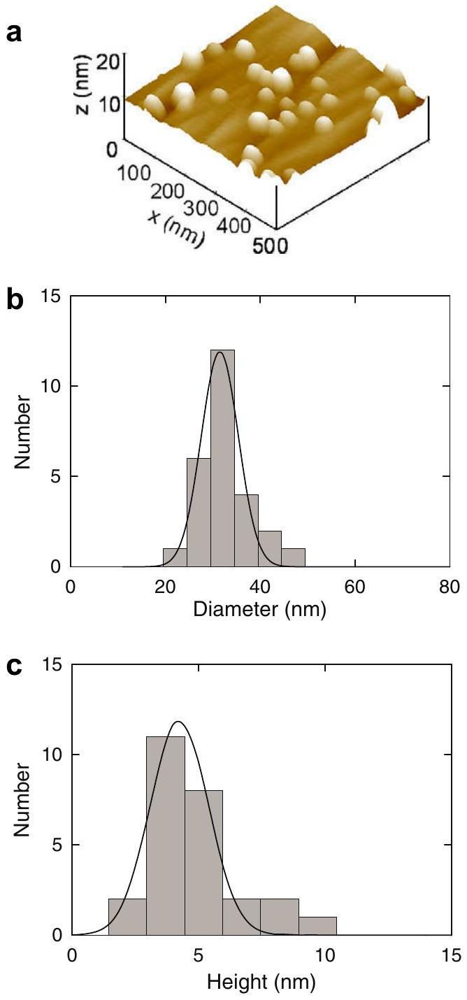
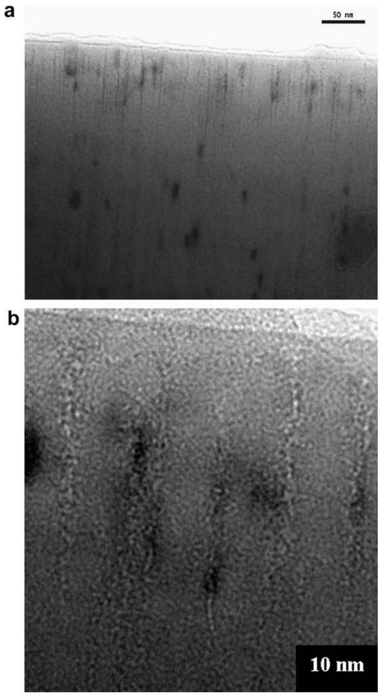
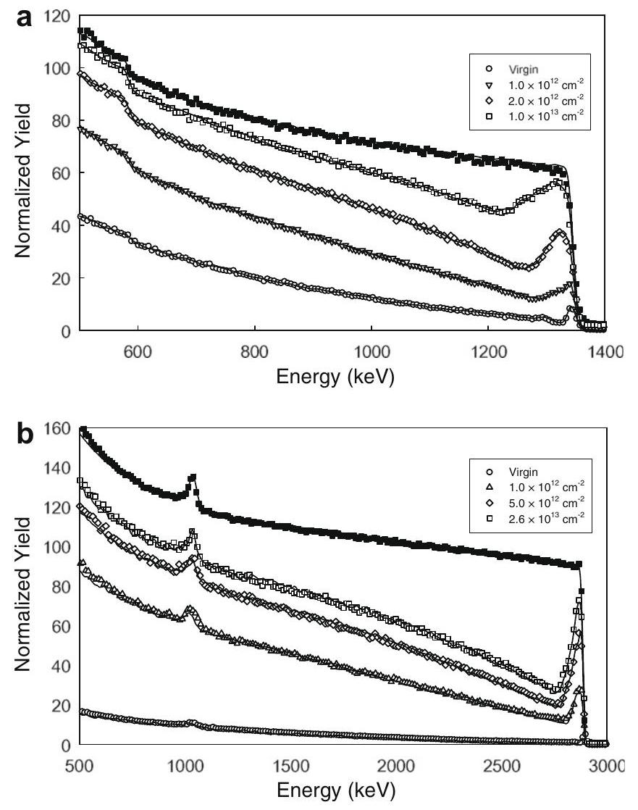
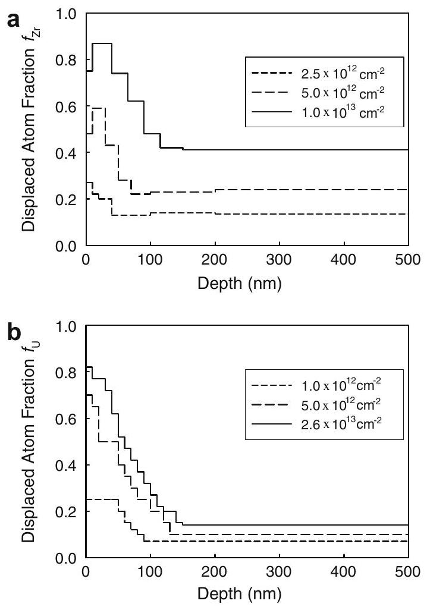
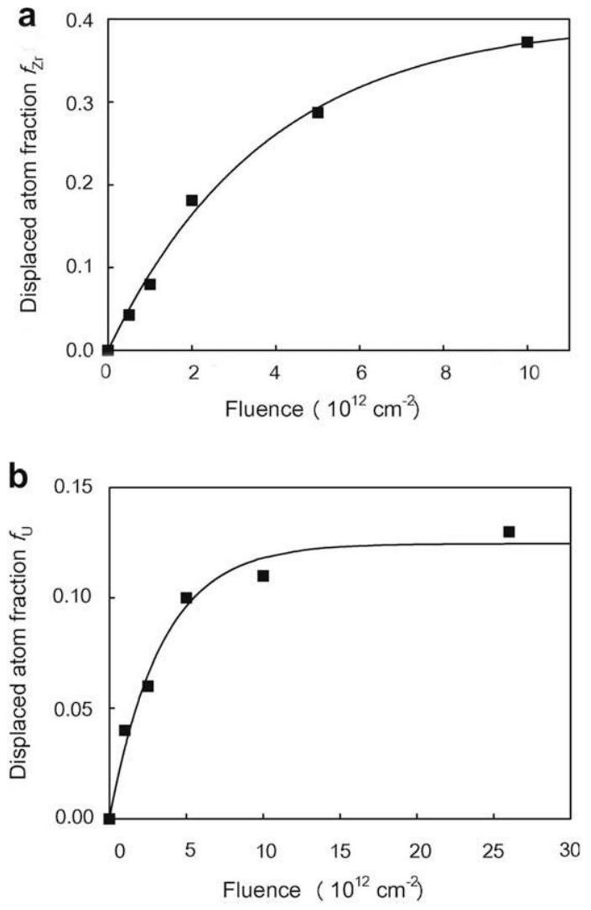
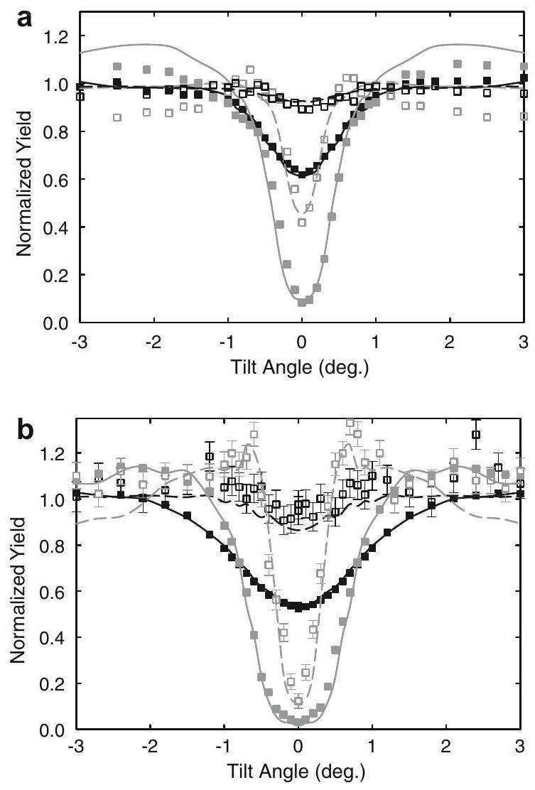

# Radiation tolerance of fluorite-structured oxides subjected to swift heavy ion irradiation 

Frédérico Garrido ${ }^{\mathrm{a}, *}$, Sandra Moll ${ }^{\mathrm{a}}$, Gaël Sattonnay ${ }^{\mathrm{b}}$, Lionel Thomé ${ }^{\mathrm{a}}$, Laetitia Vincent ${ }^{\mathrm{a}}$ ${ }^{\mathrm{a}}$ Centre de Spectrométrie Nucléaire et de Spectrométrie de Masse, CNRS-IN2P3-Université Paris-Sud, Bâtiments 104-108, 91405 Orsay Campus, France ${ }^{\mathrm{b}}$ Laboratoire d'Etude des Matériaux Hors Equilibre, Institut de Chimie Moléculaire et des Matériaux d'Orsay, Université Paris-Sud, Bâtiment 410, 91405 Orsay Cedex, France

## ARTICLE INFO

## Article history:

Available online 30 January 2009

## PACS:

61.80.Jh
81.05.Je
61.72.Bb
61.72.Cc
61.72.Ff
61.85.+p

## Keywords:

Ion irradiation
Electronic excitation
Fluorite-type structure
Nuclear oxide
Micro-structural transformations
Micro-domain formation

#### Abstract

Fluorite-structured materials are known to exhibit an excellent structural stability under irradiation. The radiation stability of urania and yttria-stabilised cubic zirconia single crystals submitted to intense electronic excitations induced by $944-\mathrm{MeV} \mathrm{Pb}^{53+}$ ions was investigated. Various analytical tools (TEM, AFM, RBS/C, XRD) were employed to examine the modifications induced at the surface and in the crystal bulk. At low fluence irradiation leads to the formation of localised ion tracks whose centre is hollowed in the surface region over a depth of $\sim 100 \mathrm{~nm}$ and to the formation of nanometer-sized hillocks. Both features are interpreted as resulting from an ejection of matter in the wake of the projectile. Track overlapping at high fluence results in the formation of micrometer-sized domains ( $\sim 50 \mathrm{~nm}$ ) in the crystal bulk characterised by a slight disorientation ( $\sim 0.2^{\circ}$ ) with respect to the main crystallographic orientation of the crystal.

© 2009 Elsevier B.V. All rights reserved.

## 1. Introduction

Binary metal compounds possessing the fluorite-type structure exhibit an exceptional resistance towards irradiation [1-7]. This crucial property promoted their extensive use in severe radiative environments, such as the nuclear industry and space applications. As a matter of fact, after decades of intensive operation in the nuclear industry, uranium dioxide $\mathrm{UO}_{2}$ and the ternary solid solution $(\mathrm{U}, \mathrm{Pu}) \mathrm{O}_{2}$ are still the world's top leading nuclear fuels. Similarly, recent researches are devoted to the possible use of actinide-doped cubic zirconia $(\mathrm{Zr}, \mathrm{An}) \mathrm{O}_{2}$ for in-reactor actinide transmutation. This ‘inert matrix fuel’ concept is based on the existence of numerous binary actinide oxides $\mathrm{AnO}_{2}$ possessing the fluorite-type structure, thus actinide atoms substitute regular matrix cations.

Despite experimental and theoretical approaches the structural stability under irradiation of fluorite-structured materials still poses a serious conundrum of a deep understanding of underlying reasons. The large ionicity generally exhibited by fluorite-type compounds was proposed as the key parameter explaining its radiation resistance. In this framework, experimental simulation with

[^0]ion beams provides a unique tool to investigate the radiation tolerance of solids and to examine the structural and micro-structural modifications by tuning relevant parameters, e.g. bombarding ions, energy, fluence, flux [8-10]. The present study focuses on the investigation of the radiation-damage in oxides created by intense electronic excitations in the wake of penetrating energetic ions. Uranium dioxide (urania) and yttria-stabilised cubic zirconia (hereafter called zirconia) single crystals were selected as canonical fluorite-structured oxides.

## 2. Experimental

Commercial yttria-stabilised cubic zirconia \{100\}-oriented single crystals were purchased from the company Crystal GmbH (Berlin, Germany). The structure is a defective fluorite structure altered by the incorporation of trivalent Y ions into the lattice along with their charge-compensating oxygen vacancies. \{100\}-oriented $\mathrm{UO}_{2}$ single crystals were cut from a large block which was oriented by the Laue method. They were subsequently polished with diamond paste up to mirror finish and finally annealed under $\mathrm{Ar} / \mathrm{H}_{2}$ to restore the stoichiometric composition and to recover the damage created by polishing.

Both fluorite-type crystals were irradiated at room temperature with $944-\mathrm{MeV} \mathrm{Pb}^{53+}$ ions delivered by the GANIL accelerator located at Caen, France. The fluence ranged typically from $10^{10} \mathrm{~cm}^{-2}$ up to a few $10^{13} \mathrm{~cm}^{-2}$. The ion flux was deliberately limited to $5 \times 10^{8} \mathrm{~cm}^{-2} \mathrm{~s}^{-1}$ to avoid excessive target heating during irradiation. Table 1 summarises irradiation conditions and parameters according to SRIM2008 calculations [11].

Crystals were ex situ characterised by various experimental techniques to probe both the damage created in the near-surface region - mainly by atomic force microscopy (AFM) in tapping mode and transmission electron microscopy (TEM) - and in the

Table 1
Irradiation parameters for $944-\mathrm{MeV} \mathrm{Pb}$ ions impinging in crystals.
| Fluorite-   type   oxide | Projected-   range $R_{\mathrm{p}}$   $(\mu \mathrm{m})$ | Range   straggling   $\Delta R_{\mathrm{P}}(\mu \mathrm{m})$ | Electronic stopping force $S_{\varepsilon}\left(\mathrm{keV} \mathrm{nm}^{-1}\right)$   (average value from the surface up to   $5 \mu \mathrm{~m}$ |
| :--- | :--- | :--- | :--- |
| $\mathrm{ZrO}_{2}$ | 28.5 | 0.9 | 44 |
| $\mathrm{UO}_{2}$ | 24.6 | 1.1 | 55 |

Fig. 1. (a) Surface topography of a $944-\mathrm{MeV}$ Pb-irradiated $\mathrm{UO}_{2}$ single crystal recorded by the AFM technique. The ion fluence is $\Phi=10^{10} \mathrm{~cm}^{-2}$. (b) Histogram of the diameter of hillocks (mean value is 31 nm ). (c) Histogram of the height of hillocks (mean value is 4.2 nm ).

crystal bulk - by X-ray diffraction analysis and Rutherford backscattering spectrometry in the channelling mode (RBS/C). In this latter analysing technique a $1.6-\mathrm{MeV}$ or a $3.085-\mathrm{MeV}$ He ions beam was employed to sense selectively the cationic sublattice and the oxygen sublattice by the use of the elastic resonant scattering ${ }^{16} \mathrm{O}\left({ }^{4} \mathrm{He},{ }^{4} \mathrm{He}\right)^{16} \mathrm{O}$ occurring at about 3.038 MeV . Channelling data were interpreted by means of the McChasy Monte Carlo-based computational code developed at the SINS-Warsaw [12].

## 3. Results and discussion

The damage created in the early stage of irradiation, i.e. at very low ion fluence, may be monitored by techniques visualising the near-surface region of crystals or investigating its surface topology, such as TEM and AFM techniques, respectively. It has been long established that damage creation in the crystal bulk in the electronic stopping regime originates from the formation of a cylindrical defective region (disordered or amorphous depending on material and irradiation conditions) around the ion's trajectory, leading to the formation of the so-called ‘latent tracks’ revealed by chemical etching [13]. Nonetheless the surface of the crystal defines a boundary where specific effects of the ion-solid surface interaction may be anticipated. Fig. 1(a) shows a typical example of a $\mathrm{UO}_{2}$ single crystal irradiated with $944-\mathrm{MeV} \mathrm{Pb}$ ions at very

Fig. 2. (a) Cross-sectional TEM image obtained from the surface region of a 944MeV irradiated $\mathrm{ZrO}_{2}$ single crystal. The ion fluence is $\Phi=10^{11} \mathrm{~cm}^{-2}$. Ion tracks are visible over the whole investigated depth. (b) Near-surface region characterised by the presence of hollow tracks.

low fluence, $\Phi=10^{10} \mathrm{~cm}^{-2}$, as seen by the AFM technique. Distributions of diameters and height are presented in Fig. 1(b) and (c). The disordering of the crystal surface in single-ion-irradiated zones is characterised by the presence of hillocks created by the passage of the swift ions into matter. The mean diameter of the hillock is about $\sim 30 \mathrm{~nm}$, i.e. much larger than the typical track diameter in the bulk region, suggests an analogy with the ejection of matter during a volcano eruption. Such a picture finds an echo in the cross-sectional TEM investigation presented in Fig. 2 where both the surface and sub-surface regions are depicted. Whilst the sub-surface region displays the presence of regular ion tracks with a typical diameter around 4 nm , the surface region (over a depth of 100 nm ) shows the presence a highly damaged region characterised by the presence of 'hollow tracks' where matter is missing and was likely ejected during the passage of bombarding ions.

When the ion fluence increases, overlapping of the single isolated ion tracks leads to a structural evolution of the material both in the surface and bulk regions. Both the nature and the quantitative estimation of the evolution of the damage may be accurately obtained by the RBS/C method. Fig. 3 shows the evolution of spectra recorded in the main $\langle 100\rangle$-axis at increasing ion fluence for both fluorite-type crystals. Two regions can be clearly identified: (i) a heavily damaged region in the surface region of the crystals whose spatial extension and disorder increase when increasing the ion fluence and finally saturate; (ii) the crystal bulk region extending from a typical depth $\sim 100 \mathrm{~nm}$ up to the maximum depth investigated by the RBS/C technique (up to $\sim 2 \mu \mathrm{~m}$ in the

Fig. 3. RBS spectra recorded on $944-\mathrm{MeV}$ Pb-irradiated $\mathrm{ZrO}_{2}$ (a) and $\mathrm{UO}_{2}$ (b) single crystals in random (full symbols) and $\langle 100\rangle$-axial (open symbols) directions at various ion fluences. The energy of He probing ions is 1.6 and 3.085 MeV for $\mathrm{ZrO}_{2}$ and $\mathrm{UO}_{2}$ crystals, respectively. Solid lines are fits to the experimental data assuming that cationic and oxygen lattice atoms are randomly displaced in the fluorite-type cell with a given probability at a given depth.

present case), characterised by a slowly increasing dechannelling level versus irradiation ion fluence. A quantitative analysis of the depth distribution in the defective region of crystal induced by the slowing-down of penetrating ions can be estimated by making assumptions on the nature of radiation defects. Classical estimations rely on the so-called 'two-beam approximation' implying that atoms are randomly displaced in the crystalline structure [14]. Since in the present case the undefective crystal region is not investigated by the probing ions due to a very large ion pro-jected-range, an analytical treatment is not feasible. Monte Carlo simulations were thus employed here assuming that, at a given depth, a given fraction of cationic and oxygen lattice atoms is randomly displaced in the structure with a given probability. Fits to experimental data (see solid lines in Fig. 3) provide depth distributions of displaced matrix atoms for cationic sublattices depicted on Fig. 4. A similar evolution of distributions is obtained for both types of crystals, i.e. the presence of the two already described zones, but the urania crystals appear to be more resistant tolerant than their zirconia counterpart, with calculated randomly displaced fraction lower both at a given ion fluence and at saturation.

Fig. 5 summarises experimental results and displays the evolution of the maximum fraction of randomly displaced atoms versus ion fluence. Data were successfully fitted by the widely known 'direct single-impact model' [15]. Such a description is based on the hypothesis that each ion creates a damaged region along the ion's path, in accordance with both TEM and AFM data, and that the final damage in the crystal is governed by the overlapping of tracks at high fluence. Thus, according to Poisson's law, the damaged fraction can be written as: $f=f_{\mathrm{S}}(1-\exp (-\sigma \Phi))$, where $f_{\mathrm{S}}$ and $\sigma$ denotes the fraction of randomly displaced atoms at saturation and the damage cross-section, respectively. Assuming that tracks are con-

Fig. 4. Depth distribution of the damage induced by the slowing-down of $944-\mathrm{MeV}$ Pb ions in $\mathrm{ZrO}_{2}$ (a) and $\mathrm{UO}_{2}$ (b) single crystals at selected ion fluences corresponding to Fig. 3. The radiation-damage distribution was evaluated assuming that cationic and oxygen atoms are randomly displaced in the crystal cell according to fits to spectra presented in Fig. 3.

Fig. 5. Fraction of randomly displaced atoms in a $200-500 \mathrm{~nm}$ depth range (i.e. in the steady-state regime after the huge surface disorder) as a function of the ion fluence. The data is recorded on the cationic sublattice for $\mathrm{ZrO}_{2}$ (a) and $\mathrm{UO}_{2}$ (b) single crystals. Lines are fits to experimental data assuming a direct single-impact model.

Table 2
Parameters extracted from the analysis of the depth distribution of randomly displaced atoms calculated at the maximum damage for $\langle 100\rangle$-oriented crystals.
| Fluorite-   type oxide | Damage cross-   section $\left(\mathrm{nm}^{2}\right)$ | Track   radius   $(\mathrm{nm})$ | Fraction of randomly displaced   atoms at saturation $\left(f_{\mathrm{s}}\right)$ |
| :--- | :--- | :--- | :--- |
| $\mathrm{ZrO}_{2}$ | 26 | 2.9 | 0.40 |
| $\mathrm{UO}_{2}$ | 30 | 3.1 | 0.13 |

tinuous an effective track radius $R$ may be estimated according to the equation $\sigma=\pi R^{2}$. The damage cross-section Table 2 shows values of fitting parameters for the two classes of investigated crystal. Whilst $f_{\mathrm{S}}$ values clearly differ, zirconia appears more affected by irradiation than urania, values of the damage cross-section are very similar, supporting the idea that the spatial extension of the cylindrical damage region in the same irradiation conditions is almost identical for both systems. Similar trends towards radiation tolerance were also seen in low-energy implanted urania and zirconia single crystals [16]. Possible reasons for the difference of radiation tolerance likely originate from the ionicity of the chemical bond in both fluorite-type crystals [17].

A detailed investigation of the nature of the structural reorganisation of fluorite-type crystals at large fluence was performed by recording angular scans across main crystallographic axes. Fig. 6 compares scans recorded on both virgin and irradiated fluoritetype crystals across the main $\langle 100\rangle$-axis off main crystallographic planes. The cationic and oxygen signals were recorded in the region just beyond the heavily damaged surface region. Scans re-

Fig. 6. Angular scans recorded on $\mathrm{ZrO}_{2}$ (a) and $\mathrm{UO}_{2}$ (b) single crystals across the [100] direction off main crystallographic planes. Black and gray data and fits correspond to signals recorded on the irradiated and virgin parts of crystals, respectively. Full and open squares are data recorded on the cationic and oxygen sublattice, respectively. The ion fluence is $\Phi=5 \times 10^{12} \mathrm{~cm}^{-2}$ and $\Phi=2.6 \times 10^{13} \mathrm{~cm}^{-2}$ for $\mathrm{ZrO}_{2}$ and $\mathrm{UO}_{2}$ crystals, respectively. Solid lines are fits to the experimental data assuming: (i) a defect-free $\mathrm{MO}_{2}$ single crystal for the virgin part; (ii) the presence of micrometer-sized domains with characteristic length $\lambda$ and disorientation angle $\delta: \lambda\left(\mathrm{ZrO}_{2}\right)=60 \mathrm{~nm} ; \delta\left(\mathrm{ZrO}_{2}\right)=0.26^{\circ} ; \lambda\left(\mathrm{UO}_{2}\right)=40 \mathrm{~nm} ; \delta\left(\mathrm{UO}_{2}\right)= 0.25^{\circ}$. Amplitudes of thermal vibrations are $u_{\mathrm{Zr}}\left(\mathrm{ZrO}_{2}\right)=10 \mathrm{pm}$; $u_{\mathrm{O}}\left(\mathrm{ZrO}_{2}\right)=15 \mathrm{pm}$; $u_{\mathrm{U}}\left(\mathrm{UO}_{2}\right)=6.5 \mathrm{pm}, u_{\mathrm{O}}\left(\mathrm{UO}_{2}\right)=9 \mathrm{pm}$.

corded on irradiated crystals exhibit tremendous modifications as compared to virgin ones, characterised by a large increase of the minimum axial yield and by a narrowing of the angular scan, confirming the fact that the crystal structure suffered large distortion albeit remaining crystalline. Various models of disorder to reproduce the defective structure of irradiated crystals were unsuccessfully tested, including the displacement of matrix atoms in specific sites, amorphisation of a given fraction of the lattice. A satisfactory explanation supports an interpretation in terms of the formation of slightly disoriented micro-domains parameterised by a mean characteristic length $\lambda$ and a disorientation angle $\delta$. The crystalline structure of a micro-domain is assumed to be pristine. Monte Carlo simulations of channelling data can be successfully reproduced by assuming sets of values $(\lambda, \delta)=\left(60 \mathrm{~nm}, 0.26^{\circ}\right)$ and ( $40 \mathrm{~nm}, 0.25^{\circ}$ ), for $\mathrm{ZrO}_{2}$ and $\mathrm{UO}_{2}$ crystals, respectively. It is striking to note that the formation of micro-grains, as supported by the channelling data, is in excellent agreement, both qualitatively and quantitatively, with data recorded from X-ray diffraction analysis performed by recording $\theta-2 \theta$ and $\omega$-scans: ( $49 \mathrm{~nm}, 0.28^{\circ}$ ) and $\left(40 \mathrm{~nm}, 0.18^{\circ}\right)$, for $\mathrm{ZrO}_{2}$ and $\mathrm{UO}_{2}$ crystals, respectively [18,19].

The structural reorganisations of irradiated crystals may be interpreted in the framework of the thermal spike model [20]. In this description a penetrating ion acts as an intense and localised source of energy in the electronic system of the solid, which is fi-
nally transferred to the atomic system through electron-phonon interactions. The solid is thus submitted to an intense and localised source of heat leading to a huge increase of temperature during a typical duration of a femtosecond, followed by thermal quench. Thus, the local temperature in the ion track may exceed the melting point of the material and structural or micro-structural transformations triggered by the electronic stopping may occur. The formation of hillocks at the surface is thus explained by the expulsion of matter from the tracks located in the sub-surface region. Calculations performed assuming a two-dimensional Gaussianshaped hillock show that its total volume deduced from AFM is in good agreement with the volume of the missing matter located in a hollowed track, as seen by TEM. The combined presence of hillocks and hollowed tracks in the surface region strongly alters trajectories of probing analysing ions in RBS/C, explaining the presence of a heavily damaged region extending over a depth of 100 nm . In this respect the thickness increase of the damaged surface region with increasing the ion fluence suggests a progressive re-construction in this region. A deeper investigation of the crystalline structure of this surface region - specially its crystallographic relationship with the underlying single crystal - is definitely the next challenge to be faced.

## 4. Conclusion

In this study, we aimed to investigate the radiation stability of fluorite-structured nuclear oxides submitted to intense electronic excitations. This goal was achieved by irradiation of two materials belonging to that class of solids: urania which is the fuel used in nuclear reactors, and yttria-stabilised zirconia, which is considered to be one of the more promising actinide transmutation matrices. Various analytical techniques (TEM, AFM, RBS/C, XRD), probing the structure of solids at different scales, were used to enlighten the mechanism of radiation production in the electronic energy loss regime.

At low ion fluences ion tracks are created by individual ion impacts. The formation of tracks is due to the huge electronic excitations induced in the wake of incident ions which lead to a local melting of the material via a thermal spike mechanism. At the surface of the irradiated solid, large hillocks are formed, likely due the ejection of matter from the molten core of tracks by a mechanism similar to that occurring during a volcano eruption, explaining the large difference between the value of the track diameter measured in the crystal bulk and the diameter of the hillock at the surface.

At large ion fluence track overlapping occurs and the microstructure of the material evolves upon irradiation. Micrometresized domains are formed in both fluorite-type oxides. Their size decreases with increasing the ion fluence and finally saturates. A
concomitant increase and saturation of the disorientation of domains with respect to the main crystallographic direction is observed. Finally, the present investigation extends the wellestablished radiation tolerance of fluorite-structured materials to the specific case of intense electronic excitations.

## Acknowledgments

High energy heavy ion irradiations were performed at the GANIL accelerator on the CIRIL facility. We are indebted to Dr. Abdenacer Benyagoub for his insightful advice during irradiation experiments. Ion channelling measurements were performed at the JANNuS facility on the Orsay Campus. We are grateful to the staff for their help with the tandem accelerator. This work was partially supported by the Programme sur l'Aval du Cycle et l'Energie Nucléaire (PACEN) of CNRS via the GdR MATériaux INnovants en conditions EXtrêmes (MATINEX).

## References

[1] B. Lustman, Irradiation effects in uranium dioxide, Uranium Dioxide: Properties and Nuclear Applications, US Govt. Printing Office, Washington, DC, 1961, p. 431 (Chapter 9).
[2] C. Degueldre, U. Kasemeyer, F. Botta, G. Ledergerber, Mater. Res. Soc. Proc. 412 (1996) 15.
[3] J. Weber, R.C. Ewing, C.R.A. Catlow, T. Diaz de la Rubia, L.W. Hobbs, C. Kinoshita, Hj. Matzke, A.T. Motta, M. Nastasi, E.H.K. Salje, E.R. Vance, S.J. Zinkle, J. Mater. Res. 13 (1998) 1434.
[4] C. Degueldre, J.M. Paratte, J. Nucl. Mater. 274 (1999) 1.
[5] K.E. Sickafus, Hj. Matzke, Th. Hartmann, K. Yasuda, J.A. Valdez, P. Chodak III, M. Nastasi, R.A. Verrall, J. Nucl. Mater. 274 (1999) 66.
[6] L. Thomé, J. Fradin, J. Jagielski, A. Gentils, S.E. Enescu, F. Garrido, Eur. Phys. J.: Appl. Phys. 24 (2003) 37.
[7] K.E. Sickafus, R.W. Grimes, J.A. Valdez, A. Cleave, M. Tang, M. Ishimaru, S.M. Corish, C.R. Stanek, B.P. Uberuaga, Nat. Mater. 6 (2007) 217.
[8] L. Thomé, F. Garrido, Vacuum 43 (2001) 619.
[9] F. Garrido, A. Gentils, L. Thomé, Surf. Coat. Technol. 196 (2005) 63.
[10] F. Garrido, L. Nowicki, L. Thomé, Nucl. Instr. and Meth. Phys. Res. B 240 (2005) 250.
[11] J.F. Ziegler, J.P. Biersack, U. Littmark, The Stopping and Ranges of Ions in Solids, Vol. 1, The SRIM2008 Package, Pergaman Press, New York, 1985. <www.srim.org>.
[12] L. Nowicki, A. Turos, R. Ratajczak, A. Stonert, F. Garrido, Nucl. Instr. and Meth. Phys. Res. B 240 (2005) 277.
[13] R.L. Fleischer, P.B. Price, R.M. Walker, Nuclear Tracks in Solids: Principles and Applications, University of California Press, Berkeley, CA, 1975.
[14] L.C. Feldman, J.W. Mayer, S.T. Picraux, Materials Analysis by Ion Channeling Submicron Crystallography, Academic Press, New York, 1982.
[15] J.F. Gibbons, Proc. IEEE 60 (1972) 1062.
[16] F. Garrido, L. Vincent, L. Nowicki, G. Sattonnay, L. Thomé, Nucl. Instr. and Meth. Phys. Res. B 266 (2008) 2842.
[17] H.M. Naguib, R. Kelly, Radiat. Effects 25 (1975) 1.
[18] S. Moll, L. Thomé, L. Vincent, F. Garrido, G. Sattonnay, T. Thomé, J. Jagielski, J.-M. Constantini, J. Appl. Phys. 105 (2009) 023512.
[19] F. Garrido, L. Nowicki, G. Sattonnay, L. Thomé, L. Vincent, in preparation.
[20] For a review see: S. Klaumünzer, Matematisk-Fysiske Meddelelser Konglige Danske Videnskabernes Selskab 52 (2006) 293.

[^0]:    * Corresponding author. Tel.: +33 1 69155257; fax: +33 169155268.

    E-mail address: Frederico.Garrido@csnsm.in2p3.fr (F. Garrido).

