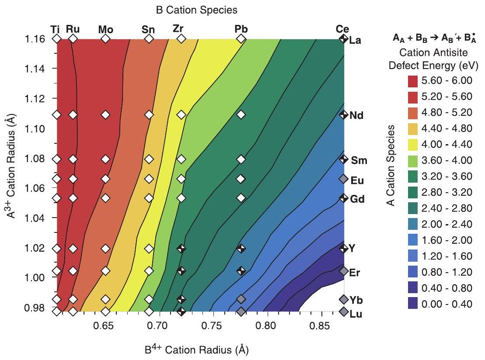
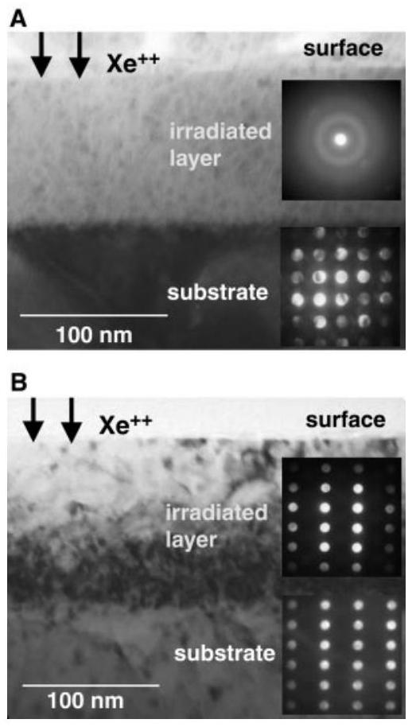
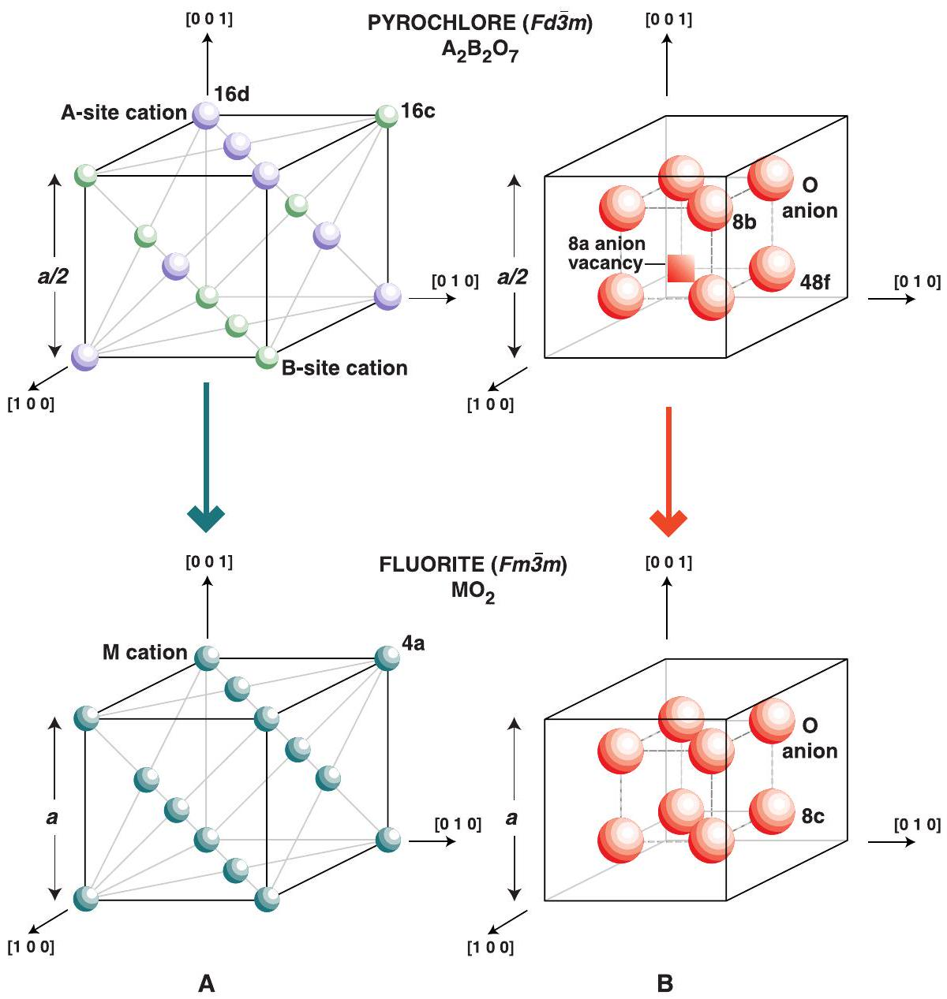

Mott-insulating AF phase (23). However, at the surface of $\mathrm{Sr}_{2} \mathrm{RuO}_{4}$, our calculations show that band narrowing increases the density of states at the Fermi energy, which will stabilize the FM order. As expected, the bandwidth of the $d_{\mathrm{xy}}$ orbital becomes narrower as the octhedra rotates, which for the nonmagnetic case pulls the VHS slightly below the Fermi energy. The high density of states at the Fermi energy enhances FM spin fluctuations and, in this case, leads to a FM ground state at the surface. This observation at the surface of $\mathrm{Sr}_{2} \mathrm{RuO}_{4}$ opens up many exciting prospects relevant to the bulk and surface properties of these layered transition metal oxides. One exciting example is the coexistence of FM order and superconductivity $(24,25)$.

## References and Notes

1. Y. Maeno et al., Nature 372, 532 (1994).
2. G. M. Luke et al., Nature 394, 558 (1998); T. M. Riseman et al., Nature 396, 242 (1998); K. Ishida et al., Nature 396, 658 (1998).
3. T. M. Rice and M. Sigrist, J. Phys. Condens. Matter 7, L643 (1995).
4. M. Braden et al., Physica C 273, 248 (1997).
5. M. Braden et al., Phys. Rev. B 57, 1236 (1998).
6. T. Imai et al., Phys. Rev. Lett. 81, 3006 (1998).
7. H. Mukuda et al., J. Phys. Soc. Jpn. 67, 3954 (1998); Phys. Rev. B 60, 12279 (1999).
8. I. I. Mazin and D. J. Singh, Phys. Rev. Lett. 79, 733 (1997); L. Tewordt, Phys. Rev. Lett. 83, 1007 (1999).
9. I. I. Mazin and D. J. Singh, Phys. Rev. Lett. 82, 4324 (1999).
10. Y. Sidis et al., Phys. Rev. Lett. 83, 3320 (1999).
11. The samples were glued with silver epoxy on a holder, and a metal post was glued on top of the sample. After introduction into an ultrahigh vacuum ( $<10^{-10}$ mbar), they were cleaved at room temperature by breaking off the post.
12. Samples cleaved at $T<4 \mathrm{~K}$ also exhibit ( $\sqrt{2} \times \sqrt{2}$ ) $\mathrm{R} 45^{\circ}$ reconstruction [E. W. Hudson et al., Bull. Am. Phys. Soc. 44, 1369 (1999)].
13. We thank P. Dai and H. Kawano for supplying the second sample.
14. D. Vanderbilt, Phys. Rev. B 41, 7892 (1990).
15. P. K. De Boer and R. A. de Groot, Phys. Rev. B 59, 9894 (1999).
16. Theory predicts that the ground state of the surface is FM. A crucial question is what is the magnetic transition temperature? Unfortunately, the precision of the LEED structural determination cannot be used to determine the difference between the $6.5^{\circ}$ rotation for a nonmagnetic surface and $9^{\circ}$ rotation for a magnetic surface predicted by theory. A theoretical determination of the transition temperature would require a calculation of the excitation states of the system, which is beyond our ability.
17. T. Yokoya et al., Phys. Rev. Lett. 76, 3009 (1996).
18. D. H. Lu et al., Phys. Rev. Lett. 76, 4845 (1996).
19. A. V. Puchkov et al., Phys. Rev. B 58, R13322 (1998).
20. A. P. Mackenzie et al., Phys. Rev. Lett. 76, 3786 (1996).
21. T. Oguchi, Phys. Rev. B 51, 1385 (1995); D. J. Singh, Phys. Rev. B 52, 1358 (1995).
22. D. F. Agterberg, T. M. Rice, M. Sigrist, Phys. Rev. Lett. 78, 3374 (1997).
23. N. F. Mott, Metal-Insulator Transitions (Taylor \& Francis, New York, ed. 2, 1990).
24. W. E. Pickett et al., Phys. Rev. Lett. 83, 3713 (1999).
25. C. Bernhard et al., Phys. Rev. B 59, 14099 (1999).
26. We acknowledge the use of the Barbieri/Van Hove Symmetrized Automated Tensor LEED package, available from M. A. Van Hove. R.M. gratefully acknowledges a Feodor Lynen fellowship of the Alexander von Humboldt foundation. Supported by JRCAT, NSF, and DOE.

31 April 2000; accepted 7 June 2000

One of the principal factors complicating the selection of materials for nuclear waste storage is the susceptibility of waste forms to detrimental radiation damage effects. Several crystalline ceramics, such as zircon $\left(\mathrm{ZrSiO}_{4}\right)$ and the orthophosphate monazite ( $\mathrm{LnPO}_{4}$; $\mathrm{Ln}=\mathrm{La}, \mathrm{Ce}, \mathrm{Nd}, \mathrm{Gd}$, and others in the lanthanide series), exhibit both high chemical durability and solubility for actinides and other radionuclides, and are therefore attractive candidates for nuclear-waste host materials $(1,2)$. However, among the chemically stable host phases proposed for waste storage, there is a paucity of materials for which long-term stability can be anticipated. This is because radioactive constituents in high-level waste (HLW) can decay to produce numerous atomic defects. Most materials are destabilized by such defects, and if defect accumulation is allowed to proceed unchecked, crystalline oxides ultimately succumb to an amorphization transformation, often accompanied by significant volume changes (3) and concomitant microcracking (4).

The technical challenge for HLW storage has therefore been to identify materials for which deleterious radiation effects are averted even at very high self-radiation exposures. The principal consequence of a displacive radiation environment is an elevated population in the lattice of Frenkel pairs (each pair consisting of an atomic interstitial and a lattice vacancy). Subsequent damage evolution hinges on two important factors. First is the degree to which lattice stability is affected by the accumulation of point defects. This factor influences a materials propensity to amorphize under irradiation. The second factor

[^0]concerns the ultimate fate of irradiation-induced point defects. Interstitials and vacancies can migrate and annihilate harmlessly by interstitial-vacancy ( $i-v$ ) recombination (the reverse of a Frenkel reaction), or they can cluster with other interstitials and vacancies to precipitate interstitial dislocation loops and voids. A material in which clustering occurs with ease will likely be susceptible to void swelling.

Many simple oxides such as magnesia $(\mathrm{MgO})$ and alumina $\left(\mathrm{Al}_{2} \mathrm{O}_{3}\right)$ are susceptible to void swelling (5). On the other hand, and perhaps surprisingly, a compound made from an equimolar mixture of MgO and $\mathrm{Al}_{2} \mathrm{O}_{3}$ (best known as the mineral spinel, $\mathrm{MgAl}_{2} \mathrm{O}_{4}$ ) is highly resistant to void swelling under neutron irradiation (5). The radiation-resistant behavior of spinel, which is exceptional for a ceramic, is most likely due to the following factors: (i) Complex chemistry causes the critical size of a dislocation loop nucleus to become unusually large (6). This necessarily suppresses loop nucleation. (ii) Complex structure generates constraints that prohibit dislocation loops from easily unfaulting (7). Faulted interstitial loops remain poor sinks (compared to unfaulted loops) for interstitial absorption. (iii) Some materials like spinel readily accommodate disordering defects within their structures. In fact, the cation sublattices in spinel can be completely disordered by high-fluence neutron irradiation (8). For all of these reasons, harmless $i-v$ recombination (including cation antisite formation, i.e., swapping the position of one Mg cation with one Al cation) in spinel is a highly efficient point defect annihilation mechanism, and void swelling is negligible.

To test the generality of these attributes for radiation tolerance, we recently initiated an investigation into the radiation damage behavior of an extensive class of complex oxides known as pyrochlores. Oxide pyrochlores are typically ternary compounds of the general formula $\mathrm{A}_{2} \mathrm{~B}_{2} \mathrm{O}_{7}$ (where A and B are metallic cations). The simplest pyrochlore

# Radiation Tolerance of Complex Oxides 

K. E. Sickafus, ${ }^{\mathbf{1} \boldsymbol{*}}$ L. Minervini, ${ }^{\mathbf{2}}$ R. W. Grimes, ${ }^{\mathbf{2}}$ J. A. Valdez, ${ }^{\mathbf{1}}$ M. Ishimaru, ${ }^{\mathbf{3}}$ F. Li, ${ }^{\mathbf{1}}$ K. J. McClellan, ${ }^{\mathbf{1}}$ T. Hartmann ${ }^{\mathbf{1}}$

#### Abstract

The radiation performance of a variety of complex oxides is predicted on the basis of a material's propensity to accommodate lattice point defects. The calculations indicate that a particular class of oxides possessing the fluorite crystal structure should accept radiation-induced defects into their lattices far more readily than a structurally similar class of oxides based on the pyrochlore crystal structure. Preliminary radiation damage experiments substantiate the prediction that fluorites are inherently more radiation resistant than pyrochlores. These results may permit the chemical durability and radiation tolerance of potential hosts for actinides and radioactive wastes to be tailored.

oxides occur in two varieties: $(3+, 4+)$ pyrochlores with the formula $\mathrm{A}_{2}^{3+} \mathrm{B}_{2}^{4+} \mathrm{O}_{7}$; and $(2+, 5+)$ pyrochlores with the formula $\mathrm{A}_{2}^{2+} \mathrm{B}_{2}^{5+} \mathrm{O}_{7}$. For brevity, we concern ourselves here only with $(3+, 4+)$ compounds. Pyrochlores gained notoriety as potential nuclear waste forms because of their structural compatibility with large radionuclide species such as elements in the actinide series (Th, U, Pu) (9).

We used atomistic computer simulation methods to calculate the detailed crystal structure of ( $3+$, $4+$ ) cubic pyrochlore compounds (10). We considered cations ranging from La to Lu on the A site and Ti to Ce on the B site. Our approach allowed us to study not only the perfect crystal lattice, but also to predict the extent to which a given lattice accommodates point defects. Our goal was to develop a quantitative understanding of the trends involved in cation disorder, cation and anion Frenkel disorder, and the interdependence of these disorder mechanisms, as a function of A and B cation radii. Atomistic computer simulation techniques, based on energy minimization with a Born-like description of the lattice (11), were used to generate the various compound structures. Thus, lattice forces are described by effective potentials which have both long-range Coulombic and short-range parameterized components. In addition, the polarizability of ions is accounted for by using a shell model. The model parameters are reported in a study of defects in $\mathrm{ZrO}_{2}$ (12). Calculations were carried out using the CASCADE code (13).

We determined the isolated cation antisite defect energy, as a function of A and B cation radii (14), for a wide range of $\mathrm{A}_{2} \mathrm{~B}_{2} \mathrm{O}_{7}$ compounds (Fig. 1). In pyrochlores, the cation antisite is the lowest energy intrinsic disorder mechanism. This mechanism involves the substitution of a $3+$ cation onto a B site, i.e., $\mathrm{A}_{\mathrm{B}^{4+}}^{3+}$ (henceforth denoted by $\mathrm{A}_{\mathrm{B}}^{\prime}$ ), and a $4+$ cation onto an A site, i.e., $\mathrm{B}_{\mathrm{A}^{3+}}^{4+}$ (henceforth denoted by $\mathrm{B}_{\mathrm{A}}$ ).

Figure 1 provides insight into the stability range of the pyrochlore structure with respect to cation disorder. The plot indicates that antisite defect formation is accompanied by a high energy cost in compounds containing large A cations and comparatively small B cations. The lowest defect energies are associated with compounds in which A and B radii are similar (15). Cation antisite defects are an inevitable consequence of a displacive radiation environment, and Fig. 1 can thus also be interpreted as a predictor of radiation damage behavior: compounds with very dissimilar cationic radii should exhibit the greatest susceptibility to lattice destabilization (and possible amorphization), whereas compounds with similar radii should behave more robustly in a radiation environment (16).

We have included symbols in Fig. 1 to
indicate whether a particular $\mathrm{A}_{2} \mathrm{~B}_{2} \mathrm{O}_{7}$ compound is observed experimentally as a pyrochlore. When the pyrochlore structure is not observed experimentally, the fluorite ( $\mathrm{CaF}_{2}$ ) crystal structure is inevitably found in its place (10, 17-19). There is a close crystallographic similarity between the pyrochlore and fluorite structures (Fig. 2). The cation sublattices in both cases consist of atoms located at face-centered lattice positions. The only difference is the ordered arrangement of A and B cations in the pyrochlore, compared to the lack of distinction between cations in the fluorite. Similarly, the anion arrangements are identical in both structures, with the exception of a vacant site at an 8a Wycoff position in the pyrochlore lattice (20). Thus, it is not only the ordered arrangement of cations but also the ordered arrangement of anion vacancies which induces a doubly-periodic unit cell in a pyrochlore, compared to a fluorite unit cell. If pyrochlore A and B cations were to randomly exchange places with one another, and anions were likewise to randomly exchange places with anion vacant sites (at 8a), such a pyrochlore would assume the identical periodicity and structure as a fluorite (21). This is precisely what we predict to occur under irradiation. The cation sublattice will disorder via cation antisite reactions, $\mathrm{A}_{\mathrm{A}}+\mathrm{B}_{\mathrm{B}} \rightarrow \mathrm{A}_{\mathrm{B}}^{\prime}+\mathrm{B}_{\mathrm{A}}^{\prime}$, whereas anions will partake in Frenkel defect formation
reactions, $\mathrm{O}_{\mathrm{O}} \rightarrow \mathrm{V}_{\mathrm{O}}^{* *}+\mathrm{O}_{\mathrm{i}}^{\prime \prime}$, leading to disorder on both cation and anion sublattices (22). The superlattice characteristics of the pyrochlore will be destroyed by irradiation, as the compound adopts the appearance of a disordered fluorite. This effect was recently confirmed experimentally (23).

All of this discussion is implicit in an analysis of Fig. 1, which indicates that compounds with more similar cation radii are more likely to form as disordered fluorites than as ordered pyrochlores, because the energy expended to form the kinds of defects that cause an ordered pyrochlore to resemble a disordered fluorite (cation antisites and anion Frenkels) is far lower for compounds of similar cation radii, compared with compounds containing A and B cations with highly disparate sizes. Take, for instance, $\mathrm{Er}_{2} \mathrm{Ti}_{2} \mathrm{O}_{7}$, a compound in the left-hand portion of Fig. 1, for which $r\left(\operatorname{Er}_{V I I I}^{3+}\right): r\left(\mathrm{Ti}_{V I}^{4+}\right) \approx$ 1.66 (14). Experiments indicate that this compound forms as a highly ordered pyrochlore (24). We also anticipate this compound to behave poorly under irradiation, due to the high formation energies associated with disordering point defects. Apparently, disordering defects destabilize the lattice; this is why $\mathrm{Er}_{2} \mathrm{Ti}_{2} \mathrm{O}_{7}$ orders upon synthesis. Now consider $\mathrm{Er}_{2} \mathrm{Zr}_{2} \mathrm{O}_{7}$, a compound located farther to the right-hand side in Fig. 1, for which $r\left(\operatorname{Er}_{V I I I}^{3+}\right): r\left(\operatorname{Zr}_{V I}^{4+}\right) \approx 1.39(14)$. We synthe-

Fig. 1. Contour map showing the calculated isolated antisite defect formation energy for a variety of compounds with $\mathrm{A}_{2} \mathrm{~B}_{2} \mathrm{O}_{7}$ stoichiometry. Cations are arranged in order of increasing radii along both the ordinate and the abscissa. For each compound, calculations were performed assuming a cubic unit cell containing eight formula units. Experimentally confirmed pyrochlores are indicated with open symbols; checkered symbols represent compounds known to form fluorites. For compounds labeled with gray symbols, structural data were not available or the compounds have not been observed experimentally. The white region in the lower right-hand corner includes compositions for which the enthalpy of the cation antisite reaction is negative (i.e., cation antisites form spontaneously). Each color contour corresponds to a range of defect energy given in the scale to the right.

sized a single crystal of $\mathrm{Er}_{2} \mathrm{Zr}_{2} \mathrm{O}_{7}$ for this study and found that it crystallizes not as an ordered pyrochlore, but as a disordered fluorite (24). On the basis of its structure, we would not expect $\mathrm{Er}_{2} \mathrm{Zr}_{2} \mathrm{O}_{7}$ to be adversely affected by irradiation; the as-synthesized structure establishes that $\mathrm{Er}_{2} \mathrm{Zr}_{2} \mathrm{O}_{7}$ is stable in the presence of disordering defects. The structure of $\mathrm{Er}_{2} \mathrm{Zr}_{2} \mathrm{O}_{7}$ should therefore persist in a radiation environment.

As a test of the predictive capabilities of our atomistic simulation results in terms of radiation damage behavior, we performed ion irradiation experiments to determine the radiation performance of $\mathrm{Er}_{2} \mathrm{Ti}_{2} \mathrm{O}_{7}$ and $\mathrm{Er}_{2} \mathrm{Zr}_{2} \mathrm{O}_{7}$. The results verify our predictions (Fig. 3). The $\mathrm{Er}_{2} \mathrm{Ti}_{2} \mathrm{O}_{7}$ is amorphized by irradiation with heavy ions ( Xe ) at a fairly low ion dose, whereas $\mathrm{Er}_{2} \mathrm{Zr}_{2} \mathrm{O}_{7}$ remains crystalline to a high dose of Xe ion irradiation, with
no apparent change in crystal structure. These results imply that the zirconate, which commenced existence as a disordered fluorite, is less perturbed by the introduction of defects due to irradiation than is the titanate, which began as a highly-ordered pyrochlore. In some sense, this comes as little surprise because even before exposure to ions, the zirconate resembled an irradiated compound.

Many additional experiments support our conclusions. Several radiation damage studies on $\mathrm{Gd}_{2} \mathrm{Ti}_{2} \mathrm{O}_{7}$ have demonstrated that this titanate pyrochlore is very susceptible to amorphization (23). Also, a recent study on a series of compounds with the composition $\mathrm{Gd}_{2}\left(\mathrm{Ti}_{1-\mathrm{x}^{-}}-\right. \left.\mathrm{Zr}_{\mathrm{x}}\right)_{2} \mathrm{O}_{2}$, ranging from $\mathrm{Gd}_{2} \mathrm{Ti}_{2} \mathrm{O}_{7}$ to $\mathrm{Gd}_{2} \mathrm{Zr}_{2} \mathrm{O}_{7}$, indicates that radiation resistance improves with increasing Zr content (25). Studies of $\mathrm{UO}_{2}$ (26) and cubic-stabilized $\mathrm{ZrO}_{2}$ (27) have established that compounds with the fluorite struc-
ture are especially stable in a displacive radiation damage environment. We propose therefore that complex oxides with pyrochlore and fluorite structures are well-postured to test a new supposition regarding radiation damage effects in ceramics, namely that a material that possesses both complex chemistry and complex structure, and exhibits an inherent propensity to accommodate lattice disorder, should be able to resist lattice instability and possibly void swelling (28) in the presence of a displacive radiation environment. Calculations and preliminary experiments pertaining to a variety of $\mathrm{A}_{2} \mathrm{~B}_{2} \mathrm{O}_{7}$ compounds, with structures ranging from ordered pyrochlores to disordered fluorites, seem to confirm this hypothesis. This information is invaluable to the development

Fig. 3. Cross-sectional transmission electron microscope (TEM) bright-field (BF) images obtained from (A) a Xe ion-irradiated $\mathrm{Er}_{2} \mathrm{Ti}_{2} \mathrm{O}_{7}$ single crystal and (B) a Xe ion-irradiated $\mathrm{Er}_{2} \mathrm{Zr}_{2} \mathrm{O}_{7}$ single crystal. The sample in (A) was irradiated under cryogenic conditions ( $T \sim 120$ K) using $350-\mathrm{keV} \mathrm{Xe}^{++}$ions to a fluence of $1 \times 10^{15} \mathrm{Xe} / \mathrm{cm}^{2}$. The sample in (B) was irradiated using the same conditions as in (A), but to a higher fluence of $1 \times 10^{16} \mathrm{Xe} / \mathrm{cm}^{2}$. The BF image and the corresponding electron microdiffraction patterns (right) in (A) indicate that the irradiated layer ( $\sim 100 \mathrm{~nm}$ thick) in $\mathrm{Er}_{2} \mathrm{Ti}_{2} \mathrm{O}_{7}$ is completely amorphized by the ion irradiation. The BF image and corresponding electron microdiffraction patterns (right) in (B) indicate that the irradiated layer ( $\sim 130 \mathrm{~nm}$ thick) in $\mathrm{Er}_{2} \mathrm{Zr}_{2} \mathrm{O}_{7}$ remains crystalline with no change in structure, even at ten times the ion exposure used to irradiate the titanate. In (A) and (B), the incident ion direction (indicated by arrows) coincides with the top of the TEM-BF image.

Fig. 2. Schematic drawings comparing the arrangements of cations (A) and anions (B) in the unit cells of pyrochlore $\left(\mathrm{A}_{2} \mathrm{~B}_{2} \mathrm{O}_{7} ; \mathrm{A}, \mathrm{B}=\right.$ cations $)$ and fluorite $\left(\mathrm{MO}_{2} ; \mathrm{M}=\right.$ cation $)$ compounds (lattice parameters $=a$ ). Only one octant of the pyrochlore unit cell is shown in $(A)$ and $(B)$. The various lattice sites in each crystal structure are indicated using Wycoff notation. Pyrochlores and fluorites differ with regard to the ordered arrangement of cations on the pyrochlore cation sublattice and to the ordered arrangement of vacancies on the pyrochlore anion sublattice. Anion vacancies occur in a pyrochlore by virtue of the oxygen deficiency inherent in an $\mathrm{A}_{2} \mathrm{~B}_{2} \mathrm{O}_{7}$ compound, compared to an $\mathrm{MO}_{2}$ compound. A disordered fluorite of composition $\mathrm{A}_{2} \mathrm{~B}_{2} \mathrm{O}_{7}$ consists of a random assemblage of $A$ and $B$ cations of the fluorite cation sublattice ( $M$ ), along with a random arrangement of oxygen anions ( 7 per octant) and oxygen vacancies ( 1 per octant) on the fluorite anion sublattice ( O ).

of new, chemically durable and radiationtolerant hosts for safe and reliable storage of radioactive wastes and surplus actinides.

## References and Notes

1. R. C. Ewing, W. Lutze, W. J. Weber, J. Mater. Res. 10, 243 (1995).
2. R. C. Ewing, W. J. Weber, F. W. Clinard Jr., Prog. Nucl. Energy 29, 63 (1995).
3. W. J. Weber, Radiat. Eff. 77, 295 (1983).
4. F. W. Clinard Jr., D. L. Rohr, R. B. Roof, Nucl. Instrum. Methods Phys. Res. B 1, 581 (1984).
5. F. W. Clinard Jr., G. F. Hurley, L. W. Hobbs, J. Nucl. Mater. 108/109, 655 (1982).
6. L. W. Hobbs and F. W. Clinard Jr., J. Phys. (Paris) 41, C6-232 (1980).
7. C. A. Parker, L. W. Hobbs, K. C. Russell, F. W. Clinard Jr., J. Nucl. Mater. 133/134, 741 (1985).
8. K. E. Sickafus et al., J. Nucl. Mater. 219, 128 (1995).
9. Natural pyrochlore (ideally with the composition $\mathrm{NaCaNb}_{2} \mathrm{O}_{6} \mathrm{~F}$ ) contains U and Th in concentrations ranging from trace amounts to major proportions. Pyrochlore-bearing host rocks of age $10^{6}$ to $10^{9}$ years have experienced alpha-decay dose levels between $2 \times 10^{14}$ and $3 \times 10^{17} \alpha / \mathrm{mg}$ [G. R. Lumpkin, K. P. Hart, P. J. McGlinn, T. E. Payne, Radiochim. Acta 66/67, 469 (1994)]. This self-radiation damage causes natural pyrochlore to undergo a crystalline-aperiodic (or amorphous) transformation with increasing dose.
10. $(3+, 4+)$ cubic oxide pyrochlores contain eight molecules of $\mathrm{A}_{2} \mathrm{~B}_{2} \mathrm{O}_{6} \mathrm{O}^{\prime}$ (there are four nonequivalent atoms in the pyrochlore unit cell, hence the $\mathrm{O}^{\prime}$ ). The space group for the cubic pyrochlore structure is $F d \overline{3} m$ [M. A. Subramanian, G. Aravamudan, G. V. Subba Rao, Prog. Solid State Chem. 15, 55 (1983)]. Assuming the origin of the unit cell is centered on a B atom, each unit cell consists of 16 B cations at equipoint 16c (Wycoff notation), 16 A cations at equipoint 16d, 48 O anions at equipoint 48 f , and $8 \mathrm{O}^{\prime}$ anions at equipoint 8 b .
11. M. Born, Atomtheorie des Festen Zustandes (Teubner, Leipzig, Germany, 1923).
12. M. O. Zacate, L. Minervini, D. J. Bradfield, R. W. Grimes, K. E. Sickafus, Solid State Ionics, 128, 243 (2000).
13. M. Leslie, "DL/SCI/TM31T" Technical Report (UK Science and Engineering Research Council, Daresbury Laboratory, Warrington, UK, 1982).
14. Cation radii were obtained from R. D. Shannon [Acta Crystallogr. A 32, 751 (1976)].
15. The absolute values of the cation antisite formation energies in Fig. 1 are too high to be compatible with the large degrees of disorder found in some pyrochlores. This problem was resolved by considering defect clusters that include both cation antisite and anion Frenkel pairs [L. Minervini, R. W. Grimes, K. E. Sickafus, J. Am. Ceram. Soc., in press]. However, the qualitative picture presented by the results in Fig. 1 is unchanged.
16. We produced similar contour plots to the plot in Fig. 1 for other point defect reactions pertaining to a radiation damage environment. These included both cation and anion Frenkel defect reactions. In all cases, the qualitative features of the defect contour plots (29) are identical to Fig. 1; only the quantitative defect energies were found to vary from reaction to reaction. Results indicate that the highest defect energies belong to compounds with large A cations and comparatively smaller B cations, independent of the specific reaction. We contend that these point defect formation energies should correlate with lattice destabilization and ultimately, with amorphization. Lattice energies will rise with increasing defect concentrations more rapidly in compounds possessing high defect energies. In such materials, the free energy of the solid will overtake the free energy of an aperiodic structural phase, earlier than it will in materials with low defect energies. This makes compounds with high defect energies more susceptible to amorphization transformations.
17. E. M. Levin, C. R. Robbins, H. F. McCurdie, Eds., Phase

Diagrams for Ceramists (American Ceramic Society, Columbus, OH, 1964-1999).
18. D. J. M. Bevan and E. Summerville, in Handbook of the Physics and Chemistry of Rare Earths, K. A. J. Gschneidner and L. Eyring, Eds. (Elsevier Science Publishers, Amsterdam, 1979), vol. 3, pp. 401-524.
19. A. W. Sleight, Inorg. Chem. 8, 1807 (1969).
20. The anion lattice in pyrochlore compounds exhibits distortions compared to the diagram in Fig. 2. The oxygen ions on 48 f lattice sites are displaced from the ideal positions indicated in Fig. 2, as described by the oxygen parameter, $x$. In an ideal pyrochlore, as shown in Fig. 2, $x=0.375$.
21. The fluorite structure belongs to space group $F m \overline{3} m$ [from JCPDS file 01-1274, International Committee for Diffraction Data, Powder Diffraction File (Joint Committee on Powder Diffraction Standards, Philadelphia, 1974 to present)]. Using the conventional setting for an $\mathrm{MX}_{2}$ compound in this space group, cations reside at the origin and on a 4a equipoint, and anions are located on an 8c equipoint.
22. Cation Frenkel pairs will also form, but our calculations indicate that their formation energies are significantly higher than anion Frenkels and cation antisites (29). We observed the same trends in cation Frenkel formation energies (29) as for cation antisite defects (Fig. 1).
23. S. X. Wang, L. M. Wang, R. C. Ewing, G. S. Was, G. R. Lumpkin, Nucl. Instrum. Methods Phys. Res. B 148, 704 (1999).
24. We grew single crystals of $\mathrm{Er}_{2} \mathrm{Ti}_{2} \mathrm{O}_{7}$ and $\mathrm{Er}_{2} \mathrm{Zr}_{2} \mathrm{O}_{7}$ in a Crystal Systems, Inc. floating-zone crystal growth unit. X-ray diffraction (XRD) measurements on powders obtained from the crystal boules indicated that both the $\mathrm{Er}_{2} \mathrm{Ti}_{2} \mathrm{O}_{7}$ and $\mathrm{Er}_{2} \mathrm{Zr}_{2} \mathrm{O}_{7}$ are cubic, with lattice parameters given by $a=1.0095(1) \mathrm{nm}$ for $\mathrm{Er}_{2} \mathrm{Ti}_{2} \mathrm{O}_{7}$ and $a=0.5198(1) \mathrm{nm}$ for $\mathrm{Er}_{2} \mathrm{Zr}_{2} \mathrm{O}_{7}$ (using a silicon internal standard). Our XRD results are consistent with a pyrochlore structure for the $\mathrm{Er}_{2} \mathrm{Ti}_{2} \mathrm{O}_{7}$ crystal and a fluorite structure for the $\mathrm{Er}_{2} \mathrm{Zr}_{2} \mathrm{O}_{7}$ crystal.
25. S. X. Wang et al., J. Mater. Res. 14, 4470 (1999).
26. H. Matzke and M. Kinoshita, J. Nucl. Mater. 247, 108 (1997).
27. K. E. Sickafus et al., J. Nucl. Mater. 274, 66 (1999).
28. The factors controlling void swelling are not always related to those controlling amorphization. Additional experiments are needed to determine comparative void swelling rates in pyrochlore and fluorite compounds. Nevertheless, because of the complex chemistry and structure characteristics of these $\mathrm{A}_{2} \mathrm{~B}_{2} \mathrm{O}_{7}$ compounds, we anticipate minimal swelling behavior for this class of oxides.
29. L. Minervini, R. W. Grimes, K. E. Sickafus, data not shown.
30. Sponsored by the U.S. Department of Energy, Office of Basic Energy Sciences, Division of Materials Sciences.

28 March 2000; accepted 8 June 2000

# Aggregation-Based Crystal Growth and Microstructure Development in Natural Iron Oxyhydroxide Biomineralization Products 

Jillian F. Banfield, ${ }^{\mathbf{1} \boldsymbol{*}}$ Susan A. Welch, ${ }^{\mathbf{1}}$ Hengzhong Zhang, ${ }^{\mathbf{1}}$ Tamara Thomsen Ebert, ${ }^{\mathbf{2}}$ R. Lee Penn ${ }^{\mathbf{3}}$

#### Abstract

Crystals are generally considered to grow by attachment of ions to inorganic surfaces or organic templates. High-resolution transmission electron microscopy of biomineralization products of iron-oxidizing bacteria revealed an alternative coarsening mechanism in which adjacent 2- to 3-nanometer particles aggregate and rotate so their structures adopt parallel orientations in three dimensions. Crystal growth is accomplished by eliminating water molecules at interfaces and forming iron-oxygen bonds. Self-assembly occurs at multiple sites, leading to a coarser, polycrystalline material. Point defects (from surfaceadsorbed impurities), dislocations, and slabs of structurally distinct material are created as a consequence of this growth mechanism and can dramatically impact subsequent reactivity.

In natural systems, growth of crystals has typically been thought to occur by atom-byatom addition to an inorganic or organic template or by dissolution of unstable phases (small particles or metastable polymorphs) and reprecipitation of the more stable phase. However, a growing body of experimental
${ }^{1}$ Department of Geology and Geophysics, University of Wisconsin-Madison, Madison, WI 53706, USA. ${ }^{2}$ Diversions Scuba, Madison, WI 53705, USA. ${ }^{3}$ Department of Earth and Planetary Sciences, Johns Hopkins University, Baltimore, MD 21218, USA.
*To whom correspondence should be addressed. Email: jill@geology.wisc.edu
work indicates that additional self-assemblybased coarsening mechanisms can operate in certain nanophase materials under some conditions ( $1-7$ ). Here, we show that iron oxyhydroxide crystals can grow via an aggrega-tion-based pathway under natural conditions and discuss the ways in which this mechanism can control the form and reactivity of nanophase materials in nature.

Microorganisms catalyze iron oxidation in acidic and near-neutral solutions, leading to accumulations of iron oxyhydroxides. This process may have been important in formation of Proterozoic banded iron formations (8). Nanophase iron oxyhydroxides can also

# Radiation Tolerance of Complex Oxides 

K. E. Sickafus, L. Minervini, R. W. Grimes, J. A. Valdez, M. Ishimaru, F. Li, K. J. McClellan, and T. Hartmann

Science 289 (5480), . DOI: 10.1126/science.289.5480.748

## View the article online

https://www.science.org/doi/10.1126/science.289.5480.748

## Permissions

https://www.science.org/help/reprints-and-permissions

[^1]
[^0]:    ${ }^{1}$ Division of Materials Science and Technology, MSG755, Los Alamos National Laboratory, Los Alamos, NM 87545, USA. ${ }^{2}$ Department of Materials, Imperial College, Prince Consort Road, London SW7 2BP, UK. ${ }^{3}$ The Institute of Scientific and Industrial Research, Osaka University, Mihogaoka, Ibaraki, Osaka 5670047, Japan.
    *To whom correspondence should be addressed. Email: kurt@lanl.gov

[^1]:    Science (ISSN 1095-9203) is published by the American Association for the Advancement of Science. 1200 New York Avenue NW, Washington, DC 20005. The title Science is a registered trademark of AAAS.

