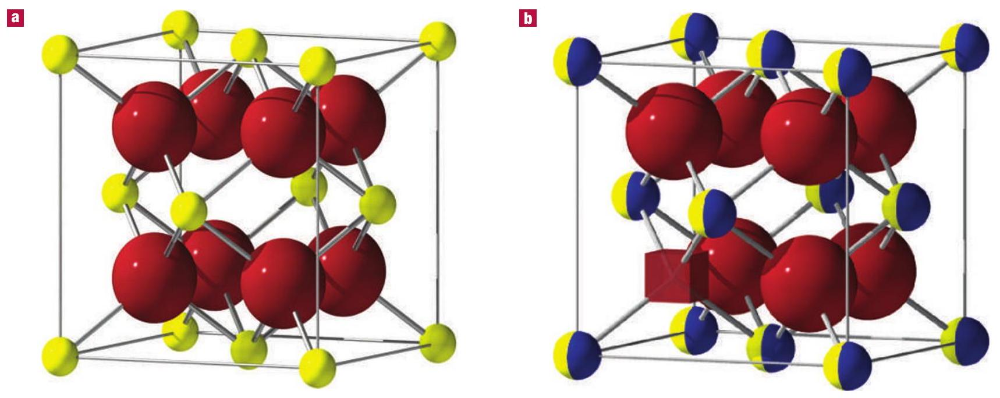
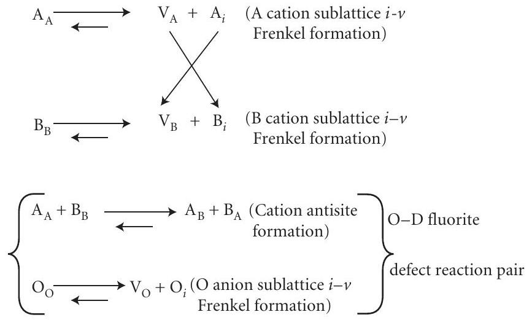
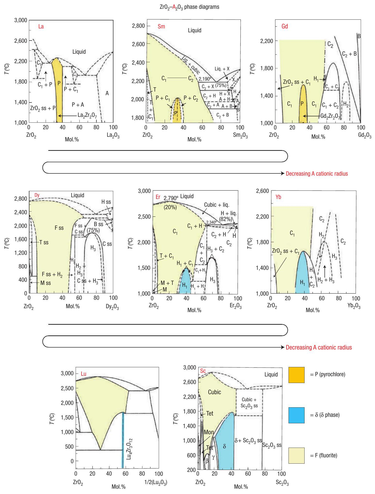
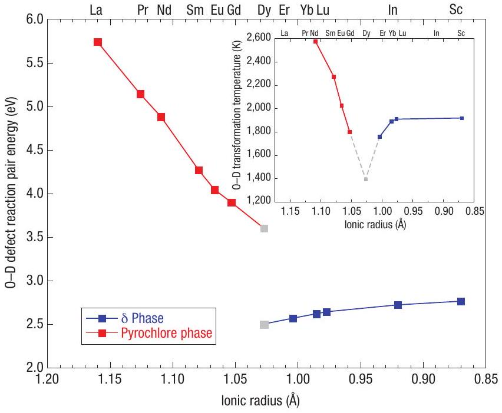
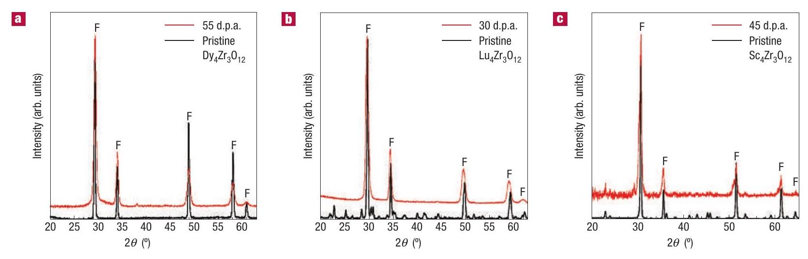

# Radiation-induced amorphization resistance and radiation tolerance in structurally related oxides 

KURT E. SICKAFUS ${ }^{1 *}$, ROBIN W. GRIMES ${ }^{2}$, JAMES A. VALDEZ ${ }^{1}$, ANTONY CLEAVE ${ }^{2}$, MING TANG ${ }^{1}$, MANABU ISHIMARU ${ }^{3}$, SIOBHAN M. CORISH ${ }^{4}$, CHRISTOPHER R. STANEK ${ }^{1}$ AND BLAS P. UBERUAGA ${ }^{1}$ ¹Materials Science and Technology Division, Los Alamos National Laboratory, Los Alamos, New Mexico 87545, USA ${ }^{2}$ Department of Materials, Imperial College, Prince Consort Road, London SW7 2BP, UK ${ }^{\mathbf{3}}$ The Institute of Scientific and Industrial Research, Osaka University, 8-1 Mihogaoka, Ibaraki, Osaka 567-0047, Japan ${ }^{\mathbf{4}}$ Earth \& Environmental Sciences Division, Los Alamos National Laboratory, Los Alamos, New Mexico 87545, USA *e-mail: kurt@lanl.gov

Published online: 25 February 2007; doi:10.1038/nmat1842

Ceramics destined for use in hostile environments such as nuclear reactors or waste immobilization must be highly durable and especially resistant to radiation damage effects. In particular, they must not be prone to amorphization or swelling. Few ceramics meet these criteria and much work has been devoted in recent years to identifying radiation-tolerant ceramics and the characteristics that promote radiation tolerance. Here, we examine trends in radiation damage behaviour for families of compounds related by crystal structure. Specifically, we consider oxides with structures related to the fluorite crystal structure. We demonstrate that improved amorphization resistance characteristics are to be found in compounds that have a natural tendency to accommodate lattice disorder.

The search for radiation-tolerant materials that can be used as host materials for nuclear wastes or as advanced nuclear fuel forms has been an area of intense research in recent years ${ }^{1-5}$. Radiation tolerance refers to a material's ability to resist any number of undesirable radiation-induced phenomena, including amorphization, interstitial point-defect clustering, vacancyinduced cavitation and concomitant swelling and precipitation of new crystalline phases. The underlying physics leading to these various phenomena varies considerably. Consequently, it is not possible in a short report such as this to discuss all of these microstructural evolutionary phenomena. So, for the purposes of this paper, we will emphasize one particular radiation-tolerance criterion, that being amorphization resistance. We specifically examine structural and compositional characteristics that enable materials, in a displacive radiation damage environment, to resist lattice instabilities that lead to amorphization.

This article considers the radiation damage behaviour of various complex oxides that are related by structure. In particular, we examine radiation damage in oxide compounds with structures related to the fluorite ( $\mathrm{CaF}_{2}$ ) crystal structure. We will refer to the crystal structures of these compounds as fluorite structural derivatives and to the ideal fluorite crystal structure as the parent phase. Dioxide ( $\mathrm{MO}_{2}$ ) compounds that form ideal fluorites (Fig. 1a) include $\mathrm{ZrO}_{2}, \mathrm{CeO}_{2}, \mathrm{HfO}_{2}, \mathrm{ThO}_{2}, \mathrm{UO}_{2}, \mathrm{PuO}_{2}$ and higher actinides.

Our interest here is in oxygen-deficient fluorite structural derivative $\left(\mathrm{MO}_{2-x}\right)$ compounds. To produce an oxygen-deficient compound, $\mathrm{M}^{4+}$ cations in $\mathrm{MO}_{2}$ are replaced with aliovalent cations ( $\mathrm{A}^{1+}, \mathrm{A}^{2+}$, or $\mathrm{A}^{3+}$ ). Charge-compensation for these dopants is achieved by the introduction of oxygen vacancies (Fig. 1b).

We confine our attention to two oxygen-deficient compound stoichiometries in which the aliovalent substitute cation is a trivalent ( $\mathrm{A}^{3+}$ ) species: (1) the pyrochlore composition, $\mathrm{M}_{4} \mathrm{O}_{7}$ ( $\mathrm{O} / \mathrm{M}=1.750$ ), or more specifically, $\mathrm{A}_{2} \mathrm{~B}_{2} \mathrm{O}_{7}$ (referred to as a $2: 2: 7$ compound); and (2) the ' $\delta$-phase' composition, $\mathrm{M}_{7} \mathrm{O}_{12}$ ( $\mathrm{O} / \mathrm{M}=1.714$ ), or more specifically, $\mathrm{A}_{4} \mathrm{~B}_{3} \mathrm{O}_{12}$ (referred to as a 4:3:12 compound). For more crystal structure details regarding these compounds, see refs 6-8.

## PHASE DIAGRAMS AND THEIR RELATIONSHIPS TO RADIATION DAMAGE

Figure 2 shows a selection of temperature-composition ( $T-C$ ) phase diagrams for various $\mathrm{ZrO}_{2}-\mathrm{A}_{2} \mathrm{O}_{3}$ mixtures ${ }^{9}$. Note how phase stability progresses through this series of $T-C$ diagrams. For the largest $\mathrm{A}^{3+}$ cation ( $\mathrm{La}^{3+}$ ), the 2:2:7 pyrochlore ( P ) phase is stable to the melt. But then the extent of P-phase stability (with respect to temperature) decreases with decreasing $\mathrm{A}^{3+}$ cationic size, until at $\mathrm{Dy}_{2} \mathrm{Zr}_{2} \mathrm{O}_{7}$, no ordered P phase is observed. Then, continuing with decreasing $\mathrm{A}^{3+}$ cationic size, a new ordered phase, the $4: 3: 12 \delta$ phase, emerges and becomes most stable when $\mathrm{A}^{3+}$ is smallest $\left(\mathrm{Sc}^{3+}\right)$. With the exception of La , the ordered $\mathrm{ZrO}_{2}-\mathrm{A}_{2} \mathrm{O}_{3}$ compounds ( P or $\delta$ ) transform to a phase that is indistinguishable from fluorite (F). The F phases in these mixtures are necessarily disordered. Specifically, Zr and A cations are randomly arranged on the $4 a$ equipoint, whereas oxygen ions and oxygen vacancies are randomly arranged on the $8 c$ equipoint in space group $F m \overline{3} m$ (ref. 10). We will refer to these F phases as disordered fluorites.

As radiation damage inherently involves disordering processes, we anticipate that the highlighted ordered structural derivative compounds found in the $\mathrm{ZrO}_{2}-\mathrm{A}_{2} \mathrm{O}_{3}$ phase diagrams in Fig. 2

Figure 1 Unit-cell drawings corresponding to the crystal structures of ideal and oxygen-deficient fluorite. a, The cubic unit cell for the ideal fluorite crystal structure. The small yellow spheres represent metal cations. The large red spheres represent oxygen anions. The cation sublattice is face-centred cubic; the anion sublattice is simple cubic. b, Schematic diagram of a fluorite structural derivative crystal structure in which aliovalent A cations (shown in blue) partially replace tetravalent B cations (shown in yellow). These replacements are charge-compensated by the introduction of oxygen vacancies (one is shown here as a red cube).

should transform to disordered fluorite structures on exposure to displacive radiation damage conditions. The idea that radiation-induced order-to-disorder (O-D) transformations can be anticipated by phase-stability characteristics revealed in $T-C$ diagrams is not new. This has been discussed previously in the context of antisite disorder in intermetallic compounds ${ }^{11}$. However, the O-D transformations discussed in this report are much more complex compared with simple antisite disorder transformations, owing to the multiple sublattices associated with complex oxides (all sublattices must disorder to achieve a complete O-D transformation). This is a key concept in this article. In addition, $T-C$ diagrams have never before been proposed as predictors for radiation-tolerant characteristics.

Returning to the $\mathrm{ZrO}_{2}-\mathrm{Dy}_{2} \mathrm{O}_{3} T-C$ diagram in Fig. 2, note that no ordered phase is observed over a wide range of composition. $\mathrm{ZrO}_{2}-\mathrm{Dy}_{2} \mathrm{O}_{3}$ mixtures in this compositional range form only as disordered fluorites. Thus, we predict that irradiated $\mathrm{ZrO}_{2}-\mathrm{Dy}_{2} \mathrm{O}_{3}$ compounds will show that an intrinsically disordered material remains disordered throughout the irradiation process. This is the central theme of our concept for radiation-induced amorphization resistance and enhanced radiation tolerance in general in fluorite structural derivative oxides.

## THE 0-D TRANSFORMATION IN FLUORITE STRUCTURAL DERIVATIVES

It is interesting to consider atomistic details of the O-D transformations associated with fluorite structural derivatives, such as the $\mathrm{P}-\mathrm{F}$ and $\delta-\mathrm{F}$ transformations shown in Fig. 2. Remarkably, only two reactions are required to define an O-D transformation in any fluorite structural derivative: namely, cation antisite defects must form on the cation sublattice, whereas anion Frenkel defects must be created on the anion sublattice. We will refer to these reactions as an O-D fluorite defect reaction pair. Interestingly, these defects are precisely those that we anticipate for fluorite structural derivative oxides exposed to irradiation. It has been recognized in earlier literature on pyrochlore compounds that cation antisite and anion Frenkel defects are necessary to induce an O-D transformation (see, for example, Minervini et al. ${ }^{12}$ and

Lian et al. ${ }^{13}$ ). However, it has never been realized until now that this concept applies to fluorite structural derivatives other than pyrochlore (cation disordering was discussed previously in fluorite structural derivatives known as murataite ${ }^{14}$ ). Furthermore, it has not been appreciated before that in phase diagrams for $\mathrm{BO}_{2}-\mathrm{A}_{2} \mathrm{O}_{3}$ mixtures (where B need not be Zr , but can be any of a number of other $4+$ cations, including $\mathrm{Ti}^{4+}, \mathrm{Sn}^{4+}, \mathrm{Hf}^{4+}, \mathrm{Pb}^{4+} \mathrm{Ce}^{4+}, \mathrm{Th}^{4+}$, $\mathrm{U}^{4+}, \mathrm{Pu}^{4+}$ and so on), the O-D defect reaction pair introduced here defines the relationship between ordered and disordered structures in these diagrams. Specifically, if in a $\mathrm{BO}_{2}-\mathrm{A}_{2} \mathrm{O}_{3}$ phase diagram an ordered fluorite structural derivative finds itself surrounded by a disordered fluorite phase field, then the O-D defect reaction pair defines the transformation mechanism that converts the ordered structure to the disordered structure.

Radiation-damage-induced defects in an ordered complex oxide (that is, a multi-component mixture, $\mathrm{A}_{\mathrm{w}} \mathrm{O}_{\mathrm{x}} \cdot \mathrm{B}_{\mathrm{y}} \mathrm{O}_{z}$ ) can be summarized by the following point-defect reactions:

(Note that further higher-order point-defect configurations are possible, such as interstitial or vacancy dimers or mixed trimers, and so on, and these may influence damage evolution, in particular the formation of defect clusters. However, the qualitative physics that describes how defect accumulation leads to increases in stored

Figure 2 Selected $\boldsymbol{T}$ - $\boldsymbol{C}$ phase diagrams ${ }^{\mathbf{i}}$ in which various sesquioxides $\left(\mathbf{A}_{\mathbf{2}} \mathbf{O}_{\mathbf{3}}\right)$ are mixed with the dioxide, zirconia $\left(\mathbf{Z r O}_{\mathbf{2}}\right)$. Stability regions for the pyrochlore $(\mathbf{P})$, $\delta$-phase ( $\delta$ ) and fluorite (F) crystal structures are coloured for clarity.

energy, and ultimately to amorphization, is described adequately using only the low-order, mono-defects shown above.)

Radiation damage initially induces the formation of both cation and anion Frenkel pairs (forward arrows in the reactions above).

A Frenkel pair consists of an interstitial and a vacancy (an $i-v$ pair) on either the cation or anion sublattice. Radiation damage evolution is determined by the fate of these $i-v$ pairs. Many annihilate harmlessly, either during the quench of a

Figure 3 Molecular statics calculations for the energy to form a cation antisite plus an anion Frenkel, in either an ordered $\mathbf{A}_{2} \mathbf{Z r}_{2} \mathbf{O}_{7}$ pyrochlore-phase (P) lattice or an ordered $\mathbf{A}_{4} \mathbf{Z r}_{3} \mathbf{O}_{12} \boldsymbol{\delta}$-phase ( $\boldsymbol{\delta}$ ) lattice. Together, the cation antisite and the anion Frenkel constitute an 0-D fluorite defect reaction pair. Energies on the ordinate represent the accumulated internal energy for defect formation, assuming that all of the products of the 0-D fluorite defect reaction pair are spatially isolated. The compounds represented on the abscissa are arranged in order of decreasing $A^{3+}$ cationic size (sizes from Shannon ${ }^{27}$ ). Physically, a low energy for the 0-D fluorite defect reaction pair implies that the material can accommodate disorder more easily. Experimentally, $\mathrm{ZrO}_{2}-\mathrm{Dy}_{2} \mathrm{O}_{3}$ compounds show no evidence for ordering (ordered P and $\delta$ phases are not observed). So, the P and $\delta$ calculations for $\mathrm{ZrO}_{2}-\mathrm{Dy}_{2} \mathrm{O}_{3}$ (shown in grey) were obtained using artificially ordered structures. The inset shows measured OD transformation temperatures, $T_{0-0}$, for both pyrochlore and $\delta$-phase compounds (data from Rushton et al. ${ }^{28}$ for pyrochlores and Lopato et al. ${ }^{20}$ for $\delta$-phase compounds). In addition, the $T_{0-\mathrm{D}}$ temperature for $\mathrm{ZrO}_{2}-\mathrm{Dy}_{2} \mathrm{O}_{3}$ (shown in grey in the inset) is from Rushton et al. ${ }^{28}$ and is a predicted transformation temperature on the basis of trends for other 2:2:7 $\mathrm{ZrO}_{2}-\mathrm{A}_{2} \mathrm{O}_{3}$ compounds.

displacement cascade, or when mobile point defects (usually interstitials) encounter and recombine with their $i-v$ counterparts in the lattice (hence, the reverse arrows in the reactions above). However, $i-v$ recombination can be kinetically inhibited and thus we can anticipate that some cation and anion Frenkel defects will accumulate in the lattice as radiation damage progresses. Residual point-defect concentrations will depend on details of the kinetic barriers to recombination as well as the energy costs for cation and anion $i-v$ pair formation (these are the driving forces for recombination).

Interestingly, in complex oxides, the cations have an additional defect formation mechanism at their disposal, namely cation antisite formation. Cation antisite defects can form by a number of mechanisms (the diagonal arrows shown in the reactions above indicate two possible pathways to produce antisites), but all mechanisms lead to the same result: an A cation on the B sublattice $\left(A_{B}\right)$, or a $B$ cation on the $A$ sublattice $\left(B_{A}\right)$. Irradiationinduced cation antisite formation has already been shown to be prolific in some complex oxides. For instance, in magnesium aluminate spinel $\left(\mathrm{MgAl}_{2} \mathrm{O}_{4}\right)$, neutron diffraction measurements revealed that the $\mathrm{A}(\mathrm{Mg})$ and $\mathrm{B}(\mathrm{Al})$ cation sublattices in the spinel crystal lattice were essentially fully disordered following high-fluence neutron irradiation ${ }^{15}$.

We know little about the kinetic barriers that inhibit the annihilation of the defects described here. We can, however, carry
out atomistic computer simulations to estimate the energy costs to produce these defects. We have done this for selected fluorite structural derivative compounds and our results indicate that cation antisite and anion Frenkel defects require much less energy for formation than A or B sublattice cation Frenkel defects. So, we surmise that to the extent that kinetic barriers are not the determining factors in irradiation response, the population of cation antisites and anion Frenkels will increase in the lattice with increasing radiation dose, whereas cation Frenkels will annihilate by various mechanisms.

The purpose of this article is to demonstrate that to a very great extent, the energy cost for the O-D fluorite defect reaction pair described above is the determining factor for assessing the relative radiation amorphization resistance of fluorite structural derivative compounds. We assume that amorphization resistance is enhanced if stored energy due to defect accumulation is reduced. If the O-D fluorite defect reaction pair energy is large, the compound will be very susceptible to detrimental radiation damage effects, such as amorphization. On the other hand, if the O-D fluorite defect reaction pair energy is small, the compound may be little affected by radiation, even to very high irradiation doses. Cation and anion Frenkel pairs are created under irradiation (they cannot be avoided) and cation antisites quickly evolve from cation Frenkels (among other mechanisms). If the lattice can accommodate these radiationinduced defects (that is, if they occur with low energy cost), the structure will exhibit good radiation tolerance.

We have used molecular statics calculations to estimate the energies for O-D fluorite defect reaction pairs in compounds with both 2:2:7 pyrochlore and 4:3:12 $\delta$-phase stoichiometries (Fig. 3). We have arranged the compounds in Fig. 3 in order of decreasing $\mathrm{A}^{3+}$ cationic radius, so the calculations may be easily compared with the $T-C$ phase diagrams in Fig. 2. Note that in 2:2:7 pyrochlores, the energy cost for cation antisites and anion Frenkels decreases with decreasing $\mathrm{A}^{3+}$ size, whereas the opposite trend occurs for 4:3:12 $\delta$-phase compounds (but to a far lesser extent). The high defect energies for the P-phase compounds to the left in Fig. 3 and equivalently, for the $\delta$-phase compounds to the right, suggest greater stability for the ordered structures and likewise, less ability to accommodate disorder.

We note that the calculated defect energies for the P - and $\delta$-phase compounds in Fig. 3 do not join smoothly at the position of the $\mathrm{Dy}^{3+}$ cation. This is probably because of differences between the two ordered structures (cubic versus rhombohedral; different oxygen-vacancy arrangements and so on). The defect energies in Fig. 3 are meant to indicate relative trends between compounds of similar structure. We do not assign any particular significance to the absolute values of these energies.

One consequence of the ordering tendencies of the $\mathrm{ZrO}_{2}-\mathrm{A}_{2} \mathrm{O}_{3}$ mixtures with the largest or alternatively, the smallest $\mathrm{A}^{3+}$ cations shown in Fig. 3 is that these compounds should possess higher O-D transformation temperatures, $T_{\mathrm{O}-\mathrm{D}}$. This is precisely what is observed for the $\mathrm{P}-\mathrm{F}$ and $\delta-\mathrm{F}$ transformations shown in the $T-C$ phase diagrams in Fig. 2. The ordered pyrochlore $\mathrm{La}_{2} \mathrm{Zr}_{2} \mathrm{O}_{7}$, at the beginning of the $\mathrm{ZrO}_{2}-\mathrm{A}_{2} \mathrm{O}_{3}$ series is stable to the melt, whereas at the other end of the $\mathrm{ZrO}_{2}-\mathrm{A}_{2} \mathrm{O}_{3}$ series, the ordered $\delta$-phase $\mathrm{Sc}_{4} \mathrm{Zr}_{3} \mathrm{O}_{12}$, although not stable to the melt, does have the largest temperature-stability field (highest $T_{\mathrm{OD}}$ ) of all $\mathrm{ZrO}_{2}-\mathrm{A}_{2} \mathrm{O}_{3}$ mixtures that exhibit $\delta$ phases in their $T-C$ diagrams. It is especially interesting to observe how the calculated defect energy trends in Fig. 3 correlate strongly with $T_{\mathrm{O}-\mathrm{D}}$ (data shown in Fig. 3, inset). The P-phase defect energies drop sharply with decreasing $\mathrm{A}^{3+}$ size, as do the P-F, $T_{\mathrm{O}-\mathrm{D}}$ temperatures. On the other hand, the $\delta$-phase defect energies do not change significantly with $\mathrm{A}^{3+}$ size, nor do the $\delta-\mathrm{F}, T_{\mathrm{O}-\mathrm{D}}$ temperatures. Thus, the O-D fluorite defect reaction pair calculations seem to be a good means to predict trends in O-D

Figure 4 GIXRD patterns obtained from various 4:3:12 compounds before and after irradiation with $\mathbf{3 0 0} \mathbf{~ k e V} \mathbf{~ K r}^{++}$ions. a, Dy $\mathrm{Zr}_{3} \mathrm{O}_{12}$; $\mathbf{b}, \delta-\mathrm{Lu}_{4} \mathrm{Zr}_{3} \mathrm{O}_{12}$; $\mathbf{c}, \delta-\mathrm{Sc}_{4} \mathrm{Zr}_{3} \mathrm{O}_{12}$.

transformation temperatures. In summary, the calculated defectenergy trends in Fig. 3 mimic the phase-stability trends in the $T-C$ diagrams (Fig. 2).

A second consequence of the ordering tendencies of the $\mathrm{ZrO}_{2}-\mathrm{A}_{2} \mathrm{O}_{3}$ mixtures with the largest or alternatively, the smallest $\mathrm{A}^{3+}$ cations shown in Fig. 3 is that these mixtures should be least likely to tolerate the disordering processes associated with irradiation. The best radiation-tolerance properties are to be expected for $\mathrm{ZrO}_{2}-\mathrm{A}_{2} \mathrm{O}_{3}$ compounds in the middle of the mixture sequences shown in Figs 2 and 3. In other words, we anticipate that $\mathrm{ZrO}_{2}-\mathrm{Dy}_{2} \mathrm{O}_{3}$ compounds, or $\mathrm{ZrO}_{2}-\mathrm{A}_{2} \mathrm{O}_{3}$ compounds made from $\mathrm{A}^{3+}$ cations with ionic radii near to $\mathrm{Dy}^{3+}\left(\mathrm{Tb}^{3+}, \mathrm{Y}^{3+}, \mathrm{Ho}^{3+}, \mathrm{Er}^{3+}\right.$; ref. 15), should be the most radiation tolerant.

## ION IRRADIATION DAMAGE EXPERIMENTS

Ion irradiation damage studies have already been carried out on 2:2:7 pyrochlore-structured compounds. We will refer to these previous experiments momentarily. First, we present new results on selected 4:3:12 $\delta$-phase compounds from the $\mathrm{ZrO}_{2}-\mathrm{A}_{2} \mathrm{O}_{3}$ mixtures shown in Figs 2 and 3. For this study, the compounds $\mathrm{Dy}_{4} \mathrm{Zr}_{3} \mathrm{O}_{12}, \mathrm{Lu}_{4} \mathrm{Zr}_{3} \mathrm{O}_{12}$ and $\mathrm{Sc}_{4} \mathrm{Zr}_{3} \mathrm{O}_{12}$ were irradiated at cryogenic temperature with $300 \mathrm{keV} \mathrm{Kr}^{++}$ions, to ion fluences ranging from $1 \times 10^{19}$ to $2 \times 10^{20} \mathrm{Kr} \mathrm{m}^{-2}$. Some preliminary experimental results on $\mathrm{Sc}_{4} \mathrm{Zr}_{3} \mathrm{O}_{12}$ were published previously ${ }^{16}$. Figure 4 shows grazing incidence X-ray diffraction (GIXRD) patterns obtained from 4:3:12 compounds before and after $\mathrm{Kr}^{++}$ion irradiation. In all of the GIXRD patterns shown in Fig. 4, there are five prominent diffraction peaks labelled ' $F$ ', which we will refer to as fluorite parent peaks (these peaks index as $\{111\},\{200\},\{220\},\{311\}$ and $\{222\}$, respectively, assuming a structure with a fluorite unit cell). They are the only allowed reflections in the angular range shown ( $20-65^{\circ}$ ) for an oxide with the fluorite crystal structure. All other diffraction maxima in the patterns shown in Fig. 4 are fluorite structural derivative reflections. Specifically, these extra peaks arise from two particular features of the 4:3:12 $\delta$ phase: (1) a small rhombohedral distortion from the ideal cubic symmetry associated with the parent fluorite structure; and (2) an ordered arrangement of vacancies on the oxygen sublattice.

The GIXRD results in Fig. 4 can be summarized as follows:
(1) Figure 4a. As expected from the phase diagram (Fig. 2), $\mathrm{Dy}_{4} \mathrm{Zr}_{3} \mathrm{O}_{12}$ is initially a disordered fluorite (only F peaks are present). On ion irradiation to a fluence of $2 \times 10^{20} \mathrm{Krm}^{-2}$, no change in structure is observed. The $\mathrm{Dy}_{4} \mathrm{Zr}_{3} \mathrm{O}_{12}$ remains a disordered fluorite. This ion fluence represents a very high displacive radiation dose, approximately 55 displacements per
atom (d.p.a.). The parent fluorite peaks broaden following ion irradiation, which is due either to decreased grain size or increased lattice strain.
(2) Figure 4b. As expected from the phase diagram (Fig. 2), $\mathrm{Lu}_{4} \mathrm{Zr}_{3} \mathrm{O}_{12}$ is initially an ordered $\delta$ phase. On ion irradiation to a fluence of $1 \times 10^{20} \mathrm{Kr} \mathrm{m}^{-2}$ ( $30 \mathrm{~d} . \mathrm{p} . \mathrm{a}$.), all peaks associated with the fluorite structural derivative disappear and only F peaks remain. The $\mathrm{Lu}_{4} \mathrm{Zr}_{3} \mathrm{O}_{12}$ is transformed to a disordered fluorite at this dose. Once again, the parent fluorite peaks broaden following ion irradiation.
(3) Figure 4c. As expected from the phase diagram (Fig. 2), $\mathrm{Sc}_{4} \mathrm{Zr}_{3} \mathrm{O}_{12}$ is initially an ordered $\delta$ phase. Ion irradiation to a fluence of $1 \times 10^{20} \mathrm{Kr} \mathrm{m}^{-2}$ ( 22 d.p.a.) results in no change in structure (data not shown). On ion irradiation to a fluence of $2 \times 10^{20} \mathrm{Kr} \mathrm{m}^{-2}$ ( 45 d.p.a.), peaks associated with the fluorite structural derivative $\delta$ phase disappear. To be precise, a few $\delta$-phase peaks seem to persist, but we suspect that this is an artefact due to the X-ray beam probing a volume deeper than the irradiated volume ( Sc is much lighter compared with Dy and Lu ; so, the X -ray penetration depth in this compound is greater in comparison). The $\mathrm{Sc}_{4} \mathrm{Zr}_{3} \mathrm{O}_{12}$ is transformed to a disordered fluorite. Once again, the parent fluorite peaks broaden following ion irradiation.

The 4:3:12 compound irradiation results are in accordance with our expectations, on the basis of $T-C$ phase-diagram characteristics (Fig. 2). $\mathrm{Dy}_{4} \mathrm{Zr}_{3} \mathrm{O}_{12}$ persists as a disordered fluorite to high ion dose, whereas $\mathrm{Lu}_{4} \mathrm{Zr}_{3} \mathrm{O}_{12}$ and $\mathrm{Sc}_{4} \mathrm{Zr}_{3} \mathrm{O}_{12}$ undergo $\mathrm{O}-\mathrm{D}$ transformations following irradiation, with the Sc compound transforming at a higher ion dose compared with the Lu compound. The higher O-D transformation dose for Sc versus Lu involves kinetic recovery effects as well as irradiation conditions. A thermodynamic model describing these effects will be published separately (K.E.S., manuscript in preparation).

Previous experiments on 2:2:7 zirconate pyrochlore compounds also seem to be consistent with these 4:3:12 $\delta$-phase zirconate studies. $\mathrm{La}_{2} \mathrm{Zr}_{2} \mathrm{O}_{7}$, which in Fig. 2 is shown to be a stable, ordered pyrochlore to the melt, was found to amorphize at a quite low ion irradiation dose, $\sim 5.5$ d.p.a. for $1.5 \mathrm{MeV} \mathrm{Xe} \mathrm{e}^{+}$ion irradiations at room temperature ${ }^{17}$. On the other hand, $\mathrm{Gd}_{2} \mathrm{Zr}_{2} \mathrm{O}_{7}$, which exists in an ordered pyrochlore structure up to $T_{\mathrm{O}-\mathrm{D}} \sim 1,500^{\circ} \mathrm{C}$ (see the phase diagram in Fig. 2), but then transforms to a disordered fluorite, was found to undergo an $\mathrm{O}-\mathrm{D}$ transformation at $\sim 36$ d.p.a. (ref. 17), but was not observed to amorphize above this dose. Thus, $\mathrm{Gd}_{2} \mathrm{Zr}_{2} \mathrm{O}_{7}$ possesses superior radiation tolerance compared with $\mathrm{La}_{2} \mathrm{Zr}_{2} \mathrm{O}_{7}$ (especially, resistance to amorphization). Clearly, these results are in qualitative agreement with expectations, on the basis of the $T-C$ phase
diagrams in Fig. 2 and the defect reaction energies presented in Fig. 3.

## AMORPHIZATION RESISTANCE AND RADIATION DAMAGE TOLERANCE

Our results indicate that complex oxides with natural atomic disordering tendencies are the most likely compounds to possess good resistance to radiation damage. We proposed this concept in a previous report ${ }^{3}$, but we only referred to cation antisites in that study. For fluorite-related structures, the O-D fluorite defect reaction pair presented in this article (cation antisites and anion Frenkels) provides a more complete description of the relevant disordering processes. Moreover, the O-D fluorite defect reaction pair is a global descriptor for the nature of O-D transformations across the entire range of oxygen-deficient fluorite structural derivative compounds. This has never been recognized or reported until now.

Of the $\mathrm{ZrO}_{2}-\mathrm{A}_{2} \mathrm{O}_{3}$ compounds examined so far, the $\mathrm{La}_{2} \mathrm{Zr}_{2} \mathrm{O}_{7}$ compound is the worst radiation damage performer, amorphizing by a dose of 5.5 d.p.a. (ref. 17), whereas $\mathrm{Dy}_{4} \mathrm{Zr}_{3} \mathrm{O}_{12}$ is the best performer, showing no change in structure and resisting amorphization to a dose of at least 55 d.p.a. (this study). The $T-C$ phase diagrams (Fig. 2) for La and Dy foretell these results: the ordered 2:2:7 $\mathrm{La}_{2} \mathrm{Zr}_{2} \mathrm{O}_{7}$ pyrochlore phase is stable to the melt, whereas the $\mathrm{ZrO}_{2}-\mathrm{Dy}_{2} \mathrm{O}_{3}$ phase diagram shows no ordered phase at any temperature (in the vicinity of the 2:2:7 and 4:3:12 compositions).

Atomic disordering tendencies, as suggested by $T-C$ phasediagram characteristics, can be used to indicate radiation damage properties in systems other than zirconates. Take, for instance, the 2:2:7 pyrochlore-structured titanates. Examining $\mathrm{TiO}_{2}-\mathrm{A}_{2} \mathrm{O}_{3} T-C$ phase diagrams ${ }^{18}$, it is found that the ordered 2:2:7 $\mathrm{A}_{2} \mathrm{Ti}_{2} \mathrm{O}_{7}$ pyrochlore phase is stable to the melt, for compounds across the entire rare-earth (A) series. Thus, titanate pyrochlores, regardless of composition, exhibit no atomic disordering tendencies. Accordingly, all titanate pyrochlores are readily amorphized by ion irradiation ${ }^{19}$.

Returning to zirconates, of the 2:2:7 and 4:3:12 zirconates that do exhibit O-D transformations in their T-C diagrams ${ }^{9}$, all radiation damage studies so far reveal that similar O-D transformations are induced by ion irradiation $\left(\mathrm{Nd}_{2} \mathrm{Zr}_{2} \mathrm{O}_{7}\right.$, $\mathrm{Sm}_{2} \mathrm{Zr}_{2} \mathrm{O}_{7}, \mathrm{Gd}_{2} \mathrm{Zr}_{2} \mathrm{O}_{7}$ (ref. 17); $\mathrm{Dy}_{4} \mathrm{Zr}_{3} \mathrm{O}_{12}, \mathrm{Lu}_{4} \mathrm{Zr}_{3} \mathrm{O}_{12}, \mathrm{Sc}_{4} \mathrm{Zr}_{3} \mathrm{O}_{12}$ (this study)). Interestingly, all of these compounds seem to resist amorphization to radiation doses beyond their O-D transformation doses. We will discuss reasons for this in a separate report (K.E.S., manuscript in preparation). But insofar as radiation tolerance is concerned, a volume change accompanies the O-D transformation in all of these compounds ${ }^{20}$, which is an undesirable effect, assuming that these materials are candidates for use in engineering applications. So, a $\mathrm{ZrO}_{2}-\mathrm{Dy}_{2} \mathrm{O}_{3}$ mixture remains the best compositional choice for radiation-induced amorphization resistance.

In this study, we have only addressed radiation-induced amorphization resistance. However, we anticipate that compounds with 2:2:7 and 4:3:12 stoichiometries (as well as fluorite derivative compounds with other stoichiometries), which possess low O-D fluorite defect reaction pair energies, will exhibit further radiationtolerant behaviour, such as lower propensities for cluster or cavity formation. Consider the oxygen sublattice defects, for instance. If oxygen Frenkel pairs do not cost much energy, then the driving force for oxygen interstitials to join interstitial clusters, or oxygen vacancies to adsorb at growing voids is reduced. As for cation defects, cation antisite defects with low energies differ little from their cation equivalents on normal lattice sites. Thus, cation antisite formation represents an effective mechanism to harmlessly
annihilate freely migrating cation interstitials, thus diminishing their chances to adsorb and contribute to the growth of undesirable aggregates such as clusters and cavities. Future studies will address whether or not radiation resistance is indeed improved in all respects as O-D fluorite defect reaction pair energies are reduced.

It must be emphasized that additional factors, other than the point-defect reactions discussed here, may contribute to amorphization resistance (or lack thereof) or to the more general radiation-tolerance behaviour of a material. For instance, simple chemical and structural characteristics of complex oxides such as cation size, electronic configurations (especially bond ionicity) and oxygen positional parameters, have been proposed in the past to be indicators of radiation damage tolerance (see, for example, Ewing et al. ${ }^{5}$ ). In addition, it was recently proposed that enhanced point-defect clustering within cascades in $\mathrm{Gd}_{2} \mathrm{Ti}_{2} \mathrm{O}_{7}$ compared with $\mathrm{Gd}_{2} \mathrm{Zr}_{2} \mathrm{O}_{7}$ may inhibit efficient defect recovery in $\mathrm{Gd}_{2} \mathrm{Ti}_{2} \mathrm{O}_{7}$ and thereby facilitate amorphization ${ }^{21}$, on the basis of molecular dynamics simulations of radiation damage events in these model pyrochlores. In some materials, however, clustering may lead to enhanced recovery because of the high mobilities of some large clusters ${ }^{22}$. In any case, it should not be surprising that complex materials exhibit multifaceted behaviour. We do, however, propose that the concepts presented in this paper involving irradiationinduced low-order mono-defects should dominate under light-ion, high-energy conditions where individual Frenkel pairs and other isolated point defects are produced.

We conclude with some comments about compound stoichiometry. Much ado has been made in the literature about the 2:2:7 compound stoichiometry, especially since the discovery of improved radiation tolerance in some 2:2:7 zirconates ${ }^{2,3}$. Some articles in the literature imply that there is something special about the $2: 2: 7$ stoichiometry. One of the primary purposes of this article is to dispel the notion. In the search for radiationtolerant materials, there is actually nothing advantageous about the 2:2:7 pyrochlore stoichiometry. The results shown here for the 4:3:12 $\delta$-phase zirconate compounds help to support this point. The key to radiation tolerance is an inherent ability to accommodate atomic lattice disorder. This ability will not be found to be maximum for any line compound on any $T-C$ phase diagram. In fact, in seeking a material with disordering tendencies, chemical mixtures that exhibit ordered, line compounds should not be considered. Rather, mixtures that lack line compounds or that exhibit inherently disordered phases with wide ranges of stoichiometry should be sought. Wide compositional phase fields have already been shown to promote radiation tolerance in intermetallics (see, for instance, a review of research on CsCl-structured alloys with wide phase fields ${ }^{11}$ ).

We note that the difference between the oxygen-to-metal ratios for the 2:2:7 and 4:3:12 compounds discussed here is only $2 \%$. This is much less than the compositional widths of the pyrochlore and $\delta$-phase fields shown in most of the $T-C$ phase diagrams in Fig. 2 (at least at lower temperatures this is true). In other words, the pyrochlore and $\delta$-phase fields are significantly overlapped. So, for all intents and purposes, we have presented here a discussion of the radiation damage behaviour of fluorite structural derivative compounds with almost identical compositions.

Two important points are made in this paper: (1) a $T-C$ phase diagram is a good indicator for radiation damage tolerance properties (in particular, amorphization resistance); and (2) the O-D fluorite defect reaction pair is a good indicator of $T-C$ phase-diagram features (and consequently, of radiation tolerance). The first concept can be used immediately to make radiation damage predictions for systems that contain parent fluorite phases in their $T-C$ phase diagrams (cerates, hafnates, thorates, uranates, plutonates and higher actinides).

## METHODS

The oxide samples for this study were prepared as polycrystalline pellets from end-member oxides, using conventional ceramic processing procedures. The pellet fabrication details are described elsewhere ${ }^{16}$. Samples were irradiated at cryogenic temperature ( $\sim 100 \mathrm{~K}$ ) with $300 \mathrm{keV} \mathrm{Kr}^{++}$ions in the Ion Beam Materials Laboratory at Los Alamos National Laboratory using a 200 kV Varian implanter. SRIM2000 (ref. 23) Monte Carlo simulations were used to estimate ion range and displacement damage in the irradiated materials. Irradiated samples were analysed using GIXRD. GIXRD measurements were made using a Bruker AXS D8 Advanced X-ray diffractometer, $\mathrm{Cu} \mathrm{K} \alpha$ radiation, $\theta-2 \theta$ geometry and a fixed, $0.25^{\circ}$ angle of incidence on the sample.

The calculations presented here are based on a classical Born-like description of an ionic crystal lattice. The interatomic forces acting between ions are resolved into two terms: (1) long-range columbic forces based on a partial charge model, and (2) short-range forces that are modelled using parameterized pair potentials derived using a multi-structural parameter-fitting approach ${ }^{24}$. We define the perfect lattice using a unit cell, which is repeated using periodic conditions as defined by the usual crystallographic lattice vectors. Defects were introduced into the lattice and internal energies calculated using the Mott-Littleton approach as described previously ${ }^{25}$ and used successfully in previous work to predict defects in pyrochlore oxides ${ }^{3}$. The starting structures for the ordered 2:2:7 pyrochlores were obtained from Subramanian et al. ${ }^{7}$, whereas the structures for the ordered 4:3:12 $\delta$-phase compounds were obtained from Bogicevic and Wolverton ${ }^{26}$.

Received 10 July 2006; accepted 20 December 2006; published 25 February 2007.

## References

1. Weber, W. J. et al. Radiation effects in crystalline ceramics for the immobilization of high-level nuclear waste and plutonium. J. Mater. Res. 13, 1434-1484 (1998).
2. Wang, S. X. et al. Radiation stability of gadolinium zirconate: A waste form for plutonium disposition. J. Mater. Res. 14, 4470-4473 (1999).
3. Sickafus, K. E. et al. Radiation tolerance of complex oxides. Science 289, 748-751 (2000).
4. Degueldre, C. et al. Behavior of implanted xenon in yttria-stabilized zirconia as inert matrix of a nuclear fuel. J. Nucl. Mater. 289, 115-121 (2001).
5. Ewing, R. C., Weber, W. J. \& Lian, J. Nuclear waste disposal-pyrochlore $\left(\mathrm{A}_{2} \mathrm{~B}_{2} \mathrm{O}_{7}\right)$ : Nuclear waste form for the immobilization of plutonium and "minor" actinides. J. Appl. Phys. 95, 5949 (2004).
6. Sickafus, K. E. et al. Los Alamos Series Report \#LA-14205: Layered Atom Arrangements in Complex Materials (Los Alamos National Laboratory, Los Alamos, NM, 2006).
7. Subramanian, M. A., Aravamudan, G. \& Subba Rao, G. V. Oxide pyrochlores-A review. Prog. Solid State Chem. 15, 55-143 (1983).
8. Bevan, D. J. M. \& Summerville, E. in Mixed Rare Earth Oxides (eds Gschneidner, K. A. J. \& Eyring, L.) 401-524 (Handbook of the Physics and Chemistry of Rare Earths, Vol. 3, Elsevier Science, Amsterdam, 1979).
9. Ondik, H. M. \& McMurdie, H. F. (eds) Phase Diagrams for Zirconium and Zirconia Systems (The American Ceramic Society, Westerville, 1998).
10. Wyckoff, R. W. G. Crystal Structures: Volume 1 (Interscience, New York, 1960).
11. Nastasi, M. \& Mayer, J. W. Thermodynamics and kinetics of phase transformations induced by ion irradiation. Mater. Sci. Rep. 6, 1-51 (1991).
12. Minervini, L., Grimes, R. W. \& Sickafus, K. E. Disorder in pyrochlore oxides. J. Am. Ceram. Soc. 83, 1873-1878 (2000).
13. Lian, J. et al. The order-disorder transition in ion-irradiated pyrochlore. Acta Mater. 51, 1493-1502 (2003).
14. Lian, J., Wang, L. M., Ewing, R. C., Yudintsev, S. V. \& Stefanovsky, S. V. Ion-beam-induced amorphization and order-disorder transition in the murataite structure. J. Appl. Phys. 97, 113536 (2005).
15. Sickafus, K. E. et al. Cation disorder in high dose, neutron-irradiated spinel. J. Nucl. Mater. 219, 128-134 (1995).
16. Valdez, J. A., Tang, M. \& Sickafus, K. E. Radiation damage effects in $\delta-\mathrm{Sc}_{4} \mathrm{Zr}_{3} \mathrm{O}_{12}$ irradiated with $\mathrm{Kr}^{++}$ions under cryogenic conditions. Nucl. Instrum. Methods B 250, 148-154 (2006).
17. Lian, J. et al. Ion-irradiation-induced amorphization of $\mathrm{La}_{2} \mathrm{Zr}_{2} \mathrm{O}_{7}$ pyrochlore. Phys. Rev. B 66, 054108 (2002).
18. Levin, E. M., Robbins, C. R. \& McCurdie, H. F. (eds) Phase Diagrams for Ceramists (American Ceramic Society, Columbus, 1964).
19. Lian, J. et al. Radiation-induced amorphization of rare-earth titanate pyrochlores. Phys. Rev. B 68, 134107 (2003).
20. Lopato, L. M., Red'ko, V. P., Gerasimyuk, G. I. \& Shevchenko, A. V. Synthesis and properties of $\mathrm{M}_{4} \mathrm{Zr}_{3} \mathrm{O}_{12}$ and $\mathrm{M}_{4} \mathrm{Hf}_{3} \mathrm{O}_{12}$ compounds (M-rare earth element). Neorg. Mater. 27, 1718-1722 (1991). (translation: Inorg. Mater. 27, 1445-1449 (1991)) .
21. Devanathan, R. \& Weber, W. J. Insights into the radiation response of pyrochlores from calculations of threshold displacement events. J. Appl. Phys. 98, 086110 (2005).
22. Uberuaga, B. P. et al. Structure and mobility of defects formed from collision cascades in MgO. Phys. Rev. Lett. 92, 5505 (2004).
23. Ziegler, J. F., Biersack, J. P. \& Littmark, U. The Stopping and Range of Ions in Solids (Pergamon, New York, 1985).
24. Cleave, A. R. Atomic Scale Simulations for Waste Form Applications. Thesis (Imperial College, London) (2006).
25. Catlow, C. R. A. \& Mackrodt, W. C. Computer Simulation of Solids (Springer, Berlin, 1982).
26. Bogicevic, A. \& Wolverton, C. Nature and strength of defect interactions in cubic stabilized zirconia. Phys. Rev. B 67, 024106 (2003).
27. Shannon, R. D. Revised effective ionic radii and systematic studies of interatomic distances in halides and chalcogenides. Acta Crystallogr. A 32, 751-767 (1976).
28. Rushton, M. J. D., Grimes, R. W., Stanek, C. R. \& Owens, S. Predicted pyrochlore to fluorite disordered temperature for $\mathrm{A}_{2} \mathrm{Zr}_{2} \mathrm{O}_{7}$ compositions. J. Mater. Res. 19, 1603-1604 (2004).

## Acknowledgements

This work was sponsored by the US Department of Energy (DOE), Office of Basic Energy Sciences (OBES), Division of Materials Sciences and Engineering.
Correspondence and requests for materials should be addressed to K.E.S.

## Author contributions

Experiments (sample fabrication, irradiation and characterization) carried out by K.E.S., J.A.V., M.T., M.I. and S.M.C; atomistic modelling carried out by A.C., R.W.G., C.R.S. and B.P.U.

## Competing financial interests

The authors declare that they have no competing financial interests.
Reprints and permission information is available online at http://npg.nature.com/reprintsandpermissions/

