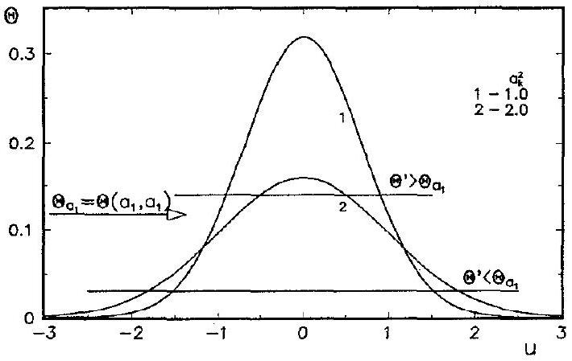
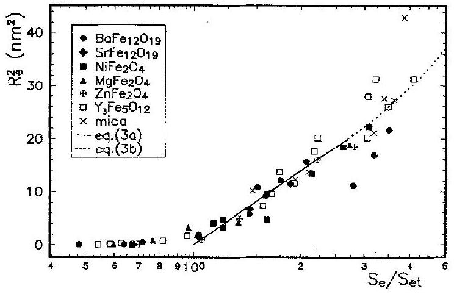
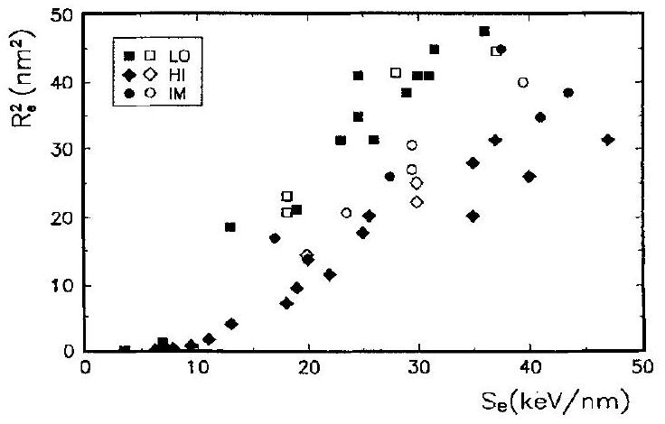

# Thermal spike model of amorphous track formation in insulators irradiated by swift heavy ions 

G. Szenes Institute for General Physics, Eötwös University, Muzeum krt 6-8, H-1088 Budapest, Hungary

#### Abstract

A thermal spike model is applied to the analysis of latent track formation by swift heavy ions in insulators. Expressions are derived for the prediction of the threshold electronic stopping power of track formation and the track sizes at different electronic stopping powers. Good agreement with experiments is found. Latent track data of $\mathrm{LiNbO}_{3}$ are analyzed and close similarity with those of yttrium iron garnet is observed including the velocity effect.

## 1. Introduction

In the interaction of high-energy heavy ions with solids there is a specific field where the major physical effects are due to the electronic stopping power $S_{\mathrm{e}}$. The energy of swift ions is first deposited in the electron system through the interaction of highly charged energetic ions with electrons. Then it is transferred to the host atoms through electron-phonon interaction. In spite of the growing number of experiments and efforts of scientists, no widely accepted theory exists concerning the basic problem: the mechanism of defect production during irradiation in the electronic stopping regime.

In the last few years a systematic investigation of latent track formation was reported in magnetic oxides [1]. The characteristic features of the irradiation effects have been recognized in the experiments, and a variation of the track size at equal $S_{\mathrm{e}}$ values with ion velocity was also reported in yttrium iron garnet (YIG) [2]. As a result of the precise microscopic measurements the variation of the morphology of the amorphized regions with $S_{\mathrm{e}}$ was revealed [3]. Continuous cylindrical tracks were observed in YIG only with radii above about 3 nm .

Recently, a model was proposed to explain the anisotropic dimensional changes observed in amorphous materials under high-energy heavy ion bombardment [4]. The formation of a thermal spike along the trajectory of the energetic ions was assumed. Later, the same model was successfully used in the study of latent tracks produced in crystalline magnetic insulators by high-energy heavy-ion irradiation [5]. Compared to other thermal spike models [6,7], the advantage of this one is the simplicity of the approach and the simplicity of the application. The good agreement between the predictions of the model and
the experiments confirm the validity and usefulness of the thermal spike concept for various ion bombardment experiments in the electronic stopping regime.

First, the main features of the model will be briefly reviewed and the most important results will be summarized. Then the model will be applied to recent experimental data for $\mathrm{LiNbO}_{3}$.

## 2. Brief review of the model

A thermal spike is a high-temperature region formed along the trajectory of an energetic ion. If $S_{\mathrm{e}}$ is sufficiently high then the material (crystalline or amorphous) is melted within a cylinder of a radius $R$. The melt cools down within $10^{-12}-10^{-11} \mathrm{~s}$ with a cooling rate of $10^{15}-10^{14} \mathrm{K} / \mathrm{s}$. This process may result in the formation of an amorphous phase.

Let us denote by $T_{\mathrm{tg}}, T_{\mathrm{m}}, T(r, t)$, the target temperature, the melting point and the local temperature at a distance $r$ from the ion trajectory, respectively. If $\Delta T(r, t)$ is the temperature increase in the thermal spike then $T(r, t)=T_{\mathrm{tg}}+\Delta T(r, t)$. Due to the electron-phonon interaction, the peak temperature of the spike grows up to its maximum value within a very short time ( $<10^{-12} \mathrm{~s}$ ) and then it decreases and the spike broadens as a result of heat conduction. We measure the time $t$ from the moment when the peak temperature of the thermal spike $T_{\mathrm{p}}$ is the maximum in the phonon system. It is assumed that the temperature increase along the ion trajectory can be described by the following function [5]

$$
\Delta T(r, t)=\frac{g S_{\mathrm{e}}}{\pi \rho c a^{2}(T, t)} \exp \left\{-r^{2} / a^{2}(T, t)\right\},
$$

where $c$, and $\rho$ are the specific heat and the density, respectively and $a^{2}(T, t)$ is a parameter such that $a(T, 0) =a(0)=$ constant independent of $T$. It is essential for the model that at $t=0$, Eq. (1) simplifies to a Gaussian function.

Melting occurs where $T_{\mathrm{p}}=\Delta T(0, t)$ exceeds the temperature
$T_{0}=T_{\mathrm{m}}-T_{\mathrm{tg}}$.

The size of the melted region varies with time due to cooling. $R$ is small for an initially narrow spike with $T_{\mathrm{p}} \gg T_{0}$. When the spike cools down, it becomes broader and at a certain moment $T_{\mathrm{p}}$ is only slightly above $T_{0}$. Consequently, $R$ is small again. In between there is a peak temperature for which $R$ is the largest.

A short calculation leads to a very simple result: the maximal radius of the melted zone $R_{0}$ is reached at $t=t^{\prime}$ when $R_{0}=R\left(t^{\prime}\right)=a\left(T_{\mathrm{m}}, t^{\prime}\right)$ [5]. Thus, the melted zone expands for $t<t^{\prime}$ and shrinks for $t>t^{\prime}$. A positive solution for $t^{\prime}$ exists only for $R(0)>a(0)$. When $R(0) \leq a(0)$ the highest $R$ value is reached at $t=0$ followed by a shrinkage for $t>0$.

A descriptive formulation of these conditions can be given in terms of temperature. According to Eq. (1) the temperature increase is $\Delta T_{a}=T_{\mathrm{p}} / 2.7$ at $t=0$ and $r=a$. When $R(0)<a(0)$ then $T_{0}>\Delta T_{a}$ and $R(0)>a(0)$ is equivalent to $T_{0}<\Delta T_{a}$. Thus, the expansion or shrinkage of the melted volume is determined by the $T_{0} / \Delta T_{a}$ ratio. For the illustration of the behaviour of a decreasing Gaussian temperature distribution the $\Theta=\Theta(a, u)- \left(\pi a^{2}\right)^{-1} \exp \left\{-u^{2} / a^{2}\right\}$ function is plotted for different $a_{k}^{2}$ values in Fig. 1. The $\Theta_{a 1}=\Theta\left(a_{1}, a_{1}\right)$ level is shown by an arrow in the figure. For any $\left(\pi a^{2}\right)^{-1}>\Theta^{\prime}>\Theta_{a 1}$ value (illustrating the case of $T_{\mathrm{p}}>T_{0}>\Delta T_{a}$ ) the width of the curve at this level decreases while the curve itself lowers and broadens i.e. $a^{2}$ increases. For $\Theta^{\prime}<\Theta_{a 1},\left(T_{0}<\Delta T_{a}\right)$ the width at this level is first increasing with increasing $a^{2}$

Fig. 1. The behaviour of a decreasing Gaussian function $\Theta(a, u) =\left(\pi a^{2}\right)^{-1} \exp \left\{-u^{2} / a^{2}\right\}$ for $\Theta^{\prime}>\Theta\left(a_{1}, a_{1}\right)$ and $\Theta^{\prime}< \Theta\left(a_{1}, a_{1}\right)$ values. The arrow shows $\Theta\left(a_{1}, a_{1}\right)$, the solid lines the $\Theta^{\prime}$ levels.

values until $\Theta^{\prime}=\Theta\left(a_{i}, a_{i}\right)$ when the width reaches its maximum value. For further broadening the width decreases.

The two behaviours are described by the following expressions, obtained from Eq. (1) in the approximations applied in Ref. [5]
$R_{0}^{2}=a^{2}(0) \ln \left(S_{\mathrm{e}} / S_{\mathrm{et}}\right), \quad S_{\mathrm{et}} \leq S_{\mathrm{e}} \leq 2.7 S_{\mathrm{et}}$
$R_{0}^{2}=a^{2}(0) S_{\mathrm{e}} /\left(2.7 S_{\mathrm{et}}\right), \quad 2.7 S_{\mathrm{et}} \leqq S_{\mathrm{e}}$,
$S_{\mathrm{et}}=\rho \pi c a^{2}(0) T_{0} / g$

In the experiments usually the effective cylindrical radius of the amorphous tracks $R_{\mathrm{e}}$ is measured. It is reasonable to assume that the volume of the amorphous phase formed along the ion trajectory is proportional to the volume of the melt. In the following, the proportionality factor is taken equal to 1 , that is equivalent to the assumption that
$R_{\mathrm{e}}=R_{0}$.

The model predicts that at low electronic stopping power there is a threshold $S_{\mathrm{e}}=S_{\mathrm{et}}$ providing $R_{0}=0$ in Eq. (3a). Since $S_{\mathrm{e}} / S_{\mathrm{et}}=T_{\mathrm{p}} / T_{0}$, at this point $T_{\mathrm{p}}=T_{0}$ and no melt is formed. Below this threshold value no amorphization is predicted. When $S_{\mathrm{e}}>S_{\mathrm{et}}$ and $T_{\mathrm{p}}<2.7 T_{0}$, the damage cross section $A=\pi R_{0}^{2}$ varies as $\ln S_{\mathrm{c}}$ (Eq. (3a), logarithmic regime). At high $S_{\mathrm{e}}$ values when $T_{\mathrm{p}}>2.7 T_{0}$, $A$ varies proportionally to $S_{\mathrm{e}}$ (Eq. (3b), linear regime). There is a smooth transition at around $S_{\mathrm{e}}=2.7 S_{\mathrm{et}}$ between the logarithmic and the linear behaviours. In this point Eqs. (3a) and (3b) provide $R_{0}=a(0)$, that is a simple method for the determination of the initial width of the temperature distribution. When Eqs. (3b) and (3c) are combined, one finds that the slope of the $R_{0}^{2}-S_{\mathrm{e}}$ plot is proportional to $g$ and does not depend on $a(0)$. Thus, the thermal spike analysis requires the knowledge of $\rho, c, T_{0}$ and it provides easily comprehensible parameters: the initial width of the temperature distribution $a(0)$ and the efficiency of the energy deposition $g$.

Eqs. (3a)-(3c) do not contain the time as a variable. This indicates that the time interval necessary to reach the maximum size of the melted zone, be that short or long, does not affect $R_{0}$. Obviously, the thermal diffusivities which determine the rate of the heat conduction process do not figure explicitly in the equations either. Thus, one need not know the temperature variation of the thermal diffusivities in a cooling thermal spike that could not be avoided until now in the calculation of the damage cross sections. This is the consequence of the fact that the value of $a(T, t)$ only at a single temperature $T=T_{\mathrm{m}}$ is required in our calculation [5]. The parameter related to thermal diffusivity in our model is $a(0)$, which is obtained by a fitting procedure. Thus, the analysis does not require the knowledge of thermal diffusivities, which is a great advantage of the present approach.

## 3. Application of the thermal spike model

Numerous experiments show that above certain threshold values of the electronic stopping power $S_{\mathrm{et}}$ high-energy heavy ions are capable to amorphize crystalline insulators [1] and even some crystalline metallic alloys [8]. We assume the process to go on the following way [4,5]. Due to high $S_{\mathrm{e}}$ the electrons around the ion trajectory are highly excited. As a result of electron-phonon interaction a fraction of this excitation energy is transferred to the host atoms close to the trajectory. The numerical solution of the heat-flow equations clearly shows [7] that this energy may be sufficient to raise the lattice temperature even above the melting point. In insulators the temperature increase $\Delta T$ is confined to a small cylinder along the trajectory and it lasts for a period of the order of $10^{-12}-10^{-11} \mathrm{~s}$ depending on the radius of this cylinder and the thermal diffusivity of the target. This short time interval is sufficient to destroy the lattice and the amorphous phase can be quenched as a result of the high cooling rate. We suppose that this mechanism is operating when amorphous tracks are formed in insulators along the trajectory of high-energy ions.

Because of the limited availability of accelerators for latent track experiments only a few systematic studies have been reported. Most of the experiments have been performed on magnetic oxides and our thermal spike model has been first applied to these results $\left(\mathrm{BaFe}_{12} \mathrm{O}_{19}\right.$, $\mathrm{SrFe}_{12} \mathrm{O}_{19}, \mathrm{NiFe}_{2} \mathrm{O}_{4}, \mathrm{MgFe}_{2} \mathrm{O}_{4}, \mathrm{ZnFe}_{2} \mathrm{O}_{4}$, and $\mathrm{Y}_{3} \mathrm{Fe}_{5} \mathrm{O}_{12}$ ) [5]. Recently the model was successfully used for mica [9] and for high $T_{\mathrm{c}}$ superconductors and $\mathrm{SiO}_{2}$ [10]. According to the author's knowledge there are no more published systematic track data for insulating materials except for $\mathrm{LiNbO}_{3}[11,12]$ that will be discussed later. Thus, our conclusions are based on all the available experimental data.

An important result of the model is that besides the threshold behaviour of the track formation two regimes are predicted by Eqs. (3a)-(3c) for the variation of the radius of the melted cylinder a linear and a logarithmic one. A first check of the thermal spike model should be the confirmation of the regimes predicted by Eqs. (3a)-(3c).

Regarding the existence of a threshold behaviour there is a general agreement with the experimental data. Moreover, Eq. (3c) predicts a simple relation between the thermal parameters of the target and its radiation sensitivity characterized by $S_{\text {et }}$ that has also been proved [5]. The study of magnetic oxides revealed that track formation starts with a logarithmic increase as required by Eq. (3a) [5]. In Fig. 2 these data are completed with those for mica from a recent study [9]. A similar behaviour of different insulators confirms our assumptions expressed in Eqs. (1) and (4). Finally, a linear behaviour predicted by Eq. (3b) has also been found in yttrium iron garnet [13].

The experiments show that the insulators respond to low (LO) and high (HI) velocity ions differently [2]. For HI irradiation $(E \geq 7.6 \mathrm{MeV} /$ nucleon $) g_{\mathrm{HI}}=0.17$ and

Fig. 2. Variation of the track size versus $S_{\mathrm{e}}$ normalized to the threshold value $S_{\mathrm{ei}}$ for ion irradiation with $E \geq 7.6 \mathrm{MeV} /$ nucleon .

$a(0)=4.5 \mathrm{~nm}$ uniformly for all insulating materials which have been investigated so far [5]. This means that (i) the initial temperature distribution in the thermal spike is characterized by the same Gaussian width in all insulators, (ii) in different materials the peak temperature of the spike varies simply as $(\rho c)^{1}$ at a given $S_{\mathrm{e}}$. This uniform behaviour must be related to the fundamental features of the insulating state.

The LO behaviour ( $E \leq 2.2 \mathrm{MeV}$ /nucleon) has been studied in details only for YIG [2]. The analysis showed that the efficiency of the energy deposition increases to $g_{\mathrm{LO}}=0.35$ leading to significantly larger tracks compared to HI irradiation at the same $S_{\mathrm{e}}$ values [13]. We will show below that the analysis of track data suggests that $g_{\mathrm{LO}} \approx$ 0.35 is also valid for $\mathrm{LiNbO}_{3}$.

## 4. Track formation in $\mathrm{LiNbO}_{3}$

As shown by Canut et al. [11,12] swift heavy ions induce amorphization in $\mathrm{LiNbO}_{3}$. The samples were irradiated by ${ }^{238} \mathrm{U},{ }^{155} \mathrm{Gd}$ and ${ }^{112} \mathrm{Sn}$ ions at room temperature and the average diameters of the amorphous tracks were

Fig. 3. Variation of the track size versus $S_{\mathrm{e}}$ in YIG (full symbols) and in $\mathrm{LiNbO}_{3}$ (open symbols). For the velocity ranges (LO, IM, HI) see text.

determined by Rutherford backscattering. Experiments were performed in LO and HI conditions and in a range in between them, as well.

Although the number of data is too low for a reliable thermal spike analysis and $S_{\mathrm{et}}, g$ and $a(0)$ cannot be determined from the available data set we can make use of the uniform HI behaviour of the insulators discussed above. We assume that for $\mathrm{LiNbO}_{3} \quad g_{\mathrm{HI}}=0.17$ as for other insulating materials. Applying Eq. (3c) with $\rho=4650 \mathrm{kg} / \mathrm{m}^{3}, T_{\mathrm{m}}=1520 \mathrm{~K}, T_{\mathrm{tg}}=300 \mathrm{~K}$ and $c(T)$ taken from Ref. [14] $S_{\mathrm{et}}=11 \mathrm{keV} / \mathrm{nm}$ is obtained that is close to the calculated and experimental [5] values for YIG ( $S_{\mathrm{et}}=11.8$ and $11.5 \mathrm{keV} / \mathrm{nm}$, respectively). The similar $S_{\mathrm{et}}$ values for YIG and $\mathrm{LiNbO}_{3}$ make it reasonable to depict the two data sets in the same plot and to compare the data structures. We see in Fig. 3 that the LO and HI points for $\mathrm{LiNbO}_{3}$ fit quite nicely to the LO and HI data of YIG. The agreement proves that the real $S_{\text {et }}$ values of the two materials are close and this confirms the reliability of Eq. (3c). The points for YIG belonging to the intermediate range (IM) $2.2 \mathrm{MeV} /$ nucleon $<E<7.6 \mathrm{MeV} /$ nucleon are positioned between the LO and HI curves since the efficiency of energy deposition varies for them in the range $0.17 \leq g \leq$ 0.35 . The same is valid for $\mathrm{LiNbO}_{3}$, as well. However, in this case the range of HI behaviour seems to be extended down to $4.4 \mathrm{MeV} /$ nucleon.

We can make some conclusions from the good agreement of the track sizes of YIG and $\mathrm{LiNbO}_{3}$ shown in Fig. 3. The plot in Fig. 3 confirms the observation reported by Canut et al. [11], that the damage cross section velocity effect occurs in $\mathrm{LiNbO}_{3}$, as well. The close position of the $\mathrm{LiNbO}_{3}$ track sizes to that of the corresponding values for YIG suggests that there are only minor differences for YIG and $\mathrm{LiNbO}_{3}$ in respect of both the LO and HI parameters. The latter is in agreement with our previous result that for high energy ion irradiation $g_{\mathrm{HI}}=0.17$ and $a(0)=4.5 \mathrm{~nm}$ are expected for insulating materials. On the other hand, $\mathrm{LiNbO}_{3}$ is the second material where velocity effect has been observed in the formation of latent tracks. The similar LO behaviour of the two materials suggests that as in the HI range the energy deposition in insulators may go on nearly uniformly in the LO conditions with $g_{\mathrm{LO}} \approx 0.35$.

## 5. Conclusions

Track formation in insulators is well described by a thermal spike model. The magnitude of $S_{\mathrm{et}}$ is in correla-
tion with the energy required to heat up the target material to the melting point. Good agreement between track data of YIG and $\mathrm{LiNbO}_{3}$ is predicted that is confirmed by experiments. The results suggest that the parameters characterizing the LO and HI behaviour of YIG and $\mathrm{LiNbO}_{3}$ both have close values.

## Acknowledgement

This research was partially supported by grants TO14987 and TO17344 from OTKA (Hungary).

## References

[1] M. Toulemonde, S. Bouffard and F. Studer, Nucl. Instr. and Meth. B 91 (1994) 108.
[2] A. Meftah, F. Brisard, J.M. Constantini, M. Hage-Ali, J.P. Stoquert, F. Studer and M. Toulemonde, Phys. Rev. B 48 (1993) 920.
[3] M. Toulemonde and F. Studer, Proc. Summer School Materials under Irradiation, September 16-25, 1991 Giens, France, Solid State Phenomena 30/31 (1993) 477.
[4] G. Szenes, Mater. Sci. Forum 97-99 (1992) 647.
[5] G. Szenes, Phys. Rev. B 51 (1995) 8026.
[6] L.T. Chadderton and I.M. Torrens, Fission Damage in Crystals (Methuen, London, 1969).
[7] M. Toulemonde, C. Dufour and E. Paumier, Phys. Rev. B 46 (1992) 14362.
[8] A. Audouard et al., Phys. Rev. Lett. 65 (1990) 875;
A. Barbu, A. Dunlop, D. Lesueur and R.S. Averback, Europhys. Lett. 15 (1991) 37.
[9] G. Szenes, in: Proc. 3rd Int. Conf on Swift Heavy Ions in Matter, Nucl. Instr. and Meth. B 107 (1996) 146.
[10] G. Szenes, to be published.
[11] B. Canut, R. Brenier, A. Meftah, P. Moretti, S. Ould Salem, S.M.M. Ramos, P. Thevenard and M. Toulemonde, Nucl. Instr. and Meth. B 91 (1994) 312.
[12] B. Canut, S.M.M. Ramos, R. Brenier, P. Thevenard, J.L. Loubet and M. Toulemonde, in: Proc. 3rd Int. Conf on Swift Heavy Ions in Matter, Nucl. Instr. and Meth. B 107 (1996) 194.
[13] G. Szenes, Phys Rev. B 52 (1995) 6154.
[14] T.H. Lin and S.H. Lee, Specific heat of lithium niobate, in: Properties of lithium niobate, INSPEC, 1989, Emis Datareviews, Series N5.

