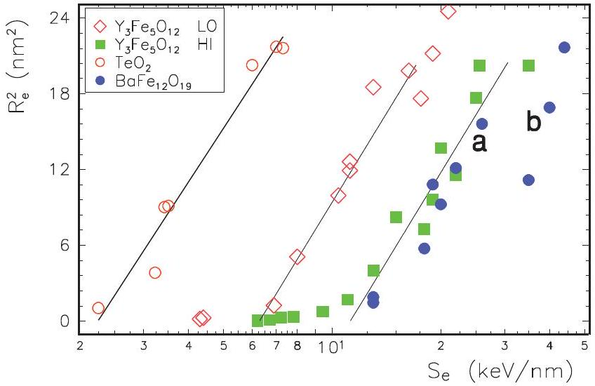
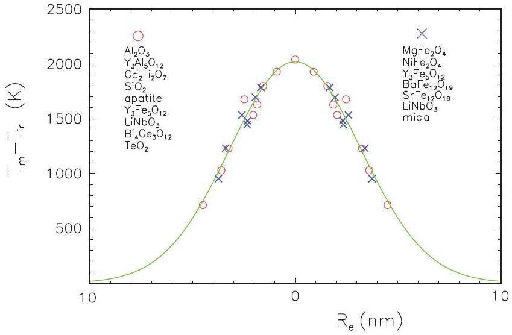
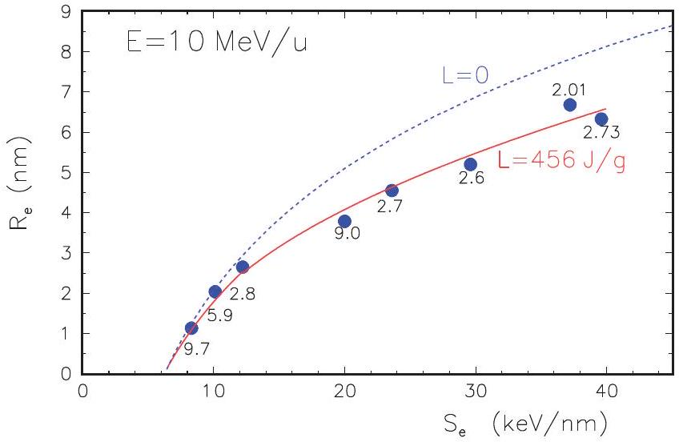
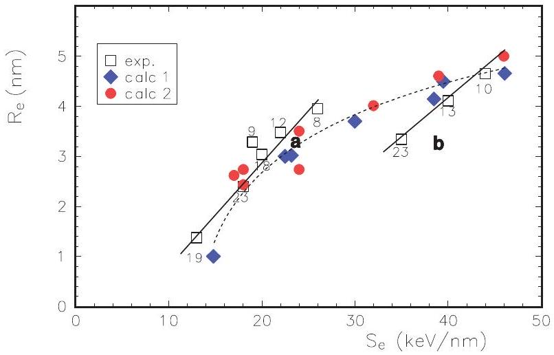

# Materials parameters and ion-induced track formation 

## G. Szenes

To cite this article: G. Szenes (2020) Materials parameters and ion-induced track formation, Radiation Effects and Defects in Solids, 175:3-4, 241-256, DOI: 10.1080/10420150.2019.1701457

To link to this article: https://doi.org/10.1080/10420150.2019.1701457
© 2020 The Author(s). Published by Informa
UK Limited, trading as Taylor \& Francis
Group

Published online: 30 Mar 2020.

Submit your article to this journal

Article views: 1128

View related articles
iew Crossmark data
CrossMark
CrossMark

Citing articles: 3 View citing articles

# Materials parameters and ion-induced track formation 

G. Szenes Department of Materials Physics, Eötvös University, Budapest, Hungary

#### Abstract

The role of various materials parameters in track formation is discussed. Experimental information is utilized showing a direct quantitative relationship in different solids between the melting points $T_{\mathrm{m}}$ and the ion-induced track radii $R_{\mathrm{e}}$ without involving other materials parameters. It is shown for $\Theta=T_{\mathrm{m}}-T_{\text {ir }}$ ( $T_{\text {ir }}$ - irradiation temperature) that $\Theta \sim \exp \left\{-R_{\mathrm{e}}{ }^{2} / w^{2}\right\}$ for $S_{\mathrm{e}} / N=$ constant, where $S_{\mathrm{e}}$ and $N$ are the electronic stopping power and the number density of atoms and $w=4.5 \mathrm{~nm}$. The validity of this universal-type relation is demonstrated for 14 different insulators including $\mathrm{LiNbO}_{3}$ and $\mathrm{BaFe}_{12} \mathrm{O}_{19}$. It is shown that the thermal diffusivity $D$, the heat of fusion $L$ the band gap energy $E_{\mathrm{g}}$ and the absorption radius $\alpha_{\mathrm{e}}$ of the electron distribution must not affect the track sizes as this would not be coherent with this identical behavior. Original reports on $\mathrm{LiNbO}_{3}$ and $\mathrm{BaFe}_{12} \mathrm{O}_{19}$ with opposite conclusions are critically analyzed. It is shown that an arbitrary value of the ion energy was used in the analysis that modified substantially the results leading to an undue justification of the contribution of $L$ and $E_{\mathrm{g}}$ in apparent agreement with the experimental data.

## ARTICLE HISTORY

Received 26 April 2019
Accepted 7 September 2019

## KEYWORDS

Heavy ions; tracks; velocity effect; heat of fusion; band gap energy

## 1. Introduction

In spite of the considerable progress in the studies of the electronic processes in ion-solid interaction in the last three decades, even some simple questions cannot be answered unambiguously at present. Such problem is the fraction of the electronic stopping power $S_{\mathrm{e}}$ that is transferred to the thermal energy $\epsilon$ of the ion-induced spike. Another fundamental problem is which are those individual materials parameters (MPs) that affect the track formation? Various models offer different answers to these questions.

It is evident that this is a very important problem both from theoretical and practical aspects as well. It is sufficient if one considers only the various solids that are applied in the nuclear industry for any purpose. The sensitivity of the radiation response of these solids to various MPs may be critical for applications. On the other hand, the knowledge of the right MPs controlling this response is a highly important element for elaborating the valid model.

There are essentially two main positions: (i) track sizes depend on many MPs, (ii) track sizes do not depend on MPs but one. When experiments are analyzed a number of MPs
and fitting parameters are applied according to (i) and only a single MP without any fitting parameter is used according to (ii). However, satisfactory description is provided by (i) only when an incomplete analysis is also accepted that does not account on the scaling features of the track data though it has been reported already by about 25 years (1). Thus the quantitative relationship between the results in different solids is ignored.

In this paper, we renew the efforts for the clarification of this problem with MPs by applying a general approach completed with checking the information on some 'classical' experiments in this field which are referred frequently in this respect for supporting (i). In this paper, only the problems related to the thermal diffusivity $D$, the heat of fusion $L$, the band gap energy $E_{\mathrm{g}}$, and the absorption radius $\alpha_{\mathrm{e}}$ are discussed. A peculiarity of the analysis is that opposite conclusions are drawn in the literature from the same experimental data regarding the role of $L$ and $E_{\mathrm{g}}$. In this paper, we discuss both reasonings. After reviewing the general features of track formation, they are applied to the problem of the contribution of various MPs to track formation and earlier studies are critically analyzed.

## 2. Discussion

### 2.1. Scaling features of track evolution

When an insulator is irradiated by swift heavy ions often amorphous cylindrical tracks are formed along the projectile trajectory. In a simple case, when the specific ion energy $E=$ constant, the tracks are characterized by the $R_{\mathrm{e}}$ radius that is a monotonous function of $S_{\mathrm{e}}$. Otherwise, $R_{\mathrm{e}}$ is sensitive to the variation of $E$ : the track size increases considerably with the reduction of $E$ at $S_{\mathrm{e}}=$ constant. This is the so-called damage cross-section velocity effect (VE) (2). Throughout this paper $S_{e} \gg S_{n}$ is assumed where $S_{n}$ is the nuclear stopping power characterizing the elastic interaction.

It is a specific property of track formation that when $R_{\mathrm{e}}{ }^{2}-S_{\mathrm{e}}$ track evolution curves are compared in various insulators a scaling feature is observed. In a simple case, the scaling factor is given by the number density of atoms N and the melting temperature $T_{\mathrm{m}}$ (3). This is rather unusual in experimental physics. In case of a similar behavior this might mean that the variation of the electrical or magnetic or mechanical or optical properties with temperature or pressure in a solid it can be obtained within experimental error by measurements on another solid. Such a possibility exists for track formation and this makes much easier answering to the problems formulated in the introduction.

In Figure 1, typical $R_{\mathrm{e}}{ }^{2}-S_{\mathrm{e}}$ track evolution curves are shown. Track formation starts for $S_{\mathrm{e}}>S_{\mathrm{et}}$ where $S_{\mathrm{et}}$ is the threshold electronic stopping power that can be estimated from the intersection of the lines with the $X$-axis. The semilogarithmic lines are parallel with the slope $\mathrm{d} R_{\mathrm{e}}{ }^{2} / \mathrm{dIn} \mathrm{S}_{\mathrm{e}} \approx 20.25 \mathrm{~nm}^{2}$. Tracks were induced in $\mathrm{Y}_{3} \mathrm{Fe}_{5} \mathrm{O}_{12}$, by low velocity (2, 4), and high velocity ions (2), as well. They are clearly separated in this plot showing that LO ( $E<2 \mathrm{MeV}$ /nucleon) ions induce considerably larger tracks than HI ( $E>8 \mathrm{MeV}$ /nucleon) ions at the same values of $S_{\mathrm{e}}$. This plot is a nice demonstration of the VE. The next figure exhibits the closest quantitative relationship between the track data.

In Figure 2, track radii and melting temperatures are shown for various track forming insulators for irradiations by low and high velocity ions when the atomic stopping power $<s_{\mathrm{e}}>=s_{\mathrm{e}} / N=$ constant. According to the figure, there is a simple quantitative relation

Figure 1. Variation of the track size ( $R_{e}$ - track radius) with the electronic stopping power $\mathrm{S}_{\mathrm{e}}$ in $\mathrm{Y}_{3} \mathrm{Fe}_{5} \mathrm{O}_{12}$; irradiation by low ( $E<2 \mathrm{MeV}$ /nucleon, LO ) and high velocity ions ( $E>8 \mathrm{MeV}$ /nucleon, HI ) - (2, 4), $\mathrm{TeO}_{2}$ (5) and $\mathrm{BaFe}_{12} \mathrm{O}_{19}(6,7)$.

Figure 2. Variation of the track radii $R_{\mathrm{e}}$ with the melting temperature $T_{\mathrm{m}}$ in insulators irradiated by low (0) ( $E<2 \mathrm{MeV}$ /nucleon) and high velocity $(x)(E>8 \mathrm{MeV} /$ nucleon $)$ ions at $<s_{\mathrm{e}}>/ 3 k=3.42 \times 10^{5} \mathrm{~nm}^{2} \mathrm{~K}$ and $7.5 \times 10^{5} \mathrm{~nm}^{2} \mathrm{~K}$, respectively ( $T_{\text {ir }}$ - irradiation temperature, $k$ - Boltzmann constant). In the figure, the solids are listed in the order of decreasing melting temperatures $T_{\mathrm{m}}$. The enveloping curve $\Theta(r)=T_{\mathrm{p}} \exp \left\{-r^{2} / w^{2}\right\}$ is a fit with $\mathrm{w}=(4.5 \pm 0.3) \mathrm{nm}$ and $T_{\mathrm{p}}=2020 \pm 60 \mathrm{~K}$ (for track data see (8)).

between track radii induced in different solids by different ions with different $E$ and $S_{\mathrm{e}}$ values in the LO or the HI ranges when $<s_{\mathrm{e}}>/ 3 k$ has fixed values where $k$ is the Boltzmann constant.

The existence of this kind of relationship is itself extraordinary. It means that if we do not know any of the track data in Figure 2 and measure a single track, e.g. in mica induced by Xe ions with $E=11.4 \mathrm{MeV} /$ nucleon then this would be sufficient information (completed with the appropriate $T_{\mathrm{m}}$ values) for the calculation of all track radii in the figure within experimental error. We emphasize that such relationship between solids is valid only for track sizes. Any other properties of the solids in Figure 2 are independent. It is evident that the
origin of this extraordinary effect must be related to the basic features of track formation in these solids. And there must be considerable discrepancies from those schemes which are incompatible with this feature, e.g. from those theories which are based on the contribution of many MPs.

Actually, in Figure 2, the $R_{\mathrm{e}}-\left(T_{\mathrm{m}}-T_{\mathrm{ir}}\right)$ relation ( $T_{\mathrm{ir}}$ - irradiation temperature) is described by the same $\Theta(r)$ function in the LO and HI ranges (8)

$$
\Theta(r)=T_{p} \exp \left\{-r^{2} / w^{2}\right\}
$$

where $w=4.5 \mathrm{~nm}$ and the peak temperature is $T_{\mathrm{p}}=2020 \mathrm{~K}$ under the given experimental conditions. In the figure, the values of $<s_{e}>$ were chosen with the purpose for having equal $T_{\mathrm{p}}$ peak temperatures in the LO and HI ranges. It is remarkable that the shape and the width of $\Theta(r)$ are not modified with varying $E$, only $T_{p}$ may vary. This is a highly significant result.

An extremely important information provided by Figure 2 is that the track sizes are controlled only by the melting temperature $T_{\mathrm{m}}$. This confirms unambiguously the thermal mechanism of track formation. Though there are data for 14 different insulators in Figure 2 and values of their MPs certainly vary in broad ranges, nevertheless, the track radii follow closely the same curve described by Equation (1). This is an indisputable evidence demonstrating that other MPs apart the melting temperature do not affect the track radii within experimental error. This information is of fundamental importance for understanding the irradiation effects.

In a thermal spike, amorphous tracks are formed from a cylindrical melt and the track diameter $2 R_{\mathrm{e}}$ is equal to the maximum width of the ion-induced temperature distribution at the melting temperature. $T(r, t)$ is the ion-induced temperature increase and its value is $T_{\mathrm{m}}-T_{\text {ir }}$ when the local temperature is $T_{\mathrm{m}}$. The time is measured starting from the moment of attaining the maximum width at the melting point at $t=0$ when the temperature increase is $T(r, 0)$. By using $\Theta(r)$ this width - the track diameter - can be obtained at the appropriate melting temperatures for any solid in Figure 2 as $T_{\mathrm{m}}-T_{\mathrm{ir}}=\Theta\left(R_{\mathrm{e}}\right)=T\left(R_{\mathrm{e}}, 0\right)$. It is remarkable that $\Theta(r)$ is a simple analytical function without individual MPs, including the parameters of the melting of various solids. These widths are all closely related to each other by means of $\Theta(r)$ as any of them can be estimated from any other one. Consequently, the $T(r, 0)$ distributions must be also quantitatively related to $\Theta(r)$ and to each other in these solids. This excludes the possibility that any of the $T(r, 0)$ distribution may depend on individual MPs, as well. They may depend on experimental parameters $<s_{\mathrm{e}}>$ and $T_{\text {ir }}$. However, these parameters are identical in Figure 2. Finally, the track data are sorted into two groups as those with $E<2 \mathrm{MeV} /$ nucleon and $E>8 \mathrm{MeV} /$ nucleon in agreement with the results of previous analyses (3) and Figure 2 confirms such selection.

If the $T(r, 0)$ distributions do not depend on individual MPs and there exists a mathematical relationship between them as discussed above, then they must be identical. Evidently, this conclusion is valid for all 14 insulators in Figure 2, as well. As the common $T(r, 0)$ and $\Theta(r)$ are equal at all 14 melting temperatures, consequently, they can be considered identical. A more detailed discussion has been given in Ref.(8). Thus the $\Theta(r)$ distribution is the analytical description of the ion-induced temperatures in insulators. This explains that $\Theta(r)$ provides simultaneously the correct widths for all insulators in Figure 2, and this is valid for a broad range of $<s_{\mathrm{e}}>$ (9). Other explanation of the plot in Figure 2 has not been proposed for more than a decade since the first publication of this result (10). As its shape and
width are identical for various insulators we consider $\Theta(r)$ as an universal-type relation. It is a highly important possibility that $\Theta(r)$ can be measured by systematic experiments.

In a mathematical sense, there is another solution to the problem, as well. According to this, the $T(r, 0)$ distributions may depend on individual MPs at any temperature except at $T=T_{\mathrm{m}}-T_{\text {ir }}$ where $r=R_{\mathrm{e}}$ in agreement with $\Theta(r)$, irrespective of MPs. However, as $T_{\mathrm{m}}$ is not a preferred temperature for the electronic energy deposition, it is evident that this mathematical solution has not any physical reality.

One may consider that when a model describes the track sizes correctly then it simultaneously describes the relationship in Figure 2 as well, as the correct track radii figure in both places. The problem is that the $R_{\mathrm{e}}-S_{\mathrm{e}}$ track evolution is a simple smooth curve that can be given by several functions or a polynomial series, too. However, those are simply formal descriptions without any physical consequences for the ion-induced temperature. Therefore, the research should not be stopped for the investigation of the origin of this phenomenon that may lead to revealing a basically new effect.

There are several interesting ideas that have been proposed for explaining track formation in a particular solid or for some group of solids. Many different MPs are applied in these models. The reality of some of these models can be simply checked if the track radii follow the systematics shown in Figure 2. In the following sections, we analyze critically the reports on the predicted effect of some MPs on the formation of tracks.

### 2.2. Thermal diffusivity

This problem has been discussed already earlier (11). In the present paper, the key result is that the width of the $\Theta(r)=T(r, 0)$ distributions does not vary with the composition in Figure 2. Therefore, the thermal diffusivities $D$ must have close values in various insulators in that period of time when tracks are formed. Thus it is not a parameter leading to different track sizes. It is not reasonable in this respect referring to the values measured under equilibrium conditions. In Ref.(11) similar conclusion was drawn from the identical value of the Gaussian width $w=4.5 \mathrm{~nm}$ of the ion-induced temperatures in various insulators derived from the analysis of track evolution curves. Thus the analysis of the experimental results shows unambiguously that the thermal diffusivity is not a controlling parameter for track formation.

### 2.3. Velocity effect

It is a widely known experimental observation that low velocity ions induce larger tracks compared to high velocity ions (VE) (2). In spite of its relatively long history, the origin of this effect is not clarified yet. It is a reasonable assumption in the i-TS (Inelastic Thermal Spike) model that the higher the energy of the projectile, the broader the spatial distribution of the excited electrons leading to the reduction of the energy density and broadening of the distribution of the ion-induced temperature (12). In this model, the thermal energy is unchanged when the ion energy varies at $S_{e}=$ constant. The spatial distribution of electron energy is characterized by an MP, the absorption radius $\alpha_{\mathrm{e}}$ which is the radius of a cylinder in which 0.66 of the electronic energy loss is stored on the target electrons (12). Then the variation of $\alpha_{\mathrm{e}}$ with $E$ - calculated by means of Monte Carlo simulations - is used for the
explanation of VE. High velocity ions induce broader electron energy distribution and lower energy densities leading to lower induced temperatures and smaller tracks.

The change of the absorption radius with $E$ is suitable for following the variation of the track radius as required by VE. This is the element by which the VE is taken into account quantitatively in the i-TS model. It is an important condition that the projectile energy used in the calculation must be close to the experimental value otherwise the correction introduced by the absorption radius $\alpha_{\mathrm{e}}$ will be incorrect.

Though the relationship between the variation of the absorption radius and VE seems to be a reasonable assumption, however, there is no evidence on the real broadening of the ion-induced temperature distribution with increasing $E$. On the other hand, it is evident that an additional MP apart $T_{\mathrm{m}}$ is in contradiction with the plot in Figure 2 and Equation (1) if it modifies the track size. As those are confirmed by experimental facts, this throws doubts on the validity of this model of VE. In a previous section, we have already applied the equation $\Theta(r)=T(r, 0)$. Some important features are apparent in Figure 2. Actually, the experimental data show that the width of $T(r, 0)$ is $w=$ constant, and it does not vary with the ion energy similarly to its shape. Thus the basic idea of the proposed explanation of VE is not confirmed by experiments (12). There are far-reaching consequences of this result concerning the possible mechanism of track formation. However, here we restrict our self only to the discussion of the VE.

In Figure 2, the shape, width and $T_{\mathrm{p}}$ are identical for $\Theta(r)$ at low and high ion velocities. The only difference is that at low ion velocities $<s_{\mathrm{e}}>/ 3 k=3.42 \times 10^{5} \mathrm{~nm}^{2} \mathrm{~K}$ ( $E<2 \mathrm{MeV} /$ nucleon $)$ and at high ion velocities ( $E>8 \mathrm{MeV} /$ nucleon $)<s_{\mathrm{e}}>/ 3 k=7.5 \times 10^{5} \mathrm{~nm}^{2} \mathrm{~K}$. However, in spite of the different values of $<s_{e}>$ the peak temperature $T_{\mathrm{p}}$ and thermal energies $\epsilon$ are identical in both cases. It is remarkable, that the thermal energy $\epsilon$ is considerably lower than the deposited energy at low and high ion velocities, as well. Thus it is evident from the figure that it is not the whole deposited energy but only its $f<1$ fraction is transferred to thermal energy. It follows from the above considerations that the efficiency f has different values at low and high ion velocities. The ratio $f_{\mathrm{LO}} / f_{\mathrm{HI}}=3.42 / 7.5 \approx 0.46$ (see Figure 2). The values of the efficiencies can be simply estimated by applying the balance of energy to data in Figure 2 and using the $\rho c=3 N k$ approximation where $\rho$ and $c$ are the density and specific heat. In a first step, the peak temperature is derived for a Gaussian distribution as

$$
T_{\mathrm{p}}=\frac{f\left\langle s_{\mathrm{e}}\right\rangle}{3 \pi k w^{2}}
$$

Thus the complete expression for $\Theta(r)$ is

$$
\Theta(r)=\frac{f<s_{\mathrm{e}}>}{3 \pi k w^{2}} \exp \left\{-r^{2} / w^{2}\right\} .
$$

When the appropriate values of $T_{\mathrm{p}}$ and $<s_{\mathrm{e}}>/ 3 k$ are applied (see Figure 2), $f_{\mathrm{LO}} \approx 0.38$, $f_{\mathrm{HI}} \approx 0.17$ are obtained in good agreement with other results (9). Presently, the details of the transition between $f_{\mathrm{LO}}$ and $f_{\mathrm{HI}}$ are not known as there are no systematic experimental data available in the range $2 \mathrm{MeV} /$ nucleon $<E<8 \mathrm{MeV} /$ nucleon .

Thus by analyzing the $\Theta(r)$ relationship it was found that only about $40 \%$ of the deposited energy is transferred to thermal energy at low ion velocities and this value is reduced further with the increase of $E$. The higher thermal energy $\epsilon$ means higher temperature and higher
energy density leading to the formation of larger tracks. This may be the origin of the VE. According to the results in Figure 2, the width of the temperature distribution does not change with $E$. Thus the variation of the absorption radius $\alpha_{\mathrm{e}}$ is not related to VE, it does not lead simultaneously to broadening or narrowing of the temperature distribution.

In Ref.(13) the transfer of the energy of the electric field of the ionized lattice atoms to kinetic energy was estimated. It was found that it varies with $E$ similarly to that observed for VE. It was concluded that the Coulomb explosion is a possible microscopic mechanism of VE. It was also found that the calculations were not sensitive to the actual form of the charge distribution. Thus this result is coherent with the plot in Figure 2.

### 2.4. Heat of fusion and track formation

When a system attains the temperature of phase transition a certain amount of energy, the so-called latent heat is absorbed or released by it. In the case of very fast thermal processes like ion irradiation, superheating may occur when the temperature may exceed the melting point without phase transition and it occurs at the superheating temperature. It is also a possibility, that the local electronic structure may be changed due to the intensive irradiation by an extent that the long-range order of the crystal is destroyed spontaneously without the deposition of the latent heat.

The heat of fusion $L$ is an MP and usually it is equal to a considerable fraction of $Q_{\mathrm{m}}$, the energy for heating up the solid to $T_{\mathrm{m}}$ from room temperature. The general proportionality between $L$ and $T_{\mathrm{m}}-T_{\mathrm{ir}}$ is not realistic. Therefore, the plot in Figure 2 is useful in this case as well.

The plot in Figure 2 is a unambiguous evidence that track sizes depend only on a single MP - the melting temperature $T_{\mathrm{m}}$. This is a clear instruction concerning the contribution of the heat of fusion $L$ to track formation. It is important to point out that this is not the case of two physical assumptions with respect of the role of $L$ and, e.g. the better agreement with the experimental data may suggest which of them is more realistic. Figure 2 and Equation (2) provide a simple mathematical condition for this problem. If $R_{\mathrm{e}}$ depended on $L$ a smooth curve through the data in Figure 2 would be impossible and the theoretical calculations cannot lead to opposite results.

Actually, the following quantitative relation between $R_{\mathrm{e} 1}, R_{\mathrm{e} 2}$ track radii and $T_{\mathrm{m} 1}, T_{\mathrm{m} 2}$ melting temperatures can be simply derived for two solids, 1 and 2 from the enveloping curve $\Theta(r)$ in Figure 2 (9)

$$
R_{\mathrm{e} 2}^{2}-R_{\mathrm{e} 1}^{2}=w^{2} \ln \left(\frac{T_{\mathrm{m} 1}-T_{\mathrm{ir}}}{T_{\mathrm{m} 2}-T_{\mathrm{ir}}}\right)+w^{2} \ln \frac{f_{2}<s_{\mathrm{e} 2}>}{f_{1}<s_{\mathrm{e} 1}>}
$$

where the parameter $f=0.17 / 0.4$ depends on the energy of the projectile. The validity of Equation (4) has been checked by reproducing accurately the $R_{\mathrm{e}}{ }^{2}-S_{\mathrm{e}}$ track evolution curves of insulators based on the track data of another insulator (9). This equation is very useful when the contribution of various MPs are studied. It shows most clearly the unique role of $T_{\mathrm{m}}$ for tracks compared to other MPs. In the following, we shall refer to this equation several times.

Thus the track radius $R_{\mathrm{e} 2}$ can be obtained within experimental error having the necessary information on $f$ and $T_{\mathrm{m}}$. The most important point for the present problem is, that $L$
is not included in Equation (4), nevertheless, the track sizes can be estimated within experimental error using this equation. This is supported by our previous results when the $R_{\mathrm{e}}{ }^{2}-S_{\mathrm{e}}$ track evolution curve was calculated for $\mathrm{NiFe}_{2} \mathrm{O}_{4}$ based on the data for $\mathrm{Y}_{3} \mathrm{Fe}_{5} \mathrm{O}_{12}$ in good agreement with the experimental data. Similar successful calculation was performed for the $\mathrm{TeO}_{2}$ - mica pair with ignoring the heat of fusion again (9). Such calculations can be repeated for any insulator in Figure 2 including $\mathrm{LiNbO}_{3}$ as well as it can be found in both lists in the figure.

The above considerations seem to be rather convincing evidence that $L$ may have only a minor contribution to track formation in $\mathrm{LiNbO}_{3}$. On the other hand, there is a study where including the tabulated value of $L$ into the calculations leads to significant improvement of the agreement with the experiments on track evolution in $\mathrm{LiNbO}_{3}$ (14). Thus the heat of fusion seems to have a considerable contribution to track formation and this view is widely accepted, though no similar analysis has been reported for any other solid. These two results for $\mathrm{LiNbO}_{3}$ are obviously in contradiction. A peculiarity of this problem is that the same database is used in both analyses leading to opposite conclusions while only one of the two considerations may be valid. This is not a particular question as the effect of various MPs on track formation is a fundamental problem. This problem is related to the proceeding of a phase transition under equilibrium or sharply non-equilibrium conditions. Therefore, the solution may have interesting theoretical consequences, as well.

In Ref.(14) track evolution in $\mathrm{LiNbO}_{3}$ was analyzed. Compared to an earlier analysis in Ref.(15) three tracks induced by U and Gd ions showing considerable deviations were ignored (compare Fig. 5b and 12 in Ref.(14) to Fig. 2 in Ref.(15)). On the other hand, three tracks were included without any information on the irradiation conditions. However, they need not to be ignored for this reason as they can be identified using Refs. (16, 17) as tracks induced by high energy Ni ion irradiations.

Finally, tracks produced by ions (in brackets) with $E=9.7,5.9,2.8$, (Ni) 9.0, 2.7, (Sn) 2.6, (Gd) 2.01 and 2.73 (U) MeV/nucleon were analyzed in Ref.(14). A smooth $R_{\mathrm{e}}-S_{\mathrm{e}}$ curve was obtained by this procedure. We note that in the case of accurate measurements it would not be possible drawing a smooth curve through track data with a similar broad range of the variation of $E$. The separation of the curves of $\mathrm{Y}_{3} \mathrm{Fe}_{5} \mathrm{O}_{12}$ in Figure 1 well demonstrates the scale of the effect of the ion velocity. As there is an overall agreement concerning VE, a similar separation is expected in $\mathrm{LiNbO}_{3}$ for tracks induced by 2.8 (Ni) and $2.7(\mathrm{Sn}) \mathrm{MeV} /$ nucleon and tracks induced by $9.7(\mathrm{Ni})$ and $9.0(\mathrm{Sn}) \mathrm{MeV} /$ nucleon, respectively. The unexplained smooth $R_{\mathrm{e}}-S_{\mathrm{e}}$ curve and ignoring some data with high deviations may lead to the reduction of the confidence in the results of this analysis.

In Ref.(14) the analysis was made applying the i-TS model (12). Usually, this model provided good agreement with the experiments. In the given case it was accepted by the authors as if $E \approx 10 \mathrm{MeV}$ /nucleon were valid for all tracks (see Fig. 12b in Ref.(14)) though $E \approx 2.5 \mathrm{MeV} /$ nucleon for the majority irradiations. Compared to the real E values this was apparently an arbitrary step and no explanation was given by the authors. In Figure 3, the original figure in Ref.(14) is completed with the appropriate values of $E$.

Initially, the results showed large separation of the experimental and the theoretical curve calculated with $L=0$ (see the dashed line in Figure 3). However, this difference disappeared after taking into account the supposed contribution of $L$. The authors considered this as a strong evidence confirming the contribution of $L$ to track formation (14).

Figure 3. Calculation of the $R_{\text {e }}$ track radii for $\mathrm{LiNbO}_{3}$ applying the i-TS model (14); $L$ - heat of fusion. The numbers at the track radii are the specific ion energies in $\mathrm{MeV} /$ nucleon units $(14,15)$.

However, there are several problems with this consideration. We refer here to the warning of Toulemonde et al. in Ref.(12) 'To avoid misinterpretation, any data comparison should (therefore) only be performed within the same velocity range.' This is a clear physical condition that is appropriate for this case, as well. Obviously, this was not followed in Ref.(14) by the authors.

Usually, a mathematical agreement between experiments and a theoretical calculation is considered to be sufficient for justifying the validity of the assumptions. A peculiarity of this situation is that because of the rather different $E$ values in the experiment and in the calculation, the good agreement between the experimental and the calculated curves does not justify the contribution of $L$ because of the VE. The situation is evident when looking at the curves in Figure 1 for $\mathrm{Y}_{3} \mathrm{Fe}_{5} \mathrm{O}_{12}$. The coincidence of the LO and HI curves in Figure 2 well demonstrates that VE has a similar magnitude in a number of insulators including $\mathrm{LiNbO}_{3}$ and $\mathrm{Y}_{3} \mathrm{Fe}_{5} \mathrm{O}_{12}$. The theoretical calculations for $E=10 \mathrm{MeV} /$ nucleon would follow approximately the HI curve in Figure 1 for $\mathrm{Y}_{3} \mathrm{Fe}_{5} \mathrm{O}_{12}$ while track evolution with $E=2-3 \mathrm{MeV} /$ nucleon must be close to the LO curve (see Fig. 11 in Ref.(12) for more details). The difference between track radii induced by projectiles with $E \approx 10$ and $2.5 \mathrm{MeV} /$ nucleon may exceed $40 \%$ for the same values of $\mathrm{S}_{\mathrm{e}}$. This means that while there seems to be a complete mathematical agreement for $E=10 \mathrm{MeV} /$ nucleon when an $R_{\mathrm{e}}-S_{\mathrm{e}}$ curve is calculated with the contribution of $L$ in $\mathrm{LiNbO}_{3}$, the estimate for the realistic $E=2.5 \mathrm{MeV} /$ nucleon may exceed considerably even the curve with $L=0$ in Figure 3. According to the words of Toulemonde, it is evident that the calculation for $E \approx 2.5 \mathrm{MeV} /$ nucleon is closer to the correct result for the data in Figure 3. Thus the excellent agreement demonstrated in Ref.(14) for $E=10 \mathrm{MeV} /$ nucleon is misleading, it is rather a counter argument for the contribution of $L$.

We note that if the above method were accepted then it would be simple to prove in another case that only a fraction of $L$ ought to be taken into account for ion-induced melting. The only change in the proof would be applying $E<10 \mathrm{MeV} /$ nucleon in the calculations; e.g. $E \approx 6 \mathrm{MeV} /$ nucleon for a $50 \%$ reduction of $L$.

There is another serious weak point of the paper even if an agreement would have been found for $E=2.5 \mathrm{MeV} /$ nucleon . The calculation is based on the improvement of a particular
fitting to some data points applying one of the proposed models. This is not a guaranty that the contribution of $L$ is necessary indeed for a correct description of the effect. There are other proposed functions for fitting (Analytical Thermal Spike Model (1), square root function (12)) where the supposed contribution of $L$ does not lead to an improvement. Thus the reliability of the evidences in support of the role of $L$ is rather doubtful in Ref.(14). However, the most powerful counter argument is Equation (4) as track radii can be estimated within experimental error without any information on the heat of fusion. This is fulfilled well for all insulators listed in Figure 2.

In summary, the track data used in Ref.(14) are not suitable for a common thermal spike analysis because of the selection of the track data and a broad range of variation of $E$ in $\mathrm{LiNbO}_{3}$. The good formal agreement between the calculated and experimental track values for $E=10 \mathrm{MeV} /$ nucleon is just a proof to the contrary of the author's claim because of the contradiction to the consequences of VE. Additionally, even a formally correct verification were not sufficient as it would be valid only for one of the models and do not for the phenomenon. Thus after thorough reconsidering the analysis in Ref.(14) it was concluded that those results were not suitable throwing any doubt on the minor contribution of $L$ to track formation.

The contribution of $L$ to track formation is not a simple theoretical problem. It has significant practical consequences, as well. In a model, where $L$ is ignored, track formation starts immediately when the local temperature is $T=T_{\mathrm{m}}$ at $S_{\mathrm{e}}=S_{\mathrm{et}}$. In a model which takes into account this contribution, track formation starts after the deposition of an additional energy $L$ at $T=T_{\mathrm{m}}$. As $S_{\mathrm{et}}$ is determined by the experiments its value cannot differ much in the two approaches and we take them equal for simplicity. Thus when $L$ is not ignored, $T=T_{\mathrm{m}}$ is attained at about $S_{\mathrm{e}} \approx S_{\mathrm{et}} /\left(1+L / Q_{\mathrm{m}}\right)$, where $Q_{\mathrm{m}}$, is the energy for heating up the solid to $T_{\mathrm{m}}$ from room temperature. This $S_{\mathrm{e}}$ value is considerably lower than $S_{\mathrm{et}}$ while $T=T_{\mathrm{m}}$ at $S_{\mathrm{e}}=S_{\mathrm{et}}$ for $L=0$. Now, the calculation of the induced temperatures is not correct in one of the two approaches. Our previous considerations show that $L=0$ during the process of track formation. Therefore, the calculation of the induced temperatures are not reliable, they are considerably overestimated in all those cases when the contribution of $L$ is taken into account. As a result, the error in estimating the induced temperature may exceed 50\% for $\mathrm{Gd}_{2} \mathrm{TiO}_{7}$ or $\mathrm{UO}_{2}$. This may have important practical consequences as the stability of irradiated solids are intensively affected by thermal processes.

In this paper, we analyzed opposing results regarding the effect of $L$ on the induced track radii. It is shown that track radii $R_{\mathrm{e}}$ do not depend on the heat of fusion $L$. Obviously, the validity of these results is limited by the experimental error of the measurements of track radii, that is usually $5-10 \%$.

### 2.5. Band gap energy

It was assumed in Ref.(12) that the band gap energy $E_{\mathrm{g}}$ may have a rather indirect effect on the track size as it may affect the value of the electron mean free path $\lambda$ that is the control parameter in the i-TS model. Thus $E_{\mathrm{g}}$ may change indirectly the track size thus it may be another MP besides $L$ controlling the track radius. We discuss this problem in detail because similarly to the case of $\mathrm{LiNbO}_{3}$ the same experimental data have been used for supporting the minor role of $E_{\mathrm{g}}$ and also for its significant contribution to track formation. The clarification of this problem deserves a thorough analysis.

Figure 4. Variation of the $R_{\mathrm{e}}$ track radii in $\mathrm{BaFe}_{12} \mathrm{O}_{19}$ (6, 7). The solid lines (a) and (b) were calculated applying the i-TS model (18). The numbers at the track radii are the specific ion energies in $\mathrm{MeV} /$ nucleon units. $R_{\mathrm{e}}$ values for $\mathrm{BaFe}_{12} \mathrm{O}_{19}$ were calculated based on tracks in $\mathrm{TeO}_{2}$ (5) (calc1) and in $\mathrm{NiFe}_{2} \mathrm{O}_{4}$ (1) (calc2) applying Equation (4); the dashed curve is a fit to the calculated track values.

A prominent example of the effect of $E_{\mathrm{g}}$ is the track formation in $\mathrm{BaFe}_{12} \mathrm{O}_{19}$ where $E_{\mathrm{g}}=1 \mathrm{eV}$ which is much lower than in other insulators in Figure 2. A theoretical basis is given by the i-TS model. A detailed analysis of experimental data has been given only for $\mathrm{BaFe}_{12} \mathrm{O}_{19}$ in this respect (18), nevertheless, the result on the effect of $E_{\mathrm{g}}$ on track formation is widely accepted for other solids, as well. Tracks induced in $\mathrm{BaFe}_{12} \mathrm{O}_{19}$ by HI ions are shown in Figure 1. We emphasize that tracks along the curve (a) show quite similar behavior to other insulators listed in Figure 2. We remind that all those track radii can be calculated within experimental error by using only $T_{\mathrm{m}}$ as an MP. Moreover, $E_{\mathrm{g}}$ varies in Figure 2 in the range $1-12 \mathrm{eV}$. The smooth enveloping curve in Figure 2 excludes the possibility for those insulators including $\mathrm{BaFe}_{12} \mathrm{O}_{19}$ that $E_{\mathrm{g}}$ might have any effect on the track size. We emphasize that the data of $\mathrm{BaFe}_{12} \mathrm{O}_{19}$ are also included in this figure demonstrating the existence of a relationship between tracks in various insulators that would not be possible with the contribution of MPs apart $\mathrm{T}_{\mathrm{m}}$. At the same time, the same data in $\mathrm{BaFe}_{12} \mathrm{O}_{19}$ represent the main argument in Ref.(18) justifying the contribution of $E_{\mathrm{g}}$ to track formation. Below we reconsider the experimental data and the analyses.

The experimental data for $\mathrm{BaFe}_{12} \mathrm{O}_{19}$ are shown in Figure 1. The samples with a thickness of about $50-60 \mu \mathrm{~m}$ were irradiated in stacks by ions $\mathrm{Mo}, \mathrm{Xe}, \mathrm{Pb}$ and U ions in the GeV range (6, 7, 19, 20). Track radii were measured by applying Mössbauer spectrometry. Unlike all other $R_{\mathrm{e}}-S_{\mathrm{e}}$ curves, there is a significant drop in track radii that appears at $S_{\mathrm{e}}>34 \mathrm{keV} / \mathrm{nm}$ in this solid though the $R_{\mathrm{e}}{ }^{2}-S_{\mathrm{e}}$ track evolution curves are smooth and continuous in other track forming insulators without exceptions.

In Ref.(18) the analysis was based on the assumption that VE led to the separation of the track evolution curves in $\mathrm{BaFe}_{12} \mathrm{O}_{19}$. Theoretical lines were calculated for two beam energies $E=7$ and $23 \mathrm{MeV} /$ nucleon applying the i-TS model with fitting parameters $\lambda=6.9$ and 9.5 nm and the results are shown in Figure 4. An excellent agreement with the experimental data along lines (a) and (b) in Figure 1 was obtained with these parameters.

The values of $\lambda$ were considerably higher than those in other insulators ( $\lambda=4-5$ (12)) and this was attributed qualitatively to the effect of the low band gap energy. This is the main evidence for the assumed $\lambda-E_{\mathrm{g}}$ relation.

For resolving the discrepancies between the conclusions of the two approaches, the analysis in Ref.(18) was completed with the missing mean values of the ion energies $E$ along the thickness of the samples, by using the original publications (6, 7, 19, 20). Estimates were obtained using the values of the thickness of the samples, the kind of the projectiles and their initial energies and also the average $S_{\mathrm{e}}$ values given in Refs.(6, 7, 19, 20). The results are shown in Figure 4. As the experiments were published by 1991 we applied the TRIM91 code in our calculations.

In Figure 4 in Ref.(18), the induced temperature was calculated for Xe irradiation with a mean energy $E=7 \mathrm{MeV} /$ nucleon and $S_{\mathrm{e}}=26 \mathrm{keV} / \mathrm{nm}$. In our calculations a slightly higher value $E=8 \mathrm{MeV}$ /nucleon was estimated under the same conditions. In spite of some uncertainties in the parameters of the irradiated samples, the small difference characterizes the reliability of our estimates. After considering all estimated values of $E$ it became evident that $E=7$ and $23 \mathrm{MeV} /$ nucleon applied in the theoretical calculation are too far from the real conditions. Thus similarly to the case of $\mathrm{LiNbO}_{3}$, the two values of $E$ used in the analysis in Ref.(18) were not coherent with those of the mean ion energies applied in the experiments.

Consequently, the analysis in Ref.(18) was made at arbitrary values of E that were very different from the real ones. This is in contradiction with the conditions required for a reliable analysis, since it distorts the calculated track sizes as it has been shown in the previous section for $\mathrm{LiNbO}_{3}$. The demonstration of the good fit with two arbitrary values of E is only seeming, not a real argument. Actually, this cannot serve as an evidence supporting the validity of any statement for $\mathrm{BaFe}_{12} \mathrm{O}_{19}$ including the effect of $E_{\mathrm{g}}$ on track radii. This may have further consequences, however, it is beyond the scope of this paper. Opposite to the conclusion in Ref.(18), the separation of the track radii cannot be related to the projectile velocities as the average values of $E$ along the curves (a) and (b) are very close: $E=14.8$ and $15.3 \mathrm{MeV} /$ nucleon. All these problems were hidden as the values of E were not given for the projectiles in Ref.(18). The situation is similar to that with $\mathrm{LiNbO}_{3}$ in the previous section. Inappropriate values of the specific ion energies devaluate the results of the theoretical analysis.

However, any of the above considerations do not explain the drop of the track evolution curve for about $S_{\mathrm{e}}>34 \mathrm{keV} / \mathrm{nm}$. In Section 2.1, we mentioned that Figure 2 demonstrates that there must be a simple quantitative relationship between track radii measured in different insulators. Equation (4) is an equation that can be applied for the calculation of a track evolution curve of an insulator using the data of an other solid. It is remarkable that apart from $T_{\mathrm{m}}$ no other MPs are involved in Equation (4). In Ref.(9) we have already demonstrated that this method works very accurately for the $\mathrm{TeO}_{2}$-mica and the $\mathrm{Y}_{3} \mathrm{Fe}_{5} \mathrm{O}_{12}$ - $\mathrm{NiFe}_{2} \mathrm{O}_{4}$ pairs. Here we use the same procedure for $\mathrm{BaFe}_{12} \mathrm{O}_{19}$ as it also exhibits common features with other insulators in Figure 2. We use the LO and HI track data of $\mathrm{TeO}_{2}$ (5) and $\mathrm{NiFe}_{2} \mathrm{O}_{4}$ (1), respectively for estimation. The details are given in Ref.(9) and the results are shown in Figure 4.

The calculated curve clarifies considerably the situation. Track radii derived from the data of $\mathrm{TeO}_{2}$ and $\mathrm{NiFe}_{2} \mathrm{O}_{4}$ are in good agreement. The overwhelming majority of the estimated and real track radii are in reasonable agreement for $\mathrm{BaFe}_{12} \mathrm{O}_{12}$. Some of the larger than the usual deviation may be the consequence of the large thickness of the samples $(\sim 50-60 \mu \mathrm{~m})$ leading to much higher than usually uncertainties of $R_{\mathrm{e}}$, and $S_{\mathrm{e}}$. Additionally, the mean $E$ values do not characterize unambiguously the effect of the ion velocity. Please remember that the difference between track radii may be about $40-50 \%$ in the

LO and HI regimes for $S_{\mathrm{e}}=$ constant. For example, the upward deviation of tracks size at $S_{\mathrm{e}}=19 \mathrm{keV} / \mathrm{nm} S_{\mathrm{e}}=26 \mathrm{keV} / \mathrm{nm}$ ( $E=9$ and $8 \mathrm{MeV} /$ nucleon, respectively) is conceivable as in about half of the sample thickness (back half) ( $\sim 30 \mu \mathrm{~m}$ ) approximately $8>E>2 \mathrm{MeV} /$ nucleon is valid. Thus as a consequence of the VE much larger tracks are formed in the back half than in the front half of the samples with $E>8 \mathrm{MeV} /$ nucleon while track evolution is nominally in the HI range in the whole sample. This may lead to the formation of larger tracks in average than it would be expected from an irradiation in the HI range.

We have shown by making use of the scaling features of the $R_{\mathrm{e}}{ }^{2}-S_{\mathrm{e}}$ track evolution that these curves are in good agreement for various insulators listed in Figure 2 (3). As that common curve is represented by the dashed line in Figure 4, therefore, the plot in Figure 4 also demonstrates that the same is valid for $\mathrm{BaFe}_{12} \mathrm{O}_{19}$ as well. According to the above analysis the low value of $E_{\mathrm{g}}$ in $\mathrm{BaFe}_{12} \mathrm{O}_{19}$ does not lead to marked changes in the track evolution. It is not possible to notice any consequence of the low value of $E_{\mathrm{g}}$.

Thus the comparison of the calculated curve with the experimental data shows that the track evolution curve of $\mathrm{BaFe}_{12} \mathrm{O}_{19}$ and other insulators in Figure 2 are coherent. The only problematic track is at $S_{\mathrm{e}}=35 \mathrm{keV} / \mathrm{nm}$. All other data are in reasonable agreement with the estimated curve which demonstrates the common behavior of these insulators. Our opinion is, that a single track radius that was not measured under well-defined conditions cannot provide the necessary experimental basis for proving an exceptional behavior of a solid. Thus it is reasonable accepting that presently there are no reliable data supporting the existence of such drop in $\mathrm{BaFe}_{12} \mathrm{O}_{19}$.

The problem of the possible drop of track radii in $\mathrm{BaFe}_{12} \mathrm{O}_{19}$ is a good example demonstrating the advantageous consequences of the scaling features of tracks in a number of insulators. Otherwise only a complete repeated experiment could answer this question. This emphasizes the importance of performing analyses making use of quantitative results on other insulators. On the other hand, while there are practical advantages of using thick samples, the uncertainties in the experimental data on $E_{1} R_{\mathrm{e}}$ and $S_{\mathrm{e}}$ due to VE may reduce the value of these experiments considerably.

We note that the $\lambda-E_{\mathrm{g}}$ relationship was also supported by a second study where track evolution in a high- $\mathrm{T}_{\mathrm{c}}$ superconductor (HTCS) was analyzed using the i -TS model (21). There is a principal problem: the i-TS model is based on the quasi-free electron model (22) which is not suitable for describing the processes in highly anisotropic solids like HTCSs or GeS. Thus the reliability of the result of that analysis is rather dubious.

Thus the analysis of the original experimental data does not provide reliable evidences that the band gap energy $E_{\mathrm{g}}$ affects the track size. Thus these results do not throw doubts on the validity of the conclusion that individual MPs apart from $T_{\mathrm{m}}$ are inefficient for modifying the track sizes in insulators.

### 2.6. Final remarks

It is rather unexpected that such a universal-type relation like Equation (4) may exist between the results of independent experiments. As these insulators all have been selected for experiments 'randomly' regarding the final results in Figure 2, we assume that a considerable number of insulators may exhibit similar features exhibiting independence on MPs. Even up to now, tracks were induced in about $3-4$ times more insulators compared to those included in Figure 2. However, our analysis requires the accurate knowledge of $S_{\mathrm{e}}, T_{\mathrm{m}}, E$, and
of the value of the efficiency $f$. Because of this last condition, we cannot use the results of experiments performed in the range $8>E>2 \mathrm{MeV} /$ nucleon where f varies in the range $0.4>f>0.17$.

The significance of the identical behavior is not limited to the simplification of the description of the processes. The consequences extend to the temporal and spatial variation of the temperature and deformation fields and to their effects on the local microstructure. Besides ion-induced track formation the theories of inelastic sputtering, mixing, swelling, formation of surface hillocks are also concerned. The results draw attention to the possibility that the equilibrium parameter values may change considerably under spike conditions.

Equation (3) describes a behavior in insulators which does not depend on the kind of components and the compositions. This is a unique phenomenon in physics. Moreover, several very intensive and complicated physical effects are excited simultaneously during bombardment by swift heavy ions. This phenomenon has not been described or predicted by any model and simulation studies. It is assumed that the underlying mechanism may be substantially different from those which have been applied previously in the theories of radiation effects. Thus the investigation of this effect may lead to a basically new knowledge.

## 3. Conclusions

A common quantitative relationship exists between track radii $\mathrm{R}_{\mathrm{e}}$ and the melting temperatures $T_{\mathrm{m}}$ whose validity is demonstrated for 14 insulators including $\mathrm{LiNbO}_{3}$ and $\mathrm{BaFe}_{12} \mathrm{O}_{19}$. This is attributed to the consequence of the common induced temperature $\Theta(r)=T_{\mathrm{p}} \exp \left\{-r^{2} / w^{2}\right\}$ so that $r=R_{\mathrm{e}}$ for $\Theta(r)=T_{\mathrm{m}}-T_{\text {ir }}$ for $<s_{\mathrm{e}}>/ 3 k=$ constant in various insulators. By using the $\Theta(r)$ relation it is shown for insulators that thermal diffusivity D, the heat of fusion $L$, the band gap energy $E_{\mathrm{g}}$ and the absorption radius $\alpha_{\mathrm{e}}$ have no effect on the track size as track radii depend only on a single $\mathrm{MP}-T_{\mathrm{m}}$. This is an evidence supporting the validity of the thermal spike mechanism. By applying $\Theta(r)$ track radii have been reproduced quantitatively for a number of insulators using only $T_{\mathrm{m}}$ as an MP.

Earlier experiments on $\mathrm{LiNbO}_{3}$ and $\mathrm{BaFe}_{12} \mathrm{O}_{19}$ with opposite results concerning $L$ and $E_{\mathrm{g}}$ are critically discussed. A specific feature of the problem is that the same track data are used for supporting opposite conclusions. The track data in $\mathrm{LiNbO}_{3}$ and $\mathrm{BaFe}_{12} \mathrm{O}_{19}$ were completed with the appropriate values of $E$ missing from the original analyses. A common deficiency of those studies was that track data were rather mixed regarding the ion velocities and arbitrary values of $E$ were used in the analyses. However, agreement with the experiments is meaningful only when close values of $E$ are applied in the calculations and the experiments. As this is not fulfilled, the excellent mathematical agreement demonstrated by the authors for $\mathrm{LiNbO}_{3}$ and $\mathrm{BaFe}_{12} \mathrm{O}_{19}$ are considered as the result of occasional coincidences, they cannot serve as an evidence. As no more studies on other materials have been reported, therefore, the conclusions on the contribution of $L$ and $E_{\mathrm{g}}$ to track formation remain experimentally unfounded. The experimental data in Figure 2 show unambiguously that the parameters of the ion-induced temperature distribution does not vary with the ion velocity. Therefore, the origin of the VE is not related to the absorption radius $\alpha_{\mathrm{e}}$ as it is widely accepted.

## Disclosure statement

No potential conflict of interest was reported by the author.

## References

(1) Szenes, G. General features of latent track formation in magnetic insulators irradiated with swift heavy ions. Phys. Rev. B 1995, 51, 8026-8029.
(2) Meftah, A.; Brisard, F.; Costantini, J.M.; Hage-Ali, M.; Stoquert, J.P.; Studer, F.; Toulemonde, M. Swift heavy ions in magnetic insulators: A damage-cross-section velocity effect. Phys. Rev. B. 1993, 48, 920-925.
(3) Szenes, G. New insight on the high radiation resistance of UO2 against fission fragments. J. Nucl. Mater. 2016, 482, 28-33.
(4) Jensen, J.; Dunlop, A.; Della-Negra, S.; Toulemonde, M. A comparison between tracks created by high energy mono-atomic and cluster ions in $\mathrm{Y}_{3} \mathrm{Fe}_{5} \mathrm{O}_{12}$. Nucl. Instrum. Methods B 1998, 146, 412-419.
(5) Szenes, G.; Pászti, F.; Péter, A.; Fink, D. Track evolution in $\mathrm{TeO}_{2}$ at low ion velocities. Nucl. Instrum. Methods B 2002, 191, 186-190.
(6) Meftah, A.; Merrien, N.; Nguyen, N.; Studer, F.; Pascard, H.; Toulemonde, M. High-energy irradiation of magnetic insulators by lead ions: appearance of a plateau in the damage efficiency. Nucl. Instrum. Methods B 1991, 59/60, 605-608.
(7) Studer, F.; Houpert, C.; Pascard, H.; Spohr, R.; Vetter, J.; Fan, F.Y.; Toulemonde, M. Saturation in the damage efficiency in magnetic insulators irradiated by high energy heavy ions. Radiat. Eff. Def. Solids 1991, 116, 59-70.
(8) Szenes, G. About the temperature distribution in track forming insulators after the impact of swift heavy ions. Nucl. Instrum. Methods B 2012, 280, 88-92.
(9) Szenes, G. An empirical equation between track radii and melting temperatures and its consequences for insulators irradiated by swift heavy ions. Nucl. Instrum. Methods B 2013, 312, 118-121.
(10) Szenes, G. Temperature distribution in a swift ion-induced spike: an experimental approach. Radiat. Eff. Def. Solids 2007, 162, 557-565.
(11) Szenes, G. Mixing of nuclear and electronic stopping powers in the formation of surface tracks on mica by fullerene impact. Nucl. Instrum. Methods B 2002, 191, 27-31.
(12) Toulemonde, M.; Assmann, W.; Dufour, C.; Meftah, A.; Studer, F.; Trautmann, C. Experimental Phenomena and Thermal Spike Model Description of lon Tracks in Amorphisable Inorganic Insulators. Mat. Fys. Med. 2006, 5, 263-292.
(13) Szenes, G. Coulomb explosion at low and high ion velocities. Nucl. Instrum. Methods Phys. Res. B 2013, 298, 76-80.
(14) Toulemonde, M.; Assmann, W.; Meftah, C.A.; Trautmann, C. Nanometric transformation of the matter by short and intense electronic excitation: Experimental data versus inelastic thermal spike model. Nucl. Instrum. Methods B 2012, 277, 28-39.
(15) Canut, B.; Ramos, S.M.M.; Brenier, R.; Thevenard, P.; Loubet, J.L.; Toulemonde, M. Surface modifications of $\mathrm{LiNbO}_{3}$ single crystals induced by swift heavy ions. Nucl. Instrum. Methods B 1996, 107, 194-198.
(16) Ramos, S.M.M.; Canut, B.; Ambri, M.; Clement, C.; Dooryhee, E.; Pitaval, M.; Thevenard, P.; Toulemonde, M. Europium diffusion enhancement in LiNbO3 irradiated with GeV nickel ions: influence of the damage morphology. Nucl. Instrum. Methods B 1996, 107, 254-258.
(17) Canut, B.; Ramos, S.M.M. The concept of effective electronic stopping power for modelling the damage cross-section in refractory oxides irradiated by GeV ions or MeV clusters. Radiat. Eff. Def. Solids 1998, 145, 1-27.
(18) Toulemonde, M.; Costantini, J.M.; Dufour, C.; Meftah, A.; Paumier, E.; Studer, F. Experimental Phenomena and Thermal Spike Model Description of Ion Tracks in Amorphisable Inorganic Insulators. Nucl. Instrum. Methods B 1996, 116, 37-42.
(19) Toulemonde, M.; Fuchs, G.; Nguyen, N.; Studer, F.; Groult, D. Damage processes and magnetic field orientation in ferrimagnetic oxides $\mathrm{Y}_{3} \mathrm{Fe}_{5} \mathrm{O}_{12}$ and $\mathrm{BaFe}_{12} \mathrm{O}_{19}$ irradiated by high-energy heavy ions: A Mössbauer study. Phys. Rev. B 1987, 35, 6560-6569.
(20) Houpert, C.; Nguyen, N.; Studer, F.; Groult, D.; Toulemonde, M. Swift heavy ions in insulating and conducting oxides: tracks and physical properties. Nucl. Instrum. Methods B 1988, 34, 228-236.
(21) Meftah, A.; Costantini, J.M.; Khalfaoui, N.; Boudjadar, S.; Stoquert, J.P.; Studer, F.; Toulemonde, M. Experimental determination of track cross-section in $\mathrm{Gd}_{3} \mathrm{Ga}_{5} \mathrm{O}_{12}$ and comparison to the inelastic thermal spike model applied to several materials. Nucl. Instrum. Methods B 2005, 237, 563-574.
(22) Toulemonde, M.; Dufour, C.; Paumier, E. The lon-Matter Interaction with Swift Heavy Ions in the Light of Inelastic Thermal Spike Model. Acta Phys. Pol. A 2006, 109, 311-322.

