# Nanometric transformation of the matter by short and intense electronic excitation: Experimental data versus inelastic thermal spike model 

M. Toulemonde ${ }^{\mathrm{a}, *}$, W. Assmann ${ }^{\mathrm{b}}$, C. Dufour ${ }^{\mathrm{a}}$, A. Meftah ${ }^{\mathrm{c}}$, C. Trautmann ${ }^{\mathrm{d}}$ ${ }^{\mathrm{a}}$ CIMAP-GANIL (CEA-CNRS-ENSICAEN-Univ. Caen), Bd H. Becquerel, F-14070 Caen-cedex 5, France ${ }^{\mathrm{b}}$ Ludwig-Maximilians-Universität München, Am Coulombwall 1, D-85748 Garching, Germany ${ }^{\mathrm{c}}$ LRPCSI, Univ. 25 Août 1955, Skikda, BP 26, Route d'El-Hadaïek, 21000 Skikda, Algeria ${ }^{\mathrm{d}}$ GSI Helmholtz Zentrum, Materialforschung, Planckstr. 1, D-64291 Darmstadt, Germany

## ARTICLE INFO

## Article history:

Received 3 November 2011
Available online 30 December 2011

## Keywords:

Swift heavy ion irradiation
Track formation in metals and insulators Inelastic thermal spike model

#### Abstract

Experimental investigations of ion tracks and sputtering phenomena with energetic heavy projectiles in the electronic energy loss regime are re-examined in metallic and insulating materials. An overview of track data such as the velocity dependence of the track size and the critical electronic energy loss for track formation is presented. Different physical characterizations of the material transformation are listed in order to deduce a track size which is independent of the observations. It will point out the differences of damage creation by electronic energy loss compared to nuclear energy loss. In the second part, we present a theoretical description of track formation based on the inelastic thermal spike model. This thermodynamic approach combines the initial size of the energy deposition with the subsequent diffusion process in the electronic and lattice subsystems of the target. The track size, resulting from the quench of a molten phase, is determined by the energy density deposited on the atoms around the ion path governed by the electron-phonon strength. Finally, we discuss the general validity of this model in metallic materials and its suitability to describe track formation in amorphizable and non-amorphizable insulators.

© 2012 Elsevier B.V. All rights reserved.

## 1. Introduction

Swift heavy ions generate a burst of electron excitation and ionization processes which finally leads to a cylindrical damage region in the irradiated material, called ion track. Since the discovery of particle tracks in the late 50s of the last century $[1,2]$, the understanding of track formation has largely improved mainly due to the development of large accelerator facilities for heavy ions providing well-defined irradiation conditions. Moreover, this kind of research benefited from novel characterization methods allowing the observations of track at the surface by atomic force microscopy [3] and by the progress of direct observation of these ion tracks at an atomic resolution scale with high resolution electron microscopy [4]. Also X-ray techniques such as small angle X-rays scattering [5], X-ray diffraction [6], extended X-ray absorption fine structure spectroscopy [7] nowadays available at most synchrotron light facilities significantly help to better understand track phenomena in a large number of different materials.

Ion-induced material modifications and tracks have been studied in several crystalline [8-10] and amorphous metals [11-13] as well as in semi-conductors [14-16], ionic insulators [17-19], and

[^0]numerous crystalline oxide materials that are or not amorphizable [20-25]. The results have been summarized in various reports [26-28] and the objective of this paper is to point out the main aspects of damage creation by electronic energy loss for metallic and insulating materials and to emphasize the differences with damage created by nuclear energy loss. The experimental results are well described within the inelastic thermal spike model [29-33] in which the electron-phonon coupling establishes a link between the deposited electronic energy ( $S_{e}$ ) (Fig. 1) and damage created along the ion path [27]. Although the thermal spike model proposed by the authors has been criticized [34,35], it will be shown that this macroscopic approach of the complex track formation process, assuming melting and boiling followed by a rapid quenching, allows precise descriptions and predictions of track phenomena for a large number of amorphizable and non-amorphizable materials.

## 2. Damage cross section, track radius and sputtering

### 2.1. Damage cross section and track radius for metallic materials

Pure metallic materials are not amorphizable and ion tracks mainly consist of point defects. Since point defects are only stable at low temperature, most irradiation experiments were performed

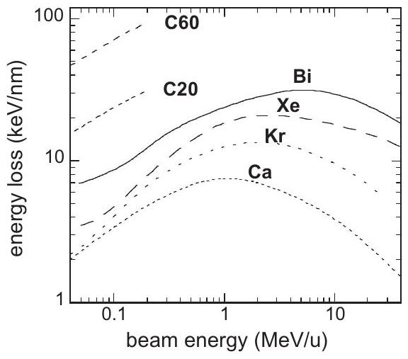
Fig. 1. Electronic energy loss $\left(S_{e}\right)$ versus the ion energy per nucleon for different mono-atomic ions and for C20 and C60 cluster projectiles in a $\mathrm{CaF}_{2}$ target as calculated with the SRIM code [36].

at low temperature (between 15 and 100 K ) [9,10,37,38]. Typically the electrical resistivity is determined as a function of ion fluence because it is a very sensitive parameter for point defects in metals. Knowing the resistivity of a single point defect, the ion-beam induced resistivity increase allows the determination of the number of defects per ion. To separate phenomena due to electronic and nuclear energy loss (always present), the initial number of defects per ion has to be normalized by the number of dpa (displacement per atom) [9,10,39,40]. Experimental damage data normalized by the number of calculated dpa (denoted as damage efficiency) of Ag [37], Fe [10], and Bi [9] are plotted in Fig. 2a as a function of the electronic energy loss. In this presentation, constant damage efficiency such as for Ag indicates that ions in the electronic energy loss regime do not contribute to the observed damage. In contrast, in Fe , the damage efficiency first decreases with increasing $S_{\mathrm{e}}$ up to a value of about $45 \mathrm{keV} / \mathrm{nm}$, suggesting defect annealing as also previously observed in Ni [8,41]. In a second stage, above $S_{\mathrm{e}}>\sim 45 \mathrm{keV} / \mathrm{nm}$, the number of defects is larger than the number of calculated dpa, indicating a clear effect of the electronic energy loss. For Bi targets, the $S_{\mathrm{e}}$ threshold of electronic damage creation is $\sim 25 \mathrm{keV} / \mathrm{nm}$. The damage efficiency for Bi increases when the irradiation temperature is raised from 20 to 100 K [42] (Fig. 2a), in opposite behavior with the stability of defects created by nuclear collisions that are annealed at 45 K [9].

Defect production through the electronic excitation process was also observed in crystalline intermetallic compounds like in $\mathrm{NiZr}_{2}$ [43] and in $\mathrm{Ni}_{3} \mathrm{~B}$ where track were observed [13,44]. For a large number of different amorphous metallic alloys, Klaumünzer et al. [11,45] discovered the surprising effect of anisotropic growth
where the ion beam flattens the sample after an incubation fluence (it is called the hammering effect). The sensitivity of amorphous metals was corroborated by in situ electrical resistivity measurements [46-48] where the incubation fluence is associated to point defect creation and by a direct observation of tracks at the surface by scanning force microscopy [49] or in bulk by transmission electron microscopy [50]. It is only in an amorphous metallic alloys that the chemical etching was observed in a metallic system [51].

Quantitative analysis of the evolution of the electrical resistivity versus fluence [9,10,46-48,52] allows the determination of the track damage cross section $\sigma$. A specific example is presented in Fig. 2b where the damage cross section in Fe irradiated at 15 K with U ions is plotted for different beam energies. With increasing specific energy, $\sigma$ decreases, in fact much stronger than the corresponding energy loss (cf. blue solid line in Fig. 2b). This shows us that there is no linear relationship between $S_{\mathrm{e}}$ and $\sigma$. In the past, many other experiments demonstrated that not the beam energy but the energy density plays the crucial role [27]. The effect is often denoted as "the velocity effect", because the radial spread of the initially deposited energy scales with the ion velocity.

From the damage cross section, the track radius $R$ is extracted ( $\sigma=\pi R^{2}$ ) assuming cylindrical track geometry. The evolution of the track radius with increasing electronic energy loss is presented in Fig. 3a for crystalline Ti [37,38], Bi [9,42,52], and Fe [10] targets and for the amorphous iron-boron alloy a- $\mathrm{Fe}_{85} \mathrm{~B}_{15}$ [47-49]. The extrapolation to the abscissa indicates the different critical energy losses required for track formation. Also the slope of the different targets varies significantly, e.g., at large $S_{\mathrm{e}}$, the track size in Ti can be smaller than the one in Bi although the $S_{e}$ threshold of Ti is smaller than for Bi. Each specific material has its own $S_{\mathrm{e}}$ threshold and track size evolution. In addition, the track size can change drastically when the temperature of irradiation is performed at different temperatures as illustrated for a Bi target irradiated between 20 and 300 K (Fig. 3b). The amorphous iron-boron compound (a-Fe ${ }_{85} \mathrm{~B}_{15}$ ) is more sensitive [47] than a crystalline pure iron target [10] (Fig. 3a). The dependence of track size on temperature and on the target structure (amorphous or crystalline) is a specific effect in the electronic energy loss regime, while in the nuclear energy loss regime, the energy for atomic displacements does not vary significantly on these parameters.

### 2.2. Damage cross section, track radius and sputtering for insulators

For insulators, the difference between amorphizable and nonamorphizable materials is of importance depending on the criteria of ionicity bonding [53].

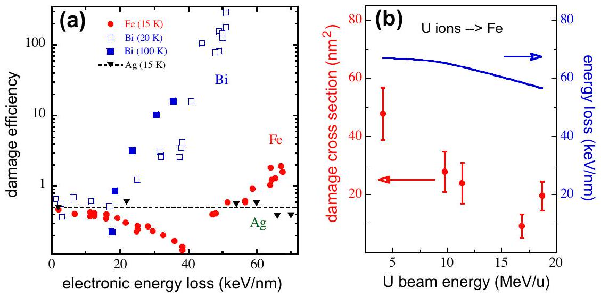
Fig. 2. (a) Damage efficiency versus electronic energy loss for different metallic targets irradiated at cryogenic temperatures: $\mathrm{Ag}(15 \mathrm{~K}), \mathrm{Fe}(15 \mathrm{~K})$, and Bi ( 20 and 100 K ). (b) Damage cross section and electronic energy loss for $\mathrm{Fe}(15 \mathrm{~K})$ as a function of the specific energy of U ions. With increasing energy, the damage data decrease by a factor of 4 while the corresponding energy loss drops only by $20 \%$.

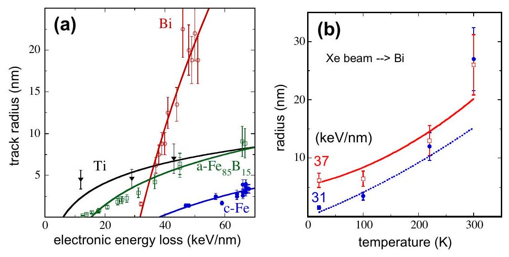
Fig. 3. (a) Track radius versus electronic energy loss for crystalline Ti, Bi, Fe, and amorphous $\mathrm{Fe}_{85} \mathrm{~B}_{15}$ targets. The lines correspond to thermal-spike model calculations. (b) Track radius in Bi versus irradiation temperature for ions of two different energy losses. The lines correspond to thermal-spike model calculations.

In crystalline amorphizable insulators such as many oxides, tracks have been studied extensively using different physical direct and indirect characterization methods:

Track radii can be determined by several physical observations: transmission electron microscopy (TEM) [54-56], scanning force microscopy (SFM) [3,57], and small angle X-rays scattering (SAXS) [58] provide access to the track radius, called afterwards a direct determination of the radius since such quantification is independent of the applied low fluence. Tracks in mica, e.g., show good agreement independent of the technique used (Fig. 4). Direct methods are important, but limited with regard to the determination of the track formation threshold because this requires the analysis of smaller and smaller tracks. For many materials, the minimum track radius is around 2 nm [4,27] and when further decreasing $S_{\mathrm{e}}$, the tracks finally fragment into extended subsections [59] keeping the same radius. Considering this change in track geometry, extrapolation of the track size to $S_{\mathrm{e}}=0$ is not meaningful (Fig. 4).

In addition to direct track observation, numerous other methods are in use in order to identify and quantify ion beam induced changes of material properties. Such techniques are e.g., Mössbauer spectroscopy to test changes of the magnetic behavior of tracks [60-64], channeling Rutherford backscattering [22,28,65-67] or X-rays diffraction spectrometry (XRD) [67-72] to measure structural changes, and surface profilometry to yield

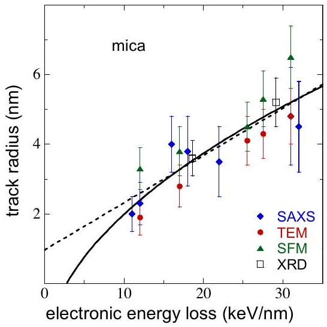
Fig. 4. Track radii in mica measured directly by TEM, SAXS, SFM and deduced indirectly from XRD measurements. The dotted line is a linear fit. The extrapolation to the abscissa obviously fails to provide the $S_{\mathrm{e}}$ threshold. The solid line is a square root fit as a function of $S_{\mathrm{e}}$ indicating track formation above $2 \mathrm{keV} / \mathrm{nm}$ [59].

information about volume swelling [73-77]. The irradiation experiments are typically performed for various samples up to fluences where tracks overlap. Based on the model of Thévenard et al. [78], the evolution of the damage versus fluence yields to quantification of the damage cross section. Such analysis is described in details [78] and illustrated in Fig. 5a where the disorder near the surface is characterized by channeling Rutherford backscattering [27]. For analyzing such data, not the saturation value itself but the number of data points in the non linear regime is rather decisive because they define the fit quality for deducing the damage cross section values.

In most cases as seen in the case of $\mathrm{LiNbO}_{3}$, the deduced damage cross section increases as a linear function of the electronic energy loss. This presentation allows the determination of the damage creation threshold by extrapolation of the damage data to null damage cross section. Moreover the beam energy plays also an important role since the damage cross section is larger for ion at low velocity than for high ion velocity. Since the cross section ( $\sigma$ ) is linear with $S_{\mathrm{e}}$, the track radius which is equal to the square root of $\sigma$ divided by $\pi$, should follow the square root of the electronic energy loss as shown for mica by the solid line in Fig. 5b yielding a realistic $S_{\mathrm{e}}$ threshold [59]. This approach is supported by the fact that the track radius in mica deduced from the loss of crystallinity by means of XRD measurements [68] is in good agreement with direct observations by TEM, SFM, and SAXS (Fig. 5a). In several amorphizable insulating oxides such as mica $[3,57,58,68,79], \mathrm{Y}_{3} \mathrm{Fe}_{5} \mathrm{O}_{12}$ [80,81], $\mathrm{Gd}_{3} \mathrm{Ga}_{5} \mathrm{O}_{12}$ [22], and crystalline $\mathrm{SiO}_{2}$ quartz [77,82,83], the combination of direct and indirect techniques leads to a consistent description of both the track size and the damage creation threshold.

Numerous experiments have shown that the situation is more complex in oxides such as $\mathrm{SnO}_{2}$ [23-25], yttria-stabilized $\mathrm{ZrO}_{2}$ [84,85], zirconate pyrochlore $\mathrm{Gd}_{2} \mathrm{Zr}_{2} \mathrm{O}_{7}[6,69,86]$ which are nonamorphizable according to the ionicity criteria [53]. In these materials, the track size deduced from a contrast observed by TEM is significantly smaller than in amorphizable oxides like $\mathrm{LiNbO}_{3}$ (Fig. 6a), or yttrium [80,81] and gadolinium garnets [22]. Such contrast can be due to several phenomena like clustering of defects [87,88] or phase change [89]. But from damage cross section, track size in yttria-stabilized $\mathrm{ZrO}_{2}$, deduced from C-RBS disorder characterization, is at least two times larger than the track size observed by TEM [84,85]. Moreover, the cross section of the transformation of pure $\mathrm{ZrO}_{2}$ from the monoclinic to tetragonal phase [90-92]) as deduced by XRD [23,93] leads to track radii even larger than in yt-tria-stabilized $\mathrm{ZrO}_{2}$ and of the same order of magnitude (Fig. 6a) as in amorphizable insulators. However such a transformation which

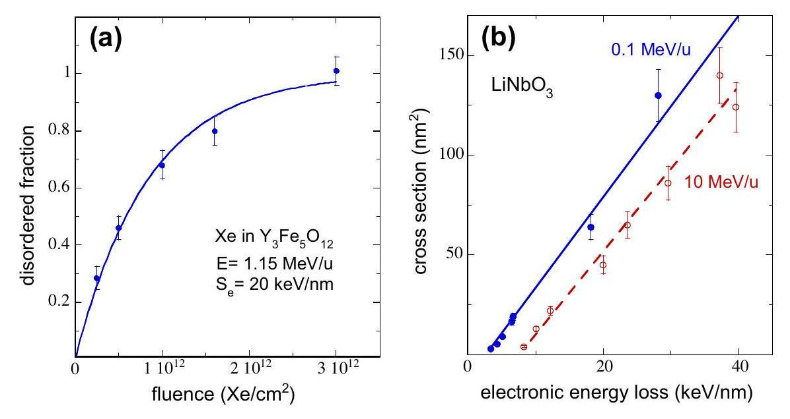
Fig. 5. (a) Disordered fraction versus fluence for $\mathrm{Y}_{3} \mathrm{Fe}_{5} \mathrm{O}_{12}$ irradiated by Xe ions. (b) Damage cross section in $\mathrm{LiNbO}_{3}$ for two significantly different beam energies.

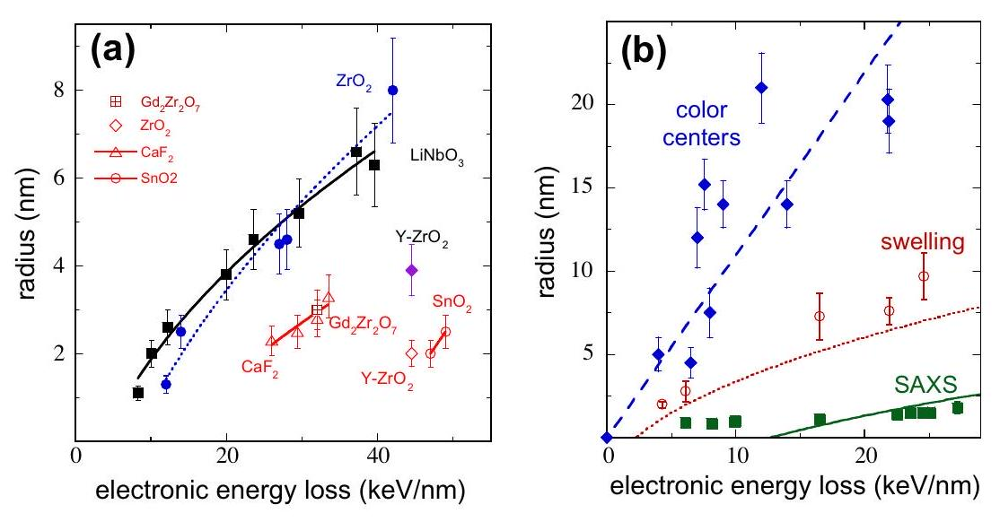
Fig. 6. (a) Track radius versus electronic energy loss for various non-amorphizable insulators ( $\mathrm{ZrO}_{2}, \mathrm{Y}-\mathrm{ZrO}_{2}, \mathrm{SnO}_{2}, \mathrm{CaF}_{2}$ [95]) compared to amorphizable $\mathrm{LiNbO}_{3}$. Radius data are deduced from indirect methods (full symbols,) such as $\mathrm{C}-\mathrm{RBS}$ ( $\mathrm{LiNbO}_{3}$ and $\mathrm{Y}-\mathrm{ZrO}_{2}$ ) and $\mathrm{XRD}\left(\mathrm{ZrO}_{2}\right)$ and from direct TEM (open red symbols) observations ( $\mathrm{CaF}_{2}, \mathrm{Gd}_{2} \mathrm{Zr}_{2} \mathrm{O}_{7}$, $\mathrm{Y}-\mathrm{ZrO}_{2}$, and $\mathrm{SnO}_{2}$ ). Lines are guides to the eye. (b) Track radius versus electronic energy loss for LiF deduced from three different indirect methods: optical absorption due to color centers, swelling measurements and SAXS. Lines for swelling and SAXS data result from model calculations with the inelastic thermal spike code. (For interpretation of the references to color in this figure legend, the reader is referred to the web version of this article.)

results from a double impact process [94], may affect the determination of the cross section and then the radius.

Within the class of ionic crystals, non-amorphizable LiF (pure ionic binding) has been studied extensively [18]. For various characterization techniques, rather different track sizes were deduced indicating a shell-like track structure (Fig. 6b). Such differences in the damage cross section determination using different physical characterizations are open questions in the track description in non-amorphizable insulators as compared to what it has been observed in amorphizable one like in mica (Fig. 4).

It should be point out that $\mathrm{Al}_{2} \mathrm{O}_{3}$ is a material which is difficult to amorphize [96]. regarding its iconicity value ( $\sim 0.6$ [53]) It presents a threshold of damage creation [97-99] which is quite large as compared to any other insulators [27,59] as suggested [100]. Furthermore it presents also a two step processes in order to reach complete disorder by channeling Rutherford backscattering: first a non-amorphized disorder is observed which is followed by an amorphization coming from the surface that appears only after incubation fluence [101,102]. This cannot be explained by a two impact processes as described by Gibbons [94].

### 2.3. Electronic sputtering

The sensitivity of a given material in the electronic energy loss regime can also be identified by measuring the yield of atoms $/ \mathrm{mol}-$
ecules sputtered from the surface (electronic sputtering) and should in principle follow the same criteria as track formation in the bulk material. Presently sputtering data from the surface together with track data from the bulk exist only for a limited number of materials [103]. Results for oxides insulators are presented in Fig. 7 shows the sputtering rate of Si from $\mathrm{SiO}_{2}$ [104] and Fe from $\mathrm{Y}_{3} \mathrm{Fe}_{5} \mathrm{O}_{12}$ [105] as a function of energy loss and compares this with the size of the tracks. An important information

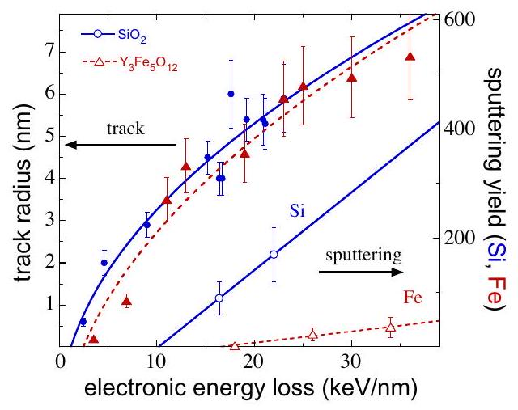
Fig. 7. Track radii and sputtering yield for crystalline $\mathrm{SiO}_{2}$ and $\mathrm{Y}_{3} \mathrm{Fe}_{5} \mathrm{O}_{12}$ with Si and Fe being the respective sputtered species measured. Lines are guides to the eye.

from this presentation concerns the different thresholds: sputtering requires a higher critical energy loss than track creation. This is in clear contrast to the nuclear collision regime where the energy necessary to create a defect is around five times larger than the energy required to sputter an atom from the surface [40,106].

Furthermore, the sputtering rate of ionic crystals is about two orders of magnitude larger than for oxides materials [103] and in addition, the so-called volcano effect appears: the angular distribution of the sputtered particles shows a jet component, perpendicular to the sample surface, superimposed on an isotropic component. It should be also quoted that the sputtering rate in metallic materials [107] is two orders of magnitude smaller than for insulators, but larger than from nuclear collisions only. Four orders of magnitude difference in the sputtering rate for different materials is not observed in the nuclear collision regime.

## 3. Inelastic thermal spike model: a transient thermal process

### 3.1. Electronic energy loss of swift ions and energy density

The slowing down of swift heavy ions of MeV to GeV kinetic energy is dominated by the electronic energy loss i.e. by interaction with the target electrons whereas stopping due elastic collision processes with the target atoms (nuclear energy loss, $S_{n}$ ) is much smaller and can often be neglected. Electronic and nuclear energy loss values can be deduced from codes like SRIM [36] that calculate the energy loss for any arbitrary materials by inter/extrapolating experimental data. Depending on the ion-target system, the uncertainty is $10-20 \%$ except in specific range of low energy ion with heavy masses [108-110] where the uncertainties can reach $\sim 100 \%$.

Fig. 1 shows the electronic energy loss of different ions in calcium fluoride as a function of ion energy per nucleon. Maximum energy loss is reached at the so called Bragg peak which is at $\sim 1 \mathrm{MeV} / \mathrm{u}$ for light ions such as Ca and $\sim 6 \mathrm{MeV} / \mathrm{u}$ for heavy ions such as Bi . Using cluster beams of C 60 or C 20 projectiles [111], the energy loss can even surpass $S_{\mathrm{e}}$ of heaviest monoatomic ions such as uranium for energies less than $\sim 0.3 \mathrm{MeV} / \mathrm{u}$ because the energy loss of C60 (or C20) clusters is in good approximation equal to the sum of the electronic energy loss of the 60 (or 20) carbon constituents [112]. Fig. 1 also shows that a given $S_{\mathrm{e}}$ value (e.g., $19 \mathrm{keV} / \mathrm{nm}$ ) can be reached with different ion species (e.g.,) or with a fixed ion species below or above the Bragg peak (e.g., Bi $(0.5 \mathrm{MeV} / \mathrm{u}), \mathrm{Bi}(40 \mathrm{MeV} / \mathrm{u}), \mathrm{Xe}(1.2 \mathrm{MeV} / \mathrm{u})$, or $\mathrm{Xe}(6.8 \mathrm{MeV} / \mathrm{u})$ ). Although the nominal $S_{\mathrm{e}}$ is the same, the energy density deposited at different ion velocities can be quite different ("velocity effect"), because the target volume in which the energy is deposited on the electrons becomes larger with increasing ion velocity. The radial energy distribution is estimated by means of Monte Carlo
simulations [113] that follow the evolution of the energy in the electron cascades as a function of space ( $\sim 1 \mu \mathrm{~m}$ ) and time ( $\sim 10^{-} { }^{15}$ to $10^{-14} \mathrm{~s}$ ) [114]. Fig. 8a shows the fraction of $S_{\mathrm{e}}$ deposited in the electronic system versus the radial distance from the ion trajectory. The calculation is performed for $\mathrm{CaF}_{2}$ as target and for different beam energies using an analytical formula derived from MC calculations [115]. To estimate the effect of the ion velocity, we apply the $66 \%$ criterion in which 0.66 of the electronic energy loss is stored and denote this as absorption radius $\alpha_{\mathrm{e}}$. This criterion assumes that $2 / 3$ of the energy deposited on the electrons is in the core track and $1 / 3$ in the halo track as calculated in the following references [114,116]. Large ion velocities result in large $\alpha_{e}$ values (Fig. 8a). For a given energy loss, the deposited energy is then spread into a larger volume leading to a lower energy density. Fig. 8 b shows $\alpha_{\mathrm{e}}$ values as a function of the specific beam energy for different materials. These $\alpha_{\mathrm{e}}$ values follows roughly a power 0.4 of the specific energy, i.e. seems to be proportional to the ion velocity. It should be noted that the extrapolation of the analytical formula of the radial energy distribution from Waligorski et al. [115] to low energies ( $E<0.1 \mathrm{MeV} / \mathrm{u}$ ) is questionable and in this energy regime new MC calculations are needed.

### 3.2. Inelastic thermal spike process

### 3.2.1. Description of the model

The inelastic thermal spike model (i-TS) [29,30,117] was originally developed to predict track radii in the electronic regime for amorphous metallic alloys [118]. It describes how the energy first diffuses within the electron subsystem before being transferred and finally localized in the lattice system. The strength of the energy transfer between the two subsystems is governed by the elec-tron-phonon coupling. The model is able to quantitatively describe the evolution of the track size as a function of the electronic energy loss in various materials, including both metals [30] and insulators [29]. Mathematically, the model is based on the following two coupled differential equations governing the heat diffusion in both subsystems in time $t$ and space $r$ in cylindrical geometry:

$$
\begin{aligned}
& C_{\mathrm{e}}\left(T_{\mathrm{e}}\right) \frac{\partial T_{\mathrm{e}}}{\partial t}=\frac{1}{r} \frac{\partial}{\partial r}\left[r K_{\mathrm{e}}\left(T_{\mathrm{e}}\right) \frac{\partial T_{\mathrm{e}}}{\partial r}\right]-g\left(T_{\mathrm{e}}-T_{\mathrm{a}}\right)+A(r[v], t) \\
& C_{\mathrm{a}}\left(T_{\mathrm{a}}\right) \frac{\partial T_{\mathrm{a}}}{\partial t}=\frac{1}{r} \frac{\partial}{\partial r}\left[r K_{\mathrm{a}}\left(T_{\mathrm{a}}\right) \frac{\partial T_{\mathrm{a}}}{\partial r}\right]+g\left(T_{\mathrm{e}}-T_{\mathrm{a}}\right)
\end{aligned}
$$

where $T_{\mathrm{e}, \mathrm{a}}, C_{\mathrm{e}, \mathrm{a}}$ and $K_{\mathrm{e}, \mathrm{a}}$ are the temperature, the specific heat, and the thermal conductivity for the electronic and atomic structures, respectively. Instead of using an analytical solution of the Eq. (1) (a Gaussian distribution that describes the energy deposition on the atoms versus time and space [118]), these two equations are solved numerically [119] to take into account the

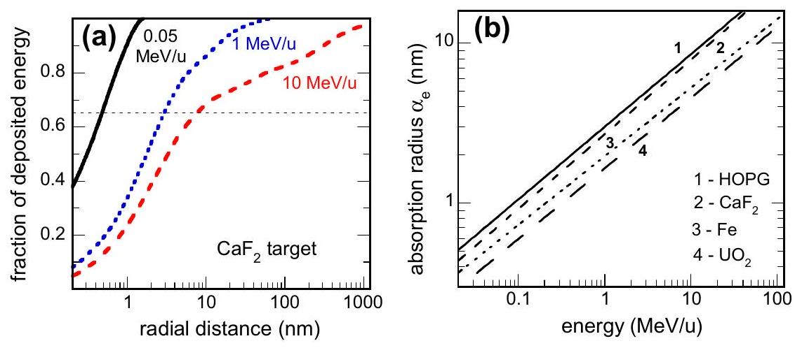
Fig. 8. (a) Fraction of energy deposited on electrons of $\mathrm{CaF}_{2}$ target as a function of radial distance from ion trajectory. The calculations assume cylindrical geometry and are based on Monte Carlo simulations. (b) Evolution of absorption cylinder radius versus beam energy for HOPG, $\mathrm{CaF}_{2}$, Fe , and $\mathrm{UO}_{2}$.

evolution of all the parameters versus $T_{\mathrm{e}, \mathrm{a}}$ and the initial energy distribution on the electrons, $A(r[v], t)$ that depends on the ion velocity $v$ (see Section 3.1). The validity of this complete numerical solution as compared to an analytical solution will be illustrated later when discussing insulators. It is assumed that the deposited energy should be equal to the corresponding electronic energy loss [36] when integrating, $A(r[v], t)$, over the steps in time and in space.

The main parameter is the electron-phonon coupling that is linked to the electron-phonon mean free path $\lambda[29,120]$ by the following relation: $\lambda^{2}=D_{\mathrm{e}} C_{\mathrm{e}} / g$ and to the electron-phonon mean free time $\tau=C_{\mathrm{e}} / g$, with $D_{\mathrm{e}}=K_{\mathrm{e}} / C_{\mathrm{e}}$. As described previously, the model calculations are performed within a superheating scenario [103], i.e. that increase of temperature never stops when reaching the melting [120,121] or the boiling temperature. This is the consequence of a very rapid increase in energy deposition. The track radii are associated with the cylinder in which the energy deposited on the atoms surpasses a specific temperature or energy per atom, which will be the criterion for track formation, defined in the next paragraph. The net result of the calculation is the evolution of the temperature (Fig. 9a) or of the energy deposited on the atoms (Fig. 10a) versus time when melting temperature is surpassed to take into account the energy necessary for the phase change from solid to liquid or liquid to gas.

### 3.2.2. Thermal spike in metallic targets

According to the theory, the electron-phonon coupling for metallic materials is proportional to the square of the Debye temperature and inversely proportional to the electrical conductivity ( $\sigma_{\mathrm{e}}$ ) [122,123]. Large electron-phonon coupling is thus expected for materials with large Debye temperature combined with low electrical conductivity (Table 1) [124].

Such theoretical determination of the electron-phonon coupling [122,123] is supported by irradiation of metals by pulse laser irradiation in femtosecond time scale. As example Fujimoto et al. [125] have measured an electron-phonon mean free time of several hundred of fs for the W in agreement with the theoretical estimation ( $\sim 500 \mathrm{fs}$ ). However as from fs laser experiment we get only the order of magnitude, the $g$ factor will be considered as a free parameter in the following and will be compared afterwards to the estimation given in table 1.

The $g$ value in Fe is extracted from a fit to the damage efficiency data for $S_{\mathrm{e}}<40 \mathrm{keV} / \mathrm{nm}$ by assuming that the defect annealing observed in the experiment (Fig. 2a) results for a transient thermal process as described by Vineyard [126]. Knowing the activation energy to anneal point defects in Fe , the probability to anneal them is calculated [39] as a function of atomic temperature versus time and space. Then the number of remaining defect is normalized

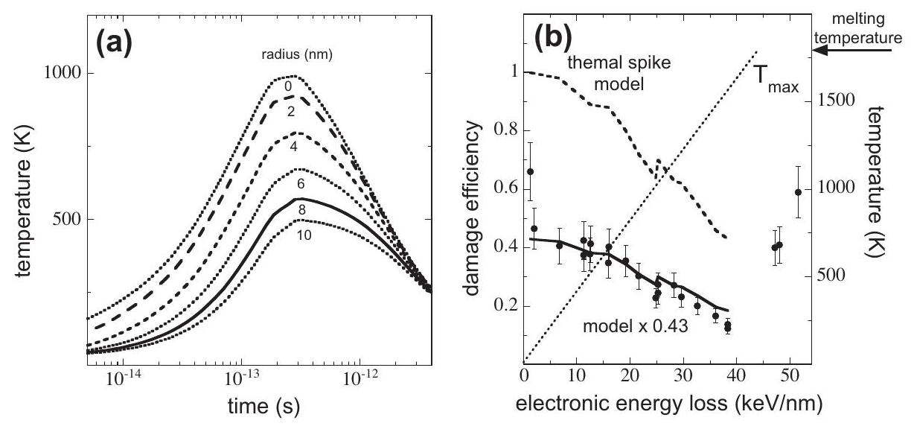
Fig. 9. (a) Temperature as a function of time for different radial distances from ion trajectory. The calculations are for Fe as target and for the irradiation with $10 \mathrm{MeV} / \mathrm{u}$ ions of $25 \mathrm{keV} / \mathrm{nm}$ energy loss. (b) Thermal spike calculation of damage efficiency (dashed line) and maximum temperature $T_{\text {max }}$ along the ion path (dotted line) versus electronic energy loss. Compared to experimental data, the model calculation yields too high absolute values but is in good agreement if multiplied by a factor 0.43 (solid line).

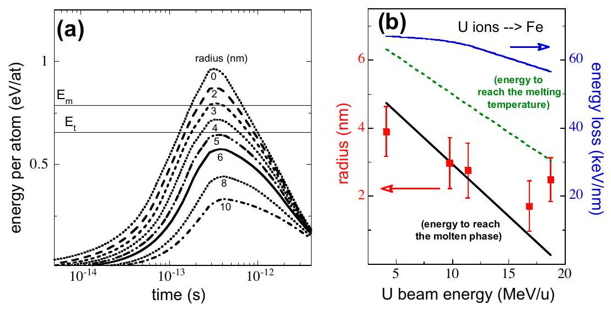
Fig. 10. (a) Energy per atom versus time for different radial distances from the ion trajectory calculated for $9.74 \mathrm{MeV} / \mathrm{u} \mathrm{U}$ ions in Fe ( $S_{\mathrm{e}}=64.5 \mathrm{keV} / \mathrm{nm}$ ). (b) Experimental [10] and calculated track radii in Fe as a function of energy of U ions. In the calculation, only the energy to reach the melting temperature (green dashed line, $E_{\mathrm{t}}=0.66 \mathrm{eV} / \mathrm{at}$ ) or with the latent heat added to $E_{\mathrm{t}}$ (blue dotted line, $E_{\mathrm{m}}=0.8 \mathrm{eV} / \mathrm{at}$ ). (For interpretation of the references to color in this figure legend, the reader is referred to the web version of this article.)

Table 1
Thermal properties and other parameters relevant for thermal spike calculations: Debye temperature ( $T_{\mathrm{D}}$ ), electrical conductivity $\sigma_{\mathrm{e}}$, electron-phonon coupling ( $g$ ), electron phonon mean free path ( $\lambda$ ), electron-phonon mean free time ( $\tau$ ), energy necessary to melt ( $E_{\mathrm{m}}$ ), and $S_{\mathrm{e}}$ is the energy loss for U ions at Bragg maximum ( $\sim 5 \mathrm{MeV} / \mathrm{u}$ ) [36]. $g$ is calculated at $300 \mathrm{~K}, \lambda$ and $\tau$ are mean values that take into account the evolution of the parameters versus temperature.
| Metal |  | Be | HOPG | Ti | Fe | Ni | Ag | Bi | W |
| :--- | :--- | :--- | :--- | :--- | :--- | :--- | :--- | :--- | :--- |
| $T_{\mathrm{D}}$ | K | 1440 | 2230 | 420 | 470 | 450 | 225 | 119 | 400 |
| $\sigma_{\mathrm{e}}(300 \mathrm{~K})$ | $\mu \Omega^{-1} \mathrm{~cm}^{-1}$ | 0.26 | ~0.33 | 0.02 | 0.1 | 0.14 | 0.62 | 0.01 | 0.18 |
| $g(300 \mathrm{~K})$ | $\mathrm{W} \mathrm{cm}^{-3} \mathrm{~K}^{-1}$ | $7 \times 10^{12}$ | $\sim 3 \times 10^{13}$ | $2.3 \times 10^{12}$ | $1.2 \times 10^{12}$ | $10^{12}$ | $3 \times 10^{10}$ | $2 \times 10^{11}$ | $3 \times 10^{11}$ |
| $\langle\lambda\rangle{ }^{\mathrm{a}}$ | nm | 4.5 | 2.2 | 8 | 11 | 12 | 68 | 26 | 22 |
| $\langle\tau\rangle^{\mathrm{b}}$ | ps | 0.02 | 0.005 | 0.07 | 0.13 | 0.16 | 5 | 0.75 | 0.5 |
| $E_{\mathrm{m}}{ }^{\mathrm{c}}$ | eV/at | 0.44 | 1.9 | 0.66 | 0.8 | 0.71 | 0.44 | 0.24 | 1.38 |
| $S_{\mathrm{e}}$ | keV/nm | 24 | 32 | 46 | 73 | 84 | 77 | 55 | 113 |

${ }^{\mathrm{a}}$ Mean values are deduced from fits to track radii for Ti, Fe and Bi yielding the relation $\lambda^{2}=1.4 / g$ [120] which is then also applied to other metals.
${ }^{\mathrm{b}}$ Mean free time at which $66 \%$ of the energy is deposited on the atoms.
${ }^{\mathrm{c}}$ This is the order of magnitude since it varies with the temperature of irradiation.
by the number of dpa and compared to the measured damage efficiency versus electronic energy loss (Fig. 9b). The result of the model calculation yields too high values but they are in good agreement if multiplied by a factor 0.43 which corresponds to the damage efficiency for low value of $S_{\mathrm{e}}$. This factor is due to the athermal annealing of defects created near each other in the atomic recombination volume. The best accord of the model calculation with experiment is obtained for an electron-phonon coupling of $\sim 1.2 \times 10^{12} \mathrm{~W} / \mathrm{cm}^{3} / \mathrm{K}$, quite in agreement with the theoretically expected value for Fe (Table 1). Fig. 9b also shows the maximum temperature along the ion trajectory as a function of the electronic energy loss as deduced from thermal spike calculations. According to this plot, melting is possible only for $S_{\mathrm{e}}$ above $45 \mathrm{keV} / \mathrm{nm}$, which corresponds well with the threshold for damage creation in Fe observed experimentally (Fig. 2a).

In order to determine the thermal spike criteria of track formation, we calculate the track size in Fe irradiated by U ions [10] in the beam energy regime between 5 and $20 \mathrm{MeV} / \mathrm{u}(10 \mathrm{~b})$, assuming that the experimental radius is deduced from the relation $\sigma=\pi R^{2}$ from $\sigma$ given in Fig. 2b. The calculations were performed with the electron-phonon coupling determined from the defect annealing. For deducing the track radius from the thermal spike calculation, the following two criteria can be applied: track formation requires (1) the energy $E_{\mathrm{t}}$ to reach the melting temperature ( $E_{\mathrm{t}}(\mathrm{Fe})= 0.66 \mathrm{eV} / \mathrm{at})$ or (2) the energy $E_{\mathrm{m}}$ to melt the material ( $E_{\mathrm{m}}(\mathrm{Fe})= 0.8 \mathrm{eV} /$ at) implying that the latent heat of fusion has to be considered. For the example shown in Fig. 10a, the track radii in Fe are 5 and 3.2 nm , respectively. Comparing these calculated radii with experimental measurements (Fig. 10b), it seems that the melting criteria including the latent heat is the most suitable approach. It is important to note also that such calculations can account for the velocity effect since it can describe the track radii evolution which decreases by a factor of 2 in a beam energy range where the $S_{\mathrm{e}}$ varies only by $20 \%$ (Fig. 10b).

Based on this finding, thermal spike calculations for $\mathrm{Bi}, \mathrm{Ti}$, and Fe also included the latent heat (Fig. 3a) yielding good agreement with experimental track radii using electron-phonon coupling $g=1.3 \times 10^{11} \mathrm{~W} / \mathrm{cm}^{3} / \mathrm{K}$ [42] for Bi and $g=1 \times 10^{13} \mathrm{~W} / \mathrm{cm}^{3} / \mathrm{K}$ [30] for Ti . Both values are of the same order of magnitude as expected from theory (table 1). For Bi , the thermal spike calculations also describe quite well the influence of the irradiation temperature on the track size (Fig. 3b). Comparing tracks in crystalline Fe and amorphous $\mathrm{Fe}_{85} \mathrm{~B}_{15}$, the thermal spike directly explains the larger tracks in the amorphous compound by the lower electrical conductivity leading to larger electron-phonon coupling (g $\left(\mathrm{a}-\mathrm{Fe}_{85} \mathrm{~B}_{15}\right)=5 \times 10^{12} \mathrm{~W} / \mathrm{cm}^{3} / \mathrm{K}$ [127] and $g(\mathrm{Fe})=1.2 \times 10^{12} \mathrm{~W} / \mathrm{cm}^{3} / \mathrm{K}$ ).

To estimate in which beam energy regime the electron-phonon coupling will play an important role, we have to consider the mean value of the electron-phonon mean free path $\lambda$ [120] given by
$\lambda^{2}=1.4 / g$ (Table 1) in comparison to the mean absorption radius $\alpha_{\mathrm{e}}$ in which the incident ions deposit their energy (Fig. 8b). For Fe, exposed to beam energy between 5 and $20 \mathrm{MeV} / \mathrm{u}$, the $\alpha_{\mathrm{e}}$ values (Fig. 8b) are of the same order of $\lambda(11 \mathrm{~nm})$. This explains the pronounced velocity effect shown in Fig. 2b in this energy regime. For lower beam energy the electron-phonon mean free path will be the main parameter that determines the volume in which the energy is deposited. In the case of HOPG irradiated with ions of $0.5 \mathrm{MeV} / \mathrm{u}, \alpha_{\mathrm{e}}$ and $\lambda$ are both around 2 nm [128] and consequently the track radius will depend on the initial energy absorption radius $\alpha_{\mathrm{e}}$ (Fig. 11a). If the calculation is in agreement with the threshold of damage creation for beam energy between 5 and $10 \mathrm{MeV} / \mathrm{u}$ [129], the model gives track radii larger than the measured one either at high energy with ions or with cluster beam at $0.07 \mathrm{MeV} / \mathrm{u}$ [130]. Perhaps some recrystallization appears during the cooling of hot track.

Another calculation is proposed for Be when irradiated by uranium beam. It demonstrates that Be is sensitive to swift heavy ion irradiation as expected [124]. Moreover the choice of such calculations illustrates the velocity effect since the maximum radius $(4.6 \mathrm{~nm})$ is obtained for an energy of $1.4 \mathrm{MeV} / \mathrm{u}$ for which the $S_{\mathrm{e}}$ is equal to $21 \mathrm{keV} / \mathrm{nm}$ below the maximum $S_{\mathrm{e}}$ value at the Bragg peak ( $24 \mathrm{keV} / \mathrm{nm}$ ) reached at $4 \mathrm{MeV} / \mathrm{u}$. This shows how it is important to account of the beam energy and emphases the role of the electronic excitation even for beam at low energy [130-132].

### 3.2.3. Thermal spike calculations for insulators

The application of the inelastic thermal spike model for insulators is not straightforward and requires several approximations discussed in details in [22,27]. Given by the high excitation level induced by the ions, hot electrons in the conduction band have to be considered and it is assumed in this model that hot electrons of an insulator behave like hot electrons in a metal as proposed by Baranov et al. [133]. Consequently electronic specific heat and electronic thermal conductivity at high temperature are both considered as constant $C_{\mathrm{e}}=1 \mathrm{~J} / \mathrm{g} / \mathrm{K}$ [9] and $D_{\mathrm{e}}=2 \mathrm{~cm}^{2} / \mathrm{s}$ [9,134] yielding $\lambda=2 / \mathrm{g}$. For the calculations g (i.e. $\lambda$ ) is used as free parameter to be adjusted by fits to experimental radius data. Since thermodynamic parameters for the electronic subsystem are constant, the Eq. (1) can be solved analytically leading to a Gaussian distribution [81,117,118] which defines the energy input on the atoms versus time and space. Within such approximations, thermal spike calculations for crystalline $\mathrm{SiO}_{2}$ are shown in Fig. 12a and compared to the results of the calculations when the two equations are solved numerically. It shows the very good agreement between the calculations and the experiment when the complete numerical solution of the two equations is used, implementing directly the initial energy distribution [115] on the electrons.

To justify quantitatively that $E_{\mathrm{m}}$ is needed, the threshold of damage creation in $\mathrm{LiNbO}_{3}$ was fitted with $\lambda 4.4$ and 4.3 nm using

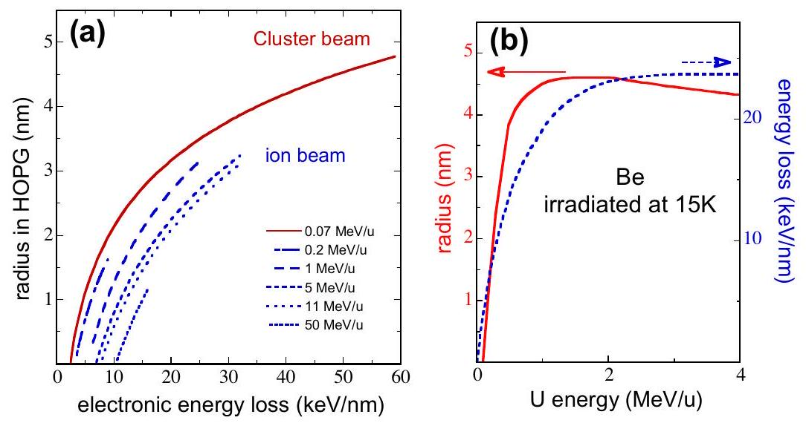
Fig. 11. (a) Calculated track radii as a function of electronic energy loss in HOPG for different beam energies. According to experiments [129], the track formation threshold is at $\sim 7 \mathrm{keV} / \mathrm{nm}$ for beam energy between 5 and $10 \mathrm{MeV} / \mathrm{u}$ suggesting that the estimated electron-phonon coupling of $3 \times 10^{13} \mathrm{~W} / \mathrm{cm}^{3} / \mathrm{K}$ is a good value [128]. For ion beam, the $S_{\mathrm{e}}$ values are limited to the maximum values that can be reached at the corresponding energies with uranium beam. (b) Calculations of the radius in Be versus uranium beam energy with the corresponding electronic energy loss in Be.

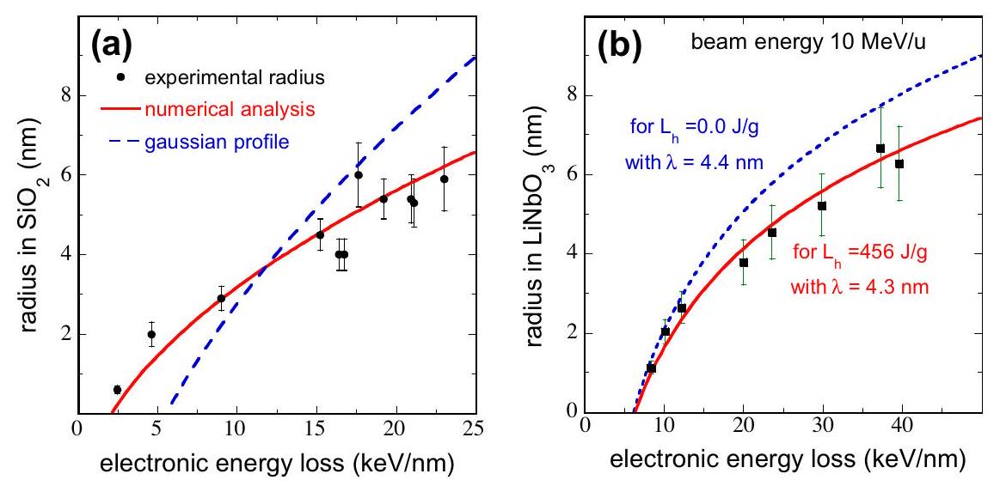
Fig. 12. (a) Description of the radii in $\mathrm{SiO}_{2}$ versus electronic energy loss by the i-TS model using two ways of defining the energy distribution on the electrons. (b) Radii versus electronic energy loss for two different criteria for track creation, either the energy to reach the melting temperature ( $E_{\mathrm{t}}$ ) or the energy to reach the melt phase ( $E_{\mathrm{m}}$ ).

either the energy to reach the melting temperature $E_{\mathrm{t}}$ or the energy to melt $E_{\mathrm{m}}$, respectively. Then the calculations were extrapolated to larger values of electronic energy losses confirming that the criterion for track formation must include the consumption of the latent heat. It clearly shows that is also adequate for another insulator like $\mathrm{Y}_{3} \mathrm{Fe}_{5} \mathrm{O}_{12}$ [135,136]. Moreover molten criterion for track formation is also supported since track size and sputtering yield of crystalline $\mathrm{SiO}_{2}$ can be described with the same set of parameters, using $\mathrm{E}_{\mathrm{m}}$ and the surface vaporization energy [104], respectively.

Thermal spike calculations have been performed for tracks in several amorphizable insulators yielding the electron-phonon mean free path ( $\lambda$ ) (by fits to experimental track radii). Plotting $\lambda$ as a function of the band gap energy, the considered materials show a systematic trend (Fig. 13a) indicating that for insulators the thermal spike characteristics are fixed by the band gap. If this is true, $\lambda$ is no longer a free parameter for crystalline insulators in the inelastic thermal spike model.

The role of $\lambda$, as compared to the mean absorption radius $\alpha_{\mathrm{e}}$, is illustrated in Fig. 13b where track radii in $\mathrm{Y}_{3} \mathrm{Fe}_{5} \mathrm{O}_{12}$ for various beam velocities can be described with the unique value of $\lambda=5 \mathrm{~nm}$. This $\lambda$ value is larger than $\alpha_{\mathrm{e}}$ for beam energies smaller than $1 \mathrm{MeV} / \mathrm{u}$ ( $\alpha_{\mathrm{e}}=0.5$ and 1.5 nm for 0.05 and $1 \mathrm{MeV} / \mathrm{u}$, respectively) and consequently it is the electron- phonon mean free path
that will define the atomic volume in which the energy is deposited while for $15 \mathrm{MeV} / \mathrm{u}$ for which $\alpha_{\mathrm{e}}$ equal 6 nm the electron phonon mean free path will be convoluted with initial energy distribution in the electron subsystem.

Now going to non-amorphizable insulators the description of track observable by TEM needs to define a new criterion: the boiling phase which is the energy to reach the boiling temperature plus the latent heat of vaporization added to the melting energy $E_{\mathrm{m}}$. This energy will be called $E_{\mathrm{b}}$. In order to illustrate this phenomenon, the track radii deduced from TEM in $\mathrm{CaF}_{2}$ at two different energies ( $0.1 \mathrm{MeV} / \mathrm{u}$ [89] and $10 \mathrm{MeV} / \mathrm{u}$ [95,137]) will be calculated using $E_{\mathrm{b}}$, using $\lambda=3.8 \mathrm{~nm}$ deduced from Fig. 13a. Within this assumption it is possible to describe the track size for the two energies (Fig. 14a). Taking advantage of this agreement we calculate the track radii corresponding to the appearance of the melting phase. Can we observe the damage that may be created by the appearance of melting phase in $\mathrm{CaF}_{2}$ ? The threshold determination is not sufficient since the same threshold ( $5 \mathrm{keV} / \mathrm{nm}$ ) is reached either with the boiling criterion with beam energy of $0.1 \mathrm{MeV} / \mathrm{u}$ or with the melting criterion with $10 \mathrm{MeV} / \mathrm{u}$ beam. To distinguish between the two predictions, the size of the track should be measured at an electronic energy loss of $40 \mathrm{keV} / \mathrm{nm}$.

Two criteria were used in order to explain the different track sizes in LiF: $E_{\mathrm{m}}$ was associated with the track size deduced from

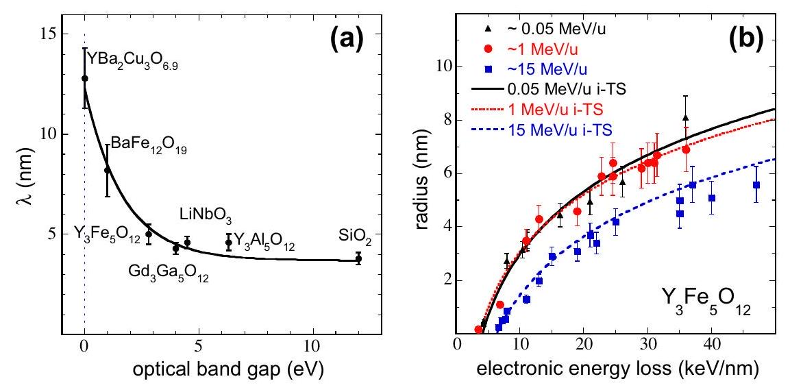
Fig. 13. (a) Electron-phonon mean free path deduced from thermal spike fits versus optical band gap energy for different insulators. (b) Experimental and calculated track radii versus electronic energy loss for $\mathrm{Y}_{3} \mathrm{Fe}_{5} \mathrm{O}_{12}$ and three different ion energies.

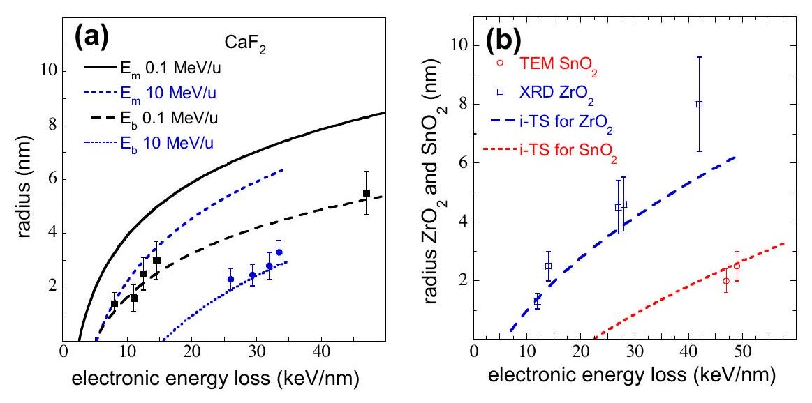
Fig. 14. (a) Tracks observed by TEM in $\mathrm{CaF}_{2}$ compared with the i -TS model using two criteria, the energy to melt $\left(E_{\mathrm{m}}\right)$ and the energy to boil ( $E_{\mathrm{b}}$ ). Black points and lines correspond to beam cluster irradiations while blue ones are ion irradiations with a maximum $S_{e}=35 \mathrm{keV} / \mathrm{nm}$. (b) Tracks observed in $\mathrm{ZrO}_{2}$ by XRD with beam energy of $3 \mathrm{MeV} /$ u and in $\mathrm{SnO}_{2}$ (beam energy of $\sim 5 \mathrm{MeV} / \mathrm{u}$ ) by TEM compared to the predictions of the i-TS model.

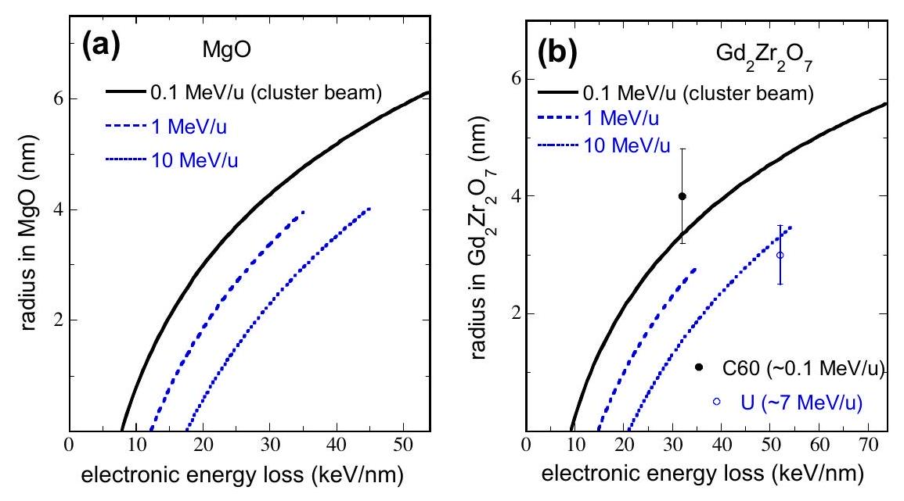
Fig. 15. Calculated track radii as a function of the energy loss for three different beam energies applying the melting criterium (a) in $\mathrm{MgO}\left(E_{\mathrm{m}}=1 \mathrm{eV} / \mathrm{at}\right)$ and (b) in $\mathrm{Gd}_{2} \mathrm{Zr}_{2} \mathrm{O}_{7}$ ( $E_{\mathrm{p} \rightarrow \mathrm{d}}=1.8 \mathrm{eV} / \mathrm{at}$ ). For 1 and $10 \mathrm{MeV} / \mathrm{u}$ the $S_{\mathrm{e}}$ values are limited to the maximum values that can be reached at the corresponding energies.

swelling measurements while $E_{\mathrm{b}}$ seems to be linked SAXS radii [17,138] (Fig. 6b). However SAXS pattern was observed for $S_{\mathrm{e}}$ lower than $12 \mathrm{keV} / \mathrm{nm}$ for which the boiling phase is not reached. Such a divergence for $S_{\mathrm{e}}$ less than $12 \mathrm{keV} / \mathrm{nm}$ could contradict the model and others experiments are needed to clear up this contradiction.

Now the i-TS model is applied to $\mathrm{ZrO}_{2}$ [91,139] and $\mathrm{SnO}_{2}$ [25] (Fig. 14b), showing that the track criteria is not unique in nonamorphizable insulator. The $\lambda$ values will be deduced from its evolution with their optical bang gaps which are $\sim 3.6$ and $\sim 5.8 \mathrm{eV}$, leading to $\lambda$ values equal to 4.9 and 4.5 nm , respectively. The
calculations are performed for the two materials and the tracks can be described in $\mathrm{ZrO}_{2}$ except for larger $S_{\mathrm{e}}$ value [139], using the melting criterion while it is the boiling criterion for $\mathrm{SnO}_{2}$ [25].

Two more calculations will be presented in Fig. 15, in order to predict the track formation in MgO and for the pyrochlore $\mathrm{Gd}_{2} \mathrm{Zr}_{2} \mathrm{O}_{7}$ [6,140] for which the optical band gaps are $\sim 8$ and $\sim 6 \mathrm{eV}$, respectively, leading to $\lambda$ values of 4 and 4.5 nm . In the case of MgO the energy necessary to melt ( $E_{\mathrm{m}}$ ) is well known and is equal to 1 eV /at and the track radius is predicted using this criterion in Fig. 15a. In the case of $\mathrm{Gd}_{2} \mathrm{Zr}_{2} \mathrm{O}_{7}$, the irradiation induced a phase transformation from pyrochlore to defect fluorite phases. The energy to create such a track is extracted from previous experimental results which have been described with the inelastic thermal spike model [140]. Using the defect fluorite track appearing after irradiation by C60 cluster or U beams, the deduced energy to create a defect fluorite transformation ( $E_{\mathrm{p} \rightarrow \mathrm{d}}$ ) from pyrochlore structure is equal to $1.8 \pm 0.3 \mathrm{eV} /$ at. The track radii have been calculated for different beam energy using energy per atom of 1.8 eV /at (Fig. 15b). If this prediction are confirmed, what is the meaning of the energy per atom in order to make the transformation of the pyrochlore phase to defect fluorite phase?

## 4. Conclusions

The present review focuses on track formation in metallic and insulating materials and its description by the inelastic thermal spike model. From the experimental point of view, several physical characterizations are needed to quantify the track size and its threshold of appearance, combining direct observation of the radius like with TEM or by a determination of the damage cross deduced from the evolution of the defect creation versus fluence [82] for different beam energy regime [83,141]. The main features are: (1) metallic materials are less sensitive to damage creation than insulators, (2) within a specific class of material there are large differences in their sensitivity, (3) the threshold of sputtering is larger than the threshold of track creation, and (4) track size depends on ion velocity and temperature. The inelastic thermal spike model seems to account all these observations with only one free parameter, the electron-phonon coupling.

In this model there is two important processes determining the final temperature or energy in the atom system: (1) kinetic energy spread in electron system (mean absorption radius, $\alpha_{e}$ ) which is small for low ion velocities and becomes larger for high beam velocities and (2) the electron-phonon mean free path ( $\lambda$ ) which depends on the number of electrons available for the energy diffusion, is larger for metallic materials than for insulators. If $\lambda$ is larger than $\alpha_{\mathrm{e}}$, the volume in which the energy is deposited on the atoms is governed by the electron phonon mean free path while at high ion velocity the electron-phonon mean free path can be neglected. Such a comparison depends on each irradiated materials. It suggests also that the energy regime in which the effect of the electron excitation is the largest below the maximum of the electronic energy loss at the Bragg peak.

To illustrate the power of this model it is possible to describe with the same value of the electron-phonon coupling different observations: defect annealing in Fe at low $S_{e}$ values and track formation at high $S_{\mathrm{e}}$ values by assuming that track results from the quenching of a molten phase which is the energy to reach the melting temperature plus the latent heat of fusion. In crystalline $\mathrm{SiO}_{2}$ track formation and sputtering rate is also calculated with the same $\lambda$ value.

For insulator two cases are to be considered: amorphizable and non-amorphizable crystals. For amorphizable insulators, the thermal spike calculations give a good description of amorphous track resulting from quenching of a molten phase. Systematic studies of
such insulators lead to a phenomenological correlation of the electron-phonon mean free path $\lambda$ and the optical band gap energy in agreement with previous trends [142]. If it is true the inelastic thermal spike model does not have any free parameter for insulators.

Extrapolating $\lambda$ values to describe track formation in non-amorphizable insulators it appears that added to the melting criterion the boiling criterion should be invoked in order to describe the tracks observed in several oxides and ionic crystals. More experiments are needed to clarify if this is a general trend or related to specific materials properties.

It should be mentioned that in some cases we cannot neglect nuclear energy loss which appears to be in synergy with electronic energy loss either for track formation in amorphous $\mathrm{SiO}_{2}$ [143] or for sputtering of metallic materials [103,104]. Moreover the model was successfully developed to describe interface mixing [144-146] in multilayer systems and to study the elongation of cylindrical metallic clusters embedded in amorphous $\mathrm{SiO}_{2}$ [147].

Finally it should be emphasized that thermal spike calculations can estimate the final energy profile in the atomic subsystem, but to predict the detailed response of a given material requires MD calculations [148]. The profile of the deposited energy on the atoms which is calculated by the thermal spike can serve as valuable input [5,149,150].

## References

[1] D.A. Young, Nature 183 (1958) 375.
[2] E. Silk, R. Barnes, Philos. Mag. 4 (1959) 970.
[3] F. Thibaudau, J. Cousty, E. Balanzat, S. Bouffard, Phys. Rev. Lett. 67 (1991) 1582.
[4] C. Houpert, F. Studer, D. Groult, M. Toulemonde, Nucl. Instrum. Methods B39 (1989) 720.
[5] P. Kluth, C.S. Schnohr, O.H. Pakarinen, F. Djurabekova, D.J. Sprouster, R. Giulian, M.C. Ridgway, A.P. Byrne, C. Trautmann, D.J. Cookson, K. Nordlund, M. Toulemonde, Phys. Rev. Lett. 101 (2008) 175503.
[6] M. Lang, J. Lian, J. Zhang, F. Zhang, W.J. Weber, C. Trautmann, R.C. Ewing, Phys. Rev. B 79 (2009) 224105.
[7] F. Studer, C. Houpert, M. Toulemonde, E. Dartyge, J. Solid State Chem. 91 (1991) 238.
[8] A. Iwase, S. Sasaki, T. Iwata, T. Nihira, Phys. Rev. Lett. 58 (1987) 2450.
[9] C. Dufour, A. Audouard, F. Beuneu, J. Dural, J.P. Girard, A. Hairie, M. Levalois, E. Paumier, M. Toulemonde, J. Phys.: Condens. Matter. 5 (1993) 4573.
[10] A. Dunlop, D. Lesueur, P. Legrand, H. Dammak, J. Dural, Nucl. Instrum. Methods Phys. B90 (1994) 330.
[11] S. Klaumünzer, Ming-Dong Hou, G. Schumacher, Phys. Rev. Lett. 57 (1986) 850.
[12] Ming-dong Hou, S. Klaumünzer, G. Schumacher, Phys. Rev. B 41 (1990) 1144.
[13] A. Audouard, E. Balanzat, J.C. Jousset, A. Chamberod, G. Fuchs, D. Lesueur, L. Thomé, Philos. Mag. B 63 (1991) 727.
[14] M. Levalois, P. Bogdanski, M. Toulemonde, Nucl. Instrum. Methods B 63 (1992) 14.
[15] W. Wesch, A. Kamarou, E. Wendler, Nucl. Instrum. Methods B 225 (2004) 111.
[16] G. Szenes, Z.E. Horvath, B. Pecz, F. Paszti, L. Toth, Phys. Rev. B 65 (2002) 045206.
[17] K. Schwartz, C. Trautmann, T. Steckenreiter, O. Geiss, M. Krämer, Phys. Rev. B 58 (1998) 11232.
[18] C. Trautmann, M. Toulemonde, K. Schwartz, J.M. Costantini, A. Müller, Nucl. Instrum. Methods B 164-165 (2000) 365.
[19] A.T. Davidson, K. Schwartz, J.D. Comins, A.G. Kozakiewicz, M. Toulemonde, C. Trautmann, Phys. Rev. B 66 (2002) 214102.
[20] G. Fuchs, F. Studer, E. Balanzat, D. Groult, M. Toulemonde, J.C. Jousset, Europhys. Lett. 3 (1987) 321.
[21] F. Studer, M. Toulemonde, Nucl. Instrum. Methods B 65 (1992) 560.
[22] A. Meftah, J.M. Costantini, N. Khalfaoui, S. Boudjadar, J.P. Stoquert, F. Studer, M. Toulemonde, Nucl. Instrum. Methods B 237 (2005) 563.
[23] S. Hemon, F. Gourbilleau, C. Dufour, E. Paumier, E. Dooryhée, A. Rouanet, Nucl. Instrum. Methods B 122 (1997) 526.
[24] A. Berthelot, S. Hemon, F. Gourbilleau, C. Dufour, E. Dooryhée, E. Paumier, Nucl. Instrum. Methods B 146 (1998) 437.
[25] A. Berthelot, S. Hemon, F. Gourbilleau, C. Dufour, B. Domenges, E. Paumier, Philos. Mag. A 80 (2000) 2257.
[26] N. Itoh, D.M. Duffy, S. Khakshouri, A.M. Stoneham, J. Phys.: Condens. Matter 21 (2009) 474205.
[27] M. Toulemonde, W. Assmann, C. Dufour, A. Meftah, F. Studer, C. Trautmann, Mat. Fys. Medd. 52 (2006) 263.
[28] C.S. Schnohr, P. Kluth, R. Giulian, D.J. Llewellyn, A.P. Byrne, D.J. Cookson, M.C. Ridgway, Phys. Rev. B 81 (2010) 075201.
[29] M. Toulemonde, C. Dufour, A. Meftah, E. Paumier, Nucl. Instrum. Methods B 166-167 (2000) 903.
[30] Z.G. Wang, C. Dufour, E. Paumier, M. Toulemonde, J. Phys.: Condens. Matter 6 (1994) 6733 and 7 (1995) 2525.
[31] G. Szenes, Phys. Rev. B 52 (1995) 6154.
[32] A. Kamarou, W. Wesch, E. Wendler, A. Undisz, M. Rettenmayr, Phys. Rev. B 78 (2008) 054111.
[33] D.M. Duffy, N. Itoh, A.M. Rutherford, A.M. Stoneham, J. Phys.: Condens. Matter 20 (2008) 082201.
[34] S. Klaumünzer, Mat. Fys. Medd. 52 (2006) 293.
[35] G. Szenes, Nucl. Instrum. Methods B 269 (2011) 174.
[36] J.F. Ziegler, J.P. Biersack, U. Littmark, The Stopping and Range of Ions in Solids, Pergamon, New York, 1985.
[37] H. Dammak, D. Lesueur, A. Dunlop, P. Legrand, J. Morillo, Radiat. Eff. Defects Solids 126 (1993) 111.
[38] A. Dunlop, D. Lesueur, Radiat. Eff. Defects Solids 126 (1993) 163.
[39] Z.G. Wang, C. Dufour, E. Paumier, M. Toulemonde, Nucl. Instrum. Methods B 115 (1995) 577.
[40] J.P. Biersack, L.G.D. Haggmark, Nucl. Instrum. Methods 174 (1980) 257.
[41] A. Iwase, S. Sasaki, T. Iwata, T. Nihira, J. Nucl. Mater. 141 (1986) 786.
[42] C. Dufour, F. Beuneu, E. Paumier, M. Toulemonde, Europhys. Lett. 45 (1999) 585.
[43] A. Barbu, A. Dunlop, D. Lesueur, R.S. Averback, Europhys. Lett. 15 (1991) 37.
[44] A. Audouard, E. Balanzat, S. Bouffard, J.C. Jousset, A. Chamberod, A. Dunlop, D. Lesueur, G. Fuchs, R. Spohr, J. Vetter, L. Thomé, Nucl. Instrum. Methods B 59 (60) (1991) 414.
[45] S. Klaumünzer, Ming-dong Hou, G. Schumacher, Phys. Rev. Lett. 57 (1986) 850.
[46] A. Audouard, J. Dural, M. Toulemonde, A. Lovas, G. Szénes, L. Thomé, Phys. Rev. B 22 (1996) 15690.
[47] A. Audouard, E. Balanzat, J.C. Jousset, D. Lesueur, L. Thomé, J. Phys.: Condens. Matter 5 (1993) 995.
[48] A. Audouard, M. Toulemonde, G. Szénes, L. Thomé, Nucl. Instrum. Methods B 146 (1998) 233.
[49] A. Audouard, R. Mamy, M. Toulemonde, G. Szénes, L. Thomé, Europhys. Lett. 40 (1997) 527.
[50] A. Dunlop, J. Henry, G. Jaskierowicz, Nucl. Instrum. Methods B 146 (1998) 222.
[51] C. Trautmann, M. Toulemonde, C. Dufour, E. Paumier, Nucl. Instrum. Methods B 108 (1996) 94.
[52] Z.G. Wang, C. Dufour, B. Cabeau, J. Dural, G. Fuchs, E. Paumier, F. Pawlak, M. Toulemonde, Nucl. Instrum. Methods B 107 (1996) 175.
[53] H.M. Naguib, R. Kelly, Radiat. Eff. 25 (1975) 1.
[54] F. Studer, M. Hervieu, J.M. Costantini, M. Toulemonde, Nucl. Instrum. Methods B 122 (1997) 449.
[55] D. Groult, M. Hervieu, N. Nguyen, B. Raveau, J. Solid State Chem. 76 (1998) 260.
[56] L.A. Bursill, G. Braunshausen Phil, Mag. A 62 (1990) 395.
[57] R. Neumann, Nucl. Instrum. Methods B 151 (1999) 42.
[58] D. Albrecht, E. Balanzat, K. Schaupert, Nucl. Track Rad. Meas. 11 (1986) 13.
[59] M. Toulemonde, S. Bouffard, F. Studer, Nucl. Instrum. Methods B 91 (1994) 108.
[60] F. Studer, N. Nguyen, G. Fuchs, M. Toulemonde, Hyperfine Interact. 29 (1986) 1287.
[61] P. Hansen, H. Heitmann, P.M. Smit, Phys. Rev. B 26 (1982) 3539.
[62] C. Houpert, N. Nguyen, F. Studer, D. Groult, M. Toulemonde, Nucl. Instrum. Methods B 34 (1988) 228.
[63] A. Fnidiki, F. Studer, J. Teillet, J. Juraszek, H. Pascard, S. Meillon, Eur. Phys. J. B 24 (2001) 291.
[64] A. Fnidiki, J. Juraszek, J. Teillet, F. Studer, Appl. Phys. Lett. 75 (1999) 1296.
[65] B. Canut, R. Brenier, A. Meftah, P. Moretti, S. Ould Salem, S.M.M. Ramos, P. Thevenard, M. Toulemonde, Nucl. Instrum. Methods B 91 (1994) 312.
[66] L. Thomé, J. Jagielski, L. Novocki, A. Turos, A. Gentils, F. Garrido, Vacuum 78 (2005) 461.
[67] A. Timm, B. Strocka, Nucl. Instrum. Methods B 12 (1985) 479.
[68] V. Chailley, E. Dooryhée, S. Bouffard, E. Balanzat, M. Levalois, Nucl. Instrum. Methods B 91 (1994) 162.
[69] G. Sattonay, S. Moll, L. Thomé, C. Legros, M. Herbst-Ghysel, F. Garrido, J.M. Costantini, C. Trautmann, Nucl. Instrum. Methods B 266 (2008) 3043.
[70] C. Tamain, F. Garrido, L. Thomé, N. Dacheux, A. Ozgumus, A. Benyagoub, J. Nucl. Mater. 357 (2006) 206.
[71] A. Quentin, I. Monnet, D. Gosset, B. Lefrancois, S. Bouffard, Nucl. Instrum. Methods B 267 (2009) 980.
[72] S. Moll, G. Sattonay, L. Thomé, J. Jagielski, C. Legros, I. Monnet, Nucl. Instrum. B 268 (2010) 2933.
[73] C. Trautmann, M. Boccanfuso, A. Benyagoub, S. Klaumünzer, K. Schwartz, M. Toulemonde, Nucl. Instrum. Methods B 191 (2002) 144.
[74] M. Boccanfuso, A. Benyagoub, K. Schwartz, M. Toulemonde, C. Trautmann, Prog. Nucl. Energy 38 (2001) 271.
[75] C. Trautmann, M. Toulemonde, J.M. Costantini, J.J. Grob, K. Schwartz, Phys. Rev. B 62 (2000) 13.
[76] M. Toulemonde, A. Meftah, J.M. Costantini, C. Trautmann, Nucl. Instrum. Methods B 146 (1998) 426.
[77] C. Trautmann, J.M. Costantini, A. Meftah, K. Schwartz, J.P. Stoquert, M. Toulemonde, MRS Proc. 504 (1998) 123.
[78] P. Thévenard, G. Guiraud, C.H.S. Dupuy, B. Delaunay, Radiat. Eff. 32 (1977) 83.
[79] J. Vetter, R. Scholz, D. Dobrev, L. Nistor, Nucl. Instrum. Methods B 141 (1998) 752.
[80] A. Meftah, F. Brisard, J.M. Costantini, M. Hage-Ali, J.P. Stoquert, F. Studer, M. Toulemonde, Phys. Rev. B 48 (1993) 920.
[81] M. Toulemonde, F. Studer, Philos. Mag. A 58 (1988) 799.
[82] A. Meftah, F. Brisard, J.M. Costantini, E. Dooryhée, M. Hage-Ali, M. Hervieu, J.P. Stoquert, F. Studer, M. Toulemonde, Phys. Rev. B 49 (1994) 12457.
[83] M. Toulemonde, E. Balanzat, S. Bouffard, J.J. Grob, M. Hage-Ali, J.P. Stoquert, Nucl. Instrum. Methods B 46 (1990) 64.
[84] S. Moll, L. Thomé, L. Vincent, F. Garrido, G. Sattonay, T. Thomé, J. Jagielski, J.M. Costantini, J. Appl. Phys. 105 (2009) 023512.
[85] F. Garrido, S. Moll, G. Sattonnay, L. Thomé, L. Vincent, Nucl. Instrum. Methods B 267 (2009) 1451.
[86] F.X. Zhang, J.W. Wang, J. Lian, M.K. Lang, U. Becker, R.C. Ewing, Phys. Rev. Lett. (2008) 045503.
[87] T. Sonoda, M. Kinoshita, Y. Chimi, N. Ishikawa, M. Sataka, A. Iwase, Nucl. Instrum. Methods B 250 (2006) 254.
[88] T. Sonoda, M. Kinoshita, N. Ishikawa, M. Sataka, A. Iwase, K. Yasunaga, Nucl. Instrum. Methods B 268 (2010) 3277.
[89] J. Jensen, A. Dunlop, S. Della-Negra, Nucl. Instrum. Methods B 141 (1998) 753.
[90] A. Benyagoub, F. Levesque, F. Couveur, C. Gilbert-Mougel, C. Dufour, E. Paumier, Appl. Phys. Lett. 77 (2000) 3197.
[91] C. Gilbert-Mougel, F. Couvreur, J.M. Costantini, S. Bouffard, F. Levesque, S. Hémon, E. Paumier, C. Dufour, J. Nucl. Mater. 295 (2001) 121.
[92] A. Benyagoub, Phys. Rev. B 72 (2005) 094114.
[93] S. Hémon, A. Berthelot, C. Dufour, F. Gourbilleau, E. Dooryhée, S. Begin-Colin, E. Paumier, Eur. Phys. J. B 19 (2001) 517.
[94] J.F. Gibbons, IEEE 60 (1972) 1062.
[95] N. Khalfaoui, C.C. Rotaru, S. Bouffard, M. Toulemonde, J.P. Stoquert, F. Haas, C. Trautmann, J. Jensen, A. Dunlop, Nucl. Instrum. Methods B 240 (2005) 819.
[96] C.W. White, C.J. McHargue, P.S. Klad, L.A. Boatner, C.C. Farlow, Mater. Sci. Rep. 4 (1999) 41.
[97] B. Canut, A. Benyagoub, G. Marest, A. Meftah, N. Moncoffre, S.M.M. Ramos, F. Studer, P. Thévenard, M. Toulemonde, Phys. Rev. B 51 (1995) 12194.
[98] B. Canut, S.M.M. Ramos, P. Thévenard, N. Moncoffre, F. Benyagoub, G. Marest, A. Meftah, M. Toulemonde, F. Studer, Nucl. Instrum. Methods B 80 (1993) 1114.
[99] R. Brenier, B. Canut, S.M.M. Ramos, P. Thévenard, Nucl. Instrum. Methods B 90 (1994) 339.
[100] R.L. Fleisher, P.B. Price, R.M. Walker Nuclear, Track in Solids, University of California press, Berkeley, 1979.
[101] A. Kabir, A. Meftah, J.P. Stoquert, M. Toulemonde, I. Monnet, Nucl. Instrum. Methods B 266 (2008) 2976.
[102] T. Aruga, Y. Katano, T. Ohmichi, S. Okayasu, Y. Kazumata, Nucl. Instrum. Methods B 167 (2000) 913.
[103] W. Assmann, M. Toulemonde, C. Trautmann, Top. Appl. Phys. 110 (2007) 401.
[104] M. Toulemonde, W.A. Assmann, C. Trautmann, F. Grüner, Phys. Rev. Lett. 88 (2002) 057602.
[105] A. Meftah, W. Assmann, N. Khalfaoui, J.P. Stoquert, F. Studer, M. Toulemonde, C. Trautmann, K.-O. Voss, Nucl. Instrum. Methods B 269 (2011) 955.
[106] J.F. Ziegler, M.D. Ziegler, J.P. Biersack, Nucl. Instrum. Methods B 268 (2010) 1818.
[107] H.D. Mieskes, W. Assmann, F. Grüner, H. Kucal, Z.G. Wang, M. Toulemonde, Phys. Rev. B 67 (2003) 155414.
[108] P.L. Grande, G. Schiwietz, Phys. Rev. A 58 (1998) 3796.
[109] P. Sigmund, Eur. Phys. J. D 47 (2008) 45.
[110] Y. Zhang, J. Lian, Z. Zhu, W.D. Bennett, L.V. Saraf, J.L. Rausch, C.A. Hendricks, R.C. Ewing, W.J. Weber, J. Nucl. Mater. 389 (2009) 303.
[111] J. Jensen, A. Dunlop, S. Della-Negra, M. Toulemonde, Nucl. Instrum. Methods B 146 (1998) 412.
[112] K. Baudin, A. Brunelle, M. Chabot, S. Della-Negra, J. Depauw, D. Gardes, P. Hakanson, Y. Le Beyec, A. Billebaud, M. Fallavier, J. Remilleux, J.C. Poizat, J.P. Thomas, Nucl. Instrum. Methods B 94 (1994) 341.
[113] R.L. Fleisher, P.B. Price, R.M. Walker, J. Appl. Phys. 36 (1965) 3645.
[114] B. Gervais, S. Bouffard, Nucl. Instrum. Methods B 88 (1994) 355.
[115] M.P.R. Waligorski, R.N. Hawn, R. Katz, Nucl. Track Radiat. Meas. 11 (1986) 309.
[116] C. Trautmann, S. Bouffard, R. Spohr, Nucl. Instrum. Methods B 116 (1996) 429.
[117] I.M. Lifshitz, M.I. Kaganov, C.V. Tanatarov, J. Nucl. Energy A 12 (1960) 69.
[118] M. Toulemonde, C. Dufour, E. Paumier, Phys. Rev. B 46 (1992) 14362.
[119] C. Dufour, B. Leselier De Chezelles, V. Delignon, M. Toulemonde, E. Paumier, Modification Induced by Irradiation in Glasses, in: P. Mazzoldi (Ed.), Elsevier Science Publishers B.V., 1992, p. 61.
[120] M. Toulemonde, C. Dufour, E. Paumier, F. Pawlak, MRS Proc. 54 (1998) 99.
[121] P. Hermes, B. Danielzik, N. Fabricius, D. van der Linde, J. Luhl, Y. Heppner, B. Stritzker, A. Pospieszcsyk, Appl. Phys. A39 (1986) 9.
[122] M.I. Kaganov, I.M. Lifshitz, L.V. Tanatarov, Soviet Phys. JETP 4 (1957) 173.
[123] P.B. Allen, Phys. Rev. B 36 (1987) 2020.
[124] C. Dufour, Z.G. Wang, M. Levalois, P. Marie, E. Paumier, F. Pawlak, M. Toulemonde, Nucl. Instrum. Methods B 107 (1996) 218.
[125] J.G. Fujimoto, J.M. Liu, E.P. Ippen, Phys. Rev. Lett. 53 (1984) 1837.
[126] G.H. Vineyard, Radiat. Eff. 29 (1976) 245.
[127] M.D. Rodríguez, B. Afra, C. Trautmann, M. Toulemonde, T. Bierschenk, J. Leslie, R. Giulian, N. Kirby, P. Kluth to be published in J. Non-Cryst. Sol.
[128] M. Caron, H. Rothard, M. Toulemonde, B. Gervais, M. Beuve, Nucl. Instrum. Methods B 245 (2006) 36.
[129] J. Liu, R. Neumann, C. Trautmann, C. Müller, Phys. Rev. B 64 (2001) 184115.
[130] A. Dunlop, G. Jaskierowicz, P.M. Ossi, S. Della-Negra, Phys. Rev. B 76 (2007) 155403.
[131] M. Toulemonde, C. Trautmann, E. Balanzat, K. Hjort, A. Weidinger, Nucl. Instrum. Methods B 216 (2004) 1.
[132] M. Toulemonde, W.J. Weber, Guosheng Li, Vaithiyalingam Shutthanandan, P. Kluth, Tengfei Yang, Yuguang Wang, Yanwen Zhang, Phys. Rev. B 83 (2011) 054106.
[133] I.A. Baranov, Yu.V. Martynenko, S.O. Tsepelevitch, Yu.N. Yavlinskii, Sov. Phys. Usp. 31 (1988) 1015.
[134] Yu.V. Martynenko, Yu.N. Yavlinskii, Sov. Phys.-Dokl. 2 (8) (1983) 391.
[135] A. Meftah, M. Djebara, N. Khalfaoui, M. Toulemonde, Nucl. Instrum. Methods B 146 (1998) 431.
[136] A. Meftah, J.M. Costantini, M. Djebara, N. Khalfaoui, J.P. Stoquert, F. Studer, M. Toulemonde, Nucl. Instrum. Methods B 122 (1997) 470.
[137] S. Abu Saleh, Y. Eyal, Philos. Mag. 87 (2007) 3697.
[138] S. Abu Saleh, Y. Eyal, Nucl. Instrum. Methods B 230 (2005) 246.
[139] A. Benyagoub, Nucl. Instrum. Methods B 268 (2010) 2968.
[140] J. Zhang, M. Lang, J. Lian, J. Liu, C. Trautmann, S. Della-Negra, M. Toulemonde, R.C. Ewing, J. Appl. Phys. 105 (2009) 113510.
[141] J.M. Costantini, F. Brisard, J.L. Flament, M. Toulemonde, A. Meftah, M. HageAli, Nucl. Instrum. Methods B 65 (1992) 568.
[142] R.F. Haglund, R. Kelly, Mat. Fys. Medd. 43 (1993) 537.
[143] C. Rotaru, F. Pawlak, N. Khalfaoui, C. Dufour, J. Perrière, A. Laurent, J.P. Stoquert, H. Lebius, M. Toulemonde, to be published in Nucl. Instrum. Methods B.
[144] R. Leguay, A. Dunlop, F. Dunstetter, N. Lorenzelli, A. Braslau, F. Bridou, J. Corno, B. Pardo, J. Chevallier, C. Colliex, A. Menelle, J.L. Rouviere, L. Thomé, Nucl. Instrum. Methods B 122 (1997) 481.
[145] Z.G. Wang, C. Dufour, S. Euphrasie, M. Toulemonde, Nucl. Instrum. Methods B 209 (2003) 194.
[146] A. Chettah, H. Kucal, Z.G. Wang, M. Kac, A. Meftah, M. Toulemonde, Nucl. Instrum. Methods B 267 (2009) 2719.
[147] K. Awazu, X.M. Wang, M. Fujimaki, J. Tominaga, S. Fujii, H. Aiba, Y. Ohki, T. Komatsubara, Nucl. Instrum. Methods B 267 (2009) 941.
[148] J. Zhang, M. Lang, R.C. Ewing, R. Devanathan, W.J. Weber, M. Toulemonde, J. Mater. Res. 25 (2010) 1345.
[149] M. Beuve, N. Stolterfoht, M. Toulemonde, C. Trautmann, H.M. Urbassek, Phys. Rev. B 68 (2003) 125423.
[150] S. Mookerjee, M. Beuve, S.A. Khan, M. Toulemonde, A. Roy, Phys. Rev. B 78 (2008) 045435.

[^0]:    * Corresponding author.

    E-mail address: toulemonde@ganil.fr (M. Toulemonde).

