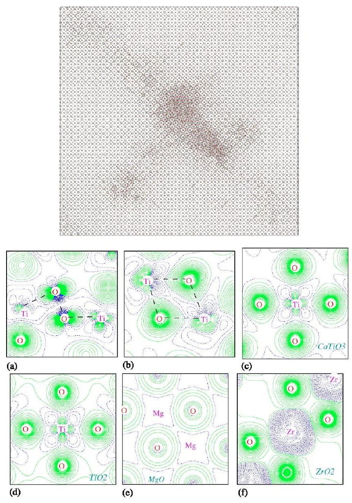

# Radiation damage effects in the perovskite $\mathrm{CaTiO}_{3}$ and resistance of materials to amorphization 

Kostya Trachenko, Miguel Pruneda, Emilio Artacho, and Martin T. Dove Department of Earth Sciences, University of Cambridge, Downing Street, Cambridge, CB2 3EQ, United Kingdom

(Received 15 January 2004; revised manuscript received 26 May 2004; published 29 October 2004)

#### Abstract

We combine classical and quantum-mechanical simulations to study the structural changes in $\mathrm{CaTiO}_{3}$ under irradiation. We identify common defects, and suggest that their stability is related to the covalent character of Ti-O bonding. We address the issue of resistance to amorphization by radiation damage, and propose that a complex material is amorphizable by radiation damage if it is able to form a covalent network. On a more detailed level, we suggest that resistance to amorphization is defined by the competition between the shortrange covalent and long-range ionic forces.

DOI: 10.1103/PhysRevB.70.134112
PACS number(s): 61.80.-x, 61.82.-d, 62.20.-x

## I. INTRODUCTION

The future of nuclear power is often linked to our ability to effectively manage nuclear waste. This ability is also important for immobilizing the current stockpiles of highly radioactive waste and weapons-grade plutonium. Vitrification, or immobilization of nuclear waste in glass, has been and remains a popular way of its handling. The effective alternative to vitrification has been immobilization in crystalline solids. Several potential waste forms have been proposed and studied, including the composite titanate ceramic SYNROC. ${ }^{1}$ Under irradiation from immobilized elements, SYNROC phases amorphize. Radiation-induced amorphization can affect several physical properties of a material, including its ability to remain an effective immobilization barrier. It has been shown recently that when the damaged structure percolates, transport phenomena can experience typical percolation-type increases, affecting the stability of a waste form. ${ }^{2}$
$\mathrm{CaTiO}_{3}$ is a much studied perovskite, and is a major phase in SYNROC, in which it carries the function of capturing strontium, rare earths, and actinide radioactive elements. Most of the damage comes from the large energetic recoiling nuclei during alpha decay. Under irradiation, perovskite loses long-range order (becomes "x-ray amorphous"), as is witnessed from irradiation by energetic ions and actinide doping, ${ }^{3}$ with a large accompanying increase in volume. The nature of the damaged state, the structural changes under irradiation, what drives amorphization in this and other titanate materials, etc., remain unknown. To answer these and other important questions, we combine classical and quantum-mechanical calculations of radiation damage effects in perovskite. We show that the damage is stabilized by alternative Ti-O-Ti bridges with substantial covalent contribution to bonding.

Finally, we discuss a long-standing problem of resistance of materials to amorphization by radiation damage. We propose that resistance to amorphization of a complex nonmetallic compound is defined by the competition between the short-range covalent and long-range ionic forces.

## II. DAMAGED PEROVSKITE STRUCTURE AND THE NATURE OF BONDING

We begin by simulating a $30-\mathrm{keV}$ U recoil in perovskite structure using molecular dynamics (MD) simulation. First,
since it has been shown that the short-range repulsion potential is improved if calculated from first principles (relative to the empirical potential), ${ }^{4}$ we compute short-range forces between all pairs of $\mathrm{U}, \mathrm{Ca}, \mathrm{Ti}$, and O atoms. The $a b$ initio energy calculation was performed using the self-consistent SIESTA program. ${ }^{5}$ This code is an implementation of density functional theory ${ }^{6}$ combined with the pseudopotential approximation to remove the core electrons from the calculations. Due to the large overlap between the semicore and the valence states, the $3 s$ and $3 p$ electrons of Ti and Ca were included in the calculation. The electronic density is obtained using the exchange-correlation potential of Ceperley and Alder in the Perdew-Zunger parametrization, ${ }^{7}$ and normconserving pseudopotentials in the Kleinman-Bylander form. ${ }^{8}$ The core radiis used for the pseudopotential generation were 1.15, 1.30, and 1.40 bohr for $\mathrm{O}, \mathrm{Ti}$, and Ca , respectively. The Kohn-Sham eigenstates were expanded in a localized basis set of numerical orbitals. We used a single- $\zeta$ basis set for the semicore states of Ti and Ca , and a double- $\zeta$ plus polarization for the valence states of all the atoms. Periodic boundary conditions require the definition of a supercell large enough for the interaction between replicas of the atoms to be cancelled ( $L \sim 20 \AA$ ). A uniform space grid with an equivalent cutoff energy of 350 Ry was used to project the charge density and calculate the exchange-correlation and Hartree potentials. We have shown elsewhere ${ }^{9}$ that the short-range potentials calculated using pseudopotentials in the described way are in a good agreement with those obtained from the all-electron treatment, with neither core nor basis approximations.

The short-range potentials were joined to the perovskite equilibrium interatomic potential ${ }^{10}$ to be used in the MD simulations. We have used the dl_poly MD package. ${ }^{11}$ The system contained 500 940-832 000 atoms, and we have employed constant energy ensemble. The damage propagation was simulated for about 20 ps at room temperature, and the result is shown in Fig. 1.

What are the key features of the damaged structure? Making definite conclusions about the structure of the damage is challenging, because in MD simulations of radiation damage, the empirical potential is fitted to the properties at equilibrium, and generally we cannot expect it to give correct results in the highly disordered state. In some cases, the simu-

FIG. 1. (Color online) Top: damaged perovskite structure. The damage has a characteristic dimension of $7-9 \mathrm{~nm}$. The box size is about 20 nm . The energetic particle propagated from the top left to the bottom right corner. Bottom: Contour plots of deformation density $\delta \rho$, calculated for (a) defect 1 , showing two Ti atoms connected via an O-O bond, (b) defect 2, showing edge-sharing between two Ti atoms, (c) crystalline $\mathrm{CaTiO}_{3}$, (d) crystalline rutile $\mathrm{TiO}_{2}$, (e) crystalline MgO , and (f) crystalline $\mathrm{ZrO}_{2}$. In crystalline structures, the contour plots are drawn for the cation-anion plane, and in defected structures the plane was defined by the two O and Ti atoms. The contour plots are drawn between -0.25 and 0.25 e, and each line corresponds to a step of 0.006 e. Blue and green lines correspond to negative and positive values, respectively (dashed and solid lines in the black and white version of the figure). The analysis of the overlap Mulliken population shows appreciable charge between Ti-O atoms forming a covalent bond. In contrast to the covalent character of bonding in (a)-(d), no directionality is seen in $\delta \rho$ in the highly ionic MgO and $\mathrm{ZrO}_{2}$.

lation results can provide important insights into radiationinduced structural changes, if combined with experimental data and common knowledge. For example, in the case of zircon, we saw that the damaged structure was stabilized by the polymerized silica phase (absent in the crystal). ${ }^{12}$ This was also observed in NMR experiments ${ }^{13}$ and is supported by the common knowledge that silicates favor the creation of polymerized chains and covalent networks. Unlike in zircon, no detailed study of the damaged perovskite structure was performed. Hence, we opted to carry out quantum-
mechanical calculations of the perovskite damaged state.
In the classical simulation we find that the damaged structure is populated by distorted edge-shared $\mathrm{TiO}_{n}$ polyhedra. Note that in the ideal perovskite structure $\mathrm{TiO}_{6}$ octahedra are corner-shared, and the trend to edge-sharing interestingly compares with increasing connectivity from nonconnected $\mathrm{SiO}_{4}$ tetrahedra to the polymerized $\mathrm{SiO}_{n}$ phase in zircon. ${ }^{12}$ We have identified about ten typical defects present in the structure from the classical simulation, and used siesta $a b$ initio calculation described above, to relax those defects. We introduced the defects in the periodic supercell with 80-82 atoms. The $k$-point sampling was reduced to the $\Gamma$ point.

We find that all damaged configurations either relaxed back to the crystalline state, or formed two distinct formations, which we call "oxygen molecule," since two $\mathrm{TiO}_{6}$ polyhedra are connected by O-O bridge (defect 1), and a defect with edge-sharing polyhedra (defect 2). We have calculated overlap Mulliken population, together with the deformation density, $\delta \rho$ (the difference between the electronic density around relaxed defects and the electronic density around isolated atoms), shown in Fig. 1, together with $\delta \rho$, calculated for the ideal perovskite structure.

The directionality of electronic charge distribution (elongation of electronic density plot along the line connecting an atomic pair) show that each of Ti atoms forms a bond with the closest O atom, and that two oxygen atoms are bonded to each other in defect 1 [see Fig. 1(a)]. Unlike in defect 1, there is no electronic charge between two O atoms in defect 2 , and $\delta \rho$ shows that each Ti atom is bonded to two O atoms, making it an edge-shared defect [see Fig. 1(b)]. In both defects 1 and 2, the Mulliken analysis confirms the formation (absence) of bonding between $\mathrm{Ti}-\mathrm{O}$ and $\mathrm{O}-\mathrm{O}$.

More extensive statistical sampling of all possible defects in the damaged perovskite structure requires a substantial computational effort, which should be undertaken in further studies. Because several initial damaged structures relaxed to either configurations of defects 1 and 2, and, as mentioned above, the damaged structure in Fig. 1 contained many similarly disordered units, we suggest that defects 1 and 2 are representative defects in the damaged perovskite structure. We find that the formation energies of defects 1 and 2 are about 2 and 4 eV , respectively. In both defects 1 and 2, there is considerable covalent contribution to Ti-O bonding, as witnessed by the directional character of bonding and Mulliken charges. We have calculated $\delta \rho$ for crystalline $\mathrm{CaTiO}_{3}$ and rutile $\mathrm{TiO}_{2}$, and the covalency in $\mathrm{Ti}-\mathrm{O}$ bonding can be seen in these structures as well [see Figs. 1(c) and 1(d)]. This is consistent with previous experimental and computational results that showed considerable covalent contribution to bonding in $\mathrm{TiO}_{2},^{14}$ and is crucial for understanding why all titanate oxides are readily amorphizable by radiation damage. In fact, this is important for answering a long-standing question of what defines a material's resistance to amorphization.

## III. RESISTANCE TO AMORPHIZATION BY RADIATION DAMAGE

The issue of resistance to amorphization by radiation damage is generally perceived as complex, which is related
to the highly nonequilibrium process of radiation damage and many intervening effects (see, for example, Refs. 15 and 16, and discussion below). The recent review has found about ten different criteria considered as relevant for resistance to amorphization. ${ }^{17}$ Most of the proposed criteria are either empirical in nature, or considered to be correlations of resistance to amorphization with other physical properties. For example, the correlation of radiation damage with glassforming ability, ${ }^{19}$ is the attempt to link the two, otherwise different, physical processes. This correlation may or may not work, since many materials that are either bad glass formers or do not form glasses by normal liquid quenching because they phase-decompose, are nevertheless readily amorphized by radiation damage, with $\mathrm{Si}, \mathrm{Ge}, \mathrm{TiO}_{2}, \mathrm{CaTiO}_{3}$, $\mathrm{ZrSiO}_{4}$, etc., being obvious examples. Another correlation has been made in the topological theory of Hobbs, ${ }^{20}$ who related resistance to amorphization to the topological freedom of equilibrium structure, with high- and lowcoordinated structures being generally resistant and easily amorphizable by radiation damage, respectively. Chemistry is not a parameter in this theory, and it does not address remarkably different resistance to amorphization observed in topologically identical or similar, but chemically different materials with different bonding type ${ }^{17}$ (see also discussion below).

As a result of the absence of consistent microscopic theory of resistance to radiation damage, there has been a controversy in understanding new experimental results and in predicting resistance of new materials (see, for example, Ref. 18). As new experimental data is accumulating, the need for a consistent theory of resistance to amorphization is growing. In what follows we suggest that important insights can be gained from the consideration of the nature of interatomic forces.

The structure of a condensed phase is entirely defined by the interactions between constituent particles. Our previous computer simulations provide important insights about the stability of the damaged structure. We have seen that the damaged zircon structure contains damaged Si-O-Si polymerized phase, ${ }^{12}$ whose stability in the damaged state provides the mechanism for amorphization. We now recall the strong covalent contribution to Si-O bonding, and the ease of amorphization of $\mathrm{SiO}_{2} .{ }^{21}$ A quick review ${ }^{21,22,19}$ reveals 36 silicate oxides with various chemistries and symmetries, which are easily amorphized under irradiation. We also recall the strong covalency in Ti-O bonding discussed above, and that 25 complex titanate oxides with various compositions and symmetries are amorphized by irradiation relatively easily. ${ }^{3,23-25}$ We now formulate the criterion of resistance to amorphization by radiation damage: a complex material is amorphizable by radiation damage if its chemistry allows it to form a covalent network.

How is the nature of interatomic bonding relevant for damage stability? The intuitive and qualitative arguments can be offered as follows. At the initial state of damage, the radiation cascade can be approximately viewed as a "hot" mix of constituent elements. ${ }^{26}$ As the energy dissipates in the matrix and kinetic energy of particles becomes comparable with the energy of interaction, the interatomic forces come into play and define the post-irradiated structure. At this
point, the rearrangement of atoms needed to regain coherence with the crystalline lattice involves significant cooperative motion. In a covalent structure, the interactions can be thought of as short-range directional constraints, due to the substantial electronic charge being localized between the neighboring atoms. Therefore, cooperative atomic motion is "hooked" by the electrons between neighboring atoms, and requires breaking covalent bonds with associated energy cost. ${ }^{27}$ This is exactly what we have observed during the dynamics of relaxation of the damaged perovskite structure in quantum-mechanical calculation: the Ti-O-Ti bridges stabilized in the damaged state due to the considerable covalent contribution to bonding.

Highly ionic structure can be viewed as a collection of charged ions. To illustrate the qualitative difference in bonding, we have calculated $\delta \rho$ for $\mathrm{ZrO}_{2}$ and MgO with high ionic contribution to bonding, which are known to be extremely resistant to amorphization. Figure 1 contrasts the directionality of covalent bonds in titanates and its absence in the highly ionic $\mathrm{ZrO}_{2}$ and MgO , with $\delta \rho$ having spherical symmetry. The cooperative rolling of spheres, which are only electrostatically charged, does not require additional activation energy, ${ }^{27}$ giving the damaged structure better chances to re-establish coherence with crystalline lattice (the same mechanism is behind the fact that melt viscosity is higher in a covalent compound than in an ionic one, which has consequences for glass-forming ability ${ }^{27}$ ). In an ionic material, the local recrystallization process is driven by the need to compensate electrostatic charges, with the crystalline lattice around the radiation cascade providing a template for recrystallization. Atoms near the interface between the crystalline lattice and radiation cascade lose their kinetic energy through dissipation faster than those in the core, and settle on the crystalline positions provided by the crystalline template. In this picture, re-establishing coherence with the crystalline lattice can be viewed as growth of the interface inside the radiation cascade.

At this point we note that Naguib and Kelly in 1975 discussed several criteria of resistance to amorphization by radiation damage of binary compounds. ${ }^{28}$ Their first criterion of resistance was temperature-ratio criterion, based on the analogy between radiation damage and crystallization of liquid, and implied that a material's resistance increases with an increase of the melting and a decrease of crystallization and temperature. The second criterion was based on the good correlation of increased resistance of binary compounds with increased ionicity. The authors mentioned several possible implications of bond type, but noted that the underlying physical model of resistance was not clear, and therefore considered the bond-type criterion as the one of empirical origin. Since this work was published, bond type was fragmentarily mentioned in the literature as one of the possible relevant issues in radiation damage, while other models and theories have been proposed and developed. It can be speculated that one of the reasons for this may be related to the difficulty of quantifying bonding type of a complex compound. Even apart from complex materials, bond ionicity determined from the difference of electronegativities for binary oxides, for example, may not predict the shape of electronic density correctly (see, for example, Refs. 29 and 30).

The reliable conclusion about the type of bonding can only be reached if one returns to the definition of the terms covalency and ionicity, and analyzes the electronic density maps. These have become available relatively recently, with the advance of experimental methods and quantum-mechanical calculations. Other factors have also contributed to the possibility of the present discussion, including increasing experimental database. Finally, our understanding of how longand short-range forces can be relevant for the formation of ordered patterns and hence for the resistance to amorphization has been recently advanced, allowing for a more solidbased theoretical discussion.

We now formulate the criterion of resistance to amorphization by radiation damage in terms of the competition between the short-range (covalent) and long-range (ionic) forces. Using catastrophe theory, Wales showed that the long-range forces lead to the appearance of energy landscapes with fewer minima, while the short-range forces result in landscapes with many closely related minima. ${ }^{31}$ Hence, the damaged structure can stabilize in one of the many alternative minima in a material with dominating short-range covalent forces, whereas it is much more likely to decay towards a crystalline minimum in a structure with dominating long-range electrostatic forces (by the interface growth mechanism using the crystalline template, as discussed above). For a given atomic pair in a complex compound, the contribution of long-range forces to the force field can approximately be defined by the values of effective Coulomb charges, with the rest coming from the short-range interactions. The radiation cascade, created in a complex material, can contain several chemical phases with different degrees of bond ionicity (see discussion below), and hence differently weighted contributions of long-range and shortrange forces. The total force field in a complex compound can also be approximated as the sum of short-range and long-range forces, with the short- and long-range forces competing in creating a potential energy landscape with a certain number of minima and distribution of activation barriers. Generally, short-range covalent forces and long-range ionic forces compete in increasing and reducing the number of minima and activation barriers on the energy landscape, respectively. One can therefore state that the efficiency of damage recovery and hence resistance to amorphization of a complex non-metallic compound is defined by the competition between the short-range covalent and long-range ionic forces. It has been shown ${ }^{32}$ that the winning of such a competition by the long-range forces leads to ordered formations in electronic systems.

It is interesting to see how the proposed criterion of resistance based on the competition between the short-range and long-range forces applies to the experimental results. That 61 (and possibly more) complex silicate and titanate oxides are found to be readily amorphizable by radiation, regardless of their structure, stochiometry, chemistry, and other characteristics, finds a straighforward explanation in our picture, since the proposed criterion equally applies to a material of any complexity: in a complex silicate or titanate, short-range covalent forces dominate and result in the formation of a disordered covalent silica or titania network, stabilizing the damage. This is in contrast to materials like $\mathrm{ZrO}_{2}, \mathrm{MgO}$,
$\mathrm{Al}_{2} \mathrm{O}_{3}, \mathrm{Al}_{2} \mathrm{MgO}_{4}$, and others, whose electronic density maps reveal (often "against chemical intuition" ${ }^{30}$ ) high ionicity in bonding (see Fig. 1 and Refs. 30 and 33). In these materials, long-range ionic forces dominate and result in efficient damage recovery and remarkably higher resistance as compared to silicates and titanates. ${ }^{17}$

A particularly good illustation of the competition between long-range and short-range forces is the consistent increase of resistance in $\mathrm{Gd}_{2} \mathrm{Zr}_{x} \mathrm{Ti}_{2-x} \mathrm{O}_{7}$ pyrochlore with increase in $x$, from easily amorphizable $\mathrm{Gd}_{2} \mathrm{Ti}_{2} \mathrm{O}_{7}$ to strikingly resistant $\mathrm{Gd}_{2} \mathrm{Zr}_{2} \mathrm{O}_{7}$, which cannot be amorphized even at cryogenic temperatures. ${ }^{34}$ As the proportion of covalent damagedstabilizing titania phase decreases in radiation cascade, the efficiency of recovery and overall resistance consistently increases. ${ }^{35}$ In our picture this is explained by the increased contribution of the long-range ionic forces and accompanied reduction of both the depth and the number of alternative minima in the potential energy landscape. The same argument can be used to explain the remarkable resistance of $\mathrm{Er}_{2} \mathrm{Zr}_{2} \mathrm{O}_{7}$ versus amorphizable $\mathrm{Er}_{2} \mathrm{Ti}_{2} \mathrm{O}_{7}$, ${ }^{24}$ which clears the controversy in the previous explanations of this effect. ${ }^{18}$ Finally, recent experiments show that $\mathrm{La}_{2} \mathrm{Zr}_{2} \mathrm{O}_{7}$ pyrochlore is more resistant than $\mathrm{La}_{2} \mathrm{Hf}_{2} \mathrm{O}_{7}$ pyrochlore, which, in turn, is considerably more resistant than $\mathrm{La}_{2} \mathrm{Sn}_{2} \mathrm{O}_{7}$ pyrochlore. ${ }^{36}$ On the basis of the proposed theory, this behavior can be explained by the increased covalency of B-O bond in these pyrochlores in the order Zr-O, Hf-O, and Sn-O, as revealed by the electronic density maps. ${ }^{37}$

We recall that the network-forming ability is an element in the proposed criterion. For example, complex phosphates are more resistant than silicates. ${ }^{38}$ The P-O bond is about as covalent as the $\mathrm{Si}-\mathrm{O}$ bond, but the difference in resistance arises because the ability to form a three-dimensional covalent network is reduced in phosphates relative to silicates, due to the presence of the "double" bond in phosphates ( $\mathrm{PO}_{4}$ units polymerize less efficiently in three-dimensional network than $\mathrm{SiO}_{4}$ units). Therefore, barriers to recrystallization are reduced in phosphates relative to silicates, explaining their higher resistance to amorphization.

Before concluding, we note that although the barriers to regaining coherence with crystalline lattice are reduced in materials with strongly ionic bonding relative to those with covalent bonding, the proposed criterion does not always imply that the inability to form a covalent network makes a material resistant to amorphization. Other factors may influence amorphization, including electronic defects that appear at high energies and stabilize the damaged structure in materials that are highly ionic and resistant to amorphization at lower energies, ${ }^{16}$ chemical demixing in a radiation cascade that causes phase decomposition and inhibits recrystallization in an otherwise resistant material (see, for example, Ref. 39 ), very different cation sizes in an ionic $A B O$ compound, which may stabilize the damage (similar to the "confusion" principle used to prepare metallic glasses ${ }^{40}$ ), etc. Despite this, it appears that the proposed criterion works for a large class of materials. We have shown elsewhere ${ }^{17}$ that both high and low resistance of more than 100 different complex compounds can be explained in this picture.

Finally, we note that the proposed picture is inclusive, in that it can explain why previously proposed correlations of
resistance with other properties may sometime exist. For example, the correlation of resistance with coordination or topological freedom ${ }^{20}$ can be understood by noting that strongly ionic forces generally favor highly coordinated structures, while covalent forces favor more open, lowcoordinated structures. ${ }^{41}$ We have discussed elsewhere ${ }^{17}$ why correlations with other properties may sometime exist as well (as with glass-forming ability, ${ }^{19}$ etc).

## IV. SUMMARY

In summary, we studied the radiation-induced structural changes in perovskite, identified stable defects in the damaged structure, and discussed the reason for the defects' stability. Generally, we have proposed that a complex material is amorphizable by radiation damage if it is able to form a covalent network. On a more detailed level, we have suggested that resistance to amorphization is defined by the
competition between the short-range covalent and long-range ionic forces. We hope that the proposed picture may help in the search for new resistant materials, including waste forms.

The interesting task now is to try to quantify the resistance to amorphization basing on the available electronic density maps, obtained from experiments and quantummechanical calculations. This meets the challenge of obtaining these maps for a wider class of materials, and also performing the irradiation experiments under the same set of conditions, allowing for consistent comparison.

## ACKNOWLEDGMENTS

One of the authors (K.T.) appreciates useful discussions with Prof. J. C. Phillips, V. V. Brazhkin, N. L. Allan, S. Kucheyev, D. J. Wales, G. Lumpkin, and E. Maddrell. We are grateful to NERC, EPSRC, CMI, BNFL, and Darwin College, Cambridge, for support. The simulations were performed on the parallel computers of Cambridge HPCF.
${ }^{1}$ A. E. Ringwood et al., Nature (London) 278, 219 (1979); A. E. Ringwood et al., Geochem. J. 13, 141 (1979).
${ }^{2}$ T. Geisler et al., J. Phys.: Condens. Matter 15, L597 (2003); K. Trachenko et al., ibid. 16, S2623 (2004).
${ }^{3}$ H. Mitamura et al., J. Am. Ceram. Soc. 75, 392 (1992); A. Hough and J. A. C. Marples, Harwell technology report, AEA-FS-0201 (H), 1993; A. Meldrum, L. A. Boatner, W. J. Weber, and R. C. Ewing, J. Nucl. Mater. 300, 242 (2002).
${ }^{4}$ K. Nordlund, N. Runeberg, and D. Sundholm, Nucl. Instrum. Methods Phys. Res. B 132, 45 (1997).
${ }^{5}$ P. Ordejon, E. Artacho, and J. M. Soler, Phys. Rev. B 53, R10 441 (1996).
${ }^{6}$ P. Hohenberg and W. Kohn, Phys. Rev. 136, B864 (1964); W. Kohn and L. J. Sham, Phys. Rev. 140, A1133 (1965).
${ }^{7}$ N. Troullier and J. L. Martins, Phys. Rev. B 43, 1993 (1991).
${ }^{8}$ L. Kleinman and D. M. Bylander, Phys. Rev. Lett. 48, 1425 (1982).
${ }^{9}$ M. Pruneda and E. Artacho (unpublished).
${ }^{10}$ M. Calleja, M. T. Dove, and E. K. Salje, J. Phys.: Condens. Matter 15, 2301 (2003).
${ }^{11}$ W. Smith and T. R. Forester, J. Mol. Graphics 14, 136 (1996).
${ }^{12}$ K. Trachenko, M. T. Dove, and E. K. H. Salje, Phys. Rev. B 65, 180102(R) (2002); J. Phys.: Condens. Matter 15, 1 (2003); 13, 1947 (2001).
${ }^{13}$ I. Farnan and E. K. H. Salje, J. Appl. Phys. 89, 2084 (2001).
${ }^{14}$ K. M. Glassford and J. R. Chelikowsky, Phys. Rev. B 46, 1284 (1992); C. Sousa and F. Illas, ibid. 50, 13974 (1994); M. Sakata et al., Physica B 213, 384 (1995); R. A. Evarestov, D. E. Usvyat, and V. P. Smirnov, Phys. Solid State 45, 2072 (2003).
${ }^{15}$ C. W. White et al., Mater. Sci. Rep. 4, 41 (1989).
${ }^{16}$ S. J. Zinkle, V. A. Skuratov, and D. T. Hoelzer, Nucl. Instrum. Methods Phys. Res. B 191, 758 (2002).
${ }^{17}$ For review, see K. Trachenko, E. Artacho, and M. T. Dove (unpublished).
${ }^{18}$ W. J. Weber and R. C. Ewing, Science 289, 2051 (2000).
${ }^{19}$ S. X. Wang, L. M. Wang, R. C. Ewing, and R. H. Doremus, J.

Non-Cryst. Solids 238, 198 (1998).
${ }^{20}$ L. W. Hobbs, Nucl. Instrum. Methods Phys. Res. B 91, 30 (1994); J. Non-Cryst. Solids 182, 27 (1995).
${ }^{21}$ R. Eby, R. C. Ewing, and R. C. Birtcher, J. Mater. Res. 11, 3080 (1992).
${ }^{22}$ A. Meldrum, S. J. Zinkle, L. A. Boatner, and R. C. Ewing, Phys. Rev. B 59, 3981 (1999).
${ }^{23}$ T. Hartmann et al., Nucl. Instrum. Methods Phys. Res. B 141, 398 (1998); K. E. Sickafus et al., ibid. 191, 549 (2002).
${ }^{24}$ K. E. Sickafus et al., Science 289, 748 (2000).
${ }^{25}$ S. X. Wang, G. R. Lumpkin, L. M. Wang, and R. C. Ewing, Nucl. Instrum. Methods Phys. Res. B 166, 293 (2000); A. Meldrum, L. A. Boather, and R. C. Ewing, ibid. 141, 347 (1998); R. Devanathan et al., Mater. Sci. Eng., A 253, 131 (1998); S. X. Wang, L. M. Wang, R. C. Ewing, and K. V. Govindan Kutty, Nucl. Instrum. Methods Phys. Res. B 169, 135 (2000); J. N. Mitchell et al., ibid. 127/128, 629 (1997).
${ }^{26}$ T. Diaz de la Rubia, R. S. Averback, R. Benedek, and W. E. King, Phys. Rev. Lett. 59, 1930 (1987).
${ }^{27}$ W. Hűckel, Structural Chemistry of Inorganic Compounds (Elsevier, New York, 1950).
${ }^{28}$ H. N. Naguib and R. Kelly, Radiat. Eff. 25, 1 (1975).
${ }^{29}$ S. Mankefors, J. Phys.: Condens. Matter 12, 2423 (2000).
${ }^{30}$ A. Clotet, J. M. Ricart, C. Sousa, and F. Illas, J. Electron Spectrosc. Relat. Phenom. 69, 65 (1994).
${ }^{31}$ D. J. Wales, Science 293, 2067 (2001).
${ }^{32}$ B. P. Stojković et al., Phys. Rev. Lett. 82, 4679 (1999).
${ }^{33}$ C. Sousa, F. Illas, and G. Pacchioni, J. Chem. Phys. 99, 6818 (1993); W. Ching and Y. N. Xu, J. Am. Ceram. Soc. 77, 401 (1994); Y. N. Xu and W. Y. Ching, Phys. Rev. B 43, 4461 (1991); G. Pacchioni et al., ibid. 48, 11573 (1993).
${ }^{34}$ S. X. Wang et al., J. Mater. Res. 14, 4470 (1999).
${ }^{35}$ This assumes ionic character of Zr -O bond in zirconate pyrochlore. To the best of our knowledge, no electronic density maps have been obtained for this compound. However, our calculations show that the ionicity of $\mathrm{Zr}-\mathrm{O}$ bond in pyrochlore where Zr
is sixfold coordinated is not altered significantly in comparison with its ionicity in $\mathrm{ZrO}_{2}$, where Zr is eightfold coordinated.
${ }^{36}$ G. R. Lumpkin et al. (unpublished).
${ }^{37} \mathrm{~K}$. Trachenko et al. (unpublished).
${ }^{38}$ A. Meldrum, L. A. Boatner, and R. C. Ewing, Phys. Rev. B 56,

13805 (1997); A. Meldrum, L. M Wang, and R. C. Ewing, Am. Mineral. 82, 858 (1997).
${ }^{39}$ S. O. Kucheyev et al., Appl. Phys. Lett. 77, 3577 (2000).
${ }^{40}$ A. L. Greer, Science 267, 1947 (1995).
${ }^{41}$ J. C. Phillips, Rev. Mod. Phys. 42, 317 (1970).

