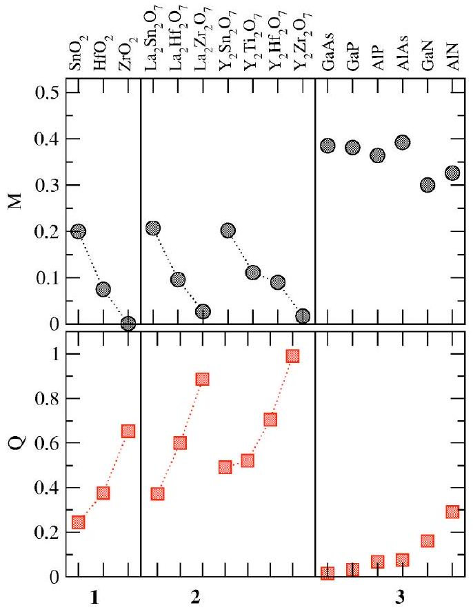
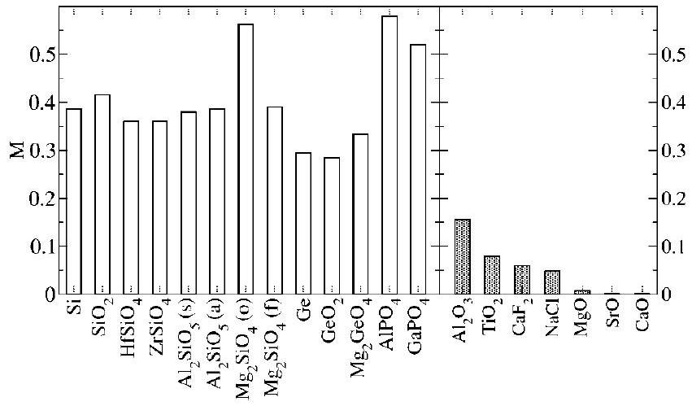
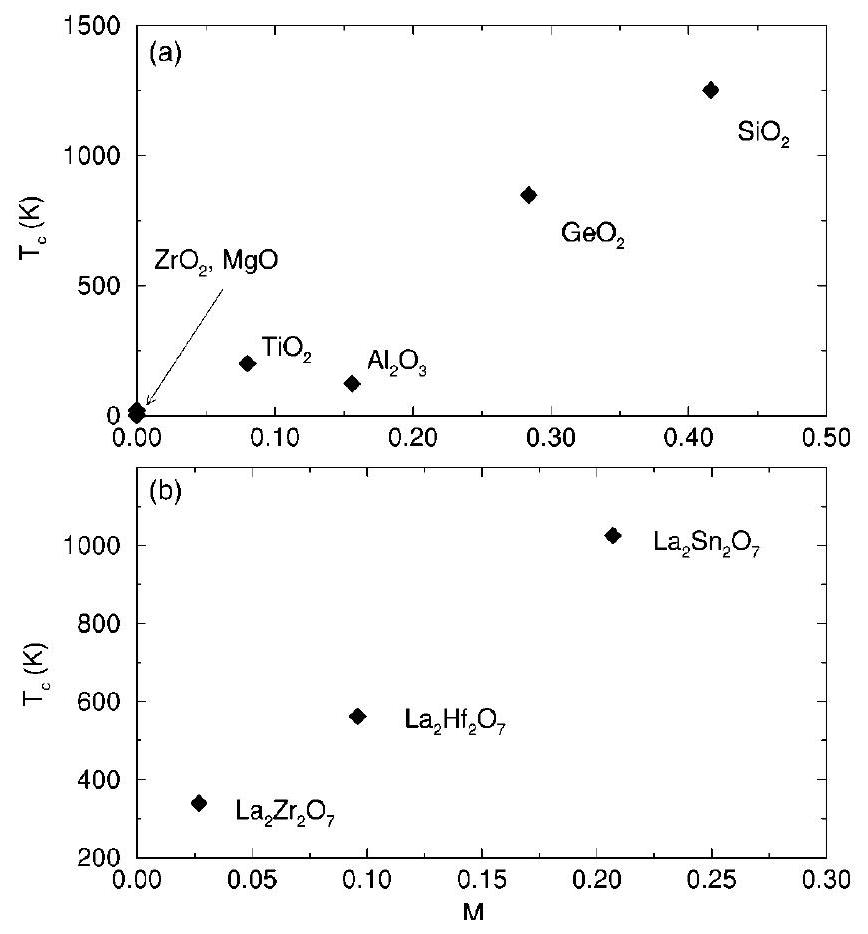

# How the nature of the chemical bond governs resistance to amorphization by radiation damage 

Kostya Trachenko, ${ }^{1}$ J. M. Pruneda, ${ }^{1,2}$ Emilio Artacho, ${ }^{1}$ and Martin T. Dove ${ }^{1}$ ${ }^{1}$ Department of Earth Sciences, University of Cambridge, Downing Street, Cambridge CB2 3EQ, United Kingdom ${ }^{2}$ Institut de Ciencia de Materials de Barcelona, Campus de la U.A.B, 08193 Bellaterra, Barcelona, Spain

(Received 26 May 2004; revised manuscript received 25 February 2005; published 23 May 2005)

#### Abstract

We discuss what defines a material's resistance to amorphization by radiation damage. We propose that resistance is generally governed by the competition between the short-range covalent and long-range ionic forces, and we quantify this picture using quantum-mechanical calculations. We calculate the Voronoi deformation density charges and Mulliken overlap populations of 36 materials, representative of different families, including complex oxides. We find that the computed numbers generally follow the trends of experimental resistance in several distinct families of materials: the increase (decrease) of the short-range covalent component in material's total force field decreases (increases) its resistance.

DOI: 10.1103/PhysRevB.71.184104
PACS number(s): 61.80.-x, 62.20.-x, 61.82.-d

It has long been known that the response of materials to heavy ion bombardment is strikingly diverse: some are rendered amorphous quite easily, whereas others do not show any loss of crystallinity even at very high radiation doses, i.e., are resistant to amorphization by radiation damage. However, the origin of this diversity is not understood, and is related to a more general question of why is there radiation damage in the first place. What defines stability of the introduced structural damage and hence resistance to amorphization? This is a subject of current debate. A recent review ${ }^{1}$ has discussed about 20 different factors that have been named relevant in the context of resistance to amorphization by radiation damage, including a particular structure (symmetry group) of a material, its structural or topological freedom, glass-forming ability, melting and crystallization temperature, ionicity, bond energy, hardness, elasticity, ratio of atomic radii, and others. These and other criteria may work within a certain narrow class or family of materials, related by structure or chemistry, but fail when applied to different families. ${ }^{1}$ It is intriguing to ask whether the phenomenon of resistance to amorphization is necessarily complex in that it is a combination of several important mechanisms, each manifesting itself differently in different materials, or whether there may exist a more general underlying mechanism that defines resistance in all materials, with other factors being either dependent, or secondary?

Apart from the scientific challenge, understanding the origin of resistance to amorphization is important technologically. Our interest in this problem is stimulated by the need to safely encapsulate highly radioactive nuclear waste and surplus plutonium, by putting them in a host matrix (waste form) that can serve as an effective barrier to diffusing out into the environment on the time scale of up to 1 million years. ${ }^{2}$ A waste form is normally a binary or ternary oxide. ${ }^{1}$ If amorphized by irradiation from the isotopes it contains (mostly by heavy energetic recoils in the alpha decay), a waste form may show large percolation type increases of chemical transport, reducing its effectiveness as an immobilization barrier. ${ }^{3}$ A resistant waste form, on the other hand, would be free from this negative effect. The problem of resistance to amorphization is relevant in other areas as well, including in semiconductor doping industry, where the research for resistant semiconductors like GaN, ZrN, ZnO, and others is under way. ${ }^{4}$

Two of the existing amorphization criteria were proposed in the early work of Naguib and Kelly. ${ }^{5}$ First, they suggested that resistance to amorphization increases with melting, and decreases with crystallization, temperature. The second criterion was based on the good empirical correlation of resistance with the ionicity of the chemical bond, using Pauling or Phillips definitions. ${ }^{6,7}$ Since the underlying physical model was not clear, the authors treated this criterion as empirical. Since this work was published, bond type was fragmentarily mentioned in the literature, while other criteria and models were developed. In a number of works, it has been concluded that empirical ionicity shows no correlation with resistance and therefore may not be relevant. ${ }^{1}$

If a general mechanism of resistance to amorphization is to be identified, it needs to be microscopic, i.e., describe atomic interactions and rearrangements. We have recently discussed how the nature of the chemical bond may be important for resistance to amorphization. ${ }^{1,8}$ In this paper, we quantify resistance to amorphization by radiation damage from the electronic structure. Before presenting the results, we outline the arguments of how the type of interatomic interactions, covalency and ionicity, are relevant for resistance to amorphization, and how to apply the criterion of resistance, based on the type of interatomic interactions, to a complex compound.

Initially, the propagation of an energetic heavy particle creates a highly disordered local region, a "radiation cascade," which can vary from several to several tens of nanometers in size depending on the particle type and energy. As kinetic energy of atoms dissipates, it becomes comparable with the energy of interatomic interactions. It is at this point that these interactions influence atomic rearrangements and, hence, the postirradiated structure. The interactions between atoms depend on how the electronic density is distributed in a solid, i.e., should depend on the nature of the chemical bond. Several aspects of how covalency or ionicity are important for the likelihood of atoms regaining coherence with the crystalline lattice ("recrystallization") can be discussed.

First, covalent bonds can be viewed as short-range directional constraints, due to the substantial electronic charge, localized between the neighboring atoms, and any large cooperative rearrangement of atoms, needed for local recrystallization, is "hooked," because it requires breaking the bonds
with associated energy cost. ${ }^{9}$ On the other hand, an ionic structure is well represented as a collection of charged spherical ions, and the cooperative rolling of electrostatically charged spheres is not hampered by the "hooking" above, ${ }^{9}$ and hence, involves crossing smaller activation energy barriers, increasing the likelihood of local recrystallization. During local recrystallization, the crystalline lattice around the radiation cascade provides a template for such recrystallization. Atoms near the interface between the crystalline lattice and radiation cascade lose their kinetic energy through dissipation faster than those in the core, and settle on the crystalline positions provided by the crystalline template. In this picture, "recrystallization" can be viewed as growth of the interface inside the radiation cascade.

Second, a useful insight comes from the consideration of the potential energy landscape created by the short-range (covalent) and long-range (ionic) forces. The former result in landscapes with many closely related minima, whereas the latter lead to landscapes with significantly fewer minima. ${ }^{10}$ Hence, the damaged structure can stabilize in one of the many alternative minima in a material with dominating short-range covalent forces, whereas it is much more likely to decay towards a crystalline minimum in a structure with dominating long-range electrostatic forces.

Finally, in a material with high ionicity of bonding, the local recrystallization process is promoted by the need to compensate electrostatic charges, with an ion attracting oppositely charged neighbors and making the "defect" structures that consist of neighboring atoms of the same charge energetically unfavorable. This effect is absent in a covalent structure.

A chemical bond has often both ionic and covalent contributions. ${ }^{6,7}$ If the total force field in a complex compound can be approximated as the sum of short-range and long-range forces, one can argue that short-range covalent and long-range ionic forces compete in defining a potential energy landscape with a given number of minima and distribution of energy barriers. Based on the above discussion, the increase of the short-range covalent component (decrease of the long-range ionic component) in the total force field decreases the likelihood of damage "recrystallizing." Hence, one can suggest that resistance to amorphization of a nonmetallic compound is governed by the competition between the short-range covalent and long-range ionic forces. ${ }^{1,8}$ It is interesting to note that winning of such a competition by long-range forces leads to the appearance of ordered formations in a system of electrons. ${ }^{11}$

The advantage of the proposed picture of resistance is that it can be applied to a compound of any complexity, and not only to binary compounds. In a ternary ABO oxide, for example, short-range and long-range contributions to a total force field can be taken as sums of the respective contributions to A-O and B-O bonds. If short-range covalent forces dominate, a material would be expected to have low resistance, and one can state that a complex material is amorphizable by radiation damage if its chemistry allows it to form a covalent network. This picture immediately predicts, for example, that complex silicate and titanate oxides should be readily amorphizable by radiation damage: a radiation cascade in these materials contains Si-O and Ti-O "phase," re-

FIG. 1. (Color online) Values of $Q$ and $M$ calculated for 16 materials in three isostructural families to illustrate the discussion that resistance to amorphization by radiation damage decreases with $M$ and increases with $Q$.

spectively, with appreciable covalency in bonding. ${ }^{1,8}$ These stabilize the damage in one of the many alternative energy minima and make a material amorphizable. For these materials, we have been aided in our formulation of the criterion of resistance by the insights from our molecular dynamics simulations of radiation damage. We have observed in these simulations the creation of disordered covalent $\mathrm{Si}-\mathrm{O}$ and Ti-O chains in the damaged structures of $\mathrm{CaTiO}_{3}$ (Ref. 8) and $\mathrm{ZrSiO}_{4}$. ${ }^{3,12}$ Experimentally, 58 silicate and titanate oxides are indeed readily amorphizable by radiation damage, ${ }^{1}$ confirming this picture. The proposed theory also explains, for example, a puzzling effect of the dramatic increase of resistance of $\mathrm{Gd}_{2} \mathrm{Zr}_{x} \mathrm{Ti}_{2-x} \mathrm{O}_{7}$ pyrochlore with $x$, with $\mathrm{Gd}_{2} \mathrm{Ti}_{2} \mathrm{O}_{7}$ being readily amorphizable and $\mathrm{Gd}_{2} \mathrm{Zr}_{2} \mathrm{O}_{7}$ extremely resistant to amorphization. ${ }^{13}$ Here, the increase of $x$ results in the decrease of the short-range covalent Ti -O phase in the radiation cascade, (increase of the long-range ionic $\mathrm{Zr}-\mathrm{O}$ phase), because the Ti-O bond has a considerable covalent contribution, whereas Zr -O bond is largely ionic. ${ }^{1,8}$ Hence, the proposed picture predicts that resistance of $\mathrm{Gd}_{2} \mathrm{Zr}_{x} \mathrm{Ti}_{2-x} \mathrm{O}_{7}$ should increase with $x$, exactly as seen experimentally.

We now come to the main point of this paper, an attempt to quantify the proposed theory of resistance to amorphization. We have recently compiled the list of 116 materials to illustrate that their resistance can be generally explained in the picture discussed above (see Table 1 in Ref. 1). These included binary and complex oxides, some important semiconductors like GaN and GaAs and others. Out of these materials, we have selected 36, representative of different families (see Figs. 1-3), and have analyzed their bonding type. It needs to be stressed at this point that a reliable conclusion

FIG. 2. Values of $M$ calculated for 20 different materials to illustrate the discussion that resistance to amorphization decreases with $M$. $(s),(a),(o)$, and $(f)$ denote sillimanate, andalusite, olivine, and forsterite, respectively.

about the type of bonding can only be reached if one returns to the definition of terms covalency and ionicity, and analyzes the electronic density maps, obtained by either experiments or quantum-mechanical calculations. Even in the case of binary compounds, when an empirical ionicity can be defined from the difference of electronegativities, ${ }^{6}$ it may not reflect the distribution of electronic density correctly. This is especially true for oxides, as is seen by comparing their empirical ionicities with real electronic density maps, ${ }^{1}$ with the results that go "against chemical intuition" (see, for example, Ref. 14). In fact, this difficulty may have contributed to the belief in the past that the bond type is irrelevant for resistance to amorphization and stimulated development of other models and approaches. ${ }^{1}$

FIG. 3. Dependence of $T_{\mathrm{c}}$ on $M$ for (a) binary and (b) ternary materials to illustrate that $T_{\mathrm{C}}$ increases (resistance decreases) with $M$.

We have computed the electronic structure of 36 materials, selected from the list of 116 materials, compiled in Ref. 1, that represent different families, have different composition, chemistry, structure, etc. We have used the selfconsistent SIESTA method, ${ }^{15}$ an implementation of the density functional theory. ${ }^{16}$ The electronic density was obtained using the exchange-correlation potential of Ceperley and Alder in the Perdew-Zunger parametrization, ${ }^{17}$ and normconserving pseudopotentials in the Kleinman-Bylander form, ${ }^{18}$ to remove the core electrons from the calculations. The Kohn-Sham eigenstates were expanded in a localized basis set of numerical orbitals. We have used a variety of basis sets for the different elements considered. In general, double zeta plus polarization basis were considered for the valence electrons. When required, additional single-zeta semicore orbitals were used.

Covalency and ionicity characterize different ways in which the electronic density can be distributed in a solid, ${ }^{19}$ and several methods have been proposed to quantify these concepts, leaving several possible options. To quantify charge transfer (which is commonly associated with higher ionicity), we have chosen to calculate the Voronoi deformation density charges. These have recently been shown to be superior to other measures and to "conform to chemical experience." ${ }^{20}$ An additional advantage of the Voronoi deformation density charges is that they do not depend directly on the basis set. The Voronoi deformation density charge of atom $\mathrm{A}, Q^{\mathrm{A}}$, quantifies the flow of electron density, associated with the formation of the chemical bond, in the Voronoi cell; the larger this number, the larger ionicity. ${ }^{20}$ For binary AB compounds, we show the difference $Q=Q^{\mathrm{A}}-Q^{\mathrm{B}}$, for ternary ABO oxides, we show $Q=Q^{\mathrm{B}}-Q^{\mathrm{O}}$.

To quantify covalency, we have chosen to calculate the Mulliken overlap population, ${ }^{21} M . M$ quantifies the overlap population between the atoms due to the formation of the chemical bond, and is commonly associated with covalency; the larger $M$, the larger covalency. Unlike $Q, M$ can be sensitive to the basis set, however, we will see that for materials under consideration, the associated variations of $M$ are smaller than the differences due to the changes in chemistry/ composition. In particular, we will see that the changes of $M$ due to different chemistry are anticorrelated with changes of $Q$, which is basis independent. This suggests that for materials studied here, $M$ reflects chemical trends correctly. For ternary ABO oxides, we show $M$ for B-O bond.

Meaningful comparisons of $Q$ can be done for materials with the same number of valence electrons. From 36 calculated materials, we have grouped 16 in three isostructural families, allowing the comparison in terms of both $Q$ and $M$ (see Fig. 1). In group 1, we show $Q$ and $M$ for binary oxides $\mathrm{SnO}_{2}, \mathrm{HfO}_{2}$, and $\mathrm{ZrO}_{2}$. It is seen that $Q$ increases and $M$ decreases in this order, and this trend is consistent with increase of resistance to amorphization by radiation damage, as easily amorphizable $\mathrm{SnO}_{2}$ can be contrasted with extremely resistant $\mathrm{ZrO}_{2}$, as found by both ion bombardment and Pu doping. ${ }^{5,22-24}$ This illustrates the discussion above: the increase of $Q$ and decrease of $M$ results in the increase of resistance of a complex compound: as the weight of the short-range covalent forces decreases (the weight of the long-range ionic forces increases), its resistance increases.

The binary oxides in group 1 have different structure. However, $\mathrm{A}_{2} \mathrm{~B}_{2} \mathrm{O}_{7}$ pyrochlores in group 2 are all structurally identical, and yet the same relation exists between the nature of the B-O bond and resistance to amorphization. Indeed, the same trend of $Q$ and $M$ is seen as B changes in the order of $\mathrm{Sn}, \mathrm{Hf}, \mathrm{Zr}$, as for binary oxides in group 1 (see Fig. 1). The increase of the long-range ionic (decrease of the short-range covalent) contribution in the force field due to chemical variation results in large increase of resistance of these pyrochlores: critical amorphization temperature $T_{\mathrm{C}}$ (often used as a measure of resistance to amorphization, this is the temperature after which a material cannot be rendered amorphous; the lower $T_{\mathrm{C}}$, the higher resistance) decreases from 1025 K in $\mathrm{La}_{2} \mathrm{Sn}_{2} \mathrm{O}_{7}$ to 563 K in $\mathrm{La}_{2} \mathrm{Hf}_{2} \mathrm{O}_{7}$ and to 339 K in $\mathrm{La}_{2} \mathrm{Zr}_{2} \mathrm{O}_{7} \cdot{ }^{25}$ Recall earlier discussion of dramatic resistance of $\mathrm{Gd}_{2} \mathrm{Zr}_{2} \mathrm{O}_{7}$ relative to readily amorphizable $\mathrm{Gd}_{2} \mathrm{Ti}_{2} \mathrm{O}_{7}$ pyrochlore. In all these compounds, the proposed theory readily explains the dramatic changes of resistance due to chemistry variations (for Y pyrochlores, no resistance data exists, hence, the trend shown in Fig. 1 is a prediction). No other existing criteria of resistance to amorphization can explain these effects. We emphasize the point that the empirical measure of ionicity may not be consistent with real electronic density maps: for example, basing on the electronegativity numbers, ${ }^{6}$ the Hf-O bond would be expected to be slightly more ionic than the $\mathrm{Zr}-\mathrm{O}$ bond. Therefore ionicity and, hence, resistance of the hafnate pyrochlore would be expected to be larger than that for the zirconate one, contrary to the electronic density maps we have calculated and experimental resistance (see Ref. 1 for discussion of more examples of this point).

Finally, in group 3 we show several important binary semiconductors. GaN and AlN have higher values of $Q$ and lower values of $M$ relative to GaAs, AlAs, etc. This is consistent with the experimental trend ${ }^{4}$ and, by similar argument as above, explains why the former materials are more resistant to amorphization by ion bombardment than the latter.

Values of $M$ for the remaining 20 materials are shown in Fig. 2. Generally, Fig. 2 contrasts high values of $M$ of readily amorphizable materials with low values of $M$ of resistant materials. First, covalent character of bonding in elemental Si and Ge, as indicated by high values of $M$, is consistent with their low resistance to amorphization by radiation damage. Second, the same is true for binary $\mathrm{SiO}_{2}$ and $\mathrm{GeO}_{2}$ : high values of $M$ are consistent with their low resistance to amorphization. ${ }^{26-28}$ Finally, high values of $M$ are also seen in ternary silicate, germanate, and phosphate oxides. Experimentally, these materials are readily amorphizable by radiation damage at room temperature. ${ }^{28}$ This illustrates a criterion of resistance to amorphization of a complex compound discussed above, namely that a complex material is readily amorphizable by radiation damage if its chemistry allows it to form a covalent network. At a microscopic level, a radiation cascade in these complex materials contains polymerized covalent Si-O, Ge-O, P-O, etc. chains, which stabilize the damage in one of the many alternative energy minima (see discussion above) and make a material amorphizable.

We observe that the values of $M$ for binaries $\mathrm{Al}_{2} \mathrm{O}_{3}, \mathrm{TiO}_{2}$, $\mathrm{CaF}_{2}, \mathrm{NaCl}, \mathrm{MgO}, \mathrm{SrO}$, and CaO are low as compared with materials discussed in the previous paragraph (see Fig. 2).

Experimentally, $\mathrm{Al}_{2} \mathrm{O}_{3}, \mathrm{MgO},{ }^{27,29} \mathrm{CaF}_{2},{ }^{30} \mathrm{SrO}, \mathrm{CaO}, \mathrm{NaCl},{ }^{5}$ and $\mathrm{TiO}_{2}$ (Ref. 34) are known to be resistant to amorphization by radiation damage, as they cannot be amorphized at room temperature, at least under conditions in the above experiments. Under the same experimental conditions, $\mathrm{Al}_{2} \mathrm{O}_{3}$ and MgO , for example, are found to be dramatically more resistant than silicate oxides. ${ }^{27}$ We note that $M$ for $\mathrm{Al}_{2} \mathrm{O}_{3}$ exceeds that for $\mathrm{TiO}_{2}$, and is larger than expected (presumably as a result of increased polarization of $\mathrm{O}^{2-}$ anion due to the lower symmetry around O atoms), in the view that the former oxide is highly ionic in character, ${ }^{14,31}$ whereas the latter shows appreciable covalent component of bonding. ${ }^{32}$

It is interesting to try to relate $M$ to $T_{\mathrm{c}}$. Unfortunately, $T_{\mathrm{c}}$ is not available for many materials of interest. An additional difficulty is that available values of $T_{\mathrm{c}}$ are often derived using different experimental conditions like types of bombarding ions, their energy, etc., which can somewhat change $T_{\mathrm{C}} \cdot{ }^{33}$ In Fig. 3(a) we plot the values of $T_{\mathrm{c}}$ for $\mathrm{ZrO}_{2}{ }^{22,23} \mathrm{MgO},{ }^{27} \mathrm{Al}_{2} \mathrm{O}_{3}$, ${ }^{27} \mathrm{TiO}_{2}$, ${ }^{34} \mathrm{GeO}_{2}$, ${ }^{26}$ and $\mathrm{SiO}_{2}$ (Ref. 27) as a function of $M$. Except for $\mathrm{ZrO}_{2}$, the values of $T_{\mathrm{c}}$ were measured using the same ions and energy. It can be seen that except for $\mathrm{Al}_{2} \mathrm{O}_{3}$ (see discussion in the previous paragraph), $T_{\mathrm{c}}$ increases with $M$, as the proposed picture of resistance predicts.

Finally, as discussed above, the proposed picture of resistance allows one to discuss not only binary materials, but compounds of any complexity. It is seen in Fig. 3(b) that the same correlation between $M$ and $T_{\mathrm{c}}$ (taken from Ref. 25) holds for complex ABO compounds. In the proposed theory, this illustrates that as the weight of the short-range covalent forces increases in a complex compound, its resistance decreases.

Before concluding, we define the boundaries of the proposed picture of resistance to amorphization by radiation damage. Whereas we propose that a complex material is amorphizable by radiation damage if it can form a covalent network, it does not always imply that inability to do so makes a material resistant to amorphization. In other words, there may be other factors that may reduce a material's resistance. For example, these may include electronic defects (neglected in the discussion above), that appear at high energies, and stabilize the damaged structure in materials that are highly ionic and resistant to amorphization at lower energies. ${ }^{35,36}$ Next, chemical demixing in a radiation cascade can cause phase decomposition, inhibiting the recrystallization process in an otherwise resistant material (for example, formation of nitrogen bubbles in GaN). ${ }^{37}$ This may include a case when a material (a binary oxide, for example) can support more than one charge state and can undergo radiationinduced decomposition into differently charged states. Large ratio of cation radii in an ionic ABO compound can inhibit recrystallization and decrease resistance, similar to the "confusion" principle used to prepare metallic glasses. ${ }^{38}$ An increased ability to form networks due to a particular electronic structure may reduce resistance of a material (see Refs. 1 and 8 for discussion of resistance of silicate and phosphate oxides), etc.

In summary, we have attempted to quantify the proposed theory of resistance to amorphization from the electronic structure. We have seen the competing effect of the short-
range covalent and long-range ionic forces in several families of materials: as the weight of the short-range covalent forces increases (decreases) in a force field of a binary or complex material as a result of chemistry variation, its resistance to amorphization decreases (increases). The important point is that this effect holds for materials in distinctly different families, suggesting its generality. This is unlike other criteria proposed previously (discussed at the beginning of this paper), which attempted to correlate resistance with other properties in a narrow class or family of materials only; it is not surprising that these other properties can correlate with resistance, insofar as the nature of the chemical bond can correlate with some of these properties in that class or
family (for example, ionicity may correlate with coordination and topological freedom, ${ }^{7}$ see Ref. 1 for a detailed discussion). Hence, we propose that the nature of chemical bond, often thought to be not highly relevant, or even irrelevant for resistance to amorphization, ${ }^{1}$ should, in fact, be given a prior consideration, followed by possibly other factors as discussed in the previous paragraph.

We appreciate useful discussions with G. Lumpkin, J. C. Phillips, L. Hobbs, M. Stoneham, and S. Kucheyev. We are grateful to CMI, Darwin College, Cambridge, BNFL, NERC, and EPSRC, for support.
${ }^{1}$ For review, see K. Trachenko, J. Phys.: Condens. Matter 16, R1491 (2004).
${ }^{2}$ G. Taubes, Science 263, 629 (1994).
${ }^{3}$ T. Geisler et al., J. Phys.: Condens. Matter 15, L507 (2003); K. Trachenko et al., ibid. 16, S2623 (2004).
${ }^{4}$ S. O. Kucheyev, J. S. Williams, C. Jagadish, J. Zou, and G. Li, Phys. Rev. B 62, 7510 (2000); C. Ronning et al., J. Appl. Phys. 87, 2149 (2000); S. O. Kucheyev et al., ibid. 92, 3554 (2002); S. O. Kucheyev, J. S. Williams, C. Jagadish, J. Zhou, C. Evans, A. J. Nelson, and A. V. Hamza, Phys. Rev. B 67, 094115 (2003).
${ }^{5}$ H. M. Naguib and R. Kelly, Radiat. Eff. 25, 1 (1975).
${ }^{6}$ L. Pauling, The Nature of the Chemical Bond (Cornell University Press, Ithaca, 1960).
${ }^{7}$ J. C. Phillips, Rev. Mod. Phys. 42, 317 (1970).
${ }^{8}$ K. Trachenko, M. Pruneda, E. Artacho, and M. T. Dove, Phys. Rev. B 70, 134112 (2004).
${ }^{9}$ W. Huckel, Structural Chemistry of Inorganic Compounds (Elsevier, New York, 1951).
${ }^{10}$ D. J. Wales, Science 293, 2067 (2001).
${ }^{11}$ B. P. Stojkovic Z. G. Yu, A. R. Bishop, A. H. Castro Neto, and N. Gronbech-Jensen, Phys. Rev. Lett. 82, 4679 (1999); C. Reichhardt, C. J. Olson, I. Martin, and A. R. Bishop, Europhys. Lett. 61, 221 (2003).
${ }^{12}$ K. Trachenko, M. T. Dove, and E. K. H. Salje, J. Phys.: Condens. Matter 13, 1947 (2001); Phys. Rev. B 65, 180102(R) (2002).
${ }^{13}$ S. X. Wang et al., J. Mater. Res. 14, 4470 (1999).
${ }^{14}$ A. Clotet, J. M. Ricart, C. Sousa, and F. Illas, J. Electron Spectrosc. Relat. Phenom. 69, 65 (1994); C. Sousa, F. Illas, and G. Pacchioni, J. Chem. Phys. 99, 6818 (1993).
${ }^{15}$ P. Ordejon, E. Artacho, and J. M. Soler, Phys. Rev. B 53, R10441 (1996).
${ }^{16}$ P. Hohenberg and W. Kohn, Phys. Rev. 136, B864 (1964); W. Kohn and L. J. Sham, Phys. Rev. 140, A1133 (1965).
${ }^{17}$ N. Troullier and J. L. Martins, Phys. Rev. B 43, 1993 (1991).
${ }^{18}$ L. Kleinman and D. M. Bylander, Phys. Rev. Lett. 48, 1425 (1982).
${ }^{19}$ N. W. Ashcroft and N. D. Mermin, Solid State Physics (Saunders College Publishing, Philadelphia, 1976).
${ }^{20}$ C. F. Guerra, J. W. Handgraaf, E. J. Baerends, and F. M. Bickelhaupt, J. Comput. Chem. 25, 189 (2004).
${ }^{21}$ R. S. Mulliken, J. Chem. Phys. 23, 1833 (1955).
${ }^{22}$ K. Sickafus et al., J. Nucl. Mater. 274, 66 (1999).
${ }^{23}$ K. Sickafus et al., Nucl. Instrum. Methods Phys. Res. B 191, 549
(2002).
${ }^{24}$ B. E. Burakov et al., MRS Symposia Proceedings No. 804 (Materials Research Society, 2004), p. 213; B. E. Burakov et al., J. Nucl. Sci. Technol. 3, 733 (2002).
${ }^{25}$ G. Lumkpin et al., J. Phys.: Condens. Matter 16, 8557 (2004); G. Lumpkin et al. (unpublished).
${ }^{26}$ S. X. Wang, L. M. Wang, and R. C. Ewing, Nucl. Instrum. Methods Phys. Res. B 175, 615 (2001).
${ }^{27}$ S. X. Wang, L. M. Wang, R. C. Ewing, and R. H. Doremus, J. Non-Cryst. Solids 238, 198 (1998).
${ }^{28}$ R. K. Eby, R. C. Ewing, and R. C. Birtcher, J. Mater. Res. 7, 3080 (1992); A. N. Sreeram, L. W. Hobbs, N. Bordes, and R. C. Ewing, Nucl. Instrum. Methods Phys. Res. B 116, 126 (1996); F. G. Karioris, K. Appaji Gowda, L. Cartz, and J. C. Labbe, J. Nucl. Mater. 108/109, 748 (1982); R. C. Ewing, L. M. Wang, and W. J. Weber, MRS Symposia Proceedings No. 373 (Materials Research Society, 1995), p. 347.
${ }^{29}$ C. W. White et al., Mater. Sci. Rep. 4, 41 (1989); S. J. Zinkle and L. L. Snead, Nucl. Instrum. Methods Phys. Res. B 116, 92 (1996).
${ }^{30}$ N. Yu et al., Nucl. Instrum. Methods Phys. Res. B 127/128, 591 (1997).
${ }^{31}$ W. Y. Ching and Y. N. Xu, J. Am. Ceram. Soc. 77, 401 (1994); J. Guo, D. E. Ellis, and D. J. Lam, Phys. Rev. B 45, 3204 (1992); Y. N. Xu and W. Y. Ching, ibid. 43, 4461 (1991); G. Pacchioni C. Sousa, F. Illas, F. Parmigiani, and P. S. Bagus, ibid. 48, 11573 (1993).
${ }^{32}$ R. A. Evarestov, D. E. Usvyat, and V. P. Smirnov, Phys. Solid State 45, 2072 (2003); L. B. Lin, S. D. Mo, and D. L. Lin, J. Phys. Chem. Solids 54, 907 (1993); K. M. Glassford and J. R. Chelikowsky, Phys. Rev. B 46, 1284 (1992).
${ }^{33}$ E. Wendler, B. Breeger, Ch. Schubert, and W. Wesch, Nucl. Instrum. Methods Phys. Res. B 147, 155 (1999).
${ }^{34}$ F. Li et al., Nucl. Instrum. Methods Phys. Res. B 166/167, 314 (2000).
${ }^{35}$ S. J. Zinlke, S. A. Skuratov, and D. T. Hoelzer, Nucl. Instrum. Methods Phys. Res. B 191, 758 (2002).
${ }^{36}$ N. Itoh and A. M. Stoneham, Materials Modification by Electronic Excitation (Cambridge University Press, Cambridge, 2001).
${ }^{37}$ S. O. Kucheyev, Appl. Phys. Lett. 77, 3577 (2000).
${ }^{38}$ A. L. Greer, Science 267, 1947 (1995).

