# Reticulated porous ceria undergoing thermochemical reduction with high-flux irradiation 

## Journal Article

## Author(s):

Ackermann, Simon; Takacs, Michael; Scheffe, Jonathan; Steinfeld, Aldo (ib)

## Publication date:

2017-04

## Permanent link:

https://doi.org/https://doi.org/10.3929/ethz-b-000122032

## Rights / license:

Creative Commons Attribution 4.0 International

## Originally published in:

International Journal of Heat and Mass Transfer 107, https://doi.org/10.1016/j.jjheatmasstransfer.2016.11.032

# Reticulated porous ceria undergoing thermochemical reduction with high-flux irradiation 

Simon Ackermann ${ }^{\mathrm{a}}$, Michael Takacs ${ }^{\mathrm{a}}$, Jonathan Scheffe ${ }^{\mathrm{b}}$, Aldo Steinfeld ${ }^{\mathrm{a}, *}$ ${ }^{\mathrm{a}}$ Department of Mechanical and Process Engineering, ETH Zürich, Sonneggstrasse 3, 8092 Zürich, Switzerland ${ }^{\mathrm{b}}$ Department of Mechanical and Aerospace Engineering, University of Florida, USA

## ARTICLE INFO

## Article history:

Received 10 June 2016
Received in revised form 31 October 2016
Accepted 7 November 2016
Available online 25 November 2016

## Keywords:

Solar
Thermochemistry
Redox cycle
Porous ceria

#### Abstract

A numerical and experimental analysis is performed on the solar-driven thermochemical reduction of ceria as part of a $\mathrm{H}_{2} \mathrm{O} / \mathrm{CO}_{2}$-splitting redox cycle. A transient heat and mass transfer model is developed to simulate reticulated porous ceramic (RPC) foam-type structures, made of ceria, exposed to concentrated solar radiation. The RPC features dual-scale porosity in the mm-range and $\mu \mathrm{m}$-range within its struts for enhanced transport. The numerical model solves the volume-averaged conservation equations for the porous fluid and solid domains using the effective transport properties for conductive, convective and radiative heat transfer. These in turn are determined by direct pore-level simulations and MonteCarlo ray tracing on the exact 3D digital geometry of the RPC obtained from tomography scans. Experimental validation is accomplished in terms of temporal temperature and oxygen concentration measurements for RPC samples directly irradiated in a high-flux solar simulator with a peak flux of 1200 suns and heated to up to 1940 K . Effective volumetric absorption of solar radiation was obtained for moderate optically thick structures, leading to a more uniform temperature distribution and a higher specific oxygen yield. The effect of changing structural parameters such as mean pore diameter and porosity is investigated.

© 2016 The Authors. Published by Elsevier Ltd. This is an open access article under the CC BY license (http:// creativecommons.org/licenses/by/4.0/).

## 1. Introduction

Solar-driven thermochemical cycles for splitting $\mathrm{H}_{2} \mathrm{O}$ and $\mathrm{CO}_{2}$ comprise an endothermic step for the reduction of a metal oxide using concentrated sunlight followed by an exothermic step for the oxidation of the reduced metal oxide with $\mathrm{H}_{2} \mathrm{O}$ and $\mathrm{CO}_{2}$ to form the basic components of syngas, $\mathrm{H}_{2}$ and CO [1]. Syngas can then be further processed to conventional liquid hydrocarbon fuels (e.g. kerosene, diesel) via Fischer-Tropsch synthesis or other gas-toliquid technologies. Ceria-based oxides have emerged as highly attractive redox materials [2-14] because of their relatively high oxygen exchange capacities [15-19], fast oxygen-ion transport [20-22] and high oxidation rates [23-27]. The redox reactions with pure ceria are represented by:
High - temperature reduction : $\mathrm{CeO}_{2} \rightarrow \mathrm{CeO}_{2-\delta}+\frac{\delta}{2} \mathrm{O}_{2}$

Low - temperature oxidation with $\mathrm{H}_{2} \mathrm{O}$ :

$$
\mathrm{CeO}_{2-\delta}+\delta \mathrm{H}_{2} \mathrm{O} \rightarrow \mathrm{CeO}_{2}+\delta \mathrm{H}_{2}
$$

[^0]Low - temperature oxidation with $\mathrm{CO}_{2}$ :

$$
\mathrm{CeO}_{2-\delta}+\delta \mathrm{CO}_{2} \rightarrow \mathrm{CeO}_{2}+\delta \mathrm{CO}
$$

where the non-stoichiometry $\delta$ denotes the reduction extent.
In a previous paper [14], we proposed the use of reticulated porous ceramic (RPC) foam-type structures having dual-scale porosity: mm-size pores with struts containing micron-size pores. The mm-size pores enable volumetric absorption of concentrated solar radiation [28] and thus effective heat transfer during the reduction step, while the micron-size pores within the struts offer increased specific surface area leading to enhanced reaction kinetics during the oxidation step. The thermochemical redox cycle is performed under a temperature/pressure-swing operational mode; thus, the cyclic process is inherently of transient nature and the reduction step, Eq. (1), proceeds as the RPC is heated to the desired upper temperature. It was experimentally shown that these ceria RPC structures with dual-scale porosity remain morphologically stable over 227 consecutive redox cycles in a solar reactor [14]. A representative 3D rendering of a computer tomography (CT) scan of a RPC sample is shown in Fig. 1, along with the scanning electron micrograph (SEM) of the strut's cross section.

Optimization of the RPC structure demands the development of numerical simulation models for heat and mass transfer [13,29,30].

| Nomenclature |  |  |  |
| :--- | :--- | :--- | :--- |
| Symbols |  | Greek symbols |  |
| $A_{\text {domain }}$ | area of the volume-averaged domain [ $\mathrm{m}^{2}$ ] | $\alpha_{(.)}$ | absorption coefficient [ $\mathrm{m}^{-1}$ ] |
| $A_{\mathrm{sf}}$ |  | $\beta$ | effective extinction coefficient of RPC [ $\mathrm{m}^{-1}$ ] |
|  | fluid-solid interfacial area relevant for the convective transport [ $\mathrm{m}^{-1}$ ] | $\delta$ | nonstoichiometry [-] |
| $c_{\mathrm{p},(.)}$ | heat capacity [ $\mathrm{J} \mathrm{kg}^{-1} \mathrm{~K}^{-1}$ ] | $\varepsilon_{(.)}$ | porosity [-] |
| $d_{\mathrm{m}, .(.)}$ | mean pore diameter [m] | $\varepsilon_{\text {emit }}$ | total hemispherical emittance of ceria [-] |
| $D_{\text {ArO2 }}$ | binary gas diffusion coefficient [ $\mathrm{m}^{2} \mathrm{~s}^{-1}$ ] | $\eta$ | solar-to-fuel energy conversion efficiency [\%] |
| $F_{\mathrm{D}}$ | Dupuit-Forchheimer coefficient [ $\mathrm{m}^{-1}$ ] | $\mu_{(.)}$ | dynamic viscosity [Pa s] |
| $h_{\mathrm{sf}}$ | interfacial heat transfer coefficient [ $\mathrm{W} \mathrm{m}^{-2} \mathrm{~K}^{-1}$ ] | $\mu_{\mathrm{s}}$ | cosine of the scattering angle [-] |
| $H_{(.)}$ | Enthalpy [ $\mathrm{kg}^{-1}$ ] | $\rho_{(.)}$ | density [ $\mathrm{kg} \mathrm{m}^{-3}$ ] |
| $H V_{\mathrm{CO}}$ | heating value of $\mathrm{CO}\left[\mathrm{J} \mathrm{kg}^{-1}\right]$ | $\sigma$ | scattering coefficient [ $\mathrm{m}^{-1}$ ] |
| $\Delta H_{\mathrm{O} 2}$ | reaction enthalpy [ $\mathrm{kJ} \mathrm{mol}^{-1}$ ] | $\sigma_{\mathrm{S}}$ | Stefan-Boltzmann constant [ $\mathrm{W} \mathrm{m}^{-2} \mathrm{~K}^{-4}$ ] |
| I | intensity of radiative flux [ $\mathrm{W} \mathrm{m} \mathrm{m}^{-2} \mathrm{sr}^{-1}$ ] | $\Phi$ | scattering phase function [-] |
| $I_{\mathrm{b}}$ | blackbody radiation intensity [ $\mathrm{W} \mathrm{m}^{-2} \mathrm{sr}^{-1}$ ] | $\Omega^{\prime}$ | solid angle [rad] |
| $I_{\text {solar }}$ | flux of incident solar radiation [ $\mathrm{W} \mathrm{m}^{-2}$ ] |  |  |
| $k_{\text {eff }}$ | effective thermal conductivity [ $\mathrm{W} \mathrm{m}^{-1} \mathrm{~K}^{-1}$ ] | Dimensionless numbers |  |
| $k_{(.)}$ | thermal conductivity [ $\mathrm{W} \mathrm{m}^{-1} \mathrm{~K}^{-1}$ ] | Nu | Nusselt number [-] |
| K | permeability [ $\mathrm{m}^{2}$ ] | Pr | Prandtl number [-] |
| L | length of domain [m] | Re | Reynolds number [-] |
| $m_{\mathrm{O} 2}$ | oxygen mass [kg] |  |  |
| M | molar mass [ $\mathrm{kg} \mathrm{mol}^{-1}$ ] | Operator |  |
| $n_{\text {ppi }}$ | number of pores per inch [-] | <. > | superficial average |
| $p$ | pressure [Pa] |  |  |
| $\Delta p$ | pressure drop [Pa] |  |  |
| $p_{\mathrm{O} 2}$ | oxygen partial pressure [Pa] | amb | ambient conditions |
| $q_{\text {out }}^{\prime \prime}$ | radiative heat flux leaving the solid domain [ $\mathrm{W} \mathrm{m}^{-2}$ ] | Ar | argon |
| $Q_{\mathrm{co}}$ | Combustion heat of CO [J] | $\mathrm{CeO}_{2}$ | ceria |
| $Q_{\text {solar }}$ | cumulative energy of the incident solar radiation [J] | f | fluid phase |
| $\mathbf{r}$ | position vector | $\mathrm{O}_{2}$ | oxygen |
| $r$ | total hemispherical reflectance of ceria [-] | RPC-dual morphological property of RPC with porous struts (dual-   scale porosity) |  |
| $r_{\mathrm{O} 2}$ | oxygen evolution rate [ $\mathrm{kg} \mathrm{s}^{-1}$ ] |  |  |
| $s$ | path length of a ray [m] | RPC-single morphological property of RPC with non-porous |  |
| S | direction vector |  | struts |
| $\boldsymbol{s}^{\prime}$ | scattering direction vector | s | solid phase |
| $S_{\mathrm{MD}}$ | momentum source for porous media [ $\mathrm{kg} \mathrm{m}^{-2} \mathrm{~s}^{-2}$ ] | strut | morphological property of the porous strut |
| $S_{\text {radiative }}$ | source term for the radiative net flux [ $\mathrm{W} \mathrm{m}^{-3}$ ] |  |  |
| $S_{\text {reradiation }}$ | source term for the reradiated flux [ $\mathrm{W} \mathrm{m}^{-3}$ ] | Abbreviations |  |
| $S_{\text {solar }}$ |  | CFD | computational fluid dynamics |
|  | source term for the absorbed high-flux irradiation $\left[\mathrm{W} \mathrm{m}^{-3}\right]$ | CT | computed tomography |
| $t$ | time [s] | DPLS | direct pore level simulation |
| $T_{(.)}$ | temperature [K] | ETH | Swiss Federal Institute of Technology in Zurich |
| $u_{\mathrm{D}}$ | superficial velocity [ $\mathrm{m} \mathrm{s}^{-1}$ ] | FV | finite volume |
| u | velocity vector | HFSS | high flux solar simulator |
| $V_{\text {cell }}$ | cell volume [ $\mathrm{m}^{3}$ ] | MC | Monte Carlo |
| $Y_{\mathrm{O} 2}$ | oxygen concentration [-] | ppi | pores per inch |
|  |  | RPC | reticulated porous ceramic |

The effective transport properties can be determined by applying direct pore-level simulations (DPLS) on the exact 3D digital representation of the RPC, including the $\mu \mathrm{m}$-size pores of the struts, obtained by high-resolution synchrotron CT [31-37]. Since the numerical solution of the governing unsteady Navier-Stokes equations at the pore scale is computational expensive, the volumeaveraging theory for porous media is applied for the fluid and solid domains [38-42] by incorporating the effective transport properties determined by DPLS. In this paper, we follow this methodology to develop a heat and mass transfer model of the ceria RPC with dual-scale porosity and investigate its transient behaviour during the reduction step. The model is validated with experimental data obtained from temporal measurements of temperature and reduction extents on RPC samples exposed to high-flux irradiation. To guide the optimization of the RPC structure, virtual samples with a wide range of porosities and mean pore diameters are numeri-
cally engineered based on the CT scan of a real RPC sample and their performance is studied by applying the heat and mass transfer model.

## 2. Experimental methods

Ceria RPC samples with dual-scale porosities were manufactured of cylindrical shape, 30 mm -diameter and 15 mm -height, following the recipe described previously [14]. Two mm -size porosities were selected: 10 and 35 pores per inch (ppi) foams with a corresponding porosity of 0.825 and 0.867 , respectively, and mean pore diameter of 2.3 and 0.7 mm , respectively. The strut porosity was 0.26 with a mean pore diameter of $10 \mu \mathrm{~m}$ [37].

The experimental setup is schematically shown in Fig. 2. Experimentation was carried out at ETH's High-Flux Solar Simulator (HFSS) [43], which comprises an array of high-pressure Xenon arcs,

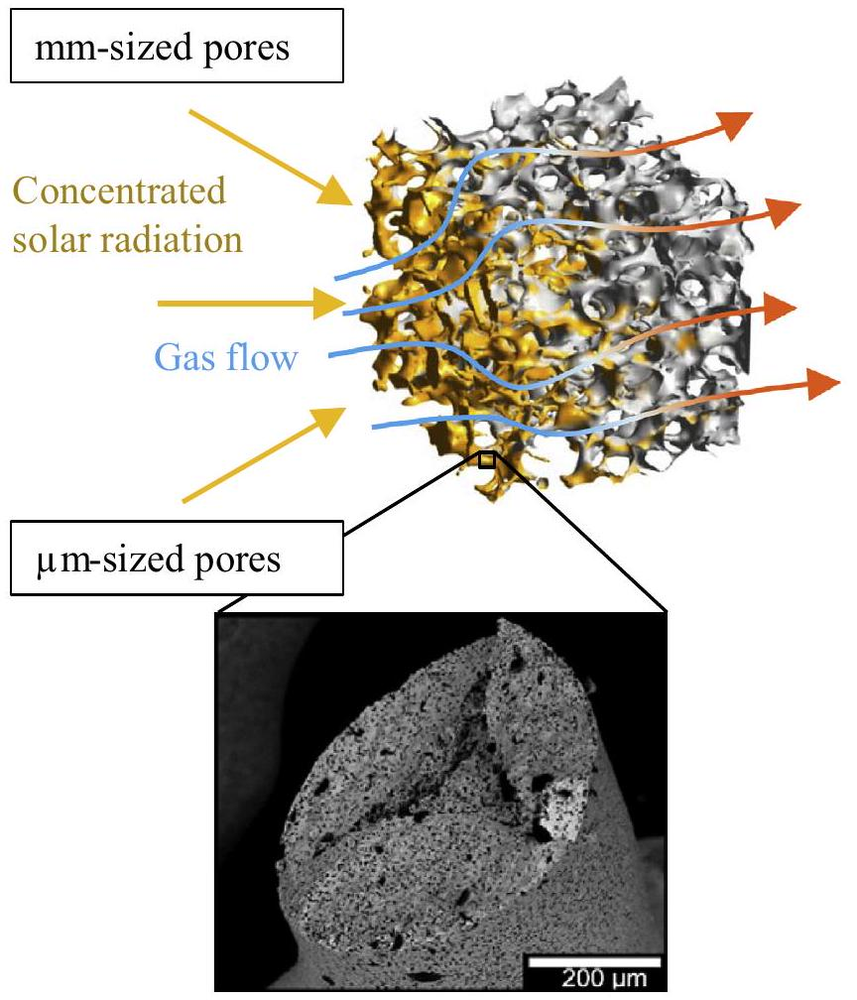
Fig. 1. A 3D rendering of a computer tomography (CT) scan of the RPC structure, along with the scanning electron micrograph (SEM) of the strut's cross section. The RPC features dual-scale porosity: the mm-size pores enable efficient volumetric absorption of concentrated solar radiation during the reduction step while the $\mu \mathrm{m}$ size interconnected pores within the struts provide enhanced kinetic rates during the oxidation step.

each closed-coupled with truncated ellipsoidal specular reflectors, and provides a source of intense thermal radiation - mostly in the visible and IR spectra - that closely approximates the heat transfer characteristics of highly concentrating solar systems. The radiative flux distribution at the focal plane was measured optically using a calibrated CCD camera focused on a Lambertian (diffusely reflect-

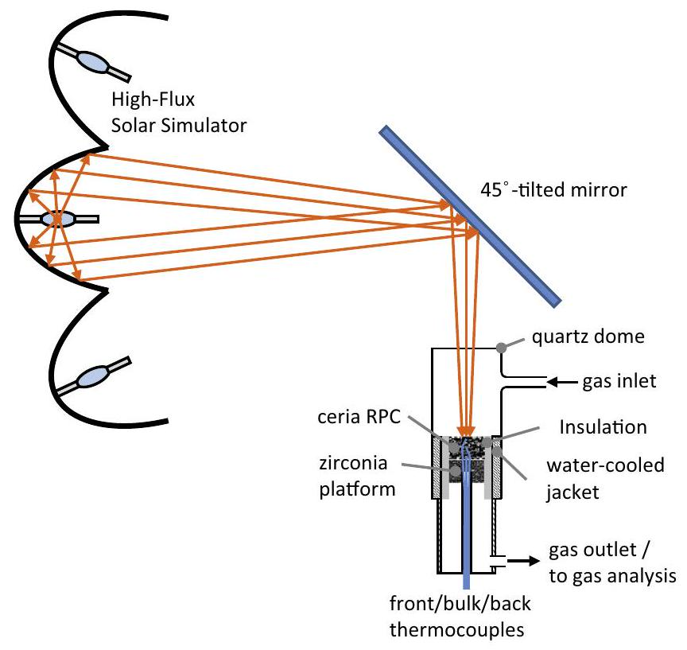
Fig. 2. Schematic of the experimental setup.

ing) target and verified with a water calorimeter. A $45^{\circ}$-mirror is used to re-direct the radiation beam towards the sample. The ceria RPC sample was placed on top of a $\mathrm{ZrO}_{2}$ flat porous crucible, laterally lined with $\mathrm{Al}_{3} \mathrm{O}_{2}$ insulation, and positioned with its top surface at the HFSS's focal plane. The radiative flux distribution was continuous and uniform over the sample surface. A transparent quartz envelope provided the reaction chamber for controlled gas atmosphere and access to direct irradiation. A water-cooled metallic jacket protected the quartz for the thermal load and spilled radiation. Three thermocouples were placed inside the RPC along its axis: in the front, bulk, and back at 2,8 , and 14 mm below the top surface, respectively. The outlet gas composition was monitored on-line with a nondispersive infrared sensor coupled with an $\mathrm{O}_{2}$ electrochemical sensor (Siemens Ultramat 23: frequency 2 Hz ) and a gas chromatograph (Varian, CP-4900 Micro GC; frequency 0.0073 Hz ). The reduction extent was calculated based on the $\mathrm{O}_{2}$ evolution. For each run, three heating and cooling cycles were performed to ensure reproducibility.

Micrometer and sub-micrometer CT were conducted on ceria RPC samples with 10 ppi and various strut porosities [37,44]. The scan specifications and the morphological analysis were documented in an earlier publication [37]. The scans of this RPC are used as a corner stone for the numerical engineering of RPCs with different ppi and porosities.

## 3. Numerical methods

RPC geometries with a wide range of porosities and mean pore diameters (mm-size) were digitally engineered on the basis of the CT scans by dilation/erosion of the struts with spherical structuring elements on the fluid-solid interface and by scaling of the actual scan voxel size [45], as schematically shown in Fig. 3. The relevant morphological properties are the strut porosity $\varepsilon_{\text {strut }}$, the foam porosity $\varepsilon_{\text {RPC-single }}$, the total (dual-scale) porosity $\varepsilon_{\text {RPC-dual }}$, and amount of pores per inch $n_{\text {ppi }}$ [37]. Note that dilation/erosion of the struts changes $\varepsilon_{\text {RPC-single }}$ while keeping $n_{\text {ppi }}$ constant, while the opposite is true for scaling. A correlation for the specific surface area as a function of $\varepsilon_{\text {RPC-single }}$ and $n_{\text {ppi }}$ is listed in Table 1. The strut morphology was kept constant with $\varepsilon_{\text {strut }}=0.3$ and a mean pore

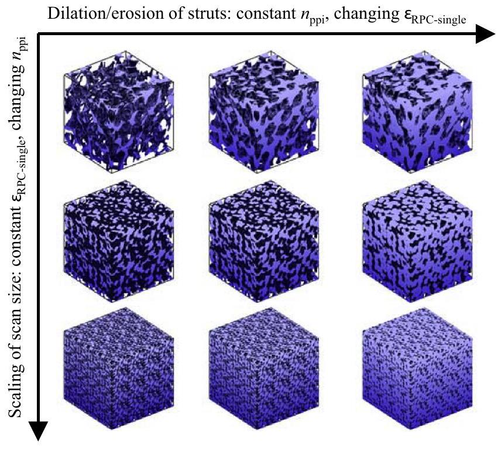
Fig. 3. 3D schematics of digitally engineered RPC structures with varying porosities and mean pore (mm-size) diameters using the top-left structure obtained by computed tomography.

Table 1
List of correlations for the morphological and effective heat/mass transport properties of the ceria RPC with dual-scale porosity.
| Value | Correlation | Units |
| :--- | :--- | :--- |
| Morphology |  |  |
| Porosity | $\varepsilon_{\text {RPC-dual }}=\varepsilon_{\text {RPC-single }}+\left(1-\varepsilon_{\text {RPC-single }}\right) \cdot \varepsilon_{\text {strut }}$ | [-] |
| Mean pore diameter | $d_{\mathrm{m}, \mathrm{RPC}}=\left(5.3022 \cdot 10^{-5} \cdot \varepsilon_{\mathrm{RPC} \text {-single }}+2.1549 \cdot 10^{-5}\right) \cdot \frac{357}{n_{\mathrm{ppi}}}$ | [m] |
| Specific surface area (relevant for convective heat and mass transport) | $A_{\mathrm{sf}}=\frac{n_{\mathrm{ppi}}}{357 \cdot\left(5.65595 \cdot 10^{-5} \cdot \varepsilon_{\mathrm{RPC} \text {-single }}^{2}-6.08569 \cdot 10^{-5} \cdot \varepsilon_{\mathrm{RPC} \text {-single }}+4.49806 \cdot 10^{-5}\right)}$ | $\left[\frac{\mathrm{m}^{2}}{\mathrm{~m}^{3}}\right]$ |
| Heat transport |  |  |
| Effective thermal conductivity [37] | $\begin{aligned} & \frac{k_{\text {eff }}}{k_{\mathrm{CeO}_{2}}}=0.6223 \cdot \varepsilon_{\text {RPC-dual }} \cdot \frac{\frac{k_{\mathrm{f}}}{k_{\mathrm{CeO}}}}{0.7015 \cdot \varepsilon_{\mathrm{RPC}-\text { dual }}+\frac{k_{\mathrm{C}}}{k_{\mathrm{CeO}}} \cdot\left(1-0.7015 \cdot \varepsilon_{\mathrm{RPC}-\text { dual }}\right)}+\left(1-0.6223 \cdot \varepsilon_{\mathrm{RPC}-\text { dual }}\right) \\ & \cdot\left(1.0548 \cdot \varepsilon_{\text {RPC-dual }} \cdot \frac{k_{\mathrm{f}}}{k_{\mathrm{CeO}}}+1-1.0548 \cdot \varepsilon_{\text {RPC-dual }}\right) \end{aligned}$ | $\left[\frac{\mathrm{W}}{\mathrm{m} \mathrm{K}}\right]$ |
| Heat transfer coefficient | $h_{\mathrm{sf}}=\frac{\mathrm{Nu} \cdot \mathrm{k}_{\mathrm{f}}}{\mathrm{d}_{\mathrm{m}, \mathrm{RPC}}}$ | $\left[\frac{\mathrm{w}}{\mathrm{m}^{2} \mathrm{~K}}\right]$ |
| Dimensionless numbers | $\begin{aligned} & \mathrm{Nu}=4.173+2.359 \cdot \varepsilon_{\mathrm{RPC}-\text { single }}+\left(0.3772 \cdot \varepsilon_{\mathrm{RPC}-\text { single }}^{2}-0.7479 \cdot \varepsilon_{\mathrm{RPC}-\text { single }}+0.4849\right) \\ & \quad \cdot \operatorname{Re}^{1.0953-0.2239 \cdot \varepsilon_{\mathrm{RPC}-\text { single }} \cdot \operatorname{Pr}^{0.671-0.0213 \cdot \varepsilon_{\mathrm{RPC} \text {-single }}}} \\ & \operatorname{Re}=\frac{\rho_{\mathrm{f}} \cdot u_{\mathrm{D}} \cdot d_{\mathrm{M} \cdot \mathrm{RPC}}}{\mu_{\mathrm{f}}} \\ & \operatorname{Pr}=\frac{c_{\mathrm{pf}} \cdot \mu_{\mathrm{f}}}{k_{\mathrm{f}}} \end{aligned}$ | [-] |
| Extinction coefficient | $\beta=\frac{-630.674 \cdot \varepsilon_{\mathrm{RPC} \text {-single }}^{2}-120.060 \cdot \varepsilon_{\mathrm{RPC} \text {-single }}+1229.36}{1000 \cdot d_{\mathrm{M} \text { RPC }}}$ | $\left[\frac{1}{m}\right]$ |
| Scattering phase function | $\Phi=0.63 \cdot \mu_{\mathrm{s}}^{2}-1.43 \cdot \mu_{\mathrm{s}}+0.79$ | [-] |
| Mass transport |  |  |
| Permeability | $K=\frac{\varepsilon_{\mathrm{RCP} \text {-single }}^{3.772}}{5.4685 \cdot A_{\mathrm{sf}}^{2}}$ | $\left[\mathrm{m}^{2}\right]$ |
| Dupuit-Forchheimer coefficient | $F_{\mathrm{D}}=\frac{1.46 \cdot 10^{-6} \cdot \frac{357}{n_{\mathrm{ppi}}}-1.198 \cdot 10^{-6}}{K^{1.0206}}$ | $\left[\frac{1}{\mathrm{~m}}\right]$ |
| $\mathrm{CeO}_{2}$ |  |  |
| Specific heat capacity [13] | $c_{\mathrm{p}, \mathrm{CeO}_{2}}=-0.000127069 \cdot T^{2}+0.2697656 \cdot T+299.8696 c_{\mathrm{p}, \mathrm{CeO} 2}=444.27$ for $T>1100 \mathrm{~K}$ | $\left[\frac{\mathrm{J}}{\mathrm{kg} \mathrm{K}}\right]$ |
| Thermal conductivity [57] | $k_{\mathrm{CeO}_{2}}=-1.7234232 \cdot 10^{-9} \cdot T^{3}+1.1203174 \cdot 10^{-5} \cdot T^{2}-0.024019964 \cdot T+17.800409$ | $\left[\frac{\mathrm{W}}{\mathrm{m} \mathrm{K}}\right]$ |
| Reduction enthalpy [13] | $-\Delta H_{\mathrm{O}_{2}, \text { mol }}=969.408715407529-503.738744939872 \cdot \delta^{0.5}$ | $\left[\frac{\mathrm{kJ}}{\mathrm{mol}}\right]$ |
| Equilibrium thermodynamics [15] | $\delta=10^{-\left(2.14591 \cdot 10^{-6} \cdot T^{2}-9.88196 \cdot 10^{-3} \cdot T+12.21108\right)} \cdot\left(\frac{p_{0_{2}}}{p_{0}}\right)^{1.25424 \cdot 10^{-7} \cdot T^{2}-3.09807 \cdot 10^{-4} \cdot T-1.83281 \cdot 10^{-2}}$ with $T$ in ${ }^{\circ} \mathrm{C}$ | [-] |
| Hemispherical total emittance [13,57] | $\varepsilon_{\text {emit }}=0.7$ | [-] |
| Total hemispherical reflectance for 5780 K [46] | $\left.r(\delta)\right\|_{5780 K}=\frac{0.315600}{\left(\delta+10^{-10}\right)^{0.032310}}-1.748573 \cdot \delta$ | [-] |
| Total hemispherical reflectance for 1773 K [46] | $\left.r(\delta)\right\|_{1773 K}=\frac{0.429261}{\left(\delta+10^{-10}\right)^{0.031266}}-3.106837 \cdot \delta$ | [-] |
| Binary gas diffusivity [58] | $\begin{aligned} & D_{\mathrm{ArO}_{2}}=-6.7617280958 \cdot 10^{-15} \cdot T^{3}+1.2229562900 \cdot 10^{-10} \cdot T^{2} \\ & \quad+4.8414771319 \cdot 10^{-8} \cdot T-6.2970340089 \cdot 10^{-6} \end{aligned}$ | $\left[\frac{\mathrm{m}^{2}}{\mathrm{~s}}\right]$ |

diameter of $10 \mu \mathrm{~m}$, which was shown to provide fully interconnected pore network and relatively high mass loading [37,11].

Governing conservation equations: A 1D volume-averaged heat and mass transfer model of the RPC was implemented in a commercial CFD software (ANSYS ${ }^{\circledR}$ Academic Research, release 15.0). The governing energy conservation equations of the solid and fluid phases were modelled separately on two spatially congruent cell zones. For the solid phase:

$$
\begin{aligned}
\frac{\partial}{\partial t}\left(\left(1-\varepsilon_{\text {RPC-dual }}\right)\left\langle\rho_{\mathrm{s}}\right\rangle\left\langle H_{\mathrm{s}}\right\rangle\right)= & \nabla \cdot\left(k_{\text {eff }} \nabla\left\langle T_{\mathrm{s}}\right\rangle\right)+S_{\text {radiative }} \\
& +\frac{r_{\mathrm{O}_{2}}(\Delta \delta) \Delta H_{\mathrm{O}_{2}}(\delta)}{M_{\mathrm{O}_{2}} V_{\text {cell }}}+h_{\mathrm{sf}} A_{\mathrm{sf}}\left(\left\langle T_{\mathrm{f}}\right\rangle-\left\langle T_{\mathrm{s}}\right\rangle\right)
\end{aligned}
$$

where $\rho_{\mathrm{s}}$ is the density of the solid, $H_{\mathrm{s}}$ is the enthalpy of the solid per unit mass, $k_{\text {eff }}$ is the effective thermal conductivity, $\delta$ is the oxygen nonstoichiometry of ceria, $r_{\mathrm{O}_{2}}(\Delta \delta)=f\left(\frac{\partial\left\langle p_{\mathrm{O}_{2}}\right\rangle}{\partial t}, \frac{\partial\left\langle T_{\mathrm{s}}\right\rangle}{\partial t}\right)$ is the oxygen mass release rate, $\Delta H_{\mathrm{O} 2}$ is the reaction enthalpy, $h_{\mathrm{sf}}$ is the interfacial heat transfer coefficient determined by DPLS, $A_{\mathrm{sf}}$ is the pore specific surface area for the mm-size pores, $M_{\mathrm{O} 2}$ the molar mass of oxygen, and $T_{\mathrm{s}}$ and $T_{\mathrm{f}}$ the temperatures of the solid and fluid domains, respectively. Eq. (3) contains the rate of enthalpy change, the conduction term, and three source terms for the spatially-dependent volumetric net radiative source $S_{\text {radiative }}$, the reaction enthalpy and the convective heat transfer between the solid and fluid domains. $S_{\text {radiative }}$ is found by solving the radiative heat transfer equation
along path $s$ for an absorbing, emitting, and anisotropically scattering medium:

$$
\mathbf{s} \cdot \nabla I(\mathbf{r}, \mathbf{s})+\beta I(\mathbf{r}, \mathbf{s})=\alpha I_{\mathrm{b}}(\mathbf{r})+\frac{\sigma}{4 \pi} \int_{0}^{4 \pi} I\left(\mathbf{r}, \mathbf{s}^{\prime}\right) \Phi\left(\mathbf{s}^{\prime}, \mathbf{s}\right) d \Omega^{\prime}
$$

where $I$ is the radiation intensity, $I_{\mathrm{b}}$ is the blackbody radiation intensity depending on the local temperature, $\mathbf{r}$ is the position vector, $\mathbf{s}$ is the direction vector, $\mathbf{s}^{\prime}$ is the scattering direction vector, $\beta$ the extinction coefficient, $\alpha$ is the absorption coefficient, $\sigma$ is the scattering coefficient, and $\Phi$ is the scattering phase function. In addition, $S_{\text {radiative }}$ accounts for the incident concentrated solar radiation ( $S_{\text {solar }}$ ) absorbed in each volumetric cell as it penetrates the RPC and undergoes attenuation. Thus, $S_{\text {radiative }}=S_{\text {solar }}+S_{\text {reradiation }}$ with $S_{\text {reradiation }}=\alpha\left(4 \pi I_{\mathrm{b}}-\int_{4 \pi} I \mathrm{~d} \Omega^{\prime}\right) . S_{\text {solar }}$ is determined as a function of the reflectivity (which in turn depends on $\delta$, see Table 1 [46]), $\varepsilon$ RPC-single, $d \mathrm{~m}$,RPC and the radiation penetration depth by applying an in-house Monte Carlo ray tracing code [47]. Refraction is neglected because the surface of the struts is assumed opaque. For the geometric optics regime, $\alpha=\beta \cdot(1-r)$ and $\sigma=\beta \cdot r$, where $\beta$ is determined by MC, and $r$ is the reflectivity of $\mathrm{CeO}_{2}$.

For the fluid phase:

$$
\begin{aligned}
& \frac{\partial}{\partial t}\left(\varepsilon_{\text {RPC-dual }}\left\langle\rho_{\mathrm{f}}\right\rangle\left\langle H_{\mathrm{f}}\right\rangle\right)+\nabla \cdot\left(\langle\mathbf{u}\rangle\left\langle\rho_{\mathrm{f}}\right\rangle\left\langle H_{\mathrm{f}}\right\rangle\right) \\
& \quad=\nabla \cdot\left(\varepsilon_{\text {RPC-dual }}\left\langle k_{\mathrm{f}}\right\rangle \nabla\left\langle T_{\mathrm{f}}\right\rangle\right)+h_{\mathrm{sf}} A_{\mathrm{sf}}\left(\left\langle T_{\mathrm{s}}\right\rangle-\left\langle T_{\mathrm{f}}\right\rangle\right)
\end{aligned}
$$

where $\rho_{\mathrm{f}}$ is the fluid density, $H_{\mathrm{f}}$ is the fluid enthalpy per unit mass and $k_{\mathrm{f}}$ is the fluid thermal conductivity for the mole-weighted
species composition of the fluid. Eq. (5) contains the rate of enthalpy change, the convection term, the conduction term, and the convective heat transfer between the solid and fluid domains. The fluid phase was modelled as a binary $\mathrm{O}_{2} / \mathrm{Ar}$ mixture, assumed a Newtonian incompressible ideal gas with $\rho_{\mathrm{f}} R_{\text {gas }} T_{\mathrm{f}}=p M$. Note that coupling between the fluid and solid domains is through the convective heat transfer term. Additionally for the fluid phase, the mass, momentum, and species conservation equations are given by:

$$
\begin{aligned}
& \frac{\partial \varepsilon_{\mathrm{RPC}-\text { dual }}\left\langle\rho_{\mathrm{f}}\right\rangle}{\partial t}+\nabla \cdot\left(\varepsilon_{\mathrm{RPC}-\text { dual }}\left\langle\rho_{\mathrm{f}}\right\rangle\langle\mathbf{u}\rangle\right)=\frac{r_{\mathrm{O}_{2}}(\Delta \delta)}{V_{\text {cell }}} \\
& \frac{\partial\left(\varepsilon_{\mathrm{RPC}-\text { dual }}\left\langle\rho_{\mathrm{f}}\right\rangle\left\langle Y_{\mathrm{O}_{2}}\right\rangle\right)}{\partial t}+\nabla \cdot\left(\varepsilon_{\mathrm{RPC}-\text { dual }}\langle\mathbf{u}\rangle\left\langle\rho_{\mathrm{f}}\right\rangle\left\langle Y_{\mathrm{O}_{2}}\right\rangle\right) \\
& \quad=\nabla \cdot\left(\varepsilon_{\mathrm{RPC}-\text { dual }} D_{\text {ArO }_{2}} \nabla\left(\left\langle\rho_{\mathrm{f}}\right\rangle\left\langle Y_{\mathrm{O}_{2}}\right\rangle\right)\right)+\frac{r_{\mathrm{O}_{2}}(\Delta \delta)}{V_{\text {cell }}} \\
& \frac{\partial}{\partial t}\left(\varepsilon_{\mathrm{RPC}-\text { dual }}\left\langle\rho_{\mathrm{f}}\right\rangle\langle\mathbf{u}\rangle\right)+\nabla \cdot\left(\varepsilon_{\mathrm{RPC}-\text { dual }}\left\langle\rho_{\mathrm{f}}\right\rangle\langle\mathbf{u}\rangle\langle\mathbf{u}\rangle\right)=-\nabla\langle p\rangle+S_{\mathrm{MD}}
\end{aligned}
$$

where $Y_{\mathrm{O} 2}$ is the mass fraction of $\mathrm{O}_{2}$ in Ar , and $D_{\text {ArO2 }}$ the binary gas diffusion coefficient. Eq. (6) contains the rate of mass change, the advection term, and the source term. Eq. (7) contains the rate of species change, the advection term, the diffusion term, and the source term accounting for the oxygen evolution. Eq. (8) contains the rate of momentum change, the advection term, the pressure drop term, and the source term accounting for the additional pressure drop induced by the porous solid phase, as described by Darcy's law:
$S_{\mathrm{MD}}=-\frac{\left\langle\mu_{\mathrm{f}}\right\rangle}{K}\langle\mathbf{u}\rangle-F_{\mathrm{D}}\left\langle\rho_{\mathrm{f}}\right\rangle\langle\mathbf{u}\rangle|\langle\mathbf{u}\rangle|$
where $K$ and $F_{\mathrm{D}}$ are the effective permeability and DupuitForchheimer coefficients, determined by DPLS.

Boundary conditions: Boundary conditions at the topside and backside are shown in Eqs. (10) and (11), respectively:
$\left.q_{\text {out }}^{\prime \prime}\right|_{z=0}=\left(1-\varepsilon_{\text {RPC-single }}\right) \varepsilon_{\text {emit }} \sigma_{\mathrm{S}}\left(T(0)^{4}-T_{\text {amb }}^{4}\right)+\left.\int_{0}^{4 \pi} I(\mathbf{r}, \mathbf{s}) \mathbf{s} \cdot \mathbf{n} d \Omega\right|_{\mathbf{s} \cdot \mathbf{n} \geqslant 0}$
$\left.q_{\text {out }}^{\prime \prime}\right|_{z=L}=\left(1-\varepsilon_{\text {RPC-single }}\right) \varepsilon_{\text {emit }} \sigma_{\mathrm{S}}\left(T(L)^{4}-T_{\text {amb }}^{4}\right)+\left.\int_{0}^{4 \pi} I(\mathbf{r}, \mathbf{s}) \mathbf{s} \cdot \mathbf{n} d \Omega\right|_{\mathbf{s} \cdot \mathbf{n} \geqslant 0}$
where $\varepsilon_{\text {emit }}$ is the total hemispherical emittance of ceria, $\sigma_{\mathrm{S}}$ the Stefan-Boltzmann constant and $T_{\text {amb }}$ the ambient temperature. Radiation leaving topside and backside boundary surfaces, either emitted from the solid fraction at the boundary surface (first term in the boundary conditions) or emitted and/or back-scattered from the inner domain (second term in the boundary conditions), is assumed lost to the environment. The lateral walls are adiabatic. The incident solar radiation, $I_{\text {solar }}=900 \mathrm{~kW} \mathrm{~m}^{-2}$, impinges at the topside and is attenuated as it travels along the $z$-direction. The inlet flow gas has a temperature of 300 K , an oxygen partial pressure of $2 \cdot 10^{-4} \mathrm{~atm}$, and a specific mass flow rate of $0.01183 \mathrm{~kg} \mathrm{~s}^{-1} \mathrm{m}^{-2}$. A grid refinement and time step sensitivity study verified independency of the grid and time resolution.

Effective heat and mass transport properties: Table 1 lists the empirical correlations for describing the morphological and effective heat/mass transport properties of the ceria RPC with dualscale porosity, as computed by DPLS on the digitally engineered 3D geometries based on the CT scan (see Fig. 3).

Conduction: The effective thermal conductivity is determined by solving Fourier's law at the pore scale within the solid and fluid phase by the finite volume (FV) technique [37,44,48-51]. Table 1 lists the effective thermal conductivity $k_{\text {eff }}$ as a function of the
dual-scale porosity $\varepsilon_{\text {RPC-dual }}$ and the fluid and solid thermal conductivities $k_{\mathrm{f}}$ and $k_{\mathrm{s}}\left(=k_{\text {CeO2 }}\right)$ [37]. For $\varepsilon_{\text {RPC-dual }}=\varepsilon_{\text {RPC-single }}, k_{\text {eff }}$ is for an RPC structure with single-scale porosity ( $\varepsilon_{\text {strut }}=0$ ).

Convection: The fluid flow across an RPC's duct geometry is solved at the pore scale by the FV technique [34,52,53]. Fig. 4a shows the flow streamlines across a RPC calculated by DPLS for $\varepsilon_{\text {RPC }}=0.459, \quad d_{\mathrm{m}, \text { RPC }}=1.64 \mathrm{~mm}, \quad \varepsilon_{\text {strut }}=0.3$ and $d_{\mathrm{m}, \text { strut }}=10 \mu \mathrm{~m}$, where the white color indicates the void spaces of the resolved mm -size pores and the grey color indicates the volume-averaged porous struts ( $\mu \mathrm{m}$-size pores not resolved). Less than $1 \%$ of the fluid mass flows through the porous struts. Fig. 4b shows the absolute pressure drop $\Delta p$ versus the mean strut pore diameter $d_{\mathrm{m}, \text { strut }}$ across a RPC with $\varepsilon_{\text {RPC-single }}=0.459$ and 0.823 . For $d_{\mathrm{m}, \text { strut }}$
a) Geometrically resolved mm -size pores

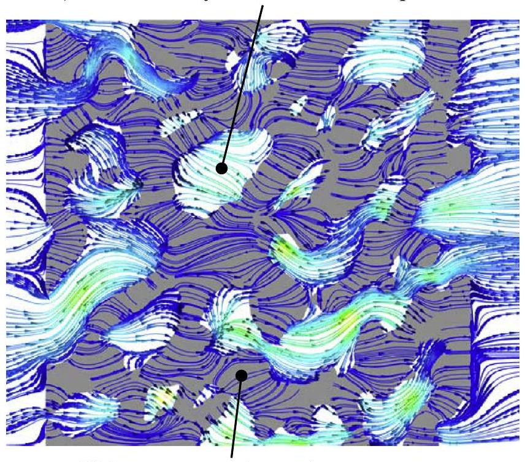
Volume-averaged $\mu \mathrm{m}$-size pores

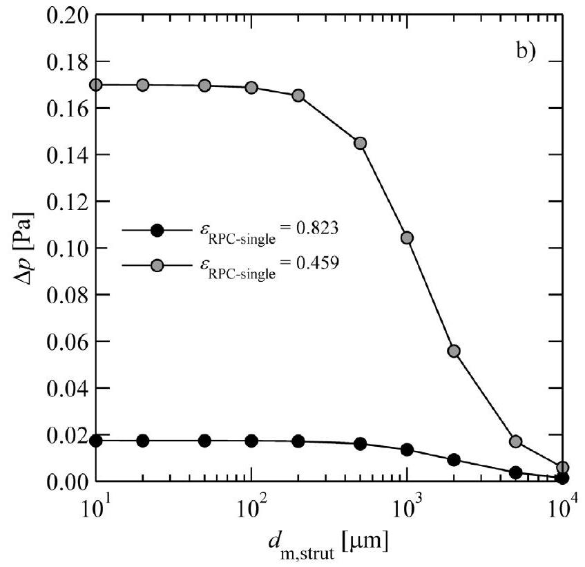
Fig. 4. a) Flow streamlines across a RPC with $\varepsilon_{\text {RPC-single }}=0.459, d_{\mathrm{m}, \mathrm{RPC}}=1.64 \mathrm{~mm}$ and $\varepsilon_{\text {strut }}=0.3, d_{\mathrm{m}, \text { strut }}=10 \mu \mathrm{~m}$. The white color indicates the void spaces of the resolved mm -size pores and grey color indicates the volume-averaged porous struts ( $\mu \mathrm{m}$-size pores not resolved). b) Absolute pressure drop as a function of $d_{\mathrm{m}, \text { strut }}$ across a RPCs with $\varepsilon_{\text {RPC-single }}=0.459$ and 0.823 .

$\leqslant 100 \mu \mathrm{~m}, \Delta p$ is unaffected as the flow bypasses the struts, regardless of $\varepsilon_{\text {RPC-single }}$. The same observation applies for the convective heat transferred from the solid to the fluid. Therefore, for structures with $d_{\mathrm{m}, \text { strut }} \approx 10 \mu \mathrm{~m}$ which are mainly relevant for this work, the strut pores do not affect the convective transport properties. Fig. 5a-c shows the Nusselt number as a function of Reynolds number, Prandtl number, and $\varepsilon_{\text {RPC-single }}$, the effective permeability $K$ as a function of $\varepsilon_{\text {RPC-single }}$ for a RPC with varying ppi, and the Dupuit-Forchheimer coefficient $F_{\mathrm{D}}$ as a function of $\varepsilon_{\mathrm{RPC} \text {-single }}$ for a RPC with varying $n_{\mathrm{ppi}}$. Table 1 lists the corresponding leastsquare fitted empirical correlations. Nu increases with Re, Pr, and decreasing $\varepsilon_{\text {RPC-single }} \cdot K$ increases with $\varepsilon_{\text {RPC-single }}$ and decreasing $n_{\text {ppi }}$, while the opposite is true for $F_{\mathrm{D}}$.

Radiation: The effective radiative heat transfer properties are computed by applying a collision-based Monte Carlo (MC) raytracing method at the pore level using an in-house Fortran code [54]. Fig. 6a shows $\beta$ as a function of $d_{\mathrm{m}, \mathrm{RPC}}$ for various $\varepsilon_{\mathrm{RPC} \text {-single }}$. The least-squared correlation is listed in Table 1. For the porous struts, $\beta_{\text {strut }} \sim 150,000 \mathrm{~m}^{-1}$. Because of the high optical thickness, the porous struts are assumed opaque. Fig. 6b shows $\Phi$ as a function of the cosine of the scattering angle, $\mu_{\mathrm{s}}$. A second order polynomial function is least-squared fitted to describe the anisotropic forward and backward scattering and $\Phi$ was practically independent of $\varepsilon_{\text {RPC-single }}$ or ppi. The least-squared correlation is listed in Table 1. The spectral reflectivity of ceria was measured as a function of its reduction extent in a spectroscopic goniometric system [55,56]. Correlations of the total hemispherical reflectance as a function of $\delta$, weighted according to Planck's law for blackbody temperatures of 5780 K (incident solar spectrum) and 1773 K (reduction temperature), are given in Table 1.

Equilibrium thermodynamics of ceria: Equilibrium composition is assumed, as justified by the fast intrinsic kinetics compared to transport phenomena observed in previous runs with RPC directly exposed to high-flux solar irradiation [7]. The equilibrium $\delta$ as a function of the temperature and oxygen partial pressure is listed Table 1, obtained by applying the oxygen defect model to thermogravimetric relaxation runs [19].

## 4. Experimental validation

Two RPC samples of $n_{\mathrm{ppi}}=10$ and 35 ppi underwent heating and thermal reduction by subjecting them to $I_{\text {solar }}=1200 \mathrm{~kW} \mathrm{~m}^{-2}$, an oxygen partial pressure of $2 \cdot 10^{-4} \mathrm{~atm}$, and a volumetric purge flow rate of $0.51 \mathrm{~min}^{-1}$. Fig. 7a and b shows the numerically calculated (curves) and the experimentally measured (markers) of the temporal variation of the front, bulk, and back temperatures and of the cumulative oxygen evolution during a representative run. For the
near front region, the simulation model agrees well with the temperature measurement. For the bulk and back side, the model initially under predicts the temperature measurements but matches well once steady state is achieved. The 35 ppi sample exhibits a higher temperature gradient than that of the 10 ppi sample because of the higher optical thickness of the structure. The model is able to predict well the measured oxygen evolution for both RPC samples, justifying the assumption of thermodynamic equilibrium. For $t<20 \mathrm{~s}$, the model predicts a slightly higher rate of the oxygen yield compared to the measurement, attributed to downstream dispersion until the detection unit.

## 5. Modelling results

A cubic RPC sample of $0.025 \times 0.025 \times 0.025 \times \mathrm{m}^{3}$, $\varepsilon_{\text {RPC-single }}=0.75$ and $d_{\mathrm{m}, \text { RPC }}=2.19 \mathrm{~mm}$ is considered. Fig. 8a-d shows the profiles of the fluid and solid temperatures, the intensity of the internal radiative flux integrated over the solid angles, the nonstoichiometry, and the oxygen partial pressure $p_{\mathrm{O} 2}$ along the sample depth at various times. Initially, the topside temperature near the irradiated front surface increases to 1500 K in the first 10 s while the backside remains cool. After 150 s, the temperature profile reaches approximate steady state with a maximum of 1850 K around 0.004 m from the top and 1050 K at the backside (Fig. 8a). Such large temperature gradients are the result of the emitted and back-scattered radiation being lost at the boundaries. The solution of the flux intensity conservation equation integrated over the solid angles is shown in Fig. 8b. As expected, the integrated intensity field strongly correlates to the solid temperature and peaks at $2.7 \cdot 10^{6} \mathrm{~W} \mathrm{~m}^{-2}$. Radiation penetration and volumetric absorption is confirmed. As for the reduction extent, $\delta$ achieves 0.039 towards the irradiated front while at the backside the structure remains unreacted. $p_{\mathrm{O} 2}$ peaks at 0.047 atm after $t=25 \mathrm{~s}$ and decreases as the temperature approaches steady state.

In a further step, the heating rate and thermal reduction of RPC samples of different $n_{\mathrm{ppi}}$ was investigated by keeping the mass constant, i.e. volume and porosity constant at $0.025 \times 0.025 \times 0.025 \mathrm{~m}^{3}$ and 0.75 , respectively. Additionally, a structure was investigated with large pores ( $d_{\mathrm{m}, \mathrm{RPC}}=2.2 \mathrm{~mm}$ ) for the front side half and small pores ( $d_{\mathrm{m}, \mathrm{RPC}}=0.6 \mathrm{~mm}$ ) for the backside half of the structure. The morphological information of the RPC is listed in Table 2a.

Fig. 9a and b shows the temporal temperature and cumulative oxygen evolution $m_{\mathrm{O} 2}$. The volume-averaged and backside temperatures increase with $d_{\mathrm{m}, \mathrm{RPC}}$ for all times. In contrast, the front side temperature and the temperature gradients decrease with $d_{\mathrm{m}, \mathrm{RPC}}$ because of the decreasing optical thickness. For $t>100 \mathrm{~s}$, the struc-

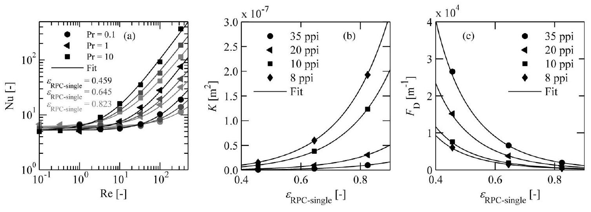
Fig. 5. a) Nu as a function of Re for various Pr and $\varepsilon_{\mathrm{RPC} \text {-single }}$; b) Permeability as a function of $\varepsilon_{\mathrm{RPC} \text {-single }}$ for a RPC with varying ppi: c) Dupuit-Forchheimer coefficient as a function of $\varepsilon_{\text {RPC-single }}$ for a RPC with varying $n_{\text {ppi }}$.

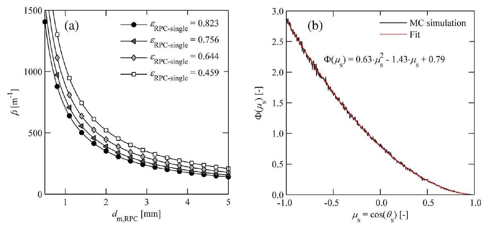
Fig. 6. a) Effective extinction coefficient, $\beta$, as a function of the mean pore diameter for several porosities; b) scattering phase function as a function of the cosine of the scattering angle.

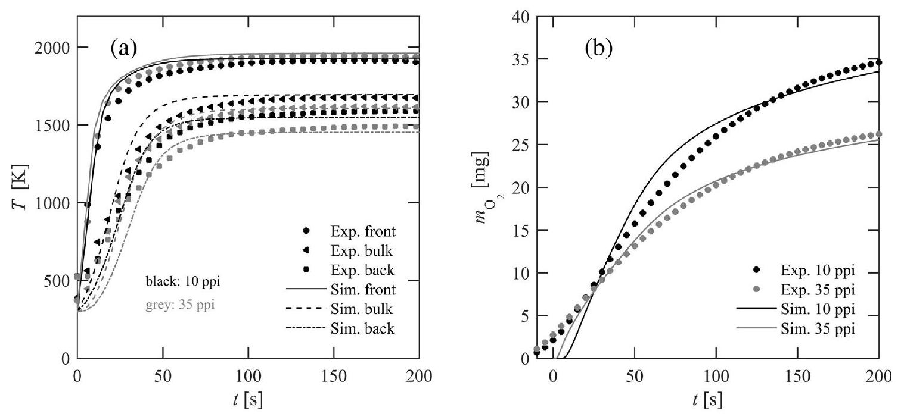
Fig. 7. Numerically calculated (curves) and the experimentally measured (markers) of the temporal variation of: $a$ ) the front, bulk, and back temperatures; and b) the cumulative oxygen evolution during a representative run with two RPC samples of 10 and 35 ppi .

ture with two different mean pore size regions achieves the highest volume-averaged temperature because of the improved volumetric absorption at the front side half and the lower radiation losses at the backside due to the smaller pores which serve as radiation shield and thermal insulator. Initially ( $t<50 \mathrm{~s}$ ), the RPC sample with the smaller $d_{\mathrm{m}, \mathrm{RPC}}$ shows a slightly higher $m_{\mathrm{O} 2}$ because of overheating of the irradiated near front region, as shown in Fig. 9b. For $t>50 \mathrm{~s}, m_{\mathrm{O} 2}$ increases with increasing pore size and peaks for $d_{\mathrm{m}, \mathrm{RPC}}=2.2 \mathrm{~mm}$. As expected, $m_{\mathrm{O} 2}$ for the structure with two different pore size regions is significantly higher than that for the mono$d_{\mathrm{m}, \mathrm{RPC}}$ structures because of the superior volumetric absorption and lower radiation losses at the backside.

In a next step, the heating and reduction behaviour of RPC with different porosities was investigated by keeping volume and $n_{\text {ppi }}$ constant at $0.025 \times 0.025 \times 0.025 \mathrm{~m}^{3}$ and 10 , respectively. Additionally, a structure was investigated with two different porosity zones: the front side half with $\varepsilon_{\text {RPC-single }}=0.75$ while the backside half with $\varepsilon_{\text {RPC-single }}=0.6$. The morphological information of the RPC is listed in Table 2b. Fig. 10a and b shows the temporal temperature and $m_{\mathrm{O} 2}$. The volume-averaged, front side and backside
temperatures increase with $\varepsilon_{\text {RPC-single }}$ for all times. In contrast, the temperature gradients decrease with $\varepsilon_{\text {RPC-single }}$ because of lower specific mass and slightly decreasing optical thickness. Initially, $m_{\mathrm{O} 2}$ increases with $\varepsilon_{\text {RPC-single }}$, but decreases for $t>50 \mathrm{~s}$ because of the higher ceria mass densities. For the structure with two porosity regions, the volume-averaged, front side and backside temperatures are between those of the structure with $\varepsilon_{\text {RPC-single }}=0.6$ and $\varepsilon_{\text {RPC-single }}=0.75$ for all times because the optical thickness changed only slightly.

Performance: The performance of various RPC samples was characterised by calculating the solar-to-fuel energy conversion efficiency $\eta$ as defined:

$$
\eta(t)=\frac{Q_{\mathrm{CO}}(t)}{Q_{\text {solar }}(t)}=\frac{2 \cdot H V_{\mathrm{CO}} \cdot \int_{0}^{t} \int_{V} r_{\mathrm{O}_{2}}(z, t) d V d t}{I_{\text {solar }} \cdot t \cdot A_{\text {domain }}}
$$

where $Q_{\mathrm{CO}}$ is the heating value of the CO that would be produced by assuming complete oxidation of the reduced ceria by $\mathrm{CO}_{2}, Q_{\text {solar }}$ the cumulative incident solar radiation, $H V_{\mathrm{CO}}$ the specific heating value of CO and $A_{\text {domain }}$ the irradiated domain area. Fig. 11a and b show $\eta$

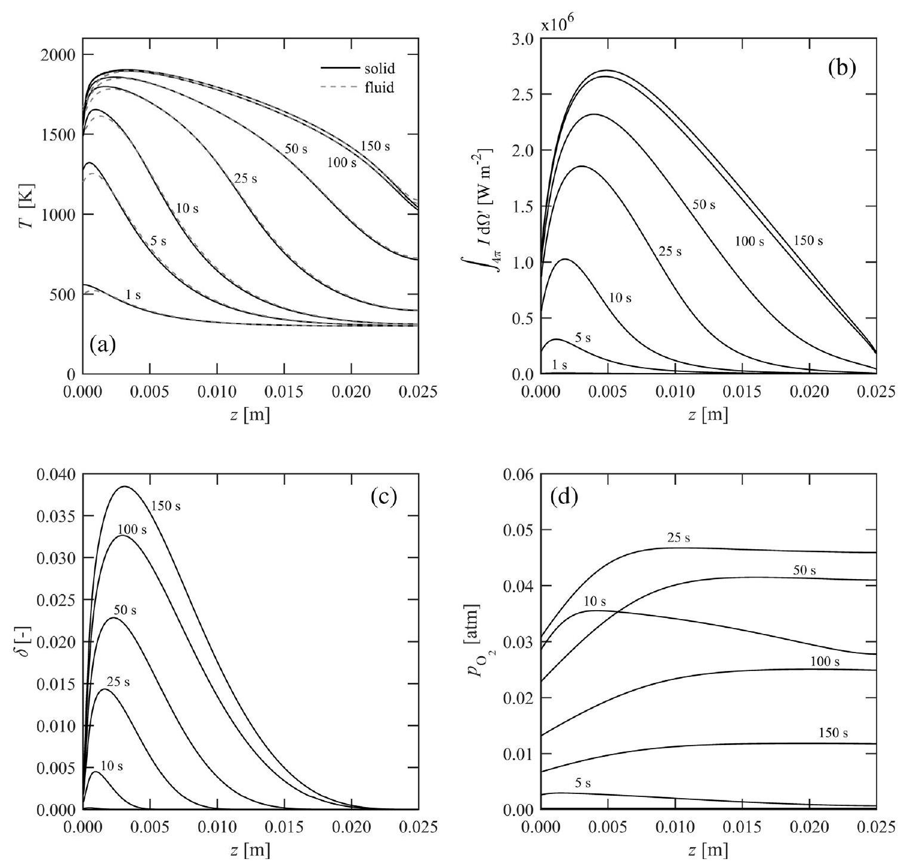
Fig. 8. Profiles along the sample depth at various times for: a) fluid and solid temperatures; b) internal re-radiation intensity; c) nonstoichiometry; and d) oxygen partial pressure in the purge flow.

Table 2
Morphological information of RPC samples with: a) varying $n_{\text {ppi }}$ and constant $\varepsilon_{\text {RPC-single }}$; b) varying $\varepsilon_{\text {RPC-single }}$ and constant $n_{\text {ppi }}$.
| $n_{\text {ppi }}$ [ppi] | 35 |  | 20 |  | 10 |  | 8 | 35/10 |
| :--- | :--- | :--- | :--- | :--- | :--- | :--- | :--- | :--- |
| (a) |  |  |  |  |  |  |  |  |
| $d_{\mathrm{m}, \mathrm{RPC}}[\mathrm{mm}]$ | 0.6 |  | 1.1 |  | 2.2 |  | 2.7 | 0.6/2.2 |
| $\varepsilon_{\text {RPC-single }}[-]$ | 0.75 |  | 0.75 |  | 0.75 |  | 0.75 | 0.75 |
| $\varepsilon_{\text {strut }}$ [-] | 0.3 |  | 0.3 |  | 0.3 |  | 0.3 | 0.3 |
| $n_{\text {ppi }}$ [ppi] |  | 10 |  | 10 |  | 10 |  | 10 |
| (b) |  |  |  |  |  |  |  |  |
| $d_{\mathrm{m}, \mathrm{RPC}}[\mathrm{mm}]$ |  | 1.9 |  | 2.2 |  | 2.5 |  | 1.9/2.2 |
| $\varepsilon_{\text {RPC-single }}[-]$ |  | 0.6 |  | 0.75 |  | 0.9 |  | 0.6/0.75 |
| $\varepsilon_{\text {strut }}[-]$ |  | 0.3 |  | 0.3 |  | 0.3 |  | 0.3 |

as a function of time for the RPC samples of Table 2a and b, respectively. For all cases, $\eta$ increases with time, peaks, and decreases once the reduction approaches completion. For the RPC samples of varying $d_{\mathrm{m}, \mathrm{RPC}}$ and constant $\varepsilon_{\mathrm{RPC} \text {-single }}, \eta$ peaks at earlier times for samples with smaller $d_{\mathrm{m}, \mathrm{RPC}}$ or smaller $\varepsilon_{\mathrm{RPC} \text {-single }}$ because of higher radiation losses at the overheated front region. For $t>40 \mathrm{~s}$, the structure with the two pore size regions ( $d_{\mathrm{m}, \mathrm{RPC}}=0.6 / 2.2 \mathrm{~mm}$ ) leads to higher $\eta$, as expected from $m_{\mathrm{O} 2}$ shown in Fig. 9b. In contrast, a lower $\eta$ is observed for the RPC consisting of two porosity
zones ( $\varepsilon_{\text {RPC-single }}=0.6 / 0.75$ ) because of the relatively lower temperatures of the backside zone and higher radiation losses from the front side zone.

The time when the $\eta$ peaks is critical. Afterwards, the reduction approaches completion and the evolution of additional oxygen decreases significantly, even though $I_{\text {solar }}$ is maintained constant. Thus, for maximizing $\eta$, reduction should be stopped after $\eta$ peaks. Fig. 12 shows the peak $\eta$ as a function of $d_{\mathrm{m}, \mathrm{RPC}}$ for various $\varepsilon_{\text {RPC-single }}$. For $\varepsilon_{\text {RPC-single }}=0.75$, the peak $\eta$ increases from $0.6 \%$ for

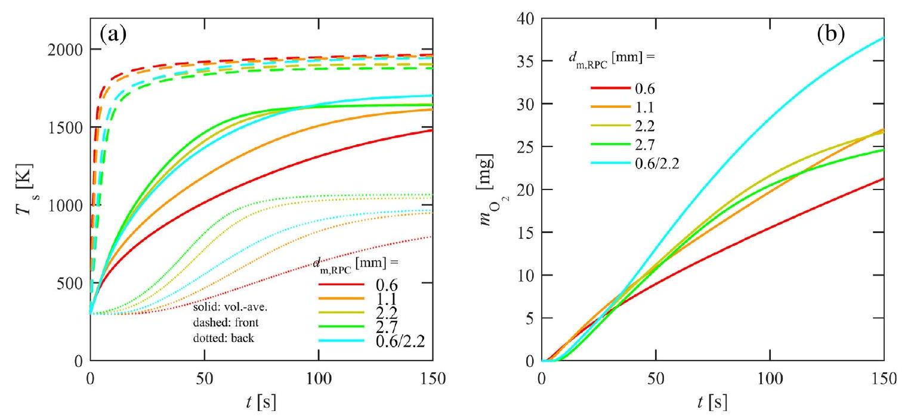
Fig. 9. Profiles as a function of time for various $d_{\mathrm{m}, \mathrm{RPC}}$ for: a) volume-averaged, front side and backside temperature; and b) cumulative oxygen yield.

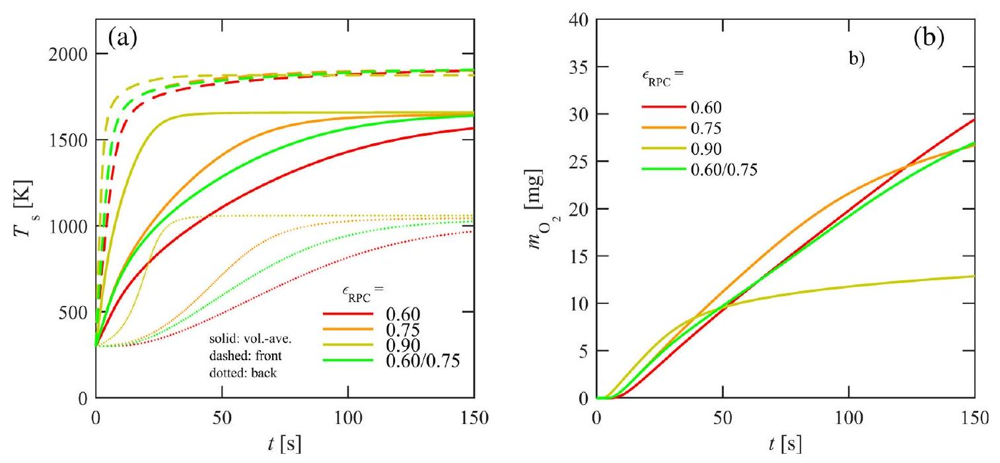
Fig. 10. Profiles as a function of time for various $\varepsilon_{\mathrm{RPC}-\text { single }}$ for: a ) volume-averaged, front side and backside temperature; and b) cumulative oxygen yield.

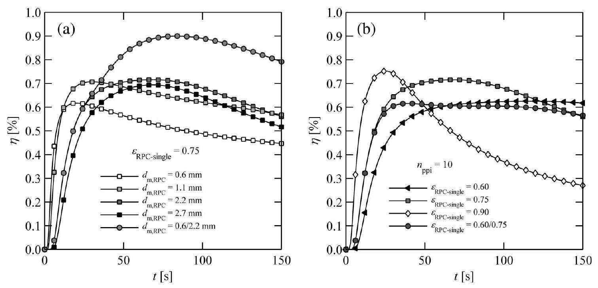
Fig. 11. Solar-to-fuel energy conversion efficiency as a function of time for RPC samples with: a) varying $d_{\mathrm{m}, \mathrm{RPC}}$ and constant $\varepsilon_{\mathrm{RPC}}$-single $=0.75$ (see Table 2 a ); and b ) varying $\varepsilon_{\text {RPC-single }}$ and constant $n_{\text {ppi }}=10$ (see Table 2b).

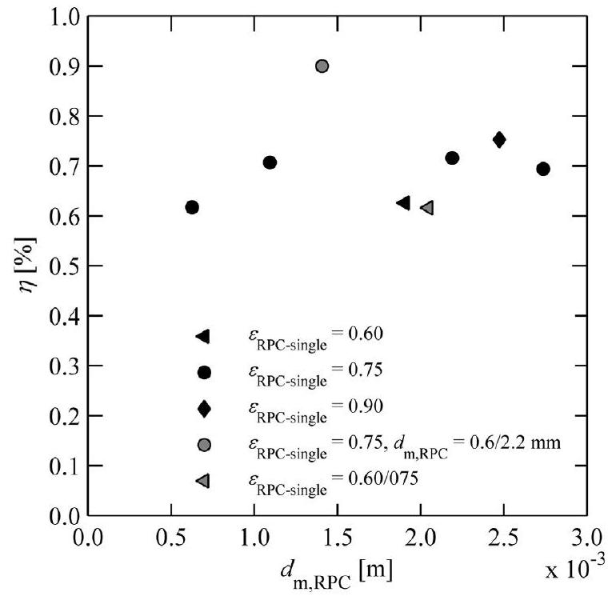
Fig. 12. Peak solar-to-fuel energy conversion efficiency as a function of the mean pore diameter for various porosities (morphological information see Table 2 a and b ).

$d_{\mathrm{m}, \mathrm{RPC}}=0.6 \mathrm{~mm}$ to $0.7 \%$ for $d_{\mathrm{m}, \mathrm{RPC}}=2.2 \mathrm{~mm}$ and slightly decreased for $d_{\mathrm{m}, \mathrm{RPC}}=2.7 \mathrm{~mm}$. The RPC with the two different pore size regions reached the highest peak $\eta$ of $0.9 \%$ due to the reduced radiation losses at the backside, consistent with $m_{\mathrm{O} 2}$ shown in Fig. 9b.

## 6. Summary and conclusions

A transient heat and mass transfer model was implemented to characterise the thermochemical reduction of RPC structures made of ceria with dual-scale porosity exposed to concentrated radiation. The numerical model was validated with measured data of temperatures and $\mathrm{O}_{2}$ evolution obtained in experiments using a high-flux solar simulator. RPC samples with a wide range of porosities and mean pore diameters were investigated, as these two morphological properties determine the optical thickness and, consequently, the capability of the RPC structure to absorb radiation efficiently and volumetrically, leading to a more uniform heating across the structure and to higher oxygen yield. A porosity of 0.75 and pore size of 2.2 mm exhibited a good trade-off between high specific mass, moderate optical thickness, and permeability and thus, showed the largest specific oxygen yield per ceria mass. RPC structure with two pore size regions, namely with large pores $\left(d_{\mathrm{m}, \mathrm{RPC}}=2.2 \mathrm{~mm}\right)$ for the front side half and small pores ( $d_{\mathrm{m}, \mathrm{RPC}}=0.6 \mathrm{~mm}$ ) for the backside half, reached the highest solar-to-fuel energy conversion efficiency. The results obtained in this study guide the design of the RPC structures for their use in a solar chemical reactor [6-8].

## Acknowledgements

We gratefully acknowledge the financial support by the European Union under the 7th Framework Program (Project SFERA II - No. 312643) and the European Research Council under the ERC Advanced Grant (Project SUNFUELS - No. 320541).

## References

[1] M. Romero, A. Steinfeld, Concentrating solar thermal power and thermochemical fuels, Energy Environ. Sci. 5 (11) (2012) 9234-9245.
[2] S. Abanades, G. Flamant, Thermochemical hydrogen production from a twostep solar-driven water-splitting cycle based on cerium oxides, Sol. Energy 80 (12) (2006) 1611-1623.
[3] W.C. Chueh, S.M. Haile, Ceria as a thermochemical reaction medium for selectively generating syngas or methane from $\mathrm{H}_{2} \mathrm{O}$ and $\mathrm{CO}_{2}$, ChemSusChem 2 (8) (2009) 735-739.
[4] C. Perkins, A.W. Weimer, Solar-thermal production of renewable hydrogen, AlChE J. 55 (2) (2009) 286-293.
[5] W.C. Chueh, C. Falter, M. Abbott, D. Scipio, P. Furler, S.M. Haile, A. Steinfeld, High-flux solar-driven thermochemical dissociation of $\mathrm{CO}_{2}$ and $\mathrm{h}_{2} \mathrm{O}$ using nonstoichiometric ceria, Science 330 (6012) (2010) 1797-1801.
[6] Q.-L. Meng, C.-I. Lee, T. Ishihara, H. Kaneko, Y. Tamaura, Reactivity of $\mathrm{CeO}_{2-}$ based ceramics for solar hydrogen production via a two-step water-splitting cycle with concentrated solar energy, Int. J. Hydrogen Energy 36 (21) (2011) 13435-13441.
[7] P. Furler, J. Scheffe, M. Gorbar, L. Moes, U. Vogt, A. Steinfeld, Solar thermochemical $\mathrm{CO}_{2}$ splitting utilizing a reticulated porous ceria redox system, Energy Fuels 26 (11) (2012) 7051-7059.
[8] G.P. Smestad, A. Steinfeld, Review: photochemical and thermochemical production of solar fuels from $\mathrm{H}_{2} \mathrm{O}$ and $\mathrm{CO}_{2}$ using metal oxide catalysts, Ind. Eng. Chem. Res. 51 (37) (2012) 11828-11840.
[9] R. Bader, L.J. Venstrom, J.H. Davidson, W. Lipiński, Thermodynamic analysis of isothermal redox cycling of ceria for solar fuel production, Energy Fuels 27 (9) (2013) 5533-5544;
Q.-L. Meng, C.-I. Lee, T. Ishihara, H. Kaneko, Y. Tamaura, Reactivity of $\mathrm{CeO}_{2}-$ based ceramics for solar hydrogen production via a two-step water-splitting cycle with concentrated solar energy, Int. J. Hydrogen Energy 36 (21) (2011) 13435-13441.
[10] I. Ermanoski, N.P. Siegel, E.B. Stechel, A new reactor concept for efficient solarthermochemical fuel production, J. Sol. Energy Eng. 135 (3) (2013), 031002031002.
[11] P. Furler, J. Scheffe, D. Marxer, M. Gorbar, A. Bonk, U. Vogt, A. Steinfeld, Thermochemical $\mathrm{CO}_{2}$ splitting via redox cycling of ceria reticulated foam structures with dual-scale porosities, Phys. Chem. Chem. Phys. 16 (2014) 10503-10511.
[12] J.E. Miller, A.H. McDaniel, M.D. Allendorf, Considerations in the design of materials for solar-driven fuel production using metal-oxide thermochemical cycles, Adv. Energy Mater. 4 (2) (2014), 1300469-1300469-1300419.
[13] P. Furler, A. Steinfeld, Heat transfer and fluid flow analysis of a 4 kW solar thermochemical reactor for ceria redox cycling, Chem. Eng. Sci. 137 (2015) 373-383.
[14] D. Marxer, P. Furler, J. Scheffe, H. Geerlings, C. Falter, V. Batteiger, A. Sizmann, A. Steinfeld, Demonstration of the entire production chain to renewable kerosene via solar thermochemical splitting of $\mathrm{H}_{2} \mathrm{O}$ and $\mathrm{CO}_{2}$, Energy Fuels 29 (5) (2015) 3241-3250.
[15] R.J. Panlener, R.N. Blumenthal, J.E. Garnier, A thermodynamic study of nonstoichiometric cerium dioxide, J. Phys. Chem. Solids 36 (11) (1975) 1213-1222.
[16] W.C. Chueh, S.M. Haile, A thermochemical study of ceria: exploiting an old material for new modes of energy conversion and $\mathrm{CO}_{2}$ mitigation, Phil. Trans. R. Soc. A 368 (1923) (2010) 3269-3294.
[17] J.R. Scheffe, A. Steinfeld, Thermodynamic analysis of cerium-based oxides for solar thermochemical fuel production, Energy Fuels 26 (3) (2012) 1928-1936.
[18] J.R. Scheffe, R. Jacot, G.R. Patzke, A. Steinfeld, Synthesis, characterization, and thermochemical redox performance of $\mathrm{Hf} 4+$, $\mathrm{Zr} 4+$, and $\mathrm{Sc} 3+$ doped ceria for splitting $\mathrm{CO}_{2}$, J. Phys. Chem. C 117 (46) (2013) 24104-24114.
[19] M. Takacs, J. Scheffe, A. Steinfeld, Oxygen nonstoichiometry and thermodynamic characterization of Zr doped ceria in the 1573-1773 K temperature range, Phys. Chem. Chem. Phys. 17 (12) (2015) 7813-7822.
[20] V. Esposito, D.W. Ni, Z. He, W. Zhang, A.S. Prasad, J.A. Glasscock, C. Chatzichristodoulou, S. Ramousse, A. Kaiser, Enhanced mass diffusion phenomena in highly defective doped ceria, Acta Mater. 61 (16) (2013) 6290-6300.
[21] S. Ackermann, J.R. Scheffe, A. Steinfeld, Diffusion of oxygen in ceria at elevated temperatures and its application to $\mathrm{H}_{2} \mathrm{O} / \mathrm{CO}_{2}$ splitting thermochemical redox cycles, J. Phys. Chem. C 118 (10) (2014) 5216-5225.
[22] N. Knoblauch, L. Dörrer, P. Fielitz, M. Schmuecker, G. Borchardt, Surface controlled reduction kinetics of nominally undoped polycrystalline $\mathrm{CeO}_{2}$, Phys. Chem. Chem. Phys. 17 (8) (2015) 5849-5860.
[23] S. Abanades, A. Legal, A. Cordier, G. Peraudeau, G. Flamant, A. Julbe, Investigation of reactive cerium-based oxides for $\mathrm{H}_{2}$ production by thermochemical two-step water-splitting, J. Mater. Sci. 45 (15) (2010) 41634173.
[24] N.D. Petkovich, S.G. Rudisill, L.J. Venstrom, D.B. Boman, J.H. Davidson, A. Stein, Control of heterogeneity in nanostructured $\mathrm{Ce}_{1-\mathrm{x}} \mathrm{Zr}_{\mathrm{x}} \mathrm{O}_{2}$ binary oxides for enhanced thermal stability and water splitting activity, J. Phys. Chem. C 115 (43) (2011) 21022-21033.
[25] L.J. Venstrom, N. Petkovich, S. Rudisill, A. Stein, J.H. Davidson, The effects of morphology on the oxidation of ceria by water and carbon dioxide, J. Sol. Energy Eng. 134 (1) (2012) 011005.
[26] Y. Hao, C.-K. Yang, S.M. Haile, Ceria-zirconia solid solutions (Ce1-xZrxO2- $\delta$, x $\leqslant 0.2$ ) for solar thermochemical water splitting: a thermodynamic study, Chem. Mater. 26 (20) (2014) 6073-6082.
[27] S. Ackermann, L. Sauvin, R. Castiglioni, J.L.M. Rupp, J.R. Scheffe, A. Steinfeld, Kinetics of $\mathrm{CO}_{2}$ reduction over nonstoichiometric ceria, J. Phys. Chem. C 119 (29) (2015) 16452-16461.
[28] T. Fend, B. Hoffschmidt, R. Pitz-Paal, O. Reutter, P. Rietbrock, Porous materials as open volumetric solar receivers: experimental determination of thermophysical and heat transfer properties, Energy 29 (5-6) (2004) 823-833.
[29] D.J. Keene, J.H. Davidson, W. Lipiński, A model of transient heat and mass transfer in a heterogeneous medium of ceria undergoing nonstoichiometric reduction, J. Heat Transfer 135 (5) (2013), 052701-052701.
[30] D.J. Keene, W. Lipiński, J.H. Davidson, The effects of morphology on the thermal reduction of nonstoichiometric ceria, Chem. Eng. Sci. 111 (2014) 231-243.
[31] S. Krishnan, J.Y. Murthy, S.V. Garimella, Direct simulation of transport in opencell metal foam, J. Heat Transfer 128 (8) (2006) 793-799.
[32] K.K. Bodla, J.Y. Murthy, S.V. Garimella, Microtomography-based simulation of transport through open-cell metal foams, Numer. Heat Transfer Part A 58 (7) (2010) 527-544.
[33] S. Haussener, P. Coray, W. Lipinski, P. Wyss, A. Steinfeld, Tomography-based heat and mass transfer characterization of reticulate porous ceramics for hightemperature processing, J. Heat Transfer 132 (2010), 023305-023301.
[34] S. Haussener, I. Jerjen, P. Wyss, A. Steinfeld, Tomography-based determination of effective transport properties for reacting porous media, ASME Conf. Proc. 2010 (49415) (2010) 883-892.
[35] S. Haussener, A. Steinfeld, Effective heat and mass transport properties of anisotropic porous ceria for solar thermochemical fuel generation, Materials 5 (1) (2012) 192-209.
[36] H. Friess, S. Haussener, A. Steinfeld, J. Petrasch, Tetrahedral mesh generation based on space indicator functions, Int. J. Numer. Meth. Eng. 93 (10) (2013) 1040-1056.
[37] S. Ackermann, J.R. Scheffe, J. Duss, A. Steinfeld, Morphological characterization and effective thermal conductivity of dual-scale reticulated porous structures, Materials 7 (11) (2014) 7173-7195.
[38] J. Bear, J.M. Buchlin, Modelling and Applications of Transport Phenomena in Porous Media, Kluwer Academic Publishers, Dordrecht, Netherlands, 1991.
[39] M. Kaviany, Principles of Heat Transfer in Porous Media, second ed., SpringerVerlag, New York, 1995.
[40] S. Whitaker, The Method of Volume Averaging, Kluwer Academic, Dordrecht, 1999.
[41] F.P. Incropera, D.P. DeWitt, Fundamentals of Heat and Mass Transfer, fifth ed., J. Wiley, New York, 2002.
[42] K.K. Bodla, J.A. Weibel, S.V. Garimella, Advances in fluid and thermal transport property analysis and design of sintered porous wick microstructures, J. Heat Transfer 135 (6) (2013) 061202.
[43] D. Hirsch, P.V. Zedtwitz, T. Osinga, J. Kinamore, A. Steinfeld, A new 75 kW High-flux solar simulator for high-temperature thermal and thermochemical research, J. Sol. Energy Eng. 125 (1) (2003) 117-120.
[44] J. Petrasch, P. Wyss, R. Stämpfli, A. Steinfeld, Tomography-based multiscale analyses of the 3D geometrical morphology of reticulated porous ceramics, J. Am. Ceram. Soc. 91 (8) (2008) 2659-2665.
[45] S. Suter, A. Steinfeld, S. Haussener, Pore-level engineering of macroporous media for increased performance of solar-driven thermochemical fuel processing, Int. J. Heat Mass Transfer 78 (2014) 688-698.
[46] S. Ackermann, A. Steinfeld, Spectral hemispherical reflectivity of nonstoichiometric cerium dioxide, Sol. Energy Mater. Sol. Cells 159 (2017) 167-171.
[47] J. Petrasch, A Free and Open Source Monte Carlo Ray Tracing Program for Concentrating Solar Energy Research, in: ASME 2010 4th International Conference on Energy Sustainability, American Society of Mechanical Engineers, 2010, pp. 125-132.
[48] A. Bhattacharya, V.V. Calmidi, R.L. Mahajan, An analytical-experimental study for the determination of the effective thermal conductivity of high porosity fibrous foams, ASME Appl. Mech. Div. 233 (1999) 13-20.
[49] K. Boomsma, D. Poulikakos, On the effective thermal conductivity of a threedimensionally structured fluid-saturated metal foam, Int. J. Heat Mass Transfer 44 (4) (2001) 827-836.
[50] R. Coquard, M. Loretz, D. Baillis, Conductive heat transfer in metallic/ceramic open-cell foams, Adv. Eng. Mater. 10 (4) (2008) 323-337.
[51] J. Petrasch, B. Schrader, P. Wyss, A. Steinfeld, Tomography-based determination of the effective thermal conductivity of fluid-saturated reticulate porous ceramics, ASME J. Heat Transfer 130 (2008), 032602-032601.
[52] J. Petrasch, F. Meier, H. Friess, A. Steinfeld, Tomography based determination of permeability, Dupuit-forchheimer coefficient, and interfacial heat transfer coefficient in reticulate porous ceramics, Int. J. Heat Mass Transfer 29 (1) (2008) 12.
[53] E. Zermatten, S. Haussener, M. Schneebeli, A. Steinfeld, Tomography-based determination of permeability and DupuitForchheimer coefficient of characteristic snow samples, J. Glaciol. 57 (205) (2011) 811-816.
[54] J. Petrasch, P. Wyss, A. Steinfeld, Tomography-based Monte Carlo determination of radiative properties of reticulate porous ceramics, J. Quant. Spectrosc. Radiat. Transfer 105 (2) (2007) 180-197.
[55] P. Coray, W. Lipiński, A. Steinfeld, Spectroscopic goniometry system for determining thermal radiative properties of participating media, Exp. Heat Transfer 24 (4) (2011) 300-312.
[56] P. Good, T. Cooper, M. Querci, N. Wiik, G. Ambrosetti, A. Steinfeld, Spectral reflectance, transmittance, and angular scattering of materials for solar concentrators, Sol. Energy Mater. Sol. Cells 144 (2016) 509-522.
[57] Y.S. Touloukian, Thermophysical Properties of High Temperature Solid Materials, Macmillan, New York, 1967.
[58] T. Marrero, E.A. Mason, Gaseous diffusion coefficients, J. Phys. Chem. Ref. Data 1 (1) (1972) 3-118.

[^0]:    * Corresponding author.

    E-mail address: aldo.steinfeld@ethz.ch (A. Steinfeld).

