# Experimental determination of the Onsager coefficients of transport for $\mathrm{Ce}_{0.8} \mathrm{Pr}_{0.2} \mathrm{O}_{2-\delta}$ 

Christodoulos Chatzichristodoulou, ${ }^{\boldsymbol{*} \boldsymbol{a b}}$ Woo-Seok Park, ${ }^{\boldsymbol{c}}$ Hong-Seok Kim, ${ }^{\boldsymbol{c}}$ Peter Vang Hendriksen ${ }^{\boldsymbol{a}}$ and Han-Ill Yoo ${ }^{\boldsymbol{c}}$

Received 13th January 2010, Accepted 21st April 2010
DOI: 10.1039/c000865f

#### Abstract

For a mixed oxide-ion and electron conducting oxide, with oxygen vacancies ( $\mathrm{V}_{\mathrm{O}}^{\bullet \bullet}$ ) and electrons (e') or holes ( $\mathrm{h}^{\bullet}$ ) as charge carriers, a flux of ( $\mathrm{V}_{\mathrm{O}}^{\bullet \bullet}$ ) ( $J_{i}$ ) can in principle be driven, not only directly by its own electrochemical potential gradient ( $\nabla \eta_{i}$ ), but also indirectly by that of electrons ( $\nabla \eta_{e}$ ), and vice versa for the flux of electrons $\left(J_{e}\right)$. It is common practice to assume that electrons and mobile ions migrate independently, despite the lack of experimental evidence in support of this. Here, all the Onsager coefficients, including the cross coefficients, have been measured for $\mathrm{Ce}_{0.8} \mathrm{Pr}_{0.2} \mathrm{O}_{2-\delta}$ within the $a_{\mathrm{O}_{2}}$ range $10^{-21}-1$ at $800{ }^{\circ} \mathrm{C}$, using local ionic and electronic probes in a four-probe configuration. The cross coefficients of transport were found to be negligible in comparison to the direct coefficients in the $a_{\mathrm{O}_{2}}$ range $10^{-21}-10^{-4}$, but of the same order of magnitude as the direct coefficients for high $a_{\mathrm{O}_{2}}$ values $\left(10^{-2}-1\right)$. This is in contrast to the commonly used assumption that the two types of carriers migrate independently, i.e. that $L_{i e}=0$.

## Introduction

According to linear transport theory, ${ }^{1-3}$ in a mixed conductor with practically immobile cations, the ionic and electronic flows may interfere with each other, i.e. a flow of mobile anions can cause an electronic flow and vice versa. Early efforts to verify this effect yielded negative results, ${ }^{4-7}$ leading to the long standing belief of independent migration of the ionic and electronic flows, expressed in Kohlrausch’s law. ${ }^{8}$

Recently, Han-Ill Yoo and co-workers succeeded in designing a variety of appropriate experiments ${ }^{9}$ in order to directly measure all the Onsager coefficients for $\mathrm{Co}_{1-\delta} \mathrm{O},{ }^{10-12} \mathrm{Fe}_{3-\delta} \mathrm{O}_{4}{ }^{13}$ and $\mathrm{TiO}_{2-\delta} .{ }^{14,15}$ They demonstrated that Kohlrausch's law of independent migration is the exception, the rule being that the interference effect is non-negligible and in many cases even larger than the direct effect, depending on the state of the oxide. Furthermore, the Onsager reciprocity relation ${ }^{16}$ was verified for $\mathrm{TiO}_{2-\delta}$ with very high precision. ${ }^{14}$

The interference effect was recently measured for $\mathrm{CeO}_{2-\delta}$ and was found to be significant, ${ }^{17}$ and to increase with increasing oxygen nonstoichiometry (concentration of electronic charge carriers). Although a fundamental physical understanding of the interference effect is still lacking, a correlation has been observed with the nonstoichiometry and the exponents $N_{\sigma}$ and $N_{\delta}$ of the $\sigma_{e} \propto a_{\mathrm{O}_{2}}^{N_{\sigma}}$ and $\delta \propto a_{\mathrm{O}_{2}}^{N_{\delta}}$ relationships. ${ }^{18,19}$ It is therefore interesting to investigate the interference effect in Pr-doped ceria, which shows varying oxygen nonstoichiometry

[^0]in the high $P_{\mathrm{O}_{2}}$ range, due to reduction of $\operatorname{Pr}^{4+}$ to $\operatorname{Pr}^{3+}$, followed by varying oxygen nonstoichiometry at much lower $P_{\mathrm{O}_{2}}$, due to reduction of $\mathrm{Ce}^{4+}$ to $\mathrm{Ce}^{3+} \cdot{ }^{20,21}$

## Theoretical background

Formal treatment of mixed ionic electronic conduction in the presence of the cross effect has been given elsewhere. ${ }^{14,22}$ Briefly, let us consider the mixed oxide ion and electron conducting compound $\mathrm{Ce}_{1-x} \mathrm{Re}_{x} \mathrm{O}_{2-\delta}$, where the cations are practically immobile. The charge carriers are oxygen vacancies $\left(\mathrm{V}_{\mathrm{O}}^{\bullet \bullet}\right)$, with a formal charge of +2 , and electrons ( $\mathrm{e}^{\prime}$ ) or holes ( $\mathrm{h}^{\bullet}$ ), with a formal charge of -1 and +1 , respectively. Letting the subscript $i$ and $e$ denote the ionic and electronic charge carriers, their fluxes, $J_{k}(k=i, e)$, relative to the cation sub-lattice (Hittorf frame of reference), may be written:

$$
\binom{J_{i}}{J_{e}}=-\left(\begin{array}{cc}
L_{i i} & L_{i e} \\
L_{e i} & L_{e e}
\end{array}\right)\binom{\nabla \eta_{i}}{\nabla \eta_{e}}
$$

where $\nabla \eta_{k}$ denotes the gradient of the electrochemical potential of the $k$-type charge carriers and $L_{k l}(k, l=i, e)$ are the phenomenological transport coefficients (Onsager coefficients), satisfying the Onsager reciprocity relation: ${ }^{16}$

$$
L_{i e}=L_{e i}
$$

As a measure of the interference effect, the ionic and electronic charges of transport are defined as:

$$
\begin{aligned}
& a_{i}^{*}=\left(\frac{J_{e}}{J_{i}}\right)_{\nabla \eta_{e}=0}=\frac{L_{e i}}{L_{i i}} \\
& a_{e}^{*}=\left(\frac{J_{i}}{J_{e}}\right)_{\nabla \eta_{i}=0}=\frac{L_{i e}}{L_{e e}}
\end{aligned}
$$

Phenomenologically, $a_{i}^{*}$ corresponds to the number of electrons dragged by an oxygen vacancy in the absence of the direct cause for an electronic flow ( $\nabla \eta_{e}=0$ ), and vice versa for $a_{e}^{*}$. The charges of transport are subject to the constraint: ${ }^{23}$

$$
a_{i}^{*} \cdot a_{e}^{*}=\frac{L_{i e}^{2}}{L_{i i} L_{e e}}<1
$$

Due to the local ionization equilibrium $\mathrm{V}_{O}^{\bullet \bullet}+O+2 e^{\prime} \leftrightarrow O_{O}^{x}$ :

$$
\eta_{i}=\mu_{O_{O}^{x}}-\mu_{O}-2 \eta_{e} ; \nabla \eta_{i} \approx-\nabla \mu_{O}-2 \nabla \eta_{e}
$$

with the understanding that $\nabla \mu_{O_{O}^{x}} \approx 0$ for the regular structure element $O_{O}^{x}$. The validity of this assumption is discussed in detail in the results section. Using eqn (6), the fluxes can be expressed as a function of $\nabla \mu_{O}$ and $\nabla \eta_{e}$ :

$$
J_{i}=L_{i i} \nabla \mu_{O}+L_{i i}\left(2-a_{i}^{*}\right) \nabla \eta_{e}
$$

$$
J_{e}=L_{i e} \nabla \mu_{O}-L_{e e}\left(1-2 a_{e}^{*}\right) \nabla \eta_{e}
$$

The total current through the mixed conductor is:

$$
i=i_{i}+i_{e}=2 F J_{i}-F J_{e}
$$

where $F$ is Faraday's constant. The total conductivity, in the presence of the interference effect, should therefore be:

$$
\sigma \equiv\left(\frac{i}{\nabla \eta_{e / F}}\right)_{\nabla \mu_{O}=0}=F^{2}\left(2\left(2-a_{i}^{*}\right) L_{i i}+\left(1-2 a_{e}^{*}\right) L_{e e}\right)
$$

The ionic and electronic transference numbers read:

$$
\begin{aligned}
& t_{i}=\left(\frac{i_{i}}{i}\right)_{\nabla \mu_{O}=0}=\frac{2\left(2-a_{i}^{*}\right)^{L_{i i}} / L_{e e}}{1-2 a_{e}^{*}+2\left(2-a_{i}^{*}\right)^{L_{i i}} / L_{e e}} \\
& t_{e}=\left(\frac{i_{e}}{i}\right)_{\nabla \mu_{O}=0}=\frac{1-2 a_{e}^{*}}{1-2 a_{e}^{*}+2\left(2-a_{i}^{*}\right)^{L_{i i}} / L_{e e}}
\end{aligned}
$$

The partial conductivities are therefore:

$$
\begin{gathered}
\sigma_{i} \equiv t_{i} \sigma=2\left(2-a_{i}^{*}\right) F^{2} L_{i i} \\
\sigma_{e} \equiv t_{e} \sigma=\left(1-2 a_{e}^{*}\right) F^{2} L_{e e}
\end{gathered}
$$

In a Hebb-Wagner polarisation experiment, one measures the ionic and electronic conductivities with suppressed transfer of electronic or ionic charge carriers respectively:

$$
\begin{gathered}
\sigma_{i}^{\prime} \equiv\left(\frac{i}{-\nabla \eta_{i} / 2 F}\right)_{J_{e}=0}=4 F^{2}\left(1-a_{i}^{*} a_{e}^{*}\right) L_{i i} \\
\sigma_{e}^{\prime} \equiv\left(\frac{i}{\nabla \eta_{e / F}}\right)_{J_{i}=0}=F^{2}\left(1-a_{i}^{*} a_{e}^{*}\right) L_{e e}
\end{gathered}
$$

It is stressed that these quantities are measured in the steady state, where a stationary gradient of the component chemical
potential is established ( $\nabla \mu_{O} \neq 0$ ), in contrast to the partial conductivities $\sigma_{i}$ and $\sigma_{e}$, defined in eqn (13) and (14), respectively. The following expressions are valid when steady state is reached in the electronic or ionic blocking mode, respectively:

$$
\left(\frac{\nabla \eta_{e}}{\nabla \eta_{i}}\right)_{J_{e}=0}=-a_{e}^{*}
$$

$$
\left(\frac{\nabla \eta_{i}}{\nabla \eta_{e}}\right)_{J_{i}=0}=-a_{i}^{*}
$$

In electrochemical experiments, the electrochemical potential differences $\left(\Delta \eta_{k}\right)$ and the partial currents $\left(i_{k}\right)$ are measurable and/or controllable. These quantities can be expressed in terms of the total current $i$ and the component chemical potential gradient, $\nabla \mu_{O}$, using eqn (6)-(12), as:

$$
\nabla \eta_{i}=-\frac{2 F i}{\sigma}-t_{e} \nabla \mu_{O}
$$

$$
\nabla \eta_{e}=\frac{F i}{\sigma}-\frac{t_{i}}{2} \nabla \mu_{O}
$$

$$
\frac{i_{i}}{2 F}=J_{i}=\frac{t_{i} i}{2 F}+L_{i i}\left(1-t_{i}^{*}\right) \nabla \mu_{O}
$$

$$
-\frac{i_{e}}{F}=J_{e}=-\frac{t_{e} i}{F}+\frac{L_{e e}\left(1-t_{e}^{*}\right)}{2} \nabla \mu_{O}
$$

where the modified transference numbers, $t_{i}^{*}$ and $t_{e}^{*}$, are defined as:

$$
\begin{aligned}
& t_{i}^{*} \equiv\left(1-\frac{a_{i}^{*}}{2}\right) t_{i} \\
& t_{e}^{*} \equiv\left(1-2 a_{e}^{*}\right) t_{e}
\end{aligned}
$$

It is common practice to assume that the interference effect is negligible. When estimating the partial ionic or electronic conductivity under suppressed electronic or ionic flow respectively, one measures the quantities as given in eqn (15) and (16). These are significantly different from the partial conductivities as defined from eqn (13) and (14) when the interference effect is not negligible. The relative difference reads:

$$
\frac{\sigma_{k}^{\prime}-\sigma_{k}}{\sigma_{k}}=\frac{z_{l} a_{k}^{*}}{z_{k}}
$$

where $z_{i}=2-a_{i}^{*}$ and $z_{e}=1-2 a_{e}^{*}$. This relation provides a direct measure of the relative error in the determination of the partial conductivity estimated by a Hebb-Wagner polarisation experiment under the assumption of negligible interference.

## Ambipolar diffusion

When a dense specimen of a mixed oxide ionic and electronic conducting material is placed in a component chemical potential
gradient, $\nabla \mu_{O}$, ambipolar permeation ( $i=0 ; J_{i}=J_{e} / 2$ ) will be observed. It can be shown, by setting $i=0$ in eqn (21) or (22), that in the presence of the interference effect, the oxygen flux, $J_{\mathrm{O}_{2}}=J_{i} / 2$, is given from:

$$
\begin{aligned}
J_{\mathrm{O}_{2}} & =\frac{R T}{16 L} \int_{\ln P_{\mathrm{O}_{2}}^{\prime}}^{\ln P_{\mathrm{O}_{2}}^{\prime \prime}} L_{e e}\left(1-t_{e}^{*}\right) \mathrm{d} \ln P_{\mathrm{O}_{2}} \\
& =\frac{R T}{4 L} \int_{\ln P_{\mathrm{O}_{2}}^{\prime}}^{\ln P_{\mathrm{O}_{2}}^{\prime \prime}} L_{i i}\left(1-t_{i}^{*}\right) \mathrm{d} \ln P_{\mathrm{O}_{2}}
\end{aligned}
$$

where $L$ is the thickness of the specimen, and $P_{\mathrm{O}_{2}}^{\prime}, P_{\mathrm{O}_{2}}^{\prime \prime}$ are the oxygen partial pressures prevailing at each side of the specimen. Combining eqn (20) and (11), the open-circuit voltage across the permeating specimen, at steady state, will be:

$$
\begin{aligned}
V & \equiv-\int_{0}^{L} \frac{\nabla \eta_{e}}{F} \mathrm{~d} x \\
& =R T \int_{\ln P_{\mathrm{O}_{2}}^{\prime}}^{\ln P_{\mathrm{O}_{2}}^{\prime \prime}} \frac{2\left(2-a_{i}^{*}\right)^{L_{i i}} / L_{e e}}{1-2 a_{e}^{*}+2\left(2-a_{i}^{*}\right)^{L_{i i}} / L_{e e}} \mathrm{~d} \ln P_{\mathrm{O}_{2}}
\end{aligned}
$$

## Transient response to a Hebb-Wagner polarisation/relaxation in the presence of the interference effect in pure or acceptor doped $\mathrm{CeO}_{2-\delta}$

The chemical diffusion coefficient of oxygen in the sample, taking into account the interference effect, may be deduced from the transients observed when switching on and off the current in the cell. In the following the expressions used in the data analysis of the transients are presented.

When a current is applied to a Hebb-Wagner cell, in ion- or electron-blocking conditions, a chemical potential of ions (or electrons, respectively) is progressively developed, that counteracts the electrical driving force for transport of ions (or electrons). The ionic (or electronic) current progressively decreases and is completely blocked when steady state is reached, at which point sufficient chemical polarisation (ionic or electronic, respectively) is established across the sample, to exactly counterbalance the electrical driving force and the driving force due to interference. This is illustrated in Fig. 3 and 4 (processes $1,3,5$ and 7). When turning off the current, after reaching steady state, the sample relaxes from the established chemical polarisation towards equilibrium by means of ambipolar diffusion (processes 2, 4, 6 and 8 in Fig. 3 and 4).

Analytical solutions to both the polarisation and relaxation transient processes in (i) potentiostatic ion-blocking, (ii) potentiostatic electron-blocking, (iii) galvanostatic ion-blocking, and (iv) galvanostatic electron-blocking conditions, have been found in the presence of non negligible interference, for a small perturbation of the system from equilibrium. ${ }^{24}$ A short description of the problem is given here, along with the analytical solutions of interest in the particular case of pure or acceptor doped ceria. These expressions are used to fit the transient response of the electrochemical cell, in order to
determine the chemical diffusion coefficient of oxygen in $\mathrm{Ce}_{0.8} \mathrm{Pr}_{0.2} \mathrm{O}_{2-\delta}$.

Using the charge neutrality condition and the continuity equation, $\partial c_{k} / \partial t=-\nabla J_{k}$, under the assumption that the charge carriers are conserved, one obtains:

$$
2 \nabla J_{i}-\nabla J_{e}=0
$$

Substituting the fluxes from eqn (7) and (8) and using eqn (11), eqn (28) becomes:

$$
\nabla^{2} \eta_{e}=-\frac{t_{i}}{2} \nabla^{2} \mu_{O}
$$

The perturbation of the system ( $\nabla \eta_{e}$ and $\nabla \mu_{O}$ ) has been assumed sufficiently small, so as to treat the Onsager coefficients as constants. Substituting eqn (7) into the continuity equation and using eqn (29) leads to the diffusion equation:

$$
\frac{\partial \mu_{O}}{\partial t}=\tilde{D} \nabla^{2} \mu_{O}
$$

where $\tilde{D}$ is the chemical diffusion coefficient in the presence of the interference effect: ${ }^{25}$

$$
\begin{aligned}
\tilde{D} & =L_{i i}\left(1-t_{i}^{*}\right)\left(\frac{\partial c_{V}}{\partial \mu_{O}}\right)^{-1} \\
& =\frac{L_{e e}\left(1-t_{e}^{*}\right)}{4}\left(\frac{\partial c_{V}}{\partial \mu_{O}}\right)^{-1}
\end{aligned}
$$

$c_{V}$ being the molar concentration of oxygen vacancies. Eqn (30) has earlier been solved in closed form for ion- or electron-blocking symmetric cells (with blocking electrodes at both sides of the sample) under either potentiostatic or galvanostatic polarisation/relaxation. ${ }^{24}$ In the present work, the polarisation/relaxation experiments were performed in the galvanostatic mode, using a current density $i_{0}=I_{0} / A$, where $I_{0}$ is the magnitude of the constant current applied and $A$ the cross section of the sample.

The initial condition for a polarisation process is, in any case, a uniform chemical potential distribution:

$$
\mu_{O}=\mu_{O}^{*} \text { at } 0 \leq x \leq L, t=0
$$

In the ion-blocking mode the boundary conditions for a polarisation process are:

$$
J_{i}(x, t)=0 \text { at } x=0, L
$$

whereas for a polarisation process in the electronblocking mode:

$$
J_{e}(x, t)=0 \text { at } x=0, L
$$

The solution to the polarisation problem of a symmetric ionblocking cell in the galvanostatic mode (processes 1 and 3 in Fig. 3a and 4a) is: ${ }^{24}$

$$
\mu_{O}(\xi, \omega)=\mu_{O}^{*}-\left(2-a_{i}^{*}\right) \frac{F L i_{0}}{\sigma_{e}^{\prime}} \Psi(\xi, \omega)
$$

where $\xi$ and $\omega$ are the reduced length and time respectively:

$$
\xi \equiv \frac{x}{L}, \omega \equiv \frac{\pi^{2} \tilde{D} t}{L^{2}}
$$

and

$$
\begin{gathered}
\Psi(\xi, \omega) \equiv \xi-\frac{1}{2}+\Theta(\xi, \omega) \\
\Theta(\xi, \omega)=\frac{4}{\pi^{2}} \sum_{n=1}^{\infty} \frac{1}{(2 n-1)^{2}} \\
\times \cos ((2 n-1) \pi \xi) \exp \left(-(2 n-1)^{2} \omega\right)
\end{gathered}
$$

Knowing the solution for the chemical potential of oxygen, the solutions for the difference in the electrochemical potential of oxygen vacancies and electrons between positions $x_{1}$ and $x_{2}$ in the sample can be estimated, using eqn (19) and (20):

$$
\begin{aligned}
\eta_{i}\left(\xi_{1}, \omega\right)-\eta_{i}\left(\xi_{2}, \omega\right) & =\frac{2 F L i_{0}}{\sigma_{e}^{\prime}}\left\{\left(\frac{\left(2-a_{i}^{*}\right)}{2}-t_{i}^{*}\right)\right. \\
& \left.\times\left(\Psi\left(\xi_{1}, \omega\right)-\Psi\left(\xi_{2}, \omega\right)\right)-\left(1-t_{i}^{*}\right)\left(\xi_{1}-\xi_{2}\right)\right\}
\end{aligned}
$$

$$
\begin{aligned}
\eta_{e}\left(\xi_{1}, \omega\right)-\eta_{e}\left(\xi_{2}, \omega\right)= & \frac{F L i_{0}}{\sigma_{e}^{\prime}}\left\{t_{i}^{*}\left(\Psi\left(\xi_{1}, \omega\right)-\Psi\left(\xi_{2}, \omega\right)\right)\right. \\
& \left.+\left(1-t_{i}^{*}\right)\left(\xi_{1}-\xi_{2}\right)\right\}
\end{aligned}
$$

These expressions are used to fit the ion-blocking polarisation transient response (processes 1 and 3 in Fig. 3a and 4a) of the difference in the electrochemical potential of oxygen vacancies and electrons between positions $x_{1}$ and $x_{2}$ in the sample (signals $V_{i}$ and $V_{e}$ that are discussed later), in order to determine the chemical diffusion coefficient, $\tilde{D}$. The first 50 terms of the sum in eqn (38) were taken into account in the fitting expression at each case.

The steady state distribution $\mu_{O}(x, t \rightarrow \infty)$ resulting from the polarisation process, serves as the initial condition for the relaxation process. The boundary conditions for the relaxation process are:

$$
i(x, t)=0 \text { at } x=0, L
$$

since the circuit is now open and no net current is running through the cell. The solution to the galvanostatic relaxation process of a symmetric ion-blocking cell (processes 2 and 4 in Fig. 3a and 4a) is: ${ }^{24}$

$$
\mu_{O}(\xi, \omega)=\mu_{O}^{*}+\left(2-a_{i}^{*}\right) \frac{F L i_{0}}{\sigma_{e}^{\prime}} \Theta(\xi, \omega)
$$

The solution to the transient response of the difference in the electrochemical potential of oxygen vacancies and electrons between positions $x_{1}$ and $x_{2}$ in the sample, is now given from:

$$
\begin{aligned}
\eta_{i}\left(\xi_{1}, \omega\right)-\eta_{i}\left(\xi_{2}, \omega\right)= & -\frac{2 F L i_{0}}{\sigma_{e}^{\prime}}\left(\frac{\left(2-a_{i}^{*}\right)}{2}-t_{i}^{*}\right) \\
\times & \left(\Theta\left(\xi_{1}, \omega\right)-\Theta\left(\xi_{2}, \omega\right)\right) \\
\eta_{e}\left(\xi_{1}, \omega\right)-\eta_{e}\left(\xi_{2}, \omega\right)= & -\frac{F L i_{0}}{\sigma_{e}^{\prime}} t_{i}^{*}\left(\Theta\left(\xi_{1}, \omega\right)\right. \\
& \left.-\Theta\left(\xi_{2}, \omega\right)\right)
\end{aligned}
$$

These expressions are used to fit the relaxation transient response of signals $V_{i}$ and $V_{e}$ (see Table 1) after chemical

Table 1 Measured signals and adopted symbolism
| Signals |  |
| :--- | :--- |
| $U_{1}$ | $\left(\eta_{e}^{1^{\prime}}-\eta_{e}^{1}\right) / F$ |
| $U_{2}$ | $\left(\eta_{e}^{2^{\prime}}-\eta_{e}^{2}\right) / F$ |
| $V_{0}$ | $\left(\eta_{e}^{2}-\eta_{e}^{1}\right) / F$ |
| $V_{e}$ | ( $\left.\eta_{e}^{3 R}-\eta_{e}^{3 R^{\prime}}\right) / F$ |
| $V_{i}$ | $\left(\eta_{e}^{4 R}-\eta_{e}^{4 R^{\prime}}\right) / F=\left(\eta_{i}^{4 R^{\prime}}-\eta_{i}^{4 R}\right) / 2 F$ |
| $M_{1}$ | ( $\left.\eta_{e}^{4 R}-\eta_{e}^{3 R}\right) / F$ |
| $M_{2}$ | $\left(\eta_{e}^{4 R^{\prime}}-\eta_{e}^{3 R^{\prime}}\right) / F$ |
| $M_{G}$ | $\left(\eta_{e}^{4 R^{\prime}}-\eta_{e}^{4 G}\right) / F$ |

polarisation of the cell under ion-blocking conditions (processes 2 and 4 in Fig. 3a and 4a).

The solution to the galvanostatic polarisation process of a symmetric electron-blocking cell (with electron-blocking electrodes at both sides of the sample) (processes 5 and 7 in Fig. 3b and 4b) is: ${ }^{24}$

$$
\mu_{O}(\xi, \omega)=\mu_{O}^{*}+2\left(1-2 a_{e}^{*}\right) \frac{F L i_{0}}{\sigma_{i}^{\prime}} \Psi(\xi, \omega)
$$

The solution to the transient response of $\Delta \eta_{i}$ and $\Delta \eta_{e}$ between positions $x_{1}$ and $x_{2}$ in the sample is:

$$
\begin{aligned}
\eta_{i}\left(\xi_{1}, \omega\right)-\eta_{i}\left(\xi_{2}, \omega\right)= & -\frac{2 F L i_{0}}{\sigma_{i}^{\prime}}\left\{t _ { e } ^ { * } \left(\Psi\left(\xi_{1}, \omega\right)\right.\right. \\
& \left.\left.-\Psi\left(\xi_{2}, \omega\right)\right)+\left(1-t_{e}^{*}\right)\left(\xi_{1}-\xi_{2}\right)\right\}
\end{aligned}
$$

$$
\begin{aligned}
\eta_{e}\left(\xi_{1}, \omega\right)-\eta_{e}\left(\xi_{2}, \omega\right)= & -\frac{F L i_{0}}{\sigma_{i}^{\prime}}\left\{( 1 - 2 a _ { e } ^ { * } - t _ { e } ^ { * } ) \left(\Psi\left(\xi_{1}, \omega\right)\right.\right. \\
& \left.\left.-\Psi\left(\xi_{2}, \omega\right)\right)-\left(1-t_{e}^{*}\right)\left(\xi_{1}-\xi_{2}\right)\right\}
\end{aligned}
$$

These expressions are used to fit the electron-blocking polarisation transient response (processes 5 and 7 in Fig. 3b and 4b) of $\Delta \eta_{i}$ and $\Delta \eta_{e}$ between positions $x_{1}$ and $x_{2}$ in the sample (signals $V_{i}$ and $V_{e}$ ).

Finally, the solution to the galvanostatic relaxation process of a symmetric electron-blocking cell (processes 6 and 8 in Fig. 3b and 4b) is: ${ }^{24}$

$$
\mu_{O}(\xi, \omega)=\mu_{O}^{*}-2\left(1-2 a_{e}^{*}\right) \frac{F L i_{0}}{\sigma_{i}^{\prime}} \Theta(\xi, \omega)
$$

and the solution to the transient response of $\Delta \eta_{i}$ and $\Delta \eta_{e}$ between positions $x_{1}$ and $x_{2}$ is:

$$
\begin{aligned}
\eta_{i}\left(\xi_{1}, \omega\right)-\eta_{i}\left(\xi_{2}, \omega\right)= & \frac{2 F L i_{0}}{\sigma_{i}^{\prime}} t_{e}^{*} \\
& \times\left(\Theta\left(\xi_{1}, \omega\right)-\Theta\left(\xi_{2}, \omega\right)\right) \\
\eta_{e}\left(\xi_{1}, \omega\right)-\eta_{e}\left(\xi_{2}, \omega\right)= & \frac{F L i_{0}}{\sigma_{i}^{\prime}}\left(1-2 a_{e}^{*}-t_{e}^{*}\right) \\
& \times\left(\Theta\left(\xi_{1}, \omega\right)-\Theta\left(\xi_{2}, \omega\right)\right)
\end{aligned}
$$

These expressions are used to fit the relaxation transient response of signals $V_{i}$ and $V_{e}$ after chemical polarisation of
the cell under electron-blocking conditions (processes 6 and 8 in Fig. 3b and 4b).

## Relationships among transport parameters in the presence of interference

A relation can be obtained between the chemical diffusion coefficient, $\tilde{D}$ and the ionic conductivity under suppressed transfer of electrons, $\sigma_{i}^{\prime}$, by substituting eqn (11), (15) and (23) into eqn (31) and using the relation $\partial \mu_{O} / \partial c_{V}=-R T \gamma_{V} / c_{V}$, where $\gamma_{V}=0.5 \partial \ln P_{\mathrm{O}_{2}} / \partial \ln c_{V}{ }^{26}$

$$
\begin{aligned}
& \tilde{D}=\frac{\sigma_{i}^{\prime}}{4 F^{2}} \frac{R T \gamma_{V}}{c_{V}} \pi\left(L_{k l}\right), \\
& \pi\left(L_{k l}\right)=\frac{1}{1-2 a_{e}^{*}+2\left(2-a_{i}^{*}\right) \frac{L_{i i}}{L_{e e}}}
\end{aligned}
$$

In a similar manner, a relation between $\tilde{D}$ and $\sigma_{i}$ can be obtained:

$$
\tilde{D}=\frac{\sigma_{i}\left(1-a_{i}^{*} a_{e}^{*}\right)}{2\left(2-a_{i}^{*}\right) F^{2}} \frac{R T \gamma_{V}}{c_{V}} \pi\left(L_{k l}\right)
$$

From eqn (1), the relationship between the diagonal coefficient of ionic transport, $L_{i i}$, and the self diffusion coefficient, $D_{i}$, can be identified:

$$
D_{i}=L_{i i} \frac{R T}{c_{V}}=\frac{c_{O}}{c_{V}} D_{O}
$$

$D_{i}$ can be related to the ionic conductivity, $\sigma_{i}$, via eqn (13): ${ }^{18}$

$$
\sigma_{i}=2\left(2-a_{i}^{*}\right) F^{2} \frac{c_{V} D_{i}}{R T}
$$

Eqn (54) is the equivalent of the Nernst-Einstein relation in the presence of the interference effect.

Combining eqn (52) and (54), the relationship among $\tilde{D}$ and $D_{i}$ can be derived: ${ }^{26}$

$$
\begin{aligned}
\tilde{D} & =\left(1-a_{i}^{*} a_{e}^{*}\right) \gamma_{V} \pi\left(L_{k l}\right) D_{i} \\
& =\frac{c_{O}}{c_{V}}\left(1-a_{i}^{*} a_{e}^{*}\right) \gamma_{V} \pi\left(L_{k l}\right) D_{O}
\end{aligned}
$$

All the Onsager coefficients of charge transport are estimated from the analysis of the steady state response of the cell in the ion- and electron-blocking mode. On the other hand, the chemical diffusion coefficient is derived from the fitting of the transient response of the cell. An independent measure of the chemical diffusion coefficient is obtained from eqn (51), by making use of the Onsager coefficients of transport measured at steady state and the defect chemistry of the material. ${ }^{21}$ The self-consistency of the measurement is tested by a comparison of the two results.

## Experimental

## Sample preparation

$\mathrm{Ce}_{0.8} \mathrm{Pr}_{0.2} \mathrm{O}_{2-\delta}$ powder was synthesized by co-precipitation. Aqueous solutions of $\mathrm{Ce}\left(\mathrm{NO}_{3}\right)_{3} \cdot 6 \mathrm{H}_{2} \mathrm{O}$ (Alfa Aesar 99.99\%) and $\operatorname{Pr}\left(\mathrm{NO}_{3}\right)_{3} \cdot x \mathrm{H}_{2} \mathrm{O}$ (Alfa Aesar 99.9\%) were prepared. The solution concentrations were measured both gravimetrically and by titration. Appropriate amounts of each solution were
mixed with $\sim 400 \mathrm{ml}$ distilled/filtered water in a glass container at $200^{\circ} \mathrm{C}$. Oxalic acid ( 1 M ) was added while stirring the solution in order to achieve co-precipitation of the metal oxalates. The solution was dried overnight at $300^{\circ} \mathrm{C}$ and the resulting powder was calcined at $600{ }^{\circ} \mathrm{C}$. The powder was shaped into bars at a uniaxial pressure of 3 MPa and further compressed isostatically at a pressure of 150 MPa . The bars were sintered at $1500{ }^{\circ} \mathrm{C}$ in air for 12 h and slowly cooled to room temperature at a rate of $0.5 \mathrm{~K} \mathrm{~min}^{-1}$. The obtained geometrical density was $93 \pm 1 \%$ of the theoretical. The theoretical density was estimated to be $7.14 \mathrm{~g} \mathrm{~cm}^{-3}$, by Rietveld refinement of the X-ray diffraction pattern recorded at room temperature. ${ }^{20,27}$ A grain size distribution in the range $1-5 \mu \mathrm{~m}$ was determined by scanning electron microscopy (FE-SEM Zeiss Supra 35).

## Cell preparation and measurement

The electrochemical blocking cell, constructed in the symmetric configuration (with blocking electrodes at both sides of the sample), is shown schematically in Fig. 1. The measured signals and adopted nomenclature is given in Table 1. A bar-shaped sample of $\mathrm{Ce}_{0.8} \mathrm{Pr}_{0.2} \mathrm{O}_{2-\delta}$, with length $L= 1.060 \pm 0.001 \mathrm{~cm}$ and cross section $A=0.264 \pm 0.003 \mathrm{~cm}^{2}$, is placed between two commercial $99 \%$ dense YSZ discs (Nikkato Corp., Japan), which serve as electron blocking electrodes. Pt paste (Engelhard, USA) and mesh are used to form electrodes on each side of the YSZ discs, which are then fired at $1000^{\circ} \mathrm{C}$ in air. Two Pt wires ( $3_{\mathrm{R}}, 3_{\mathrm{R}^{\prime}}$ ), inserted into the sample prior to sintering, serve as local probes of the electrochemical potential of the electrons along the direction of the current flow. The difference in the electrochemical potential of electrons measured with these two probes $\left(F V_{e}=\eta_{e}^{3 R}-\eta_{e}^{3 R^{\prime}}=\right. \left.-\left(\eta_{e}^{R^{\prime}}-\eta_{e}^{R}\right)\right)$ is free from electrode overpotentials. Two oxide

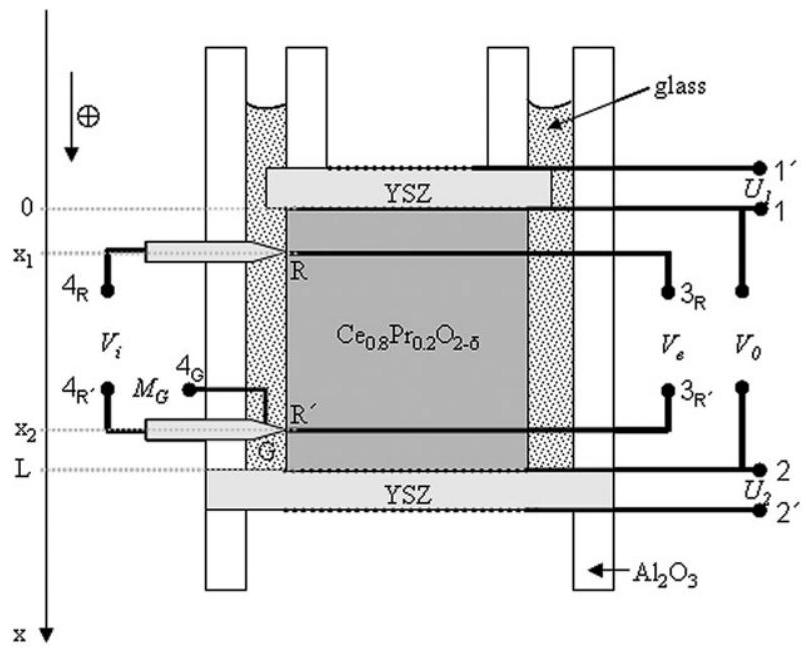
Fig. 1 Schematic of the blocking cell. A porous Pt electrode is represented by a dotted line $(\cdots)$ and a Pt lead by a thick solid line (一). The light grey pins symbolize the local ionic probes made from YSZ. 1, 1', 2, 2' are the current electrodes. $3_{\mathrm{R}}, 3_{\mathrm{R}^{\prime}}$ are local electronic probes. Leads $4_{\mathrm{R}}, 4_{\mathrm{R}^{\prime}}$ and $4_{\mathrm{G}}$ collect the signal from the local ionic probes. $a_{\mathrm{O}_{2}}^{\text {ref }}$ corresponds to the activity of oxygen imposed by the flow of a reference gas ( $\mathrm{O}_{2}$ or $\mathrm{CO} / \mathrm{CO}_{2}$ ) around the cell. The positive current direction ( $\oplus$ ) is defined along the direction of increasing $x$.

ionic probes, made of YSZ, are placed directly opposite to the local electronic probes. These serve as local probes to measure the difference in the electrochemical potential of the oxide ion vacancies $\left(2 F V_{i}=2\left(\eta_{e}^{4 R}-\eta_{e}^{4 R^{\prime}}\right) \approx \eta_{i}^{R^{\prime}}-\eta_{i}^{R}\right.$, see Appendix A) in the direction of the current. It is emphasized that this signal is also free from electrode overpotentials. The distance between positions R and $\mathrm{R}^{\prime}$ was $l=x_{2}-x_{1}=0.66 \pm 0.02 \mathrm{~cm}$.

The charges of transport and partial conductivities are estimated from the applied current $I_{0}$, the signals $V_{e}$ and $V_{i}$ measured at steady state, the distance $l$ between the local probes, and the cross section $A$ of the sample, as:

$$
\begin{aligned}
a_{i}^{*} & =\left(\frac{2 V_{i}}{V_{e}}\right)_{J_{i}=0} \\
a_{e}^{*} & =\left(\frac{V_{e}}{2 V_{i}}\right)_{J_{e}=0} \\
\sigma_{i}^{\prime} & =\left(-\frac{I_{0} l}{V_{i} A}\right)_{J_{e}=0} \\
\sigma_{e}^{\prime} & =\left(-\frac{I_{0} l}{V_{e} A}\right)_{J_{i}=0}
\end{aligned}
$$

in accordance with eqn (15)-(18).
Electrode pairs $\left(1^{\prime}, 1\right)$ and $\left(2,2^{\prime}\right)$ can be used either as oxide ion pumps or as oxygen sensors, when no current is passed through them. Signals $M_{1}$ and $M_{2}$ denote the chemical potential of component oxygen in the sample at positions R and $\mathrm{R}^{\prime}$, respectively, whereas the signal $M_{G}$ is a measure of the chemical potential of oxygen in the glass at position G . Electrode $4_{\mathrm{G}}$ was introduced in order to investigate whether the chemical potential of oxygen in the glass is influencing the signal of the local ionic probe, diverting it from measuring the chemical potential of oxygen within the sample. Finally, $V_{0}$ measures the potential difference across the whole sample.

The difference in the electrochemical potential of the oxide ion vacancies between positions 2 and $1, \eta_{i}^{2}-\eta_{i}^{1}$, can be estimated from a combination of signals $U_{1}, U_{2}$ and $V_{0}$ (see Appendix B):

$$
2 F\left(U_{1}-U_{2}-V_{0}\right)=\eta_{i}^{2}-\eta_{i}^{1}
$$

Making use of the definition of the signal $V_{0}$, given in Table 1, the difference in the electrochemical potential of the electrons between positions 2 and 1 , is: $\eta_{e}^{2}-\eta_{e}^{1}=F V_{0}$. It is therefore possible to have an independent estimate of the ionic charge of transport, $a_{i}^{*}$, using signals $U_{1}, U_{2}$ and $V_{0}$ measured at the steady state of an ion-blocking polarisation process (processes 1 and 3 in Fig. 3a and 4a), from:

$$
a_{i}^{*}=\left(-\frac{2\left(U_{1}-U_{2}-V_{0}\right)}{V_{0}}\right)_{J_{i}=0}
$$

It should be stressed though, that this result may be influenced from electrode overpotentials. Eqn (60) does not hold under electron-blocking conditions, as signals $U_{1}$ and $U_{2}$ are influenced by ohmic losses due to the ionic current passing through the two YSZ discs. These losses will cancel out, to some extent, when subtracting $U_{2}$ from $U_{1}$, but not completely, as their values are not exactly the same (the resistance of each YSZ disc
is different due to different geometrical factor). In addition, signals $U_{1}, U_{2}$ and $V_{0}$ are affected by electrode overpotentials, introducing further complications. Therefore the electronic charge of transport cannot be estimated with sufficient accuracy from a combination of signals $U_{1}, U_{2}$ and $V_{0}$.

The oxygen nonstoichiometry ( $\delta$ ) of the sample can be controlled by driving $\mathrm{O}_{2}$ in or out of the sample through either of the two YSZ electrolyte discs (coulometric titration). At equilibrium, the oxide ion vacancy activity throughout the sample should be uniform and constant over time. This can be verified by a comparison of the signals $U_{1}, U_{2}, M_{1}$ and $M_{2}$. These two criteria were used to evaluate whether equilibration and leak tightness had been achieved.

The cell could be operated both in the electronic blocking mode, when current is passed through the electrodes $1^{\prime}$ and $2^{\prime}$, or in the ionic blocking mode, when current is passed through the electrodes 1 and 2.

## Results and discussion

Measurements were performed at a fixed temperature, $800^{\circ} \mathrm{C}$, at various oxygen partial pressures (or various oxygen nonstoichiometries of the sample), which were controlled by pumping oxygen in or out of the sample by the use of electrode pairs ( $1^{\prime}, 1$ ) and ( $2,2^{\prime}$ ). Sufficiently long time was allowed for equilibration of the sample after each pumping. At equilibrium, the oxygen activity in the sample should be uniform. Achievement of equilibration was therefore evaluated by comparing the activity of oxygen at positions $1, R, R^{\prime}$ and 2 in the sample, as determined from the signals $U_{1}, M_{1}, M_{2}$ and $U_{2}$. Typical equilibration times were in the range $500-2000 \mathrm{~min}$.

A comparison of the oxygen activity at positions $1, \mathrm{R}, \mathrm{R}^{\prime}$ and 2 after equilibration is shown in Fig. 2 for an $a_{\mathrm{O}_{2}}$ ( $\equiv P_{\mathrm{O}_{2}} / \mathrm{atm}$ ) value of 0.1 . The oxygen activity is found to have the same value (within experimental uncertainty) at all positions. Furthermore, the value of the activity of oxygen is observed to remain constant over time, showing good sealing of the sample. The activity of oxygen at the reference electrodes $1^{\prime}$, $4_{\mathrm{R}}, 4_{\mathrm{R}^{\prime}}$ and $2^{\prime}$ was adjusted to either 1 or $\sim 1 \times 10^{-17}$ by flowing $\mathrm{O}_{2}$ or a mixture of $\mathrm{CO} / \mathrm{CO}_{2}$ around the cell, respectively.

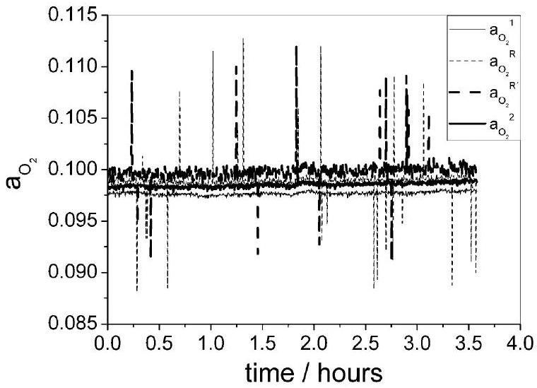
Fig. 2 Oxygen activity at positions $1, R, R^{\prime}$ and 2 in the sample at equilibrium, as determined from the signals $U_{1}, M_{1}, M_{2}$ and $U_{2}$, respectively.

The activity of oxygen prevailing in the glass was determined from the signal $M_{G}$ to be $\sim 1 \times 10^{-6}$ when flowing pure $\mathrm{O}_{2}$ as reference gas. This value was lower than the activity of oxygen at both the reference gas and the sample. The reason for this is not known, but it is speculated that $\mathrm{CO} / \mathrm{CO}_{2}$ (released from the Pt paste and ceramic glue used to construct the cell) might have been trapped in the glass during the initial heating of the cell, determining the value of $a_{\mathrm{O}_{2}}$.

The good agreement between signals $M_{1}, M_{2}, U_{1}$ and $U_{2}$, observed in Fig. 2, indicates that the signal measured by the local ionic probes was not affected by the chemical potential of oxygen prevailing in the glass. Furthermore, the fact that the oxygen activity in the glass is significantly lower than that of the surroundings indicates negligible diffusivity of oxygen through the glass.

After complete equilibration at each oxygen partial pressure, the following measurements were performed: (1) chemical polarisation under ion-blocking conditions, (2) relaxation therefrom, (3) ion-blocking polarisation in reverse direction, (4) relaxation therefrom, (5) chemical polarisation under electron-blocking conditions, (6) relaxation therefrom, (7) electron blocking-polarisation in reverse direction and (8) relaxation therefrom. A constant current in the range $0.05-1 \mathrm{~mA}$ was used in each case.

Two examples of the response of signals $V_{i}$ and $V_{e}$, during each of the transient processes, are presented in Fig. 3 and 4. After the initiation of the current in either mode of operation (ion-blocking or electron-blocking), a sharp increase is observed in the (absolute) values of $V_{i}$ and $V_{e}$ (processes $1,3,5$ and 7),

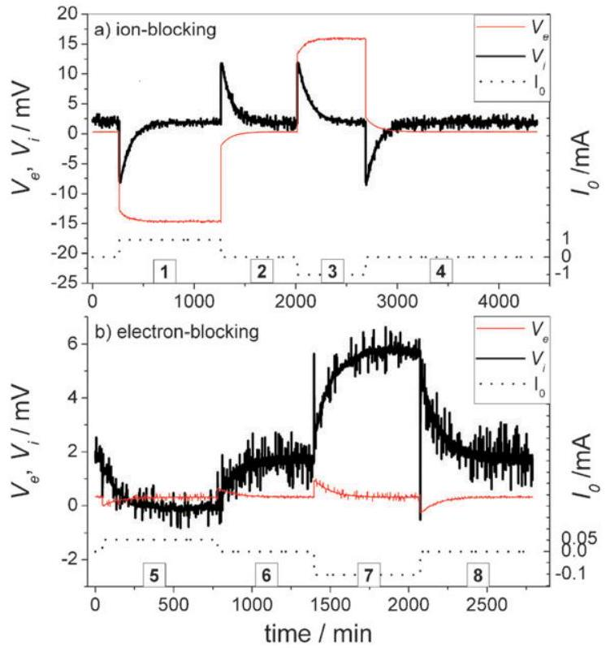
Fig. 3 Response of signals $V_{i}$ and $V_{e}$ during each transient in the (a) ion- and (b) electron-blocking mode. Measurement performed at $a_{\mathrm{O}_{2}} \approx 2 \times 10^{-21}$ using a mixture of $\mathrm{CO} / \mathrm{CO}_{2}$ to impose an oxygen activity of $\mathrm{a}_{\mathrm{O}_{2}}{ }^{\text {ref }} \approx 1 \times 10^{-17}$ at the reference electrodes. Transient processes: 1 chemical polarisation under ion-blocking conditions, 2 relaxation therefrom, 3 ion-blocking polarisation in reverse direction, 4 relaxation therefrom, 5 chemical polarisation under electron-blocking conditions, 6 relaxation therefrom, 7 electron-blocking polarisation in reverse direction and 8 relaxation therefrom.

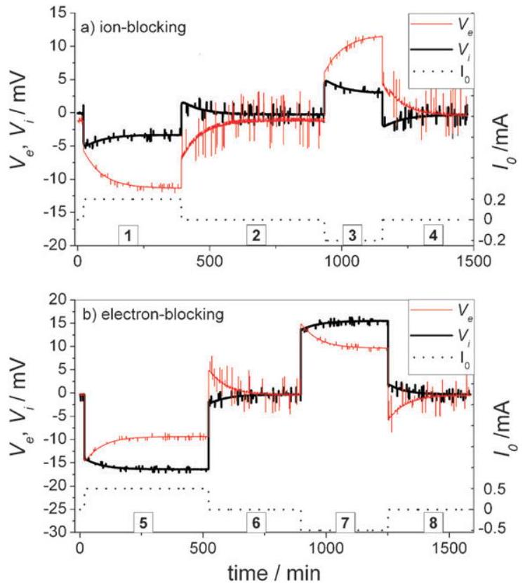
Fig. 4 Response of signals $V_{i}$ and $V_{e}$ during each transient in the (a) ion- and (b) electron-blocking mode. Measurement performed at $a_{\mathrm{O}_{2}} \approx 0.09$ using $\mathrm{O}_{2}$ to impose an oxygen activity of $\mathrm{a}_{\mathrm{O}_{2}}{ }^{\text {ref }}=1$ at the reference electrodes. Transient processes: 1 chemical polarisation under ion-blocking conditions, 2 relaxation therefrom, 3 ionblocking polarisation in reverse direction, 4 relaxation therefrom, 5 chemical polarisation under electron-blocking conditions, 6 relaxation therefrom, 7 electron-blocking polarisation in reverse direction and 8 relaxation therefrom.

as expected since the current is mixed ionic and electronic. In the ion-blocking mode, the (absolute) value of $V_{i}$ (or $V_{e}$ in the electron-blocking mode) decreases towards a finite value, as the ionic current (electronic current) progressively decreases to zero. On the other hand, the (absolute) value of $V_{e}\left(V_{i}\right)$ increases to its steady state value, as the electronic (ionic) current increases, since the polarisation is performed galvanostatically.

In the absence of interference between the ionic and electronic flows, and at steady state, when the ionic (electronic) current is completely blocked, $V_{i}\left(V_{e}\right)$ should become zero as it is directly proportional to the direct driving force for ionic (electronic) transport, $\nabla \eta_{i}\left(\nabla \eta_{e}\right)$. On the other hand, if the interference effect is not negligible, the signal $V_{i}\left(V_{e}\right)$ should reach a finite value different from zero, since the direct driving force now has to counterbalance the driving force due to interference in order to achieve blocking of the ionic (electronic) current at steady state. According to the definition of the positive current direction in Fig. 1 and the definition of signals $V_{i}$ and $V_{e}$ in Table 1, a negative sign of signals $V_{i}$ and $V_{e}$ corresponds to a flow of oxygen vacancies in the positive current direction and a flow of electrons in the negative current direction, corresponding to an ionic and an electronic current in the positive current direction, respectively.

After switching off the current (processes 2, 4, 6 and 8), the sample relaxes from the steady state to equilibrium by means of ambipolar diffusion under the gradient in oxygen activity developed in the sample during the polarisation process.

A small offset can be observed from Fig. 3 and 4 for both signals $V_{i}$ and $V_{e}$, as they are found to deviate from the expected zero value at equilibrium. These offsets are most probably the outcome of temperature gradients in the oven where the cell is placed. The measurement presented at Fig. 3 was performed with a $\mathrm{CO} / \mathrm{CO}_{2}$ mixture as reference gas, whereas $\mathrm{O}_{2}$ was used in order to define the oxygen activity at the reference electrodes in the case of the measurement presented at Fig. 4. Larger offsets were generally observed for the signal $V_{i}$ when using a $\mathrm{CO} / \mathrm{CO}_{2}$ reference gas. This is most probably related to the temperature dependence of the oxygen activity of this gas. In any case, the offsets of signals $V_{i}$ and $V_{e}$ were found to remain approximately constant throughout a measurement (processes 1-4 or 5-8). The measured signals were corrected for the observed offsets in each case and the magnitude of the offset was taken as the uncertainty of the measurement.

It is obvious from Fig. 3a that the ionic current is blocked (steady state of processes 1 and 3) when the direct driving force for ionic transport becomes zero ( $V_{i} \approx 0$ ). This indicates that the interference effect is negligible in this case. A similar observation can be made for the value of $V_{e}$ that is directly proportional to the direct driving force for electronic transport, at the steady state of the electron-blocking polarisation processes 5 and 7 in Fig. 3b. The magnitude of signal $V_{e}$, at the steady state of the ion-blocking polarisation processes 1 and 3 in Fig. 3a, is proportional to the applied current $I_{0}$ and the electronic resistance of the sample under suppressed ionic flux, $R_{e}^{\prime}=l / \sigma_{e}^{\prime} A$, in accordance to eqn (59). Similarly, the magnitude of $V_{i}$, at the steady state of processes 5 and 7 in Fig. 3b, is proportional to $I_{0}$ and the ionic resistance of the sample under suppressed electronic flux, $R_{i}^{\prime}=l / \sigma_{i}^{\prime} A$, in accordance to eqn (58). The relatively small values of signals $V_{e}$ and $V_{i}$ in Fig. 3b are due to the very small applied currents, $I_{0}=0.05 \mathrm{~mA}$ in process 5 and $I_{0}=-0.1 \mathrm{~mA}$ in process 7 . Nevertheless, despite the small signals, the expected transient behaviour can be clearly observed. Small currents were generally applied in order to minimise the chemical polarisation at steady state and in order to limit the measurement in the
linear (ohmic) regime. The ohmic response of the cell can be verified from Fig. 3b, by observing that the signal $V_{i}$ (corrected for the observed offset) doubles when increasing the current by a factor of 2 (from 0.05 mA at process 5 to -0.1 mA at process 7).

A second example of the response of signals $V_{i}$ and $V_{e}$, during each transient process, is presented in Fig. 4. In this case the sample was equilibrated with an oxygen activity of 0.09 prior to initiation of the measurement. Although the behaviour of signals $V_{i}$ and $V_{e}$ is similar to that observed in Fig. 3, at each transient process, there is a striking difference. In Fig. 3, the direct driving force for ionic transport was found to become zero ( $V_{i} \approx 0$ ) when the ionic current was blocked (at the steady state of processes 1 and 3), and similarly for the electronic driving force ( $V_{e} \approx 0$ ) at the steady state of processes 5 and 7 . On the other hand, it can be clearly seen from Fig. 4 that at the steady state of processes 1 and 3, the value of $V_{i}$ is finite, and similarly for the value of $V_{e}$ at the steady state of processes 5 and 7. This is a direct indication of the presence of interference between the ionic and electronic flows. The similar sign of signals $V_{i}$ and $V_{e}$ at steady state, indicates that there is a positive interference between the ionic and electronic flows, e.g. a flow of oxygen vacancies will tend to drag electrons in the same direction. Therefore, during electron-blocking operation and at steady state (processes 5 and 7 in Fig. 4b), a direct driving force for transport of electrons, $V_{e}$, is required that will oppose the driving force due to interference, in order for the electronic current to be blocked. This is achieved when the steady state values of signals $V_{i}$ and $V_{e}$ are reached. Similarly, during ion-blocking operation, a direct driving force for transport of oxygen vacancies, $V_{i}$, is required that will oppose the driving force due to interference, in order for the ionic current to be blocked at steady state (processes 1 and 3 in Fig. 4a).

As discussed in the theoretical section, information on the transport properties of the material can be deduced from both the steady state and transient response of the various signals measured (see Table 1). Table 2 summarises the physical quantities that can be obtained from the analysis of the steady

Table 2 Parameters determined from the analysis of each process/signal. The parameters that are not correlated and can be accurately determined from the analysis of each process/signal are marked bold
| Process | Signal | Parameters | Equations |
| :--- | :--- | :--- | :--- |
| Steady state: ion-blocking | $V_{i}$ and $V_{e}$ | $\boldsymbol{a}_{i}^{*}, \sigma^{\prime}{ }_{e}$ | (56), (59) |
| Steady state: electron-blocking | $V_{i}$ and $V_{e}$ | $\boldsymbol{a}_{e}^{*}, \sigma^{\prime}{ }_{i}$ | (57), (58) |
| Transient: ion-blocking polarisation | $M_{1}$ or $M_{2}$ | $\tilde{\boldsymbol{D}}, a_{i}^{*} / \sigma_{e}^{\prime}$ | (35) |
|  | $V_{i}$ | $\tilde{\boldsymbol{D}},\left(a_{i}^{*}+t_{i}^{*}\right) / \sigma_{e}^{\prime}$ | (39) |
|  | $V_{e}$ | $\tilde{\boldsymbol{D}}, \sigma^{\prime}{ }_{e}, \boldsymbol{t}_{i}^{*} / \sigma^{\prime}{ }_{e}$ | (40) |
| Transient: relaxation from ion-blocking polarisation | $M_{1}$ or $M_{2}$ | $\tilde{\boldsymbol{D}}, a_{i}^{*} / \sigma_{e}^{\prime}$ | (42) |
|  | $V_{i}$ | $\tilde{\boldsymbol{D}},\left(a_{i}^{*}+t_{i}^{*}\right) / \sigma_{e}^{\prime}$ | (43) |
|  | $V_{e}$ | $\tilde{\boldsymbol{D}}, t_{i}^{*} / \sigma_{e}^{\prime}$ | (44) |
| Transient: Electron-blocking polarisation | $M_{1}$ or $M_{2}$ | $\tilde{\boldsymbol{D}}, a_{e}^{*} / \sigma_{i}^{\prime}$ | (45) |
|  | $V_{i}$ | $\tilde{\boldsymbol{D}}, \sigma^{\prime}{ }_{i}, \boldsymbol{t}_{e}^{*} / \sigma^{\prime}{ }_{i}$ | (46) |
|  | $V_{e}$ | $\tilde{\boldsymbol{D}},\left(a_{e}^{*}+t_{e}^{*}\right) / \sigma_{i}^{\prime}$ | (47) |
| Transient: relaxation from electron-blocking polarisation | $M_{1}$ or $M_{2}$ | $\tilde{\boldsymbol{D}}, a_{e}^{*} / \sigma_{i}^{\prime}$ | (48) |
|  | $V_{i}$ | $\tilde{\boldsymbol{D}}, t_{e}^{*} / \sigma_{i}^{\prime}$ | (49) |
|  | $V_{e}$ | $\tilde{\boldsymbol{D}},\left(a_{e}^{*}+t_{e}^{*}\right) / \sigma_{i}^{\prime}$ | (50) |

state and transient response of the various signals during ionor electron-blocking operation of the cell. Signals $U_{1}, U_{2}$ and $V_{0}$ have not been considered as they may suffer from electrode overpotentials.

Parameters $a_{i}^{*}, \sigma_{e}^{\prime}$ and $a_{e}^{*}, \sigma_{i}^{\prime}$ can be obtained from the steady state response of the cell in the ion- and electron-blocking mode of operation, using eqn (56), (59) and eqn (57) and (58), respectively. The value of $\tilde{D}$ can be accurately determined from all the transient responses as it is the only parameter entering the exponential term describing the time dependence of the transient. On the other hand, the pre-exponential factor of most transients includes a combination of two or three parameters, thereby rendering their values highly correlated. There are only two exceptions to this: the transient response of the difference in the electrochemical potential of electrons ( $F V_{e}$ ) during ion-blocking polarisation and the transient of the electrochemical potential of oxygen vacancies $\left(2 F V_{i}\right)$ during electron-blocking polarisation. In these two cases the pre-exponential factor has two well separated terms, allowing for an accurate determination of the values of $\sigma_{e}^{\prime}, t_{i}^{*}$ and $\sigma_{i}^{\prime}, t_{e}^{*}$ respectively. The parameters that can be accurately determined from the analysis of each process/signal are marked bold in Table 2.

The values of $a_{i}^{*}, a_{e}^{*}, \sigma_{i}^{\prime}$ and $\sigma_{e}^{\prime}$, determined from the analysis of the transients, were generally found to scatter by $\sim 50 \%$ around the values determined from the steady state signals of $V_{e}$ and $V_{i}$. In the case of the transients described by eqn (40) and (46), that allow for an accurate determination of the values of $\sigma_{e}^{\prime}, t_{i}^{*}$ and $\sigma_{i}^{\prime}, t_{e}^{*}$, respectively, the fitted $\sigma_{e}^{\prime}$ and $\sigma_{i}^{\prime}$ values were the same, within experimental uncertainty ( $3-16 \%$ ), as those determined from eqn (59) and (58), using the steady-state values of signals $V_{e}$ and $V_{i}$. The steady state response was used here for the determination of $a_{i}^{*}, a_{e}^{*}, \sigma_{i}^{\prime}$ and $\sigma_{e}^{\prime}$, whereas the value of $\tilde{D}$ was obtained from the mean value of all the $\tilde{D}$ estimates arising from the fit of all transients of signals $V_{i}$ and $V_{e}$, using eqn (39), (40), (43), (44), (46), (47), (49) and (50). The standard deviation from the mean value is taken as the uncertainty in the value of $\tilde{D}$.

The ionic and electronic charges of transport are presented as a function of $\log a_{\mathrm{O}_{2}}$ in Fig. 5 and 6, respectively. The

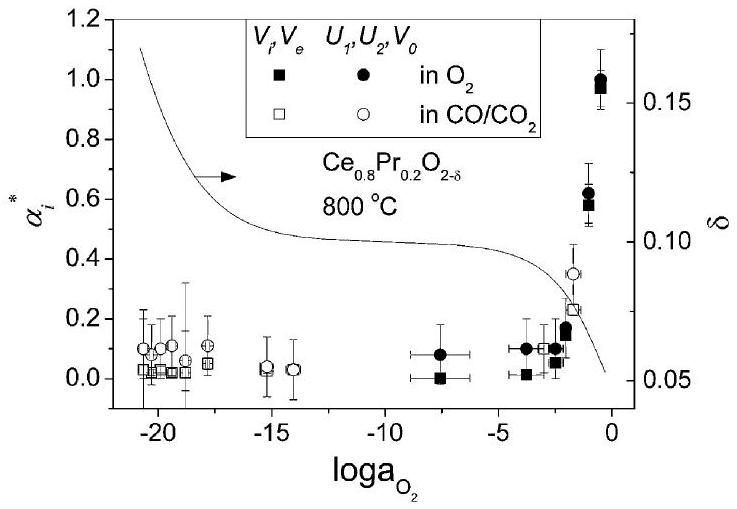
Fig. 5 Oxygen activity dependence of the ionic charge of transport. Measurements were performed using either $\mathrm{O}_{2}(\mathbf{m}, \mathbf{b})$ or $\mathrm{CO} / \mathrm{CO}_{2}$ ( $\square, \bigcirc$ ) as reference gas. The ionic charge of transport was evaluated from eqn (56) using the signals of the local probes $V_{i}, V_{e}(\mathbf{\nabla}, \square)$ or form eqn (61) using signals $U_{1}, U_{2}$ and $V_{0}(\bullet, \bigcirc)$.

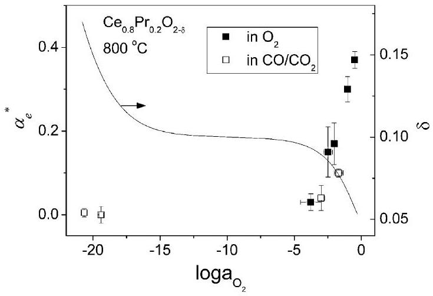
Fig. 6 Oxygen activity dependence of the electronic charge of transport. Measurements were performed using either (■) $\mathrm{O}_{2}$ or ( $\square$ ) $\mathrm{CO} / \mathrm{CO}_{2}$ as reference gas.

measurements of all the Onsager coefficients were carried out while flowing $\mathrm{O}_{2}$ or a mixture of $\mathrm{CO} / \mathrm{CO}_{2}$ around the cell, in order to define the activity of oxygen at the reference electrodes. $\mathrm{O}_{2}$ was used as a reference gas in the $P_{\mathrm{O}_{2}}$ range $1-10^{-8} \mathrm{~atm}$ (at the sample), whereas a mixture of $\mathrm{CO} / \mathrm{CO}_{2}$ was used in the $P_{\mathrm{O}_{2}}$ range $10^{-2}-10^{-21} \mathrm{~atm}$, in order to decrease the driving force for diffusion of oxygen through the glass and the YSZ discs. In the $P_{\mathrm{O}_{2}}$ range $10^{-2}-10^{-8} \mathrm{~atm}$, measurements were carried out both with $\mathrm{O}_{2}$ or $\mathrm{CO} / \mathrm{CO}_{2}$ as reference gas. The obtained results were, within experimental error, independent of the reference gas, as can be seen in Fig. 5 and 6. Both $a_{i}^{*}$ and $a_{e}^{*}$ are far from zero in the $a_{\mathrm{O}_{2}}$ range $10^{-2}-1$, indicating strong interference among the ionic and electronic flows. The ionic and electronic charges of transport are found to decrease with decreasing chemical potential of oxygen, being practically zero in the $a_{\mathrm{O}_{2}}$ range $10^{-21}-10^{-3}$. The ionic charge of transport was evaluated both from eqn (56), using the signals of the local probes $V_{i}, V_{e}$, and form eqn (61), using signals $U_{1}, U_{2}$ and $V_{0}$. As can be seen from Fig. 5 the two results are identical within experimental uncertainty, the results based on the local probes being the most accurate.

The $\log a_{\mathrm{O}_{2}}$ dependence of the oxygen nonstoichiometry of $\mathrm{Ce}_{0.8} \mathrm{Pr}_{0.2} \mathrm{O}_{2-\delta}$ at $800{ }^{\circ} \mathrm{C}$ is also shown on the same figures. ${ }^{20,21}$ It can be observed that the charges of transport decrease towards zero as the oxygen nonstoichiometry approaches the "plateau" region at $\delta=0.1$. As $\delta$ increases from 0.05 to 0.1 , $\mathrm{Pr}^{4+}$ reduces to $\mathrm{Pr}^{3+}$. The electronic conduction in this region is expected to take place via hopping of small polarons at localised $\operatorname{Pr} 4 \mathrm{f}$ electronic states and the electronic conductivity is expected to be proportional to $\left[\operatorname{Pr}_{\mathrm{Ce}}^{\prime}\right]\left[\operatorname{Pr}_{\mathrm{Ce}}^{x}\right]$, since the number of charge carriers (assumed to be small polarons in Pr 4f band) has to be multiplied by the probability of finding an empty state to jump to. Therefore the "effective" concentration of charge carriers is $\left[\operatorname{Pr}_{\mathrm{Ce}}^{\prime}\right]\left[\operatorname{Pr}_{\mathrm{Ce}}^{x}\right]$, which is maximum for $\delta=0.05$ (i.e. when $\left[\operatorname{Pr}_{\mathrm{Ce}}^{\prime}\right]=\left[\operatorname{Pr}_{\mathrm{Ce}}^{x}\right]$ ). Hence, as $\delta$ increases from 0.05 to 0.1 , the concentration of "effective" electronic charge carriers decreases. At the "plateau" region, all $\operatorname{Pr}$ has been reduced to $\mathrm{Pr}^{3+}$ and there are no empty $\operatorname{Pr} 4 \mathrm{f}$ states ( $\operatorname{Pr}^{4+}$ ) remaining. For the interference effect to become apparent, coexistence of both electronic and ionic charge carriers is required. Therefore the effect of interference is expected to decrease as $\delta$ increases from 0.05 to 0.1 . Such a positive correlation between
interference effect and charge carrier concentration is indeed observed to be the case in Fig. 5 and 6. A similar correlation has already been observed in other systems. ${ }^{15,17,18}$

When the oxygen activity decreases below $10^{-15}$ at $800^{\circ} \mathrm{C}$, the oxygen nonstoichiometry of $\mathrm{Ce}_{0.8} \mathrm{Pr}_{0.2} \mathrm{O}_{2-\delta}$ increases again due to reduction of $\mathrm{Ce}^{4+}$ to $\mathrm{Ce}^{3+}$. This leads to an increase in the concentration of n -type electronic charge carriers ( $\mathrm{Ce}^{3+}$ ). For $\mathrm{CeO}_{2-\delta}$, the interference effect has been observed to increase in this region, ${ }^{17}$ but this is not the case for $\mathrm{Ce}_{0.8} \mathrm{Pr}_{0.2} \mathrm{O}_{2-\delta}$. The reason for the different behaviour between $\mathrm{CeO}_{2-\delta}$ and $\mathrm{Ce}_{0.8} \mathrm{Pr}_{0.2} \mathrm{O}_{2-\delta}$ is currently not understood.

It is interesting to note that in $\mathrm{Ce}_{0.8} \mathrm{Pr}_{0.2} \mathrm{O}_{2-\delta}$ both $a_{i}^{*}$ and $a_{e}^{*}$ take appreciable values for $\log a_{\mathrm{O}_{2}}>-2$. In all the systems investigated so far, $a_{e}^{*} \approx 0$, even when $a_{i}^{*}$ was larger than unity. ${ }^{10-12,14,15}$ The systems investigated so far were mainly electronic conductors, whereas in $\mathrm{Ce}_{0.8} \mathrm{Pr}_{0.2} \mathrm{O}_{2-\delta}$ the ionic mobility is only one order of magnitude lower than the electronic mobility at $800{ }^{\circ} \mathrm{C}$. The interference effect can therefore clearly be observed under either ion- or electronblocking conditions. In that sense, pure or acceptor doped ceria provides a good framework for the investigation of the interference effect, because of the similar magnitude of $\sigma_{i}$ and $\sigma_{e}$ and because of the large concentration of defects that it can accommodate in its structure.

The electronic and ionic conductivity of the sample, under suppressed flow of ions or electrons, $\sigma_{e}^{\prime}$ or $\sigma_{i}^{\prime}$, were estimated from the steady-state values of signals $V_{e}$ and $V_{i}$, under ion- or electron-blocking operation of the cell, using eqn (59) or (58), respectively. The partial conductivities, $\sigma_{e}$ and $\sigma_{i}$, can be estimated from eqn (25), when the quantities $a_{i}^{*}, a_{e}^{*}, \sigma_{e}^{\prime}$ and $\sigma_{i}^{\prime}$ are known. These are plotted in Fig. 7a as a function of the oxygen activity.

The ionic conductivities, $\sigma_{i}^{\prime}$ and $\sigma_{i}$, are observed to remain approximately constant throughout the entire $\delta$ range investigated. $\sigma_{i}^{\prime}$ is somewhat larger than $\sigma_{i}$ for $\log a_{\mathrm{O}_{2}}>-3$, when the interference effect is significant, as expected from eqn (13) and (15). The concentration of oxygen vacancies increases and the interference effect decreases with decreasing oxygen activity. The ionic conductivities, $\sigma_{i}^{\prime}$ and $\sigma_{i}$, should therefore increase with decreasing oxygen activity if the ionic mobility remained constant. The fact that $\sigma_{i}^{\prime}$ and $\sigma_{i}$ are
observed to decrease slightly indicates that the mobility of the oxygen vacancies decreases with decreasing oxygen activity or increasing oxygen nonstoichiometry. This finding agrees with the generally observed oxygen nonstoichiometry dependence of the ionic mobility in acceptor doped ceria, ${ }^{28-30}$ where the ionic mobility is found to pass through a maximum at an oxygen vacancy concentration of $\sim 3 \%$ ( $\delta \approx 0.06$ ).

The electronic conductivity is observed to go through a minimum at $\log a_{\mathrm{O}_{2}} \approx-9$. It can be seen that $\sigma_{e}^{\prime}$ is significantly larger than $\sigma_{e}$ for $\log a_{\mathrm{O}_{2}}>-3$, when the interference effect is large, as expected from eqn (14) and (16). The n-type branch exhibits a slope of $-1 / 4.5$, close to the $-1 / 4$ slope expected for acceptor doped ceria, based on the $a_{\mathrm{O}_{2}}$ dependence of the concentration of electronic charge carriers. At the p-type branch, $\sigma_{e}^{\prime}$ is found to exhibit a slope of $1 / 4$, whereas a slope of $\sim 1 / 6$ is found for $\sigma_{e}$. It is difficult to predict what the slope should be in this case due to the non-ideal defect chemistry of the material in this $a_{\mathrm{O}_{2}}$ range $^{21}$ and the interference effect dependence of the values of $\sigma_{e}^{\prime}$ and $\sigma_{e}$.

A comparison of the relative difference of the quantities $\sigma_{k}^{\prime}$ and $\sigma_{k}$ is presented in Fig. 7b. As mentioned in the theoretical section, the partial ionic or electronic conductivity under suppressed electronic or ionic flow respectively, $\sigma_{k}^{\prime}$, as defined by eqn (15) and (16), are expected to be identical to the partial conductivities, $\sigma_{k}$, defined from eqn (13) and (14) when the interference effect is negligible, but $\sigma_{k}^{\prime}$ may be significantly different from $\sigma_{k}$ in the case of non-negligible interference. The relative difference, $\left(\sigma_{k}^{\prime}-\sigma_{k}\right) / \sigma_{k}$, provides a direct measure of the relative error in the determination of the partial conductivity estimated by a Hebb-Wagner polarisation experiment under the assumption of negligible interference. This is shown in Fig. 7b as a function of the oxygen activity. It can be seen that when the magnitude of the cross coefficient is similar to that of the direct coefficients (see Fig. 8), in the $a_{\mathrm{O}_{2}}$ range $10^{-2}-1$, the relative difference is very significant. Measuring $\sigma_{e}^{\prime}$ with an ion-blocking cell and assuming $\sigma_{e}=\sigma_{e}^{\prime}$ (i.e. neglecting the interference effect) would result in overestimating $\sigma_{e}$ by more than $100 \%$ for $\log a_{\mathrm{O}_{2}}>-1$. Further subtracting the overestimated $\sigma_{e}$ value from the total conductivity $\sigma$, defined by eqn (10), in order to estimate the partial ionic conductivity, $\sigma_{i}$, would result in a significant underestimation of the partial

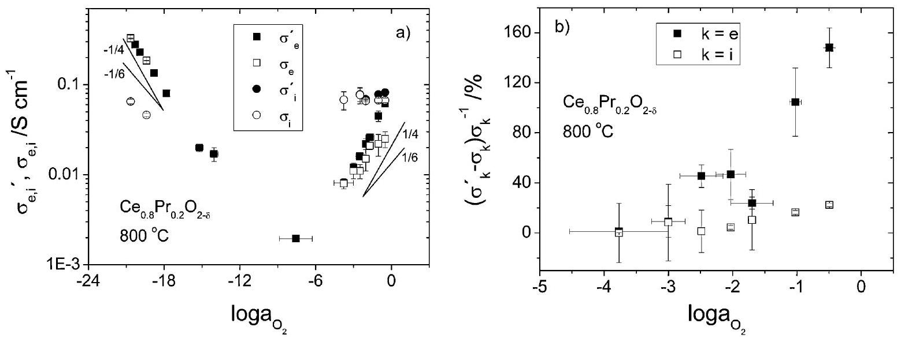
Fig. 7 (a) Oxygen activity dependence of the electronic and ionic conductivity under suppressed flow of ions and electrons, respectively, $\sigma_{e}^{\prime}$ and $\sigma_{i}^{\prime}$, and of the partial electronic and ionic conductivities, $\sigma_{e}$ and $\sigma_{i}$. (b) Oxygen activity dependence of $\left(\sigma_{k}^{\prime}-\sigma_{k}\right) / \sigma_{k}$.

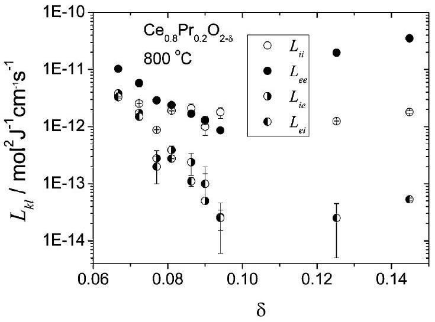
Fig. 8 Oxygen nonstoichiometry dependence of the Onsager coefficients of transport.

ionic conductivity. In the present case, at $\log a_{\mathrm{O}_{2}}=-1$, the value of $\sigma_{i}$ would be underestimated by $\sim 35 \%$. It is clear that in the event of non-negligible interference, measuring the total conductivity and one of the partial conductivities under suppressed flow of the parallel charge carriers is not enough to reveal the true transport properties of the material, and the assumption of negligible interference can lead to very erroneous results.

Knowledge of $a_{i}^{*}, a_{e}^{*}, \sigma_{e}^{\prime}$ and $\sigma_{i}^{\prime}$ can yield all the Onsager coefficients of transport, $L_{k l}$, by solving the system of eqn (3), (4), (15) and (16). These are plotted together in Fig. 8, as estimated for $\mathrm{Ce}_{0.8} \mathrm{Pr}_{0.2} \mathrm{O}_{2-\delta}$ at $800{ }^{\circ} \mathrm{C}$, as a function of the oxygen nonstoichiometry. $L_{i i}$ is observed to remain approximately constant throughout the entire $\delta$ range investigated. $L_{e e}$ initially decreases with increasing oxygen nonstoichiometry up to $\delta=0.1$ and then increases again. This is due to decreasing concentration of "effective" electronic charge carriers $\left(\left[\operatorname{Pr}_{\mathrm{Ce}}^{\prime}\right]\left[\operatorname{Pr}_{\mathrm{Ce}}^{x}\right]\right)$ when approaching $\delta=0.1$ and increasing concentration of n -type electronic charge carriers ( $\left[\mathrm{Ce}^{\prime}{ }_{\mathrm{Ce}}\right]$ ) for $\delta>0.1$. The cross coefficients, $L_{e i}$ and $L_{i e}$, are of the same magnitude as the diagonal terms at small $\delta$, but decrease rapidly (by two orders of magnitude) as $\delta$ approaches 0.1 . For $\delta>0.1$ the cross coefficients remain two or three orders of magnitude smaller than $L_{i i}$ or $L_{e e}$, respectively.

The Onsager cross coefficients of transport, $L_{e i}$ and $L_{i e}$, have been determined independently in this study. According to the Onsager reciprocity relation, ${ }^{1,2,16,22}$ eqn (2), these coefficients should be equal. This constraint, which was recently verified experimentally with very high precision, ${ }^{14}$ can be used in order to test the validity of the obtained results. $L_{i e}$ is plotted against $L_{e i}$ in Fig. 9. The experimental data can be seen to lie very close to the straight line, which corresponds to unity slope and zero intercept.

When the local ionisation equilibrium was introduced, eqn (6), the assumption that $\nabla \mu_{O_{O}^{x}} \approx 0$ was made for the regular structure element $O_{O}^{x}$. The validity of this assumption is very important as it is also used when estimating the difference in the electrochemical potential of the oxide ion vacancies from the signal $V_{i}$ (Appendix A), as well as from signals $U_{1}, U_{2}$ and $V_{0}$ (Appendix B ). The magnitude of $\Delta \mu_{O_{O}^{x}}=\mu_{O_{O}^{x}}^{R^{\prime}}-\mu_{O_{O}^{x}}^{R}=R T \ln \left(c_{O_{O}^{x}}^{R^{\prime}} / c_{O_{O}^{x}}^{R}\right)$ can be evaluated from the knowledge of the defect chemistry of the material and the

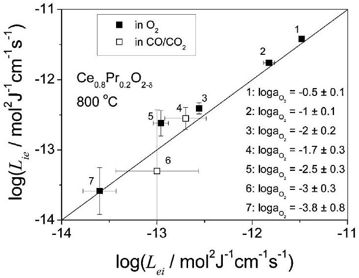
Fig. 9 Relation among the Onsager cross coefficients of transport.

oxygen activity prevailing at positions R and $\mathrm{R}^{\prime}$ (see Fig. 1), which can be estimated from the signals $M_{1}$ and $M_{2}$, respectively (see Table 1). It was found that $\nabla \mu_{O_{O}^{x}}$ is generally negligible. Its value would influence the estimation of $\Delta \eta_{i}$ by $\sim 1 \%$ for $\log a_{\mathrm{O}_{2}}>-3$ where the interference effect was found to be significant. The value of $\nabla \mu_{O_{O}^{x}}$ becomes comparable to the value of $\Delta \eta_{i}$, estimated from the steady state values of signals $V_{i}$ or $U_{1}, U_{2}$ and $V_{0}$, in the ion-blocking mode of operation, when the interference effect is negligible and therefore $\Delta \eta_{i} \approx 0$ as well. It can therefore be concluded that the assumption $\nabla \mu_{O_{O}^{x}} \approx 0$ holds and bears no influence to the estimation of the charges of transport.

The value of the chemical diffusion coefficient, $\tilde{D}$, was obtained from fitting the transient response of signals $V_{i}, V_{e}$, $M_{1}$ and $M_{2}$, using eqn (35), (39), (40) and (42)-(50). An example of the fit to the transient response of signals $V_{e}$ and $V_{i}$ during an ion-blocking polarisation is shown in Fig. 10. Good agreement was generally observed between the obtained values of $\tilde{D}$ arising from the various transient processes/signals. The value of $\tilde{D}$ at each $a_{\mathrm{O}_{2}}$ was obtained by taking the mean value of all the $\tilde{D}$ estimates arising from the fit of all transients of signals $V_{e}$ and $V_{i}$. The typical scattering range of $\tilde{D}$ was $1-10 \%$.

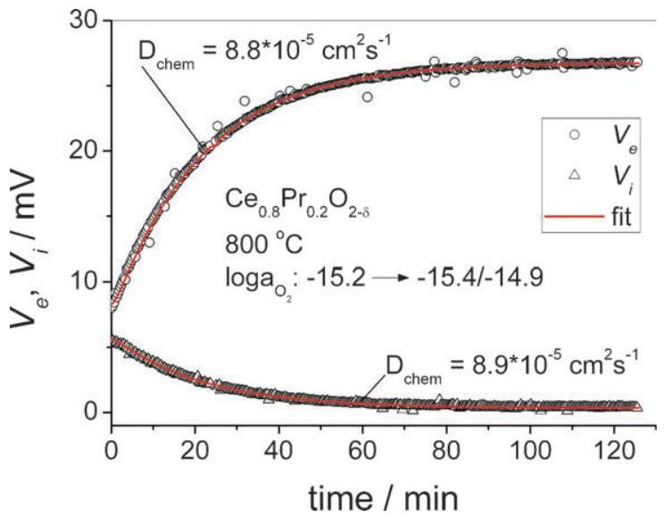
Fig. 10 Fit of the polarisation transients of signals $V_{e}$ and $V_{i}$ in the ion-blocking mode of operation. At equilibrium, $\log a_{\mathrm{O}_{2}}=-15.2$. At steady state the chemical polarisation corresponds to $\log a_{\mathrm{O}_{2}}$ values between the local probes of -15.4 and -14.9 .

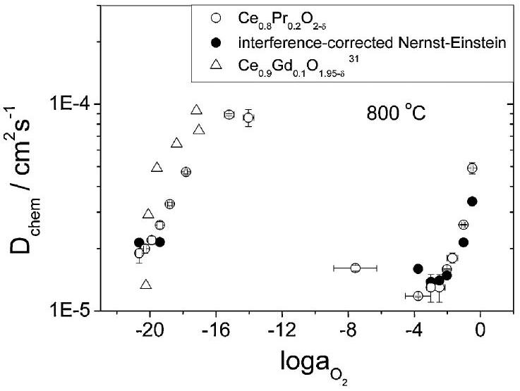
Fig. 11 Oxygen activity dependence of the chemical diffusion coefficient of $\mathrm{Ce}_{0.8} \mathrm{Pr}_{0.2} \mathrm{O}_{2-\delta}$, determined from the transient response of signals $V_{e}$ and $V_{i}$, or calculated from the interference-effect-corrected Nernst-Einstein relation, eqn (51). Values for $\mathrm{Ce}_{0.9} \mathrm{Gd}_{0.1} \mathrm{O}_{1.95-\delta}{ }^{31}$ are also shown for comparison.

The $\log a_{\mathrm{O}_{2}}$ dependence of the chemical diffusion coefficient is presented in Fig. 11. $\tilde{D}$ was found to decrease rapidly with decreasing $a_{\mathrm{O}_{2}}$ in the range $1-10^{-4}$. Further decreasing the $a_{\mathrm{O}_{2}}$, results in an increase of $\tilde{D}$ by at least one order of magnitude, which then decreases again for $a_{\mathrm{O}_{2}}$ values below $10^{-15}$. The complex dependence of $\tilde{D}$ on $a_{\mathrm{O}_{2}}$ can be rationalised if one considers the $a_{\mathrm{O}_{2}}$ dependence of the thermodynamic factor $\left(\gamma_{\mathrm{V}}\right)$ and of the function $\pi\left(L_{k l}\right)$ (defined in eqn (51)), shown in Fig. 12. In the $a_{\mathrm{O}_{2}}$ range $10^{-4}-1, \gamma_{\mathrm{V}}$ increases slowly, whereas $\pi\left(L_{k l}\right)$ decreases rapidly, causing the observed rapid decrease of $\tilde{D}$. For $10^{-10}<a_{\mathrm{O}_{2}}<10^{-4}, \gamma_{\mathrm{v}}$ increases by more than one order of magnitude, whereas $\pi\left(L_{k l}\right)$ is expected to decrease only slightly, because of the decreasing value of $L_{e e} . \tilde{D}$ is therefore observed to increase. Finally, for $10^{-20}<a_{\mathrm{O}_{2}}<10^{-15}$, although $\pi\left(L_{k l}\right)$ increases, the decrease of $\gamma_{\mathrm{V}}$ by one order of magnitude and the increase of $c_{\mathrm{V}}$, result in a decreasing $\tilde{D}$.

The value of the chemical diffusion coefficient has also been calculated from the interference-effect-corrected Nernst-Einstein relation, eqn (51), using values for the Onsager coefficients of transport estimated from the steady state response of the cell and values for the thermodynamic factor and oxygen vacancy

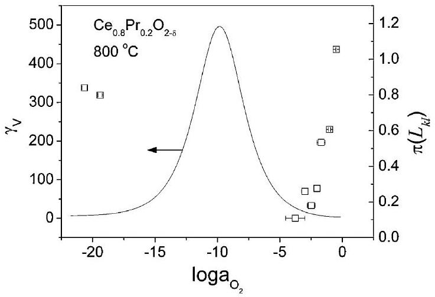
Fig. 12 Oxygen activity dependence of the thermodynamic enhancement factor, $\gamma_{\mathrm{V}}$, and of the function $\pi\left(L_{k l}\right)$ for $\mathrm{Ce}_{0.8} \operatorname{Pr}_{0.2} \mathrm{O}_{2-\delta}$ at $800^{\circ} \mathrm{C}$.

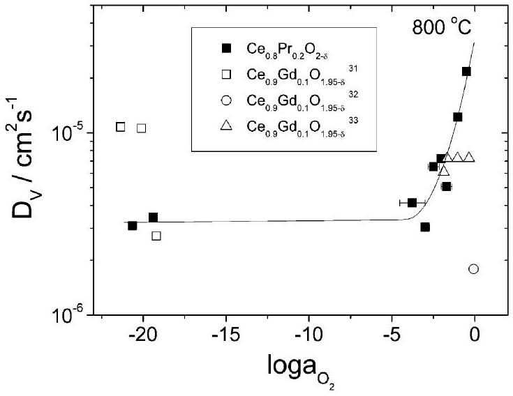
Fig. 13 Oxygen activity dependence of the vacancy diffusion coefficient of $\mathrm{Ce}_{0.8} \mathrm{Pr}_{0.2} \mathrm{O}_{2-\delta}$ and $\mathrm{Ce}_{0.9} \mathrm{Gd}_{0.1} \mathrm{O}_{1.95-\delta}$. ${ }^{31-33}$ The plotted line that passes through the $\mathrm{Ce}_{0.8} \mathrm{Pr}_{0.2} \mathrm{O}_{2-\delta}$ data is intended to serve as a guide to the eye.

concentration. ${ }^{20,21}$ Very good agreement is observed between the calculated values of $\tilde{D}$ and those determined from the fitting of the transient response of signals $V_{e}$ and $V_{i}$. The $a_{\mathrm{O}_{2}}$ dependence of the chemical diffusion coefficient of $\mathrm{Ce}_{0.9} \mathrm{Gd}_{0.1} \mathrm{O}_{1.9-\delta},{ }^{31}$ also plotted in Fig. 11 for comparison, is very similar to that of $\mathrm{Ce}_{0.8} \mathrm{Pr}_{0.2} \mathrm{O}_{2-\delta}$. It decreases by an order of magnitude in the $a_{\mathrm{O}_{2}}$ range $10^{-17}-10^{-20}$. This should again be attributed to a decreasing thermodynamic factor.

The vacancy diffusion coefficient, $D_{\mathrm{V}}$, can be estimated from the chemical diffusion coefficient, $\gamma_{\mathrm{V}}$ and $\pi\left(L_{k l}\right)$ by making use of eqn (55). $D_{\mathrm{V}}$ is plotted as a function of $\log a_{\mathrm{O}_{2}}$ in Fig. 13 for $\mathrm{Ce}_{0.8} \mathrm{Pr}_{0.2} \mathrm{O}_{2-\delta}$ at $800{ }^{\circ} \mathrm{C}$ and compared to that of $\mathrm{Ce}_{0.9} \mathrm{Gd}_{0.1} \mathrm{O}_{1.95-\delta}$. ${ }^{31-33}$ The $D_{\mathrm{V}}$ of $\mathrm{Ce}_{0.8} \mathrm{Pr}_{0.2} \mathrm{O}_{2-\delta}$, which is a measure of the mobility of the oxide ion vacancies, is found to decrease by more than half an order of magnitude with decreasing $a_{\mathrm{O}_{2}}$ in the range $10^{-4}-1$. For $a_{\mathrm{O}_{2}}<10^{-4}$ it remains approximately constant and equal to $3 \times 10^{-6} \mathrm{~cm}^{2} \mathrm{~s}^{-1}$. The $D_{\mathrm{V}}$ of $\mathrm{Ce}_{0.9} \mathrm{Gd}_{0.1} \mathrm{O}_{1.95-\delta}$ at $800{ }^{\circ} \mathrm{C}$ is of the same order of magnitude as that of $\mathrm{Ce}_{0.8} \mathrm{Pr}_{0.2} \mathrm{O}_{2-\delta}$, but the significant scattering of the literature values ${ }^{31-33}$ by one order of magnitude doesn't allow one to draw a clear conclusion on the $\log a_{\mathrm{O}_{2}}$ dependence.

## Conclusion

The development of an electrochemical cell, where local ionic and electronic probes were used in a four probe configuration, allowed us to experimentally determine all the Onsager coefficients of transport for $\mathrm{Ce}_{0.8} \mathrm{Pr}_{0.2} \mathrm{O}_{2-\delta}$ within the $a_{\mathrm{O}_{2}}$ range $10^{-21}-1$ at $800^{\circ} \mathrm{C}$. The interference between the ionic and electronic flows was found to be very significant for oxygen activities between $10^{-3}$ and 1 . This is in contrast to the commonly stated assumption of independent migration of the two types of charge carriers. A positive correlation between the magnitude of the interference effect and the concentration of charge carriers was observed, as the interference effect was found to decrease as the oxygen nonstoichiometry of $\mathrm{Ce}_{0.8} \mathrm{Pr}_{0.2} \mathrm{O}_{2-\delta}$ approached the near-stoichiometric region at $\delta=0.1$. It was demonstrated, that the assumption of negligible interference, when not true, can lead to very erroneous
results with respect to the estimation of the partial conductivities. Measuring $\sigma_{e}^{\prime}$ with an ion-blocking cell and assuming $\sigma_{e}=\sigma_{e}^{\prime}$ (i.e. neglecting the interference effect) would result in overestimating $\sigma_{e}$ by more than $100 \%$ for $\log a_{\mathrm{O}_{2}}>-1$. The Onsager reciprocity relation was verified experimentally with high precision.

The chemical diffusion coefficient was determined as a function of $a_{\mathrm{O}_{2}}$ from the fitting of the transient response of the cell during the chemical polarisation/relaxation under ion- and electron-blocking conditions. The chemical diffusion coefficient estimated from the transients was found to be in very good agreement with the one estimated from the interference-effect-corrected Nernst-Einstein relation, using the transport parameters determined from the steady state response of the cell and the defect chemistry of the material. The vacancy diffusion coefficient was also estimated and found to decrease by more than half an order of magnitude with decreasing $a_{\mathrm{O}_{2}}$ in the range $10^{-4}-1$ and to attain a value of $\sim 3 \times 10^{-6} \mathrm{~cm}^{2} \mathrm{~s}^{-1}$ for $a_{\mathrm{O}_{2}}<10^{-4}$.

## Appendix A

Consider the hypothetical circuit $4 \mathrm{R} \rightarrow 3 \mathrm{R} \rightarrow 3 \mathrm{R}^{\prime} \rightarrow 4 \mathrm{R}^{\prime} \rightarrow$ 4 R in Fig. 1. In this, the potential difference $V_{i}$ equals:

$$
\begin{aligned}
V_{i} & =\frac{1}{F}\left(\eta_{e}^{4 R}-\eta_{e}^{4 R^{\prime}}\right)=\frac{1}{F}\left(\eta_{e}^{4 R}-\eta_{e}^{3 R}+\eta_{e}^{3 R}-\eta_{e}^{3 R^{\prime}}+\eta_{e}^{3 R^{\prime}}-\eta_{e}^{4 R^{\prime}}\right) \\
& =\frac{1}{2 F}\left(\mu_{O}^{R}-\mu_{O}^{\mathrm{ref}}\right)+\frac{1}{F}\left(\eta_{e}^{R}-\eta_{e}^{R^{\prime}}\right)+\frac{1}{2 F}\left(\mu_{O}^{r e f}-\mu_{O}^{R^{\prime}}\right) \\
& =\frac{1}{2 F}\left(\mu_{O}^{R}-\mu_{O}^{R^{\prime}}\right)+\frac{1}{F}\left(\eta_{e}^{R}-\eta_{e}^{R^{\prime}}\right) \\
& \Rightarrow 2 F V_{i}=\eta_{i}^{R^{\prime}}-\eta_{i}^{R}-\left(\mu_{O_{O}^{x}}^{R^{\prime}}-\mu_{O_{O}^{x}}^{R}\right) \\
& \Rightarrow 2 F V_{i} \approx \eta_{i}^{R^{\prime}}-\eta_{i}^{R}
\end{aligned}
$$

## Appendix B

Based on the definition of signals $U_{1}, U_{2}$ and $V_{0}$, given in Table 1, we can write:

$$
\begin{aligned}
2 F\left(U_{1}-U_{2}-V_{0}\right) & =2\left(\eta_{e}^{1^{\prime}}-\eta_{e}^{1}\right)-2\left(\eta_{e}^{2^{\prime}}-\eta_{e}^{2}\right)-2\left(\eta_{e}^{2}-\eta_{e}^{1}\right) \\
& =-\left(\mu_{O}^{r e f}-\mu_{O}^{1}\right)+\left(\mu_{O}^{r e f}-\mu_{O}^{2}\right)-2\left(\eta_{e}^{2}-\eta_{e}^{1}\right) \\
& =-\left(\mu_{O}^{2}-\mu_{O}^{1}\right)-2\left(\eta_{e}^{2}-\eta_{e}^{1}\right) \\
& =\eta_{i}^{2}-\eta_{i}^{1}-\left(\mu_{O_{O}^{x}}^{2}-\mu_{O}^{1}\right) \approx \eta_{i}^{2}-\eta_{i}^{1} \\
& \Rightarrow 2 F\left(U_{1}-U_{2}-V_{0}\right) \approx \eta_{i}^{2}-\eta_{i}^{1}
\end{aligned}
$$

## Acknowledgements

Financial support from the Danish Council for Strategic Research, the Danish Natural Science Research Council and the Basic Research Programme (Grant No. R01-2006-000-10494-0) of the Korean Science and Engineering Foundation is gratefully acknowledged.

## References

1 S. R. de Groot and P. Mazur, Non-Equilibrium Thermodynamics, North-Holland, Amsterdam, 1962, ch. 6.
2 A. R. Allnatt and A. B. Lidiard, Atomic Transport in Solids, Cambridge University Press, Cambridge, UK, 1993, ch. 4 and 5.
3 D. Kondepudi and I. Prigogine, Modern Thermodynamics: From Heat Engines to Dissipative Structures, Wiley, West Sussex, UK, 1998, ch. 16.
4 S. Miyatani, Solid State Commun., 1981, 38, 257.
5 F. Morin, J. Electrochem. Soc., 1979, 126, 760.
6 N. Ait-Younes, F. Millot and P. Gerdanian, Solid State Ionics, 1984, 12, 431.
7 F. Millot and P. Gerdanian, J. Phys. Chem. Solids, 1982, 43, 507.
8 G. W. Castellan, Physical Chemistry, The Benjamin/Cummings Publishing Company Inc., Reading MA, 3rd edn, 1983, p. 771.
9 H.-I. Yoo, Key Eng. Mater., 1997, 125-126, 331.
10 H.-I. Yoo and M. Martin, Ceram. Trans., 1991, 24, 103.
11 J.-H. Lee and H.-I. Yoo, J. Electrochem. Soc., 1994, 141, 2789.

12 K.-C. Lee and H.-I. Yoo, Solid State Ionics, 1996, 86-88, 757.

13 J.-O. Hong and H.-I. Yoo, J. Mater. Res., 2002, 17, 1213.
14 D.-K. Lee and H.-I. Yoo, Phys. Rev. Lett., 2006, 97, 255901.
15 D.-K. Lee and H.-I. Yoo, Phys. Rev. B: Condens. Matter Mater. Phys., 2007, 75, 235110.
16 L. Onsager, Phys. Rev., 1931, 37, 405.
17 W.-S. Park, I. Yang and H.-I. Yoo, ECS Trans., 2008, 13, 327.
18 H.-I. Yoo and J.-H. Lee, J. Phys. Chem. Solids, 1996, 57, 65.
19 H. Yoo and D.-K. Lee, Solid State Ionics, 2008, 179, 837.
20 C. Chatzichristodoulou, P. V. Hendriksen, A. Hagen and J. C. Grivel, ECS Trans., 2008, 13, 347.

21 C. Chatzichristodoulou and P. V. Hendriksen, J. Electrochem. Soc., 2010, 157, B481-B489.
22 H.-I. Yoo, H. Schmalzried, M. Martin and J. Janek, Z. Phys. Chem. NF, 1990, 168, 129.
23 S. R. de Groot, Thermodynamics of Irreversible Processes, North Holland, Amsterdam, 1951.
24 K.-C. Lee and H.-I. Yoo, J. Phys. Chem. Solids, 1999, 60, 911.
25 C. Wagner, Prog. Solid State Chem., 1975, 10, 3-16.
26 H.-I. Yoo, J.-H. Lee, M. Martin and J. Janek, Solid State Ionics, 1994, 67, 317.
27 C. Chatzichristodoulou, P. V. Hendriksen and A. Hagen, J. Electrochem. Soc., 2010, 157, B299-B307.

28 J. Faber, C. Geoffroy, A. Roux, A. Sylvestre and P. Abélard, Appl. Phys. A: Mater. Sci. Process., 1989, 49, 225-232.
29 D. K. Hohnke, Solid State Ionics, 1981, 5, 531-534.
30 M. Mogensen, T. Lindegaard and U. R. Hansen, J. Electrochem. Soc., 1994, 141, 2122-2128.
31 K. Yashiro, S. Onuma, A. Kaimai, Y. Nigara, T. Kawada, J. Mizusaki, K. Kawamura, T. Horita and H. Yokokawa, Solid State Ionics, 2002, 152-153, 469-476.
32 J. A. Lane and J. A. Kilner, Solid State Ionics, 2000, 136-137, 927-932.
33 J. Sirman and J. A. Kilner, Proc. of the 17th Riso International Symposium on Material Science, ed. F. W. Poulsen, N. Bonanos, S. Linderoth, M. Mogensen and B. Zachau-Christiansen, Roskilde, Denmark, 1996, p. 417.

[^0]:    ${ }^{a}$ Fuel Cells and Solid State Chemistry Division,
    Riso National Laboratory for Sustainable Energy,
    Technical University of Denmark, Frederiksborgvej 399, DK-4000
    Roskilde, Denmark. E-mail: ccha@risoe.dtu.dk
    ${ }^{b}$ Niels Bohr Institute, University of Copenhagen, Blegdamsvej 17, DK-2100 Copenhagen, Denmark
    ${ }^{c}$ Solid State Ionics Research Lab., School of Materials Science and Engineering, Seoul National University, Seoul 151-744, Korea.
    E-mail: hiyoo@snu.ac.kr

